# Opinion Poll by Mediana for POP TV, 1–25 November 2020

<a href="#voting-intentions">Voting Intentions</a> | <a href="#seats">Seats</a> | <a href="#coalitions">Coalitions</a> | <a href="#technical-information">Technical Information</a>

## Voting Intentions

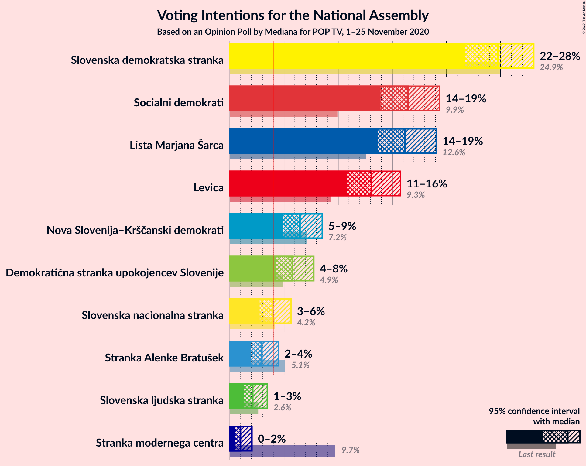

### Confidence Intervals

| Party | Last Result | Poll Result | 80% Confidence Interval | 90% Confidence Interval | 95% Confidence Interval | 99% Confidence Interval |
|:-----:|:-----------:|:-----------:|:-----------------------:|:-----------------------:|:-----------------------:|:-----------------------:|
| Slovenska demokratska stranka | 24.9% | 24.8% | 22.8–26.9% |22.2–27.5% |21.7–28.1% |20.8–29.1% |
| Socialni demokrati | 9.9% | 16.5% | 14.8–18.4% |14.3–18.9% |13.9–19.4% |13.1–20.3% |
| Lista Marjana Šarca | 12.6% | 16.2% | 14.5–18.1% |14.1–18.6% |13.6–19.1% |12.9–20.0% |
| Levica | 9.3% | 13.1% | 11.6–14.8% |11.2–15.3% |10.8–15.8% |10.1–16.6% |
| Nova Slovenija–Krščanski demokrati | 7.2% | 6.5% | 5.4–7.8% |5.1–8.2% |4.9–8.5% |4.4–9.2% |
| Demokratična stranka upokojencev Slovenije | 4.9% | 5.8% | 4.8–7.1% |4.5–7.4% |4.3–7.7% |3.9–8.4% |
| Slovenska nacionalna stranka | 4.2% | 3.9% | 3.1–5.0% |2.9–5.4% |2.7–5.6% |2.4–6.2% |
| Stranka Alenke Bratušek | 5.1% | 3.0% | 2.3–3.9% |2.1–4.2% |1.9–4.5% |1.7–5.0% |
| Slovenska ljudska stranka | 2.6% | 2.1% | 1.6–3.0% |1.4–3.2% |1.3–3.5% |1.1–3.9% |
| Stranka modernega centra | 9.7% | 1.0% | 0.6–1.7% |0.5–1.8% |0.5–2.0% |0.4–2.4% |

*Note:* The poll result column reflects the actual value used in the calculations. Published results may vary slightly, and in addition be rounded to fewer digits.

## Seats

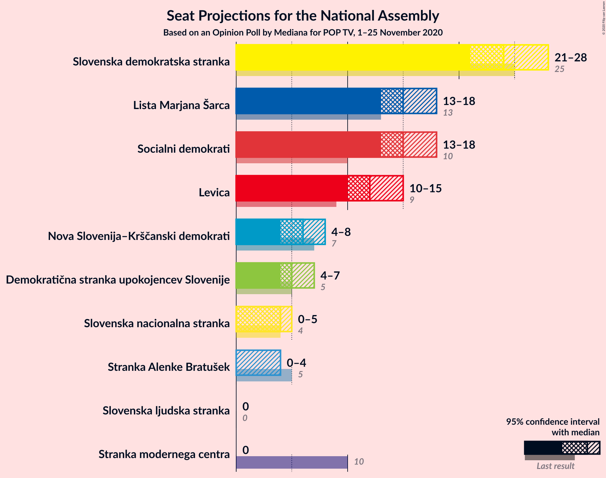

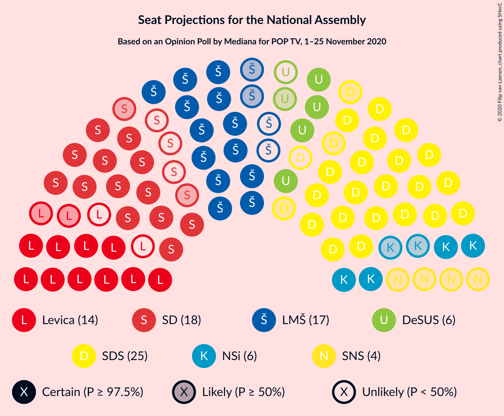

### Confidence Intervals

| Party | Last Result | Median | 80% Confidence Interval | 90% Confidence Interval | 95% Confidence Interval | 99% Confidence Interval |
|:-----:|:-----------:|:------:|:-----------------------:|:-----------------------:|:-----------------------:|:-----------------------:|
| <a href="#slovenska-demokratska-stranka">Slovenska demokratska stranka</a> | 25 | 24 | 22–26 |21–27 |21–28 |20–28 |
| <a href="#socialni-demokrati">Socialni demokrati</a> | 10 | 15 | 14–18 |13–18 |13–18 |12–20 |
| <a href="#lista-marjana-šarca">Lista Marjana Šarca</a> | 13 | 15 | 14–17 |13–18 |13–18 |12–19 |
| <a href="#levica">Levica</a> | 9 | 12 | 11–14 |11–15 |10–15 |9–16 |
| <a href="#nova-slovenija–krščanski-demokrati">Nova Slovenija–Krščanski demokrati</a> | 7 | 6 | 5–7 |5–8 |4–8 |4–9 |
| <a href="#demokratična-stranka-upokojencev-slovenije">Demokratična stranka upokojencev Slovenije</a> | 5 | 5 | 4–6 |4–7 |4–7 |0–8 |
| <a href="#slovenska-nacionalna-stranka">Slovenska nacionalna stranka</a> | 4 | 4 | 0–4 |0–5 |0–5 |0–5 |
| <a href="#stranka-alenke-bratušek">Stranka Alenke Bratušek</a> | 5 | 0 | 0 |0–4 |0–4 |0–4 |
| <a href="#slovenska-ljudska-stranka">Slovenska ljudska stranka</a> | 0 | 0 | 0 |0 |0 |0 |
| <a href="#stranka-modernega-centra">Stranka modernega centra</a> | 10 | 0 | 0 |0 |0 |0 |

### Slovenska demokratska stranka

*For a full overview of the results for this party, see the [Slovenska demokratska stranka](party-slovenskademokratskastranka.html) page.*

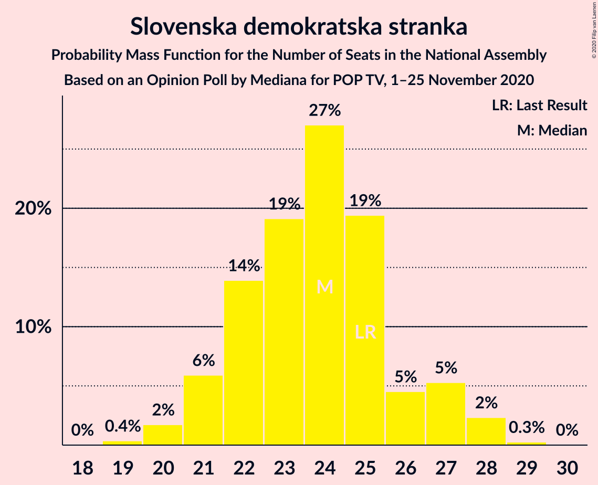

| Number of Seats | Probability | Accumulated | Special Marks |
|:---------------:|:-----------:|:-----------:|:-------------:|
| 19 | 0.4% | 100% |  |
| 20 | 2% | 99.6% |  |
| 21 | 6% | 98% |  |
| 22 | 14% | 92% |  |
| 23 | 19% | 78% |  |
| 24 | 27% | 59% | Median |
| 25 | 19% | 32% | Last Result |
| 26 | 5% | 12% |  |
| 27 | 5% | 8% |  |
| 28 | 2% | 3% |  |
| 29 | 0.3% | 0.3% |  |
| 30 | 0% | 0% |  |

### Socialni demokrati

*For a full overview of the results for this party, see the [Socialni demokrati](party-socialnidemokrati.html) page.*

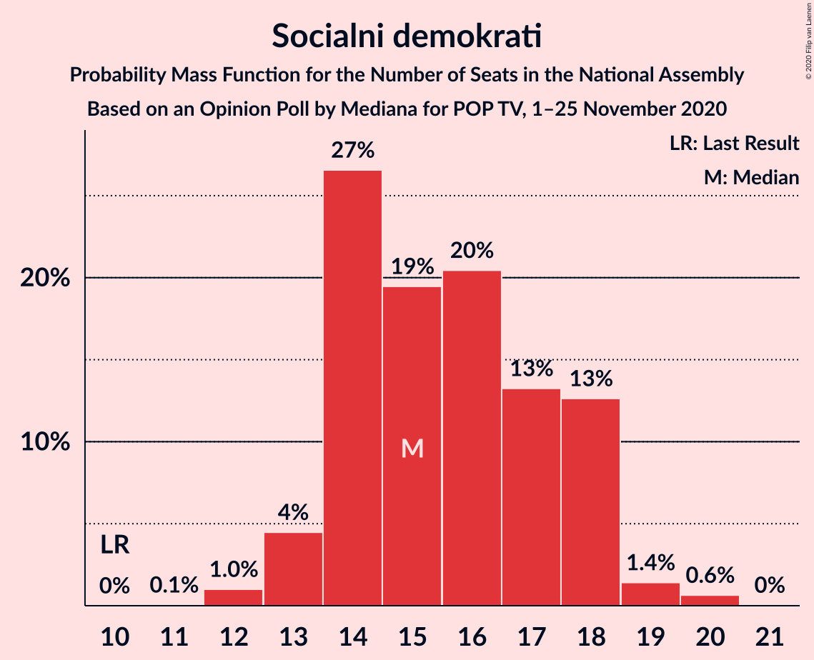

| Number of Seats | Probability | Accumulated | Special Marks |
|:---------------:|:-----------:|:-----------:|:-------------:|
| 10 | 0% | 100% | Last Result |
| 11 | 0.1% | 100% |  |
| 12 | 1.0% | 99.9% |  |
| 13 | 4% | 98.9% |  |
| 14 | 27% | 94% |  |
| 15 | 19% | 68% | Median |
| 16 | 20% | 48% |  |
| 17 | 13% | 28% |  |
| 18 | 13% | 15% |  |
| 19 | 1.4% | 2% |  |
| 20 | 0.6% | 0.7% |  |
| 21 | 0% | 0% |  |

### Lista Marjana Šarca

*For a full overview of the results for this party, see the [Lista Marjana Šarca](party-listamarjanašarca.html) page.*

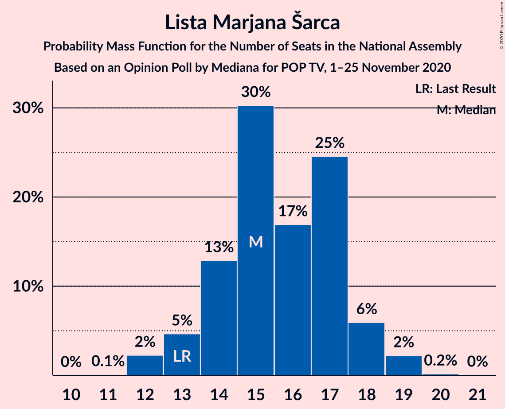

| Number of Seats | Probability | Accumulated | Special Marks |
|:---------------:|:-----------:|:-----------:|:-------------:|
| 11 | 0.1% | 100% |  |
| 12 | 2% | 99.9% |  |
| 13 | 5% | 98% | Last Result |
| 14 | 13% | 93% |  |
| 15 | 30% | 80% | Median |
| 16 | 17% | 50% |  |
| 17 | 25% | 33% |  |
| 18 | 6% | 8% |  |
| 19 | 2% | 2% |  |
| 20 | 0.2% | 0.2% |  |
| 21 | 0% | 0% |  |

### Levica

*For a full overview of the results for this party, see the [Levica](party-levica.html) page.*

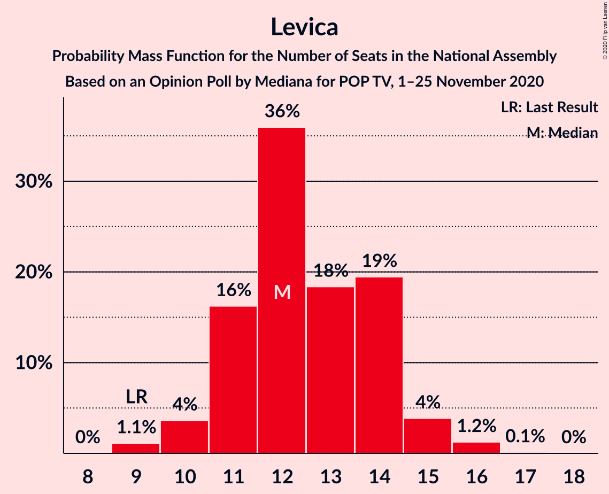

| Number of Seats | Probability | Accumulated | Special Marks |
|:---------------:|:-----------:|:-----------:|:-------------:|
| 9 | 1.1% | 100% | Last Result |
| 10 | 4% | 98.9% |  |
| 11 | 16% | 95% |  |
| 12 | 36% | 79% | Median |
| 13 | 18% | 43% |  |
| 14 | 19% | 25% |  |
| 15 | 4% | 5% |  |
| 16 | 1.2% | 1.4% |  |
| 17 | 0.1% | 0.1% |  |
| 18 | 0% | 0% |  |

### Nova Slovenija–Krščanski demokrati

*For a full overview of the results for this party, see the [Nova Slovenija–Krščanski demokrati](party-novaslovenija–krščanskidemokrati.html) page.*

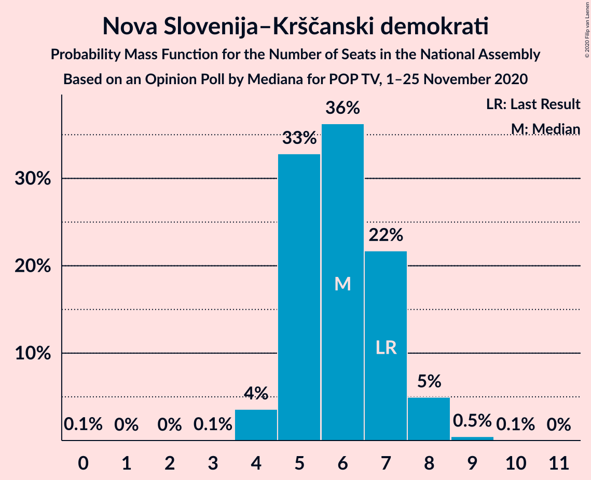

| Number of Seats | Probability | Accumulated | Special Marks |
|:---------------:|:-----------:|:-----------:|:-------------:|
| 0 | 0.1% | 100% |  |
| 1 | 0% | 99.9% |  |
| 2 | 0% | 99.9% |  |
| 3 | 0.1% | 99.9% |  |
| 4 | 4% | 99.9% |  |
| 5 | 33% | 96% |  |
| 6 | 36% | 63% | Median |
| 7 | 22% | 27% | Last Result |
| 8 | 5% | 5% |  |
| 9 | 0.5% | 0.5% |  |
| 10 | 0.1% | 0.1% |  |
| 11 | 0% | 0% |  |

### Demokratična stranka upokojencev Slovenije

*For a full overview of the results for this party, see the [Demokratična stranka upokojencev Slovenije](party-demokratičnastrankaupokojencevslovenije.html) page.*

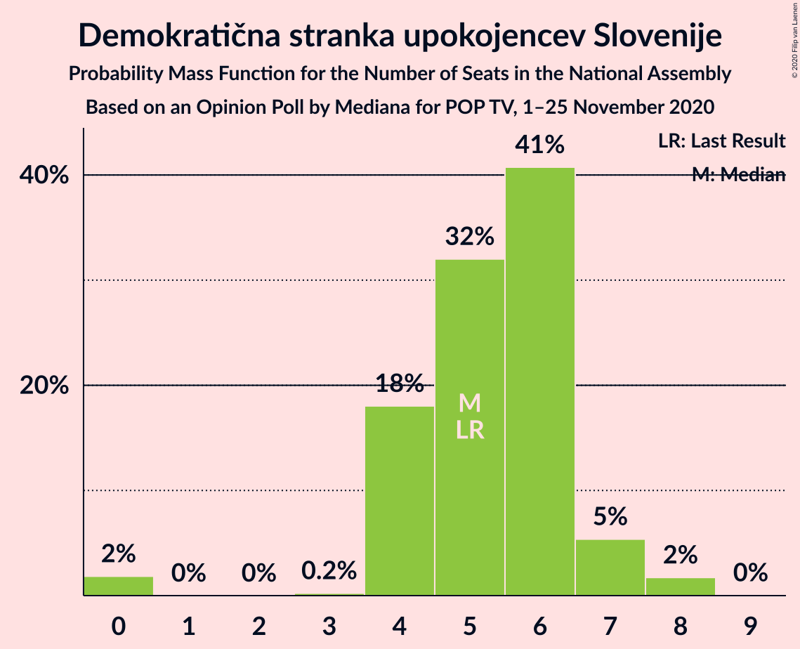

| Number of Seats | Probability | Accumulated | Special Marks |
|:---------------:|:-----------:|:-----------:|:-------------:|
| 0 | 2% | 100% |  |
| 1 | 0% | 98% |  |
| 2 | 0% | 98% |  |
| 3 | 0.2% | 98% |  |
| 4 | 18% | 98% |  |
| 5 | 32% | 80% | Last Result, Median |
| 6 | 41% | 48% |  |
| 7 | 5% | 7% |  |
| 8 | 2% | 2% |  |
| 9 | 0% | 0% |  |

### Slovenska nacionalna stranka

*For a full overview of the results for this party, see the [Slovenska nacionalna stranka](party-slovenskanacionalnastranka.html) page.*

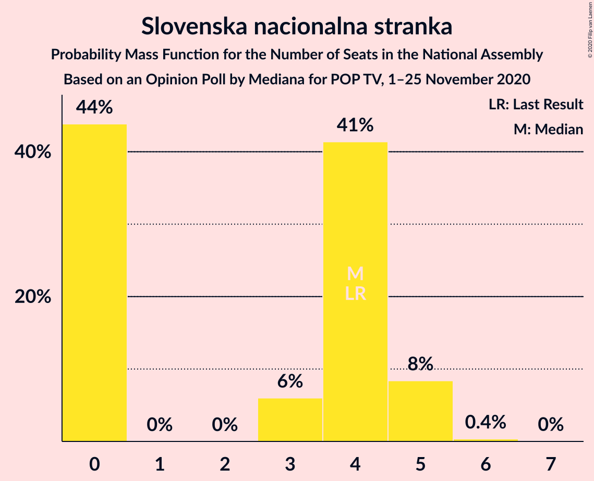

| Number of Seats | Probability | Accumulated | Special Marks |
|:---------------:|:-----------:|:-----------:|:-------------:|
| 0 | 44% | 100% |  |
| 1 | 0% | 56% |  |
| 2 | 0% | 56% |  |
| 3 | 6% | 56% |  |
| 4 | 41% | 50% | Last Result, Median |
| 5 | 8% | 9% |  |
| 6 | 0.4% | 0.4% |  |
| 7 | 0% | 0% |  |

### Stranka Alenke Bratušek

*For a full overview of the results for this party, see the [Stranka Alenke Bratušek](party-strankaalenkebratušek.html) page.*

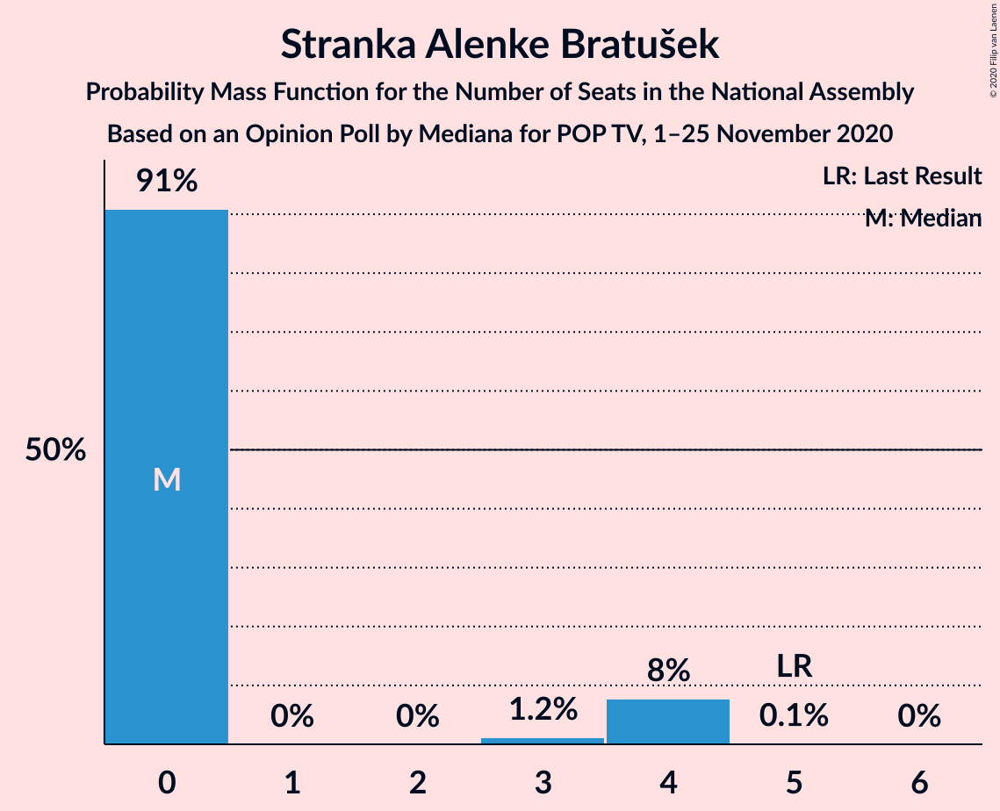

| Number of Seats | Probability | Accumulated | Special Marks |
|:---------------:|:-----------:|:-----------:|:-------------:|
| 0 | 91% | 100% | Median |
| 1 | 0% | 9% |  |
| 2 | 0% | 9% |  |
| 3 | 1.2% | 9% |  |
| 4 | 8% | 8% |  |
| 5 | 0.1% | 0.1% | Last Result |
| 6 | 0% | 0% |  |

### Slovenska ljudska stranka

*For a full overview of the results for this party, see the [Slovenska ljudska stranka](party-slovenskaljudskastranka.html) page.*

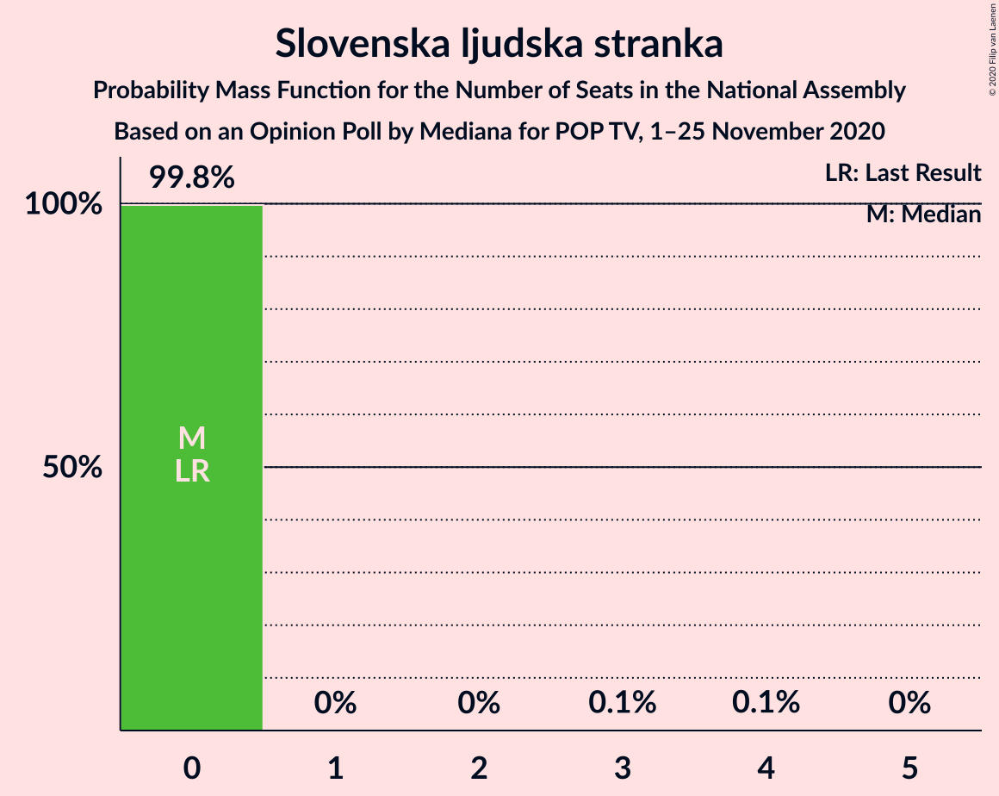

| Number of Seats | Probability | Accumulated | Special Marks |
|:---------------:|:-----------:|:-----------:|:-------------:|
| 0 | 99.8% | 100% | Last Result, Median |
| 1 | 0% | 0.2% |  |
| 2 | 0% | 0.2% |  |
| 3 | 0.1% | 0.2% |  |
| 4 | 0.1% | 0.1% |  |
| 5 | 0% | 0% |  |

### Stranka modernega centra

*For a full overview of the results for this party, see the [Stranka modernega centra](party-strankamodernegacentra.html) page.*

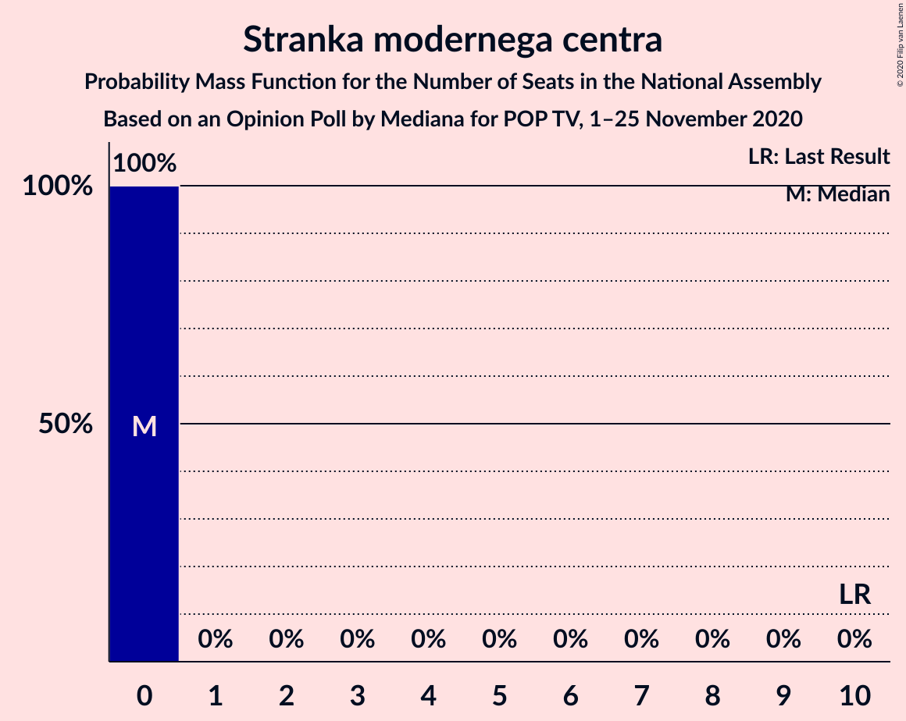

| Number of Seats | Probability | Accumulated | Special Marks |
|:---------------:|:-----------:|:-----------:|:-------------:|
| 0 | 100% | 100% | Median |
| 1 | 0% | 0% |  |
| 2 | 0% | 0% |  |
| 3 | 0% | 0% |  |
| 4 | 0% | 0% |  |
| 5 | 0% | 0% |  |
| 6 | 0% | 0% |  |
| 7 | 0% | 0% |  |
| 8 | 0% | 0% |  |
| 9 | 0% | 0% |  |
| 10 | 0% | 0% | Last Result |

## Coalitions

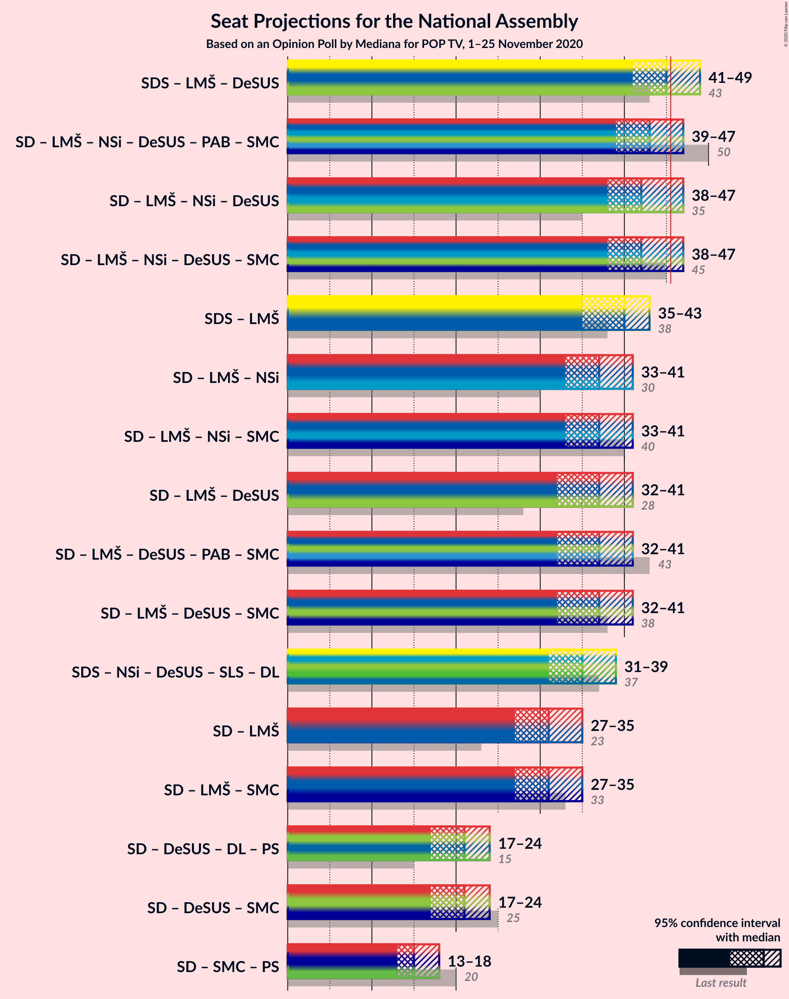

### Confidence Intervals

| Coalition | Last Result | Median | Majority? | 80% Confidence Interval | 90% Confidence Interval | 95% Confidence Interval | 99% Confidence Interval |
|:---------:|:-----------:|:------:|:---------:|:-----------------------:|:-----------------------:|:-----------------------:|:-----------------------:|
| Slovenska demokratska stranka – Lista Marjana Šarca – Demokratična stranka upokojencev Slovenije | 43 | 45 | 38% | 42–47 | 41–48 | 41–49 | 39–49 |
| Socialni demokrati – Lista Marjana Šarca – Nova Slovenija–Krščanski demokrati – Demokratična stranka upokojencev Slovenije – Stranka Alenke Bratušek – Stranka modernega centra | 50 | 43 | 12% | 40–46 | 39–47 | 39–47 | 38–48 |
| Socialni demokrati – Lista Marjana Šarca – Nova Slovenija–Krščanski demokrati – Demokratična stranka upokojencev Slovenije | 35 | 42 | 8% | 40–45 | 39–46 | 38–47 | 37–48 |
| Socialni demokrati – Lista Marjana Šarca – Nova Slovenija–Krščanski demokrati – Demokratična stranka upokojencev Slovenije – Stranka modernega centra | 45 | 42 | 8% | 40–45 | 39–46 | 38–47 | 37–48 |
| Slovenska demokratska stranka – Lista Marjana Šarca | 38 | 40 | 0.4% | 37–42 | 36–43 | 35–43 | 34–45 |
| Socialni demokrati – Lista Marjana Šarca – Nova Slovenija–Krščanski demokrati | 30 | 37 | 0% | 35–40 | 34–41 | 33–41 | 32–43 |
| Socialni demokrati – Lista Marjana Šarca – Nova Slovenija–Krščanski demokrati – Stranka modernega centra | 40 | 37 | 0% | 35–40 | 34–41 | 33–41 | 32–43 |
| Socialni demokrati – Lista Marjana Šarca – Demokratična stranka upokojencev Slovenije | 28 | 37 | 0% | 34–39 | 33–40 | 32–41 | 31–42 |
| Socialni demokrati – Lista Marjana Šarca – Demokratična stranka upokojencev Slovenije – Stranka Alenke Bratušek – Stranka modernega centra | 43 | 37 | 0% | 34–40 | 33–40 | 32–41 | 32–42 |
| Socialni demokrati – Lista Marjana Šarca – Demokratična stranka upokojencev Slovenije – Stranka modernega centra | 38 | 37 | 0% | 34–39 | 33–40 | 32–41 | 31–42 |
| Socialni demokrati – Lista Marjana Šarca | 23 | 31 | 0% | 29–34 | 28–34 | 27–35 | 26–37 |
| Socialni demokrati – Lista Marjana Šarca – Stranka modernega centra | 33 | 31 | 0% | 29–34 | 28–34 | 27–35 | 26–37 |
| Socialni demokrati – Demokratična stranka upokojencev Slovenije – Stranka modernega centra | 25 | 21 | 0% | 19–23 | 18–24 | 17–24 | 17–26 |

### Slovenska demokratska stranka – Lista Marjana Šarca – Demokratična stranka upokojencev Slovenije

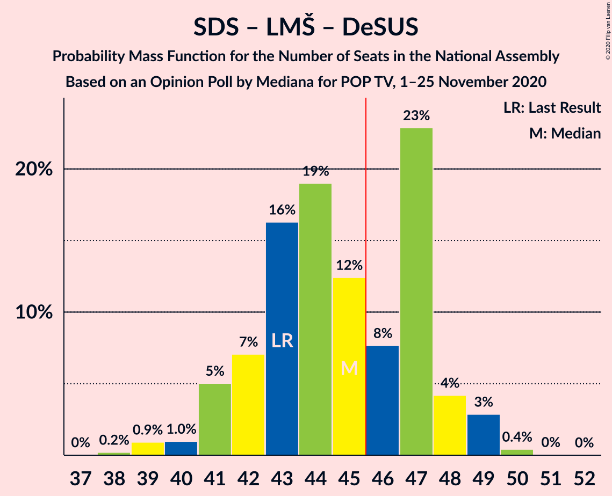

| Number of Seats | Probability | Accumulated | Special Marks |
|:---------------:|:-----------:|:-----------:|:-------------:|
| 38 | 0.2% | 100% |  |
| 39 | 0.9% | 99.8% |  |
| 40 | 1.0% | 98.8% |  |
| 41 | 5% | 98% |  |
| 42 | 7% | 93% |  |
| 43 | 16% | 86% | Last Result |
| 44 | 19% | 69% | Median |
| 45 | 12% | 51% |  |
| 46 | 8% | 38% | Majority |
| 47 | 23% | 30% |  |
| 48 | 4% | 8% |  |
| 49 | 3% | 3% |  |
| 50 | 0.4% | 0.5% |  |
| 51 | 0% | 0.1% |  |
| 52 | 0% | 0% |  |

### Socialni demokrati – Lista Marjana Šarca – Nova Slovenija–Krščanski demokrati – Demokratična stranka upokojencev Slovenije – Stranka Alenke Bratušek – Stranka modernega centra

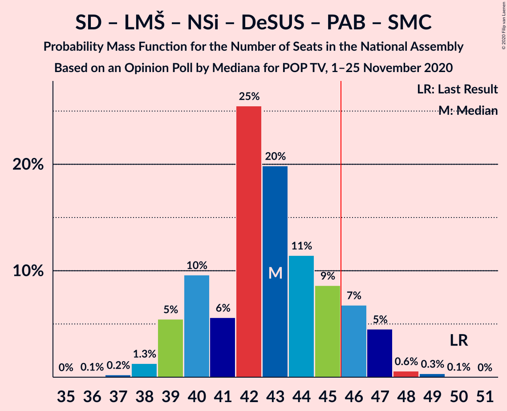

| Number of Seats | Probability | Accumulated | Special Marks |
|:---------------:|:-----------:|:-----------:|:-------------:|
| 36 | 0.1% | 100% |  |
| 37 | 0.2% | 99.9% |  |
| 38 | 1.3% | 99.7% |  |
| 39 | 5% | 98% |  |
| 40 | 10% | 93% |  |
| 41 | 6% | 83% | Median |
| 42 | 25% | 78% |  |
| 43 | 20% | 52% |  |
| 44 | 11% | 32% |  |
| 45 | 9% | 21% |  |
| 46 | 7% | 12% | Majority |
| 47 | 5% | 6% |  |
| 48 | 0.6% | 1.0% |  |
| 49 | 0.3% | 0.4% |  |
| 50 | 0.1% | 0.1% | Last Result |
| 51 | 0% | 0% |  |

### Socialni demokrati – Lista Marjana Šarca – Nova Slovenija–Krščanski demokrati – Demokratična stranka upokojencev Slovenije

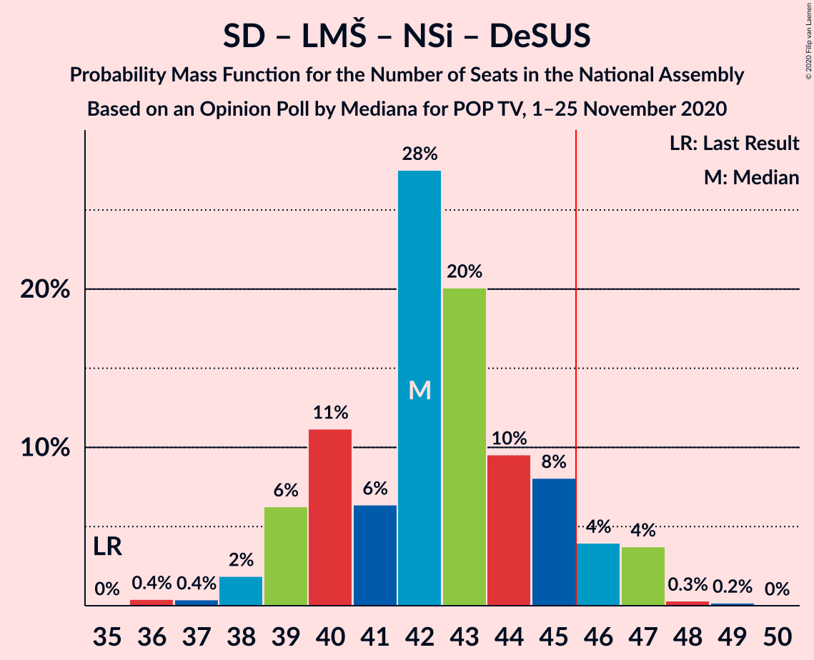

| Number of Seats | Probability | Accumulated | Special Marks |
|:---------------:|:-----------:|:-----------:|:-------------:|
| 35 | 0% | 100% | Last Result |
| 36 | 0.4% | 99.9% |  |
| 37 | 0.4% | 99.5% |  |
| 38 | 2% | 99.1% |  |
| 39 | 6% | 97% |  |
| 40 | 11% | 91% |  |
| 41 | 6% | 80% | Median |
| 42 | 28% | 73% |  |
| 43 | 20% | 46% |  |
| 44 | 10% | 26% |  |
| 45 | 8% | 16% |  |
| 46 | 4% | 8% | Majority |
| 47 | 4% | 4% |  |
| 48 | 0.3% | 0.5% |  |
| 49 | 0.2% | 0.2% |  |
| 50 | 0% | 0% |  |

### Socialni demokrati – Lista Marjana Šarca – Nova Slovenija–Krščanski demokrati – Demokratična stranka upokojencev Slovenije – Stranka modernega centra

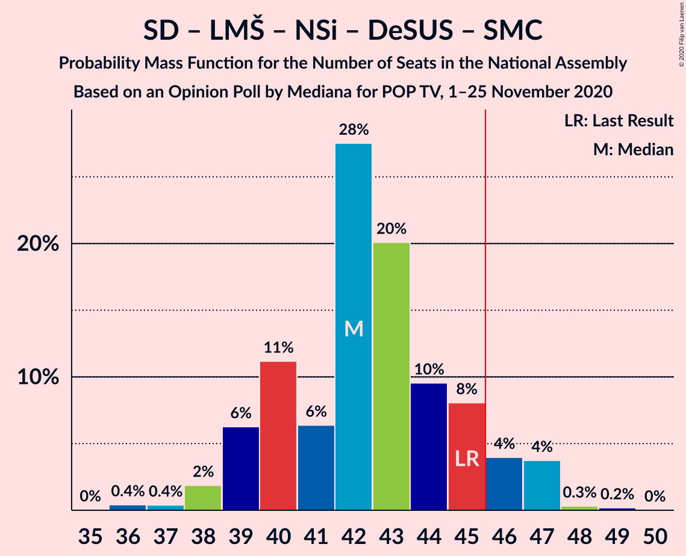

| Number of Seats | Probability | Accumulated | Special Marks |
|:---------------:|:-----------:|:-----------:|:-------------:|
| 35 | 0% | 100% |  |
| 36 | 0.4% | 99.9% |  |
| 37 | 0.4% | 99.5% |  |
| 38 | 2% | 99.1% |  |
| 39 | 6% | 97% |  |
| 40 | 11% | 91% |  |
| 41 | 6% | 80% | Median |
| 42 | 28% | 73% |  |
| 43 | 20% | 46% |  |
| 44 | 10% | 26% |  |
| 45 | 8% | 16% | Last Result |
| 46 | 4% | 8% | Majority |
| 47 | 4% | 4% |  |
| 48 | 0.3% | 0.5% |  |
| 49 | 0.2% | 0.2% |  |
| 50 | 0% | 0% |  |

### Slovenska demokratska stranka – Lista Marjana Šarca

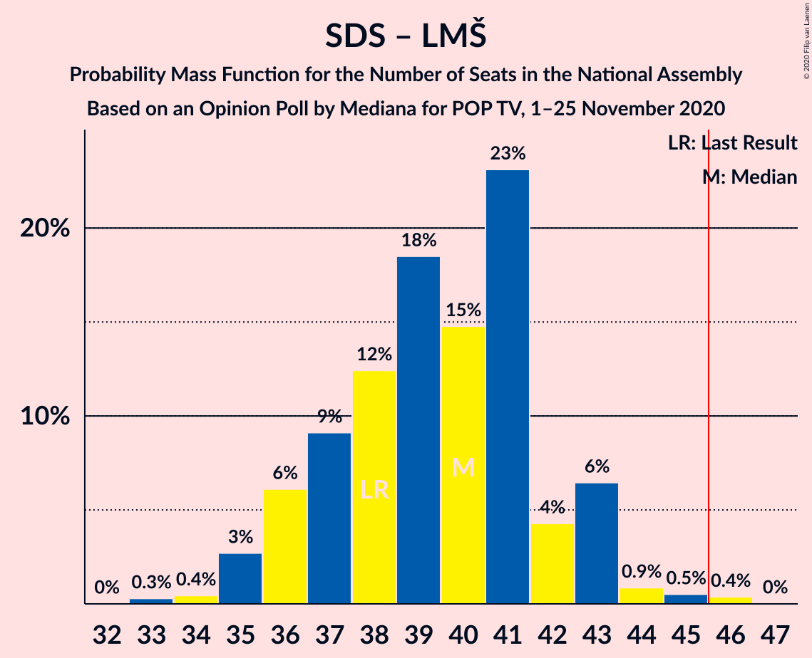

| Number of Seats | Probability | Accumulated | Special Marks |
|:---------------:|:-----------:|:-----------:|:-------------:|
| 33 | 0.3% | 100% |  |
| 34 | 0.4% | 99.7% |  |
| 35 | 3% | 99.2% |  |
| 36 | 6% | 97% |  |
| 37 | 9% | 90% |  |
| 38 | 12% | 81% | Last Result |
| 39 | 18% | 69% | Median |
| 40 | 15% | 50% |  |
| 41 | 23% | 36% |  |
| 42 | 4% | 13% |  |
| 43 | 6% | 8% |  |
| 44 | 0.9% | 2% |  |
| 45 | 0.5% | 0.9% |  |
| 46 | 0.4% | 0.4% | Majority |
| 47 | 0% | 0% |  |

### Socialni demokrati – Lista Marjana Šarca – Nova Slovenija–Krščanski demokrati

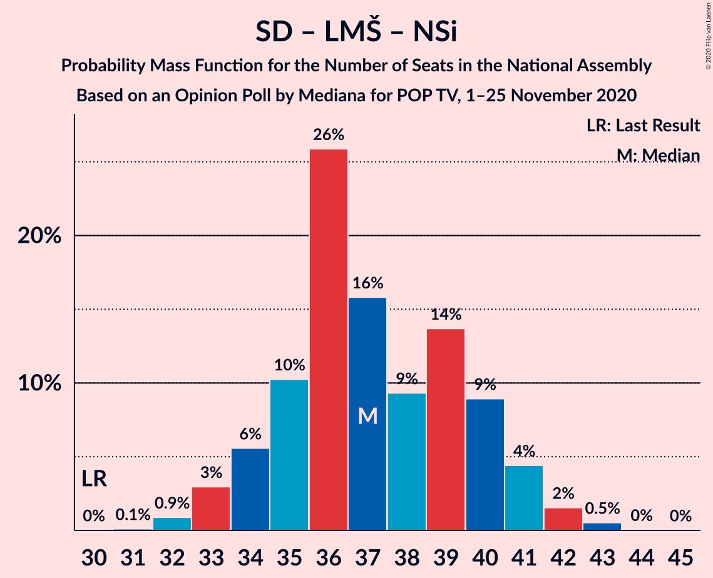

| Number of Seats | Probability | Accumulated | Special Marks |
|:---------------:|:-----------:|:-----------:|:-------------:|
| 30 | 0% | 100% | Last Result |
| 31 | 0.1% | 100% |  |
| 32 | 0.9% | 99.9% |  |
| 33 | 3% | 99.0% |  |
| 34 | 6% | 96% |  |
| 35 | 10% | 90% |  |
| 36 | 26% | 80% | Median |
| 37 | 16% | 54% |  |
| 38 | 9% | 38% |  |
| 39 | 14% | 29% |  |
| 40 | 9% | 15% |  |
| 41 | 4% | 7% |  |
| 42 | 2% | 2% |  |
| 43 | 0.5% | 0.6% |  |
| 44 | 0% | 0.1% |  |
| 45 | 0% | 0% |  |

### Socialni demokrati – Lista Marjana Šarca – Nova Slovenija–Krščanski demokrati – Stranka modernega centra

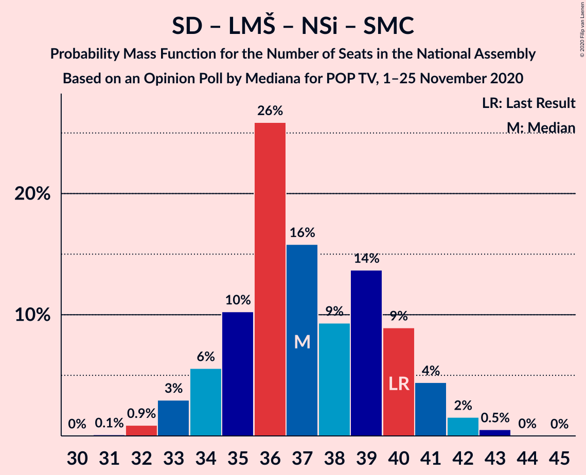

| Number of Seats | Probability | Accumulated | Special Marks |
|:---------------:|:-----------:|:-----------:|:-------------:|
| 31 | 0.1% | 100% |  |
| 32 | 0.9% | 99.9% |  |
| 33 | 3% | 99.0% |  |
| 34 | 6% | 96% |  |
| 35 | 10% | 90% |  |
| 36 | 26% | 80% | Median |
| 37 | 16% | 54% |  |
| 38 | 9% | 38% |  |
| 39 | 14% | 29% |  |
| 40 | 9% | 15% | Last Result |
| 41 | 4% | 7% |  |
| 42 | 2% | 2% |  |
| 43 | 0.5% | 0.6% |  |
| 44 | 0% | 0.1% |  |
| 45 | 0% | 0% |  |

### Socialni demokrati – Lista Marjana Šarca – Demokratična stranka upokojencev Slovenije

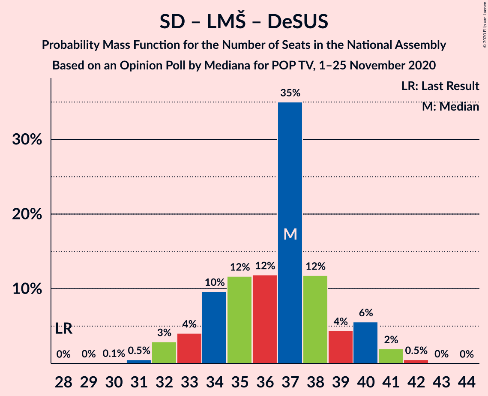

| Number of Seats | Probability | Accumulated | Special Marks |
|:---------------:|:-----------:|:-----------:|:-------------:|
| 28 | 0% | 100% | Last Result |
| 29 | 0% | 100% |  |
| 30 | 0.1% | 99.9% |  |
| 31 | 0.5% | 99.8% |  |
| 32 | 3% | 99.3% |  |
| 33 | 4% | 96% |  |
| 34 | 10% | 92% |  |
| 35 | 12% | 83% | Median |
| 36 | 12% | 71% |  |
| 37 | 35% | 59% |  |
| 38 | 12% | 24% |  |
| 39 | 4% | 12% |  |
| 40 | 6% | 8% |  |
| 41 | 2% | 3% |  |
| 42 | 0.5% | 0.6% |  |
| 43 | 0% | 0.1% |  |
| 44 | 0% | 0% |  |

### Socialni demokrati – Lista Marjana Šarca – Demokratična stranka upokojencev Slovenije – Stranka Alenke Bratušek – Stranka modernega centra

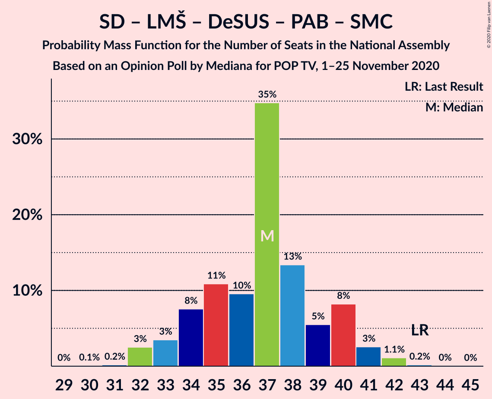

| Number of Seats | Probability | Accumulated | Special Marks |
|:---------------:|:-----------:|:-----------:|:-------------:|
| 30 | 0.1% | 100% |  |
| 31 | 0.2% | 99.9% |  |
| 32 | 3% | 99.7% |  |
| 33 | 3% | 97% |  |
| 34 | 8% | 94% |  |
| 35 | 11% | 86% | Median |
| 36 | 10% | 75% |  |
| 37 | 35% | 66% |  |
| 38 | 13% | 31% |  |
| 39 | 5% | 18% |  |
| 40 | 8% | 12% |  |
| 41 | 3% | 4% |  |
| 42 | 1.1% | 1.3% |  |
| 43 | 0.2% | 0.2% | Last Result |
| 44 | 0% | 0.1% |  |
| 45 | 0% | 0% |  |

### Socialni demokrati – Lista Marjana Šarca – Demokratična stranka upokojencev Slovenije – Stranka modernega centra

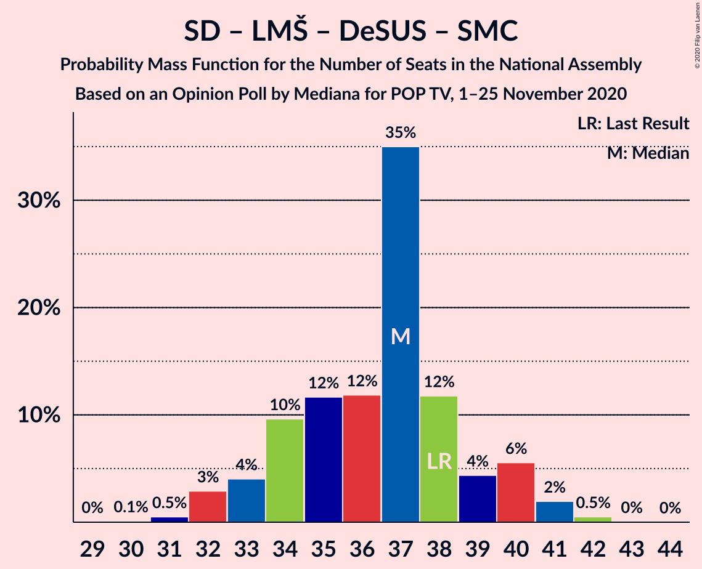

| Number of Seats | Probability | Accumulated | Special Marks |
|:---------------:|:-----------:|:-----------:|:-------------:|
| 29 | 0% | 100% |  |
| 30 | 0.1% | 99.9% |  |
| 31 | 0.5% | 99.8% |  |
| 32 | 3% | 99.3% |  |
| 33 | 4% | 96% |  |
| 34 | 10% | 92% |  |
| 35 | 12% | 83% | Median |
| 36 | 12% | 71% |  |
| 37 | 35% | 59% |  |
| 38 | 12% | 24% | Last Result |
| 39 | 4% | 12% |  |
| 40 | 6% | 8% |  |
| 41 | 2% | 3% |  |
| 42 | 0.5% | 0.6% |  |
| 43 | 0% | 0.1% |  |
| 44 | 0% | 0% |  |

### Socialni demokrati – Lista Marjana Šarca

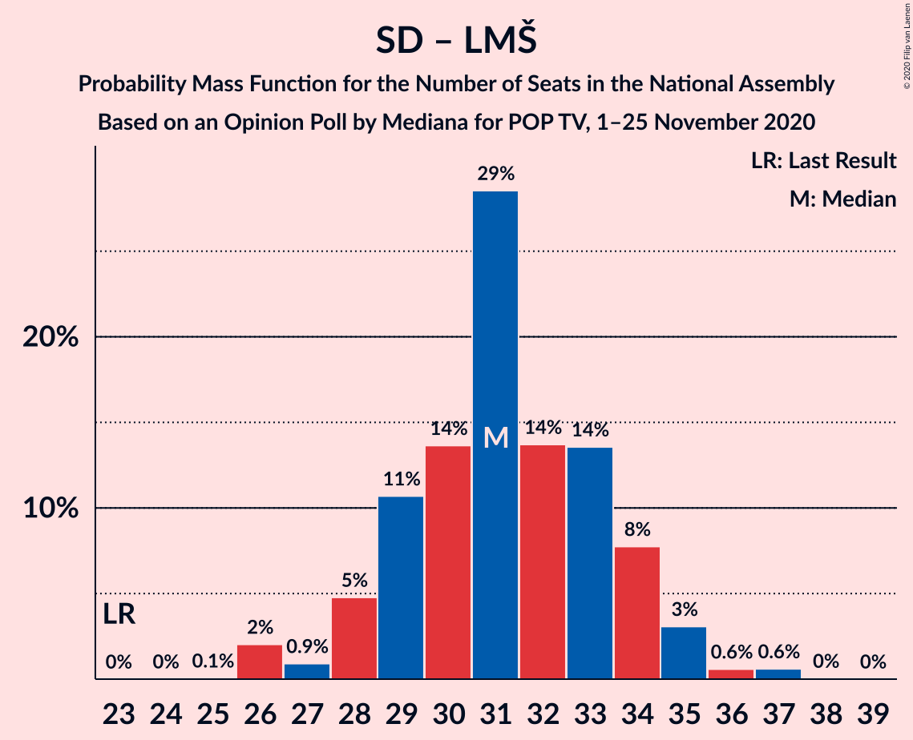

| Number of Seats | Probability | Accumulated | Special Marks |
|:---------------:|:-----------:|:-----------:|:-------------:|
| 23 | 0% | 100% | Last Result |
| 24 | 0% | 100% |  |
| 25 | 0.1% | 100% |  |
| 26 | 2% | 99.9% |  |
| 27 | 0.9% | 98% |  |
| 28 | 5% | 97% |  |
| 29 | 11% | 92% |  |
| 30 | 14% | 82% | Median |
| 31 | 29% | 68% |  |
| 32 | 14% | 39% |  |
| 33 | 14% | 26% |  |
| 34 | 8% | 12% |  |
| 35 | 3% | 4% |  |
| 36 | 0.6% | 1.2% |  |
| 37 | 0.6% | 0.7% |  |
| 38 | 0% | 0.1% |  |
| 39 | 0% | 0% |  |

### Socialni demokrati – Lista Marjana Šarca – Stranka modernega centra

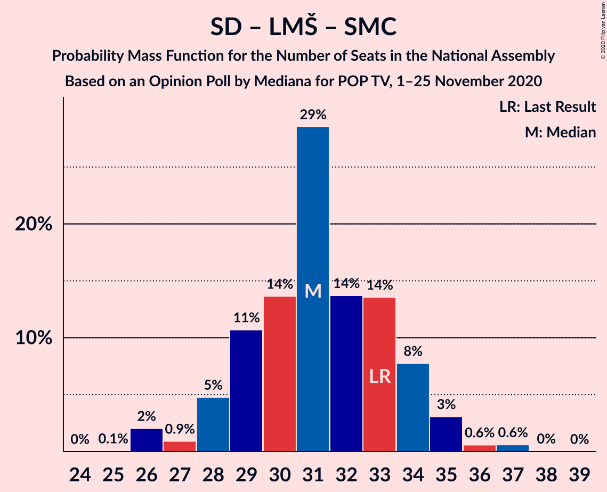

| Number of Seats | Probability | Accumulated | Special Marks |
|:---------------:|:-----------:|:-----------:|:-------------:|
| 25 | 0.1% | 100% |  |
| 26 | 2% | 99.9% |  |
| 27 | 0.9% | 98% |  |
| 28 | 5% | 97% |  |
| 29 | 11% | 92% |  |
| 30 | 14% | 82% | Median |
| 31 | 29% | 68% |  |
| 32 | 14% | 39% |  |
| 33 | 14% | 26% | Last Result |
| 34 | 8% | 12% |  |
| 35 | 3% | 4% |  |
| 36 | 0.6% | 1.2% |  |
| 37 | 0.6% | 0.7% |  |
| 38 | 0% | 0.1% |  |
| 39 | 0% | 0% |  |

### Socialni demokrati – Demokratična stranka upokojencev Slovenije – Stranka modernega centra

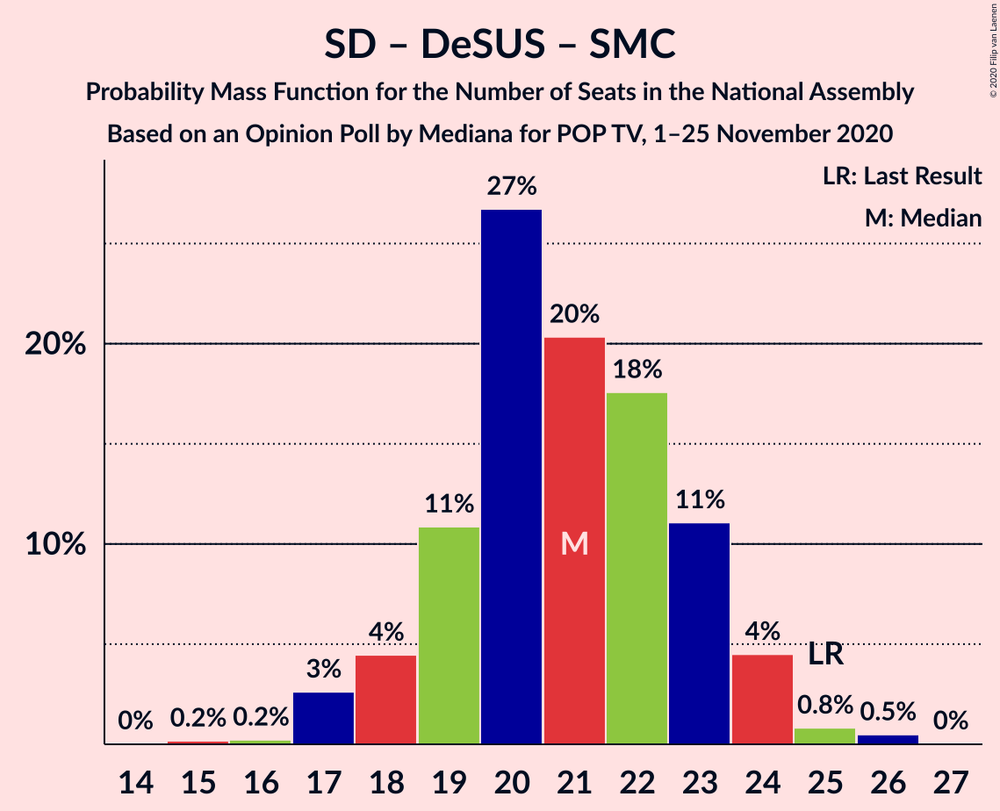

| Number of Seats | Probability | Accumulated | Special Marks |
|:---------------:|:-----------:|:-----------:|:-------------:|
| 14 | 0% | 100% |  |
| 15 | 0.2% | 99.9% |  |
| 16 | 0.2% | 99.8% |  |
| 17 | 3% | 99.5% |  |
| 18 | 4% | 97% |  |
| 19 | 11% | 92% |  |
| 20 | 27% | 82% | Median |
| 21 | 20% | 55% |  |
| 22 | 18% | 35% |  |
| 23 | 11% | 17% |  |
| 24 | 4% | 6% |  |
| 25 | 0.8% | 1.4% | Last Result |
| 26 | 0.5% | 0.5% |  |
| 27 | 0% | 0% |  |

## Technical Information

### Opinion Poll

+ **Polling firm:** Mediana
+ **Commissioner(s):** POP TV
+ **Fieldwork period:** 1–25 November 2020

### Calculations

+ **Sample size:** 711
+ **Simulations done:** 1,048,576
+ **Error estimate:** 1.13%

