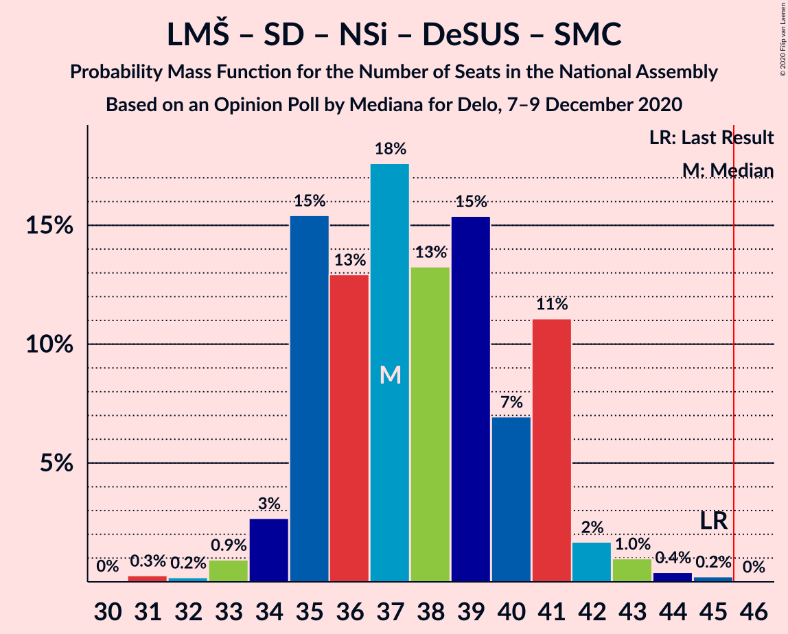
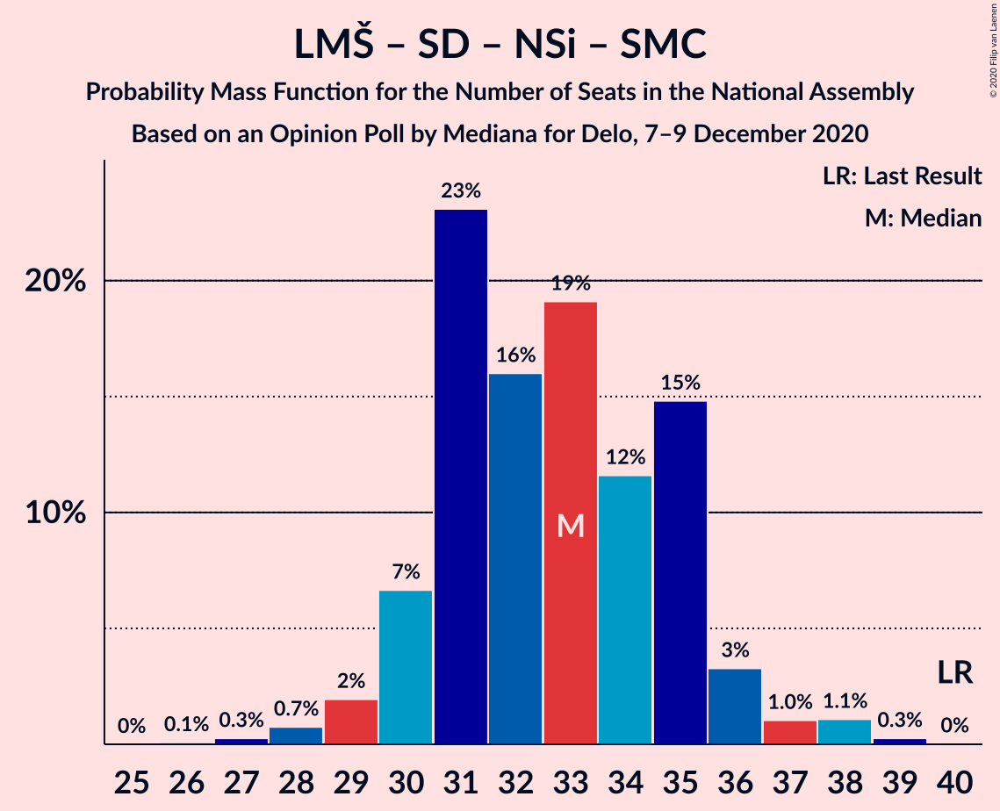

# Opinion Poll by Mediana for Delo, 7–9 December 2020

<a href="#voting-intentions">Voting Intentions</a> | <a href="#seats">Seats</a> | <a href="#coalitions">Coalitions</a> | <a href="#technical-information">Technical Information</a>

## Voting Intentions

### Confidence Intervals

| Party | Last Result | Poll Result | 80% Confidence Interval | 90% Confidence Interval | 95% Confidence Interval | 99% Confidence Interval |
|:-----:|:-----------:|:-----------:|:-----------------------:|:-----------------------:|:-----------------------:|:-----------------------:|
| Slovenska demokratska stranka | 24.9% | 26.7% | 24.7–28.9% |24.1–29.6% |23.6–30.1% |22.6–31.2% |
| Lista Marjana Šarca | 12.6% | 15.9% | 14.3–17.8% |13.8–18.3% |13.4–18.8% |12.6–19.7% |
| Levica | 9.3% | 14.9% | 13.3–16.8% |12.9–17.3% |12.5–17.7% |11.8–18.6% |
| Socialni demokrati | 9.9% | 12.1% | 10.7–13.8% |10.2–14.3% |9.9–14.7% |9.2–15.6% |
| Nova Slovenija–Krščanski demokrati | 7.2% | 7.2% | 6.1–8.6% |5.8–9.0% |5.5–9.3% |5.0–10.0% |
| Demokratična stranka upokojencev Slovenije | 4.9% | 5.6% | 4.6–6.9% |4.4–7.3% |4.2–7.6% |3.7–8.2% |
| Stranka Alenke Bratušek | 5.1% | 5.1% | 4.1–6.3% |3.9–6.6% |3.7–6.9% |3.3–7.6% |
| Slovenska nacionalna stranka | 4.2% | 3.7% | 2.9–4.7% |2.7–5.0% |2.5–5.3% |2.2–5.9% |
| Stranka modernega centra | 9.7% | 1.5% | 1.1–2.3% |1.0–2.5% |0.9–2.8% |0.7–3.2% |
| Slovenska ljudska stranka | 2.6% | 1.1% | 0.8–1.8% |0.7–2.0% |0.6–2.2% |0.4–2.6% |

*Note:* The poll result column reflects the actual value used in the calculations. Published results may vary slightly, and in addition be rounded to fewer digits.

## Seats

### Confidence Intervals

| Party | Last Result | Median | 80% Confidence Interval | 90% Confidence Interval | 95% Confidence Interval | 99% Confidence Interval |
|:-----:|:-----------:|:------:|:-----------------------:|:-----------------------:|:-----------------------:|:-----------------------:|
| <a href="#slovenska-demokratska-stranka">Slovenska demokratska stranka</a> | 25 | 25 | 23–28 |22–28 |22–29 |21–30 |
| <a href="#lista-marjana-šarca">Lista Marjana Šarca</a> | 13 | 15 | 13–17 |13–17 |12–18 |12–19 |
| <a href="#levica">Levica</a> | 9 | 14 | 12–16 |12–16 |11–17 |11–18 |
| <a href="#socialni-demokrati">Socialni demokrati</a> | 10 | 11 | 10–13 |10–13 |9–13 |8–15 |
| <a href="#nova-slovenija–krščanski-demokrati">Nova Slovenija–Krščanski demokrati</a> | 7 | 7 | 5–8 |5–8 |5–8 |4–9 |
| <a href="#demokratična-stranka-upokojencev-slovenije">Demokratična stranka upokojencev Slovenije</a> | 5 | 5 | 4–6 |4–6 |4–7 |0–7 |
| <a href="#stranka-alenke-bratušek">Stranka Alenke Bratušek</a> | 5 | 4 | 4–6 |0–6 |0–6 |0–7 |
| <a href="#slovenska-nacionalna-stranka">Slovenska nacionalna stranka</a> | 4 | 0 | 0–4 |0–4 |0–5 |0–5 |
| <a href="#stranka-modernega-centra">Stranka modernega centra</a> | 10 | 0 | 0 |0 |0 |0 |
| <a href="#slovenska-ljudska-stranka">Slovenska ljudska stranka</a> | 0 | 0 | 0 |0 |0 |0 |

### Slovenska demokratska stranka

*For a full overview of the results for this party, see the [Slovenska demokratska stranka](party-slovenskademokratskastranka.html) page.*

| Number of Seats | Probability | Accumulated | Special Marks |
|:---------------:|:-----------:|:-----------:|:-------------:|
| 20 | 0.1% | 100% |  |
| 21 | 2% | 99.8% |  |
| 22 | 3% | 98% |  |
| 23 | 6% | 95% |  |
| 24 | 19% | 89% |  |
| 25 | 24% | 69% | Last Result, Median |
| 26 | 20% | 46% |  |
| 27 | 12% | 25% |  |
| 28 | 9% | 13% |  |
| 29 | 2% | 3% |  |
| 30 | 1.2% | 1.5% |  |
| 31 | 0.1% | 0.2% |  |
| 32 | 0.1% | 0.1% |  |
| 33 | 0% | 0% |  |

### Lista Marjana Šarca

*For a full overview of the results for this party, see the [Lista Marjana Šarca](party-listamarjanašarca.html) page.*

| Number of Seats | Probability | Accumulated | Special Marks |
|:---------------:|:-----------:|:-----------:|:-------------:|
| 11 | 0.4% | 100% |  |
| 12 | 4% | 99.6% |  |
| 13 | 10% | 96% | Last Result |
| 14 | 30% | 86% |  |
| 15 | 34% | 56% | Median |
| 16 | 10% | 22% |  |
| 17 | 9% | 12% |  |
| 18 | 2% | 3% |  |
| 19 | 0.8% | 0.9% |  |
| 20 | 0.1% | 0.1% |  |
| 21 | 0% | 0% |  |

### Levica

*For a full overview of the results for this party, see the [Levica](party-levica.html) page.*

| Number of Seats | Probability | Accumulated | Special Marks |
|:---------------:|:-----------:|:-----------:|:-------------:|
| 9 | 0% | 100% | Last Result |
| 10 | 0.4% | 100% |  |
| 11 | 3% | 99.6% |  |
| 12 | 7% | 97% |  |
| 13 | 33% | 90% |  |
| 14 | 31% | 57% | Median |
| 15 | 9% | 26% |  |
| 16 | 12% | 17% |  |
| 17 | 3% | 4% |  |
| 18 | 0.7% | 0.8% |  |
| 19 | 0.1% | 0.1% |  |
| 20 | 0% | 0% |  |

### Socialni demokrati

*For a full overview of the results for this party, see the [Socialni demokrati](party-socialnidemokrati.html) page.*

| Number of Seats | Probability | Accumulated | Special Marks |
|:---------------:|:-----------:|:-----------:|:-------------:|
| 8 | 0.6% | 100% |  |
| 9 | 4% | 99.3% |  |
| 10 | 22% | 95% | Last Result |
| 11 | 34% | 73% | Median |
| 12 | 24% | 39% |  |
| 13 | 13% | 15% |  |
| 14 | 1.3% | 2% |  |
| 15 | 0.6% | 0.7% |  |
| 16 | 0.1% | 0.1% |  |
| 17 | 0% | 0% |  |

### Nova Slovenija–Krščanski demokrati

*For a full overview of the results for this party, see the [Nova Slovenija–Krščanski demokrati](party-novaslovenija–krščanskidemokrati.html) page.*

| Number of Seats | Probability | Accumulated | Special Marks |
|:---------------:|:-----------:|:-----------:|:-------------:|
| 4 | 0.8% | 100% |  |
| 5 | 9% | 99.2% |  |
| 6 | 38% | 90% |  |
| 7 | 30% | 52% | Last Result, Median |
| 8 | 20% | 22% |  |
| 9 | 2% | 2% |  |
| 10 | 0.2% | 0.2% |  |
| 11 | 0% | 0% |  |

### Demokratična stranka upokojencev Slovenije

*For a full overview of the results for this party, see the [Demokratična stranka upokojencev Slovenije](party-demokratičnastrankaupokojencevslovenije.html) page.*

| Number of Seats | Probability | Accumulated | Special Marks |
|:---------------:|:-----------:|:-----------:|:-------------:|
| 0 | 0.9% | 100% |  |
| 1 | 0% | 99.1% |  |
| 2 | 0% | 99.1% |  |
| 3 | 1.1% | 99.1% |  |
| 4 | 27% | 98% |  |
| 5 | 37% | 71% | Last Result, Median |
| 6 | 30% | 33% |  |
| 7 | 3% | 4% |  |
| 8 | 0.3% | 0.3% |  |
| 9 | 0% | 0% |  |

### Stranka Alenke Bratušek

*For a full overview of the results for this party, see the [Stranka Alenke Bratušek](party-strankaalenkebratušek.html) page.*

| Number of Seats | Probability | Accumulated | Special Marks |
|:---------------:|:-----------:|:-----------:|:-------------:|
| 0 | 7% | 100% |  |
| 1 | 0% | 93% |  |
| 2 | 0% | 93% |  |
| 3 | 2% | 93% |  |
| 4 | 42% | 91% | Median |
| 5 | 38% | 49% | Last Result |
| 6 | 9% | 10% |  |
| 7 | 0.8% | 0.9% |  |
| 8 | 0% | 0.1% |  |
| 9 | 0% | 0% |  |

### Slovenska nacionalna stranka

*For a full overview of the results for this party, see the [Slovenska nacionalna stranka](party-slovenskanacionalnastranka.html) page.*

| Number of Seats | Probability | Accumulated | Special Marks |
|:---------------:|:-----------:|:-----------:|:-------------:|
| 0 | 71% | 100% | Median |
| 1 | 0% | 29% |  |
| 2 | 0% | 29% |  |
| 3 | 4% | 29% |  |
| 4 | 22% | 25% | Last Result |
| 5 | 3% | 3% |  |
| 6 | 0.1% | 0.1% |  |
| 7 | 0% | 0% |  |

### Stranka modernega centra

*For a full overview of the results for this party, see the [Stranka modernega centra](party-strankamodernegacentra.html) page.*

| Number of Seats | Probability | Accumulated | Special Marks |
|:---------------:|:-----------:|:-----------:|:-------------:|
| 0 | 100% | 100% | Median |
| 1 | 0% | 0% |  |
| 2 | 0% | 0% |  |
| 3 | 0% | 0% |  |
| 4 | 0% | 0% |  |
| 5 | 0% | 0% |  |
| 6 | 0% | 0% |  |
| 7 | 0% | 0% |  |
| 8 | 0% | 0% |  |
| 9 | 0% | 0% |  |
| 10 | 0% | 0% | Last Result |

### Slovenska ljudska stranka

*For a full overview of the results for this party, see the [Slovenska ljudska stranka](party-slovenskaljudskastranka.html) page.*

| Number of Seats | Probability | Accumulated | Special Marks |
|:---------------:|:-----------:|:-----------:|:-------------:|
| 0 | 100% | 100% | Last Result, Median |

## Coalitions

### Confidence Intervals

| Coalition | Last Result | Median | Majority? | 80% Confidence Interval | 90% Confidence Interval | 95% Confidence Interval | 99% Confidence Interval |
|:---------:|:-----------:|:------:|:---------:|:-----------------------:|:-----------------------:|:-----------------------:|:-----------------------:|
| Slovenska demokratska stranka – Lista Marjana Šarca – Demokratična stranka upokojencev Slovenije | 43 | 45 | 45% | 42–48 | 42–49 | 41–50 | 40–51 |
| Lista Marjana Šarca – Socialni demokrati – Nova Slovenija–Krščanski demokrati – Demokratična stranka upokojencev Slovenije – Stranka Alenke Bratušek – Stranka modernega centra | 50 | 42 | 2% | 40–45 | 39–45 | 38–45 | 36–47 |
| Slovenska demokratska stranka – Lista Marjana Šarca | 38 | 40 | 0.5% | 38–43 | 37–44 | 36–45 | 35–46 |
| Lista Marjana Šarca – Socialni demokrati – Nova Slovenija–Krščanski demokrati – Demokratična stranka upokojencev Slovenije | 35 | 37 | 0% | 35–41 | 35–41 | 34–42 | 33–44 |
| Lista Marjana Šarca – Socialni demokrati – Nova Slovenija–Krščanski demokrati – Demokratična stranka upokojencev Slovenije – Stranka modernega centra | 45 | 37 | 0% | 35–41 | 35–41 | 34–42 | 33–44 |
| Lista Marjana Šarca – Socialni demokrati – Demokratična stranka upokojencev Slovenije – Stranka Alenke Bratušek – Stranka modernega centra | 43 | 35 | 0% | 33–38 | 32–38 | 31–39 | 30–41 |
| Lista Marjana Šarca – Socialni demokrati – Nova Slovenija–Krščanski demokrati | 30 | 33 | 0% | 31–35 | 30–36 | 29–36 | 28–38 |
| Lista Marjana Šarca – Socialni demokrati – Nova Slovenija–Krščanski demokrati – Stranka modernega centra | 40 | 33 | 0% | 31–35 | 30–36 | 29–36 | 28–38 |
| Lista Marjana Šarca – Socialni demokrati – Demokratična stranka upokojencev Slovenije | 28 | 31 | 0% | 29–34 | 28–34 | 28–35 | 26–37 |
| Lista Marjana Šarca – Socialni demokrati – Demokratična stranka upokojencev Slovenije – Stranka modernega centra | 38 | 31 | 0% | 29–34 | 28–34 | 28–35 | 26–37 |
| Lista Marjana Šarca – Socialni demokrati | 23 | 26 | 0% | 24–28 | 23–29 | 23–30 | 22–31 |
| Lista Marjana Šarca – Socialni demokrati – Stranka modernega centra | 33 | 26 | 0% | 24–28 | 23–29 | 23–30 | 22–31 |
| Socialni demokrati – Demokratična stranka upokojencev Slovenije – Stranka modernega centra | 25 | 16 | 0% | 14–18 | 14–19 | 13–19 | 12–20 |

### Slovenska demokratska stranka – Lista Marjana Šarca – Demokratična stranka upokojencev Slovenije

| Number of Seats | Probability | Accumulated | Special Marks |
|:---------------:|:-----------:|:-----------:|:-------------:|
| 38 | 0.1% | 100% |  |
| 39 | 0.2% | 99.9% |  |
| 40 | 0.6% | 99.7% |  |
| 41 | 2% | 99.2% |  |
| 42 | 9% | 97% |  |
| 43 | 11% | 89% | Last Result |
| 44 | 18% | 78% |  |
| 45 | 15% | 60% | Median |
| 46 | 17% | 45% | Majority |
| 47 | 14% | 28% |  |
| 48 | 9% | 14% |  |
| 49 | 2% | 5% |  |
| 50 | 3% | 4% |  |
| 51 | 0.7% | 0.8% |  |
| 52 | 0.1% | 0.1% |  |
| 53 | 0% | 0.1% |  |
| 54 | 0% | 0% |  |

### Lista Marjana Šarca – Socialni demokrati – Nova Slovenija–Krščanski demokrati – Demokratična stranka upokojencev Slovenije – Stranka Alenke Bratušek – Stranka modernega centra

| Number of Seats | Probability | Accumulated | Special Marks |
|:---------------:|:-----------:|:-----------:|:-------------:|
| 35 | 0.2% | 100% |  |
| 36 | 0.7% | 99.8% |  |
| 37 | 0.8% | 99.1% |  |
| 38 | 2% | 98% |  |
| 39 | 5% | 96% |  |
| 40 | 19% | 91% |  |
| 41 | 16% | 72% |  |
| 42 | 14% | 55% | Median |
| 43 | 15% | 42% |  |
| 44 | 11% | 27% |  |
| 45 | 13% | 16% |  |
| 46 | 1.4% | 2% | Majority |
| 47 | 0.6% | 0.9% |  |
| 48 | 0.2% | 0.4% |  |
| 49 | 0.2% | 0.2% |  |
| 50 | 0% | 0% | Last Result |

### Slovenska demokratska stranka – Lista Marjana Šarca

| Number of Seats | Probability | Accumulated | Special Marks |
|:---------------:|:-----------:|:-----------:|:-------------:|
| 34 | 0.1% | 100% |  |
| 35 | 0.4% | 99.9% |  |
| 36 | 3% | 99.5% |  |
| 37 | 4% | 96% |  |
| 38 | 10% | 92% | Last Result |
| 39 | 19% | 82% |  |
| 40 | 25% | 62% | Median |
| 41 | 14% | 38% |  |
| 42 | 12% | 24% |  |
| 43 | 5% | 12% |  |
| 44 | 5% | 8% |  |
| 45 | 3% | 3% |  |
| 46 | 0.4% | 0.5% | Majority |
| 47 | 0.1% | 0.1% |  |
| 48 | 0.1% | 0.1% |  |
| 49 | 0% | 0% |  |

### Lista Marjana Šarca – Socialni demokrati – Nova Slovenija–Krščanski demokrati – Demokratična stranka upokojencev Slovenije

| Number of Seats | Probability | Accumulated | Special Marks |
|:---------------:|:-----------:|:-----------:|:-------------:|
| 31 | 0.3% | 100% |  |
| 32 | 0.2% | 99.7% |  |
| 33 | 0.9% | 99.5% |  |
| 34 | 3% | 98.6% |  |
| 35 | 15% | 96% | Last Result |
| 36 | 13% | 80% |  |
| 37 | 18% | 68% |  |
| 38 | 13% | 50% | Median |
| 39 | 15% | 37% |  |
| 40 | 7% | 21% |  |
| 41 | 11% | 14% |  |
| 42 | 2% | 3% |  |
| 43 | 1.0% | 2% |  |
| 44 | 0.4% | 0.6% |  |
| 45 | 0.2% | 0.2% |  |
| 46 | 0% | 0% | Majority |

### Lista Marjana Šarca – Socialni demokrati – Nova Slovenija–Krščanski demokrati – Demokratična stranka upokojencev Slovenije – Stranka modernega centra

| Number of Seats | Probability | Accumulated | Special Marks |
|:---------------:|:-----------:|:-----------:|:-------------:|
| 31 | 0.3% | 100% |  |
| 32 | 0.2% | 99.7% |  |
| 33 | 0.9% | 99.5% |  |
| 34 | 3% | 98.6% |  |
| 35 | 15% | 96% |  |
| 36 | 13% | 80% |  |
| 37 | 18% | 68% |  |
| 38 | 13% | 50% | Median |
| 39 | 15% | 37% |  |
| 40 | 7% | 21% |  |
| 41 | 11% | 14% |  |
| 42 | 2% | 3% |  |
| 43 | 1.0% | 2% |  |
| 44 | 0.4% | 0.6% |  |
| 45 | 0.2% | 0.2% | Last Result |
| 46 | 0% | 0% | Majority |

### Lista Marjana Šarca – Socialni demokrati – Demokratična stranka upokojencev Slovenije – Stranka Alenke Bratušek – Stranka modernega centra

| Number of Seats | Probability | Accumulated | Special Marks |
|:---------------:|:-----------:|:-----------:|:-------------:|
| 28 | 0.1% | 100% |  |
| 29 | 0.3% | 99.8% |  |
| 30 | 0.5% | 99.6% |  |
| 31 | 2% | 99.0% |  |
| 32 | 5% | 97% |  |
| 33 | 9% | 92% |  |
| 34 | 22% | 83% |  |
| 35 | 12% | 61% | Median |
| 36 | 16% | 49% |  |
| 37 | 21% | 33% |  |
| 38 | 8% | 12% |  |
| 39 | 4% | 5% |  |
| 40 | 0.5% | 1.1% |  |
| 41 | 0.5% | 0.6% |  |
| 42 | 0.1% | 0.1% |  |
| 43 | 0% | 0% | Last Result |

### Lista Marjana Šarca – Socialni demokrati – Nova Slovenija–Krščanski demokrati

| Number of Seats | Probability | Accumulated | Special Marks |
|:---------------:|:-----------:|:-----------:|:-------------:|
| 26 | 0.1% | 100% |  |
| 27 | 0.3% | 99.9% |  |
| 28 | 0.7% | 99.7% |  |
| 29 | 2% | 98.9% |  |
| 30 | 7% | 97% | Last Result |
| 31 | 23% | 90% |  |
| 32 | 16% | 67% |  |
| 33 | 19% | 51% | Median |
| 34 | 12% | 32% |  |
| 35 | 15% | 21% |  |
| 36 | 3% | 6% |  |
| 37 | 1.0% | 2% |  |
| 38 | 1.1% | 1.4% |  |
| 39 | 0.3% | 0.3% |  |
| 40 | 0% | 0% |  |

### Lista Marjana Šarca – Socialni demokrati – Nova Slovenija–Krščanski demokrati – Stranka modernega centra

| Number of Seats | Probability | Accumulated | Special Marks |
|:---------------:|:-----------:|:-----------:|:-------------:|
| 26 | 0.1% | 100% |  |
| 27 | 0.3% | 99.9% |  |
| 28 | 0.7% | 99.7% |  |
| 29 | 2% | 98.9% |  |
| 30 | 7% | 97% |  |
| 31 | 23% | 90% |  |
| 32 | 16% | 67% |  |
| 33 | 19% | 51% | Median |
| 34 | 12% | 32% |  |
| 35 | 15% | 21% |  |
| 36 | 3% | 6% |  |
| 37 | 1.0% | 2% |  |
| 38 | 1.1% | 1.4% |  |
| 39 | 0.3% | 0.3% |  |
| 40 | 0% | 0% | Last Result |

### Lista Marjana Šarca – Socialni demokrati – Demokratična stranka upokojencev Slovenije

| Number of Seats | Probability | Accumulated | Special Marks |
|:---------------:|:-----------:|:-----------:|:-------------:|
| 24 | 0.2% | 100% |  |
| 25 | 0.1% | 99.8% |  |
| 26 | 0.4% | 99.7% |  |
| 27 | 2% | 99.3% |  |
| 28 | 6% | 98% | Last Result |
| 29 | 20% | 92% |  |
| 30 | 14% | 71% |  |
| 31 | 12% | 57% | Median |
| 32 | 18% | 45% |  |
| 33 | 16% | 26% |  |
| 34 | 7% | 11% |  |
| 35 | 1.1% | 3% |  |
| 36 | 1.4% | 2% |  |
| 37 | 0.8% | 0.8% |  |
| 38 | 0% | 0% |  |

### Lista Marjana Šarca – Socialni demokrati – Demokratična stranka upokojencev Slovenije – Stranka modernega centra

| Number of Seats | Probability | Accumulated | Special Marks |
|:---------------:|:-----------:|:-----------:|:-------------:|
| 24 | 0.2% | 100% |  |
| 25 | 0.1% | 99.8% |  |
| 26 | 0.4% | 99.7% |  |
| 27 | 2% | 99.3% |  |
| 28 | 6% | 98% |  |
| 29 | 20% | 92% |  |
| 30 | 14% | 71% |  |
| 31 | 12% | 57% | Median |
| 32 | 18% | 45% |  |
| 33 | 16% | 26% |  |
| 34 | 7% | 11% |  |
| 35 | 1.1% | 3% |  |
| 36 | 1.4% | 2% |  |
| 37 | 0.8% | 0.8% |  |
| 38 | 0% | 0% | Last Result |

### Lista Marjana Šarca – Socialni demokrati

| Number of Seats | Probability | Accumulated | Special Marks |
|:---------------:|:-----------:|:-----------:|:-------------:|
| 21 | 0.3% | 100% |  |
| 22 | 1.4% | 99.7% |  |
| 23 | 4% | 98% | Last Result |
| 24 | 14% | 95% |  |
| 25 | 23% | 80% |  |
| 26 | 17% | 58% | Median |
| 27 | 23% | 41% |  |
| 28 | 11% | 18% |  |
| 29 | 4% | 7% |  |
| 30 | 2% | 3% |  |
| 31 | 2% | 2% |  |
| 32 | 0.1% | 0.1% |  |
| 33 | 0% | 0% |  |

### Lista Marjana Šarca – Socialni demokrati – Stranka modernega centra

| Number of Seats | Probability | Accumulated | Special Marks |
|:---------------:|:-----------:|:-----------:|:-------------:|
| 21 | 0.3% | 100% |  |
| 22 | 1.4% | 99.7% |  |
| 23 | 4% | 98% |  |
| 24 | 14% | 95% |  |
| 25 | 23% | 80% |  |
| 26 | 17% | 58% | Median |
| 27 | 23% | 41% |  |
| 28 | 11% | 18% |  |
| 29 | 4% | 7% |  |
| 30 | 2% | 3% |  |
| 31 | 2% | 2% |  |
| 32 | 0.1% | 0.1% |  |
| 33 | 0% | 0% | Last Result |

### Socialni demokrati – Demokratična stranka upokojencev Slovenije – Stranka modernega centra

| Number of Seats | Probability | Accumulated | Special Marks |
|:---------------:|:-----------:|:-----------:|:-------------:|
| 10 | 0.1% | 100% |  |
| 11 | 0.3% | 99.9% |  |
| 12 | 0.6% | 99.6% |  |
| 13 | 2% | 99.0% |  |
| 14 | 8% | 97% |  |
| 15 | 25% | 89% |  |
| 16 | 21% | 64% | Median |
| 17 | 16% | 43% |  |
| 18 | 20% | 27% |  |
| 19 | 5% | 7% |  |
| 20 | 1.2% | 1.5% |  |
| 21 | 0.3% | 0.3% |  |
| 22 | 0.1% | 0.1% |  |
| 23 | 0% | 0% |  |
| 24 | 0% | 0% |  |
| 25 | 0% | 0% | Last Result |

## Technical Information

### Opinion Poll

+ **Polling firm:** Mediana
+ **Commissioner(s):** Delo
+ **Fieldwork period:** 7–9 December 2020

### Calculations

+ **Sample size:** 711
+ **Simulations done:** 1,048,576
+ **Error estimate:** 1.74%

