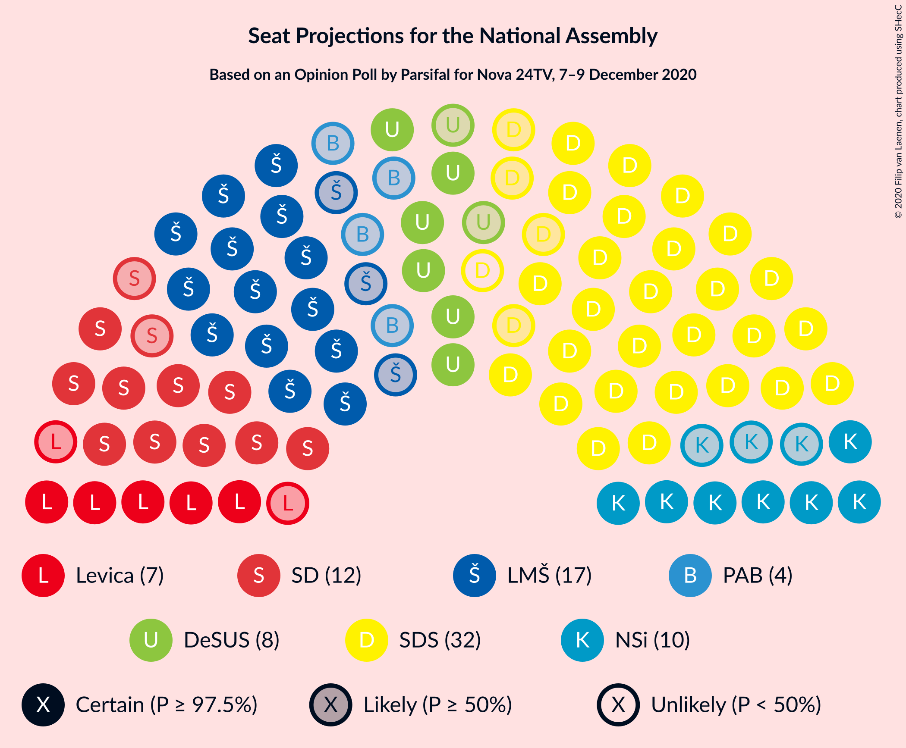
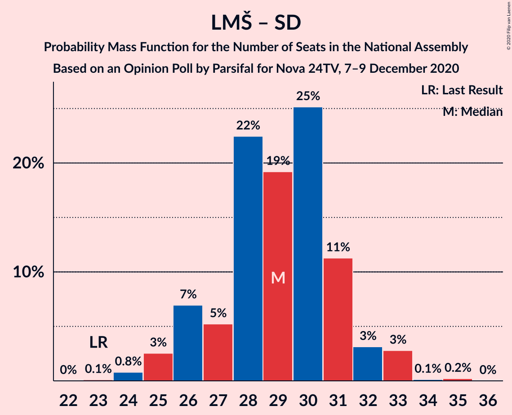

# Opinion Poll by Parsifal for Nova 24TV, 7–9 December 2020

<a href="#voting-intentions">Voting Intentions</a> | <a href="#seats">Seats</a> | <a href="#coalitions">Coalitions</a> | <a href="#technical-information">Technical Information</a>

## Voting Intentions

### Confidence Intervals

| Party | Last Result | Poll Result | 80% Confidence Interval | 90% Confidence Interval | 95% Confidence Interval | 99% Confidence Interval |
|:-----:|:-----------:|:-----------:|:-----------------------:|:-----------------------:|:-----------------------:|:-----------------------:|
| Slovenska demokratska stranka | 24.9% | 31.8% | 29.6–34.0% |29.0–34.7% |28.5–35.3% |27.5–36.4% |
| Lista Marjana Šarca | 12.6% | 17.3% | 15.6–19.2% |15.2–19.8% |14.8–20.3% |14.0–21.2% |
| Socialni demokrati | 9.9% | 12.5% | 11.1–14.2% |10.7–14.7% |10.3–15.1% |9.6–16.0% |
| Nova Slovenija–Krščanski demokrati | 7.2% | 10.2% | 8.9–11.8% |8.5–12.2% |8.2–12.6% |7.6–13.4% |
| Demokratična stranka upokojencev Slovenije | 4.9% | 8.7% | 7.5–10.2% |7.1–10.6% |6.8–10.9% |6.3–11.7% |
| Levica | 9.3% | 7.6% | 6.4–9.0% |6.1–9.4% |5.9–9.7% |5.3–10.4% |
| Stranka Alenke Bratušek | 5.1% | 4.1% | 3.3–5.2% |3.1–5.5% |2.9–5.8% |2.6–6.4% |
| Slovenska ljudska stranka | 2.6% | 2.6% | 2.0–3.6% |1.8–3.8% |1.7–4.1% |1.4–4.5% |
| Stranka modernega centra | 9.7% | 1.1% | 0.7–1.8% |0.6–2.0% |0.6–2.2% |0.4–2.5% |
| Slovenska nacionalna stranka | 4.2% | 0.7% | 0.4–1.3% |0.4–1.4% |0.3–1.6% |0.2–1.9% |

*Note:* The poll result column reflects the actual value used in the calculations. Published results may vary slightly, and in addition be rounded to fewer digits.

## Seats

### Confidence Intervals

| Party | Last Result | Median | 80% Confidence Interval | 90% Confidence Interval | 95% Confidence Interval | 99% Confidence Interval |
|:-----:|:-----------:|:------:|:-----------------------:|:-----------------------:|:-----------------------:|:-----------------------:|
| <a href="#slovenska-demokratska-stranka">Slovenska demokratska stranka</a> | 25 | 31 | 28–33 |28–34 |27–34 |26–36 |
| <a href="#lista-marjana-šarca">Lista Marjana Šarca</a> | 13 | 17 | 15–19 |14–19 |14–20 |14–20 |
| <a href="#socialni-demokrati">Socialni demokrati</a> | 10 | 12 | 11–13 |10–14 |10–14 |9–15 |
| <a href="#nova-slovenija–krščanski-demokrati">Nova Slovenija–Krščanski demokrati</a> | 7 | 10 | 8–11 |8–12 |7–12 |7–13 |
| <a href="#demokratična-stranka-upokojencev-slovenije">Demokratična stranka upokojencev Slovenije</a> | 5 | 8 | 7–9 |6–10 |6–10 |6–11 |
| <a href="#levica">Levica</a> | 9 | 7 | 6–9 |5–9 |5–9 |5–10 |
| <a href="#stranka-alenke-bratušek">Stranka Alenke Bratušek</a> | 5 | 4 | 0–5 |0–5 |0–5 |0–6 |
| <a href="#slovenska-ljudska-stranka">Slovenska ljudska stranka</a> | 0 | 0 | 0 |0 |0–3 |0–4 |
| <a href="#stranka-modernega-centra">Stranka modernega centra</a> | 10 | 0 | 0 |0 |0 |0 |
| <a href="#slovenska-nacionalna-stranka">Slovenska nacionalna stranka</a> | 4 | 0 | 0 |0 |0 |0 |

### Slovenska demokratska stranka

*For a full overview of the results for this party, see the [Slovenska demokratska stranka](party-slovenskademokratskastranka.html) page.*

| Number of Seats | Probability | Accumulated | Special Marks |
|:---------------:|:-----------:|:-----------:|:-------------:|
| 25 | 0.1% | 100% | Last Result |
| 26 | 0.9% | 99.9% |  |
| 27 | 2% | 99.0% |  |
| 28 | 15% | 97% |  |
| 29 | 9% | 81% |  |
| 30 | 13% | 73% |  |
| 31 | 21% | 60% | Median |
| 32 | 26% | 39% |  |
| 33 | 7% | 12% |  |
| 34 | 3% | 5% |  |
| 35 | 1.0% | 2% |  |
| 36 | 0.7% | 1.1% |  |
| 37 | 0.3% | 0.4% |  |
| 38 | 0% | 0% |  |

### Lista Marjana Šarca

*For a full overview of the results for this party, see the [Lista Marjana Šarca](party-listamarjanašarca.html) page.*

| Number of Seats | Probability | Accumulated | Special Marks |
|:---------------:|:-----------:|:-----------:|:-------------:|
| 12 | 0% | 100% |  |
| 13 | 0.4% | 99.9% | Last Result |
| 14 | 6% | 99.5% |  |
| 15 | 7% | 94% |  |
| 16 | 20% | 87% |  |
| 17 | 30% | 67% | Median |
| 18 | 23% | 37% |  |
| 19 | 9% | 14% |  |
| 20 | 4% | 4% |  |
| 21 | 0.4% | 0.4% |  |
| 22 | 0% | 0.1% |  |
| 23 | 0% | 0% |  |

### Socialni demokrati

*For a full overview of the results for this party, see the [Socialni demokrati](party-socialnidemokrati.html) page.*

| Number of Seats | Probability | Accumulated | Special Marks |
|:---------------:|:-----------:|:-----------:|:-------------:|
| 8 | 0.1% | 100% |  |
| 9 | 1.4% | 99.9% |  |
| 10 | 7% | 98.5% | Last Result |
| 11 | 30% | 92% |  |
| 12 | 26% | 62% | Median |
| 13 | 27% | 36% |  |
| 14 | 7% | 9% |  |
| 15 | 2% | 2% |  |
| 16 | 0.3% | 0.3% |  |
| 17 | 0% | 0% |  |

### Nova Slovenija–Krščanski demokrati

*For a full overview of the results for this party, see the [Nova Slovenija–Krščanski demokrati](party-novaslovenija–krščanskidemokrati.html) page.*

| Number of Seats | Probability | Accumulated | Special Marks |
|:---------------:|:-----------:|:-----------:|:-------------:|
| 6 | 0.1% | 100% |  |
| 7 | 3% | 99.9% | Last Result |
| 8 | 12% | 97% |  |
| 9 | 25% | 84% |  |
| 10 | 47% | 60% | Median |
| 11 | 6% | 13% |  |
| 12 | 6% | 6% |  |
| 13 | 0.7% | 0.8% |  |
| 14 | 0.1% | 0.1% |  |
| 15 | 0% | 0% |  |

### Demokratična stranka upokojencev Slovenije

*For a full overview of the results for this party, see the [Demokratična stranka upokojencev Slovenije](party-demokratičnastrankaupokojencevslovenije.html) page.*

| Number of Seats | Probability | Accumulated | Special Marks |
|:---------------:|:-----------:|:-----------:|:-------------:|
| 5 | 0.2% | 100% | Last Result |
| 6 | 6% | 99.8% |  |
| 7 | 25% | 94% |  |
| 8 | 35% | 70% | Median |
| 9 | 25% | 34% |  |
| 10 | 8% | 10% |  |
| 11 | 1.3% | 2% |  |
| 12 | 0.3% | 0.3% |  |
| 13 | 0% | 0% |  |

### Levica

*For a full overview of the results for this party, see the [Levica](party-levica.html) page.*

| Number of Seats | Probability | Accumulated | Special Marks |
|:---------------:|:-----------:|:-----------:|:-------------:|
| 4 | 0.2% | 100% |  |
| 5 | 7% | 99.8% |  |
| 6 | 18% | 93% |  |
| 7 | 48% | 76% | Median |
| 8 | 18% | 28% |  |
| 9 | 9% | 10% | Last Result |
| 10 | 1.1% | 1.2% |  |
| 11 | 0.1% | 0.1% |  |
| 12 | 0% | 0% |  |

### Stranka Alenke Bratušek

*For a full overview of the results for this party, see the [Stranka Alenke Bratušek](party-strankaalenkebratušek.html) page.*

| Number of Seats | Probability | Accumulated | Special Marks |
|:---------------:|:-----------:|:-----------:|:-------------:|
| 0 | 38% | 100% |  |
| 1 | 0% | 62% |  |
| 2 | 0% | 62% |  |
| 3 | 4% | 62% |  |
| 4 | 43% | 59% | Median |
| 5 | 14% | 16% | Last Result |
| 6 | 1.3% | 1.3% |  |
| 7 | 0% | 0% |  |

### Slovenska ljudska stranka

*For a full overview of the results for this party, see the [Slovenska ljudska stranka](party-slovenskaljudskastranka.html) page.*

| Number of Seats | Probability | Accumulated | Special Marks |
|:---------------:|:-----------:|:-----------:|:-------------:|
| 0 | 96% | 100% | Last Result, Median |
| 1 | 0% | 4% |  |
| 2 | 0% | 4% |  |
| 3 | 3% | 4% |  |
| 4 | 0.7% | 0.8% |  |
| 5 | 0% | 0% |  |

### Stranka modernega centra

*For a full overview of the results for this party, see the [Stranka modernega centra](party-strankamodernegacentra.html) page.*

| Number of Seats | Probability | Accumulated | Special Marks |
|:---------------:|:-----------:|:-----------:|:-------------:|
| 0 | 100% | 100% | Median |
| 1 | 0% | 0% |  |
| 2 | 0% | 0% |  |
| 3 | 0% | 0% |  |
| 4 | 0% | 0% |  |
| 5 | 0% | 0% |  |
| 6 | 0% | 0% |  |
| 7 | 0% | 0% |  |
| 8 | 0% | 0% |  |
| 9 | 0% | 0% |  |
| 10 | 0% | 0% | Last Result |

### Slovenska nacionalna stranka

*For a full overview of the results for this party, see the [Slovenska nacionalna stranka](party-slovenskanacionalnastranka.html) page.*

| Number of Seats | Probability | Accumulated | Special Marks |
|:---------------:|:-----------:|:-----------:|:-------------:|
| 0 | 100% | 100% | Median |
| 1 | 0% | 0% |  |
| 2 | 0% | 0% |  |
| 3 | 0% | 0% |  |
| 4 | 0% | 0% | Last Result |

## Coalitions

### Confidence Intervals

| Coalition | Last Result | Median | Majority? | 80% Confidence Interval | 90% Confidence Interval | 95% Confidence Interval | 99% Confidence Interval |
|:---------:|:-----------:|:------:|:---------:|:-----------------------:|:-----------------------:|:-----------------------:|:-----------------------:|
| Slovenska demokratska stranka – Lista Marjana Šarca – Demokratična stranka upokojencev Slovenije | 43 | 56 | 100% | 53–59 | 53–59 | 52–60 | 51–61 |
| Lista Marjana Šarca – Socialni demokrati – Nova Slovenija–Krščanski demokrati – Demokratična stranka upokojencev Slovenije – Stranka Alenke Bratušek – Stranka modernega centra | 50 | 49 | 90% | 46–53 | 45–53 | 45–53 | 43–55 |
| Slovenska demokratska stranka – Lista Marjana Šarca | 38 | 47 | 89% | 45–51 | 44–51 | 44–52 | 43–53 |
| Lista Marjana Šarca – Socialni demokrati – Nova Slovenija–Krščanski demokrati – Demokratična stranka upokojencev Slovenije | 35 | 47 | 68% | 44–50 | 43–50 | 42–51 | 41–52 |
| Lista Marjana Šarca – Socialni demokrati – Nova Slovenija–Krščanski demokrati – Demokratična stranka upokojencev Slovenije – Stranka modernega centra | 45 | 47 | 68% | 44–50 | 43–50 | 42–51 | 41–52 |
| Lista Marjana Šarca – Socialni demokrati – Demokratična stranka upokojencev Slovenije – Stranka Alenke Bratušek – Stranka modernega centra | 43 | 39 | 0.1% | 36–43 | 35–43 | 35–44 | 33–45 |
| Lista Marjana Šarca – Socialni demokrati – Nova Slovenija–Krščanski demokrati | 30 | 39 | 0% | 36–41 | 35–42 | 35–42 | 33–44 |
| Lista Marjana Šarca – Socialni demokrati – Nova Slovenija–Krščanski demokrati – Stranka modernega centra | 40 | 39 | 0% | 36–41 | 35–42 | 35–42 | 33–44 |
| Lista Marjana Šarca – Socialni demokrati – Demokratična stranka upokojencev Slovenije | 28 | 38 | 0% | 35–40 | 34–41 | 33–41 | 32–42 |
| Lista Marjana Šarca – Socialni demokrati – Demokratična stranka upokojencev Slovenije – Stranka modernega centra | 38 | 38 | 0% | 35–40 | 34–41 | 33–41 | 32–42 |
| Lista Marjana Šarca – Socialni demokrati | 23 | 29 | 0% | 26–31 | 26–32 | 25–33 | 24–33 |
| Lista Marjana Šarca – Socialni demokrati – Stranka modernega centra | 33 | 29 | 0% | 26–31 | 26–32 | 25–33 | 24–33 |
| Socialni demokrati – Demokratična stranka upokojencev Slovenije – Stranka modernega centra | 25 | 20 | 0% | 18–22 | 18–23 | 17–23 | 16–24 |

### Slovenska demokratska stranka – Lista Marjana Šarca – Demokratična stranka upokojencev Slovenije

| Number of Seats | Probability | Accumulated | Special Marks |
|:---------------:|:-----------:|:-----------:|:-------------:|
| 43 | 0% | 100% | Last Result |
| 44 | 0% | 100% |  |
| 45 | 0% | 100% |  |
| 46 | 0% | 100% | Majority |
| 47 | 0% | 100% |  |
| 48 | 0.1% | 100% |  |
| 49 | 0.1% | 99.9% |  |
| 50 | 0.2% | 99.8% |  |
| 51 | 1.3% | 99.6% |  |
| 52 | 3% | 98% |  |
| 53 | 10% | 95% |  |
| 54 | 13% | 85% |  |
| 55 | 17% | 73% |  |
| 56 | 23% | 56% | Median |
| 57 | 10% | 32% |  |
| 58 | 10% | 23% |  |
| 59 | 9% | 13% |  |
| 60 | 2% | 4% |  |
| 61 | 2% | 2% |  |
| 62 | 0.2% | 0.4% |  |
| 63 | 0.1% | 0.2% |  |
| 64 | 0.1% | 0.1% |  |
| 65 | 0% | 0% |  |

### Lista Marjana Šarca – Socialni demokrati – Nova Slovenija–Krščanski demokrati – Demokratična stranka upokojencev Slovenije – Stranka Alenke Bratušek – Stranka modernega centra

| Number of Seats | Probability | Accumulated | Special Marks |
|:---------------:|:-----------:|:-----------:|:-------------:|
| 41 | 0.1% | 100% |  |
| 42 | 0.1% | 99.9% |  |
| 43 | 0.4% | 99.8% |  |
| 44 | 0.8% | 99.5% |  |
| 45 | 8% | 98.7% |  |
| 46 | 5% | 90% | Majority |
| 47 | 8% | 85% |  |
| 48 | 8% | 77% |  |
| 49 | 21% | 69% |  |
| 50 | 12% | 48% | Last Result |
| 51 | 21% | 37% | Median |
| 52 | 4% | 15% |  |
| 53 | 10% | 12% |  |
| 54 | 1.2% | 2% |  |
| 55 | 0.4% | 0.6% |  |
| 56 | 0.2% | 0.3% |  |
| 57 | 0% | 0% |  |

### Slovenska demokratska stranka – Lista Marjana Šarca

| Number of Seats | Probability | Accumulated | Special Marks |
|:---------------:|:-----------:|:-----------:|:-------------:|
| 38 | 0% | 100% | Last Result |
| 39 | 0% | 100% |  |
| 40 | 0% | 100% |  |
| 41 | 0% | 99.9% |  |
| 42 | 0.3% | 99.9% |  |
| 43 | 0.8% | 99.6% |  |
| 44 | 4% | 98.8% |  |
| 45 | 6% | 95% |  |
| 46 | 20% | 89% | Majority |
| 47 | 20% | 69% |  |
| 48 | 10% | 49% | Median |
| 49 | 22% | 39% |  |
| 50 | 6% | 17% |  |
| 51 | 8% | 11% |  |
| 52 | 2% | 3% |  |
| 53 | 0.9% | 1.3% |  |
| 54 | 0.2% | 0.3% |  |
| 55 | 0.1% | 0.2% |  |
| 56 | 0% | 0% |  |

### Lista Marjana Šarca – Socialni demokrati – Nova Slovenija–Krščanski demokrati – Demokratična stranka upokojencev Slovenije

| Number of Seats | Probability | Accumulated | Special Marks |
|:---------------:|:-----------:|:-----------:|:-------------:|
| 35 | 0% | 100% | Last Result |
| 36 | 0% | 100% |  |
| 37 | 0% | 100% |  |
| 38 | 0% | 100% |  |
| 39 | 0% | 100% |  |
| 40 | 0.1% | 100% |  |
| 41 | 2% | 99.9% |  |
| 42 | 2% | 98% |  |
| 43 | 5% | 97% |  |
| 44 | 3% | 91% |  |
| 45 | 20% | 88% |  |
| 46 | 12% | 68% | Majority |
| 47 | 19% | 56% | Median |
| 48 | 17% | 37% |  |
| 49 | 10% | 21% |  |
| 50 | 7% | 11% |  |
| 51 | 3% | 4% |  |
| 52 | 0.6% | 1.1% |  |
| 53 | 0.4% | 0.4% |  |
| 54 | 0% | 0% |  |

### Lista Marjana Šarca – Socialni demokrati – Nova Slovenija–Krščanski demokrati – Demokratična stranka upokojencev Slovenije – Stranka modernega centra

| Number of Seats | Probability | Accumulated | Special Marks |
|:---------------:|:-----------:|:-----------:|:-------------:|
| 40 | 0.1% | 100% |  |
| 41 | 2% | 99.9% |  |
| 42 | 2% | 98% |  |
| 43 | 5% | 97% |  |
| 44 | 3% | 91% |  |
| 45 | 20% | 88% | Last Result |
| 46 | 12% | 68% | Majority |
| 47 | 19% | 56% | Median |
| 48 | 17% | 37% |  |
| 49 | 10% | 21% |  |
| 50 | 7% | 11% |  |
| 51 | 3% | 4% |  |
| 52 | 0.6% | 1.1% |  |
| 53 | 0.4% | 0.4% |  |
| 54 | 0% | 0% |  |

### Lista Marjana Šarca – Socialni demokrati – Demokratična stranka upokojencev Slovenije – Stranka Alenke Bratušek – Stranka modernega centra

| Number of Seats | Probability | Accumulated | Special Marks |
|:---------------:|:-----------:|:-----------:|:-------------:|
| 32 | 0.1% | 100% |  |
| 33 | 0.6% | 99.9% |  |
| 34 | 0.7% | 99.4% |  |
| 35 | 5% | 98.6% |  |
| 36 | 5% | 93% |  |
| 37 | 4% | 89% |  |
| 38 | 11% | 85% |  |
| 39 | 24% | 74% |  |
| 40 | 8% | 50% |  |
| 41 | 15% | 42% | Median |
| 42 | 16% | 27% |  |
| 43 | 8% | 11% | Last Result |
| 44 | 2% | 3% |  |
| 45 | 2% | 2% |  |
| 46 | 0% | 0.1% | Majority |
| 47 | 0.1% | 0.1% |  |
| 48 | 0% | 0% |  |

### Lista Marjana Šarca – Socialni demokrati – Nova Slovenija–Krščanski demokrati

| Number of Seats | Probability | Accumulated | Special Marks |
|:---------------:|:-----------:|:-----------:|:-------------:|
| 30 | 0% | 100% | Last Result |
| 31 | 0% | 100% |  |
| 32 | 0.1% | 100% |  |
| 33 | 2% | 99.9% |  |
| 34 | 0.8% | 98% |  |
| 35 | 3% | 98% |  |
| 36 | 10% | 94% |  |
| 37 | 7% | 84% |  |
| 38 | 27% | 77% |  |
| 39 | 12% | 50% | Median |
| 40 | 23% | 38% |  |
| 41 | 9% | 15% |  |
| 42 | 4% | 6% |  |
| 43 | 1.0% | 2% |  |
| 44 | 0.6% | 0.9% |  |
| 45 | 0.3% | 0.3% |  |
| 46 | 0% | 0% | Majority |

### Lista Marjana Šarca – Socialni demokrati – Nova Slovenija–Krščanski demokrati – Stranka modernega centra

| Number of Seats | Probability | Accumulated | Special Marks |
|:---------------:|:-----------:|:-----------:|:-------------:|
| 32 | 0.1% | 100% |  |
| 33 | 2% | 99.9% |  |
| 34 | 0.8% | 98% |  |
| 35 | 3% | 98% |  |
| 36 | 10% | 94% |  |
| 37 | 7% | 84% |  |
| 38 | 27% | 77% |  |
| 39 | 12% | 50% | Median |
| 40 | 23% | 38% | Last Result |
| 41 | 9% | 15% |  |
| 42 | 4% | 6% |  |
| 43 | 1.0% | 2% |  |
| 44 | 0.6% | 0.9% |  |
| 45 | 0.3% | 0.3% |  |
| 46 | 0% | 0% | Majority |

### Lista Marjana Šarca – Socialni demokrati – Demokratična stranka upokojencev Slovenije

| Number of Seats | Probability | Accumulated | Special Marks |
|:---------------:|:-----------:|:-----------:|:-------------:|
| 28 | 0% | 100% | Last Result |
| 29 | 0% | 100% |  |
| 30 | 0% | 100% |  |
| 31 | 0.3% | 100% |  |
| 32 | 0.5% | 99.6% |  |
| 33 | 3% | 99.1% |  |
| 34 | 4% | 96% |  |
| 35 | 20% | 92% |  |
| 36 | 13% | 72% |  |
| 37 | 8% | 59% | Median |
| 38 | 30% | 51% |  |
| 39 | 10% | 21% |  |
| 40 | 4% | 11% |  |
| 41 | 7% | 7% |  |
| 42 | 0.5% | 0.8% |  |
| 43 | 0.2% | 0.2% |  |
| 44 | 0.1% | 0.1% |  |
| 45 | 0% | 0% |  |

### Lista Marjana Šarca – Socialni demokrati – Demokratična stranka upokojencev Slovenije – Stranka modernega centra

| Number of Seats | Probability | Accumulated | Special Marks |
|:---------------:|:-----------:|:-----------:|:-------------:|
| 31 | 0.3% | 100% |  |
| 32 | 0.5% | 99.6% |  |
| 33 | 3% | 99.1% |  |
| 34 | 4% | 96% |  |
| 35 | 20% | 92% |  |
| 36 | 13% | 72% |  |
| 37 | 8% | 59% | Median |
| 38 | 30% | 51% | Last Result |
| 39 | 10% | 21% |  |
| 40 | 4% | 11% |  |
| 41 | 7% | 7% |  |
| 42 | 0.5% | 0.8% |  |
| 43 | 0.2% | 0.2% |  |
| 44 | 0.1% | 0.1% |  |
| 45 | 0% | 0% |  |

### Lista Marjana Šarca – Socialni demokrati

| Number of Seats | Probability | Accumulated | Special Marks |
|:---------------:|:-----------:|:-----------:|:-------------:|
| 23 | 0.1% | 100% | Last Result |
| 24 | 0.8% | 99.9% |  |
| 25 | 3% | 99.1% |  |
| 26 | 7% | 97% |  |
| 27 | 5% | 90% |  |
| 28 | 22% | 84% |  |
| 29 | 19% | 62% | Median |
| 30 | 25% | 43% |  |
| 31 | 11% | 18% |  |
| 32 | 3% | 6% |  |
| 33 | 3% | 3% |  |
| 34 | 0.1% | 0.4% |  |
| 35 | 0.2% | 0.2% |  |
| 36 | 0% | 0% |  |

### Lista Marjana Šarca – Socialni demokrati – Stranka modernega centra

| Number of Seats | Probability | Accumulated | Special Marks |
|:---------------:|:-----------:|:-----------:|:-------------:|
| 23 | 0.1% | 100% |  |
| 24 | 0.8% | 99.9% |  |
| 25 | 3% | 99.1% |  |
| 26 | 7% | 97% |  |
| 27 | 5% | 90% |  |
| 28 | 22% | 84% |  |
| 29 | 19% | 62% | Median |
| 30 | 25% | 43% |  |
| 31 | 11% | 18% |  |
| 32 | 3% | 6% |  |
| 33 | 3% | 3% | Last Result |
| 34 | 0.1% | 0.4% |  |
| 35 | 0.2% | 0.2% |  |
| 36 | 0% | 0% |  |

### Socialni demokrati – Demokratična stranka upokojencev Slovenije – Stranka modernega centra

| Number of Seats | Probability | Accumulated | Special Marks |
|:---------------:|:-----------:|:-----------:|:-------------:|
| 15 | 0.1% | 100% |  |
| 16 | 1.2% | 99.9% |  |
| 17 | 3% | 98.7% |  |
| 18 | 15% | 96% |  |
| 19 | 21% | 81% |  |
| 20 | 20% | 59% | Median |
| 21 | 14% | 39% |  |
| 22 | 18% | 25% |  |
| 23 | 6% | 7% |  |
| 24 | 1.2% | 1.5% |  |
| 25 | 0.2% | 0.2% | Last Result |
| 26 | 0.1% | 0.1% |  |
| 27 | 0% | 0% |  |

## Technical Information

### Opinion Poll

+ **Polling firm:** Parsifal
+ **Commissioner(s):** Nova 24TV
+ **Fieldwork period:** 7–9 December 2020

### Calculations

+ **Sample size:** 727
+ **Simulations done:** 1,048,576
+ **Error estimate:** 1.16%

