# Opinion Poll by Ninamedia for Dnevnik, 15–17 December 2020

<a href="#voting-intentions">Voting Intentions</a> | <a href="#seats">Seats</a> | <a href="#coalitions">Coalitions</a> | <a href="#technical-information">Technical Information</a>

## Voting Intentions

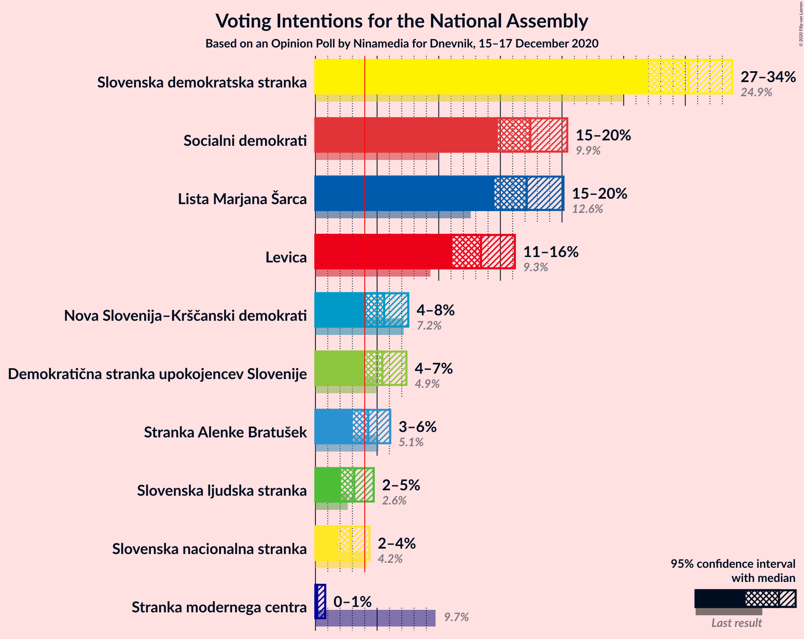

### Confidence Intervals

| Party | Last Result | Poll Result | 80% Confidence Interval | 90% Confidence Interval | 95% Confidence Interval | 99% Confidence Interval |
|:-----:|:-----------:|:-----------:|:-----------------------:|:-----------------------:|:-----------------------:|:-----------------------:|
| Slovenska demokratska stranka | 24.9% | 30.3% | 28.1–32.6% |27.5–33.2% |27.0–33.8% |26.0–34.9% |
| Socialni demokrati | 9.9% | 17.4% | 15.7–19.4% |15.2–19.9% |14.8–20.4% |14.0–21.4% |
| Lista Marjana Šarca | 12.6% | 17.1% | 15.4–19.1% |14.9–19.6% |14.5–20.1% |13.7–21.1% |
| Levica | 9.3% | 13.4% | 11.9–15.2% |11.5–15.7% |11.1–16.2% |10.4–17.1% |
| Nova Slovenija–Krščanski demokrati | 7.2% | 5.6% | 4.6–6.8% |4.3–7.2% |4.1–7.5% |3.7–8.2% |
| Demokratična stranka upokojencev Slovenije | 4.9% | 5.4% | 4.5–6.7% |4.2–7.1% |4.0–7.4% |3.6–8.0% |
| Stranka Alenke Bratušek | 5.1% | 4.3% | 3.4–5.4% |3.2–5.8% |3.0–6.1% |2.7–6.7% |
| Slovenska ljudska stranka | 2.6% | 3.1% | 2.4–4.2% |2.2–4.5% |2.1–4.7% |1.8–5.3% |
| Slovenska nacionalna stranka | 4.2% | 2.9% | 2.2–3.8% |2.0–4.1% |1.9–4.4% |1.6–4.9% |
| Stranka modernega centra | 9.7% | 0.1% | 0.1–0.6% |0.0–0.7% |0.0–0.8% |0.0–1.1% |

*Note:* The poll result column reflects the actual value used in the calculations. Published results may vary slightly, and in addition be rounded to fewer digits.

## Seats

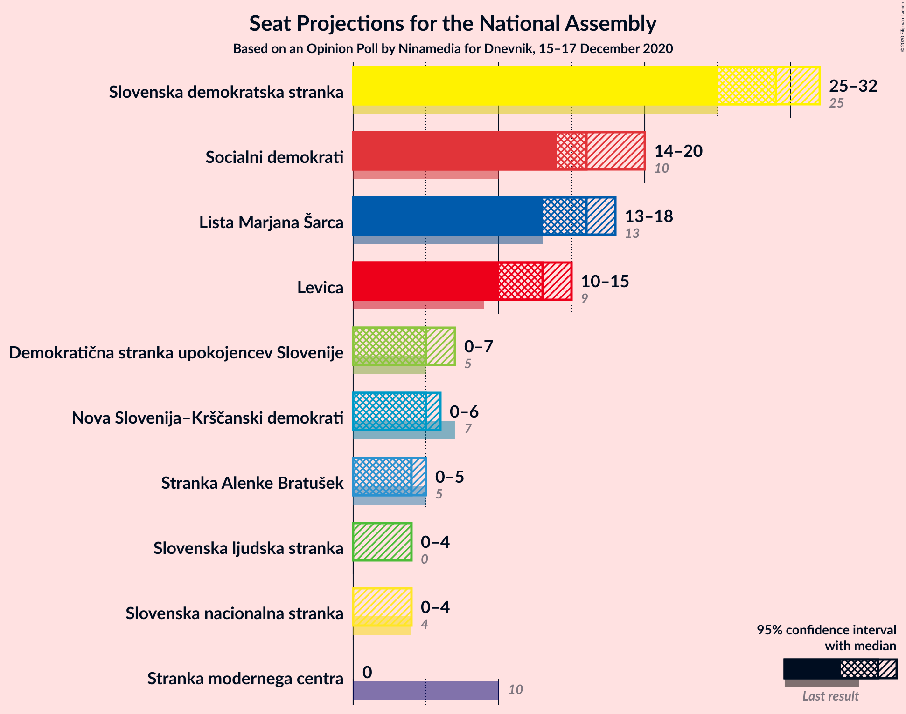

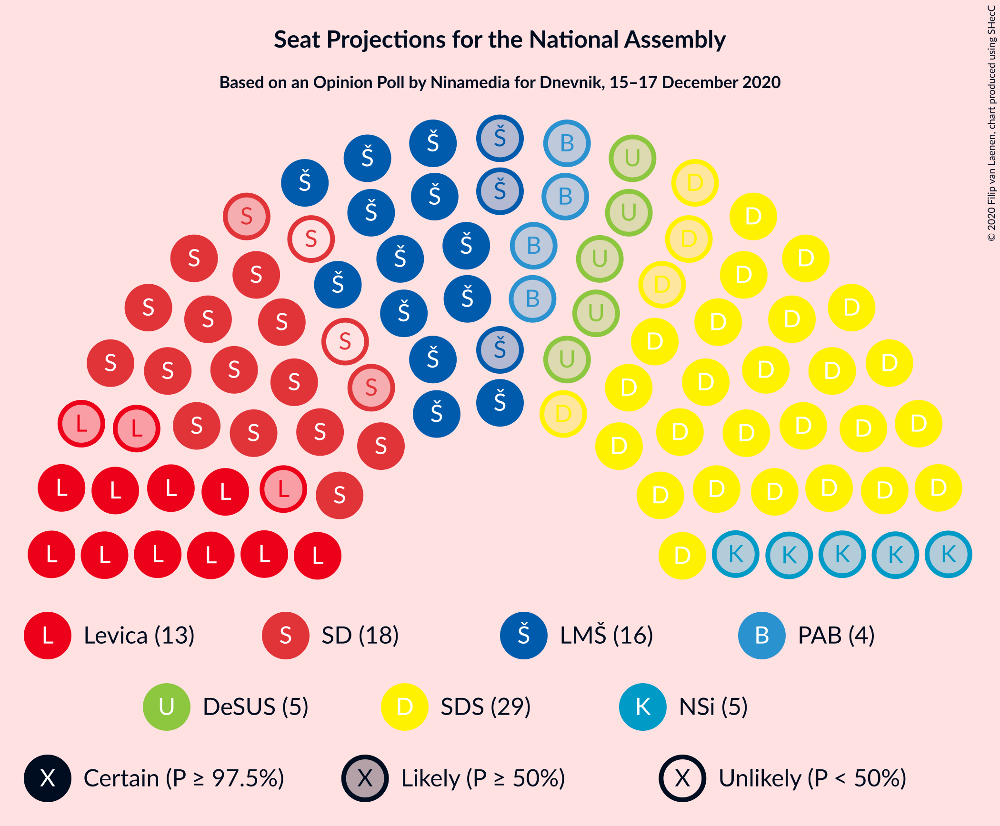

### Confidence Intervals

| Party | Last Result | Median | 80% Confidence Interval | 90% Confidence Interval | 95% Confidence Interval | 99% Confidence Interval |
|:-----:|:-----------:|:------:|:-----------------------:|:-----------------------:|:-----------------------:|:-----------------------:|
| <a href="#slovenska-demokratska-stranka">Slovenska demokratska stranka</a> | 25 | 29 | 27–31 |27–32 |25–32 |25–33 |
| <a href="#socialni-demokrati">Socialni demokrati</a> | 10 | 16 | 15–18 |14–19 |14–20 |13–20 |
| <a href="#lista-marjana-šarca">Lista Marjana Šarca</a> | 13 | 16 | 14–18 |13–18 |13–18 |13–20 |
| <a href="#levica">Levica</a> | 9 | 13 | 11–14 |10–15 |10–15 |9–16 |
| <a href="#nova-slovenija–krščanski-demokrati">Nova Slovenija–Krščanski demokrati</a> | 7 | 5 | 4–6 |3–6 |0–6 |0–7 |
| <a href="#demokratična-stranka-upokojencev-slovenije">Demokratična stranka upokojencev Slovenije</a> | 5 | 5 | 4–6 |4–6 |0–7 |0–7 |
| <a href="#stranka-alenke-bratušek">Stranka Alenke Bratušek</a> | 5 | 4 | 0–5 |0–5 |0–5 |0–6 |
| <a href="#slovenska-ljudska-stranka">Slovenska ljudska stranka</a> | 0 | 0 | 0–4 |0–4 |0–4 |0–4 |
| <a href="#slovenska-nacionalna-stranka">Slovenska nacionalna stranka</a> | 4 | 0 | 0 |0–3 |0–4 |0–4 |
| <a href="#stranka-modernega-centra">Stranka modernega centra</a> | 10 | 0 | 0 |0 |0 |0 |

### Slovenska demokratska stranka

*For a full overview of the results for this party, see the [Slovenska demokratska stranka](party-slovenskademokratskastranka.html) page.*

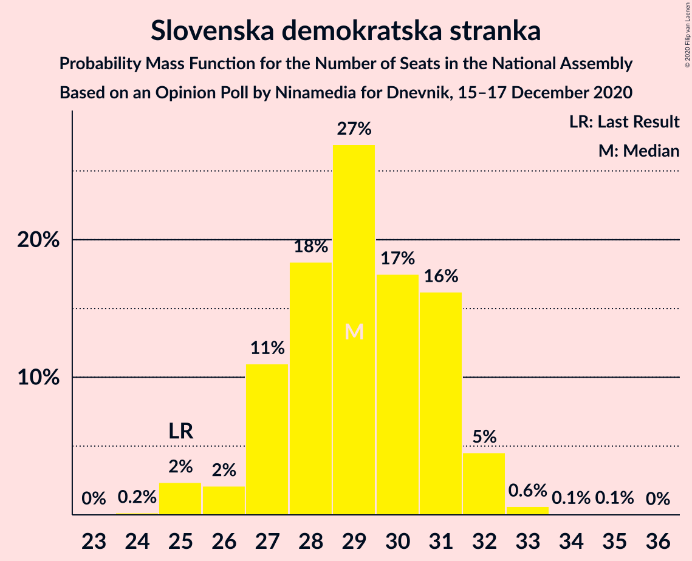

| Number of Seats | Probability | Accumulated | Special Marks |
|:---------------:|:-----------:|:-----------:|:-------------:|
| 23 | 0% | 100% |  |
| 24 | 0.2% | 99.9% |  |
| 25 | 2% | 99.8% | Last Result |
| 26 | 2% | 97% |  |
| 27 | 11% | 95% |  |
| 28 | 18% | 84% |  |
| 29 | 27% | 66% | Median |
| 30 | 17% | 39% |  |
| 31 | 16% | 22% |  |
| 32 | 5% | 5% |  |
| 33 | 0.6% | 0.8% |  |
| 34 | 0.1% | 0.2% |  |
| 35 | 0.1% | 0.1% |  |
| 36 | 0% | 0% |  |

### Socialni demokrati

*For a full overview of the results for this party, see the [Socialni demokrati](party-socialnidemokrati.html) page.*

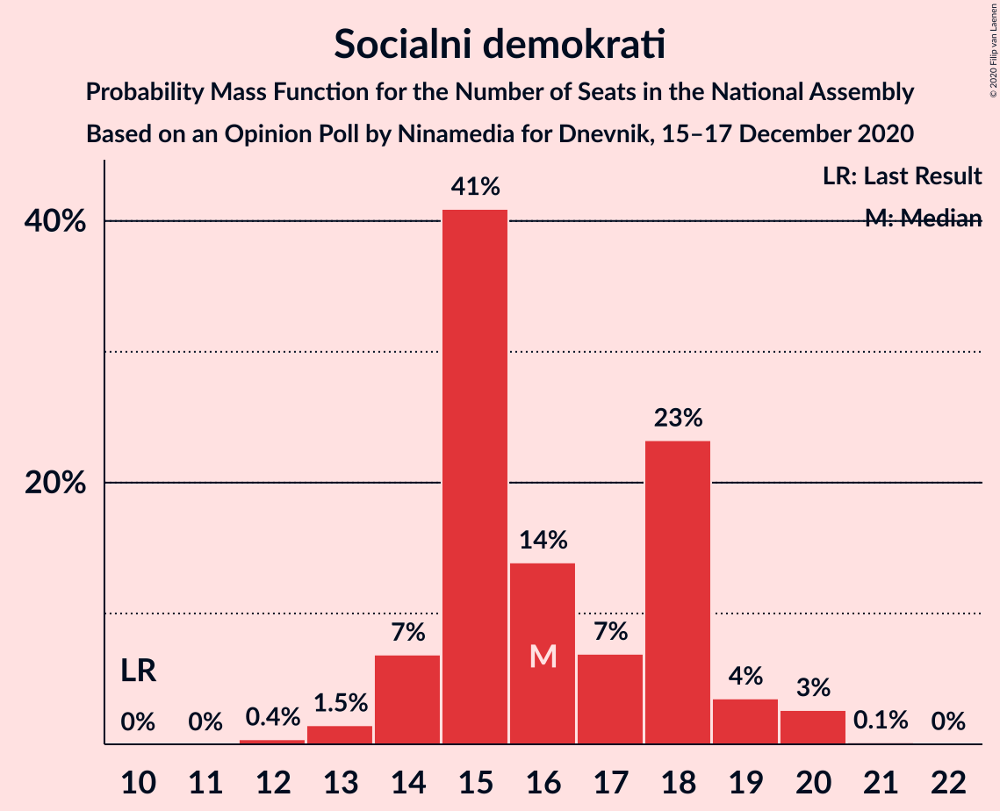

| Number of Seats | Probability | Accumulated | Special Marks |
|:---------------:|:-----------:|:-----------:|:-------------:|
| 10 | 0% | 100% | Last Result |
| 11 | 0% | 100% |  |
| 12 | 0.4% | 100% |  |
| 13 | 1.5% | 99.6% |  |
| 14 | 7% | 98% |  |
| 15 | 41% | 91% |  |
| 16 | 14% | 50% | Median |
| 17 | 7% | 36% |  |
| 18 | 23% | 30% |  |
| 19 | 4% | 6% |  |
| 20 | 3% | 3% |  |
| 21 | 0.1% | 0.2% |  |
| 22 | 0% | 0% |  |

### Lista Marjana Šarca

*For a full overview of the results for this party, see the [Lista Marjana Šarca](party-listamarjanašarca.html) page.*

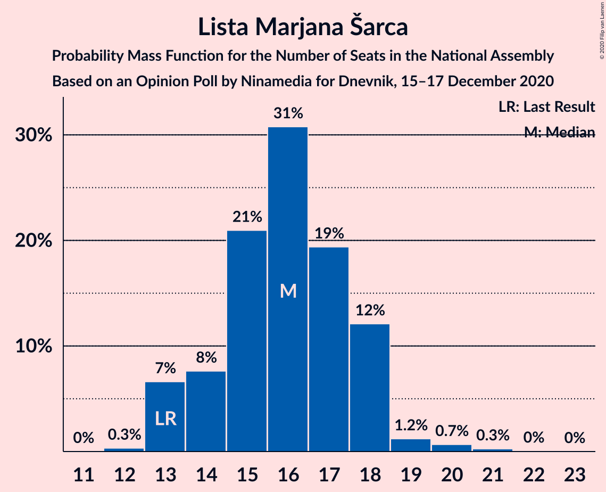

| Number of Seats | Probability | Accumulated | Special Marks |
|:---------------:|:-----------:|:-----------:|:-------------:|
| 12 | 0.3% | 100% |  |
| 13 | 7% | 99.7% | Last Result |
| 14 | 8% | 93% |  |
| 15 | 21% | 85% |  |
| 16 | 31% | 64% | Median |
| 17 | 19% | 34% |  |
| 18 | 12% | 14% |  |
| 19 | 1.2% | 2% |  |
| 20 | 0.7% | 1.0% |  |
| 21 | 0.3% | 0.3% |  |
| 22 | 0% | 0.1% |  |
| 23 | 0% | 0% |  |

### Levica

*For a full overview of the results for this party, see the [Levica](party-levica.html) page.*

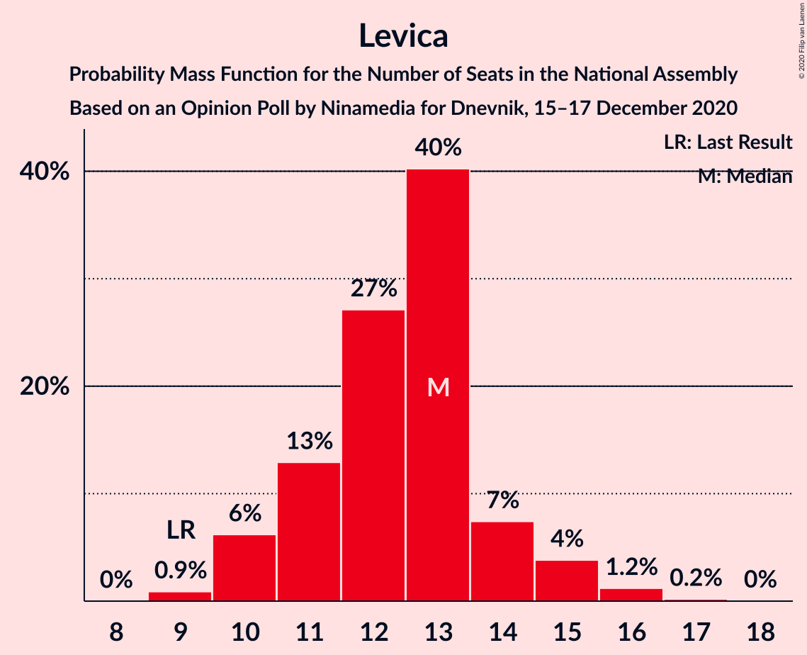

| Number of Seats | Probability | Accumulated | Special Marks |
|:---------------:|:-----------:|:-----------:|:-------------:|
| 9 | 0.9% | 100% | Last Result |
| 10 | 6% | 99.1% |  |
| 11 | 13% | 93% |  |
| 12 | 27% | 80% |  |
| 13 | 40% | 53% | Median |
| 14 | 7% | 13% |  |
| 15 | 4% | 5% |  |
| 16 | 1.2% | 1.4% |  |
| 17 | 0.2% | 0.2% |  |
| 18 | 0% | 0% |  |

### Nova Slovenija–Krščanski demokrati

*For a full overview of the results for this party, see the [Nova Slovenija–Krščanski demokrati](party-novaslovenija–krščanskidemokrati.html) page.*

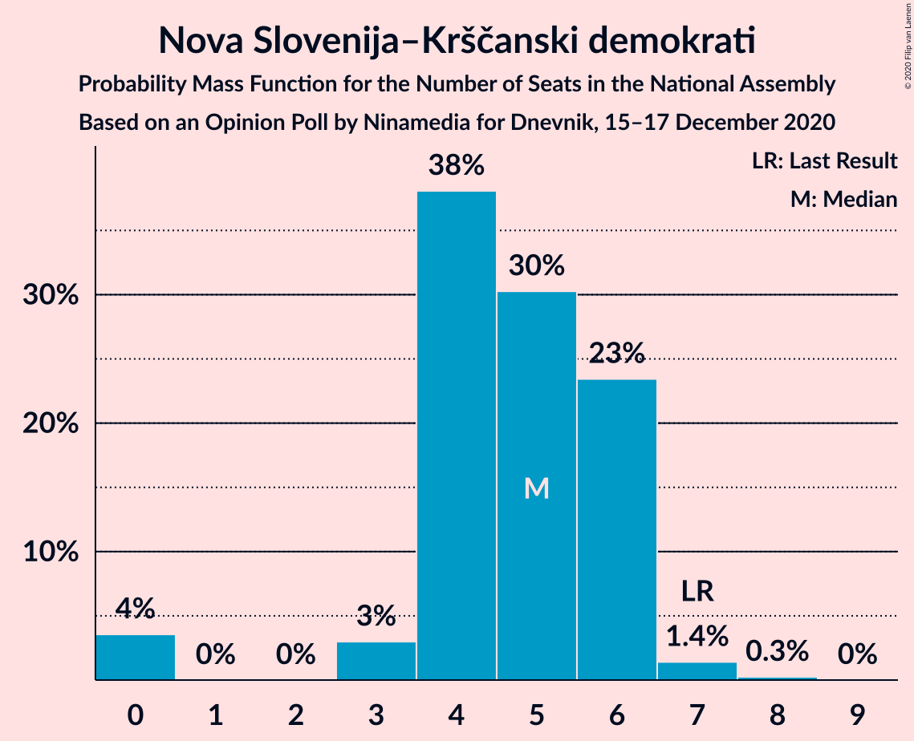

| Number of Seats | Probability | Accumulated | Special Marks |
|:---------------:|:-----------:|:-----------:|:-------------:|
| 0 | 4% | 100% |  |
| 1 | 0% | 96% |  |
| 2 | 0% | 96% |  |
| 3 | 3% | 96% |  |
| 4 | 38% | 93% |  |
| 5 | 30% | 55% | Median |
| 6 | 23% | 25% |  |
| 7 | 1.4% | 2% | Last Result |
| 8 | 0.3% | 0.3% |  |
| 9 | 0% | 0% |  |

### Demokratična stranka upokojencev Slovenije

*For a full overview of the results for this party, see the [Demokratična stranka upokojencev Slovenije](party-demokratičnastrankaupokojencevslovenije.html) page.*

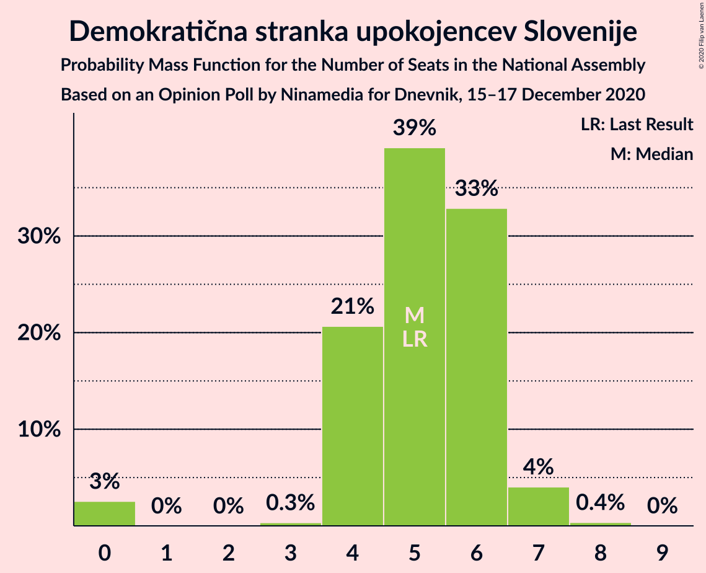

| Number of Seats | Probability | Accumulated | Special Marks |
|:---------------:|:-----------:|:-----------:|:-------------:|
| 0 | 3% | 100% |  |
| 1 | 0% | 97% |  |
| 2 | 0% | 97% |  |
| 3 | 0.3% | 97% |  |
| 4 | 21% | 97% |  |
| 5 | 39% | 76% | Last Result, Median |
| 6 | 33% | 37% |  |
| 7 | 4% | 4% |  |
| 8 | 0.4% | 0.4% |  |
| 9 | 0% | 0% |  |

### Stranka Alenke Bratušek

*For a full overview of the results for this party, see the [Stranka Alenke Bratušek](party-strankaalenkebratušek.html) page.*

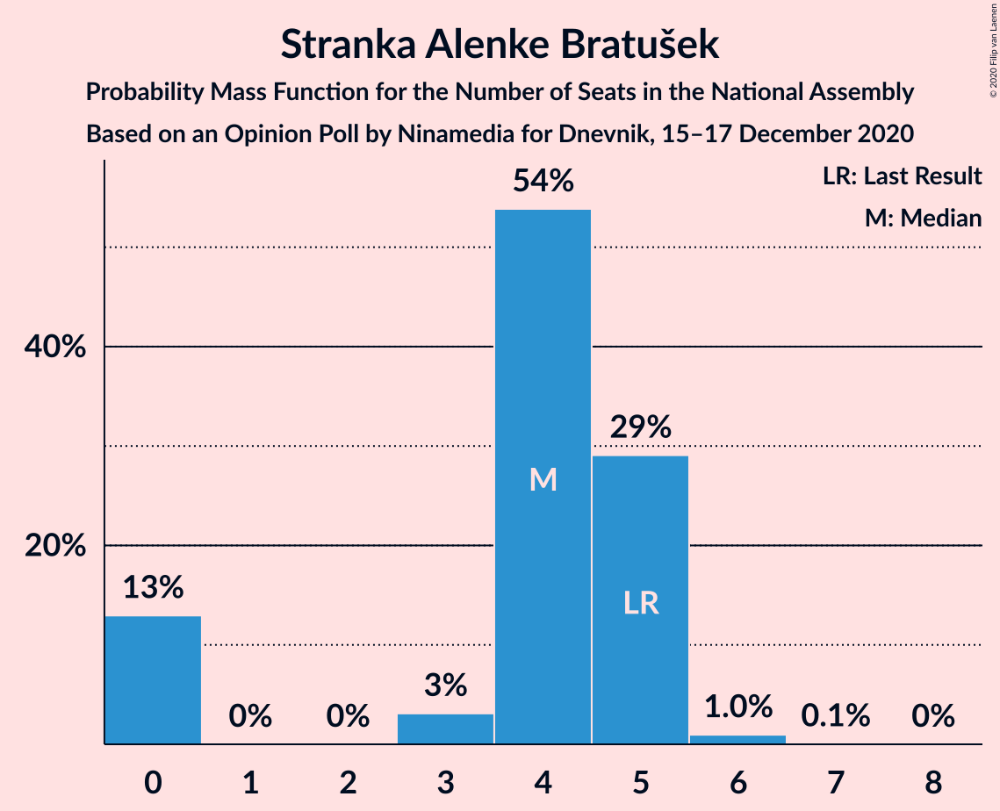

| Number of Seats | Probability | Accumulated | Special Marks |
|:---------------:|:-----------:|:-----------:|:-------------:|
| 0 | 13% | 100% |  |
| 1 | 0% | 87% |  |
| 2 | 0% | 87% |  |
| 3 | 3% | 87% |  |
| 4 | 54% | 84% | Median |
| 5 | 29% | 30% | Last Result |
| 6 | 1.0% | 1.0% |  |
| 7 | 0.1% | 0.1% |  |
| 8 | 0% | 0% |  |

### Slovenska ljudska stranka

*For a full overview of the results for this party, see the [Slovenska ljudska stranka](party-slovenskaljudskastranka.html) page.*

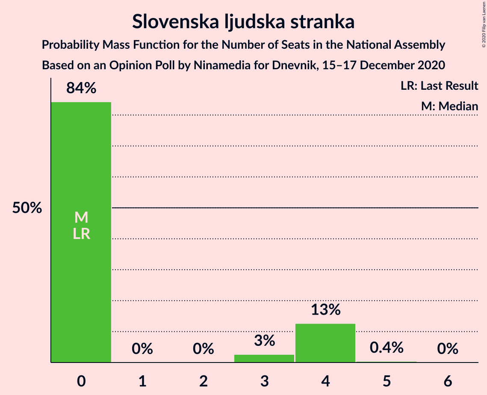

| Number of Seats | Probability | Accumulated | Special Marks |
|:---------------:|:-----------:|:-----------:|:-------------:|
| 0 | 84% | 100% | Last Result, Median |
| 1 | 0% | 16% |  |
| 2 | 0% | 16% |  |
| 3 | 3% | 16% |  |
| 4 | 13% | 13% |  |
| 5 | 0.4% | 0.4% |  |
| 6 | 0% | 0% |  |

### Slovenska nacionalna stranka

*For a full overview of the results for this party, see the [Slovenska nacionalna stranka](party-slovenskanacionalnastranka.html) page.*

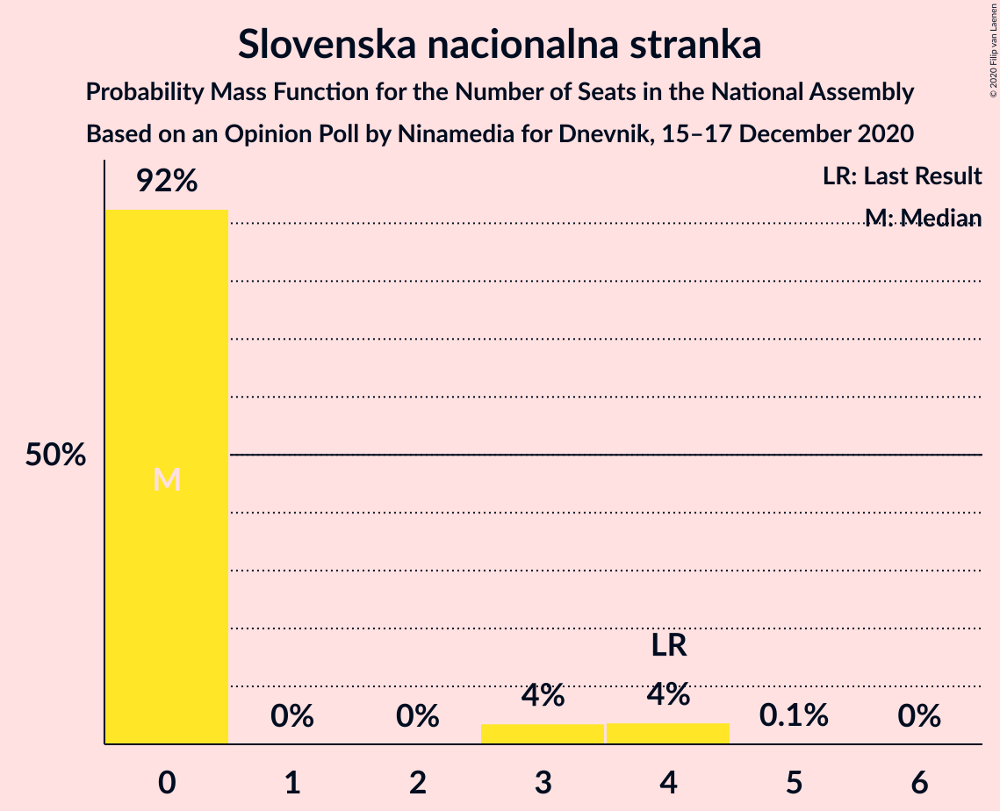

| Number of Seats | Probability | Accumulated | Special Marks |
|:---------------:|:-----------:|:-----------:|:-------------:|
| 0 | 92% | 100% | Median |
| 1 | 0% | 8% |  |
| 2 | 0% | 8% |  |
| 3 | 4% | 8% |  |
| 4 | 4% | 4% | Last Result |
| 5 | 0.1% | 0.2% |  |
| 6 | 0% | 0% |  |

### Stranka modernega centra

*For a full overview of the results for this party, see the [Stranka modernega centra](party-strankamodernegacentra.html) page.*

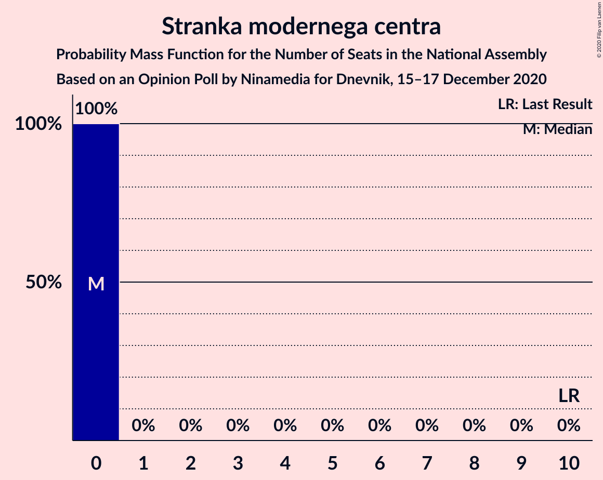

| Number of Seats | Probability | Accumulated | Special Marks |
|:---------------:|:-----------:|:-----------:|:-------------:|
| 0 | 100% | 100% | Median |
| 1 | 0% | 0% |  |
| 2 | 0% | 0% |  |
| 3 | 0% | 0% |  |
| 4 | 0% | 0% |  |
| 5 | 0% | 0% |  |
| 6 | 0% | 0% |  |
| 7 | 0% | 0% |  |
| 8 | 0% | 0% |  |
| 9 | 0% | 0% |  |
| 10 | 0% | 0% | Last Result |

## Coalitions

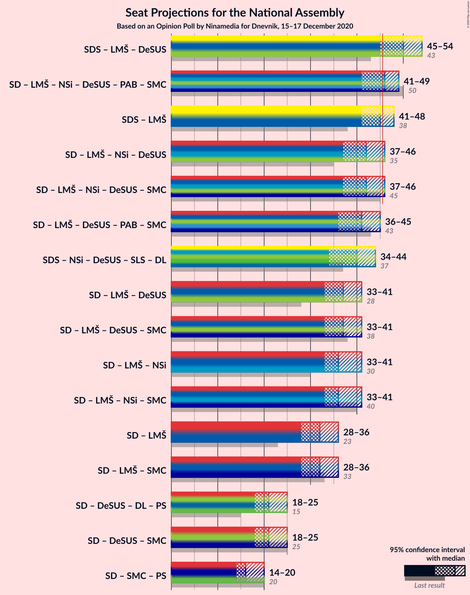

### Confidence Intervals

| Coalition | Last Result | Median | Majority? | 80% Confidence Interval | 90% Confidence Interval | 95% Confidence Interval | 99% Confidence Interval |
|:---------:|:-----------:|:------:|:---------:|:-----------------------:|:-----------------------:|:-----------------------:|:-----------------------:|
| Slovenska demokratska stranka – Lista Marjana Šarca – Demokratična stranka upokojencev Slovenije | 43 | 50 | 96% | 48–53 | 47–53 | 45–54 | 43–55 |
| Socialni demokrati – Lista Marjana Šarca – Nova Slovenija–Krščanski demokrati – Demokratična stranka upokojencev Slovenije – Stranka Alenke Bratušek – Stranka modernega centra | 50 | 46 | 63% | 42–48 | 41–49 | 41–49 | 40–51 |
| Slovenska demokratska stranka – Lista Marjana Šarca | 38 | 45 | 44% | 42–47 | 42–48 | 41–48 | 39–50 |
| Socialni demokrati – Lista Marjana Šarca – Nova Slovenija–Krščanski demokrati – Demokratična stranka upokojencev Slovenije | 35 | 42 | 4% | 39–45 | 38–45 | 37–46 | 37–47 |
| Socialni demokrati – Lista Marjana Šarca – Nova Slovenija–Krščanski demokrati – Demokratična stranka upokojencev Slovenije – Stranka modernega centra | 45 | 42 | 4% | 39–45 | 38–45 | 37–46 | 37–47 |
| Socialni demokrati – Lista Marjana Šarca – Demokratična stranka upokojencev Slovenije – Stranka Alenke Bratušek – Stranka modernega centra | 43 | 41 | 0.4% | 37–44 | 37–44 | 36–45 | 34–45 |
| Socialni demokrati – Lista Marjana Šarca – Demokratična stranka upokojencev Slovenije | 28 | 37 | 0.1% | 35–40 | 33–41 | 33–41 | 32–43 |
| Socialni demokrati – Lista Marjana Šarca – Demokratična stranka upokojencev Slovenije – Stranka modernega centra | 38 | 37 | 0.1% | 35–40 | 33–41 | 33–41 | 32–43 |
| Socialni demokrati – Lista Marjana Šarca – Nova Slovenija–Krščanski demokrati | 30 | 36 | 0% | 35–40 | 33–40 | 33–41 | 32–43 |
| Socialni demokrati – Lista Marjana Šarca – Nova Slovenija–Krščanski demokrati – Stranka modernega centra | 40 | 36 | 0% | 35–40 | 33–40 | 33–41 | 32–43 |
| Socialni demokrati – Lista Marjana Šarca | 23 | 32 | 0% | 30–35 | 29–36 | 28–36 | 28–37 |
| Socialni demokrati – Lista Marjana Šarca – Stranka modernega centra | 33 | 32 | 0% | 30–35 | 29–36 | 28–36 | 28–37 |
| Socialni demokrati – Demokratična stranka upokojencev Slovenije – Stranka modernega centra | 25 | 21 | 0% | 19–24 | 18–24 | 18–25 | 16–26 |

### Slovenska demokratska stranka – Lista Marjana Šarca – Demokratična stranka upokojencev Slovenije

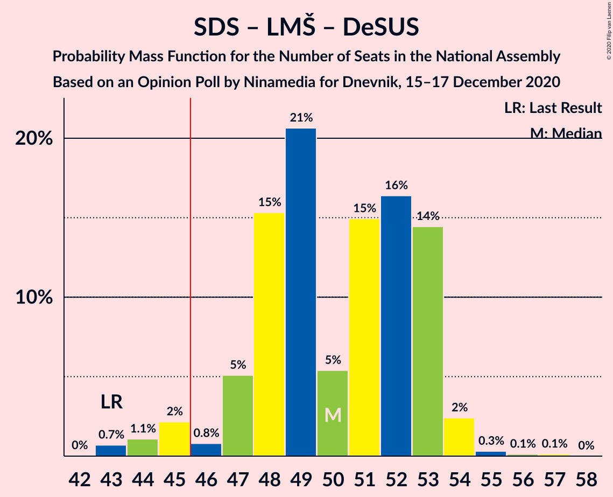

| Number of Seats | Probability | Accumulated | Special Marks |
|:---------------:|:-----------:|:-----------:|:-------------:|
| 43 | 0.7% | 100% | Last Result |
| 44 | 1.1% | 99.3% |  |
| 45 | 2% | 98% |  |
| 46 | 0.8% | 96% | Majority |
| 47 | 5% | 95% |  |
| 48 | 15% | 90% |  |
| 49 | 21% | 75% |  |
| 50 | 5% | 54% | Median |
| 51 | 15% | 49% |  |
| 52 | 16% | 34% |  |
| 53 | 14% | 17% |  |
| 54 | 2% | 3% |  |
| 55 | 0.3% | 0.6% |  |
| 56 | 0.1% | 0.3% |  |
| 57 | 0.1% | 0.2% |  |
| 58 | 0% | 0% |  |

### Socialni demokrati – Lista Marjana Šarca – Nova Slovenija–Krščanski demokrati – Demokratična stranka upokojencev Slovenije – Stranka Alenke Bratušek – Stranka modernega centra

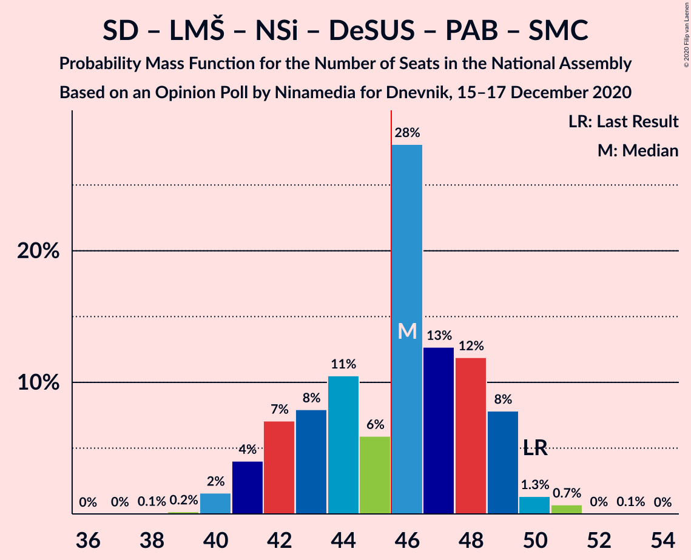

| Number of Seats | Probability | Accumulated | Special Marks |
|:---------------:|:-----------:|:-----------:|:-------------:|
| 38 | 0.1% | 100% |  |
| 39 | 0.2% | 99.9% |  |
| 40 | 2% | 99.7% |  |
| 41 | 4% | 98% |  |
| 42 | 7% | 94% |  |
| 43 | 8% | 87% |  |
| 44 | 11% | 79% |  |
| 45 | 6% | 69% |  |
| 46 | 28% | 63% | Median, Majority |
| 47 | 13% | 35% |  |
| 48 | 12% | 22% |  |
| 49 | 8% | 10% |  |
| 50 | 1.3% | 2% | Last Result |
| 51 | 0.7% | 0.8% |  |
| 52 | 0% | 0.1% |  |
| 53 | 0.1% | 0.1% |  |
| 54 | 0% | 0% |  |

### Slovenska demokratska stranka – Lista Marjana Šarca

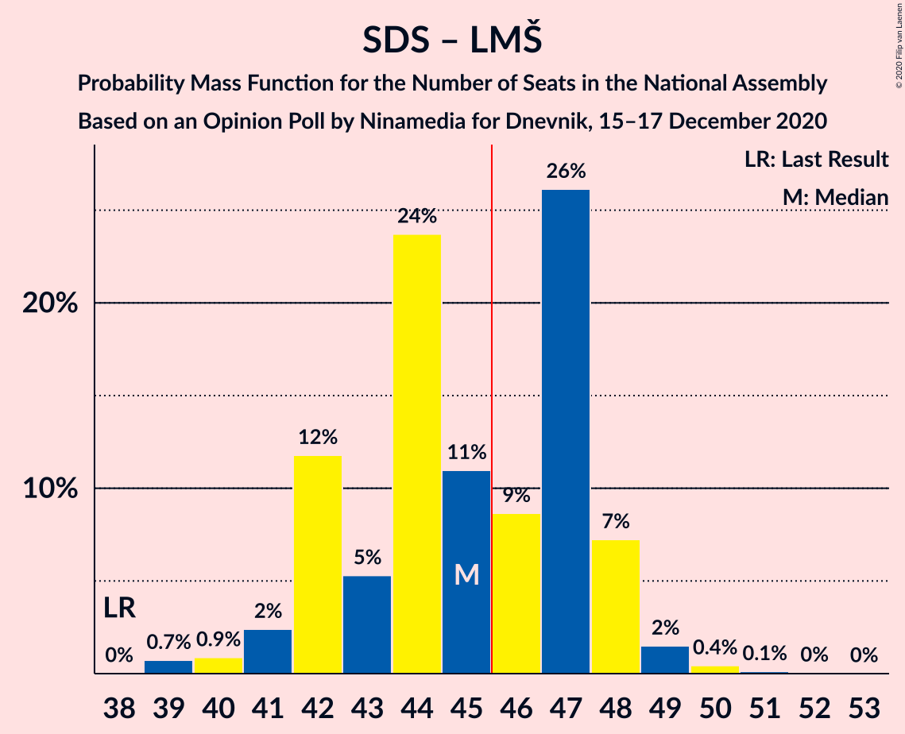

| Number of Seats | Probability | Accumulated | Special Marks |
|:---------------:|:-----------:|:-----------:|:-------------:|
| 38 | 0% | 100% | Last Result |
| 39 | 0.7% | 100% |  |
| 40 | 0.9% | 99.2% |  |
| 41 | 2% | 98% |  |
| 42 | 12% | 96% |  |
| 43 | 5% | 84% |  |
| 44 | 24% | 79% |  |
| 45 | 11% | 55% | Median |
| 46 | 9% | 44% | Majority |
| 47 | 26% | 36% |  |
| 48 | 7% | 9% |  |
| 49 | 2% | 2% |  |
| 50 | 0.4% | 0.6% |  |
| 51 | 0.1% | 0.2% |  |
| 52 | 0% | 0.1% |  |
| 53 | 0% | 0% |  |

### Socialni demokrati – Lista Marjana Šarca – Nova Slovenija–Krščanski demokrati – Demokratična stranka upokojencev Slovenije

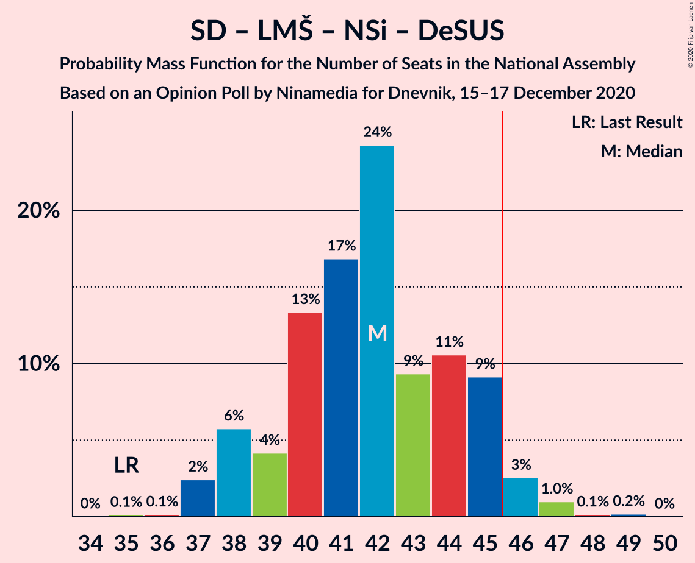

| Number of Seats | Probability | Accumulated | Special Marks |
|:---------------:|:-----------:|:-----------:|:-------------:|
| 35 | 0.1% | 100% | Last Result |
| 36 | 0.1% | 99.8% |  |
| 37 | 2% | 99.7% |  |
| 38 | 6% | 97% |  |
| 39 | 4% | 92% |  |
| 40 | 13% | 87% |  |
| 41 | 17% | 74% |  |
| 42 | 24% | 57% | Median |
| 43 | 9% | 33% |  |
| 44 | 11% | 24% |  |
| 45 | 9% | 13% |  |
| 46 | 3% | 4% | Majority |
| 47 | 1.0% | 1.3% |  |
| 48 | 0.1% | 0.3% |  |
| 49 | 0.2% | 0.2% |  |
| 50 | 0% | 0% |  |

### Socialni demokrati – Lista Marjana Šarca – Nova Slovenija–Krščanski demokrati – Demokratična stranka upokojencev Slovenije – Stranka modernega centra

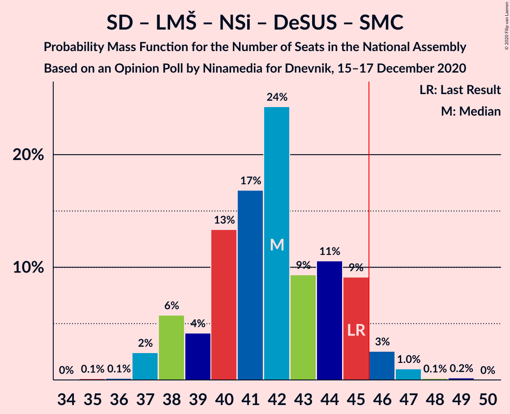

| Number of Seats | Probability | Accumulated | Special Marks |
|:---------------:|:-----------:|:-----------:|:-------------:|
| 35 | 0.1% | 100% |  |
| 36 | 0.1% | 99.8% |  |
| 37 | 2% | 99.7% |  |
| 38 | 6% | 97% |  |
| 39 | 4% | 92% |  |
| 40 | 13% | 87% |  |
| 41 | 17% | 74% |  |
| 42 | 24% | 57% | Median |
| 43 | 9% | 33% |  |
| 44 | 11% | 24% |  |
| 45 | 9% | 13% | Last Result |
| 46 | 3% | 4% | Majority |
| 47 | 1.0% | 1.3% |  |
| 48 | 0.1% | 0.3% |  |
| 49 | 0.2% | 0.2% |  |
| 50 | 0% | 0% |  |

### Socialni demokrati – Lista Marjana Šarca – Demokratična stranka upokojencev Slovenije – Stranka Alenke Bratušek – Stranka modernega centra

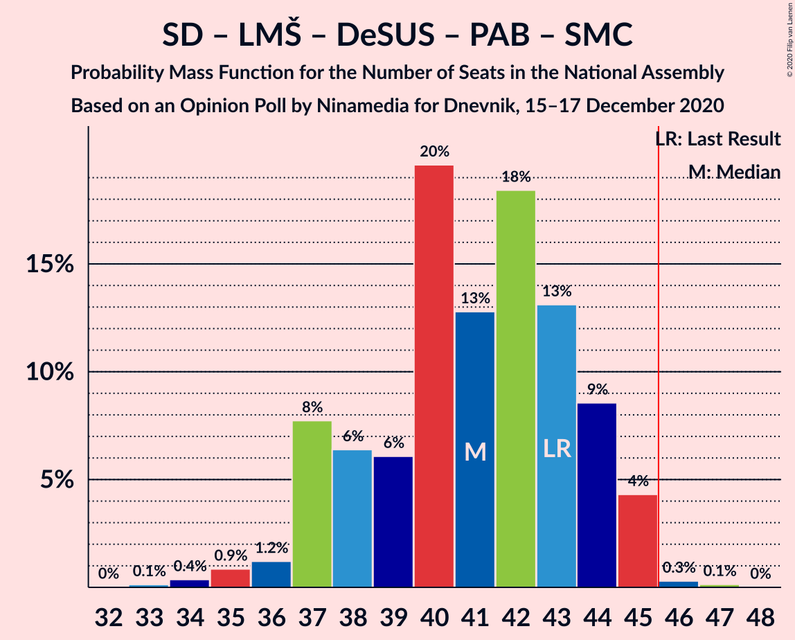

| Number of Seats | Probability | Accumulated | Special Marks |
|:---------------:|:-----------:|:-----------:|:-------------:|
| 33 | 0.1% | 100% |  |
| 34 | 0.4% | 99.9% |  |
| 35 | 0.9% | 99.5% |  |
| 36 | 1.2% | 98.6% |  |
| 37 | 8% | 97% |  |
| 38 | 6% | 90% |  |
| 39 | 6% | 83% |  |
| 40 | 20% | 77% |  |
| 41 | 13% | 58% | Median |
| 42 | 18% | 45% |  |
| 43 | 13% | 26% | Last Result |
| 44 | 9% | 13% |  |
| 45 | 4% | 5% |  |
| 46 | 0.3% | 0.4% | Majority |
| 47 | 0.1% | 0.2% |  |
| 48 | 0% | 0% |  |

### Socialni demokrati – Lista Marjana Šarca – Demokratična stranka upokojencev Slovenije

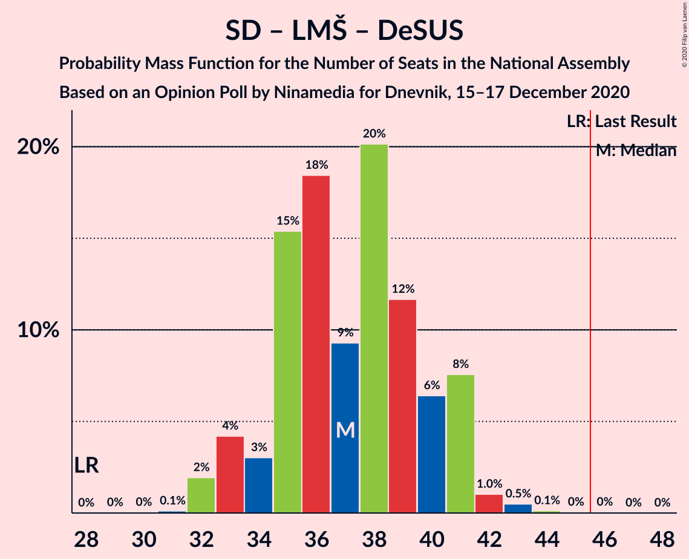

| Number of Seats | Probability | Accumulated | Special Marks |
|:---------------:|:-----------:|:-----------:|:-------------:|
| 28 | 0% | 100% | Last Result |
| 29 | 0% | 100% |  |
| 30 | 0% | 100% |  |
| 31 | 0.1% | 99.9% |  |
| 32 | 2% | 99.8% |  |
| 33 | 4% | 98% |  |
| 34 | 3% | 94% |  |
| 35 | 15% | 91% |  |
| 36 | 18% | 75% |  |
| 37 | 9% | 57% | Median |
| 38 | 20% | 48% |  |
| 39 | 12% | 27% |  |
| 40 | 6% | 16% |  |
| 41 | 8% | 9% |  |
| 42 | 1.0% | 2% |  |
| 43 | 0.5% | 0.7% |  |
| 44 | 0.1% | 0.2% |  |
| 45 | 0% | 0.1% |  |
| 46 | 0% | 0.1% | Majority |
| 47 | 0% | 0% |  |

### Socialni demokrati – Lista Marjana Šarca – Demokratična stranka upokojencev Slovenije – Stranka modernega centra

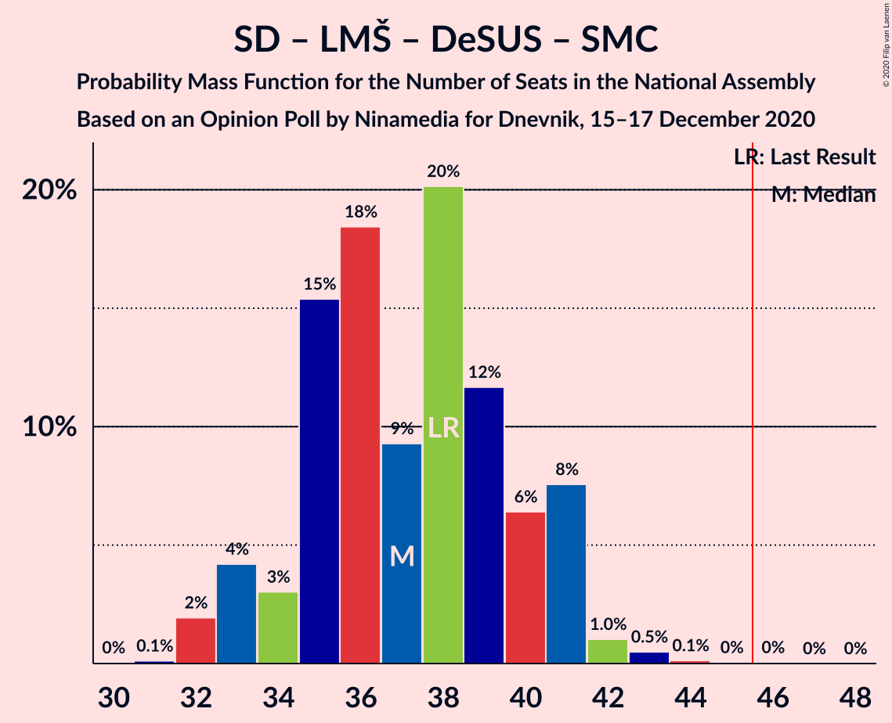

| Number of Seats | Probability | Accumulated | Special Marks |
|:---------------:|:-----------:|:-----------:|:-------------:|
| 30 | 0% | 100% |  |
| 31 | 0.1% | 99.9% |  |
| 32 | 2% | 99.8% |  |
| 33 | 4% | 98% |  |
| 34 | 3% | 94% |  |
| 35 | 15% | 91% |  |
| 36 | 18% | 75% |  |
| 37 | 9% | 57% | Median |
| 38 | 20% | 48% | Last Result |
| 39 | 12% | 27% |  |
| 40 | 6% | 16% |  |
| 41 | 8% | 9% |  |
| 42 | 1.0% | 2% |  |
| 43 | 0.5% | 0.7% |  |
| 44 | 0.1% | 0.2% |  |
| 45 | 0% | 0.1% |  |
| 46 | 0% | 0.1% | Majority |
| 47 | 0% | 0% |  |

### Socialni demokrati – Lista Marjana Šarca – Nova Slovenija–Krščanski demokrati

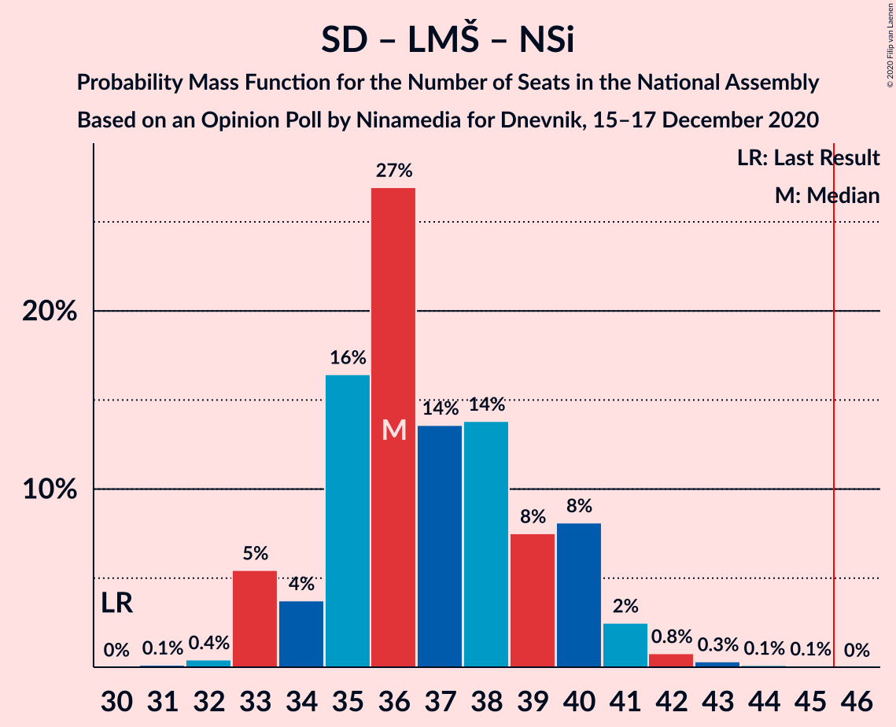

| Number of Seats | Probability | Accumulated | Special Marks |
|:---------------:|:-----------:|:-----------:|:-------------:|
| 30 | 0% | 100% | Last Result |
| 31 | 0.1% | 99.9% |  |
| 32 | 0.4% | 99.8% |  |
| 33 | 5% | 99.4% |  |
| 34 | 4% | 94% |  |
| 35 | 16% | 90% |  |
| 36 | 27% | 74% |  |
| 37 | 14% | 47% | Median |
| 38 | 14% | 33% |  |
| 39 | 8% | 19% |  |
| 40 | 8% | 12% |  |
| 41 | 2% | 4% |  |
| 42 | 0.8% | 1.3% |  |
| 43 | 0.3% | 0.5% |  |
| 44 | 0.1% | 0.2% |  |
| 45 | 0.1% | 0.1% |  |
| 46 | 0% | 0% | Majority |

### Socialni demokrati – Lista Marjana Šarca – Nova Slovenija–Krščanski demokrati – Stranka modernega centra

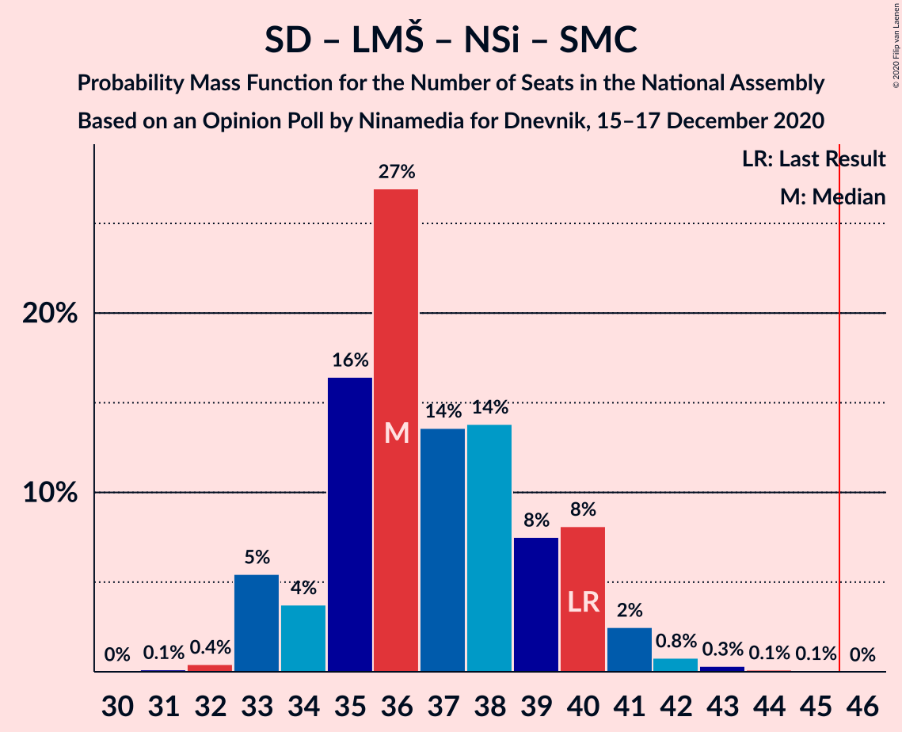

| Number of Seats | Probability | Accumulated | Special Marks |
|:---------------:|:-----------:|:-----------:|:-------------:|
| 30 | 0% | 100% |  |
| 31 | 0.1% | 99.9% |  |
| 32 | 0.4% | 99.8% |  |
| 33 | 5% | 99.4% |  |
| 34 | 4% | 94% |  |
| 35 | 16% | 90% |  |
| 36 | 27% | 74% |  |
| 37 | 14% | 47% | Median |
| 38 | 14% | 33% |  |
| 39 | 8% | 19% |  |
| 40 | 8% | 12% | Last Result |
| 41 | 2% | 4% |  |
| 42 | 0.8% | 1.3% |  |
| 43 | 0.3% | 0.5% |  |
| 44 | 0.1% | 0.2% |  |
| 45 | 0.1% | 0.1% |  |
| 46 | 0% | 0% | Majority |

### Socialni demokrati – Lista Marjana Šarca

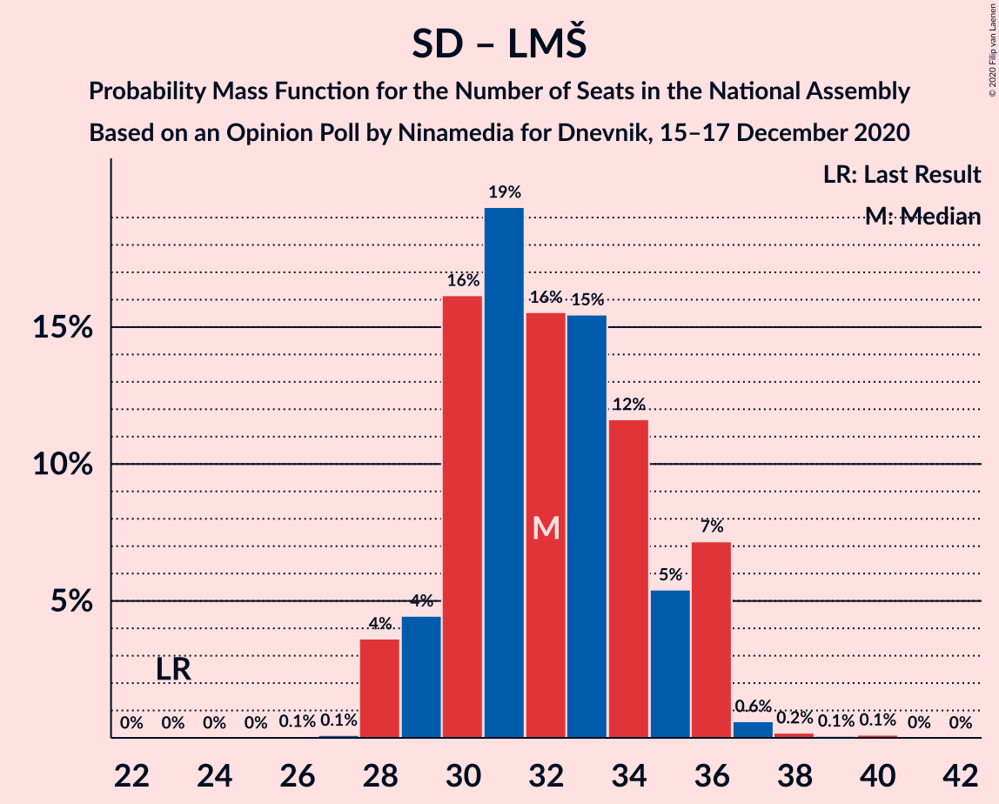

| Number of Seats | Probability | Accumulated | Special Marks |
|:---------------:|:-----------:|:-----------:|:-------------:|
| 23 | 0% | 100% | Last Result |
| 24 | 0% | 100% |  |
| 25 | 0% | 100% |  |
| 26 | 0.1% | 100% |  |
| 27 | 0.1% | 99.9% |  |
| 28 | 4% | 99.8% |  |
| 29 | 4% | 96% |  |
| 30 | 16% | 92% |  |
| 31 | 19% | 76% |  |
| 32 | 16% | 56% | Median |
| 33 | 15% | 41% |  |
| 34 | 12% | 25% |  |
| 35 | 5% | 14% |  |
| 36 | 7% | 8% |  |
| 37 | 0.6% | 1.0% |  |
| 38 | 0.2% | 0.4% |  |
| 39 | 0.1% | 0.2% |  |
| 40 | 0.1% | 0.1% |  |
| 41 | 0% | 0% |  |

### Socialni demokrati – Lista Marjana Šarca – Stranka modernega centra

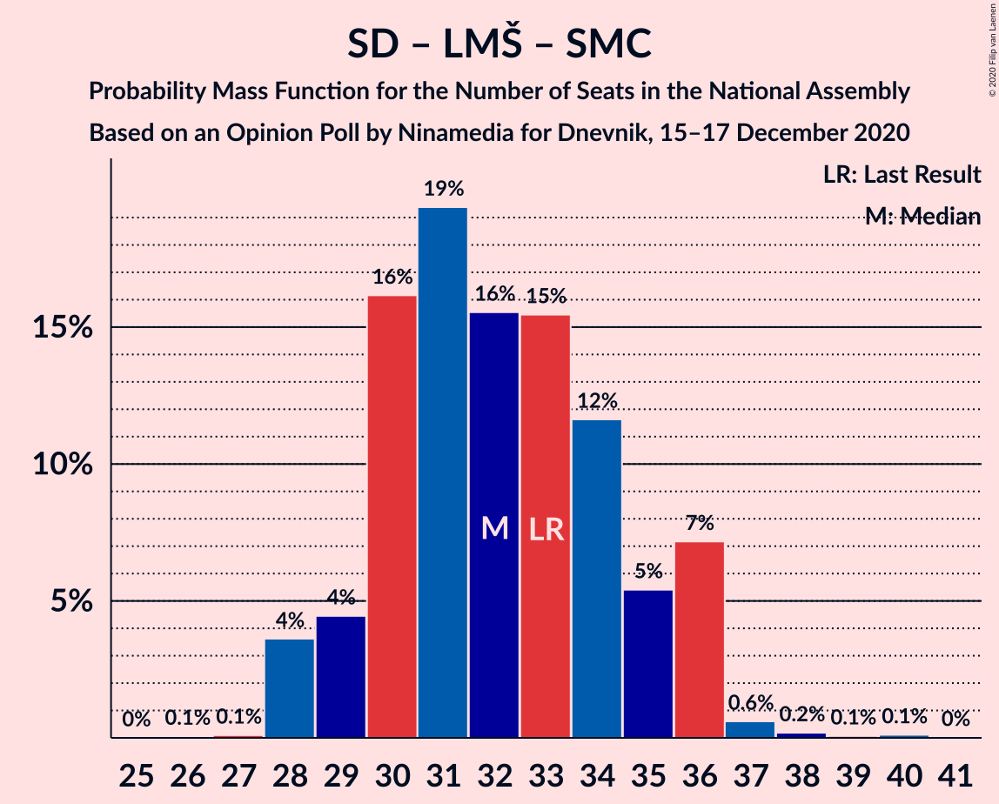

| Number of Seats | Probability | Accumulated | Special Marks |
|:---------------:|:-----------:|:-----------:|:-------------:|
| 26 | 0.1% | 100% |  |
| 27 | 0.1% | 99.9% |  |
| 28 | 4% | 99.8% |  |
| 29 | 4% | 96% |  |
| 30 | 16% | 92% |  |
| 31 | 19% | 76% |  |
| 32 | 16% | 56% | Median |
| 33 | 15% | 41% | Last Result |
| 34 | 12% | 25% |  |
| 35 | 5% | 14% |  |
| 36 | 7% | 8% |  |
| 37 | 0.6% | 1.0% |  |
| 38 | 0.2% | 0.4% |  |
| 39 | 0.1% | 0.2% |  |
| 40 | 0.1% | 0.1% |  |
| 41 | 0% | 0% |  |

### Socialni demokrati – Demokratična stranka upokojencev Slovenije – Stranka modernega centra

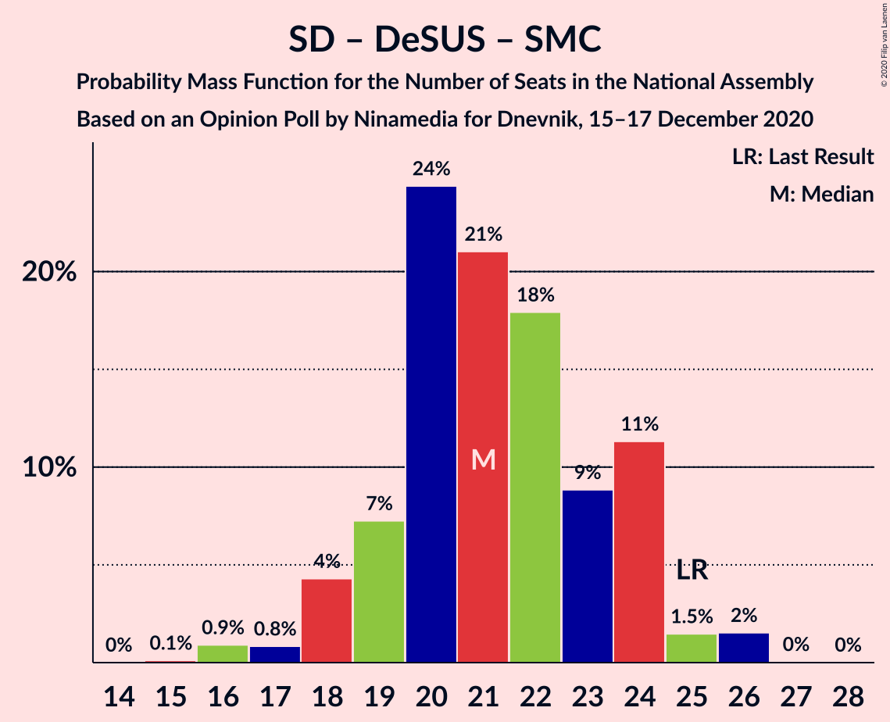

| Number of Seats | Probability | Accumulated | Special Marks |
|:---------------:|:-----------:|:-----------:|:-------------:|
| 15 | 0.1% | 100% |  |
| 16 | 0.9% | 99.8% |  |
| 17 | 0.8% | 98.9% |  |
| 18 | 4% | 98% |  |
| 19 | 7% | 94% |  |
| 20 | 24% | 87% |  |
| 21 | 21% | 62% | Median |
| 22 | 18% | 41% |  |
| 23 | 9% | 23% |  |
| 24 | 11% | 14% |  |
| 25 | 1.5% | 3% | Last Result |
| 26 | 2% | 2% |  |
| 27 | 0% | 0.1% |  |
| 28 | 0% | 0% |  |

## Technical Information

### Opinion Poll

+ **Polling firm:** Ninamedia
+ **Commissioner(s):** Dnevnik
+ **Fieldwork period:** 15–17 December 2020

### Calculations

+ **Sample size:** 700
+ **Simulations done:** 1,048,576
+ **Error estimate:** 1.87%

