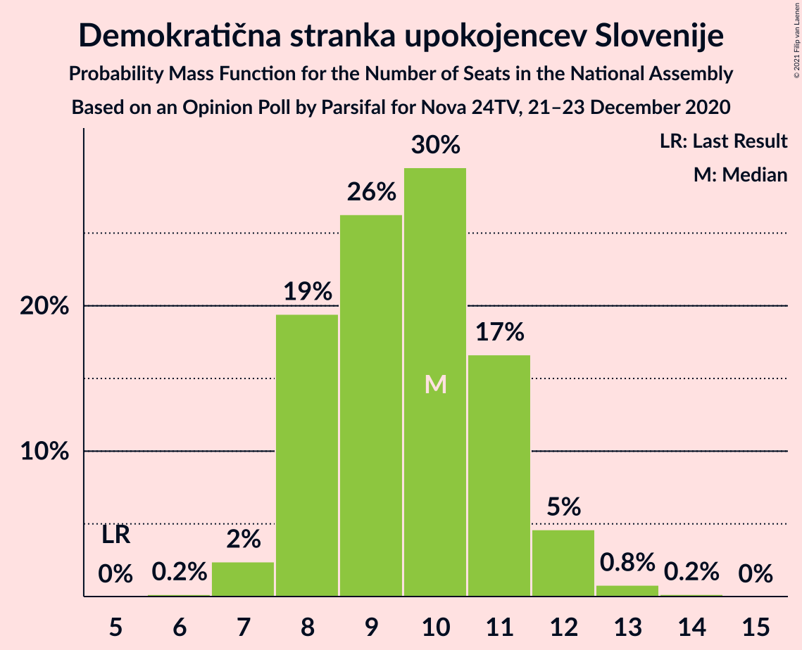
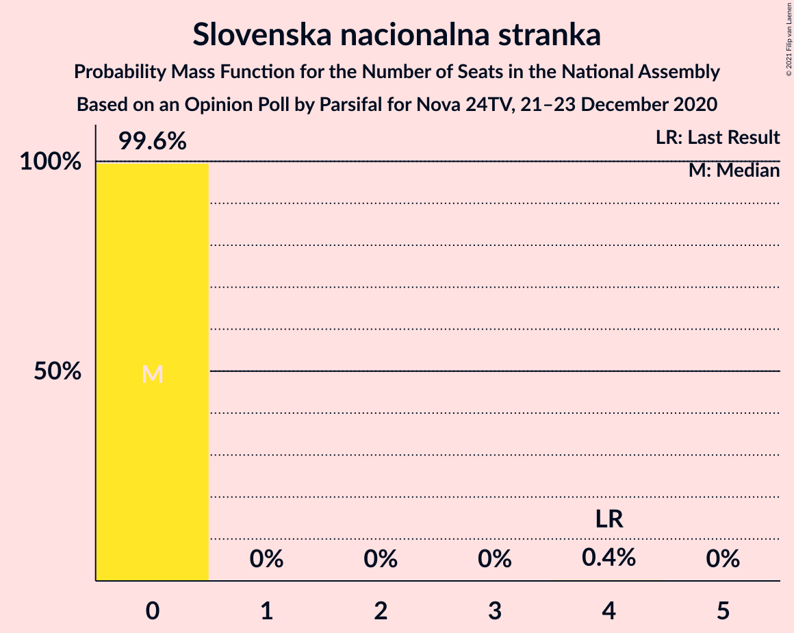
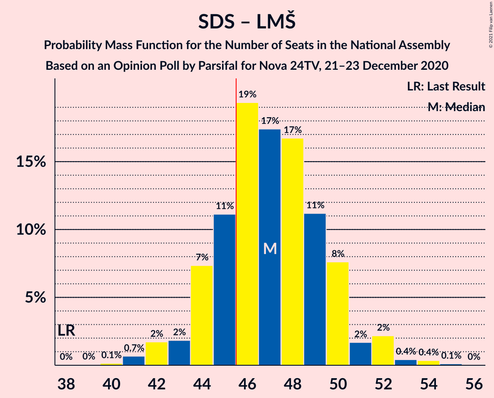
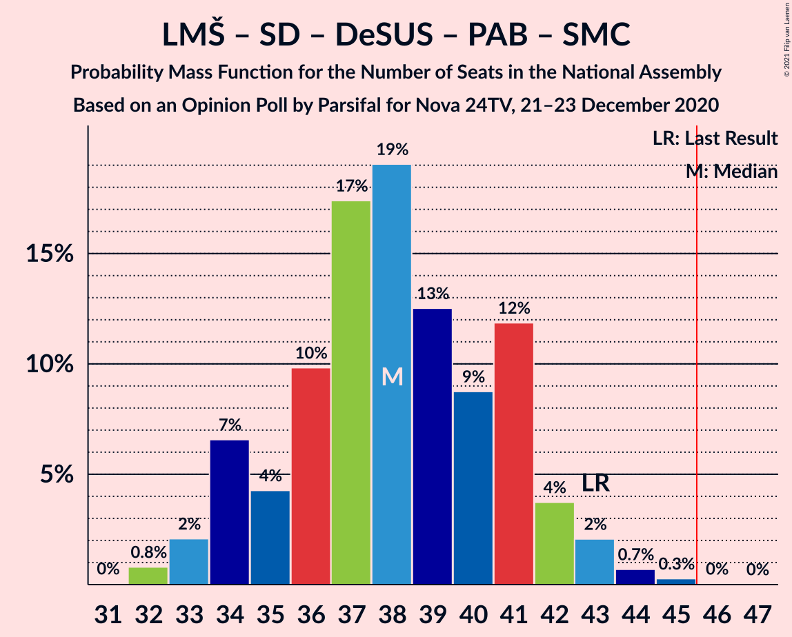
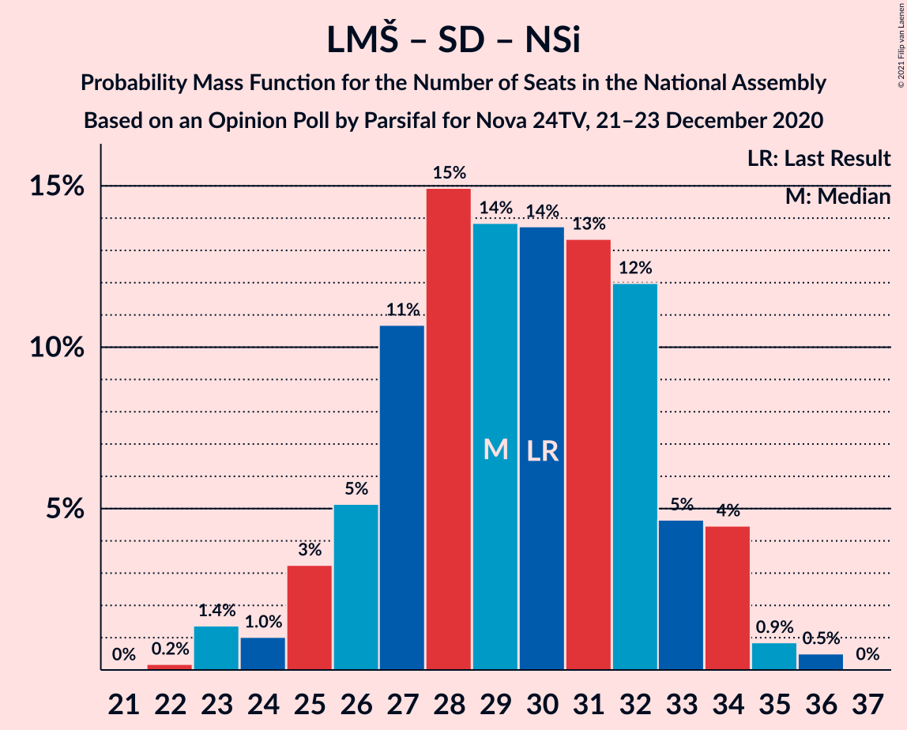

# Opinion Poll by Parsifal for Nova 24TV, 21–23 December 2020

<a href="#voting-intentions">Voting Intentions</a> | <a href="#seats">Seats</a> | <a href="#coalitions">Coalitions</a> | <a href="#technical-information">Technical Information</a>

## Voting Intentions

### Confidence Intervals

| Party | Last Result | Poll Result | 80% Confidence Interval | 90% Confidence Interval | 95% Confidence Interval | 99% Confidence Interval |
|:-----:|:-----------:|:-----------:|:-----------------------:|:-----------------------:|:-----------------------:|:-----------------------:|
| Slovenska demokratska stranka | 24.9% | 32.4% | 30.2–34.6% |29.6–35.2% |29.1–35.8% |28.1–36.9% |
| Lista Marjana Šarca | 12.6% | 15.3% | 13.7–17.1% |13.3–17.6% |12.9–18.1% |12.2–19.0% |
| Socialni demokrati | 9.9% | 12.4% | 11.0–14.1% |10.6–14.6% |10.3–15.0% |9.6–15.8% |
| Levica | 9.3% | 11.1% | 9.8–12.7% |9.4–13.1% |9.1–13.5% |8.4–14.3% |
| Demokratična stranka upokojencev Slovenije | 4.9% | 9.9% | 8.6–11.4% |8.3–11.9% |8.0–12.3% |7.4–13.0% |
| Nova Slovenija–Krščanski demokrati | 7.2% | 4.0% | 3.2–5.0% |3.0–5.3% |2.8–5.6% |2.5–6.2% |
| Stranka Alenke Bratušek | 5.1% | 3.7% | 3.0–4.7% |2.7–5.0% |2.6–5.3% |2.3–5.8% |
| Slovenska nacionalna stranka | 4.2% | 2.2% | 1.7–3.1% |1.5–3.4% |1.4–3.6% |1.2–4.0% |
| Stranka modernega centra | 9.7% | 1.8% | 1.4–2.7% |1.2–2.9% |1.1–3.1% |0.9–3.5% |
| Slovenska ljudska stranka | 2.6% | 1.7% | 1.2–2.5% |1.1–2.7% |1.0–2.9% |0.8–3.3% |

*Note:* The poll result column reflects the actual value used in the calculations. Published results may vary slightly, and in addition be rounded to fewer digits.

## Seats

### Confidence Intervals

| Party | Last Result | Median | 80% Confidence Interval | 90% Confidence Interval | 95% Confidence Interval | 99% Confidence Interval |
|:-----:|:-----------:|:------:|:-----------------------:|:-----------------------:|:-----------------------:|:-----------------------:|
| <a href="#slovenska-demokratska-stranka">Slovenska demokratska stranka</a> | 25 | 32 | 29–35 |29–36 |29–37 |28–38 |
| <a href="#lista-marjana-šarca">Lista Marjana Šarca</a> | 13 | 15 | 13–17 |13–18 |13–18 |12–19 |
| <a href="#socialni-demokrati">Socialni demokrati</a> | 10 | 13 | 11–14 |10–14 |10–15 |9–15 |
| <a href="#levica">Levica</a> | 9 | 11 | 9–12 |9–13 |9–13 |8–15 |
| <a href="#demokratična-stranka-upokojencev-slovenije">Demokratična stranka upokojencev Slovenije</a> | 5 | 10 | 8–11 |7–12 |7–13 |7–13 |
| <a href="#nova-slovenija–krščanski-demokrati">Nova Slovenija–Krščanski demokrati</a> | 7 | 0 | 0–5 |0–5 |0–5 |0–5 |
| <a href="#stranka-alenke-bratušek">Stranka Alenke Bratušek</a> | 5 | 0 | 0–5 |0–5 |0–5 |0–6 |
| <a href="#slovenska-nacionalna-stranka">Slovenska nacionalna stranka</a> | 4 | 0 | 0 |0 |0 |0 |
| <a href="#stranka-modernega-centra">Stranka modernega centra</a> | 10 | 0 | 0 |0 |0 |0 |
| <a href="#slovenska-ljudska-stranka">Slovenska ljudska stranka</a> | 0 | 0 | 0 |0 |0 |0 |

### Slovenska demokratska stranka

*For a full overview of the results for this party, see the [Slovenska demokratska stranka](party-slovenskademokratskastranka.html) page.*

| Number of Seats | Probability | Accumulated | Special Marks |
|:---------------:|:-----------:|:-----------:|:-------------:|
| 25 | 0% | 100% | Last Result |
| 26 | 0.1% | 100% |  |
| 27 | 0.4% | 99.9% |  |
| 28 | 1.4% | 99.5% |  |
| 29 | 13% | 98% |  |
| 30 | 7% | 85% |  |
| 31 | 19% | 79% |  |
| 32 | 19% | 60% | Median |
| 33 | 7% | 41% |  |
| 34 | 22% | 34% |  |
| 35 | 5% | 11% |  |
| 36 | 4% | 7% |  |
| 37 | 2% | 3% |  |
| 38 | 0.7% | 0.8% |  |
| 39 | 0% | 0% |  |

### Lista Marjana Šarca

*For a full overview of the results for this party, see the [Lista Marjana Šarca](party-listamarjanašarca.html) page.*

| Number of Seats | Probability | Accumulated | Special Marks |
|:---------------:|:-----------:|:-----------:|:-------------:|
| 11 | 0.1% | 100% |  |
| 12 | 2% | 99.8% |  |
| 13 | 29% | 98% | Last Result |
| 14 | 13% | 69% |  |
| 15 | 16% | 56% | Median |
| 16 | 21% | 40% |  |
| 17 | 10% | 19% |  |
| 18 | 7% | 9% |  |
| 19 | 2% | 2% |  |
| 20 | 0.1% | 0.1% |  |
| 21 | 0% | 0% |  |

### Socialni demokrati

*For a full overview of the results for this party, see the [Socialni demokrati](party-socialnidemokrati.html) page.*

| Number of Seats | Probability | Accumulated | Special Marks |
|:---------------:|:-----------:|:-----------:|:-------------:|
| 8 | 0% | 100% |  |
| 9 | 2% | 99.9% |  |
| 10 | 5% | 98% | Last Result |
| 11 | 17% | 93% |  |
| 12 | 22% | 76% |  |
| 13 | 32% | 54% | Median |
| 14 | 20% | 22% |  |
| 15 | 2% | 3% |  |
| 16 | 0.4% | 0.4% |  |
| 17 | 0% | 0.1% |  |
| 18 | 0% | 0% |  |

### Levica

*For a full overview of the results for this party, see the [Levica](party-levica.html) page.*

| Number of Seats | Probability | Accumulated | Special Marks |
|:---------------:|:-----------:|:-----------:|:-------------:|
| 7 | 0.1% | 100% |  |
| 8 | 1.2% | 99.9% |  |
| 9 | 18% | 98.7% | Last Result |
| 10 | 26% | 81% |  |
| 11 | 20% | 55% | Median |
| 12 | 30% | 35% |  |
| 13 | 4% | 6% |  |
| 14 | 0.6% | 2% |  |
| 15 | 1.0% | 1.0% |  |
| 16 | 0% | 0% |  |

### Demokratična stranka upokojencev Slovenije

*For a full overview of the results for this party, see the [Demokratična stranka upokojencev Slovenije](party-demokratičnastrankaupokojencevslovenije.html) page.*

| Number of Seats | Probability | Accumulated | Special Marks |
|:---------------:|:-----------:|:-----------:|:-------------:|
| 5 | 0% | 100% | Last Result |
| 6 | 0.3% | 100% |  |
| 7 | 9% | 99.7% |  |
| 8 | 5% | 91% |  |
| 9 | 30% | 86% |  |
| 10 | 41% | 56% | Median |
| 11 | 9% | 15% |  |
| 12 | 4% | 6% |  |
| 13 | 2% | 3% |  |
| 14 | 0% | 0.1% |  |
| 15 | 0% | 0% |  |

### Nova Slovenija–Krščanski demokrati

*For a full overview of the results for this party, see the [Nova Slovenija–Krščanski demokrati](party-novaslovenija–krščanskidemokrati.html) page.*

| Number of Seats | Probability | Accumulated | Special Marks |
|:---------------:|:-----------:|:-----------:|:-------------:|
| 0 | 67% | 100% | Median |
| 1 | 0% | 33% |  |
| 2 | 0% | 33% |  |
| 3 | 0.7% | 33% |  |
| 4 | 20% | 32% |  |
| 5 | 12% | 12% |  |
| 6 | 0.2% | 0.2% |  |
| 7 | 0% | 0% | Last Result |

### Stranka Alenke Bratušek

*For a full overview of the results for this party, see the [Stranka Alenke Bratušek](party-strankaalenkebratušek.html) page.*

| Number of Seats | Probability | Accumulated | Special Marks |
|:---------------:|:-----------:|:-----------:|:-------------:|
| 0 | 54% | 100% | Median |
| 1 | 0% | 46% |  |
| 2 | 0% | 46% |  |
| 3 | 0% | 46% |  |
| 4 | 28% | 46% |  |
| 5 | 17% | 18% | Last Result |
| 6 | 0.9% | 0.9% |  |
| 7 | 0% | 0% |  |

### Slovenska nacionalna stranka

*For a full overview of the results for this party, see the [Slovenska nacionalna stranka](party-slovenskanacionalnastranka.html) page.*

| Number of Seats | Probability | Accumulated | Special Marks |
|:---------------:|:-----------:|:-----------:|:-------------:|
| 0 | 99.7% | 100% | Median |
| 1 | 0% | 0.3% |  |
| 2 | 0% | 0.3% |  |
| 3 | 0% | 0.3% |  |
| 4 | 0.3% | 0.3% | Last Result |
| 5 | 0% | 0% |  |

### Stranka modernega centra

*For a full overview of the results for this party, see the [Stranka modernega centra](party-strankamodernegacentra.html) page.*

| Number of Seats | Probability | Accumulated | Special Marks |
|:---------------:|:-----------:|:-----------:|:-------------:|
| 0 | 99.9% | 100% | Median |
| 1 | 0% | 0.1% |  |
| 2 | 0% | 0.1% |  |
| 3 | 0% | 0.1% |  |
| 4 | 0.1% | 0.1% |  |
| 5 | 0% | 0% |  |
| 6 | 0% | 0% |  |
| 7 | 0% | 0% |  |
| 8 | 0% | 0% |  |
| 9 | 0% | 0% |  |
| 10 | 0% | 0% | Last Result |

### Slovenska ljudska stranka

*For a full overview of the results for this party, see the [Slovenska ljudska stranka](party-slovenskaljudskastranka.html) page.*

| Number of Seats | Probability | Accumulated | Special Marks |
|:---------------:|:-----------:|:-----------:|:-------------:|
| 0 | 100% | 100% | Last Result, Median |

## Coalitions

### Confidence Intervals

| Coalition | Last Result | Median | Majority? | 80% Confidence Interval | 90% Confidence Interval | 95% Confidence Interval | 99% Confidence Interval |
|:---------:|:-----------:|:------:|:---------:|:-----------------------:|:-----------------------:|:-----------------------:|:-----------------------:|
| Slovenska demokratska stranka – Lista Marjana Šarca – Demokratična stranka upokojencev Slovenije | 43 | 57 | 100% | 52–60 | 52–61 | 52–62 | 51–63 |
| Slovenska demokratska stranka – Lista Marjana Šarca | 38 | 47 | 61% | 44–51 | 44–52 | 42–52 | 41–53 |
| Lista Marjana Šarca – Socialni demokrati – Demokratična stranka upokojencev Slovenije – Nova Slovenija–Krščanski demokrati – Stranka Alenke Bratušek – Stranka modernega centra | 50 | 40 | 4% | 37–44 | 36–45 | 35–47 | 34–47 |
| Lista Marjana Šarca – Socialni demokrati – Demokratična stranka upokojencev Slovenije – Nova Slovenija–Krščanski demokrati | 35 | 38 | 0.3% | 35–42 | 35–44 | 34–44 | 33–44 |
| Lista Marjana Šarca – Socialni demokrati – Demokratična stranka upokojencev Slovenije – Nova Slovenija–Krščanski demokrati – Stranka modernega centra | 45 | 38 | 0.3% | 35–42 | 35–44 | 34–44 | 33–44 |
| Lista Marjana Šarca – Socialni demokrati – Demokratična stranka upokojencev Slovenije – Stranka Alenke Bratušek – Stranka modernega centra | 43 | 39 | 0.2% | 36–43 | 35–43 | 34–44 | 34–45 |
| Lista Marjana Šarca – Socialni demokrati – Demokratična stranka upokojencev Slovenije | 28 | 38 | 0.2% | 33–40 | 32–40 | 32–40 | 31–43 |
| Lista Marjana Šarca – Socialni demokrati – Demokratična stranka upokojencev Slovenije – Stranka modernega centra | 38 | 38 | 0.2% | 33–40 | 32–40 | 32–40 | 31–43 |
| Lista Marjana Šarca – Socialni demokrati – Nova Slovenija–Krščanski demokrati | 30 | 29 | 0% | 26–32 | 25–34 | 24–34 | 22–34 |
| Lista Marjana Šarca – Socialni demokrati – Nova Slovenija–Krščanski demokrati – Stranka modernega centra | 40 | 29 | 0% | 26–32 | 25–34 | 24–34 | 22–34 |
| Lista Marjana Šarca – Socialni demokrati | 23 | 28 | 0% | 25–30 | 24–31 | 23–31 | 22–32 |
| Lista Marjana Šarca – Socialni demokrati – Stranka modernega centra | 33 | 28 | 0% | 25–30 | 24–31 | 23–31 | 22–32 |
| Socialni demokrati – Demokratična stranka upokojencev Slovenije – Stranka modernega centra | 25 | 22 | 0% | 19–24 | 19–25 | 18–26 | 17–27 |

### Slovenska demokratska stranka – Lista Marjana Šarca – Demokratična stranka upokojencev Slovenije

| Number of Seats | Probability | Accumulated | Special Marks |
|:---------------:|:-----------:|:-----------:|:-------------:|
| 43 | 0% | 100% | Last Result |
| 44 | 0% | 100% |  |
| 45 | 0% | 100% |  |
| 46 | 0% | 100% | Majority |
| 47 | 0% | 100% |  |
| 48 | 0% | 100% |  |
| 49 | 0.1% | 100% |  |
| 50 | 0.2% | 99.9% |  |
| 51 | 0.7% | 99.6% |  |
| 52 | 9% | 98.9% |  |
| 53 | 0.7% | 90% |  |
| 54 | 15% | 89% |  |
| 55 | 16% | 75% |  |
| 56 | 8% | 59% |  |
| 57 | 3% | 51% | Median |
| 58 | 24% | 48% |  |
| 59 | 7% | 24% |  |
| 60 | 8% | 17% |  |
| 61 | 6% | 10% |  |
| 62 | 3% | 3% |  |
| 63 | 0.4% | 0.5% |  |
| 64 | 0% | 0.1% |  |
| 65 | 0.1% | 0.1% |  |
| 66 | 0% | 0% |  |

### Slovenska demokratska stranka – Lista Marjana Šarca

| Number of Seats | Probability | Accumulated | Special Marks |
|:---------------:|:-----------:|:-----------:|:-------------:|
| 38 | 0% | 100% | Last Result |
| 39 | 0% | 100% |  |
| 40 | 0.2% | 100% |  |
| 41 | 0.3% | 99.8% |  |
| 42 | 3% | 99.5% |  |
| 43 | 1.1% | 97% |  |
| 44 | 10% | 95% |  |
| 45 | 24% | 86% |  |
| 46 | 6% | 61% | Majority |
| 47 | 12% | 55% | Median |
| 48 | 10% | 43% |  |
| 49 | 16% | 33% |  |
| 50 | 4% | 17% |  |
| 51 | 5% | 13% |  |
| 52 | 7% | 8% |  |
| 53 | 1.2% | 1.4% |  |
| 54 | 0.2% | 0.3% |  |
| 55 | 0.1% | 0.1% |  |
| 56 | 0% | 0% |  |

### Lista Marjana Šarca – Socialni demokrati – Demokratična stranka upokojencev Slovenije – Nova Slovenija–Krščanski demokrati – Stranka Alenke Bratušek – Stranka modernega centra

| Number of Seats | Probability | Accumulated | Special Marks |
|:---------------:|:-----------:|:-----------:|:-------------:|
| 34 | 2% | 100% |  |
| 35 | 2% | 98% |  |
| 36 | 5% | 96% |  |
| 37 | 2% | 91% |  |
| 38 | 16% | 90% | Median |
| 39 | 9% | 74% |  |
| 40 | 23% | 65% |  |
| 41 | 15% | 42% |  |
| 42 | 4% | 28% |  |
| 43 | 5% | 24% |  |
| 44 | 12% | 19% |  |
| 45 | 3% | 7% |  |
| 46 | 0.7% | 4% | Majority |
| 47 | 3% | 3% |  |
| 48 | 0% | 0% |  |
| 49 | 0% | 0% |  |
| 50 | 0% | 0% | Last Result |

### Lista Marjana Šarca – Socialni demokrati – Demokratična stranka upokojencev Slovenije – Nova Slovenija–Krščanski demokrati

| Number of Seats | Probability | Accumulated | Special Marks |
|:---------------:|:-----------:|:-----------:|:-------------:|
| 31 | 0% | 100% |  |
| 32 | 0.1% | 99.9% |  |
| 33 | 1.2% | 99.9% |  |
| 34 | 3% | 98.7% |  |
| 35 | 7% | 96% | Last Result |
| 36 | 22% | 89% |  |
| 37 | 4% | 67% |  |
| 38 | 19% | 63% | Median |
| 39 | 12% | 44% |  |
| 40 | 16% | 33% |  |
| 41 | 4% | 17% |  |
| 42 | 3% | 12% |  |
| 43 | 1.2% | 9% |  |
| 44 | 7% | 8% |  |
| 45 | 0.1% | 0.4% |  |
| 46 | 0.2% | 0.3% | Majority |
| 47 | 0% | 0% |  |

### Lista Marjana Šarca – Socialni demokrati – Demokratična stranka upokojencev Slovenije – Nova Slovenija–Krščanski demokrati – Stranka modernega centra

| Number of Seats | Probability | Accumulated | Special Marks |
|:---------------:|:-----------:|:-----------:|:-------------:|
| 31 | 0% | 100% |  |
| 32 | 0.1% | 99.9% |  |
| 33 | 1.2% | 99.9% |  |
| 34 | 3% | 98.7% |  |
| 35 | 7% | 96% |  |
| 36 | 22% | 89% |  |
| 37 | 4% | 67% |  |
| 38 | 19% | 63% | Median |
| 39 | 12% | 44% |  |
| 40 | 16% | 33% |  |
| 41 | 4% | 17% |  |
| 42 | 3% | 12% |  |
| 43 | 1.2% | 9% |  |
| 44 | 7% | 8% |  |
| 45 | 0.1% | 0.4% | Last Result |
| 46 | 0.2% | 0.3% | Majority |
| 47 | 0% | 0% |  |

### Lista Marjana Šarca – Socialni demokrati – Demokratična stranka upokojencev Slovenije – Stranka Alenke Bratušek – Stranka modernega centra

| Number of Seats | Probability | Accumulated | Special Marks |
|:---------------:|:-----------:|:-----------:|:-------------:|
| 31 | 0.1% | 100% |  |
| 32 | 0.2% | 99.9% |  |
| 33 | 0.1% | 99.7% |  |
| 34 | 3% | 99.6% |  |
| 35 | 4% | 97% |  |
| 36 | 7% | 93% |  |
| 37 | 13% | 86% |  |
| 38 | 16% | 73% | Median |
| 39 | 16% | 57% |  |
| 40 | 21% | 40% |  |
| 41 | 4% | 19% |  |
| 42 | 4% | 15% |  |
| 43 | 7% | 11% | Last Result |
| 44 | 1.3% | 4% |  |
| 45 | 2% | 2% |  |
| 46 | 0.2% | 0.2% | Majority |
| 47 | 0% | 0% |  |

### Lista Marjana Šarca – Socialni demokrati – Demokratična stranka upokojencev Slovenije

| Number of Seats | Probability | Accumulated | Special Marks |
|:---------------:|:-----------:|:-----------:|:-------------:|
| 28 | 0% | 100% | Last Result |
| 29 | 0% | 100% |  |
| 30 | 0.1% | 100% |  |
| 31 | 0.6% | 99.9% |  |
| 32 | 9% | 99.3% |  |
| 33 | 2% | 91% |  |
| 34 | 3% | 88% |  |
| 35 | 12% | 85% |  |
| 36 | 15% | 73% |  |
| 37 | 6% | 58% |  |
| 38 | 21% | 51% | Median |
| 39 | 16% | 30% |  |
| 40 | 12% | 14% |  |
| 41 | 1.0% | 2% |  |
| 42 | 0.1% | 1.2% |  |
| 43 | 0.8% | 1.1% |  |
| 44 | 0.1% | 0.3% |  |
| 45 | 0% | 0.2% |  |
| 46 | 0.2% | 0.2% | Majority |
| 47 | 0% | 0% |  |

### Lista Marjana Šarca – Socialni demokrati – Demokratična stranka upokojencev Slovenije – Stranka modernega centra

| Number of Seats | Probability | Accumulated | Special Marks |
|:---------------:|:-----------:|:-----------:|:-------------:|
| 30 | 0.1% | 100% |  |
| 31 | 0.6% | 99.9% |  |
| 32 | 9% | 99.3% |  |
| 33 | 2% | 91% |  |
| 34 | 3% | 88% |  |
| 35 | 12% | 85% |  |
| 36 | 15% | 73% |  |
| 37 | 6% | 58% |  |
| 38 | 21% | 51% | Last Result, Median |
| 39 | 16% | 30% |  |
| 40 | 12% | 14% |  |
| 41 | 1.0% | 2% |  |
| 42 | 0.1% | 1.2% |  |
| 43 | 0.8% | 1.1% |  |
| 44 | 0.1% | 0.3% |  |
| 45 | 0% | 0.2% |  |
| 46 | 0.2% | 0.2% | Majority |
| 47 | 0% | 0% |  |

### Lista Marjana Šarca – Socialni demokrati – Nova Slovenija–Krščanski demokrati

| Number of Seats | Probability | Accumulated | Special Marks |
|:---------------:|:-----------:|:-----------:|:-------------:|
| 22 | 1.2% | 100% |  |
| 23 | 0.2% | 98.8% |  |
| 24 | 2% | 98.6% |  |
| 25 | 6% | 96% |  |
| 26 | 13% | 90% |  |
| 27 | 3% | 77% |  |
| 28 | 15% | 74% | Median |
| 29 | 25% | 59% |  |
| 30 | 10% | 34% | Last Result |
| 31 | 12% | 24% |  |
| 32 | 4% | 12% |  |
| 33 | 2% | 8% |  |
| 34 | 6% | 7% |  |
| 35 | 0.3% | 0.4% |  |
| 36 | 0% | 0% |  |

### Lista Marjana Šarca – Socialni demokrati – Nova Slovenija–Krščanski demokrati – Stranka modernega centra

| Number of Seats | Probability | Accumulated | Special Marks |
|:---------------:|:-----------:|:-----------:|:-------------:|
| 22 | 1.2% | 100% |  |
| 23 | 0.2% | 98.8% |  |
| 24 | 2% | 98.6% |  |
| 25 | 6% | 96% |  |
| 26 | 13% | 90% |  |
| 27 | 3% | 77% |  |
| 28 | 15% | 74% | Median |
| 29 | 25% | 59% |  |
| 30 | 10% | 34% |  |
| 31 | 12% | 24% |  |
| 32 | 4% | 12% |  |
| 33 | 2% | 8% |  |
| 34 | 6% | 7% |  |
| 35 | 0.3% | 0.4% |  |
| 36 | 0% | 0% |  |
| 37 | 0% | 0% |  |
| 38 | 0% | 0% |  |
| 39 | 0% | 0% |  |
| 40 | 0% | 0% | Last Result |

### Lista Marjana Šarca – Socialni demokrati

| Number of Seats | Probability | Accumulated | Special Marks |
|:---------------:|:-----------:|:-----------:|:-------------:|
| 21 | 0.1% | 100% |  |
| 22 | 1.3% | 99.9% |  |
| 23 | 2% | 98.7% | Last Result |
| 24 | 5% | 97% |  |
| 25 | 17% | 92% |  |
| 26 | 19% | 75% |  |
| 27 | 4% | 57% |  |
| 28 | 16% | 53% | Median |
| 29 | 23% | 38% |  |
| 30 | 5% | 15% |  |
| 31 | 9% | 10% |  |
| 32 | 0.3% | 0.7% |  |
| 33 | 0.1% | 0.4% |  |
| 34 | 0% | 0.2% |  |
| 35 | 0.2% | 0.2% |  |
| 36 | 0% | 0% |  |

### Lista Marjana Šarca – Socialni demokrati – Stranka modernega centra

| Number of Seats | Probability | Accumulated | Special Marks |
|:---------------:|:-----------:|:-----------:|:-------------:|
| 21 | 0.1% | 100% |  |
| 22 | 1.2% | 99.9% |  |
| 23 | 2% | 98.7% |  |
| 24 | 5% | 97% |  |
| 25 | 17% | 92% |  |
| 26 | 18% | 75% |  |
| 27 | 4% | 57% |  |
| 28 | 16% | 53% | Median |
| 29 | 23% | 38% |  |
| 30 | 5% | 15% |  |
| 31 | 9% | 10% |  |
| 32 | 0.3% | 0.8% |  |
| 33 | 0.2% | 0.4% | Last Result |
| 34 | 0% | 0.3% |  |
| 35 | 0.2% | 0.2% |  |
| 36 | 0% | 0% |  |

### Socialni demokrati – Demokratična stranka upokojencev Slovenije – Stranka modernega centra

| Number of Seats | Probability | Accumulated | Special Marks |
|:---------------:|:-----------:|:-----------:|:-------------:|
| 17 | 0.7% | 100% |  |
| 18 | 2% | 99.3% |  |
| 19 | 9% | 97% |  |
| 20 | 10% | 88% |  |
| 21 | 10% | 78% |  |
| 22 | 18% | 67% |  |
| 23 | 35% | 49% | Median |
| 24 | 10% | 15% |  |
| 25 | 2% | 5% | Last Result |
| 26 | 2% | 3% |  |
| 27 | 0.8% | 0.8% |  |
| 28 | 0% | 0% |  |

## Technical Information

### Opinion Poll

+ **Polling firm:** Parsifal
+ **Commissioner(s):** Nova 24TV
+ **Fieldwork period:** 21–23 December 2020

### Calculations

+ **Sample size:** 757
+ **Simulations done:** 131,072
+ **Error estimate:** 1.65%

