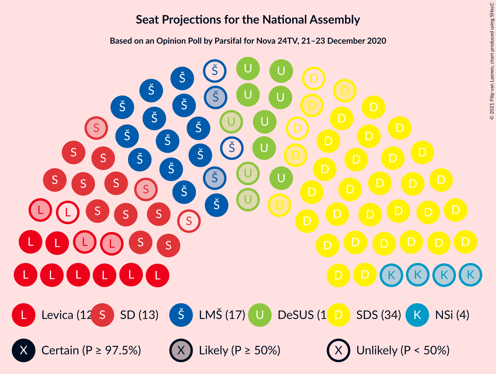
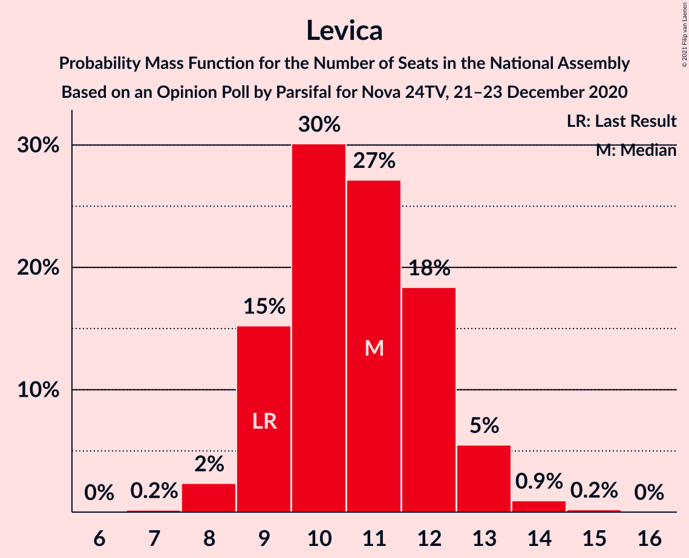
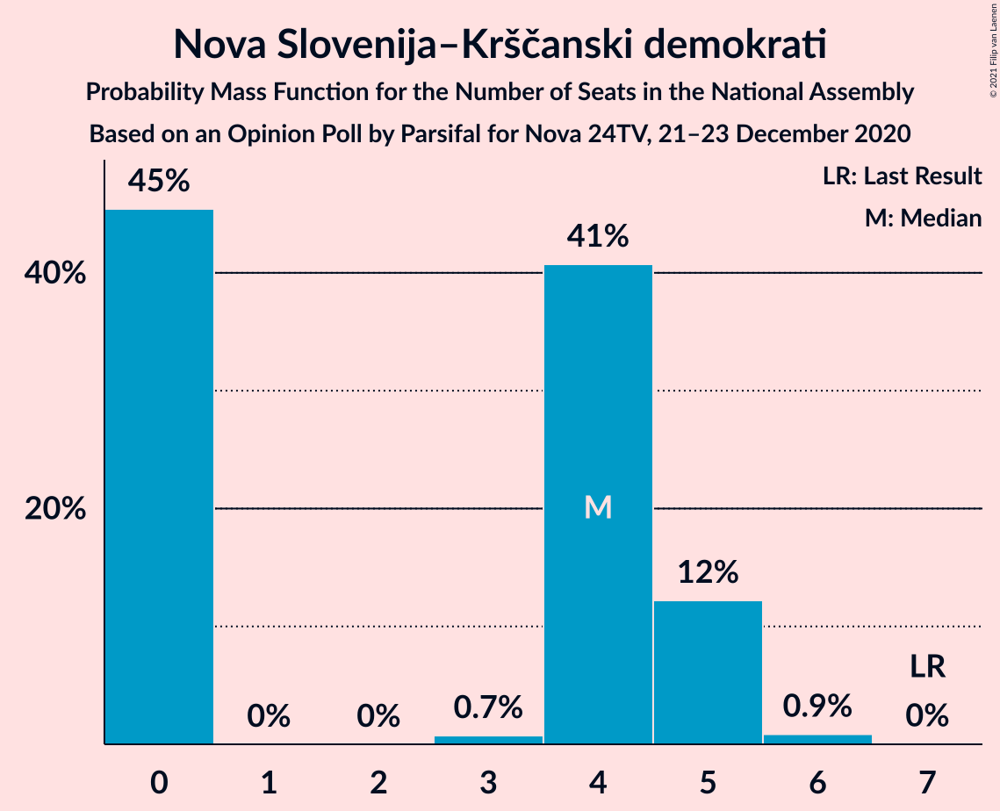
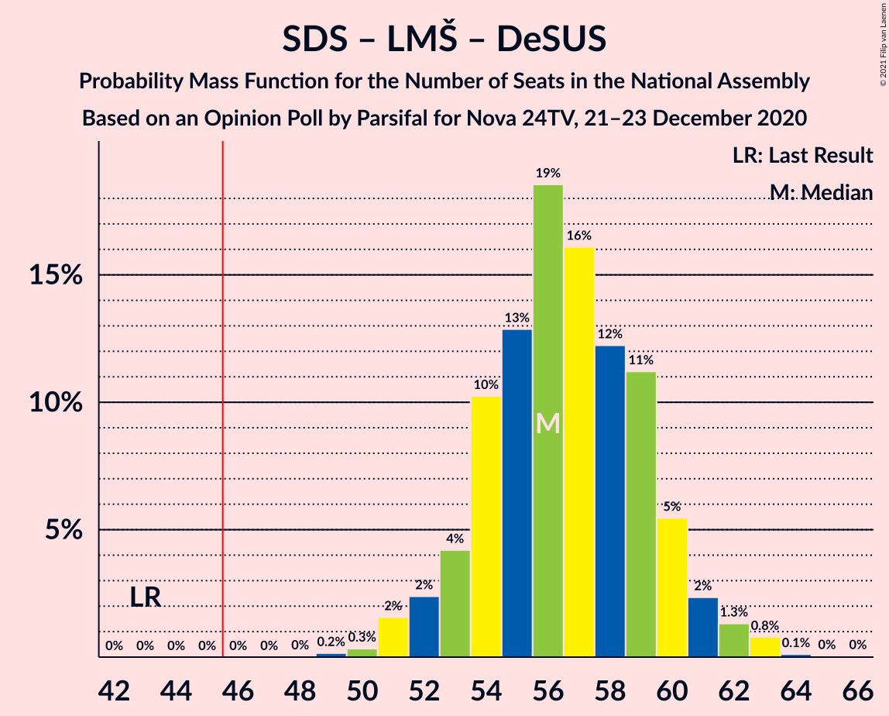
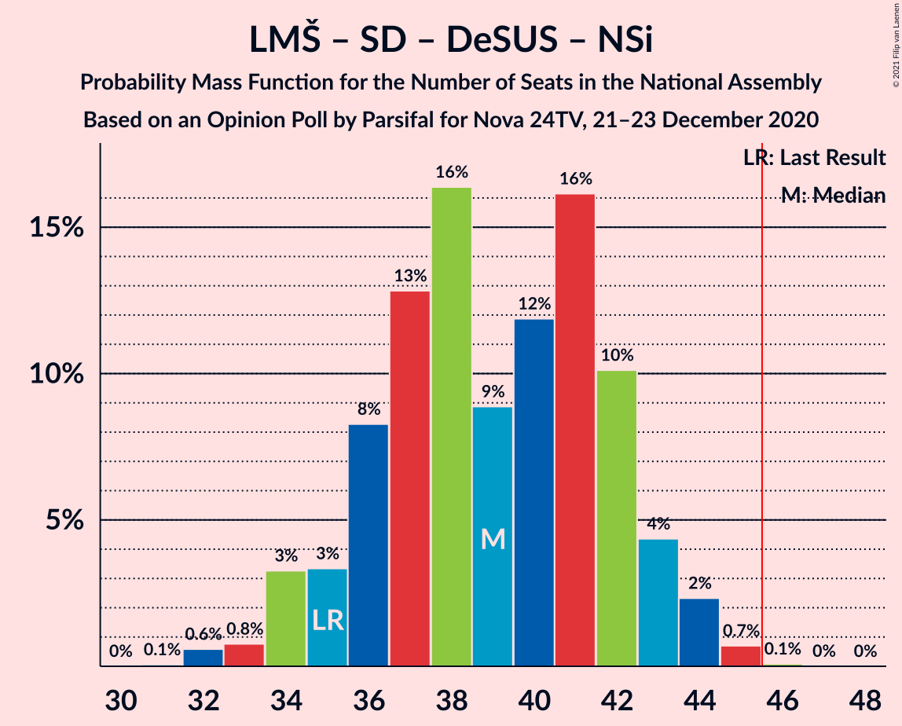
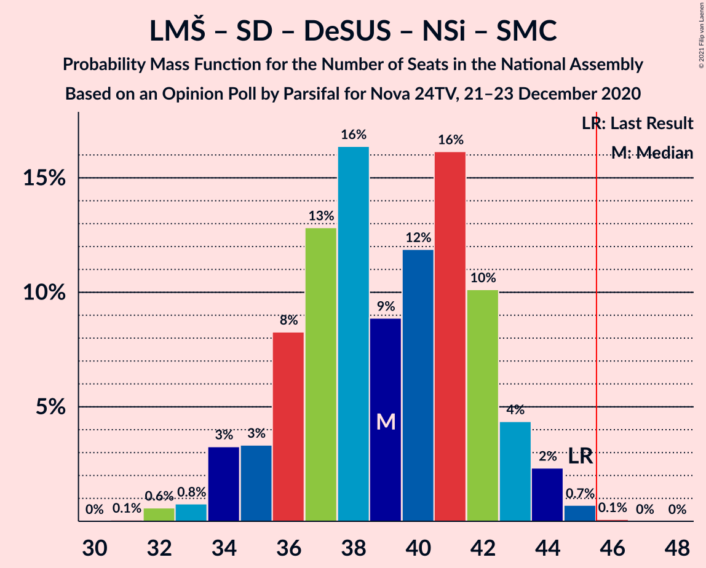
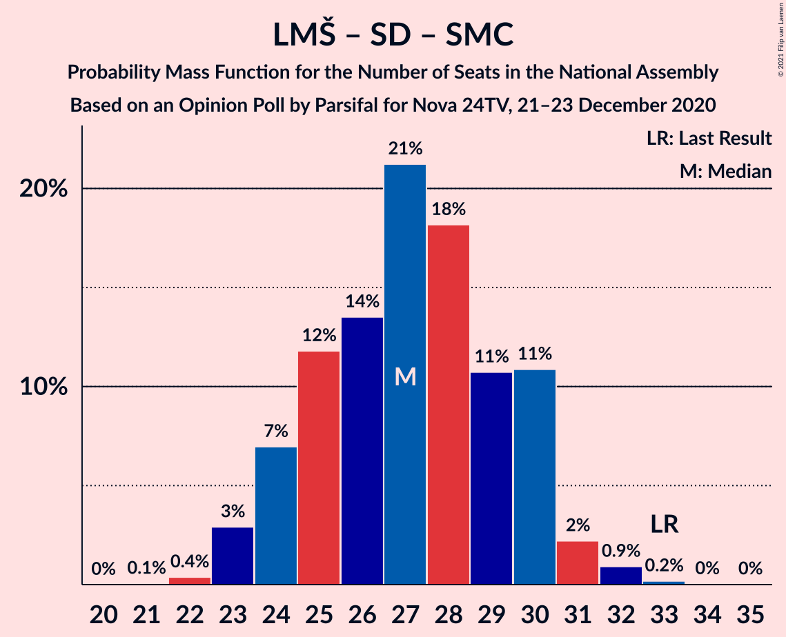

# Opinion Poll by Parsifal for Nova 24TV, 21–23 December 2020

<a href="#voting-intentions">Voting Intentions</a> | <a href="#seats">Seats</a> | <a href="#coalitions">Coalitions</a> | <a href="#technical-information">Technical Information</a>

## Voting Intentions

### Confidence Intervals

| Party | Last Result | Poll Result | 80% Confidence Interval | 90% Confidence Interval | 95% Confidence Interval | 99% Confidence Interval |
|:-----:|:-----------:|:-----------:|:-----------------------:|:-----------------------:|:-----------------------:|:-----------------------:|
| Slovenska demokratska stranka | 24.9% | 32.4% | 30.2–34.6% |29.6–35.2% |29.1–35.8% |28.1–36.9% |
| Lista Marjana Šarca | 12.6% | 15.3% | 13.7–17.1% |13.3–17.6% |12.9–18.1% |12.2–19.0% |
| Socialni demokrati | 9.9% | 12.4% | 11.0–14.1% |10.6–14.6% |10.3–15.0% |9.6–15.8% |
| Levica | 9.3% | 11.1% | 9.8–12.7% |9.4–13.1% |9.1–13.5% |8.4–14.3% |
| Demokratična stranka upokojencev Slovenije | 4.9% | 9.9% | 8.6–11.4% |8.3–11.9% |8.0–12.3% |7.4–13.0% |
| Nova Slovenija–Krščanski demokrati | 7.2% | 4.0% | 3.2–5.0% |3.0–5.3% |2.8–5.6% |2.5–6.2% |
| Stranka Alenke Bratušek | 5.1% | 3.7% | 3.0–4.7% |2.7–5.0% |2.6–5.3% |2.3–5.8% |
| Slovenska nacionalna stranka | 4.2% | 2.2% | 1.7–3.1% |1.5–3.4% |1.4–3.6% |1.2–4.0% |
| Stranka modernega centra | 9.7% | 1.8% | 1.4–2.7% |1.2–2.9% |1.1–3.1% |0.9–3.5% |
| Slovenska ljudska stranka | 2.6% | 1.7% | 1.2–2.5% |1.1–2.7% |1.0–2.9% |0.8–3.3% |

*Note:* The poll result column reflects the actual value used in the calculations. Published results may vary slightly, and in addition be rounded to fewer digits.

## Seats

### Confidence Intervals

| Party | Last Result | Median | 80% Confidence Interval | 90% Confidence Interval | 95% Confidence Interval | 99% Confidence Interval |
|:-----:|:-----------:|:------:|:-----------------------:|:-----------------------:|:-----------------------:|:-----------------------:|
| <a href="#slovenska-demokratska-stranka">Slovenska demokratska stranka</a> | 25 | 32 | 29–35 |29–36 |28–36 |27–38 |
| <a href="#lista-marjana-šarca">Lista Marjana Šarca</a> | 13 | 15 | 13–17 |13–17 |13–18 |12–19 |
| <a href="#socialni-demokrati">Socialni demokrati</a> | 10 | 12 | 10–14 |10–14 |10–14 |9–16 |
| <a href="#levica">Levica</a> | 9 | 11 | 9–12 |9–13 |8–13 |8–14 |
| <a href="#demokratična-stranka-upokojencev-slovenije">Demokratična stranka upokojencev Slovenije</a> | 5 | 10 | 8–11 |8–12 |7–12 |7–13 |
| <a href="#nova-slovenija–krščanski-demokrati">Nova Slovenija–Krščanski demokrati</a> | 7 | 4 | 0–5 |0–5 |0–5 |0–6 |
| <a href="#stranka-alenke-bratušek">Stranka Alenke Bratušek</a> | 5 | 0 | 0–4 |0–5 |0–5 |0–5 |
| <a href="#slovenska-nacionalna-stranka">Slovenska nacionalna stranka</a> | 4 | 0 | 0 |0 |0 |0 |
| <a href="#stranka-modernega-centra">Stranka modernega centra</a> | 10 | 0 | 0 |0 |0 |0 |
| <a href="#slovenska-ljudska-stranka">Slovenska ljudska stranka</a> | 0 | 0 | 0 |0 |0 |0 |

### Slovenska demokratska stranka

*For a full overview of the results for this party, see the [Slovenska demokratska stranka](party-slovenskademokratskastranka.html) page.*

| Number of Seats | Probability | Accumulated | Special Marks |
|:---------------:|:-----------:|:-----------:|:-------------:|
| 25 | 0% | 100% | Last Result |
| 26 | 0.1% | 100% |  |
| 27 | 1.3% | 99.8% |  |
| 28 | 2% | 98.6% |  |
| 29 | 8% | 96% |  |
| 30 | 9% | 88% |  |
| 31 | 21% | 79% |  |
| 32 | 22% | 58% | Median |
| 33 | 15% | 37% |  |
| 34 | 12% | 22% |  |
| 35 | 5% | 10% |  |
| 36 | 4% | 5% |  |
| 37 | 0.5% | 1.1% |  |
| 38 | 0.4% | 0.5% |  |
| 39 | 0.1% | 0.1% |  |
| 40 | 0% | 0% |  |

### Lista Marjana Šarca

*For a full overview of the results for this party, see the [Lista Marjana Šarca](party-listamarjanašarca.html) page.*

| Number of Seats | Probability | Accumulated | Special Marks |
|:---------------:|:-----------:|:-----------:|:-------------:|
| 11 | 0.3% | 100% |  |
| 12 | 1.4% | 99.7% |  |
| 13 | 16% | 98% | Last Result |
| 14 | 25% | 83% |  |
| 15 | 14% | 58% | Median |
| 16 | 25% | 44% |  |
| 17 | 16% | 19% |  |
| 18 | 2% | 3% |  |
| 19 | 0.5% | 0.7% |  |
| 20 | 0.2% | 0.2% |  |
| 21 | 0% | 0% |  |

### Socialni demokrati

*For a full overview of the results for this party, see the [Socialni demokrati](party-socialnidemokrati.html) page.*

| Number of Seats | Probability | Accumulated | Special Marks |
|:---------------:|:-----------:|:-----------:|:-------------:|
| 8 | 0.1% | 100% |  |
| 9 | 1.3% | 99.9% |  |
| 10 | 11% | 98.6% | Last Result |
| 11 | 22% | 88% |  |
| 12 | 24% | 65% | Median |
| 13 | 27% | 42% |  |
| 14 | 12% | 14% |  |
| 15 | 2% | 2% |  |
| 16 | 0.5% | 0.5% |  |
| 17 | 0% | 0% |  |

### Levica

*For a full overview of the results for this party, see the [Levica](party-levica.html) page.*

| Number of Seats | Probability | Accumulated | Special Marks |
|:---------------:|:-----------:|:-----------:|:-------------:|
| 7 | 0.2% | 100% |  |
| 8 | 2% | 99.8% |  |
| 9 | 15% | 97% | Last Result |
| 10 | 30% | 82% |  |
| 11 | 27% | 52% | Median |
| 12 | 18% | 25% |  |
| 13 | 5% | 7% |  |
| 14 | 0.9% | 1.2% |  |
| 15 | 0.2% | 0.2% |  |
| 16 | 0% | 0% |  |

### Demokratična stranka upokojencev Slovenije

*For a full overview of the results for this party, see the [Demokratična stranka upokojencev Slovenije](party-demokratičnastrankaupokojencevslovenije.html) page.*

| Number of Seats | Probability | Accumulated | Special Marks |
|:---------------:|:-----------:|:-----------:|:-------------:|
| 5 | 0% | 100% | Last Result |
| 6 | 0.2% | 100% |  |
| 7 | 2% | 99.8% |  |
| 8 | 19% | 97% |  |
| 9 | 26% | 78% |  |
| 10 | 30% | 52% | Median |
| 11 | 17% | 22% |  |
| 12 | 5% | 6% |  |
| 13 | 0.8% | 1.0% |  |
| 14 | 0.2% | 0.2% |  |
| 15 | 0% | 0% |  |

### Nova Slovenija–Krščanski demokrati

*For a full overview of the results for this party, see the [Nova Slovenija–Krščanski demokrati](party-novaslovenija–krščanskidemokrati.html) page.*

| Number of Seats | Probability | Accumulated | Special Marks |
|:---------------:|:-----------:|:-----------:|:-------------:|
| 0 | 45% | 100% |  |
| 1 | 0% | 55% |  |
| 2 | 0% | 55% |  |
| 3 | 0.7% | 55% |  |
| 4 | 41% | 54% | Median |
| 5 | 12% | 13% |  |
| 6 | 0.9% | 0.9% |  |
| 7 | 0% | 0% | Last Result |

### Stranka Alenke Bratušek

*For a full overview of the results for this party, see the [Stranka Alenke Bratušek](party-strankaalenkebratušek.html) page.*

| Number of Seats | Probability | Accumulated | Special Marks |
|:---------------:|:-----------:|:-----------:|:-------------:|
| 0 | 68% | 100% | Median |
| 1 | 0% | 32% |  |
| 2 | 0% | 32% |  |
| 3 | 1.5% | 32% |  |
| 4 | 23% | 31% |  |
| 5 | 7% | 7% | Last Result |
| 6 | 0.4% | 0.4% |  |
| 7 | 0% | 0% |  |

### Slovenska nacionalna stranka

*For a full overview of the results for this party, see the [Slovenska nacionalna stranka](party-slovenskanacionalnastranka.html) page.*

| Number of Seats | Probability | Accumulated | Special Marks |
|:---------------:|:-----------:|:-----------:|:-------------:|
| 0 | 99.6% | 100% | Median |
| 1 | 0% | 0.4% |  |
| 2 | 0% | 0.4% |  |
| 3 | 0% | 0.4% |  |
| 4 | 0.4% | 0.4% | Last Result |
| 5 | 0% | 0% |  |

### Stranka modernega centra

*For a full overview of the results for this party, see the [Stranka modernega centra](party-strankamodernegacentra.html) page.*

| Number of Seats | Probability | Accumulated | Special Marks |
|:---------------:|:-----------:|:-----------:|:-------------:|
| 0 | 100% | 100% | Median |
| 1 | 0% | 0% |  |
| 2 | 0% | 0% |  |
| 3 | 0% | 0% |  |
| 4 | 0% | 0% |  |
| 5 | 0% | 0% |  |
| 6 | 0% | 0% |  |
| 7 | 0% | 0% |  |
| 8 | 0% | 0% |  |
| 9 | 0% | 0% |  |
| 10 | 0% | 0% | Last Result |

### Slovenska ljudska stranka

*For a full overview of the results for this party, see the [Slovenska ljudska stranka](party-slovenskaljudskastranka.html) page.*

| Number of Seats | Probability | Accumulated | Special Marks |
|:---------------:|:-----------:|:-----------:|:-------------:|
| 0 | 100% | 100% | Last Result, Median |

## Coalitions

### Confidence Intervals

| Coalition | Last Result | Median | Majority? | 80% Confidence Interval | 90% Confidence Interval | 95% Confidence Interval | 99% Confidence Interval |
|:---------:|:-----------:|:------:|:---------:|:-----------------------:|:-----------------------:|:-----------------------:|:-----------------------:|
| Slovenska demokratska stranka – Lista Marjana Šarca – Demokratična stranka upokojencev Slovenije | 43 | 56 | 100% | 54–60 | 53–60 | 52–61 | 50–63 |
| Slovenska demokratska stranka – Lista Marjana Šarca | 38 | 47 | 77% | 44–50 | 44–50 | 42–52 | 41–53 |
| Lista Marjana Šarca – Socialni demokrati – Demokratična stranka upokojencev Slovenije – Nova Slovenija–Krščanski demokrati – Stranka Alenke Bratušek – Stranka modernega centra | 50 | 41 | 1.4% | 37–43 | 37–44 | 36–45 | 34–47 |
| Lista Marjana Šarca – Socialni demokrati – Demokratična stranka upokojencev Slovenije – Nova Slovenija–Krščanski demokrati | 35 | 39 | 0.1% | 36–42 | 35–43 | 34–44 | 32–45 |
| Lista Marjana Šarca – Socialni demokrati – Demokratična stranka upokojencev Slovenije – Nova Slovenija–Krščanski demokrati – Stranka modernega centra | 45 | 39 | 0.1% | 36–42 | 35–43 | 34–44 | 32–45 |
| Lista Marjana Šarca – Socialni demokrati – Demokratična stranka upokojencev Slovenije – Stranka Alenke Bratušek – Stranka modernega centra | 43 | 38 | 0.1% | 35–41 | 34–42 | 33–43 | 32–44 |
| Lista Marjana Šarca – Socialni demokrati – Demokratična stranka upokojencev Slovenije | 28 | 37 | 0% | 34–40 | 33–41 | 32–41 | 32–42 |
| Lista Marjana Šarca – Socialni demokrati – Demokratična stranka upokojencev Slovenije – Stranka modernega centra | 38 | 37 | 0% | 34–40 | 33–41 | 32–41 | 32–42 |
| Lista Marjana Šarca – Socialni demokrati – Nova Slovenija–Krščanski demokrati | 30 | 29 | 0% | 26–33 | 25–34 | 24–34 | 23–36 |
| Lista Marjana Šarca – Socialni demokrati – Nova Slovenija–Krščanski demokrati – Stranka modernega centra | 40 | 29 | 0% | 26–33 | 25–34 | 24–34 | 23–36 |
| Lista Marjana Šarca – Socialni demokrati | 23 | 27 | 0% | 24–30 | 24–30 | 23–31 | 23–32 |
| Lista Marjana Šarca – Socialni demokrati – Stranka modernega centra | 33 | 27 | 0% | 24–30 | 24–30 | 23–31 | 23–32 |
| Socialni demokrati – Demokratična stranka upokojencev Slovenije – Stranka modernega centra | 25 | 21 | 0% | 20–24 | 19–24 | 18–25 | 17–26 |

### Slovenska demokratska stranka – Lista Marjana Šarca – Demokratična stranka upokojencev Slovenije

| Number of Seats | Probability | Accumulated | Special Marks |
|:---------------:|:-----------:|:-----------:|:-------------:|
| 43 | 0% | 100% | Last Result |
| 44 | 0% | 100% |  |
| 45 | 0% | 100% |  |
| 46 | 0% | 100% | Majority |
| 47 | 0% | 100% |  |
| 48 | 0% | 100% |  |
| 49 | 0.2% | 100% |  |
| 50 | 0.3% | 99.8% |  |
| 51 | 2% | 99.5% |  |
| 52 | 2% | 98% |  |
| 53 | 4% | 96% |  |
| 54 | 10% | 91% |  |
| 55 | 13% | 81% |  |
| 56 | 19% | 68% |  |
| 57 | 16% | 50% | Median |
| 58 | 12% | 34% |  |
| 59 | 11% | 21% |  |
| 60 | 5% | 10% |  |
| 61 | 2% | 5% |  |
| 62 | 1.3% | 2% |  |
| 63 | 0.8% | 1.0% |  |
| 64 | 0.1% | 0.2% |  |
| 65 | 0% | 0.1% |  |
| 66 | 0% | 0% |  |

### Slovenska demokratska stranka – Lista Marjana Šarca

| Number of Seats | Probability | Accumulated | Special Marks |
|:---------------:|:-----------:|:-----------:|:-------------:|
| 38 | 0% | 100% | Last Result |
| 39 | 0% | 100% |  |
| 40 | 0.1% | 99.9% |  |
| 41 | 0.7% | 99.8% |  |
| 42 | 2% | 99.1% |  |
| 43 | 2% | 97% |  |
| 44 | 7% | 96% |  |
| 45 | 11% | 88% |  |
| 46 | 19% | 77% | Majority |
| 47 | 17% | 58% | Median |
| 48 | 17% | 40% |  |
| 49 | 11% | 24% |  |
| 50 | 8% | 12% |  |
| 51 | 2% | 5% |  |
| 52 | 2% | 3% |  |
| 53 | 0.4% | 0.9% |  |
| 54 | 0.4% | 0.5% |  |
| 55 | 0.1% | 0.1% |  |
| 56 | 0% | 0% |  |

### Lista Marjana Šarca – Socialni demokrati – Demokratična stranka upokojencev Slovenije – Nova Slovenija–Krščanski demokrati – Stranka Alenke Bratušek – Stranka modernega centra

| Number of Seats | Probability | Accumulated | Special Marks |
|:---------------:|:-----------:|:-----------:|:-------------:|
| 33 | 0% | 100% |  |
| 34 | 0.4% | 99.9% |  |
| 35 | 0.7% | 99.5% |  |
| 36 | 3% | 98.8% |  |
| 37 | 8% | 96% |  |
| 38 | 14% | 88% |  |
| 39 | 9% | 74% |  |
| 40 | 14% | 65% |  |
| 41 | 20% | 52% | Median |
| 42 | 15% | 32% |  |
| 43 | 8% | 17% |  |
| 44 | 5% | 9% |  |
| 45 | 3% | 4% |  |
| 46 | 0.8% | 1.4% | Majority |
| 47 | 0.5% | 0.6% |  |
| 48 | 0% | 0% |  |
| 49 | 0% | 0% |  |
| 50 | 0% | 0% | Last Result |

### Lista Marjana Šarca – Socialni demokrati – Demokratična stranka upokojencev Slovenije – Nova Slovenija–Krščanski demokrati

| Number of Seats | Probability | Accumulated | Special Marks |
|:---------------:|:-----------:|:-----------:|:-------------:|
| 31 | 0.1% | 100% |  |
| 32 | 0.6% | 99.9% |  |
| 33 | 0.8% | 99.3% |  |
| 34 | 3% | 98.6% |  |
| 35 | 3% | 95% | Last Result |
| 36 | 8% | 92% |  |
| 37 | 13% | 84% |  |
| 38 | 16% | 71% |  |
| 39 | 9% | 54% |  |
| 40 | 12% | 46% |  |
| 41 | 16% | 34% | Median |
| 42 | 10% | 18% |  |
| 43 | 4% | 7% |  |
| 44 | 2% | 3% |  |
| 45 | 0.7% | 0.8% |  |
| 46 | 0.1% | 0.1% | Majority |
| 47 | 0% | 0% |  |

### Lista Marjana Šarca – Socialni demokrati – Demokratična stranka upokojencev Slovenije – Nova Slovenija–Krščanski demokrati – Stranka modernega centra

| Number of Seats | Probability | Accumulated | Special Marks |
|:---------------:|:-----------:|:-----------:|:-------------:|
| 31 | 0.1% | 100% |  |
| 32 | 0.6% | 99.9% |  |
| 33 | 0.8% | 99.3% |  |
| 34 | 3% | 98.6% |  |
| 35 | 3% | 95% |  |
| 36 | 8% | 92% |  |
| 37 | 13% | 84% |  |
| 38 | 16% | 71% |  |
| 39 | 9% | 55% |  |
| 40 | 12% | 46% |  |
| 41 | 16% | 34% | Median |
| 42 | 10% | 18% |  |
| 43 | 4% | 7% |  |
| 44 | 2% | 3% |  |
| 45 | 0.7% | 0.8% | Last Result |
| 46 | 0.1% | 0.1% | Majority |
| 47 | 0% | 0% |  |

### Lista Marjana Šarca – Socialni demokrati – Demokratična stranka upokojencev Slovenije – Stranka Alenke Bratušek – Stranka modernega centra

| Number of Seats | Probability | Accumulated | Special Marks |
|:---------------:|:-----------:|:-----------:|:-------------:|
| 31 | 0% | 100% |  |
| 32 | 0.8% | 99.9% |  |
| 33 | 2% | 99.1% |  |
| 34 | 7% | 97% |  |
| 35 | 4% | 90% |  |
| 36 | 10% | 86% |  |
| 37 | 17% | 76% | Median |
| 38 | 19% | 59% |  |
| 39 | 13% | 40% |  |
| 40 | 9% | 27% |  |
| 41 | 12% | 19% |  |
| 42 | 4% | 7% |  |
| 43 | 2% | 3% | Last Result |
| 44 | 0.7% | 1.0% |  |
| 45 | 0.3% | 0.3% |  |
| 46 | 0% | 0.1% | Majority |
| 47 | 0% | 0% |  |

### Lista Marjana Šarca – Socialni demokrati – Demokratična stranka upokojencev Slovenije

| Number of Seats | Probability | Accumulated | Special Marks |
|:---------------:|:-----------:|:-----------:|:-------------:|
| 28 | 0% | 100% | Last Result |
| 29 | 0% | 100% |  |
| 30 | 0.1% | 100% |  |
| 31 | 0.3% | 99.9% |  |
| 32 | 3% | 99.6% |  |
| 33 | 4% | 97% |  |
| 34 | 13% | 93% |  |
| 35 | 9% | 79% |  |
| 36 | 15% | 70% |  |
| 37 | 20% | 55% | Median |
| 38 | 15% | 35% |  |
| 39 | 9% | 21% |  |
| 40 | 4% | 11% |  |
| 41 | 7% | 8% |  |
| 42 | 0.7% | 1.0% |  |
| 43 | 0.2% | 0.3% |  |
| 44 | 0.1% | 0.1% |  |
| 45 | 0% | 0% |  |

### Lista Marjana Šarca – Socialni demokrati – Demokratična stranka upokojencev Slovenije – Stranka modernega centra

| Number of Seats | Probability | Accumulated | Special Marks |
|:---------------:|:-----------:|:-----------:|:-------------:|
| 30 | 0.1% | 100% |  |
| 31 | 0.3% | 99.9% |  |
| 32 | 3% | 99.6% |  |
| 33 | 4% | 97% |  |
| 34 | 13% | 93% |  |
| 35 | 9% | 79% |  |
| 36 | 15% | 70% |  |
| 37 | 20% | 55% | Median |
| 38 | 15% | 35% | Last Result |
| 39 | 9% | 21% |  |
| 40 | 4% | 11% |  |
| 41 | 7% | 8% |  |
| 42 | 0.7% | 1.0% |  |
| 43 | 0.2% | 0.3% |  |
| 44 | 0.1% | 0.1% |  |
| 45 | 0% | 0% |  |

### Lista Marjana Šarca – Socialni demokrati – Nova Slovenija–Krščanski demokrati

| Number of Seats | Probability | Accumulated | Special Marks |
|:---------------:|:-----------:|:-----------:|:-------------:|
| 22 | 0.2% | 100% |  |
| 23 | 1.4% | 99.8% |  |
| 24 | 1.0% | 98% |  |
| 25 | 3% | 97% |  |
| 26 | 5% | 94% |  |
| 27 | 11% | 89% |  |
| 28 | 15% | 78% |  |
| 29 | 14% | 63% |  |
| 30 | 14% | 50% | Last Result |
| 31 | 13% | 36% | Median |
| 32 | 12% | 22% |  |
| 33 | 5% | 10% |  |
| 34 | 4% | 6% |  |
| 35 | 0.9% | 1.4% |  |
| 36 | 0.5% | 0.5% |  |
| 37 | 0% | 0% |  |

### Lista Marjana Šarca – Socialni demokrati – Nova Slovenija–Krščanski demokrati – Stranka modernega centra

| Number of Seats | Probability | Accumulated | Special Marks |
|:---------------:|:-----------:|:-----------:|:-------------:|
| 22 | 0.2% | 100% |  |
| 23 | 1.4% | 99.8% |  |
| 24 | 1.0% | 98% |  |
| 25 | 3% | 97% |  |
| 26 | 5% | 94% |  |
| 27 | 11% | 89% |  |
| 28 | 15% | 78% |  |
| 29 | 14% | 63% |  |
| 30 | 14% | 50% |  |
| 31 | 13% | 36% | Median |
| 32 | 12% | 22% |  |
| 33 | 5% | 11% |  |
| 34 | 4% | 6% |  |
| 35 | 0.9% | 1.4% |  |
| 36 | 0.5% | 0.5% |  |
| 37 | 0% | 0% |  |
| 38 | 0% | 0% |  |
| 39 | 0% | 0% |  |
| 40 | 0% | 0% | Last Result |

### Lista Marjana Šarca – Socialni demokrati

| Number of Seats | Probability | Accumulated | Special Marks |
|:---------------:|:-----------:|:-----------:|:-------------:|
| 21 | 0.1% | 100% |  |
| 22 | 0.4% | 99.9% |  |
| 23 | 3% | 99.6% | Last Result |
| 24 | 7% | 97% |  |
| 25 | 12% | 90% |  |
| 26 | 14% | 78% |  |
| 27 | 21% | 64% | Median |
| 28 | 18% | 43% |  |
| 29 | 11% | 25% |  |
| 30 | 11% | 14% |  |
| 31 | 2% | 3% |  |
| 32 | 0.9% | 1.2% |  |
| 33 | 0.2% | 0.2% |  |
| 34 | 0% | 0.1% |  |
| 35 | 0% | 0% |  |

### Lista Marjana Šarca – Socialni demokrati – Stranka modernega centra

| Number of Seats | Probability | Accumulated | Special Marks |
|:---------------:|:-----------:|:-----------:|:-------------:|
| 21 | 0.1% | 100% |  |
| 22 | 0.4% | 99.9% |  |
| 23 | 3% | 99.6% |  |
| 24 | 7% | 97% |  |
| 25 | 12% | 90% |  |
| 26 | 14% | 78% |  |
| 27 | 21% | 64% | Median |
| 28 | 18% | 43% |  |
| 29 | 11% | 25% |  |
| 30 | 11% | 14% |  |
| 31 | 2% | 3% |  |
| 32 | 0.9% | 1.2% |  |
| 33 | 0.2% | 0.2% | Last Result |
| 34 | 0% | 0.1% |  |
| 35 | 0% | 0% |  |

### Socialni demokrati – Demokratična stranka upokojencev Slovenije – Stranka modernega centra

| Number of Seats | Probability | Accumulated | Special Marks |
|:---------------:|:-----------:|:-----------:|:-------------:|
| 16 | 0.1% | 100% |  |
| 17 | 0.6% | 99.9% |  |
| 18 | 2% | 99.3% |  |
| 19 | 6% | 97% |  |
| 20 | 21% | 91% |  |
| 21 | 20% | 70% |  |
| 22 | 13% | 50% | Median |
| 23 | 19% | 36% |  |
| 24 | 13% | 17% |  |
| 25 | 3% | 4% | Last Result |
| 26 | 0.8% | 1.2% |  |
| 27 | 0.3% | 0.3% |  |
| 28 | 0% | 0% |  |

## Technical Information

### Opinion Poll

+ **Polling firm:** Parsifal
+ **Commissioner(s):** Nova 24TV
+ **Fieldwork period:** 21–23 December 2020

### Calculations

+ **Sample size:** 757
+ **Simulations done:** 1,048,576
+ **Error estimate:** 1.34%

