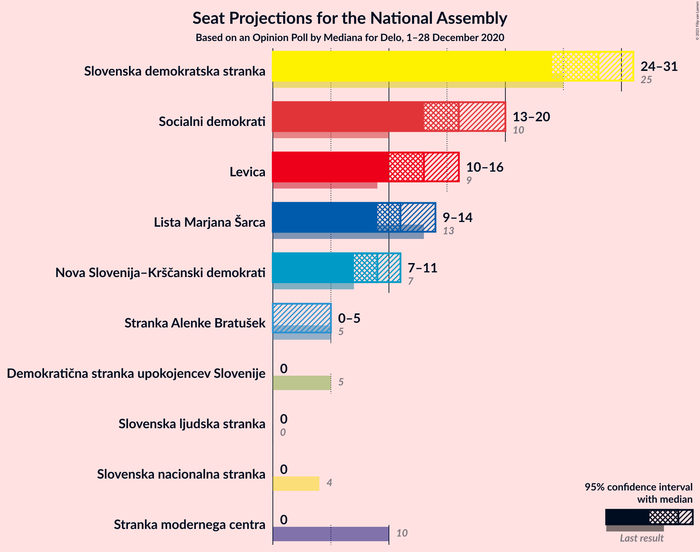
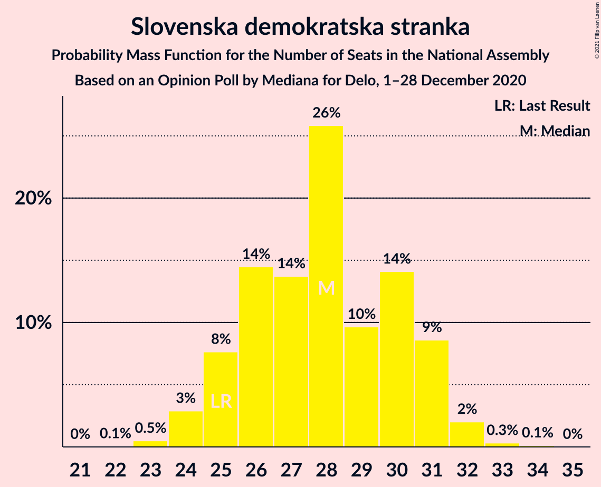
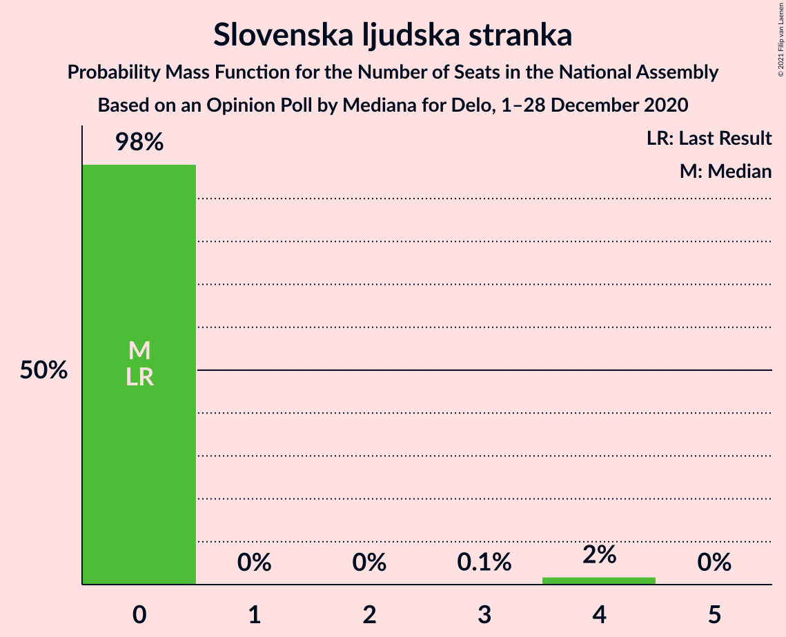
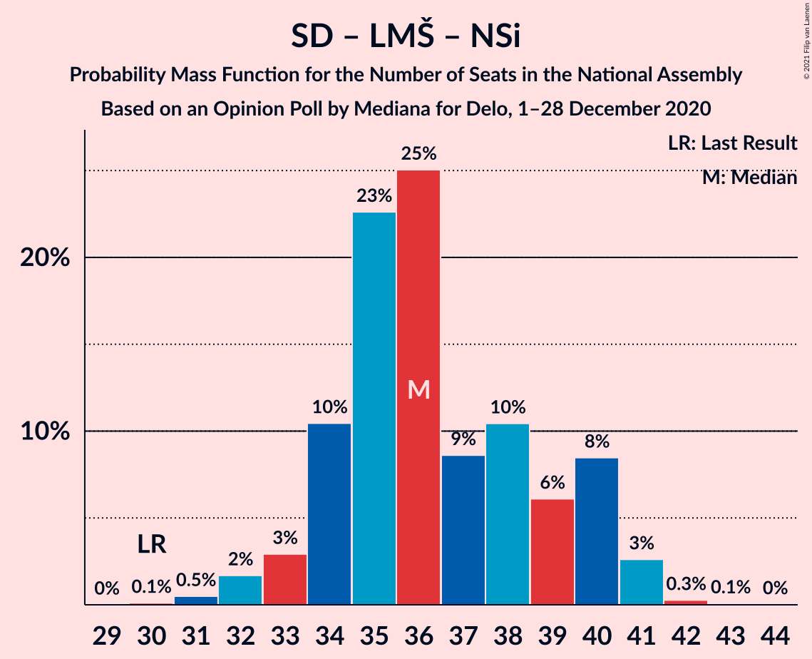
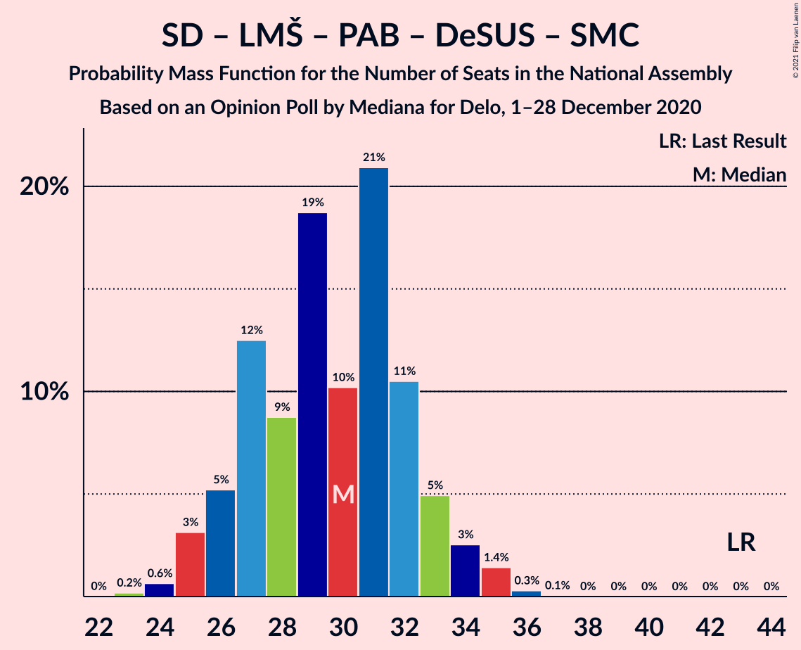
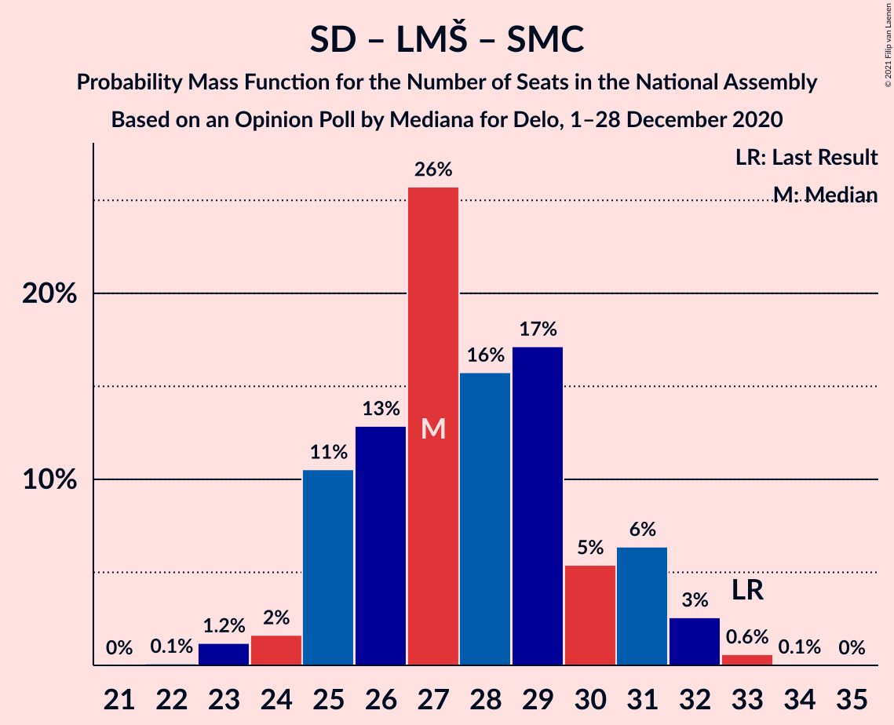

# Opinion Poll by Mediana for Delo, 1–28 December 2020

<a href="#voting-intentions">Voting Intentions</a> | <a href="#seats">Seats</a> | <a href="#coalitions">Coalitions</a> | <a href="#technical-information">Technical Information</a>

## Voting Intentions

### Confidence Intervals

| Party | Last Result | Poll Result | 80% Confidence Interval | 90% Confidence Interval | 95% Confidence Interval | 99% Confidence Interval |
|:-----:|:-----------:|:-----------:|:-----------------------:|:-----------------------:|:-----------------------:|:-----------------------:|
| Slovenska demokratska stranka | 24.9% | 27.9% | 25.9–30.2% |25.3–30.8% |24.8–31.4% |23.8–32.4% |
| Socialni demokrati | 9.9% | 16.4% | 14.8–18.3% |14.3–18.9% |13.9–19.3% |13.1–20.3% |
| Levica | 9.3% | 13.6% | 12.1–15.4% |11.7–15.9% |11.3–16.4% |10.6–17.2% |
| Lista Marjana Šarca | 12.6% | 11.8% | 10.4–13.5% |10.0–14.0% |9.6–14.4% |9.0–15.2% |
| Nova Slovenija–Krščanski demokrati | 7.2% | 9.0% | 7.7–10.5% |7.4–10.9% |7.1–11.3% |6.5–12.1% |
| Stranka Alenke Bratušek | 5.1% | 3.7% | 2.9–4.7% |2.7–5.0% |2.5–5.3% |2.2–5.9% |
| Demokratična stranka upokojencev Slovenije | 4.9% | 2.7% | 2.0–3.6% |1.9–3.9% |1.7–4.1% |1.4–4.6% |
| Slovenska ljudska stranka | 2.6% | 2.4% | 1.8–3.3% |1.6–3.6% |1.5–3.8% |1.2–4.3% |
| Slovenska nacionalna stranka | 4.2% | 2.1% | 1.6–3.0% |1.4–3.2% |1.3–3.5% |1.1–3.9% |
| Stranka modernega centra | 9.7% | 1.5% | 1.1–2.3% |1.0–2.5% |0.9–2.7% |0.7–3.2% |

*Note:* The poll result column reflects the actual value used in the calculations. Published results may vary slightly, and in addition be rounded to fewer digits.

## Seats

### Confidence Intervals

| Party | Last Result | Median | 80% Confidence Interval | 90% Confidence Interval | 95% Confidence Interval | 99% Confidence Interval |
|:-----:|:-----------:|:------:|:-----------------------:|:-----------------------:|:-----------------------:|:-----------------------:|
| <a href="#slovenska-demokratska-stranka">Slovenska demokratska stranka</a> | 25 | 29 | 26–30 |25–30 |25–30 |24–33 |
| <a href="#socialni-demokrati">Socialni demokrati</a> | 10 | 16 | 15–18 |13–19 |13–19 |13–20 |
| <a href="#levica">Levica</a> | 9 | 13 | 11–15 |11–15 |10–16 |10–17 |
| <a href="#lista-marjana-šarca">Lista Marjana Šarca</a> | 13 | 11 | 10–13 |10–13 |9–14 |9–16 |
| <a href="#nova-slovenija–krščanski-demokrati">Nova Slovenija–Krščanski demokrati</a> | 7 | 10 | 7–11 |7–11 |7–11 |6–12 |
| <a href="#stranka-alenke-bratušek">Stranka Alenke Bratušek</a> | 5 | 0 | 0–4 |0–5 |0–5 |0–5 |
| <a href="#demokratična-stranka-upokojencev-slovenije">Demokratična stranka upokojencev Slovenije</a> | 5 | 0 | 0 |0 |0 |0–4 |
| <a href="#slovenska-ljudska-stranka">Slovenska ljudska stranka</a> | 0 | 0 | 0 |0–4 |0–4 |0–4 |
| <a href="#slovenska-nacionalna-stranka">Slovenska nacionalna stranka</a> | 4 | 0 | 0 |0 |0 |0 |
| <a href="#stranka-modernega-centra">Stranka modernega centra</a> | 10 | 0 | 0 |0 |0 |0 |

### Slovenska demokratska stranka

*For a full overview of the results for this party, see the [Slovenska demokratska stranka](party-slovenskademokratskastranka.html) page.*

| Number of Seats | Probability | Accumulated | Special Marks |
|:---------------:|:-----------:|:-----------:|:-------------:|
| 22 | 0% | 100% |  |
| 23 | 0.3% | 99.9% |  |
| 24 | 1.2% | 99.7% |  |
| 25 | 7% | 98% | Last Result |
| 26 | 10% | 91% |  |
| 27 | 10% | 81% |  |
| 28 | 15% | 71% |  |
| 29 | 20% | 56% | Median |
| 30 | 35% | 37% |  |
| 31 | 1.0% | 2% |  |
| 32 | 0.6% | 1.1% |  |
| 33 | 0.2% | 0.5% |  |
| 34 | 0.4% | 0.4% |  |
| 35 | 0% | 0% |  |

### Socialni demokrati

*For a full overview of the results for this party, see the [Socialni demokrati](party-socialnidemokrati.html) page.*

| Number of Seats | Probability | Accumulated | Special Marks |
|:---------------:|:-----------:|:-----------:|:-------------:|
| 10 | 0% | 100% | Last Result |
| 11 | 0% | 100% |  |
| 12 | 0.3% | 100% |  |
| 13 | 5% | 99.7% |  |
| 14 | 3% | 95% |  |
| 15 | 32% | 91% |  |
| 16 | 27% | 59% | Median |
| 17 | 11% | 32% |  |
| 18 | 16% | 21% |  |
| 19 | 4% | 5% |  |
| 20 | 0.8% | 1.0% |  |
| 21 | 0.3% | 0.3% |  |
| 22 | 0% | 0% |  |

### Levica

*For a full overview of the results for this party, see the [Levica](party-levica.html) page.*

| Number of Seats | Probability | Accumulated | Special Marks |
|:---------------:|:-----------:|:-----------:|:-------------:|
| 9 | 0% | 100% | Last Result |
| 10 | 4% | 100% |  |
| 11 | 6% | 96% |  |
| 12 | 20% | 90% |  |
| 13 | 37% | 70% | Median |
| 14 | 22% | 33% |  |
| 15 | 8% | 10% |  |
| 16 | 2% | 3% |  |
| 17 | 0.4% | 0.6% |  |
| 18 | 0.1% | 0.2% |  |
| 19 | 0.1% | 0.1% |  |
| 20 | 0% | 0% |  |

### Lista Marjana Šarca

*For a full overview of the results for this party, see the [Lista Marjana Šarca](party-listamarjanašarca.html) page.*

| Number of Seats | Probability | Accumulated | Special Marks |
|:---------------:|:-----------:|:-----------:|:-------------:|
| 8 | 0.4% | 100% |  |
| 9 | 2% | 99.6% |  |
| 10 | 25% | 97% |  |
| 11 | 29% | 73% | Median |
| 12 | 21% | 43% |  |
| 13 | 19% | 22% | Last Result |
| 14 | 1.3% | 3% |  |
| 15 | 0.4% | 1.2% |  |
| 16 | 0.8% | 0.8% |  |
| 17 | 0% | 0% |  |

### Nova Slovenija–Krščanski demokrati

*For a full overview of the results for this party, see the [Nova Slovenija–Krščanski demokrati](party-novaslovenija–krščanskidemokrati.html) page.*

| Number of Seats | Probability | Accumulated | Special Marks |
|:---------------:|:-----------:|:-----------:|:-------------:|
| 6 | 2% | 100% |  |
| 7 | 9% | 98% | Last Result |
| 8 | 27% | 89% |  |
| 9 | 9% | 63% |  |
| 10 | 25% | 54% | Median |
| 11 | 27% | 29% |  |
| 12 | 2% | 2% |  |
| 13 | 0.5% | 0.5% |  |
| 14 | 0% | 0% |  |

### Stranka Alenke Bratušek

*For a full overview of the results for this party, see the [Stranka Alenke Bratušek](party-strankaalenkebratušek.html) page.*

| Number of Seats | Probability | Accumulated | Special Marks |
|:---------------:|:-----------:|:-----------:|:-------------:|
| 0 | 72% | 100% | Median |
| 1 | 0% | 28% |  |
| 2 | 0% | 28% |  |
| 3 | 0% | 28% |  |
| 4 | 22% | 28% |  |
| 5 | 6% | 6% | Last Result |
| 6 | 0.4% | 0.4% |  |
| 7 | 0% | 0% |  |

### Demokratična stranka upokojencev Slovenije

*For a full overview of the results for this party, see the [Demokratična stranka upokojencev Slovenije](party-demokratičnastrankaupokojencevslovenije.html) page.*

| Number of Seats | Probability | Accumulated | Special Marks |
|:---------------:|:-----------:|:-----------:|:-------------:|
| 0 | 98% | 100% | Median |
| 1 | 0% | 2% |  |
| 2 | 0% | 2% |  |
| 3 | 0.1% | 2% |  |
| 4 | 2% | 2% |  |
| 5 | 0.1% | 0.1% | Last Result |
| 6 | 0% | 0% |  |

### Slovenska ljudska stranka

*For a full overview of the results for this party, see the [Slovenska ljudska stranka](party-slovenskaljudskastranka.html) page.*

| Number of Seats | Probability | Accumulated | Special Marks |
|:---------------:|:-----------:|:-----------:|:-------------:|
| 0 | 91% | 100% | Last Result, Median |
| 1 | 0% | 9% |  |
| 2 | 0% | 9% |  |
| 3 | 0.7% | 9% |  |
| 4 | 9% | 9% |  |
| 5 | 0.1% | 0.1% |  |
| 6 | 0% | 0% |  |

### Slovenska nacionalna stranka

*For a full overview of the results for this party, see the [Slovenska nacionalna stranka](party-slovenskanacionalnastranka.html) page.*

| Number of Seats | Probability | Accumulated | Special Marks |
|:---------------:|:-----------:|:-----------:|:-------------:|
| 0 | 99.5% | 100% | Median |
| 1 | 0% | 0.5% |  |
| 2 | 0% | 0.5% |  |
| 3 | 0% | 0.5% |  |
| 4 | 0.5% | 0.5% | Last Result |
| 5 | 0% | 0% |  |

### Stranka modernega centra

*For a full overview of the results for this party, see the [Stranka modernega centra](party-strankamodernegacentra.html) page.*

| Number of Seats | Probability | Accumulated | Special Marks |
|:---------------:|:-----------:|:-----------:|:-------------:|
| 0 | 100% | 100% | Median |
| 1 | 0% | 0% |  |
| 2 | 0% | 0% |  |
| 3 | 0% | 0% |  |
| 4 | 0% | 0% |  |
| 5 | 0% | 0% |  |
| 6 | 0% | 0% |  |
| 7 | 0% | 0% |  |
| 8 | 0% | 0% |  |
| 9 | 0% | 0% |  |
| 10 | 0% | 0% | Last Result |

## Coalitions

### Confidence Intervals

| Coalition | Last Result | Median | Majority? | 80% Confidence Interval | 90% Confidence Interval | 95% Confidence Interval | 99% Confidence Interval |
|:---------:|:-----------:|:------:|:---------:|:-----------------------:|:-----------------------:|:-----------------------:|:-----------------------:|
| Slovenska demokratska stranka – Lista Marjana Šarca – Demokratična stranka upokojencev Slovenije | 43 | 40 | 0.4% | 37–43 | 37–43 | 36–43 | 35–45 |
| Slovenska demokratska stranka – Lista Marjana Šarca | 38 | 40 | 0.1% | 37–43 | 37–43 | 36–43 | 35–44 |
| Socialni demokrati – Lista Marjana Šarca – Nova Slovenija–Krščanski demokrati – Stranka Alenke Bratušek – Demokratična stranka upokojencev Slovenije – Stranka modernega centra | 50 | 38 | 0% | 36–41 | 36–42 | 33–42 | 32–45 |
| Socialni demokrati – Lista Marjana Šarca – Nova Slovenija–Krščanski demokrati – Demokratična stranka upokojencev Slovenije | 35 | 37 | 0% | 34–39 | 33–40 | 32–40 | 30–42 |
| Socialni demokrati – Lista Marjana Šarca – Nova Slovenija–Krščanski demokrati – Demokratična stranka upokojencev Slovenije – Stranka modernega centra | 45 | 37 | 0% | 34–39 | 33–40 | 32–40 | 30–42 |
| Socialni demokrati – Lista Marjana Šarca – Nova Slovenija–Krščanski demokrati | 30 | 36 | 0% | 34–39 | 33–40 | 32–40 | 30–42 |
| Socialni demokrati – Lista Marjana Šarca – Nova Slovenija–Krščanski demokrati – Stranka modernega centra | 40 | 36 | 0% | 34–39 | 33–40 | 32–40 | 30–42 |
| Socialni demokrati – Lista Marjana Šarca – Stranka Alenke Bratušek – Demokratična stranka upokojencev Slovenije – Stranka modernega centra | 43 | 29 | 0% | 25–32 | 25–33 | 25–33 | 24–36 |
| Socialni demokrati – Lista Marjana Šarca – Demokratična stranka upokojencev Slovenije | 28 | 28 | 0% | 25–29 | 24–31 | 23–31 | 23–33 |
| Socialni demokrati – Lista Marjana Šarca – Demokratična stranka upokojencev Slovenije – Stranka modernega centra | 38 | 28 | 0% | 25–29 | 24–31 | 23–31 | 23–33 |
| Socialni demokrati – Lista Marjana Šarca | 23 | 28 | 0% | 25–29 | 24–31 | 23–31 | 23–33 |
| Socialni demokrati – Lista Marjana Šarca – Stranka modernega centra | 33 | 28 | 0% | 25–29 | 24–31 | 23–31 | 23–33 |
| Socialni demokrati – Demokratična stranka upokojencev Slovenije – Stranka modernega centra | 25 | 16 | 0% | 15–18 | 13–19 | 13–19 | 13–21 |

### Slovenska demokratska stranka – Lista Marjana Šarca – Demokratična stranka upokojencev Slovenije

| Number of Seats | Probability | Accumulated | Special Marks |
|:---------------:|:-----------:|:-----------:|:-------------:|
| 34 | 0.3% | 100% |  |
| 35 | 0.8% | 99.7% |  |
| 36 | 2% | 98.9% |  |
| 37 | 11% | 97% |  |
| 38 | 6% | 87% |  |
| 39 | 9% | 80% |  |
| 40 | 50% | 72% | Median |
| 41 | 7% | 22% |  |
| 42 | 2% | 15% |  |
| 43 | 11% | 13% | Last Result |
| 44 | 1.0% | 2% |  |
| 45 | 0.4% | 0.8% |  |
| 46 | 0.2% | 0.4% | Majority |
| 47 | 0.1% | 0.1% |  |
| 48 | 0% | 0% |  |

### Slovenska demokratska stranka – Lista Marjana Šarca

| Number of Seats | Probability | Accumulated | Special Marks |
|:---------------:|:-----------:|:-----------:|:-------------:|
| 33 | 0.1% | 100% |  |
| 34 | 0.3% | 99.9% |  |
| 35 | 1.2% | 99.6% |  |
| 36 | 2% | 98% |  |
| 37 | 11% | 97% |  |
| 38 | 7% | 86% | Last Result |
| 39 | 9% | 79% |  |
| 40 | 49% | 70% | Median |
| 41 | 7% | 21% |  |
| 42 | 1.5% | 14% |  |
| 43 | 11% | 12% |  |
| 44 | 0.9% | 1.3% |  |
| 45 | 0.3% | 0.4% |  |
| 46 | 0% | 0.1% | Majority |
| 47 | 0.1% | 0.1% |  |
| 48 | 0% | 0% |  |

### Socialni demokrati – Lista Marjana Šarca – Nova Slovenija–Krščanski demokrati – Stranka Alenke Bratušek – Demokratična stranka upokojencev Slovenije – Stranka modernega centra

| Number of Seats | Probability | Accumulated | Special Marks |
|:---------------:|:-----------:|:-----------:|:-------------:|
| 31 | 0.3% | 100% |  |
| 32 | 2% | 99.7% |  |
| 33 | 0.4% | 98% |  |
| 34 | 1.2% | 97% |  |
| 35 | 1.1% | 96% |  |
| 36 | 27% | 95% |  |
| 37 | 12% | 68% | Median |
| 38 | 9% | 56% |  |
| 39 | 22% | 46% |  |
| 40 | 12% | 24% |  |
| 41 | 2% | 12% |  |
| 42 | 8% | 10% |  |
| 43 | 0.8% | 2% |  |
| 44 | 0.4% | 1.0% |  |
| 45 | 0.6% | 0.6% |  |
| 46 | 0% | 0% | Majority |
| 47 | 0% | 0% |  |
| 48 | 0% | 0% |  |
| 49 | 0% | 0% |  |
| 50 | 0% | 0% | Last Result |

### Socialni demokrati – Lista Marjana Šarca – Nova Slovenija–Krščanski demokrati – Demokratična stranka upokojencev Slovenije

| Number of Seats | Probability | Accumulated | Special Marks |
|:---------------:|:-----------:|:-----------:|:-------------:|
| 30 | 0.6% | 100% |  |
| 31 | 0.6% | 99.4% |  |
| 32 | 3% | 98.8% |  |
| 33 | 4% | 96% |  |
| 34 | 4% | 92% |  |
| 35 | 5% | 88% | Last Result |
| 36 | 32% | 83% |  |
| 37 | 11% | 51% | Median |
| 38 | 14% | 41% |  |
| 39 | 21% | 27% |  |
| 40 | 4% | 6% |  |
| 41 | 1.3% | 2% |  |
| 42 | 0.4% | 0.8% |  |
| 43 | 0.3% | 0.3% |  |
| 44 | 0% | 0% |  |

### Socialni demokrati – Lista Marjana Šarca – Nova Slovenija–Krščanski demokrati – Demokratična stranka upokojencev Slovenije – Stranka modernega centra

| Number of Seats | Probability | Accumulated | Special Marks |
|:---------------:|:-----------:|:-----------:|:-------------:|
| 30 | 0.6% | 100% |  |
| 31 | 0.6% | 99.4% |  |
| 32 | 3% | 98.8% |  |
| 33 | 4% | 96% |  |
| 34 | 4% | 92% |  |
| 35 | 5% | 89% |  |
| 36 | 32% | 83% |  |
| 37 | 11% | 51% | Median |
| 38 | 14% | 41% |  |
| 39 | 21% | 27% |  |
| 40 | 4% | 6% |  |
| 41 | 1.3% | 2% |  |
| 42 | 0.4% | 0.8% |  |
| 43 | 0.3% | 0.3% |  |
| 44 | 0% | 0% |  |
| 45 | 0% | 0% | Last Result |

### Socialni demokrati – Lista Marjana Šarca – Nova Slovenija–Krščanski demokrati

| Number of Seats | Probability | Accumulated | Special Marks |
|:---------------:|:-----------:|:-----------:|:-------------:|
| 30 | 0.6% | 100% | Last Result |
| 31 | 0.6% | 99.4% |  |
| 32 | 3% | 98.7% |  |
| 33 | 4% | 96% |  |
| 34 | 4% | 92% |  |
| 35 | 6% | 88% |  |
| 36 | 32% | 82% |  |
| 37 | 11% | 50% | Median |
| 38 | 14% | 39% |  |
| 39 | 20% | 25% |  |
| 40 | 3% | 5% |  |
| 41 | 1.2% | 2% |  |
| 42 | 0.4% | 0.7% |  |
| 43 | 0.2% | 0.2% |  |
| 44 | 0% | 0% |  |

### Socialni demokrati – Lista Marjana Šarca – Nova Slovenija–Krščanski demokrati – Stranka modernega centra

| Number of Seats | Probability | Accumulated | Special Marks |
|:---------------:|:-----------:|:-----------:|:-------------:|
| 30 | 0.6% | 100% |  |
| 31 | 0.6% | 99.4% |  |
| 32 | 3% | 98.7% |  |
| 33 | 4% | 96% |  |
| 34 | 4% | 92% |  |
| 35 | 6% | 88% |  |
| 36 | 32% | 82% |  |
| 37 | 11% | 50% | Median |
| 38 | 14% | 39% |  |
| 39 | 20% | 25% |  |
| 40 | 3% | 5% | Last Result |
| 41 | 1.2% | 2% |  |
| 42 | 0.4% | 0.7% |  |
| 43 | 0.2% | 0.2% |  |
| 44 | 0% | 0% |  |

### Socialni demokrati – Lista Marjana Šarca – Stranka Alenke Bratušek – Demokratična stranka upokojencev Slovenije – Stranka modernega centra

| Number of Seats | Probability | Accumulated | Special Marks |
|:---------------:|:-----------:|:-----------:|:-------------:|
| 24 | 2% | 100% |  |
| 25 | 17% | 98% |  |
| 26 | 3% | 81% |  |
| 27 | 8% | 78% | Median |
| 28 | 10% | 70% |  |
| 29 | 29% | 60% |  |
| 30 | 5% | 31% |  |
| 31 | 11% | 26% |  |
| 32 | 8% | 16% |  |
| 33 | 6% | 8% |  |
| 34 | 0.7% | 2% |  |
| 35 | 0.4% | 1.1% |  |
| 36 | 0.6% | 0.6% |  |
| 37 | 0.1% | 0.1% |  |
| 38 | 0% | 0% |  |
| 39 | 0% | 0% |  |
| 40 | 0% | 0% |  |
| 41 | 0% | 0% |  |
| 42 | 0% | 0% |  |
| 43 | 0% | 0% | Last Result |

### Socialni demokrati – Lista Marjana Šarca – Demokratična stranka upokojencev Slovenije

| Number of Seats | Probability | Accumulated | Special Marks |
|:---------------:|:-----------:|:-----------:|:-------------:|
| 22 | 0.2% | 100% |  |
| 23 | 3% | 99.8% |  |
| 24 | 3% | 97% |  |
| 25 | 19% | 94% |  |
| 26 | 5% | 74% |  |
| 27 | 14% | 70% | Median |
| 28 | 13% | 56% | Last Result |
| 29 | 33% | 42% |  |
| 30 | 3% | 9% |  |
| 31 | 4% | 6% |  |
| 32 | 1.5% | 2% |  |
| 33 | 0.6% | 0.7% |  |
| 34 | 0% | 0.1% |  |
| 35 | 0% | 0.1% |  |
| 36 | 0% | 0% |  |

### Socialni demokrati – Lista Marjana Šarca – Demokratična stranka upokojencev Slovenije – Stranka modernega centra

| Number of Seats | Probability | Accumulated | Special Marks |
|:---------------:|:-----------:|:-----------:|:-------------:|
| 22 | 0.2% | 100% |  |
| 23 | 3% | 99.8% |  |
| 24 | 3% | 97% |  |
| 25 | 19% | 94% |  |
| 26 | 5% | 74% |  |
| 27 | 14% | 70% | Median |
| 28 | 13% | 56% |  |
| 29 | 33% | 42% |  |
| 30 | 3% | 9% |  |
| 31 | 4% | 6% |  |
| 32 | 1.5% | 2% |  |
| 33 | 0.6% | 0.7% |  |
| 34 | 0% | 0.1% |  |
| 35 | 0% | 0.1% |  |
| 36 | 0% | 0% |  |
| 37 | 0% | 0% |  |
| 38 | 0% | 0% | Last Result |

### Socialni demokrati – Lista Marjana Šarca

| Number of Seats | Probability | Accumulated | Special Marks |
|:---------------:|:-----------:|:-----------:|:-------------:|
| 22 | 0.2% | 100% |  |
| 23 | 3% | 99.8% | Last Result |
| 24 | 3% | 97% |  |
| 25 | 20% | 94% |  |
| 26 | 6% | 74% |  |
| 27 | 14% | 68% | Median |
| 28 | 14% | 54% |  |
| 29 | 33% | 41% |  |
| 30 | 2% | 8% |  |
| 31 | 4% | 5% |  |
| 32 | 1.2% | 2% |  |
| 33 | 0.6% | 0.6% |  |
| 34 | 0% | 0% |  |

### Socialni demokrati – Lista Marjana Šarca – Stranka modernega centra

| Number of Seats | Probability | Accumulated | Special Marks |
|:---------------:|:-----------:|:-----------:|:-------------:|
| 22 | 0.2% | 100% |  |
| 23 | 3% | 99.8% |  |
| 24 | 3% | 97% |  |
| 25 | 20% | 94% |  |
| 26 | 6% | 74% |  |
| 27 | 14% | 68% | Median |
| 28 | 14% | 54% |  |
| 29 | 33% | 41% |  |
| 30 | 2% | 8% |  |
| 31 | 4% | 5% |  |
| 32 | 1.2% | 2% |  |
| 33 | 0.6% | 0.6% | Last Result |
| 34 | 0% | 0% |  |

### Socialni demokrati – Demokratična stranka upokojencev Slovenije – Stranka modernega centra

| Number of Seats | Probability | Accumulated | Special Marks |
|:---------------:|:-----------:|:-----------:|:-------------:|
| 12 | 0.3% | 100% |  |
| 13 | 5% | 99.7% |  |
| 14 | 3% | 95% |  |
| 15 | 32% | 92% |  |
| 16 | 26% | 60% | Median |
| 17 | 11% | 34% |  |
| 18 | 16% | 23% |  |
| 19 | 4% | 7% |  |
| 20 | 2% | 2% |  |
| 21 | 0.5% | 0.5% |  |
| 22 | 0% | 0.1% |  |
| 23 | 0% | 0% |  |
| 24 | 0% | 0% |  |
| 25 | 0% | 0% | Last Result |

## Technical Information

### Opinion Poll

+ **Polling firm:** Mediana
+ **Commissioner(s):** Delo
+ **Fieldwork period:** 1–28 December 2020

### Calculations

+ **Sample size:** 712
+ **Simulations done:** 131,072
+ **Error estimate:** 2.96%

