# Opinion Poll by CRJM for Delo, 1–30 December 2020

<a href="#voting-intentions">Voting Intentions</a> | <a href="#seats">Seats</a> | <a href="#coalitions">Coalitions</a> | <a href="#technical-information">Technical Information</a>

## Voting Intentions

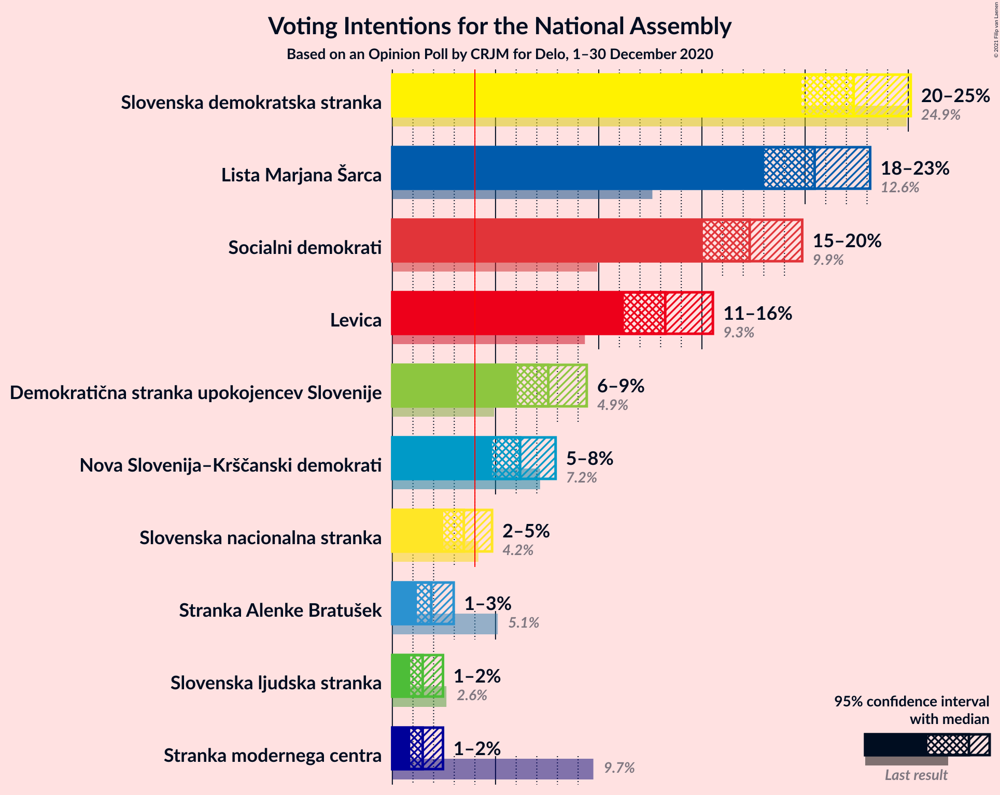

### Confidence Intervals

| Party | Last Result | Poll Result | 80% Confidence Interval | 90% Confidence Interval | 95% Confidence Interval | 99% Confidence Interval |
|:-----:|:-----------:|:-----------:|:-----------------------:|:-----------------------:|:-----------------------:|:-----------------------:|
| Slovenska demokratska stranka | 24.9% | 22.4% | 20.7–24.2% |20.2–24.7% |19.8–25.1% |19.0–26.0% |
| Lista Marjana Šarca | 12.6% | 20.5% | 18.9–22.2% |18.4–22.7% |18.0–23.2% |17.3–24.0% |
| Socialni demokrati | 9.9% | 17.3% | 15.8–19.0% |15.4–19.4% |15.0–19.9% |14.4–20.7% |
| Levica | 9.3% | 13.2% | 11.9–14.7% |11.5–15.1% |11.2–15.5% |10.6–16.3% |
| Demokratična stranka upokojencev Slovenije | 4.9% | 7.6% | 6.6–8.8% |6.3–9.1% |6.0–9.4% |5.6–10.0% |
| Nova Slovenija–Krščanski demokrati | 7.2% | 6.2% | 5.3–7.3% |5.0–7.6% |4.8–7.9% |4.4–8.5% |
| Slovenska nacionalna stranka | 4.2% | 3.5% | 2.8–4.4% |2.6–4.6% |2.5–4.8% |2.2–5.3% |
| Stranka Alenke Bratušek | 5.1% | 1.9% | 1.4–2.6% |1.3–2.8% |1.2–3.0% |1.0–3.4% |
| Stranka modernega centra | 9.7% | 1.5% | 1.1–2.1% |1.0–2.3% |0.9–2.5% |0.7–2.8% |
| Slovenska ljudska stranka | 2.6% | 1.5% | 1.1–2.1% |1.0–2.3% |0.9–2.5% |0.7–2.8% |

*Note:* The poll result column reflects the actual value used in the calculations. Published results may vary slightly, and in addition be rounded to fewer digits.

## Seats

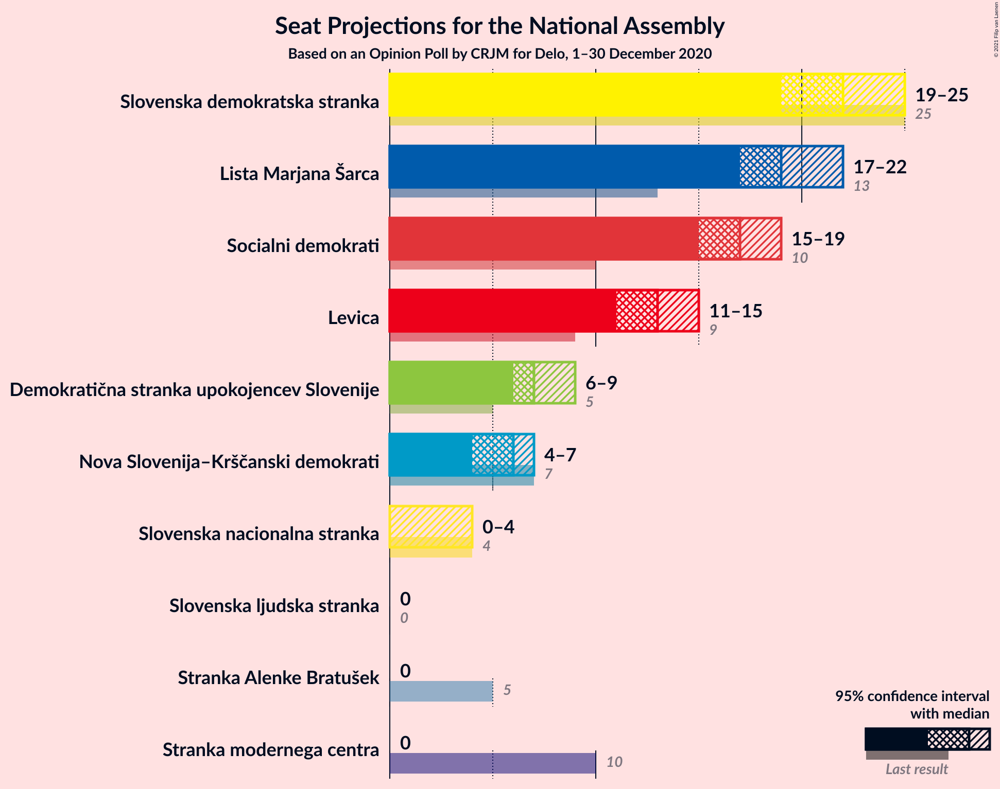

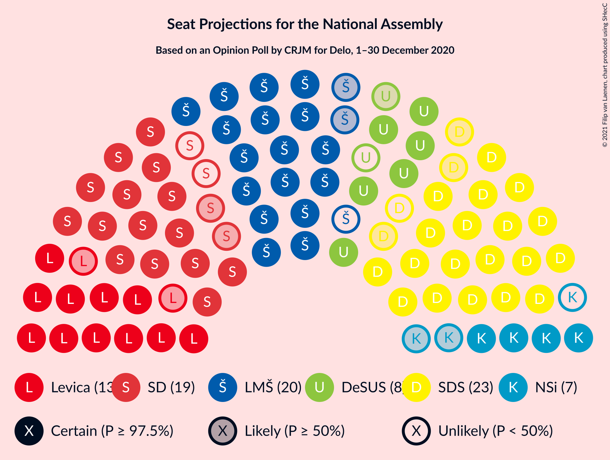

### Confidence Intervals

| Party | Last Result | Median | 80% Confidence Interval | 90% Confidence Interval | 95% Confidence Interval | 99% Confidence Interval |
|:-----:|:-----------:|:------:|:-----------------------:|:-----------------------:|:-----------------------:|:-----------------------:|
| <a href="#slovenska-demokratska-stranka">Slovenska demokratska stranka</a> | 25 | 22 | 20–23 |19–24 |19–25 |18–26 |
| <a href="#lista-marjana-šarca">Lista Marjana Šarca</a> | 13 | 19 | 18–21 |18–22 |17–22 |17–23 |
| <a href="#socialni-demokrati">Socialni demokrati</a> | 10 | 17 | 15–19 |15–19 |15–19 |14–20 |
| <a href="#levica">Levica</a> | 9 | 13 | 11–14 |11–15 |11–15 |10–15 |
| <a href="#demokratična-stranka-upokojencev-slovenije">Demokratična stranka upokojencev Slovenije</a> | 5 | 7 | 6–8 |6–9 |6–9 |5–9 |
| <a href="#nova-slovenija–krščanski-demokrati">Nova Slovenija–Krščanski demokrati</a> | 7 | 6 | 5–7 |5–7 |4–7 |4–8 |
| <a href="#slovenska-nacionalna-stranka">Slovenska nacionalna stranka</a> | 4 | 0 | 0–4 |0–4 |0–4 |0–4 |
| <a href="#stranka-alenke-bratušek">Stranka Alenke Bratušek</a> | 5 | 0 | 0 |0 |0 |0 |
| <a href="#stranka-modernega-centra">Stranka modernega centra</a> | 10 | 0 | 0 |0 |0 |0 |
| <a href="#slovenska-ljudska-stranka">Slovenska ljudska stranka</a> | 0 | 0 | 0 |0 |0 |0 |

### Slovenska demokratska stranka

*For a full overview of the results for this party, see the [Slovenska demokratska stranka](party-slovenskademokratskastranka.html) page.*

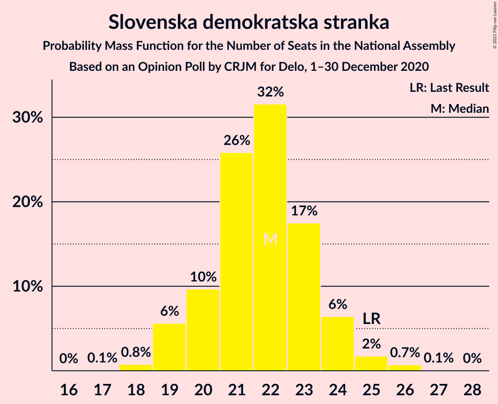

| Number of Seats | Probability | Accumulated | Special Marks |
|:---------------:|:-----------:|:-----------:|:-------------:|
| 17 | 0.1% | 100% |  |
| 18 | 0.8% | 99.9% |  |
| 19 | 6% | 99.2% |  |
| 20 | 10% | 94% |  |
| 21 | 26% | 84% |  |
| 22 | 32% | 58% | Median |
| 23 | 17% | 26% |  |
| 24 | 6% | 9% |  |
| 25 | 2% | 3% | Last Result |
| 26 | 0.7% | 0.8% |  |
| 27 | 0.1% | 0.1% |  |
| 28 | 0% | 0% |  |

### Lista Marjana Šarca

*For a full overview of the results for this party, see the [Lista Marjana Šarca](party-listamarjanašarca.html) page.*

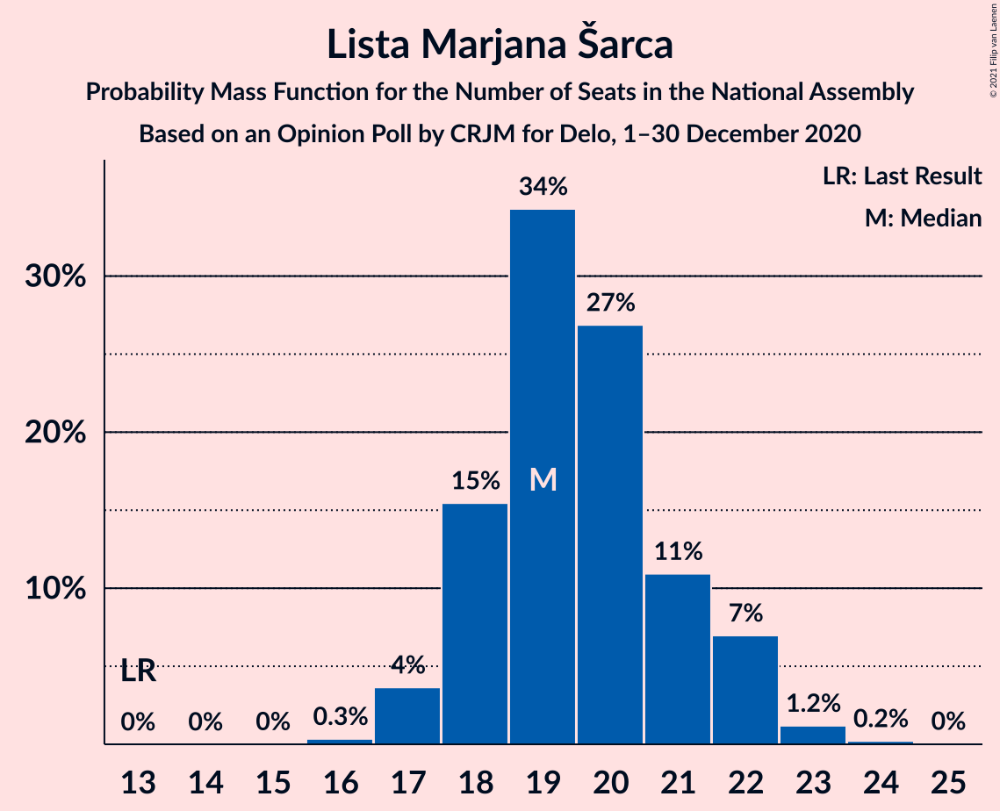

| Number of Seats | Probability | Accumulated | Special Marks |
|:---------------:|:-----------:|:-----------:|:-------------:|
| 13 | 0% | 100% | Last Result |
| 14 | 0% | 100% |  |
| 15 | 0% | 100% |  |
| 16 | 0.3% | 100% |  |
| 17 | 4% | 99.6% |  |
| 18 | 15% | 96% |  |
| 19 | 34% | 81% | Median |
| 20 | 27% | 46% |  |
| 21 | 11% | 19% |  |
| 22 | 7% | 8% |  |
| 23 | 1.2% | 1.4% |  |
| 24 | 0.2% | 0.3% |  |
| 25 | 0% | 0% |  |

### Socialni demokrati

*For a full overview of the results for this party, see the [Socialni demokrati](party-socialnidemokrati.html) page.*

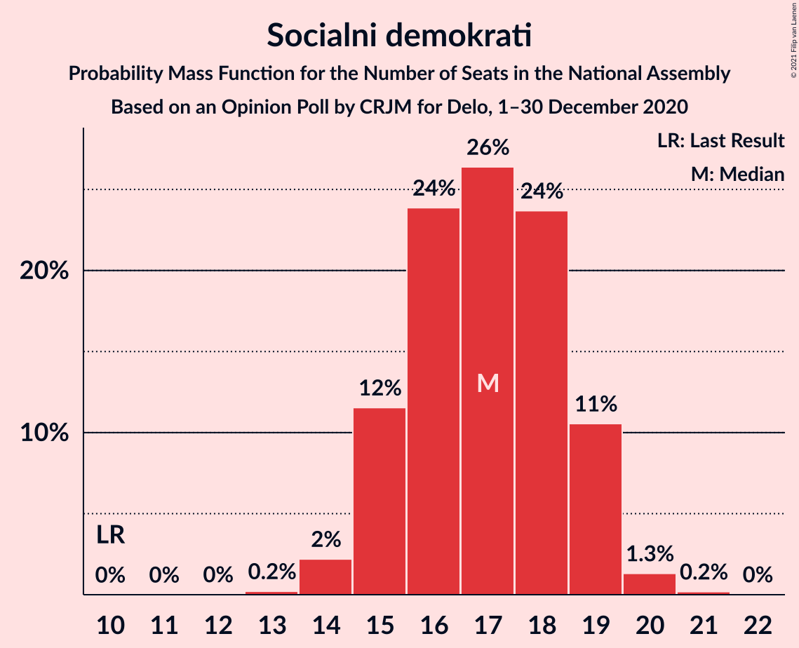

| Number of Seats | Probability | Accumulated | Special Marks |
|:---------------:|:-----------:|:-----------:|:-------------:|
| 10 | 0% | 100% | Last Result |
| 11 | 0% | 100% |  |
| 12 | 0% | 100% |  |
| 13 | 0.2% | 100% |  |
| 14 | 2% | 99.8% |  |
| 15 | 12% | 98% |  |
| 16 | 24% | 86% |  |
| 17 | 26% | 62% | Median |
| 18 | 24% | 36% |  |
| 19 | 11% | 12% |  |
| 20 | 1.3% | 2% |  |
| 21 | 0.2% | 0.2% |  |
| 22 | 0% | 0% |  |

### Levica

*For a full overview of the results for this party, see the [Levica](party-levica.html) page.*

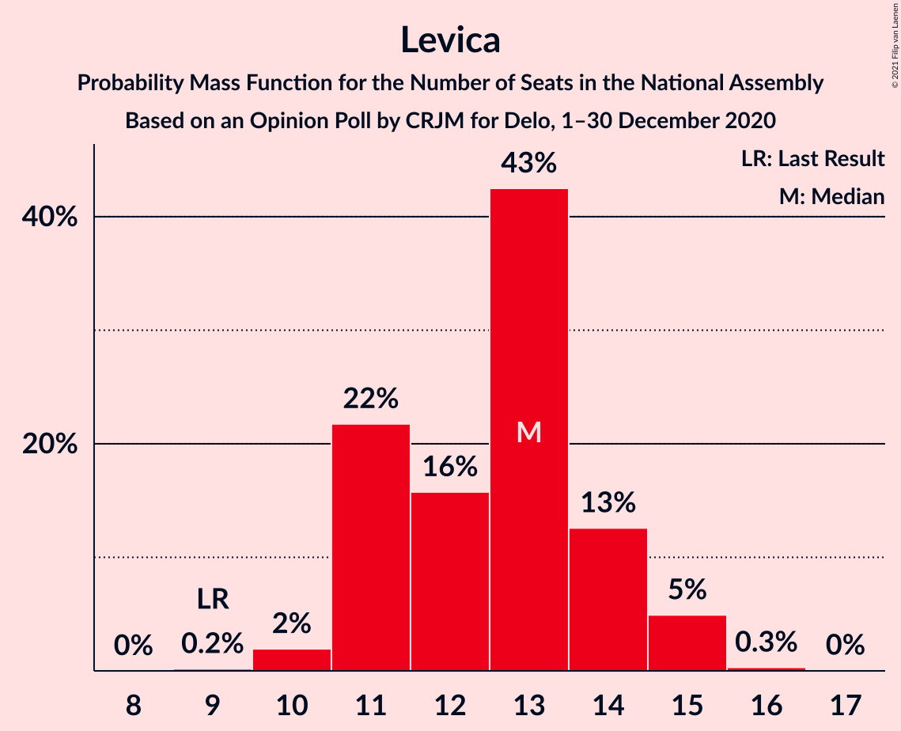

| Number of Seats | Probability | Accumulated | Special Marks |
|:---------------:|:-----------:|:-----------:|:-------------:|
| 9 | 0.2% | 100% | Last Result |
| 10 | 2% | 99.8% |  |
| 11 | 22% | 98% |  |
| 12 | 16% | 76% |  |
| 13 | 43% | 60% | Median |
| 14 | 13% | 18% |  |
| 15 | 5% | 5% |  |
| 16 | 0.3% | 0.4% |  |
| 17 | 0% | 0% |  |

### Demokratična stranka upokojencev Slovenije

*For a full overview of the results for this party, see the [Demokratična stranka upokojencev Slovenije](party-demokratičnastrankaupokojencevslovenije.html) page.*

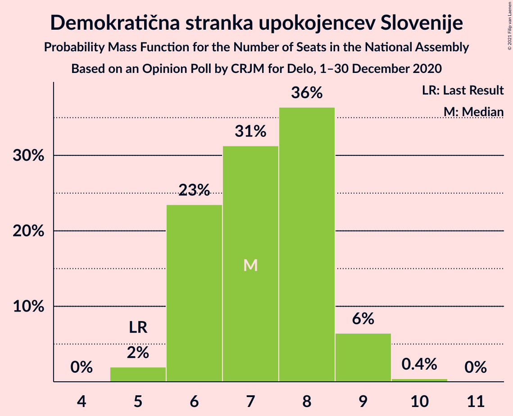

| Number of Seats | Probability | Accumulated | Special Marks |
|:---------------:|:-----------:|:-----------:|:-------------:|
| 5 | 2% | 100% | Last Result |
| 6 | 23% | 98% |  |
| 7 | 31% | 75% | Median |
| 8 | 36% | 43% |  |
| 9 | 6% | 7% |  |
| 10 | 0.4% | 0.4% |  |
| 11 | 0% | 0% |  |

### Nova Slovenija–Krščanski demokrati

*For a full overview of the results for this party, see the [Nova Slovenija–Krščanski demokrati](party-novaslovenija–krščanskidemokrati.html) page.*

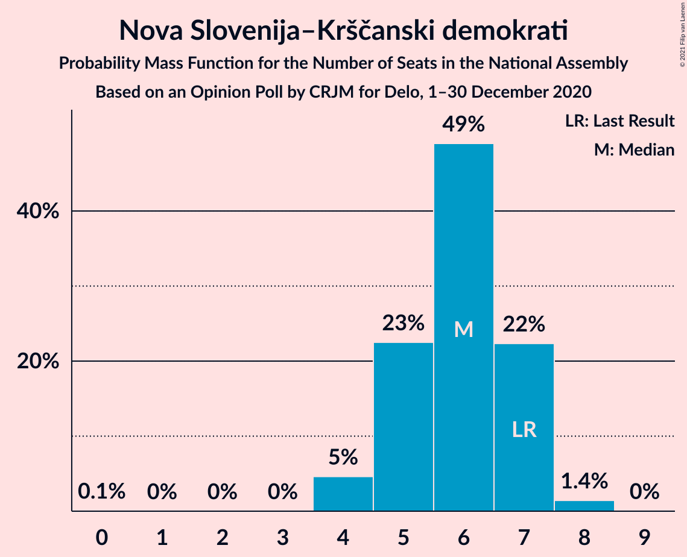

| Number of Seats | Probability | Accumulated | Special Marks |
|:---------------:|:-----------:|:-----------:|:-------------:|
| 0 | 0.1% | 100% |  |
| 1 | 0% | 99.9% |  |
| 2 | 0% | 99.9% |  |
| 3 | 0% | 99.9% |  |
| 4 | 5% | 99.9% |  |
| 5 | 23% | 95% |  |
| 6 | 49% | 73% | Median |
| 7 | 22% | 24% | Last Result |
| 8 | 1.4% | 1.5% |  |
| 9 | 0% | 0% |  |

### Slovenska nacionalna stranka

*For a full overview of the results for this party, see the [Slovenska nacionalna stranka](party-slovenskanacionalnastranka.html) page.*

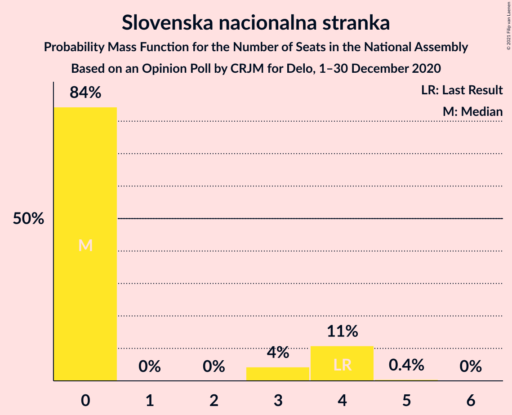

| Number of Seats | Probability | Accumulated | Special Marks |
|:---------------:|:-----------:|:-----------:|:-------------:|
| 0 | 84% | 100% | Median |
| 1 | 0% | 16% |  |
| 2 | 0% | 16% |  |
| 3 | 4% | 16% |  |
| 4 | 11% | 11% | Last Result |
| 5 | 0.4% | 0.5% |  |
| 6 | 0% | 0% |  |

### Stranka Alenke Bratušek

*For a full overview of the results for this party, see the [Stranka Alenke Bratušek](party-strankaalenkebratušek.html) page.*

| Number of Seats | Probability | Accumulated | Special Marks |
|:---------------:|:-----------:|:-----------:|:-------------:|
| 0 | 100% | 100% | Median |
| 1 | 0% | 0% |  |
| 2 | 0% | 0% |  |
| 3 | 0% | 0% |  |
| 4 | 0% | 0% |  |
| 5 | 0% | 0% | Last Result |

### Stranka modernega centra

*For a full overview of the results for this party, see the [Stranka modernega centra](party-strankamodernegacentra.html) page.*

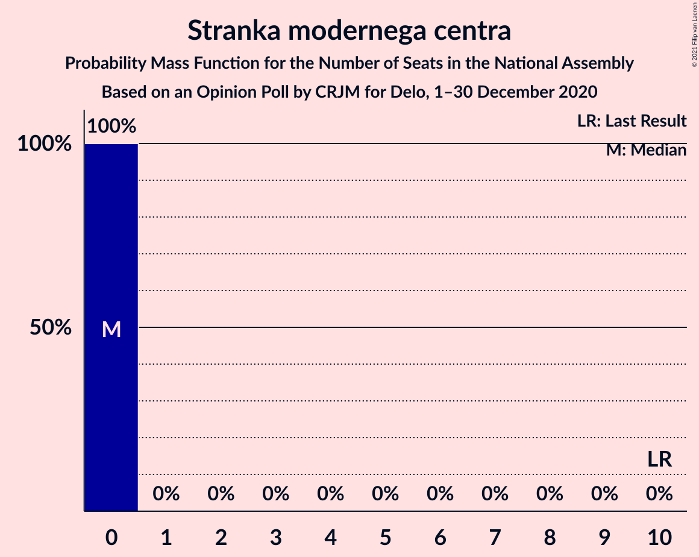

| Number of Seats | Probability | Accumulated | Special Marks |
|:---------------:|:-----------:|:-----------:|:-------------:|
| 0 | 100% | 100% | Median |
| 1 | 0% | 0% |  |
| 2 | 0% | 0% |  |
| 3 | 0% | 0% |  |
| 4 | 0% | 0% |  |
| 5 | 0% | 0% |  |
| 6 | 0% | 0% |  |
| 7 | 0% | 0% |  |
| 8 | 0% | 0% |  |
| 9 | 0% | 0% |  |
| 10 | 0% | 0% | Last Result |

### Slovenska ljudska stranka

*For a full overview of the results for this party, see the [Slovenska ljudska stranka](party-slovenskaljudskastranka.html) page.*

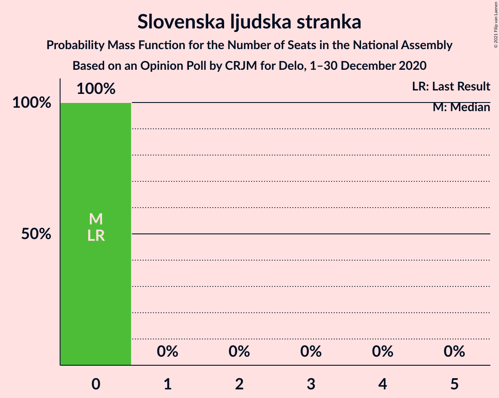

| Number of Seats | Probability | Accumulated | Special Marks |
|:---------------:|:-----------:|:-----------:|:-------------:|
| 0 | 100% | 100% | Last Result, Median |

## Coalitions

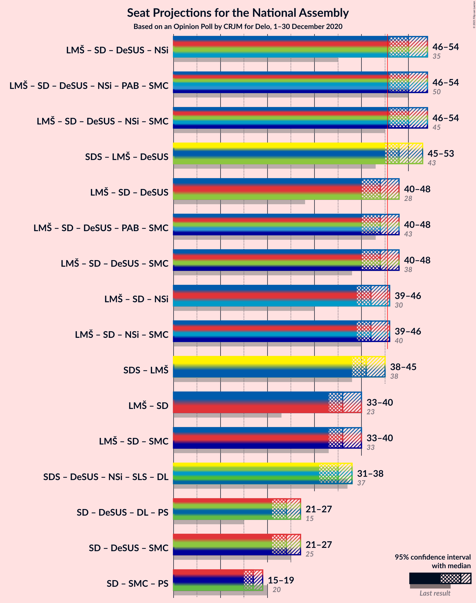

### Confidence Intervals

| Coalition | Last Result | Median | Majority? | 80% Confidence Interval | 90% Confidence Interval | 95% Confidence Interval | 99% Confidence Interval |
|:---------:|:-----------:|:------:|:---------:|:-----------------------:|:-----------------------:|:-----------------------:|:-----------------------:|
| Lista Marjana Šarca – Socialni demokrati – Demokratična stranka upokojencev Slovenije – Nova Slovenija–Krščanski demokrati | 35 | 50 | 98% | 47–52 | 46–53 | 46–54 | 44–55 |
| Lista Marjana Šarca – Socialni demokrati – Demokratična stranka upokojencev Slovenije – Nova Slovenija–Krščanski demokrati – Stranka Alenke Bratušek – Stranka modernega centra | 50 | 50 | 98% | 47–52 | 46–53 | 46–54 | 44–55 |
| Lista Marjana Šarca – Socialni demokrati – Demokratična stranka upokojencev Slovenije – Nova Slovenija–Krščanski demokrati – Stranka modernega centra | 45 | 50 | 98% | 47–52 | 46–53 | 46–54 | 44–55 |
| Slovenska demokratska stranka – Lista Marjana Šarca – Demokratična stranka upokojencev Slovenije | 43 | 48 | 94% | 46–51 | 45–52 | 45–53 | 44–53 |
| Lista Marjana Šarca – Socialni demokrati – Demokratična stranka upokojencev Slovenije | 28 | 44 | 14% | 42–47 | 41–47 | 40–48 | 39–49 |
| Lista Marjana Šarca – Socialni demokrati – Demokratična stranka upokojencev Slovenije – Stranka Alenke Bratušek – Stranka modernega centra | 43 | 44 | 14% | 42–47 | 41–47 | 40–48 | 39–49 |
| Lista Marjana Šarca – Socialni demokrati – Demokratična stranka upokojencev Slovenije – Stranka modernega centra | 38 | 44 | 14% | 42–47 | 41–47 | 40–48 | 39–49 |
| Lista Marjana Šarca – Socialni demokrati – Nova Slovenija–Krščanski demokrati | 30 | 42 | 5% | 40–45 | 40–46 | 39–46 | 38–47 |
| Lista Marjana Šarca – Socialni demokrati – Nova Slovenija–Krščanski demokrati – Stranka modernega centra | 40 | 42 | 5% | 40–45 | 40–46 | 39–46 | 38–47 |
| Slovenska demokratska stranka – Lista Marjana Šarca | 38 | 41 | 2% | 39–44 | 38–44 | 38–45 | 37–47 |
| Lista Marjana Šarca – Socialni demokrati | 23 | 36 | 0% | 34–39 | 34–40 | 33–40 | 32–41 |
| Lista Marjana Šarca – Socialni demokrati – Stranka modernega centra | 33 | 36 | 0% | 34–39 | 34–40 | 33–40 | 32–41 |
| Socialni demokrati – Demokratična stranka upokojencev Slovenije – Stranka modernega centra | 25 | 24 | 0% | 22–26 | 22–27 | 21–27 | 20–28 |

### Lista Marjana Šarca – Socialni demokrati – Demokratična stranka upokojencev Slovenije – Nova Slovenija–Krščanski demokrati

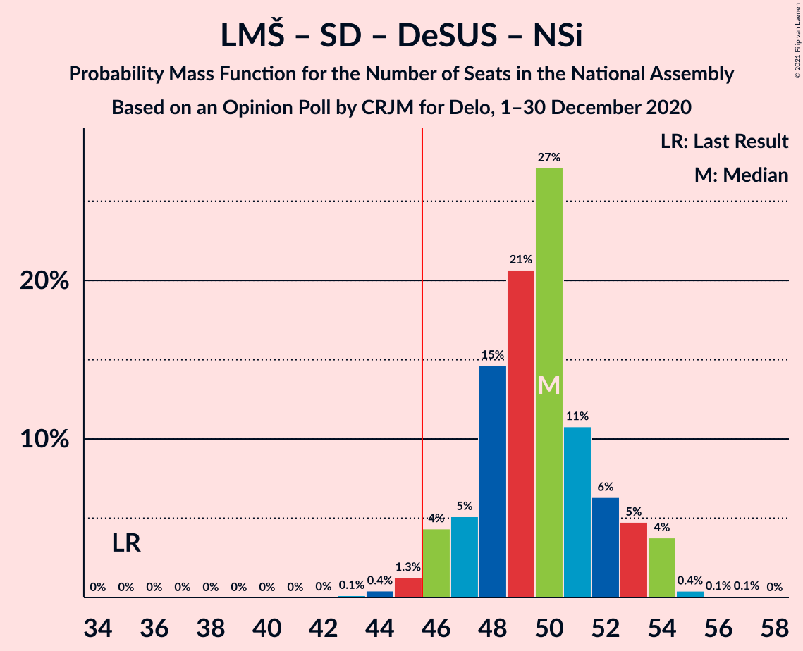

| Number of Seats | Probability | Accumulated | Special Marks |
|:---------------:|:-----------:|:-----------:|:-------------:|
| 35 | 0% | 100% | Last Result |
| 36 | 0% | 100% |  |
| 37 | 0% | 100% |  |
| 38 | 0% | 100% |  |
| 39 | 0% | 100% |  |
| 40 | 0% | 100% |  |
| 41 | 0% | 100% |  |
| 42 | 0% | 100% |  |
| 43 | 0.1% | 100% |  |
| 44 | 0.4% | 99.8% |  |
| 45 | 1.3% | 99.4% |  |
| 46 | 4% | 98% | Majority |
| 47 | 5% | 94% |  |
| 48 | 15% | 89% |  |
| 49 | 21% | 74% | Median |
| 50 | 27% | 53% |  |
| 51 | 11% | 26% |  |
| 52 | 6% | 15% |  |
| 53 | 5% | 9% |  |
| 54 | 4% | 4% |  |
| 55 | 0.4% | 0.6% |  |
| 56 | 0.1% | 0.2% |  |
| 57 | 0.1% | 0.1% |  |
| 58 | 0% | 0% |  |

### Lista Marjana Šarca – Socialni demokrati – Demokratična stranka upokojencev Slovenije – Nova Slovenija–Krščanski demokrati – Stranka Alenke Bratušek – Stranka modernega centra

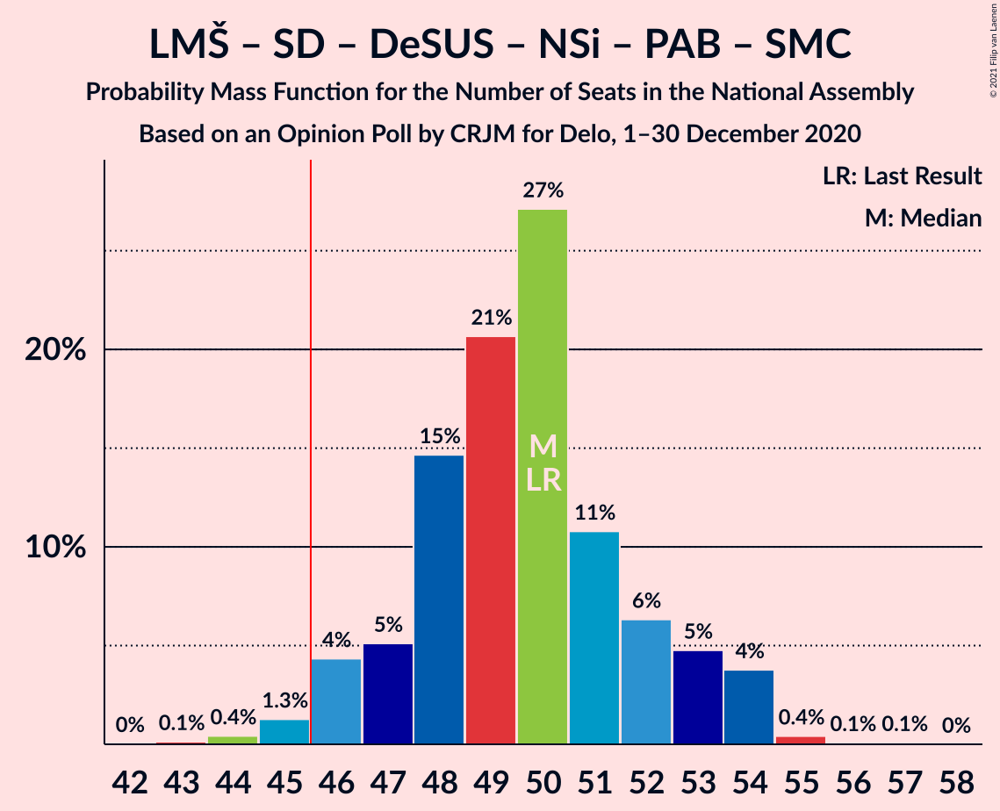

| Number of Seats | Probability | Accumulated | Special Marks |
|:---------------:|:-----------:|:-----------:|:-------------:|
| 43 | 0.1% | 100% |  |
| 44 | 0.4% | 99.8% |  |
| 45 | 1.3% | 99.4% |  |
| 46 | 4% | 98% | Majority |
| 47 | 5% | 94% |  |
| 48 | 15% | 89% |  |
| 49 | 21% | 74% | Median |
| 50 | 27% | 53% | Last Result |
| 51 | 11% | 26% |  |
| 52 | 6% | 15% |  |
| 53 | 5% | 9% |  |
| 54 | 4% | 4% |  |
| 55 | 0.4% | 0.6% |  |
| 56 | 0.1% | 0.2% |  |
| 57 | 0.1% | 0.1% |  |
| 58 | 0% | 0% |  |

### Lista Marjana Šarca – Socialni demokrati – Demokratična stranka upokojencev Slovenije – Nova Slovenija–Krščanski demokrati – Stranka modernega centra

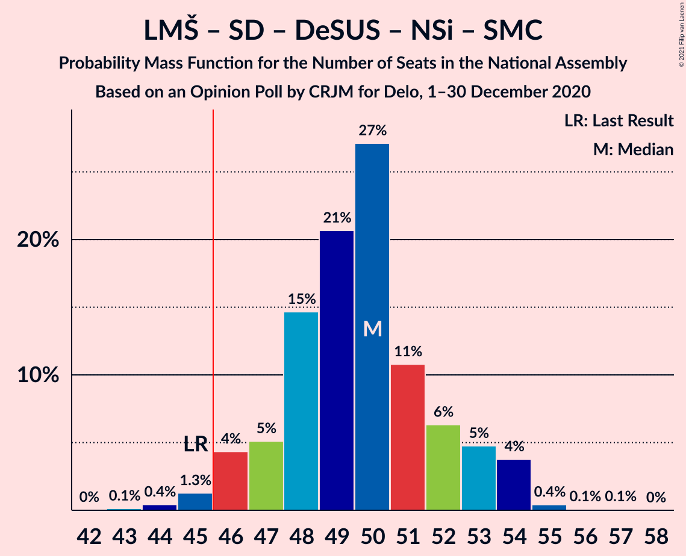

| Number of Seats | Probability | Accumulated | Special Marks |
|:---------------:|:-----------:|:-----------:|:-------------:|
| 43 | 0.1% | 100% |  |
| 44 | 0.4% | 99.8% |  |
| 45 | 1.3% | 99.4% | Last Result |
| 46 | 4% | 98% | Majority |
| 47 | 5% | 94% |  |
| 48 | 15% | 89% |  |
| 49 | 21% | 74% | Median |
| 50 | 27% | 53% |  |
| 51 | 11% | 26% |  |
| 52 | 6% | 15% |  |
| 53 | 5% | 9% |  |
| 54 | 4% | 4% |  |
| 55 | 0.4% | 0.6% |  |
| 56 | 0.1% | 0.2% |  |
| 57 | 0.1% | 0.1% |  |
| 58 | 0% | 0% |  |

### Slovenska demokratska stranka – Lista Marjana Šarca – Demokratična stranka upokojencev Slovenije

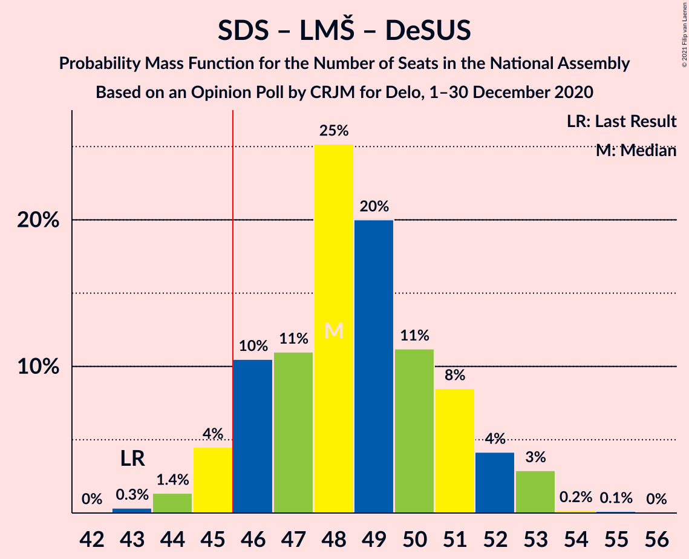

| Number of Seats | Probability | Accumulated | Special Marks |
|:---------------:|:-----------:|:-----------:|:-------------:|
| 43 | 0.3% | 100% | Last Result |
| 44 | 1.4% | 99.6% |  |
| 45 | 4% | 98% |  |
| 46 | 10% | 94% | Majority |
| 47 | 11% | 83% |  |
| 48 | 25% | 72% | Median |
| 49 | 20% | 47% |  |
| 50 | 11% | 27% |  |
| 51 | 8% | 16% |  |
| 52 | 4% | 7% |  |
| 53 | 3% | 3% |  |
| 54 | 0.2% | 0.3% |  |
| 55 | 0.1% | 0.2% |  |
| 56 | 0% | 0% |  |

### Lista Marjana Šarca – Socialni demokrati – Demokratična stranka upokojencev Slovenije

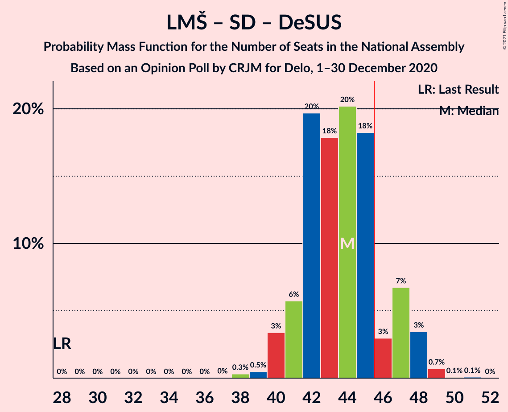

| Number of Seats | Probability | Accumulated | Special Marks |
|:---------------:|:-----------:|:-----------:|:-------------:|
| 28 | 0% | 100% | Last Result |
| 29 | 0% | 100% |  |
| 30 | 0% | 100% |  |
| 31 | 0% | 100% |  |
| 32 | 0% | 100% |  |
| 33 | 0% | 100% |  |
| 34 | 0% | 100% |  |
| 35 | 0% | 100% |  |
| 36 | 0% | 100% |  |
| 37 | 0% | 100% |  |
| 38 | 0.3% | 100% |  |
| 39 | 0.5% | 99.6% |  |
| 40 | 3% | 99.2% |  |
| 41 | 6% | 96% |  |
| 42 | 20% | 90% |  |
| 43 | 18% | 70% | Median |
| 44 | 20% | 52% |  |
| 45 | 18% | 32% |  |
| 46 | 3% | 14% | Majority |
| 47 | 7% | 11% |  |
| 48 | 3% | 4% |  |
| 49 | 0.7% | 0.9% |  |
| 50 | 0.1% | 0.2% |  |
| 51 | 0.1% | 0.1% |  |
| 52 | 0% | 0% |  |

### Lista Marjana Šarca – Socialni demokrati – Demokratična stranka upokojencev Slovenije – Stranka Alenke Bratušek – Stranka modernega centra

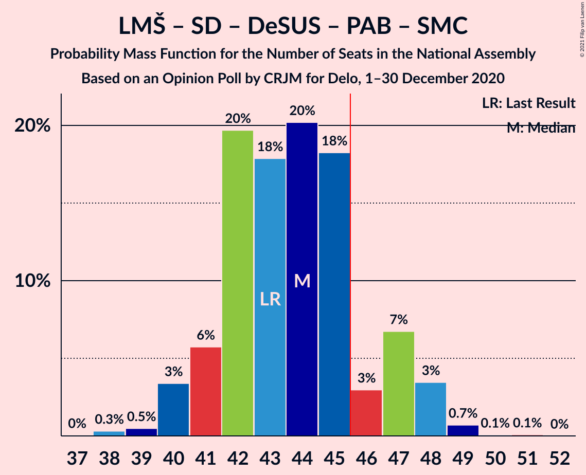

| Number of Seats | Probability | Accumulated | Special Marks |
|:---------------:|:-----------:|:-----------:|:-------------:|
| 38 | 0.3% | 100% |  |
| 39 | 0.5% | 99.6% |  |
| 40 | 3% | 99.2% |  |
| 41 | 6% | 96% |  |
| 42 | 20% | 90% |  |
| 43 | 18% | 70% | Last Result, Median |
| 44 | 20% | 52% |  |
| 45 | 18% | 32% |  |
| 46 | 3% | 14% | Majority |
| 47 | 7% | 11% |  |
| 48 | 3% | 4% |  |
| 49 | 0.7% | 0.9% |  |
| 50 | 0.1% | 0.2% |  |
| 51 | 0.1% | 0.1% |  |
| 52 | 0% | 0% |  |

### Lista Marjana Šarca – Socialni demokrati – Demokratična stranka upokojencev Slovenije – Stranka modernega centra

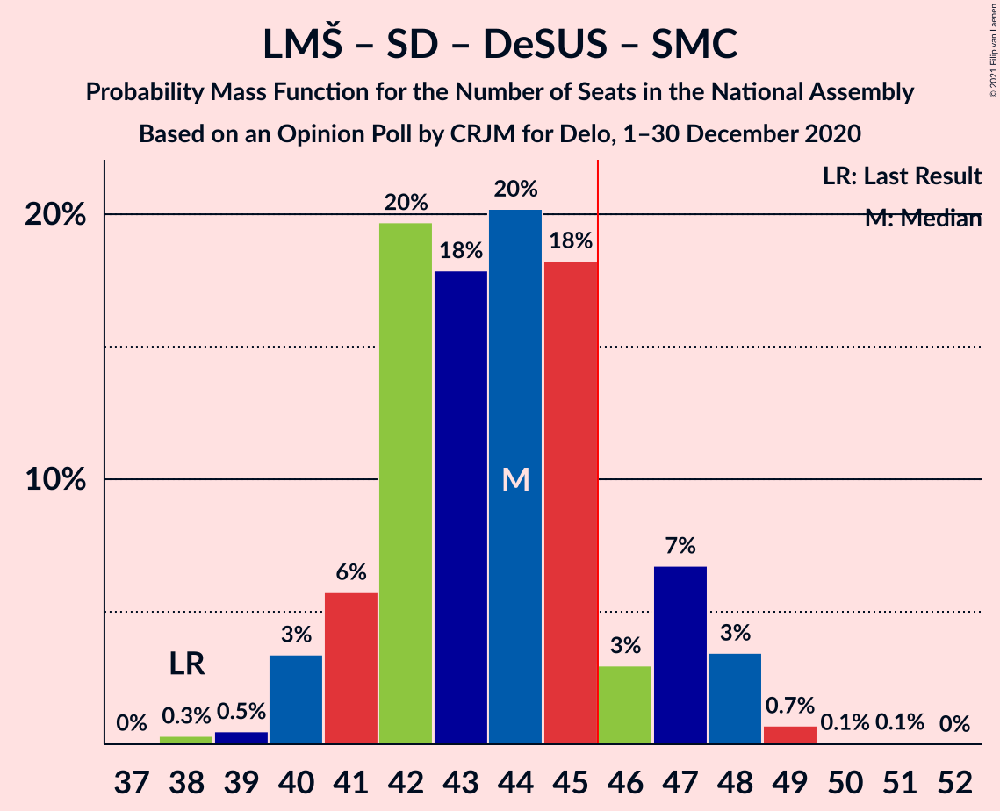

| Number of Seats | Probability | Accumulated | Special Marks |
|:---------------:|:-----------:|:-----------:|:-------------:|
| 38 | 0.3% | 100% | Last Result |
| 39 | 0.5% | 99.6% |  |
| 40 | 3% | 99.2% |  |
| 41 | 6% | 96% |  |
| 42 | 20% | 90% |  |
| 43 | 18% | 70% | Median |
| 44 | 20% | 52% |  |
| 45 | 18% | 32% |  |
| 46 | 3% | 14% | Majority |
| 47 | 7% | 11% |  |
| 48 | 3% | 4% |  |
| 49 | 0.7% | 0.9% |  |
| 50 | 0.1% | 0.2% |  |
| 51 | 0.1% | 0.1% |  |
| 52 | 0% | 0% |  |

### Lista Marjana Šarca – Socialni demokrati – Nova Slovenija–Krščanski demokrati

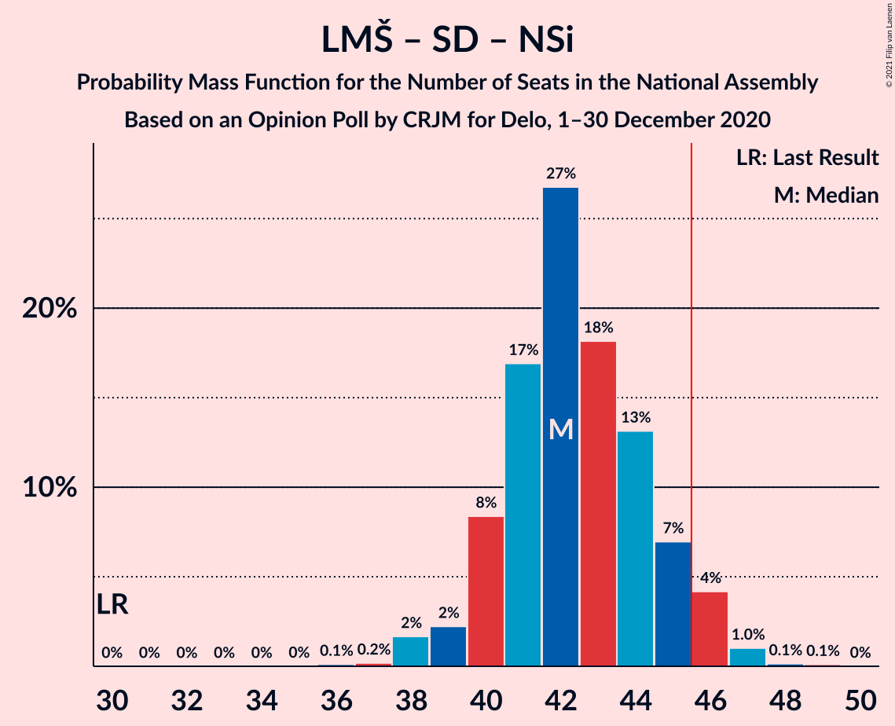

| Number of Seats | Probability | Accumulated | Special Marks |
|:---------------:|:-----------:|:-----------:|:-------------:|
| 30 | 0% | 100% | Last Result |
| 31 | 0% | 100% |  |
| 32 | 0% | 100% |  |
| 33 | 0% | 100% |  |
| 34 | 0% | 100% |  |
| 35 | 0% | 100% |  |
| 36 | 0.1% | 100% |  |
| 37 | 0.2% | 99.9% |  |
| 38 | 2% | 99.7% |  |
| 39 | 2% | 98% |  |
| 40 | 8% | 96% |  |
| 41 | 17% | 87% |  |
| 42 | 27% | 70% | Median |
| 43 | 18% | 44% |  |
| 44 | 13% | 26% |  |
| 45 | 7% | 12% |  |
| 46 | 4% | 5% | Majority |
| 47 | 1.0% | 1.3% |  |
| 48 | 0.1% | 0.3% |  |
| 49 | 0.1% | 0.1% |  |
| 50 | 0% | 0% |  |

### Lista Marjana Šarca – Socialni demokrati – Nova Slovenija–Krščanski demokrati – Stranka modernega centra

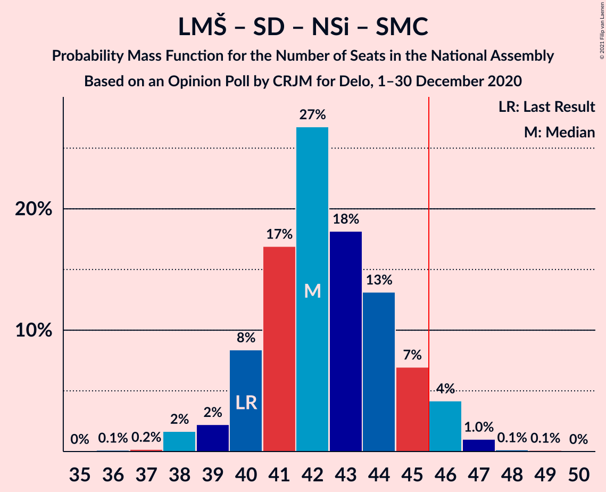

| Number of Seats | Probability | Accumulated | Special Marks |
|:---------------:|:-----------:|:-----------:|:-------------:|
| 36 | 0.1% | 100% |  |
| 37 | 0.2% | 99.9% |  |
| 38 | 2% | 99.7% |  |
| 39 | 2% | 98% |  |
| 40 | 8% | 96% | Last Result |
| 41 | 17% | 87% |  |
| 42 | 27% | 70% | Median |
| 43 | 18% | 44% |  |
| 44 | 13% | 26% |  |
| 45 | 7% | 12% |  |
| 46 | 4% | 5% | Majority |
| 47 | 1.0% | 1.3% |  |
| 48 | 0.1% | 0.3% |  |
| 49 | 0.1% | 0.1% |  |
| 50 | 0% | 0% |  |

### Slovenska demokratska stranka – Lista Marjana Šarca

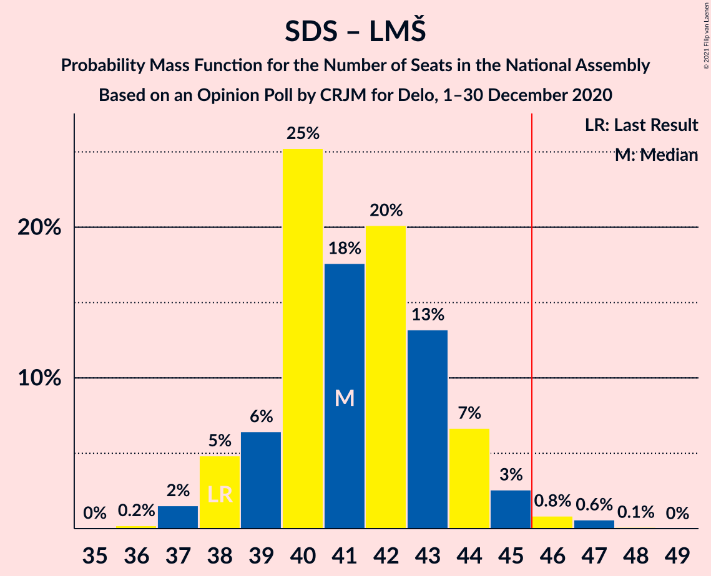

| Number of Seats | Probability | Accumulated | Special Marks |
|:---------------:|:-----------:|:-----------:|:-------------:|
| 36 | 0.2% | 100% |  |
| 37 | 2% | 99.8% |  |
| 38 | 5% | 98% | Last Result |
| 39 | 6% | 93% |  |
| 40 | 25% | 87% |  |
| 41 | 18% | 62% | Median |
| 42 | 20% | 44% |  |
| 43 | 13% | 24% |  |
| 44 | 7% | 11% |  |
| 45 | 3% | 4% |  |
| 46 | 0.8% | 2% | Majority |
| 47 | 0.6% | 0.7% |  |
| 48 | 0.1% | 0.1% |  |
| 49 | 0% | 0% |  |

### Lista Marjana Šarca – Socialni demokrati

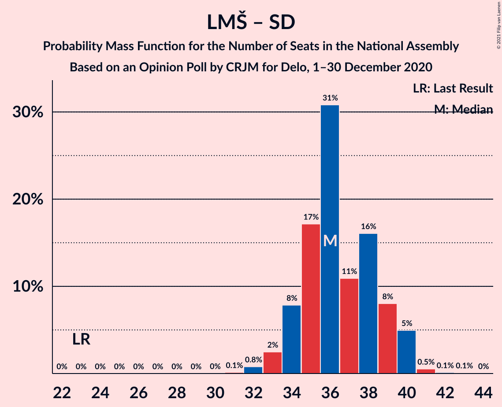

| Number of Seats | Probability | Accumulated | Special Marks |
|:---------------:|:-----------:|:-----------:|:-------------:|
| 23 | 0% | 100% | Last Result |
| 24 | 0% | 100% |  |
| 25 | 0% | 100% |  |
| 26 | 0% | 100% |  |
| 27 | 0% | 100% |  |
| 28 | 0% | 100% |  |
| 29 | 0% | 100% |  |
| 30 | 0% | 100% |  |
| 31 | 0.1% | 100% |  |
| 32 | 0.8% | 99.8% |  |
| 33 | 2% | 99.1% |  |
| 34 | 8% | 97% |  |
| 35 | 17% | 89% |  |
| 36 | 31% | 72% | Median |
| 37 | 11% | 41% |  |
| 38 | 16% | 30% |  |
| 39 | 8% | 14% |  |
| 40 | 5% | 6% |  |
| 41 | 0.5% | 0.8% |  |
| 42 | 0.1% | 0.2% |  |
| 43 | 0.1% | 0.1% |  |
| 44 | 0% | 0% |  |

### Lista Marjana Šarca – Socialni demokrati – Stranka modernega centra

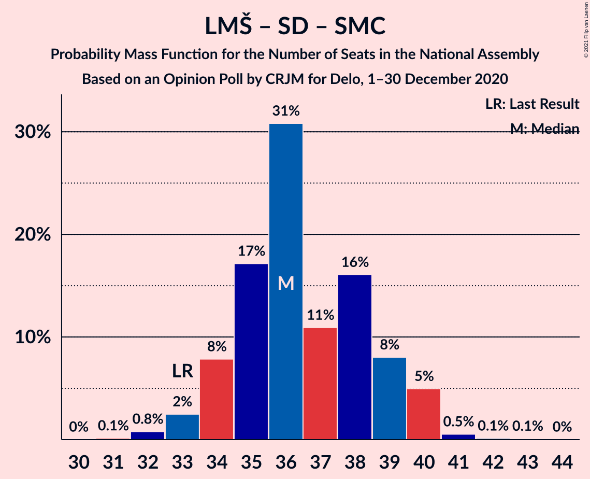

| Number of Seats | Probability | Accumulated | Special Marks |
|:---------------:|:-----------:|:-----------:|:-------------:|
| 31 | 0.1% | 100% |  |
| 32 | 0.8% | 99.8% |  |
| 33 | 2% | 99.1% | Last Result |
| 34 | 8% | 97% |  |
| 35 | 17% | 89% |  |
| 36 | 31% | 72% | Median |
| 37 | 11% | 41% |  |
| 38 | 16% | 30% |  |
| 39 | 8% | 14% |  |
| 40 | 5% | 6% |  |
| 41 | 0.5% | 0.8% |  |
| 42 | 0.1% | 0.2% |  |
| 43 | 0.1% | 0.1% |  |
| 44 | 0% | 0% |  |

### Socialni demokrati – Demokratična stranka upokojencev Slovenije – Stranka modernega centra

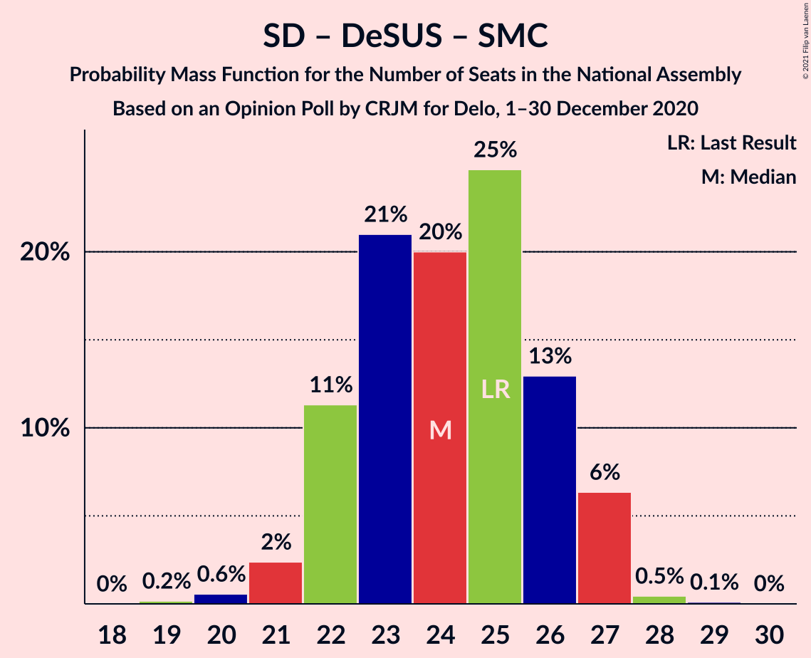

| Number of Seats | Probability | Accumulated | Special Marks |
|:---------------:|:-----------:|:-----------:|:-------------:|
| 19 | 0.2% | 100% |  |
| 20 | 0.6% | 99.8% |  |
| 21 | 2% | 99.3% |  |
| 22 | 11% | 97% |  |
| 23 | 21% | 86% |  |
| 24 | 20% | 65% | Median |
| 25 | 25% | 45% | Last Result |
| 26 | 13% | 20% |  |
| 27 | 6% | 7% |  |
| 28 | 0.5% | 0.6% |  |
| 29 | 0.1% | 0.1% |  |
| 30 | 0% | 0% |  |

## Technical Information

### Opinion Poll

+ **Polling firm:** CRJM
+ **Commissioner(s):** Delo
+ **Fieldwork period:** 1–30 December 2020

### Calculations

+ **Sample size:** 953
+ **Simulations done:** 1,048,576
+ **Error estimate:** 1.69%

