# Opinion Poll by Mediana for Delo, 4–7 January 2021

<a href="#voting-intentions">Voting Intentions</a> | <a href="#seats">Seats</a> | <a href="#coalitions">Coalitions</a> | <a href="#technical-information">Technical Information</a>

## Voting Intentions

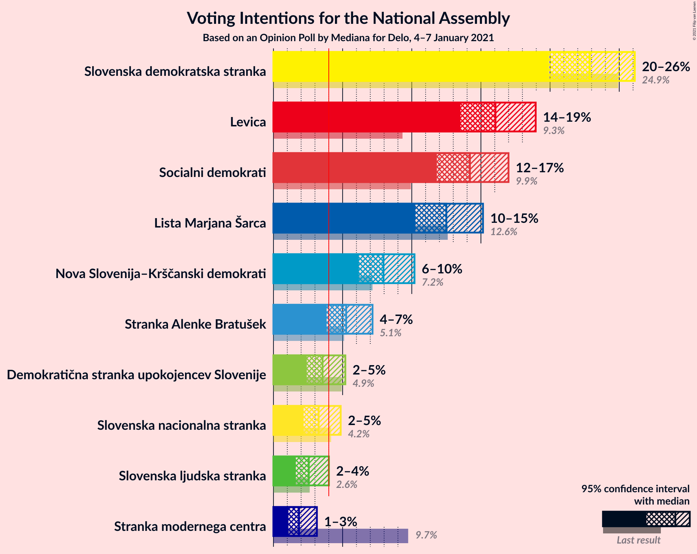

### Confidence Intervals

| Party | Last Result | Poll Result | 80% Confidence Interval | 90% Confidence Interval | 95% Confidence Interval | 99% Confidence Interval |
|:-----:|:-----------:|:-----------:|:-----------------------:|:-----------------------:|:-----------------------:|:-----------------------:|
| Slovenska demokratska stranka | 24.9% | 22.9% | 20.9–25.0% |20.4–25.6% |19.9–26.1% |19.0–27.2% |
| Levica | 9.3% | 16.1% | 14.4–18.0% |13.9–18.5% |13.5–19.0% |12.8–19.9% |
| Socialni demokrati | 9.9% | 14.2% | 12.6–16.0% |12.2–16.5% |11.8–17.0% |11.1–17.9% |
| Lista Marjana Šarca | 12.6% | 12.5% | 11.0–14.2% |10.6–14.7% |10.3–15.1% |9.6–16.0% |
| Nova Slovenija–Krščanski demokrati | 7.2% | 8.0% | 6.8–9.4% |6.4–9.8% |6.2–10.2% |5.7–10.9% |
| Stranka Alenke Bratušek | 5.1% | 5.3% | 4.3–6.5% |4.1–6.9% |3.8–7.2% |3.4–7.8% |
| Demokratična stranka upokojencev Slovenije | 4.9% | 3.6% | 2.8–4.6% |2.6–4.9% |2.4–5.2% |2.1–5.8% |
| Slovenska nacionalna stranka | 4.2% | 3.3% | 2.5–4.3% |2.3–4.6% |2.2–4.9% |1.9–5.4% |
| Slovenska ljudska stranka | 2.6% | 2.6% | 1.9–3.5% |1.8–3.8% |1.6–4.0% |1.4–4.5% |
| Stranka modernega centra | 9.7% | 1.8% | 1.3–2.7% |1.2–2.9% |1.1–3.1% |0.9–3.6% |

*Note:* The poll result column reflects the actual value used in the calculations. Published results may vary slightly, and in addition be rounded to fewer digits.

## Seats

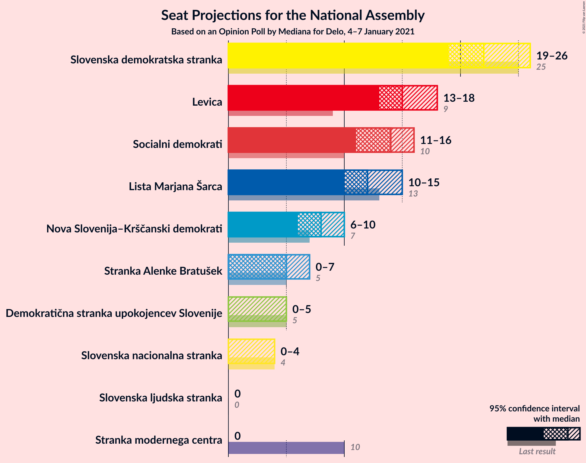

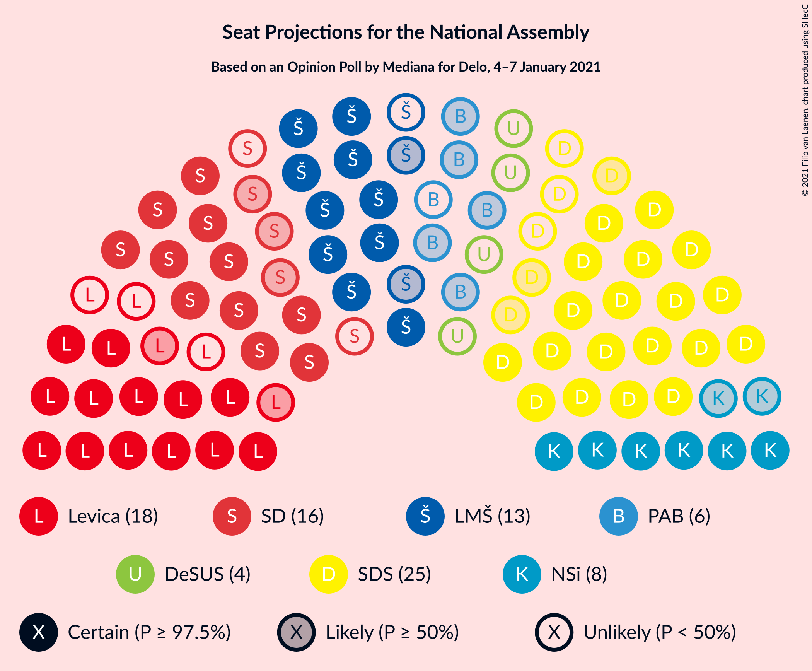

### Confidence Intervals

| Party | Last Result | Median | 80% Confidence Interval | 90% Confidence Interval | 95% Confidence Interval | 99% Confidence Interval |
|:-----:|:-----------:|:------:|:-----------------------:|:-----------------------:|:-----------------------:|:-----------------------:|
| <a href="#slovenska-demokratska-stranka">Slovenska demokratska stranka</a> | 25 | 22 | 20–25 |20–25 |19–26 |19–27 |
| <a href="#levica">Levica</a> | 9 | 15 | 13–18 |13–18 |13–18 |12–19 |
| <a href="#socialni-demokrati">Socialni demokrati</a> | 10 | 14 | 12–16 |12–16 |11–16 |11–18 |
| <a href="#lista-marjana-šarca">Lista Marjana Šarca</a> | 13 | 12 | 10–14 |10–14 |10–15 |9–16 |
| <a href="#nova-slovenija–krščanski-demokrati">Nova Slovenija–Krščanski demokrati</a> | 7 | 8 | 6–9 |6–9 |6–10 |5–10 |
| <a href="#stranka-alenke-bratušek">Stranka Alenke Bratušek</a> | 5 | 5 | 4–6 |4–7 |0–7 |0–7 |
| <a href="#demokratična-stranka-upokojencev-slovenije">Demokratična stranka upokojencev Slovenije</a> | 5 | 0 | 0–4 |0–4 |0–5 |0–5 |
| <a href="#slovenska-nacionalna-stranka">Slovenska nacionalna stranka</a> | 4 | 0 | 0–4 |0–4 |0–4 |0–5 |
| <a href="#slovenska-ljudska-stranka">Slovenska ljudska stranka</a> | 0 | 0 | 0 |0 |0 |0–4 |
| <a href="#stranka-modernega-centra">Stranka modernega centra</a> | 10 | 0 | 0 |0 |0 |0 |

### Slovenska demokratska stranka

*For a full overview of the results for this party, see the [Slovenska demokratska stranka](party-slovenskademokratskastranka.html) page.*

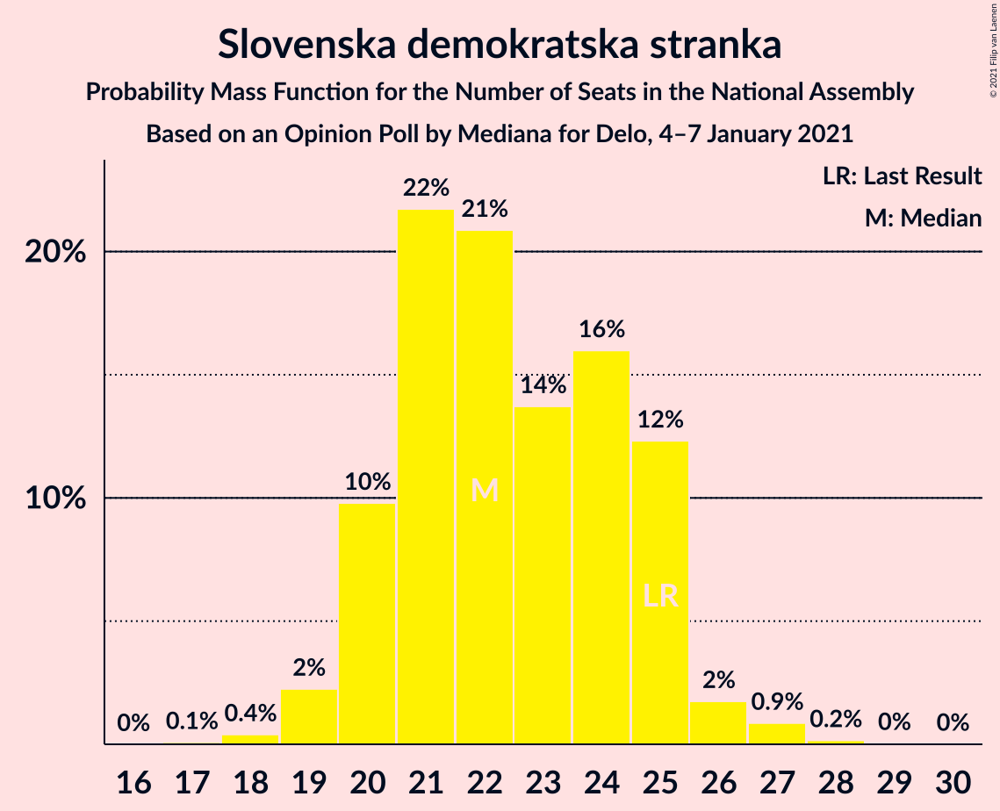

| Number of Seats | Probability | Accumulated | Special Marks |
|:---------------:|:-----------:|:-----------:|:-------------:|
| 17 | 0.1% | 100% |  |
| 18 | 0.4% | 99.9% |  |
| 19 | 2% | 99.5% |  |
| 20 | 10% | 97% |  |
| 21 | 22% | 87% |  |
| 22 | 21% | 66% | Median |
| 23 | 14% | 45% |  |
| 24 | 16% | 31% |  |
| 25 | 12% | 15% | Last Result |
| 26 | 2% | 3% |  |
| 27 | 0.9% | 1.1% |  |
| 28 | 0.2% | 0.2% |  |
| 29 | 0% | 0.1% |  |
| 30 | 0% | 0% |  |

### Levica

*For a full overview of the results for this party, see the [Levica](party-levica.html) page.*

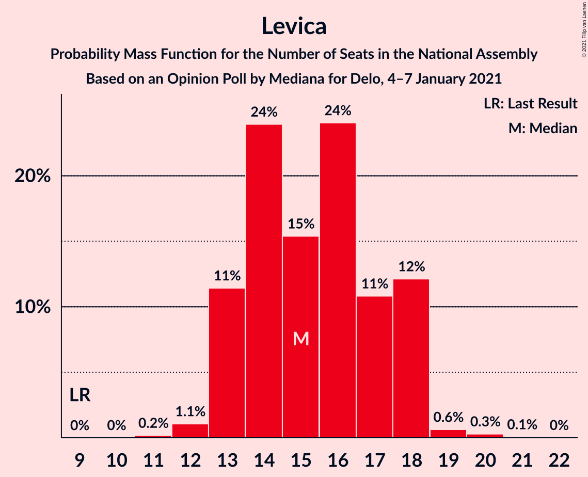

| Number of Seats | Probability | Accumulated | Special Marks |
|:---------------:|:-----------:|:-----------:|:-------------:|
| 9 | 0% | 100% | Last Result |
| 10 | 0% | 100% |  |
| 11 | 0.2% | 100% |  |
| 12 | 1.1% | 99.8% |  |
| 13 | 11% | 98.8% |  |
| 14 | 24% | 87% |  |
| 15 | 15% | 63% | Median |
| 16 | 24% | 48% |  |
| 17 | 11% | 24% |  |
| 18 | 12% | 13% |  |
| 19 | 0.6% | 1.0% |  |
| 20 | 0.3% | 0.4% |  |
| 21 | 0.1% | 0.1% |  |
| 22 | 0% | 0% |  |

### Socialni demokrati

*For a full overview of the results for this party, see the [Socialni demokrati](party-socialnidemokrati.html) page.*

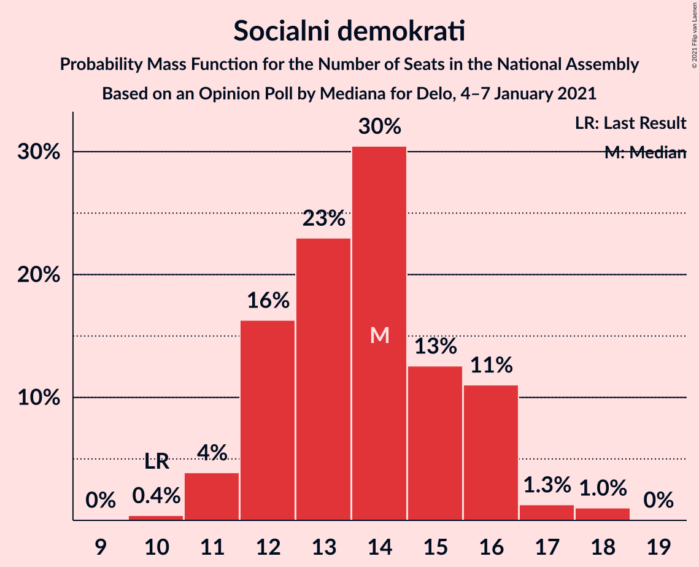

| Number of Seats | Probability | Accumulated | Special Marks |
|:---------------:|:-----------:|:-----------:|:-------------:|
| 10 | 0.4% | 100% | Last Result |
| 11 | 4% | 99.6% |  |
| 12 | 16% | 96% |  |
| 13 | 23% | 79% |  |
| 14 | 30% | 56% | Median |
| 15 | 13% | 26% |  |
| 16 | 11% | 13% |  |
| 17 | 1.3% | 2% |  |
| 18 | 1.0% | 1.1% |  |
| 19 | 0% | 0% |  |

### Lista Marjana Šarca

*For a full overview of the results for this party, see the [Lista Marjana Šarca](party-listamarjanašarca.html) page.*

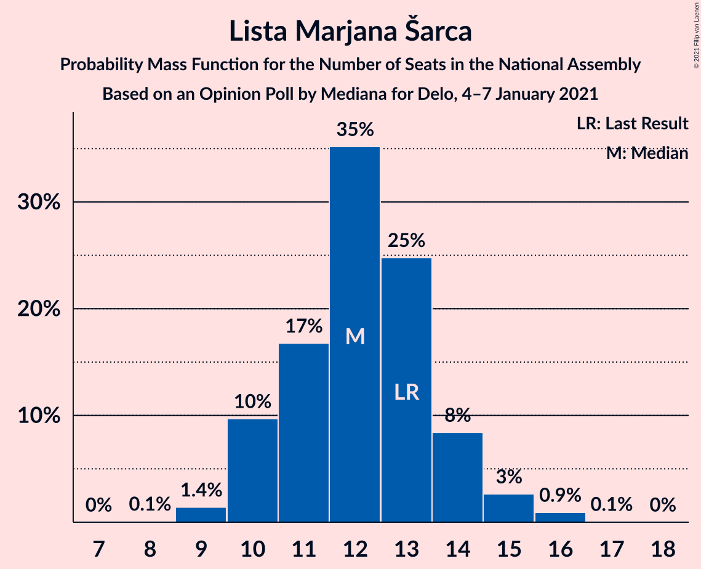

| Number of Seats | Probability | Accumulated | Special Marks |
|:---------------:|:-----------:|:-----------:|:-------------:|
| 8 | 0.1% | 100% |  |
| 9 | 1.4% | 99.9% |  |
| 10 | 10% | 98% |  |
| 11 | 17% | 89% |  |
| 12 | 35% | 72% | Median |
| 13 | 25% | 37% | Last Result |
| 14 | 8% | 12% |  |
| 15 | 3% | 4% |  |
| 16 | 0.9% | 1.0% |  |
| 17 | 0.1% | 0.1% |  |
| 18 | 0% | 0% |  |

### Nova Slovenija–Krščanski demokrati

*For a full overview of the results for this party, see the [Nova Slovenija–Krščanski demokrati](party-novaslovenija–krščanskidemokrati.html) page.*

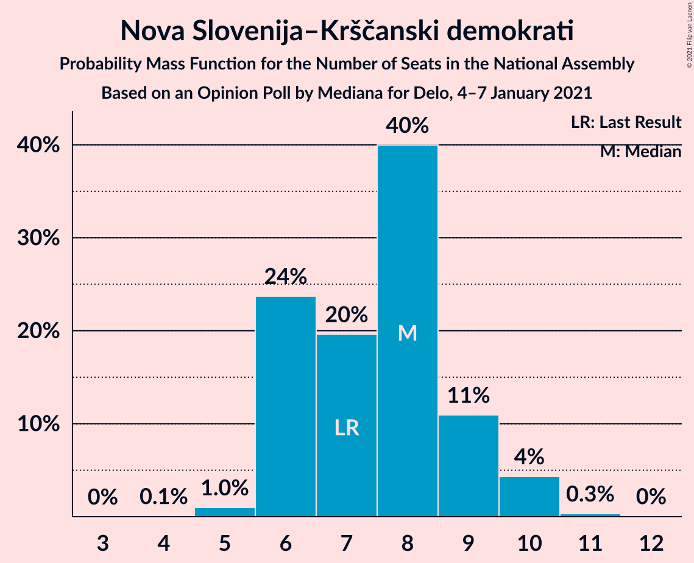

| Number of Seats | Probability | Accumulated | Special Marks |
|:---------------:|:-----------:|:-----------:|:-------------:|
| 4 | 0.1% | 100% |  |
| 5 | 1.0% | 99.9% |  |
| 6 | 24% | 99.0% |  |
| 7 | 20% | 75% | Last Result |
| 8 | 40% | 56% | Median |
| 9 | 11% | 16% |  |
| 10 | 4% | 5% |  |
| 11 | 0.3% | 0.4% |  |
| 12 | 0% | 0% |  |

### Stranka Alenke Bratušek

*For a full overview of the results for this party, see the [Stranka Alenke Bratušek](party-strankaalenkebratušek.html) page.*

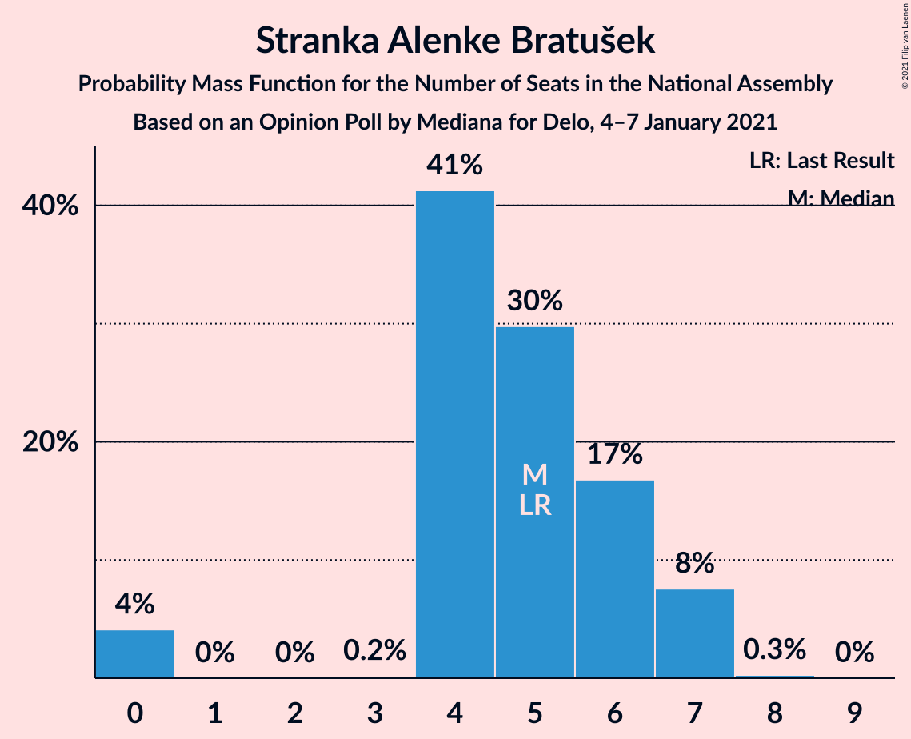

| Number of Seats | Probability | Accumulated | Special Marks |
|:---------------:|:-----------:|:-----------:|:-------------:|
| 0 | 4% | 100% |  |
| 1 | 0% | 96% |  |
| 2 | 0% | 96% |  |
| 3 | 0.2% | 96% |  |
| 4 | 41% | 96% |  |
| 5 | 30% | 54% | Last Result, Median |
| 6 | 17% | 25% |  |
| 7 | 8% | 8% |  |
| 8 | 0.3% | 0.3% |  |
| 9 | 0% | 0% |  |

### Demokratična stranka upokojencev Slovenije

*For a full overview of the results for this party, see the [Demokratična stranka upokojencev Slovenije](party-demokratičnastrankaupokojencevslovenije.html) page.*

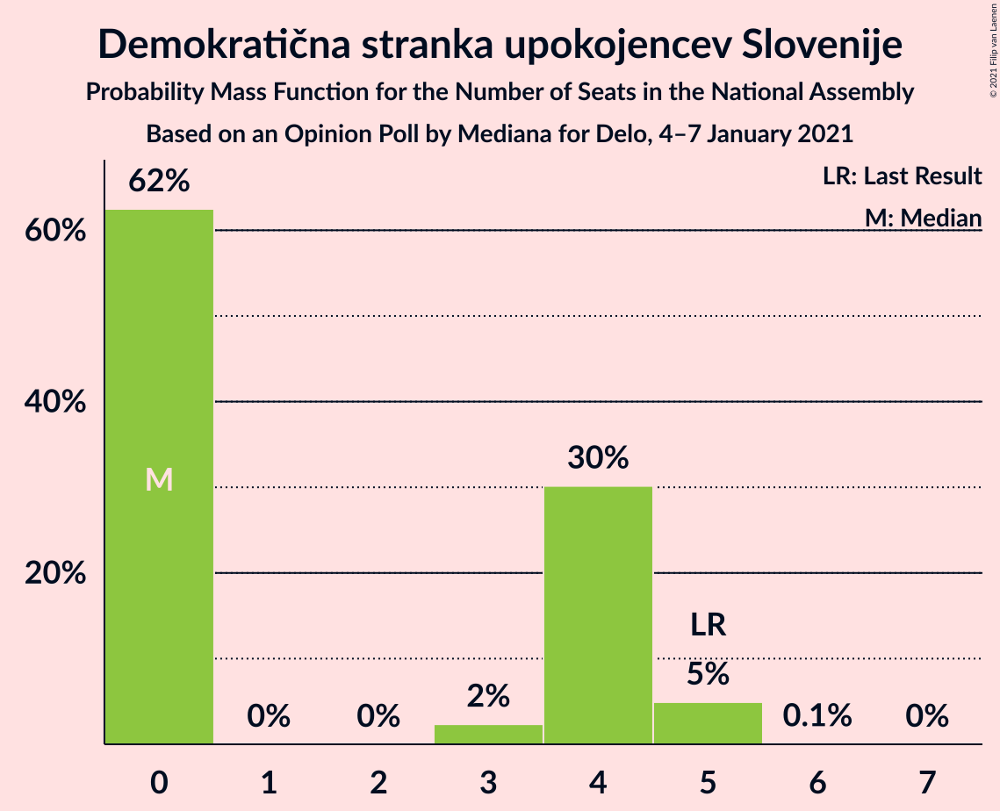

| Number of Seats | Probability | Accumulated | Special Marks |
|:---------------:|:-----------:|:-----------:|:-------------:|
| 0 | 62% | 100% | Median |
| 1 | 0% | 38% |  |
| 2 | 0% | 38% |  |
| 3 | 2% | 38% |  |
| 4 | 30% | 35% |  |
| 5 | 5% | 5% | Last Result |
| 6 | 0.1% | 0.1% |  |
| 7 | 0% | 0% |  |

### Slovenska nacionalna stranka

*For a full overview of the results for this party, see the [Slovenska nacionalna stranka](party-slovenskanacionalnastranka.html) page.*

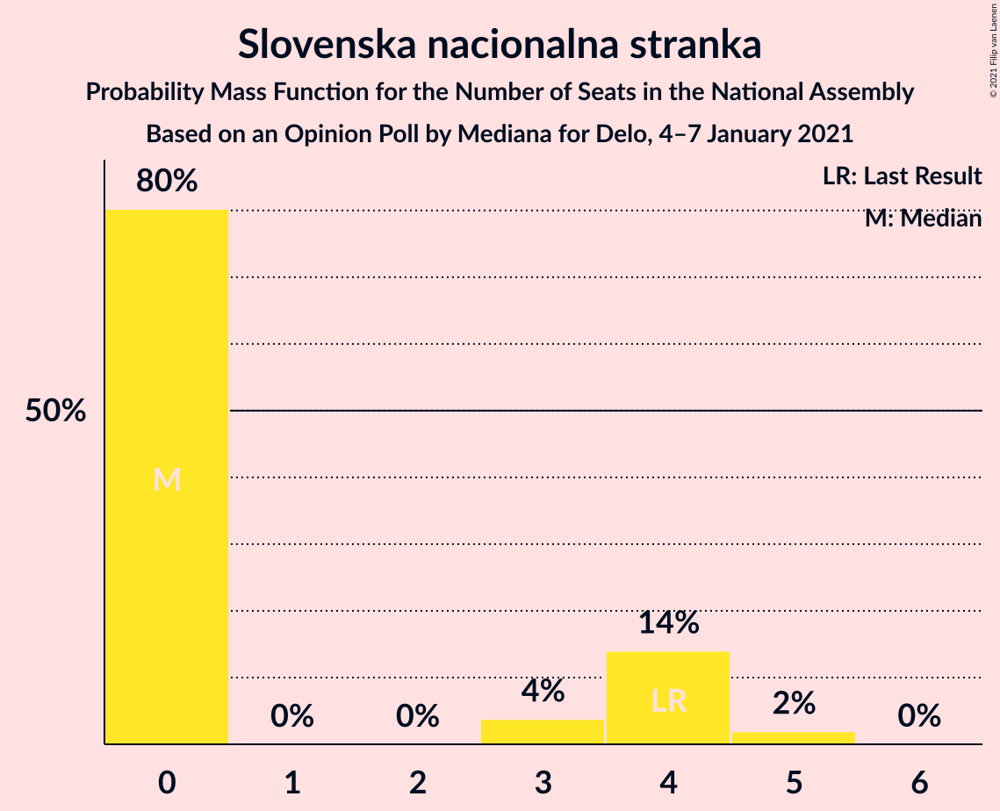

| Number of Seats | Probability | Accumulated | Special Marks |
|:---------------:|:-----------:|:-----------:|:-------------:|
| 0 | 80% | 100% | Median |
| 1 | 0% | 20% |  |
| 2 | 0% | 20% |  |
| 3 | 4% | 20% |  |
| 4 | 14% | 16% | Last Result |
| 5 | 2% | 2% |  |
| 6 | 0% | 0% |  |

### Slovenska ljudska stranka

*For a full overview of the results for this party, see the [Slovenska ljudska stranka](party-slovenskaljudskastranka.html) page.*

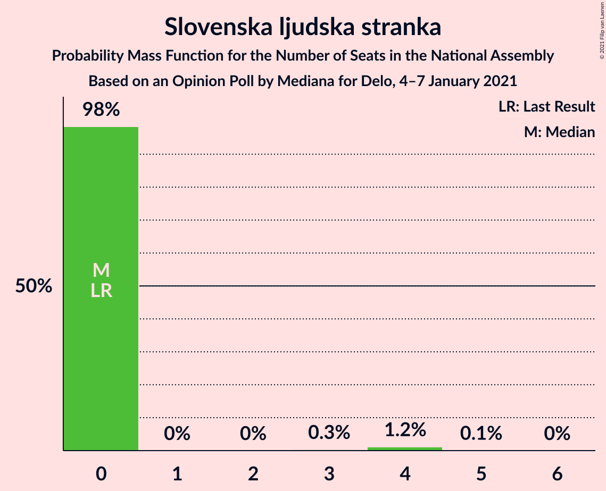

| Number of Seats | Probability | Accumulated | Special Marks |
|:---------------:|:-----------:|:-----------:|:-------------:|
| 0 | 98% | 100% | Last Result, Median |
| 1 | 0% | 2% |  |
| 2 | 0% | 2% |  |
| 3 | 0.3% | 2% |  |
| 4 | 1.2% | 1.2% |  |
| 5 | 0.1% | 0.1% |  |
| 6 | 0% | 0% |  |

### Stranka modernega centra

*For a full overview of the results for this party, see the [Stranka modernega centra](party-strankamodernegacentra.html) page.*

| Number of Seats | Probability | Accumulated | Special Marks |
|:---------------:|:-----------:|:-----------:|:-------------:|
| 0 | 99.9% | 100% | Median |
| 1 | 0% | 0.1% |  |
| 2 | 0% | 0.1% |  |
| 3 | 0% | 0.1% |  |
| 4 | 0.1% | 0.1% |  |
| 5 | 0% | 0% |  |
| 6 | 0% | 0% |  |
| 7 | 0% | 0% |  |
| 8 | 0% | 0% |  |
| 9 | 0% | 0% |  |
| 10 | 0% | 0% | Last Result |

## Coalitions

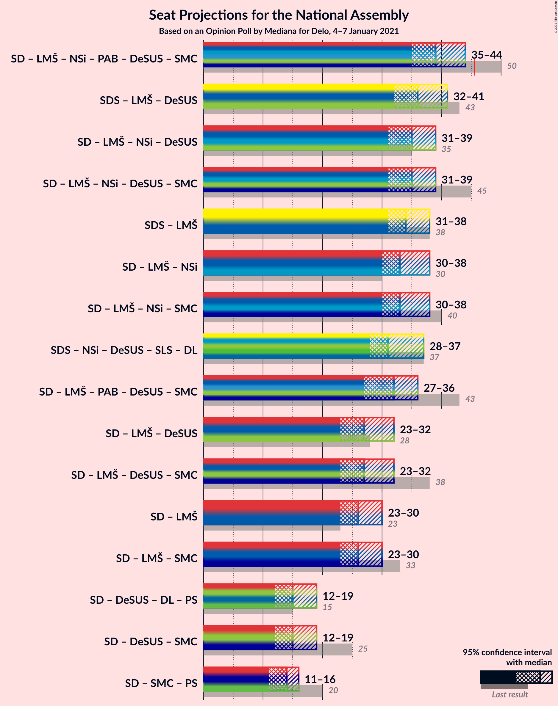

### Confidence Intervals

| Coalition | Last Result | Median | Majority? | 80% Confidence Interval | 90% Confidence Interval | 95% Confidence Interval | 99% Confidence Interval |
|:---------:|:-----------:|:------:|:---------:|:-----------------------:|:-----------------------:|:-----------------------:|:-----------------------:|
| Socialni demokrati – Lista Marjana Šarca – Nova Slovenija–Krščanski demokrati – Stranka Alenke Bratušek – Demokratična stranka upokojencev Slovenije – Stranka modernega centra | 50 | 39 | 0.2% | 37–43 | 36–43 | 35–44 | 34–45 |
| Slovenska demokratska stranka – Lista Marjana Šarca – Demokratična stranka upokojencev Slovenije | 43 | 36 | 0% | 33–39 | 32–40 | 32–41 | 31–42 |
| Socialni demokrati – Lista Marjana Šarca – Nova Slovenija–Krščanski demokrati – Demokratična stranka upokojencev Slovenije | 35 | 35 | 0% | 32–38 | 31–38 | 31–39 | 29–41 |
| Socialni demokrati – Lista Marjana Šarca – Nova Slovenija–Krščanski demokrati – Demokratična stranka upokojencev Slovenije – Stranka modernega centra | 45 | 35 | 0% | 32–38 | 31–38 | 31–39 | 29–41 |
| Slovenska demokratska stranka – Lista Marjana Šarca | 38 | 34 | 0% | 32–37 | 31–38 | 31–38 | 29–40 |
| Socialni demokrati – Lista Marjana Šarca – Nova Slovenija–Krščanski demokrati | 30 | 33 | 0% | 31–36 | 30–37 | 30–38 | 29–39 |
| Socialni demokrati – Lista Marjana Šarca – Nova Slovenija–Krščanski demokrati – Stranka modernega centra | 40 | 33 | 0% | 31–36 | 30–37 | 30–38 | 29–39 |
| Socialni demokrati – Lista Marjana Šarca – Stranka Alenke Bratušek – Demokratična stranka upokojencev Slovenije – Stranka modernega centra | 43 | 32 | 0% | 29–35 | 28–36 | 27–36 | 26–38 |
| Socialni demokrati – Lista Marjana Šarca – Demokratična stranka upokojencev Slovenije | 28 | 27 | 0% | 25–30 | 24–31 | 23–32 | 22–33 |
| Socialni demokrati – Lista Marjana Šarca – Demokratična stranka upokojencev Slovenije – Stranka modernega centra | 38 | 27 | 0% | 25–30 | 24–31 | 23–32 | 22–33 |
| Socialni demokrati – Lista Marjana Šarca | 23 | 26 | 0% | 23–28 | 23–29 | 23–30 | 21–31 |
| Socialni demokrati – Lista Marjana Šarca – Stranka modernega centra | 33 | 26 | 0% | 23–28 | 23–29 | 23–30 | 21–31 |
| Socialni demokrati – Demokratična stranka upokojencev Slovenije – Stranka modernega centra | 25 | 15 | 0% | 13–18 | 12–18 | 12–19 | 11–20 |

### Socialni demokrati – Lista Marjana Šarca – Nova Slovenija–Krščanski demokrati – Stranka Alenke Bratušek – Demokratična stranka upokojencev Slovenije – Stranka modernega centra

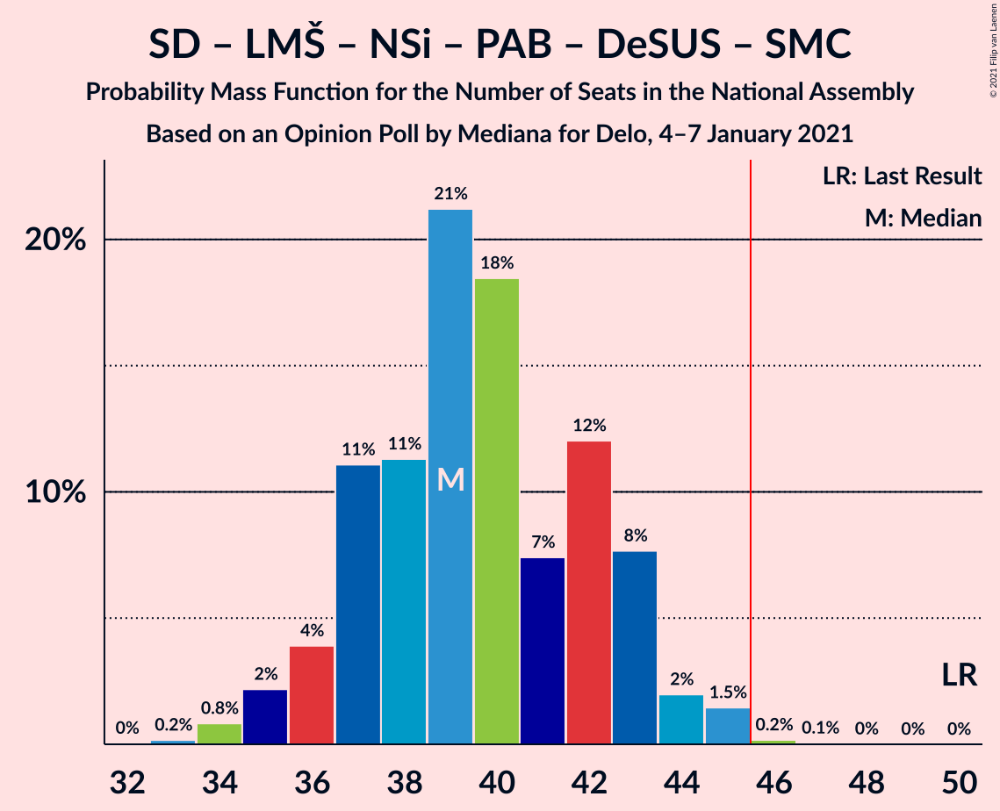

| Number of Seats | Probability | Accumulated | Special Marks |
|:---------------:|:-----------:|:-----------:|:-------------:|
| 32 | 0% | 100% |  |
| 33 | 0.2% | 99.9% |  |
| 34 | 0.8% | 99.7% |  |
| 35 | 2% | 98.9% |  |
| 36 | 4% | 97% |  |
| 37 | 11% | 93% |  |
| 38 | 11% | 82% |  |
| 39 | 21% | 70% | Median |
| 40 | 18% | 49% |  |
| 41 | 7% | 31% |  |
| 42 | 12% | 23% |  |
| 43 | 8% | 11% |  |
| 44 | 2% | 4% |  |
| 45 | 1.5% | 2% |  |
| 46 | 0.2% | 0.2% | Majority |
| 47 | 0.1% | 0.1% |  |
| 48 | 0% | 0% |  |
| 49 | 0% | 0% |  |
| 50 | 0% | 0% | Last Result |

### Slovenska demokratska stranka – Lista Marjana Šarca – Demokratična stranka upokojencev Slovenije

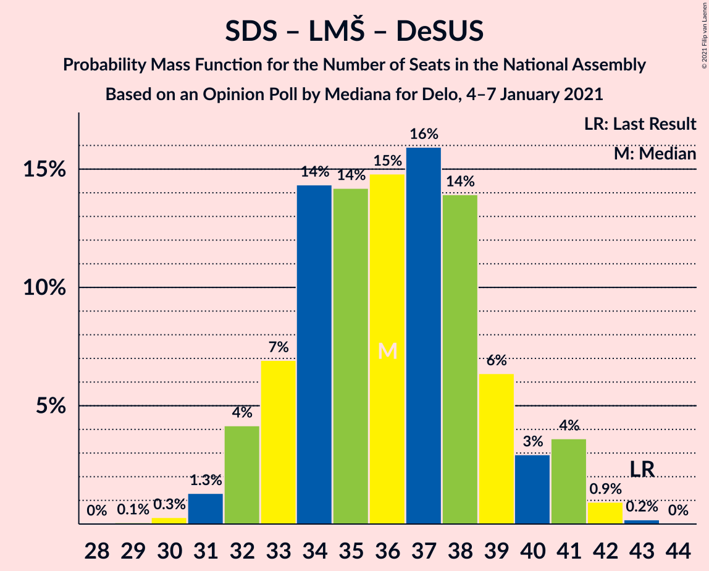

| Number of Seats | Probability | Accumulated | Special Marks |
|:---------------:|:-----------:|:-----------:|:-------------:|
| 29 | 0.1% | 100% |  |
| 30 | 0.3% | 99.9% |  |
| 31 | 1.3% | 99.6% |  |
| 32 | 4% | 98% |  |
| 33 | 7% | 94% |  |
| 34 | 14% | 87% | Median |
| 35 | 14% | 73% |  |
| 36 | 15% | 59% |  |
| 37 | 16% | 44% |  |
| 38 | 14% | 28% |  |
| 39 | 6% | 14% |  |
| 40 | 3% | 8% |  |
| 41 | 4% | 5% |  |
| 42 | 0.9% | 1.2% |  |
| 43 | 0.2% | 0.2% | Last Result |
| 44 | 0% | 0% |  |

### Socialni demokrati – Lista Marjana Šarca – Nova Slovenija–Krščanski demokrati – Demokratična stranka upokojencev Slovenije

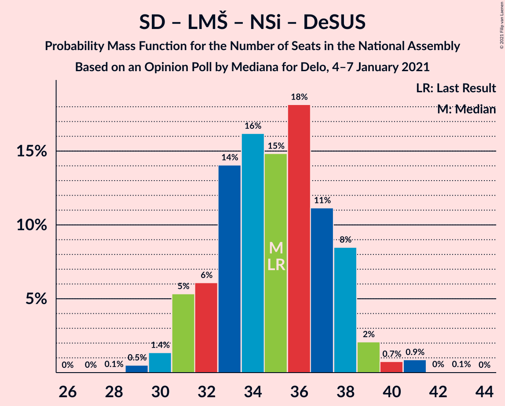

| Number of Seats | Probability | Accumulated | Special Marks |
|:---------------:|:-----------:|:-----------:|:-------------:|
| 28 | 0.1% | 100% |  |
| 29 | 0.5% | 99.9% |  |
| 30 | 1.4% | 99.4% |  |
| 31 | 5% | 98% |  |
| 32 | 6% | 93% |  |
| 33 | 14% | 87% |  |
| 34 | 16% | 73% | Median |
| 35 | 15% | 56% | Last Result |
| 36 | 18% | 42% |  |
| 37 | 11% | 23% |  |
| 38 | 8% | 12% |  |
| 39 | 2% | 4% |  |
| 40 | 0.7% | 2% |  |
| 41 | 0.9% | 1.0% |  |
| 42 | 0% | 0.1% |  |
| 43 | 0.1% | 0.1% |  |
| 44 | 0% | 0% |  |

### Socialni demokrati – Lista Marjana Šarca – Nova Slovenija–Krščanski demokrati – Demokratična stranka upokojencev Slovenije – Stranka modernega centra

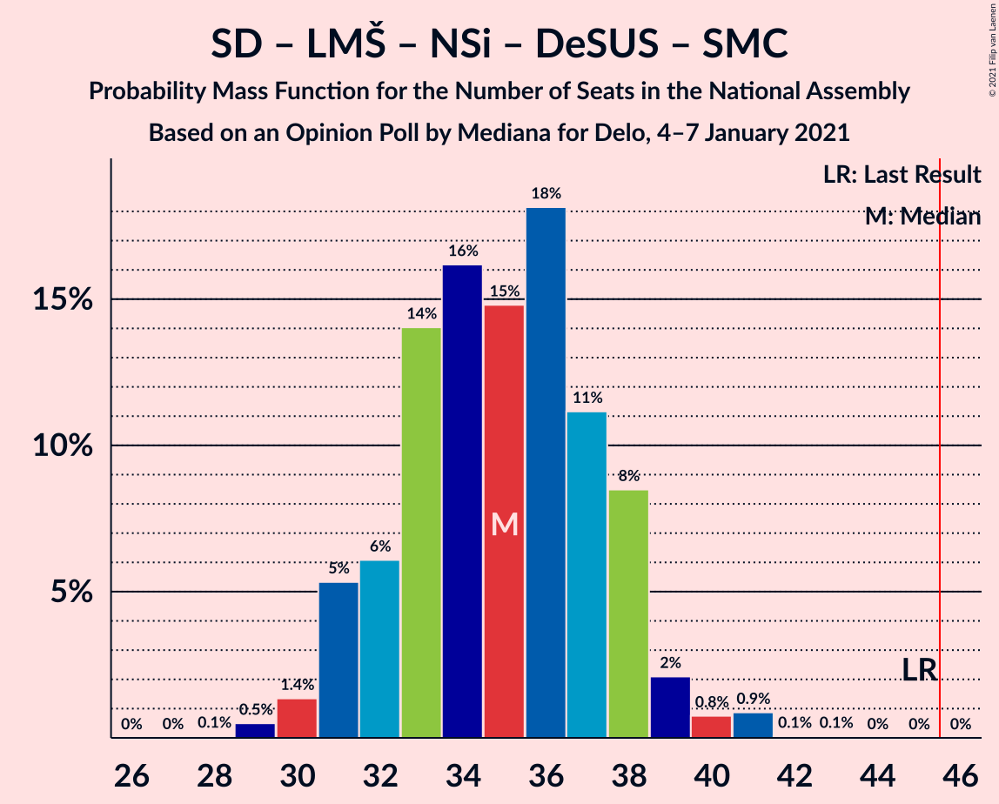

| Number of Seats | Probability | Accumulated | Special Marks |
|:---------------:|:-----------:|:-----------:|:-------------:|
| 28 | 0.1% | 100% |  |
| 29 | 0.5% | 99.9% |  |
| 30 | 1.4% | 99.4% |  |
| 31 | 5% | 98% |  |
| 32 | 6% | 93% |  |
| 33 | 14% | 87% |  |
| 34 | 16% | 73% | Median |
| 35 | 15% | 56% |  |
| 36 | 18% | 42% |  |
| 37 | 11% | 23% |  |
| 38 | 8% | 12% |  |
| 39 | 2% | 4% |  |
| 40 | 0.8% | 2% |  |
| 41 | 0.9% | 1.0% |  |
| 42 | 0.1% | 0.1% |  |
| 43 | 0.1% | 0.1% |  |
| 44 | 0% | 0% |  |
| 45 | 0% | 0% | Last Result |

### Slovenska demokratska stranka – Lista Marjana Šarca

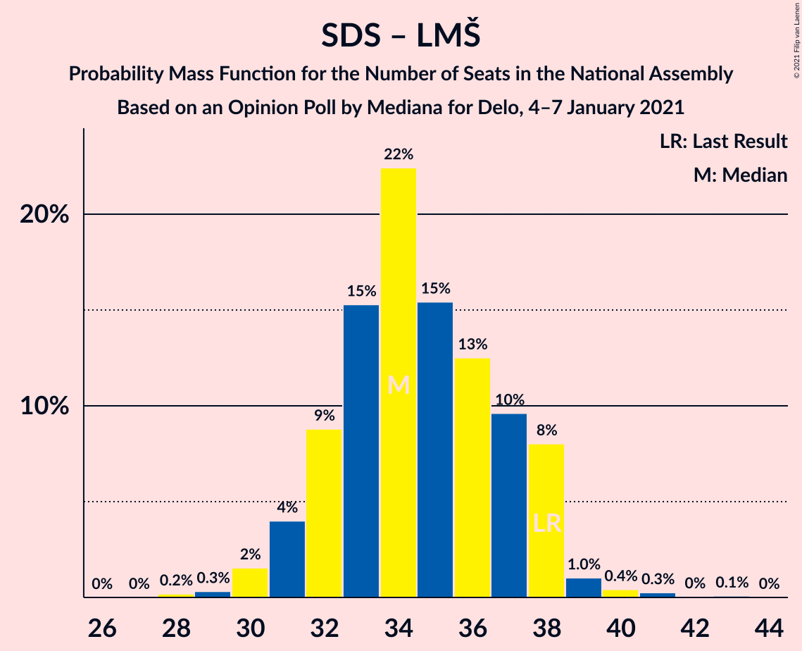

| Number of Seats | Probability | Accumulated | Special Marks |
|:---------------:|:-----------:|:-----------:|:-------------:|
| 28 | 0.2% | 100% |  |
| 29 | 0.3% | 99.8% |  |
| 30 | 2% | 99.5% |  |
| 31 | 4% | 98% |  |
| 32 | 9% | 94% |  |
| 33 | 15% | 85% |  |
| 34 | 22% | 70% | Median |
| 35 | 15% | 47% |  |
| 36 | 13% | 32% |  |
| 37 | 10% | 19% |  |
| 38 | 8% | 10% | Last Result |
| 39 | 1.0% | 2% |  |
| 40 | 0.4% | 0.8% |  |
| 41 | 0.3% | 0.4% |  |
| 42 | 0% | 0.1% |  |
| 43 | 0.1% | 0.1% |  |
| 44 | 0% | 0% |  |

### Socialni demokrati – Lista Marjana Šarca – Nova Slovenija–Krščanski demokrati

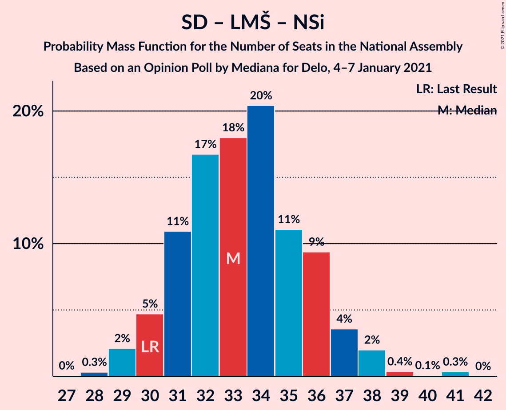

| Number of Seats | Probability | Accumulated | Special Marks |
|:---------------:|:-----------:|:-----------:|:-------------:|
| 27 | 0% | 100% |  |
| 28 | 0.3% | 99.9% |  |
| 29 | 2% | 99.6% |  |
| 30 | 5% | 98% | Last Result |
| 31 | 11% | 93% |  |
| 32 | 17% | 82% |  |
| 33 | 18% | 65% |  |
| 34 | 20% | 47% | Median |
| 35 | 11% | 27% |  |
| 36 | 9% | 16% |  |
| 37 | 4% | 6% |  |
| 38 | 2% | 3% |  |
| 39 | 0.4% | 0.7% |  |
| 40 | 0.1% | 0.4% |  |
| 41 | 0.3% | 0.3% |  |
| 42 | 0% | 0% |  |

### Socialni demokrati – Lista Marjana Šarca – Nova Slovenija–Krščanski demokrati – Stranka modernega centra

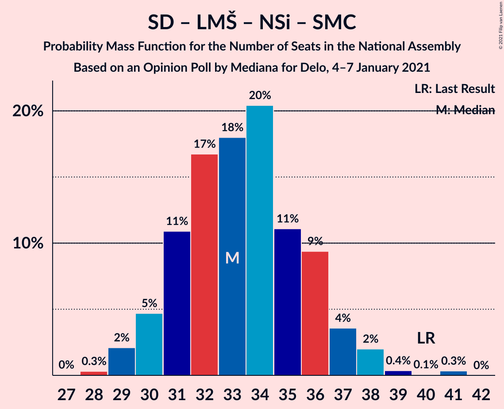

| Number of Seats | Probability | Accumulated | Special Marks |
|:---------------:|:-----------:|:-----------:|:-------------:|
| 27 | 0% | 100% |  |
| 28 | 0.3% | 99.9% |  |
| 29 | 2% | 99.6% |  |
| 30 | 5% | 98% |  |
| 31 | 11% | 93% |  |
| 32 | 17% | 82% |  |
| 33 | 18% | 65% |  |
| 34 | 20% | 47% | Median |
| 35 | 11% | 27% |  |
| 36 | 9% | 16% |  |
| 37 | 4% | 6% |  |
| 38 | 2% | 3% |  |
| 39 | 0.4% | 0.8% |  |
| 40 | 0.1% | 0.4% | Last Result |
| 41 | 0.3% | 0.3% |  |
| 42 | 0% | 0% |  |

### Socialni demokrati – Lista Marjana Šarca – Stranka Alenke Bratušek – Demokratična stranka upokojencev Slovenije – Stranka modernega centra

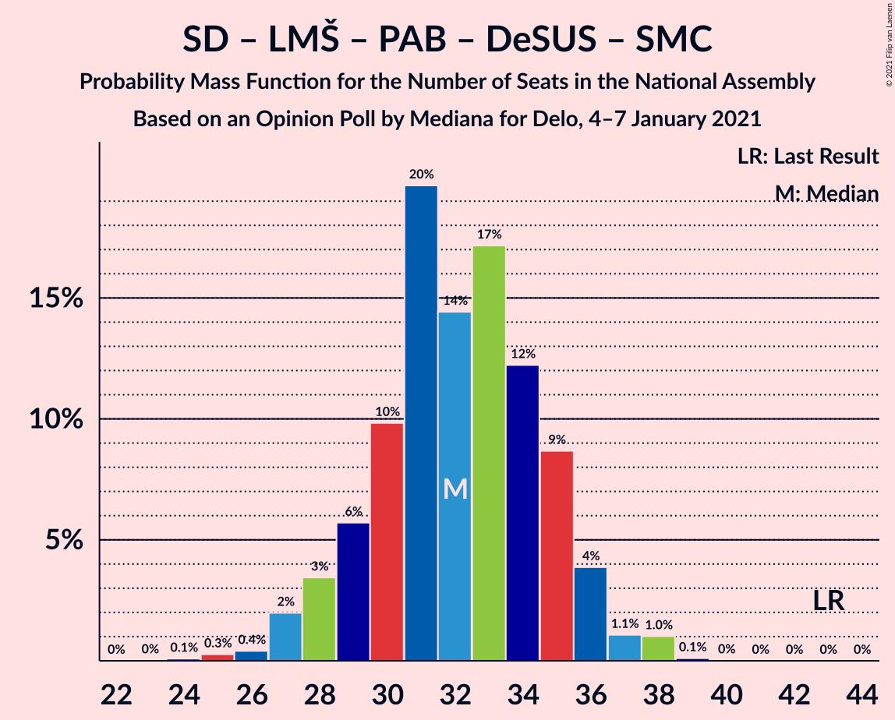

| Number of Seats | Probability | Accumulated | Special Marks |
|:---------------:|:-----------:|:-----------:|:-------------:|
| 24 | 0.1% | 100% |  |
| 25 | 0.3% | 99.9% |  |
| 26 | 0.4% | 99.6% |  |
| 27 | 2% | 99.2% |  |
| 28 | 3% | 97% |  |
| 29 | 6% | 94% |  |
| 30 | 10% | 88% |  |
| 31 | 20% | 78% | Median |
| 32 | 14% | 59% |  |
| 33 | 17% | 44% |  |
| 34 | 12% | 27% |  |
| 35 | 9% | 15% |  |
| 36 | 4% | 6% |  |
| 37 | 1.1% | 2% |  |
| 38 | 1.0% | 1.2% |  |
| 39 | 0.1% | 0.1% |  |
| 40 | 0% | 0% |  |
| 41 | 0% | 0% |  |
| 42 | 0% | 0% |  |
| 43 | 0% | 0% | Last Result |

### Socialni demokrati – Lista Marjana Šarca – Demokratična stranka upokojencev Slovenije

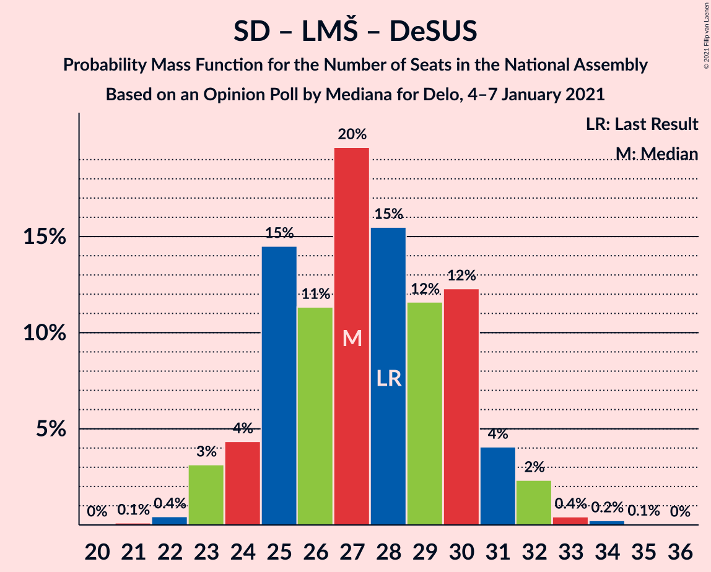

| Number of Seats | Probability | Accumulated | Special Marks |
|:---------------:|:-----------:|:-----------:|:-------------:|
| 21 | 0.1% | 100% |  |
| 22 | 0.4% | 99.9% |  |
| 23 | 3% | 99.4% |  |
| 24 | 4% | 96% |  |
| 25 | 15% | 92% |  |
| 26 | 11% | 77% | Median |
| 27 | 20% | 66% |  |
| 28 | 15% | 46% | Last Result |
| 29 | 12% | 31% |  |
| 30 | 12% | 19% |  |
| 31 | 4% | 7% |  |
| 32 | 2% | 3% |  |
| 33 | 0.4% | 0.7% |  |
| 34 | 0.2% | 0.3% |  |
| 35 | 0.1% | 0.1% |  |
| 36 | 0% | 0% |  |

### Socialni demokrati – Lista Marjana Šarca – Demokratična stranka upokojencev Slovenije – Stranka modernega centra

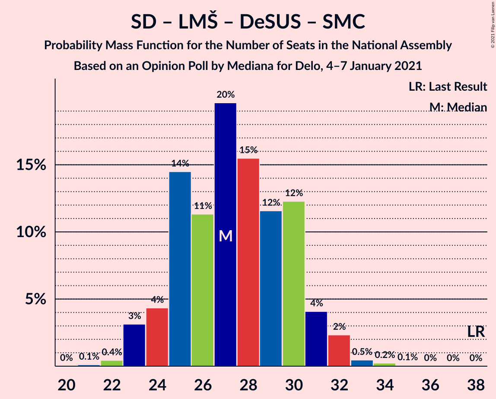

| Number of Seats | Probability | Accumulated | Special Marks |
|:---------------:|:-----------:|:-----------:|:-------------:|
| 21 | 0.1% | 100% |  |
| 22 | 0.4% | 99.9% |  |
| 23 | 3% | 99.4% |  |
| 24 | 4% | 96% |  |
| 25 | 14% | 92% |  |
| 26 | 11% | 77% | Median |
| 27 | 20% | 66% |  |
| 28 | 15% | 47% |  |
| 29 | 12% | 31% |  |
| 30 | 12% | 19% |  |
| 31 | 4% | 7% |  |
| 32 | 2% | 3% |  |
| 33 | 0.5% | 0.8% |  |
| 34 | 0.2% | 0.3% |  |
| 35 | 0.1% | 0.1% |  |
| 36 | 0% | 0% |  |
| 37 | 0% | 0% |  |
| 38 | 0% | 0% | Last Result |

### Socialni demokrati – Lista Marjana Šarca

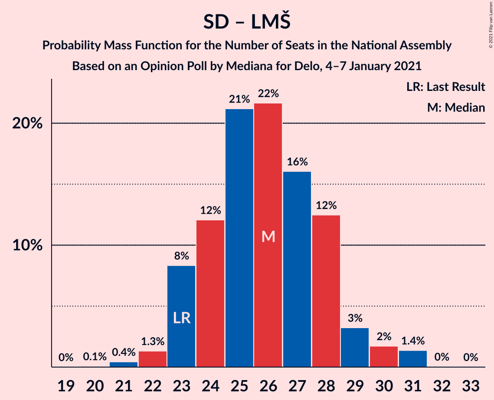

| Number of Seats | Probability | Accumulated | Special Marks |
|:---------------:|:-----------:|:-----------:|:-------------:|
| 20 | 0.1% | 100% |  |
| 21 | 0.4% | 99.9% |  |
| 22 | 1.3% | 99.5% |  |
| 23 | 8% | 98% | Last Result |
| 24 | 12% | 90% |  |
| 25 | 21% | 78% |  |
| 26 | 22% | 57% | Median |
| 27 | 16% | 35% |  |
| 28 | 12% | 19% |  |
| 29 | 3% | 6% |  |
| 30 | 2% | 3% |  |
| 31 | 1.4% | 1.4% |  |
| 32 | 0% | 0.1% |  |
| 33 | 0% | 0% |  |

### Socialni demokrati – Lista Marjana Šarca – Stranka modernega centra

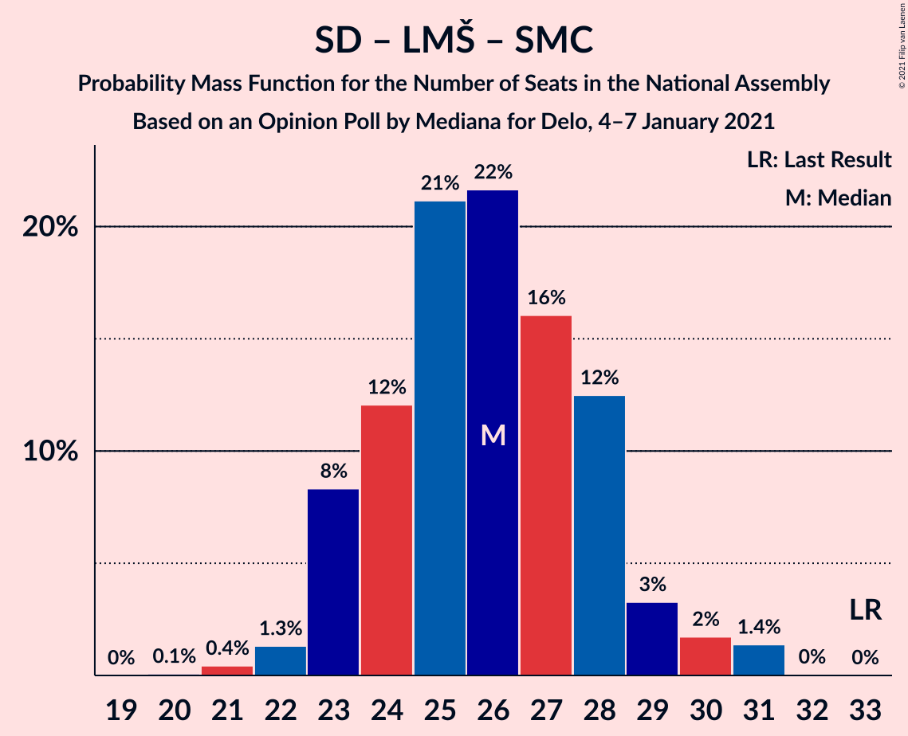

| Number of Seats | Probability | Accumulated | Special Marks |
|:---------------:|:-----------:|:-----------:|:-------------:|
| 20 | 0.1% | 100% |  |
| 21 | 0.4% | 99.9% |  |
| 22 | 1.3% | 99.5% |  |
| 23 | 8% | 98% |  |
| 24 | 12% | 90% |  |
| 25 | 21% | 78% |  |
| 26 | 22% | 57% | Median |
| 27 | 16% | 35% |  |
| 28 | 12% | 19% |  |
| 29 | 3% | 6% |  |
| 30 | 2% | 3% |  |
| 31 | 1.4% | 1.4% |  |
| 32 | 0% | 0.1% |  |
| 33 | 0% | 0% | Last Result |

### Socialni demokrati – Demokratična stranka upokojencev Slovenije – Stranka modernega centra

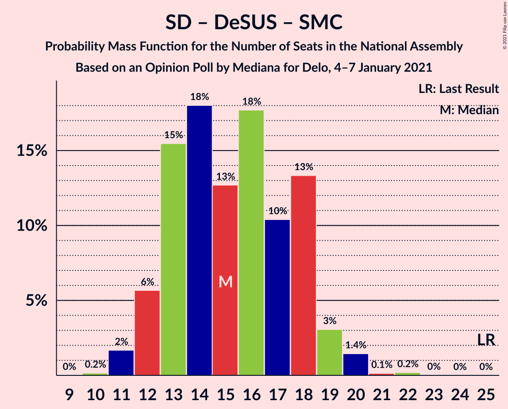

| Number of Seats | Probability | Accumulated | Special Marks |
|:---------------:|:-----------:|:-----------:|:-------------:|
| 10 | 0.2% | 100% |  |
| 11 | 2% | 99.8% |  |
| 12 | 6% | 98% |  |
| 13 | 15% | 92% |  |
| 14 | 18% | 77% | Median |
| 15 | 13% | 59% |  |
| 16 | 18% | 46% |  |
| 17 | 10% | 29% |  |
| 18 | 13% | 18% |  |
| 19 | 3% | 5% |  |
| 20 | 1.4% | 2% |  |
| 21 | 0.1% | 0.3% |  |
| 22 | 0.2% | 0.2% |  |
| 23 | 0% | 0% |  |
| 24 | 0% | 0% |  |
| 25 | 0% | 0% | Last Result |

## Technical Information

### Opinion Poll

+ **Polling firm:** Mediana
+ **Commissioner(s):** Delo
+ **Fieldwork period:** 4–7 January 2021

### Calculations

+ **Sample size:** 704
+ **Simulations done:** 1,048,576
+ **Error estimate:** 2.50%

