# Opinion Poll by Ninamedia for Dnevnik, 12–14 January 2021

<a href="#voting-intentions">Voting Intentions</a> | <a href="#seats">Seats</a> | <a href="#coalitions">Coalitions</a> | <a href="#technical-information">Technical Information</a>

## Voting Intentions

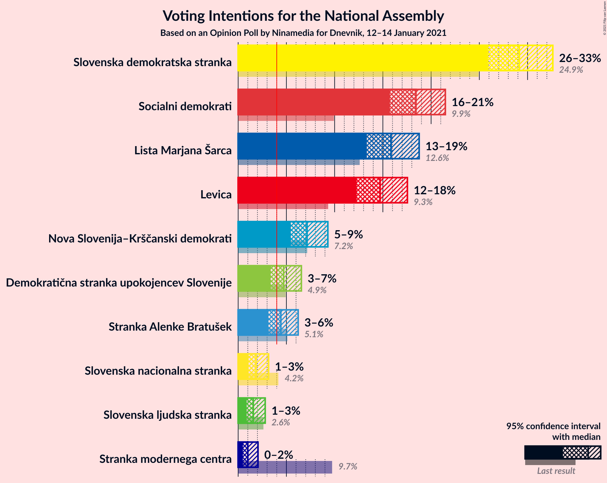

### Confidence Intervals

| Party | Last Result | Poll Result | 80% Confidence Interval | 90% Confidence Interval | 95% Confidence Interval | 99% Confidence Interval |
|:-----:|:-----------:|:-----------:|:-----------------------:|:-----------------------:|:-----------------------:|:-----------------------:|
| Slovenska demokratska stranka | 24.9% | 29.1% | 27.0–31.4% |26.4–32.1% |25.9–32.6% |24.9–33.7% |
| Socialni demokrati | 9.9% | 18.4% | 16.7–20.4% |16.2–21.0% |15.7–21.5% |14.9–22.5% |
| Lista Marjana Šarca | 12.6% | 15.9% | 14.2–17.8% |13.7–18.3% |13.3–18.8% |12.6–19.7% |
| Levica | 9.3% | 14.7% | 13.1–16.6% |12.7–17.1% |12.3–17.5% |11.6–18.5% |
| Nova Slovenija–Krščanski demokrati | 7.2% | 7.1% | 6.0–8.6% |5.7–8.9% |5.5–9.3% |5.0–10.0% |
| Demokratična stranka upokojencev Slovenije | 4.9% | 4.7% | 3.8–5.9% |3.6–6.2% |3.4–6.6% |3.0–7.2% |
| Stranka Alenke Bratušek | 5.1% | 4.4% | 3.6–5.6% |3.3–5.9% |3.1–6.2% |2.8–6.8% |
| Slovenska nacionalna stranka | 4.2% | 1.9% | 1.3–2.7% |1.2–2.9% |1.1–3.2% |0.9–3.6% |
| Slovenska ljudska stranka | 2.6% | 1.6% | 1.1–2.4% |1.0–2.6% |0.9–2.8% |0.7–3.2% |
| Stranka modernega centra | 9.7% | 1.0% | 0.7–1.7% |0.6–1.9% |0.5–2.1% |0.4–2.4% |

*Note:* The poll result column reflects the actual value used in the calculations. Published results may vary slightly, and in addition be rounded to fewer digits.

## Seats

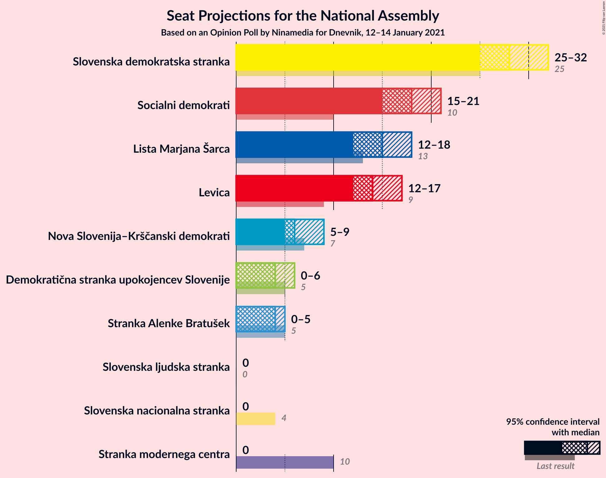

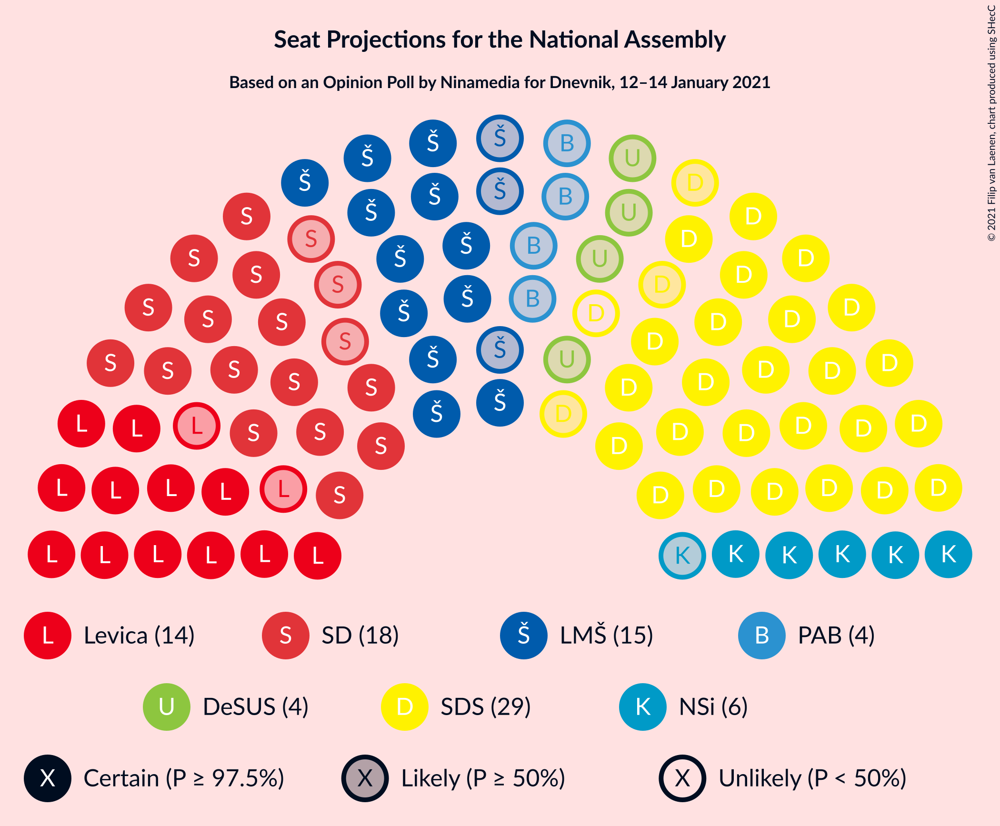

### Confidence Intervals

| Party | Last Result | Median | 80% Confidence Interval | 90% Confidence Interval | 95% Confidence Interval | 99% Confidence Interval |
|:-----:|:-----------:|:------:|:-----------------------:|:-----------------------:|:-----------------------:|:-----------------------:|
| <a href="#slovenska-demokratska-stranka">Slovenska demokratska stranka</a> | 25 | 28 | 26–30 |25–31 |25–32 |24–33 |
| <a href="#socialni-demokrati">Socialni demokrati</a> | 10 | 18 | 16–19 |15–20 |15–21 |14–22 |
| <a href="#lista-marjana-šarca">Lista Marjana Šarca</a> | 13 | 15 | 13–17 |13–18 |12–18 |12–19 |
| <a href="#levica">Levica</a> | 9 | 14 | 12–16 |12–16 |12–17 |11–18 |
| <a href="#nova-slovenija–krščanski-demokrati">Nova Slovenija–Krščanski demokrati</a> | 7 | 6 | 5–8 |5–8 |5–9 |4–9 |
| <a href="#demokratična-stranka-upokojencev-slovenije">Demokratična stranka upokojencev Slovenije</a> | 5 | 4 | 0–5 |0–6 |0–6 |0–7 |
| <a href="#stranka-alenke-bratušek">Stranka Alenke Bratušek</a> | 5 | 4 | 0–4 |0–5 |0–5 |0–6 |
| <a href="#slovenska-nacionalna-stranka">Slovenska nacionalna stranka</a> | 4 | 0 | 0 |0 |0 |0 |
| <a href="#slovenska-ljudska-stranka">Slovenska ljudska stranka</a> | 0 | 0 | 0 |0 |0 |0 |
| <a href="#stranka-modernega-centra">Stranka modernega centra</a> | 10 | 0 | 0 |0 |0 |0 |

### Slovenska demokratska stranka

*For a full overview of the results for this party, see the [Slovenska demokratska stranka](party-slovenskademokratskastranka.html) page.*

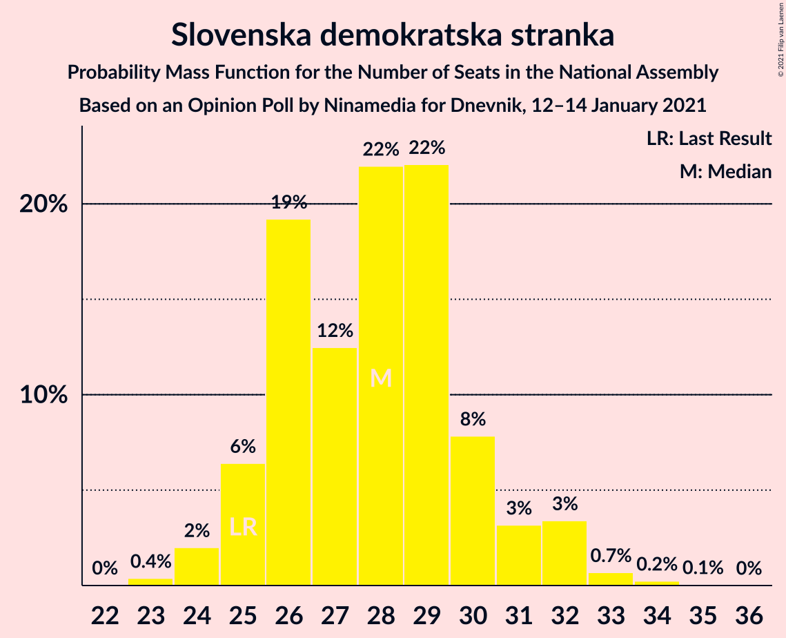

| Number of Seats | Probability | Accumulated | Special Marks |
|:---------------:|:-----------:|:-----------:|:-------------:|
| 23 | 0.4% | 100% |  |
| 24 | 2% | 99.6% |  |
| 25 | 6% | 98% | Last Result |
| 26 | 19% | 91% |  |
| 27 | 12% | 72% |  |
| 28 | 22% | 59% | Median |
| 29 | 22% | 37% |  |
| 30 | 8% | 15% |  |
| 31 | 3% | 8% |  |
| 32 | 3% | 4% |  |
| 33 | 0.7% | 1.0% |  |
| 34 | 0.2% | 0.3% |  |
| 35 | 0.1% | 0.1% |  |
| 36 | 0% | 0% |  |

### Socialni demokrati

*For a full overview of the results for this party, see the [Socialni demokrati](party-socialnidemokrati.html) page.*

| Number of Seats | Probability | Accumulated | Special Marks |
|:---------------:|:-----------:|:-----------:|:-------------:|
| 10 | 0% | 100% | Last Result |
| 11 | 0% | 100% |  |
| 12 | 0% | 100% |  |
| 13 | 0.1% | 100% |  |
| 14 | 1.3% | 99.9% |  |
| 15 | 6% | 98.6% |  |
| 16 | 19% | 92% |  |
| 17 | 16% | 73% |  |
| 18 | 32% | 57% | Median |
| 19 | 19% | 25% |  |
| 20 | 3% | 6% |  |
| 21 | 3% | 3% |  |
| 22 | 0.6% | 0.7% |  |
| 23 | 0.1% | 0.1% |  |
| 24 | 0% | 0% |  |

### Lista Marjana Šarca

*For a full overview of the results for this party, see the [Lista Marjana Šarca](party-listamarjanašarca.html) page.*

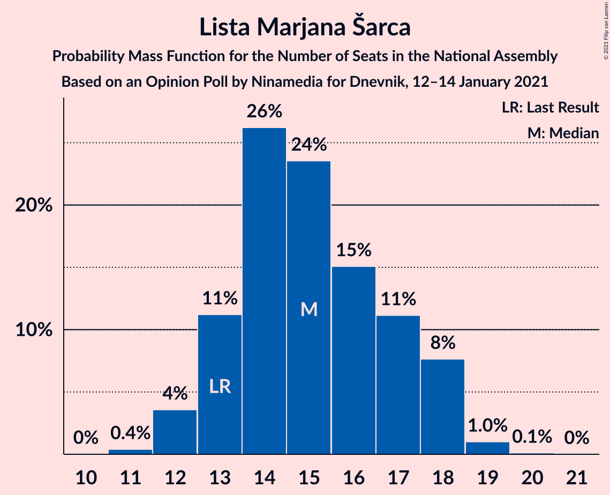

| Number of Seats | Probability | Accumulated | Special Marks |
|:---------------:|:-----------:|:-----------:|:-------------:|
| 11 | 0.4% | 100% |  |
| 12 | 4% | 99.6% |  |
| 13 | 11% | 96% | Last Result |
| 14 | 26% | 85% |  |
| 15 | 24% | 59% | Median |
| 16 | 15% | 35% |  |
| 17 | 11% | 20% |  |
| 18 | 8% | 9% |  |
| 19 | 1.0% | 1.1% |  |
| 20 | 0.1% | 0.1% |  |
| 21 | 0% | 0% |  |

### Levica

*For a full overview of the results for this party, see the [Levica](party-levica.html) page.*

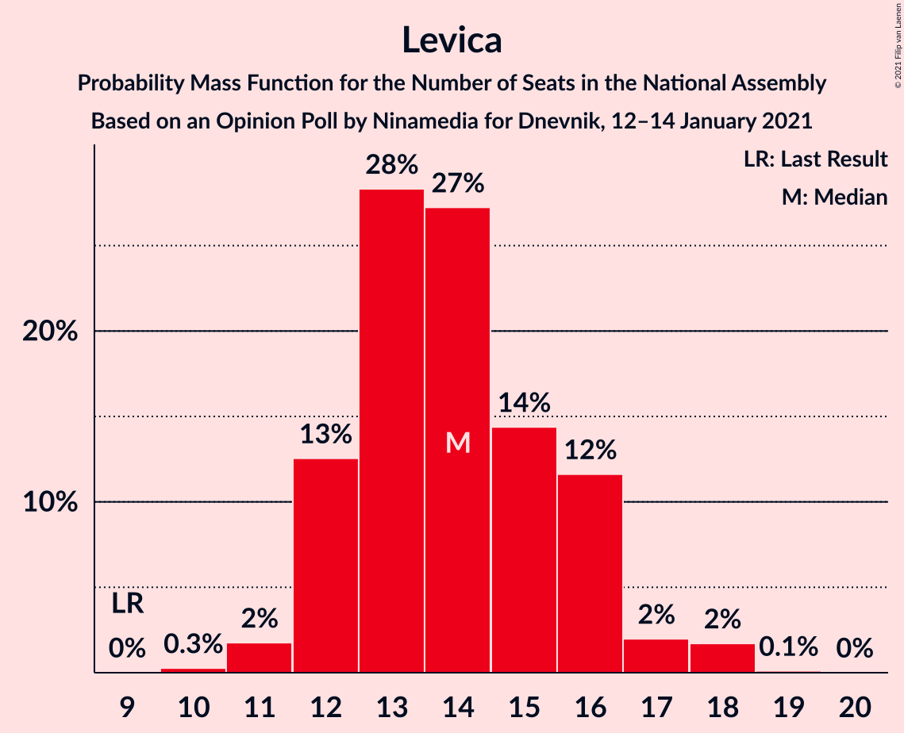

| Number of Seats | Probability | Accumulated | Special Marks |
|:---------------:|:-----------:|:-----------:|:-------------:|
| 9 | 0% | 100% | Last Result |
| 10 | 0.3% | 100% |  |
| 11 | 2% | 99.7% |  |
| 12 | 13% | 98% |  |
| 13 | 28% | 85% |  |
| 14 | 27% | 57% | Median |
| 15 | 14% | 30% |  |
| 16 | 12% | 15% |  |
| 17 | 2% | 4% |  |
| 18 | 2% | 2% |  |
| 19 | 0.1% | 0.1% |  |
| 20 | 0% | 0% |  |

### Nova Slovenija–Krščanski demokrati

*For a full overview of the results for this party, see the [Nova Slovenija–Krščanski demokrati](party-novaslovenija–krščanskidemokrati.html) page.*

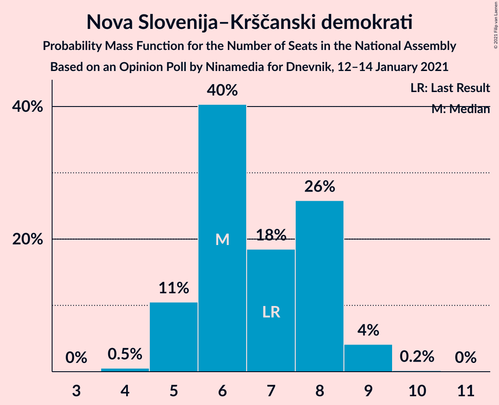

| Number of Seats | Probability | Accumulated | Special Marks |
|:---------------:|:-----------:|:-----------:|:-------------:|
| 4 | 0.5% | 100% |  |
| 5 | 11% | 99.5% |  |
| 6 | 40% | 89% | Median |
| 7 | 18% | 49% | Last Result |
| 8 | 26% | 30% |  |
| 9 | 4% | 4% |  |
| 10 | 0.2% | 0.2% |  |
| 11 | 0% | 0% |  |

### Demokratična stranka upokojencev Slovenije

*For a full overview of the results for this party, see the [Demokratična stranka upokojencev Slovenije](party-demokratičnastrankaupokojencevslovenije.html) page.*

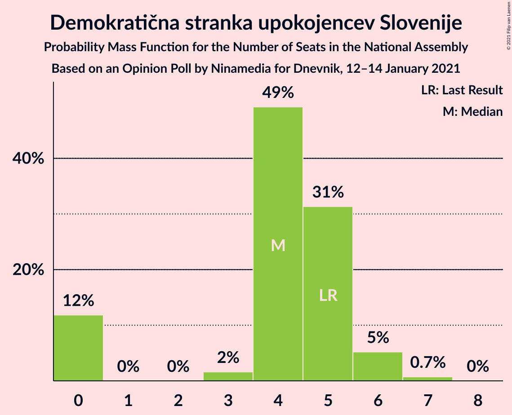

| Number of Seats | Probability | Accumulated | Special Marks |
|:---------------:|:-----------:|:-----------:|:-------------:|
| 0 | 12% | 100% |  |
| 1 | 0% | 88% |  |
| 2 | 0% | 88% |  |
| 3 | 2% | 88% |  |
| 4 | 49% | 87% | Median |
| 5 | 31% | 37% | Last Result |
| 6 | 5% | 6% |  |
| 7 | 0.7% | 0.8% |  |
| 8 | 0% | 0% |  |

### Stranka Alenke Bratušek

*For a full overview of the results for this party, see the [Stranka Alenke Bratušek](party-strankaalenkebratušek.html) page.*

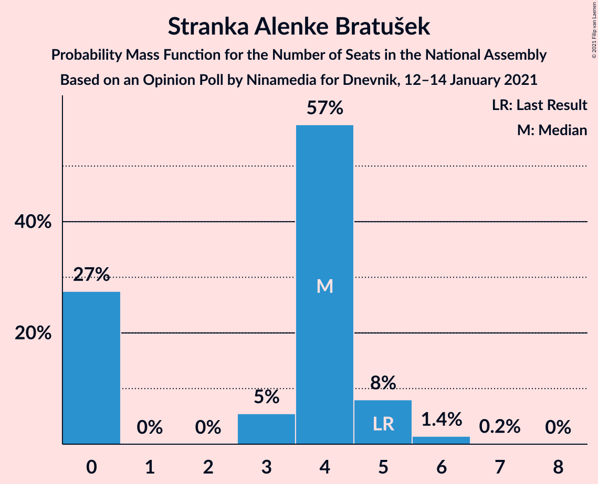

| Number of Seats | Probability | Accumulated | Special Marks |
|:---------------:|:-----------:|:-----------:|:-------------:|
| 0 | 27% | 100% |  |
| 1 | 0% | 73% |  |
| 2 | 0% | 73% |  |
| 3 | 5% | 73% |  |
| 4 | 57% | 67% | Median |
| 5 | 8% | 10% | Last Result |
| 6 | 1.4% | 2% |  |
| 7 | 0.2% | 0.2% |  |
| 8 | 0% | 0% |  |

### Slovenska nacionalna stranka

*For a full overview of the results for this party, see the [Slovenska nacionalna stranka](party-slovenskanacionalnastranka.html) page.*

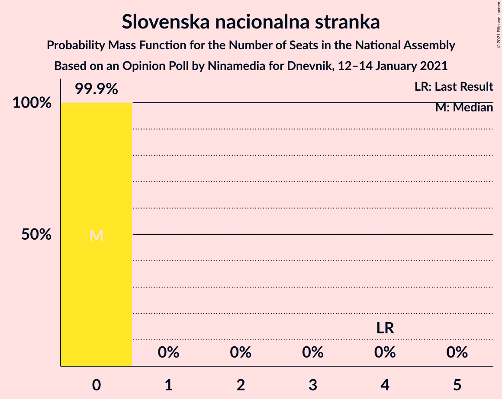

| Number of Seats | Probability | Accumulated | Special Marks |
|:---------------:|:-----------:|:-----------:|:-------------:|
| 0 | 99.9% | 100% | Median |
| 1 | 0% | 0.1% |  |
| 2 | 0% | 0.1% |  |
| 3 | 0% | 0.1% |  |
| 4 | 0% | 0% | Last Result |

### Slovenska ljudska stranka

*For a full overview of the results for this party, see the [Slovenska ljudska stranka](party-slovenskaljudskastranka.html) page.*

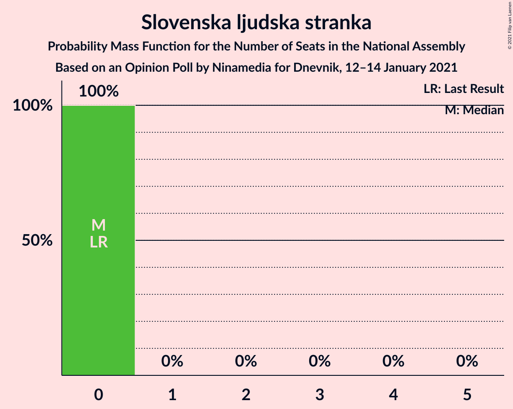

| Number of Seats | Probability | Accumulated | Special Marks |
|:---------------:|:-----------:|:-----------:|:-------------:|
| 0 | 100% | 100% | Last Result, Median |

### Stranka modernega centra

*For a full overview of the results for this party, see the [Stranka modernega centra](party-strankamodernegacentra.html) page.*

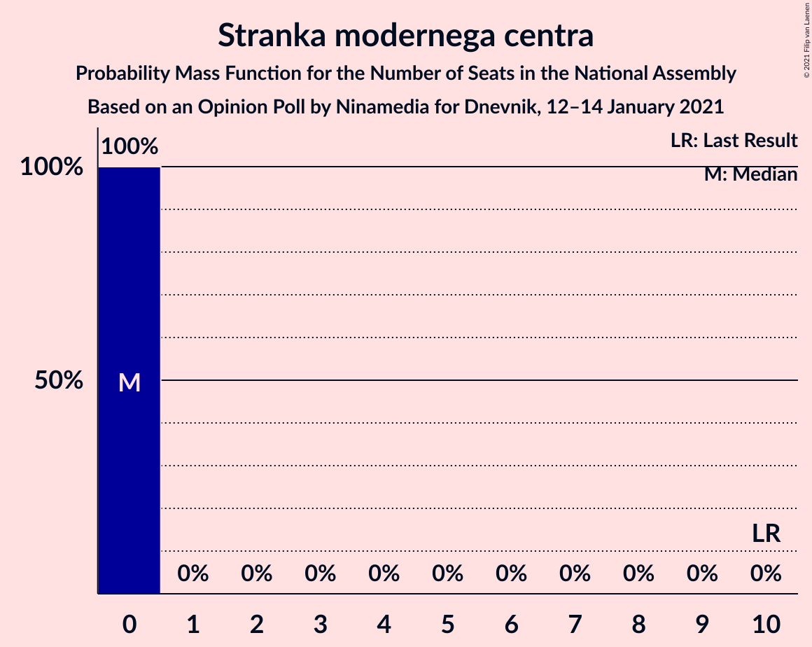

| Number of Seats | Probability | Accumulated | Special Marks |
|:---------------:|:-----------:|:-----------:|:-------------:|
| 0 | 100% | 100% | Median |
| 1 | 0% | 0% |  |
| 2 | 0% | 0% |  |
| 3 | 0% | 0% |  |
| 4 | 0% | 0% |  |
| 5 | 0% | 0% |  |
| 6 | 0% | 0% |  |
| 7 | 0% | 0% |  |
| 8 | 0% | 0% |  |
| 9 | 0% | 0% |  |
| 10 | 0% | 0% | Last Result |

## Coalitions

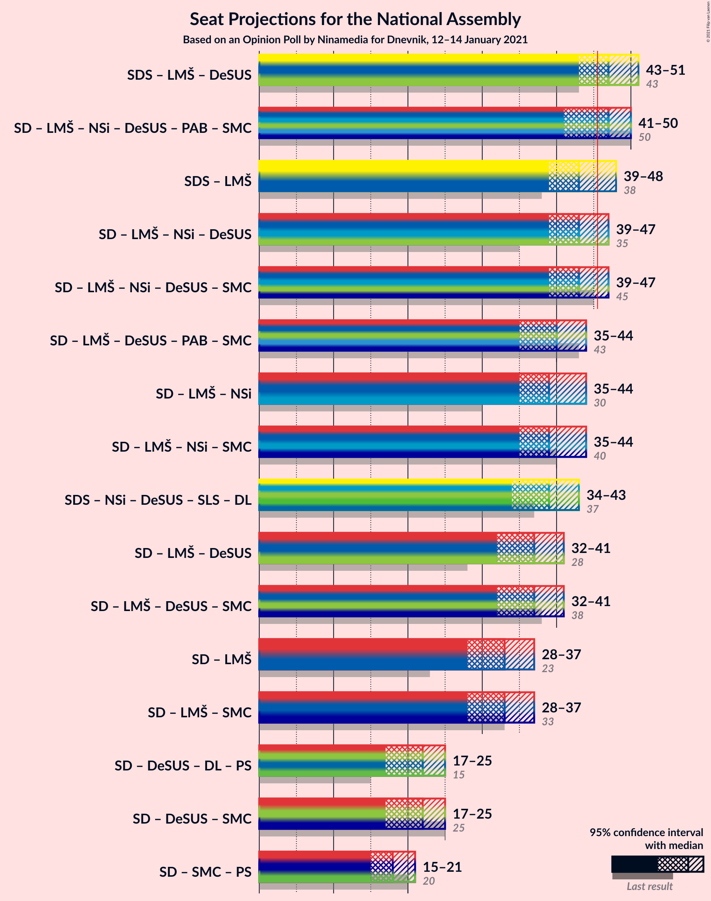

### Confidence Intervals

| Coalition | Last Result | Median | Majority? | 80% Confidence Interval | 90% Confidence Interval | 95% Confidence Interval | 99% Confidence Interval |
|:---------:|:-----------:|:------:|:---------:|:-----------------------:|:-----------------------:|:-----------------------:|:-----------------------:|
| Slovenska demokratska stranka – Lista Marjana Šarca – Demokratična stranka upokojencev Slovenije | 43 | 47 | 74% | 44–50 | 44–50 | 43–51 | 42–52 |
| Socialni demokrati – Lista Marjana Šarca – Nova Slovenija–Krščanski demokrati – Demokratična stranka upokojencev Slovenije – Stranka Alenke Bratušek – Stranka modernega centra | 50 | 47 | 68% | 43–49 | 42–50 | 41–50 | 40–51 |
| Slovenska demokratska stranka – Lista Marjana Šarca | 38 | 43 | 9% | 41–45 | 40–47 | 39–48 | 38–49 |
| Socialni demokrati – Lista Marjana Šarca – Nova Slovenija–Krščanski demokrati – Demokratična stranka upokojencev Slovenije | 35 | 43 | 15% | 40–46 | 40–47 | 39–47 | 36–48 |
| Socialni demokrati – Lista Marjana Šarca – Nova Slovenija–Krščanski demokrati – Demokratična stranka upokojencev Slovenije – Stranka modernega centra | 45 | 43 | 15% | 40–46 | 40–47 | 39–47 | 36–48 |
| Socialni demokrati – Lista Marjana Šarca – Demokratična stranka upokojencev Slovenije – Stranka Alenke Bratušek – Stranka modernega centra | 43 | 40 | 0.1% | 36–43 | 35–43 | 35–44 | 33–44 |
| Socialni demokrati – Lista Marjana Šarca – Nova Slovenija–Krščanski demokrati | 30 | 39 | 0.4% | 37–42 | 36–43 | 35–44 | 35–45 |
| Socialni demokrati – Lista Marjana Šarca – Nova Slovenija–Krščanski demokrati – Stranka modernega centra | 40 | 39 | 0.4% | 37–42 | 36–43 | 35–44 | 35–45 |
| Socialni demokrati – Lista Marjana Šarca – Demokratična stranka upokojencev Slovenije | 28 | 37 | 0% | 34–40 | 33–40 | 32–41 | 31–42 |
| Socialni demokrati – Lista Marjana Šarca – Demokratična stranka upokojencev Slovenije – Stranka modernega centra | 38 | 37 | 0% | 34–40 | 33–40 | 32–41 | 31–42 |
| Socialni demokrati – Lista Marjana Šarca | 23 | 33 | 0% | 30–36 | 29–36 | 28–37 | 28–38 |
| Socialni demokrati – Lista Marjana Šarca – Stranka modernega centra | 33 | 33 | 0% | 30–36 | 29–36 | 28–37 | 28–38 |
| Socialni demokrati – Demokratična stranka upokojencev Slovenije – Stranka modernega centra | 25 | 22 | 0% | 19–24 | 18–24 | 17–25 | 16–26 |

### Slovenska demokratska stranka – Lista Marjana Šarca – Demokratična stranka upokojencev Slovenije

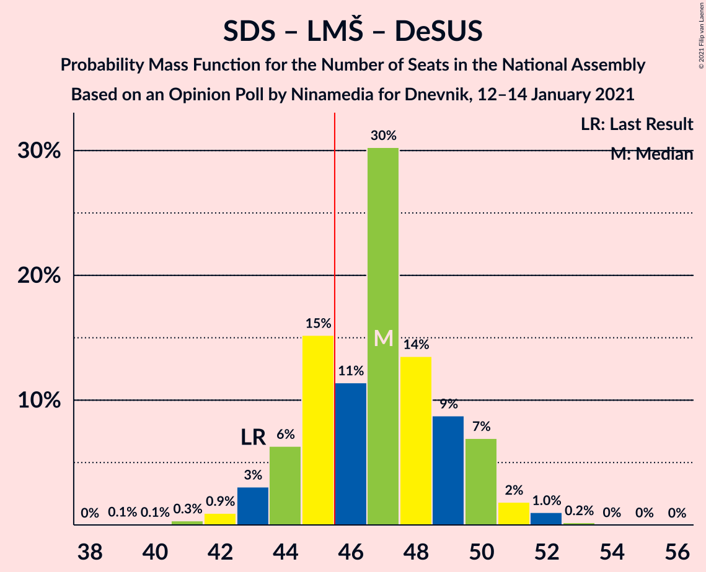

| Number of Seats | Probability | Accumulated | Special Marks |
|:---------------:|:-----------:|:-----------:|:-------------:|
| 39 | 0.1% | 100% |  |
| 40 | 0.1% | 99.9% |  |
| 41 | 0.3% | 99.8% |  |
| 42 | 0.9% | 99.5% |  |
| 43 | 3% | 98.6% | Last Result |
| 44 | 6% | 96% |  |
| 45 | 15% | 89% |  |
| 46 | 11% | 74% | Majority |
| 47 | 30% | 63% | Median |
| 48 | 14% | 32% |  |
| 49 | 9% | 19% |  |
| 50 | 7% | 10% |  |
| 51 | 2% | 3% |  |
| 52 | 1.0% | 1.3% |  |
| 53 | 0.2% | 0.3% |  |
| 54 | 0% | 0.1% |  |
| 55 | 0% | 0% |  |

### Socialni demokrati – Lista Marjana Šarca – Nova Slovenija–Krščanski demokrati – Demokratična stranka upokojencev Slovenije – Stranka Alenke Bratušek – Stranka modernega centra

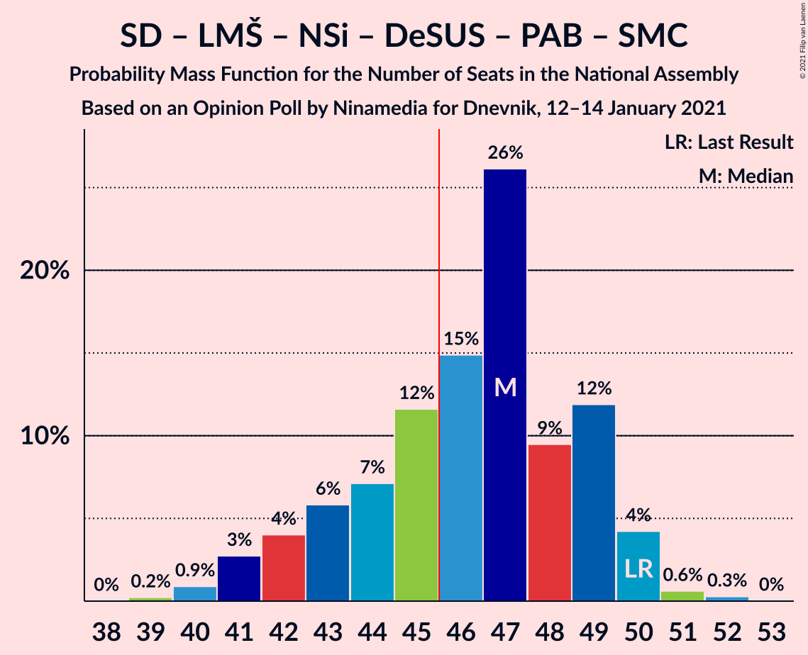

| Number of Seats | Probability | Accumulated | Special Marks |
|:---------------:|:-----------:|:-----------:|:-------------:|
| 39 | 0.2% | 100% |  |
| 40 | 0.9% | 99.8% |  |
| 41 | 3% | 98.9% |  |
| 42 | 4% | 96% |  |
| 43 | 6% | 92% |  |
| 44 | 7% | 86% |  |
| 45 | 12% | 79% |  |
| 46 | 15% | 68% | Majority |
| 47 | 26% | 53% | Median |
| 48 | 9% | 27% |  |
| 49 | 12% | 17% |  |
| 50 | 4% | 5% | Last Result |
| 51 | 0.6% | 0.9% |  |
| 52 | 0.3% | 0.3% |  |
| 53 | 0% | 0% |  |

### Slovenska demokratska stranka – Lista Marjana Šarca

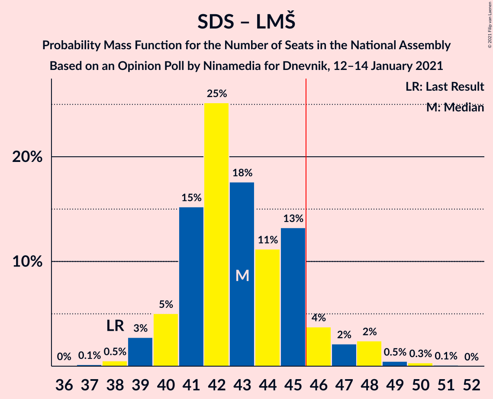

| Number of Seats | Probability | Accumulated | Special Marks |
|:---------------:|:-----------:|:-----------:|:-------------:|
| 37 | 0.1% | 100% |  |
| 38 | 0.5% | 99.8% | Last Result |
| 39 | 3% | 99.3% |  |
| 40 | 5% | 97% |  |
| 41 | 15% | 92% |  |
| 42 | 25% | 76% |  |
| 43 | 18% | 51% | Median |
| 44 | 11% | 34% |  |
| 45 | 13% | 22% |  |
| 46 | 4% | 9% | Majority |
| 47 | 2% | 5% |  |
| 48 | 2% | 3% |  |
| 49 | 0.5% | 0.9% |  |
| 50 | 0.3% | 0.4% |  |
| 51 | 0.1% | 0.1% |  |
| 52 | 0% | 0% |  |

### Socialni demokrati – Lista Marjana Šarca – Nova Slovenija–Krščanski demokrati – Demokratična stranka upokojencev Slovenije

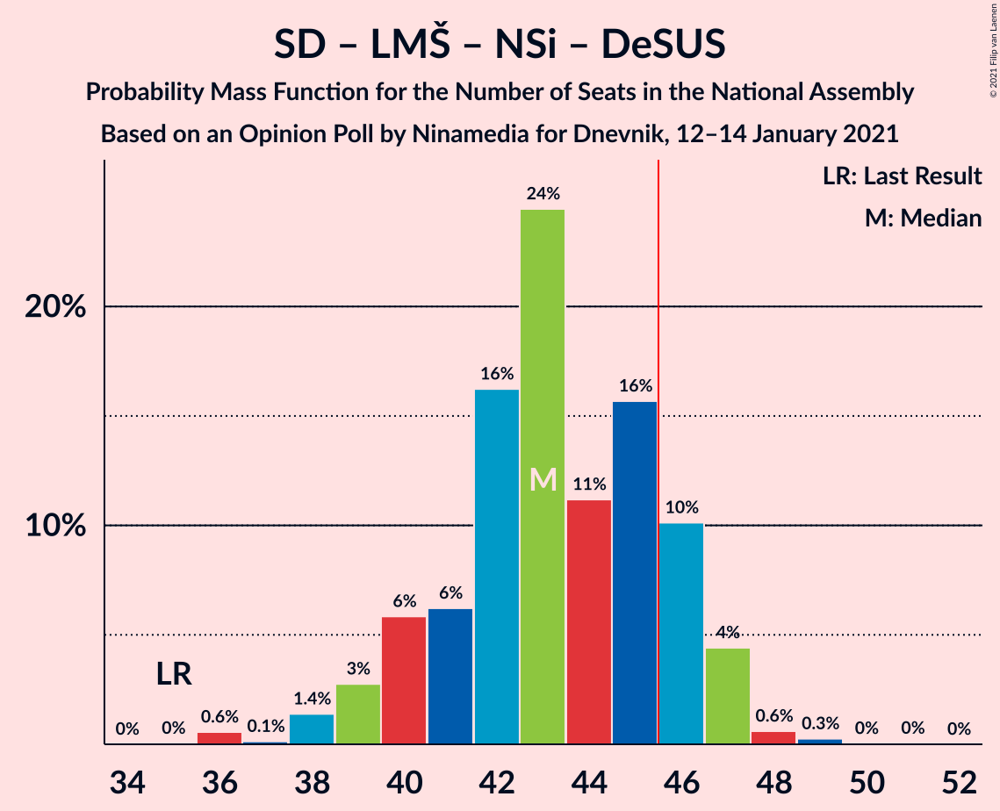

| Number of Seats | Probability | Accumulated | Special Marks |
|:---------------:|:-----------:|:-----------:|:-------------:|
| 35 | 0% | 100% | Last Result |
| 36 | 0.6% | 99.9% |  |
| 37 | 0.1% | 99.4% |  |
| 38 | 1.4% | 99.3% |  |
| 39 | 3% | 98% |  |
| 40 | 6% | 95% |  |
| 41 | 6% | 89% |  |
| 42 | 16% | 83% |  |
| 43 | 24% | 67% | Median |
| 44 | 11% | 42% |  |
| 45 | 16% | 31% |  |
| 46 | 10% | 15% | Majority |
| 47 | 4% | 5% |  |
| 48 | 0.6% | 0.9% |  |
| 49 | 0.3% | 0.3% |  |
| 50 | 0% | 0.1% |  |
| 51 | 0% | 0.1% |  |
| 52 | 0% | 0% |  |

### Socialni demokrati – Lista Marjana Šarca – Nova Slovenija–Krščanski demokrati – Demokratična stranka upokojencev Slovenije – Stranka modernega centra

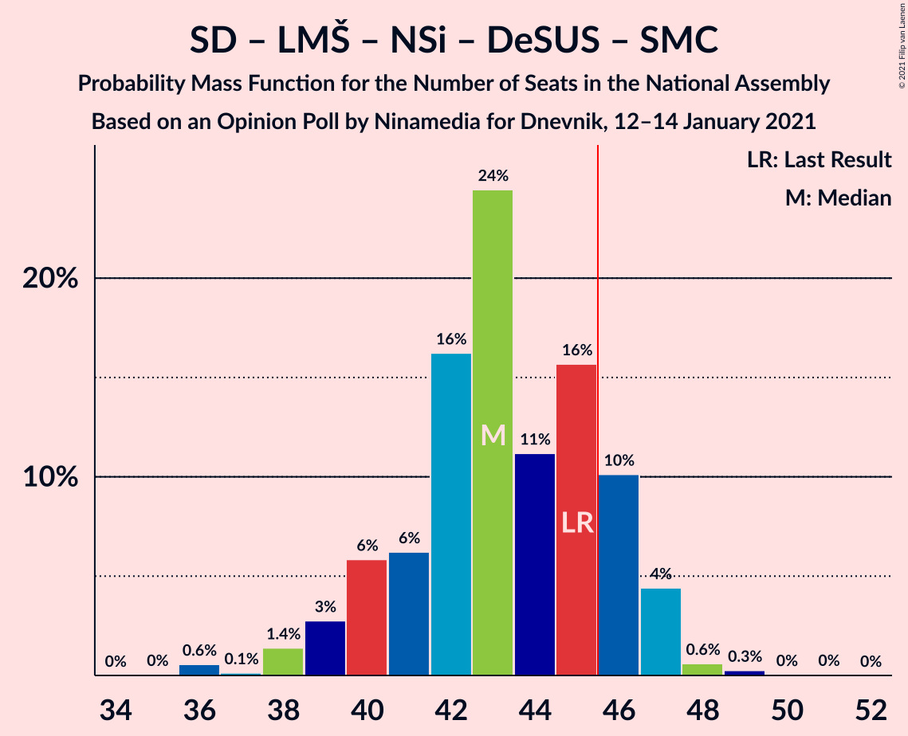

| Number of Seats | Probability | Accumulated | Special Marks |
|:---------------:|:-----------:|:-----------:|:-------------:|
| 35 | 0% | 100% |  |
| 36 | 0.6% | 99.9% |  |
| 37 | 0.1% | 99.4% |  |
| 38 | 1.4% | 99.3% |  |
| 39 | 3% | 98% |  |
| 40 | 6% | 95% |  |
| 41 | 6% | 89% |  |
| 42 | 16% | 83% |  |
| 43 | 24% | 67% | Median |
| 44 | 11% | 42% |  |
| 45 | 16% | 31% | Last Result |
| 46 | 10% | 15% | Majority |
| 47 | 4% | 5% |  |
| 48 | 0.6% | 0.9% |  |
| 49 | 0.3% | 0.3% |  |
| 50 | 0% | 0.1% |  |
| 51 | 0% | 0.1% |  |
| 52 | 0% | 0% |  |

### Socialni demokrati – Lista Marjana Šarca – Demokratična stranka upokojencev Slovenije – Stranka Alenke Bratušek – Stranka modernega centra

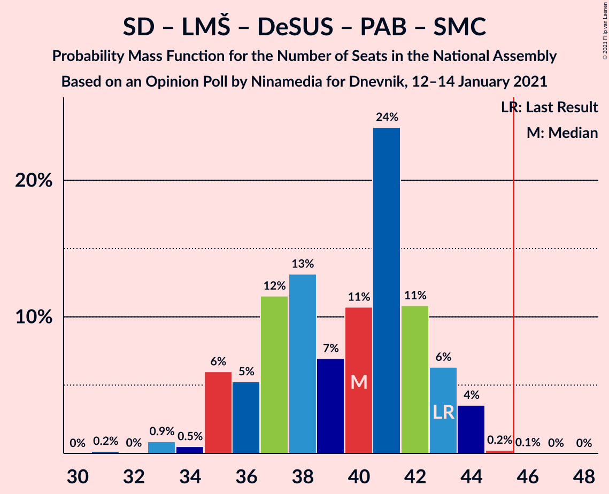

| Number of Seats | Probability | Accumulated | Special Marks |
|:---------------:|:-----------:|:-----------:|:-------------:|
| 31 | 0.2% | 100% |  |
| 32 | 0% | 99.8% |  |
| 33 | 0.9% | 99.8% |  |
| 34 | 0.5% | 98.9% |  |
| 35 | 6% | 98% |  |
| 36 | 5% | 92% |  |
| 37 | 12% | 87% |  |
| 38 | 13% | 76% |  |
| 39 | 7% | 63% |  |
| 40 | 11% | 56% |  |
| 41 | 24% | 45% | Median |
| 42 | 11% | 21% |  |
| 43 | 6% | 10% | Last Result |
| 44 | 4% | 4% |  |
| 45 | 0.2% | 0.3% |  |
| 46 | 0.1% | 0.1% | Majority |
| 47 | 0% | 0% |  |

### Socialni demokrati – Lista Marjana Šarca – Nova Slovenija–Krščanski demokrati

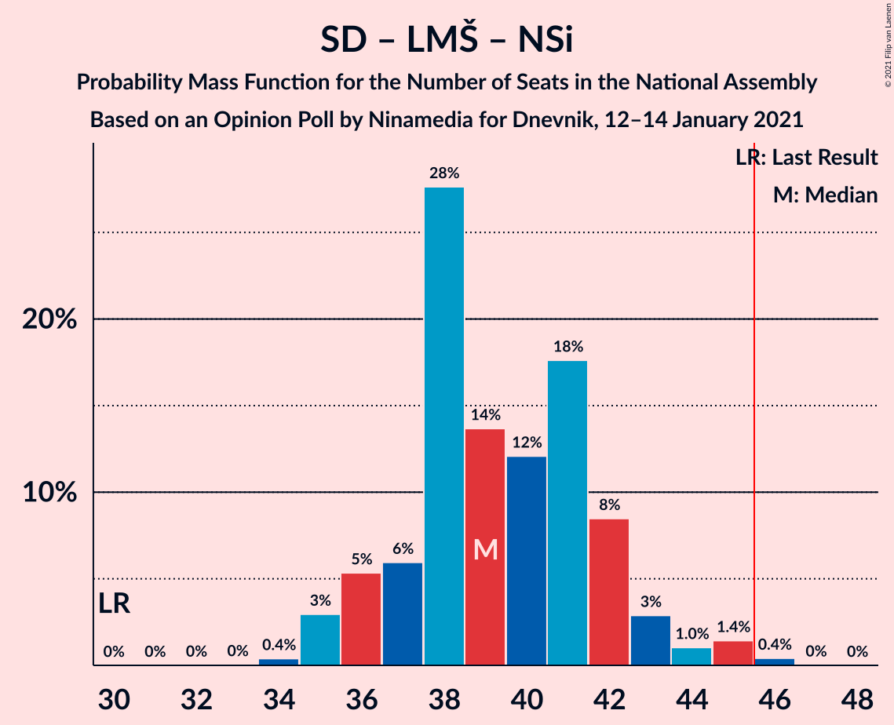

| Number of Seats | Probability | Accumulated | Special Marks |
|:---------------:|:-----------:|:-----------:|:-------------:|
| 30 | 0% | 100% | Last Result |
| 31 | 0% | 100% |  |
| 32 | 0% | 100% |  |
| 33 | 0% | 100% |  |
| 34 | 0.4% | 99.9% |  |
| 35 | 3% | 99.5% |  |
| 36 | 5% | 97% |  |
| 37 | 6% | 91% |  |
| 38 | 28% | 85% |  |
| 39 | 14% | 58% | Median |
| 40 | 12% | 44% |  |
| 41 | 18% | 32% |  |
| 42 | 8% | 14% |  |
| 43 | 3% | 6% |  |
| 44 | 1.0% | 3% |  |
| 45 | 1.4% | 2% |  |
| 46 | 0.4% | 0.4% | Majority |
| 47 | 0% | 0% |  |

### Socialni demokrati – Lista Marjana Šarca – Nova Slovenija–Krščanski demokrati – Stranka modernega centra

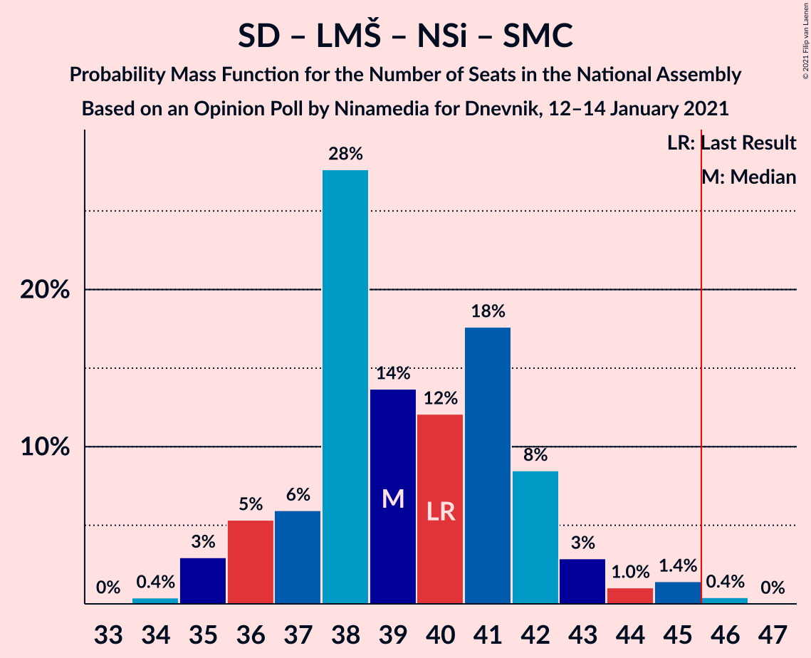

| Number of Seats | Probability | Accumulated | Special Marks |
|:---------------:|:-----------:|:-----------:|:-------------:|
| 33 | 0% | 100% |  |
| 34 | 0.4% | 99.9% |  |
| 35 | 3% | 99.5% |  |
| 36 | 5% | 97% |  |
| 37 | 6% | 91% |  |
| 38 | 28% | 85% |  |
| 39 | 14% | 58% | Median |
| 40 | 12% | 44% | Last Result |
| 41 | 18% | 32% |  |
| 42 | 8% | 14% |  |
| 43 | 3% | 6% |  |
| 44 | 1.0% | 3% |  |
| 45 | 1.4% | 2% |  |
| 46 | 0.4% | 0.4% | Majority |
| 47 | 0% | 0% |  |

### Socialni demokrati – Lista Marjana Šarca – Demokratična stranka upokojencev Slovenije

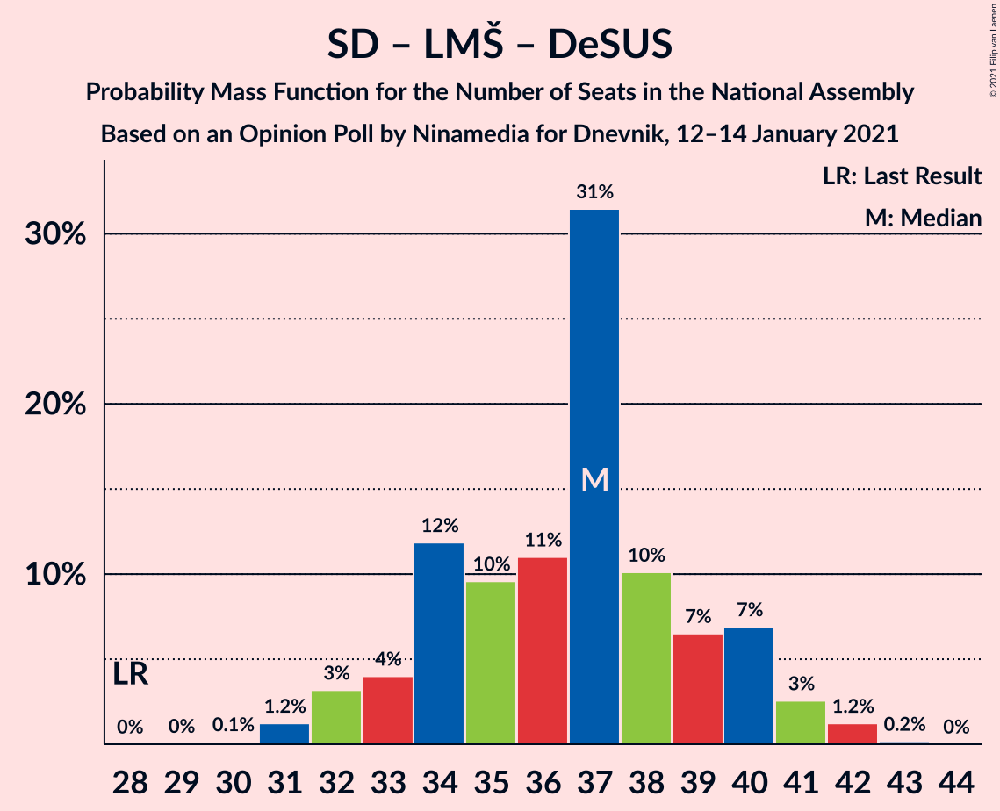

| Number of Seats | Probability | Accumulated | Special Marks |
|:---------------:|:-----------:|:-----------:|:-------------:|
| 28 | 0% | 100% | Last Result |
| 29 | 0% | 100% |  |
| 30 | 0.1% | 99.9% |  |
| 31 | 1.2% | 99.8% |  |
| 32 | 3% | 98.6% |  |
| 33 | 4% | 95% |  |
| 34 | 12% | 91% |  |
| 35 | 10% | 80% |  |
| 36 | 11% | 70% |  |
| 37 | 31% | 59% | Median |
| 38 | 10% | 27% |  |
| 39 | 7% | 17% |  |
| 40 | 7% | 11% |  |
| 41 | 3% | 4% |  |
| 42 | 1.2% | 1.4% |  |
| 43 | 0.2% | 0.2% |  |
| 44 | 0% | 0% |  |

### Socialni demokrati – Lista Marjana Šarca – Demokratična stranka upokojencev Slovenije – Stranka modernega centra

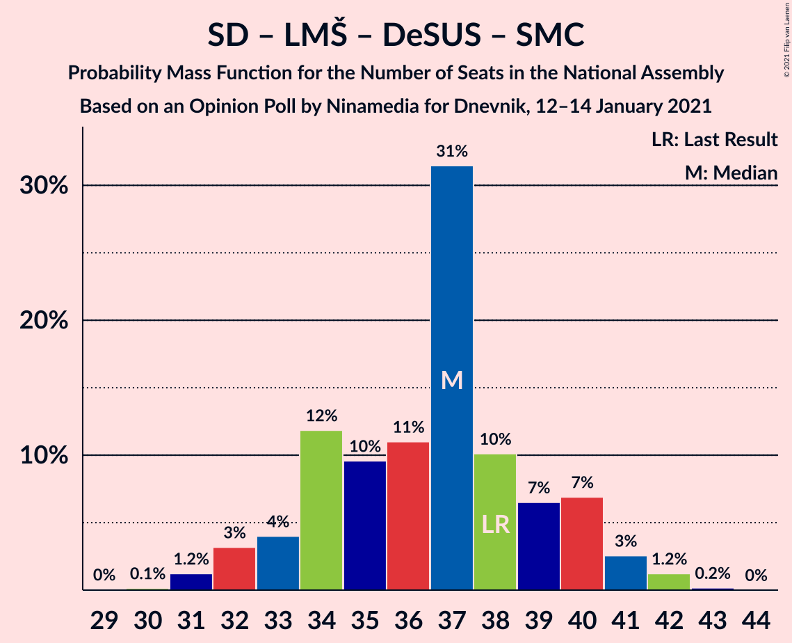

| Number of Seats | Probability | Accumulated | Special Marks |
|:---------------:|:-----------:|:-----------:|:-------------:|
| 29 | 0% | 100% |  |
| 30 | 0.1% | 99.9% |  |
| 31 | 1.2% | 99.8% |  |
| 32 | 3% | 98.6% |  |
| 33 | 4% | 95% |  |
| 34 | 12% | 91% |  |
| 35 | 10% | 80% |  |
| 36 | 11% | 70% |  |
| 37 | 31% | 59% | Median |
| 38 | 10% | 27% | Last Result |
| 39 | 7% | 17% |  |
| 40 | 7% | 11% |  |
| 41 | 3% | 4% |  |
| 42 | 1.2% | 1.4% |  |
| 43 | 0.2% | 0.2% |  |
| 44 | 0% | 0% |  |

### Socialni demokrati – Lista Marjana Šarca

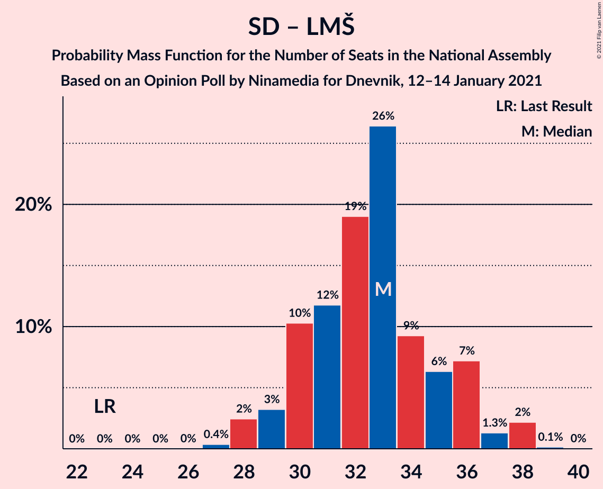

| Number of Seats | Probability | Accumulated | Special Marks |
|:---------------:|:-----------:|:-----------:|:-------------:|
| 23 | 0% | 100% | Last Result |
| 24 | 0% | 100% |  |
| 25 | 0% | 100% |  |
| 26 | 0% | 100% |  |
| 27 | 0.4% | 100% |  |
| 28 | 2% | 99.6% |  |
| 29 | 3% | 97% |  |
| 30 | 10% | 94% |  |
| 31 | 12% | 84% |  |
| 32 | 19% | 72% |  |
| 33 | 26% | 53% | Median |
| 34 | 9% | 26% |  |
| 35 | 6% | 17% |  |
| 36 | 7% | 11% |  |
| 37 | 1.3% | 4% |  |
| 38 | 2% | 2% |  |
| 39 | 0.1% | 0.2% |  |
| 40 | 0% | 0% |  |

### Socialni demokrati – Lista Marjana Šarca – Stranka modernega centra

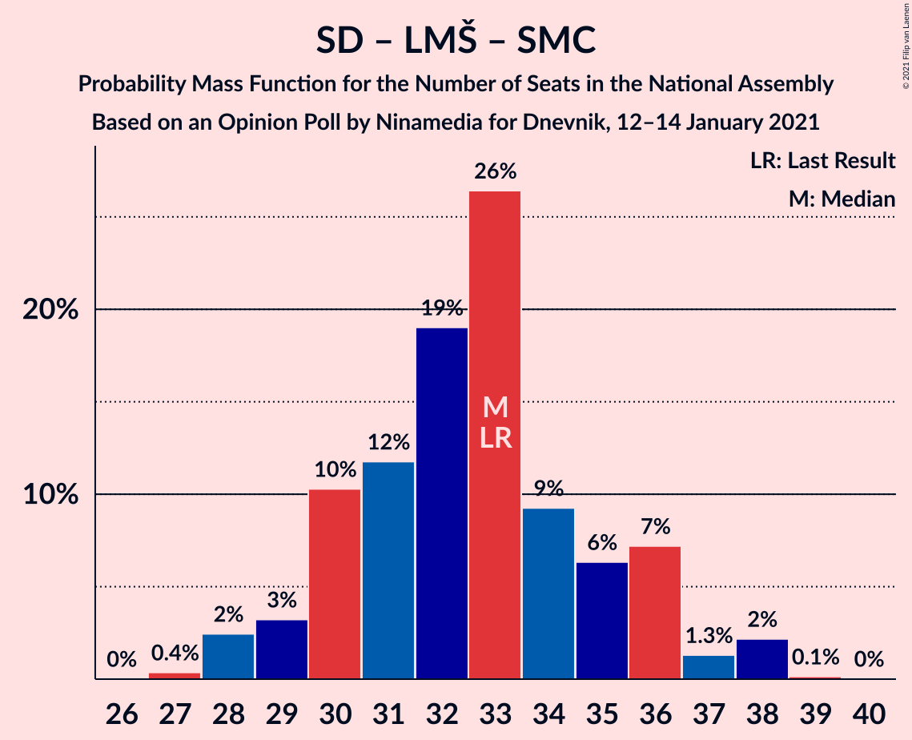

| Number of Seats | Probability | Accumulated | Special Marks |
|:---------------:|:-----------:|:-----------:|:-------------:|
| 27 | 0.4% | 100% |  |
| 28 | 2% | 99.6% |  |
| 29 | 3% | 97% |  |
| 30 | 10% | 94% |  |
| 31 | 12% | 84% |  |
| 32 | 19% | 72% |  |
| 33 | 26% | 53% | Last Result, Median |
| 34 | 9% | 26% |  |
| 35 | 6% | 17% |  |
| 36 | 7% | 11% |  |
| 37 | 1.3% | 4% |  |
| 38 | 2% | 2% |  |
| 39 | 0.1% | 0.2% |  |
| 40 | 0% | 0% |  |

### Socialni demokrati – Demokratična stranka upokojencev Slovenije – Stranka modernega centra

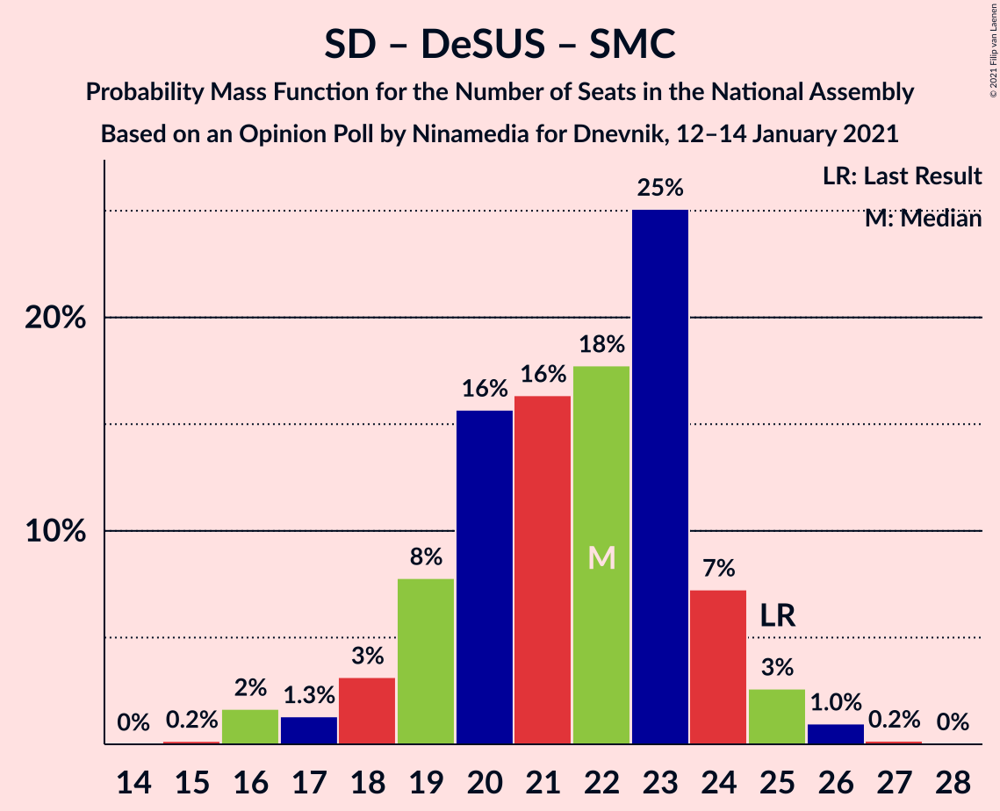

| Number of Seats | Probability | Accumulated | Special Marks |
|:---------------:|:-----------:|:-----------:|:-------------:|
| 15 | 0.2% | 100% |  |
| 16 | 2% | 99.8% |  |
| 17 | 1.3% | 98% |  |
| 18 | 3% | 97% |  |
| 19 | 8% | 94% |  |
| 20 | 16% | 86% |  |
| 21 | 16% | 70% |  |
| 22 | 18% | 54% | Median |
| 23 | 25% | 36% |  |
| 24 | 7% | 11% |  |
| 25 | 3% | 4% | Last Result |
| 26 | 1.0% | 1.2% |  |
| 27 | 0.2% | 0.2% |  |
| 28 | 0% | 0% |  |

## Technical Information

### Opinion Poll

+ **Polling firm:** Ninamedia
+ **Commissioner(s):** Dnevnik
+ **Fieldwork period:** 12–14 January 2021

### Calculations

+ **Sample size:** 700
+ **Simulations done:** 1,048,576
+ **Error estimate:** 2.19%

