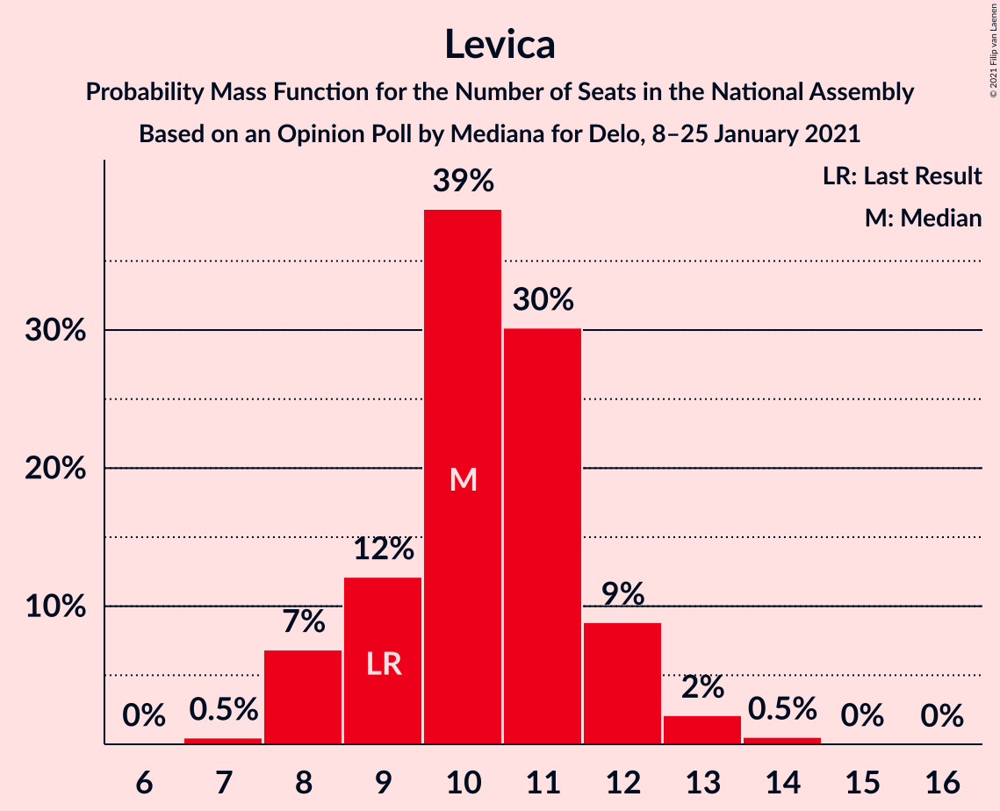
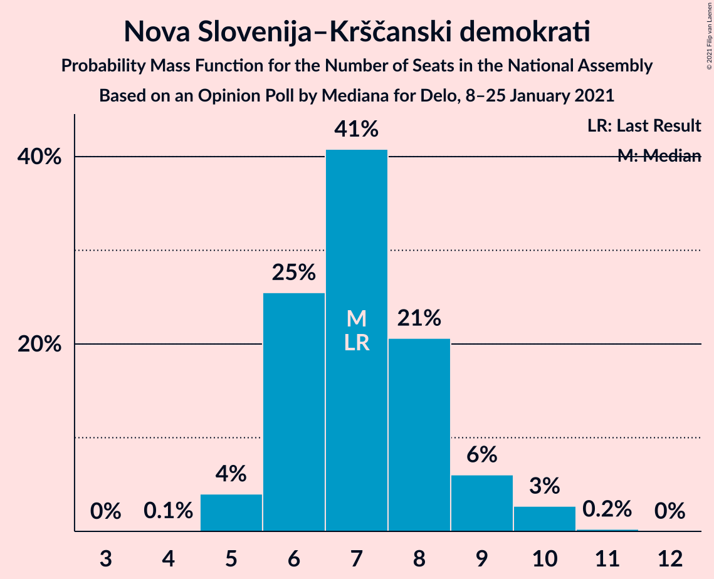
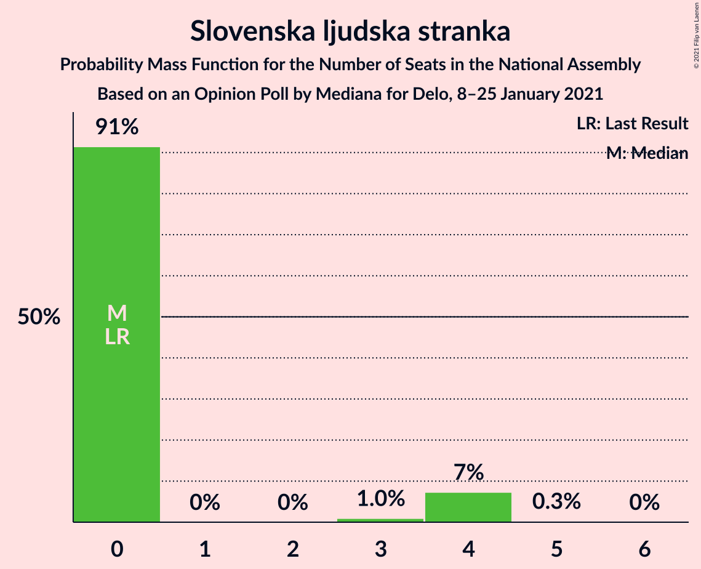
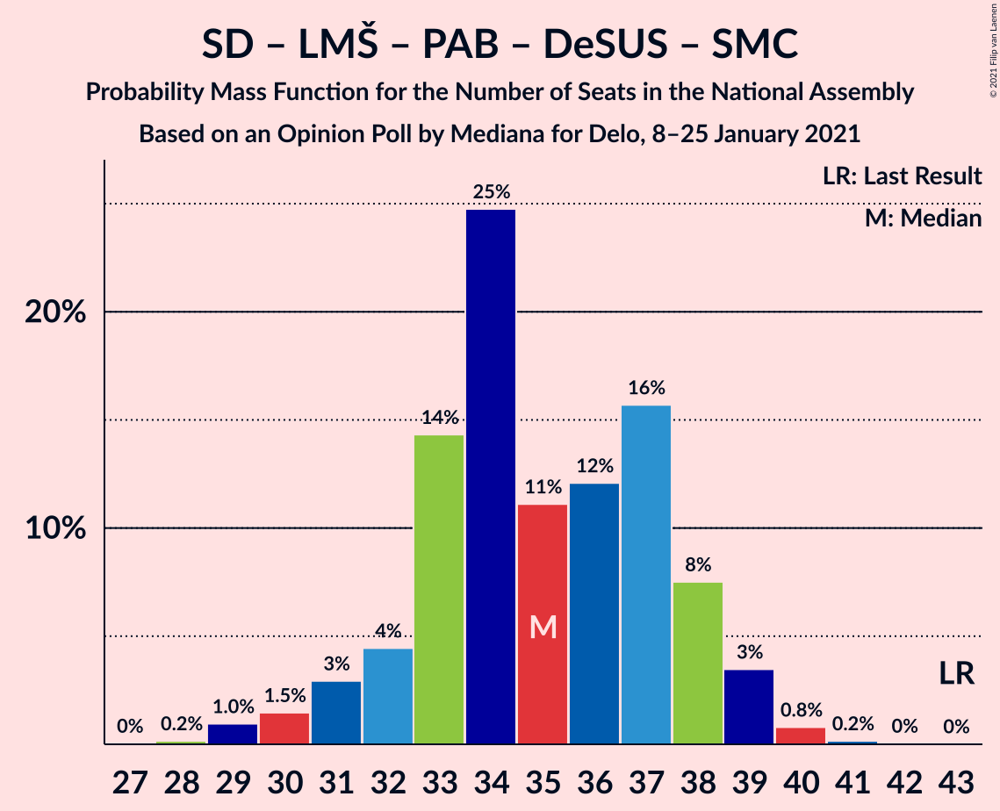
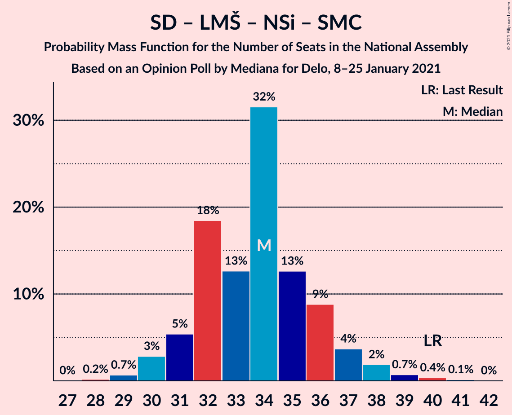
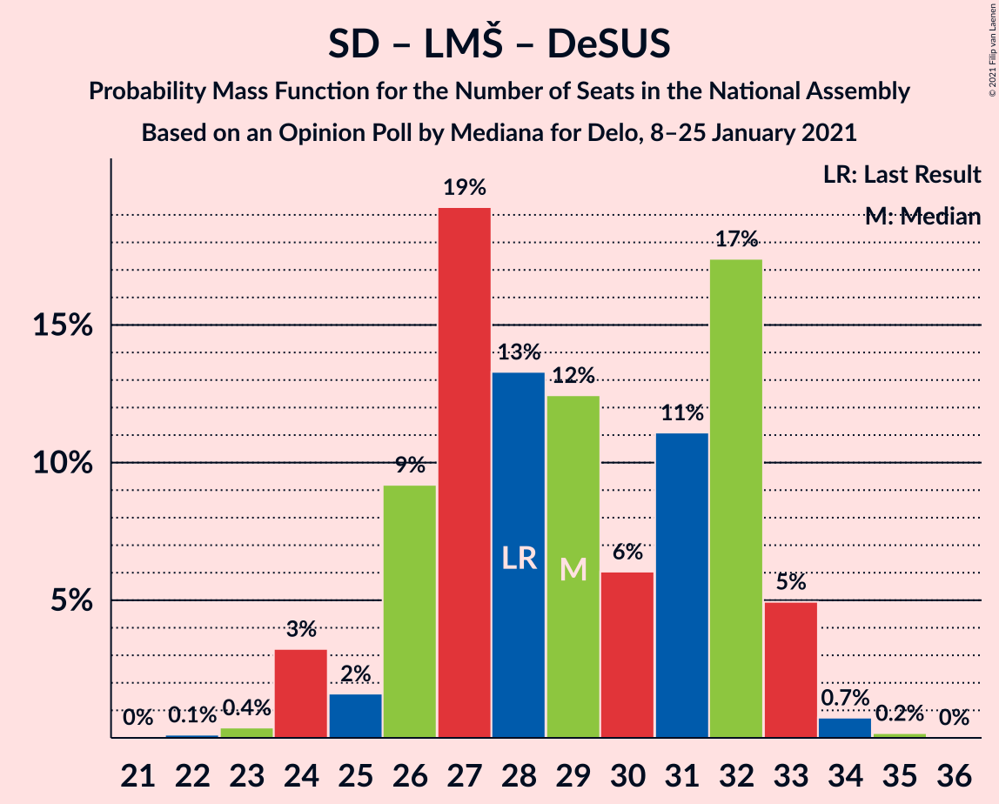
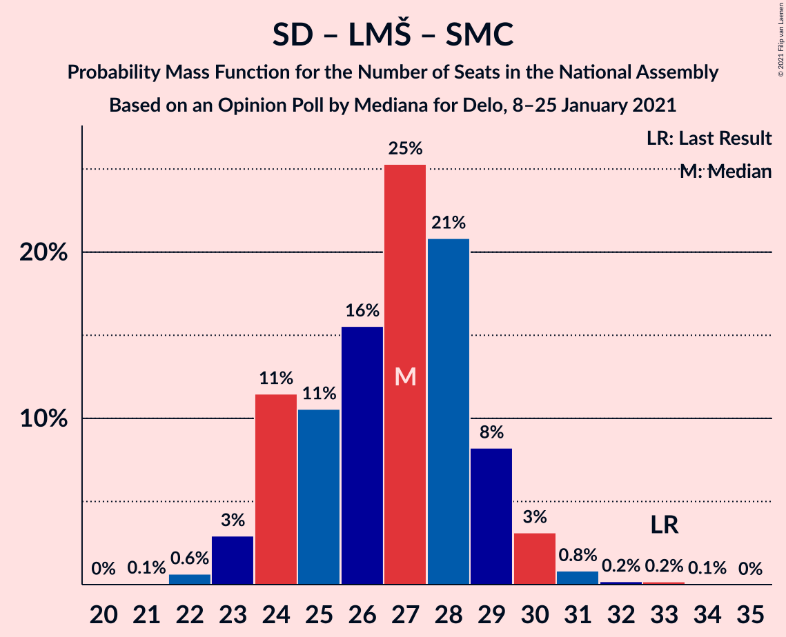

# Opinion Poll by Mediana for Delo, 8–25 January 2021

<a href="#voting-intentions">Voting Intentions</a> | <a href="#seats">Seats</a> | <a href="#coalitions">Coalitions</a> | <a href="#technical-information">Technical Information</a>

## Voting Intentions

### Confidence Intervals

| Party | Last Result | Poll Result | 80% Confidence Interval | 90% Confidence Interval | 95% Confidence Interval | 99% Confidence Interval |
|:-----:|:-----------:|:-----------:|:-----------------------:|:-----------------------:|:-----------------------:|:-----------------------:|
| Slovenska demokratska stranka | 24.9% | 26.1% | 24.0–28.3% |23.5–28.9% |23.0–29.4% |22.0–30.5% |
| Socialni demokrati | 9.9% | 13.9% | 12.4–15.7% |11.9–16.2% |11.6–16.7% |10.9–17.6% |
| Lista Marjana Šarca | 12.6% | 13.7% | 12.1–15.4% |11.7–15.9% |11.3–16.4% |10.6–17.3% |
| Levica | 9.3% | 10.7% | 9.3–12.3% |9.0–12.8% |8.6–13.2% |8.0–14.0% |
| Nova Slovenija–Krščanski demokrati | 7.2% | 7.7% | 6.6–9.2% |6.3–9.6% |6.0–10.0% |5.5–10.7% |
| Stranka Alenke Bratušek | 5.1% | 6.3% | 5.3–7.7% |5.0–8.0% |4.8–8.4% |4.3–9.1% |
| Demokratična stranka upokojencev Slovenije | 4.9% | 3.9% | 3.2–5.1% |2.9–5.4% |2.7–5.7% |2.4–6.2% |
| Slovenska nacionalna stranka | 4.2% | 3.7% | 2.9–4.7% |2.7–5.0% |2.5–5.3% |2.2–5.9% |
| Slovenska ljudska stranka | 2.6% | 3.0% | 2.3–3.9% |2.1–4.2% |1.9–4.5% |1.7–5.0% |
| Stranka modernega centra | 9.7% | 2.3% | 1.7–3.2% |1.5–3.4% |1.4–3.6% |1.2–4.1% |

*Note:* The poll result column reflects the actual value used in the calculations. Published results may vary slightly, and in addition be rounded to fewer digits.

## Seats

### Confidence Intervals

| Party | Last Result | Median | 80% Confidence Interval | 90% Confidence Interval | 95% Confidence Interval | 99% Confidence Interval |
|:-----:|:-----------:|:------:|:-----------------------:|:-----------------------:|:-----------------------:|:-----------------------:|
| <a href="#slovenska-demokratska-stranka">Slovenska demokratska stranka</a> | 25 | 25 | 23–27 |23–27 |22–28 |21–30 |
| <a href="#socialni-demokrati">Socialni demokrati</a> | 10 | 14 | 12–15 |11–16 |10–16 |10–17 |
| <a href="#lista-marjana-šarca">Lista Marjana Šarca</a> | 13 | 13 | 11–14 |11–15 |11–15 |10–17 |
| <a href="#levica">Levica</a> | 9 | 10 | 9–11 |8–12 |8–12 |7–13 |
| <a href="#nova-slovenija–krščanski-demokrati">Nova Slovenija–Krščanski demokrati</a> | 7 | 7 | 6–8 |6–9 |6–9 |5–10 |
| <a href="#stranka-alenke-bratušek">Stranka Alenke Bratušek</a> | 5 | 5 | 5–7 |5–7 |5–8 |4–8 |
| <a href="#demokratična-stranka-upokojencev-slovenije">Demokratična stranka upokojencev Slovenije</a> | 5 | 4 | 0–5 |0–5 |0–5 |0–5 |
| <a href="#slovenska-nacionalna-stranka">Slovenska nacionalna stranka</a> | 4 | 0 | 0–4 |0–5 |0–5 |0–6 |
| <a href="#slovenska-ljudska-stranka">Slovenska ljudska stranka</a> | 0 | 0 | 0 |0 |0–4 |0–4 |
| <a href="#stranka-modernega-centra">Stranka modernega centra</a> | 10 | 0 | 0 |0 |0 |0–4 |

### Slovenska demokratska stranka

*For a full overview of the results for this party, see the [Slovenska demokratska stranka](party-slovenskademokratskastranka.html) page.*

| Number of Seats | Probability | Accumulated | Special Marks |
|:---------------:|:-----------:|:-----------:|:-------------:|
| 19 | 0.1% | 100% |  |
| 20 | 0.4% | 99.9% |  |
| 21 | 0.6% | 99.5% |  |
| 22 | 3% | 98.9% |  |
| 23 | 21% | 95% |  |
| 24 | 20% | 74% |  |
| 25 | 22% | 54% | Last Result, Median |
| 26 | 11% | 33% |  |
| 27 | 17% | 21% |  |
| 28 | 2% | 4% |  |
| 29 | 2% | 2% |  |
| 30 | 0.8% | 0.8% |  |
| 31 | 0.1% | 0.1% |  |
| 32 | 0% | 0% |  |

### Socialni demokrati

*For a full overview of the results for this party, see the [Socialni demokrati](party-socialnidemokrati.html) page.*

| Number of Seats | Probability | Accumulated | Special Marks |
|:---------------:|:-----------:|:-----------:|:-------------:|
| 10 | 3% | 100% | Last Result |
| 11 | 4% | 97% |  |
| 12 | 21% | 93% |  |
| 13 | 6% | 72% |  |
| 14 | 25% | 66% | Median |
| 15 | 35% | 41% |  |
| 16 | 5% | 6% |  |
| 17 | 2% | 2% |  |
| 18 | 0% | 0% |  |

### Lista Marjana Šarca

*For a full overview of the results for this party, see the [Lista Marjana Šarca](party-listamarjanašarca.html) page.*

| Number of Seats | Probability | Accumulated | Special Marks |
|:---------------:|:-----------:|:-----------:|:-------------:|
| 9 | 0.1% | 100% |  |
| 10 | 0.8% | 99.9% |  |
| 11 | 26% | 99.1% |  |
| 12 | 7% | 73% |  |
| 13 | 22% | 65% | Last Result, Median |
| 14 | 39% | 44% |  |
| 15 | 3% | 5% |  |
| 16 | 2% | 2% |  |
| 17 | 0.5% | 0.5% |  |
| 18 | 0% | 0.1% |  |
| 19 | 0% | 0% |  |

### Levica

*For a full overview of the results for this party, see the [Levica](party-levica.html) page.*

| Number of Seats | Probability | Accumulated | Special Marks |
|:---------------:|:-----------:|:-----------:|:-------------:|
| 6 | 0.1% | 100% |  |
| 7 | 1.2% | 99.9% |  |
| 8 | 5% | 98.7% |  |
| 9 | 18% | 94% | Last Result |
| 10 | 43% | 76% | Median |
| 11 | 25% | 33% |  |
| 12 | 6% | 8% |  |
| 13 | 2% | 2% |  |
| 14 | 0.4% | 0.4% |  |
| 15 | 0.1% | 0.1% |  |
| 16 | 0% | 0% |  |

### Nova Slovenija–Krščanski demokrati

*For a full overview of the results for this party, see the [Nova Slovenija–Krščanski demokrati](party-novaslovenija–krščanskidemokrati.html) page.*

| Number of Seats | Probability | Accumulated | Special Marks |
|:---------------:|:-----------:|:-----------:|:-------------:|
| 5 | 2% | 100% |  |
| 6 | 33% | 98% |  |
| 7 | 40% | 65% | Last Result, Median |
| 8 | 16% | 25% |  |
| 9 | 8% | 9% |  |
| 10 | 1.3% | 2% |  |
| 11 | 0.4% | 0.4% |  |
| 12 | 0% | 0% |  |

### Stranka Alenke Bratušek

*For a full overview of the results for this party, see the [Stranka Alenke Bratušek](party-strankaalenkebratušek.html) page.*

| Number of Seats | Probability | Accumulated | Special Marks |
|:---------------:|:-----------:|:-----------:|:-------------:|
| 4 | 0.7% | 100% |  |
| 5 | 62% | 99.3% | Last Result, Median |
| 6 | 24% | 37% |  |
| 7 | 11% | 13% |  |
| 8 | 2% | 3% |  |
| 9 | 0.2% | 0.2% |  |
| 10 | 0% | 0% |  |

### Demokratična stranka upokojencev Slovenije

*For a full overview of the results for this party, see the [Demokratična stranka upokojencev Slovenije](party-demokratičnastrankaupokojencevslovenije.html) page.*

| Number of Seats | Probability | Accumulated | Special Marks |
|:---------------:|:-----------:|:-----------:|:-------------:|
| 0 | 11% | 100% |  |
| 1 | 0% | 89% |  |
| 2 | 0% | 89% |  |
| 3 | 1.0% | 89% |  |
| 4 | 72% | 88% | Median |
| 5 | 16% | 16% | Last Result |
| 6 | 0.2% | 0.2% |  |
| 7 | 0% | 0% |  |

### Slovenska nacionalna stranka

*For a full overview of the results for this party, see the [Slovenska nacionalna stranka](party-slovenskanacionalnastranka.html) page.*

| Number of Seats | Probability | Accumulated | Special Marks |
|:---------------:|:-----------:|:-----------:|:-------------:|
| 0 | 65% | 100% | Median |
| 1 | 0% | 35% |  |
| 2 | 0% | 35% |  |
| 3 | 0.5% | 35% |  |
| 4 | 25% | 34% | Last Result |
| 5 | 8% | 9% |  |
| 6 | 1.0% | 1.0% |  |
| 7 | 0% | 0% |  |

### Slovenska ljudska stranka

*For a full overview of the results for this party, see the [Slovenska ljudska stranka](party-slovenskaljudskastranka.html) page.*

| Number of Seats | Probability | Accumulated | Special Marks |
|:---------------:|:-----------:|:-----------:|:-------------:|
| 0 | 97% | 100% | Last Result, Median |
| 1 | 0% | 3% |  |
| 2 | 0% | 3% |  |
| 3 | 0.1% | 3% |  |
| 4 | 3% | 3% |  |
| 5 | 0.1% | 0.1% |  |
| 6 | 0% | 0% |  |

### Stranka modernega centra

*For a full overview of the results for this party, see the [Stranka modernega centra](party-strankamodernegacentra.html) page.*

| Number of Seats | Probability | Accumulated | Special Marks |
|:---------------:|:-----------:|:-----------:|:-------------:|
| 0 | 98.8% | 100% | Median |
| 1 | 0% | 1.2% |  |
| 2 | 0% | 1.2% |  |
| 3 | 0% | 1.2% |  |
| 4 | 1.1% | 1.2% |  |
| 5 | 0% | 0% |  |
| 6 | 0% | 0% |  |
| 7 | 0% | 0% |  |
| 8 | 0% | 0% |  |
| 9 | 0% | 0% |  |
| 10 | 0% | 0% | Last Result |

## Coalitions

### Confidence Intervals

| Coalition | Last Result | Median | Majority? | 80% Confidence Interval | 90% Confidence Interval | 95% Confidence Interval | 99% Confidence Interval |
|:---------:|:-----------:|:------:|:---------:|:-----------------------:|:-----------------------:|:-----------------------:|:-----------------------:|
| Socialni demokrati – Lista Marjana Šarca – Nova Slovenija–Krščanski demokrati – Stranka Alenke Bratušek – Demokratična stranka upokojencev Slovenije – Stranka modernega centra | 50 | 44 | 4% | 40–45 | 40–45 | 39–46 | 37–48 |
| Slovenska demokratska stranka – Lista Marjana Šarca – Demokratična stranka upokojencev Slovenije | 43 | 42 | 8% | 38–44 | 38–46 | 37–46 | 36–47 |
| Slovenska demokratska stranka – Lista Marjana Šarca | 38 | 38 | 0.1% | 34–41 | 34–41 | 34–43 | 34–44 |
| Socialni demokrati – Lista Marjana Šarca – Nova Slovenija–Krščanski demokrati – Demokratična stranka upokojencev Slovenije | 35 | 37 | 0% | 35–40 | 34–40 | 34–40 | 30–42 |
| Socialni demokrati – Lista Marjana Šarca – Nova Slovenija–Krščanski demokrati – Demokratična stranka upokojencev Slovenije – Stranka modernega centra | 45 | 37 | 0% | 35–40 | 34–40 | 34–40 | 30–42 |
| Socialni demokrati – Lista Marjana Šarca – Stranka Alenke Bratušek – Demokratična stranka upokojencev Slovenije – Stranka modernega centra | 43 | 37 | 0% | 33–38 | 33–38 | 32–38 | 30–40 |
| Socialni demokrati – Lista Marjana Šarca – Nova Slovenija–Krščanski demokrati | 30 | 34 | 0% | 31–36 | 30–36 | 30–38 | 30–40 |
| Socialni demokrati – Lista Marjana Šarca – Nova Slovenija–Krščanski demokrati – Stranka modernega centra | 40 | 34 | 0% | 31–36 | 30–37 | 30–38 | 30–40 |
| Socialni demokrati – Lista Marjana Šarca – Demokratična stranka upokojencev Slovenije | 28 | 30 | 0% | 27–33 | 27–33 | 27–33 | 23–34 |
| Socialni demokrati – Lista Marjana Šarca – Demokratična stranka upokojencev Slovenije – Stranka modernega centra | 38 | 31 | 0% | 27–33 | 27–33 | 27–33 | 23–34 |
| Socialni demokrati – Lista Marjana Šarca | 23 | 26 | 0% | 24–29 | 23–29 | 23–30 | 22–31 |
| Socialni demokrati – Lista Marjana Šarca – Stranka modernega centra | 33 | 27 | 0% | 24–29 | 23–29 | 23–30 | 22–31 |
| Socialni demokrati – Demokratična stranka upokojencev Slovenije – Stranka modernega centra | 25 | 18 | 0% | 15–19 | 14–19 | 13–20 | 10–20 |

### Socialni demokrati – Lista Marjana Šarca – Nova Slovenija–Krščanski demokrati – Stranka Alenke Bratušek – Demokratična stranka upokojencev Slovenije – Stranka modernega centra

| Number of Seats | Probability | Accumulated | Special Marks |
|:---------------:|:-----------:|:-----------:|:-------------:|
| 36 | 0.1% | 100% |  |
| 37 | 0.6% | 99.9% |  |
| 38 | 0.5% | 99.3% |  |
| 39 | 3% | 98.8% |  |
| 40 | 6% | 95% |  |
| 41 | 23% | 90% |  |
| 42 | 4% | 67% |  |
| 43 | 10% | 63% | Median |
| 44 | 35% | 52% |  |
| 45 | 14% | 18% |  |
| 46 | 1.4% | 4% | Majority |
| 47 | 0.7% | 2% |  |
| 48 | 2% | 2% |  |
| 49 | 0% | 0% |  |
| 50 | 0% | 0% | Last Result |

### Slovenska demokratska stranka – Lista Marjana Šarca – Demokratična stranka upokojencev Slovenije

| Number of Seats | Probability | Accumulated | Special Marks |
|:---------------:|:-----------:|:-----------:|:-------------:|
| 34 | 0% | 100% |  |
| 35 | 0.4% | 99.9% |  |
| 36 | 1.1% | 99.6% |  |
| 37 | 2% | 98% |  |
| 38 | 14% | 97% |  |
| 39 | 16% | 83% |  |
| 40 | 4% | 67% |  |
| 41 | 7% | 63% |  |
| 42 | 13% | 55% | Median |
| 43 | 23% | 42% | Last Result |
| 44 | 11% | 20% |  |
| 45 | 0.5% | 8% |  |
| 46 | 7% | 8% | Majority |
| 47 | 0.8% | 1.2% |  |
| 48 | 0% | 0.4% |  |
| 49 | 0.3% | 0.3% |  |
| 50 | 0% | 0% |  |

### Slovenska demokratska stranka – Lista Marjana Šarca

| Number of Seats | Probability | Accumulated | Special Marks |
|:---------------:|:-----------:|:-----------:|:-------------:|
| 33 | 0.4% | 100% |  |
| 34 | 15% | 99.6% |  |
| 35 | 13% | 84% |  |
| 36 | 2% | 71% |  |
| 37 | 8% | 69% |  |
| 38 | 14% | 61% | Last Result, Median |
| 39 | 27% | 47% |  |
| 40 | 8% | 20% |  |
| 41 | 8% | 12% |  |
| 42 | 0.8% | 4% |  |
| 43 | 2% | 3% |  |
| 44 | 0.9% | 1.4% |  |
| 45 | 0.4% | 0.5% |  |
| 46 | 0% | 0.1% | Majority |
| 47 | 0.1% | 0.1% |  |
| 48 | 0% | 0% |  |

### Socialni demokrati – Lista Marjana Šarca – Nova Slovenija–Krščanski demokrati – Demokratična stranka upokojencev Slovenije

| Number of Seats | Probability | Accumulated | Special Marks |
|:---------------:|:-----------:|:-----------:|:-------------:|
| 29 | 0% | 100% |  |
| 30 | 0.6% | 99.9% |  |
| 31 | 0.2% | 99.4% |  |
| 32 | 0.2% | 99.2% |  |
| 33 | 0.9% | 99.0% |  |
| 34 | 7% | 98% |  |
| 35 | 12% | 92% | Last Result |
| 36 | 18% | 79% |  |
| 37 | 14% | 61% |  |
| 38 | 5% | 47% | Median |
| 39 | 27% | 42% |  |
| 40 | 13% | 15% |  |
| 41 | 0.4% | 2% |  |
| 42 | 1.4% | 1.4% |  |
| 43 | 0% | 0% |  |

### Socialni demokrati – Lista Marjana Šarca – Nova Slovenija–Krščanski demokrati – Demokratična stranka upokojencev Slovenije – Stranka modernega centra

| Number of Seats | Probability | Accumulated | Special Marks |
|:---------------:|:-----------:|:-----------:|:-------------:|
| 30 | 0.6% | 100% |  |
| 31 | 0.1% | 99.4% |  |
| 32 | 0.2% | 99.2% |  |
| 33 | 0.8% | 99.0% |  |
| 34 | 6% | 98% |  |
| 35 | 12% | 92% |  |
| 36 | 18% | 80% |  |
| 37 | 14% | 62% |  |
| 38 | 6% | 48% | Median |
| 39 | 27% | 42% |  |
| 40 | 13% | 15% |  |
| 41 | 0.4% | 2% |  |
| 42 | 1.4% | 1.4% |  |
| 43 | 0% | 0% |  |
| 44 | 0% | 0% |  |
| 45 | 0% | 0% | Last Result |

### Socialni demokrati – Lista Marjana Šarca – Stranka Alenke Bratušek – Demokratična stranka upokojencev Slovenije – Stranka modernega centra

| Number of Seats | Probability | Accumulated | Special Marks |
|:---------------:|:-----------:|:-----------:|:-------------:|
| 28 | 0.1% | 100% |  |
| 29 | 0.3% | 99.9% |  |
| 30 | 0.3% | 99.5% |  |
| 31 | 0.4% | 99.2% |  |
| 32 | 2% | 98.8% |  |
| 33 | 11% | 97% |  |
| 34 | 20% | 86% |  |
| 35 | 9% | 66% |  |
| 36 | 3% | 57% | Median |
| 37 | 21% | 53% |  |
| 38 | 30% | 32% |  |
| 39 | 1.0% | 2% |  |
| 40 | 0.7% | 1.2% |  |
| 41 | 0.4% | 0.5% |  |
| 42 | 0% | 0% |  |
| 43 | 0% | 0% | Last Result |

### Socialni demokrati – Lista Marjana Šarca – Nova Slovenija–Krščanski demokrati

| Number of Seats | Probability | Accumulated | Special Marks |
|:---------------:|:-----------:|:-----------:|:-------------:|
| 28 | 0.1% | 100% |  |
| 29 | 0.2% | 99.9% |  |
| 30 | 5% | 99.7% | Last Result |
| 31 | 11% | 95% |  |
| 32 | 27% | 84% |  |
| 33 | 5% | 57% |  |
| 34 | 6% | 53% | Median |
| 35 | 28% | 47% |  |
| 36 | 15% | 19% |  |
| 37 | 0.8% | 4% |  |
| 38 | 2% | 3% |  |
| 39 | 0.3% | 1.2% |  |
| 40 | 0.8% | 0.9% |  |
| 41 | 0% | 0% |  |

### Socialni demokrati – Lista Marjana Šarca – Nova Slovenija–Krščanski demokrati – Stranka modernega centra

| Number of Seats | Probability | Accumulated | Special Marks |
|:---------------:|:-----------:|:-----------:|:-------------:|
| 28 | 0.1% | 100% |  |
| 29 | 0.2% | 99.9% |  |
| 30 | 5% | 99.7% |  |
| 31 | 10% | 95% |  |
| 32 | 27% | 84% |  |
| 33 | 4% | 58% |  |
| 34 | 5% | 53% | Median |
| 35 | 28% | 48% |  |
| 36 | 15% | 20% |  |
| 37 | 0.9% | 5% |  |
| 38 | 3% | 4% |  |
| 39 | 0.4% | 1.2% |  |
| 40 | 0.9% | 0.9% | Last Result |
| 41 | 0% | 0% |  |

### Socialni demokrati – Lista Marjana Šarca – Demokratična stranka upokojencev Slovenije

| Number of Seats | Probability | Accumulated | Special Marks |
|:---------------:|:-----------:|:-----------:|:-------------:|
| 21 | 0.1% | 100% |  |
| 22 | 0.3% | 99.9% |  |
| 23 | 0.3% | 99.6% |  |
| 24 | 0.1% | 99.3% |  |
| 25 | 0.3% | 99.2% |  |
| 26 | 0.8% | 98.8% |  |
| 27 | 10% | 98% |  |
| 28 | 8% | 88% | Last Result |
| 29 | 22% | 80% |  |
| 30 | 8% | 57% |  |
| 31 | 11% | 49% | Median |
| 32 | 10% | 38% |  |
| 33 | 27% | 28% |  |
| 34 | 0.3% | 0.8% |  |
| 35 | 0.5% | 0.5% |  |
| 36 | 0% | 0% |  |

### Socialni demokrati – Lista Marjana Šarca – Demokratična stranka upokojencev Slovenije – Stranka modernega centra

| Number of Seats | Probability | Accumulated | Special Marks |
|:---------------:|:-----------:|:-----------:|:-------------:|
| 21 | 0.1% | 100% |  |
| 22 | 0.3% | 99.9% |  |
| 23 | 0.3% | 99.6% |  |
| 24 | 0.1% | 99.3% |  |
| 25 | 0.3% | 99.2% |  |
| 26 | 0.7% | 98.9% |  |
| 27 | 10% | 98% |  |
| 28 | 8% | 89% |  |
| 29 | 22% | 81% |  |
| 30 | 8% | 58% |  |
| 31 | 12% | 50% | Median |
| 32 | 10% | 38% |  |
| 33 | 27% | 28% |  |
| 34 | 0.3% | 0.8% |  |
| 35 | 0.5% | 0.5% |  |
| 36 | 0% | 0% |  |
| 37 | 0% | 0% |  |
| 38 | 0% | 0% | Last Result |

### Socialni demokrati – Lista Marjana Šarca

| Number of Seats | Probability | Accumulated | Special Marks |
|:---------------:|:-----------:|:-----------:|:-------------:|
| 21 | 0.1% | 100% |  |
| 22 | 0.6% | 99.9% |  |
| 23 | 7% | 99.3% | Last Result |
| 24 | 5% | 92% |  |
| 25 | 28% | 87% |  |
| 26 | 8% | 58% |  |
| 27 | 5% | 50% | Median |
| 28 | 14% | 45% |  |
| 29 | 28% | 31% |  |
| 30 | 2% | 3% |  |
| 31 | 1.1% | 1.2% |  |
| 32 | 0% | 0.1% |  |
| 33 | 0% | 0% |  |

### Socialni demokrati – Lista Marjana Šarca – Stranka modernega centra

| Number of Seats | Probability | Accumulated | Special Marks |
|:---------------:|:-----------:|:-----------:|:-------------:|
| 21 | 0.1% | 100% |  |
| 22 | 0.5% | 99.9% |  |
| 23 | 7% | 99.3% |  |
| 24 | 5% | 92% |  |
| 25 | 28% | 87% |  |
| 26 | 8% | 59% |  |
| 27 | 5% | 50% | Median |
| 28 | 14% | 46% |  |
| 29 | 28% | 32% |  |
| 30 | 2% | 4% |  |
| 31 | 2% | 2% |  |
| 32 | 0.1% | 0.1% |  |
| 33 | 0% | 0% | Last Result |

### Socialni demokrati – Demokratična stranka upokojencev Slovenije – Stranka modernega centra

| Number of Seats | Probability | Accumulated | Special Marks |
|:---------------:|:-----------:|:-----------:|:-------------:|
| 10 | 0.6% | 100% |  |
| 11 | 0.2% | 99.4% |  |
| 12 | 0.6% | 99.2% |  |
| 13 | 1.5% | 98.6% |  |
| 14 | 6% | 97% |  |
| 15 | 6% | 92% |  |
| 16 | 10% | 86% |  |
| 17 | 17% | 76% |  |
| 18 | 20% | 59% | Median |
| 19 | 34% | 39% |  |
| 20 | 4% | 5% |  |
| 21 | 0.4% | 0.4% |  |
| 22 | 0% | 0% |  |
| 23 | 0% | 0% |  |
| 24 | 0% | 0% |  |
| 25 | 0% | 0% | Last Result |

## Technical Information

### Opinion Poll

+ **Polling firm:** Mediana
+ **Commissioner(s):** Delo
+ **Fieldwork period:** 8–25 January 2021

### Calculations

+ **Sample size:** 710
+ **Simulations done:** 131,072
+ **Error estimate:** 2.65%

