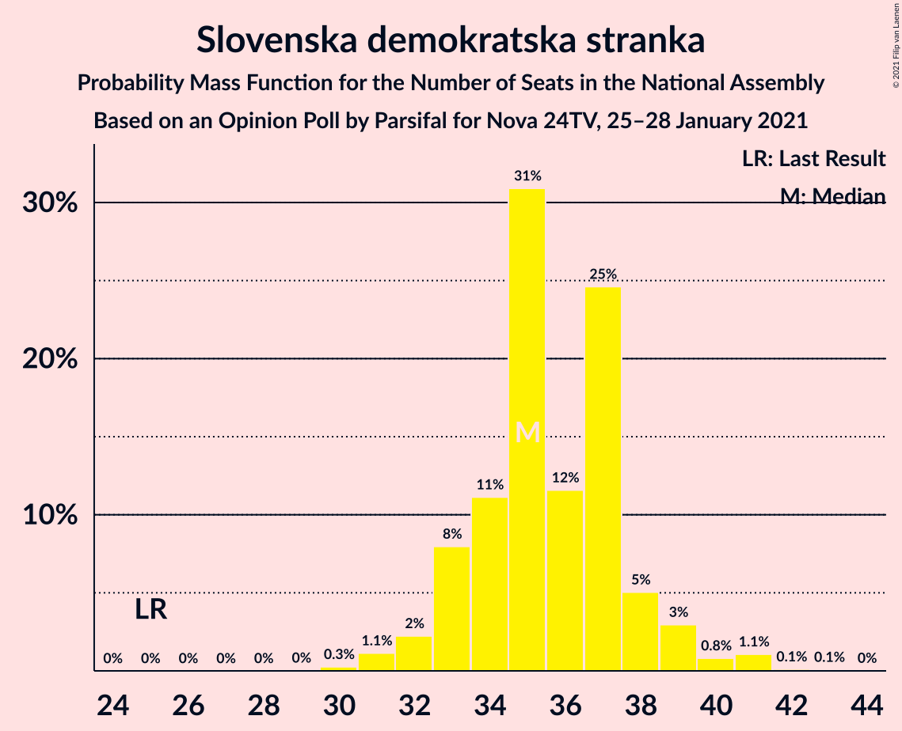
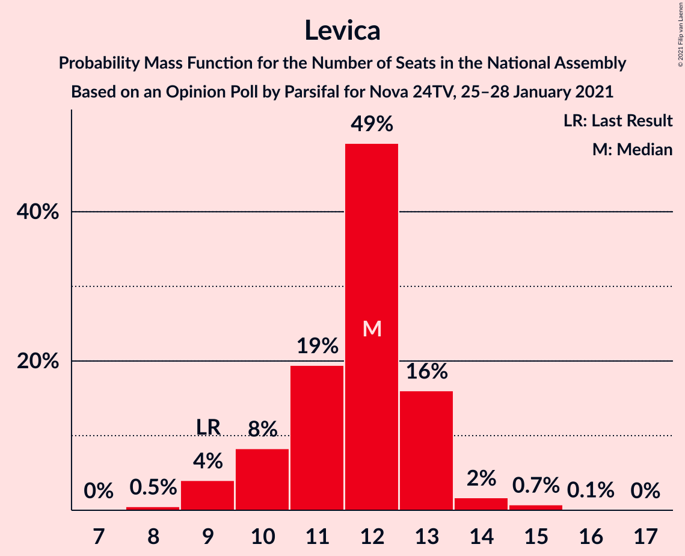
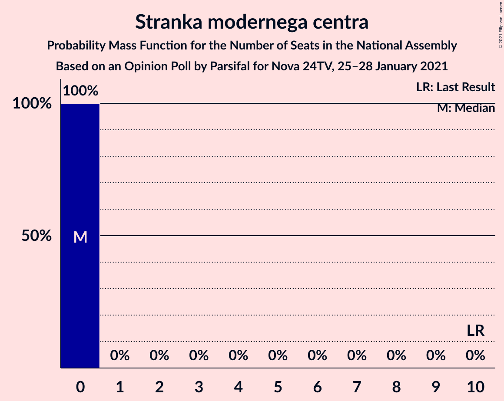
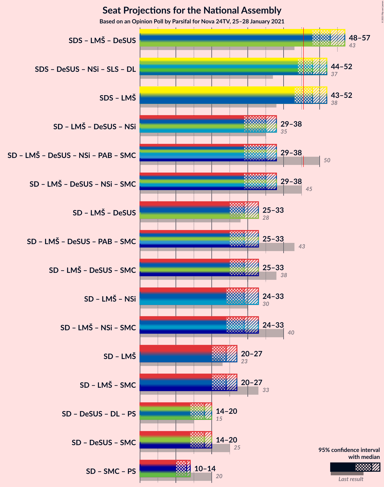
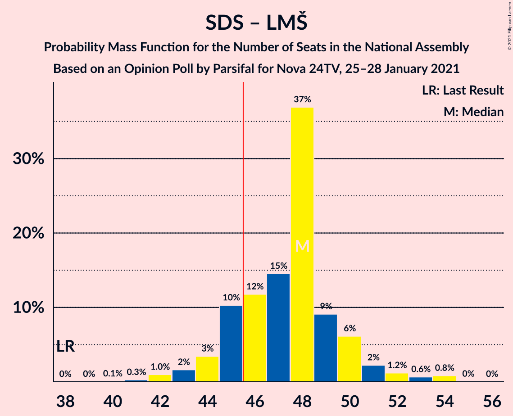
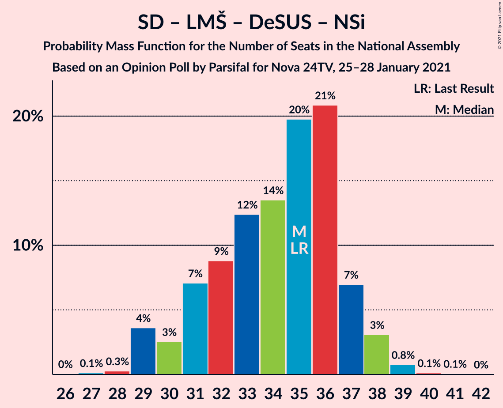
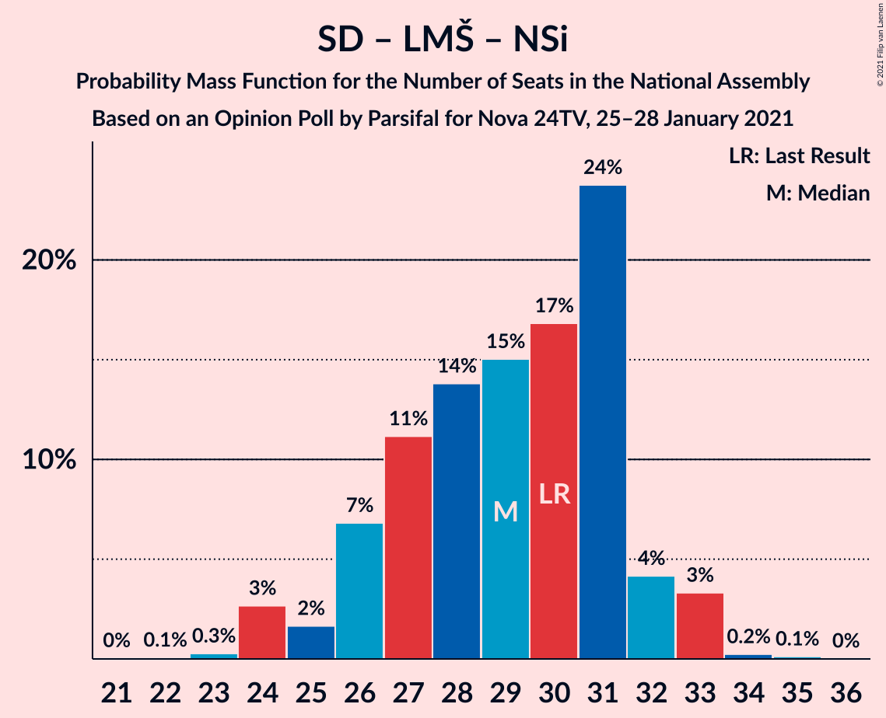
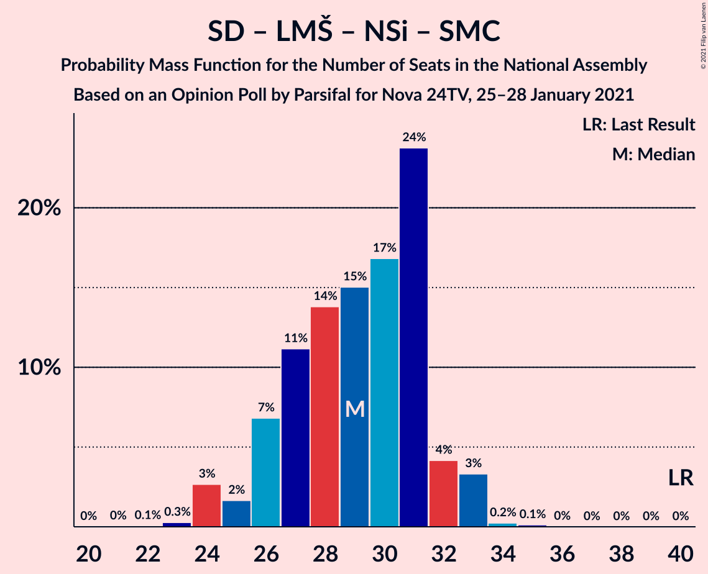
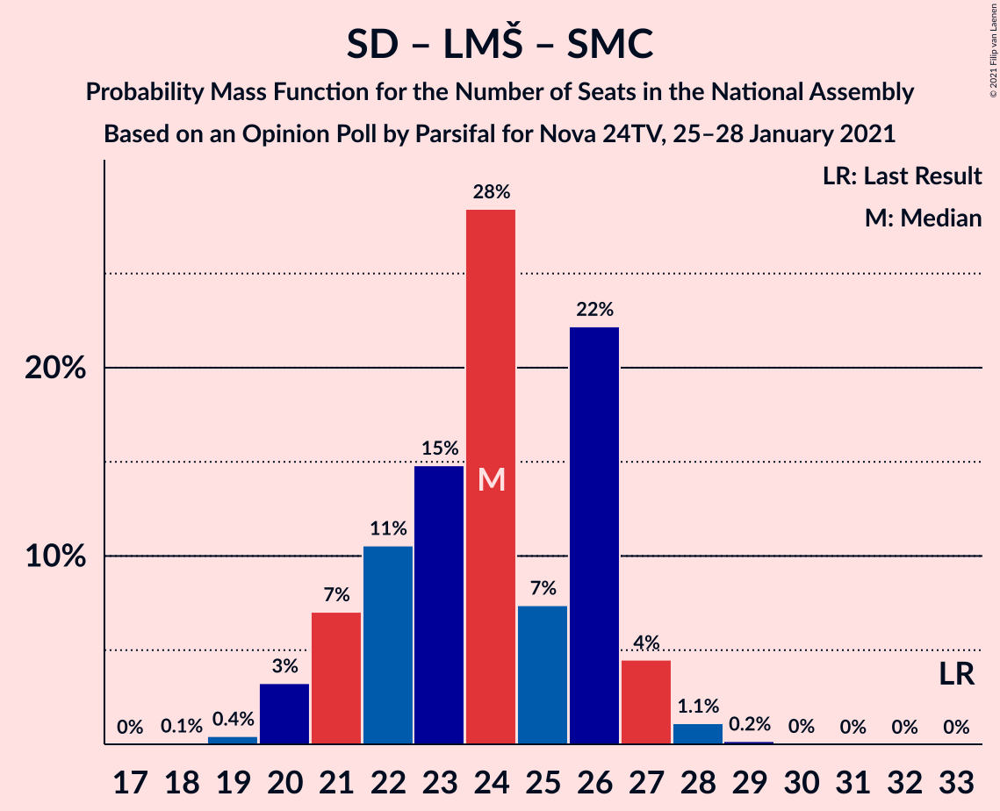

# Opinion Poll by Parsifal for Nova 24TV, 25–28 January 2021

<a href="#voting-intentions">Voting Intentions</a> | <a href="#seats">Seats</a> | <a href="#coalitions">Coalitions</a> | <a href="#technical-information">Technical Information</a>

## Voting Intentions

### Confidence Intervals

| Party | Last Result | Poll Result | 80% Confidence Interval | 90% Confidence Interval | 95% Confidence Interval | 99% Confidence Interval |
|:-----:|:-----------:|:-----------:|:-----------------------:|:-----------------------:|:-----------------------:|:-----------------------:|
| Slovenska demokratska stranka | 24.9% | 36.6% | 34.4–38.9% |33.7–39.6% |33.2–40.2% |32.1–41.3% |
| Socialni demokrati | 9.9% | 12.6% | 11.1–14.3% |10.7–14.8% |10.4–15.2% |9.7–16.0% |
| Lista Marjana Šarca | 12.6% | 12.0% | 10.6–13.7% |10.2–14.2% |9.9–14.6% |9.2–15.4% |
| Levica | 9.3% | 12.0% | 10.6–13.7% |10.2–14.2% |9.9–14.6% |9.2–15.4% |
| Nova Slovenija–Krščanski demokrati | 7.2% | 5.6% | 4.6–6.8% |4.4–7.2% |4.2–7.5% |3.7–8.2% |
| Demokratična stranka upokojencev Slovenije | 4.9% | 5.6% | 4.6–6.8% |4.4–7.2% |4.2–7.5% |3.7–8.2% |
| Slovenska ljudska stranka | 2.6% | 4.0% | 3.2–5.1% |3.0–5.4% |2.8–5.6% |2.4–6.2% |
| Stranka Alenke Bratušek | 5.1% | 2.9% | 2.2–3.8% |2.0–4.1% |1.9–4.4% |1.6–4.9% |
| Slovenska nacionalna stranka | 4.2% | 2.3% | 1.8–3.2% |1.6–3.5% |1.4–3.7% |1.2–4.2% |
| Stranka modernega centra | 9.7% | 1.1% | 0.7–1.8% |0.6–2.0% |0.5–2.1% |0.4–2.5% |

*Note:* The poll result column reflects the actual value used in the calculations. Published results may vary slightly, and in addition be rounded to fewer digits.

## Seats

### Confidence Intervals

| Party | Last Result | Median | 80% Confidence Interval | 90% Confidence Interval | 95% Confidence Interval | 99% Confidence Interval |
|:-----:|:-----------:|:------:|:-----------------------:|:-----------------------:|:-----------------------:|:-----------------------:|
| <a href="#slovenska-demokratska-stranka">Slovenska demokratska stranka</a> | 25 | 35 | 33–38 |32–39 |32–39 |31–42 |
| <a href="#socialni-demokrati">Socialni demokrati</a> | 10 | 11 | 11–14 |10–14 |9–14 |9–15 |
| <a href="#lista-marjana-šarca">Lista Marjana Šarca</a> | 13 | 13 | 10–14 |10–14 |9–14 |9–15 |
| <a href="#levica">Levica</a> | 9 | 11 | 11–13 |10–15 |9–15 |8–15 |
| <a href="#nova-slovenija–krščanski-demokrati">Nova Slovenija–Krščanski demokrati</a> | 7 | 5 | 4–7 |0–7 |0–7 |0–8 |
| <a href="#demokratična-stranka-upokojencev-slovenije">Demokratična stranka upokojencev Slovenije</a> | 5 | 6 | 4–6 |4–7 |4–7 |0–7 |
| <a href="#slovenska-ljudska-stranka">Slovenska ljudska stranka</a> | 0 | 4 | 0–5 |0–5 |0–5 |0–6 |
| <a href="#stranka-alenke-bratušek">Stranka Alenke Bratušek</a> | 5 | 0 | 0 |0–3 |0–4 |0–4 |
| <a href="#slovenska-nacionalna-stranka">Slovenska nacionalna stranka</a> | 4 | 0 | 0 |0 |0 |0 |
| <a href="#stranka-modernega-centra">Stranka modernega centra</a> | 10 | 0 | 0 |0 |0 |0 |

### Slovenska demokratska stranka

*For a full overview of the results for this party, see the [Slovenska demokratska stranka](party-slovenskademokratskastranka.html) page.*

| Number of Seats | Probability | Accumulated | Special Marks |
|:---------------:|:-----------:|:-----------:|:-------------:|
| 25 | 0% | 100% | Last Result |
| 26 | 0% | 100% |  |
| 27 | 0% | 100% |  |
| 28 | 0% | 100% |  |
| 29 | 0% | 100% |  |
| 30 | 0.4% | 100% |  |
| 31 | 1.5% | 99.6% |  |
| 32 | 3% | 98% |  |
| 33 | 31% | 95% |  |
| 34 | 5% | 63% |  |
| 35 | 20% | 58% | Median |
| 36 | 18% | 38% |  |
| 37 | 8% | 20% |  |
| 38 | 4% | 12% |  |
| 39 | 6% | 8% |  |
| 40 | 1.1% | 2% |  |
| 41 | 0.4% | 1.0% |  |
| 42 | 0.2% | 0.6% |  |
| 43 | 0.4% | 0.4% |  |
| 44 | 0% | 0% |  |

### Socialni demokrati

*For a full overview of the results for this party, see the [Socialni demokrati](party-socialnidemokrati.html) page.*

| Number of Seats | Probability | Accumulated | Special Marks |
|:---------------:|:-----------:|:-----------:|:-------------:|
| 8 | 0.1% | 100% |  |
| 9 | 4% | 99.9% |  |
| 10 | 5% | 96% | Last Result |
| 11 | 46% | 91% | Median |
| 12 | 10% | 44% |  |
| 13 | 20% | 35% |  |
| 14 | 13% | 14% |  |
| 15 | 1.2% | 1.5% |  |
| 16 | 0.2% | 0.3% |  |
| 17 | 0.1% | 0.1% |  |
| 18 | 0% | 0% |  |

### Lista Marjana Šarca

*For a full overview of the results for this party, see the [Lista Marjana Šarca](party-listamarjanašarca.html) page.*

| Number of Seats | Probability | Accumulated | Special Marks |
|:---------------:|:-----------:|:-----------:|:-------------:|
| 8 | 0.3% | 100% |  |
| 9 | 3% | 99.7% |  |
| 10 | 9% | 96% |  |
| 11 | 26% | 87% |  |
| 12 | 8% | 61% |  |
| 13 | 41% | 52% | Last Result, Median |
| 14 | 11% | 11% |  |
| 15 | 0.7% | 0.8% |  |
| 16 | 0.1% | 0.1% |  |
| 17 | 0% | 0% |  |

### Levica

*For a full overview of the results for this party, see the [Levica](party-levica.html) page.*

| Number of Seats | Probability | Accumulated | Special Marks |
|:---------------:|:-----------:|:-----------:|:-------------:|
| 8 | 0.8% | 100% |  |
| 9 | 2% | 99.1% | Last Result |
| 10 | 6% | 97% |  |
| 11 | 58% | 91% | Median |
| 12 | 22% | 32% |  |
| 13 | 5% | 11% |  |
| 14 | 1.1% | 6% |  |
| 15 | 5% | 5% |  |
| 16 | 0.1% | 0.1% |  |
| 17 | 0% | 0% |  |

### Nova Slovenija–Krščanski demokrati

*For a full overview of the results for this party, see the [Nova Slovenija–Krščanski demokrati](party-novaslovenija–krščanskidemokrati.html) page.*

| Number of Seats | Probability | Accumulated | Special Marks |
|:---------------:|:-----------:|:-----------:|:-------------:|
| 0 | 6% | 100% |  |
| 1 | 0% | 94% |  |
| 2 | 0% | 94% |  |
| 3 | 0.1% | 94% |  |
| 4 | 22% | 93% |  |
| 5 | 46% | 72% | Median |
| 6 | 13% | 26% |  |
| 7 | 12% | 13% | Last Result |
| 8 | 0.6% | 0.6% |  |
| 9 | 0% | 0% |  |

### Demokratična stranka upokojencev Slovenije

*For a full overview of the results for this party, see the [Demokratična stranka upokojencev Slovenije](party-demokratičnastrankaupokojencevslovenije.html) page.*

| Number of Seats | Probability | Accumulated | Special Marks |
|:---------------:|:-----------:|:-----------:|:-------------:|
| 0 | 1.1% | 100% |  |
| 1 | 0% | 98.9% |  |
| 2 | 0% | 98.9% |  |
| 3 | 0.1% | 98.9% |  |
| 4 | 18% | 98.8% |  |
| 5 | 27% | 81% | Last Result |
| 6 | 49% | 54% | Median |
| 7 | 5% | 5% |  |
| 8 | 0.5% | 0.5% |  |
| 9 | 0% | 0% |  |

### Slovenska ljudska stranka

*For a full overview of the results for this party, see the [Slovenska ljudska stranka](party-slovenskaljudskastranka.html) page.*

| Number of Seats | Probability | Accumulated | Special Marks |
|:---------------:|:-----------:|:-----------:|:-------------:|
| 0 | 40% | 100% | Last Result |
| 1 | 0% | 60% |  |
| 2 | 0% | 60% |  |
| 3 | 3% | 60% |  |
| 4 | 22% | 57% | Median |
| 5 | 34% | 35% |  |
| 6 | 1.3% | 1.3% |  |
| 7 | 0% | 0% |  |

### Stranka Alenke Bratušek

*For a full overview of the results for this party, see the [Stranka Alenke Bratušek](party-strankaalenkebratušek.html) page.*

| Number of Seats | Probability | Accumulated | Special Marks |
|:---------------:|:-----------:|:-----------:|:-------------:|
| 0 | 93% | 100% | Median |
| 1 | 0% | 7% |  |
| 2 | 0% | 7% |  |
| 3 | 3% | 7% |  |
| 4 | 4% | 4% |  |
| 5 | 0.3% | 0.3% | Last Result |
| 6 | 0% | 0% |  |

### Slovenska nacionalna stranka

*For a full overview of the results for this party, see the [Slovenska nacionalna stranka](party-slovenskanacionalnastranka.html) page.*

| Number of Seats | Probability | Accumulated | Special Marks |
|:---------------:|:-----------:|:-----------:|:-------------:|
| 0 | 99.6% | 100% | Median |
| 1 | 0% | 0.4% |  |
| 2 | 0% | 0.4% |  |
| 3 | 0.1% | 0.4% |  |
| 4 | 0.3% | 0.4% | Last Result |
| 5 | 0% | 0% |  |

### Stranka modernega centra

*For a full overview of the results for this party, see the [Stranka modernega centra](party-strankamodernegacentra.html) page.*

| Number of Seats | Probability | Accumulated | Special Marks |
|:---------------:|:-----------:|:-----------:|:-------------:|
| 0 | 100% | 100% | Median |
| 1 | 0% | 0% |  |
| 2 | 0% | 0% |  |
| 3 | 0% | 0% |  |
| 4 | 0% | 0% |  |
| 5 | 0% | 0% |  |
| 6 | 0% | 0% |  |
| 7 | 0% | 0% |  |
| 8 | 0% | 0% |  |
| 9 | 0% | 0% |  |
| 10 | 0% | 0% | Last Result |

## Coalitions

### Confidence Intervals

| Coalition | Last Result | Median | Majority? | 80% Confidence Interval | 90% Confidence Interval | 95% Confidence Interval | 99% Confidence Interval |
|:---------:|:-----------:|:------:|:---------:|:-----------------------:|:-----------------------:|:-----------------------:|:-----------------------:|
| Slovenska demokratska stranka – Lista Marjana Šarca – Demokratična stranka upokojencev Slovenije | 43 | 52 | 99.9% | 50–55 | 49–58 | 47–58 | 47–59 |
| Slovenska demokratska stranka – Lista Marjana Šarca | 38 | 46 | 83% | 45–50 | 43–53 | 42–53 | 42–54 |
| Socialni demokrati – Lista Marjana Šarca – Demokratična stranka upokojencev Slovenije – Nova Slovenija–Krščanski demokrati – Stranka Alenke Bratušek – Stranka modernega centra | 50 | 35 | 0% | 32–37 | 31–37 | 30–37 | 28–39 |
| Socialni demokrati – Lista Marjana Šarca – Demokratična stranka upokojencev Slovenije – Nova Slovenija–Krščanski demokrati | 35 | 35 | 0% | 31–37 | 30–37 | 29–37 | 28–39 |
| Socialni demokrati – Lista Marjana Šarca – Demokratična stranka upokojencev Slovenije – Nova Slovenija–Krščanski demokrati – Stranka modernega centra | 45 | 35 | 0% | 31–37 | 30–37 | 29–37 | 28–39 |
| Socialni demokrati – Lista Marjana Šarca – Demokratična stranka upokojencev Slovenije | 28 | 30 | 0% | 27–33 | 25–33 | 25–33 | 24–33 |
| Socialni demokrati – Lista Marjana Šarca – Demokratična stranka upokojencev Slovenije – Stranka Alenke Bratušek – Stranka modernega centra | 43 | 30 | 0% | 27–33 | 27–33 | 25–33 | 24–34 |
| Socialni demokrati – Lista Marjana Šarca – Demokratična stranka upokojencev Slovenije – Stranka modernega centra | 38 | 30 | 0% | 27–33 | 25–33 | 25–33 | 24–33 |
| Socialni demokrati – Lista Marjana Šarca – Nova Slovenija–Krščanski demokrati | 30 | 29 | 0% | 26–31 | 25–32 | 25–33 | 23–33 |
| Socialni demokrati – Lista Marjana Šarca – Nova Slovenija–Krščanski demokrati – Stranka modernega centra | 40 | 29 | 0% | 26–31 | 25–32 | 25–33 | 23–33 |
| Socialni demokrati – Lista Marjana Šarca | 23 | 24 | 0% | 21–27 | 20–27 | 20–28 | 20–28 |
| Socialni demokrati – Lista Marjana Šarca – Stranka modernega centra | 33 | 24 | 0% | 21–27 | 20–27 | 20–28 | 20–28 |
| Socialni demokrati – Demokratična stranka upokojencev Slovenije – Stranka modernega centra | 25 | 17 | 0% | 15–20 | 14–20 | 13–20 | 12–21 |

### Slovenska demokratska stranka – Lista Marjana Šarca – Demokratična stranka upokojencev Slovenije

| Number of Seats | Probability | Accumulated | Special Marks |
|:---------------:|:-----------:|:-----------:|:-------------:|
| 43 | 0% | 100% | Last Result |
| 44 | 0% | 100% |  |
| 45 | 0% | 100% |  |
| 46 | 0.2% | 99.9% | Majority |
| 47 | 3% | 99.7% |  |
| 48 | 1.2% | 97% |  |
| 49 | 5% | 96% |  |
| 50 | 6% | 91% |  |
| 51 | 6% | 84% |  |
| 52 | 39% | 78% |  |
| 53 | 13% | 38% |  |
| 54 | 12% | 25% | Median |
| 55 | 6% | 13% |  |
| 56 | 1.3% | 7% |  |
| 57 | 0.3% | 6% |  |
| 58 | 4% | 5% |  |
| 59 | 0.7% | 1.1% |  |
| 60 | 0.4% | 0.4% |  |
| 61 | 0% | 0% |  |

### Slovenska demokratska stranka – Lista Marjana Šarca

| Number of Seats | Probability | Accumulated | Special Marks |
|:---------------:|:-----------:|:-----------:|:-------------:|
| 38 | 0% | 100% | Last Result |
| 39 | 0% | 100% |  |
| 40 | 0.1% | 100% |  |
| 41 | 0.1% | 99.9% |  |
| 42 | 3% | 99.8% |  |
| 43 | 3% | 97% |  |
| 44 | 4% | 94% |  |
| 45 | 7% | 90% |  |
| 46 | 36% | 83% | Majority |
| 47 | 12% | 48% |  |
| 48 | 12% | 36% | Median |
| 49 | 13% | 24% |  |
| 50 | 3% | 12% |  |
| 51 | 2% | 8% |  |
| 52 | 0.4% | 6% |  |
| 53 | 5% | 5% |  |
| 54 | 0.8% | 0.8% |  |
| 55 | 0% | 0% |  |

### Socialni demokrati – Lista Marjana Šarca – Demokratična stranka upokojencev Slovenije – Nova Slovenija–Krščanski demokrati – Stranka Alenke Bratušek – Stranka modernega centra

| Number of Seats | Probability | Accumulated | Special Marks |
|:---------------:|:-----------:|:-----------:|:-------------:|
| 26 | 0.1% | 100% |  |
| 27 | 0.1% | 99.8% |  |
| 28 | 1.2% | 99.8% |  |
| 29 | 1.0% | 98.6% |  |
| 30 | 2% | 98% |  |
| 31 | 3% | 96% |  |
| 32 | 9% | 93% |  |
| 33 | 17% | 83% |  |
| 34 | 7% | 66% |  |
| 35 | 38% | 59% | Median |
| 36 | 4% | 21% |  |
| 37 | 16% | 18% |  |
| 38 | 1.0% | 2% |  |
| 39 | 0.6% | 0.9% |  |
| 40 | 0.2% | 0.3% |  |
| 41 | 0.1% | 0.1% |  |
| 42 | 0% | 0% |  |
| 43 | 0% | 0% |  |
| 44 | 0% | 0% |  |
| 45 | 0% | 0% |  |
| 46 | 0% | 0% | Majority |
| 47 | 0% | 0% |  |
| 48 | 0% | 0% |  |
| 49 | 0% | 0% |  |
| 50 | 0% | 0% | Last Result |

### Socialni demokrati – Lista Marjana Šarca – Demokratična stranka upokojencev Slovenije – Nova Slovenija–Krščanski demokrati

| Number of Seats | Probability | Accumulated | Special Marks |
|:---------------:|:-----------:|:-----------:|:-------------:|
| 26 | 0.1% | 100% |  |
| 27 | 0.1% | 99.8% |  |
| 28 | 1.3% | 99.7% |  |
| 29 | 1.1% | 98% |  |
| 30 | 4% | 97% |  |
| 31 | 4% | 93% |  |
| 32 | 11% | 90% |  |
| 33 | 18% | 79% |  |
| 34 | 5% | 61% |  |
| 35 | 36% | 55% | Last Result, Median |
| 36 | 2% | 19% |  |
| 37 | 16% | 17% |  |
| 38 | 0.6% | 1.3% |  |
| 39 | 0.5% | 0.7% |  |
| 40 | 0.2% | 0.2% |  |
| 41 | 0% | 0% |  |

### Socialni demokrati – Lista Marjana Šarca – Demokratična stranka upokojencev Slovenije – Nova Slovenija–Krščanski demokrati – Stranka modernega centra

| Number of Seats | Probability | Accumulated | Special Marks |
|:---------------:|:-----------:|:-----------:|:-------------:|
| 26 | 0.1% | 100% |  |
| 27 | 0.1% | 99.8% |  |
| 28 | 1.3% | 99.7% |  |
| 29 | 1.1% | 98% |  |
| 30 | 4% | 97% |  |
| 31 | 4% | 93% |  |
| 32 | 11% | 90% |  |
| 33 | 18% | 79% |  |
| 34 | 5% | 61% |  |
| 35 | 36% | 55% | Median |
| 36 | 2% | 19% |  |
| 37 | 16% | 17% |  |
| 38 | 0.6% | 1.3% |  |
| 39 | 0.5% | 0.7% |  |
| 40 | 0.2% | 0.2% |  |
| 41 | 0% | 0% |  |
| 42 | 0% | 0% |  |
| 43 | 0% | 0% |  |
| 44 | 0% | 0% |  |
| 45 | 0% | 0% | Last Result |

### Socialni demokrati – Lista Marjana Šarca – Demokratična stranka upokojencev Slovenije

| Number of Seats | Probability | Accumulated | Special Marks |
|:---------------:|:-----------:|:-----------:|:-------------:|
| 22 | 0.1% | 100% |  |
| 23 | 0.3% | 99.9% |  |
| 24 | 2% | 99.6% |  |
| 25 | 4% | 98% |  |
| 26 | 1.5% | 94% |  |
| 27 | 10% | 92% |  |
| 28 | 25% | 82% | Last Result |
| 29 | 3% | 58% |  |
| 30 | 32% | 55% | Median |
| 31 | 8% | 23% |  |
| 32 | 5% | 15% |  |
| 33 | 10% | 10% |  |
| 34 | 0.3% | 0.4% |  |
| 35 | 0.1% | 0.1% |  |
| 36 | 0% | 0% |  |

### Socialni demokrati – Lista Marjana Šarca – Demokratična stranka upokojencev Slovenije – Stranka Alenke Bratušek – Stranka modernega centra

| Number of Seats | Probability | Accumulated | Special Marks |
|:---------------:|:-----------:|:-----------:|:-------------:|
| 22 | 0.1% | 100% |  |
| 23 | 0.3% | 99.9% |  |
| 24 | 2% | 99.7% |  |
| 25 | 1.2% | 98% |  |
| 26 | 1.1% | 97% |  |
| 27 | 9% | 95% |  |
| 28 | 24% | 86% |  |
| 29 | 4% | 62% |  |
| 30 | 33% | 58% | Median |
| 31 | 8% | 25% |  |
| 32 | 6% | 17% |  |
| 33 | 10% | 10% |  |
| 34 | 0.3% | 0.7% |  |
| 35 | 0.1% | 0.4% |  |
| 36 | 0.1% | 0.3% |  |
| 37 | 0.2% | 0.2% |  |
| 38 | 0% | 0% |  |
| 39 | 0% | 0% |  |
| 40 | 0% | 0% |  |
| 41 | 0% | 0% |  |
| 42 | 0% | 0% |  |
| 43 | 0% | 0% | Last Result |

### Socialni demokrati – Lista Marjana Šarca – Demokratična stranka upokojencev Slovenije – Stranka modernega centra

| Number of Seats | Probability | Accumulated | Special Marks |
|:---------------:|:-----------:|:-----------:|:-------------:|
| 22 | 0.1% | 100% |  |
| 23 | 0.3% | 99.9% |  |
| 24 | 2% | 99.6% |  |
| 25 | 4% | 98% |  |
| 26 | 1.5% | 94% |  |
| 27 | 10% | 92% |  |
| 28 | 25% | 82% |  |
| 29 | 3% | 58% |  |
| 30 | 32% | 55% | Median |
| 31 | 8% | 23% |  |
| 32 | 5% | 15% |  |
| 33 | 10% | 10% |  |
| 34 | 0.3% | 0.4% |  |
| 35 | 0.1% | 0.1% |  |
| 36 | 0% | 0% |  |
| 37 | 0% | 0% |  |
| 38 | 0% | 0% | Last Result |

### Socialni demokrati – Lista Marjana Šarca – Nova Slovenija–Krščanski demokrati

| Number of Seats | Probability | Accumulated | Special Marks |
|:---------------:|:-----------:|:-----------:|:-------------:|
| 22 | 0.1% | 100% |  |
| 23 | 1.2% | 99.8% |  |
| 24 | 0.5% | 98.6% |  |
| 25 | 4% | 98% |  |
| 26 | 8% | 95% |  |
| 27 | 15% | 87% |  |
| 28 | 15% | 71% |  |
| 29 | 26% | 56% | Median |
| 30 | 5% | 30% | Last Result |
| 31 | 18% | 26% |  |
| 32 | 4% | 8% |  |
| 33 | 4% | 4% |  |
| 34 | 0.3% | 0.3% |  |
| 35 | 0% | 0.1% |  |
| 36 | 0% | 0% |  |

### Socialni demokrati – Lista Marjana Šarca – Nova Slovenija–Krščanski demokrati – Stranka modernega centra

| Number of Seats | Probability | Accumulated | Special Marks |
|:---------------:|:-----------:|:-----------:|:-------------:|
| 22 | 0.1% | 100% |  |
| 23 | 1.2% | 99.8% |  |
| 24 | 0.5% | 98.6% |  |
| 25 | 4% | 98% |  |
| 26 | 8% | 95% |  |
| 27 | 15% | 87% |  |
| 28 | 15% | 71% |  |
| 29 | 26% | 56% | Median |
| 30 | 5% | 30% |  |
| 31 | 18% | 26% |  |
| 32 | 4% | 8% |  |
| 33 | 4% | 4% |  |
| 34 | 0.3% | 0.3% |  |
| 35 | 0% | 0.1% |  |
| 36 | 0% | 0% |  |
| 37 | 0% | 0% |  |
| 38 | 0% | 0% |  |
| 39 | 0% | 0% |  |
| 40 | 0% | 0% | Last Result |

### Socialni demokrati – Lista Marjana Šarca

| Number of Seats | Probability | Accumulated | Special Marks |
|:---------------:|:-----------:|:-----------:|:-------------:|
| 18 | 0% | 100% |  |
| 19 | 0.4% | 99.9% |  |
| 20 | 5% | 99.5% |  |
| 21 | 5% | 95% |  |
| 22 | 18% | 90% |  |
| 23 | 8% | 72% | Last Result |
| 24 | 39% | 65% | Median |
| 25 | 4% | 25% |  |
| 26 | 5% | 21% |  |
| 27 | 12% | 17% |  |
| 28 | 4% | 4% |  |
| 29 | 0.1% | 0.1% |  |
| 30 | 0% | 0% |  |

### Socialni demokrati – Lista Marjana Šarca – Stranka modernega centra

| Number of Seats | Probability | Accumulated | Special Marks |
|:---------------:|:-----------:|:-----------:|:-------------:|
| 18 | 0% | 100% |  |
| 19 | 0.4% | 99.9% |  |
| 20 | 5% | 99.5% |  |
| 21 | 5% | 95% |  |
| 22 | 18% | 90% |  |
| 23 | 8% | 72% |  |
| 24 | 39% | 65% | Median |
| 25 | 4% | 25% |  |
| 26 | 5% | 21% |  |
| 27 | 12% | 17% |  |
| 28 | 4% | 4% |  |
| 29 | 0.1% | 0.1% |  |
| 30 | 0% | 0% |  |
| 31 | 0% | 0% |  |
| 32 | 0% | 0% |  |
| 33 | 0% | 0% | Last Result |

### Socialni demokrati – Demokratična stranka upokojencev Slovenije – Stranka modernega centra

| Number of Seats | Probability | Accumulated | Special Marks |
|:---------------:|:-----------:|:-----------:|:-------------:|
| 11 | 0.1% | 100% |  |
| 12 | 0.6% | 99.8% |  |
| 13 | 2% | 99.2% |  |
| 14 | 3% | 97% |  |
| 15 | 9% | 95% |  |
| 16 | 11% | 86% |  |
| 17 | 41% | 74% | Median |
| 18 | 10% | 33% |  |
| 19 | 13% | 23% |  |
| 20 | 9% | 10% |  |
| 21 | 0.6% | 0.8% |  |
| 22 | 0.2% | 0.2% |  |
| 23 | 0% | 0% |  |
| 24 | 0% | 0% |  |
| 25 | 0% | 0% | Last Result |

## Technical Information

### Opinion Poll

+ **Polling firm:** Parsifal
+ **Commissioner(s):** Nova 24TV
+ **Fieldwork period:** 25–28 January 2021

### Calculations

+ **Sample size:** 732
+ **Simulations done:** 131,072
+ **Error estimate:** 1.75%

