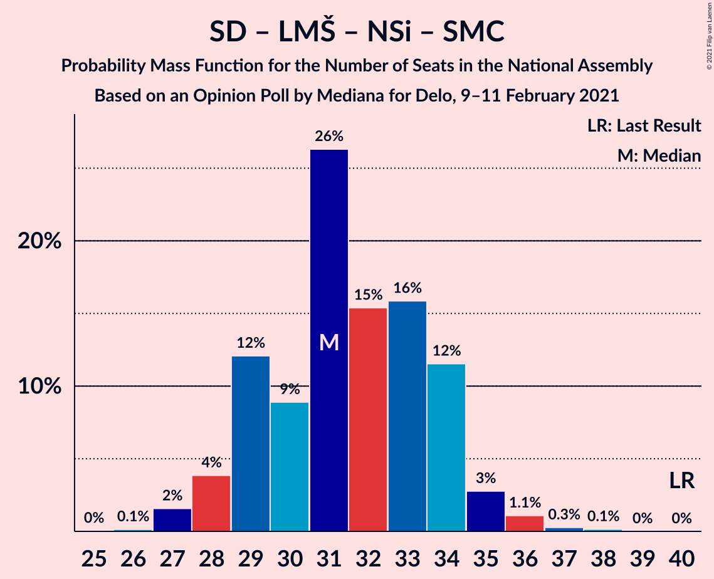
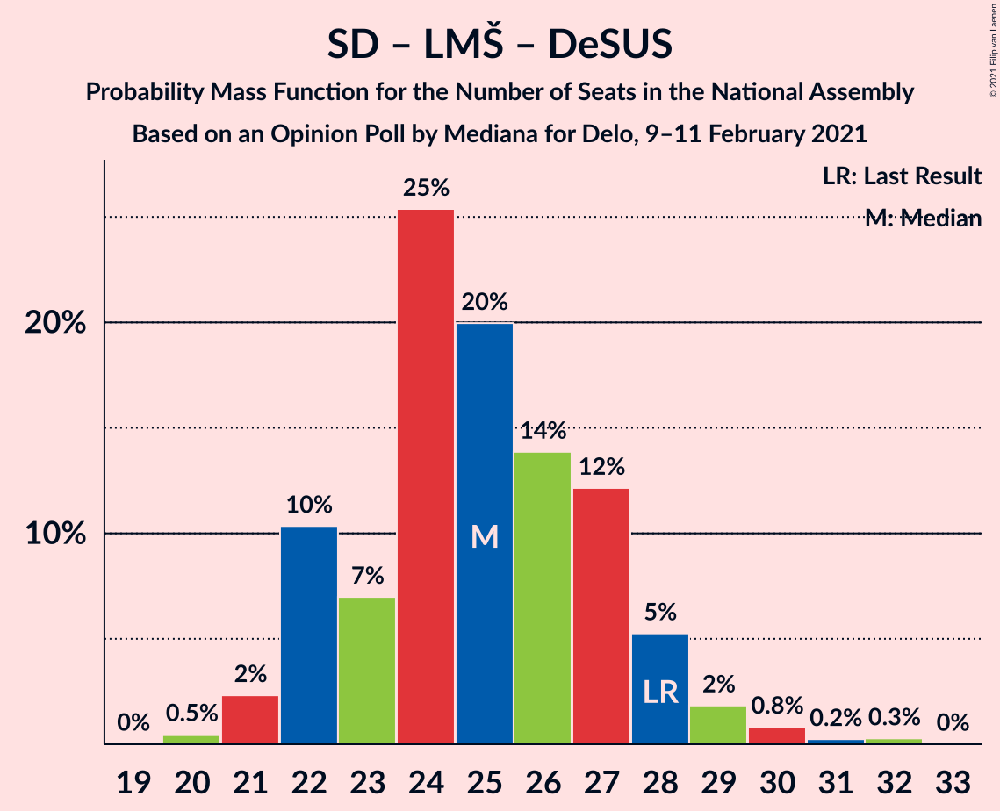

# Opinion Poll by Mediana for Delo, 9–11 February 2021

<a href="#voting-intentions">Voting Intentions</a> | <a href="#seats">Seats</a> | <a href="#coalitions">Coalitions</a> | <a href="#technical-information">Technical Information</a>

## Voting Intentions

### Confidence Intervals

| Party | Last Result | Poll Result | 80% Confidence Interval | 90% Confidence Interval | 95% Confidence Interval | 99% Confidence Interval |
|:-----:|:-----------:|:-----------:|:-----------------------:|:-----------------------:|:-----------------------:|:-----------------------:|
| Slovenska demokratska stranka | 24.9% | 26.8% | 24.8–29.0% |24.2–29.7% |23.7–30.2% |22.7–31.3% |
| Levica | 9.3% | 15.6% | 14.0–17.5% |13.5–18.0% |13.1–18.4% |12.4–19.4% |
| Socialni demokrati | 9.9% | 14.7% | 13.2–16.6% |12.7–17.1% |12.3–17.5% |11.6–18.5% |
| Lista Marjana Šarca | 12.6% | 11.1% | 9.7–12.7% |9.3–13.2% |9.0–13.6% |8.4–14.4% |
| Nova Slovenija–Krščanski demokrati | 7.2% | 7.3% | 6.2–8.7% |5.9–9.1% |5.6–9.5% |5.1–10.2% |
| Stranka Alenke Bratušek | 5.1% | 5.3% | 4.4–6.6% |4.1–6.9% |3.9–7.3% |3.5–7.9% |
| Slovenska nacionalna stranka | 4.2% | 3.7% | 2.9–4.7% |2.7–5.0% |2.5–5.3% |2.2–5.9% |
| Demokratična stranka upokojencev Slovenije | 4.9% | 3.2% | 2.5–4.3% |2.3–4.5% |2.2–4.8% |1.9–5.3% |
| Stranka modernega centra | 9.7% | 1.4% | 1.0–2.2% |0.9–2.4% |0.8–2.6% |0.6–3.0% |
| Slovenska ljudska stranka | 2.6% | 1.3% | 0.9–2.0% |0.8–2.2% |0.7–2.4% |0.5–2.8% |

*Note:* The poll result column reflects the actual value used in the calculations. Published results may vary slightly, and in addition be rounded to fewer digits.

## Seats

### Confidence Intervals

| Party | Last Result | Median | 80% Confidence Interval | 90% Confidence Interval | 95% Confidence Interval | 99% Confidence Interval |
|:-----:|:-----------:|:------:|:-----------------------:|:-----------------------:|:-----------------------:|:-----------------------:|
| <a href="#slovenska-demokratska-stranka">Slovenska demokratska stranka</a> | 25 | 26 | 24–28 |24–29 |23–30 |22–30 |
| <a href="#levica">Levica</a> | 9 | 15 | 13–17 |13–17 |13–18 |12–18 |
| <a href="#socialni-demokrati">Socialni demokrati</a> | 10 | 14 | 12–16 |12–16 |12–17 |11–18 |
| <a href="#lista-marjana-šarca">Lista Marjana Šarca</a> | 13 | 10 | 9–12 |9–12 |9–13 |8–14 |
| <a href="#nova-slovenija–krščanski-demokrati">Nova Slovenija–Krščanski demokrati</a> | 7 | 7 | 5–8 |5–8 |5–9 |5–10 |
| <a href="#stranka-alenke-bratušek">Stranka Alenke Bratušek</a> | 5 | 5 | 4–6 |4–7 |4–7 |0–7 |
| <a href="#slovenska-nacionalna-stranka">Slovenska nacionalna stranka</a> | 4 | 0 | 0–4 |0–4 |0–4 |0–5 |
| <a href="#demokratična-stranka-upokojencev-slovenije">Demokratična stranka upokojencev Slovenije</a> | 5 | 0 | 0–3 |0–4 |0–4 |0–5 |
| <a href="#stranka-modernega-centra">Stranka modernega centra</a> | 10 | 0 | 0 |0 |0 |0 |
| <a href="#slovenska-ljudska-stranka">Slovenska ljudska stranka</a> | 0 | 0 | 0 |0 |0 |0 |

### Slovenska demokratska stranka

*For a full overview of the results for this party, see the [Slovenska demokratska stranka](party-slovenskademokratskastranka.html) page.*

| Number of Seats | Probability | Accumulated | Special Marks |
|:---------------:|:-----------:|:-----------:|:-------------:|
| 20 | 0.1% | 100% |  |
| 21 | 0.4% | 99.9% |  |
| 22 | 2% | 99.5% |  |
| 23 | 3% | 98% |  |
| 24 | 8% | 95% |  |
| 25 | 21% | 88% | Last Result |
| 26 | 21% | 67% | Median |
| 27 | 27% | 46% |  |
| 28 | 11% | 19% |  |
| 29 | 5% | 8% |  |
| 30 | 2% | 3% |  |
| 31 | 0.2% | 0.4% |  |
| 32 | 0.2% | 0.2% |  |
| 33 | 0% | 0% |  |

### Levica

*For a full overview of the results for this party, see the [Levica](party-levica.html) page.*

| Number of Seats | Probability | Accumulated | Special Marks |
|:---------------:|:-----------:|:-----------:|:-------------:|
| 9 | 0% | 100% | Last Result |
| 10 | 0% | 100% |  |
| 11 | 0.4% | 100% |  |
| 12 | 2% | 99.6% |  |
| 13 | 12% | 98% |  |
| 14 | 14% | 85% |  |
| 15 | 32% | 71% | Median |
| 16 | 28% | 39% |  |
| 17 | 8% | 11% |  |
| 18 | 3% | 3% |  |
| 19 | 0.4% | 0.4% |  |
| 20 | 0.1% | 0.1% |  |
| 21 | 0% | 0% |  |

### Socialni demokrati

*For a full overview of the results for this party, see the [Socialni demokrati](party-socialnidemokrati.html) page.*

| Number of Seats | Probability | Accumulated | Special Marks |
|:---------------:|:-----------:|:-----------:|:-------------:|
| 10 | 0.2% | 100% | Last Result |
| 11 | 2% | 99.8% |  |
| 12 | 9% | 98% |  |
| 13 | 18% | 89% |  |
| 14 | 21% | 71% | Median |
| 15 | 31% | 49% |  |
| 16 | 16% | 19% |  |
| 17 | 2% | 3% |  |
| 18 | 1.0% | 1.1% |  |
| 19 | 0.1% | 0.1% |  |
| 20 | 0% | 0% |  |

### Lista Marjana Šarca

*For a full overview of the results for this party, see the [Lista Marjana Šarca](party-listamarjanašarca.html) page.*

| Number of Seats | Probability | Accumulated | Special Marks |
|:---------------:|:-----------:|:-----------:|:-------------:|
| 7 | 0.1% | 100% |  |
| 8 | 2% | 99.9% |  |
| 9 | 34% | 98% |  |
| 10 | 29% | 64% | Median |
| 11 | 20% | 35% |  |
| 12 | 10% | 15% |  |
| 13 | 4% | 5% | Last Result |
| 14 | 0.5% | 0.6% |  |
| 15 | 0% | 0.1% |  |
| 16 | 0% | 0% |  |

### Nova Slovenija–Krščanski demokrati

*For a full overview of the results for this party, see the [Nova Slovenija–Krščanski demokrati](party-novaslovenija–krščanskidemokrati.html) page.*

| Number of Seats | Probability | Accumulated | Special Marks |
|:---------------:|:-----------:|:-----------:|:-------------:|
| 4 | 0.3% | 100% |  |
| 5 | 10% | 99.7% |  |
| 6 | 13% | 90% |  |
| 7 | 47% | 77% | Last Result, Median |
| 8 | 26% | 30% |  |
| 9 | 4% | 5% |  |
| 10 | 0.9% | 1.0% |  |
| 11 | 0% | 0% |  |

### Stranka Alenke Bratušek

*For a full overview of the results for this party, see the [Stranka Alenke Bratušek](party-strankaalenkebratušek.html) page.*

| Number of Seats | Probability | Accumulated | Special Marks |
|:---------------:|:-----------:|:-----------:|:-------------:|
| 0 | 2% | 100% |  |
| 1 | 0% | 98% |  |
| 2 | 0% | 98% |  |
| 3 | 0.2% | 98% |  |
| 4 | 38% | 98% |  |
| 5 | 41% | 60% | Last Result, Median |
| 6 | 13% | 19% |  |
| 7 | 6% | 6% |  |
| 8 | 0.2% | 0.2% |  |
| 9 | 0% | 0% |  |

### Slovenska nacionalna stranka

*For a full overview of the results for this party, see the [Slovenska nacionalna stranka](party-slovenskanacionalnastranka.html) page.*

| Number of Seats | Probability | Accumulated | Special Marks |
|:---------------:|:-----------:|:-----------:|:-------------:|
| 0 | 76% | 100% | Median |
| 1 | 0% | 24% |  |
| 2 | 0% | 24% |  |
| 3 | 2% | 24% |  |
| 4 | 20% | 23% | Last Result |
| 5 | 2% | 2% |  |
| 6 | 0.1% | 0.1% |  |
| 7 | 0% | 0% |  |

### Demokratična stranka upokojencev Slovenije

*For a full overview of the results for this party, see the [Demokratična stranka upokojencev Slovenije](party-demokratičnastrankaupokojencevslovenije.html) page.*

| Number of Seats | Probability | Accumulated | Special Marks |
|:---------------:|:-----------:|:-----------:|:-------------:|
| 0 | 89% | 100% | Median |
| 1 | 0% | 11% |  |
| 2 | 0% | 11% |  |
| 3 | 3% | 11% |  |
| 4 | 7% | 8% |  |
| 5 | 0.6% | 0.6% | Last Result |
| 6 | 0% | 0% |  |

### Stranka modernega centra

*For a full overview of the results for this party, see the [Stranka modernega centra](party-strankamodernegacentra.html) page.*

| Number of Seats | Probability | Accumulated | Special Marks |
|:---------------:|:-----------:|:-----------:|:-------------:|
| 0 | 100% | 100% | Median |
| 1 | 0% | 0% |  |
| 2 | 0% | 0% |  |
| 3 | 0% | 0% |  |
| 4 | 0% | 0% |  |
| 5 | 0% | 0% |  |
| 6 | 0% | 0% |  |
| 7 | 0% | 0% |  |
| 8 | 0% | 0% |  |
| 9 | 0% | 0% |  |
| 10 | 0% | 0% | Last Result |

### Slovenska ljudska stranka

*For a full overview of the results for this party, see the [Slovenska ljudska stranka](party-slovenskaljudskastranka.html) page.*

| Number of Seats | Probability | Accumulated | Special Marks |
|:---------------:|:-----------:|:-----------:|:-------------:|
| 0 | 100% | 100% | Last Result, Median |

## Coalitions

### Confidence Intervals

| Coalition | Last Result | Median | Majority? | 80% Confidence Interval | 90% Confidence Interval | 95% Confidence Interval | 99% Confidence Interval |
|:---------:|:-----------:|:------:|:---------:|:-----------------------:|:-----------------------:|:-----------------------:|:-----------------------:|
| Slovenska demokratska stranka – Lista Marjana Šarca – Demokratična stranka upokojencev Slovenije | 43 | 36 | 0% | 34–40 | 34–41 | 34–41 | 32–43 |
| Socialni demokrati – Lista Marjana Šarca – Nova Slovenija–Krščanski demokrati – Stranka Alenke Bratušek – Demokratična stranka upokojencev Slovenije – Stranka modernega centra | 50 | 37 | 0% | 33–39 | 33–40 | 33–41 | 32–42 |
| Slovenska demokratska stranka – Lista Marjana Šarca | 38 | 36 | 0% | 34–39 | 34–40 | 33–41 | 31–41 |
| Socialni demokrati – Lista Marjana Šarca – Nova Slovenija–Krščanski demokrati – Demokratična stranka upokojencev Slovenije | 35 | 32 | 0% | 29–34 | 29–35 | 28–36 | 27–38 |
| Socialni demokrati – Lista Marjana Šarca – Nova Slovenija–Krščanski demokrati – Demokratična stranka upokojencev Slovenije – Stranka modernega centra | 45 | 32 | 0% | 29–34 | 29–35 | 28–36 | 27–38 |
| Socialni demokrati – Lista Marjana Šarca – Nova Slovenija–Krščanski demokrati | 30 | 31 | 0% | 29–34 | 28–34 | 28–35 | 27–36 |
| Socialni demokrati – Lista Marjana Šarca – Nova Slovenija–Krščanski demokrati – Stranka modernega centra | 40 | 31 | 0% | 29–34 | 28–34 | 28–35 | 27–36 |
| Socialni demokrati – Lista Marjana Šarca – Stranka Alenke Bratušek – Demokratična stranka upokojencev Slovenije – Stranka modernega centra | 43 | 29 | 0% | 27–33 | 26–33 | 26–33 | 25–35 |
| Socialni demokrati – Lista Marjana Šarca – Demokratična stranka upokojencev Slovenije | 28 | 25 | 0% | 22–27 | 22–28 | 21–29 | 21–31 |
| Socialni demokrati – Lista Marjana Šarca – Demokratična stranka upokojencev Slovenije – Stranka modernega centra | 38 | 25 | 0% | 22–27 | 22–28 | 21–29 | 21–31 |
| Socialni demokrati – Lista Marjana Šarca | 23 | 24 | 0% | 22–27 | 22–27 | 21–28 | 20–29 |
| Socialni demokrati – Lista Marjana Šarca – Stranka modernega centra | 33 | 24 | 0% | 22–27 | 22–27 | 21–28 | 20–29 |
| Socialni demokrati – Demokratična stranka upokojencev Slovenije – Stranka modernega centra | 25 | 15 | 0% | 13–17 | 12–18 | 12–18 | 11–20 |

### Slovenska demokratska stranka – Lista Marjana Šarca – Demokratična stranka upokojencev Slovenije

| Number of Seats | Probability | Accumulated | Special Marks |
|:---------------:|:-----------:|:-----------:|:-------------:|
| 31 | 0.1% | 100% |  |
| 32 | 0.5% | 99.9% |  |
| 33 | 2% | 99.4% |  |
| 34 | 8% | 98% |  |
| 35 | 21% | 90% |  |
| 36 | 21% | 69% | Median |
| 37 | 13% | 48% |  |
| 38 | 16% | 35% |  |
| 39 | 6% | 19% |  |
| 40 | 6% | 13% |  |
| 41 | 6% | 7% |  |
| 42 | 1.0% | 2% |  |
| 43 | 0.4% | 0.5% | Last Result |
| 44 | 0.2% | 0.2% |  |
| 45 | 0% | 0% |  |

### Socialni demokrati – Lista Marjana Šarca – Nova Slovenija–Krščanski demokrati – Stranka Alenke Bratušek – Demokratična stranka upokojencev Slovenije – Stranka modernega centra

| Number of Seats | Probability | Accumulated | Special Marks |
|:---------------:|:-----------:|:-----------:|:-------------:|
| 30 | 0.1% | 100% |  |
| 31 | 0.3% | 99.9% |  |
| 32 | 0.9% | 99.6% |  |
| 33 | 9% | 98.7% |  |
| 34 | 6% | 89% |  |
| 35 | 8% | 84% |  |
| 36 | 23% | 75% | Median |
| 37 | 17% | 52% |  |
| 38 | 16% | 35% |  |
| 39 | 11% | 19% |  |
| 40 | 4% | 8% |  |
| 41 | 3% | 4% |  |
| 42 | 0.6% | 1.0% |  |
| 43 | 0.2% | 0.3% |  |
| 44 | 0.1% | 0.1% |  |
| 45 | 0% | 0% |  |
| 46 | 0% | 0% | Majority |
| 47 | 0% | 0% |  |
| 48 | 0% | 0% |  |
| 49 | 0% | 0% |  |
| 50 | 0% | 0% | Last Result |

### Slovenska demokratska stranka – Lista Marjana Šarca

| Number of Seats | Probability | Accumulated | Special Marks |
|:---------------:|:-----------:|:-----------:|:-------------:|
| 30 | 0.1% | 100% |  |
| 31 | 0.5% | 99.9% |  |
| 32 | 1.3% | 99.5% |  |
| 33 | 3% | 98% |  |
| 34 | 9% | 96% |  |
| 35 | 22% | 87% |  |
| 36 | 22% | 64% | Median |
| 37 | 16% | 43% |  |
| 38 | 15% | 27% | Last Result |
| 39 | 4% | 12% |  |
| 40 | 5% | 9% |  |
| 41 | 4% | 4% |  |
| 42 | 0.2% | 0.5% |  |
| 43 | 0.2% | 0.3% |  |
| 44 | 0.1% | 0.1% |  |
| 45 | 0% | 0% |  |

### Socialni demokrati – Lista Marjana Šarca – Nova Slovenija–Krščanski demokrati – Demokratična stranka upokojencev Slovenije

| Number of Seats | Probability | Accumulated | Special Marks |
|:---------------:|:-----------:|:-----------:|:-------------:|
| 26 | 0.1% | 100% |  |
| 27 | 0.8% | 99.9% |  |
| 28 | 2% | 99.1% |  |
| 29 | 10% | 97% |  |
| 30 | 7% | 86% |  |
| 31 | 25% | 79% | Median |
| 32 | 16% | 54% |  |
| 33 | 17% | 38% |  |
| 34 | 14% | 22% |  |
| 35 | 4% | 8% | Last Result |
| 36 | 2% | 4% |  |
| 37 | 1.0% | 2% |  |
| 38 | 0.3% | 0.7% |  |
| 39 | 0.3% | 0.4% |  |
| 40 | 0% | 0% |  |

### Socialni demokrati – Lista Marjana Šarca – Nova Slovenija–Krščanski demokrati – Demokratična stranka upokojencev Slovenije – Stranka modernega centra

| Number of Seats | Probability | Accumulated | Special Marks |
|:---------------:|:-----------:|:-----------:|:-------------:|
| 26 | 0.1% | 100% |  |
| 27 | 0.8% | 99.9% |  |
| 28 | 2% | 99.1% |  |
| 29 | 10% | 97% |  |
| 30 | 7% | 86% |  |
| 31 | 25% | 79% | Median |
| 32 | 16% | 54% |  |
| 33 | 17% | 38% |  |
| 34 | 14% | 22% |  |
| 35 | 4% | 8% |  |
| 36 | 2% | 4% |  |
| 37 | 1.0% | 2% |  |
| 38 | 0.3% | 0.7% |  |
| 39 | 0.3% | 0.4% |  |
| 40 | 0% | 0% |  |
| 41 | 0% | 0% |  |
| 42 | 0% | 0% |  |
| 43 | 0% | 0% |  |
| 44 | 0% | 0% |  |
| 45 | 0% | 0% | Last Result |

### Socialni demokrati – Lista Marjana Šarca – Nova Slovenija–Krščanski demokrati

| Number of Seats | Probability | Accumulated | Special Marks |
|:---------------:|:-----------:|:-----------:|:-------------:|
| 26 | 0.1% | 100% |  |
| 27 | 2% | 99.8% |  |
| 28 | 4% | 98% |  |
| 29 | 12% | 94% |  |
| 30 | 9% | 82% | Last Result |
| 31 | 26% | 73% | Median |
| 32 | 15% | 47% |  |
| 33 | 16% | 32% |  |
| 34 | 12% | 16% |  |
| 35 | 3% | 4% |  |
| 36 | 1.1% | 2% |  |
| 37 | 0.3% | 0.4% |  |
| 38 | 0.1% | 0.2% |  |
| 39 | 0% | 0% |  |

### Socialni demokrati – Lista Marjana Šarca – Nova Slovenija–Krščanski demokrati – Stranka modernega centra

| Number of Seats | Probability | Accumulated | Special Marks |
|:---------------:|:-----------:|:-----------:|:-------------:|
| 26 | 0.1% | 100% |  |
| 27 | 2% | 99.8% |  |
| 28 | 4% | 98% |  |
| 29 | 12% | 94% |  |
| 30 | 9% | 82% |  |
| 31 | 26% | 73% | Median |
| 32 | 15% | 47% |  |
| 33 | 16% | 32% |  |
| 34 | 12% | 16% |  |
| 35 | 3% | 4% |  |
| 36 | 1.1% | 2% |  |
| 37 | 0.3% | 0.4% |  |
| 38 | 0.1% | 0.2% |  |
| 39 | 0% | 0% |  |
| 40 | 0% | 0% | Last Result |

### Socialni demokrati – Lista Marjana Šarca – Stranka Alenke Bratušek – Demokratična stranka upokojencev Slovenije – Stranka modernega centra

| Number of Seats | Probability | Accumulated | Special Marks |
|:---------------:|:-----------:|:-----------:|:-------------:|
| 23 | 0.1% | 100% |  |
| 24 | 0.3% | 99.9% |  |
| 25 | 0.4% | 99.6% |  |
| 26 | 9% | 99.1% |  |
| 27 | 6% | 90% |  |
| 28 | 6% | 84% |  |
| 29 | 32% | 78% | Median |
| 30 | 17% | 46% |  |
| 31 | 6% | 29% |  |
| 32 | 12% | 23% |  |
| 33 | 8% | 10% |  |
| 34 | 2% | 2% |  |
| 35 | 0.6% | 0.8% |  |
| 36 | 0.1% | 0.2% |  |
| 37 | 0.1% | 0.1% |  |
| 38 | 0% | 0% |  |
| 39 | 0% | 0% |  |
| 40 | 0% | 0% |  |
| 41 | 0% | 0% |  |
| 42 | 0% | 0% |  |
| 43 | 0% | 0% | Last Result |

### Socialni demokrati – Lista Marjana Šarca – Demokratična stranka upokojencev Slovenije

| Number of Seats | Probability | Accumulated | Special Marks |
|:---------------:|:-----------:|:-----------:|:-------------:|
| 20 | 0.5% | 100% |  |
| 21 | 2% | 99.5% |  |
| 22 | 10% | 97% |  |
| 23 | 7% | 87% |  |
| 24 | 25% | 80% | Median |
| 25 | 20% | 54% |  |
| 26 | 14% | 34% |  |
| 27 | 12% | 21% |  |
| 28 | 5% | 8% | Last Result |
| 29 | 2% | 3% |  |
| 30 | 0.8% | 1.4% |  |
| 31 | 0.2% | 0.6% |  |
| 32 | 0.3% | 0.3% |  |
| 33 | 0% | 0% |  |

### Socialni demokrati – Lista Marjana Šarca – Demokratična stranka upokojencev Slovenije – Stranka modernega centra

| Number of Seats | Probability | Accumulated | Special Marks |
|:---------------:|:-----------:|:-----------:|:-------------:|
| 20 | 0.5% | 100% |  |
| 21 | 2% | 99.5% |  |
| 22 | 10% | 97% |  |
| 23 | 7% | 87% |  |
| 24 | 25% | 80% | Median |
| 25 | 20% | 54% |  |
| 26 | 14% | 35% |  |
| 27 | 12% | 21% |  |
| 28 | 5% | 8% |  |
| 29 | 2% | 3% |  |
| 30 | 0.8% | 1.4% |  |
| 31 | 0.2% | 0.6% |  |
| 32 | 0.3% | 0.3% |  |
| 33 | 0% | 0% |  |
| 34 | 0% | 0% |  |
| 35 | 0% | 0% |  |
| 36 | 0% | 0% |  |
| 37 | 0% | 0% |  |
| 38 | 0% | 0% | Last Result |

### Socialni demokrati – Lista Marjana Šarca

| Number of Seats | Probability | Accumulated | Special Marks |
|:---------------:|:-----------:|:-----------:|:-------------:|
| 19 | 0.1% | 100% |  |
| 20 | 0.8% | 99.9% |  |
| 21 | 3% | 99.1% |  |
| 22 | 12% | 96% |  |
| 23 | 10% | 84% | Last Result |
| 24 | 27% | 75% | Median |
| 25 | 21% | 47% |  |
| 26 | 13% | 27% |  |
| 27 | 10% | 14% |  |
| 28 | 3% | 4% |  |
| 29 | 0.7% | 0.9% |  |
| 30 | 0.1% | 0.2% |  |
| 31 | 0.1% | 0.1% |  |
| 32 | 0% | 0% |  |

### Socialni demokrati – Lista Marjana Šarca – Stranka modernega centra

| Number of Seats | Probability | Accumulated | Special Marks |
|:---------------:|:-----------:|:-----------:|:-------------:|
| 19 | 0.1% | 100% |  |
| 20 | 0.8% | 99.9% |  |
| 21 | 3% | 99.1% |  |
| 22 | 12% | 96% |  |
| 23 | 10% | 84% |  |
| 24 | 27% | 75% | Median |
| 25 | 21% | 48% |  |
| 26 | 13% | 27% |  |
| 27 | 10% | 14% |  |
| 28 | 3% | 4% |  |
| 29 | 0.7% | 0.9% |  |
| 30 | 0.1% | 0.2% |  |
| 31 | 0.1% | 0.1% |  |
| 32 | 0% | 0% |  |
| 33 | 0% | 0% | Last Result |

### Socialni demokrati – Demokratična stranka upokojencev Slovenije – Stranka modernega centra

| Number of Seats | Probability | Accumulated | Special Marks |
|:---------------:|:-----------:|:-----------:|:-------------:|
| 10 | 0.1% | 100% |  |
| 11 | 1.4% | 99.9% |  |
| 12 | 7% | 98% |  |
| 13 | 15% | 92% |  |
| 14 | 19% | 76% | Median |
| 15 | 31% | 58% |  |
| 16 | 17% | 27% |  |
| 17 | 4% | 10% |  |
| 18 | 4% | 6% |  |
| 19 | 2% | 2% |  |
| 20 | 0.6% | 0.7% |  |
| 21 | 0.1% | 0.1% |  |
| 22 | 0% | 0% |  |
| 23 | 0% | 0% |  |
| 24 | 0% | 0% |  |
| 25 | 0% | 0% | Last Result |

## Technical Information

### Opinion Poll

+ **Polling firm:** Mediana
+ **Commissioner(s):** Delo
+ **Fieldwork period:** 9–11 February 2021

### Calculations

+ **Sample size:** 712
+ **Simulations done:** 1,048,576
+ **Error estimate:** 1.80%

