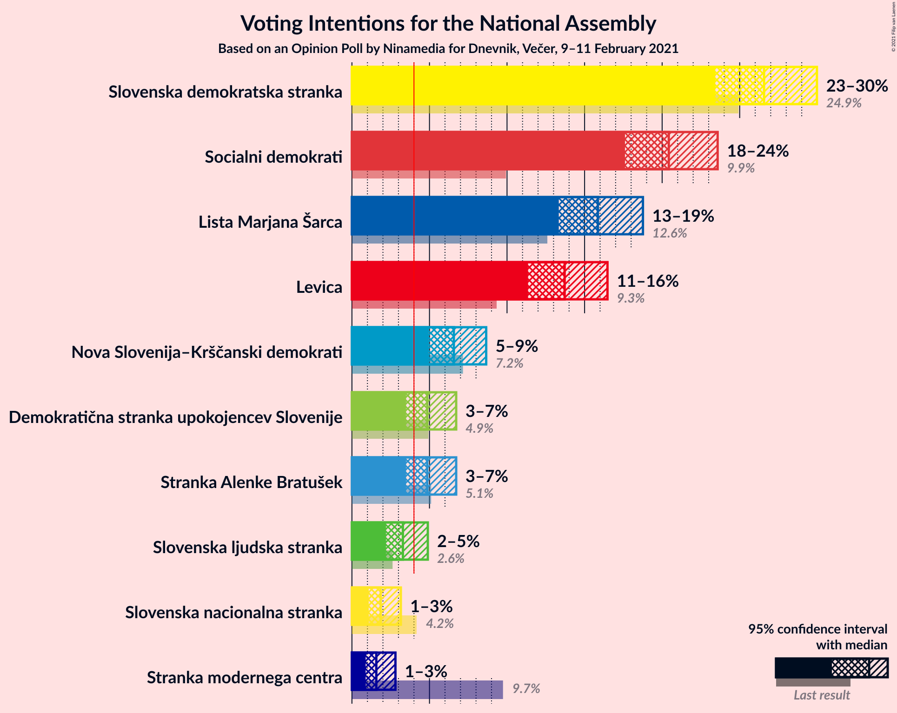
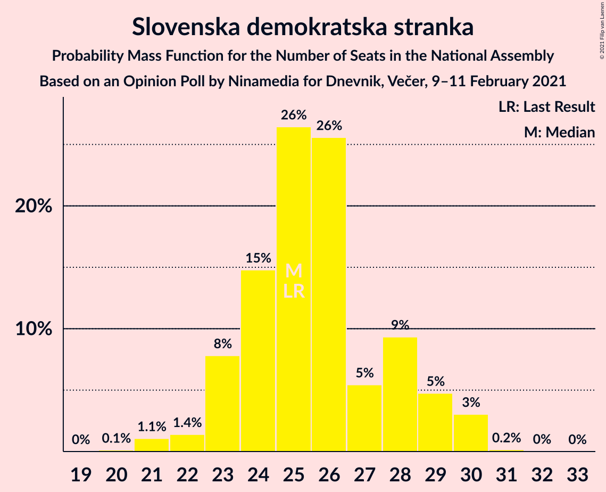
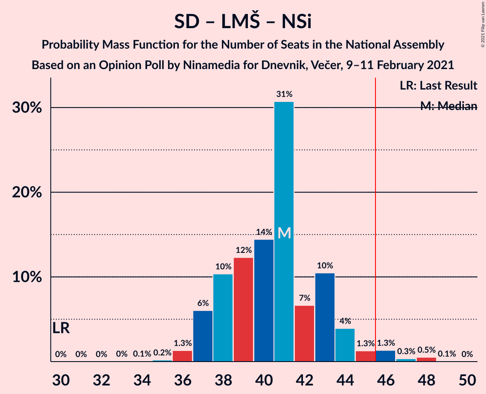

# Opinion Poll by Ninamedia for Dnevnik, Večer, 9–11 February 2021

<a href="#voting-intentions">Voting Intentions</a> | <a href="#seats">Seats</a> | <a href="#coalitions">Coalitions</a> | <a href="#technical-information">Technical Information</a>

## Voting Intentions

### Confidence Intervals

| Party | Last Result | Poll Result | 80% Confidence Interval | 90% Confidence Interval | 95% Confidence Interval | 99% Confidence Interval |
|:-----:|:-----------:|:-----------:|:-----------------------:|:-----------------------:|:-----------------------:|:-----------------------:|
| Slovenska demokratska stranka | 24.9% | 26.6% | 24.5–28.8% |23.9–29.4% |23.4–30.0% |22.5–31.1% |
| Socialni demokrati | 9.9% | 20.4% | 18.6–22.5% |18.0–23.1% |17.6–23.6% |16.8–24.6% |
| Lista Marjana Šarca | 12.6% | 15.9% | 14.2–17.8% |13.7–18.3% |13.3–18.8% |12.6–19.7% |
| Levica | 9.3% | 13.7% | 12.2–15.5% |11.7–16.0% |11.4–16.5% |10.7–17.4% |
| Nova Slovenija–Krščanski demokrati | 7.2% | 6.6% | 5.5–7.9% |5.2–8.3% |5.0–8.7% |4.5–9.4% |
| Stranka Alenke Bratušek | 5.1% | 4.9% | 4.0–6.1% |3.7–6.4% |3.5–6.7% |3.1–7.3% |
| Demokratična stranka upokojencev Slovenije | 4.9% | 4.9% | 4.0–6.1% |3.7–6.4% |3.5–6.7% |3.1–7.3% |
| Slovenska ljudska stranka | 2.6% | 3.3% | 2.6–4.3% |2.4–4.6% |2.2–4.9% |1.9–5.4% |
| Slovenska nacionalna stranka | 4.2% | 1.9% | 1.3–2.7% |1.2–2.9% |1.1–3.2% |0.9–3.6% |
| Stranka modernega centra | 9.7% | 1.6% | 1.1–2.4% |1.0–2.6% |0.9–2.8% |0.7–3.2% |

*Note:* The poll result column reflects the actual value used in the calculations. Published results may vary slightly, and in addition be rounded to fewer digits.

## Seats

### Confidence Intervals

| Party | Last Result | Median | 80% Confidence Interval | 90% Confidence Interval | 95% Confidence Interval | 99% Confidence Interval |
|:-----:|:-----------:|:------:|:-----------------------:|:-----------------------:|:-----------------------:|:-----------------------:|
| <a href="#slovenska-demokratska-stranka">Slovenska demokratska stranka</a> | 25 | 25 | 23–28 |23–29 |22–30 |21–30 |
| <a href="#socialni-demokrati">Socialni demokrati</a> | 10 | 20 | 18–22 |17–22 |16–23 |16–24 |
| <a href="#lista-marjana-šarca">Lista Marjana Šarca</a> | 13 | 15 | 13–17 |13–18 |13–18 |12–19 |
| <a href="#levica">Levica</a> | 9 | 13 | 11–14 |11–15 |10–16 |10–17 |
| <a href="#nova-slovenija–krščanski-demokrati">Nova Slovenija–Krščanski demokrati</a> | 7 | 6 | 5–7 |5–8 |4–8 |4–9 |
| <a href="#stranka-alenke-bratušek">Stranka Alenke Bratušek</a> | 5 | 4 | 0–6 |0–6 |0–6 |0–7 |
| <a href="#demokratična-stranka-upokojencev-slovenije">Demokratična stranka upokojencev Slovenije</a> | 5 | 4 | 0–6 |0–6 |0–6 |0–7 |
| <a href="#slovenska-ljudska-stranka">Slovenska ljudska stranka</a> | 0 | 0 | 0–4 |0–4 |0–4 |0–5 |
| <a href="#slovenska-nacionalna-stranka">Slovenska nacionalna stranka</a> | 4 | 0 | 0 |0 |0 |0 |
| <a href="#stranka-modernega-centra">Stranka modernega centra</a> | 10 | 0 | 0 |0 |0 |0 |

### Slovenska demokratska stranka

*For a full overview of the results for this party, see the [Slovenska demokratska stranka](party-slovenskademokratskastranka.html) page.*

| Number of Seats | Probability | Accumulated | Special Marks |
|:---------------:|:-----------:|:-----------:|:-------------:|
| 20 | 0.1% | 100% |  |
| 21 | 1.1% | 99.9% |  |
| 22 | 1.4% | 98.8% |  |
| 23 | 8% | 97% |  |
| 24 | 15% | 90% |  |
| 25 | 26% | 75% | Last Result, Median |
| 26 | 26% | 48% |  |
| 27 | 5% | 23% |  |
| 28 | 9% | 17% |  |
| 29 | 5% | 8% |  |
| 30 | 3% | 3% |  |
| 31 | 0.2% | 0.2% |  |
| 32 | 0% | 0.1% |  |
| 33 | 0% | 0% |  |

### Socialni demokrati

*For a full overview of the results for this party, see the [Socialni demokrati](party-socialnidemokrati.html) page.*

| Number of Seats | Probability | Accumulated | Special Marks |
|:---------------:|:-----------:|:-----------:|:-------------:|
| 10 | 0% | 100% | Last Result |
| 11 | 0% | 100% |  |
| 12 | 0% | 100% |  |
| 13 | 0% | 100% |  |
| 14 | 0% | 100% |  |
| 15 | 0.2% | 100% |  |
| 16 | 3% | 99.8% |  |
| 17 | 6% | 97% |  |
| 18 | 11% | 91% |  |
| 19 | 26% | 80% |  |
| 20 | 24% | 54% | Median |
| 21 | 17% | 29% |  |
| 22 | 9% | 12% |  |
| 23 | 2% | 3% |  |
| 24 | 1.0% | 1.1% |  |
| 25 | 0.1% | 0.1% |  |
| 26 | 0% | 0% |  |

### Lista Marjana Šarca

*For a full overview of the results for this party, see the [Lista Marjana Šarca](party-listamarjanašarca.html) page.*

| Number of Seats | Probability | Accumulated | Special Marks |
|:---------------:|:-----------:|:-----------:|:-------------:|
| 11 | 0.2% | 100% |  |
| 12 | 2% | 99.7% |  |
| 13 | 20% | 98% | Last Result |
| 14 | 21% | 78% |  |
| 15 | 27% | 56% | Median |
| 16 | 15% | 30% |  |
| 17 | 7% | 15% |  |
| 18 | 7% | 8% |  |
| 19 | 0.7% | 1.1% |  |
| 20 | 0.4% | 0.4% |  |
| 21 | 0% | 0% |  |

### Levica

*For a full overview of the results for this party, see the [Levica](party-levica.html) page.*

| Number of Seats | Probability | Accumulated | Special Marks |
|:---------------:|:-----------:|:-----------:|:-------------:|
| 9 | 0.1% | 100% | Last Result |
| 10 | 3% | 99.9% |  |
| 11 | 10% | 97% |  |
| 12 | 27% | 87% |  |
| 13 | 27% | 60% | Median |
| 14 | 24% | 33% |  |
| 15 | 6% | 9% |  |
| 16 | 1.3% | 3% |  |
| 17 | 2% | 2% |  |
| 18 | 0% | 0.1% |  |
| 19 | 0% | 0% |  |

### Nova Slovenija–Krščanski demokrati

*For a full overview of the results for this party, see the [Nova Slovenija–Krščanski demokrati](party-novaslovenija–krščanskidemokrati.html) page.*

| Number of Seats | Probability | Accumulated | Special Marks |
|:---------------:|:-----------:|:-----------:|:-------------:|
| 0 | 0.1% | 100% |  |
| 1 | 0% | 99.9% |  |
| 2 | 0% | 99.9% |  |
| 3 | 0% | 99.9% |  |
| 4 | 5% | 99.9% |  |
| 5 | 27% | 95% |  |
| 6 | 35% | 68% | Median |
| 7 | 27% | 33% | Last Result |
| 8 | 5% | 6% |  |
| 9 | 0.8% | 0.9% |  |
| 10 | 0.1% | 0.1% |  |
| 11 | 0% | 0% |  |

### Stranka Alenke Bratušek

*For a full overview of the results for this party, see the [Stranka Alenke Bratušek](party-strankaalenkebratušek.html) page.*

| Number of Seats | Probability | Accumulated | Special Marks |
|:---------------:|:-----------:|:-----------:|:-------------:|
| 0 | 10% | 100% |  |
| 1 | 0% | 90% |  |
| 2 | 0% | 90% |  |
| 3 | 2% | 90% |  |
| 4 | 43% | 88% | Median |
| 5 | 30% | 45% | Last Result |
| 6 | 13% | 15% |  |
| 7 | 1.0% | 1.1% |  |
| 8 | 0% | 0.1% |  |
| 9 | 0% | 0% |  |

### Demokratična stranka upokojencev Slovenije

*For a full overview of the results for this party, see the [Demokratična stranka upokojencev Slovenije](party-demokratičnastrankaupokojencevslovenije.html) page.*

| Number of Seats | Probability | Accumulated | Special Marks |
|:---------------:|:-----------:|:-----------:|:-------------:|
| 0 | 11% | 100% |  |
| 1 | 0% | 89% |  |
| 2 | 0% | 89% |  |
| 3 | 3% | 89% |  |
| 4 | 41% | 86% | Median |
| 5 | 33% | 45% | Last Result |
| 6 | 11% | 12% |  |
| 7 | 0.8% | 0.9% |  |
| 8 | 0.1% | 0.1% |  |
| 9 | 0% | 0% |  |

### Slovenska ljudska stranka

*For a full overview of the results for this party, see the [Slovenska ljudska stranka](party-slovenskaljudskastranka.html) page.*

| Number of Seats | Probability | Accumulated | Special Marks |
|:---------------:|:-----------:|:-----------:|:-------------:|
| 0 | 82% | 100% | Last Result, Median |
| 1 | 0% | 18% |  |
| 2 | 0% | 18% |  |
| 3 | 7% | 18% |  |
| 4 | 10% | 11% |  |
| 5 | 0.9% | 0.9% |  |
| 6 | 0% | 0% |  |

### Slovenska nacionalna stranka

*For a full overview of the results for this party, see the [Slovenska nacionalna stranka](party-slovenskanacionalnastranka.html) page.*

| Number of Seats | Probability | Accumulated | Special Marks |
|:---------------:|:-----------:|:-----------:|:-------------:|
| 0 | 99.9% | 100% | Median |
| 1 | 0% | 0.1% |  |
| 2 | 0% | 0.1% |  |
| 3 | 0% | 0.1% |  |
| 4 | 0.1% | 0.1% | Last Result |
| 5 | 0% | 0% |  |

### Stranka modernega centra

*For a full overview of the results for this party, see the [Stranka modernega centra](party-strankamodernegacentra.html) page.*

| Number of Seats | Probability | Accumulated | Special Marks |
|:---------------:|:-----------:|:-----------:|:-------------:|
| 0 | 100% | 100% | Median |
| 1 | 0% | 0% |  |
| 2 | 0% | 0% |  |
| 3 | 0% | 0% |  |
| 4 | 0% | 0% |  |
| 5 | 0% | 0% |  |
| 6 | 0% | 0% |  |
| 7 | 0% | 0% |  |
| 8 | 0% | 0% |  |
| 9 | 0% | 0% |  |
| 10 | 0% | 0% | Last Result |

## Coalitions

### Confidence Intervals

| Coalition | Last Result | Median | Majority? | 80% Confidence Interval | 90% Confidence Interval | 95% Confidence Interval | 99% Confidence Interval |
|:---------:|:-----------:|:------:|:---------:|:-----------------------:|:-----------------------:|:-----------------------:|:-----------------------:|
| Socialni demokrati – Lista Marjana Šarca – Nova Slovenija–Krščanski demokrati – Demokratična stranka upokojencev Slovenije – Stranka Alenke Bratušek – Stranka modernega centra | 50 | 49 | 92% | 46–51 | 45–52 | 44–52 | 43–54 |
| Socialni demokrati – Lista Marjana Šarca – Nova Slovenija–Krščanski demokrati – Demokratična stranka upokojencev Slovenije | 35 | 45 | 33% | 42–47 | 41–48 | 40–49 | 39–51 |
| Socialni demokrati – Lista Marjana Šarca – Nova Slovenija–Krščanski demokrati – Demokratična stranka upokojencev Slovenije – Stranka modernega centra | 45 | 45 | 33% | 42–47 | 41–48 | 40–49 | 39–51 |
| Slovenska demokratska stranka – Lista Marjana Šarca – Demokratična stranka upokojencev Slovenije | 43 | 44 | 28% | 42–48 | 41–49 | 40–49 | 39–50 |
| Socialni demokrati – Lista Marjana Šarca – Demokratična stranka upokojencev Slovenije – Stranka Alenke Bratušek – Stranka modernega centra | 43 | 43 | 7% | 40–45 | 39–46 | 38–46 | 36–48 |
| Socialni demokrati – Lista Marjana Šarca – Nova Slovenija–Krščanski demokrati | 30 | 41 | 2% | 38–43 | 37–44 | 37–45 | 36–48 |
| Socialni demokrati – Lista Marjana Šarca – Nova Slovenija–Krščanski demokrati – Stranka modernega centra | 40 | 41 | 2% | 38–43 | 37–44 | 37–45 | 36–48 |
| Slovenska demokratska stranka – Lista Marjana Šarca | 38 | 40 | 0.9% | 38–44 | 37–45 | 36–45 | 36–46 |
| Socialni demokrati – Lista Marjana Šarca – Demokratična stranka upokojencev Slovenije | 28 | 39 | 0% | 36–41 | 35–42 | 34–43 | 33–44 |
| Socialni demokrati – Lista Marjana Šarca – Demokratična stranka upokojencev Slovenije – Stranka modernega centra | 38 | 39 | 0% | 36–41 | 35–42 | 34–43 | 33–44 |
| Socialni demokrati – Lista Marjana Šarca | 23 | 34 | 0% | 32–37 | 31–38 | 31–39 | 30–40 |
| Socialni demokrati – Lista Marjana Šarca – Stranka modernega centra | 33 | 34 | 0% | 32–37 | 31–38 | 31–39 | 30–40 |
| Socialni demokrati – Demokratična stranka upokojencev Slovenije – Stranka modernega centra | 25 | 24 | 0% | 21–26 | 20–27 | 19–28 | 18–28 |

### Socialni demokrati – Lista Marjana Šarca – Nova Slovenija–Krščanski demokrati – Demokratična stranka upokojencev Slovenije – Stranka Alenke Bratušek – Stranka modernega centra

| Number of Seats | Probability | Accumulated | Special Marks |
|:---------------:|:-----------:|:-----------:|:-------------:|
| 40 | 0.1% | 100% |  |
| 41 | 0.2% | 99.9% |  |
| 42 | 0.2% | 99.7% |  |
| 43 | 1.4% | 99.5% |  |
| 44 | 1.5% | 98% |  |
| 45 | 5% | 97% |  |
| 46 | 7% | 92% | Majority |
| 47 | 7% | 85% |  |
| 48 | 11% | 78% |  |
| 49 | 29% | 67% | Median |
| 50 | 20% | 38% | Last Result |
| 51 | 10% | 18% |  |
| 52 | 6% | 8% |  |
| 53 | 1.0% | 2% |  |
| 54 | 0.6% | 0.7% |  |
| 55 | 0.1% | 0.1% |  |
| 56 | 0% | 0% |  |

### Socialni demokrati – Lista Marjana Šarca – Nova Slovenija–Krščanski demokrati – Demokratična stranka upokojencev Slovenije

| Number of Seats | Probability | Accumulated | Special Marks |
|:---------------:|:-----------:|:-----------:|:-------------:|
| 35 | 0% | 100% | Last Result |
| 36 | 0% | 100% |  |
| 37 | 0.1% | 100% |  |
| 38 | 0.1% | 99.9% |  |
| 39 | 0.4% | 99.8% |  |
| 40 | 2% | 99.4% |  |
| 41 | 6% | 97% |  |
| 42 | 7% | 91% |  |
| 43 | 17% | 85% |  |
| 44 | 9% | 68% |  |
| 45 | 27% | 59% | Median |
| 46 | 14% | 33% | Majority |
| 47 | 12% | 19% |  |
| 48 | 3% | 7% |  |
| 49 | 2% | 4% |  |
| 50 | 0.9% | 2% |  |
| 51 | 0.4% | 0.8% |  |
| 52 | 0.4% | 0.4% |  |
| 53 | 0% | 0% |  |

### Socialni demokrati – Lista Marjana Šarca – Nova Slovenija–Krščanski demokrati – Demokratična stranka upokojencev Slovenije – Stranka modernega centra

| Number of Seats | Probability | Accumulated | Special Marks |
|:---------------:|:-----------:|:-----------:|:-------------:|
| 37 | 0.1% | 100% |  |
| 38 | 0.1% | 99.9% |  |
| 39 | 0.4% | 99.8% |  |
| 40 | 2% | 99.4% |  |
| 41 | 6% | 97% |  |
| 42 | 7% | 91% |  |
| 43 | 17% | 85% |  |
| 44 | 9% | 68% |  |
| 45 | 27% | 59% | Last Result, Median |
| 46 | 14% | 33% | Majority |
| 47 | 12% | 19% |  |
| 48 | 3% | 7% |  |
| 49 | 2% | 4% |  |
| 50 | 0.9% | 2% |  |
| 51 | 0.4% | 0.8% |  |
| 52 | 0.4% | 0.4% |  |
| 53 | 0% | 0% |  |

### Slovenska demokratska stranka – Lista Marjana Šarca – Demokratična stranka upokojencev Slovenije

| Number of Seats | Probability | Accumulated | Special Marks |
|:---------------:|:-----------:|:-----------:|:-------------:|
| 37 | 0.2% | 100% |  |
| 38 | 0.1% | 99.8% |  |
| 39 | 0.5% | 99.7% |  |
| 40 | 2% | 99.2% |  |
| 41 | 3% | 97% |  |
| 42 | 6% | 94% |  |
| 43 | 22% | 88% | Last Result |
| 44 | 27% | 67% | Median |
| 45 | 12% | 40% |  |
| 46 | 8% | 28% | Majority |
| 47 | 5% | 20% |  |
| 48 | 9% | 15% |  |
| 49 | 4% | 6% |  |
| 50 | 1.4% | 2% |  |
| 51 | 0.2% | 0.3% |  |
| 52 | 0.1% | 0.1% |  |
| 53 | 0% | 0% |  |

### Socialni demokrati – Lista Marjana Šarca – Demokratična stranka upokojencev Slovenije – Stranka Alenke Bratušek – Stranka modernega centra

| Number of Seats | Probability | Accumulated | Special Marks |
|:---------------:|:-----------:|:-----------:|:-------------:|
| 35 | 0.1% | 100% |  |
| 36 | 2% | 99.9% |  |
| 37 | 0.5% | 98% |  |
| 38 | 1.3% | 98% |  |
| 39 | 3% | 97% |  |
| 40 | 12% | 93% |  |
| 41 | 4% | 81% |  |
| 42 | 12% | 77% |  |
| 43 | 25% | 65% | Last Result, Median |
| 44 | 19% | 40% |  |
| 45 | 14% | 21% |  |
| 46 | 5% | 7% | Majority |
| 47 | 1.4% | 2% |  |
| 48 | 0.4% | 0.6% |  |
| 49 | 0.2% | 0.2% |  |
| 50 | 0% | 0% |  |

### Socialni demokrati – Lista Marjana Šarca – Nova Slovenija–Krščanski demokrati

| Number of Seats | Probability | Accumulated | Special Marks |
|:---------------:|:-----------:|:-----------:|:-------------:|
| 30 | 0% | 100% | Last Result |
| 31 | 0% | 100% |  |
| 32 | 0% | 100% |  |
| 33 | 0% | 100% |  |
| 34 | 0.1% | 100% |  |
| 35 | 0.2% | 99.9% |  |
| 36 | 1.3% | 99.7% |  |
| 37 | 6% | 98% |  |
| 38 | 10% | 92% |  |
| 39 | 12% | 82% |  |
| 40 | 14% | 70% |  |
| 41 | 31% | 55% | Median |
| 42 | 7% | 25% |  |
| 43 | 10% | 18% |  |
| 44 | 4% | 7% |  |
| 45 | 1.3% | 4% |  |
| 46 | 1.3% | 2% | Majority |
| 47 | 0.3% | 0.9% |  |
| 48 | 0.5% | 0.6% |  |
| 49 | 0.1% | 0.1% |  |
| 50 | 0% | 0% |  |

### Socialni demokrati – Lista Marjana Šarca – Nova Slovenija–Krščanski demokrati – Stranka modernega centra

| Number of Seats | Probability | Accumulated | Special Marks |
|:---------------:|:-----------:|:-----------:|:-------------:|
| 34 | 0.1% | 100% |  |
| 35 | 0.2% | 99.9% |  |
| 36 | 1.3% | 99.7% |  |
| 37 | 6% | 98% |  |
| 38 | 10% | 92% |  |
| 39 | 12% | 82% |  |
| 40 | 14% | 70% | Last Result |
| 41 | 31% | 55% | Median |
| 42 | 7% | 25% |  |
| 43 | 10% | 18% |  |
| 44 | 4% | 7% |  |
| 45 | 1.3% | 4% |  |
| 46 | 1.3% | 2% | Majority |
| 47 | 0.3% | 0.9% |  |
| 48 | 0.5% | 0.6% |  |
| 49 | 0.1% | 0.1% |  |
| 50 | 0% | 0% |  |

### Slovenska demokratska stranka – Lista Marjana Šarca

| Number of Seats | Probability | Accumulated | Special Marks |
|:---------------:|:-----------:|:-----------:|:-------------:|
| 34 | 0.1% | 100% |  |
| 35 | 0.3% | 99.9% |  |
| 36 | 3% | 99.5% |  |
| 37 | 6% | 97% |  |
| 38 | 4% | 91% | Last Result |
| 39 | 31% | 87% |  |
| 40 | 14% | 56% | Median |
| 41 | 12% | 43% |  |
| 42 | 9% | 31% |  |
| 43 | 10% | 22% |  |
| 44 | 7% | 13% |  |
| 45 | 4% | 5% |  |
| 46 | 0.4% | 0.9% | Majority |
| 47 | 0.4% | 0.5% |  |
| 48 | 0.1% | 0.1% |  |
| 49 | 0% | 0% |  |

### Socialni demokrati – Lista Marjana Šarca – Demokratična stranka upokojencev Slovenije

| Number of Seats | Probability | Accumulated | Special Marks |
|:---------------:|:-----------:|:-----------:|:-------------:|
| 28 | 0% | 100% | Last Result |
| 29 | 0% | 100% |  |
| 30 | 0% | 100% |  |
| 31 | 0.1% | 100% |  |
| 32 | 0.2% | 99.9% |  |
| 33 | 0.6% | 99.7% |  |
| 34 | 2% | 99.1% |  |
| 35 | 4% | 97% |  |
| 36 | 9% | 92% |  |
| 37 | 12% | 83% |  |
| 38 | 19% | 71% |  |
| 39 | 18% | 53% | Median |
| 40 | 16% | 35% |  |
| 41 | 10% | 18% |  |
| 42 | 5% | 8% |  |
| 43 | 1.5% | 3% |  |
| 44 | 1.4% | 2% |  |
| 45 | 0.2% | 0.2% |  |
| 46 | 0% | 0% | Majority |

### Socialni demokrati – Lista Marjana Šarca – Demokratična stranka upokojencev Slovenije – Stranka modernega centra

| Number of Seats | Probability | Accumulated | Special Marks |
|:---------------:|:-----------:|:-----------:|:-------------:|
| 31 | 0.1% | 100% |  |
| 32 | 0.2% | 99.9% |  |
| 33 | 0.6% | 99.7% |  |
| 34 | 2% | 99.1% |  |
| 35 | 4% | 97% |  |
| 36 | 9% | 92% |  |
| 37 | 12% | 83% |  |
| 38 | 19% | 71% | Last Result |
| 39 | 18% | 53% | Median |
| 40 | 16% | 35% |  |
| 41 | 10% | 18% |  |
| 42 | 5% | 8% |  |
| 43 | 1.5% | 3% |  |
| 44 | 1.4% | 2% |  |
| 45 | 0.2% | 0.2% |  |
| 46 | 0% | 0% | Majority |

### Socialni demokrati – Lista Marjana Šarca

| Number of Seats | Probability | Accumulated | Special Marks |
|:---------------:|:-----------:|:-----------:|:-------------:|
| 23 | 0% | 100% | Last Result |
| 24 | 0% | 100% |  |
| 25 | 0% | 100% |  |
| 26 | 0% | 100% |  |
| 27 | 0% | 100% |  |
| 28 | 0.1% | 100% |  |
| 29 | 0.2% | 99.9% |  |
| 30 | 1.4% | 99.7% |  |
| 31 | 4% | 98% |  |
| 32 | 11% | 94% |  |
| 33 | 11% | 83% |  |
| 34 | 25% | 72% |  |
| 35 | 17% | 47% | Median |
| 36 | 13% | 30% |  |
| 37 | 11% | 17% |  |
| 38 | 3% | 6% |  |
| 39 | 2% | 3% |  |
| 40 | 1.3% | 2% |  |
| 41 | 0.2% | 0.2% |  |
| 42 | 0.1% | 0.1% |  |
| 43 | 0% | 0% |  |

### Socialni demokrati – Lista Marjana Šarca – Stranka modernega centra

| Number of Seats | Probability | Accumulated | Special Marks |
|:---------------:|:-----------:|:-----------:|:-------------:|
| 28 | 0.1% | 100% |  |
| 29 | 0.2% | 99.9% |  |
| 30 | 1.4% | 99.7% |  |
| 31 | 4% | 98% |  |
| 32 | 11% | 94% |  |
| 33 | 11% | 83% | Last Result |
| 34 | 25% | 72% |  |
| 35 | 17% | 47% | Median |
| 36 | 13% | 30% |  |
| 37 | 11% | 17% |  |
| 38 | 3% | 6% |  |
| 39 | 2% | 3% |  |
| 40 | 1.3% | 2% |  |
| 41 | 0.2% | 0.2% |  |
| 42 | 0.1% | 0.1% |  |
| 43 | 0% | 0% |  |

### Socialni demokrati – Demokratična stranka upokojencev Slovenije – Stranka modernega centra

| Number of Seats | Probability | Accumulated | Special Marks |
|:---------------:|:-----------:|:-----------:|:-------------:|
| 17 | 0.1% | 100% |  |
| 18 | 0.7% | 99.9% |  |
| 19 | 3% | 99.2% |  |
| 20 | 4% | 96% |  |
| 21 | 6% | 92% |  |
| 22 | 11% | 86% |  |
| 23 | 12% | 75% |  |
| 24 | 28% | 63% | Median |
| 25 | 15% | 35% | Last Result |
| 26 | 14% | 20% |  |
| 27 | 2% | 6% |  |
| 28 | 3% | 3% |  |
| 29 | 0.4% | 0.4% |  |
| 30 | 0.1% | 0.1% |  |
| 31 | 0% | 0% |  |

## Technical Information

### Opinion Poll

+ **Polling firm:** Ninamedia
+ **Commissioner(s):** Dnevnik, Večer
+ **Fieldwork period:** 9–11 February 2021

### Calculations

+ **Sample size:** 700
+ **Simulations done:** 1,048,576
+ **Error estimate:** 1.84%

