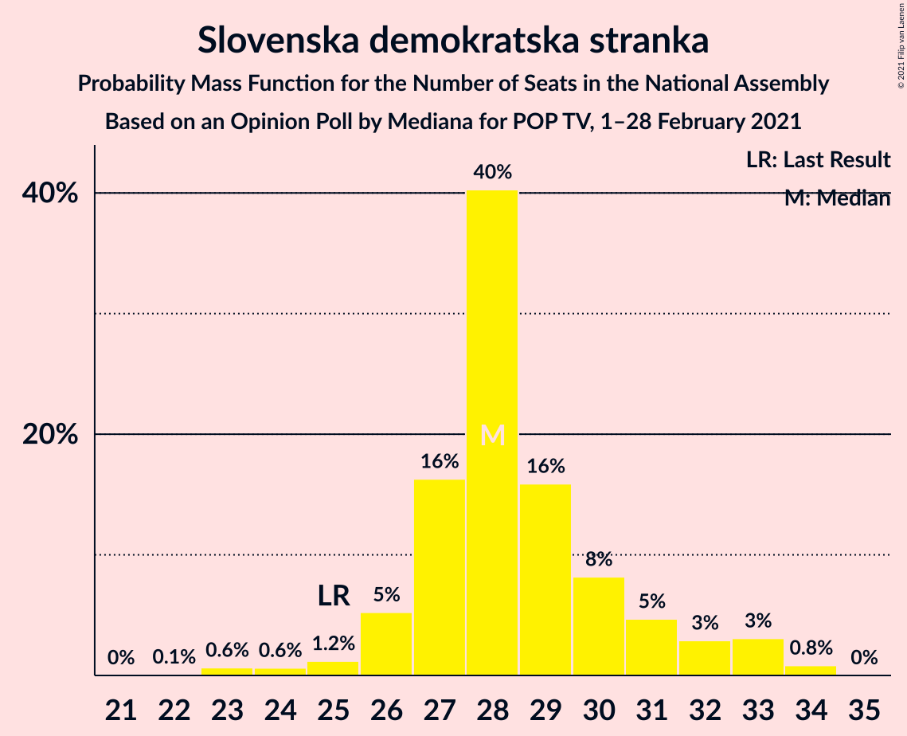
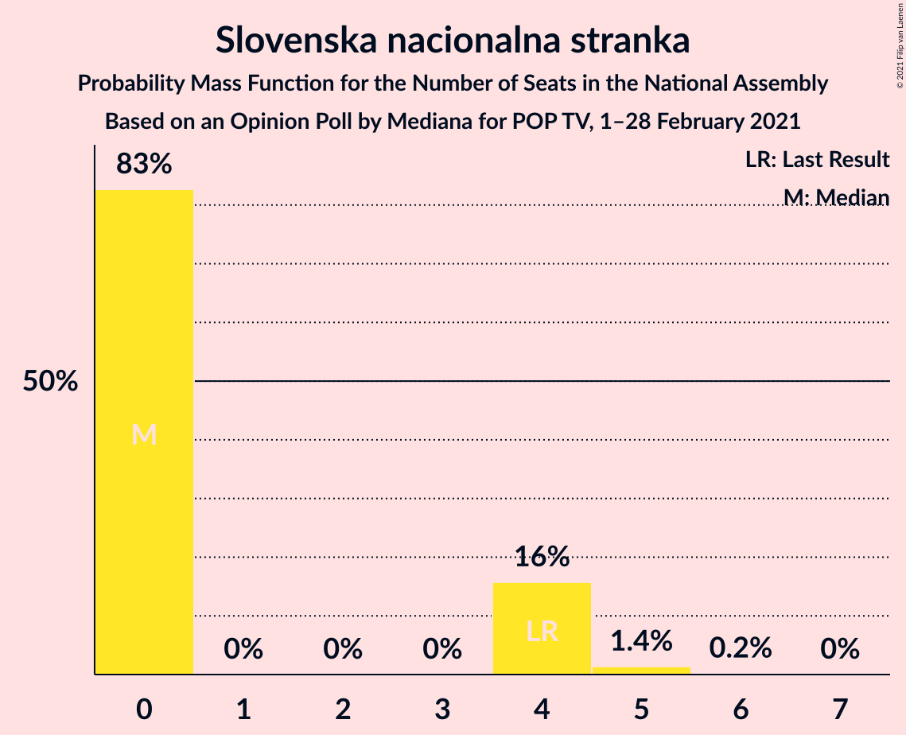
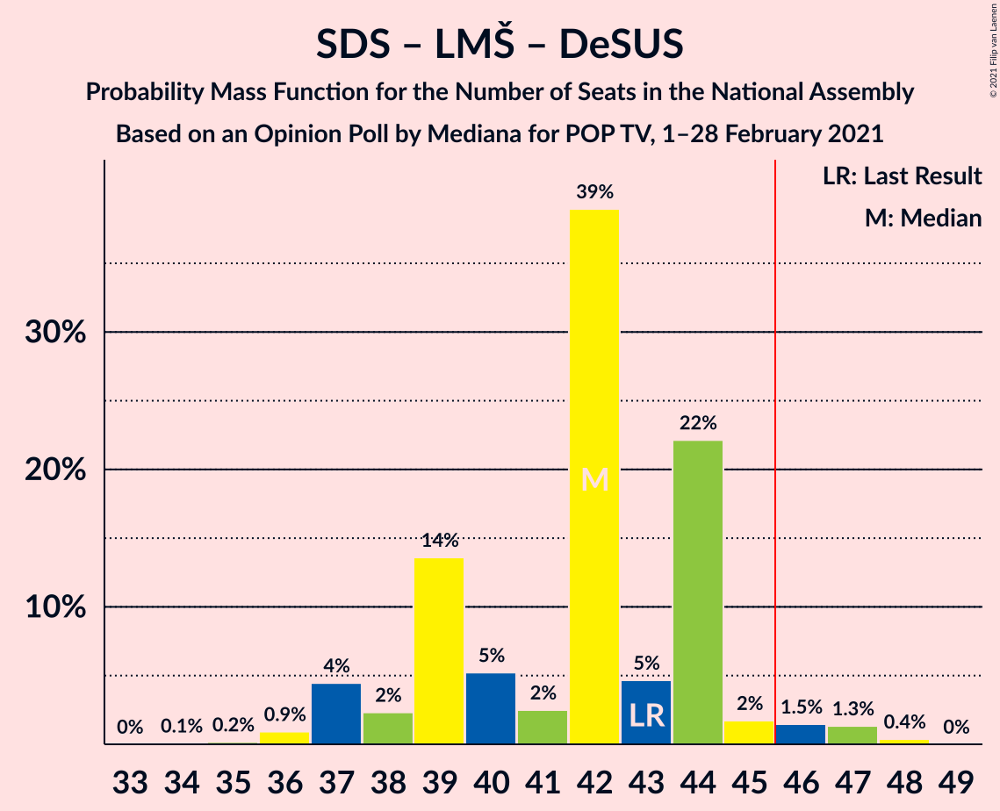
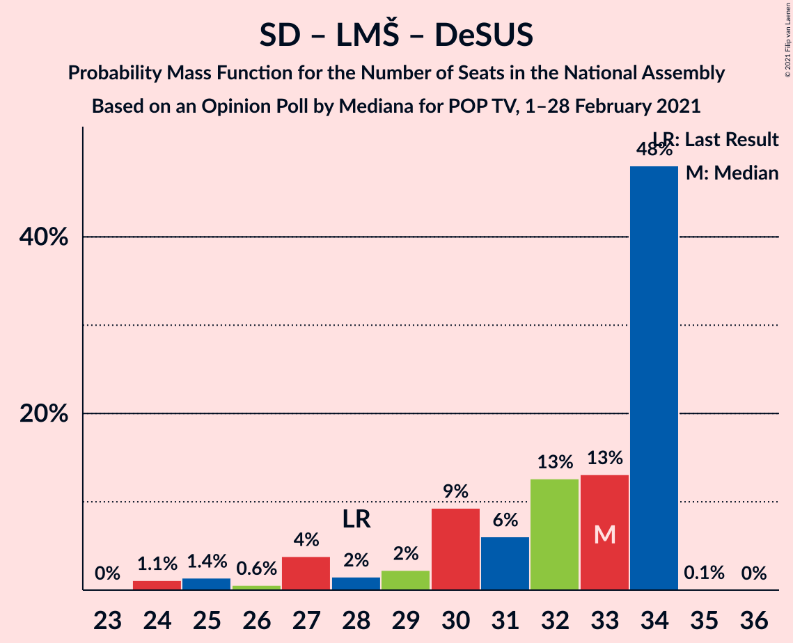
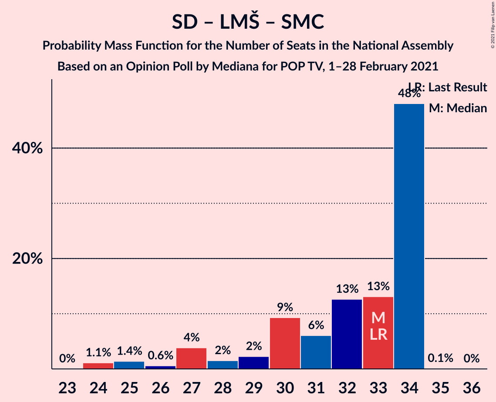

# Opinion Poll by Mediana for POP TV, 1–28 February 2021

<a href="#voting-intentions">Voting Intentions</a> | <a href="#seats">Seats</a> | <a href="#coalitions">Coalitions</a> | <a href="#technical-information">Technical Information</a>

## Voting Intentions

### Confidence Intervals

| Party | Last Result | Poll Result | 80% Confidence Interval | 90% Confidence Interval | 95% Confidence Interval | 99% Confidence Interval |
|:-----:|:-----------:|:-----------:|:-----------------------:|:-----------------------:|:-----------------------:|:-----------------------:|
| Slovenska demokratska stranka | 24.9% | 27.5% | 25.4–29.7% |24.8–30.3% |24.3–30.9% |23.3–32.0% |
| Socialni demokrati | 9.9% | 16.6% | 14.9–18.5% |14.5–19.1% |14.1–19.5% |13.3–20.5% |
| Levica | 9.3% | 12.4% | 10.9–14.1% |10.5–14.6% |10.2–15.0% |9.5–15.9% |
| Lista Marjana Šarca | 12.6% | 12.0% | 10.5–13.7% |10.1–14.1% |9.8–14.6% |9.1–15.4% |
| Nova Slovenija–Krščanski demokrati | 7.2% | 6.5% | 5.4–7.8% |5.1–8.2% |4.9–8.5% |4.4–9.2% |
| Stranka Alenke Bratušek | 5.1% | 5.9% | 4.9–7.2% |4.6–7.6% |4.4–7.9% |4.0–8.6% |
| Slovenska ljudska stranka | 2.6% | 3.9% | 3.2–5.1% |2.9–5.4% |2.7–5.7% |2.4–6.2% |
| Slovenska nacionalna stranka | 4.2% | 3.5% | 2.8–4.6% |2.6–4.9% |2.4–5.2% |2.1–5.7% |
| Piratska stranka Slovenije | 2.2% | 3.0% | 2.3–3.9% |2.1–4.2% |1.9–4.5% |1.7–5.0% |
| Dobra država | 1.5% | 2.4% | 1.8–3.3% |1.6–3.6% |1.5–3.8% |1.3–4.3% |
| Andrej Čuš in Zeleni Slovenije | 1.1% | 2.1% | 1.6–3.0% |1.4–3.2% |1.3–3.5% |1.1–3.9% |
| Demokratična stranka upokojencev Slovenije | 4.9% | 1.8% | 1.3–2.7% |1.2–2.9% |1.1–3.1% |0.9–3.6% |
| Stranka modernega centra | 9.7% | 1.3% | 0.9–2.0% |0.8–2.2% |0.7–2.4% |0.5–2.8% |

*Note:* The poll result column reflects the actual value used in the calculations. Published results may vary slightly, and in addition be rounded to fewer digits.

## Seats

### Confidence Intervals

| Party | Last Result | Median | 80% Confidence Interval | 90% Confidence Interval | 95% Confidence Interval | 99% Confidence Interval |
|:-----:|:-----------:|:------:|:-----------------------:|:-----------------------:|:-----------------------:|:-----------------------:|
| <a href="#slovenska-demokratska-stranka">Slovenska demokratska stranka</a> | 25 | 28 | 27–31 |26–32 |25–33 |23–33 |
| <a href="#socialni-demokrati">Socialni demokrati</a> | 10 | 20 | 16–20 |16–20 |15–21 |14–21 |
| <a href="#levica">Levica</a> | 9 | 15 | 12–15 |11–15 |11–15 |10–17 |
| <a href="#lista-marjana-šarca">Lista Marjana Šarca</a> | 13 | 14 | 11–15 |11–15 |10–15 |8–16 |
| <a href="#nova-slovenija–krščanski-demokrati">Nova Slovenija–Krščanski demokrati</a> | 7 | 6 | 6–7 |6–7 |5–8 |4–10 |
| <a href="#stranka-alenke-bratušek">Stranka Alenke Bratušek</a> | 5 | 5 | 5–7 |5–7 |5–7 |0–8 |
| <a href="#slovenska-ljudska-stranka">Slovenska ljudska stranka</a> | 0 | 0 | 0–4 |0–5 |0–5 |0–6 |
| <a href="#slovenska-nacionalna-stranka">Slovenska nacionalna stranka</a> | 4 | 0 | 0–4 |0–4 |0–4 |0–5 |
| <a href="#piratska-stranka-slovenije">Piratska stranka Slovenije</a> | 0 | 0 | 0 |0 |0–4 |0–5 |
| <a href="#dobra-država">Dobra država</a> | 0 | 0 | 0 |0 |0 |0 |
| <a href="#andrej-čuš-in-zeleni-slovenije">Andrej Čuš in Zeleni Slovenije</a> | 0 | 0 | 0 |0 |0 |0 |
| <a href="#demokratična-stranka-upokojencev-slovenije">Demokratična stranka upokojencev Slovenije</a> | 5 | 0 | 0 |0 |0 |0 |
| <a href="#stranka-modernega-centra">Stranka modernega centra</a> | 10 | 0 | 0 |0 |0 |0 |

### Slovenska demokratska stranka

*For a full overview of the results for this party, see the [Slovenska demokratska stranka](party-slovenskademokratskastranka.html) page.*

| Number of Seats | Probability | Accumulated | Special Marks |
|:---------------:|:-----------:|:-----------:|:-------------:|
| 22 | 0.1% | 100% |  |
| 23 | 0.8% | 99.9% |  |
| 24 | 0.8% | 99.0% |  |
| 25 | 1.0% | 98% | Last Result |
| 26 | 4% | 97% |  |
| 27 | 6% | 94% |  |
| 28 | 52% | 88% | Median |
| 29 | 22% | 36% |  |
| 30 | 3% | 14% |  |
| 31 | 5% | 11% |  |
| 32 | 2% | 5% |  |
| 33 | 3% | 3% |  |
| 34 | 0.4% | 0.4% |  |
| 35 | 0% | 0% |  |

### Socialni demokrati

*For a full overview of the results for this party, see the [Socialni demokrati](party-socialnidemokrati.html) page.*

| Number of Seats | Probability | Accumulated | Special Marks |
|:---------------:|:-----------:|:-----------:|:-------------:|
| 10 | 0% | 100% | Last Result |
| 11 | 0% | 100% |  |
| 12 | 0% | 100% |  |
| 13 | 0.3% | 100% |  |
| 14 | 2% | 99.7% |  |
| 15 | 2% | 98% |  |
| 16 | 7% | 96% |  |
| 17 | 2% | 90% |  |
| 18 | 6% | 88% |  |
| 19 | 24% | 82% |  |
| 20 | 54% | 58% | Median |
| 21 | 4% | 4% |  |
| 22 | 0% | 0.1% |  |
| 23 | 0% | 0% |  |

### Levica

*For a full overview of the results for this party, see the [Levica](party-levica.html) page.*

| Number of Seats | Probability | Accumulated | Special Marks |
|:---------------:|:-----------:|:-----------:|:-------------:|
| 9 | 0.1% | 100% | Last Result |
| 10 | 2% | 99.9% |  |
| 11 | 7% | 98% |  |
| 12 | 29% | 91% |  |
| 13 | 6% | 61% |  |
| 14 | 0.7% | 55% |  |
| 15 | 52% | 54% | Median |
| 16 | 0.6% | 2% |  |
| 17 | 1.4% | 2% |  |
| 18 | 0.2% | 0.2% |  |
| 19 | 0% | 0% |  |

### Lista Marjana Šarca

*For a full overview of the results for this party, see the [Lista Marjana Šarca](party-listamarjanašarca.html) page.*

| Number of Seats | Probability | Accumulated | Special Marks |
|:---------------:|:-----------:|:-----------:|:-------------:|
| 8 | 0.8% | 100% |  |
| 9 | 2% | 99.2% |  |
| 10 | 2% | 98% |  |
| 11 | 5% | 95% |  |
| 12 | 5% | 90% |  |
| 13 | 7% | 85% | Last Result |
| 14 | 52% | 78% | Median |
| 15 | 24% | 25% |  |
| 16 | 0.9% | 1.0% |  |
| 17 | 0.2% | 0.2% |  |
| 18 | 0% | 0% |  |

### Nova Slovenija–Krščanski demokrati

*For a full overview of the results for this party, see the [Nova Slovenija–Krščanski demokrati](party-novaslovenija–krščanskidemokrati.html) page.*

| Number of Seats | Probability | Accumulated | Special Marks |
|:---------------:|:-----------:|:-----------:|:-------------:|
| 0 | 0.1% | 100% |  |
| 1 | 0% | 99.9% |  |
| 2 | 0% | 99.9% |  |
| 3 | 0% | 99.9% |  |
| 4 | 0.5% | 99.9% |  |
| 5 | 4% | 99.4% |  |
| 6 | 83% | 96% | Median |
| 7 | 8% | 12% | Last Result |
| 8 | 2% | 4% |  |
| 9 | 0.7% | 2% |  |
| 10 | 1.3% | 1.3% |  |
| 11 | 0% | 0% |  |

### Stranka Alenke Bratušek

*For a full overview of the results for this party, see the [Stranka Alenke Bratušek](party-strankaalenkebratušek.html) page.*

| Number of Seats | Probability | Accumulated | Special Marks |
|:---------------:|:-----------:|:-----------:|:-------------:|
| 0 | 1.4% | 100% |  |
| 1 | 0% | 98.6% |  |
| 2 | 0% | 98.6% |  |
| 3 | 0% | 98.6% |  |
| 4 | 1.0% | 98.6% |  |
| 5 | 58% | 98% | Last Result, Median |
| 6 | 13% | 39% |  |
| 7 | 24% | 27% |  |
| 8 | 2% | 2% |  |
| 9 | 0.1% | 0.2% |  |
| 10 | 0% | 0% |  |

### Slovenska ljudska stranka

*For a full overview of the results for this party, see the [Slovenska ljudska stranka](party-slovenskaljudskastranka.html) page.*

| Number of Seats | Probability | Accumulated | Special Marks |
|:---------------:|:-----------:|:-----------:|:-------------:|
| 0 | 87% | 100% | Last Result, Median |
| 1 | 0% | 13% |  |
| 2 | 0% | 13% |  |
| 3 | 0% | 13% |  |
| 4 | 5% | 13% |  |
| 5 | 7% | 8% |  |
| 6 | 0.5% | 0.6% |  |
| 7 | 0.1% | 0.1% |  |
| 8 | 0% | 0% |  |

### Slovenska nacionalna stranka

*For a full overview of the results for this party, see the [Slovenska nacionalna stranka](party-slovenskanacionalnastranka.html) page.*

| Number of Seats | Probability | Accumulated | Special Marks |
|:---------------:|:-----------:|:-----------:|:-------------:|
| 0 | 88% | 100% | Median |
| 1 | 0% | 12% |  |
| 2 | 0% | 12% |  |
| 3 | 0% | 12% |  |
| 4 | 10% | 12% | Last Result |
| 5 | 1.4% | 2% |  |
| 6 | 0.2% | 0.2% |  |
| 7 | 0% | 0% |  |

### Piratska stranka Slovenije

*For a full overview of the results for this party, see the [Piratska stranka Slovenije](party-piratskastrankaslovenije.html) page.*

| Number of Seats | Probability | Accumulated | Special Marks |
|:---------------:|:-----------:|:-----------:|:-------------:|
| 0 | 96% | 100% | Last Result, Median |
| 1 | 0% | 4% |  |
| 2 | 0% | 4% |  |
| 3 | 0% | 4% |  |
| 4 | 3% | 4% |  |
| 5 | 1.3% | 1.3% |  |
| 6 | 0% | 0% |  |

### Dobra država

*For a full overview of the results for this party, see the [Dobra država](party-dobradržava.html) page.*

| Number of Seats | Probability | Accumulated | Special Marks |
|:---------------:|:-----------:|:-----------:|:-------------:|
| 0 | 99.7% | 100% | Last Result, Median |
| 1 | 0% | 0.3% |  |
| 2 | 0% | 0.3% |  |
| 3 | 0% | 0.3% |  |
| 4 | 0.1% | 0.3% |  |
| 5 | 0.2% | 0.2% |  |
| 6 | 0% | 0% |  |

### Andrej Čuš in Zeleni Slovenije

*For a full overview of the results for this party, see the [Andrej Čuš in Zeleni Slovenije](party-andrejčušinzelenislovenije.html) page.*

| Number of Seats | Probability | Accumulated | Special Marks |
|:---------------:|:-----------:|:-----------:|:-------------:|
| 0 | 99.8% | 100% | Last Result, Median |
| 1 | 0% | 0.2% |  |
| 2 | 0% | 0.2% |  |
| 3 | 0% | 0.2% |  |
| 4 | 0.2% | 0.2% |  |
| 5 | 0% | 0% |  |

### Demokratična stranka upokojencev Slovenije

*For a full overview of the results for this party, see the [Demokratična stranka upokojencev Slovenije](party-demokratičnastrankaupokojencevslovenije.html) page.*

| Number of Seats | Probability | Accumulated | Special Marks |
|:---------------:|:-----------:|:-----------:|:-------------:|
| 0 | 100% | 100% | Median |
| 1 | 0% | 0% |  |
| 2 | 0% | 0% |  |
| 3 | 0% | 0% |  |
| 4 | 0% | 0% |  |
| 5 | 0% | 0% | Last Result |

### Stranka modernega centra

*For a full overview of the results for this party, see the [Stranka modernega centra](party-strankamodernegacentra.html) page.*

| Number of Seats | Probability | Accumulated | Special Marks |
|:---------------:|:-----------:|:-----------:|:-------------:|
| 0 | 100% | 100% | Median |
| 1 | 0% | 0% |  |
| 2 | 0% | 0% |  |
| 3 | 0% | 0% |  |
| 4 | 0% | 0% |  |
| 5 | 0% | 0% |  |
| 6 | 0% | 0% |  |
| 7 | 0% | 0% |  |
| 8 | 0% | 0% |  |
| 9 | 0% | 0% |  |
| 10 | 0% | 0% | Last Result |

## Coalitions

### Confidence Intervals

| Coalition | Last Result | Median | Majority? | 80% Confidence Interval | 90% Confidence Interval | 95% Confidence Interval | 99% Confidence Interval |
|:---------:|:-----------:|:------:|:---------:|:-----------------------:|:-----------------------:|:-----------------------:|:-----------------------:|
| Socialni demokrati – Lista Marjana Šarca – Nova Slovenija–Krščanski demokrati – Stranka Alenke Bratušek – Demokratična stranka upokojencev Slovenije – Stranka modernega centra | 50 | 45 | 25% | 42–47 | 38–47 | 37–47 | 36–47 |
| Slovenska demokratska stranka – Lista Marjana Šarca – Demokratična stranka upokojencev Slovenije | 43 | 42 | 4% | 40–44 | 38–44 | 37–46 | 36–47 |
| Slovenska demokratska stranka – Lista Marjana Šarca | 38 | 42 | 4% | 40–44 | 38–44 | 37–46 | 36–47 |
| Socialni demokrati – Lista Marjana Šarca – Stranka Alenke Bratušek – Demokratična stranka upokojencev Slovenije – Stranka modernega centra | 43 | 39 | 0% | 34–41 | 32–41 | 31–41 | 30–41 |
| Socialni demokrati – Lista Marjana Šarca – Nova Slovenija–Krščanski demokrati – Demokratična stranka upokojencev Slovenije | 35 | 40 | 0% | 36–40 | 33–40 | 32–40 | 31–40 |
| Socialni demokrati – Lista Marjana Šarca – Nova Slovenija–Krščanski demokrati – Demokratična stranka upokojencev Slovenije – Stranka modernega centra | 45 | 40 | 0% | 36–40 | 33–40 | 32–40 | 31–40 |
| Socialni demokrati – Lista Marjana Šarca – Nova Slovenija–Krščanski demokrati | 30 | 40 | 0% | 36–40 | 33–40 | 32–40 | 31–40 |
| Socialni demokrati – Lista Marjana Šarca – Nova Slovenija–Krščanski demokrati – Stranka modernega centra | 40 | 40 | 0% | 36–40 | 33–40 | 32–40 | 31–40 |
| Socialni demokrati – Lista Marjana Šarca – Demokratična stranka upokojencev Slovenije | 28 | 34 | 0% | 29–34 | 27–34 | 25–34 | 24–34 |
| Socialni demokrati – Lista Marjana Šarca – Demokratična stranka upokojencev Slovenije – Stranka modernega centra | 38 | 34 | 0% | 29–34 | 27–34 | 25–34 | 24–34 |
| Socialni demokrati – Lista Marjana Šarca | 23 | 34 | 0% | 29–34 | 27–34 | 25–34 | 24–34 |
| Socialni demokrati – Lista Marjana Šarca – Stranka modernega centra | 33 | 34 | 0% | 29–34 | 27–34 | 25–34 | 24–34 |
| Socialni demokrati – Demokratična stranka upokojencev Slovenije – Stranka modernega centra | 25 | 20 | 0% | 16–20 | 16–20 | 15–21 | 14–21 |

### Socialni demokrati – Lista Marjana Šarca – Nova Slovenija–Krščanski demokrati – Stranka Alenke Bratušek – Demokratična stranka upokojencev Slovenije – Stranka modernega centra

| Number of Seats | Probability | Accumulated | Special Marks |
|:---------------:|:-----------:|:-----------:|:-------------:|
| 35 | 0.1% | 100% |  |
| 36 | 2% | 99.9% |  |
| 37 | 2% | 98% |  |
| 38 | 2% | 96% |  |
| 39 | 0.8% | 94% |  |
| 40 | 0.4% | 93% |  |
| 41 | 2% | 92% |  |
| 42 | 4% | 90% |  |
| 43 | 3% | 86% |  |
| 44 | 1.3% | 83% |  |
| 45 | 57% | 82% | Median |
| 46 | 4% | 25% | Majority |
| 47 | 21% | 21% |  |
| 48 | 0.1% | 0.1% |  |
| 49 | 0% | 0% |  |
| 50 | 0% | 0% | Last Result |

### Slovenska demokratska stranka – Lista Marjana Šarca – Demokratična stranka upokojencev Slovenije

| Number of Seats | Probability | Accumulated | Special Marks |
|:---------------:|:-----------:|:-----------:|:-------------:|
| 34 | 0.1% | 100% |  |
| 35 | 0.2% | 99.9% |  |
| 36 | 1.1% | 99.7% |  |
| 37 | 3% | 98.6% |  |
| 38 | 2% | 96% |  |
| 39 | 2% | 93% |  |
| 40 | 5% | 91% |  |
| 41 | 3% | 86% |  |
| 42 | 51% | 83% | Median |
| 43 | 5% | 32% | Last Result |
| 44 | 22% | 26% |  |
| 45 | 0.4% | 4% |  |
| 46 | 2% | 4% | Majority |
| 47 | 2% | 2% |  |
| 48 | 0.3% | 0.3% |  |
| 49 | 0% | 0% |  |

### Slovenska demokratska stranka – Lista Marjana Šarca

| Number of Seats | Probability | Accumulated | Special Marks |
|:---------------:|:-----------:|:-----------:|:-------------:|
| 34 | 0.1% | 100% |  |
| 35 | 0.2% | 99.9% |  |
| 36 | 1.1% | 99.7% |  |
| 37 | 3% | 98.6% |  |
| 38 | 2% | 96% | Last Result |
| 39 | 2% | 93% |  |
| 40 | 5% | 91% |  |
| 41 | 3% | 86% |  |
| 42 | 51% | 83% | Median |
| 43 | 5% | 32% |  |
| 44 | 22% | 26% |  |
| 45 | 0.4% | 4% |  |
| 46 | 2% | 4% | Majority |
| 47 | 2% | 2% |  |
| 48 | 0.3% | 0.3% |  |
| 49 | 0% | 0% |  |

### Socialni demokrati – Lista Marjana Šarca – Stranka Alenke Bratušek – Demokratična stranka upokojencev Slovenije – Stranka modernega centra

| Number of Seats | Probability | Accumulated | Special Marks |
|:---------------:|:-----------:|:-----------:|:-------------:|
| 29 | 0% | 100% |  |
| 30 | 2% | 99.9% |  |
| 31 | 3% | 98% |  |
| 32 | 4% | 96% |  |
| 33 | 2% | 92% |  |
| 34 | 0.5% | 90% |  |
| 35 | 2% | 90% |  |
| 36 | 3% | 88% |  |
| 37 | 2% | 85% |  |
| 38 | 2% | 83% |  |
| 39 | 60% | 82% | Median |
| 40 | 0.2% | 21% |  |
| 41 | 21% | 21% |  |
| 42 | 0% | 0% |  |
| 43 | 0% | 0% | Last Result |

### Socialni demokrati – Lista Marjana Šarca – Nova Slovenija–Krščanski demokrati – Demokratična stranka upokojencev Slovenije

| Number of Seats | Probability | Accumulated | Special Marks |
|:---------------:|:-----------:|:-----------:|:-------------:|
| 29 | 0.1% | 100% |  |
| 30 | 0.2% | 99.9% |  |
| 31 | 1.1% | 99.7% |  |
| 32 | 4% | 98.6% |  |
| 33 | 0.3% | 95% |  |
| 34 | 1.1% | 95% |  |
| 35 | 2% | 94% | Last Result |
| 36 | 3% | 91% |  |
| 37 | 4% | 88% |  |
| 38 | 4% | 84% |  |
| 39 | 6% | 81% |  |
| 40 | 74% | 74% | Median |
| 41 | 0.1% | 0.2% |  |
| 42 | 0.1% | 0.1% |  |
| 43 | 0.1% | 0.1% |  |
| 44 | 0% | 0% |  |

### Socialni demokrati – Lista Marjana Šarca – Nova Slovenija–Krščanski demokrati – Demokratična stranka upokojencev Slovenije – Stranka modernega centra

| Number of Seats | Probability | Accumulated | Special Marks |
|:---------------:|:-----------:|:-----------:|:-------------:|
| 29 | 0.1% | 100% |  |
| 30 | 0.2% | 99.9% |  |
| 31 | 1.1% | 99.7% |  |
| 32 | 4% | 98.6% |  |
| 33 | 0.3% | 95% |  |
| 34 | 1.1% | 95% |  |
| 35 | 2% | 94% |  |
| 36 | 3% | 91% |  |
| 37 | 4% | 88% |  |
| 38 | 4% | 84% |  |
| 39 | 6% | 81% |  |
| 40 | 74% | 74% | Median |
| 41 | 0.1% | 0.2% |  |
| 42 | 0.1% | 0.1% |  |
| 43 | 0.1% | 0.1% |  |
| 44 | 0% | 0% |  |
| 45 | 0% | 0% | Last Result |

### Socialni demokrati – Lista Marjana Šarca – Nova Slovenija–Krščanski demokrati

| Number of Seats | Probability | Accumulated | Special Marks |
|:---------------:|:-----------:|:-----------:|:-------------:|
| 29 | 0.1% | 100% |  |
| 30 | 0.2% | 99.9% | Last Result |
| 31 | 1.1% | 99.7% |  |
| 32 | 4% | 98.6% |  |
| 33 | 0.3% | 95% |  |
| 34 | 1.1% | 95% |  |
| 35 | 2% | 94% |  |
| 36 | 3% | 91% |  |
| 37 | 4% | 88% |  |
| 38 | 4% | 84% |  |
| 39 | 6% | 81% |  |
| 40 | 74% | 74% | Median |
| 41 | 0.1% | 0.2% |  |
| 42 | 0.1% | 0.1% |  |
| 43 | 0.1% | 0.1% |  |
| 44 | 0% | 0% |  |

### Socialni demokrati – Lista Marjana Šarca – Nova Slovenija–Krščanski demokrati – Stranka modernega centra

| Number of Seats | Probability | Accumulated | Special Marks |
|:---------------:|:-----------:|:-----------:|:-------------:|
| 29 | 0.1% | 100% |  |
| 30 | 0.2% | 99.9% |  |
| 31 | 1.1% | 99.7% |  |
| 32 | 4% | 98.6% |  |
| 33 | 0.3% | 95% |  |
| 34 | 1.1% | 95% |  |
| 35 | 2% | 94% |  |
| 36 | 3% | 91% |  |
| 37 | 4% | 88% |  |
| 38 | 4% | 84% |  |
| 39 | 6% | 81% |  |
| 40 | 74% | 74% | Last Result, Median |
| 41 | 0.1% | 0.2% |  |
| 42 | 0.1% | 0.1% |  |
| 43 | 0.1% | 0.1% |  |
| 44 | 0% | 0% |  |

### Socialni demokrati – Lista Marjana Šarca – Demokratična stranka upokojencev Slovenije

| Number of Seats | Probability | Accumulated | Special Marks |
|:---------------:|:-----------:|:-----------:|:-------------:|
| 24 | 1.0% | 100% |  |
| 25 | 2% | 99.0% |  |
| 26 | 0.4% | 97% |  |
| 27 | 5% | 97% |  |
| 28 | 1.4% | 92% | Last Result |
| 29 | 1.1% | 90% |  |
| 30 | 2% | 89% |  |
| 31 | 3% | 87% |  |
| 32 | 3% | 84% |  |
| 33 | 9% | 80% |  |
| 34 | 72% | 72% | Median |
| 35 | 0.1% | 0.1% |  |
| 36 | 0% | 0% |  |

### Socialni demokrati – Lista Marjana Šarca – Demokratična stranka upokojencev Slovenije – Stranka modernega centra

| Number of Seats | Probability | Accumulated | Special Marks |
|:---------------:|:-----------:|:-----------:|:-------------:|
| 24 | 1.0% | 100% |  |
| 25 | 2% | 99.0% |  |
| 26 | 0.4% | 97% |  |
| 27 | 5% | 97% |  |
| 28 | 1.4% | 92% |  |
| 29 | 1.1% | 90% |  |
| 30 | 2% | 89% |  |
| 31 | 3% | 87% |  |
| 32 | 3% | 84% |  |
| 33 | 9% | 80% |  |
| 34 | 72% | 72% | Median |
| 35 | 0.1% | 0.1% |  |
| 36 | 0% | 0% |  |
| 37 | 0% | 0% |  |
| 38 | 0% | 0% | Last Result |

### Socialni demokrati – Lista Marjana Šarca

| Number of Seats | Probability | Accumulated | Special Marks |
|:---------------:|:-----------:|:-----------:|:-------------:|
| 23 | 0% | 100% | Last Result |
| 24 | 1.0% | 100% |  |
| 25 | 2% | 99.0% |  |
| 26 | 0.4% | 97% |  |
| 27 | 5% | 97% |  |
| 28 | 1.4% | 92% |  |
| 29 | 1.1% | 90% |  |
| 30 | 2% | 89% |  |
| 31 | 3% | 87% |  |
| 32 | 3% | 84% |  |
| 33 | 9% | 80% |  |
| 34 | 72% | 72% | Median |
| 35 | 0.1% | 0.1% |  |
| 36 | 0% | 0% |  |

### Socialni demokrati – Lista Marjana Šarca – Stranka modernega centra

| Number of Seats | Probability | Accumulated | Special Marks |
|:---------------:|:-----------:|:-----------:|:-------------:|
| 24 | 1.0% | 100% |  |
| 25 | 2% | 99.0% |  |
| 26 | 0.4% | 97% |  |
| 27 | 5% | 97% |  |
| 28 | 1.4% | 92% |  |
| 29 | 1.1% | 90% |  |
| 30 | 2% | 89% |  |
| 31 | 3% | 87% |  |
| 32 | 3% | 84% |  |
| 33 | 9% | 80% | Last Result |
| 34 | 72% | 72% | Median |
| 35 | 0.1% | 0.1% |  |
| 36 | 0% | 0% |  |

### Socialni demokrati – Demokratična stranka upokojencev Slovenije – Stranka modernega centra

| Number of Seats | Probability | Accumulated | Special Marks |
|:---------------:|:-----------:|:-----------:|:-------------:|
| 13 | 0.3% | 100% |  |
| 14 | 2% | 99.7% |  |
| 15 | 2% | 98% |  |
| 16 | 7% | 96% |  |
| 17 | 2% | 90% |  |
| 18 | 6% | 88% |  |
| 19 | 24% | 82% |  |
| 20 | 54% | 58% | Median |
| 21 | 4% | 4% |  |
| 22 | 0% | 0.1% |  |
| 23 | 0% | 0% |  |
| 24 | 0% | 0% |  |
| 25 | 0% | 0% | Last Result |

## Technical Information

### Opinion Poll

+ **Polling firm:** Mediana
+ **Commissioner(s):** POP TV
+ **Fieldwork period:** 1–28 February 2021

### Calculations

+ **Sample size:** 710
+ **Simulations done:** 524,288
+ **Error estimate:** 4.28%

