# Opinion Poll by Parsifal for Nova 24TV, 1–4 March 2021

<a href="#voting-intentions">Voting Intentions</a> | <a href="#seats">Seats</a> | <a href="#coalitions">Coalitions</a> | <a href="#technical-information">Technical Information</a>

## Voting Intentions

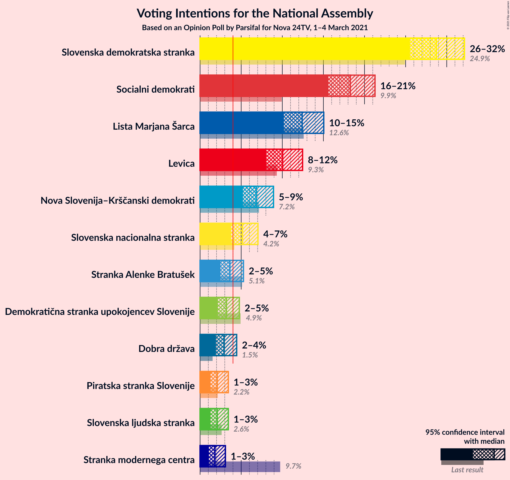

### Confidence Intervals

| Party | Last Result | Poll Result | 80% Confidence Interval | 90% Confidence Interval | 95% Confidence Interval | 99% Confidence Interval |
|:-----:|:-----------:|:-----------:|:-----------------------:|:-----------------------:|:-----------------------:|:-----------------------:|
| Slovenska demokratska stranka | 24.9% | 28.7% | 26.6–31.0% |26.0–31.6% |25.5–32.2% |24.6–33.2% |
| Socialni demokrati | 9.9% | 18.3% | 16.5–20.2% |16.0–20.8% |15.6–21.3% |14.8–22.2% |
| Lista Marjana Šarca | 12.6% | 12.4% | 11.0–14.1% |10.5–14.6% |10.2–15.0% |9.5–15.9% |
| Levica | 9.3% | 10.0% | 8.7–11.6% |8.4–12.1% |8.0–12.5% |7.5–13.3% |
| Nova Slovenija–Krščanski demokrati | 7.2% | 6.8% | 5.8–8.2% |5.5–8.6% |5.2–8.9% |4.7–9.6% |
| Slovenska nacionalna stranka | 4.2% | 5.2% | 4.2–6.4% |4.0–6.7% |3.8–7.0% |3.4–7.7% |
| Stranka Alenke Bratušek | 5.1% | 3.6% | 2.9–4.7% |2.7–5.0% |2.5–5.3% |2.2–5.8% |
| Demokratična stranka upokojencev Slovenije | 4.9% | 3.2% | 2.5–4.2% |2.3–4.5% |2.1–4.8% |1.8–5.3% |
| Dobra država | 1.5% | 2.9% | 2.3–3.9% |2.1–4.2% |1.9–4.5% |1.6–5.0% |
| Slovenska ljudska stranka | 2.6% | 2.1% | 1.6–3.0% |1.4–3.2% |1.3–3.4% |1.1–3.9% |
| Piratska stranka Slovenije | 2.2% | 2.1% | 1.6–3.0% |1.4–3.2% |1.3–3.4% |1.1–3.9% |
| Stranka modernega centra | 9.7% | 1.8% | 1.3–2.6% |1.2–2.9% |1.1–3.1% |0.9–3.5% |

*Note:* The poll result column reflects the actual value used in the calculations. Published results may vary slightly, and in addition be rounded to fewer digits.

## Seats

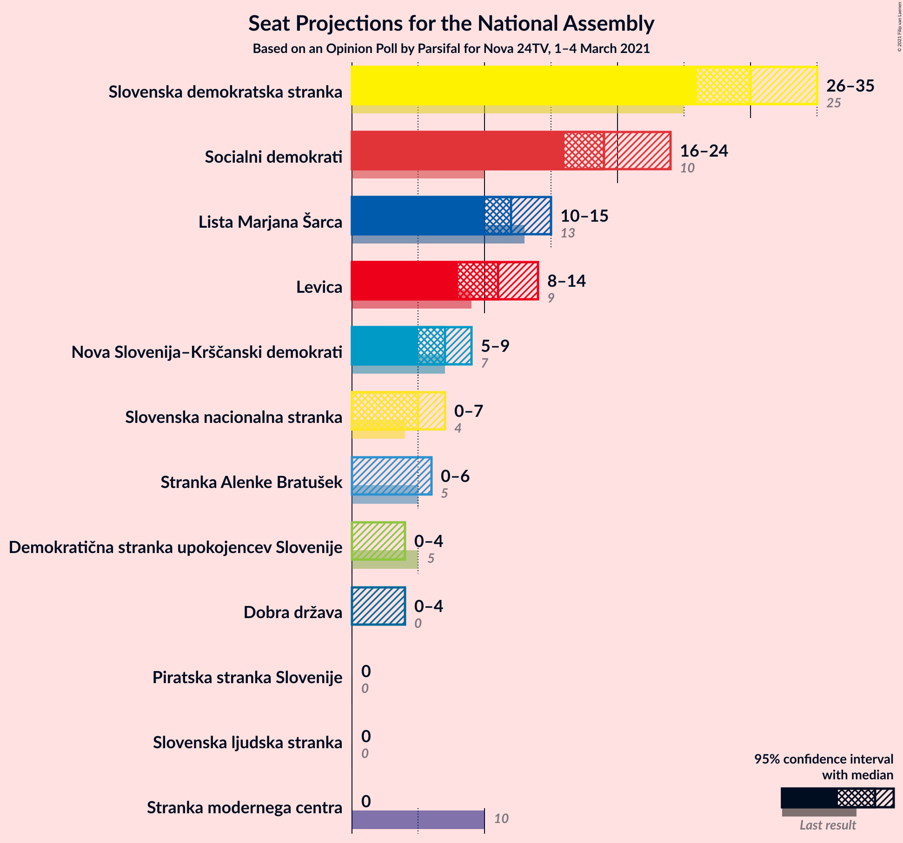

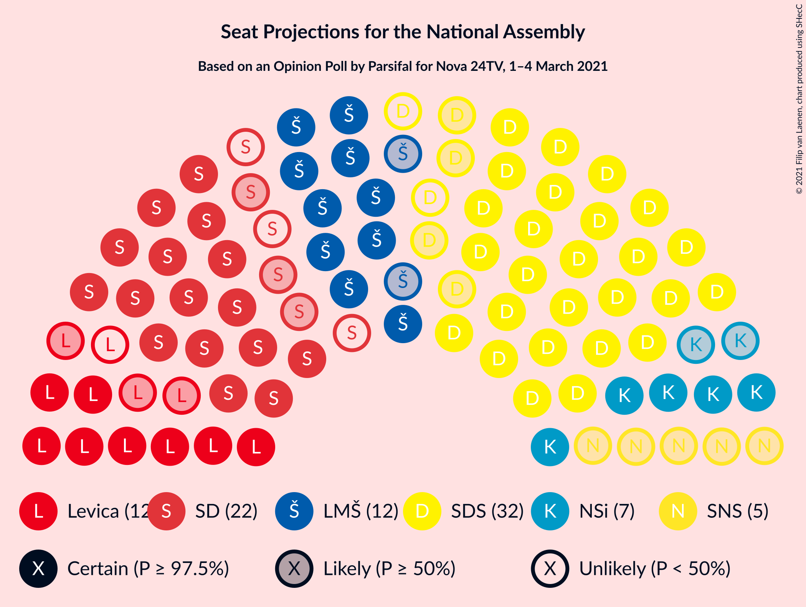

### Confidence Intervals

| Party | Last Result | Median | 80% Confidence Interval | 90% Confidence Interval | 95% Confidence Interval | 99% Confidence Interval |
|:-----:|:-----------:|:------:|:-----------------------:|:-----------------------:|:-----------------------:|:-----------------------:|
| <a href="#slovenska-demokratska-stranka">Slovenska demokratska stranka</a> | 25 | 30 | 28–34 |27–35 |26–35 |25–36 |
| <a href="#socialni-demokrati">Socialni demokrati</a> | 10 | 19 | 17–22 |16–24 |16–24 |16–24 |
| <a href="#lista-marjana-šarca">Lista Marjana Šarca</a> | 13 | 12 | 11–15 |10–15 |10–15 |9–17 |
| <a href="#levica">Levica</a> | 9 | 11 | 9–13 |9–14 |8–14 |7–14 |
| <a href="#nova-slovenija–krščanski-demokrati">Nova Slovenija–Krščanski demokrati</a> | 7 | 7 | 6–8 |5–9 |5–9 |4–10 |
| <a href="#slovenska-nacionalna-stranka">Slovenska nacionalna stranka</a> | 4 | 5 | 4–6 |0–7 |0–7 |0–8 |
| <a href="#stranka-alenke-bratušek">Stranka Alenke Bratušek</a> | 5 | 0 | 0–5 |0–5 |0–6 |0–6 |
| <a href="#demokratična-stranka-upokojencev-slovenije">Demokratična stranka upokojencev Slovenije</a> | 5 | 0 | 0–4 |0–4 |0–4 |0–5 |
| <a href="#dobra-država">Dobra država</a> | 0 | 0 | 0 |0–4 |0–4 |0–5 |
| <a href="#slovenska-ljudska-stranka">Slovenska ljudska stranka</a> | 0 | 0 | 0 |0 |0 |0 |
| <a href="#piratska-stranka-slovenije">Piratska stranka Slovenije</a> | 0 | 0 | 0 |0 |0 |0 |
| <a href="#stranka-modernega-centra">Stranka modernega centra</a> | 10 | 0 | 0 |0 |0 |0 |

### Slovenska demokratska stranka

*For a full overview of the results for this party, see the [Slovenska demokratska stranka](party-slovenskademokratskastranka.html) page.*

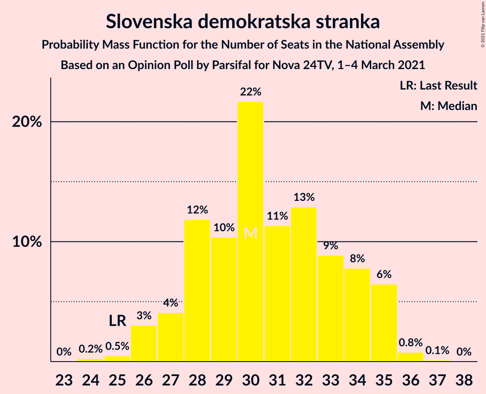

| Number of Seats | Probability | Accumulated | Special Marks |
|:---------------:|:-----------:|:-----------:|:-------------:|
| 24 | 0.2% | 100% |  |
| 25 | 0.5% | 99.7% | Last Result |
| 26 | 3% | 99.3% |  |
| 27 | 4% | 96% |  |
| 28 | 12% | 92% |  |
| 29 | 10% | 80% |  |
| 30 | 22% | 70% | Median |
| 31 | 11% | 48% |  |
| 32 | 13% | 37% |  |
| 33 | 9% | 24% |  |
| 34 | 8% | 15% |  |
| 35 | 6% | 7% |  |
| 36 | 0.8% | 0.9% |  |
| 37 | 0.1% | 0.1% |  |
| 38 | 0% | 0% |  |

### Socialni demokrati

*For a full overview of the results for this party, see the [Socialni demokrati](party-socialnidemokrati.html) page.*

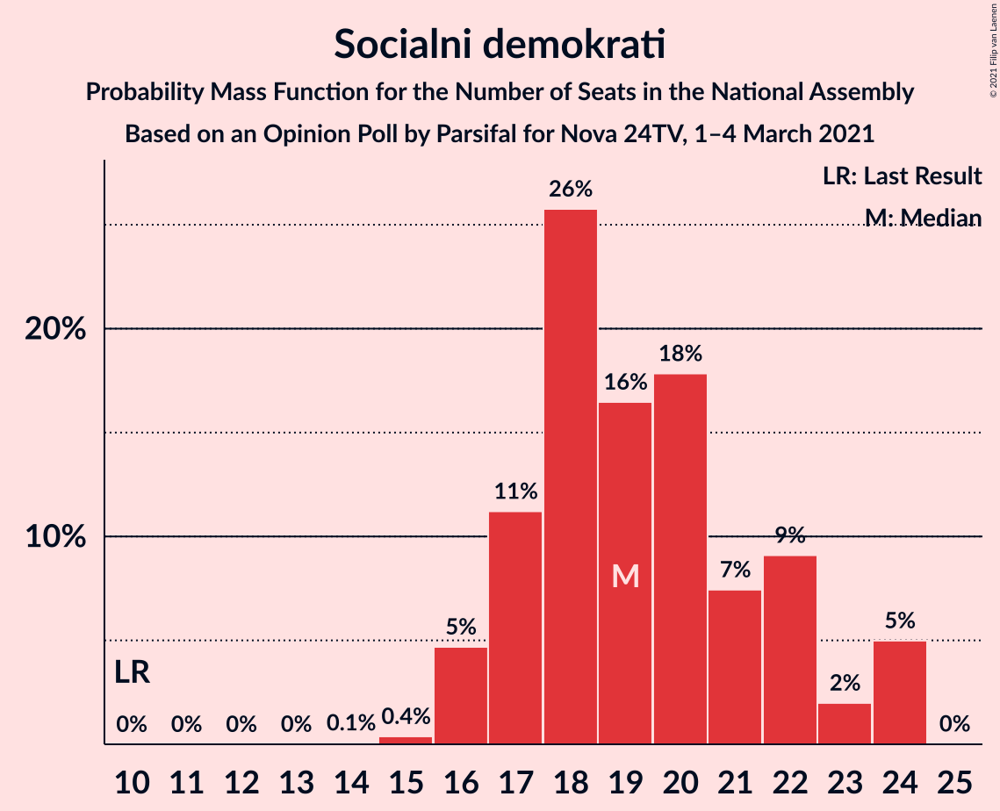

| Number of Seats | Probability | Accumulated | Special Marks |
|:---------------:|:-----------:|:-----------:|:-------------:|
| 10 | 0% | 100% | Last Result |
| 11 | 0% | 100% |  |
| 12 | 0% | 100% |  |
| 13 | 0% | 100% |  |
| 14 | 0.1% | 100% |  |
| 15 | 0.4% | 99.9% |  |
| 16 | 5% | 99.5% |  |
| 17 | 11% | 95% |  |
| 18 | 26% | 84% |  |
| 19 | 16% | 58% | Median |
| 20 | 18% | 41% |  |
| 21 | 7% | 24% |  |
| 22 | 9% | 16% |  |
| 23 | 2% | 7% |  |
| 24 | 5% | 5% |  |
| 25 | 0% | 0% |  |

### Lista Marjana Šarca

*For a full overview of the results for this party, see the [Lista Marjana Šarca](party-listamarjanašarca.html) page.*

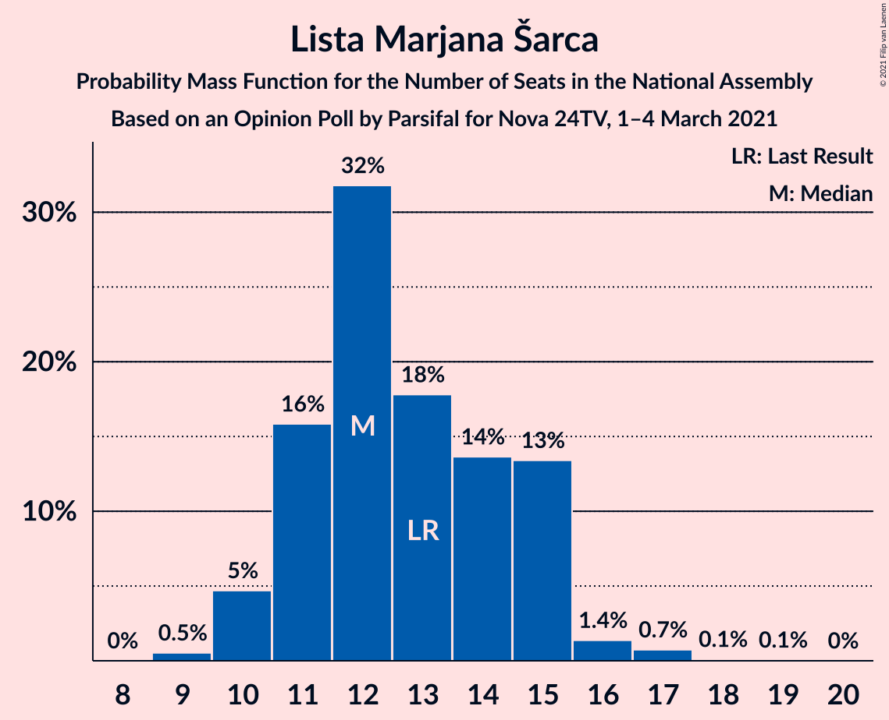

| Number of Seats | Probability | Accumulated | Special Marks |
|:---------------:|:-----------:|:-----------:|:-------------:|
| 9 | 0.5% | 100% |  |
| 10 | 5% | 99.5% |  |
| 11 | 16% | 95% |  |
| 12 | 32% | 79% | Median |
| 13 | 18% | 47% | Last Result |
| 14 | 14% | 29% |  |
| 15 | 13% | 16% |  |
| 16 | 1.4% | 2% |  |
| 17 | 0.7% | 0.9% |  |
| 18 | 0.1% | 0.2% |  |
| 19 | 0.1% | 0.1% |  |
| 20 | 0% | 0% |  |

### Levica

*For a full overview of the results for this party, see the [Levica](party-levica.html) page.*

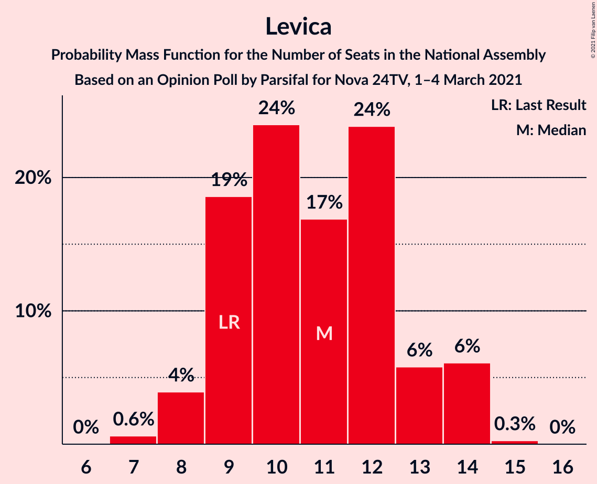

| Number of Seats | Probability | Accumulated | Special Marks |
|:---------------:|:-----------:|:-----------:|:-------------:|
| 7 | 0.6% | 100% |  |
| 8 | 4% | 99.4% |  |
| 9 | 19% | 95% | Last Result |
| 10 | 24% | 77% |  |
| 11 | 17% | 53% | Median |
| 12 | 24% | 36% |  |
| 13 | 6% | 12% |  |
| 14 | 6% | 6% |  |
| 15 | 0.3% | 0.3% |  |
| 16 | 0% | 0% |  |

### Nova Slovenija–Krščanski demokrati

*For a full overview of the results for this party, see the [Nova Slovenija–Krščanski demokrati](party-novaslovenija–krščanskidemokrati.html) page.*

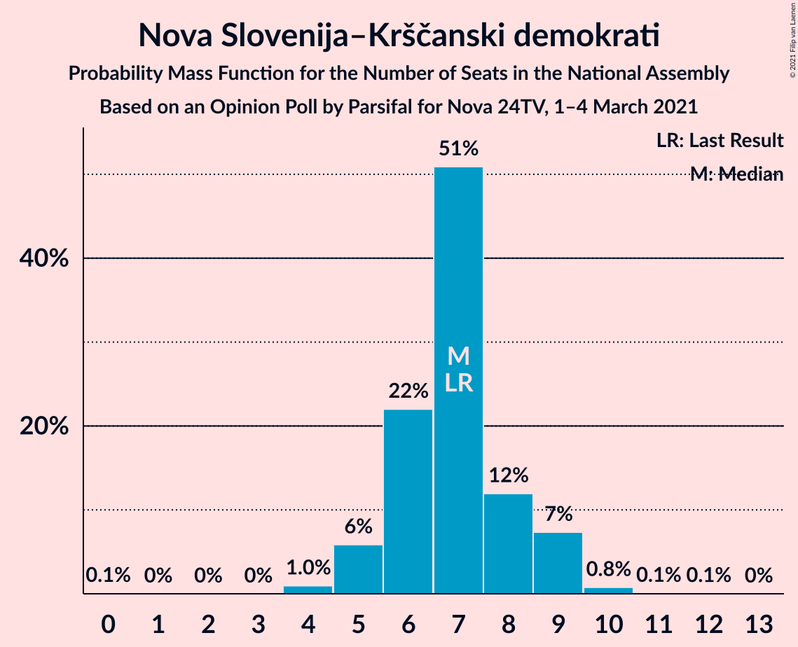

| Number of Seats | Probability | Accumulated | Special Marks |
|:---------------:|:-----------:|:-----------:|:-------------:|
| 0 | 0.1% | 100% |  |
| 1 | 0% | 99.9% |  |
| 2 | 0% | 99.9% |  |
| 3 | 0% | 99.9% |  |
| 4 | 1.0% | 99.9% |  |
| 5 | 6% | 99.0% |  |
| 6 | 22% | 93% |  |
| 7 | 51% | 71% | Last Result, Median |
| 8 | 12% | 20% |  |
| 9 | 7% | 8% |  |
| 10 | 0.8% | 0.9% |  |
| 11 | 0.1% | 0.1% |  |
| 12 | 0.1% | 0.1% |  |
| 13 | 0% | 0% |  |

### Slovenska nacionalna stranka

*For a full overview of the results for this party, see the [Slovenska nacionalna stranka](party-slovenskanacionalnastranka.html) page.*

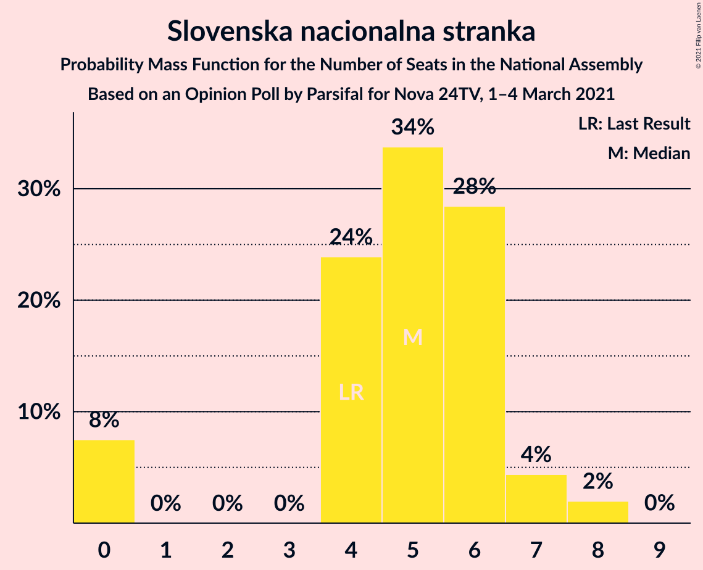

| Number of Seats | Probability | Accumulated | Special Marks |
|:---------------:|:-----------:|:-----------:|:-------------:|
| 0 | 8% | 100% |  |
| 1 | 0% | 92% |  |
| 2 | 0% | 92% |  |
| 3 | 0% | 92% |  |
| 4 | 24% | 92% | Last Result |
| 5 | 34% | 69% | Median |
| 6 | 28% | 35% |  |
| 7 | 4% | 6% |  |
| 8 | 2% | 2% |  |
| 9 | 0% | 0% |  |

### Stranka Alenke Bratušek

*For a full overview of the results for this party, see the [Stranka Alenke Bratušek](party-strankaalenkebratušek.html) page.*

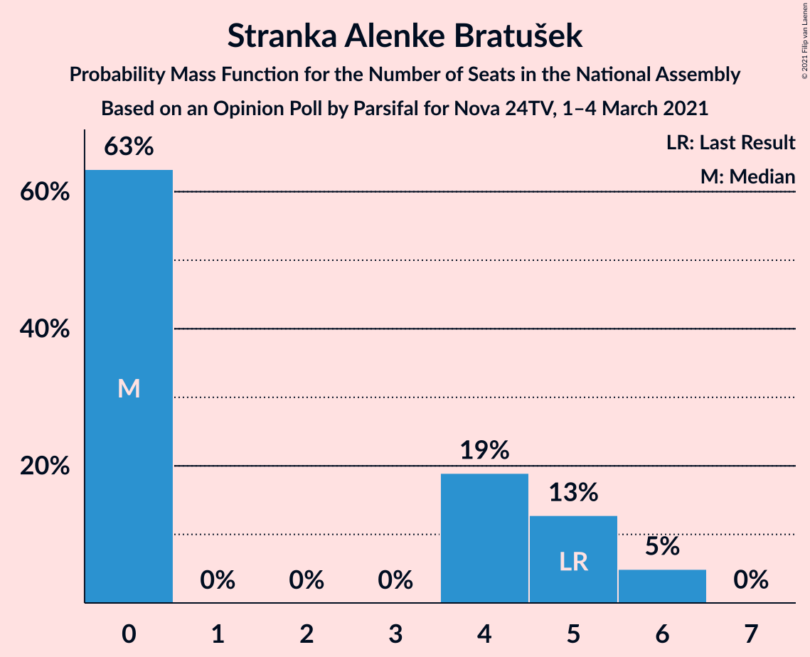

| Number of Seats | Probability | Accumulated | Special Marks |
|:---------------:|:-----------:|:-----------:|:-------------:|
| 0 | 63% | 100% | Median |
| 1 | 0% | 37% |  |
| 2 | 0% | 37% |  |
| 3 | 0% | 37% |  |
| 4 | 19% | 37% |  |
| 5 | 13% | 18% | Last Result |
| 6 | 5% | 5% |  |
| 7 | 0% | 0% |  |

### Demokratična stranka upokojencev Slovenije

*For a full overview of the results for this party, see the [Demokratična stranka upokojencev Slovenije](party-demokratičnastrankaupokojencevslovenije.html) page.*

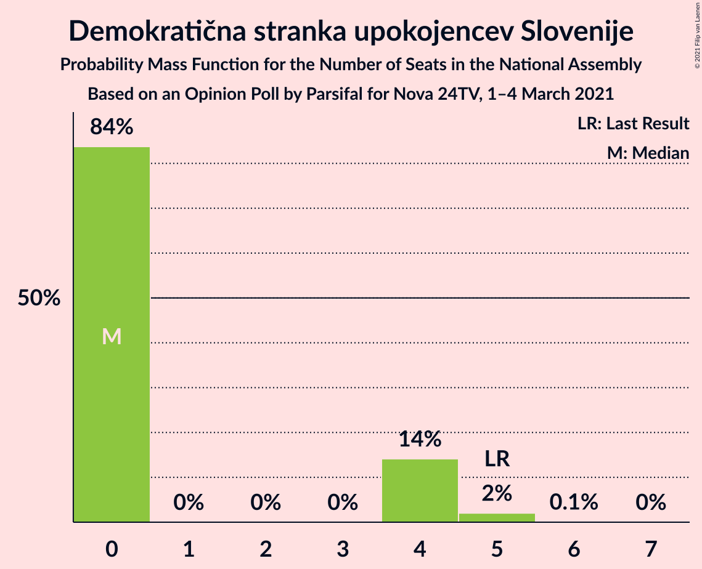

| Number of Seats | Probability | Accumulated | Special Marks |
|:---------------:|:-----------:|:-----------:|:-------------:|
| 0 | 84% | 100% | Median |
| 1 | 0% | 16% |  |
| 2 | 0% | 16% |  |
| 3 | 0% | 16% |  |
| 4 | 14% | 16% |  |
| 5 | 2% | 2% | Last Result |
| 6 | 0.1% | 0.1% |  |
| 7 | 0% | 0% |  |

### Dobra država

*For a full overview of the results for this party, see the [Dobra država](party-dobradržava.html) page.*

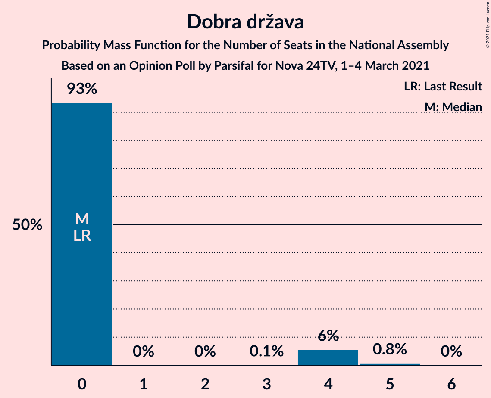

| Number of Seats | Probability | Accumulated | Special Marks |
|:---------------:|:-----------:|:-----------:|:-------------:|
| 0 | 93% | 100% | Last Result, Median |
| 1 | 0% | 7% |  |
| 2 | 0% | 7% |  |
| 3 | 0.1% | 7% |  |
| 4 | 6% | 6% |  |
| 5 | 0.8% | 0.8% |  |
| 6 | 0% | 0% |  |

### Slovenska ljudska stranka

*For a full overview of the results for this party, see the [Slovenska ljudska stranka](party-slovenskaljudskastranka.html) page.*

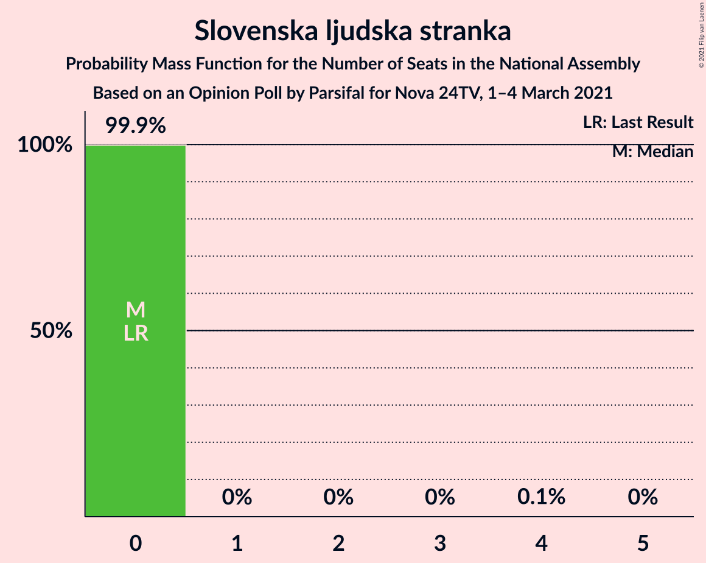

| Number of Seats | Probability | Accumulated | Special Marks |
|:---------------:|:-----------:|:-----------:|:-------------:|
| 0 | 99.9% | 100% | Last Result, Median |
| 1 | 0% | 0.1% |  |
| 2 | 0% | 0.1% |  |
| 3 | 0% | 0.1% |  |
| 4 | 0.1% | 0.1% |  |
| 5 | 0% | 0% |  |

### Piratska stranka Slovenije

*For a full overview of the results for this party, see the [Piratska stranka Slovenije](party-piratskastrankaslovenije.html) page.*

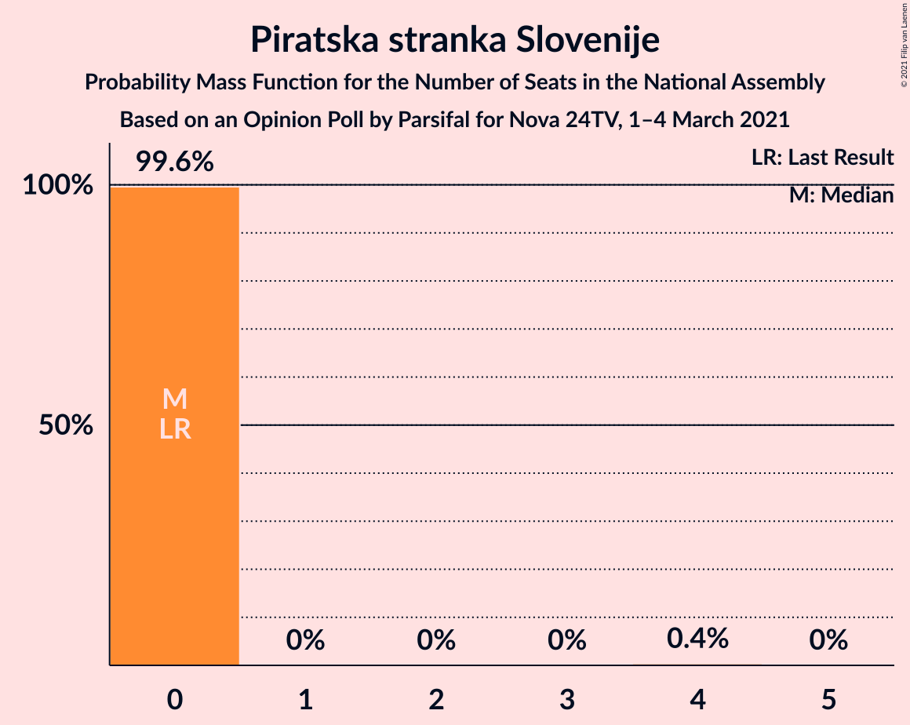

| Number of Seats | Probability | Accumulated | Special Marks |
|:---------------:|:-----------:|:-----------:|:-------------:|
| 0 | 99.6% | 100% | Last Result, Median |
| 1 | 0% | 0.4% |  |
| 2 | 0% | 0.4% |  |
| 3 | 0% | 0.4% |  |
| 4 | 0.4% | 0.4% |  |
| 5 | 0% | 0% |  |

### Stranka modernega centra

*For a full overview of the results for this party, see the [Stranka modernega centra](party-strankamodernegacentra.html) page.*

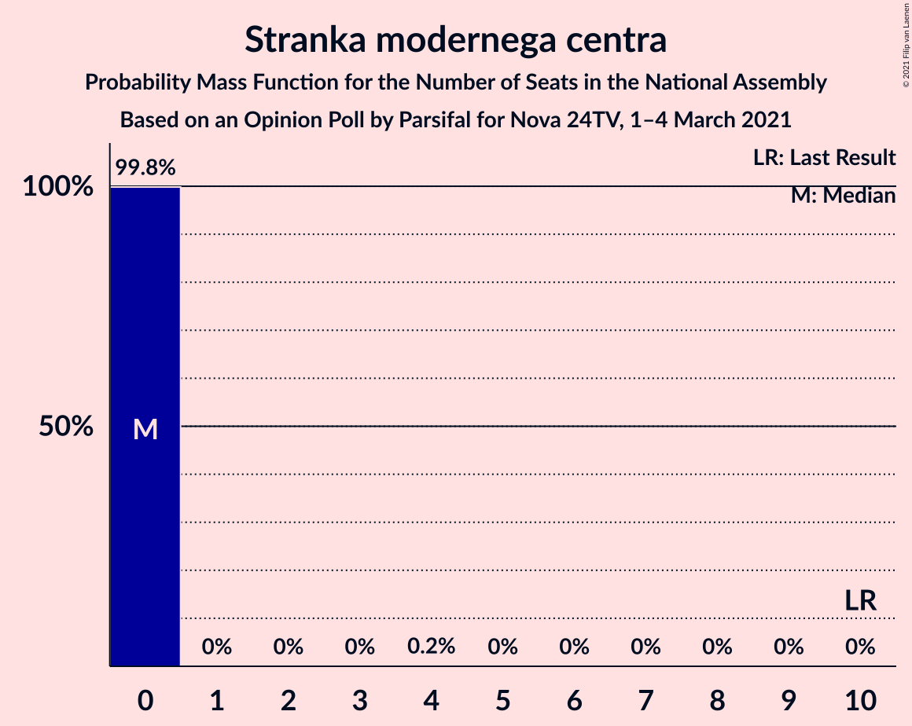

| Number of Seats | Probability | Accumulated | Special Marks |
|:---------------:|:-----------:|:-----------:|:-------------:|
| 0 | 99.8% | 100% | Median |
| 1 | 0% | 0.2% |  |
| 2 | 0% | 0.2% |  |
| 3 | 0% | 0.2% |  |
| 4 | 0.2% | 0.2% |  |
| 5 | 0% | 0% |  |
| 6 | 0% | 0% |  |
| 7 | 0% | 0% |  |
| 8 | 0% | 0% |  |
| 9 | 0% | 0% |  |
| 10 | 0% | 0% | Last Result |

## Coalitions

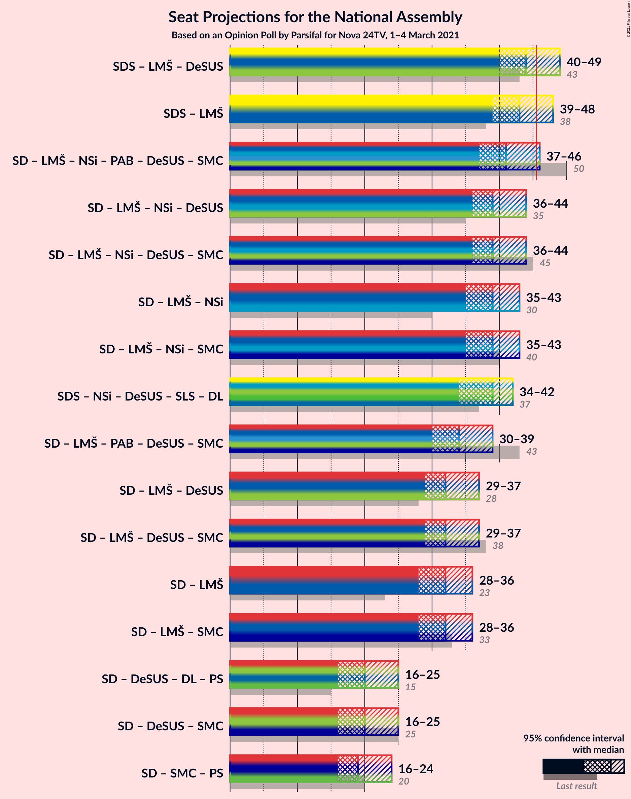

### Confidence Intervals

| Coalition | Last Result | Median | Majority? | 80% Confidence Interval | 90% Confidence Interval | 95% Confidence Interval | 99% Confidence Interval |
|:---------:|:-----------:|:------:|:---------:|:-----------------------:|:-----------------------:|:-----------------------:|:-----------------------:|
| Slovenska demokratska stranka – Lista Marjana Šarca – Demokratična stranka upokojencev Slovenije | 43 | 44 | 32% | 40–48 | 40–48 | 40–49 | 37–50 |
| Slovenska demokratska stranka – Lista Marjana Šarca | 38 | 43 | 24% | 40–47 | 40–48 | 39–48 | 37–49 |
| Socialni demokrati – Lista Marjana Šarca – Nova Slovenija–Krščanski demokrati – Stranka Alenke Bratušek – Demokratična stranka upokojencev Slovenije – Stranka modernega centra | 50 | 41 | 4% | 38–44 | 38–45 | 37–46 | 36–48 |
| Socialni demokrati – Lista Marjana Šarca – Nova Slovenija–Krščanski demokrati – Demokratična stranka upokojencev Slovenije | 35 | 39 | 1.3% | 36–43 | 36–44 | 36–44 | 34–46 |
| Socialni demokrati – Lista Marjana Šarca – Nova Slovenija–Krščanski demokrati – Demokratična stranka upokojencev Slovenije – Stranka modernega centra | 45 | 39 | 1.3% | 36–43 | 36–44 | 36–44 | 34–46 |
| Socialni demokrati – Lista Marjana Šarca – Nova Slovenija–Krščanski demokrati | 30 | 39 | 0.7% | 36–42 | 36–43 | 35–43 | 34–46 |
| Socialni demokrati – Lista Marjana Šarca – Nova Slovenija–Krščanski demokrati – Stranka modernega centra | 40 | 39 | 0.7% | 36–42 | 36–43 | 35–43 | 34–46 |
| Socialni demokrati – Lista Marjana Šarca – Stranka Alenke Bratušek – Demokratična stranka upokojencev Slovenije – Stranka modernega centra | 43 | 34 | 0% | 32–37 | 31–39 | 30–39 | 29–41 |
| Socialni demokrati – Lista Marjana Šarca – Demokratična stranka upokojencev Slovenije | 28 | 32 | 0% | 29–36 | 29–37 | 29–37 | 28–39 |
| Socialni demokrati – Lista Marjana Šarca – Demokratična stranka upokojencev Slovenije – Stranka modernega centra | 38 | 32 | 0% | 29–36 | 29–37 | 29–37 | 28–39 |
| Socialni demokrati – Lista Marjana Šarca | 23 | 32 | 0% | 29–35 | 29–36 | 28–36 | 27–38 |
| Socialni demokrati – Lista Marjana Šarca – Stranka modernega centra | 33 | 32 | 0% | 29–35 | 29–36 | 28–36 | 27–38 |
| Socialni demokrati – Demokratična stranka upokojencev Slovenije – Stranka modernega centra | 25 | 20 | 0% | 17–23 | 17–24 | 16–25 | 16–25 |

### Slovenska demokratska stranka – Lista Marjana Šarca – Demokratična stranka upokojencev Slovenije

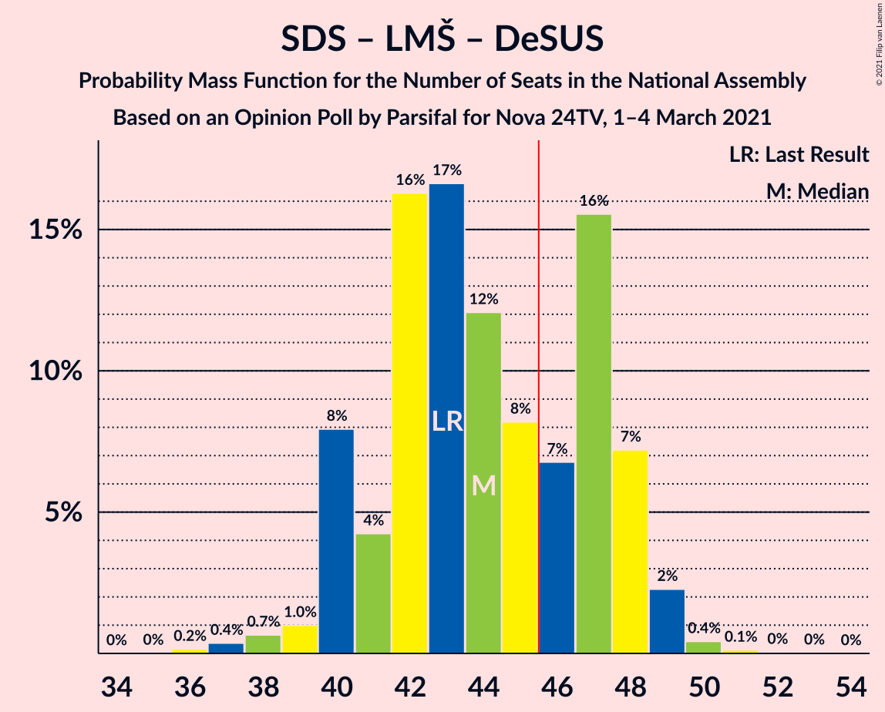

| Number of Seats | Probability | Accumulated | Special Marks |
|:---------------:|:-----------:|:-----------:|:-------------:|
| 36 | 0.2% | 100% |  |
| 37 | 0.4% | 99.8% |  |
| 38 | 0.7% | 99.5% |  |
| 39 | 1.0% | 98.8% |  |
| 40 | 8% | 98% |  |
| 41 | 4% | 90% |  |
| 42 | 16% | 86% | Median |
| 43 | 17% | 69% | Last Result |
| 44 | 12% | 53% |  |
| 45 | 8% | 41% |  |
| 46 | 7% | 32% | Majority |
| 47 | 16% | 26% |  |
| 48 | 7% | 10% |  |
| 49 | 2% | 3% |  |
| 50 | 0.4% | 0.6% |  |
| 51 | 0.1% | 0.2% |  |
| 52 | 0% | 0.1% |  |
| 53 | 0% | 0% |  |

### Slovenska demokratska stranka – Lista Marjana Šarca

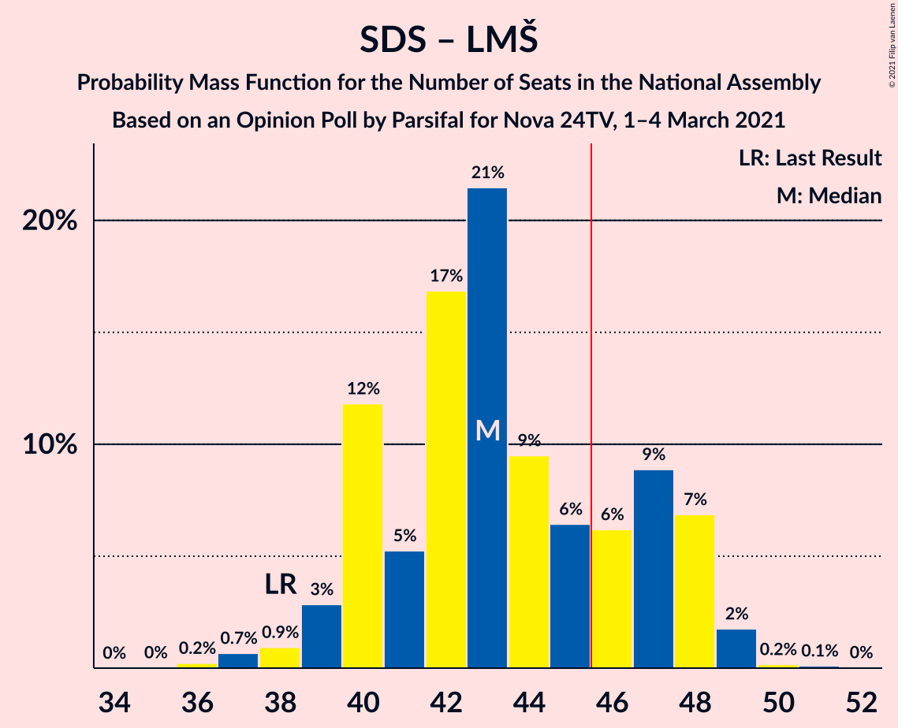

| Number of Seats | Probability | Accumulated | Special Marks |
|:---------------:|:-----------:|:-----------:|:-------------:|
| 36 | 0.2% | 100% |  |
| 37 | 0.7% | 99.8% |  |
| 38 | 0.9% | 99.1% | Last Result |
| 39 | 3% | 98% |  |
| 40 | 12% | 95% |  |
| 41 | 5% | 83% |  |
| 42 | 17% | 78% | Median |
| 43 | 21% | 61% |  |
| 44 | 9% | 40% |  |
| 45 | 6% | 30% |  |
| 46 | 6% | 24% | Majority |
| 47 | 9% | 18% |  |
| 48 | 7% | 9% |  |
| 49 | 2% | 2% |  |
| 50 | 0.2% | 0.3% |  |
| 51 | 0.1% | 0.1% |  |
| 52 | 0% | 0% |  |

### Socialni demokrati – Lista Marjana Šarca – Nova Slovenija–Krščanski demokrati – Stranka Alenke Bratušek – Demokratična stranka upokojencev Slovenije – Stranka modernega centra

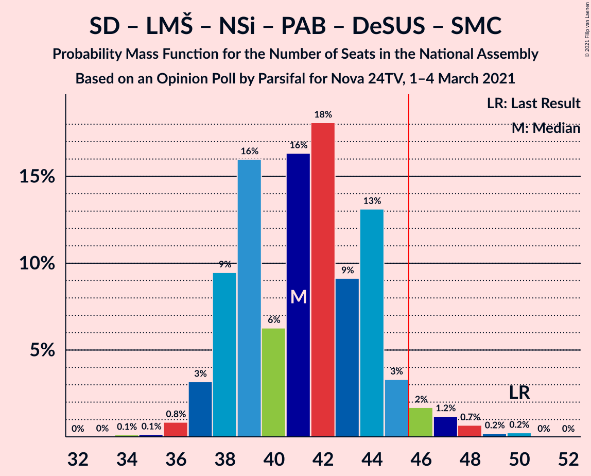

| Number of Seats | Probability | Accumulated | Special Marks |
|:---------------:|:-----------:|:-----------:|:-------------:|
| 34 | 0.1% | 100% |  |
| 35 | 0.1% | 99.9% |  |
| 36 | 0.8% | 99.7% |  |
| 37 | 3% | 98.9% |  |
| 38 | 9% | 96% | Median |
| 39 | 16% | 86% |  |
| 40 | 6% | 70% |  |
| 41 | 16% | 64% |  |
| 42 | 18% | 48% |  |
| 43 | 9% | 30% |  |
| 44 | 13% | 20% |  |
| 45 | 3% | 7% |  |
| 46 | 2% | 4% | Majority |
| 47 | 1.2% | 2% |  |
| 48 | 0.7% | 1.1% |  |
| 49 | 0.2% | 0.4% |  |
| 50 | 0.2% | 0.2% | Last Result |
| 51 | 0% | 0% |  |

### Socialni demokrati – Lista Marjana Šarca – Nova Slovenija–Krščanski demokrati – Demokratična stranka upokojencev Slovenije

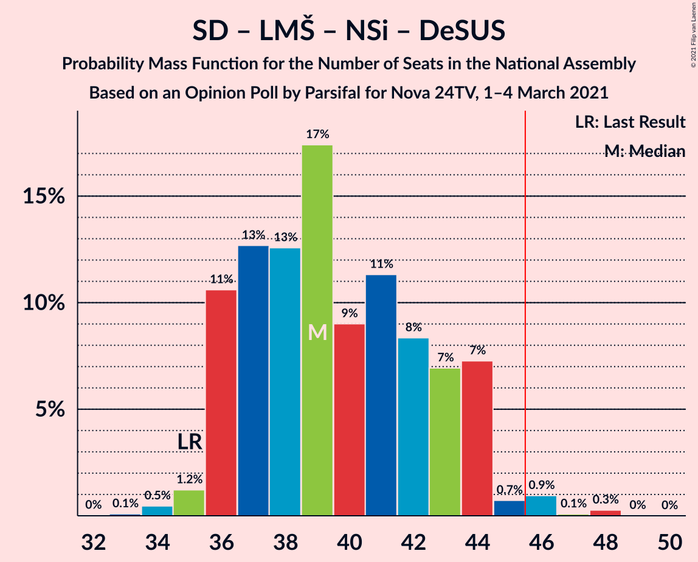

| Number of Seats | Probability | Accumulated | Special Marks |
|:---------------:|:-----------:|:-----------:|:-------------:|
| 33 | 0.1% | 100% |  |
| 34 | 0.5% | 99.9% |  |
| 35 | 1.2% | 99.4% | Last Result |
| 36 | 11% | 98% |  |
| 37 | 13% | 88% |  |
| 38 | 13% | 75% | Median |
| 39 | 17% | 62% |  |
| 40 | 9% | 45% |  |
| 41 | 11% | 36% |  |
| 42 | 8% | 25% |  |
| 43 | 7% | 16% |  |
| 44 | 7% | 9% |  |
| 45 | 0.7% | 2% |  |
| 46 | 0.9% | 1.3% | Majority |
| 47 | 0.1% | 0.4% |  |
| 48 | 0.3% | 0.3% |  |
| 49 | 0% | 0% |  |

### Socialni demokrati – Lista Marjana Šarca – Nova Slovenija–Krščanski demokrati – Demokratična stranka upokojencev Slovenije – Stranka modernega centra

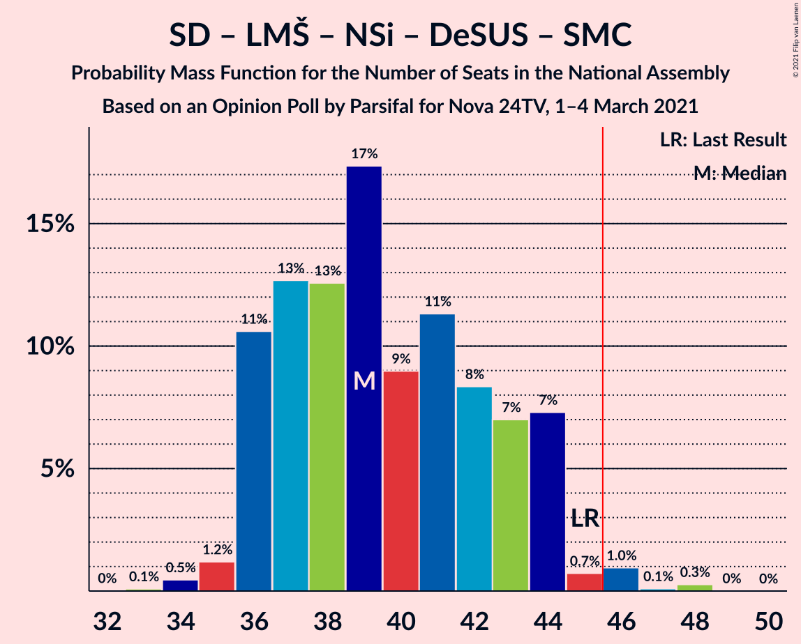

| Number of Seats | Probability | Accumulated | Special Marks |
|:---------------:|:-----------:|:-----------:|:-------------:|
| 33 | 0.1% | 100% |  |
| 34 | 0.5% | 99.9% |  |
| 35 | 1.2% | 99.4% |  |
| 36 | 11% | 98% |  |
| 37 | 13% | 88% |  |
| 38 | 13% | 75% | Median |
| 39 | 17% | 62% |  |
| 40 | 9% | 45% |  |
| 41 | 11% | 36% |  |
| 42 | 8% | 25% |  |
| 43 | 7% | 16% |  |
| 44 | 7% | 9% |  |
| 45 | 0.7% | 2% | Last Result |
| 46 | 1.0% | 1.3% | Majority |
| 47 | 0.1% | 0.4% |  |
| 48 | 0.3% | 0.3% |  |
| 49 | 0% | 0% |  |

### Socialni demokrati – Lista Marjana Šarca – Nova Slovenija–Krščanski demokrati

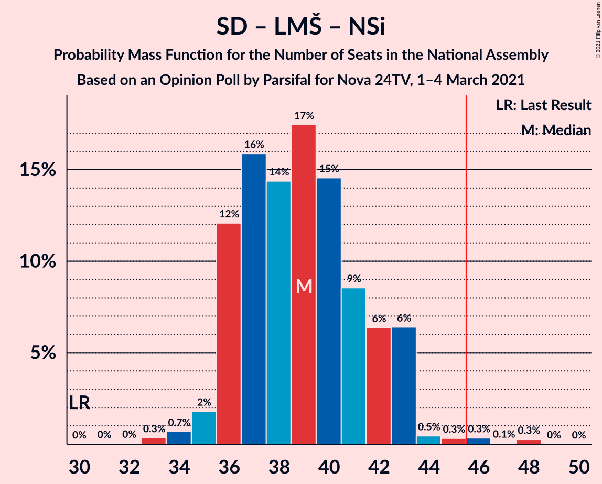

| Number of Seats | Probability | Accumulated | Special Marks |
|:---------------:|:-----------:|:-----------:|:-------------:|
| 30 | 0% | 100% | Last Result |
| 31 | 0% | 100% |  |
| 32 | 0% | 100% |  |
| 33 | 0.3% | 99.9% |  |
| 34 | 0.7% | 99.6% |  |
| 35 | 2% | 98.9% |  |
| 36 | 12% | 97% |  |
| 37 | 16% | 85% |  |
| 38 | 14% | 69% | Median |
| 39 | 17% | 55% |  |
| 40 | 15% | 37% |  |
| 41 | 9% | 23% |  |
| 42 | 6% | 14% |  |
| 43 | 6% | 8% |  |
| 44 | 0.5% | 1.4% |  |
| 45 | 0.3% | 1.0% |  |
| 46 | 0.3% | 0.7% | Majority |
| 47 | 0.1% | 0.3% |  |
| 48 | 0.3% | 0.3% |  |
| 49 | 0% | 0% |  |

### Socialni demokrati – Lista Marjana Šarca – Nova Slovenija–Krščanski demokrati – Stranka modernega centra

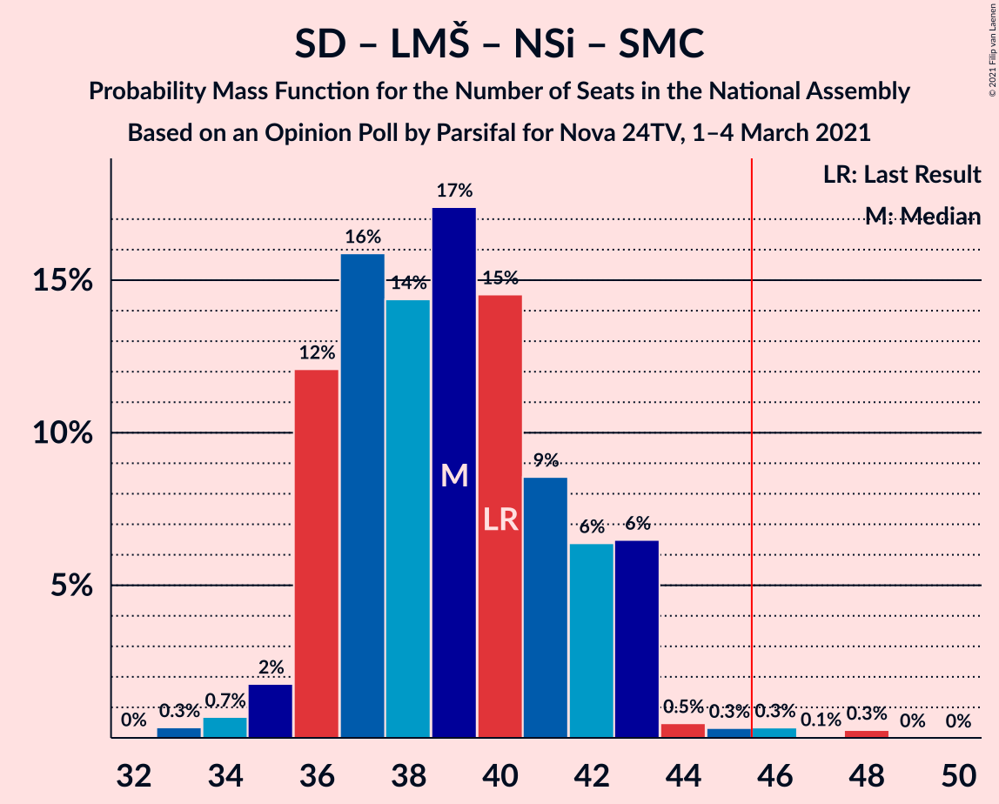

| Number of Seats | Probability | Accumulated | Special Marks |
|:---------------:|:-----------:|:-----------:|:-------------:|
| 32 | 0% | 100% |  |
| 33 | 0.3% | 99.9% |  |
| 34 | 0.7% | 99.6% |  |
| 35 | 2% | 98.9% |  |
| 36 | 12% | 97% |  |
| 37 | 16% | 85% |  |
| 38 | 14% | 69% | Median |
| 39 | 17% | 55% |  |
| 40 | 15% | 37% | Last Result |
| 41 | 9% | 23% |  |
| 42 | 6% | 14% |  |
| 43 | 6% | 8% |  |
| 44 | 0.5% | 1.5% |  |
| 45 | 0.3% | 1.0% |  |
| 46 | 0.3% | 0.7% | Majority |
| 47 | 0.1% | 0.3% |  |
| 48 | 0.3% | 0.3% |  |
| 49 | 0% | 0% |  |

### Socialni demokrati – Lista Marjana Šarca – Stranka Alenke Bratušek – Demokratična stranka upokojencev Slovenije – Stranka modernega centra

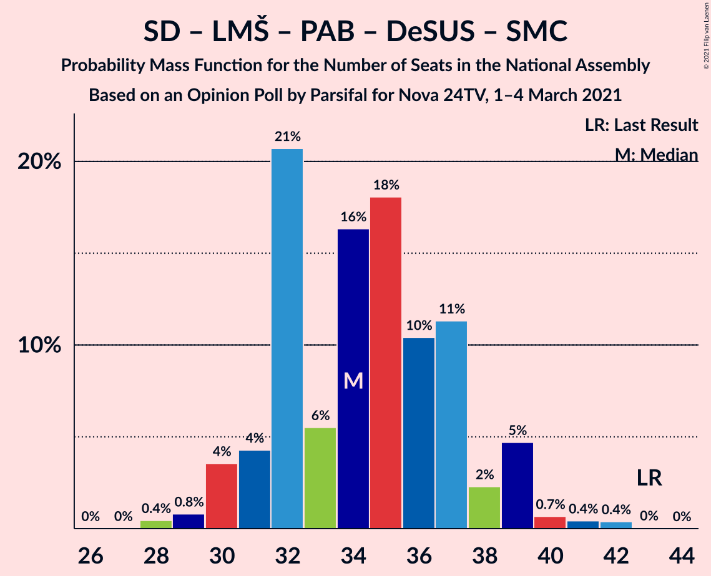

| Number of Seats | Probability | Accumulated | Special Marks |
|:---------------:|:-----------:|:-----------:|:-------------:|
| 28 | 0.4% | 100% |  |
| 29 | 0.8% | 99.5% |  |
| 30 | 4% | 98.7% |  |
| 31 | 4% | 95% | Median |
| 32 | 21% | 91% |  |
| 33 | 6% | 70% |  |
| 34 | 16% | 65% |  |
| 35 | 18% | 48% |  |
| 36 | 10% | 30% |  |
| 37 | 11% | 20% |  |
| 38 | 2% | 9% |  |
| 39 | 5% | 6% |  |
| 40 | 0.7% | 2% |  |
| 41 | 0.4% | 0.9% |  |
| 42 | 0.4% | 0.4% |  |
| 43 | 0% | 0.1% | Last Result |
| 44 | 0% | 0% |  |

### Socialni demokrati – Lista Marjana Šarca – Demokratična stranka upokojencev Slovenije

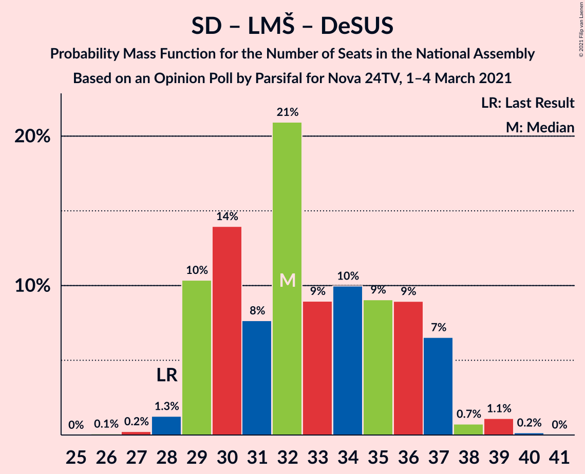

| Number of Seats | Probability | Accumulated | Special Marks |
|:---------------:|:-----------:|:-----------:|:-------------:|
| 26 | 0.1% | 100% |  |
| 27 | 0.2% | 99.9% |  |
| 28 | 1.3% | 99.7% | Last Result |
| 29 | 10% | 98% |  |
| 30 | 14% | 88% |  |
| 31 | 8% | 74% | Median |
| 32 | 21% | 66% |  |
| 33 | 9% | 45% |  |
| 34 | 10% | 37% |  |
| 35 | 9% | 27% |  |
| 36 | 9% | 18% |  |
| 37 | 7% | 9% |  |
| 38 | 0.7% | 2% |  |
| 39 | 1.1% | 1.3% |  |
| 40 | 0.2% | 0.2% |  |
| 41 | 0% | 0% |  |

### Socialni demokrati – Lista Marjana Šarca – Demokratična stranka upokojencev Slovenije – Stranka modernega centra

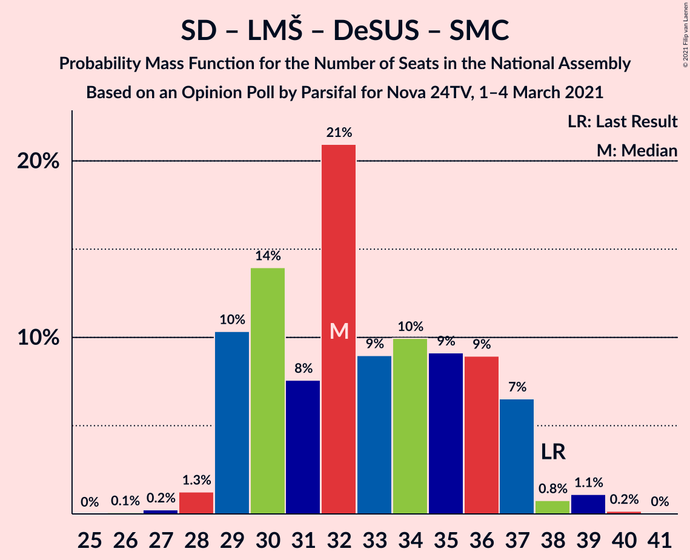

| Number of Seats | Probability | Accumulated | Special Marks |
|:---------------:|:-----------:|:-----------:|:-------------:|
| 26 | 0.1% | 100% |  |
| 27 | 0.2% | 99.9% |  |
| 28 | 1.3% | 99.7% |  |
| 29 | 10% | 98% |  |
| 30 | 14% | 88% |  |
| 31 | 8% | 74% | Median |
| 32 | 21% | 67% |  |
| 33 | 9% | 46% |  |
| 34 | 10% | 37% |  |
| 35 | 9% | 27% |  |
| 36 | 9% | 18% |  |
| 37 | 7% | 9% |  |
| 38 | 0.8% | 2% | Last Result |
| 39 | 1.1% | 1.3% |  |
| 40 | 0.2% | 0.2% |  |
| 41 | 0% | 0% |  |

### Socialni demokrati – Lista Marjana Šarca

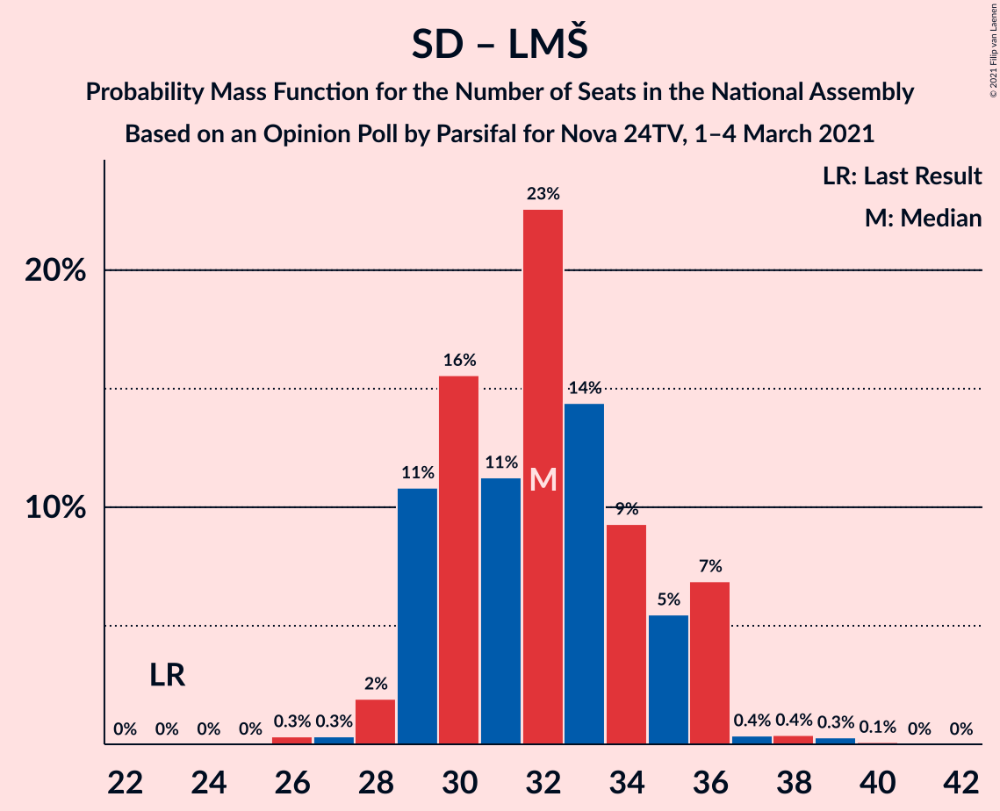

| Number of Seats | Probability | Accumulated | Special Marks |
|:---------------:|:-----------:|:-----------:|:-------------:|
| 23 | 0% | 100% | Last Result |
| 24 | 0% | 100% |  |
| 25 | 0% | 100% |  |
| 26 | 0.3% | 100% |  |
| 27 | 0.3% | 99.7% |  |
| 28 | 2% | 99.3% |  |
| 29 | 11% | 97% |  |
| 30 | 16% | 87% |  |
| 31 | 11% | 71% | Median |
| 32 | 23% | 60% |  |
| 33 | 14% | 37% |  |
| 34 | 9% | 23% |  |
| 35 | 5% | 13% |  |
| 36 | 7% | 8% |  |
| 37 | 0.4% | 1.1% |  |
| 38 | 0.4% | 0.8% |  |
| 39 | 0.3% | 0.4% |  |
| 40 | 0.1% | 0.1% |  |
| 41 | 0% | 0% |  |

### Socialni demokrati – Lista Marjana Šarca – Stranka modernega centra

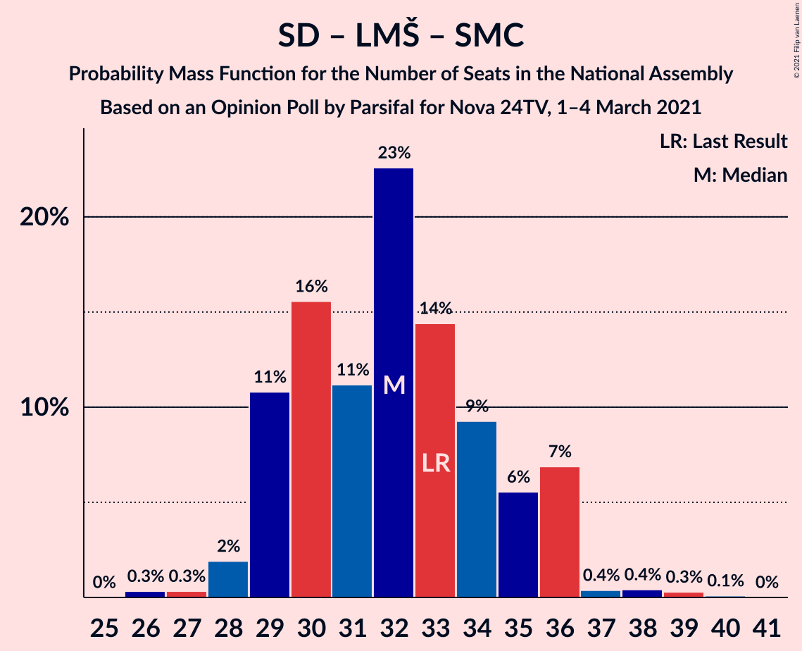

| Number of Seats | Probability | Accumulated | Special Marks |
|:---------------:|:-----------:|:-----------:|:-------------:|
| 26 | 0.3% | 100% |  |
| 27 | 0.3% | 99.7% |  |
| 28 | 2% | 99.3% |  |
| 29 | 11% | 97% |  |
| 30 | 16% | 87% |  |
| 31 | 11% | 71% | Median |
| 32 | 23% | 60% |  |
| 33 | 14% | 37% | Last Result |
| 34 | 9% | 23% |  |
| 35 | 6% | 14% |  |
| 36 | 7% | 8% |  |
| 37 | 0.4% | 1.2% |  |
| 38 | 0.4% | 0.8% |  |
| 39 | 0.3% | 0.4% |  |
| 40 | 0.1% | 0.1% |  |
| 41 | 0% | 0% |  |

### Socialni demokrati – Demokratična stranka upokojencev Slovenije – Stranka modernega centra

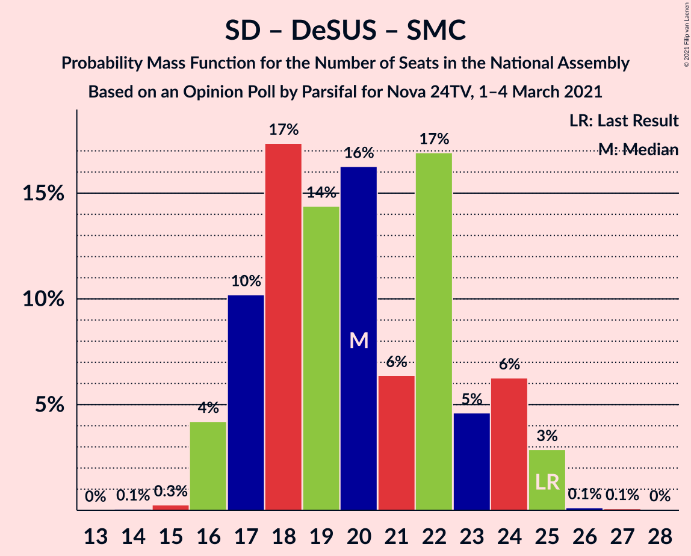

| Number of Seats | Probability | Accumulated | Special Marks |
|:---------------:|:-----------:|:-----------:|:-------------:|
| 14 | 0.1% | 100% |  |
| 15 | 0.3% | 99.9% |  |
| 16 | 4% | 99.7% |  |
| 17 | 10% | 95% |  |
| 18 | 17% | 85% |  |
| 19 | 14% | 68% | Median |
| 20 | 16% | 54% |  |
| 21 | 6% | 37% |  |
| 22 | 17% | 31% |  |
| 23 | 5% | 14% |  |
| 24 | 6% | 9% |  |
| 25 | 3% | 3% | Last Result |
| 26 | 0.1% | 0.2% |  |
| 27 | 0.1% | 0.1% |  |
| 28 | 0% | 0% |  |

## Technical Information

### Opinion Poll

+ **Polling firm:** Parsifal
+ **Commissioner(s):** Nova 24TV
+ **Fieldwork period:** 1–4 March 2021

### Calculations

+ **Sample size:** 717
+ **Simulations done:** 1,048,576
+ **Error estimate:** 5.50%

