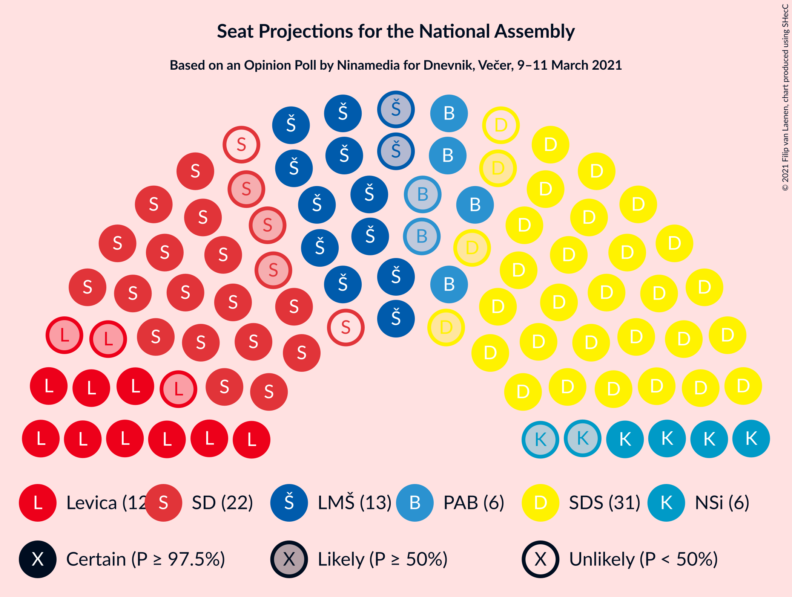
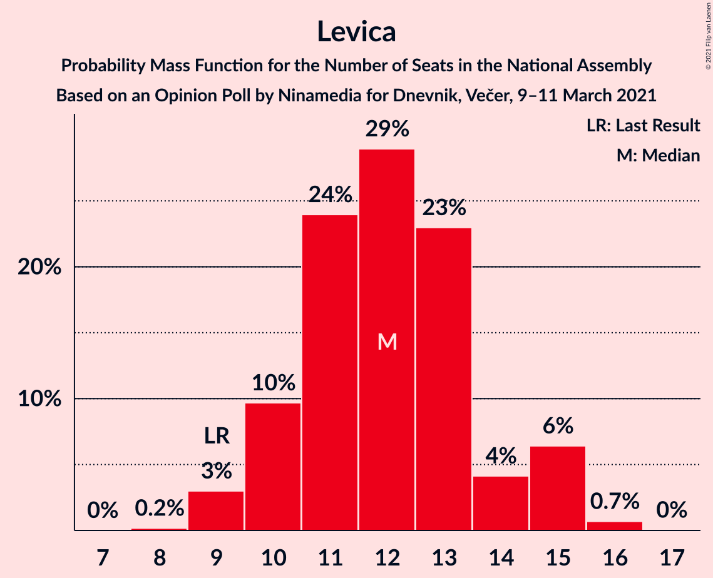
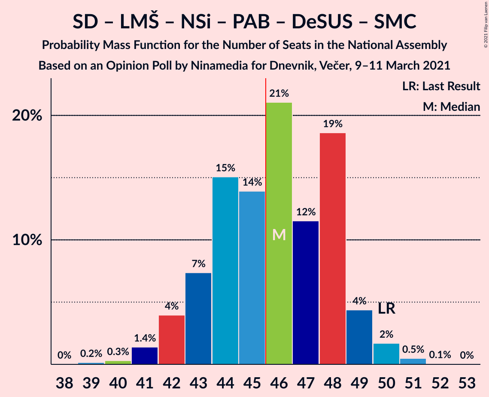
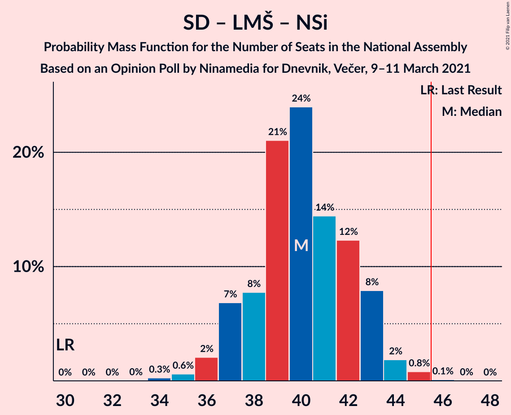
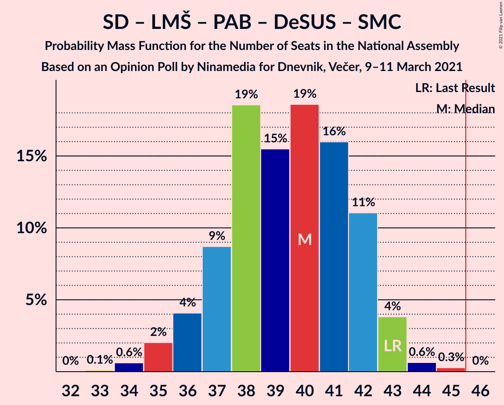
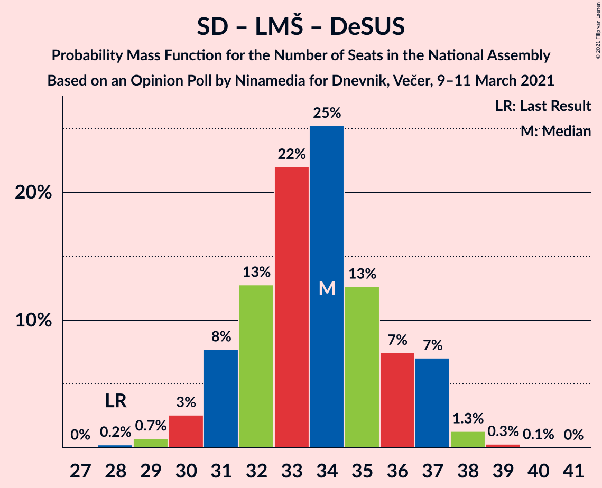
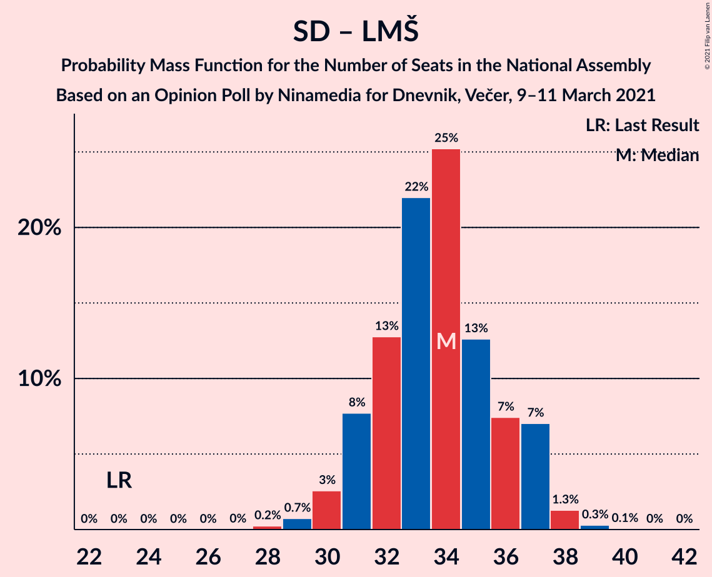
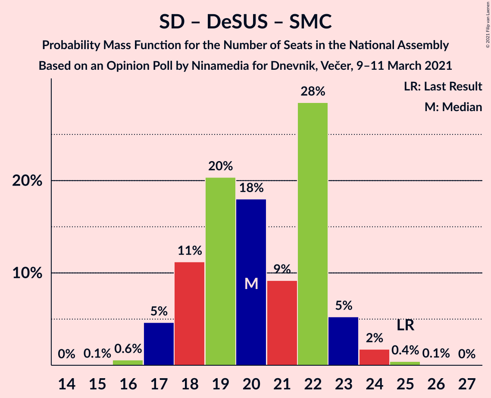

# Opinion Poll by Ninamedia for Dnevnik, Večer, 9–11 March 2021

<a href="#voting-intentions">Voting Intentions</a> | <a href="#seats">Seats</a> | <a href="#coalitions">Coalitions</a> | <a href="#technical-information">Technical Information</a>

## Voting Intentions

### Confidence Intervals

| Party | Last Result | Poll Result | 80% Confidence Interval | 90% Confidence Interval | 95% Confidence Interval | 99% Confidence Interval |
|:-----:|:-----------:|:-----------:|:-----------------------:|:-----------------------:|:-----------------------:|:-----------------------:|
| Slovenska demokratska stranka | 24.9% | 29.9% | 27.7–32.1% |27.1–32.8% |26.6–33.4% |25.6–34.5% |
| Socialni demokrati | 9.9% | 20.3% | 18.4–22.3% |17.9–22.9% |17.5–23.4% |16.6–24.4% |
| Lista Marjana Šarca | 12.6% | 13.9% | 12.3–15.7% |11.9–16.2% |11.5–16.6% |10.8–17.5% |
| Levica | 9.3% | 12.1% | 10.7–13.9% |10.3–14.4% |9.9–14.8% |9.3–15.6% |
| Nova Slovenija–Krščanski demokrati | 7.2% | 6.6% | 5.5–7.9% |5.2–8.3% |5.0–8.7% |4.5–9.4% |
| Stranka Alenke Bratušek | 5.1% | 6.0% | 5.0–7.3% |4.7–7.7% |4.5–8.0% |4.0–8.7% |
| Slovenska ljudska stranka | 2.6% | 3.0% | 2.3–4.0% |2.1–4.3% |2.0–4.6% |1.7–5.1% |
| Slovenska nacionalna stranka | 4.2% | 2.7% | 2.1–3.7% |1.9–4.0% |1.7–4.2% |1.5–4.7% |
| Demokratična stranka upokojencev Slovenije | 4.9% | 1.7% | 1.2–2.5% |1.1–2.8% |1.0–3.0% |0.8–3.4% |
| Stranka modernega centra | 9.7% | 1.4% | 1.0–2.2% |0.9–2.4% |0.8–2.6% |0.6–3.0% |

*Note:* The poll result column reflects the actual value used in the calculations. Published results may vary slightly, and in addition be rounded to fewer digits.

## Seats

### Confidence Intervals

| Party | Last Result | Median | 80% Confidence Interval | 90% Confidence Interval | 95% Confidence Interval | 99% Confidence Interval |
|:-----:|:-----------:|:------:|:-----------------------:|:-----------------------:|:-----------------------:|:-----------------------:|
| <a href="#slovenska-demokratska-stranka">Slovenska demokratska stranka</a> | 25 | 29 | 28–31 |27–32 |27–33 |26–34 |
| <a href="#socialni-demokrati">Socialni demokrati</a> | 10 | 19 | 19–22 |18–23 |18–24 |17–24 |
| <a href="#lista-marjana-šarca">Lista Marjana Šarca</a> | 13 | 14 | 13–15 |12–15 |12–15 |11–16 |
| <a href="#levica">Levica</a> | 9 | 13 | 10–15 |10–15 |9–16 |9–16 |
| <a href="#nova-slovenija–krščanski-demokrati">Nova Slovenija–Krščanski demokrati</a> | 7 | 6 | 5–7 |5–7 |4–8 |4–8 |
| <a href="#stranka-alenke-bratušek">Stranka Alenke Bratušek</a> | 5 | 5 | 5–7 |4–7 |4–7 |4–9 |
| <a href="#slovenska-ljudska-stranka">Slovenska ljudska stranka</a> | 0 | 0 | 0 |0 |0–4 |0–4 |
| <a href="#slovenska-nacionalna-stranka">Slovenska nacionalna stranka</a> | 4 | 0 | 0 |0 |0 |0–4 |
| <a href="#demokratična-stranka-upokojencev-slovenije">Demokratična stranka upokojencev Slovenije</a> | 5 | 0 | 0 |0 |0 |0 |
| <a href="#stranka-modernega-centra">Stranka modernega centra</a> | 10 | 0 | 0 |0 |0 |0 |

### Slovenska demokratska stranka

*For a full overview of the results for this party, see the [Slovenska demokratska stranka](party-slovenskademokratskastranka.html) page.*

| Number of Seats | Probability | Accumulated | Special Marks |
|:---------------:|:-----------:|:-----------:|:-------------:|
| 24 | 0.1% | 100% |  |
| 25 | 0.2% | 99.9% | Last Result |
| 26 | 0.9% | 99.8% |  |
| 27 | 6% | 98.9% |  |
| 28 | 9% | 93% |  |
| 29 | 38% | 84% | Median |
| 30 | 19% | 46% |  |
| 31 | 18% | 27% |  |
| 32 | 6% | 9% |  |
| 33 | 3% | 4% |  |
| 34 | 0.4% | 0.6% |  |
| 35 | 0.1% | 0.2% |  |
| 36 | 0.1% | 0.1% |  |
| 37 | 0% | 0% |  |

### Socialni demokrati

*For a full overview of the results for this party, see the [Socialni demokrati](party-socialnidemokrati.html) page.*

| Number of Seats | Probability | Accumulated | Special Marks |
|:---------------:|:-----------:|:-----------:|:-------------:|
| 10 | 0% | 100% | Last Result |
| 11 | 0% | 100% |  |
| 12 | 0% | 100% |  |
| 13 | 0% | 100% |  |
| 14 | 0% | 100% |  |
| 15 | 0.1% | 100% |  |
| 16 | 0.3% | 99.9% |  |
| 17 | 1.0% | 99.5% |  |
| 18 | 6% | 98.5% |  |
| 19 | 44% | 93% | Median |
| 20 | 22% | 49% |  |
| 21 | 15% | 27% |  |
| 22 | 1.4% | 11% |  |
| 23 | 5% | 10% |  |
| 24 | 4% | 4% |  |
| 25 | 0.1% | 0.5% |  |
| 26 | 0.3% | 0.3% |  |
| 27 | 0% | 0% |  |

### Lista Marjana Šarca

*For a full overview of the results for this party, see the [Lista Marjana Šarca](party-listamarjanašarca.html) page.*

| Number of Seats | Probability | Accumulated | Special Marks |
|:---------------:|:-----------:|:-----------:|:-------------:|
| 10 | 0.2% | 100% |  |
| 11 | 1.1% | 99.8% |  |
| 12 | 5% | 98.6% |  |
| 13 | 23% | 94% | Last Result |
| 14 | 58% | 70% | Median |
| 15 | 11% | 12% |  |
| 16 | 1.3% | 1.5% |  |
| 17 | 0.1% | 0.2% |  |
| 18 | 0% | 0% |  |

### Levica

*For a full overview of the results for this party, see the [Levica](party-levica.html) page.*

| Number of Seats | Probability | Accumulated | Special Marks |
|:---------------:|:-----------:|:-----------:|:-------------:|
| 8 | 0.2% | 100% |  |
| 9 | 4% | 99.8% | Last Result |
| 10 | 8% | 96% |  |
| 11 | 7% | 88% |  |
| 12 | 18% | 80% |  |
| 13 | 20% | 62% | Median |
| 14 | 7% | 42% |  |
| 15 | 32% | 35% |  |
| 16 | 3% | 3% |  |
| 17 | 0% | 0% |  |

### Nova Slovenija–Krščanski demokrati

*For a full overview of the results for this party, see the [Nova Slovenija–Krščanski demokrati](party-novaslovenija–krščanskidemokrati.html) page.*

| Number of Seats | Probability | Accumulated | Special Marks |
|:---------------:|:-----------:|:-----------:|:-------------:|
| 3 | 0% | 100% |  |
| 4 | 3% | 99.9% |  |
| 5 | 34% | 97% |  |
| 6 | 43% | 63% | Median |
| 7 | 18% | 21% | Last Result |
| 8 | 3% | 3% |  |
| 9 | 0.3% | 0.4% |  |
| 10 | 0% | 0% |  |

### Stranka Alenke Bratušek

*For a full overview of the results for this party, see the [Stranka Alenke Bratušek](party-strankaalenkebratušek.html) page.*

| Number of Seats | Probability | Accumulated | Special Marks |
|:---------------:|:-----------:|:-----------:|:-------------:|
| 0 | 0.2% | 100% |  |
| 1 | 0% | 99.8% |  |
| 2 | 0% | 99.8% |  |
| 3 | 0% | 99.8% |  |
| 4 | 7% | 99.8% |  |
| 5 | 53% | 93% | Last Result, Median |
| 6 | 21% | 39% |  |
| 7 | 17% | 19% |  |
| 8 | 2% | 2% |  |
| 9 | 0.5% | 0.5% |  |
| 10 | 0% | 0% |  |

### Slovenska ljudska stranka

*For a full overview of the results for this party, see the [Slovenska ljudska stranka](party-slovenskaljudskastranka.html) page.*

| Number of Seats | Probability | Accumulated | Special Marks |
|:---------------:|:-----------:|:-----------:|:-------------:|
| 0 | 95% | 100% | Last Result, Median |
| 1 | 0% | 5% |  |
| 2 | 0% | 5% |  |
| 3 | 0.2% | 5% |  |
| 4 | 5% | 5% |  |
| 5 | 0.1% | 0.1% |  |
| 6 | 0% | 0% |  |

### Slovenska nacionalna stranka

*For a full overview of the results for this party, see the [Slovenska nacionalna stranka](party-slovenskanacionalnastranka.html) page.*

| Number of Seats | Probability | Accumulated | Special Marks |
|:---------------:|:-----------:|:-----------:|:-------------:|
| 0 | 99.0% | 100% | Median |
| 1 | 0% | 1.0% |  |
| 2 | 0% | 1.0% |  |
| 3 | 0% | 1.0% |  |
| 4 | 1.0% | 1.0% | Last Result |
| 5 | 0% | 0% |  |

### Demokratična stranka upokojencev Slovenije

*For a full overview of the results for this party, see the [Demokratična stranka upokojencev Slovenije](party-demokratičnastrankaupokojencevslovenije.html) page.*

| Number of Seats | Probability | Accumulated | Special Marks |
|:---------------:|:-----------:|:-----------:|:-------------:|
| 0 | 100% | 100% | Median |
| 1 | 0% | 0% |  |
| 2 | 0% | 0% |  |
| 3 | 0% | 0% |  |
| 4 | 0% | 0% |  |
| 5 | 0% | 0% | Last Result |

### Stranka modernega centra

*For a full overview of the results for this party, see the [Stranka modernega centra](party-strankamodernegacentra.html) page.*

| Number of Seats | Probability | Accumulated | Special Marks |
|:---------------:|:-----------:|:-----------:|:-------------:|
| 0 | 100% | 100% | Median |
| 1 | 0% | 0% |  |
| 2 | 0% | 0% |  |
| 3 | 0% | 0% |  |
| 4 | 0% | 0% |  |
| 5 | 0% | 0% |  |
| 6 | 0% | 0% |  |
| 7 | 0% | 0% |  |
| 8 | 0% | 0% |  |
| 9 | 0% | 0% |  |
| 10 | 0% | 0% | Last Result |

## Coalitions

### Confidence Intervals

| Coalition | Last Result | Median | Majority? | 80% Confidence Interval | 90% Confidence Interval | 95% Confidence Interval | 99% Confidence Interval |
|:---------:|:-----------:|:------:|:---------:|:-----------------------:|:-----------------------:|:-----------------------:|:-----------------------:|
| Socialni demokrati – Lista Marjana Šarca – Nova Slovenija–Krščanski demokrati – Stranka Alenke Bratušek – Demokratična stranka upokojencev Slovenije – Stranka modernega centra | 50 | 44 | 32% | 44–48 | 43–50 | 43–50 | 41–51 |
| Slovenska demokratska stranka – Lista Marjana Šarca – Demokratična stranka upokojencev Slovenije | 43 | 43 | 10% | 42–45 | 41–47 | 40–47 | 39–47 |
| Slovenska demokratska stranka – Lista Marjana Šarca | 38 | 43 | 10% | 42–45 | 41–47 | 40–47 | 39–47 |
| Socialni demokrati – Lista Marjana Šarca – Nova Slovenija–Krščanski demokrati – Demokratična stranka upokojencev Slovenije | 35 | 39 | 0.4% | 39–42 | 38–44 | 37–44 | 36–45 |
| Socialni demokrati – Lista Marjana Šarca – Nova Slovenija–Krščanski demokrati – Demokratična stranka upokojencev Slovenije – Stranka modernega centra | 45 | 39 | 0.4% | 39–42 | 38–44 | 37–44 | 36–45 |
| Socialni demokrati – Lista Marjana Šarca – Nova Slovenija–Krščanski demokrati | 30 | 39 | 0.4% | 39–42 | 38–44 | 37–44 | 36–45 |
| Socialni demokrati – Lista Marjana Šarca – Nova Slovenija–Krščanski demokrati – Stranka modernega centra | 40 | 39 | 0.4% | 39–42 | 38–44 | 37–44 | 36–45 |
| Socialni demokrati – Lista Marjana Šarca – Stranka Alenke Bratušek – Demokratična stranka upokojencev Slovenije – Stranka modernega centra | 43 | 39 | 0% | 38–42 | 37–43 | 36–43 | 35–45 |
| Socialni demokrati – Lista Marjana Šarca – Demokratična stranka upokojencev Slovenije | 28 | 33 | 0% | 32–35 | 32–37 | 31–38 | 29–39 |
| Socialni demokrati – Lista Marjana Šarca – Demokratična stranka upokojencev Slovenije – Stranka modernega centra | 38 | 33 | 0% | 32–35 | 32–37 | 31–38 | 29–39 |
| Socialni demokrati – Lista Marjana Šarca | 23 | 33 | 0% | 32–35 | 32–37 | 31–38 | 29–39 |
| Socialni demokrati – Lista Marjana Šarca – Stranka modernega centra | 33 | 33 | 0% | 32–35 | 32–37 | 31–38 | 29–39 |
| Socialni demokrati – Demokratična stranka upokojencev Slovenije – Stranka modernega centra | 25 | 19 | 0% | 19–22 | 18–23 | 18–24 | 17–24 |

### Socialni demokrati – Lista Marjana Šarca – Nova Slovenija–Krščanski demokrati – Stranka Alenke Bratušek – Demokratična stranka upokojencev Slovenije – Stranka modernega centra

| Number of Seats | Probability | Accumulated | Special Marks |
|:---------------:|:-----------:|:-----------:|:-------------:|
| 39 | 0.1% | 100% |  |
| 40 | 0.3% | 99.9% |  |
| 41 | 1.1% | 99.6% |  |
| 42 | 0.7% | 98% |  |
| 43 | 6% | 98% |  |
| 44 | 52% | 92% | Median |
| 45 | 8% | 40% |  |
| 46 | 16% | 32% | Majority |
| 47 | 4% | 16% |  |
| 48 | 2% | 11% |  |
| 49 | 2% | 9% |  |
| 50 | 5% | 7% | Last Result |
| 51 | 2% | 2% |  |
| 52 | 0.1% | 0.1% |  |
| 53 | 0% | 0% |  |

### Slovenska demokratska stranka – Lista Marjana Šarca – Demokratična stranka upokojencev Slovenije

| Number of Seats | Probability | Accumulated | Special Marks |
|:---------------:|:-----------:|:-----------:|:-------------:|
| 38 | 0.2% | 100% |  |
| 39 | 1.4% | 99.8% |  |
| 40 | 2% | 98% |  |
| 41 | 4% | 96% |  |
| 42 | 10% | 92% |  |
| 43 | 51% | 81% | Last Result, Median |
| 44 | 4% | 30% |  |
| 45 | 16% | 26% |  |
| 46 | 3% | 10% | Majority |
| 47 | 7% | 7% |  |
| 48 | 0.3% | 0.3% |  |
| 49 | 0% | 0.1% |  |
| 50 | 0% | 0.1% |  |
| 51 | 0% | 0% |  |

### Slovenska demokratska stranka – Lista Marjana Šarca

| Number of Seats | Probability | Accumulated | Special Marks |
|:---------------:|:-----------:|:-----------:|:-------------:|
| 38 | 0.2% | 100% | Last Result |
| 39 | 1.4% | 99.8% |  |
| 40 | 2% | 98% |  |
| 41 | 4% | 96% |  |
| 42 | 10% | 92% |  |
| 43 | 51% | 81% | Median |
| 44 | 4% | 30% |  |
| 45 | 16% | 26% |  |
| 46 | 3% | 10% | Majority |
| 47 | 7% | 7% |  |
| 48 | 0.3% | 0.3% |  |
| 49 | 0% | 0.1% |  |
| 50 | 0% | 0.1% |  |
| 51 | 0% | 0% |  |

### Socialni demokrati – Lista Marjana Šarca – Nova Slovenija–Krščanski demokrati – Demokratična stranka upokojencev Slovenije

| Number of Seats | Probability | Accumulated | Special Marks |
|:---------------:|:-----------:|:-----------:|:-------------:|
| 34 | 0.1% | 100% |  |
| 35 | 0.3% | 99.9% | Last Result |
| 36 | 0.8% | 99.5% |  |
| 37 | 3% | 98.8% |  |
| 38 | 4% | 96% |  |
| 39 | 68% | 91% | Median |
| 40 | 9% | 23% |  |
| 41 | 4% | 14% |  |
| 42 | 0.8% | 10% |  |
| 43 | 0.6% | 9% |  |
| 44 | 6% | 9% |  |
| 45 | 2% | 2% |  |
| 46 | 0.4% | 0.4% | Majority |
| 47 | 0% | 0% |  |

### Socialni demokrati – Lista Marjana Šarca – Nova Slovenija–Krščanski demokrati – Demokratična stranka upokojencev Slovenije – Stranka modernega centra

| Number of Seats | Probability | Accumulated | Special Marks |
|:---------------:|:-----------:|:-----------:|:-------------:|
| 34 | 0.1% | 100% |  |
| 35 | 0.3% | 99.9% |  |
| 36 | 0.8% | 99.5% |  |
| 37 | 3% | 98.8% |  |
| 38 | 4% | 96% |  |
| 39 | 68% | 91% | Median |
| 40 | 9% | 23% |  |
| 41 | 4% | 14% |  |
| 42 | 0.8% | 10% |  |
| 43 | 0.6% | 9% |  |
| 44 | 6% | 9% |  |
| 45 | 2% | 2% | Last Result |
| 46 | 0.4% | 0.4% | Majority |
| 47 | 0% | 0% |  |

### Socialni demokrati – Lista Marjana Šarca – Nova Slovenija–Krščanski demokrati

| Number of Seats | Probability | Accumulated | Special Marks |
|:---------------:|:-----------:|:-----------:|:-------------:|
| 30 | 0% | 100% | Last Result |
| 31 | 0% | 100% |  |
| 32 | 0% | 100% |  |
| 33 | 0% | 100% |  |
| 34 | 0.1% | 100% |  |
| 35 | 0.3% | 99.9% |  |
| 36 | 0.8% | 99.5% |  |
| 37 | 3% | 98.8% |  |
| 38 | 4% | 96% |  |
| 39 | 68% | 91% | Median |
| 40 | 9% | 23% |  |
| 41 | 4% | 14% |  |
| 42 | 0.8% | 10% |  |
| 43 | 0.6% | 9% |  |
| 44 | 6% | 9% |  |
| 45 | 2% | 2% |  |
| 46 | 0.4% | 0.4% | Majority |
| 47 | 0% | 0% |  |

### Socialni demokrati – Lista Marjana Šarca – Nova Slovenija–Krščanski demokrati – Stranka modernega centra

| Number of Seats | Probability | Accumulated | Special Marks |
|:---------------:|:-----------:|:-----------:|:-------------:|
| 34 | 0.1% | 100% |  |
| 35 | 0.3% | 99.9% |  |
| 36 | 0.8% | 99.5% |  |
| 37 | 3% | 98.8% |  |
| 38 | 4% | 96% |  |
| 39 | 68% | 91% | Median |
| 40 | 9% | 23% | Last Result |
| 41 | 4% | 14% |  |
| 42 | 0.8% | 10% |  |
| 43 | 0.6% | 9% |  |
| 44 | 6% | 9% |  |
| 45 | 2% | 2% |  |
| 46 | 0.4% | 0.4% | Majority |
| 47 | 0% | 0% |  |

### Socialni demokrati – Lista Marjana Šarca – Stranka Alenke Bratušek – Demokratična stranka upokojencev Slovenije – Stranka modernega centra

| Number of Seats | Probability | Accumulated | Special Marks |
|:---------------:|:-----------:|:-----------:|:-------------:|
| 33 | 0% | 100% |  |
| 34 | 0.3% | 99.9% |  |
| 35 | 1.3% | 99.6% |  |
| 36 | 1.4% | 98% |  |
| 37 | 3% | 97% |  |
| 38 | 43% | 94% | Median |
| 39 | 20% | 51% |  |
| 40 | 2% | 31% |  |
| 41 | 18% | 29% |  |
| 42 | 3% | 11% |  |
| 43 | 6% | 8% | Last Result |
| 44 | 2% | 2% |  |
| 45 | 0.7% | 0.7% |  |
| 46 | 0% | 0% | Majority |

### Socialni demokrati – Lista Marjana Šarca – Demokratična stranka upokojencev Slovenije

| Number of Seats | Probability | Accumulated | Special Marks |
|:---------------:|:-----------:|:-----------:|:-------------:|
| 28 | 0% | 100% | Last Result |
| 29 | 0.5% | 99.9% |  |
| 30 | 0.8% | 99.5% |  |
| 31 | 2% | 98.7% |  |
| 32 | 11% | 97% |  |
| 33 | 36% | 85% | Median |
| 34 | 34% | 50% |  |
| 35 | 6% | 15% |  |
| 36 | 1.0% | 9% |  |
| 37 | 5% | 8% |  |
| 38 | 3% | 4% |  |
| 39 | 0.9% | 0.9% |  |
| 40 | 0% | 0% |  |

### Socialni demokrati – Lista Marjana Šarca – Demokratična stranka upokojencev Slovenije – Stranka modernega centra

| Number of Seats | Probability | Accumulated | Special Marks |
|:---------------:|:-----------:|:-----------:|:-------------:|
| 28 | 0% | 100% |  |
| 29 | 0.5% | 99.9% |  |
| 30 | 0.8% | 99.5% |  |
| 31 | 2% | 98.7% |  |
| 32 | 11% | 97% |  |
| 33 | 36% | 85% | Median |
| 34 | 34% | 50% |  |
| 35 | 6% | 15% |  |
| 36 | 1.0% | 9% |  |
| 37 | 5% | 8% |  |
| 38 | 3% | 4% | Last Result |
| 39 | 0.9% | 0.9% |  |
| 40 | 0% | 0% |  |

### Socialni demokrati – Lista Marjana Šarca

| Number of Seats | Probability | Accumulated | Special Marks |
|:---------------:|:-----------:|:-----------:|:-------------:|
| 23 | 0% | 100% | Last Result |
| 24 | 0% | 100% |  |
| 25 | 0% | 100% |  |
| 26 | 0% | 100% |  |
| 27 | 0% | 100% |  |
| 28 | 0% | 100% |  |
| 29 | 0.5% | 99.9% |  |
| 30 | 0.8% | 99.5% |  |
| 31 | 2% | 98.7% |  |
| 32 | 11% | 97% |  |
| 33 | 36% | 85% | Median |
| 34 | 34% | 50% |  |
| 35 | 6% | 15% |  |
| 36 | 1.0% | 9% |  |
| 37 | 5% | 8% |  |
| 38 | 3% | 4% |  |
| 39 | 0.9% | 0.9% |  |
| 40 | 0% | 0% |  |

### Socialni demokrati – Lista Marjana Šarca – Stranka modernega centra

| Number of Seats | Probability | Accumulated | Special Marks |
|:---------------:|:-----------:|:-----------:|:-------------:|
| 28 | 0% | 100% |  |
| 29 | 0.5% | 99.9% |  |
| 30 | 0.8% | 99.5% |  |
| 31 | 2% | 98.7% |  |
| 32 | 11% | 97% |  |
| 33 | 36% | 85% | Last Result, Median |
| 34 | 34% | 50% |  |
| 35 | 6% | 15% |  |
| 36 | 1.0% | 9% |  |
| 37 | 5% | 8% |  |
| 38 | 3% | 4% |  |
| 39 | 0.9% | 0.9% |  |
| 40 | 0% | 0% |  |

### Socialni demokrati – Demokratična stranka upokojencev Slovenije – Stranka modernega centra

| Number of Seats | Probability | Accumulated | Special Marks |
|:---------------:|:-----------:|:-----------:|:-------------:|
| 15 | 0.1% | 100% |  |
| 16 | 0.3% | 99.9% |  |
| 17 | 1.0% | 99.5% |  |
| 18 | 6% | 98.5% |  |
| 19 | 44% | 93% | Median |
| 20 | 22% | 49% |  |
| 21 | 15% | 27% |  |
| 22 | 1.4% | 11% |  |
| 23 | 5% | 10% |  |
| 24 | 4% | 4% |  |
| 25 | 0.1% | 0.5% | Last Result |
| 26 | 0.3% | 0.3% |  |
| 27 | 0% | 0% |  |

## Technical Information

### Opinion Poll

+ **Polling firm:** Ninamedia
+ **Commissioner(s):** Dnevnik, Večer
+ **Fieldwork period:** 9–11 March 2021

### Calculations

+ **Sample size:** 700
+ **Simulations done:** 131,072
+ **Error estimate:** 2.84%

