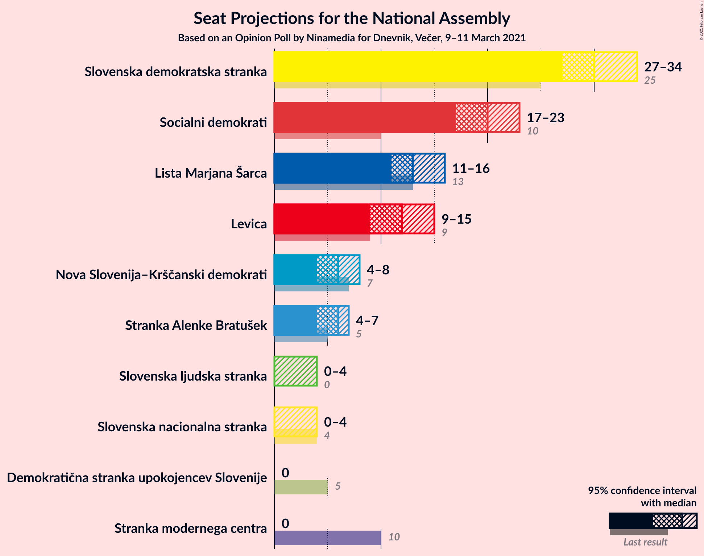
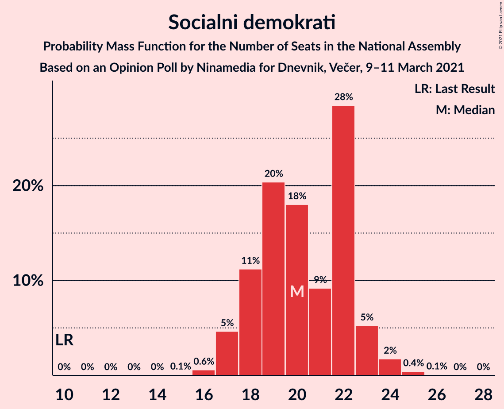
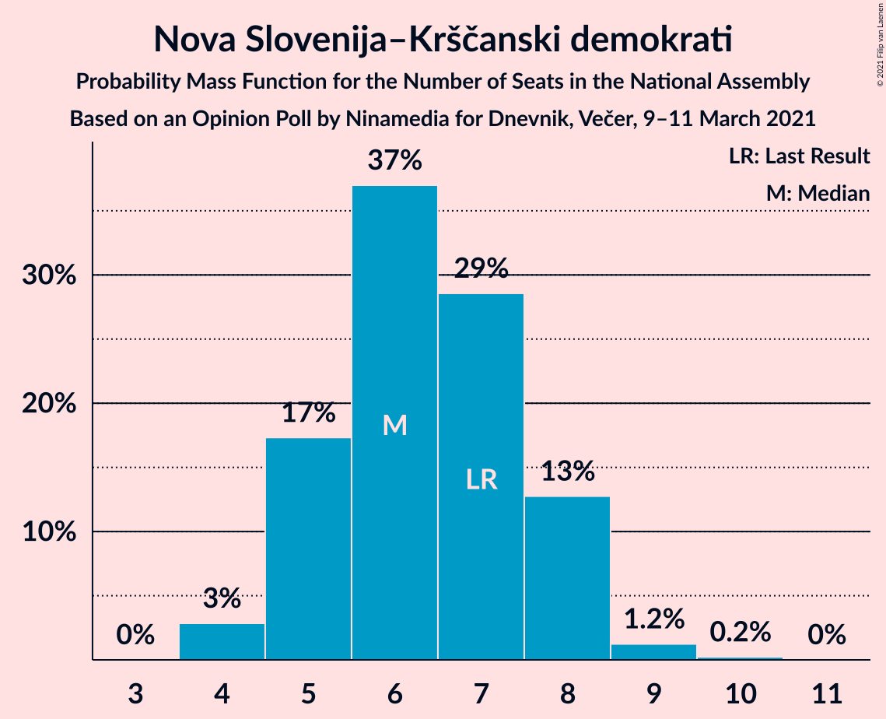
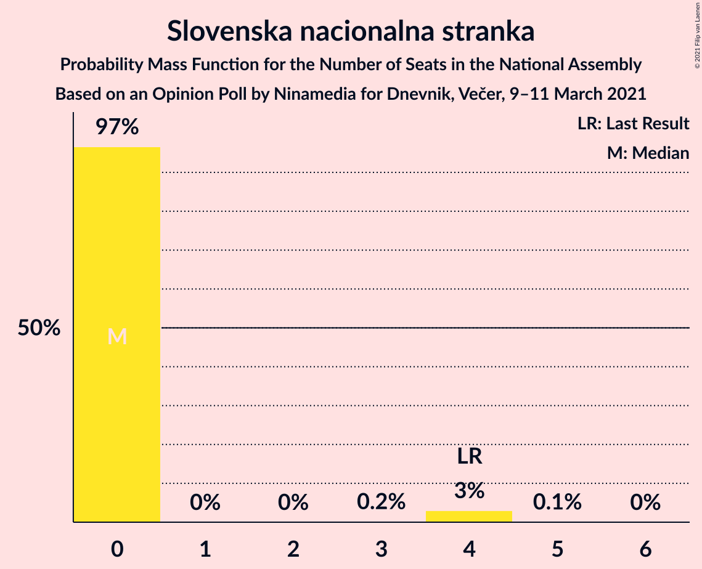
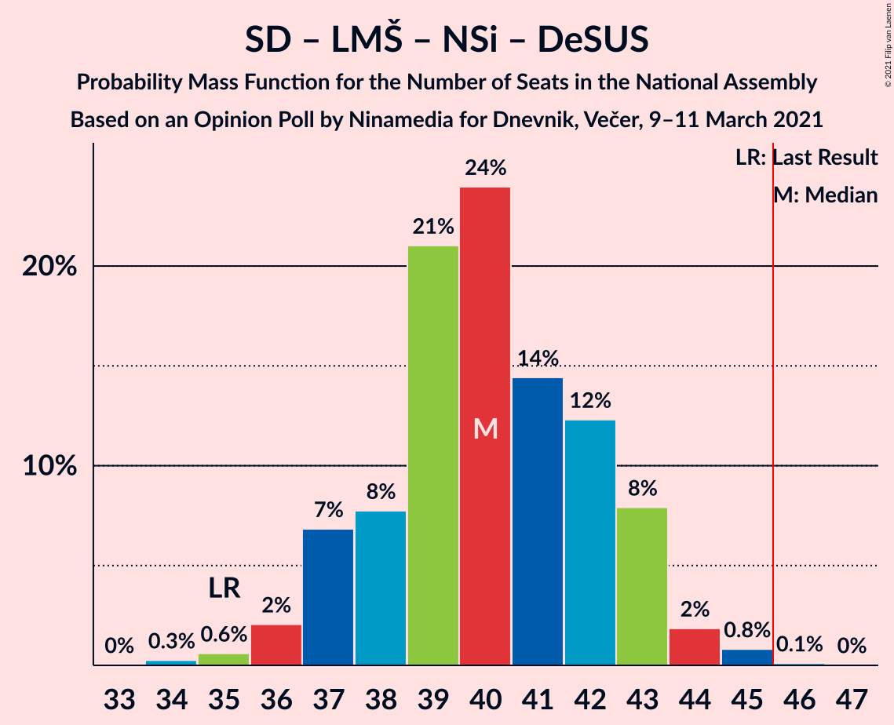
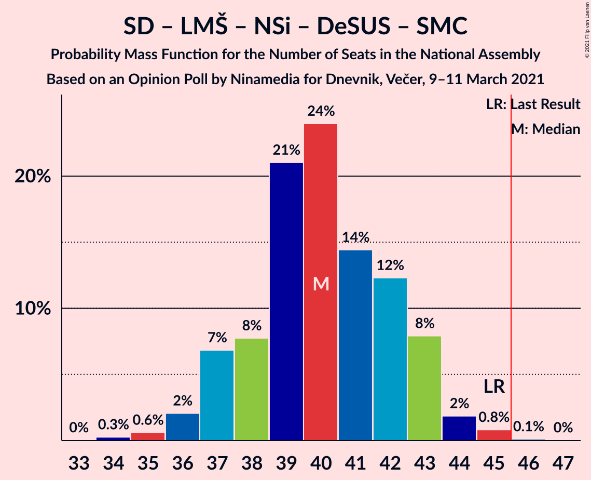

# Opinion Poll by Ninamedia for Dnevnik, Večer, 9–11 March 2021

<a href="#voting-intentions">Voting Intentions</a> | <a href="#seats">Seats</a> | <a href="#coalitions">Coalitions</a> | <a href="#technical-information">Technical Information</a>

## Voting Intentions

### Confidence Intervals

| Party | Last Result | Poll Result | 80% Confidence Interval | 90% Confidence Interval | 95% Confidence Interval | 99% Confidence Interval |
|:-----:|:-----------:|:-----------:|:-----------------------:|:-----------------------:|:-----------------------:|:-----------------------:|
| Slovenska demokratska stranka | 24.9% | 29.9% | 27.7–32.1% |27.1–32.8% |26.6–33.4% |25.6–34.5% |
| Socialni demokrati | 9.9% | 20.3% | 18.4–22.3% |17.9–22.9% |17.5–23.4% |16.6–24.4% |
| Lista Marjana Šarca | 12.6% | 13.9% | 12.3–15.7% |11.9–16.2% |11.5–16.6% |10.8–17.5% |
| Levica | 9.3% | 12.1% | 10.7–13.9% |10.3–14.4% |9.9–14.8% |9.3–15.6% |
| Nova Slovenija–Krščanski demokrati | 7.2% | 6.6% | 5.5–7.9% |5.2–8.3% |5.0–8.7% |4.5–9.4% |
| Stranka Alenke Bratušek | 5.1% | 6.0% | 5.0–7.3% |4.7–7.7% |4.5–8.0% |4.0–8.7% |
| Slovenska ljudska stranka | 2.6% | 3.0% | 2.3–4.0% |2.1–4.3% |2.0–4.6% |1.7–5.1% |
| Slovenska nacionalna stranka | 4.2% | 2.7% | 2.1–3.7% |1.9–4.0% |1.7–4.2% |1.5–4.7% |
| Demokratična stranka upokojencev Slovenije | 4.9% | 1.7% | 1.2–2.5% |1.1–2.8% |1.0–3.0% |0.8–3.4% |
| Stranka modernega centra | 9.7% | 1.4% | 1.0–2.2% |0.9–2.4% |0.8–2.6% |0.6–3.0% |

*Note:* The poll result column reflects the actual value used in the calculations. Published results may vary slightly, and in addition be rounded to fewer digits.

## Seats

### Confidence Intervals

| Party | Last Result | Median | 80% Confidence Interval | 90% Confidence Interval | 95% Confidence Interval | 99% Confidence Interval |
|:-----:|:-----------:|:------:|:-----------------------:|:-----------------------:|:-----------------------:|:-----------------------:|
| <a href="#slovenska-demokratska-stranka">Slovenska demokratska stranka</a> | 25 | 30 | 27–33 |27–33 |27–34 |26–34 |
| <a href="#socialni-demokrati">Socialni demokrati</a> | 10 | 20 | 18–22 |17–23 |17–23 |16–24 |
| <a href="#lista-marjana-šarca">Lista Marjana Šarca</a> | 13 | 13 | 12–15 |12–16 |11–16 |10–17 |
| <a href="#levica">Levica</a> | 9 | 12 | 10–14 |10–15 |9–15 |9–16 |
| <a href="#nova-slovenija–krščanski-demokrati">Nova Slovenija–Krščanski demokrati</a> | 7 | 6 | 5–8 |5–8 |4–8 |4–9 |
| <a href="#stranka-alenke-bratušek">Stranka Alenke Bratušek</a> | 5 | 6 | 5–7 |4–7 |4–7 |4–8 |
| <a href="#slovenska-ljudska-stranka">Slovenska ljudska stranka</a> | 0 | 0 | 0 |0 |0–4 |0–4 |
| <a href="#slovenska-nacionalna-stranka">Slovenska nacionalna stranka</a> | 4 | 0 | 0 |0 |0–4 |0–4 |
| <a href="#demokratična-stranka-upokojencev-slovenije">Demokratična stranka upokojencev Slovenije</a> | 5 | 0 | 0 |0 |0 |0 |
| <a href="#stranka-modernega-centra">Stranka modernega centra</a> | 10 | 0 | 0 |0 |0 |0 |

### Slovenska demokratska stranka

*For a full overview of the results for this party, see the [Slovenska demokratska stranka](party-slovenskademokratskastranka.html) page.*

| Number of Seats | Probability | Accumulated | Special Marks |
|:---------------:|:-----------:|:-----------:|:-------------:|
| 24 | 0.1% | 100% |  |
| 25 | 0.3% | 99.9% | Last Result |
| 26 | 1.1% | 99.6% |  |
| 27 | 14% | 98% |  |
| 28 | 11% | 85% |  |
| 29 | 16% | 74% |  |
| 30 | 19% | 58% | Median |
| 31 | 21% | 39% |  |
| 32 | 7% | 18% |  |
| 33 | 8% | 11% |  |
| 34 | 2% | 3% |  |
| 35 | 0.3% | 0.4% |  |
| 36 | 0.1% | 0.1% |  |
| 37 | 0% | 0% |  |

### Socialni demokrati

*For a full overview of the results for this party, see the [Socialni demokrati](party-socialnidemokrati.html) page.*

| Number of Seats | Probability | Accumulated | Special Marks |
|:---------------:|:-----------:|:-----------:|:-------------:|
| 10 | 0% | 100% | Last Result |
| 11 | 0% | 100% |  |
| 12 | 0% | 100% |  |
| 13 | 0% | 100% |  |
| 14 | 0% | 100% |  |
| 15 | 0.1% | 100% |  |
| 16 | 0.6% | 99.9% |  |
| 17 | 5% | 99.4% |  |
| 18 | 11% | 95% |  |
| 19 | 20% | 84% |  |
| 20 | 18% | 63% | Median |
| 21 | 9% | 45% |  |
| 22 | 28% | 36% |  |
| 23 | 5% | 7% |  |
| 24 | 2% | 2% |  |
| 25 | 0.4% | 0.5% |  |
| 26 | 0.1% | 0.1% |  |
| 27 | 0% | 0% |  |

### Lista Marjana Šarca

*For a full overview of the results for this party, see the [Lista Marjana Šarca](party-listamarjanašarca.html) page.*

| Number of Seats | Probability | Accumulated | Special Marks |
|:---------------:|:-----------:|:-----------:|:-------------:|
| 10 | 0.5% | 100% |  |
| 11 | 4% | 99.4% |  |
| 12 | 21% | 96% |  |
| 13 | 33% | 75% | Last Result, Median |
| 14 | 23% | 42% |  |
| 15 | 13% | 19% |  |
| 16 | 4% | 6% |  |
| 17 | 0.9% | 1.2% |  |
| 18 | 0.3% | 0.3% |  |
| 19 | 0% | 0.1% |  |
| 20 | 0% | 0% |  |

### Levica

*For a full overview of the results for this party, see the [Levica](party-levica.html) page.*

| Number of Seats | Probability | Accumulated | Special Marks |
|:---------------:|:-----------:|:-----------:|:-------------:|
| 8 | 0.2% | 100% |  |
| 9 | 3% | 99.8% | Last Result |
| 10 | 10% | 97% |  |
| 11 | 24% | 87% |  |
| 12 | 29% | 63% | Median |
| 13 | 23% | 34% |  |
| 14 | 4% | 11% |  |
| 15 | 6% | 7% |  |
| 16 | 0.7% | 0.7% |  |
| 17 | 0% | 0% |  |

### Nova Slovenija–Krščanski demokrati

*For a full overview of the results for this party, see the [Nova Slovenija–Krščanski demokrati](party-novaslovenija–krščanskidemokrati.html) page.*

| Number of Seats | Probability | Accumulated | Special Marks |
|:---------------:|:-----------:|:-----------:|:-------------:|
| 4 | 3% | 100% |  |
| 5 | 17% | 97% |  |
| 6 | 37% | 80% | Median |
| 7 | 29% | 43% | Last Result |
| 8 | 13% | 14% |  |
| 9 | 1.2% | 1.5% |  |
| 10 | 0.2% | 0.2% |  |
| 11 | 0% | 0% |  |

### Stranka Alenke Bratušek

*For a full overview of the results for this party, see the [Stranka Alenke Bratušek](party-strankaalenkebratušek.html) page.*

| Number of Seats | Probability | Accumulated | Special Marks |
|:---------------:|:-----------:|:-----------:|:-------------:|
| 0 | 0.2% | 100% |  |
| 1 | 0% | 99.8% |  |
| 2 | 0% | 99.8% |  |
| 3 | 0% | 99.8% |  |
| 4 | 9% | 99.8% |  |
| 5 | 24% | 91% | Last Result |
| 6 | 51% | 67% | Median |
| 7 | 13% | 15% |  |
| 8 | 2% | 2% |  |
| 9 | 0.3% | 0.3% |  |
| 10 | 0% | 0% |  |

### Slovenska ljudska stranka

*For a full overview of the results for this party, see the [Slovenska ljudska stranka](party-slovenskaljudskastranka.html) page.*

| Number of Seats | Probability | Accumulated | Special Marks |
|:---------------:|:-----------:|:-----------:|:-------------:|
| 0 | 95% | 100% | Last Result, Median |
| 1 | 0% | 5% |  |
| 2 | 0% | 5% |  |
| 3 | 0.3% | 5% |  |
| 4 | 4% | 4% |  |
| 5 | 0.3% | 0.3% |  |
| 6 | 0% | 0% |  |

### Slovenska nacionalna stranka

*For a full overview of the results for this party, see the [Slovenska nacionalna stranka](party-slovenskanacionalnastranka.html) page.*

| Number of Seats | Probability | Accumulated | Special Marks |
|:---------------:|:-----------:|:-----------:|:-------------:|
| 0 | 97% | 100% | Median |
| 1 | 0% | 3% |  |
| 2 | 0% | 3% |  |
| 3 | 0.2% | 3% |  |
| 4 | 3% | 3% | Last Result |
| 5 | 0.1% | 0.1% |  |
| 6 | 0% | 0% |  |

### Demokratična stranka upokojencev Slovenije

*For a full overview of the results for this party, see the [Demokratična stranka upokojencev Slovenije](party-demokratičnastrankaupokojencevslovenije.html) page.*

| Number of Seats | Probability | Accumulated | Special Marks |
|:---------------:|:-----------:|:-----------:|:-------------:|
| 0 | 100% | 100% | Median |
| 1 | 0% | 0% |  |
| 2 | 0% | 0% |  |
| 3 | 0% | 0% |  |
| 4 | 0% | 0% |  |
| 5 | 0% | 0% | Last Result |

### Stranka modernega centra

*For a full overview of the results for this party, see the [Stranka modernega centra](party-strankamodernegacentra.html) page.*

| Number of Seats | Probability | Accumulated | Special Marks |
|:---------------:|:-----------:|:-----------:|:-------------:|
| 0 | 100% | 100% | Median |
| 1 | 0% | 0% |  |
| 2 | 0% | 0% |  |
| 3 | 0% | 0% |  |
| 4 | 0% | 0% |  |
| 5 | 0% | 0% |  |
| 6 | 0% | 0% |  |
| 7 | 0% | 0% |  |
| 8 | 0% | 0% |  |
| 9 | 0% | 0% |  |
| 10 | 0% | 0% | Last Result |

## Coalitions

### Confidence Intervals

| Coalition | Last Result | Median | Majority? | 80% Confidence Interval | 90% Confidence Interval | 95% Confidence Interval | 99% Confidence Interval |
|:---------:|:-----------:|:------:|:---------:|:-----------------------:|:-----------------------:|:-----------------------:|:-----------------------:|
| Socialni demokrati – Lista Marjana Šarca – Nova Slovenija–Krščanski demokrati – Stranka Alenke Bratušek – Demokratična stranka upokojencev Slovenije – Stranka modernega centra | 50 | 46 | 58% | 43–48 | 42–49 | 42–49 | 41–51 |
| Slovenska demokratska stranka – Lista Marjana Šarca – Demokratična stranka upokojencev Slovenije | 43 | 43 | 16% | 40–46 | 40–47 | 40–47 | 39–48 |
| Slovenska demokratska stranka – Lista Marjana Šarca | 38 | 43 | 16% | 40–46 | 40–47 | 40–47 | 39–48 |
| Socialni demokrati – Lista Marjana Šarca – Nova Slovenija–Krščanski demokrati – Demokratična stranka upokojencev Slovenije | 35 | 40 | 0.1% | 38–43 | 37–43 | 36–44 | 35–45 |
| Socialni demokrati – Lista Marjana Šarca – Nova Slovenija–Krščanski demokrati – Demokratična stranka upokojencev Slovenije – Stranka modernega centra | 45 | 40 | 0.1% | 38–43 | 37–43 | 36–44 | 35–45 |
| Socialni demokrati – Lista Marjana Šarca – Nova Slovenija–Krščanski demokrati | 30 | 40 | 0.1% | 38–43 | 37–43 | 36–44 | 35–45 |
| Socialni demokrati – Lista Marjana Šarca – Nova Slovenija–Krščanski demokrati – Stranka modernega centra | 40 | 40 | 0.1% | 38–43 | 37–43 | 36–44 | 35–45 |
| Socialni demokrati – Lista Marjana Šarca – Stranka Alenke Bratušek – Demokratična stranka upokojencev Slovenije – Stranka modernega centra | 43 | 40 | 0% | 37–42 | 36–42 | 35–43 | 34–44 |
| Socialni demokrati – Lista Marjana Šarca – Demokratična stranka upokojencev Slovenije | 28 | 34 | 0% | 31–36 | 31–37 | 30–37 | 29–38 |
| Socialni demokrati – Lista Marjana Šarca – Demokratična stranka upokojencev Slovenije – Stranka modernega centra | 38 | 34 | 0% | 31–36 | 31–37 | 30–37 | 29–38 |
| Socialni demokrati – Lista Marjana Šarca | 23 | 34 | 0% | 31–36 | 31–37 | 30–37 | 29–38 |
| Socialni demokrati – Lista Marjana Šarca – Stranka modernega centra | 33 | 34 | 0% | 31–36 | 31–37 | 30–37 | 29–38 |
| Socialni demokrati – Demokratična stranka upokojencev Slovenije – Stranka modernega centra | 25 | 20 | 0% | 18–22 | 17–23 | 17–23 | 16–25 |

### Socialni demokrati – Lista Marjana Šarca – Nova Slovenija–Krščanski demokrati – Stranka Alenke Bratušek – Demokratična stranka upokojencev Slovenije – Stranka modernega centra

| Number of Seats | Probability | Accumulated | Special Marks |
|:---------------:|:-----------:|:-----------:|:-------------:|
| 39 | 0.2% | 100% |  |
| 40 | 0.3% | 99.8% |  |
| 41 | 1.4% | 99.5% |  |
| 42 | 4% | 98% |  |
| 43 | 7% | 94% |  |
| 44 | 15% | 87% |  |
| 45 | 14% | 72% | Median |
| 46 | 21% | 58% | Majority |
| 47 | 12% | 37% |  |
| 48 | 19% | 25% |  |
| 49 | 4% | 7% |  |
| 50 | 2% | 2% | Last Result |
| 51 | 0.5% | 0.6% |  |
| 52 | 0.1% | 0.1% |  |
| 53 | 0% | 0% |  |

### Slovenska demokratska stranka – Lista Marjana Šarca – Demokratična stranka upokojencev Slovenije

| Number of Seats | Probability | Accumulated | Special Marks |
|:---------------:|:-----------:|:-----------:|:-------------:|
| 37 | 0.1% | 100% |  |
| 38 | 0.3% | 99.8% |  |
| 39 | 2% | 99.6% |  |
| 40 | 13% | 98% |  |
| 41 | 6% | 85% |  |
| 42 | 8% | 79% |  |
| 43 | 32% | 71% | Last Result, Median |
| 44 | 11% | 39% |  |
| 45 | 12% | 28% |  |
| 46 | 10% | 16% | Majority |
| 47 | 3% | 5% |  |
| 48 | 2% | 2% |  |
| 49 | 0.1% | 0.2% |  |
| 50 | 0.1% | 0.1% |  |
| 51 | 0% | 0% |  |

### Slovenska demokratska stranka – Lista Marjana Šarca

| Number of Seats | Probability | Accumulated | Special Marks |
|:---------------:|:-----------:|:-----------:|:-------------:|
| 37 | 0.1% | 100% |  |
| 38 | 0.3% | 99.8% | Last Result |
| 39 | 2% | 99.6% |  |
| 40 | 13% | 98% |  |
| 41 | 6% | 85% |  |
| 42 | 8% | 79% |  |
| 43 | 32% | 71% | Median |
| 44 | 11% | 39% |  |
| 45 | 12% | 28% |  |
| 46 | 10% | 16% | Majority |
| 47 | 3% | 5% |  |
| 48 | 2% | 2% |  |
| 49 | 0.1% | 0.2% |  |
| 50 | 0.1% | 0.1% |  |
| 51 | 0% | 0% |  |

### Socialni demokrati – Lista Marjana Šarca – Nova Slovenija–Krščanski demokrati – Demokratična stranka upokojencev Slovenije

| Number of Seats | Probability | Accumulated | Special Marks |
|:---------------:|:-----------:|:-----------:|:-------------:|
| 34 | 0.3% | 100% |  |
| 35 | 0.6% | 99.7% | Last Result |
| 36 | 2% | 99.1% |  |
| 37 | 7% | 97% |  |
| 38 | 8% | 90% |  |
| 39 | 21% | 82% | Median |
| 40 | 24% | 61% |  |
| 41 | 14% | 37% |  |
| 42 | 12% | 23% |  |
| 43 | 8% | 11% |  |
| 44 | 2% | 3% |  |
| 45 | 0.8% | 1.0% |  |
| 46 | 0.1% | 0.1% | Majority |
| 47 | 0% | 0% |  |

### Socialni demokrati – Lista Marjana Šarca – Nova Slovenija–Krščanski demokrati – Demokratična stranka upokojencev Slovenije – Stranka modernega centra

| Number of Seats | Probability | Accumulated | Special Marks |
|:---------------:|:-----------:|:-----------:|:-------------:|
| 34 | 0.3% | 100% |  |
| 35 | 0.6% | 99.7% |  |
| 36 | 2% | 99.1% |  |
| 37 | 7% | 97% |  |
| 38 | 8% | 90% |  |
| 39 | 21% | 82% | Median |
| 40 | 24% | 61% |  |
| 41 | 14% | 37% |  |
| 42 | 12% | 23% |  |
| 43 | 8% | 11% |  |
| 44 | 2% | 3% |  |
| 45 | 0.8% | 1.0% | Last Result |
| 46 | 0.1% | 0.1% | Majority |
| 47 | 0% | 0% |  |

### Socialni demokrati – Lista Marjana Šarca – Nova Slovenija–Krščanski demokrati

| Number of Seats | Probability | Accumulated | Special Marks |
|:---------------:|:-----------:|:-----------:|:-------------:|
| 30 | 0% | 100% | Last Result |
| 31 | 0% | 100% |  |
| 32 | 0% | 100% |  |
| 33 | 0% | 100% |  |
| 34 | 0.3% | 100% |  |
| 35 | 0.6% | 99.7% |  |
| 36 | 2% | 99.1% |  |
| 37 | 7% | 97% |  |
| 38 | 8% | 90% |  |
| 39 | 21% | 82% | Median |
| 40 | 24% | 61% |  |
| 41 | 14% | 37% |  |
| 42 | 12% | 23% |  |
| 43 | 8% | 11% |  |
| 44 | 2% | 3% |  |
| 45 | 0.8% | 0.9% |  |
| 46 | 0.1% | 0.1% | Majority |
| 47 | 0% | 0% |  |

### Socialni demokrati – Lista Marjana Šarca – Nova Slovenija–Krščanski demokrati – Stranka modernega centra

| Number of Seats | Probability | Accumulated | Special Marks |
|:---------------:|:-----------:|:-----------:|:-------------:|
| 34 | 0.3% | 100% |  |
| 35 | 0.6% | 99.7% |  |
| 36 | 2% | 99.1% |  |
| 37 | 7% | 97% |  |
| 38 | 8% | 90% |  |
| 39 | 21% | 82% | Median |
| 40 | 24% | 61% | Last Result |
| 41 | 14% | 37% |  |
| 42 | 12% | 23% |  |
| 43 | 8% | 11% |  |
| 44 | 2% | 3% |  |
| 45 | 0.8% | 0.9% |  |
| 46 | 0.1% | 0.1% | Majority |
| 47 | 0% | 0% |  |

### Socialni demokrati – Lista Marjana Šarca – Stranka Alenke Bratušek – Demokratična stranka upokojencev Slovenije – Stranka modernega centra

| Number of Seats | Probability | Accumulated | Special Marks |
|:---------------:|:-----------:|:-----------:|:-------------:|
| 33 | 0.1% | 100% |  |
| 34 | 0.6% | 99.9% |  |
| 35 | 2% | 99.3% |  |
| 36 | 4% | 97% |  |
| 37 | 9% | 93% |  |
| 38 | 19% | 84% |  |
| 39 | 15% | 66% | Median |
| 40 | 19% | 50% |  |
| 41 | 16% | 32% |  |
| 42 | 11% | 16% |  |
| 43 | 4% | 5% | Last Result |
| 44 | 0.6% | 1.0% |  |
| 45 | 0.3% | 0.3% |  |
| 46 | 0% | 0% | Majority |

### Socialni demokrati – Lista Marjana Šarca – Demokratična stranka upokojencev Slovenije

| Number of Seats | Probability | Accumulated | Special Marks |
|:---------------:|:-----------:|:-----------:|:-------------:|
| 28 | 0.2% | 100% | Last Result |
| 29 | 0.7% | 99.7% |  |
| 30 | 3% | 99.0% |  |
| 31 | 8% | 96% |  |
| 32 | 13% | 89% |  |
| 33 | 22% | 76% | Median |
| 34 | 25% | 54% |  |
| 35 | 13% | 29% |  |
| 36 | 7% | 16% |  |
| 37 | 7% | 9% |  |
| 38 | 1.3% | 2% |  |
| 39 | 0.3% | 0.4% |  |
| 40 | 0.1% | 0.1% |  |
| 41 | 0% | 0% |  |

### Socialni demokrati – Lista Marjana Šarca – Demokratična stranka upokojencev Slovenije – Stranka modernega centra

| Number of Seats | Probability | Accumulated | Special Marks |
|:---------------:|:-----------:|:-----------:|:-------------:|
| 28 | 0.2% | 100% |  |
| 29 | 0.7% | 99.7% |  |
| 30 | 3% | 99.0% |  |
| 31 | 8% | 96% |  |
| 32 | 13% | 89% |  |
| 33 | 22% | 76% | Median |
| 34 | 25% | 54% |  |
| 35 | 13% | 29% |  |
| 36 | 7% | 16% |  |
| 37 | 7% | 9% |  |
| 38 | 1.3% | 2% | Last Result |
| 39 | 0.3% | 0.4% |  |
| 40 | 0.1% | 0.1% |  |
| 41 | 0% | 0% |  |

### Socialni demokrati – Lista Marjana Šarca

| Number of Seats | Probability | Accumulated | Special Marks |
|:---------------:|:-----------:|:-----------:|:-------------:|
| 23 | 0% | 100% | Last Result |
| 24 | 0% | 100% |  |
| 25 | 0% | 100% |  |
| 26 | 0% | 100% |  |
| 27 | 0% | 100% |  |
| 28 | 0.2% | 100% |  |
| 29 | 0.7% | 99.7% |  |
| 30 | 3% | 99.0% |  |
| 31 | 8% | 96% |  |
| 32 | 13% | 89% |  |
| 33 | 22% | 76% | Median |
| 34 | 25% | 54% |  |
| 35 | 13% | 29% |  |
| 36 | 7% | 16% |  |
| 37 | 7% | 9% |  |
| 38 | 1.3% | 2% |  |
| 39 | 0.3% | 0.4% |  |
| 40 | 0.1% | 0.1% |  |
| 41 | 0% | 0% |  |

### Socialni demokrati – Lista Marjana Šarca – Stranka modernega centra

| Number of Seats | Probability | Accumulated | Special Marks |
|:---------------:|:-----------:|:-----------:|:-------------:|
| 28 | 0.2% | 100% |  |
| 29 | 0.7% | 99.7% |  |
| 30 | 3% | 99.0% |  |
| 31 | 8% | 96% |  |
| 32 | 13% | 89% |  |
| 33 | 22% | 76% | Last Result, Median |
| 34 | 25% | 54% |  |
| 35 | 13% | 29% |  |
| 36 | 7% | 16% |  |
| 37 | 7% | 9% |  |
| 38 | 1.3% | 2% |  |
| 39 | 0.3% | 0.4% |  |
| 40 | 0.1% | 0.1% |  |
| 41 | 0% | 0% |  |

### Socialni demokrati – Demokratična stranka upokojencev Slovenije – Stranka modernega centra

| Number of Seats | Probability | Accumulated | Special Marks |
|:---------------:|:-----------:|:-----------:|:-------------:|
| 15 | 0.1% | 100% |  |
| 16 | 0.6% | 99.9% |  |
| 17 | 5% | 99.4% |  |
| 18 | 11% | 95% |  |
| 19 | 20% | 84% |  |
| 20 | 18% | 63% | Median |
| 21 | 9% | 45% |  |
| 22 | 28% | 36% |  |
| 23 | 5% | 7% |  |
| 24 | 2% | 2% |  |
| 25 | 0.4% | 0.5% | Last Result |
| 26 | 0.1% | 0.1% |  |
| 27 | 0% | 0% |  |

## Technical Information

### Opinion Poll

+ **Polling firm:** Ninamedia
+ **Commissioner(s):** Dnevnik, Večer
+ **Fieldwork period:** 9–11 March 2021

### Calculations

+ **Sample size:** 700
+ **Simulations done:** 1,048,576
+ **Error estimate:** 3.54%

