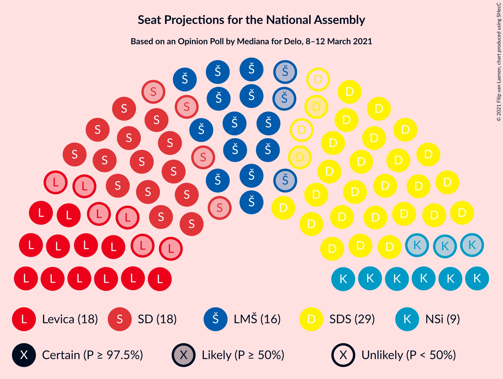
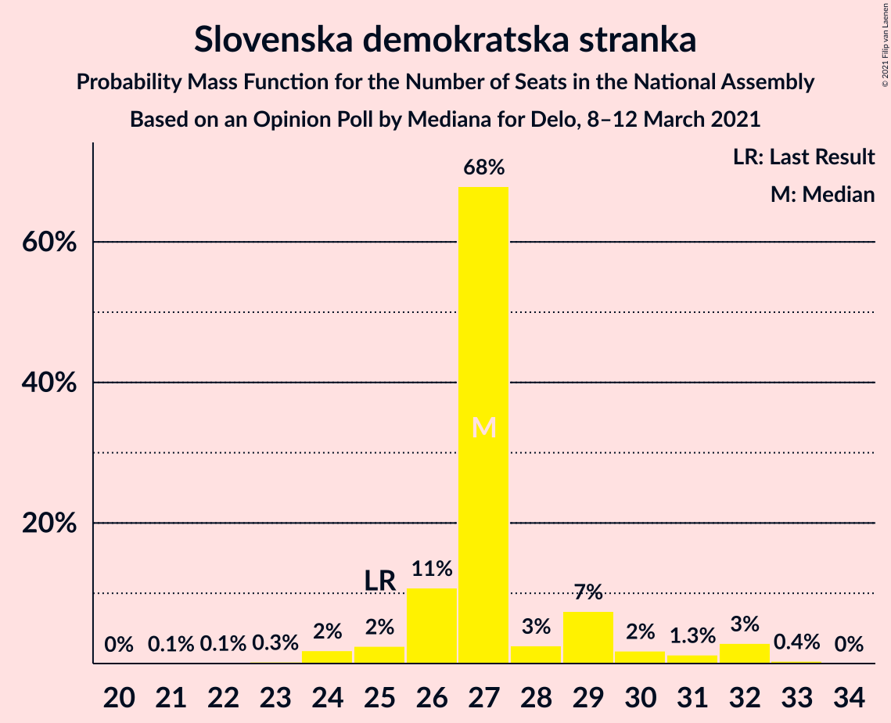
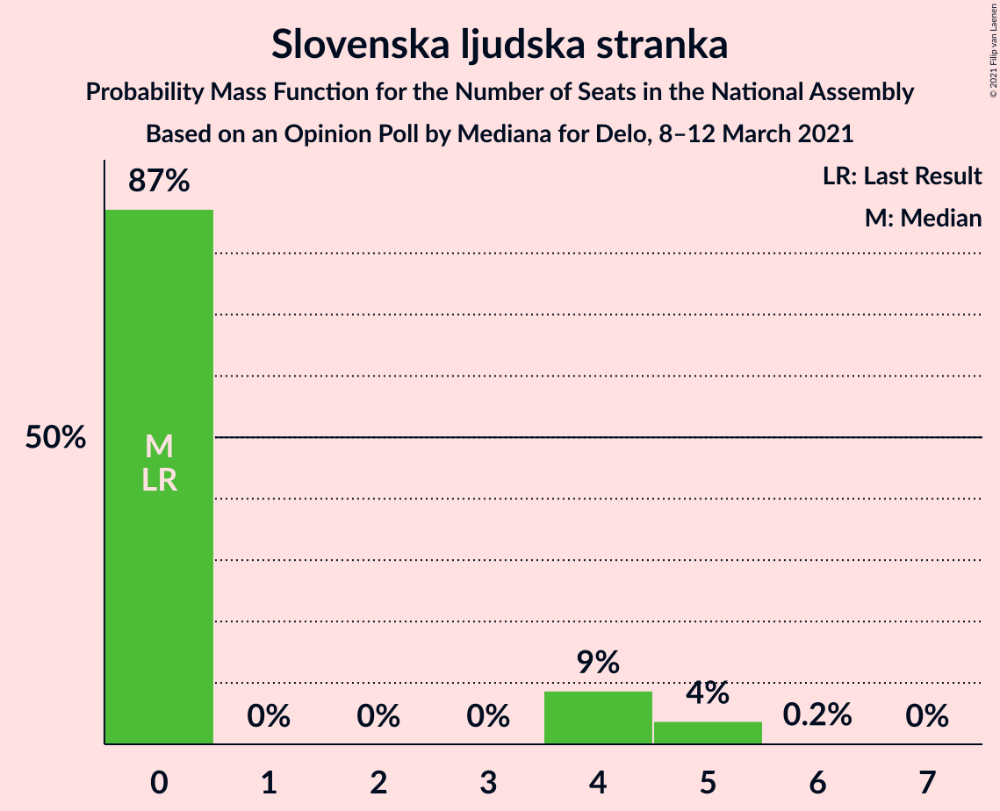
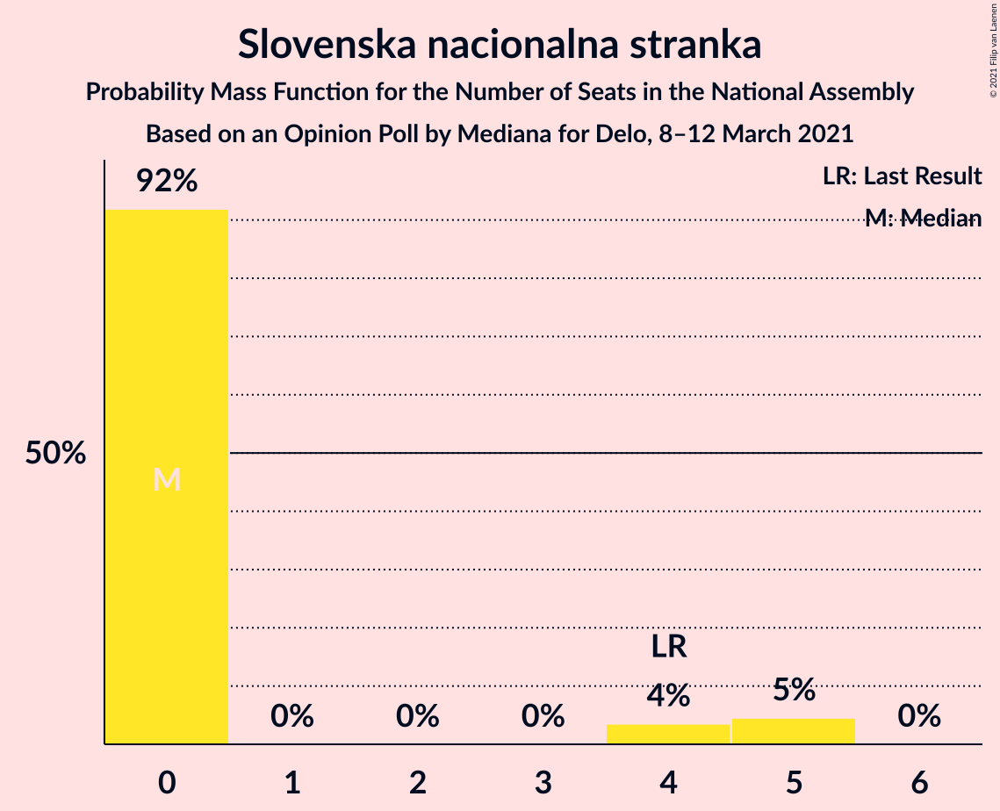
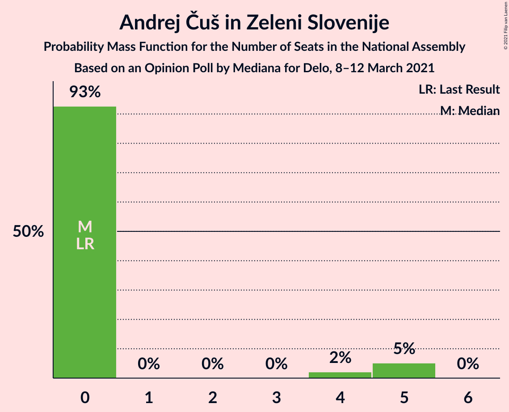
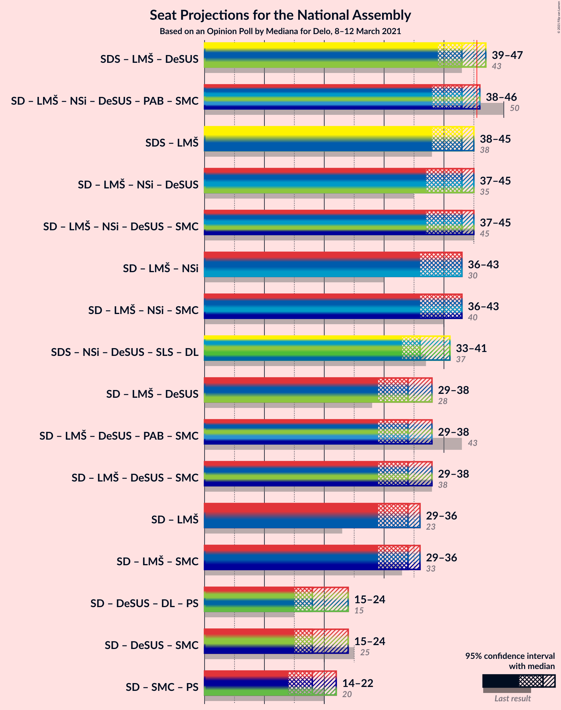
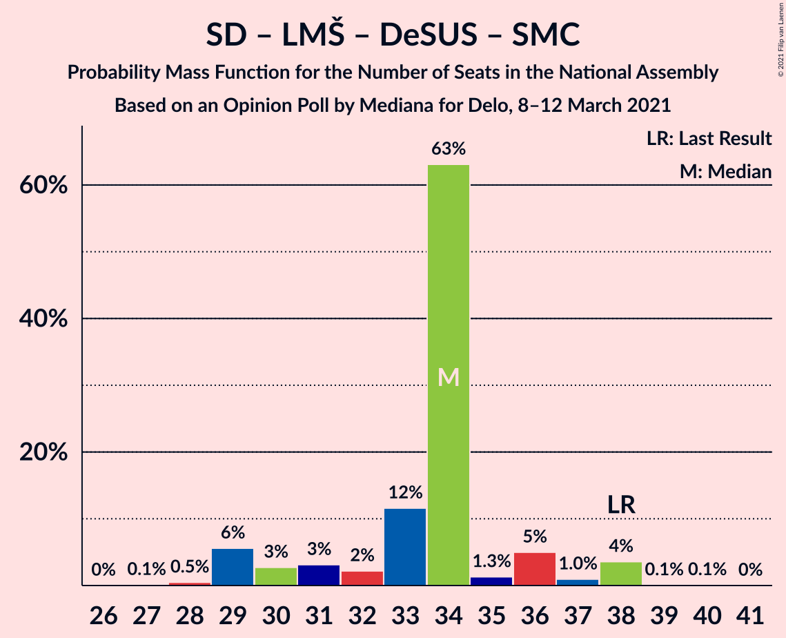
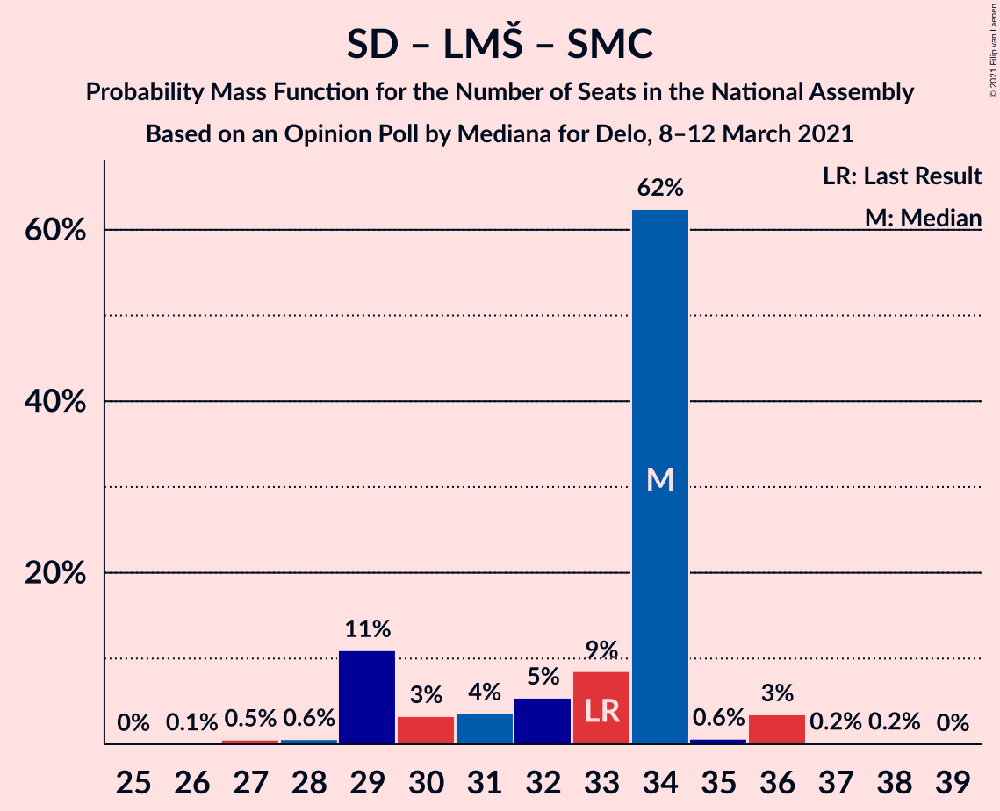

# Opinion Poll by Mediana for Delo, 8–12 March 2021

<a href="#voting-intentions">Voting Intentions</a> | <a href="#seats">Seats</a> | <a href="#coalitions">Coalitions</a> | <a href="#technical-information">Technical Information</a>

## Voting Intentions

### Confidence Intervals

| Party | Last Result | Poll Result | 80% Confidence Interval | 90% Confidence Interval | 95% Confidence Interval | 99% Confidence Interval |
|:-----:|:-----------:|:-----------:|:-----------------------:|:-----------------------:|:-----------------------:|:-----------------------:|
| Slovenska demokratska stranka | 24.9% | 25.7% | 23.7–28.0% |23.1–28.6% |22.6–29.1% |21.7–30.2% |
| Socialni demokrati | 9.9% | 16.4% | 14.7–18.3% |14.2–18.8% |13.8–19.3% |13.0–20.2% |
| Levica | 9.3% | 14.1% | 12.5–15.9% |12.1–16.4% |11.7–16.9% |11.0–17.8% |
| Lista Marjana Šarca | 12.6% | 13.8% | 12.3–15.6% |11.8–16.1% |11.4–16.6% |10.7–17.5% |
| Nova Slovenija–Krščanski demokrati | 7.2% | 7.3% | 6.1–8.7% |5.8–9.1% |5.6–9.4% |5.1–10.1% |
| Stranka Alenke Bratušek | 5.1% | 3.6% | 2.8–4.6% |2.6–4.9% |2.4–5.2% |2.1–5.8% |
| Demokratična stranka upokojencev Slovenije | 4.9% | 3.6% | 2.8–4.6% |2.6–4.9% |2.4–5.2% |2.1–5.8% |
| Slovenska ljudska stranka | 2.6% | 3.6% | 2.8–4.6% |2.6–4.9% |2.4–5.2% |2.1–5.8% |
| Slovenska nacionalna stranka | 4.2% | 3.3% | 2.6–4.3% |2.3–4.6% |2.2–4.9% |1.9–5.4% |
| Andrej Čuš in Zeleni Slovenije | 1.1% | 3.0% | 2.3–4.0% |2.1–4.3% |2.0–4.5% |1.7–5.1% |
| Piratska stranka Slovenije | 2.2% | 1.8% | 1.3–2.7% |1.2–2.9% |1.1–3.1% |0.9–3.6% |
| Dobra država | 1.5% | 1.8% | 1.3–2.7% |1.2–2.9% |1.1–3.1% |0.9–3.6% |
| Stranka modernega centra | 9.7% | 1.3% | 0.9–2.0% |0.8–2.2% |0.7–2.4% |0.5–2.8% |

*Note:* The poll result column reflects the actual value used in the calculations. Published results may vary slightly, and in addition be rounded to fewer digits.

## Seats

### Confidence Intervals

| Party | Last Result | Median | 80% Confidence Interval | 90% Confidence Interval | 95% Confidence Interval | 99% Confidence Interval |
|:-----:|:-----------:|:------:|:-----------------------:|:-----------------------:|:-----------------------:|:-----------------------:|
| <a href="#slovenska-demokratska-stranka">Slovenska demokratska stranka</a> | 25 | 26 | 25–30 |25–30 |23–31 |23–33 |
| <a href="#socialni-demokrati">Socialni demokrati</a> | 10 | 16 | 14–20 |14–20 |14–20 |14–21 |
| <a href="#levica">Levica</a> | 9 | 15 | 13–16 |12–17 |12–17 |12–20 |
| <a href="#lista-marjana-šarca">Lista Marjana Šarca</a> | 13 | 16 | 13–17 |13–17 |12–17 |12–18 |
| <a href="#nova-slovenija–krščanski-demokrati">Nova Slovenija–Krščanski demokrati</a> | 7 | 6 | 6–8 |6–8 |6–9 |5–10 |
| <a href="#stranka-alenke-bratušek">Stranka Alenke Bratušek</a> | 5 | 0 | 0–4 |0–5 |0–5 |0–5 |
| <a href="#demokratična-stranka-upokojencev-slovenije">Demokratična stranka upokojencev Slovenije</a> | 5 | 4 | 0–5 |0–5 |0–5 |0–6 |
| <a href="#slovenska-ljudska-stranka">Slovenska ljudska stranka</a> | 0 | 4 | 0–5 |0–5 |0–6 |0–6 |
| <a href="#slovenska-nacionalna-stranka">Slovenska nacionalna stranka</a> | 4 | 0 | 0 |0–5 |0–5 |0–5 |
| <a href="#andrej-čuš-in-zeleni-slovenije">Andrej Čuš in Zeleni Slovenije</a> | 0 | 0 | 0–5 |0–5 |0–5 |0–5 |
| <a href="#piratska-stranka-slovenije">Piratska stranka Slovenije</a> | 0 | 0 | 0 |0 |0 |0 |
| <a href="#dobra-država">Dobra država</a> | 0 | 0 | 0 |0 |0 |0 |
| <a href="#stranka-modernega-centra">Stranka modernega centra</a> | 10 | 0 | 0 |0 |0 |0 |

### Slovenska demokratska stranka

*For a full overview of the results for this party, see the [Slovenska demokratska stranka](party-slovenskademokratskastranka.html) page.*

| Number of Seats | Probability | Accumulated | Special Marks |
|:---------------:|:-----------:|:-----------:|:-------------:|
| 22 | 0.3% | 100% |  |
| 23 | 3% | 99.6% |  |
| 24 | 1.1% | 97% |  |
| 25 | 38% | 96% | Last Result |
| 26 | 28% | 58% | Median |
| 27 | 3% | 30% |  |
| 28 | 2% | 27% |  |
| 29 | 2% | 25% |  |
| 30 | 18% | 23% |  |
| 31 | 4% | 5% |  |
| 32 | 0% | 1.0% |  |
| 33 | 0.9% | 0.9% |  |
| 34 | 0.1% | 0.1% |  |
| 35 | 0% | 0% |  |

### Socialni demokrati

*For a full overview of the results for this party, see the [Socialni demokrati](party-socialnidemokrati.html) page.*

| Number of Seats | Probability | Accumulated | Special Marks |
|:---------------:|:-----------:|:-----------:|:-------------:|
| 10 | 0% | 100% | Last Result |
| 11 | 0% | 100% |  |
| 12 | 0.1% | 100% |  |
| 13 | 0.1% | 99.9% |  |
| 14 | 17% | 99.8% |  |
| 15 | 1.3% | 83% |  |
| 16 | 49% | 81% | Median |
| 17 | 12% | 33% |  |
| 18 | 9% | 21% |  |
| 19 | 1.2% | 12% |  |
| 20 | 9% | 11% |  |
| 21 | 1.3% | 2% |  |
| 22 | 0.2% | 0.3% |  |
| 23 | 0% | 0.1% |  |
| 24 | 0% | 0% |  |

### Levica

*For a full overview of the results for this party, see the [Levica](party-levica.html) page.*

| Number of Seats | Probability | Accumulated | Special Marks |
|:---------------:|:-----------:|:-----------:|:-------------:|
| 9 | 0% | 100% | Last Result |
| 10 | 0% | 100% |  |
| 11 | 0.4% | 100% |  |
| 12 | 5% | 99.6% |  |
| 13 | 10% | 94% |  |
| 14 | 32% | 84% |  |
| 15 | 30% | 52% | Median |
| 16 | 14% | 22% |  |
| 17 | 6% | 8% |  |
| 18 | 2% | 2% |  |
| 19 | 0% | 0.9% |  |
| 20 | 0.9% | 0.9% |  |
| 21 | 0% | 0% |  |

### Lista Marjana Šarca

*For a full overview of the results for this party, see the [Lista Marjana Šarca](party-listamarjanašarca.html) page.*

| Number of Seats | Probability | Accumulated | Special Marks |
|:---------------:|:-----------:|:-----------:|:-------------:|
| 10 | 0.1% | 100% |  |
| 11 | 0% | 99.9% |  |
| 12 | 4% | 99.9% |  |
| 13 | 9% | 96% | Last Result |
| 14 | 11% | 87% |  |
| 15 | 24% | 76% |  |
| 16 | 26% | 52% | Median |
| 17 | 25% | 27% |  |
| 18 | 1.1% | 2% |  |
| 19 | 0.1% | 0.5% |  |
| 20 | 0.4% | 0.4% |  |
| 21 | 0% | 0% |  |

### Nova Slovenija–Krščanski demokrati

*For a full overview of the results for this party, see the [Nova Slovenija–Krščanski demokrati](party-novaslovenija–krščanskidemokrati.html) page.*

| Number of Seats | Probability | Accumulated | Special Marks |
|:---------------:|:-----------:|:-----------:|:-------------:|
| 0 | 0.2% | 100% |  |
| 1 | 0% | 99.8% |  |
| 2 | 0% | 99.8% |  |
| 3 | 0% | 99.8% |  |
| 4 | 0.2% | 99.8% |  |
| 5 | 0.9% | 99.6% |  |
| 6 | 62% | 98.7% | Median |
| 7 | 2% | 37% | Last Result |
| 8 | 32% | 35% |  |
| 9 | 2% | 3% |  |
| 10 | 1.0% | 1.0% |  |
| 11 | 0% | 0% |  |

### Stranka Alenke Bratušek

*For a full overview of the results for this party, see the [Stranka Alenke Bratušek](party-strankaalenkebratušek.html) page.*

| Number of Seats | Probability | Accumulated | Special Marks |
|:---------------:|:-----------:|:-----------:|:-------------:|
| 0 | 80% | 100% | Median |
| 1 | 0% | 20% |  |
| 2 | 0% | 20% |  |
| 3 | 0% | 20% |  |
| 4 | 14% | 20% |  |
| 5 | 6% | 6% | Last Result |
| 6 | 0.1% | 0.1% |  |
| 7 | 0% | 0% |  |

### Demokratična stranka upokojencev Slovenije

*For a full overview of the results for this party, see the [Demokratična stranka upokojencev Slovenije](party-demokratičnastrankaupokojencevslovenije.html) page.*

| Number of Seats | Probability | Accumulated | Special Marks |
|:---------------:|:-----------:|:-----------:|:-------------:|
| 0 | 36% | 100% |  |
| 1 | 0% | 64% |  |
| 2 | 0% | 64% |  |
| 3 | 0% | 64% |  |
| 4 | 32% | 64% | Median |
| 5 | 29% | 31% | Last Result |
| 6 | 2% | 2% |  |
| 7 | 0% | 0% |  |

### Slovenska ljudska stranka

*For a full overview of the results for this party, see the [Slovenska ljudska stranka](party-slovenskaljudskastranka.html) page.*

| Number of Seats | Probability | Accumulated | Special Marks |
|:---------------:|:-----------:|:-----------:|:-------------:|
| 0 | 45% | 100% | Last Result |
| 1 | 0% | 55% |  |
| 2 | 0% | 55% |  |
| 3 | 0% | 55% |  |
| 4 | 6% | 55% | Median |
| 5 | 47% | 50% |  |
| 6 | 3% | 3% |  |
| 7 | 0% | 0% |  |

### Slovenska nacionalna stranka

*For a full overview of the results for this party, see the [Slovenska nacionalna stranka](party-slovenskanacionalnastranka.html) page.*

| Number of Seats | Probability | Accumulated | Special Marks |
|:---------------:|:-----------:|:-----------:|:-------------:|
| 0 | 92% | 100% | Median |
| 1 | 0% | 8% |  |
| 2 | 0% | 8% |  |
| 3 | 0% | 8% |  |
| 4 | 2% | 8% | Last Result |
| 5 | 7% | 7% |  |
| 6 | 0% | 0% |  |

### Andrej Čuš in Zeleni Slovenije

*For a full overview of the results for this party, see the [Andrej Čuš in Zeleni Slovenije](party-andrejčušinzelenislovenije.html) page.*

| Number of Seats | Probability | Accumulated | Special Marks |
|:---------------:|:-----------:|:-----------:|:-------------:|
| 0 | 73% | 100% | Last Result, Median |
| 1 | 0% | 27% |  |
| 2 | 0% | 27% |  |
| 3 | 0% | 27% |  |
| 4 | 2% | 27% |  |
| 5 | 25% | 25% |  |
| 6 | 0.1% | 0.1% |  |
| 7 | 0% | 0% |  |

### Piratska stranka Slovenije

*For a full overview of the results for this party, see the [Piratska stranka Slovenije](party-piratskastrankaslovenije.html) page.*

| Number of Seats | Probability | Accumulated | Special Marks |
|:---------------:|:-----------:|:-----------:|:-------------:|
| 0 | 99.9% | 100% | Last Result, Median |
| 1 | 0% | 0.1% |  |
| 2 | 0% | 0.1% |  |
| 3 | 0% | 0.1% |  |
| 4 | 0% | 0.1% |  |
| 5 | 0% | 0% |  |

### Dobra država

*For a full overview of the results for this party, see the [Dobra država](party-dobradržava.html) page.*

| Number of Seats | Probability | Accumulated | Special Marks |
|:---------------:|:-----------:|:-----------:|:-------------:|
| 0 | 100% | 100% | Last Result, Median |

### Stranka modernega centra

*For a full overview of the results for this party, see the [Stranka modernega centra](party-strankamodernegacentra.html) page.*

| Number of Seats | Probability | Accumulated | Special Marks |
|:---------------:|:-----------:|:-----------:|:-------------:|
| 0 | 100% | 100% | Median |
| 1 | 0% | 0% |  |
| 2 | 0% | 0% |  |
| 3 | 0% | 0% |  |
| 4 | 0% | 0% |  |
| 5 | 0% | 0% |  |
| 6 | 0% | 0% |  |
| 7 | 0% | 0% |  |
| 8 | 0% | 0% |  |
| 9 | 0% | 0% |  |
| 10 | 0% | 0% | Last Result |

## Coalitions

### Confidence Intervals

| Coalition | Last Result | Median | Majority? | 80% Confidence Interval | 90% Confidence Interval | 95% Confidence Interval | 99% Confidence Interval |
|:---------:|:-----------:|:------:|:---------:|:-----------------------:|:-----------------------:|:-----------------------:|:-----------------------:|
| Slovenska demokratska stranka – Lista Marjana Šarca – Demokratična stranka upokojencev Slovenije | 43 | 46 | 57% | 41–47 | 38–48 | 38–48 | 38–48 |
| Socialni demokrati – Lista Marjana Šarca – Nova Slovenija–Krščanski demokrati – Demokratična stranka upokojencev Slovenije – Stranka Alenke Bratušek – Stranka modernega centra | 50 | 42 | 3% | 37–45 | 37–45 | 37–46 | 36–48 |
| Slovenska demokratska stranka – Lista Marjana Šarca | 38 | 42 | 1.4% | 38–45 | 38–45 | 38–45 | 37–47 |
| Socialni demokrati – Lista Marjana Šarca – Nova Slovenija–Krščanski demokrati – Demokratična stranka upokojencev Slovenije | 35 | 42 | 2% | 37–44 | 37–44 | 37–45 | 32–47 |
| Socialni demokrati – Lista Marjana Šarca – Nova Slovenija–Krščanski demokrati – Demokratična stranka upokojencev Slovenije – Stranka modernega centra | 45 | 42 | 2% | 37–44 | 37–44 | 37–45 | 32–47 |
| Socialni demokrati – Lista Marjana Šarca – Nova Slovenija–Krščanski demokrati | 30 | 38 | 0.5% | 37–41 | 36–41 | 35–42 | 32–45 |
| Socialni demokrati – Lista Marjana Šarca – Nova Slovenija–Krščanski demokrati – Stranka modernega centra | 40 | 38 | 0.5% | 37–41 | 36–41 | 35–42 | 32–45 |
| Socialni demokrati – Lista Marjana Šarca – Demokratična stranka upokojencev Slovenije – Stranka Alenke Bratušek – Stranka modernega centra | 43 | 36 | 0% | 29–38 | 29–39 | 29–39 | 29–41 |
| Socialni demokrati – Lista Marjana Šarca – Demokratična stranka upokojencev Slovenije | 28 | 36 | 0% | 29–38 | 29–38 | 29–38 | 27–38 |
| Socialni demokrati – Lista Marjana Šarca – Demokratična stranka upokojencev Slovenije – Stranka modernega centra | 38 | 36 | 0% | 29–38 | 29–38 | 29–38 | 27–38 |
| Socialni demokrati – Lista Marjana Šarca | 23 | 32 | 0% | 29–33 | 29–34 | 29–35 | 27–37 |
| Socialni demokrati – Lista Marjana Šarca – Stranka modernega centra | 33 | 32 | 0% | 29–33 | 29–34 | 29–35 | 27–37 |
| Socialni demokrati – Demokratična stranka upokojencev Slovenije – Stranka modernega centra | 25 | 20 | 0% | 14–21 | 14–23 | 14–24 | 14–24 |

### Slovenska demokratska stranka – Lista Marjana Šarca – Demokratična stranka upokojencev Slovenije

| Number of Seats | Probability | Accumulated | Special Marks |
|:---------------:|:-----------:|:-----------:|:-------------:|
| 36 | 0.2% | 100% |  |
| 37 | 0% | 99.7% |  |
| 38 | 7% | 99.7% |  |
| 39 | 0.1% | 93% |  |
| 40 | 1.3% | 93% |  |
| 41 | 9% | 92% |  |
| 42 | 2% | 83% |  |
| 43 | 4% | 80% | Last Result |
| 44 | 1.0% | 76% |  |
| 45 | 18% | 75% |  |
| 46 | 22% | 57% | Median, Majority |
| 47 | 29% | 35% |  |
| 48 | 6% | 6% |  |
| 49 | 0.1% | 0.4% |  |
| 50 | 0.3% | 0.3% |  |
| 51 | 0% | 0% |  |

### Socialni demokrati – Lista Marjana Šarca – Nova Slovenija–Krščanski demokrati – Demokratična stranka upokojencev Slovenije – Stranka Alenke Bratušek – Stranka modernega centra

| Number of Seats | Probability | Accumulated | Special Marks |
|:---------------:|:-----------:|:-----------:|:-------------:|
| 35 | 0% | 100% |  |
| 36 | 0.8% | 99.9% |  |
| 37 | 13% | 99.1% |  |
| 38 | 1.4% | 86% |  |
| 39 | 0.7% | 85% |  |
| 40 | 4% | 84% |  |
| 41 | 7% | 80% |  |
| 42 | 25% | 73% | Median |
| 43 | 0.7% | 48% |  |
| 44 | 25% | 48% |  |
| 45 | 19% | 22% |  |
| 46 | 2% | 3% | Majority |
| 47 | 0.6% | 1.1% |  |
| 48 | 0.5% | 0.6% |  |
| 49 | 0.1% | 0.1% |  |
| 50 | 0% | 0% | Last Result |

### Slovenska demokratska stranka – Lista Marjana Šarca

| Number of Seats | Probability | Accumulated | Special Marks |
|:---------------:|:-----------:|:-----------:|:-------------:|
| 35 | 0% | 100% |  |
| 36 | 0.3% | 99.9% |  |
| 37 | 2% | 99.6% |  |
| 38 | 8% | 98% | Last Result |
| 39 | 0.5% | 89% |  |
| 40 | 5% | 89% |  |
| 41 | 9% | 84% |  |
| 42 | 46% | 74% | Median |
| 43 | 6% | 29% |  |
| 44 | 6% | 22% |  |
| 45 | 15% | 16% |  |
| 46 | 0.8% | 1.4% | Majority |
| 47 | 0.6% | 0.7% |  |
| 48 | 0.1% | 0.1% |  |
| 49 | 0% | 0% |  |

### Socialni demokrati – Lista Marjana Šarca – Nova Slovenija–Krščanski demokrati – Demokratična stranka upokojencev Slovenije

| Number of Seats | Probability | Accumulated | Special Marks |
|:---------------:|:-----------:|:-----------:|:-------------:|
| 32 | 0.5% | 100% |  |
| 33 | 0% | 99.5% |  |
| 34 | 0% | 99.5% |  |
| 35 | 0.2% | 99.4% | Last Result |
| 36 | 0.9% | 99.2% |  |
| 37 | 13% | 98% |  |
| 38 | 2% | 86% |  |
| 39 | 0.8% | 84% |  |
| 40 | 9% | 83% |  |
| 41 | 19% | 74% |  |
| 42 | 25% | 55% | Median |
| 43 | 0.3% | 30% |  |
| 44 | 26% | 30% |  |
| 45 | 2% | 4% |  |
| 46 | 2% | 2% | Majority |
| 47 | 0.5% | 0.5% |  |
| 48 | 0% | 0% |  |

### Socialni demokrati – Lista Marjana Šarca – Nova Slovenija–Krščanski demokrati – Demokratična stranka upokojencev Slovenije – Stranka modernega centra

| Number of Seats | Probability | Accumulated | Special Marks |
|:---------------:|:-----------:|:-----------:|:-------------:|
| 32 | 0.5% | 100% |  |
| 33 | 0% | 99.5% |  |
| 34 | 0% | 99.5% |  |
| 35 | 0.2% | 99.4% |  |
| 36 | 0.9% | 99.2% |  |
| 37 | 13% | 98% |  |
| 38 | 2% | 86% |  |
| 39 | 0.8% | 84% |  |
| 40 | 9% | 83% |  |
| 41 | 19% | 74% |  |
| 42 | 25% | 55% | Median |
| 43 | 0.3% | 30% |  |
| 44 | 26% | 30% |  |
| 45 | 2% | 4% | Last Result |
| 46 | 2% | 2% | Majority |
| 47 | 0.5% | 0.5% |  |
| 48 | 0% | 0% |  |

### Socialni demokrati – Lista Marjana Šarca – Nova Slovenija–Krščanski demokrati

| Number of Seats | Probability | Accumulated | Special Marks |
|:---------------:|:-----------:|:-----------:|:-------------:|
| 30 | 0% | 100% | Last Result |
| 31 | 0.2% | 100% |  |
| 32 | 0.5% | 99.8% |  |
| 33 | 0.2% | 99.3% |  |
| 34 | 0.1% | 99.1% |  |
| 35 | 4% | 99.0% |  |
| 36 | 0.9% | 95% |  |
| 37 | 20% | 94% |  |
| 38 | 26% | 74% | Median |
| 39 | 26% | 48% |  |
| 40 | 7% | 23% |  |
| 41 | 13% | 15% |  |
| 42 | 0.7% | 3% |  |
| 43 | 0.2% | 2% |  |
| 44 | 0.4% | 2% |  |
| 45 | 0.9% | 1.4% |  |
| 46 | 0.1% | 0.5% | Majority |
| 47 | 0.4% | 0.4% |  |
| 48 | 0% | 0% |  |

### Socialni demokrati – Lista Marjana Šarca – Nova Slovenija–Krščanski demokrati – Stranka modernega centra

| Number of Seats | Probability | Accumulated | Special Marks |
|:---------------:|:-----------:|:-----------:|:-------------:|
| 31 | 0.2% | 100% |  |
| 32 | 0.5% | 99.8% |  |
| 33 | 0.2% | 99.3% |  |
| 34 | 0.1% | 99.1% |  |
| 35 | 4% | 99.0% |  |
| 36 | 0.9% | 95% |  |
| 37 | 20% | 94% |  |
| 38 | 26% | 74% | Median |
| 39 | 26% | 48% |  |
| 40 | 7% | 23% | Last Result |
| 41 | 13% | 15% |  |
| 42 | 0.7% | 3% |  |
| 43 | 0.2% | 2% |  |
| 44 | 0.4% | 2% |  |
| 45 | 0.9% | 1.4% |  |
| 46 | 0.1% | 0.5% | Majority |
| 47 | 0.4% | 0.4% |  |
| 48 | 0% | 0% |  |

### Socialni demokrati – Lista Marjana Šarca – Demokratična stranka upokojencev Slovenije – Stranka Alenke Bratušek – Stranka modernega centra

| Number of Seats | Probability | Accumulated | Special Marks |
|:---------------:|:-----------:|:-----------:|:-------------:|
| 29 | 12% | 100% |  |
| 30 | 2% | 87% |  |
| 31 | 0.1% | 86% |  |
| 32 | 6% | 86% |  |
| 33 | 1.1% | 80% |  |
| 34 | 0.6% | 79% |  |
| 35 | 7% | 78% |  |
| 36 | 24% | 72% | Median |
| 37 | 16% | 48% |  |
| 38 | 25% | 32% |  |
| 39 | 6% | 6% |  |
| 40 | 0.1% | 0.7% |  |
| 41 | 0.4% | 0.5% |  |
| 42 | 0.1% | 0.1% |  |
| 43 | 0% | 0% | Last Result |

### Socialni demokrati – Lista Marjana Šarca – Demokratična stranka upokojencev Slovenije

| Number of Seats | Probability | Accumulated | Special Marks |
|:---------------:|:-----------:|:-----------:|:-------------:|
| 27 | 0.5% | 100% |  |
| 28 | 0% | 99.4% | Last Result |
| 29 | 13% | 99.4% |  |
| 30 | 2% | 87% |  |
| 31 | 0.3% | 85% |  |
| 32 | 5% | 85% |  |
| 33 | 14% | 80% |  |
| 34 | 6% | 66% |  |
| 35 | 7% | 60% |  |
| 36 | 24% | 53% | Median |
| 37 | 4% | 29% |  |
| 38 | 25% | 26% |  |
| 39 | 0.2% | 0.3% |  |
| 40 | 0% | 0% |  |

### Socialni demokrati – Lista Marjana Šarca – Demokratična stranka upokojencev Slovenije – Stranka modernega centra

| Number of Seats | Probability | Accumulated | Special Marks |
|:---------------:|:-----------:|:-----------:|:-------------:|
| 27 | 0.5% | 100% |  |
| 28 | 0% | 99.4% |  |
| 29 | 13% | 99.4% |  |
| 30 | 2% | 87% |  |
| 31 | 0.3% | 85% |  |
| 32 | 5% | 85% |  |
| 33 | 14% | 80% |  |
| 34 | 6% | 66% |  |
| 35 | 7% | 60% |  |
| 36 | 24% | 53% | Median |
| 37 | 4% | 29% |  |
| 38 | 25% | 26% | Last Result |
| 39 | 0.2% | 0.3% |  |
| 40 | 0% | 0% |  |

### Socialni demokrati – Lista Marjana Šarca

| Number of Seats | Probability | Accumulated | Special Marks |
|:---------------:|:-----------:|:-----------:|:-------------:|
| 23 | 0% | 100% | Last Result |
| 24 | 0% | 100% |  |
| 25 | 0% | 100% |  |
| 26 | 0.2% | 100% |  |
| 27 | 0.6% | 99.8% |  |
| 28 | 0.5% | 99.2% |  |
| 29 | 18% | 98.7% |  |
| 30 | 2% | 81% |  |
| 31 | 8% | 79% |  |
| 32 | 29% | 71% | Median |
| 33 | 37% | 42% |  |
| 34 | 2% | 5% |  |
| 35 | 1.1% | 3% |  |
| 36 | 0.3% | 2% |  |
| 37 | 1.5% | 2% |  |
| 38 | 0% | 0.1% |  |
| 39 | 0% | 0% |  |

### Socialni demokrati – Lista Marjana Šarca – Stranka modernega centra

| Number of Seats | Probability | Accumulated | Special Marks |
|:---------------:|:-----------:|:-----------:|:-------------:|
| 26 | 0.2% | 100% |  |
| 27 | 0.6% | 99.8% |  |
| 28 | 0.5% | 99.2% |  |
| 29 | 18% | 98.7% |  |
| 30 | 2% | 81% |  |
| 31 | 8% | 79% |  |
| 32 | 29% | 71% | Median |
| 33 | 37% | 42% | Last Result |
| 34 | 2% | 5% |  |
| 35 | 1.1% | 3% |  |
| 36 | 0.3% | 2% |  |
| 37 | 1.5% | 2% |  |
| 38 | 0% | 0.1% |  |
| 39 | 0% | 0% |  |

### Socialni demokrati – Demokratična stranka upokojencev Slovenije – Stranka modernega centra

| Number of Seats | Probability | Accumulated | Special Marks |
|:---------------:|:-----------:|:-----------:|:-------------:|
| 13 | 0.1% | 100% |  |
| 14 | 13% | 99.9% |  |
| 15 | 0.6% | 87% |  |
| 16 | 0.9% | 86% |  |
| 17 | 5% | 85% |  |
| 18 | 9% | 80% |  |
| 19 | 5% | 72% |  |
| 20 | 29% | 67% | Median |
| 21 | 32% | 38% |  |
| 22 | 0.1% | 6% |  |
| 23 | 2% | 6% |  |
| 24 | 3% | 3% |  |
| 25 | 0.1% | 0.3% | Last Result |
| 26 | 0.2% | 0.2% |  |
| 27 | 0% | 0% |  |

## Technical Information

### Opinion Poll

+ **Polling firm:** Mediana
+ **Commissioner(s):** Delo
+ **Fieldwork period:** 8–12 March 2021

### Calculations

+ **Sample size:** 703
+ **Simulations done:** 131,072
+ **Error estimate:** 2.74%

