# Opinion Poll by Parsifal for Nova 24TV, 12–14 April 2021

<a href="#voting-intentions">Voting Intentions</a> | <a href="#seats">Seats</a> | <a href="#coalitions">Coalitions</a> | <a href="#technical-information">Technical Information</a>

## Voting Intentions

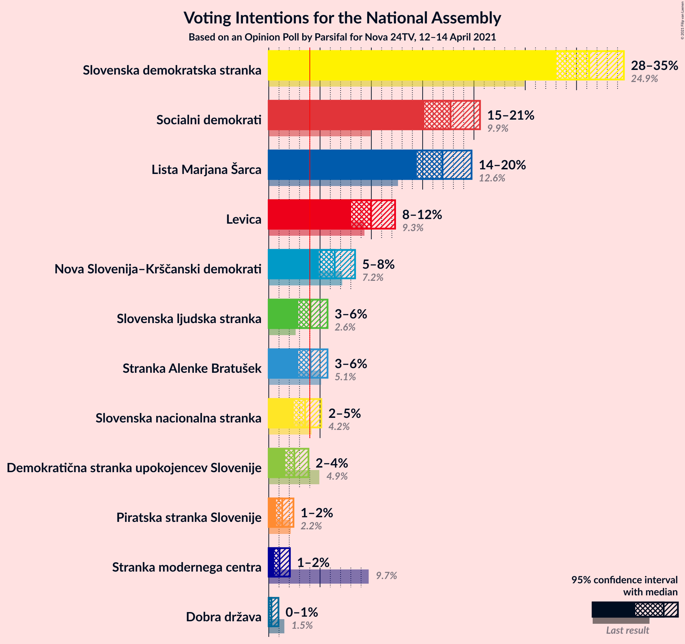

### Confidence Intervals

| Party | Last Result | Poll Result | 80% Confidence Interval | 90% Confidence Interval | 95% Confidence Interval | 99% Confidence Interval |
|:-----:|:-----------:|:-----------:|:-----------------------:|:-----------------------:|:-----------------------:|:-----------------------:|
| Slovenska demokratska stranka | 24.9% | 31.2% | 29.1–33.5% |28.5–34.1% |28.0–34.6% |27.1–35.7% |
| Socialni demokrati | 9.9% | 17.7% | 16.0–19.6% |15.6–20.1% |15.2–20.6% |14.4–21.5% |
| Lista Marjana Šarca | 12.6% | 16.9% | 15.3–18.8% |14.8–19.3% |14.4–19.8% |13.7–20.7% |
| Levica | 9.3% | 10.0% | 8.7–11.5% |8.3–11.9% |8.0–12.3% |7.5–13.1% |
| Nova Slovenija–Krščanski demokrati | 7.2% | 6.4% | 5.4–7.7% |5.1–8.1% |4.9–8.4% |4.5–9.1% |
| Stranka Alenke Bratušek | 5.1% | 4.1% | 3.3–5.2% |3.1–5.5% |2.9–5.7% |2.5–6.3% |
| Slovenska ljudska stranka | 2.6% | 4.1% | 3.3–5.2% |3.1–5.5% |2.9–5.7% |2.5–6.3% |
| Slovenska nacionalna stranka | 4.2% | 3.5% | 2.8–4.6% |2.6–4.8% |2.4–5.1% |2.1–5.6% |
| Demokratična stranka upokojencev Slovenije | 4.9% | 2.5% | 1.9–3.4% |1.7–3.6% |1.6–3.9% |1.4–4.3% |
| Piratska stranka Slovenije | 2.2% | 1.3% | 0.9–2.0% |0.8–2.2% |0.7–2.4% |0.6–2.8% |
| Stranka modernega centra | 9.7% | 1.0% | 0.7–1.7% |0.6–1.9% |0.5–2.1% |0.4–2.4% |
| Dobra država | 1.5% | 0.3% | 0.1–0.7% |0.1–0.8% |0.1–0.9% |0.0–1.2% |

*Note:* The poll result column reflects the actual value used in the calculations. Published results may vary slightly, and in addition be rounded to fewer digits.

## Seats

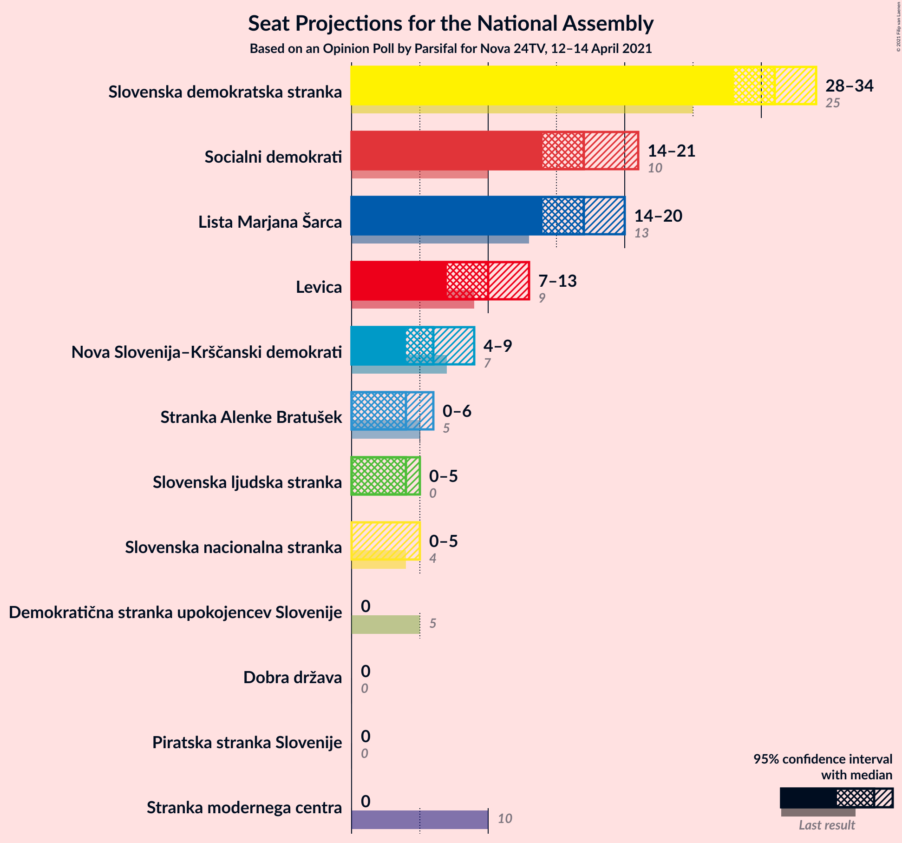

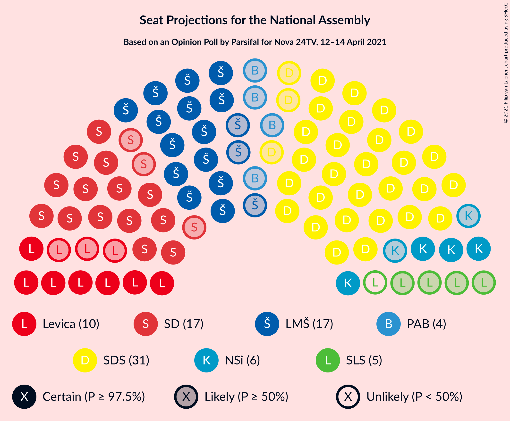

### Confidence Intervals

| Party | Last Result | Median | 80% Confidence Interval | 90% Confidence Interval | 95% Confidence Interval | 99% Confidence Interval |
|:-----:|:-----------:|:------:|:-----------------------:|:-----------------------:|:-----------------------:|:-----------------------:|
| <a href="#slovenska-demokratska-stranka">Slovenska demokratska stranka</a> | 25 | 31 | 29–33 |28–34 |28–34 |26–36 |
| <a href="#socialni-demokrati">Socialni demokrati</a> | 10 | 17 | 16–20 |15–21 |14–21 |14–22 |
| <a href="#lista-marjana-šarca">Lista Marjana Šarca</a> | 13 | 17 | 15–20 |15–20 |14–20 |13–22 |
| <a href="#levica">Levica</a> | 9 | 10 | 8–12 |8–12 |7–13 |6–14 |
| <a href="#nova-slovenija–krščanski-demokrati">Nova Slovenija–Krščanski demokrati</a> | 7 | 6 | 5–7 |5–8 |4–9 |4–9 |
| <a href="#stranka-alenke-bratušek">Stranka Alenke Bratušek</a> | 5 | 4 | 0–4 |0–5 |0–6 |0–6 |
| <a href="#slovenska-ljudska-stranka">Slovenska ljudska stranka</a> | 0 | 4 | 0–5 |0–5 |0–5 |0–6 |
| <a href="#slovenska-nacionalna-stranka">Slovenska nacionalna stranka</a> | 4 | 0 | 0–4 |0–4 |0–5 |0–5 |
| <a href="#demokratična-stranka-upokojencev-slovenije">Demokratična stranka upokojencev Slovenije</a> | 5 | 0 | 0 |0 |0 |0–4 |
| <a href="#piratska-stranka-slovenije">Piratska stranka Slovenije</a> | 0 | 0 | 0 |0 |0 |0 |
| <a href="#stranka-modernega-centra">Stranka modernega centra</a> | 10 | 0 | 0 |0 |0 |0 |
| <a href="#dobra-država">Dobra država</a> | 0 | 0 | 0 |0 |0 |0 |

### Slovenska demokratska stranka

*For a full overview of the results for this party, see the [Slovenska demokratska stranka](party-slovenskademokratskastranka.html) page.*

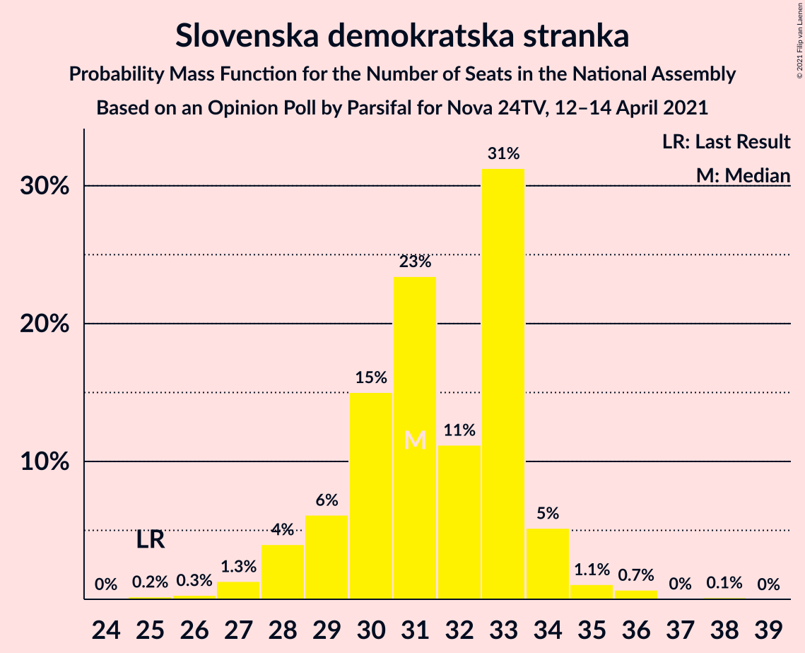

| Number of Seats | Probability | Accumulated | Special Marks |
|:---------------:|:-----------:|:-----------:|:-------------:|
| 25 | 0.2% | 100% | Last Result |
| 26 | 0.3% | 99.8% |  |
| 27 | 1.3% | 99.5% |  |
| 28 | 4% | 98% |  |
| 29 | 6% | 94% |  |
| 30 | 15% | 88% |  |
| 31 | 23% | 73% | Median |
| 32 | 11% | 50% |  |
| 33 | 31% | 38% |  |
| 34 | 5% | 7% |  |
| 35 | 1.1% | 2% |  |
| 36 | 0.7% | 0.9% |  |
| 37 | 0% | 0.2% |  |
| 38 | 0.1% | 0.1% |  |
| 39 | 0% | 0% |  |

### Socialni demokrati

*For a full overview of the results for this party, see the [Socialni demokrati](party-socialnidemokrati.html) page.*

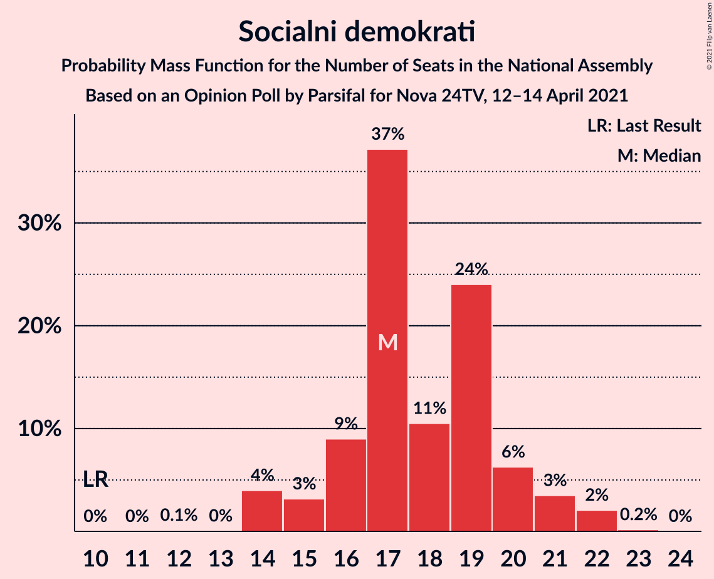

| Number of Seats | Probability | Accumulated | Special Marks |
|:---------------:|:-----------:|:-----------:|:-------------:|
| 10 | 0% | 100% | Last Result |
| 11 | 0% | 100% |  |
| 12 | 0.1% | 100% |  |
| 13 | 0% | 99.9% |  |
| 14 | 4% | 99.8% |  |
| 15 | 3% | 96% |  |
| 16 | 9% | 93% |  |
| 17 | 37% | 84% | Median |
| 18 | 11% | 47% |  |
| 19 | 24% | 36% |  |
| 20 | 6% | 12% |  |
| 21 | 3% | 6% |  |
| 22 | 2% | 2% |  |
| 23 | 0.2% | 0.2% |  |
| 24 | 0% | 0% |  |

### Lista Marjana Šarca

*For a full overview of the results for this party, see the [Lista Marjana Šarca](party-listamarjanašarca.html) page.*

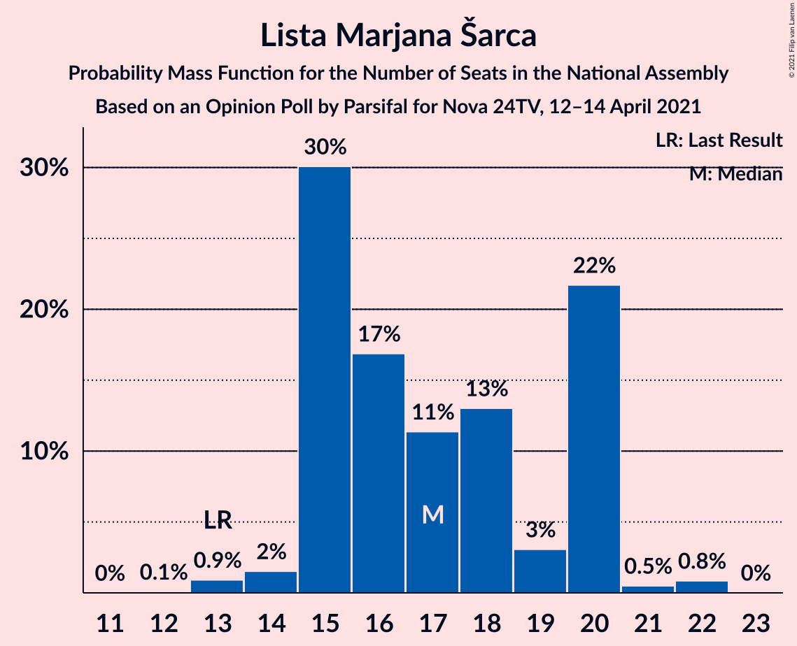

| Number of Seats | Probability | Accumulated | Special Marks |
|:---------------:|:-----------:|:-----------:|:-------------:|
| 12 | 0.1% | 100% |  |
| 13 | 0.9% | 99.9% | Last Result |
| 14 | 2% | 99.0% |  |
| 15 | 30% | 97% |  |
| 16 | 17% | 67% |  |
| 17 | 11% | 51% | Median |
| 18 | 13% | 39% |  |
| 19 | 3% | 26% |  |
| 20 | 22% | 23% |  |
| 21 | 0.5% | 1.4% |  |
| 22 | 0.8% | 0.9% |  |
| 23 | 0% | 0% |  |

### Levica

*For a full overview of the results for this party, see the [Levica](party-levica.html) page.*

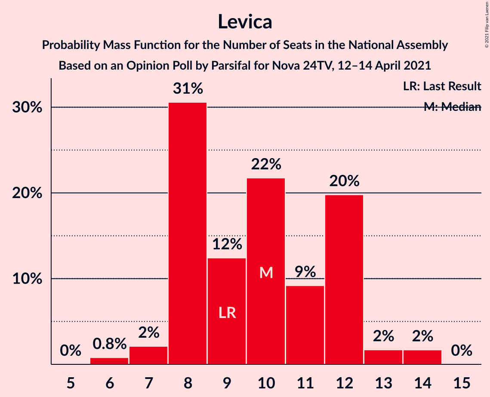

| Number of Seats | Probability | Accumulated | Special Marks |
|:---------------:|:-----------:|:-----------:|:-------------:|
| 6 | 0.8% | 100% |  |
| 7 | 2% | 99.2% |  |
| 8 | 31% | 97% |  |
| 9 | 12% | 67% | Last Result |
| 10 | 22% | 54% | Median |
| 11 | 9% | 32% |  |
| 12 | 20% | 23% |  |
| 13 | 2% | 3% |  |
| 14 | 2% | 2% |  |
| 15 | 0% | 0% |  |

### Nova Slovenija–Krščanski demokrati

*For a full overview of the results for this party, see the [Nova Slovenija–Krščanski demokrati](party-novaslovenija–krščanskidemokrati.html) page.*

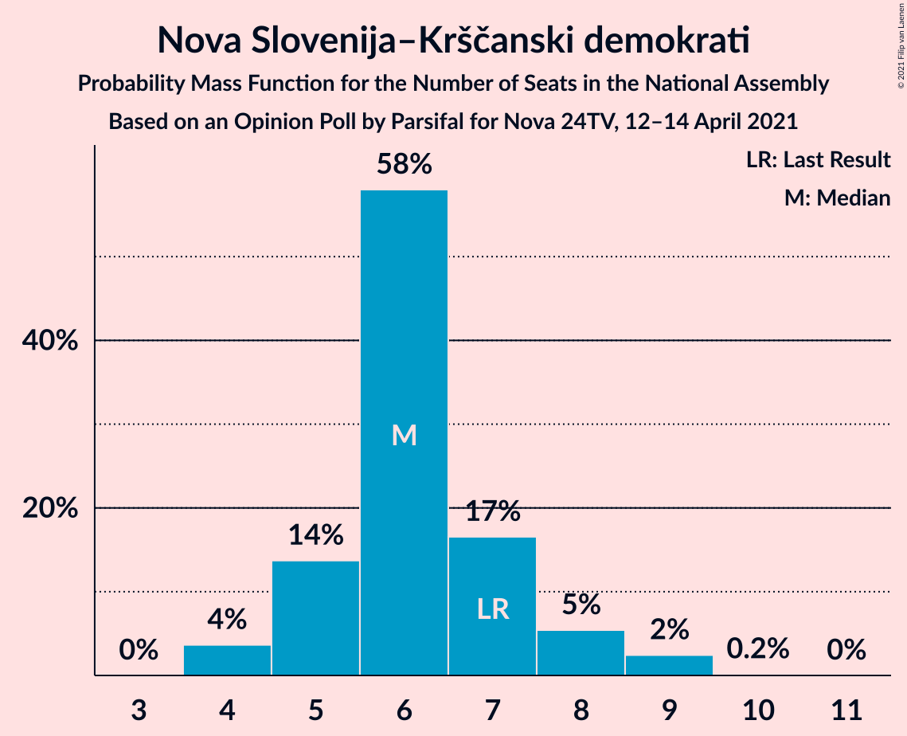

| Number of Seats | Probability | Accumulated | Special Marks |
|:---------------:|:-----------:|:-----------:|:-------------:|
| 4 | 4% | 100% |  |
| 5 | 14% | 96% |  |
| 6 | 58% | 83% | Median |
| 7 | 17% | 25% | Last Result |
| 8 | 5% | 8% |  |
| 9 | 2% | 3% |  |
| 10 | 0.2% | 0.2% |  |
| 11 | 0% | 0% |  |

### Stranka Alenke Bratušek

*For a full overview of the results for this party, see the [Stranka Alenke Bratušek](party-strankaalenkebratušek.html) page.*

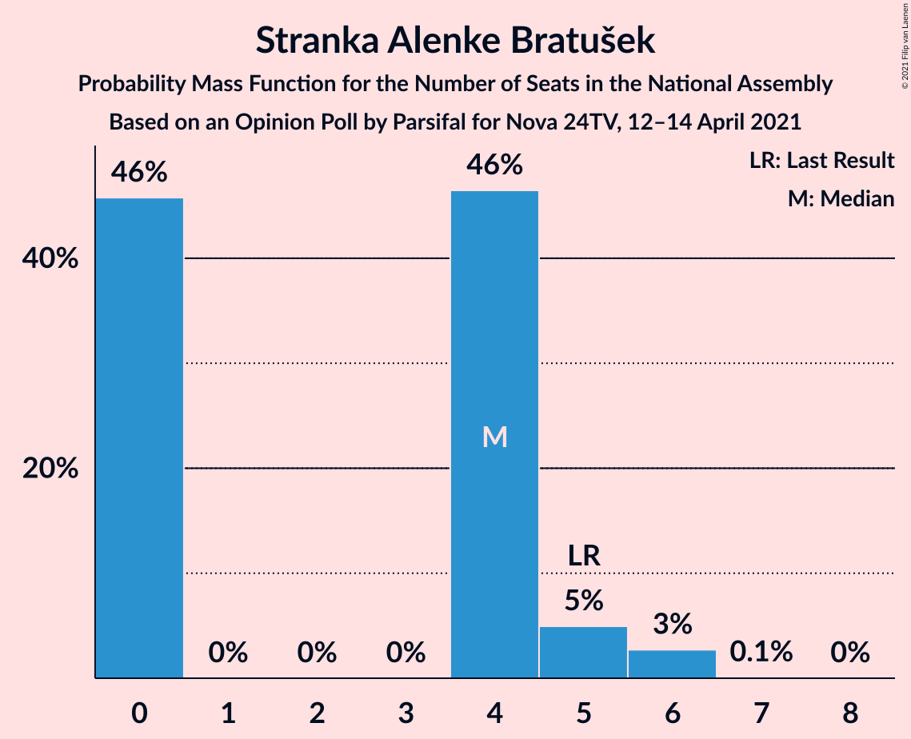

| Number of Seats | Probability | Accumulated | Special Marks |
|:---------------:|:-----------:|:-----------:|:-------------:|
| 0 | 46% | 100% |  |
| 1 | 0% | 54% |  |
| 2 | 0% | 54% |  |
| 3 | 0% | 54% |  |
| 4 | 46% | 54% | Median |
| 5 | 5% | 8% | Last Result |
| 6 | 3% | 3% |  |
| 7 | 0.1% | 0.1% |  |
| 8 | 0% | 0% |  |

### Slovenska ljudska stranka

*For a full overview of the results for this party, see the [Slovenska ljudska stranka](party-slovenskaljudskastranka.html) page.*

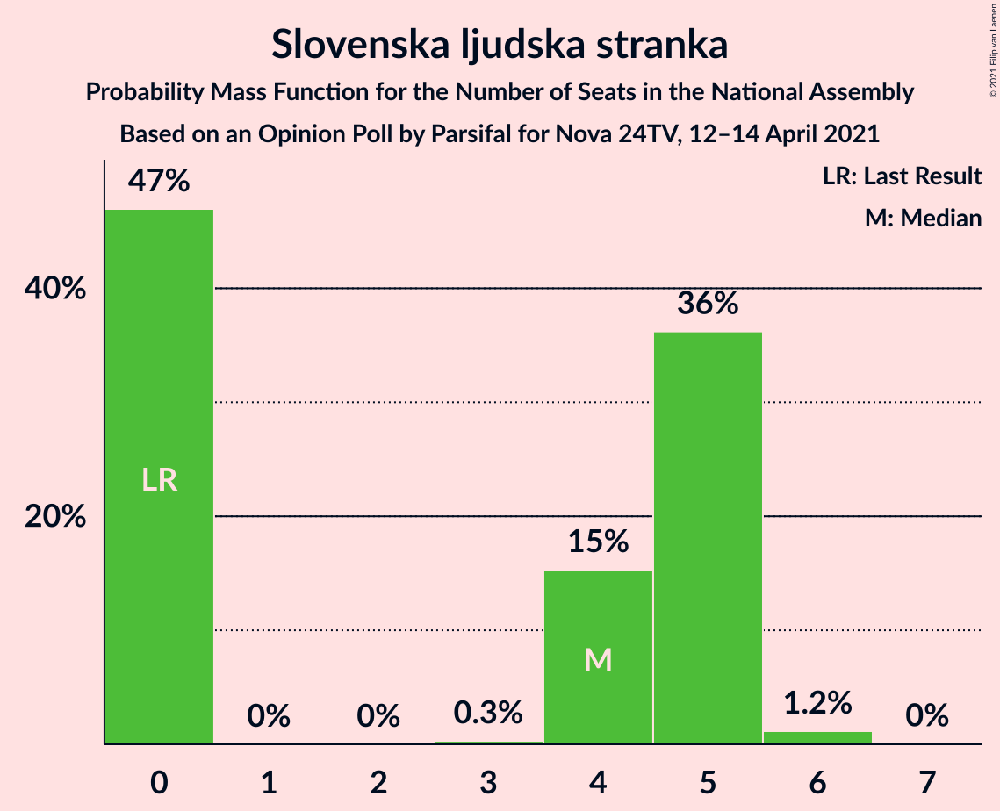

| Number of Seats | Probability | Accumulated | Special Marks |
|:---------------:|:-----------:|:-----------:|:-------------:|
| 0 | 47% | 100% | Last Result |
| 1 | 0% | 53% |  |
| 2 | 0% | 53% |  |
| 3 | 0.3% | 53% |  |
| 4 | 15% | 53% | Median |
| 5 | 36% | 37% |  |
| 6 | 1.2% | 1.2% |  |
| 7 | 0% | 0% |  |

### Slovenska nacionalna stranka

*For a full overview of the results for this party, see the [Slovenska nacionalna stranka](party-slovenskanacionalnastranka.html) page.*

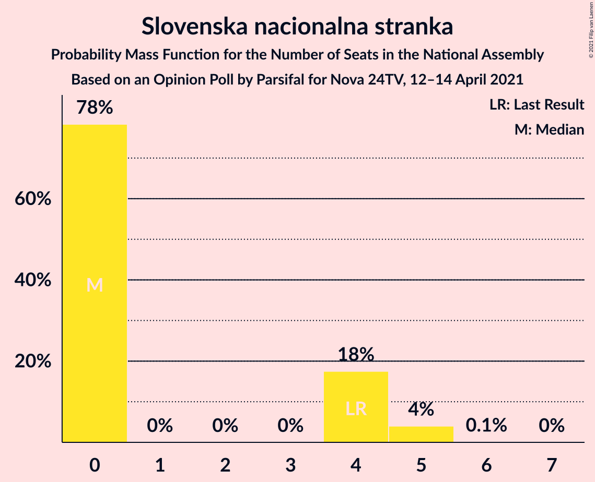

| Number of Seats | Probability | Accumulated | Special Marks |
|:---------------:|:-----------:|:-----------:|:-------------:|
| 0 | 78% | 100% | Median |
| 1 | 0% | 22% |  |
| 2 | 0% | 22% |  |
| 3 | 0% | 22% |  |
| 4 | 18% | 22% | Last Result |
| 5 | 4% | 4% |  |
| 6 | 0.1% | 0.1% |  |
| 7 | 0% | 0% |  |

### Demokratična stranka upokojencev Slovenije

*For a full overview of the results for this party, see the [Demokratična stranka upokojencev Slovenije](party-demokratičnastrankaupokojencevslovenije.html) page.*

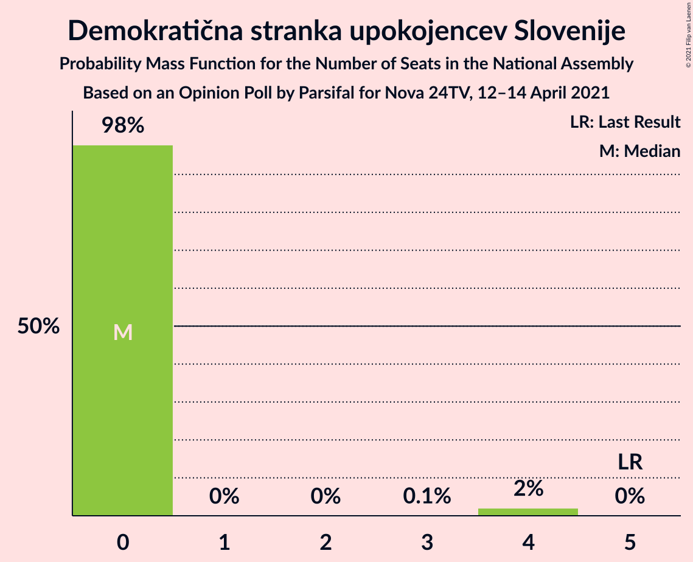

| Number of Seats | Probability | Accumulated | Special Marks |
|:---------------:|:-----------:|:-----------:|:-------------:|
| 0 | 98% | 100% | Median |
| 1 | 0% | 2% |  |
| 2 | 0% | 2% |  |
| 3 | 0.1% | 2% |  |
| 4 | 2% | 2% |  |
| 5 | 0% | 0% | Last Result |

### Piratska stranka Slovenije

*For a full overview of the results for this party, see the [Piratska stranka Slovenije](party-piratskastrankaslovenije.html) page.*

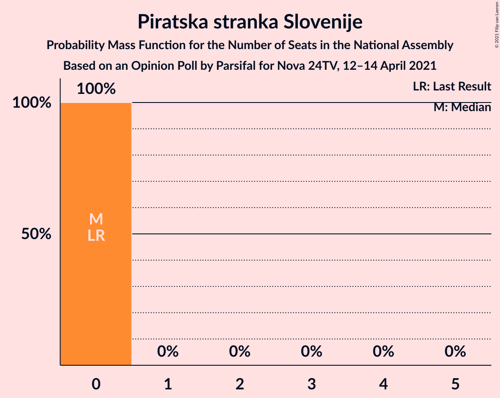

| Number of Seats | Probability | Accumulated | Special Marks |
|:---------------:|:-----------:|:-----------:|:-------------:|
| 0 | 100% | 100% | Last Result, Median |

### Stranka modernega centra

*For a full overview of the results for this party, see the [Stranka modernega centra](party-strankamodernegacentra.html) page.*

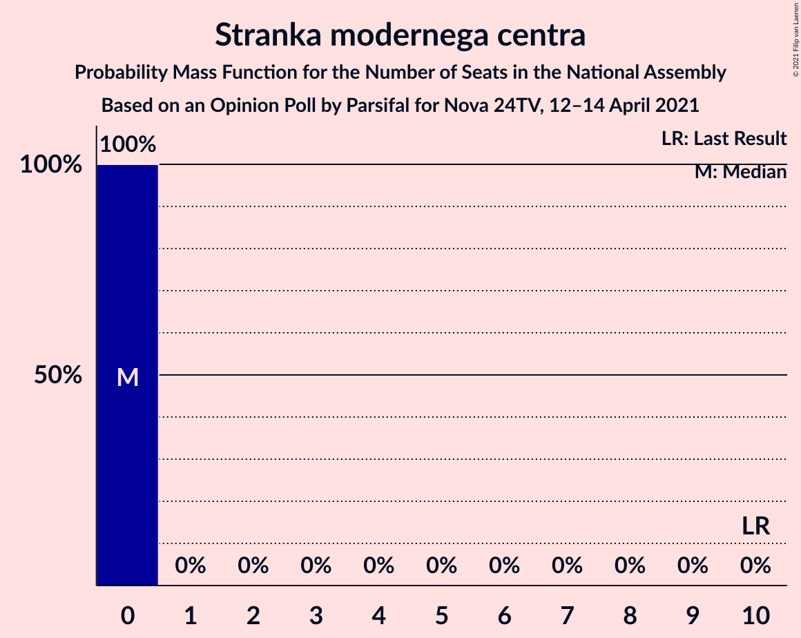

| Number of Seats | Probability | Accumulated | Special Marks |
|:---------------:|:-----------:|:-----------:|:-------------:|
| 0 | 100% | 100% | Median |
| 1 | 0% | 0% |  |
| 2 | 0% | 0% |  |
| 3 | 0% | 0% |  |
| 4 | 0% | 0% |  |
| 5 | 0% | 0% |  |
| 6 | 0% | 0% |  |
| 7 | 0% | 0% |  |
| 8 | 0% | 0% |  |
| 9 | 0% | 0% |  |
| 10 | 0% | 0% | Last Result |

### Dobra država

*For a full overview of the results for this party, see the [Dobra država](party-dobradržava.html) page.*

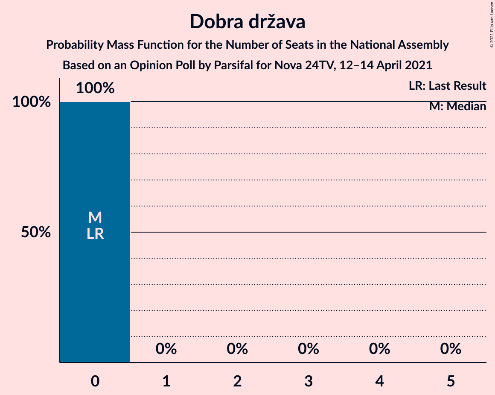

| Number of Seats | Probability | Accumulated | Special Marks |
|:---------------:|:-----------:|:-----------:|:-------------:|
| 0 | 100% | 100% | Last Result, Median |

## Coalitions

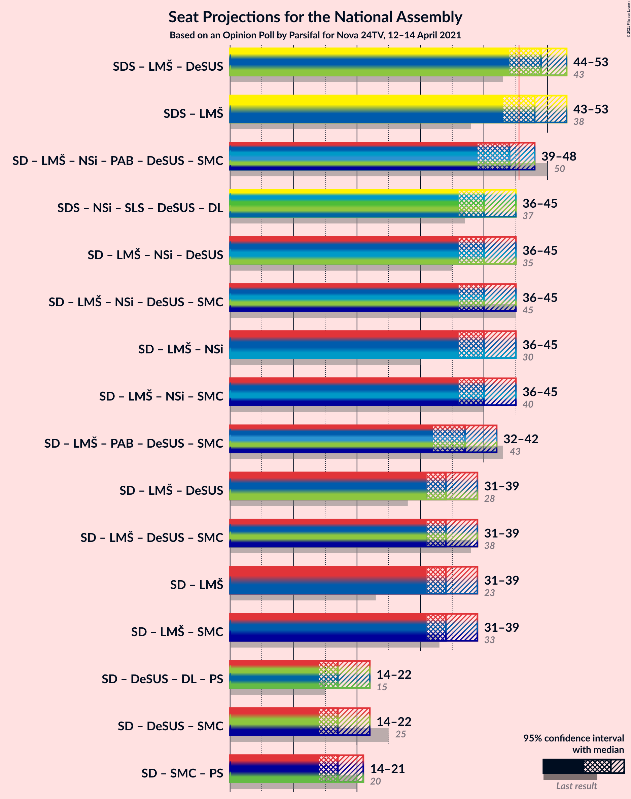

### Confidence Intervals

| Coalition | Last Result | Median | Majority? | 80% Confidence Interval | 90% Confidence Interval | 95% Confidence Interval | 99% Confidence Interval |
|:---------:|:-----------:|:------:|:---------:|:-----------------------:|:-----------------------:|:-----------------------:|:-----------------------:|
| Slovenska demokratska stranka – Lista Marjana Šarca – Demokratična stranka upokojencev Slovenije | 43 | 49 | 89% | 45–53 | 45–53 | 44–53 | 42–55 |
| Slovenska demokratska stranka – Lista Marjana Šarca | 38 | 48 | 87% | 45–53 | 44–53 | 43–53 | 42–55 |
| Socialni demokrati – Lista Marjana Šarca – Nova Slovenija–Krščanski demokrati – Stranka Alenke Bratušek – Demokratična stranka upokojencev Slovenije – Stranka modernega centra | 50 | 44 | 30% | 40–47 | 40–47 | 39–48 | 37–49 |
| Socialni demokrati – Lista Marjana Šarca – Nova Slovenija–Krščanski demokrati – Demokratična stranka upokojencev Slovenije | 35 | 40 | 2% | 39–43 | 37–45 | 36–45 | 34–49 |
| Socialni demokrati – Lista Marjana Šarca – Nova Slovenija–Krščanski demokrati – Demokratična stranka upokojencev Slovenije – Stranka modernega centra | 45 | 40 | 2% | 39–43 | 37–45 | 36–45 | 34–49 |
| Socialni demokrati – Lista Marjana Šarca – Nova Slovenija–Krščanski demokrati | 30 | 40 | 2% | 38–43 | 37–44 | 36–45 | 34–49 |
| Socialni demokrati – Lista Marjana Šarca – Nova Slovenija–Krščanski demokrati – Stranka modernega centra | 40 | 40 | 2% | 38–43 | 37–44 | 36–45 | 34–49 |
| Socialni demokrati – Lista Marjana Šarca – Stranka Alenke Bratušek – Demokratična stranka upokojencev Slovenije – Stranka modernega centra | 43 | 37 | 0% | 33–41 | 32–41 | 32–42 | 31–43 |
| Socialni demokrati – Lista Marjana Šarca – Demokratična stranka upokojencev Slovenije | 28 | 34 | 0% | 32–37 | 31–39 | 31–39 | 30–40 |
| Socialni demokrati – Lista Marjana Šarca – Demokratična stranka upokojencev Slovenije – Stranka modernega centra | 38 | 34 | 0% | 32–37 | 31–39 | 31–39 | 30–40 |
| Socialni demokrati – Lista Marjana Šarca | 23 | 34 | 0% | 32–37 | 31–39 | 31–39 | 30–40 |
| Socialni demokrati – Lista Marjana Šarca – Stranka modernega centra | 33 | 34 | 0% | 32–37 | 31–39 | 31–39 | 30–40 |
| Socialni demokrati – Demokratična stranka upokojencev Slovenije – Stranka modernega centra | 25 | 17 | 0% | 16–20 | 15–21 | 14–22 | 14–23 |

### Slovenska demokratska stranka – Lista Marjana Šarca – Demokratična stranka upokojencev Slovenije

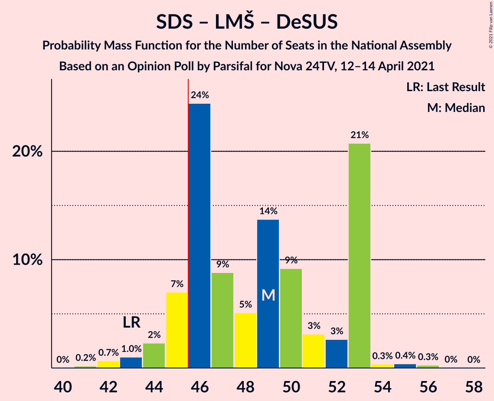

| Number of Seats | Probability | Accumulated | Special Marks |
|:---------------:|:-----------:|:-----------:|:-------------:|
| 41 | 0.2% | 100% |  |
| 42 | 0.7% | 99.8% |  |
| 43 | 1.0% | 99.1% | Last Result |
| 44 | 2% | 98% |  |
| 45 | 7% | 96% |  |
| 46 | 24% | 89% | Majority |
| 47 | 9% | 64% |  |
| 48 | 5% | 56% | Median |
| 49 | 14% | 50% |  |
| 50 | 9% | 37% |  |
| 51 | 3% | 28% |  |
| 52 | 3% | 24% |  |
| 53 | 21% | 22% |  |
| 54 | 0.3% | 1.0% |  |
| 55 | 0.4% | 0.7% |  |
| 56 | 0.3% | 0.3% |  |
| 57 | 0% | 0% |  |

### Slovenska demokratska stranka – Lista Marjana Šarca

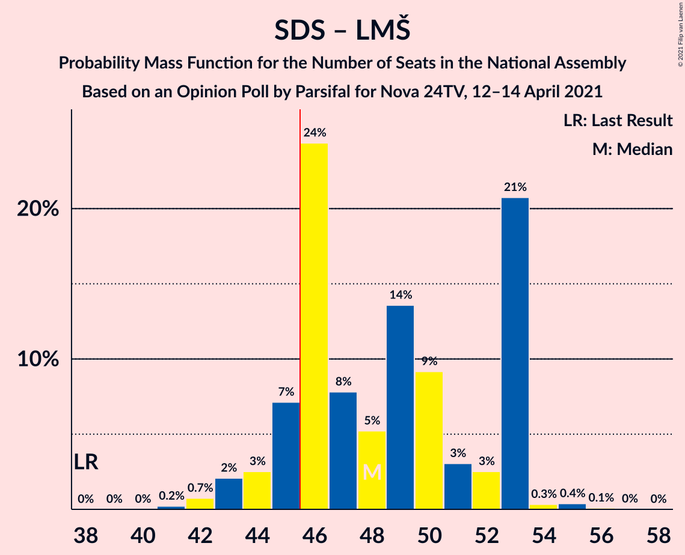

| Number of Seats | Probability | Accumulated | Special Marks |
|:---------------:|:-----------:|:-----------:|:-------------:|
| 38 | 0% | 100% | Last Result |
| 39 | 0% | 100% |  |
| 40 | 0% | 100% |  |
| 41 | 0.2% | 100% |  |
| 42 | 0.7% | 99.8% |  |
| 43 | 2% | 99.0% |  |
| 44 | 3% | 97% |  |
| 45 | 7% | 94% |  |
| 46 | 24% | 87% | Majority |
| 47 | 8% | 63% |  |
| 48 | 5% | 55% | Median |
| 49 | 14% | 50% |  |
| 50 | 9% | 36% |  |
| 51 | 3% | 27% |  |
| 52 | 3% | 24% |  |
| 53 | 21% | 22% |  |
| 54 | 0.3% | 0.8% |  |
| 55 | 0.4% | 0.5% |  |
| 56 | 0.1% | 0.1% |  |
| 57 | 0% | 0% |  |

### Socialni demokrati – Lista Marjana Šarca – Nova Slovenija–Krščanski demokrati – Stranka Alenke Bratušek – Demokratična stranka upokojencev Slovenije – Stranka modernega centra

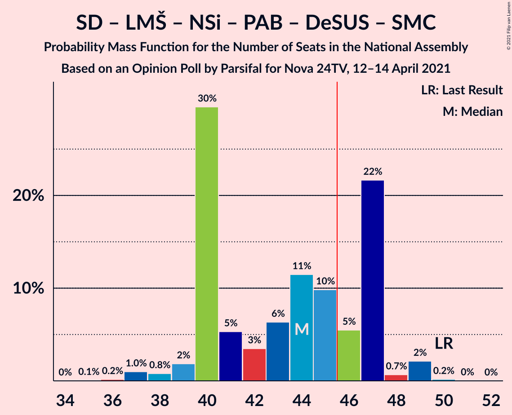

| Number of Seats | Probability | Accumulated | Special Marks |
|:---------------:|:-----------:|:-----------:|:-------------:|
| 35 | 0.1% | 100% |  |
| 36 | 0.2% | 99.9% |  |
| 37 | 1.0% | 99.8% |  |
| 38 | 0.8% | 98.8% |  |
| 39 | 2% | 98% |  |
| 40 | 30% | 96% |  |
| 41 | 5% | 67% |  |
| 42 | 3% | 61% |  |
| 43 | 6% | 58% |  |
| 44 | 11% | 51% | Median |
| 45 | 10% | 40% |  |
| 46 | 5% | 30% | Majority |
| 47 | 22% | 25% |  |
| 48 | 0.7% | 3% |  |
| 49 | 2% | 2% |  |
| 50 | 0.2% | 0.2% | Last Result |
| 51 | 0% | 0% |  |

### Socialni demokrati – Lista Marjana Šarca – Nova Slovenija–Krščanski demokrati – Demokratična stranka upokojencev Slovenije

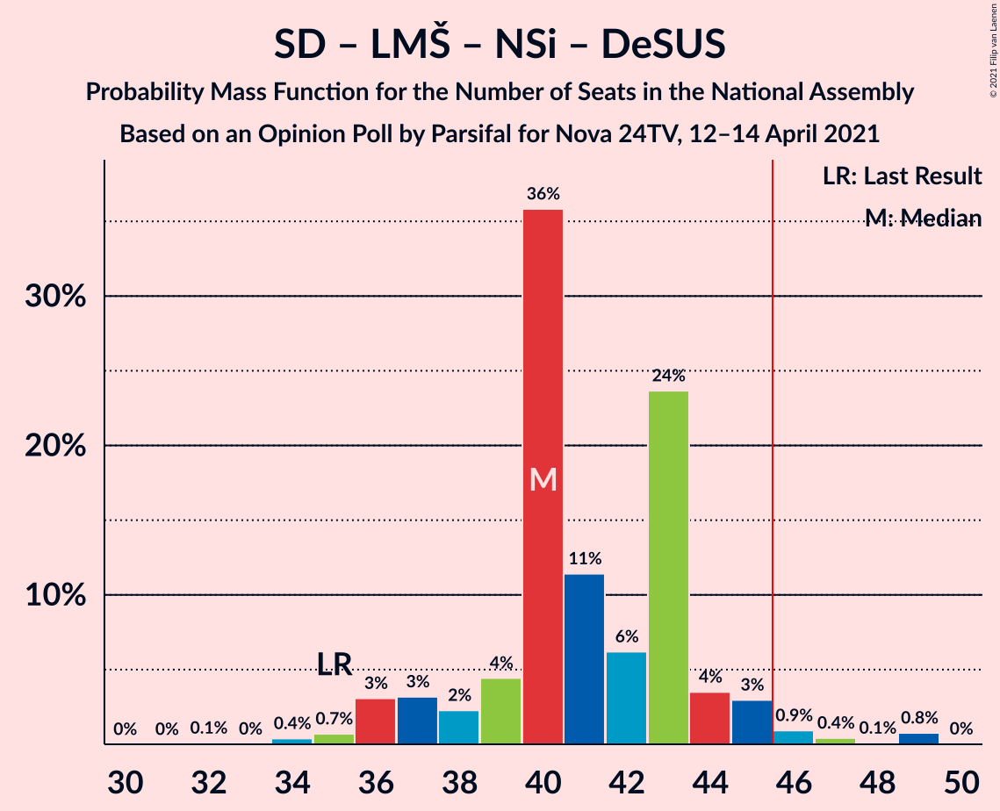

| Number of Seats | Probability | Accumulated | Special Marks |
|:---------------:|:-----------:|:-----------:|:-------------:|
| 32 | 0.1% | 100% |  |
| 33 | 0% | 99.9% |  |
| 34 | 0.4% | 99.9% |  |
| 35 | 0.7% | 99.5% | Last Result |
| 36 | 3% | 98.8% |  |
| 37 | 3% | 96% |  |
| 38 | 2% | 93% |  |
| 39 | 4% | 90% |  |
| 40 | 36% | 86% | Median |
| 41 | 11% | 50% |  |
| 42 | 6% | 39% |  |
| 43 | 24% | 32% |  |
| 44 | 4% | 9% |  |
| 45 | 3% | 5% |  |
| 46 | 0.9% | 2% | Majority |
| 47 | 0.4% | 1.3% |  |
| 48 | 0.1% | 0.9% |  |
| 49 | 0.8% | 0.8% |  |
| 50 | 0% | 0% |  |

### Socialni demokrati – Lista Marjana Šarca – Nova Slovenija–Krščanski demokrati – Demokratična stranka upokojencev Slovenije – Stranka modernega centra

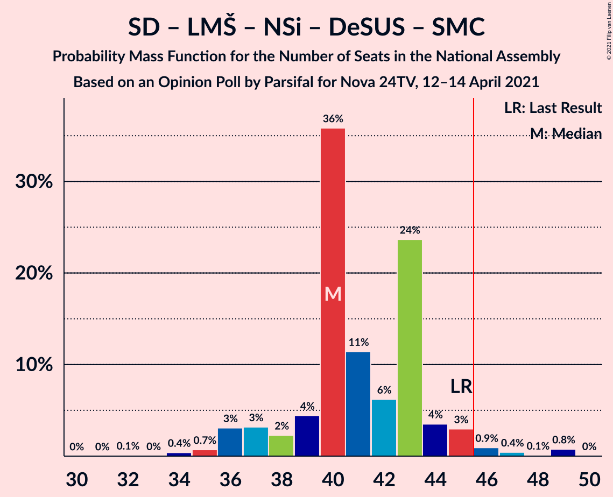

| Number of Seats | Probability | Accumulated | Special Marks |
|:---------------:|:-----------:|:-----------:|:-------------:|
| 32 | 0.1% | 100% |  |
| 33 | 0% | 99.9% |  |
| 34 | 0.4% | 99.9% |  |
| 35 | 0.7% | 99.5% |  |
| 36 | 3% | 98.8% |  |
| 37 | 3% | 96% |  |
| 38 | 2% | 93% |  |
| 39 | 4% | 90% |  |
| 40 | 36% | 86% | Median |
| 41 | 11% | 50% |  |
| 42 | 6% | 39% |  |
| 43 | 24% | 32% |  |
| 44 | 4% | 9% |  |
| 45 | 3% | 5% | Last Result |
| 46 | 0.9% | 2% | Majority |
| 47 | 0.4% | 1.3% |  |
| 48 | 0.1% | 0.9% |  |
| 49 | 0.8% | 0.8% |  |
| 50 | 0% | 0% |  |

### Socialni demokrati – Lista Marjana Šarca – Nova Slovenija–Krščanski demokrati

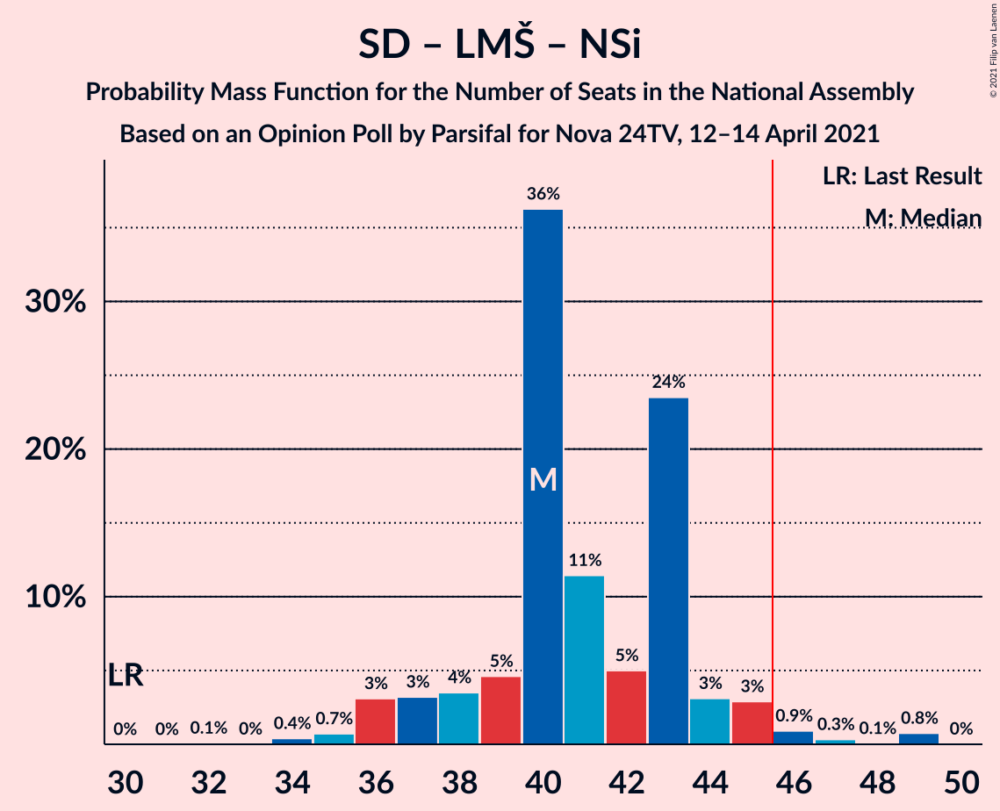

| Number of Seats | Probability | Accumulated | Special Marks |
|:---------------:|:-----------:|:-----------:|:-------------:|
| 30 | 0% | 100% | Last Result |
| 31 | 0% | 100% |  |
| 32 | 0.1% | 100% |  |
| 33 | 0% | 99.9% |  |
| 34 | 0.4% | 99.9% |  |
| 35 | 0.7% | 99.5% |  |
| 36 | 3% | 98.8% |  |
| 37 | 3% | 96% |  |
| 38 | 4% | 92% |  |
| 39 | 5% | 89% |  |
| 40 | 36% | 84% | Median |
| 41 | 11% | 48% |  |
| 42 | 5% | 37% |  |
| 43 | 24% | 32% |  |
| 44 | 3% | 8% |  |
| 45 | 3% | 5% |  |
| 46 | 0.9% | 2% | Majority |
| 47 | 0.3% | 1.2% |  |
| 48 | 0.1% | 0.8% |  |
| 49 | 0.8% | 0.8% |  |
| 50 | 0% | 0% |  |

### Socialni demokrati – Lista Marjana Šarca – Nova Slovenija–Krščanski demokrati – Stranka modernega centra

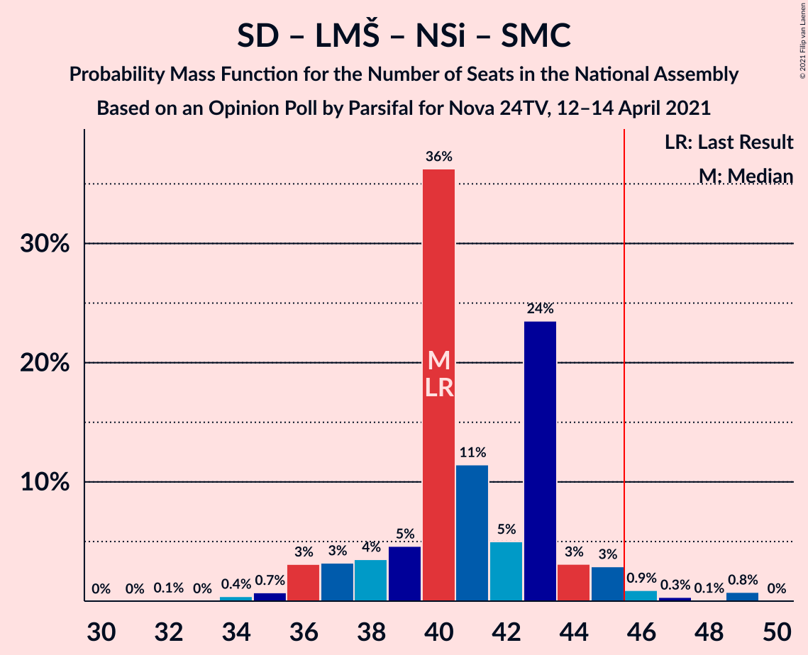

| Number of Seats | Probability | Accumulated | Special Marks |
|:---------------:|:-----------:|:-----------:|:-------------:|
| 32 | 0.1% | 100% |  |
| 33 | 0% | 99.9% |  |
| 34 | 0.4% | 99.9% |  |
| 35 | 0.7% | 99.5% |  |
| 36 | 3% | 98.8% |  |
| 37 | 3% | 96% |  |
| 38 | 4% | 92% |  |
| 39 | 5% | 89% |  |
| 40 | 36% | 84% | Last Result, Median |
| 41 | 11% | 48% |  |
| 42 | 5% | 37% |  |
| 43 | 24% | 32% |  |
| 44 | 3% | 8% |  |
| 45 | 3% | 5% |  |
| 46 | 0.9% | 2% | Majority |
| 47 | 0.3% | 1.2% |  |
| 48 | 0.1% | 0.8% |  |
| 49 | 0.8% | 0.8% |  |
| 50 | 0% | 0% |  |

### Socialni demokrati – Lista Marjana Šarca – Stranka Alenke Bratušek – Demokratična stranka upokojencev Slovenije – Stranka modernega centra

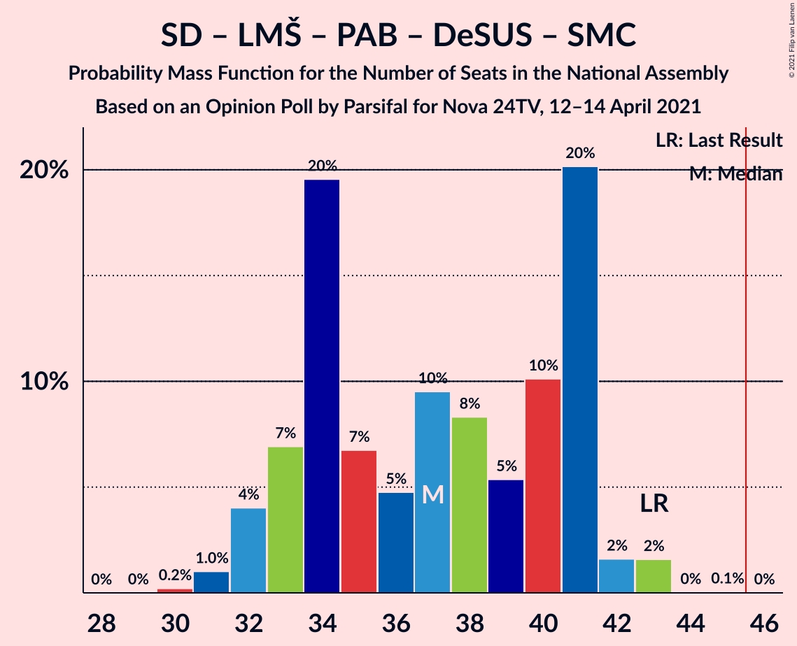

| Number of Seats | Probability | Accumulated | Special Marks |
|:---------------:|:-----------:|:-----------:|:-------------:|
| 30 | 0.2% | 100% |  |
| 31 | 1.0% | 99.8% |  |
| 32 | 4% | 98.8% |  |
| 33 | 7% | 95% |  |
| 34 | 20% | 88% |  |
| 35 | 7% | 68% |  |
| 36 | 5% | 62% |  |
| 37 | 10% | 57% |  |
| 38 | 8% | 47% | Median |
| 39 | 5% | 39% |  |
| 40 | 10% | 34% |  |
| 41 | 20% | 23% |  |
| 42 | 2% | 3% |  |
| 43 | 2% | 2% | Last Result |
| 44 | 0% | 0.1% |  |
| 45 | 0.1% | 0.1% |  |
| 46 | 0% | 0% | Majority |

### Socialni demokrati – Lista Marjana Šarca – Demokratična stranka upokojencev Slovenije

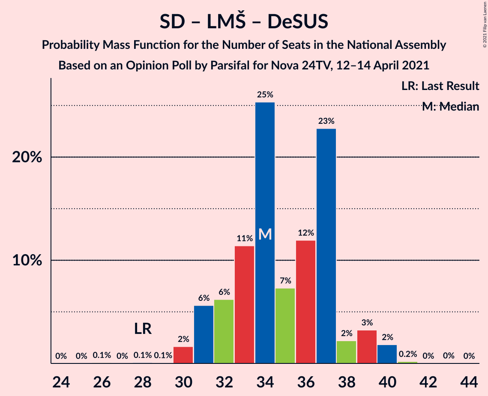

| Number of Seats | Probability | Accumulated | Special Marks |
|:---------------:|:-----------:|:-----------:|:-------------:|
| 26 | 0.1% | 100% |  |
| 27 | 0% | 99.9% |  |
| 28 | 0.1% | 99.9% | Last Result |
| 29 | 0.1% | 99.8% |  |
| 30 | 2% | 99.7% |  |
| 31 | 6% | 98% |  |
| 32 | 6% | 92% |  |
| 33 | 11% | 86% |  |
| 34 | 25% | 75% | Median |
| 35 | 7% | 50% |  |
| 36 | 12% | 42% |  |
| 37 | 23% | 30% |  |
| 38 | 2% | 8% |  |
| 39 | 3% | 5% |  |
| 40 | 2% | 2% |  |
| 41 | 0.2% | 0.2% |  |
| 42 | 0% | 0.1% |  |
| 43 | 0% | 0% |  |

### Socialni demokrati – Lista Marjana Šarca – Demokratična stranka upokojencev Slovenije – Stranka modernega centra

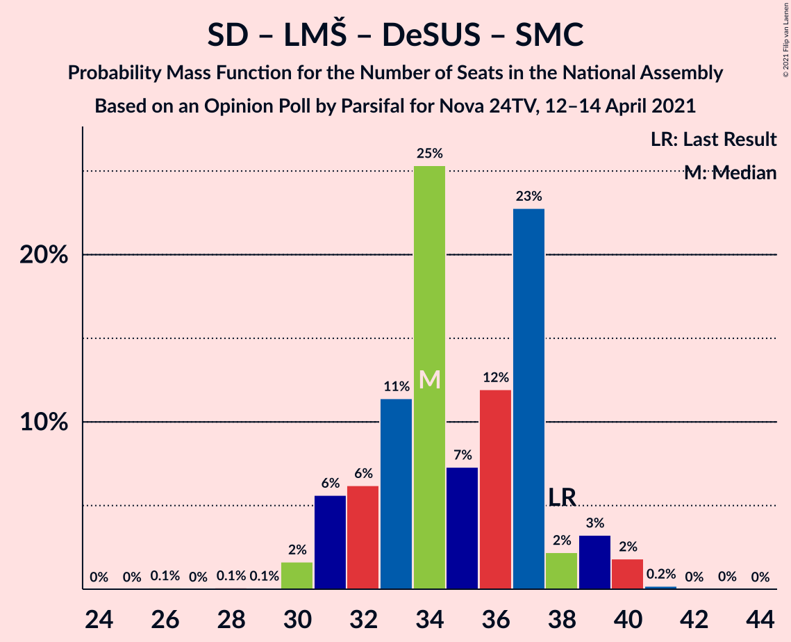

| Number of Seats | Probability | Accumulated | Special Marks |
|:---------------:|:-----------:|:-----------:|:-------------:|
| 26 | 0.1% | 100% |  |
| 27 | 0% | 99.9% |  |
| 28 | 0.1% | 99.9% |  |
| 29 | 0.1% | 99.8% |  |
| 30 | 2% | 99.7% |  |
| 31 | 6% | 98% |  |
| 32 | 6% | 92% |  |
| 33 | 11% | 86% |  |
| 34 | 25% | 75% | Median |
| 35 | 7% | 50% |  |
| 36 | 12% | 42% |  |
| 37 | 23% | 30% |  |
| 38 | 2% | 8% | Last Result |
| 39 | 3% | 5% |  |
| 40 | 2% | 2% |  |
| 41 | 0.2% | 0.2% |  |
| 42 | 0% | 0.1% |  |
| 43 | 0% | 0% |  |

### Socialni demokrati – Lista Marjana Šarca

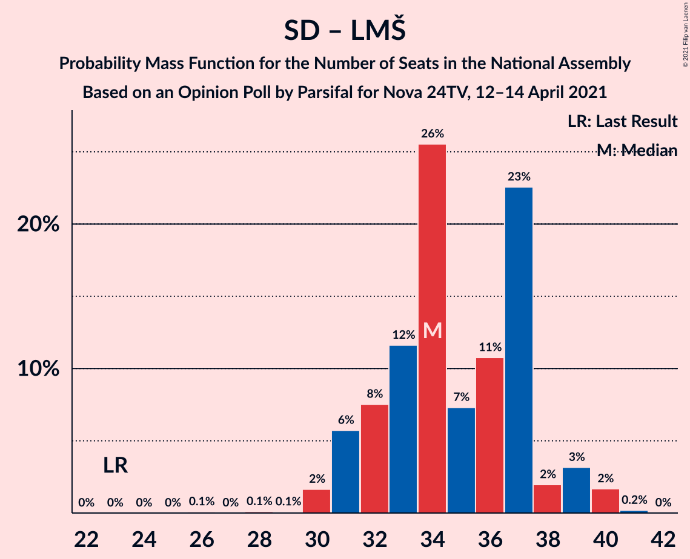

| Number of Seats | Probability | Accumulated | Special Marks |
|:---------------:|:-----------:|:-----------:|:-------------:|
| 23 | 0% | 100% | Last Result |
| 24 | 0% | 100% |  |
| 25 | 0% | 100% |  |
| 26 | 0.1% | 100% |  |
| 27 | 0% | 99.9% |  |
| 28 | 0.1% | 99.9% |  |
| 29 | 0.1% | 99.8% |  |
| 30 | 2% | 99.7% |  |
| 31 | 6% | 98% |  |
| 32 | 8% | 92% |  |
| 33 | 12% | 85% |  |
| 34 | 26% | 73% | Median |
| 35 | 7% | 48% |  |
| 36 | 11% | 40% |  |
| 37 | 23% | 30% |  |
| 38 | 2% | 7% |  |
| 39 | 3% | 5% |  |
| 40 | 2% | 2% |  |
| 41 | 0.2% | 0.2% |  |
| 42 | 0% | 0% |  |

### Socialni demokrati – Lista Marjana Šarca – Stranka modernega centra

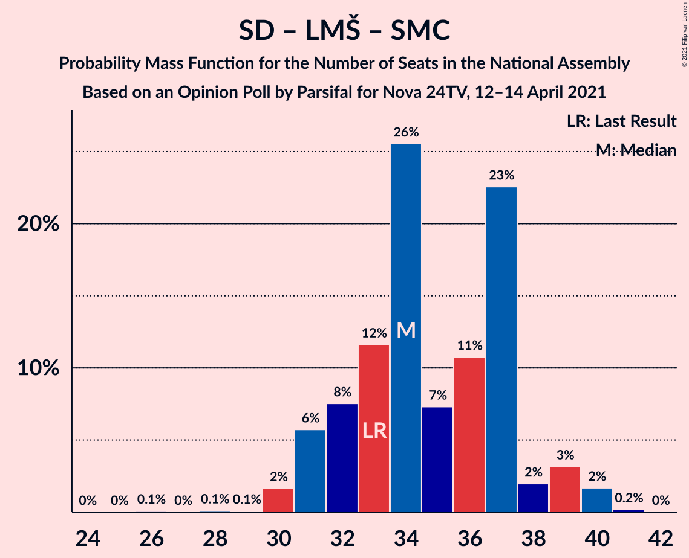

| Number of Seats | Probability | Accumulated | Special Marks |
|:---------------:|:-----------:|:-----------:|:-------------:|
| 26 | 0.1% | 100% |  |
| 27 | 0% | 99.9% |  |
| 28 | 0.1% | 99.9% |  |
| 29 | 0.1% | 99.8% |  |
| 30 | 2% | 99.7% |  |
| 31 | 6% | 98% |  |
| 32 | 8% | 92% |  |
| 33 | 12% | 85% | Last Result |
| 34 | 26% | 73% | Median |
| 35 | 7% | 48% |  |
| 36 | 11% | 40% |  |
| 37 | 23% | 30% |  |
| 38 | 2% | 7% |  |
| 39 | 3% | 5% |  |
| 40 | 2% | 2% |  |
| 41 | 0.2% | 0.2% |  |
| 42 | 0% | 0% |  |

### Socialni demokrati – Demokratična stranka upokojencev Slovenije – Stranka modernega centra

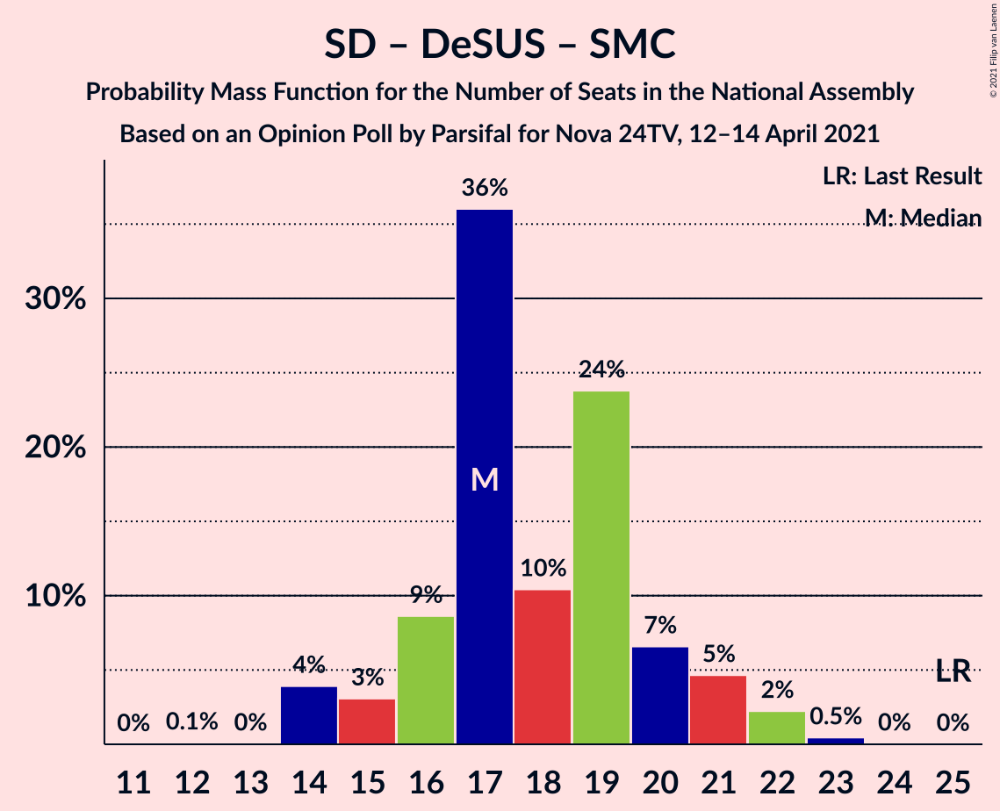

| Number of Seats | Probability | Accumulated | Special Marks |
|:---------------:|:-----------:|:-----------:|:-------------:|
| 12 | 0.1% | 100% |  |
| 13 | 0% | 99.9% |  |
| 14 | 4% | 99.8% |  |
| 15 | 3% | 96% |  |
| 16 | 9% | 93% |  |
| 17 | 36% | 84% | Median |
| 18 | 10% | 48% |  |
| 19 | 24% | 38% |  |
| 20 | 7% | 14% |  |
| 21 | 5% | 7% |  |
| 22 | 2% | 3% |  |
| 23 | 0.5% | 0.5% |  |
| 24 | 0% | 0.1% |  |
| 25 | 0% | 0% | Last Result |

## Technical Information

### Opinion Poll

+ **Polling firm:** Parsifal
+ **Commissioner(s):** Nova 24TV
+ **Fieldwork period:** 12–14 April 2021

### Calculations

+ **Sample size:** 762
+ **Simulations done:** 1,048,576
+ **Error estimate:** 3.63%

