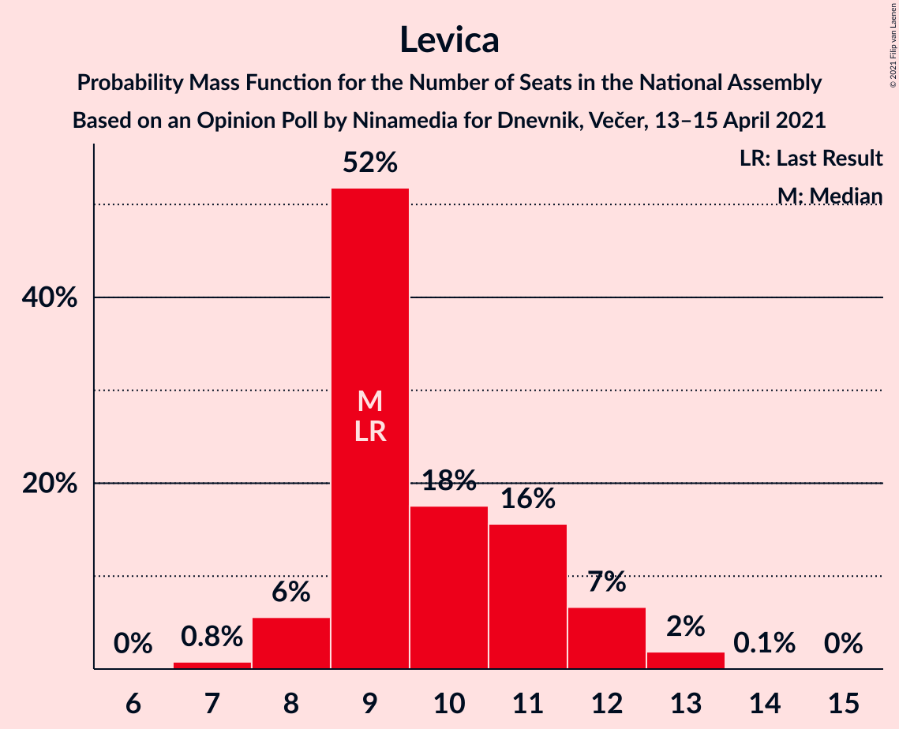
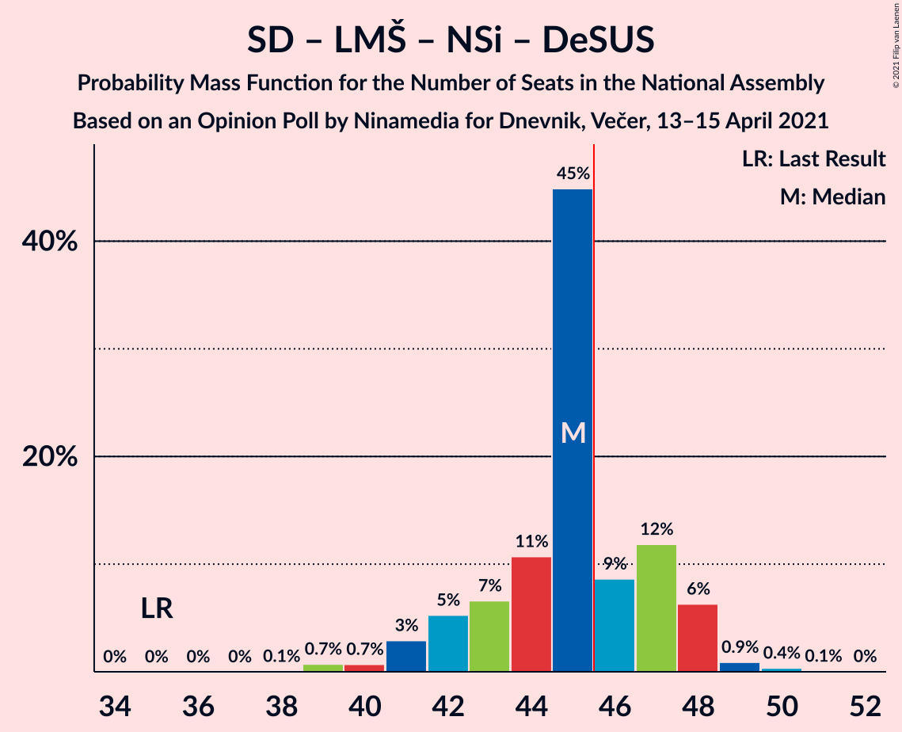
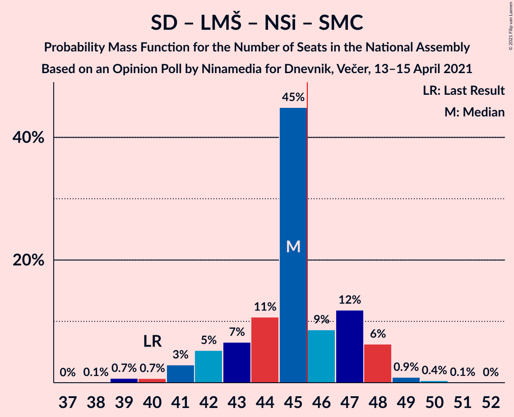
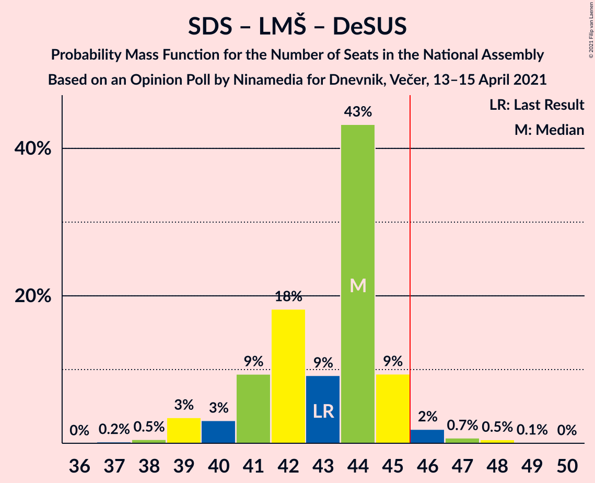
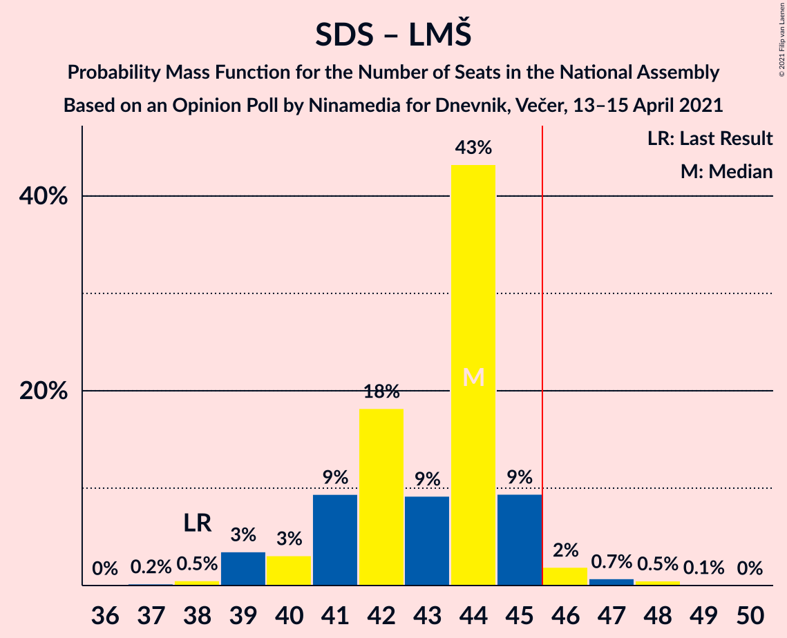

# Opinion Poll by Ninamedia for Dnevnik, Večer, 13–15 April 2021

<a href="#voting-intentions">Voting Intentions</a> | <a href="#seats">Seats</a> | <a href="#coalitions">Coalitions</a> | <a href="#technical-information">Technical Information</a>

## Voting Intentions

### Confidence Intervals

| Party | Last Result | Poll Result | 80% Confidence Interval | 90% Confidence Interval | 95% Confidence Interval | 99% Confidence Interval |
|:-----:|:-----------:|:-----------:|:-----------------------:|:-----------------------:|:-----------------------:|:-----------------------:|
| Slovenska demokratska stranka | 24.9% | 29.7% | 27.6–32.0% |27.0–32.6% |26.4–33.2% |25.4–34.3% |
| Socialni demokrati | 9.9% | 20.6% | 18.7–22.6% |18.2–23.2% |17.7–23.7% |16.9–24.8% |
| Lista Marjana Šarca | 12.6% | 15.7% | 14.1–17.6% |13.6–18.1% |13.2–18.6% |12.5–19.5% |
| Nova Slovenija–Krščanski demokrati | 7.2% | 11.6% | 10.2–13.3% |9.7–13.7% |9.4–14.2% |8.8–15.0% |
| Levica | 9.3% | 10.9% | 9.5–12.5% |9.1–13.0% |8.8–13.4% |8.1–14.2% |
| Stranka Alenke Bratušek | 5.1% | 5.6% | 4.6–6.8% |4.3–7.2% |4.1–7.5% |3.7–8.2% |
| Slovenska ljudska stranka | 2.6% | 1.9% | 1.3–2.7% |1.2–2.9% |1.1–3.2% |0.9–3.6% |
| Stranka modernega centra | 9.7% | 0.4% | 0.2–1.0% |0.2–1.1% |0.2–1.2% |0.1–1.6% |
| Demokratična stranka upokojencev Slovenije | 4.9% | 0.4% | 0.2–1.0% |0.2–1.1% |0.2–1.2% |0.1–1.6% |
| Slovenska nacionalna stranka | 4.2% | 0.3% | 0.2–0.8% |0.1–0.9% |0.1–1.0% |0.0–1.3% |

*Note:* The poll result column reflects the actual value used in the calculations. Published results may vary slightly, and in addition be rounded to fewer digits.

## Seats

### Confidence Intervals

| Party | Last Result | Median | 80% Confidence Interval | 90% Confidence Interval | 95% Confidence Interval | 99% Confidence Interval |
|:-----:|:-----------:|:------:|:-----------------------:|:-----------------------:|:-----------------------:|:-----------------------:|
| <a href="#slovenska-demokratska-stranka">Slovenska demokratska stranka</a> | 25 | 29 | 26–30 |25–30 |25–31 |24–32 |
| <a href="#socialni-demokrati">Socialni demokrati</a> | 10 | 20 | 18–21 |17–22 |17–23 |16–23 |
| <a href="#lista-marjana-šarca">Lista Marjana Šarca</a> | 13 | 15 | 13–16 |13–17 |12–18 |11–18 |
| <a href="#nova-slovenija–krščanski-demokrati">Nova Slovenija–Krščanski demokrati</a> | 7 | 10 | 9–12 |9–13 |9–13 |8–14 |
| <a href="#levica">Levica</a> | 9 | 9 | 9–11 |8–12 |8–12 |7–13 |
| <a href="#stranka-alenke-bratušek">Stranka Alenke Bratušek</a> | 5 | 5 | 4–6 |4–6 |4–7 |0–7 |
| <a href="#slovenska-ljudska-stranka">Slovenska ljudska stranka</a> | 0 | 0 | 0 |0 |0 |0 |
| <a href="#stranka-modernega-centra">Stranka modernega centra</a> | 10 | 0 | 0 |0 |0 |0 |
| <a href="#demokratična-stranka-upokojencev-slovenije">Demokratična stranka upokojencev Slovenije</a> | 5 | 0 | 0 |0 |0 |0 |
| <a href="#slovenska-nacionalna-stranka">Slovenska nacionalna stranka</a> | 4 | 0 | 0 |0 |0 |0 |

### Slovenska demokratska stranka

*For a full overview of the results for this party, see the [Slovenska demokratska stranka](party-slovenskademokratskastranka.html) page.*

| Number of Seats | Probability | Accumulated | Special Marks |
|:---------------:|:-----------:|:-----------:|:-------------:|
| 23 | 0.2% | 100% |  |
| 24 | 1.2% | 99.8% |  |
| 25 | 7% | 98.7% | Last Result |
| 26 | 5% | 92% |  |
| 27 | 18% | 87% |  |
| 28 | 11% | 69% |  |
| 29 | 47% | 58% | Median |
| 30 | 7% | 11% |  |
| 31 | 3% | 5% |  |
| 32 | 1.2% | 2% |  |
| 33 | 0.4% | 0.4% |  |
| 34 | 0% | 0.1% |  |
| 35 | 0% | 0% |  |

### Socialni demokrati

*For a full overview of the results for this party, see the [Socialni demokrati](party-socialnidemokrati.html) page.*

| Number of Seats | Probability | Accumulated | Special Marks |
|:---------------:|:-----------:|:-----------:|:-------------:|
| 10 | 0% | 100% | Last Result |
| 11 | 0% | 100% |  |
| 12 | 0% | 100% |  |
| 13 | 0% | 100% |  |
| 14 | 0% | 100% |  |
| 15 | 0.3% | 100% |  |
| 16 | 2% | 99.7% |  |
| 17 | 5% | 98% |  |
| 18 | 15% | 93% |  |
| 19 | 11% | 78% |  |
| 20 | 52% | 67% | Median |
| 21 | 8% | 15% |  |
| 22 | 4% | 7% |  |
| 23 | 3% | 3% |  |
| 24 | 0.2% | 0.2% |  |
| 25 | 0% | 0% |  |

### Lista Marjana Šarca

*For a full overview of the results for this party, see the [Lista Marjana Šarca](party-listamarjanašarca.html) page.*

| Number of Seats | Probability | Accumulated | Special Marks |
|:---------------:|:-----------:|:-----------:|:-------------:|
| 11 | 1.0% | 100% |  |
| 12 | 2% | 98.9% |  |
| 13 | 10% | 97% | Last Result |
| 14 | 15% | 87% |  |
| 15 | 52% | 72% | Median |
| 16 | 11% | 20% |  |
| 17 | 6% | 9% |  |
| 18 | 3% | 3% |  |
| 19 | 0.2% | 0.3% |  |
| 20 | 0% | 0% |  |

### Nova Slovenija–Krščanski demokrati

*For a full overview of the results for this party, see the [Nova Slovenija–Krščanski demokrati](party-novaslovenija–krščanskidemokrati.html) page.*

| Number of Seats | Probability | Accumulated | Special Marks |
|:---------------:|:-----------:|:-----------:|:-------------:|
| 7 | 0.1% | 100% | Last Result |
| 8 | 2% | 99.9% |  |
| 9 | 11% | 98% |  |
| 10 | 50% | 87% | Median |
| 11 | 17% | 37% |  |
| 12 | 12% | 20% |  |
| 13 | 7% | 7% |  |
| 14 | 0.5% | 0.6% |  |
| 15 | 0.1% | 0.1% |  |
| 16 | 0% | 0% |  |

### Levica

*For a full overview of the results for this party, see the [Levica](party-levica.html) page.*

| Number of Seats | Probability | Accumulated | Special Marks |
|:---------------:|:-----------:|:-----------:|:-------------:|
| 7 | 0.8% | 100% |  |
| 8 | 6% | 99.2% |  |
| 9 | 52% | 94% | Last Result, Median |
| 10 | 18% | 42% |  |
| 11 | 16% | 24% |  |
| 12 | 7% | 9% |  |
| 13 | 2% | 2% |  |
| 14 | 0.1% | 0.1% |  |
| 15 | 0% | 0% |  |

### Stranka Alenke Bratušek

*For a full overview of the results for this party, see the [Stranka Alenke Bratušek](party-strankaalenkebratušek.html) page.*

| Number of Seats | Probability | Accumulated | Special Marks |
|:---------------:|:-----------:|:-----------:|:-------------:|
| 0 | 1.1% | 100% |  |
| 1 | 0% | 98.9% |  |
| 2 | 0% | 98.9% |  |
| 3 | 0.9% | 98.9% |  |
| 4 | 24% | 98% |  |
| 5 | 57% | 74% | Last Result, Median |
| 6 | 14% | 17% |  |
| 7 | 3% | 3% |  |
| 8 | 0.2% | 0.3% |  |
| 9 | 0% | 0% |  |

### Slovenska ljudska stranka

*For a full overview of the results for this party, see the [Slovenska ljudska stranka](party-slovenskaljudskastranka.html) page.*

| Number of Seats | Probability | Accumulated | Special Marks |
|:---------------:|:-----------:|:-----------:|:-------------:|
| 0 | 99.9% | 100% | Last Result, Median |
| 1 | 0% | 0.1% |  |
| 2 | 0% | 0.1% |  |
| 3 | 0.1% | 0.1% |  |
| 4 | 0% | 0% |  |

### Stranka modernega centra

*For a full overview of the results for this party, see the [Stranka modernega centra](party-strankamodernegacentra.html) page.*

| Number of Seats | Probability | Accumulated | Special Marks |
|:---------------:|:-----------:|:-----------:|:-------------:|
| 0 | 100% | 100% | Median |
| 1 | 0% | 0% |  |
| 2 | 0% | 0% |  |
| 3 | 0% | 0% |  |
| 4 | 0% | 0% |  |
| 5 | 0% | 0% |  |
| 6 | 0% | 0% |  |
| 7 | 0% | 0% |  |
| 8 | 0% | 0% |  |
| 9 | 0% | 0% |  |
| 10 | 0% | 0% | Last Result |

### Demokratična stranka upokojencev Slovenije

*For a full overview of the results for this party, see the [Demokratična stranka upokojencev Slovenije](party-demokratičnastrankaupokojencevslovenije.html) page.*

| Number of Seats | Probability | Accumulated | Special Marks |
|:---------------:|:-----------:|:-----------:|:-------------:|
| 0 | 100% | 100% | Median |
| 1 | 0% | 0% |  |
| 2 | 0% | 0% |  |
| 3 | 0% | 0% |  |
| 4 | 0% | 0% |  |
| 5 | 0% | 0% | Last Result |

### Slovenska nacionalna stranka

*For a full overview of the results for this party, see the [Slovenska nacionalna stranka](party-slovenskanacionalnastranka.html) page.*

| Number of Seats | Probability | Accumulated | Special Marks |
|:---------------:|:-----------:|:-----------:|:-------------:|
| 0 | 100% | 100% | Median |
| 1 | 0% | 0% |  |
| 2 | 0% | 0% |  |
| 3 | 0% | 0% |  |
| 4 | 0% | 0% | Last Result |

## Coalitions

### Confidence Intervals

| Coalition | Last Result | Median | Majority? | 80% Confidence Interval | 90% Confidence Interval | 95% Confidence Interval | 99% Confidence Interval |
|:---------:|:-----------:|:------:|:---------:|:-----------------------:|:-----------------------:|:-----------------------:|:-----------------------:|
| Socialni demokrati – Lista Marjana Šarca – Nova Slovenija–Krščanski demokrati – Stranka Alenke Bratušek – Demokratična stranka upokojencev Slovenije – Stranka modernega centra | 50 | 50 | 98% | 47–52 | 47–53 | 46–53 | 45–54 |
| Socialni demokrati – Lista Marjana Šarca – Nova Slovenija–Krščanski demokrati – Demokratična stranka upokojencev Slovenije | 35 | 45 | 28% | 43–47 | 42–48 | 41–48 | 39–49 |
| Socialni demokrati – Lista Marjana Šarca – Nova Slovenija–Krščanski demokrati – Demokratična stranka upokojencev Slovenije – Stranka modernega centra | 45 | 45 | 28% | 43–47 | 42–48 | 41–48 | 39–49 |
| Socialni demokrati – Lista Marjana Šarca – Nova Slovenija–Krščanski demokrati | 30 | 45 | 28% | 43–47 | 42–48 | 41–48 | 39–49 |
| Socialni demokrati – Lista Marjana Šarca – Nova Slovenija–Krščanski demokrati – Stranka modernega centra | 40 | 45 | 28% | 43–47 | 42–48 | 41–48 | 39–49 |
| Slovenska demokratska stranka – Lista Marjana Šarca – Demokratična stranka upokojencev Slovenije | 43 | 44 | 3% | 41–45 | 40–45 | 39–46 | 38–48 |
| Slovenska demokratska stranka – Lista Marjana Šarca | 38 | 44 | 3% | 41–45 | 40–45 | 39–46 | 38–48 |
| Socialni demokrati – Lista Marjana Šarca – Stranka Alenke Bratušek – Demokratična stranka upokojencev Slovenije – Stranka modernega centra | 43 | 40 | 0% | 37–41 | 36–42 | 35–42 | 34–43 |
| Socialni demokrati – Lista Marjana Šarca – Demokratična stranka upokojencev Slovenije | 28 | 35 | 0% | 32–36 | 31–37 | 30–37 | 29–38 |
| Socialni demokrati – Lista Marjana Šarca – Demokratična stranka upokojencev Slovenije – Stranka modernega centra | 38 | 35 | 0% | 32–36 | 31–37 | 30–37 | 29–38 |
| Socialni demokrati – Lista Marjana Šarca | 23 | 35 | 0% | 32–36 | 31–37 | 30–37 | 29–38 |
| Socialni demokrati – Lista Marjana Šarca – Stranka modernega centra | 33 | 35 | 0% | 32–36 | 31–37 | 30–37 | 29–38 |
| Socialni demokrati – Demokratična stranka upokojencev Slovenije – Stranka modernega centra | 25 | 20 | 0% | 18–21 | 17–22 | 17–23 | 16–23 |

### Socialni demokrati – Lista Marjana Šarca – Nova Slovenija–Krščanski demokrati – Stranka Alenke Bratušek – Demokratična stranka upokojencev Slovenije – Stranka modernega centra

| Number of Seats | Probability | Accumulated | Special Marks |
|:---------------:|:-----------:|:-----------:|:-------------:|
| 43 | 0.1% | 100% |  |
| 44 | 0.4% | 99.9% |  |
| 45 | 1.2% | 99.5% |  |
| 46 | 2% | 98% | Majority |
| 47 | 7% | 96% |  |
| 48 | 8% | 90% |  |
| 49 | 11% | 82% |  |
| 50 | 41% | 71% | Last Result, Median |
| 51 | 15% | 30% |  |
| 52 | 9% | 15% |  |
| 53 | 5% | 6% |  |
| 54 | 0.6% | 0.8% |  |
| 55 | 0.2% | 0.2% |  |
| 56 | 0% | 0% |  |

### Socialni demokrati – Lista Marjana Šarca – Nova Slovenija–Krščanski demokrati – Demokratična stranka upokojencev Slovenije

| Number of Seats | Probability | Accumulated | Special Marks |
|:---------------:|:-----------:|:-----------:|:-------------:|
| 35 | 0% | 100% | Last Result |
| 36 | 0% | 100% |  |
| 37 | 0% | 100% |  |
| 38 | 0.1% | 100% |  |
| 39 | 0.7% | 99.9% |  |
| 40 | 0.7% | 99.2% |  |
| 41 | 3% | 98.5% |  |
| 42 | 5% | 96% |  |
| 43 | 7% | 90% |  |
| 44 | 11% | 84% |  |
| 45 | 45% | 73% | Median |
| 46 | 9% | 28% | Majority |
| 47 | 12% | 20% |  |
| 48 | 6% | 8% |  |
| 49 | 0.9% | 1.4% |  |
| 50 | 0.4% | 0.5% |  |
| 51 | 0.1% | 0.1% |  |
| 52 | 0% | 0% |  |

### Socialni demokrati – Lista Marjana Šarca – Nova Slovenija–Krščanski demokrati – Demokratična stranka upokojencev Slovenije – Stranka modernega centra

| Number of Seats | Probability | Accumulated | Special Marks |
|:---------------:|:-----------:|:-----------:|:-------------:|
| 38 | 0.1% | 100% |  |
| 39 | 0.7% | 99.9% |  |
| 40 | 0.7% | 99.2% |  |
| 41 | 3% | 98.5% |  |
| 42 | 5% | 96% |  |
| 43 | 7% | 90% |  |
| 44 | 11% | 84% |  |
| 45 | 45% | 73% | Last Result, Median |
| 46 | 9% | 28% | Majority |
| 47 | 12% | 20% |  |
| 48 | 6% | 8% |  |
| 49 | 0.9% | 1.4% |  |
| 50 | 0.4% | 0.5% |  |
| 51 | 0.1% | 0.1% |  |
| 52 | 0% | 0% |  |

### Socialni demokrati – Lista Marjana Šarca – Nova Slovenija–Krščanski demokrati

| Number of Seats | Probability | Accumulated | Special Marks |
|:---------------:|:-----------:|:-----------:|:-------------:|
| 30 | 0% | 100% | Last Result |
| 31 | 0% | 100% |  |
| 32 | 0% | 100% |  |
| 33 | 0% | 100% |  |
| 34 | 0% | 100% |  |
| 35 | 0% | 100% |  |
| 36 | 0% | 100% |  |
| 37 | 0% | 100% |  |
| 38 | 0.1% | 100% |  |
| 39 | 0.7% | 99.9% |  |
| 40 | 0.7% | 99.2% |  |
| 41 | 3% | 98.5% |  |
| 42 | 5% | 96% |  |
| 43 | 7% | 90% |  |
| 44 | 11% | 84% |  |
| 45 | 45% | 73% | Median |
| 46 | 9% | 28% | Majority |
| 47 | 12% | 20% |  |
| 48 | 6% | 8% |  |
| 49 | 0.9% | 1.4% |  |
| 50 | 0.4% | 0.5% |  |
| 51 | 0.1% | 0.1% |  |
| 52 | 0% | 0% |  |

### Socialni demokrati – Lista Marjana Šarca – Nova Slovenija–Krščanski demokrati – Stranka modernega centra

| Number of Seats | Probability | Accumulated | Special Marks |
|:---------------:|:-----------:|:-----------:|:-------------:|
| 38 | 0.1% | 100% |  |
| 39 | 0.7% | 99.9% |  |
| 40 | 0.7% | 99.2% | Last Result |
| 41 | 3% | 98.5% |  |
| 42 | 5% | 96% |  |
| 43 | 7% | 90% |  |
| 44 | 11% | 84% |  |
| 45 | 45% | 73% | Median |
| 46 | 9% | 28% | Majority |
| 47 | 12% | 20% |  |
| 48 | 6% | 8% |  |
| 49 | 0.9% | 1.4% |  |
| 50 | 0.4% | 0.5% |  |
| 51 | 0.1% | 0.1% |  |
| 52 | 0% | 0% |  |

### Slovenska demokratska stranka – Lista Marjana Šarca – Demokratična stranka upokojencev Slovenije

| Number of Seats | Probability | Accumulated | Special Marks |
|:---------------:|:-----------:|:-----------:|:-------------:|
| 37 | 0.2% | 100% |  |
| 38 | 0.5% | 99.8% |  |
| 39 | 3% | 99.3% |  |
| 40 | 3% | 96% |  |
| 41 | 9% | 93% |  |
| 42 | 18% | 83% |  |
| 43 | 9% | 65% | Last Result |
| 44 | 43% | 56% | Median |
| 45 | 9% | 13% |  |
| 46 | 2% | 3% | Majority |
| 47 | 0.7% | 1.4% |  |
| 48 | 0.5% | 0.6% |  |
| 49 | 0.1% | 0.1% |  |
| 50 | 0% | 0% |  |

### Slovenska demokratska stranka – Lista Marjana Šarca

| Number of Seats | Probability | Accumulated | Special Marks |
|:---------------:|:-----------:|:-----------:|:-------------:|
| 37 | 0.2% | 100% |  |
| 38 | 0.5% | 99.8% | Last Result |
| 39 | 3% | 99.3% |  |
| 40 | 3% | 96% |  |
| 41 | 9% | 93% |  |
| 42 | 18% | 83% |  |
| 43 | 9% | 65% |  |
| 44 | 43% | 56% | Median |
| 45 | 9% | 13% |  |
| 46 | 2% | 3% | Majority |
| 47 | 0.7% | 1.4% |  |
| 48 | 0.5% | 0.6% |  |
| 49 | 0.1% | 0.1% |  |
| 50 | 0% | 0% |  |

### Socialni demokrati – Lista Marjana Šarca – Stranka Alenke Bratušek – Demokratična stranka upokojencev Slovenije – Stranka modernega centra

| Number of Seats | Probability | Accumulated | Special Marks |
|:---------------:|:-----------:|:-----------:|:-------------:|
| 32 | 0.1% | 100% |  |
| 33 | 0.1% | 99.9% |  |
| 34 | 0.7% | 99.8% |  |
| 35 | 3% | 99.1% |  |
| 36 | 4% | 97% |  |
| 37 | 7% | 92% |  |
| 38 | 8% | 85% |  |
| 39 | 17% | 77% |  |
| 40 | 43% | 60% | Median |
| 41 | 9% | 17% |  |
| 42 | 6% | 8% |  |
| 43 | 2% | 2% | Last Result |
| 44 | 0.2% | 0.3% |  |
| 45 | 0.1% | 0.1% |  |
| 46 | 0% | 0% | Majority |

### Socialni demokrati – Lista Marjana Šarca – Demokratična stranka upokojencev Slovenije

| Number of Seats | Probability | Accumulated | Special Marks |
|:---------------:|:-----------:|:-----------:|:-------------:|
| 28 | 0.1% | 100% | Last Result |
| 29 | 0.9% | 99.9% |  |
| 30 | 2% | 99.1% |  |
| 31 | 4% | 97% |  |
| 32 | 7% | 93% |  |
| 33 | 6% | 86% |  |
| 34 | 12% | 80% |  |
| 35 | 52% | 68% | Median |
| 36 | 7% | 16% |  |
| 37 | 8% | 9% |  |
| 38 | 0.6% | 1.0% |  |
| 39 | 0.2% | 0.4% |  |
| 40 | 0.1% | 0.1% |  |
| 41 | 0% | 0% |  |

### Socialni demokrati – Lista Marjana Šarca – Demokratična stranka upokojencev Slovenije – Stranka modernega centra

| Number of Seats | Probability | Accumulated | Special Marks |
|:---------------:|:-----------:|:-----------:|:-------------:|
| 28 | 0.1% | 100% |  |
| 29 | 0.9% | 99.9% |  |
| 30 | 2% | 99.1% |  |
| 31 | 4% | 97% |  |
| 32 | 7% | 93% |  |
| 33 | 6% | 86% |  |
| 34 | 12% | 80% |  |
| 35 | 52% | 68% | Median |
| 36 | 7% | 16% |  |
| 37 | 8% | 9% |  |
| 38 | 0.6% | 1.0% | Last Result |
| 39 | 0.2% | 0.4% |  |
| 40 | 0.1% | 0.1% |  |
| 41 | 0% | 0% |  |

### Socialni demokrati – Lista Marjana Šarca

| Number of Seats | Probability | Accumulated | Special Marks |
|:---------------:|:-----------:|:-----------:|:-------------:|
| 23 | 0% | 100% | Last Result |
| 24 | 0% | 100% |  |
| 25 | 0% | 100% |  |
| 26 | 0% | 100% |  |
| 27 | 0% | 100% |  |
| 28 | 0.1% | 100% |  |
| 29 | 0.9% | 99.9% |  |
| 30 | 2% | 99.1% |  |
| 31 | 4% | 97% |  |
| 32 | 7% | 93% |  |
| 33 | 6% | 86% |  |
| 34 | 12% | 80% |  |
| 35 | 52% | 68% | Median |
| 36 | 7% | 16% |  |
| 37 | 8% | 9% |  |
| 38 | 0.6% | 1.0% |  |
| 39 | 0.2% | 0.4% |  |
| 40 | 0.1% | 0.1% |  |
| 41 | 0% | 0% |  |

### Socialni demokrati – Lista Marjana Šarca – Stranka modernega centra

| Number of Seats | Probability | Accumulated | Special Marks |
|:---------------:|:-----------:|:-----------:|:-------------:|
| 28 | 0.1% | 100% |  |
| 29 | 0.9% | 99.9% |  |
| 30 | 2% | 99.1% |  |
| 31 | 4% | 97% |  |
| 32 | 7% | 93% |  |
| 33 | 6% | 86% | Last Result |
| 34 | 12% | 80% |  |
| 35 | 52% | 68% | Median |
| 36 | 7% | 16% |  |
| 37 | 8% | 9% |  |
| 38 | 0.6% | 1.0% |  |
| 39 | 0.2% | 0.4% |  |
| 40 | 0.1% | 0.1% |  |
| 41 | 0% | 0% |  |

### Socialni demokrati – Demokratična stranka upokojencev Slovenije – Stranka modernega centra

| Number of Seats | Probability | Accumulated | Special Marks |
|:---------------:|:-----------:|:-----------:|:-------------:|
| 15 | 0.3% | 100% |  |
| 16 | 2% | 99.7% |  |
| 17 | 5% | 98% |  |
| 18 | 15% | 93% |  |
| 19 | 11% | 78% |  |
| 20 | 52% | 67% | Median |
| 21 | 8% | 15% |  |
| 22 | 4% | 7% |  |
| 23 | 3% | 3% |  |
| 24 | 0.2% | 0.2% |  |
| 25 | 0% | 0% | Last Result |

## Technical Information

### Opinion Poll

+ **Polling firm:** Ninamedia
+ **Commissioner(s):** Dnevnik, Večer
+ **Fieldwork period:** 13–15 April 2021

### Calculations

+ **Sample size:** 700
+ **Simulations done:** 1,048,576
+ **Error estimate:** 2.97%

