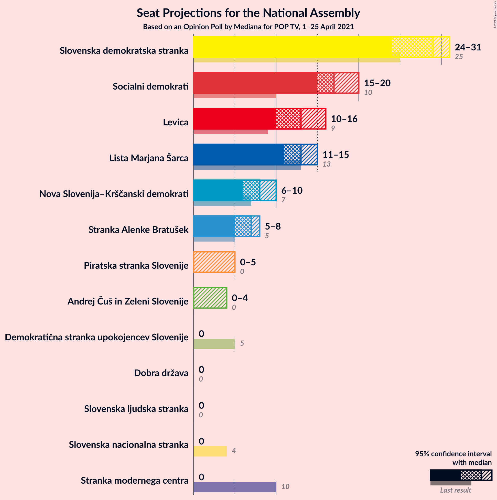
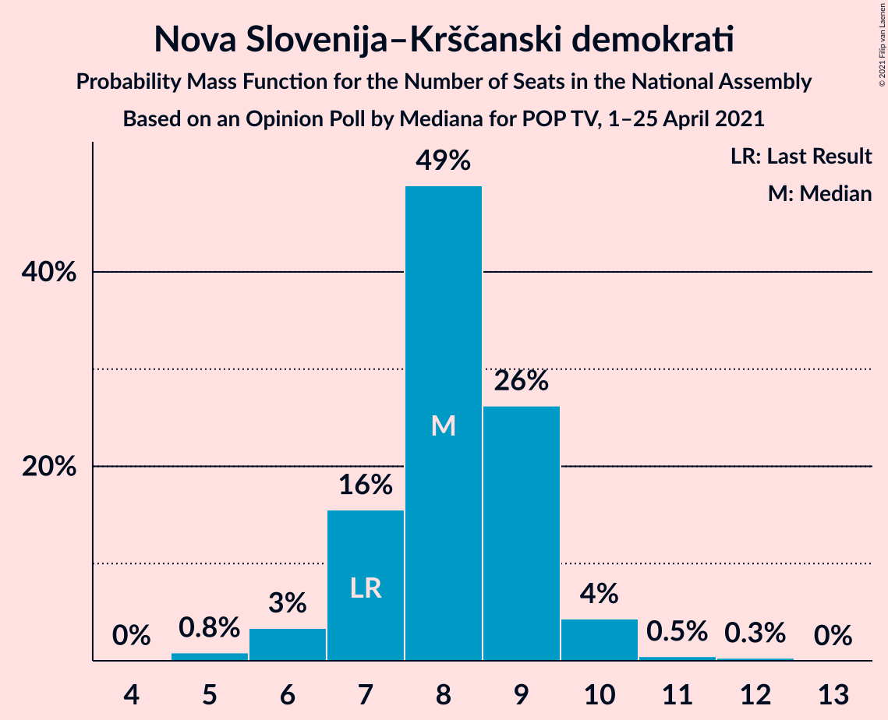
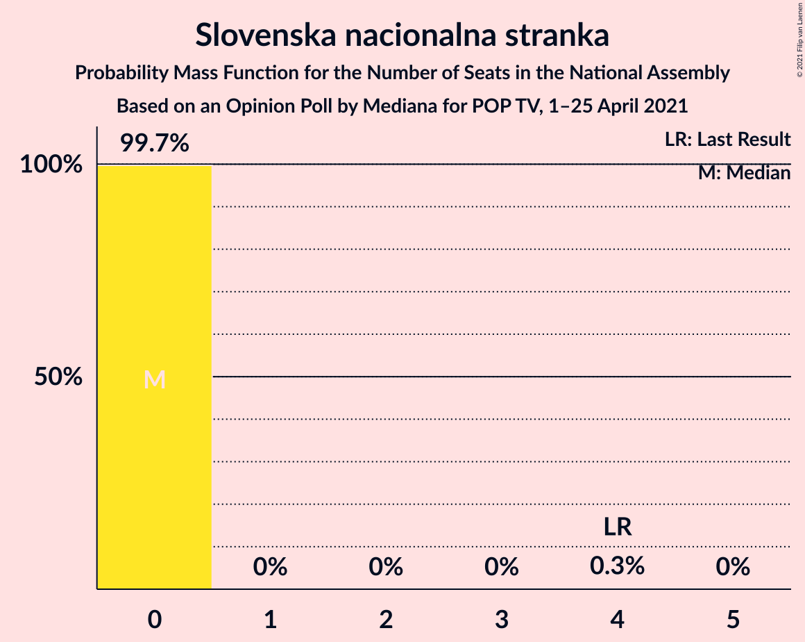
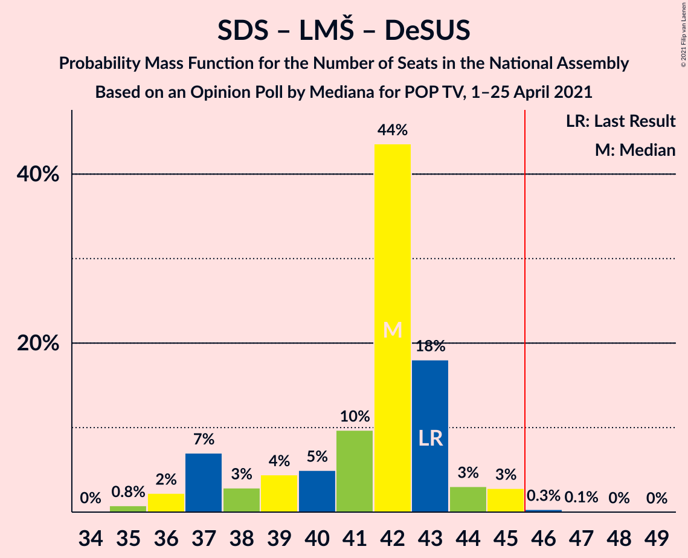
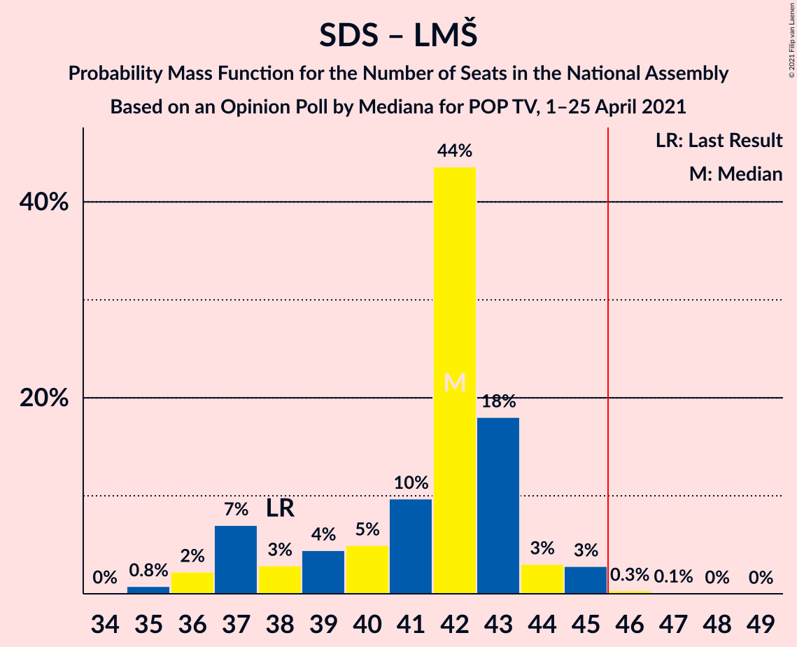
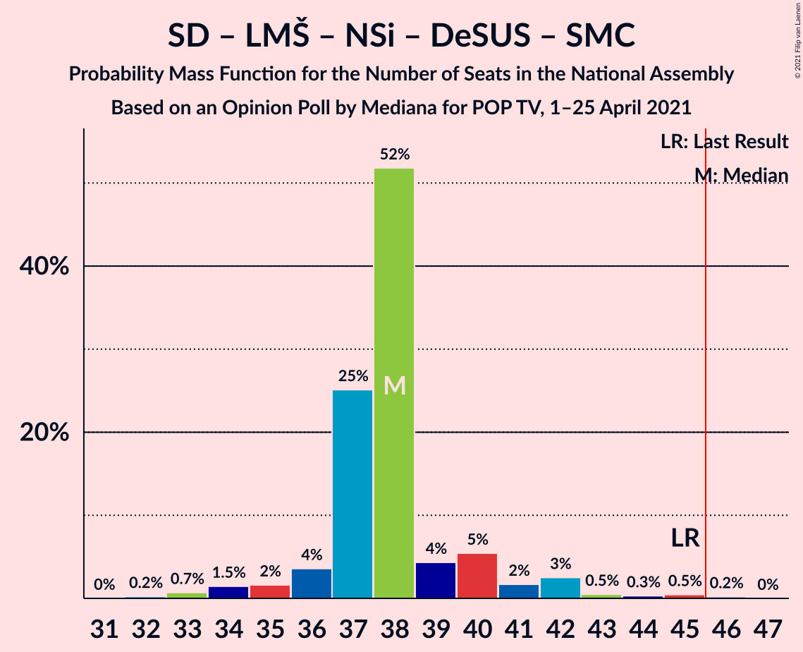
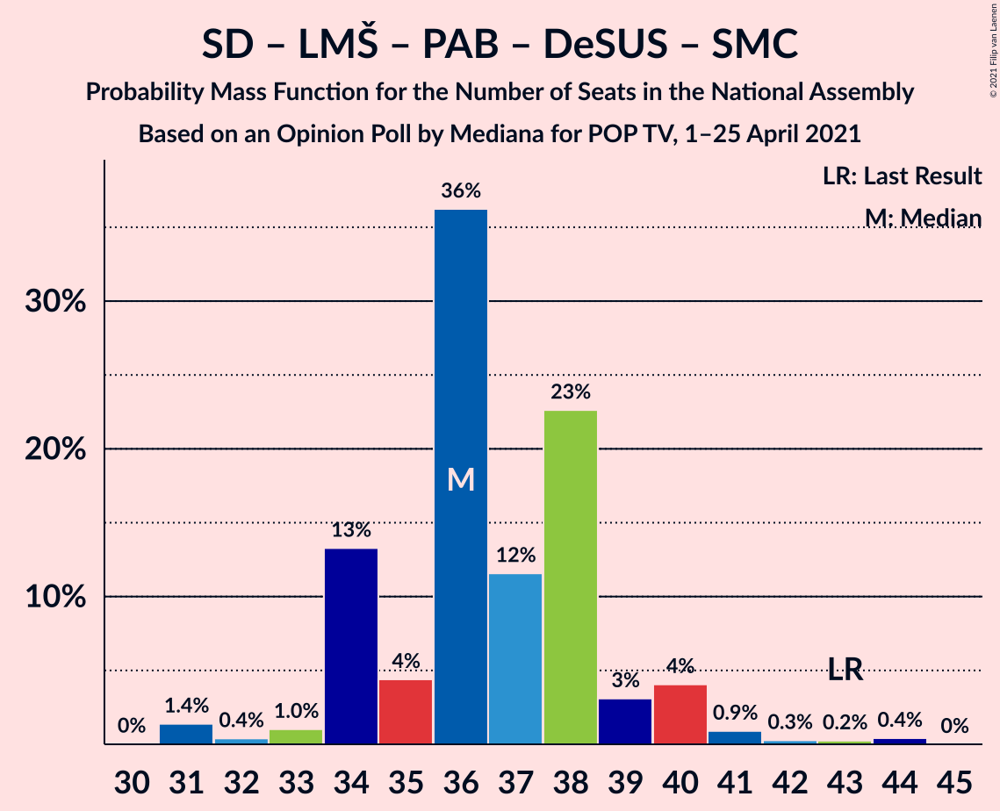
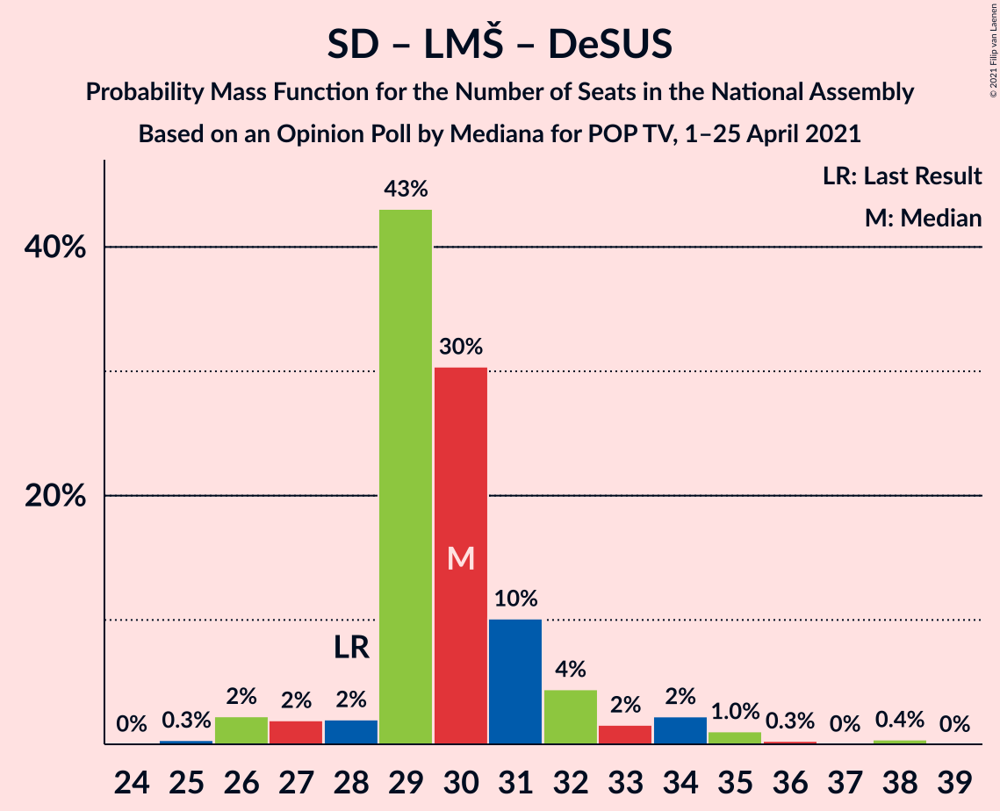

# Opinion Poll by Mediana for POP TV, 1–25 April 2021

<a href="#voting-intentions">Voting Intentions</a> | <a href="#seats">Seats</a> | <a href="#coalitions">Coalitions</a> | <a href="#technical-information">Technical Information</a>

## Voting Intentions

### Confidence Intervals

| Party | Last Result | Poll Result | 80% Confidence Interval | 90% Confidence Interval | 95% Confidence Interval | 99% Confidence Interval |
|:-----:|:-----------:|:-----------:|:-----------------------:|:-----------------------:|:-----------------------:|:-----------------------:|
| Slovenska demokratska stranka | 24.9% | 27.0% | 25.0–29.2% |24.4–29.9% |23.9–30.4% |22.9–31.5% |
| Socialni demokrati | 9.9% | 16.7% | 15.0–18.6% |14.5–19.1% |14.1–19.6% |13.3–20.5% |
| Lista Marjana Šarca | 12.6% | 13.2% | 11.7–14.9% |11.2–15.4% |10.9–15.9% |10.2–16.7% |
| Levica | 9.3% | 12.2% | 10.7–13.9% |10.3–14.4% |10.0–14.8% |9.3–15.7% |
| Nova Slovenija–Krščanski demokrati | 7.2% | 7.8% | 6.7–9.3% |6.4–9.7% |6.1–10.1% |5.6–10.8% |
| Stranka Alenke Bratušek | 5.1% | 6.6% | 5.5–7.9% |5.2–8.3% |5.0–8.7% |4.5–9.3% |
| Piratska stranka Slovenije | 2.2% | 3.5% | 2.8–4.6% |2.6–4.9% |2.4–5.1% |2.1–5.7% |
| Andrej Čuš in Zeleni Slovenije | 1.1% | 3.1% | 2.4–4.1% |2.2–4.4% |2.0–4.6% |1.8–5.2% |
| Slovenska nacionalna stranka | 4.2% | 2.2% | 1.7–3.1% |1.5–3.4% |1.4–3.6% |1.2–4.1% |
| Demokratična stranka upokojencev Slovenije | 4.9% | 1.7% | 1.2–2.5% |1.1–2.7% |1.0–2.9% |0.8–3.4% |
| Dobra država | 1.5% | 1.7% | 1.2–2.5% |1.1–2.7% |1.0–2.9% |0.8–3.4% |
| Slovenska ljudska stranka | 2.6% | 1.3% | 0.9–2.0% |0.7–2.2% |0.7–2.4% |0.5–2.8% |
| Stranka modernega centra | 9.7% | 0.8% | 0.5–1.5% |0.5–1.7% |0.4–1.8% |0.3–2.2% |

*Note:* The poll result column reflects the actual value used in the calculations. Published results may vary slightly, and in addition be rounded to fewer digits.

## Seats

### Confidence Intervals

| Party | Last Result | Median | 80% Confidence Interval | 90% Confidence Interval | 95% Confidence Interval | 99% Confidence Interval |
|:-----:|:-----------:|:------:|:-----------------------:|:-----------------------:|:-----------------------:|:-----------------------:|
| <a href="#slovenska-demokratska-stranka">Slovenska demokratska stranka</a> | 25 | 29 | 25–30 |24–30 |24–31 |24–34 |
| <a href="#socialni-demokrati">Socialni demokrati</a> | 10 | 17 | 15–18 |15–19 |15–20 |14–21 |
| <a href="#lista-marjana-šarca">Lista Marjana Šarca</a> | 13 | 13 | 12–14 |11–15 |11–15 |10–17 |
| <a href="#levica">Levica</a> | 9 | 13 | 11–15 |11–16 |10–16 |10–16 |
| <a href="#nova-slovenija–krščanski-demokrati">Nova Slovenija–Krščanski demokrati</a> | 7 | 8 | 7–9 |7–10 |6–10 |5–11 |
| <a href="#stranka-alenke-bratušek">Stranka Alenke Bratušek</a> | 5 | 7 | 5–8 |5–8 |5–8 |4–10 |
| <a href="#piratska-stranka-slovenije">Piratska stranka Slovenije</a> | 0 | 0 | 0–4 |0–5 |0–5 |0–5 |
| <a href="#andrej-čuš-in-zeleni-slovenije">Andrej Čuš in Zeleni Slovenije</a> | 0 | 0 | 0–4 |0–4 |0–4 |0–5 |
| <a href="#slovenska-nacionalna-stranka">Slovenska nacionalna stranka</a> | 4 | 0 | 0 |0 |0 |0 |
| <a href="#demokratična-stranka-upokojencev-slovenije">Demokratična stranka upokojencev Slovenije</a> | 5 | 0 | 0 |0 |0 |0 |
| <a href="#dobra-država">Dobra država</a> | 0 | 0 | 0 |0 |0 |0 |
| <a href="#slovenska-ljudska-stranka">Slovenska ljudska stranka</a> | 0 | 0 | 0 |0 |0 |0 |
| <a href="#stranka-modernega-centra">Stranka modernega centra</a> | 10 | 0 | 0 |0 |0 |0 |

### Slovenska demokratska stranka

*For a full overview of the results for this party, see the [Slovenska demokratska stranka](party-slovenskademokratskastranka.html) page.*

| Number of Seats | Probability | Accumulated | Special Marks |
|:---------------:|:-----------:|:-----------:|:-------------:|
| 22 | 0.1% | 100% |  |
| 23 | 0.2% | 99.9% |  |
| 24 | 8% | 99.8% |  |
| 25 | 4% | 92% | Last Result |
| 26 | 2% | 88% |  |
| 27 | 13% | 86% |  |
| 28 | 13% | 72% |  |
| 29 | 16% | 59% | Median |
| 30 | 39% | 43% |  |
| 31 | 2% | 5% |  |
| 32 | 1.0% | 2% |  |
| 33 | 0.6% | 1.4% |  |
| 34 | 0.7% | 0.8% |  |
| 35 | 0.1% | 0.2% |  |
| 36 | 0% | 0% |  |

### Socialni demokrati

*For a full overview of the results for this party, see the [Socialni demokrati](party-socialnidemokrati.html) page.*

| Number of Seats | Probability | Accumulated | Special Marks |
|:---------------:|:-----------:|:-----------:|:-------------:|
| 10 | 0% | 100% | Last Result |
| 11 | 0% | 100% |  |
| 12 | 0% | 100% |  |
| 13 | 0.2% | 100% |  |
| 14 | 0.8% | 99.7% |  |
| 15 | 12% | 99.0% |  |
| 16 | 15% | 87% |  |
| 17 | 53% | 71% | Median |
| 18 | 8% | 18% |  |
| 19 | 5% | 10% |  |
| 20 | 4% | 5% |  |
| 21 | 0.6% | 1.0% |  |
| 22 | 0.1% | 0.4% |  |
| 23 | 0.3% | 0.3% |  |
| 24 | 0% | 0% |  |

### Lista Marjana Šarca

*For a full overview of the results for this party, see the [Lista Marjana Šarca](party-listamarjanašarca.html) page.*

| Number of Seats | Probability | Accumulated | Special Marks |
|:---------------:|:-----------:|:-----------:|:-------------:|
| 9 | 0% | 100% |  |
| 10 | 2% | 99.9% |  |
| 11 | 7% | 98% |  |
| 12 | 26% | 91% |  |
| 13 | 41% | 65% | Last Result, Median |
| 14 | 17% | 24% |  |
| 15 | 5% | 7% |  |
| 16 | 0.8% | 2% |  |
| 17 | 0.8% | 1.0% |  |
| 18 | 0.1% | 0.2% |  |
| 19 | 0.1% | 0.1% |  |
| 20 | 0% | 0% |  |

### Levica

*For a full overview of the results for this party, see the [Levica](party-levica.html) page.*

| Number of Seats | Probability | Accumulated | Special Marks |
|:---------------:|:-----------:|:-----------:|:-------------:|
| 9 | 0.4% | 100% | Last Result |
| 10 | 3% | 99.6% |  |
| 11 | 9% | 97% |  |
| 12 | 24% | 88% |  |
| 13 | 38% | 64% | Median |
| 14 | 10% | 27% |  |
| 15 | 8% | 17% |  |
| 16 | 8% | 8% |  |
| 17 | 0.2% | 0.2% |  |
| 18 | 0% | 0% |  |

### Nova Slovenija–Krščanski demokrati

*For a full overview of the results for this party, see the [Nova Slovenija–Krščanski demokrati](party-novaslovenija–krščanskidemokrati.html) page.*

| Number of Seats | Probability | Accumulated | Special Marks |
|:---------------:|:-----------:|:-----------:|:-------------:|
| 5 | 0.8% | 100% |  |
| 6 | 3% | 99.1% |  |
| 7 | 16% | 96% | Last Result |
| 8 | 49% | 80% | Median |
| 9 | 26% | 31% |  |
| 10 | 4% | 5% |  |
| 11 | 0.5% | 0.8% |  |
| 12 | 0.3% | 0.3% |  |
| 13 | 0% | 0% |  |

### Stranka Alenke Bratušek

*For a full overview of the results for this party, see the [Stranka Alenke Bratušek](party-strankaalenkebratušek.html) page.*

| Number of Seats | Probability | Accumulated | Special Marks |
|:---------------:|:-----------:|:-----------:|:-------------:|
| 4 | 0.6% | 100% |  |
| 5 | 24% | 99.3% | Last Result |
| 6 | 6% | 75% |  |
| 7 | 42% | 69% | Median |
| 8 | 25% | 27% |  |
| 9 | 0.9% | 1.4% |  |
| 10 | 0.5% | 0.5% |  |
| 11 | 0% | 0% |  |

### Piratska stranka Slovenije

*For a full overview of the results for this party, see the [Piratska stranka Slovenije](party-piratskastrankaslovenije.html) page.*

| Number of Seats | Probability | Accumulated | Special Marks |
|:---------------:|:-----------:|:-----------:|:-------------:|
| 0 | 68% | 100% | Last Result, Median |
| 1 | 0% | 32% |  |
| 2 | 0% | 32% |  |
| 3 | 0% | 32% |  |
| 4 | 26% | 32% |  |
| 5 | 6% | 6% |  |
| 6 | 0.3% | 0.3% |  |
| 7 | 0% | 0% |  |

### Andrej Čuš in Zeleni Slovenije

*For a full overview of the results for this party, see the [Andrej Čuš in Zeleni Slovenije](party-andrejčušinzelenislovenije.html) page.*

| Number of Seats | Probability | Accumulated | Special Marks |
|:---------------:|:-----------:|:-----------:|:-------------:|
| 0 | 88% | 100% | Last Result, Median |
| 1 | 0% | 12% |  |
| 2 | 0% | 12% |  |
| 3 | 0% | 12% |  |
| 4 | 11% | 12% |  |
| 5 | 0.8% | 0.8% |  |
| 6 | 0% | 0% |  |

### Slovenska nacionalna stranka

*For a full overview of the results for this party, see the [Slovenska nacionalna stranka](party-slovenskanacionalnastranka.html) page.*

| Number of Seats | Probability | Accumulated | Special Marks |
|:---------------:|:-----------:|:-----------:|:-------------:|
| 0 | 99.7% | 100% | Median |
| 1 | 0% | 0.3% |  |
| 2 | 0% | 0.3% |  |
| 3 | 0% | 0.3% |  |
| 4 | 0.3% | 0.3% | Last Result |
| 5 | 0% | 0% |  |

### Demokratična stranka upokojencev Slovenije

*For a full overview of the results for this party, see the [Demokratična stranka upokojencev Slovenije](party-demokratičnastrankaupokojencevslovenije.html) page.*

| Number of Seats | Probability | Accumulated | Special Marks |
|:---------------:|:-----------:|:-----------:|:-------------:|
| 0 | 100% | 100% | Median |
| 1 | 0% | 0% |  |
| 2 | 0% | 0% |  |
| 3 | 0% | 0% |  |
| 4 | 0% | 0% |  |
| 5 | 0% | 0% | Last Result |

### Dobra država

*For a full overview of the results for this party, see the [Dobra država](party-dobradržava.html) page.*

| Number of Seats | Probability | Accumulated | Special Marks |
|:---------------:|:-----------:|:-----------:|:-------------:|
| 0 | 100% | 100% | Last Result, Median |

### Slovenska ljudska stranka

*For a full overview of the results for this party, see the [Slovenska ljudska stranka](party-slovenskaljudskastranka.html) page.*

| Number of Seats | Probability | Accumulated | Special Marks |
|:---------------:|:-----------:|:-----------:|:-------------:|
| 0 | 100% | 100% | Last Result, Median |

### Stranka modernega centra

*For a full overview of the results for this party, see the [Stranka modernega centra](party-strankamodernegacentra.html) page.*

| Number of Seats | Probability | Accumulated | Special Marks |
|:---------------:|:-----------:|:-----------:|:-------------:|
| 0 | 100% | 100% | Median |
| 1 | 0% | 0% |  |
| 2 | 0% | 0% |  |
| 3 | 0% | 0% |  |
| 4 | 0% | 0% |  |
| 5 | 0% | 0% |  |
| 6 | 0% | 0% |  |
| 7 | 0% | 0% |  |
| 8 | 0% | 0% |  |
| 9 | 0% | 0% |  |
| 10 | 0% | 0% | Last Result |

## Coalitions

### Confidence Intervals

| Coalition | Last Result | Median | Majority? | 80% Confidence Interval | 90% Confidence Interval | 95% Confidence Interval | 99% Confidence Interval |
|:---------:|:-----------:|:------:|:---------:|:-----------------------:|:-----------------------:|:-----------------------:|:-----------------------:|
| Socialni demokrati – Lista Marjana Šarca – Nova Slovenija–Krščanski demokrati – Stranka Alenke Bratušek – Demokratična stranka upokojencev Slovenije – Stranka modernega centra | 50 | 45 | 30% | 42–46 | 42–48 | 41–48 | 39–51 |
| Slovenska demokratska stranka – Lista Marjana Šarca – Demokratična stranka upokojencev Slovenije | 43 | 42 | 0.5% | 37–43 | 37–44 | 36–45 | 35–46 |
| Slovenska demokratska stranka – Lista Marjana Šarca | 38 | 42 | 0.5% | 37–43 | 37–44 | 36–45 | 35–46 |
| Socialni demokrati – Lista Marjana Šarca – Nova Slovenija–Krščanski demokrati – Demokratična stranka upokojencev Slovenije | 35 | 38 | 0.2% | 37–40 | 36–41 | 35–42 | 33–45 |
| Socialni demokrati – Lista Marjana Šarca – Nova Slovenija–Krščanski demokrati – Demokratična stranka upokojencev Slovenije – Stranka modernega centra | 45 | 38 | 0.2% | 37–40 | 36–41 | 35–42 | 33–45 |
| Socialni demokrati – Lista Marjana Šarca – Nova Slovenija–Krščanski demokrati | 30 | 38 | 0.2% | 37–40 | 36–41 | 35–42 | 33–45 |
| Socialni demokrati – Lista Marjana Šarca – Nova Slovenija–Krščanski demokrati – Stranka modernega centra | 40 | 38 | 0.2% | 37–40 | 36–41 | 35–42 | 33–45 |
| Socialni demokrati – Lista Marjana Šarca – Stranka Alenke Bratušek – Demokratična stranka upokojencev Slovenije – Stranka modernega centra | 43 | 36 | 0% | 34–38 | 34–40 | 33–40 | 31–43 |
| Socialni demokrati – Lista Marjana Šarca – Demokratična stranka upokojencev Slovenije | 28 | 30 | 0% | 29–31 | 28–33 | 26–34 | 26–36 |
| Socialni demokrati – Lista Marjana Šarca – Demokratična stranka upokojencev Slovenije – Stranka modernega centra | 38 | 30 | 0% | 29–31 | 28–33 | 26–34 | 26–36 |
| Socialni demokrati – Lista Marjana Šarca | 23 | 30 | 0% | 29–31 | 28–33 | 26–34 | 26–36 |
| Socialni demokrati – Lista Marjana Šarca – Stranka modernega centra | 33 | 30 | 0% | 29–31 | 28–33 | 26–34 | 26–36 |
| Socialni demokrati – Demokratična stranka upokojencev Slovenije – Stranka modernega centra | 25 | 17 | 0% | 15–18 | 15–19 | 15–20 | 14–21 |

### Socialni demokrati – Lista Marjana Šarca – Nova Slovenija–Krščanski demokrati – Stranka Alenke Bratušek – Demokratična stranka upokojencev Slovenije – Stranka modernega centra

| Number of Seats | Probability | Accumulated | Special Marks |
|:---------------:|:-----------:|:-----------:|:-------------:|
| 38 | 0% | 100% |  |
| 39 | 0.5% | 99.9% |  |
| 40 | 0.5% | 99.4% |  |
| 41 | 2% | 98.9% |  |
| 42 | 14% | 97% |  |
| 43 | 9% | 82% |  |
| 44 | 10% | 73% |  |
| 45 | 33% | 63% | Median |
| 46 | 20% | 30% | Majority |
| 47 | 5% | 10% |  |
| 48 | 3% | 5% |  |
| 49 | 0.8% | 2% |  |
| 50 | 0.6% | 1.3% | Last Result |
| 51 | 0.4% | 0.7% |  |
| 52 | 0.3% | 0.3% |  |
| 53 | 0% | 0% |  |

### Slovenska demokratska stranka – Lista Marjana Šarca – Demokratična stranka upokojencev Slovenije

| Number of Seats | Probability | Accumulated | Special Marks |
|:---------------:|:-----------:|:-----------:|:-------------:|
| 35 | 0.8% | 100% |  |
| 36 | 2% | 99.2% |  |
| 37 | 7% | 97% |  |
| 38 | 3% | 90% |  |
| 39 | 4% | 87% |  |
| 40 | 5% | 83% |  |
| 41 | 10% | 78% |  |
| 42 | 44% | 68% | Median |
| 43 | 18% | 24% | Last Result |
| 44 | 3% | 6% |  |
| 45 | 3% | 3% |  |
| 46 | 0.3% | 0.5% | Majority |
| 47 | 0.1% | 0.2% |  |
| 48 | 0% | 0.1% |  |
| 49 | 0% | 0% |  |

### Slovenska demokratska stranka – Lista Marjana Šarca

| Number of Seats | Probability | Accumulated | Special Marks |
|:---------------:|:-----------:|:-----------:|:-------------:|
| 35 | 0.8% | 100% |  |
| 36 | 2% | 99.2% |  |
| 37 | 7% | 97% |  |
| 38 | 3% | 90% | Last Result |
| 39 | 4% | 87% |  |
| 40 | 5% | 83% |  |
| 41 | 10% | 78% |  |
| 42 | 44% | 68% | Median |
| 43 | 18% | 24% |  |
| 44 | 3% | 6% |  |
| 45 | 3% | 3% |  |
| 46 | 0.3% | 0.5% | Majority |
| 47 | 0.1% | 0.2% |  |
| 48 | 0% | 0.1% |  |
| 49 | 0% | 0% |  |

### Socialni demokrati – Lista Marjana Šarca – Nova Slovenija–Krščanski demokrati – Demokratična stranka upokojencev Slovenije

| Number of Seats | Probability | Accumulated | Special Marks |
|:---------------:|:-----------:|:-----------:|:-------------:|
| 32 | 0.2% | 100% |  |
| 33 | 0.7% | 99.8% |  |
| 34 | 1.5% | 99.0% |  |
| 35 | 2% | 98% | Last Result |
| 36 | 4% | 96% |  |
| 37 | 25% | 92% |  |
| 38 | 52% | 67% | Median |
| 39 | 4% | 15% |  |
| 40 | 5% | 11% |  |
| 41 | 2% | 6% |  |
| 42 | 3% | 4% |  |
| 43 | 0.5% | 1.5% |  |
| 44 | 0.3% | 1.0% |  |
| 45 | 0.5% | 0.7% |  |
| 46 | 0.2% | 0.2% | Majority |
| 47 | 0% | 0% |  |

### Socialni demokrati – Lista Marjana Šarca – Nova Slovenija–Krščanski demokrati – Demokratična stranka upokojencev Slovenije – Stranka modernega centra

| Number of Seats | Probability | Accumulated | Special Marks |
|:---------------:|:-----------:|:-----------:|:-------------:|
| 32 | 0.2% | 100% |  |
| 33 | 0.7% | 99.8% |  |
| 34 | 1.5% | 99.0% |  |
| 35 | 2% | 98% |  |
| 36 | 4% | 96% |  |
| 37 | 25% | 92% |  |
| 38 | 52% | 67% | Median |
| 39 | 4% | 15% |  |
| 40 | 5% | 11% |  |
| 41 | 2% | 6% |  |
| 42 | 3% | 4% |  |
| 43 | 0.5% | 1.5% |  |
| 44 | 0.3% | 1.0% |  |
| 45 | 0.5% | 0.7% | Last Result |
| 46 | 0.2% | 0.2% | Majority |
| 47 | 0% | 0% |  |

### Socialni demokrati – Lista Marjana Šarca – Nova Slovenija–Krščanski demokrati

| Number of Seats | Probability | Accumulated | Special Marks |
|:---------------:|:-----------:|:-----------:|:-------------:|
| 30 | 0% | 100% | Last Result |
| 31 | 0% | 100% |  |
| 32 | 0.2% | 100% |  |
| 33 | 0.7% | 99.8% |  |
| 34 | 1.5% | 99.0% |  |
| 35 | 2% | 98% |  |
| 36 | 4% | 96% |  |
| 37 | 25% | 92% |  |
| 38 | 52% | 67% | Median |
| 39 | 4% | 15% |  |
| 40 | 5% | 11% |  |
| 41 | 2% | 6% |  |
| 42 | 3% | 4% |  |
| 43 | 0.5% | 1.4% |  |
| 44 | 0.3% | 1.0% |  |
| 45 | 0.4% | 0.6% |  |
| 46 | 0.2% | 0.2% | Majority |
| 47 | 0% | 0% |  |

### Socialni demokrati – Lista Marjana Šarca – Nova Slovenija–Krščanski demokrati – Stranka modernega centra

| Number of Seats | Probability | Accumulated | Special Marks |
|:---------------:|:-----------:|:-----------:|:-------------:|
| 32 | 0.2% | 100% |  |
| 33 | 0.7% | 99.8% |  |
| 34 | 1.5% | 99.0% |  |
| 35 | 2% | 98% |  |
| 36 | 4% | 96% |  |
| 37 | 25% | 92% |  |
| 38 | 52% | 67% | Median |
| 39 | 4% | 15% |  |
| 40 | 5% | 11% | Last Result |
| 41 | 2% | 6% |  |
| 42 | 3% | 4% |  |
| 43 | 0.5% | 1.4% |  |
| 44 | 0.3% | 1.0% |  |
| 45 | 0.4% | 0.6% |  |
| 46 | 0.2% | 0.2% | Majority |
| 47 | 0% | 0% |  |

### Socialni demokrati – Lista Marjana Šarca – Stranka Alenke Bratušek – Demokratična stranka upokojencev Slovenije – Stranka modernega centra

| Number of Seats | Probability | Accumulated | Special Marks |
|:---------------:|:-----------:|:-----------:|:-------------:|
| 31 | 1.4% | 100% |  |
| 32 | 0.4% | 98.6% |  |
| 33 | 1.0% | 98% |  |
| 34 | 13% | 97% |  |
| 35 | 4% | 84% |  |
| 36 | 36% | 79% |  |
| 37 | 12% | 43% | Median |
| 38 | 23% | 32% |  |
| 39 | 3% | 9% |  |
| 40 | 4% | 6% |  |
| 41 | 0.9% | 2% |  |
| 42 | 0.3% | 0.9% |  |
| 43 | 0.2% | 0.7% | Last Result |
| 44 | 0.4% | 0.4% |  |
| 45 | 0% | 0% |  |

### Socialni demokrati – Lista Marjana Šarca – Demokratična stranka upokojencev Slovenije

| Number of Seats | Probability | Accumulated | Special Marks |
|:---------------:|:-----------:|:-----------:|:-------------:|
| 25 | 0.3% | 100% |  |
| 26 | 2% | 99.6% |  |
| 27 | 2% | 97% |  |
| 28 | 2% | 95% | Last Result |
| 29 | 43% | 93% |  |
| 30 | 30% | 50% | Median |
| 31 | 10% | 20% |  |
| 32 | 4% | 10% |  |
| 33 | 2% | 6% |  |
| 34 | 2% | 4% |  |
| 35 | 1.0% | 2% |  |
| 36 | 0.3% | 0.7% |  |
| 37 | 0% | 0.4% |  |
| 38 | 0.4% | 0.4% |  |
| 39 | 0% | 0% |  |

### Socialni demokrati – Lista Marjana Šarca – Demokratična stranka upokojencev Slovenije – Stranka modernega centra

| Number of Seats | Probability | Accumulated | Special Marks |
|:---------------:|:-----------:|:-----------:|:-------------:|
| 25 | 0.3% | 100% |  |
| 26 | 2% | 99.6% |  |
| 27 | 2% | 97% |  |
| 28 | 2% | 95% |  |
| 29 | 43% | 93% |  |
| 30 | 30% | 50% | Median |
| 31 | 10% | 20% |  |
| 32 | 4% | 10% |  |
| 33 | 2% | 6% |  |
| 34 | 2% | 4% |  |
| 35 | 1.0% | 2% |  |
| 36 | 0.3% | 0.7% |  |
| 37 | 0% | 0.4% |  |
| 38 | 0.4% | 0.4% | Last Result |
| 39 | 0% | 0% |  |

### Socialni demokrati – Lista Marjana Šarca

| Number of Seats | Probability | Accumulated | Special Marks |
|:---------------:|:-----------:|:-----------:|:-------------:|
| 23 | 0% | 100% | Last Result |
| 24 | 0% | 100% |  |
| 25 | 0.3% | 100% |  |
| 26 | 2% | 99.6% |  |
| 27 | 2% | 97% |  |
| 28 | 2% | 95% |  |
| 29 | 43% | 93% |  |
| 30 | 30% | 50% | Median |
| 31 | 10% | 20% |  |
| 32 | 4% | 10% |  |
| 33 | 2% | 5% |  |
| 34 | 2% | 4% |  |
| 35 | 1.0% | 2% |  |
| 36 | 0.3% | 0.7% |  |
| 37 | 0% | 0.4% |  |
| 38 | 0.4% | 0.4% |  |
| 39 | 0% | 0% |  |

### Socialni demokrati – Lista Marjana Šarca – Stranka modernega centra

| Number of Seats | Probability | Accumulated | Special Marks |
|:---------------:|:-----------:|:-----------:|:-------------:|
| 25 | 0.3% | 100% |  |
| 26 | 2% | 99.6% |  |
| 27 | 2% | 97% |  |
| 28 | 2% | 95% |  |
| 29 | 43% | 93% |  |
| 30 | 30% | 50% | Median |
| 31 | 10% | 20% |  |
| 32 | 4% | 10% |  |
| 33 | 2% | 5% | Last Result |
| 34 | 2% | 4% |  |
| 35 | 1.0% | 2% |  |
| 36 | 0.3% | 0.7% |  |
| 37 | 0% | 0.4% |  |
| 38 | 0.4% | 0.4% |  |
| 39 | 0% | 0% |  |

### Socialni demokrati – Demokratična stranka upokojencev Slovenije – Stranka modernega centra

| Number of Seats | Probability | Accumulated | Special Marks |
|:---------------:|:-----------:|:-----------:|:-------------:|
| 13 | 0.2% | 100% |  |
| 14 | 0.8% | 99.7% |  |
| 15 | 12% | 99.0% |  |
| 16 | 15% | 87% |  |
| 17 | 53% | 71% | Median |
| 18 | 8% | 18% |  |
| 19 | 5% | 10% |  |
| 20 | 4% | 5% |  |
| 21 | 0.6% | 1.0% |  |
| 22 | 0.1% | 0.4% |  |
| 23 | 0.3% | 0.3% |  |
| 24 | 0% | 0% |  |
| 25 | 0% | 0% | Last Result |

## Technical Information

### Opinion Poll

+ **Polling firm:** Mediana
+ **Commissioner(s):** POP TV
+ **Fieldwork period:** 1–25 April 2021

### Calculations

+ **Sample size:** 714
+ **Simulations done:** 1,048,576
+ **Error estimate:** 2.21%

