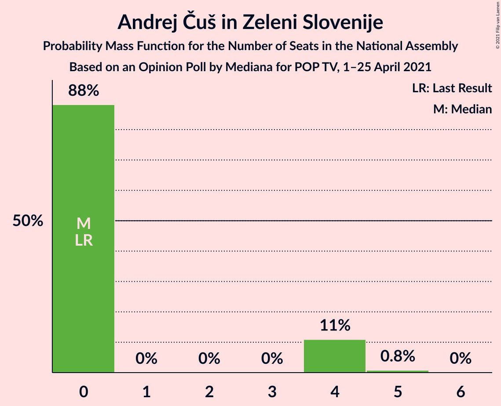
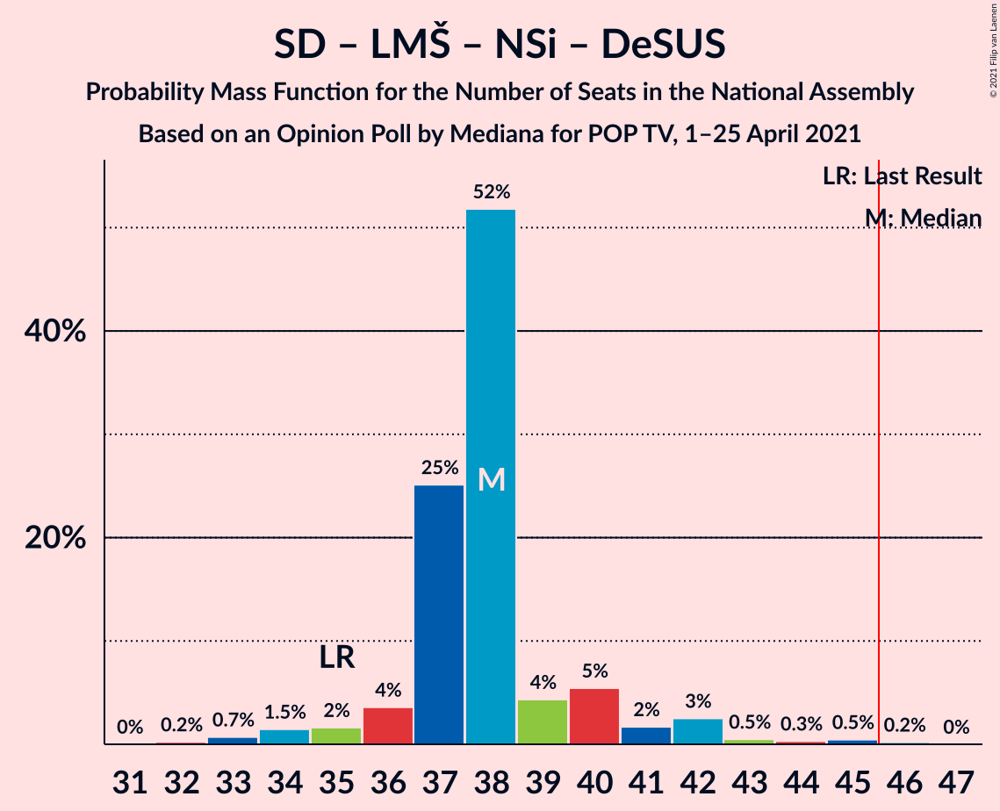
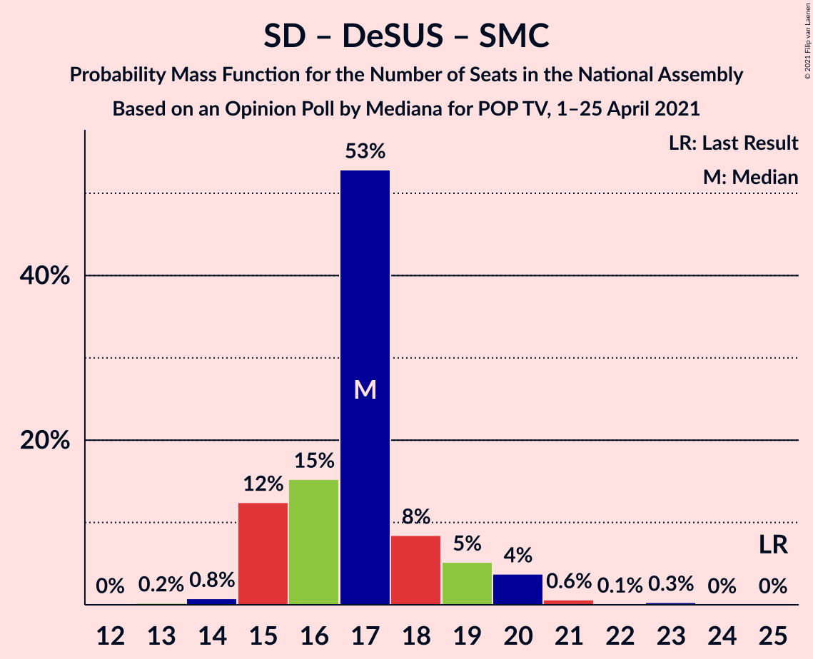

# Opinion Poll by Mediana for POP TV, 1–25 April 2021

<a href="#voting-intentions">Voting Intentions</a> | <a href="#seats">Seats</a> | <a href="#coalitions">Coalitions</a> | <a href="#technical-information">Technical Information</a>

## Voting Intentions

### Confidence Intervals

| Party | Last Result | Poll Result | 80% Confidence Interval | 90% Confidence Interval | 95% Confidence Interval | 99% Confidence Interval |
|:-----:|:-----------:|:-----------:|:-----------------------:|:-----------------------:|:-----------------------:|:-----------------------:|
| Slovenska demokratska stranka | 24.9% | 27.0% | 25.0–29.2% |24.4–29.9% |23.9–30.4% |22.9–31.5% |
| Socialni demokrati | 9.9% | 16.7% | 15.0–18.6% |14.5–19.1% |14.1–19.6% |13.3–20.5% |
| Lista Marjana Šarca | 12.6% | 13.2% | 11.7–14.9% |11.2–15.4% |10.9–15.9% |10.2–16.7% |
| Levica | 9.3% | 12.2% | 10.7–13.9% |10.3–14.4% |10.0–14.8% |9.3–15.7% |
| Nova Slovenija–Krščanski demokrati | 7.2% | 7.8% | 6.7–9.3% |6.4–9.7% |6.1–10.1% |5.6–10.8% |
| Stranka Alenke Bratušek | 5.1% | 6.6% | 5.5–7.9% |5.2–8.3% |5.0–8.7% |4.5–9.3% |
| Piratska stranka Slovenije | 2.2% | 3.5% | 2.8–4.6% |2.6–4.9% |2.4–5.1% |2.1–5.7% |
| Andrej Čuš in Zeleni Slovenije | 1.1% | 3.1% | 2.4–4.1% |2.2–4.4% |2.0–4.6% |1.8–5.2% |
| Slovenska nacionalna stranka | 4.2% | 2.2% | 1.7–3.1% |1.5–3.4% |1.4–3.6% |1.2–4.1% |
| Demokratična stranka upokojencev Slovenije | 4.9% | 1.7% | 1.2–2.5% |1.1–2.7% |1.0–2.9% |0.8–3.4% |
| Dobra država | 1.5% | 1.7% | 1.2–2.5% |1.1–2.7% |1.0–2.9% |0.8–3.4% |
| Slovenska ljudska stranka | 2.6% | 1.3% | 0.9–2.0% |0.7–2.2% |0.7–2.4% |0.5–2.8% |
| Stranka modernega centra | 9.7% | 0.8% | 0.5–1.5% |0.5–1.7% |0.4–1.8% |0.3–2.2% |

*Note:* The poll result column reflects the actual value used in the calculations. Published results may vary slightly, and in addition be rounded to fewer digits.

## Seats

### Confidence Intervals

| Party | Last Result | Median | 80% Confidence Interval | 90% Confidence Interval | 95% Confidence Interval | 99% Confidence Interval |
|:-----:|:-----------:|:------:|:-----------------------:|:-----------------------:|:-----------------------:|:-----------------------:|
| <a href="#slovenska-demokratska-stranka">Slovenska demokratska stranka</a> | 25 | 27 | 25–30 |25–30 |25–32 |24–33 |
| <a href="#socialni-demokrati">Socialni demokrati</a> | 10 | 19 | 15–20 |14–20 |14–20 |13–23 |
| <a href="#lista-marjana-šarca">Lista Marjana Šarca</a> | 13 | 15 | 12–15 |10–16 |10–17 |10–17 |
| <a href="#levica">Levica</a> | 9 | 13 | 11–14 |10–14 |10–15 |9–15 |
| <a href="#nova-slovenija–krščanski-demokrati">Nova Slovenija–Krščanski demokrati</a> | 7 | 8 | 6–9 |6–10 |6–10 |5–11 |
| <a href="#stranka-alenke-bratušek">Stranka Alenke Bratušek</a> | 5 | 6 | 5–8 |4–8 |4–8 |4–9 |
| <a href="#piratska-stranka-slovenije">Piratska stranka Slovenije</a> | 0 | 0 | 0–4 |0–5 |0–5 |0–5 |
| <a href="#andrej-čuš-in-zeleni-slovenije">Andrej Čuš in Zeleni Slovenije</a> | 0 | 0 | 0–4 |0–4 |0–4 |0–4 |
| <a href="#slovenska-nacionalna-stranka">Slovenska nacionalna stranka</a> | 4 | 0 | 0 |0 |0 |0–4 |
| <a href="#demokratična-stranka-upokojencev-slovenije">Demokratična stranka upokojencev Slovenije</a> | 5 | 0 | 0 |0 |0 |0 |
| <a href="#dobra-država">Dobra država</a> | 0 | 0 | 0 |0 |0 |0 |
| <a href="#slovenska-ljudska-stranka">Slovenska ljudska stranka</a> | 0 | 0 | 0 |0 |0 |0 |
| <a href="#stranka-modernega-centra">Stranka modernega centra</a> | 10 | 0 | 0 |0 |0 |0 |

### Slovenska demokratska stranka

*For a full overview of the results for this party, see the [Slovenska demokratska stranka](party-slovenskademokratskastranka.html) page.*

| Number of Seats | Probability | Accumulated | Special Marks |
|:---------------:|:-----------:|:-----------:|:-------------:|
| 22 | 0.2% | 100% |  |
| 23 | 0.3% | 99.8% |  |
| 24 | 0.2% | 99.5% |  |
| 25 | 12% | 99.3% | Last Result |
| 26 | 17% | 87% |  |
| 27 | 42% | 70% | Median |
| 28 | 11% | 28% |  |
| 29 | 4% | 17% |  |
| 30 | 9% | 13% |  |
| 31 | 1.2% | 4% |  |
| 32 | 0.8% | 3% |  |
| 33 | 2% | 2% |  |
| 34 | 0% | 0.1% |  |
| 35 | 0% | 0% |  |

### Socialni demokrati

*For a full overview of the results for this party, see the [Socialni demokrati](party-socialnidemokrati.html) page.*

| Number of Seats | Probability | Accumulated | Special Marks |
|:---------------:|:-----------:|:-----------:|:-------------:|
| 10 | 0% | 100% | Last Result |
| 11 | 0% | 100% |  |
| 12 | 0% | 100% |  |
| 13 | 2% | 100% |  |
| 14 | 7% | 98% |  |
| 15 | 4% | 91% |  |
| 16 | 5% | 87% |  |
| 17 | 7% | 83% |  |
| 18 | 15% | 76% |  |
| 19 | 46% | 60% | Median |
| 20 | 13% | 14% |  |
| 21 | 0.2% | 1.4% |  |
| 22 | 0.2% | 1.2% |  |
| 23 | 1.0% | 1.0% |  |
| 24 | 0% | 0% |  |

### Lista Marjana Šarca

*For a full overview of the results for this party, see the [Lista Marjana Šarca](party-listamarjanašarca.html) page.*

| Number of Seats | Probability | Accumulated | Special Marks |
|:---------------:|:-----------:|:-----------:|:-------------:|
| 9 | 0.3% | 100% |  |
| 10 | 6% | 99.7% |  |
| 11 | 1.0% | 93% |  |
| 12 | 9% | 92% |  |
| 13 | 19% | 84% | Last Result |
| 14 | 6% | 64% |  |
| 15 | 49% | 59% | Median |
| 16 | 5% | 10% |  |
| 17 | 4% | 4% |  |
| 18 | 0.4% | 0.5% |  |
| 19 | 0% | 0% |  |

### Levica

*For a full overview of the results for this party, see the [Levica](party-levica.html) page.*

| Number of Seats | Probability | Accumulated | Special Marks |
|:---------------:|:-----------:|:-----------:|:-------------:|
| 9 | 2% | 100% | Last Result |
| 10 | 3% | 98% |  |
| 11 | 6% | 95% |  |
| 12 | 6% | 89% |  |
| 13 | 60% | 82% | Median |
| 14 | 19% | 22% |  |
| 15 | 3% | 3% |  |
| 16 | 0.3% | 0.5% |  |
| 17 | 0.1% | 0.2% |  |
| 18 | 0% | 0% |  |

### Nova Slovenija–Krščanski demokrati

*For a full overview of the results for this party, see the [Nova Slovenija–Krščanski demokrati](party-novaslovenija–krščanskidemokrati.html) page.*

| Number of Seats | Probability | Accumulated | Special Marks |
|:---------------:|:-----------:|:-----------:|:-------------:|
| 5 | 1.0% | 100% |  |
| 6 | 17% | 99.0% |  |
| 7 | 14% | 82% | Last Result |
| 8 | 51% | 68% | Median |
| 9 | 10% | 17% |  |
| 10 | 5% | 6% |  |
| 11 | 1.4% | 1.5% |  |
| 12 | 0.1% | 0.1% |  |
| 13 | 0% | 0% |  |

### Stranka Alenke Bratušek

*For a full overview of the results for this party, see the [Stranka Alenke Bratušek](party-strankaalenkebratušek.html) page.*

| Number of Seats | Probability | Accumulated | Special Marks |
|:---------------:|:-----------:|:-----------:|:-------------:|
| 0 | 0.1% | 100% |  |
| 1 | 0% | 99.9% |  |
| 2 | 0% | 99.9% |  |
| 3 | 0% | 99.9% |  |
| 4 | 5% | 99.9% |  |
| 5 | 16% | 95% | Last Result |
| 6 | 52% | 79% | Median |
| 7 | 14% | 27% |  |
| 8 | 13% | 14% |  |
| 9 | 0.5% | 0.9% |  |
| 10 | 0.3% | 0.4% |  |
| 11 | 0.1% | 0.1% |  |
| 12 | 0% | 0% |  |

### Piratska stranka Slovenije

*For a full overview of the results for this party, see the [Piratska stranka Slovenije](party-piratskastrankaslovenije.html) page.*

| Number of Seats | Probability | Accumulated | Special Marks |
|:---------------:|:-----------:|:-----------:|:-------------:|
| 0 | 72% | 100% | Last Result, Median |
| 1 | 0% | 28% |  |
| 2 | 0% | 28% |  |
| 3 | 0% | 28% |  |
| 4 | 18% | 28% |  |
| 5 | 9% | 9% |  |
| 6 | 0.4% | 0.4% |  |
| 7 | 0% | 0% |  |

### Andrej Čuš in Zeleni Slovenije

*For a full overview of the results for this party, see the [Andrej Čuš in Zeleni Slovenije](party-andrejčušinzelenislovenije.html) page.*

| Number of Seats | Probability | Accumulated | Special Marks |
|:---------------:|:-----------:|:-----------:|:-------------:|
| 0 | 89% | 100% | Last Result, Median |
| 1 | 0% | 11% |  |
| 2 | 0% | 11% |  |
| 3 | 0% | 11% |  |
| 4 | 11% | 11% |  |
| 5 | 0.2% | 0.2% |  |
| 6 | 0% | 0% |  |

### Slovenska nacionalna stranka

*For a full overview of the results for this party, see the [Slovenska nacionalna stranka](party-slovenskanacionalnastranka.html) page.*

| Number of Seats | Probability | Accumulated | Special Marks |
|:---------------:|:-----------:|:-----------:|:-------------:|
| 0 | 98.9% | 100% | Median |
| 1 | 0% | 1.1% |  |
| 2 | 0% | 1.1% |  |
| 3 | 0% | 1.1% |  |
| 4 | 1.1% | 1.1% | Last Result |
| 5 | 0% | 0% |  |

### Demokratična stranka upokojencev Slovenije

*For a full overview of the results for this party, see the [Demokratična stranka upokojencev Slovenije](party-demokratičnastrankaupokojencevslovenije.html) page.*

| Number of Seats | Probability | Accumulated | Special Marks |
|:---------------:|:-----------:|:-----------:|:-------------:|
| 0 | 100% | 100% | Median |
| 1 | 0% | 0% |  |
| 2 | 0% | 0% |  |
| 3 | 0% | 0% |  |
| 4 | 0% | 0% |  |
| 5 | 0% | 0% | Last Result |

### Dobra država

*For a full overview of the results for this party, see the [Dobra država](party-dobradržava.html) page.*

| Number of Seats | Probability | Accumulated | Special Marks |
|:---------------:|:-----------:|:-----------:|:-------------:|
| 0 | 100% | 100% | Last Result, Median |

### Slovenska ljudska stranka

*For a full overview of the results for this party, see the [Slovenska ljudska stranka](party-slovenskaljudskastranka.html) page.*

| Number of Seats | Probability | Accumulated | Special Marks |
|:---------------:|:-----------:|:-----------:|:-------------:|
| 0 | 100% | 100% | Last Result, Median |

### Stranka modernega centra

*For a full overview of the results for this party, see the [Stranka modernega centra](party-strankamodernegacentra.html) page.*

| Number of Seats | Probability | Accumulated | Special Marks |
|:---------------:|:-----------:|:-----------:|:-------------:|
| 0 | 100% | 100% | Median |
| 1 | 0% | 0% |  |
| 2 | 0% | 0% |  |
| 3 | 0% | 0% |  |
| 4 | 0% | 0% |  |
| 5 | 0% | 0% |  |
| 6 | 0% | 0% |  |
| 7 | 0% | 0% |  |
| 8 | 0% | 0% |  |
| 9 | 0% | 0% |  |
| 10 | 0% | 0% | Last Result |

## Coalitions

### Confidence Intervals

| Coalition | Last Result | Median | Majority? | 80% Confidence Interval | 90% Confidence Interval | 95% Confidence Interval | 99% Confidence Interval |
|:---------:|:-----------:|:------:|:---------:|:-----------------------:|:-----------------------:|:-----------------------:|:-----------------------:|
| Socialni demokrati – Lista Marjana Šarca – Nova Slovenija–Krščanski demokrati – Stranka Alenke Bratušek – Demokratična stranka upokojencev Slovenije – Stranka modernega centra | 50 | 46 | 62% | 43–48 | 43–48 | 43–49 | 40–51 |
| Slovenska demokratska stranka – Lista Marjana Šarca – Demokratična stranka upokojencev Slovenije | 43 | 42 | 3% | 39–44 | 36–45 | 36–46 | 36–47 |
| Slovenska demokratska stranka – Lista Marjana Šarca | 38 | 42 | 3% | 39–44 | 36–45 | 36–46 | 36–47 |
| Socialni demokrati – Lista Marjana Šarca – Nova Slovenija–Krščanski demokrati – Demokratična stranka upokojencev Slovenije | 35 | 41 | 0.1% | 37–42 | 35–42 | 35–43 | 34–44 |
| Socialni demokrati – Lista Marjana Šarca – Nova Slovenija–Krščanski demokrati – Demokratična stranka upokojencev Slovenije – Stranka modernega centra | 45 | 41 | 0.1% | 37–42 | 35–42 | 35–43 | 34–44 |
| Socialni demokrati – Lista Marjana Šarca – Nova Slovenija–Krščanski demokrati | 30 | 41 | 0.1% | 37–42 | 35–42 | 35–43 | 34–44 |
| Socialni demokrati – Lista Marjana Šarca – Nova Slovenija–Krščanski demokrati – Stranka modernega centra | 40 | 41 | 0.1% | 37–42 | 35–42 | 35–43 | 34–44 |
| Socialni demokrati – Lista Marjana Šarca – Stranka Alenke Bratušek – Demokratična stranka upokojencev Slovenije – Stranka modernega centra | 43 | 39 | 0% | 35–40 | 35–40 | 34–40 | 32–42 |
| Socialni demokrati – Lista Marjana Šarca – Demokratična stranka upokojencev Slovenije | 28 | 33 | 0% | 29–35 | 27–35 | 27–35 | 26–35 |
| Socialni demokrati – Lista Marjana Šarca – Demokratična stranka upokojencev Slovenije – Stranka modernega centra | 38 | 33 | 0% | 29–35 | 27–35 | 27–35 | 26–35 |
| Socialni demokrati – Lista Marjana Šarca | 23 | 33 | 0% | 29–35 | 27–35 | 27–35 | 26–35 |
| Socialni demokrati – Lista Marjana Šarca – Stranka modernega centra | 33 | 33 | 0% | 29–35 | 27–35 | 27–35 | 26–35 |
| Socialni demokrati – Demokratična stranka upokojencev Slovenije – Stranka modernega centra | 25 | 19 | 0% | 15–20 | 14–20 | 14–20 | 13–23 |

### Socialni demokrati – Lista Marjana Šarca – Nova Slovenija–Krščanski demokrati – Stranka Alenke Bratušek – Demokratična stranka upokojencev Slovenije – Stranka modernega centra

| Number of Seats | Probability | Accumulated | Special Marks |
|:---------------:|:-----------:|:-----------:|:-------------:|
| 39 | 0.1% | 100% |  |
| 40 | 0.4% | 99.8% |  |
| 41 | 0.4% | 99.4% |  |
| 42 | 0.9% | 99.0% |  |
| 43 | 15% | 98% |  |
| 44 | 3% | 83% |  |
| 45 | 18% | 80% |  |
| 46 | 19% | 62% | Majority |
| 47 | 4% | 42% |  |
| 48 | 36% | 39% | Median |
| 49 | 1.2% | 3% |  |
| 50 | 0.3% | 1.5% | Last Result |
| 51 | 0.9% | 1.2% |  |
| 52 | 0.1% | 0.2% |  |
| 53 | 0% | 0.1% |  |
| 54 | 0.1% | 0.1% |  |
| 55 | 0% | 0% |  |

### Slovenska demokratska stranka – Lista Marjana Šarca – Demokratična stranka upokojencev Slovenije

| Number of Seats | Probability | Accumulated | Special Marks |
|:---------------:|:-----------:|:-----------:|:-------------:|
| 35 | 0.1% | 100% |  |
| 36 | 5% | 99.9% |  |
| 37 | 0.6% | 95% |  |
| 38 | 0.8% | 94% |  |
| 39 | 9% | 93% |  |
| 40 | 19% | 84% |  |
| 41 | 4% | 66% |  |
| 42 | 44% | 61% | Median |
| 43 | 7% | 17% | Last Result |
| 44 | 6% | 11% |  |
| 45 | 2% | 5% |  |
| 46 | 2% | 3% | Majority |
| 47 | 0.2% | 0.7% |  |
| 48 | 0.5% | 0.5% |  |
| 49 | 0% | 0% |  |

### Slovenska demokratska stranka – Lista Marjana Šarca

| Number of Seats | Probability | Accumulated | Special Marks |
|:---------------:|:-----------:|:-----------:|:-------------:|
| 35 | 0.1% | 100% |  |
| 36 | 5% | 99.9% |  |
| 37 | 0.6% | 95% |  |
| 38 | 0.8% | 94% | Last Result |
| 39 | 9% | 93% |  |
| 40 | 19% | 84% |  |
| 41 | 4% | 66% |  |
| 42 | 44% | 61% | Median |
| 43 | 7% | 17% |  |
| 44 | 6% | 11% |  |
| 45 | 2% | 5% |  |
| 46 | 2% | 3% | Majority |
| 47 | 0.2% | 0.7% |  |
| 48 | 0.5% | 0.5% |  |
| 49 | 0% | 0% |  |

### Socialni demokrati – Lista Marjana Šarca – Nova Slovenija–Krščanski demokrati – Demokratična stranka upokojencev Slovenije

| Number of Seats | Probability | Accumulated | Special Marks |
|:---------------:|:-----------:|:-----------:|:-------------:|
| 32 | 0.2% | 100% |  |
| 33 | 0.2% | 99.8% |  |
| 34 | 0.5% | 99.6% |  |
| 35 | 7% | 99.0% | Last Result |
| 36 | 1.2% | 92% |  |
| 37 | 10% | 91% |  |
| 38 | 12% | 81% |  |
| 39 | 2% | 69% |  |
| 40 | 13% | 67% |  |
| 41 | 17% | 54% |  |
| 42 | 34% | 37% | Median |
| 43 | 1.2% | 3% |  |
| 44 | 1.3% | 1.5% |  |
| 45 | 0% | 0.2% |  |
| 46 | 0.1% | 0.1% | Majority |
| 47 | 0% | 0% |  |

### Socialni demokrati – Lista Marjana Šarca – Nova Slovenija–Krščanski demokrati – Demokratična stranka upokojencev Slovenije – Stranka modernega centra

| Number of Seats | Probability | Accumulated | Special Marks |
|:---------------:|:-----------:|:-----------:|:-------------:|
| 32 | 0.2% | 100% |  |
| 33 | 0.2% | 99.8% |  |
| 34 | 0.5% | 99.6% |  |
| 35 | 7% | 99.0% |  |
| 36 | 1.2% | 92% |  |
| 37 | 10% | 91% |  |
| 38 | 12% | 81% |  |
| 39 | 2% | 69% |  |
| 40 | 13% | 67% |  |
| 41 | 17% | 54% |  |
| 42 | 34% | 37% | Median |
| 43 | 1.2% | 3% |  |
| 44 | 1.3% | 1.5% |  |
| 45 | 0% | 0.2% | Last Result |
| 46 | 0.1% | 0.1% | Majority |
| 47 | 0% | 0% |  |

### Socialni demokrati – Lista Marjana Šarca – Nova Slovenija–Krščanski demokrati

| Number of Seats | Probability | Accumulated | Special Marks |
|:---------------:|:-----------:|:-----------:|:-------------:|
| 30 | 0% | 100% | Last Result |
| 31 | 0% | 100% |  |
| 32 | 0.2% | 100% |  |
| 33 | 0.2% | 99.8% |  |
| 34 | 0.6% | 99.6% |  |
| 35 | 7% | 99.0% |  |
| 36 | 1.2% | 92% |  |
| 37 | 10% | 91% |  |
| 38 | 12% | 81% |  |
| 39 | 2% | 69% |  |
| 40 | 13% | 67% |  |
| 41 | 17% | 54% |  |
| 42 | 34% | 37% | Median |
| 43 | 1.2% | 3% |  |
| 44 | 1.3% | 1.5% |  |
| 45 | 0% | 0.2% |  |
| 46 | 0.1% | 0.1% | Majority |
| 47 | 0% | 0% |  |

### Socialni demokrati – Lista Marjana Šarca – Nova Slovenija–Krščanski demokrati – Stranka modernega centra

| Number of Seats | Probability | Accumulated | Special Marks |
|:---------------:|:-----------:|:-----------:|:-------------:|
| 32 | 0.2% | 100% |  |
| 33 | 0.2% | 99.8% |  |
| 34 | 0.6% | 99.6% |  |
| 35 | 7% | 99.0% |  |
| 36 | 1.2% | 92% |  |
| 37 | 10% | 91% |  |
| 38 | 12% | 81% |  |
| 39 | 2% | 69% |  |
| 40 | 13% | 67% | Last Result |
| 41 | 17% | 54% |  |
| 42 | 34% | 37% | Median |
| 43 | 1.2% | 3% |  |
| 44 | 1.3% | 1.5% |  |
| 45 | 0% | 0.2% |  |
| 46 | 0.1% | 0.1% | Majority |
| 47 | 0% | 0% |  |

### Socialni demokrati – Lista Marjana Šarca – Stranka Alenke Bratušek – Demokratična stranka upokojencev Slovenije – Stranka modernega centra

| Number of Seats | Probability | Accumulated | Special Marks |
|:---------------:|:-----------:|:-----------:|:-------------:|
| 31 | 0.1% | 100% |  |
| 32 | 0.4% | 99.9% |  |
| 33 | 0.5% | 99.4% |  |
| 34 | 2% | 99.0% |  |
| 35 | 11% | 97% |  |
| 36 | 11% | 86% |  |
| 37 | 9% | 76% |  |
| 38 | 8% | 67% |  |
| 39 | 10% | 59% |  |
| 40 | 47% | 49% | Median |
| 41 | 0.7% | 2% |  |
| 42 | 1.0% | 1.3% |  |
| 43 | 0.1% | 0.2% | Last Result |
| 44 | 0% | 0.2% |  |
| 45 | 0.1% | 0.1% |  |
| 46 | 0% | 0% | Majority |

### Socialni demokrati – Lista Marjana Šarca – Demokratična stranka upokojencev Slovenije

| Number of Seats | Probability | Accumulated | Special Marks |
|:---------------:|:-----------:|:-----------:|:-------------:|
| 24 | 0.2% | 100% |  |
| 25 | 0.3% | 99.8% |  |
| 26 | 0.3% | 99.5% |  |
| 27 | 6% | 99.2% |  |
| 28 | 1.3% | 93% | Last Result |
| 29 | 7% | 91% |  |
| 30 | 14% | 85% |  |
| 31 | 5% | 71% |  |
| 32 | 7% | 65% |  |
| 33 | 12% | 58% |  |
| 34 | 33% | 46% | Median |
| 35 | 12% | 13% |  |
| 36 | 0.2% | 0.3% |  |
| 37 | 0.1% | 0.1% |  |
| 38 | 0% | 0% |  |

### Socialni demokrati – Lista Marjana Šarca – Demokratična stranka upokojencev Slovenije – Stranka modernega centra

| Number of Seats | Probability | Accumulated | Special Marks |
|:---------------:|:-----------:|:-----------:|:-------------:|
| 24 | 0.2% | 100% |  |
| 25 | 0.3% | 99.8% |  |
| 26 | 0.3% | 99.5% |  |
| 27 | 6% | 99.2% |  |
| 28 | 1.3% | 93% |  |
| 29 | 7% | 91% |  |
| 30 | 14% | 85% |  |
| 31 | 5% | 71% |  |
| 32 | 7% | 65% |  |
| 33 | 12% | 58% |  |
| 34 | 33% | 46% | Median |
| 35 | 12% | 13% |  |
| 36 | 0.2% | 0.3% |  |
| 37 | 0.1% | 0.1% |  |
| 38 | 0% | 0% | Last Result |

### Socialni demokrati – Lista Marjana Šarca

| Number of Seats | Probability | Accumulated | Special Marks |
|:---------------:|:-----------:|:-----------:|:-------------:|
| 23 | 0% | 100% | Last Result |
| 24 | 0.2% | 100% |  |
| 25 | 0.3% | 99.8% |  |
| 26 | 0.4% | 99.5% |  |
| 27 | 6% | 99.2% |  |
| 28 | 1.3% | 93% |  |
| 29 | 7% | 91% |  |
| 30 | 14% | 85% |  |
| 31 | 5% | 71% |  |
| 32 | 7% | 65% |  |
| 33 | 12% | 58% |  |
| 34 | 33% | 46% | Median |
| 35 | 12% | 13% |  |
| 36 | 0.2% | 0.3% |  |
| 37 | 0.1% | 0.1% |  |
| 38 | 0% | 0% |  |

### Socialni demokrati – Lista Marjana Šarca – Stranka modernega centra

| Number of Seats | Probability | Accumulated | Special Marks |
|:---------------:|:-----------:|:-----------:|:-------------:|
| 24 | 0.2% | 100% |  |
| 25 | 0.3% | 99.8% |  |
| 26 | 0.4% | 99.5% |  |
| 27 | 6% | 99.2% |  |
| 28 | 1.3% | 93% |  |
| 29 | 7% | 91% |  |
| 30 | 14% | 85% |  |
| 31 | 5% | 71% |  |
| 32 | 7% | 65% |  |
| 33 | 12% | 58% | Last Result |
| 34 | 33% | 46% | Median |
| 35 | 12% | 13% |  |
| 36 | 0.2% | 0.3% |  |
| 37 | 0.1% | 0.1% |  |
| 38 | 0% | 0% |  |

### Socialni demokrati – Demokratična stranka upokojencev Slovenije – Stranka modernega centra

| Number of Seats | Probability | Accumulated | Special Marks |
|:---------------:|:-----------:|:-----------:|:-------------:|
| 13 | 2% | 100% |  |
| 14 | 7% | 98% |  |
| 15 | 4% | 91% |  |
| 16 | 5% | 87% |  |
| 17 | 7% | 83% |  |
| 18 | 15% | 76% |  |
| 19 | 46% | 60% | Median |
| 20 | 13% | 14% |  |
| 21 | 0.2% | 1.4% |  |
| 22 | 0.2% | 1.2% |  |
| 23 | 1.0% | 1.0% |  |
| 24 | 0% | 0% |  |
| 25 | 0% | 0% | Last Result |

## Technical Information

### Opinion Poll

+ **Polling firm:** Mediana
+ **Commissioner(s):** POP TV
+ **Fieldwork period:** 1–25 April 2021

### Calculations

+ **Sample size:** 714
+ **Simulations done:** 131,072
+ **Error estimate:** 2.21%

