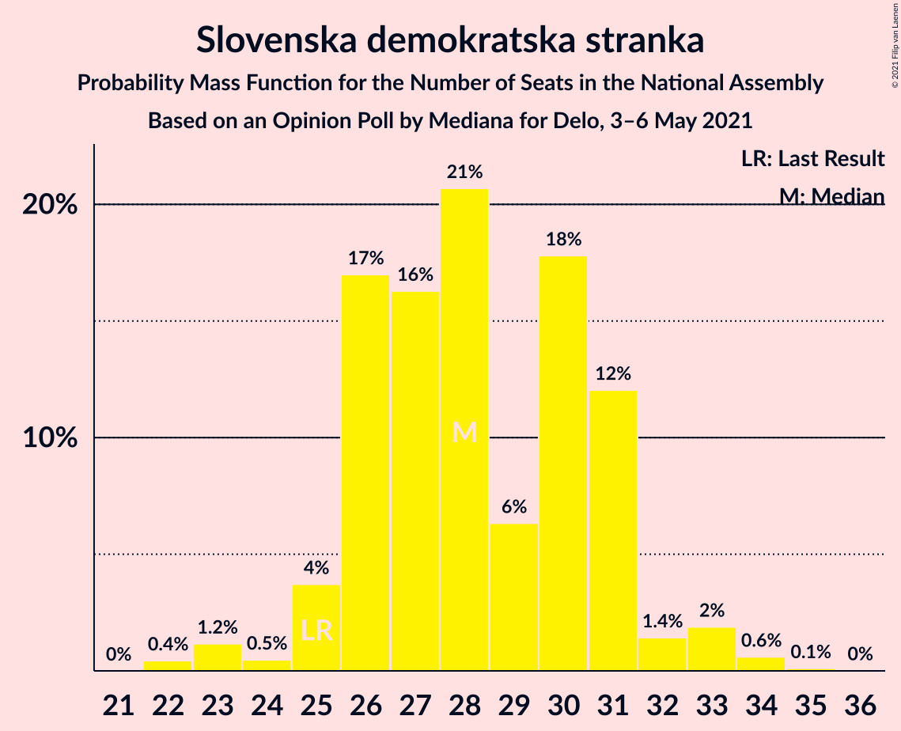
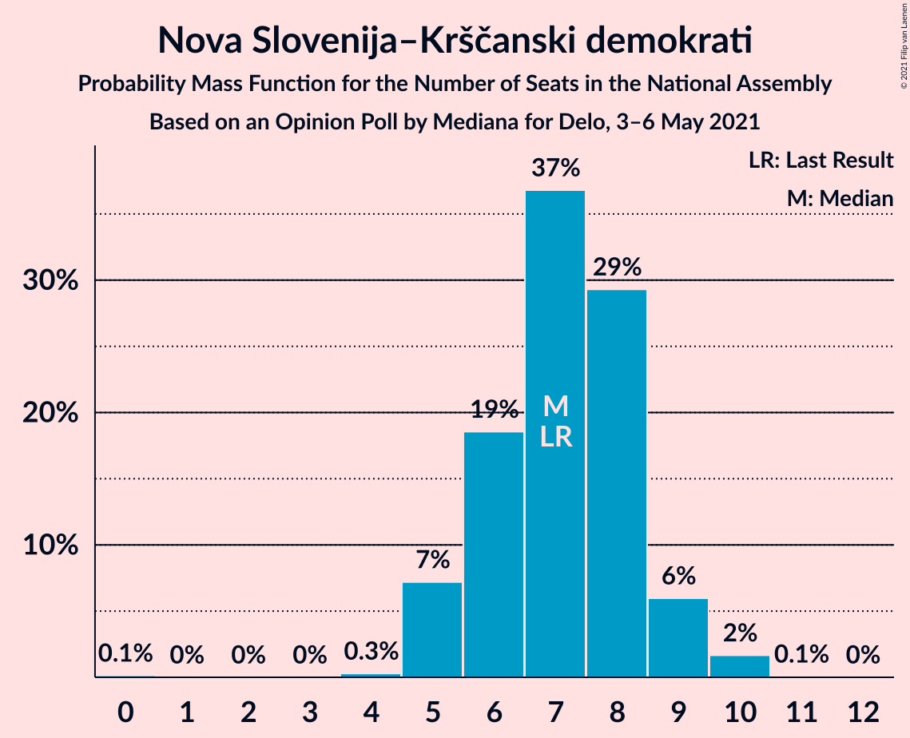
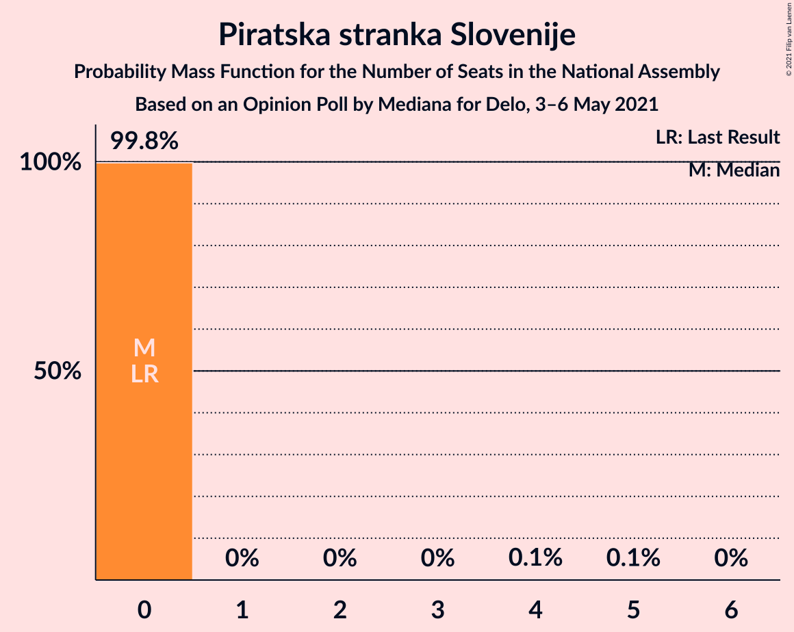
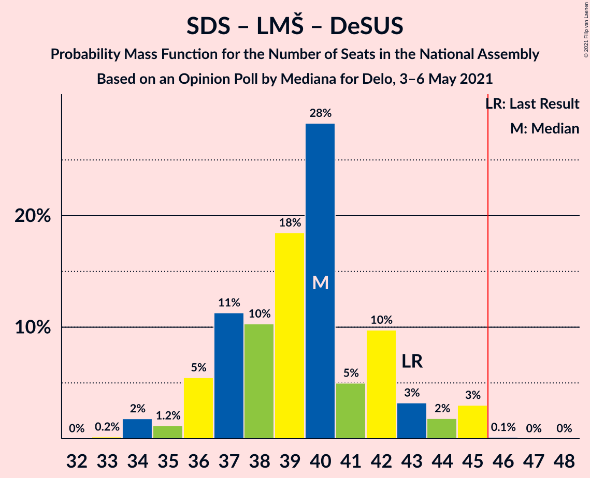
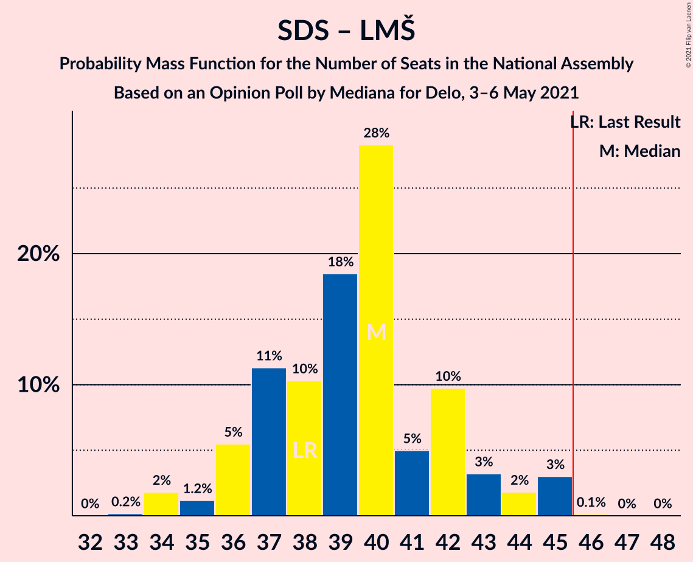
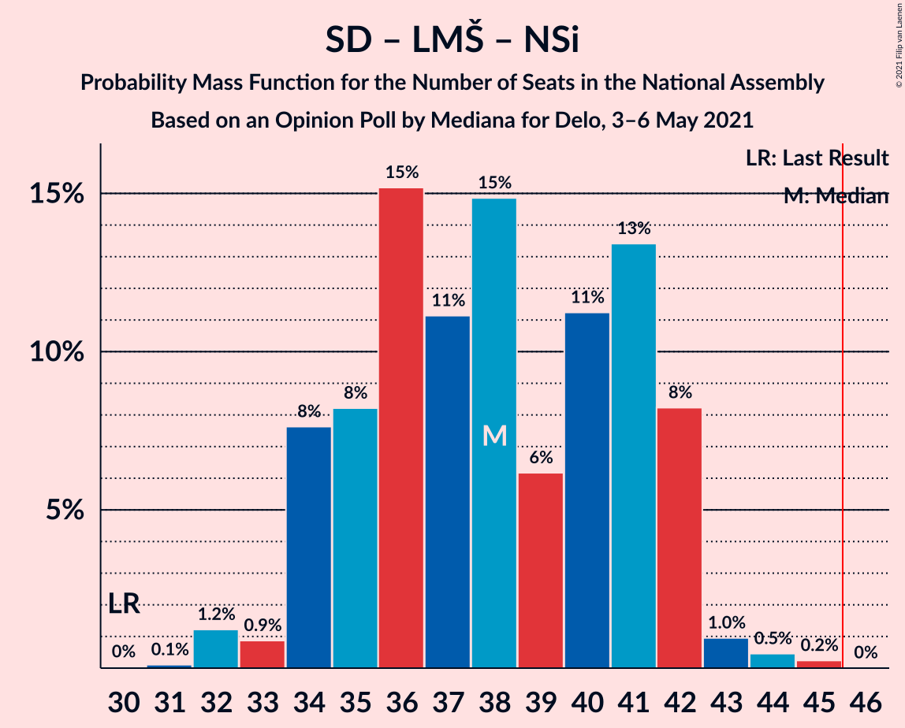
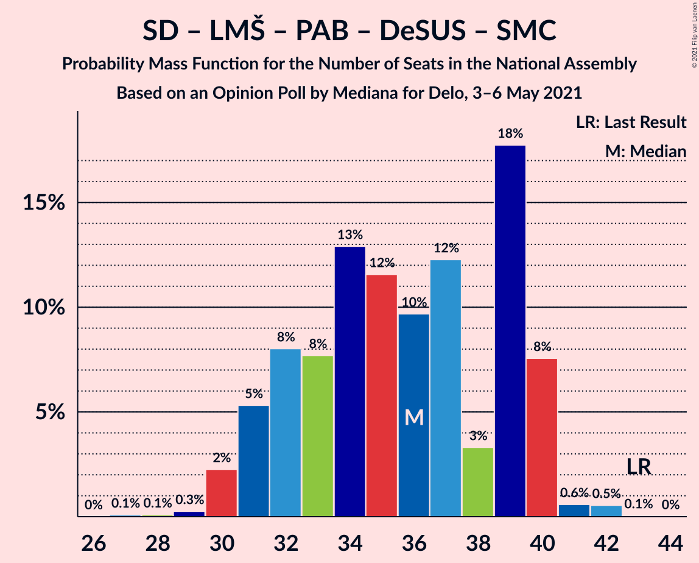
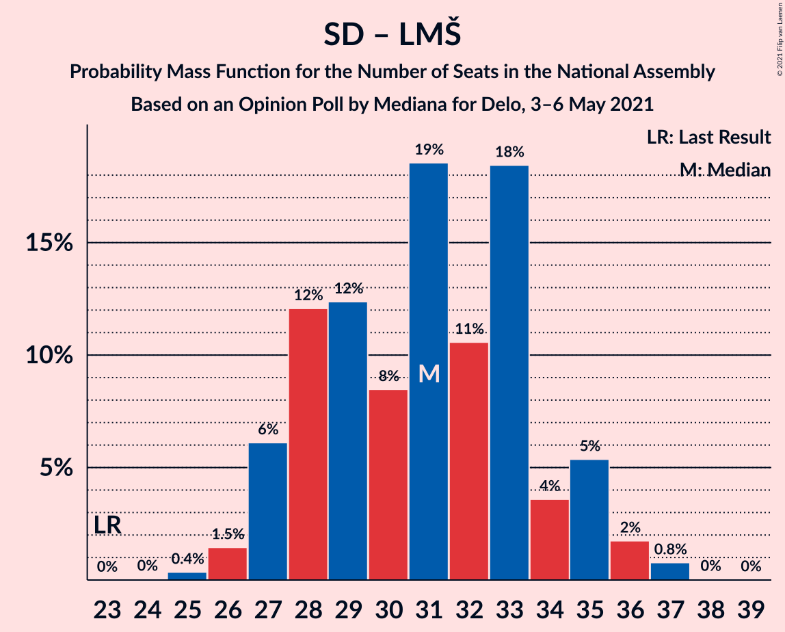
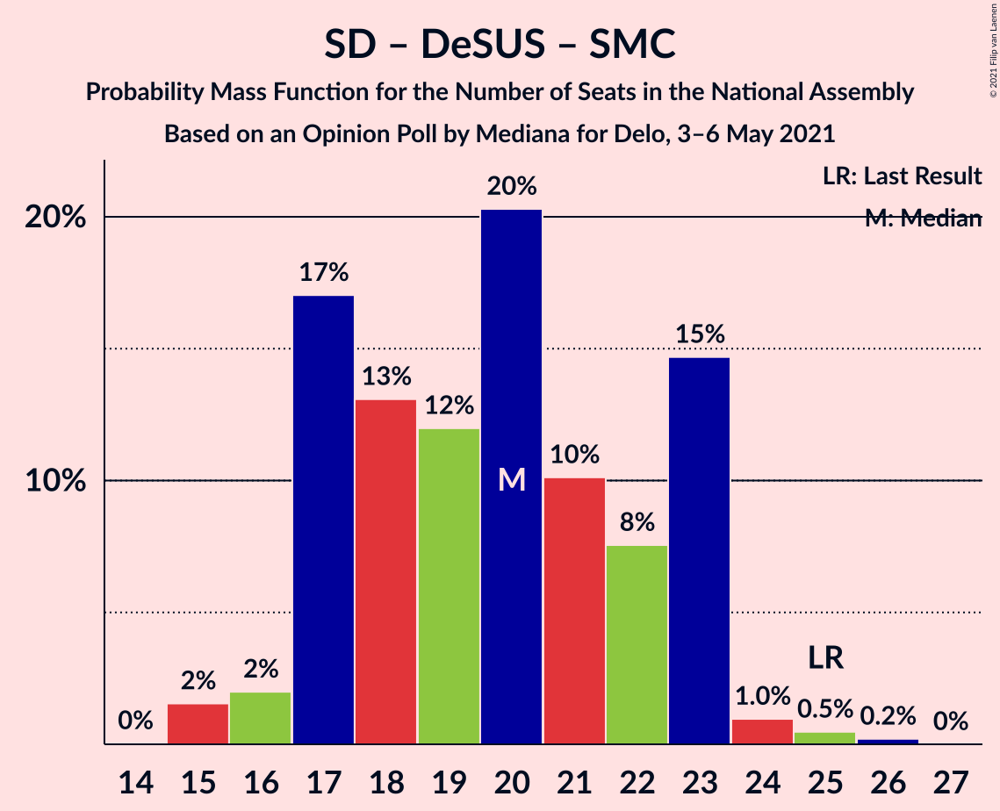

# Opinion Poll by Mediana for Delo, 3–6 May 2021

<a href="#voting-intentions">Voting Intentions</a> | <a href="#seats">Seats</a> | <a href="#coalitions">Coalitions</a> | <a href="#technical-information">Technical Information</a>

## Voting Intentions

### Confidence Intervals

| Party | Last Result | Poll Result | 80% Confidence Interval | 90% Confidence Interval | 95% Confidence Interval | 99% Confidence Interval |
|:-----:|:-----------:|:-----------:|:-----------------------:|:-----------------------:|:-----------------------:|:-----------------------:|
| Slovenska demokratska stranka | 24.9% | 27.0% | 24.9–29.2% |24.3–29.8% |23.8–30.3% |22.9–31.4% |
| Socialni demokrati | 9.9% | 18.7% | 16.9–20.7% |16.4–21.2% |16.0–21.7% |15.2–22.7% |
| Levica | 9.3% | 11.7% | 10.2–13.3% |9.8–13.8% |9.5–14.2% |8.9–15.1% |
| Lista Marjana Šarca | 12.6% | 10.7% | 9.3–12.3% |8.9–12.8% |8.6–13.2% |8.0–14.0% |
| Nova Slovenija–Krščanski demokrati | 7.2% | 6.7% | 5.7–8.1% |5.4–8.5% |5.1–8.8% |4.6–9.5% |
| Stranka Alenke Bratušek | 5.1% | 5.2% | 4.3–6.4% |4.0–6.8% |3.8–7.1% |3.4–7.7% |
| Slovenska ljudska stranka | 2.6% | 4.6% | 3.8–5.8% |3.5–6.1% |3.3–6.4% |2.9–7.1% |
| Slovenska nacionalna stranka | 4.2% | 3.1% | 2.4–4.1% |2.2–4.4% |2.0–4.6% |1.8–5.2% |
| Dobra država | 1.5% | 2.2% | 1.7–3.1% |1.5–3.4% |1.4–3.6% |1.2–4.1% |
| Piratska stranka Slovenije | 2.2% | 2.1% | 1.6–3.0% |1.4–3.2% |1.3–3.5% |1.1–3.9% |
| Andrej Čuš in Zeleni Slovenije | 1.1% | 2.0% | 1.4–2.8% |1.3–3.1% |1.2–3.3% |1.0–3.7% |
| Demokratična stranka upokojencev Slovenije | 4.9% | 1.8% | 1.3–2.7% |1.2–2.9% |1.1–3.1% |0.9–3.6% |
| Stranka modernega centra | 9.7% | 1.5% | 1.1–2.3% |1.0–2.5% |0.9–2.7% |0.7–3.2% |

*Note:* The poll result column reflects the actual value used in the calculations. Published results may vary slightly, and in addition be rounded to fewer digits.

## Seats

### Confidence Intervals

| Party | Last Result | Median | 80% Confidence Interval | 90% Confidence Interval | 95% Confidence Interval | 99% Confidence Interval |
|:-----:|:-----------:|:------:|:-----------------------:|:-----------------------:|:-----------------------:|:-----------------------:|
| <a href="#slovenska-demokratska-stranka">Slovenska demokratska stranka</a> | 25 | 28 | 26–31 |25–31 |25–33 |23–34 |
| <a href="#socialni-demokrati">Socialni demokrati</a> | 10 | 20 | 17–23 |17–23 |16–23 |15–25 |
| <a href="#levica">Levica</a> | 9 | 11 | 10–14 |9–14 |9–15 |9–16 |
| <a href="#lista-marjana-šarca">Lista Marjana Šarca</a> | 13 | 11 | 10–13 |9–14 |9–15 |8–15 |
| <a href="#nova-slovenija–krščanski-demokrati">Nova Slovenija–Krščanski demokrati</a> | 7 | 7 | 6–8 |5–9 |5–9 |5–10 |
| <a href="#stranka-alenke-bratušek">Stranka Alenke Bratušek</a> | 5 | 5 | 4–6 |0–7 |0–8 |0–8 |
| <a href="#slovenska-ljudska-stranka">Slovenska ljudska stranka</a> | 0 | 4 | 0–5 |0–6 |0–7 |0–7 |
| <a href="#slovenska-nacionalna-stranka">Slovenska nacionalna stranka</a> | 4 | 0 | 0–4 |0–5 |0–5 |0–5 |
| <a href="#dobra-država">Dobra država</a> | 0 | 0 | 0 |0 |0 |0–4 |
| <a href="#piratska-stranka-slovenije">Piratska stranka Slovenije</a> | 0 | 0 | 0 |0 |0 |0 |
| <a href="#andrej-čuš-in-zeleni-slovenije">Andrej Čuš in Zeleni Slovenije</a> | 0 | 0 | 0 |0 |0 |0 |
| <a href="#demokratična-stranka-upokojencev-slovenije">Demokratična stranka upokojencev Slovenije</a> | 5 | 0 | 0 |0 |0 |0 |
| <a href="#stranka-modernega-centra">Stranka modernega centra</a> | 10 | 0 | 0 |0 |0 |0 |

### Slovenska demokratska stranka

*For a full overview of the results for this party, see the [Slovenska demokratska stranka](party-slovenskademokratskastranka.html) page.*

| Number of Seats | Probability | Accumulated | Special Marks |
|:---------------:|:-----------:|:-----------:|:-------------:|
| 22 | 0.4% | 100% |  |
| 23 | 1.2% | 99.6% |  |
| 24 | 0.5% | 98% |  |
| 25 | 4% | 98% | Last Result |
| 26 | 17% | 94% |  |
| 27 | 16% | 77% |  |
| 28 | 21% | 61% | Median |
| 29 | 6% | 40% |  |
| 30 | 18% | 34% |  |
| 31 | 12% | 16% |  |
| 32 | 1.4% | 4% |  |
| 33 | 2% | 3% |  |
| 34 | 0.6% | 0.8% |  |
| 35 | 0.1% | 0.2% |  |
| 36 | 0% | 0% |  |

### Socialni demokrati

*For a full overview of the results for this party, see the [Socialni demokrati](party-socialnidemokrati.html) page.*

| Number of Seats | Probability | Accumulated | Special Marks |
|:---------------:|:-----------:|:-----------:|:-------------:|
| 10 | 0% | 100% | Last Result |
| 11 | 0% | 100% |  |
| 12 | 0% | 100% |  |
| 13 | 0% | 100% |  |
| 14 | 0% | 100% |  |
| 15 | 2% | 100% |  |
| 16 | 2% | 98% |  |
| 17 | 17% | 96% |  |
| 18 | 13% | 79% |  |
| 19 | 12% | 66% |  |
| 20 | 20% | 54% | Median |
| 21 | 10% | 34% |  |
| 22 | 8% | 24% |  |
| 23 | 15% | 16% |  |
| 24 | 1.0% | 2% |  |
| 25 | 0.5% | 0.7% |  |
| 26 | 0.2% | 0.2% |  |
| 27 | 0% | 0% |  |

### Levica

*For a full overview of the results for this party, see the [Levica](party-levica.html) page.*

| Number of Seats | Probability | Accumulated | Special Marks |
|:---------------:|:-----------:|:-----------:|:-------------:|
| 8 | 0.1% | 100% |  |
| 9 | 6% | 99.9% | Last Result |
| 10 | 21% | 94% |  |
| 11 | 23% | 73% | Median |
| 12 | 19% | 50% |  |
| 13 | 7% | 31% |  |
| 14 | 19% | 24% |  |
| 15 | 4% | 4% |  |
| 16 | 0.7% | 0.8% |  |
| 17 | 0.1% | 0.1% |  |
| 18 | 0% | 0% |  |

### Lista Marjana Šarca

*For a full overview of the results for this party, see the [Lista Marjana Šarca](party-listamarjanašarca.html) page.*

| Number of Seats | Probability | Accumulated | Special Marks |
|:---------------:|:-----------:|:-----------:|:-------------:|
| 7 | 0.2% | 100% |  |
| 8 | 0.4% | 99.8% |  |
| 9 | 8% | 99.4% |  |
| 10 | 27% | 92% |  |
| 11 | 28% | 65% | Median |
| 12 | 20% | 36% |  |
| 13 | 9% | 16% | Last Result |
| 14 | 4% | 7% |  |
| 15 | 3% | 3% |  |
| 16 | 0% | 0.1% |  |
| 17 | 0% | 0% |  |

### Nova Slovenija–Krščanski demokrati

*For a full overview of the results for this party, see the [Nova Slovenija–Krščanski demokrati](party-novaslovenija–krščanskidemokrati.html) page.*

| Number of Seats | Probability | Accumulated | Special Marks |
|:---------------:|:-----------:|:-----------:|:-------------:|
| 0 | 0.1% | 100% |  |
| 1 | 0% | 99.9% |  |
| 2 | 0% | 99.9% |  |
| 3 | 0% | 99.9% |  |
| 4 | 0.3% | 99.9% |  |
| 5 | 7% | 99.6% |  |
| 6 | 19% | 92% |  |
| 7 | 37% | 74% | Last Result, Median |
| 8 | 29% | 37% |  |
| 9 | 6% | 8% |  |
| 10 | 2% | 2% |  |
| 11 | 0.1% | 0.1% |  |
| 12 | 0% | 0% |  |

### Stranka Alenke Bratušek

*For a full overview of the results for this party, see the [Stranka Alenke Bratušek](party-strankaalenkebratušek.html) page.*

| Number of Seats | Probability | Accumulated | Special Marks |
|:---------------:|:-----------:|:-----------:|:-------------:|
| 0 | 9% | 100% |  |
| 1 | 0% | 91% |  |
| 2 | 0% | 91% |  |
| 3 | 0% | 91% |  |
| 4 | 19% | 91% |  |
| 5 | 33% | 72% | Last Result, Median |
| 6 | 33% | 38% |  |
| 7 | 2% | 5% |  |
| 8 | 3% | 3% |  |
| 9 | 0.2% | 0.2% |  |
| 10 | 0% | 0% |  |

### Slovenska ljudska stranka

*For a full overview of the results for this party, see the [Slovenska ljudska stranka](party-slovenskaljudskastranka.html) page.*

| Number of Seats | Probability | Accumulated | Special Marks |
|:---------------:|:-----------:|:-----------:|:-------------:|
| 0 | 23% | 100% | Last Result |
| 1 | 0% | 77% |  |
| 2 | 0% | 77% |  |
| 3 | 0% | 77% |  |
| 4 | 27% | 77% | Median |
| 5 | 40% | 50% |  |
| 6 | 7% | 10% |  |
| 7 | 3% | 3% |  |
| 8 | 0.1% | 0.1% |  |
| 9 | 0% | 0% |  |

### Slovenska nacionalna stranka

*For a full overview of the results for this party, see the [Slovenska nacionalna stranka](party-slovenskanacionalnastranka.html) page.*

| Number of Seats | Probability | Accumulated | Special Marks |
|:---------------:|:-----------:|:-----------:|:-------------:|
| 0 | 73% | 100% | Median |
| 1 | 0% | 27% |  |
| 2 | 0% | 27% |  |
| 3 | 0% | 27% |  |
| 4 | 22% | 27% | Last Result |
| 5 | 5% | 5% |  |
| 6 | 0.2% | 0.2% |  |
| 7 | 0% | 0% |  |

### Dobra država

*For a full overview of the results for this party, see the [Dobra država](party-dobradržava.html) page.*

| Number of Seats | Probability | Accumulated | Special Marks |
|:---------------:|:-----------:|:-----------:|:-------------:|
| 0 | 98% | 100% | Last Result, Median |
| 1 | 0% | 2% |  |
| 2 | 0% | 2% |  |
| 3 | 0% | 2% |  |
| 4 | 1.4% | 2% |  |
| 5 | 0.1% | 0.1% |  |
| 6 | 0% | 0% |  |

### Piratska stranka Slovenije

*For a full overview of the results for this party, see the [Piratska stranka Slovenije](party-piratskastrankaslovenije.html) page.*

| Number of Seats | Probability | Accumulated | Special Marks |
|:---------------:|:-----------:|:-----------:|:-------------:|
| 0 | 99.8% | 100% | Last Result, Median |
| 1 | 0% | 0.2% |  |
| 2 | 0% | 0.2% |  |
| 3 | 0% | 0.2% |  |
| 4 | 0.1% | 0.2% |  |
| 5 | 0.1% | 0.1% |  |
| 6 | 0% | 0% |  |

### Andrej Čuš in Zeleni Slovenije

*For a full overview of the results for this party, see the [Andrej Čuš in Zeleni Slovenije](party-andrejčušinzelenislovenije.html) page.*

| Number of Seats | Probability | Accumulated | Special Marks |
|:---------------:|:-----------:|:-----------:|:-------------:|
| 0 | 99.6% | 100% | Last Result, Median |
| 1 | 0% | 0.4% |  |
| 2 | 0% | 0.4% |  |
| 3 | 0% | 0.4% |  |
| 4 | 0.4% | 0.4% |  |
| 5 | 0% | 0% |  |

### Demokratična stranka upokojencev Slovenije

*For a full overview of the results for this party, see the [Demokratična stranka upokojencev Slovenije](party-demokratičnastrankaupokojencevslovenije.html) page.*

| Number of Seats | Probability | Accumulated | Special Marks |
|:---------------:|:-----------:|:-----------:|:-------------:|
| 0 | 100% | 100% | Median |
| 1 | 0% | 0% |  |
| 2 | 0% | 0% |  |
| 3 | 0% | 0% |  |
| 4 | 0% | 0% |  |
| 5 | 0% | 0% | Last Result |

### Stranka modernega centra

*For a full overview of the results for this party, see the [Stranka modernega centra](party-strankamodernegacentra.html) page.*

| Number of Seats | Probability | Accumulated | Special Marks |
|:---------------:|:-----------:|:-----------:|:-------------:|
| 0 | 100% | 100% | Median |
| 1 | 0% | 0% |  |
| 2 | 0% | 0% |  |
| 3 | 0% | 0% |  |
| 4 | 0% | 0% |  |
| 5 | 0% | 0% |  |
| 6 | 0% | 0% |  |
| 7 | 0% | 0% |  |
| 8 | 0% | 0% |  |
| 9 | 0% | 0% |  |
| 10 | 0% | 0% | Last Result |

## Coalitions

### Confidence Intervals

| Coalition | Last Result | Median | Majority? | 80% Confidence Interval | 90% Confidence Interval | 95% Confidence Interval | 99% Confidence Interval |
|:---------:|:-----------:|:------:|:---------:|:-----------------------:|:-----------------------:|:-----------------------:|:-----------------------:|
| Socialni demokrati – Lista Marjana Šarca – Nova Slovenija–Krščanski demokrati – Stranka Alenke Bratušek – Demokratična stranka upokojencev Slovenije – Stranka modernega centra | 50 | 43 | 25% | 39–47 | 38–47 | 38–47 | 36–48 |
| Slovenska demokratska stranka – Lista Marjana Šarca – Demokratična stranka upokojencev Slovenije | 43 | 40 | 0.2% | 37–42 | 36–44 | 35–45 | 34–45 |
| Slovenska demokratska stranka – Lista Marjana Šarca | 38 | 40 | 0.2% | 37–42 | 36–44 | 35–45 | 34–45 |
| Socialni demokrati – Lista Marjana Šarca – Nova Slovenija–Krščanski demokrati – Demokratična stranka upokojencev Slovenije | 35 | 38 | 0% | 35–41 | 34–42 | 34–42 | 32–44 |
| Socialni demokrati – Lista Marjana Šarca – Nova Slovenija–Krščanski demokrati – Demokratična stranka upokojencev Slovenije – Stranka modernega centra | 45 | 38 | 0% | 35–41 | 34–42 | 34–42 | 32–44 |
| Socialni demokrati – Lista Marjana Šarca – Nova Slovenija–Krščanski demokrati | 30 | 38 | 0% | 35–41 | 34–42 | 34–42 | 32–44 |
| Socialni demokrati – Lista Marjana Šarca – Nova Slovenija–Krščanski demokrati – Stranka modernega centra | 40 | 38 | 0% | 35–41 | 34–42 | 34–42 | 32–44 |
| Socialni demokrati – Lista Marjana Šarca – Stranka Alenke Bratušek – Demokratična stranka upokojencev Slovenije – Stranka modernega centra | 43 | 36 | 0% | 32–39 | 31–40 | 30–40 | 30–42 |
| Socialni demokrati – Lista Marjana Šarca – Demokratična stranka upokojencev Slovenije | 28 | 31 | 0% | 28–34 | 27–35 | 27–36 | 26–37 |
| Socialni demokrati – Lista Marjana Šarca – Demokratična stranka upokojencev Slovenije – Stranka modernega centra | 38 | 31 | 0% | 28–34 | 27–35 | 27–36 | 26–37 |
| Socialni demokrati – Lista Marjana Šarca | 23 | 31 | 0% | 28–34 | 27–35 | 27–36 | 26–37 |
| Socialni demokrati – Lista Marjana Šarca – Stranka modernega centra | 33 | 31 | 0% | 28–34 | 27–35 | 27–36 | 26–37 |
| Socialni demokrati – Demokratična stranka upokojencev Slovenije – Stranka modernega centra | 25 | 20 | 0% | 17–23 | 17–23 | 16–23 | 15–25 |

### Socialni demokrati – Lista Marjana Šarca – Nova Slovenija–Krščanski demokrati – Stranka Alenke Bratušek – Demokratična stranka upokojencev Slovenije – Stranka modernega centra

| Number of Seats | Probability | Accumulated | Special Marks |
|:---------------:|:-----------:|:-----------:|:-------------:|
| 34 | 0.1% | 100% |  |
| 35 | 0.1% | 99.8% |  |
| 36 | 0.9% | 99.8% |  |
| 37 | 0.6% | 98.9% |  |
| 38 | 7% | 98% |  |
| 39 | 11% | 91% |  |
| 40 | 4% | 80% |  |
| 41 | 8% | 76% |  |
| 42 | 18% | 68% |  |
| 43 | 9% | 50% | Median |
| 44 | 6% | 41% |  |
| 45 | 10% | 35% |  |
| 46 | 7% | 25% | Majority |
| 47 | 17% | 18% |  |
| 48 | 0.7% | 1.0% |  |
| 49 | 0.2% | 0.4% |  |
| 50 | 0.1% | 0.1% | Last Result |
| 51 | 0.1% | 0.1% |  |
| 52 | 0% | 0% |  |

### Slovenska demokratska stranka – Lista Marjana Šarca – Demokratična stranka upokojencev Slovenije

| Number of Seats | Probability | Accumulated | Special Marks |
|:---------------:|:-----------:|:-----------:|:-------------:|
| 33 | 0.2% | 100% |  |
| 34 | 2% | 99.8% |  |
| 35 | 1.2% | 98% |  |
| 36 | 5% | 97% |  |
| 37 | 11% | 91% |  |
| 38 | 10% | 80% |  |
| 39 | 18% | 70% | Median |
| 40 | 28% | 51% |  |
| 41 | 5% | 23% |  |
| 42 | 10% | 18% |  |
| 43 | 3% | 8% | Last Result |
| 44 | 2% | 5% |  |
| 45 | 3% | 3% |  |
| 46 | 0.1% | 0.2% | Majority |
| 47 | 0% | 0.1% |  |
| 48 | 0% | 0% |  |

### Slovenska demokratska stranka – Lista Marjana Šarca

| Number of Seats | Probability | Accumulated | Special Marks |
|:---------------:|:-----------:|:-----------:|:-------------:|
| 33 | 0.2% | 100% |  |
| 34 | 2% | 99.8% |  |
| 35 | 1.2% | 98% |  |
| 36 | 5% | 97% |  |
| 37 | 11% | 91% |  |
| 38 | 10% | 80% | Last Result |
| 39 | 18% | 70% | Median |
| 40 | 28% | 51% |  |
| 41 | 5% | 23% |  |
| 42 | 10% | 18% |  |
| 43 | 3% | 8% |  |
| 44 | 2% | 5% |  |
| 45 | 3% | 3% |  |
| 46 | 0.1% | 0.2% | Majority |
| 47 | 0% | 0.1% |  |
| 48 | 0% | 0% |  |

### Socialni demokrati – Lista Marjana Šarca – Nova Slovenija–Krščanski demokrati – Demokratična stranka upokojencev Slovenije

| Number of Seats | Probability | Accumulated | Special Marks |
|:---------------:|:-----------:|:-----------:|:-------------:|
| 31 | 0.1% | 100% |  |
| 32 | 1.2% | 99.8% |  |
| 33 | 0.9% | 98.6% |  |
| 34 | 8% | 98% |  |
| 35 | 8% | 90% | Last Result |
| 36 | 15% | 82% |  |
| 37 | 11% | 67% |  |
| 38 | 15% | 56% | Median |
| 39 | 6% | 41% |  |
| 40 | 11% | 35% |  |
| 41 | 13% | 23% |  |
| 42 | 8% | 10% |  |
| 43 | 1.0% | 2% |  |
| 44 | 0.5% | 0.7% |  |
| 45 | 0.2% | 0.3% |  |
| 46 | 0% | 0% | Majority |

### Socialni demokrati – Lista Marjana Šarca – Nova Slovenija–Krščanski demokrati – Demokratična stranka upokojencev Slovenije – Stranka modernega centra

| Number of Seats | Probability | Accumulated | Special Marks |
|:---------------:|:-----------:|:-----------:|:-------------:|
| 31 | 0.1% | 100% |  |
| 32 | 1.2% | 99.8% |  |
| 33 | 0.9% | 98.6% |  |
| 34 | 8% | 98% |  |
| 35 | 8% | 90% |  |
| 36 | 15% | 82% |  |
| 37 | 11% | 67% |  |
| 38 | 15% | 56% | Median |
| 39 | 6% | 41% |  |
| 40 | 11% | 35% |  |
| 41 | 13% | 23% |  |
| 42 | 8% | 10% |  |
| 43 | 1.0% | 2% |  |
| 44 | 0.5% | 0.7% |  |
| 45 | 0.2% | 0.3% | Last Result |
| 46 | 0% | 0% | Majority |

### Socialni demokrati – Lista Marjana Šarca – Nova Slovenija–Krščanski demokrati

| Number of Seats | Probability | Accumulated | Special Marks |
|:---------------:|:-----------:|:-----------:|:-------------:|
| 30 | 0% | 100% | Last Result |
| 31 | 0.1% | 100% |  |
| 32 | 1.2% | 99.8% |  |
| 33 | 0.9% | 98.6% |  |
| 34 | 8% | 98% |  |
| 35 | 8% | 90% |  |
| 36 | 15% | 82% |  |
| 37 | 11% | 67% |  |
| 38 | 15% | 56% | Median |
| 39 | 6% | 41% |  |
| 40 | 11% | 35% |  |
| 41 | 13% | 23% |  |
| 42 | 8% | 10% |  |
| 43 | 1.0% | 2% |  |
| 44 | 0.5% | 0.7% |  |
| 45 | 0.2% | 0.3% |  |
| 46 | 0% | 0% | Majority |

### Socialni demokrati – Lista Marjana Šarca – Nova Slovenija–Krščanski demokrati – Stranka modernega centra

| Number of Seats | Probability | Accumulated | Special Marks |
|:---------------:|:-----------:|:-----------:|:-------------:|
| 31 | 0.1% | 100% |  |
| 32 | 1.2% | 99.8% |  |
| 33 | 0.9% | 98.6% |  |
| 34 | 8% | 98% |  |
| 35 | 8% | 90% |  |
| 36 | 15% | 82% |  |
| 37 | 11% | 67% |  |
| 38 | 15% | 56% | Median |
| 39 | 6% | 41% |  |
| 40 | 11% | 35% | Last Result |
| 41 | 13% | 23% |  |
| 42 | 8% | 10% |  |
| 43 | 1.0% | 2% |  |
| 44 | 0.5% | 0.7% |  |
| 45 | 0.2% | 0.3% |  |
| 46 | 0% | 0% | Majority |

### Socialni demokrati – Lista Marjana Šarca – Stranka Alenke Bratušek – Demokratična stranka upokojencev Slovenije – Stranka modernega centra

| Number of Seats | Probability | Accumulated | Special Marks |
|:---------------:|:-----------:|:-----------:|:-------------:|
| 27 | 0.1% | 100% |  |
| 28 | 0.1% | 99.9% |  |
| 29 | 0.3% | 99.8% |  |
| 30 | 2% | 99.5% |  |
| 31 | 5% | 97% |  |
| 32 | 8% | 92% |  |
| 33 | 8% | 84% |  |
| 34 | 13% | 76% |  |
| 35 | 12% | 63% |  |
| 36 | 10% | 52% | Median |
| 37 | 12% | 42% |  |
| 38 | 3% | 30% |  |
| 39 | 18% | 27% |  |
| 40 | 8% | 9% |  |
| 41 | 0.6% | 1.2% |  |
| 42 | 0.5% | 0.6% |  |
| 43 | 0.1% | 0.1% | Last Result |
| 44 | 0% | 0% |  |

### Socialni demokrati – Lista Marjana Šarca – Demokratična stranka upokojencev Slovenije

| Number of Seats | Probability | Accumulated | Special Marks |
|:---------------:|:-----------:|:-----------:|:-------------:|
| 24 | 0% | 100% |  |
| 25 | 0.4% | 99.9% |  |
| 26 | 1.4% | 99.6% |  |
| 27 | 6% | 98% |  |
| 28 | 12% | 92% | Last Result |
| 29 | 12% | 80% |  |
| 30 | 8% | 68% |  |
| 31 | 19% | 59% | Median |
| 32 | 11% | 41% |  |
| 33 | 18% | 30% |  |
| 34 | 4% | 12% |  |
| 35 | 5% | 8% |  |
| 36 | 2% | 3% |  |
| 37 | 0.8% | 0.8% |  |
| 38 | 0% | 0.1% |  |
| 39 | 0% | 0% |  |

### Socialni demokrati – Lista Marjana Šarca – Demokratična stranka upokojencev Slovenije – Stranka modernega centra

| Number of Seats | Probability | Accumulated | Special Marks |
|:---------------:|:-----------:|:-----------:|:-------------:|
| 24 | 0% | 100% |  |
| 25 | 0.4% | 99.9% |  |
| 26 | 1.4% | 99.6% |  |
| 27 | 6% | 98% |  |
| 28 | 12% | 92% |  |
| 29 | 12% | 80% |  |
| 30 | 8% | 68% |  |
| 31 | 19% | 59% | Median |
| 32 | 11% | 41% |  |
| 33 | 18% | 30% |  |
| 34 | 4% | 12% |  |
| 35 | 5% | 8% |  |
| 36 | 2% | 3% |  |
| 37 | 0.8% | 0.8% |  |
| 38 | 0% | 0.1% | Last Result |
| 39 | 0% | 0% |  |

### Socialni demokrati – Lista Marjana Šarca

| Number of Seats | Probability | Accumulated | Special Marks |
|:---------------:|:-----------:|:-----------:|:-------------:|
| 23 | 0% | 100% | Last Result |
| 24 | 0% | 100% |  |
| 25 | 0.4% | 99.9% |  |
| 26 | 1.5% | 99.6% |  |
| 27 | 6% | 98% |  |
| 28 | 12% | 92% |  |
| 29 | 12% | 80% |  |
| 30 | 8% | 68% |  |
| 31 | 19% | 59% | Median |
| 32 | 11% | 41% |  |
| 33 | 18% | 30% |  |
| 34 | 4% | 12% |  |
| 35 | 5% | 8% |  |
| 36 | 2% | 3% |  |
| 37 | 0.8% | 0.8% |  |
| 38 | 0% | 0.1% |  |
| 39 | 0% | 0% |  |

### Socialni demokrati – Lista Marjana Šarca – Stranka modernega centra

| Number of Seats | Probability | Accumulated | Special Marks |
|:---------------:|:-----------:|:-----------:|:-------------:|
| 24 | 0% | 100% |  |
| 25 | 0.4% | 99.9% |  |
| 26 | 1.5% | 99.6% |  |
| 27 | 6% | 98% |  |
| 28 | 12% | 92% |  |
| 29 | 12% | 80% |  |
| 30 | 8% | 68% |  |
| 31 | 19% | 59% | Median |
| 32 | 11% | 41% |  |
| 33 | 18% | 30% | Last Result |
| 34 | 4% | 12% |  |
| 35 | 5% | 8% |  |
| 36 | 2% | 3% |  |
| 37 | 0.8% | 0.8% |  |
| 38 | 0% | 0.1% |  |
| 39 | 0% | 0% |  |

### Socialni demokrati – Demokratična stranka upokojencev Slovenije – Stranka modernega centra

| Number of Seats | Probability | Accumulated | Special Marks |
|:---------------:|:-----------:|:-----------:|:-------------:|
| 15 | 2% | 100% |  |
| 16 | 2% | 98% |  |
| 17 | 17% | 96% |  |
| 18 | 13% | 79% |  |
| 19 | 12% | 66% |  |
| 20 | 20% | 54% | Median |
| 21 | 10% | 34% |  |
| 22 | 8% | 24% |  |
| 23 | 15% | 16% |  |
| 24 | 1.0% | 2% |  |
| 25 | 0.5% | 0.7% | Last Result |
| 26 | 0.2% | 0.2% |  |
| 27 | 0% | 0% |  |

## Technical Information

### Opinion Poll

+ **Polling firm:** Mediana
+ **Commissioner(s):** Delo
+ **Fieldwork period:** 3–6 May 2021

### Calculations

+ **Sample size:** 712
+ **Simulations done:** 1,048,576
+ **Error estimate:** 3.43%

