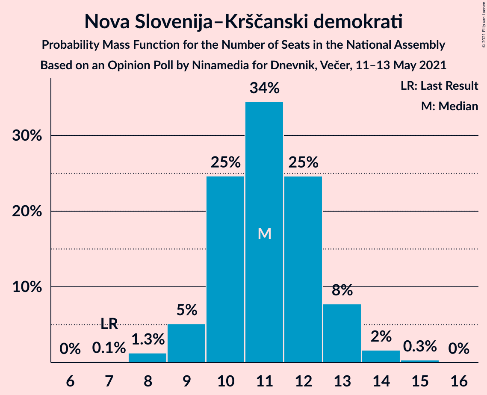
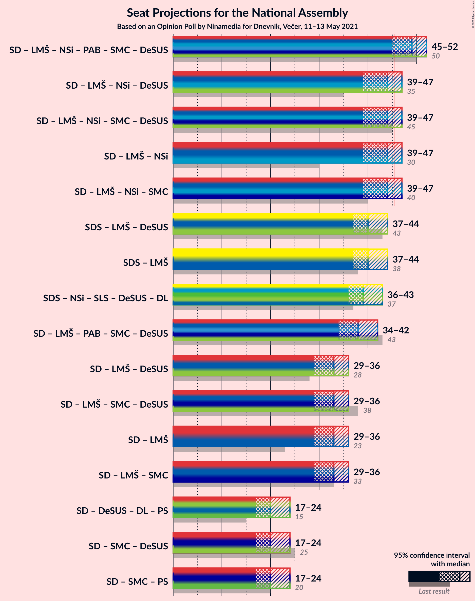
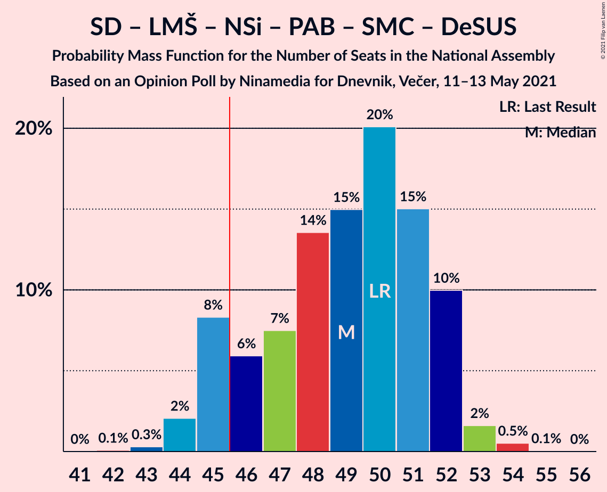
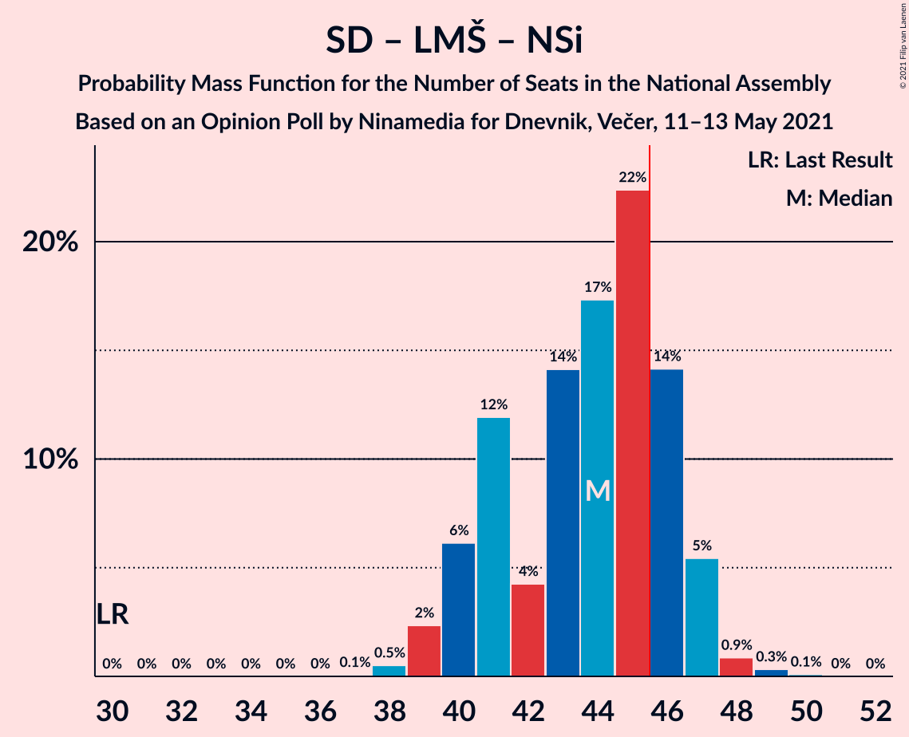

# Opinion Poll by Ninamedia for Dnevnik, Večer, 11–13 May 2021

<a href="#voting-intentions">Voting Intentions</a> | <a href="#seats">Seats</a> | <a href="#coalitions">Coalitions</a> | <a href="#technical-information">Technical Information</a>

## Voting Intentions

### Confidence Intervals

| Party | Last Result | Poll Result | 80% Confidence Interval | 90% Confidence Interval | 95% Confidence Interval | 99% Confidence Interval |
|:-----:|:-----------:|:-----------:|:-----------------------:|:-----------------------:|:-----------------------:|:-----------------------:|
| Slovenska demokratska stranka | 24.9% | 28.9% | 26.7–31.1% |26.1–31.8% |25.6–32.3% |24.6–33.4% |
| Socialni demokrati | 9.9% | 20.9% | 19.0–22.9% |18.5–23.5% |18.0–24.0% |17.1–25.0% |
| Lista Marjana Šarca | 12.6% | 13.1% | 11.6–14.9% |11.2–15.4% |10.8–15.9% |10.2–16.7% |
| Levica | 9.3% | 11.7% | 10.3–13.4% |9.9–13.9% |9.5–14.3% |8.9–15.2% |
| Nova Slovenija–Krščanski demokrati | 7.2% | 11.7% | 10.3–13.4% |9.9–13.9% |9.5–14.3% |8.9–15.2% |
| Stranka Alenke Bratušek | 5.1% | 5.9% | 4.9–7.2% |4.6–7.5% |4.3–7.9% |3.9–8.5% |
| Slovenska ljudska stranka | 2.6% | 3.0% | 2.3–4.0% |2.1–4.3% |2.0–4.6% |1.7–5.1% |
| Slovenska nacionalna stranka | 4.2% | 1.6% | 1.1–2.4% |1.0–2.6% |0.9–2.8% |0.7–3.2% |
| Stranka modernega centra | 9.7% | 1.0% | 0.7–1.7% |0.6–1.9% |0.5–2.1% |0.4–2.4% |
| Demokratična stranka upokojencev Slovenije | 4.9% | 0.9% | 0.5–1.5% |0.5–1.7% |0.4–1.9% |0.3–2.2% |

*Note:* The poll result column reflects the actual value used in the calculations. Published results may vary slightly, and in addition be rounded to fewer digits.

## Seats

### Confidence Intervals

| Party | Last Result | Median | 80% Confidence Interval | 90% Confidence Interval | 95% Confidence Interval | 99% Confidence Interval |
|:-----:|:-----------:|:------:|:-----------------------:|:-----------------------:|:-----------------------:|:-----------------------:|
| <a href="#slovenska-demokratska-stranka">Slovenska demokratska stranka</a> | 25 | 29 | 24–29 |24–30 |23–32 |23–33 |
| <a href="#socialni-demokrati">Socialni demokrati</a> | 10 | 20 | 17–21 |17–22 |17–23 |16–23 |
| <a href="#lista-marjana-šarca">Lista Marjana Šarca</a> | 13 | 13 | 12–14 |11–15 |11–15 |10–16 |
| <a href="#levica">Levica</a> | 9 | 11 | 9–12 |9–13 |9–13 |8–14 |
| <a href="#nova-slovenija–krščanski-demokrati">Nova Slovenija–Krščanski demokrati</a> | 7 | 11 | 10–12 |9–12 |9–12 |9–14 |
| <a href="#stranka-alenke-bratušek">Stranka Alenke Bratušek</a> | 5 | 5 | 5–7 |5–7 |5–7 |4–7 |
| <a href="#slovenska-ljudska-stranka">Slovenska ljudska stranka</a> | 0 | 0 | 0–3 |0–3 |0–4 |0–4 |
| <a href="#slovenska-nacionalna-stranka">Slovenska nacionalna stranka</a> | 4 | 0 | 0 |0 |0 |0 |
| <a href="#stranka-modernega-centra">Stranka modernega centra</a> | 10 | 0 | 0 |0 |0 |0 |
| <a href="#demokratična-stranka-upokojencev-slovenije">Demokratična stranka upokojencev Slovenije</a> | 5 | 0 | 0 |0 |0 |0 |

### Slovenska demokratska stranka

*For a full overview of the results for this party, see the [Slovenska demokratska stranka](party-slovenskademokratskastranka.html) page.*

| Number of Seats | Probability | Accumulated | Special Marks |
|:---------------:|:-----------:|:-----------:|:-------------:|
| 23 | 3% | 100% |  |
| 24 | 9% | 97% |  |
| 25 | 5% | 88% | Last Result |
| 26 | 7% | 83% |  |
| 27 | 11% | 76% |  |
| 28 | 15% | 66% |  |
| 29 | 44% | 51% | Median |
| 30 | 3% | 7% |  |
| 31 | 0.8% | 3% |  |
| 32 | 0.3% | 3% |  |
| 33 | 2% | 2% |  |
| 34 | 0% | 0% |  |

### Socialni demokrati

*For a full overview of the results for this party, see the [Socialni demokrati](party-socialnidemokrati.html) page.*

| Number of Seats | Probability | Accumulated | Special Marks |
|:---------------:|:-----------:|:-----------:|:-------------:|
| 10 | 0% | 100% | Last Result |
| 11 | 0% | 100% |  |
| 12 | 0% | 100% |  |
| 13 | 0% | 100% |  |
| 14 | 0% | 100% |  |
| 15 | 0.1% | 100% |  |
| 16 | 1.0% | 99.9% |  |
| 17 | 16% | 98.9% |  |
| 18 | 1.0% | 83% |  |
| 19 | 28% | 82% |  |
| 20 | 11% | 54% | Median |
| 21 | 35% | 42% |  |
| 22 | 5% | 7% |  |
| 23 | 2% | 3% |  |
| 24 | 0.5% | 0.5% |  |
| 25 | 0% | 0% |  |

### Lista Marjana Šarca

*For a full overview of the results for this party, see the [Lista Marjana Šarca](party-listamarjanašarca.html) page.*

| Number of Seats | Probability | Accumulated | Special Marks |
|:---------------:|:-----------:|:-----------:|:-------------:|
| 9 | 0.2% | 100% |  |
| 10 | 1.0% | 99.8% |  |
| 11 | 7% | 98.8% |  |
| 12 | 15% | 92% |  |
| 13 | 40% | 77% | Last Result, Median |
| 14 | 30% | 37% |  |
| 15 | 5% | 7% |  |
| 16 | 2% | 2% |  |
| 17 | 0.1% | 0.1% |  |
| 18 | 0% | 0% |  |

### Levica

*For a full overview of the results for this party, see the [Levica](party-levica.html) page.*

| Number of Seats | Probability | Accumulated | Special Marks |
|:---------------:|:-----------:|:-----------:|:-------------:|
| 7 | 0.3% | 100% |  |
| 8 | 0.7% | 99.7% |  |
| 9 | 19% | 99.1% | Last Result |
| 10 | 28% | 80% |  |
| 11 | 34% | 52% | Median |
| 12 | 13% | 18% |  |
| 13 | 4% | 5% |  |
| 14 | 0.6% | 0.8% |  |
| 15 | 0.1% | 0.2% |  |
| 16 | 0% | 0% |  |

### Nova Slovenija–Krščanski demokrati

*For a full overview of the results for this party, see the [Nova Slovenija–Krščanski demokrati](party-novaslovenija–krščanskidemokrati.html) page.*

| Number of Seats | Probability | Accumulated | Special Marks |
|:---------------:|:-----------:|:-----------:|:-------------:|
| 7 | 0.2% | 100% | Last Result |
| 8 | 0.3% | 99.8% |  |
| 9 | 5% | 99.5% |  |
| 10 | 22% | 95% |  |
| 11 | 60% | 72% | Median |
| 12 | 10% | 13% |  |
| 13 | 2% | 2% |  |
| 14 | 0.4% | 0.7% |  |
| 15 | 0.3% | 0.3% |  |
| 16 | 0% | 0% |  |

### Stranka Alenke Bratušek

*For a full overview of the results for this party, see the [Stranka Alenke Bratušek](party-strankaalenkebratušek.html) page.*

| Number of Seats | Probability | Accumulated | Special Marks |
|:---------------:|:-----------:|:-----------:|:-------------:|
| 0 | 0.5% | 100% |  |
| 1 | 0% | 99.5% |  |
| 2 | 0% | 99.5% |  |
| 3 | 0% | 99.5% |  |
| 4 | 2% | 99.5% |  |
| 5 | 76% | 98% | Last Result, Median |
| 6 | 6% | 21% |  |
| 7 | 15% | 16% |  |
| 8 | 0.4% | 0.5% |  |
| 9 | 0.1% | 0.1% |  |
| 10 | 0% | 0% |  |

### Slovenska ljudska stranka

*For a full overview of the results for this party, see the [Slovenska ljudska stranka](party-slovenskaljudskastranka.html) page.*

| Number of Seats | Probability | Accumulated | Special Marks |
|:---------------:|:-----------:|:-----------:|:-------------:|
| 0 | 78% | 100% | Last Result, Median |
| 1 | 0% | 22% |  |
| 2 | 0% | 22% |  |
| 3 | 18% | 22% |  |
| 4 | 4% | 4% |  |
| 5 | 0.1% | 0.1% |  |
| 6 | 0% | 0% |  |

### Slovenska nacionalna stranka

*For a full overview of the results for this party, see the [Slovenska nacionalna stranka](party-slovenskanacionalnastranka.html) page.*

| Number of Seats | Probability | Accumulated | Special Marks |
|:---------------:|:-----------:|:-----------:|:-------------:|
| 0 | 100% | 100% | Median |
| 1 | 0% | 0% |  |
| 2 | 0% | 0% |  |
| 3 | 0% | 0% |  |
| 4 | 0% | 0% | Last Result |

### Stranka modernega centra

*For a full overview of the results for this party, see the [Stranka modernega centra](party-strankamodernegacentra.html) page.*

| Number of Seats | Probability | Accumulated | Special Marks |
|:---------------:|:-----------:|:-----------:|:-------------:|
| 0 | 100% | 100% | Median |
| 1 | 0% | 0% |  |
| 2 | 0% | 0% |  |
| 3 | 0% | 0% |  |
| 4 | 0% | 0% |  |
| 5 | 0% | 0% |  |
| 6 | 0% | 0% |  |
| 7 | 0% | 0% |  |
| 8 | 0% | 0% |  |
| 9 | 0% | 0% |  |
| 10 | 0% | 0% | Last Result |

### Demokratična stranka upokojencev Slovenije

*For a full overview of the results for this party, see the [Demokratična stranka upokojencev Slovenije](party-demokratičnastrankaupokojencevslovenije.html) page.*

| Number of Seats | Probability | Accumulated | Special Marks |
|:---------------:|:-----------:|:-----------:|:-------------:|
| 0 | 100% | 100% | Median |
| 1 | 0% | 0% |  |
| 2 | 0% | 0% |  |
| 3 | 0% | 0% |  |
| 4 | 0% | 0% |  |
| 5 | 0% | 0% | Last Result |

## Coalitions

### Confidence Intervals

| Coalition | Last Result | Median | Majority? | 80% Confidence Interval | 90% Confidence Interval | 95% Confidence Interval | 99% Confidence Interval |
|:---------:|:-----------:|:------:|:---------:|:-----------------------:|:-----------------------:|:-----------------------:|:-----------------------:|
| Socialni demokrati – Lista Marjana Šarca – Nova Slovenija–Krščanski demokrati – Stranka Alenke Bratušek – Stranka modernega centra – Demokratična stranka upokojencev Slovenije | 50 | 49 | 89% | 45–52 | 45–52 | 45–52 | 45–54 |
| Socialni demokrati – Lista Marjana Šarca – Nova Slovenija–Krščanski demokrati – Demokratična stranka upokojencev Slovenije | 35 | 44 | 13% | 40–46 | 40–46 | 40–46 | 39–49 |
| Socialni demokrati – Lista Marjana Šarca – Nova Slovenija–Krščanski demokrati – Stranka modernega centra – Demokratična stranka upokojencev Slovenije | 45 | 44 | 13% | 40–46 | 40–46 | 40–46 | 39–49 |
| Socialni demokrati – Lista Marjana Šarca – Nova Slovenija–Krščanski demokrati | 30 | 44 | 13% | 40–46 | 40–46 | 40–46 | 39–49 |
| Socialni demokrati – Lista Marjana Šarca – Nova Slovenija–Krščanski demokrati – Stranka modernega centra | 40 | 44 | 13% | 40–46 | 40–46 | 40–46 | 39–49 |
| Slovenska demokratska stranka – Lista Marjana Šarca – Demokratična stranka upokojencev Slovenije | 43 | 42 | 2% | 38–43 | 38–44 | 36–44 | 36–46 |
| Slovenska demokratska stranka – Lista Marjana Šarca | 38 | 42 | 2% | 38–43 | 38–44 | 36–44 | 36–46 |
| Socialni demokrati – Lista Marjana Šarca – Stranka Alenke Bratušek – Stranka modernega centra – Demokratična stranka upokojencev Slovenije | 43 | 38 | 0% | 35–40 | 34–41 | 34–41 | 34–44 |
| Socialni demokrati – Lista Marjana Šarca – Demokratična stranka upokojencev Slovenije | 28 | 32 | 0% | 30–35 | 29–35 | 29–35 | 28–39 |
| Socialni demokrati – Lista Marjana Šarca – Stranka modernega centra – Demokratična stranka upokojencev Slovenije | 38 | 32 | 0% | 30–35 | 29–35 | 29–35 | 28–39 |
| Socialni demokrati – Lista Marjana Šarca | 23 | 32 | 0% | 30–35 | 29–35 | 29–35 | 28–39 |
| Socialni demokrati – Lista Marjana Šarca – Stranka modernega centra | 33 | 32 | 0% | 30–35 | 29–35 | 29–35 | 28–39 |
| Socialni demokrati – Stranka modernega centra – Demokratična stranka upokojencev Slovenije | 25 | 20 | 0% | 17–21 | 17–22 | 17–23 | 16–23 |

### Socialni demokrati – Lista Marjana Šarca – Nova Slovenija–Krščanski demokrati – Stranka Alenke Bratušek – Stranka modernega centra – Demokratična stranka upokojencev Slovenije

| Number of Seats | Probability | Accumulated | Special Marks |
|:---------------:|:-----------:|:-----------:|:-------------:|
| 42 | 0.1% | 100% |  |
| 43 | 0.1% | 99.9% |  |
| 44 | 0.1% | 99.9% |  |
| 45 | 11% | 99.8% |  |
| 46 | 1.2% | 89% | Majority |
| 47 | 2% | 87% |  |
| 48 | 33% | 85% |  |
| 49 | 7% | 53% | Median |
| 50 | 20% | 46% | Last Result |
| 51 | 15% | 26% |  |
| 52 | 9% | 11% |  |
| 53 | 0.9% | 2% |  |
| 54 | 0.7% | 0.8% |  |
| 55 | 0.1% | 0.1% |  |
| 56 | 0% | 0% |  |

### Socialni demokrati – Lista Marjana Šarca – Nova Slovenija–Krščanski demokrati – Demokratična stranka upokojencev Slovenije

| Number of Seats | Probability | Accumulated | Special Marks |
|:---------------:|:-----------:|:-----------:|:-------------:|
| 35 | 0% | 100% | Last Result |
| 36 | 0% | 100% |  |
| 37 | 0% | 100% |  |
| 38 | 0.1% | 100% |  |
| 39 | 0.8% | 99.9% |  |
| 40 | 11% | 99.1% |  |
| 41 | 1.3% | 88% |  |
| 42 | 2% | 87% |  |
| 43 | 35% | 85% |  |
| 44 | 9% | 50% | Median |
| 45 | 28% | 41% |  |
| 46 | 11% | 13% | Majority |
| 47 | 1.0% | 2% |  |
| 48 | 0.3% | 1.2% |  |
| 49 | 0.8% | 0.9% |  |
| 50 | 0.1% | 0.1% |  |
| 51 | 0% | 0% |  |

### Socialni demokrati – Lista Marjana Šarca – Nova Slovenija–Krščanski demokrati – Stranka modernega centra – Demokratična stranka upokojencev Slovenije

| Number of Seats | Probability | Accumulated | Special Marks |
|:---------------:|:-----------:|:-----------:|:-------------:|
| 38 | 0.1% | 100% |  |
| 39 | 0.8% | 99.9% |  |
| 40 | 11% | 99.1% |  |
| 41 | 1.3% | 88% |  |
| 42 | 2% | 87% |  |
| 43 | 35% | 85% |  |
| 44 | 9% | 50% | Median |
| 45 | 28% | 41% | Last Result |
| 46 | 11% | 13% | Majority |
| 47 | 1.0% | 2% |  |
| 48 | 0.3% | 1.2% |  |
| 49 | 0.8% | 0.9% |  |
| 50 | 0.1% | 0.1% |  |
| 51 | 0% | 0% |  |

### Socialni demokrati – Lista Marjana Šarca – Nova Slovenija–Krščanski demokrati

| Number of Seats | Probability | Accumulated | Special Marks |
|:---------------:|:-----------:|:-----------:|:-------------:|
| 30 | 0% | 100% | Last Result |
| 31 | 0% | 100% |  |
| 32 | 0% | 100% |  |
| 33 | 0% | 100% |  |
| 34 | 0% | 100% |  |
| 35 | 0% | 100% |  |
| 36 | 0% | 100% |  |
| 37 | 0% | 100% |  |
| 38 | 0.1% | 100% |  |
| 39 | 0.8% | 99.9% |  |
| 40 | 11% | 99.1% |  |
| 41 | 1.3% | 88% |  |
| 42 | 2% | 87% |  |
| 43 | 35% | 85% |  |
| 44 | 9% | 50% | Median |
| 45 | 28% | 41% |  |
| 46 | 11% | 13% | Majority |
| 47 | 1.0% | 2% |  |
| 48 | 0.3% | 1.2% |  |
| 49 | 0.8% | 0.9% |  |
| 50 | 0.1% | 0.1% |  |
| 51 | 0% | 0% |  |

### Socialni demokrati – Lista Marjana Šarca – Nova Slovenija–Krščanski demokrati – Stranka modernega centra

| Number of Seats | Probability | Accumulated | Special Marks |
|:---------------:|:-----------:|:-----------:|:-------------:|
| 38 | 0.1% | 100% |  |
| 39 | 0.8% | 99.9% |  |
| 40 | 11% | 99.1% | Last Result |
| 41 | 1.3% | 88% |  |
| 42 | 2% | 87% |  |
| 43 | 35% | 85% |  |
| 44 | 9% | 50% | Median |
| 45 | 28% | 41% |  |
| 46 | 11% | 13% | Majority |
| 47 | 1.0% | 2% |  |
| 48 | 0.3% | 1.2% |  |
| 49 | 0.8% | 0.9% |  |
| 50 | 0.1% | 0.1% |  |
| 51 | 0% | 0% |  |

### Slovenska demokratska stranka – Lista Marjana Šarca – Demokratična stranka upokojencev Slovenije

| Number of Seats | Probability | Accumulated | Special Marks |
|:---------------:|:-----------:|:-----------:|:-------------:|
| 35 | 0.2% | 100% |  |
| 36 | 3% | 99.8% |  |
| 37 | 0.6% | 96% |  |
| 38 | 17% | 96% |  |
| 39 | 6% | 78% |  |
| 40 | 14% | 73% |  |
| 41 | 5% | 59% |  |
| 42 | 32% | 54% | Median |
| 43 | 16% | 22% | Last Result |
| 44 | 4% | 6% |  |
| 45 | 0.1% | 2% |  |
| 46 | 2% | 2% | Majority |
| 47 | 0.2% | 0.2% |  |
| 48 | 0% | 0% |  |

### Slovenska demokratska stranka – Lista Marjana Šarca

| Number of Seats | Probability | Accumulated | Special Marks |
|:---------------:|:-----------:|:-----------:|:-------------:|
| 35 | 0.2% | 100% |  |
| 36 | 3% | 99.8% |  |
| 37 | 0.6% | 96% |  |
| 38 | 17% | 96% | Last Result |
| 39 | 6% | 78% |  |
| 40 | 14% | 73% |  |
| 41 | 5% | 59% |  |
| 42 | 32% | 54% | Median |
| 43 | 16% | 22% |  |
| 44 | 4% | 6% |  |
| 45 | 0.1% | 2% |  |
| 46 | 2% | 2% | Majority |
| 47 | 0.2% | 0.2% |  |
| 48 | 0% | 0% |  |

### Socialni demokrati – Lista Marjana Šarca – Stranka Alenke Bratušek – Stranka modernega centra – Demokratična stranka upokojencev Slovenije

| Number of Seats | Probability | Accumulated | Special Marks |
|:---------------:|:-----------:|:-----------:|:-------------:|
| 32 | 0.2% | 100% |  |
| 33 | 0.1% | 99.8% |  |
| 34 | 9% | 99.7% |  |
| 35 | 3% | 91% |  |
| 36 | 1.4% | 88% |  |
| 37 | 32% | 86% |  |
| 38 | 6% | 55% | Median |
| 39 | 11% | 49% |  |
| 40 | 29% | 38% |  |
| 41 | 7% | 9% |  |
| 42 | 0.7% | 2% |  |
| 43 | 0.4% | 1.1% | Last Result |
| 44 | 0.7% | 0.7% |  |
| 45 | 0% | 0% |  |

### Socialni demokrati – Lista Marjana Šarca – Demokratična stranka upokojencev Slovenije

| Number of Seats | Probability | Accumulated | Special Marks |
|:---------------:|:-----------:|:-----------:|:-------------:|
| 27 | 0.1% | 100% |  |
| 28 | 0.6% | 99.9% | Last Result |
| 29 | 9% | 99.3% |  |
| 30 | 3% | 90% |  |
| 31 | 1.3% | 87% |  |
| 32 | 36% | 86% |  |
| 33 | 10% | 50% | Median |
| 34 | 13% | 40% |  |
| 35 | 25% | 27% |  |
| 36 | 1.0% | 2% |  |
| 37 | 0.3% | 1.0% |  |
| 38 | 0.1% | 0.7% |  |
| 39 | 0.7% | 0.7% |  |
| 40 | 0% | 0% |  |

### Socialni demokrati – Lista Marjana Šarca – Stranka modernega centra – Demokratična stranka upokojencev Slovenije

| Number of Seats | Probability | Accumulated | Special Marks |
|:---------------:|:-----------:|:-----------:|:-------------:|
| 27 | 0.1% | 100% |  |
| 28 | 0.6% | 99.9% |  |
| 29 | 9% | 99.3% |  |
| 30 | 3% | 90% |  |
| 31 | 1.3% | 87% |  |
| 32 | 36% | 86% |  |
| 33 | 10% | 50% | Median |
| 34 | 13% | 40% |  |
| 35 | 25% | 27% |  |
| 36 | 1.0% | 2% |  |
| 37 | 0.3% | 1.0% |  |
| 38 | 0.1% | 0.7% | Last Result |
| 39 | 0.7% | 0.7% |  |
| 40 | 0% | 0% |  |

### Socialni demokrati – Lista Marjana Šarca

| Number of Seats | Probability | Accumulated | Special Marks |
|:---------------:|:-----------:|:-----------:|:-------------:|
| 23 | 0% | 100% | Last Result |
| 24 | 0% | 100% |  |
| 25 | 0% | 100% |  |
| 26 | 0% | 100% |  |
| 27 | 0.1% | 100% |  |
| 28 | 0.6% | 99.9% |  |
| 29 | 9% | 99.3% |  |
| 30 | 3% | 90% |  |
| 31 | 1.3% | 87% |  |
| 32 | 36% | 86% |  |
| 33 | 10% | 50% | Median |
| 34 | 13% | 40% |  |
| 35 | 25% | 27% |  |
| 36 | 1.0% | 2% |  |
| 37 | 0.3% | 1.0% |  |
| 38 | 0.1% | 0.7% |  |
| 39 | 0.7% | 0.7% |  |
| 40 | 0% | 0% |  |

### Socialni demokrati – Lista Marjana Šarca – Stranka modernega centra

| Number of Seats | Probability | Accumulated | Special Marks |
|:---------------:|:-----------:|:-----------:|:-------------:|
| 27 | 0.1% | 100% |  |
| 28 | 0.6% | 99.9% |  |
| 29 | 9% | 99.3% |  |
| 30 | 3% | 90% |  |
| 31 | 1.3% | 87% |  |
| 32 | 36% | 86% |  |
| 33 | 10% | 50% | Last Result, Median |
| 34 | 13% | 40% |  |
| 35 | 25% | 27% |  |
| 36 | 1.0% | 2% |  |
| 37 | 0.3% | 1.0% |  |
| 38 | 0.1% | 0.7% |  |
| 39 | 0.7% | 0.7% |  |
| 40 | 0% | 0% |  |

### Socialni demokrati – Stranka modernega centra – Demokratična stranka upokojencev Slovenije

| Number of Seats | Probability | Accumulated | Special Marks |
|:---------------:|:-----------:|:-----------:|:-------------:|
| 15 | 0.1% | 100% |  |
| 16 | 1.0% | 99.9% |  |
| 17 | 16% | 98.9% |  |
| 18 | 1.0% | 83% |  |
| 19 | 28% | 82% |  |
| 20 | 11% | 54% | Median |
| 21 | 35% | 42% |  |
| 22 | 5% | 7% |  |
| 23 | 2% | 3% |  |
| 24 | 0.5% | 0.5% |  |
| 25 | 0% | 0% | Last Result |

## Technical Information

### Opinion Poll

+ **Polling firm:** Ninamedia
+ **Commissioner(s):** Dnevnik, Večer
+ **Fieldwork period:** 11–13 May 2021

### Calculations

+ **Sample size:** 700
+ **Simulations done:** 131,072
+ **Error estimate:** 2.29%

