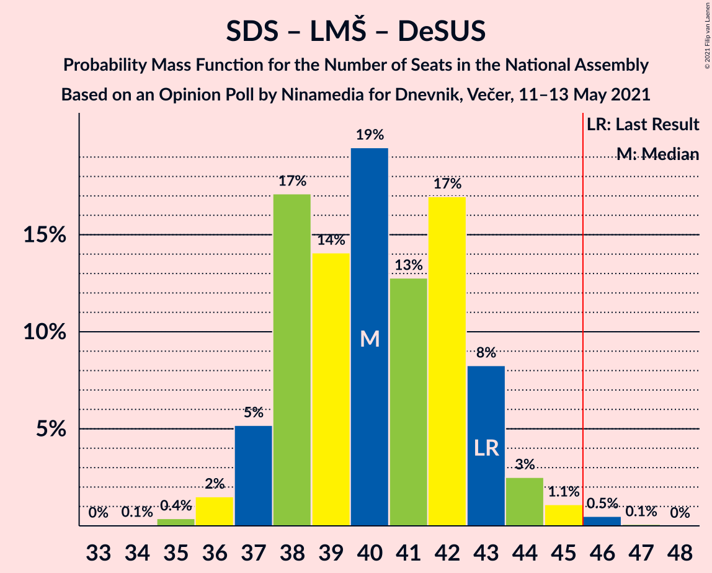
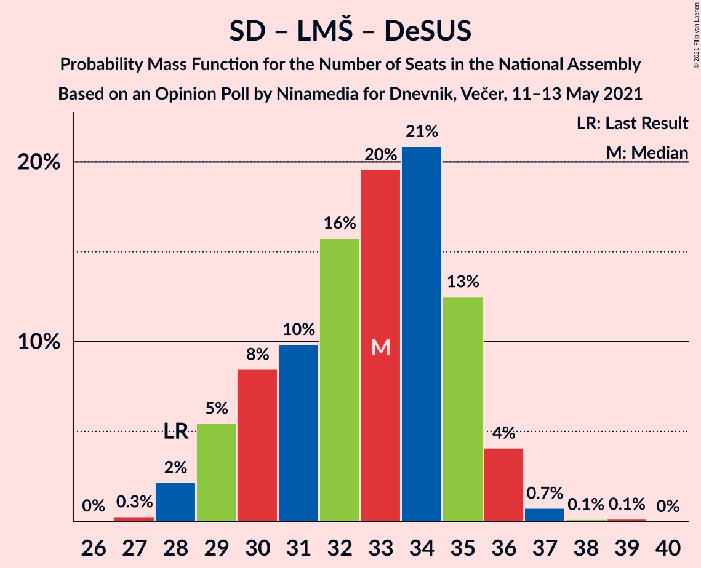
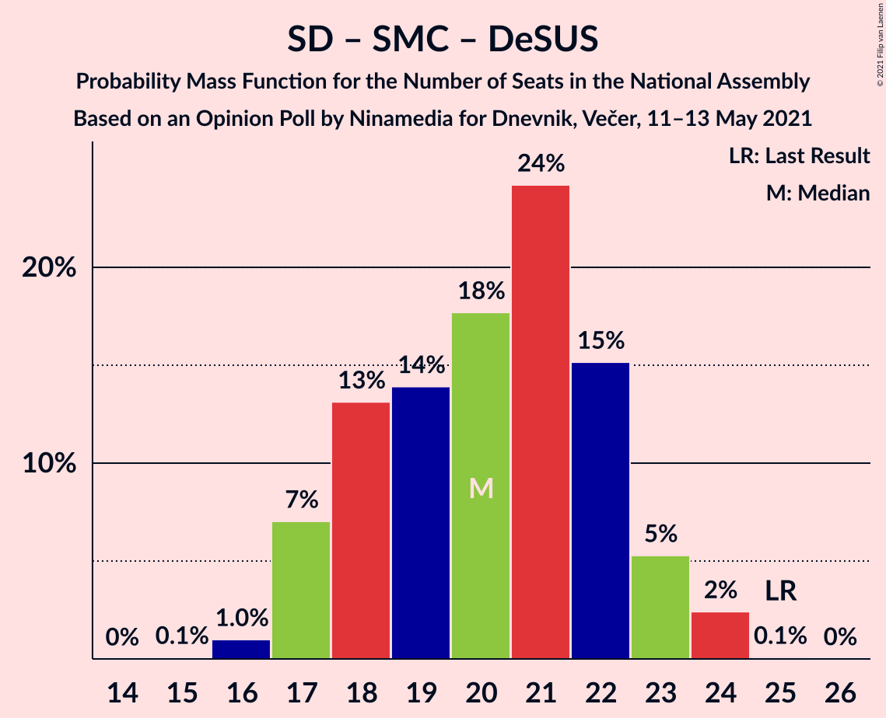

# Opinion Poll by Ninamedia for Dnevnik, Večer, 11–13 May 2021

<a href="#voting-intentions">Voting Intentions</a> | <a href="#seats">Seats</a> | <a href="#coalitions">Coalitions</a> | <a href="#technical-information">Technical Information</a>

## Voting Intentions

### Confidence Intervals

| Party | Last Result | Poll Result | 80% Confidence Interval | 90% Confidence Interval | 95% Confidence Interval | 99% Confidence Interval |
|:-----:|:-----------:|:-----------:|:-----------------------:|:-----------------------:|:-----------------------:|:-----------------------:|
| Slovenska demokratska stranka | 24.9% | 28.9% | 26.7–31.1% |26.1–31.8% |25.6–32.3% |24.6–33.4% |
| Socialni demokrati | 9.9% | 20.9% | 19.0–22.9% |18.5–23.5% |18.0–24.0% |17.1–25.0% |
| Lista Marjana Šarca | 12.6% | 13.1% | 11.6–14.9% |11.2–15.4% |10.8–15.9% |10.2–16.7% |
| Levica | 9.3% | 11.7% | 10.3–13.4% |9.9–13.9% |9.5–14.3% |8.9–15.2% |
| Nova Slovenija–Krščanski demokrati | 7.2% | 11.7% | 10.3–13.4% |9.9–13.9% |9.5–14.3% |8.9–15.2% |
| Stranka Alenke Bratušek | 5.1% | 5.9% | 4.9–7.2% |4.6–7.5% |4.3–7.9% |3.9–8.5% |
| Slovenska ljudska stranka | 2.6% | 3.0% | 2.3–4.0% |2.1–4.3% |2.0–4.6% |1.7–5.1% |
| Slovenska nacionalna stranka | 4.2% | 1.6% | 1.1–2.4% |1.0–2.6% |0.9–2.8% |0.7–3.2% |
| Stranka modernega centra | 9.7% | 1.0% | 0.7–1.7% |0.6–1.9% |0.5–2.1% |0.4–2.4% |
| Demokratična stranka upokojencev Slovenije | 4.9% | 0.9% | 0.5–1.5% |0.5–1.7% |0.4–1.9% |0.3–2.2% |

*Note:* The poll result column reflects the actual value used in the calculations. Published results may vary slightly, and in addition be rounded to fewer digits.

## Seats

### Confidence Intervals

| Party | Last Result | Median | 80% Confidence Interval | 90% Confidence Interval | 95% Confidence Interval | 99% Confidence Interval |
|:-----:|:-----------:|:------:|:-----------------------:|:-----------------------:|:-----------------------:|:-----------------------:|
| <a href="#slovenska-demokratska-stranka">Slovenska demokratska stranka</a> | 25 | 28 | 25–30 |25–30 |24–31 |23–33 |
| <a href="#socialni-demokrati">Socialni demokrati</a> | 10 | 20 | 18–22 |17–23 |17–24 |16–24 |
| <a href="#lista-marjana-šarca">Lista Marjana Šarca</a> | 13 | 13 | 11–14 |10–14 |10–15 |9–16 |
| <a href="#levica">Levica</a> | 9 | 11 | 9–13 |9–13 |9–14 |8–14 |
| <a href="#nova-slovenija–krščanski-demokrati">Nova Slovenija–Krščanski demokrati</a> | 7 | 11 | 10–12 |9–13 |9–13 |8–14 |
| <a href="#stranka-alenke-bratušek">Stranka Alenke Bratušek</a> | 5 | 5 | 4–7 |4–7 |4–7 |0–8 |
| <a href="#slovenska-ljudska-stranka">Slovenska ljudska stranka</a> | 0 | 0 | 0–3 |0–4 |0–4 |0–4 |
| <a href="#slovenska-nacionalna-stranka">Slovenska nacionalna stranka</a> | 4 | 0 | 0 |0 |0 |0 |
| <a href="#stranka-modernega-centra">Stranka modernega centra</a> | 10 | 0 | 0 |0 |0 |0 |
| <a href="#demokratična-stranka-upokojencev-slovenije">Demokratična stranka upokojencev Slovenije</a> | 5 | 0 | 0 |0 |0 |0 |

### Slovenska demokratska stranka

*For a full overview of the results for this party, see the [Slovenska demokratska stranka](party-slovenskademokratskastranka.html) page.*

| Number of Seats | Probability | Accumulated | Special Marks |
|:---------------:|:-----------:|:-----------:|:-------------:|
| 22 | 0% | 100% |  |
| 23 | 0.8% | 99.9% |  |
| 24 | 4% | 99.2% |  |
| 25 | 8% | 96% | Last Result |
| 26 | 14% | 88% |  |
| 27 | 22% | 73% |  |
| 28 | 18% | 52% | Median |
| 29 | 17% | 34% |  |
| 30 | 13% | 17% |  |
| 31 | 3% | 5% |  |
| 32 | 1.5% | 2% |  |
| 33 | 0.6% | 0.7% |  |
| 34 | 0.1% | 0.1% |  |
| 35 | 0% | 0% |  |

### Socialni demokrati

*For a full overview of the results for this party, see the [Socialni demokrati](party-socialnidemokrati.html) page.*

| Number of Seats | Probability | Accumulated | Special Marks |
|:---------------:|:-----------:|:-----------:|:-------------:|
| 10 | 0% | 100% | Last Result |
| 11 | 0% | 100% |  |
| 12 | 0% | 100% |  |
| 13 | 0% | 100% |  |
| 14 | 0% | 100% |  |
| 15 | 0.1% | 100% |  |
| 16 | 1.0% | 99.9% |  |
| 17 | 7% | 98.9% |  |
| 18 | 13% | 92% |  |
| 19 | 14% | 79% |  |
| 20 | 18% | 65% | Median |
| 21 | 24% | 47% |  |
| 22 | 15% | 23% |  |
| 23 | 5% | 8% |  |
| 24 | 2% | 3% |  |
| 25 | 0.1% | 0.1% |  |
| 26 | 0% | 0% |  |

### Lista Marjana Šarca

*For a full overview of the results for this party, see the [Lista Marjana Šarca](party-listamarjanašarca.html) page.*

| Number of Seats | Probability | Accumulated | Special Marks |
|:---------------:|:-----------:|:-----------:|:-------------:|
| 9 | 0.5% | 100% |  |
| 10 | 5% | 99.5% |  |
| 11 | 13% | 95% |  |
| 12 | 28% | 82% |  |
| 13 | 37% | 54% | Last Result, Median |
| 14 | 13% | 17% |  |
| 15 | 3% | 4% |  |
| 16 | 1.0% | 1.1% |  |
| 17 | 0.1% | 0.1% |  |
| 18 | 0% | 0% |  |

### Levica

*For a full overview of the results for this party, see the [Levica](party-levica.html) page.*

| Number of Seats | Probability | Accumulated | Special Marks |
|:---------------:|:-----------:|:-----------:|:-------------:|
| 7 | 0.1% | 100% |  |
| 8 | 0.8% | 99.9% |  |
| 9 | 11% | 99.1% | Last Result |
| 10 | 29% | 88% |  |
| 11 | 24% | 59% | Median |
| 12 | 24% | 36% |  |
| 13 | 9% | 12% |  |
| 14 | 3% | 3% |  |
| 15 | 0.3% | 0.3% |  |
| 16 | 0% | 0% |  |

### Nova Slovenija–Krščanski demokrati

*For a full overview of the results for this party, see the [Nova Slovenija–Krščanski demokrati](party-novaslovenija–krščanskidemokrati.html) page.*

| Number of Seats | Probability | Accumulated | Special Marks |
|:---------------:|:-----------:|:-----------:|:-------------:|
| 7 | 0.1% | 100% | Last Result |
| 8 | 1.3% | 99.9% |  |
| 9 | 5% | 98.6% |  |
| 10 | 25% | 93% |  |
| 11 | 34% | 69% | Median |
| 12 | 25% | 34% |  |
| 13 | 8% | 10% |  |
| 14 | 2% | 2% |  |
| 15 | 0.3% | 0.4% |  |
| 16 | 0% | 0% |  |

### Stranka Alenke Bratušek

*For a full overview of the results for this party, see the [Stranka Alenke Bratušek](party-strankaalenkebratušek.html) page.*

| Number of Seats | Probability | Accumulated | Special Marks |
|:---------------:|:-----------:|:-----------:|:-------------:|
| 0 | 0.5% | 100% |  |
| 1 | 0% | 99.5% |  |
| 2 | 0% | 99.5% |  |
| 3 | 0.2% | 99.5% |  |
| 4 | 21% | 99.3% |  |
| 5 | 44% | 78% | Last Result, Median |
| 6 | 23% | 34% |  |
| 7 | 10% | 11% |  |
| 8 | 1.1% | 1.2% |  |
| 9 | 0.1% | 0.1% |  |
| 10 | 0% | 0% |  |

### Slovenska ljudska stranka

*For a full overview of the results for this party, see the [Slovenska ljudska stranka](party-slovenskaljudskastranka.html) page.*

| Number of Seats | Probability | Accumulated | Special Marks |
|:---------------:|:-----------:|:-----------:|:-------------:|
| 0 | 89% | 100% | Last Result, Median |
| 1 | 0% | 11% |  |
| 2 | 0% | 11% |  |
| 3 | 4% | 11% |  |
| 4 | 7% | 7% |  |
| 5 | 0.3% | 0.3% |  |
| 6 | 0% | 0% |  |

### Slovenska nacionalna stranka

*For a full overview of the results for this party, see the [Slovenska nacionalna stranka](party-slovenskanacionalnastranka.html) page.*

| Number of Seats | Probability | Accumulated | Special Marks |
|:---------------:|:-----------:|:-----------:|:-------------:|
| 0 | 100% | 100% | Median |
| 1 | 0% | 0% |  |
| 2 | 0% | 0% |  |
| 3 | 0% | 0% |  |
| 4 | 0% | 0% | Last Result |

### Stranka modernega centra

*For a full overview of the results for this party, see the [Stranka modernega centra](party-strankamodernegacentra.html) page.*

| Number of Seats | Probability | Accumulated | Special Marks |
|:---------------:|:-----------:|:-----------:|:-------------:|
| 0 | 100% | 100% | Median |
| 1 | 0% | 0% |  |
| 2 | 0% | 0% |  |
| 3 | 0% | 0% |  |
| 4 | 0% | 0% |  |
| 5 | 0% | 0% |  |
| 6 | 0% | 0% |  |
| 7 | 0% | 0% |  |
| 8 | 0% | 0% |  |
| 9 | 0% | 0% |  |
| 10 | 0% | 0% | Last Result |

### Demokratična stranka upokojencev Slovenije

*For a full overview of the results for this party, see the [Demokratična stranka upokojencev Slovenije](party-demokratičnastrankaupokojencevslovenije.html) page.*

| Number of Seats | Probability | Accumulated | Special Marks |
|:---------------:|:-----------:|:-----------:|:-------------:|
| 0 | 100% | 100% | Median |
| 1 | 0% | 0% |  |
| 2 | 0% | 0% |  |
| 3 | 0% | 0% |  |
| 4 | 0% | 0% |  |
| 5 | 0% | 0% | Last Result |

## Coalitions

### Confidence Intervals

| Coalition | Last Result | Median | Majority? | 80% Confidence Interval | 90% Confidence Interval | 95% Confidence Interval | 99% Confidence Interval |
|:---------:|:-----------:|:------:|:---------:|:-----------------------:|:-----------------------:|:-----------------------:|:-----------------------:|
| Socialni demokrati – Lista Marjana Šarca – Nova Slovenija–Krščanski demokrati – Stranka Alenke Bratušek – Stranka modernega centra – Demokratična stranka upokojencev Slovenije | 50 | 49 | 89% | 45–52 | 45–52 | 45–52 | 44–54 |
| Socialni demokrati – Lista Marjana Šarca – Nova Slovenija–Krščanski demokrati – Demokratična stranka upokojencev Slovenije | 35 | 44 | 21% | 41–46 | 40–47 | 39–47 | 38–48 |
| Socialni demokrati – Lista Marjana Šarca – Nova Slovenija–Krščanski demokrati – Stranka modernega centra – Demokratična stranka upokojencev Slovenije | 45 | 44 | 21% | 41–46 | 40–47 | 39–47 | 38–48 |
| Socialni demokrati – Lista Marjana Šarca – Nova Slovenija–Krščanski demokrati | 30 | 44 | 21% | 41–46 | 40–47 | 39–47 | 38–48 |
| Socialni demokrati – Lista Marjana Šarca – Nova Slovenija–Krščanski demokrati – Stranka modernega centra | 40 | 44 | 21% | 41–46 | 40–47 | 39–47 | 38–48 |
| Slovenska demokratska stranka – Lista Marjana Šarca – Demokratična stranka upokojencev Slovenije | 43 | 40 | 0.6% | 38–43 | 37–43 | 37–44 | 36–46 |
| Slovenska demokratska stranka – Lista Marjana Šarca | 38 | 40 | 0.6% | 38–43 | 37–43 | 37–44 | 36–46 |
| Socialni demokrati – Lista Marjana Šarca – Stranka Alenke Bratušek – Stranka modernega centra – Demokratična stranka upokojencev Slovenije | 43 | 38 | 0% | 35–40 | 34–41 | 34–42 | 33–43 |
| Socialni demokrati – Lista Marjana Šarca – Demokratična stranka upokojencev Slovenije | 28 | 33 | 0% | 30–35 | 29–36 | 29–36 | 28–37 |
| Socialni demokrati – Lista Marjana Šarca – Stranka modernega centra – Demokratična stranka upokojencev Slovenije | 38 | 33 | 0% | 30–35 | 29–36 | 29–36 | 28–37 |
| Socialni demokrati – Lista Marjana Šarca | 23 | 33 | 0% | 30–35 | 29–36 | 29–36 | 28–37 |
| Socialni demokrati – Lista Marjana Šarca – Stranka modernega centra | 33 | 33 | 0% | 30–35 | 29–36 | 29–36 | 28–37 |
| Socialni demokrati – Stranka modernega centra – Demokratična stranka upokojencev Slovenije | 25 | 20 | 0% | 18–22 | 17–23 | 17–24 | 16–24 |

### Socialni demokrati – Lista Marjana Šarca – Nova Slovenija–Krščanski demokrati – Stranka Alenke Bratušek – Stranka modernega centra – Demokratična stranka upokojencev Slovenije

| Number of Seats | Probability | Accumulated | Special Marks |
|:---------------:|:-----------:|:-----------:|:-------------:|
| 42 | 0.1% | 100% |  |
| 43 | 0.3% | 99.9% |  |
| 44 | 2% | 99.6% |  |
| 45 | 8% | 98% |  |
| 46 | 6% | 89% | Majority |
| 47 | 7% | 83% |  |
| 48 | 14% | 76% |  |
| 49 | 15% | 62% | Median |
| 50 | 20% | 47% | Last Result |
| 51 | 15% | 27% |  |
| 52 | 10% | 12% |  |
| 53 | 2% | 2% |  |
| 54 | 0.5% | 0.6% |  |
| 55 | 0.1% | 0.1% |  |
| 56 | 0% | 0% |  |

### Socialni demokrati – Lista Marjana Šarca – Nova Slovenija–Krščanski demokrati – Demokratična stranka upokojencev Slovenije

| Number of Seats | Probability | Accumulated | Special Marks |
|:---------------:|:-----------:|:-----------:|:-------------:|
| 35 | 0% | 100% | Last Result |
| 36 | 0% | 100% |  |
| 37 | 0.1% | 100% |  |
| 38 | 0.5% | 99.9% |  |
| 39 | 2% | 99.4% |  |
| 40 | 6% | 97% |  |
| 41 | 12% | 91% |  |
| 42 | 4% | 79% |  |
| 43 | 14% | 75% |  |
| 44 | 17% | 61% | Median |
| 45 | 22% | 43% |  |
| 46 | 14% | 21% | Majority |
| 47 | 5% | 7% |  |
| 48 | 0.9% | 1.3% |  |
| 49 | 0.3% | 0.4% |  |
| 50 | 0.1% | 0.1% |  |
| 51 | 0% | 0% |  |

### Socialni demokrati – Lista Marjana Šarca – Nova Slovenija–Krščanski demokrati – Stranka modernega centra – Demokratična stranka upokojencev Slovenije

| Number of Seats | Probability | Accumulated | Special Marks |
|:---------------:|:-----------:|:-----------:|:-------------:|
| 37 | 0.1% | 100% |  |
| 38 | 0.5% | 99.9% |  |
| 39 | 2% | 99.4% |  |
| 40 | 6% | 97% |  |
| 41 | 12% | 91% |  |
| 42 | 4% | 79% |  |
| 43 | 14% | 75% |  |
| 44 | 17% | 61% | Median |
| 45 | 22% | 43% | Last Result |
| 46 | 14% | 21% | Majority |
| 47 | 5% | 7% |  |
| 48 | 0.9% | 1.3% |  |
| 49 | 0.3% | 0.4% |  |
| 50 | 0.1% | 0.1% |  |
| 51 | 0% | 0% |  |

### Socialni demokrati – Lista Marjana Šarca – Nova Slovenija–Krščanski demokrati

| Number of Seats | Probability | Accumulated | Special Marks |
|:---------------:|:-----------:|:-----------:|:-------------:|
| 30 | 0% | 100% | Last Result |
| 31 | 0% | 100% |  |
| 32 | 0% | 100% |  |
| 33 | 0% | 100% |  |
| 34 | 0% | 100% |  |
| 35 | 0% | 100% |  |
| 36 | 0% | 100% |  |
| 37 | 0.1% | 100% |  |
| 38 | 0.5% | 99.9% |  |
| 39 | 2% | 99.4% |  |
| 40 | 6% | 97% |  |
| 41 | 12% | 91% |  |
| 42 | 4% | 79% |  |
| 43 | 14% | 75% |  |
| 44 | 17% | 61% | Median |
| 45 | 22% | 43% |  |
| 46 | 14% | 21% | Majority |
| 47 | 5% | 7% |  |
| 48 | 0.9% | 1.3% |  |
| 49 | 0.3% | 0.4% |  |
| 50 | 0.1% | 0.1% |  |
| 51 | 0% | 0% |  |

### Socialni demokrati – Lista Marjana Šarca – Nova Slovenija–Krščanski demokrati – Stranka modernega centra

| Number of Seats | Probability | Accumulated | Special Marks |
|:---------------:|:-----------:|:-----------:|:-------------:|
| 37 | 0.1% | 100% |  |
| 38 | 0.5% | 99.9% |  |
| 39 | 2% | 99.4% |  |
| 40 | 6% | 97% | Last Result |
| 41 | 12% | 91% |  |
| 42 | 4% | 79% |  |
| 43 | 14% | 75% |  |
| 44 | 17% | 61% | Median |
| 45 | 22% | 43% |  |
| 46 | 14% | 21% | Majority |
| 47 | 5% | 7% |  |
| 48 | 0.9% | 1.3% |  |
| 49 | 0.3% | 0.4% |  |
| 50 | 0.1% | 0.1% |  |
| 51 | 0% | 0% |  |

### Slovenska demokratska stranka – Lista Marjana Šarca – Demokratična stranka upokojencev Slovenije

| Number of Seats | Probability | Accumulated | Special Marks |
|:---------------:|:-----------:|:-----------:|:-------------:|
| 34 | 0.1% | 100% |  |
| 35 | 0.4% | 99.9% |  |
| 36 | 2% | 99.5% |  |
| 37 | 5% | 98% |  |
| 38 | 17% | 93% |  |
| 39 | 14% | 76% |  |
| 40 | 19% | 62% |  |
| 41 | 13% | 42% | Median |
| 42 | 17% | 29% |  |
| 43 | 8% | 12% | Last Result |
| 44 | 3% | 4% |  |
| 45 | 1.1% | 2% |  |
| 46 | 0.5% | 0.6% | Majority |
| 47 | 0.1% | 0.1% |  |
| 48 | 0% | 0% |  |

### Slovenska demokratska stranka – Lista Marjana Šarca

| Number of Seats | Probability | Accumulated | Special Marks |
|:---------------:|:-----------:|:-----------:|:-------------:|
| 34 | 0.1% | 100% |  |
| 35 | 0.4% | 99.9% |  |
| 36 | 2% | 99.5% |  |
| 37 | 5% | 98% |  |
| 38 | 17% | 93% | Last Result |
| 39 | 14% | 76% |  |
| 40 | 19% | 62% |  |
| 41 | 13% | 42% | Median |
| 42 | 17% | 29% |  |
| 43 | 8% | 12% |  |
| 44 | 3% | 4% |  |
| 45 | 1.1% | 2% |  |
| 46 | 0.5% | 0.6% | Majority |
| 47 | 0.1% | 0.1% |  |
| 48 | 0% | 0% |  |

### Socialni demokrati – Lista Marjana Šarca – Stranka Alenke Bratušek – Stranka modernega centra – Demokratična stranka upokojencev Slovenije

| Number of Seats | Probability | Accumulated | Special Marks |
|:---------------:|:-----------:|:-----------:|:-------------:|
| 31 | 0.1% | 100% |  |
| 32 | 0.3% | 99.9% |  |
| 33 | 2% | 99.7% |  |
| 34 | 8% | 98% |  |
| 35 | 4% | 90% |  |
| 36 | 10% | 86% |  |
| 37 | 16% | 76% |  |
| 38 | 16% | 60% | Median |
| 39 | 19% | 44% |  |
| 40 | 17% | 25% |  |
| 41 | 3% | 7% |  |
| 42 | 4% | 4% |  |
| 43 | 0.5% | 0.7% | Last Result |
| 44 | 0.1% | 0.1% |  |
| 45 | 0% | 0% |  |

### Socialni demokrati – Lista Marjana Šarca – Demokratična stranka upokojencev Slovenije

| Number of Seats | Probability | Accumulated | Special Marks |
|:---------------:|:-----------:|:-----------:|:-------------:|
| 27 | 0.3% | 100% |  |
| 28 | 2% | 99.7% | Last Result |
| 29 | 5% | 98% |  |
| 30 | 8% | 92% |  |
| 31 | 10% | 84% |  |
| 32 | 16% | 74% |  |
| 33 | 20% | 58% | Median |
| 34 | 21% | 38% |  |
| 35 | 13% | 18% |  |
| 36 | 4% | 5% |  |
| 37 | 0.7% | 1.0% |  |
| 38 | 0.1% | 0.2% |  |
| 39 | 0.1% | 0.1% |  |
| 40 | 0% | 0% |  |

### Socialni demokrati – Lista Marjana Šarca – Stranka modernega centra – Demokratična stranka upokojencev Slovenije

| Number of Seats | Probability | Accumulated | Special Marks |
|:---------------:|:-----------:|:-----------:|:-------------:|
| 27 | 0.3% | 100% |  |
| 28 | 2% | 99.7% |  |
| 29 | 5% | 98% |  |
| 30 | 8% | 92% |  |
| 31 | 10% | 84% |  |
| 32 | 16% | 74% |  |
| 33 | 20% | 58% | Median |
| 34 | 21% | 38% |  |
| 35 | 13% | 18% |  |
| 36 | 4% | 5% |  |
| 37 | 0.7% | 1.0% |  |
| 38 | 0.1% | 0.2% | Last Result |
| 39 | 0.1% | 0.1% |  |
| 40 | 0% | 0% |  |

### Socialni demokrati – Lista Marjana Šarca

| Number of Seats | Probability | Accumulated | Special Marks |
|:---------------:|:-----------:|:-----------:|:-------------:|
| 23 | 0% | 100% | Last Result |
| 24 | 0% | 100% |  |
| 25 | 0% | 100% |  |
| 26 | 0% | 100% |  |
| 27 | 0.3% | 100% |  |
| 28 | 2% | 99.7% |  |
| 29 | 5% | 98% |  |
| 30 | 8% | 92% |  |
| 31 | 10% | 84% |  |
| 32 | 16% | 74% |  |
| 33 | 20% | 58% | Median |
| 34 | 21% | 38% |  |
| 35 | 13% | 18% |  |
| 36 | 4% | 5% |  |
| 37 | 0.7% | 1.0% |  |
| 38 | 0.1% | 0.2% |  |
| 39 | 0.1% | 0.1% |  |
| 40 | 0% | 0% |  |

### Socialni demokrati – Lista Marjana Šarca – Stranka modernega centra

| Number of Seats | Probability | Accumulated | Special Marks |
|:---------------:|:-----------:|:-----------:|:-------------:|
| 27 | 0.3% | 100% |  |
| 28 | 2% | 99.7% |  |
| 29 | 5% | 98% |  |
| 30 | 8% | 92% |  |
| 31 | 10% | 84% |  |
| 32 | 16% | 74% |  |
| 33 | 20% | 58% | Last Result, Median |
| 34 | 21% | 38% |  |
| 35 | 13% | 18% |  |
| 36 | 4% | 5% |  |
| 37 | 0.7% | 1.0% |  |
| 38 | 0.1% | 0.2% |  |
| 39 | 0.1% | 0.1% |  |
| 40 | 0% | 0% |  |

### Socialni demokrati – Stranka modernega centra – Demokratična stranka upokojencev Slovenije

| Number of Seats | Probability | Accumulated | Special Marks |
|:---------------:|:-----------:|:-----------:|:-------------:|
| 15 | 0.1% | 100% |  |
| 16 | 1.0% | 99.9% |  |
| 17 | 7% | 98.9% |  |
| 18 | 13% | 92% |  |
| 19 | 14% | 79% |  |
| 20 | 18% | 65% | Median |
| 21 | 24% | 47% |  |
| 22 | 15% | 23% |  |
| 23 | 5% | 8% |  |
| 24 | 2% | 3% |  |
| 25 | 0.1% | 0.1% | Last Result |
| 26 | 0% | 0% |  |

## Technical Information

### Opinion Poll

+ **Polling firm:** Ninamedia
+ **Commissioner(s):** Dnevnik, Večer
+ **Fieldwork period:** 11–13 May 2021

### Calculations

+ **Sample size:** 700
+ **Simulations done:** 1,048,576
+ **Error estimate:** 1.68%

