# Opinion Poll by Parsifal for Nova 24TV, 10–13 May 2021

<a href="#voting-intentions">Voting Intentions</a> | <a href="#seats">Seats</a> | <a href="#coalitions">Coalitions</a> | <a href="#technical-information">Technical Information</a>

## Voting Intentions

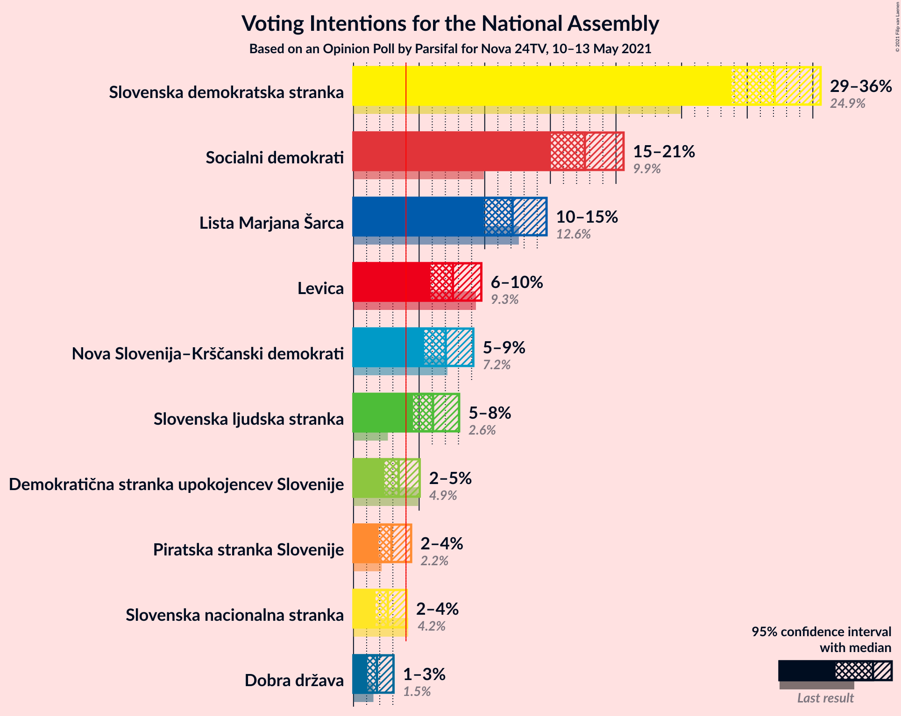

### Confidence Intervals

| Party | Last Result | Poll Result | 80% Confidence Interval | 90% Confidence Interval | 95% Confidence Interval | 99% Confidence Interval |
|:-----:|:-----------:|:-----------:|:-----------------------:|:-----------------------:|:-----------------------:|:-----------------------:|
| Slovenska demokratska stranka | 24.9% | 32.1% | 29.9–34.4% |29.3–35.0% |28.8–35.6% |27.8–36.7% |
| Socialni demokrati | 9.9% | 17.6% | 15.9–19.6% |15.4–20.1% |15.0–20.6% |14.2–21.5% |
| Lista Marjana Šarca | 12.6% | 12.1% | 10.7–13.8% |10.3–14.3% |9.9–14.7% |9.3–15.5% |
| Levica | 9.3% | 7.6% | 6.4–9.0% |6.1–9.4% |5.9–9.7% |5.4–10.5% |
| Nova Slovenija–Krščanski demokrati | 7.2% | 7.0% | 5.9–8.4% |5.6–8.8% |5.4–9.1% |4.9–9.8% |
| Slovenska ljudska stranka | 2.6% | 6.1% | 5.1–7.4% |4.8–7.7% |4.5–8.0% |4.1–8.7% |
| Demokratična stranka upokojencev Slovenije | 4.9% | 3.4% | 2.7–4.5% |2.5–4.8% |2.3–5.0% |2.0–5.6% |
| Piratska stranka Slovenije | 2.2% | 2.9% | 2.2–3.9% |2.1–4.1% |1.9–4.4% |1.6–4.9% |
| Slovenska nacionalna stranka | 4.2% | 2.6% | 2.0–3.6% |1.8–3.8% |1.7–4.1% |1.4–4.6% |
| Dobra država | 1.5% | 1.8% | 1.3–2.6% |1.2–2.8% |1.1–3.0% |0.9–3.5% |

*Note:* The poll result column reflects the actual value used in the calculations. Published results may vary slightly, and in addition be rounded to fewer digits.

## Seats

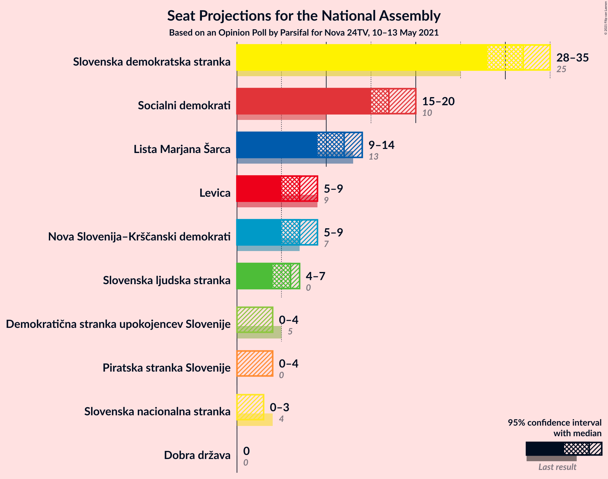

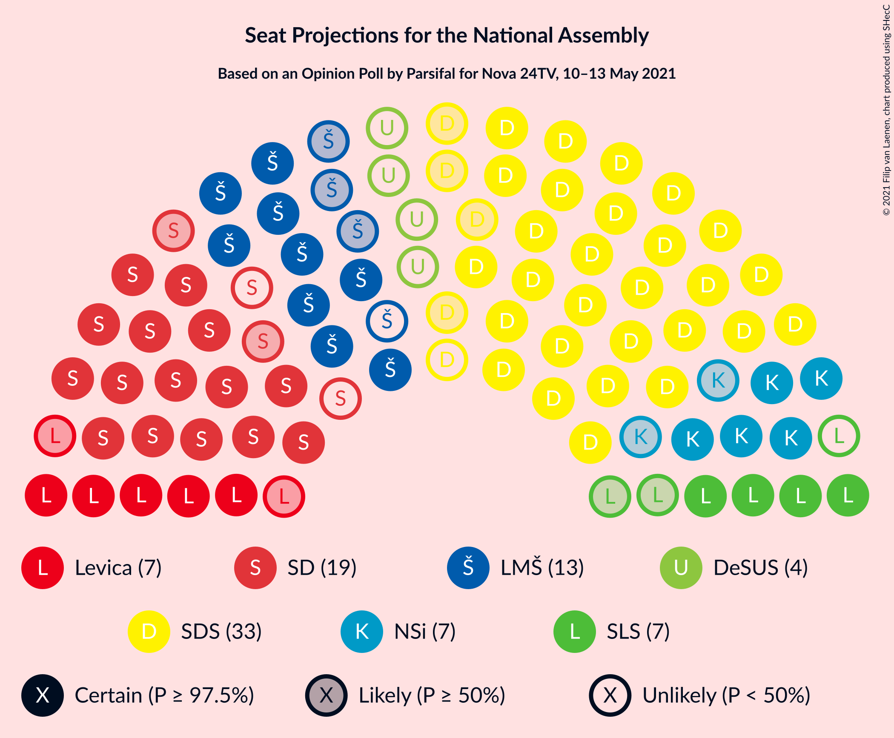

### Confidence Intervals

| Party | Last Result | Median | 80% Confidence Interval | 90% Confidence Interval | 95% Confidence Interval | 99% Confidence Interval |
|:-----:|:-----------:|:------:|:-----------------------:|:-----------------------:|:-----------------------:|:-----------------------:|
| <a href="#slovenska-demokratska-stranka">Slovenska demokratska stranka</a> | 25 | 32 | 29–34 |28–35 |28–35 |27–36 |
| <a href="#socialni-demokrati">Socialni demokrati</a> | 10 | 17 | 15–19 |15–20 |15–20 |14–21 |
| <a href="#lista-marjana-šarca">Lista Marjana Šarca</a> | 13 | 12 | 10–13 |10–14 |9–14 |9–15 |
| <a href="#levica">Levica</a> | 9 | 7 | 6–9 |6–9 |5–9 |5–10 |
| <a href="#nova-slovenija–krščanski-demokrati">Nova Slovenija–Krščanski demokrati</a> | 7 | 7 | 5–8 |5–8 |5–9 |4–9 |
| <a href="#slovenska-ljudska-stranka">Slovenska ljudska stranka</a> | 0 | 6 | 5–7 |4–7 |4–7 |4–8 |
| <a href="#demokratična-stranka-upokojencev-slovenije">Demokratična stranka upokojencev Slovenije</a> | 5 | 0 | 0–4 |0–4 |0–4 |0–5 |
| <a href="#piratska-stranka-slovenije">Piratska stranka Slovenije</a> | 0 | 0 | 0 |0–4 |0–4 |0–4 |
| <a href="#slovenska-nacionalna-stranka">Slovenska nacionalna stranka</a> | 4 | 0 | 0 |0 |0–3 |0–4 |
| <a href="#dobra-država">Dobra država</a> | 0 | 0 | 0 |0 |0 |0 |

### Slovenska demokratska stranka

*For a full overview of the results for this party, see the [Slovenska demokratska stranka](party-slovenskademokratskastranka.html) page.*

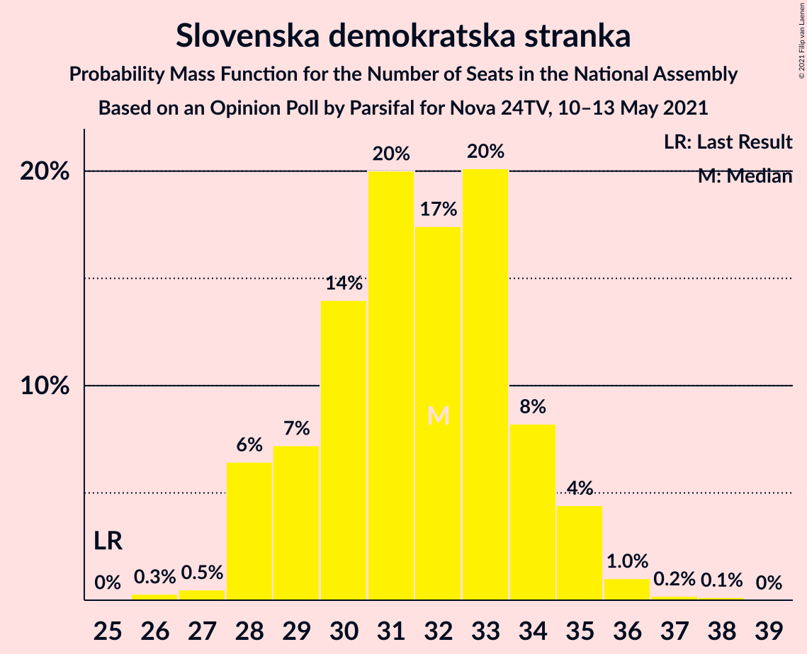

| Number of Seats | Probability | Accumulated | Special Marks |
|:---------------:|:-----------:|:-----------:|:-------------:|
| 25 | 0% | 100% | Last Result |
| 26 | 0.3% | 100% |  |
| 27 | 0.5% | 99.7% |  |
| 28 | 6% | 99.2% |  |
| 29 | 7% | 93% |  |
| 30 | 14% | 86% |  |
| 31 | 20% | 72% |  |
| 32 | 17% | 52% | Median |
| 33 | 20% | 34% |  |
| 34 | 8% | 14% |  |
| 35 | 4% | 6% |  |
| 36 | 1.0% | 1.4% |  |
| 37 | 0.2% | 0.3% |  |
| 38 | 0.1% | 0.1% |  |
| 39 | 0% | 0% |  |

### Socialni demokrati

*For a full overview of the results for this party, see the [Socialni demokrati](party-socialnidemokrati.html) page.*

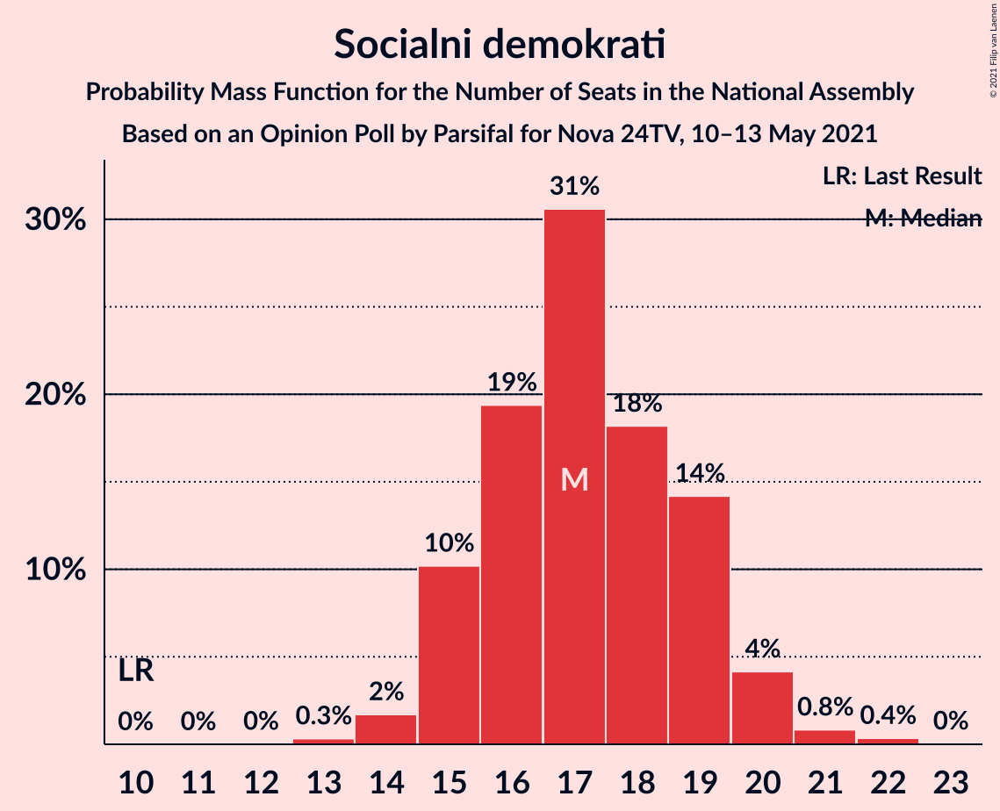

| Number of Seats | Probability | Accumulated | Special Marks |
|:---------------:|:-----------:|:-----------:|:-------------:|
| 10 | 0% | 100% | Last Result |
| 11 | 0% | 100% |  |
| 12 | 0% | 100% |  |
| 13 | 0.3% | 100% |  |
| 14 | 2% | 99.6% |  |
| 15 | 10% | 98% |  |
| 16 | 19% | 88% |  |
| 17 | 31% | 68% | Median |
| 18 | 18% | 38% |  |
| 19 | 14% | 20% |  |
| 20 | 4% | 5% |  |
| 21 | 0.8% | 1.2% |  |
| 22 | 0.4% | 0.4% |  |
| 23 | 0% | 0% |  |

### Lista Marjana Šarca

*For a full overview of the results for this party, see the [Lista Marjana Šarca](party-listamarjanašarca.html) page.*

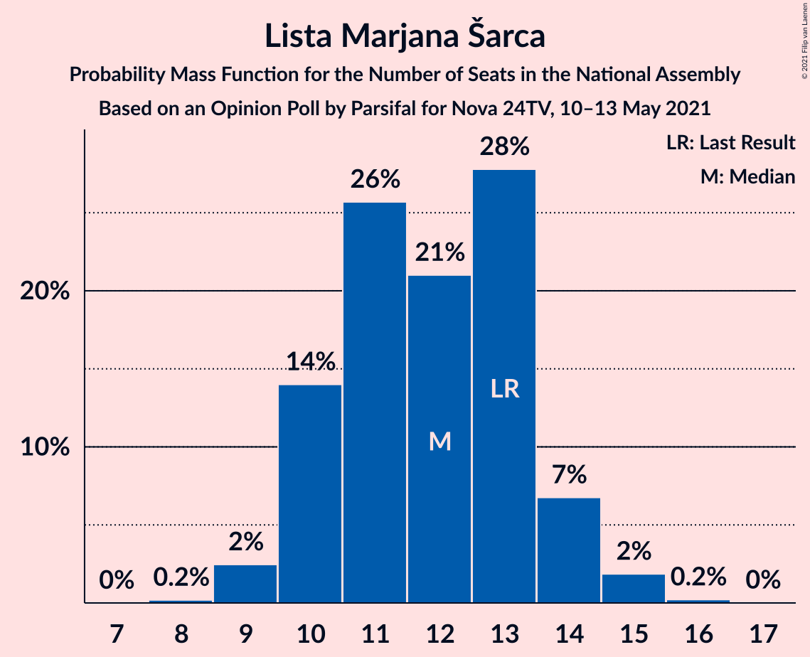

| Number of Seats | Probability | Accumulated | Special Marks |
|:---------------:|:-----------:|:-----------:|:-------------:|
| 8 | 0.2% | 100% |  |
| 9 | 2% | 99.8% |  |
| 10 | 14% | 97% |  |
| 11 | 26% | 83% |  |
| 12 | 21% | 58% | Median |
| 13 | 28% | 37% | Last Result |
| 14 | 7% | 9% |  |
| 15 | 2% | 2% |  |
| 16 | 0.2% | 0.2% |  |
| 17 | 0% | 0% |  |

### Levica

*For a full overview of the results for this party, see the [Levica](party-levica.html) page.*

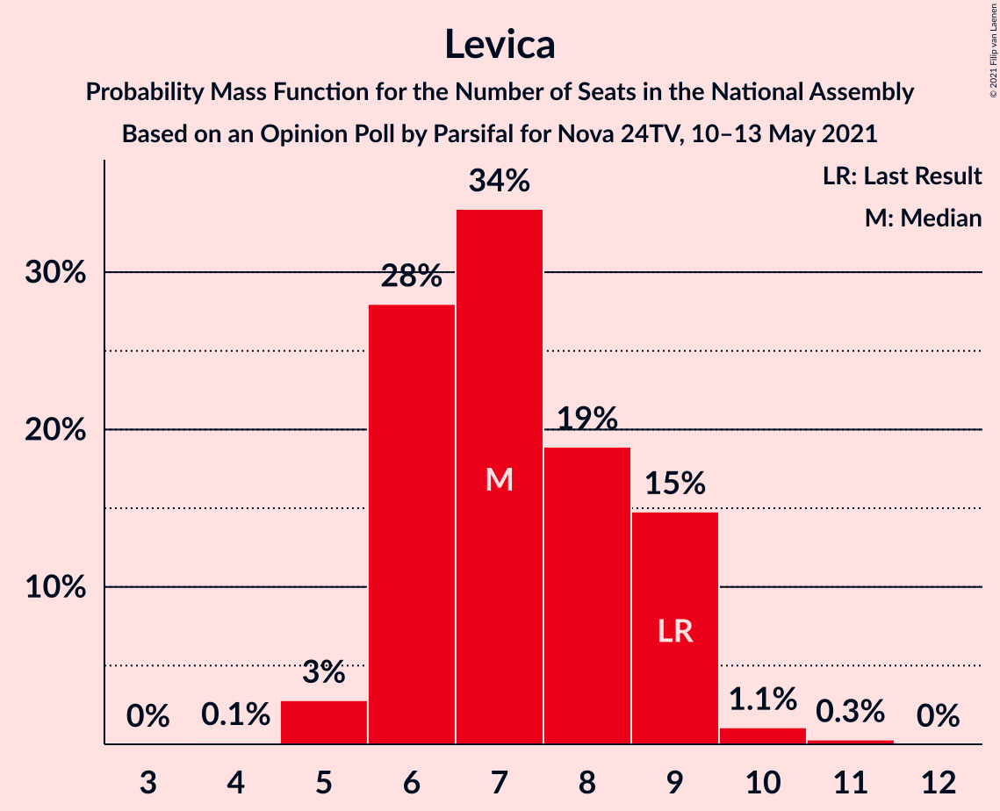

| Number of Seats | Probability | Accumulated | Special Marks |
|:---------------:|:-----------:|:-----------:|:-------------:|
| 4 | 0.1% | 100% |  |
| 5 | 3% | 99.9% |  |
| 6 | 28% | 97% |  |
| 7 | 34% | 69% | Median |
| 8 | 19% | 35% |  |
| 9 | 15% | 16% | Last Result |
| 10 | 1.1% | 1.4% |  |
| 11 | 0.3% | 0.3% |  |
| 12 | 0% | 0% |  |

### Nova Slovenija–Krščanski demokrati

*For a full overview of the results for this party, see the [Nova Slovenija–Krščanski demokrati](party-novaslovenija–krščanskidemokrati.html) page.*

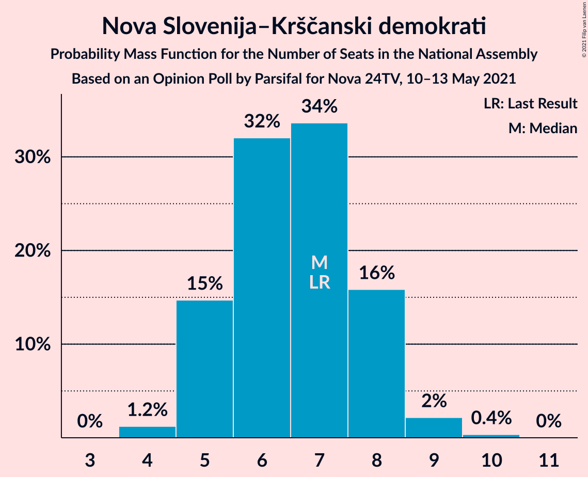

| Number of Seats | Probability | Accumulated | Special Marks |
|:---------------:|:-----------:|:-----------:|:-------------:|
| 4 | 1.2% | 100% |  |
| 5 | 15% | 98.8% |  |
| 6 | 32% | 84% |  |
| 7 | 34% | 52% | Last Result, Median |
| 8 | 16% | 18% |  |
| 9 | 2% | 3% |  |
| 10 | 0.4% | 0.4% |  |
| 11 | 0% | 0% |  |

### Slovenska ljudska stranka

*For a full overview of the results for this party, see the [Slovenska ljudska stranka](party-slovenskaljudskastranka.html) page.*

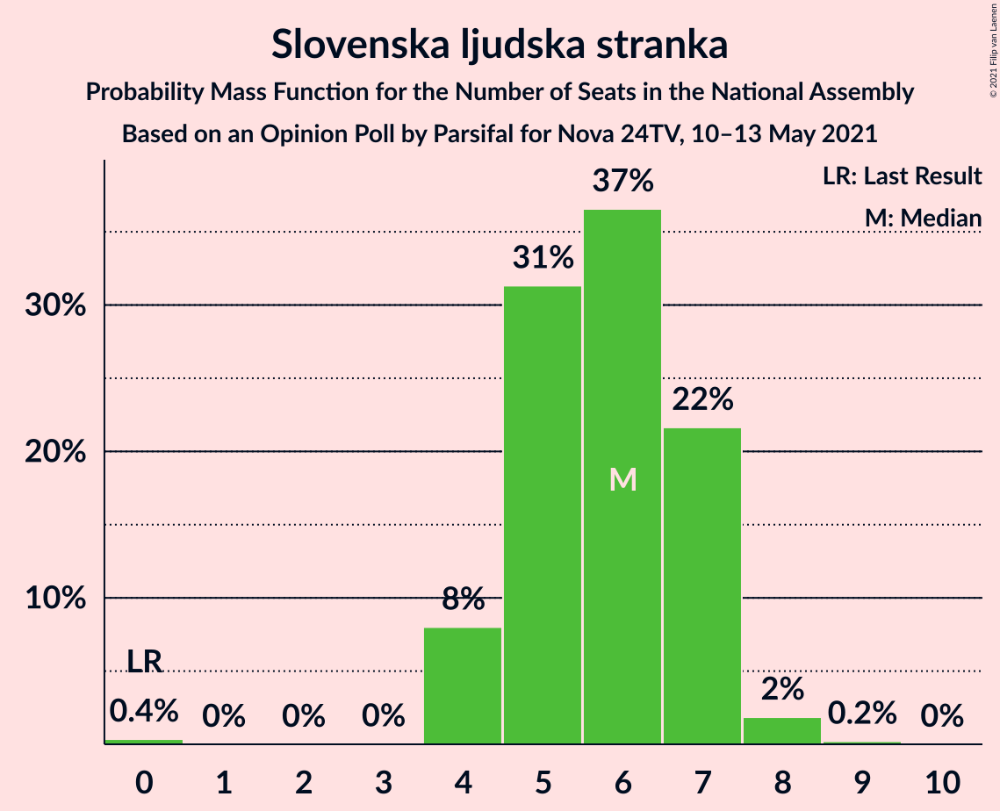

| Number of Seats | Probability | Accumulated | Special Marks |
|:---------------:|:-----------:|:-----------:|:-------------:|
| 0 | 0.4% | 100% | Last Result |
| 1 | 0% | 99.6% |  |
| 2 | 0% | 99.6% |  |
| 3 | 0% | 99.6% |  |
| 4 | 8% | 99.6% |  |
| 5 | 31% | 92% |  |
| 6 | 37% | 60% | Median |
| 7 | 22% | 24% |  |
| 8 | 2% | 2% |  |
| 9 | 0.2% | 0.2% |  |
| 10 | 0% | 0% |  |

### Demokratična stranka upokojencev Slovenije

*For a full overview of the results for this party, see the [Demokratična stranka upokojencev Slovenije](party-demokratičnastrankaupokojencevslovenije.html) page.*

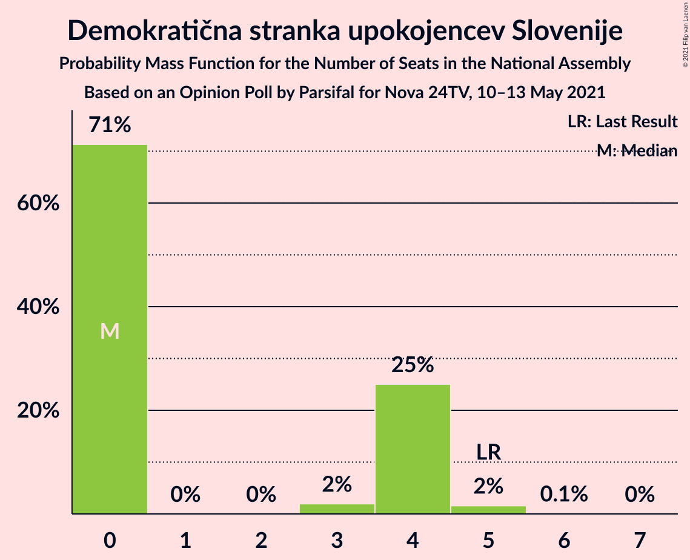

| Number of Seats | Probability | Accumulated | Special Marks |
|:---------------:|:-----------:|:-----------:|:-------------:|
| 0 | 71% | 100% | Median |
| 1 | 0% | 29% |  |
| 2 | 0% | 29% |  |
| 3 | 2% | 29% |  |
| 4 | 25% | 27% |  |
| 5 | 2% | 2% | Last Result |
| 6 | 0.1% | 0.1% |  |
| 7 | 0% | 0% |  |

### Piratska stranka Slovenije

*For a full overview of the results for this party, see the [Piratska stranka Slovenije](party-piratskastrankaslovenije.html) page.*

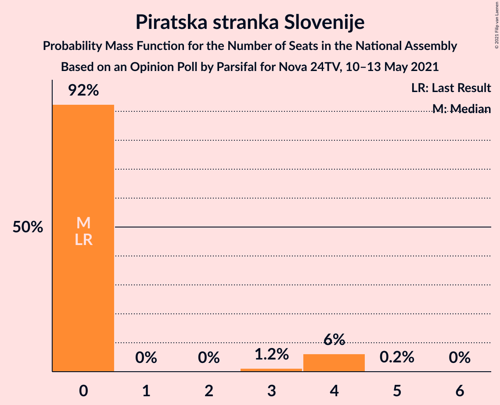

| Number of Seats | Probability | Accumulated | Special Marks |
|:---------------:|:-----------:|:-----------:|:-------------:|
| 0 | 92% | 100% | Last Result, Median |
| 1 | 0% | 8% |  |
| 2 | 0% | 8% |  |
| 3 | 1.2% | 8% |  |
| 4 | 6% | 6% |  |
| 5 | 0.2% | 0.2% |  |
| 6 | 0% | 0% |  |

### Slovenska nacionalna stranka

*For a full overview of the results for this party, see the [Slovenska nacionalna stranka](party-slovenskanacionalnastranka.html) page.*

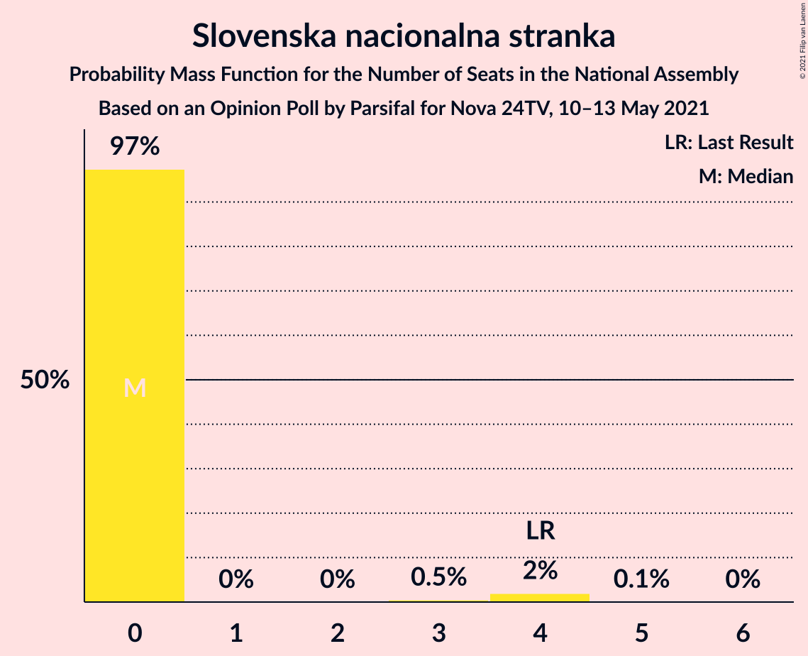

| Number of Seats | Probability | Accumulated | Special Marks |
|:---------------:|:-----------:|:-----------:|:-------------:|
| 0 | 97% | 100% | Median |
| 1 | 0% | 3% |  |
| 2 | 0% | 3% |  |
| 3 | 0.5% | 3% |  |
| 4 | 2% | 2% | Last Result |
| 5 | 0.1% | 0.1% |  |
| 6 | 0% | 0% |  |

### Dobra država

*For a full overview of the results for this party, see the [Dobra država](party-dobradržava.html) page.*

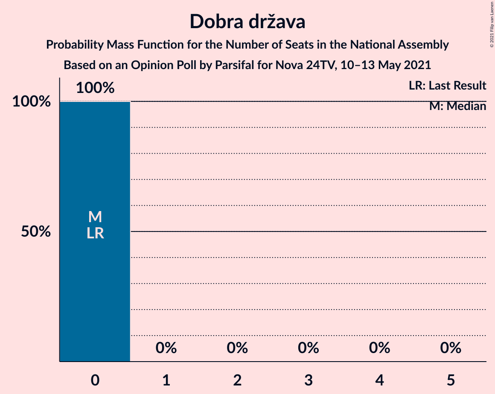

| Number of Seats | Probability | Accumulated | Special Marks |
|:---------------:|:-----------:|:-----------:|:-------------:|
| 0 | 100% | 100% | Last Result, Median |

## Coalitions

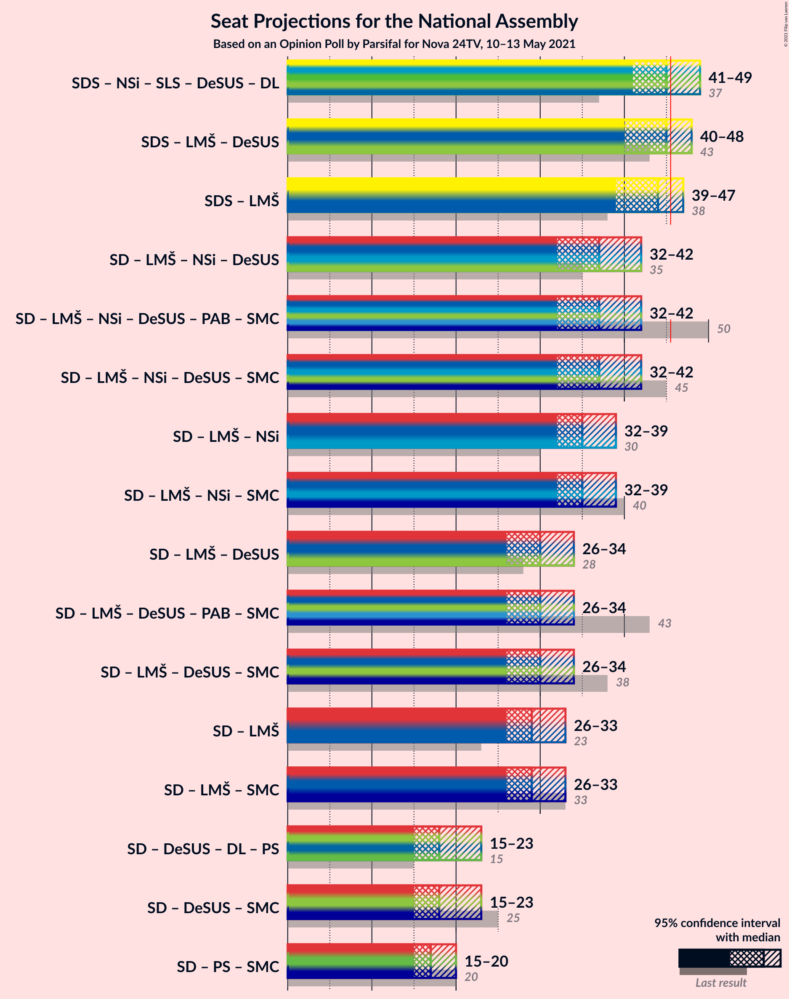

### Confidence Intervals

| Coalition | Last Result | Median | Majority? | 80% Confidence Interval | 90% Confidence Interval | 95% Confidence Interval | 99% Confidence Interval |
|:---------:|:-----------:|:------:|:---------:|:-----------------------:|:-----------------------:|:-----------------------:|:-----------------------:|
| Slovenska demokratska stranka – Lista Marjana Šarca – Demokratična stranka upokojencev Slovenije | 43 | 45 | 30% | 42–47 | 41–48 | 40–48 | 39–50 |
| Slovenska demokratska stranka – Lista Marjana Šarca | 38 | 44 | 18% | 41–46 | 40–46 | 39–47 | 38–49 |
| Socialni demokrati – Lista Marjana Šarca – Nova Slovenija–Krščanski demokrati – Demokratična stranka upokojencev Slovenije | 35 | 37 | 0% | 34–39 | 33–41 | 32–42 | 31–42 |
| Socialni demokrati – Lista Marjana Šarca – Nova Slovenija–Krščanski demokrati | 30 | 35 | 0% | 33–38 | 32–39 | 32–39 | 31–41 |
| Socialni demokrati – Lista Marjana Šarca – Demokratična stranka upokojencev Slovenije | 28 | 30 | 0% | 27–34 | 27–34 | 26–34 | 25–36 |
| Socialni demokrati – Lista Marjana Šarca | 23 | 29 | 0% | 27–31 | 26–32 | 26–33 | 24–34 |

### Slovenska demokratska stranka – Lista Marjana Šarca – Demokratična stranka upokojencev Slovenije

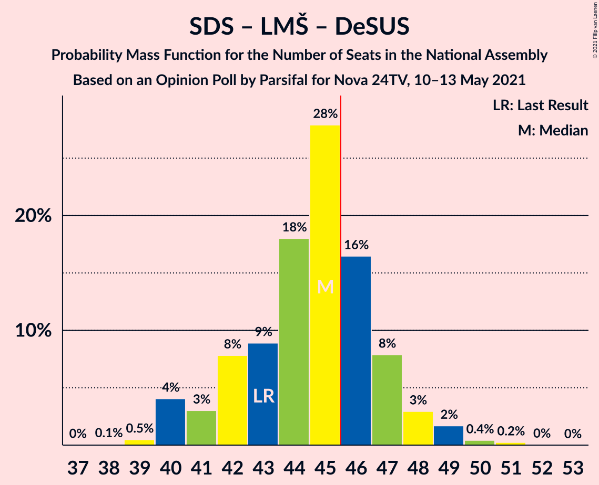

| Number of Seats | Probability | Accumulated | Special Marks |
|:---------------:|:-----------:|:-----------:|:-------------:|
| 38 | 0.1% | 100% |  |
| 39 | 0.5% | 99.9% |  |
| 40 | 4% | 99.4% |  |
| 41 | 3% | 95% |  |
| 42 | 8% | 92% |  |
| 43 | 9% | 85% | Last Result |
| 44 | 18% | 76% | Median |
| 45 | 28% | 58% |  |
| 46 | 16% | 30% | Majority |
| 47 | 8% | 13% |  |
| 48 | 3% | 5% |  |
| 49 | 2% | 2% |  |
| 50 | 0.4% | 0.7% |  |
| 51 | 0.2% | 0.3% |  |
| 52 | 0% | 0.1% |  |
| 53 | 0% | 0% |  |

### Slovenska demokratska stranka – Lista Marjana Šarca

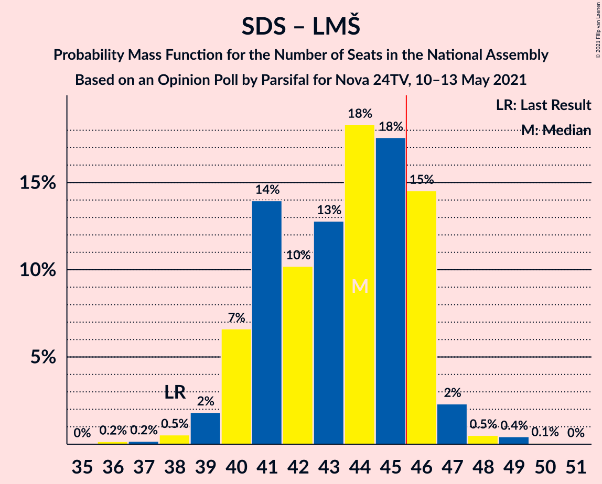

| Number of Seats | Probability | Accumulated | Special Marks |
|:---------------:|:-----------:|:-----------:|:-------------:|
| 36 | 0.2% | 100% |  |
| 37 | 0.2% | 99.8% |  |
| 38 | 0.5% | 99.7% | Last Result |
| 39 | 2% | 99.1% |  |
| 40 | 7% | 97% |  |
| 41 | 14% | 91% |  |
| 42 | 10% | 77% |  |
| 43 | 13% | 67% |  |
| 44 | 18% | 54% | Median |
| 45 | 18% | 35% |  |
| 46 | 15% | 18% | Majority |
| 47 | 2% | 3% |  |
| 48 | 0.5% | 1.0% |  |
| 49 | 0.4% | 0.5% |  |
| 50 | 0.1% | 0.1% |  |
| 51 | 0% | 0% |  |

### Socialni demokrati – Lista Marjana Šarca – Nova Slovenija–Krščanski demokrati – Demokratična stranka upokojencev Slovenije

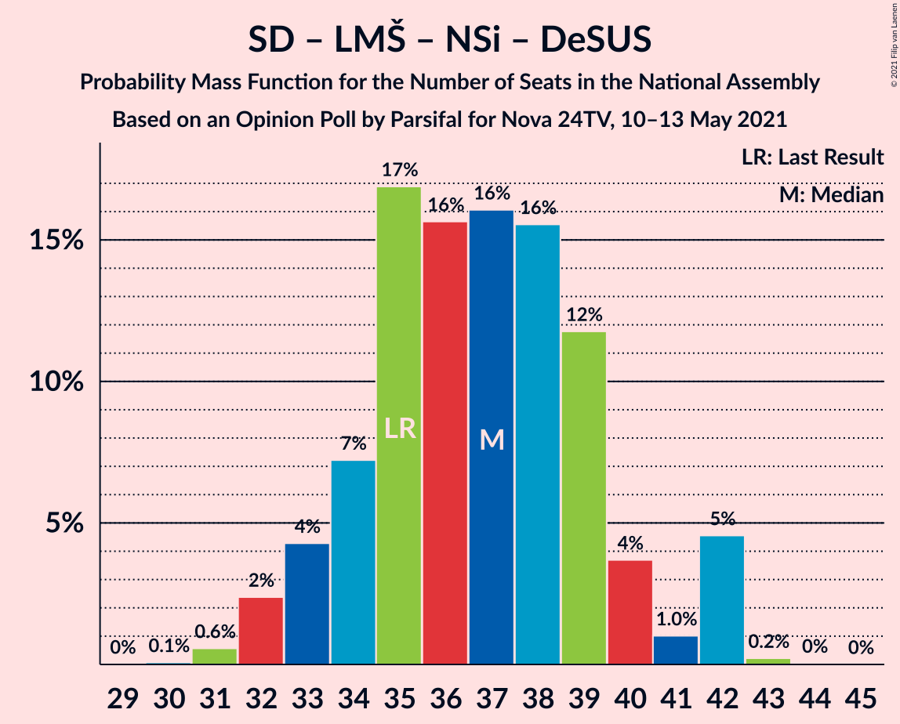

| Number of Seats | Probability | Accumulated | Special Marks |
|:---------------:|:-----------:|:-----------:|:-------------:|
| 30 | 0.1% | 100% |  |
| 31 | 0.6% | 99.9% |  |
| 32 | 2% | 99.3% |  |
| 33 | 4% | 97% |  |
| 34 | 7% | 93% |  |
| 35 | 17% | 85% | Last Result |
| 36 | 16% | 69% | Median |
| 37 | 16% | 53% |  |
| 38 | 16% | 37% |  |
| 39 | 12% | 21% |  |
| 40 | 4% | 10% |  |
| 41 | 1.0% | 6% |  |
| 42 | 5% | 5% |  |
| 43 | 0.2% | 0.3% |  |
| 44 | 0% | 0.1% |  |
| 45 | 0% | 0% |  |

### Socialni demokrati – Lista Marjana Šarca – Nova Slovenija–Krščanski demokrati

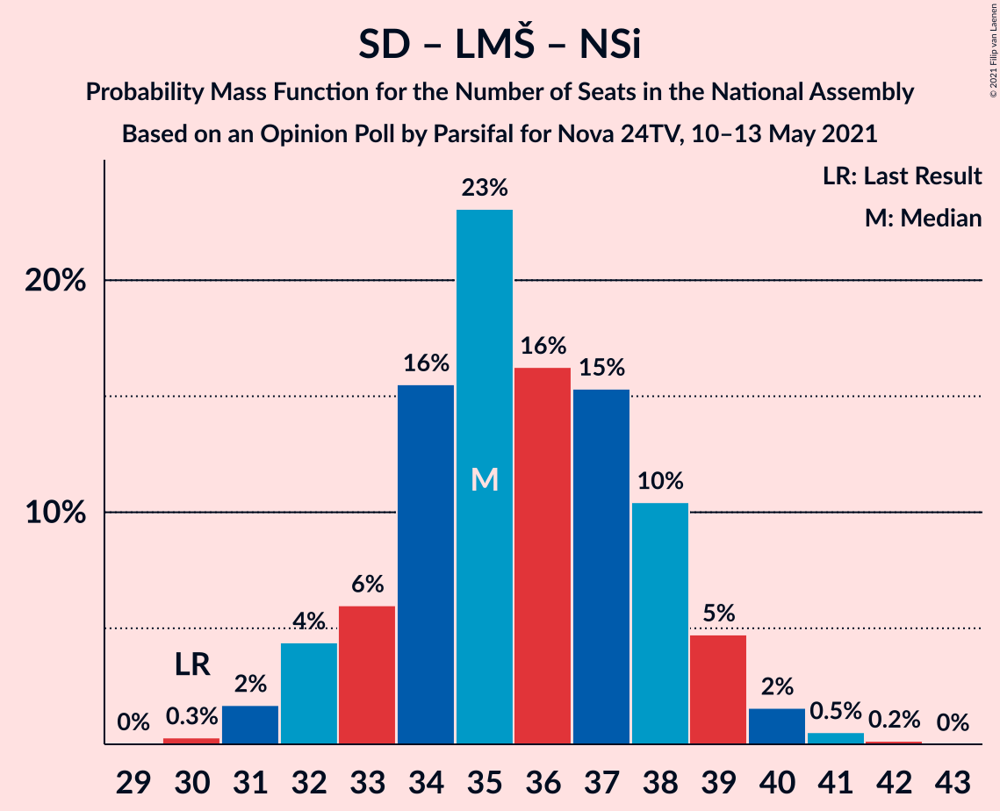

| Number of Seats | Probability | Accumulated | Special Marks |
|:---------------:|:-----------:|:-----------:|:-------------:|
| 30 | 0.3% | 100% | Last Result |
| 31 | 2% | 99.7% |  |
| 32 | 4% | 98% |  |
| 33 | 6% | 94% |  |
| 34 | 16% | 88% |  |
| 35 | 23% | 72% |  |
| 36 | 16% | 49% | Median |
| 37 | 15% | 33% |  |
| 38 | 10% | 17% |  |
| 39 | 5% | 7% |  |
| 40 | 2% | 2% |  |
| 41 | 0.5% | 0.7% |  |
| 42 | 0.2% | 0.2% |  |
| 43 | 0% | 0% |  |

### Socialni demokrati – Lista Marjana Šarca – Demokratična stranka upokojencev Slovenije

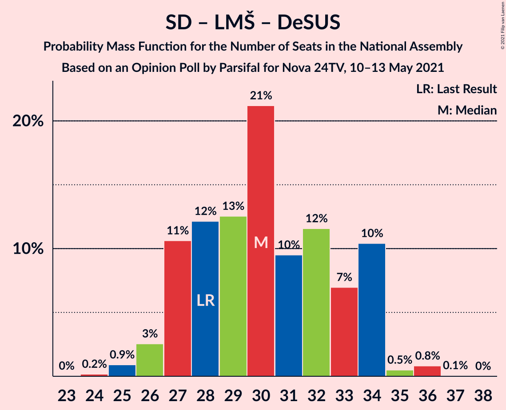

| Number of Seats | Probability | Accumulated | Special Marks |
|:---------------:|:-----------:|:-----------:|:-------------:|
| 24 | 0.2% | 100% |  |
| 25 | 0.9% | 99.8% |  |
| 26 | 3% | 98.9% |  |
| 27 | 11% | 96% |  |
| 28 | 12% | 86% | Last Result |
| 29 | 13% | 74% | Median |
| 30 | 21% | 61% |  |
| 31 | 10% | 40% |  |
| 32 | 12% | 30% |  |
| 33 | 7% | 19% |  |
| 34 | 10% | 12% |  |
| 35 | 0.5% | 1.4% |  |
| 36 | 0.8% | 0.9% |  |
| 37 | 0.1% | 0.1% |  |
| 38 | 0% | 0% |  |

### Socialni demokrati – Lista Marjana Šarca

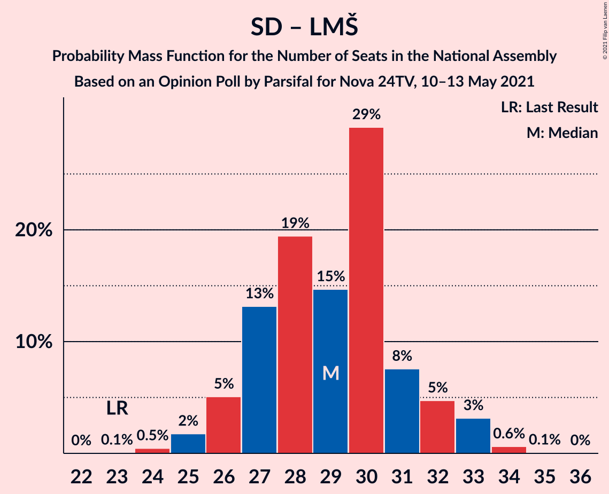

| Number of Seats | Probability | Accumulated | Special Marks |
|:---------------:|:-----------:|:-----------:|:-------------:|
| 23 | 0.1% | 100% | Last Result |
| 24 | 0.5% | 99.9% |  |
| 25 | 2% | 99.5% |  |
| 26 | 5% | 98% |  |
| 27 | 13% | 93% |  |
| 28 | 19% | 79% |  |
| 29 | 15% | 60% | Median |
| 30 | 29% | 45% |  |
| 31 | 8% | 16% |  |
| 32 | 5% | 9% |  |
| 33 | 3% | 4% |  |
| 34 | 0.6% | 0.7% |  |
| 35 | 0.1% | 0.1% |  |
| 36 | 0% | 0% |  |

## Technical Information

### Opinion Poll

+ **Polling firm:** Parsifal
+ **Commissioner(s):** Nova 24TV
+ **Fieldwork period:** 10–13 May 2021

### Calculations

+ **Sample size:** 726
+ **Simulations done:** 1,048,576
+ **Error estimate:** 1.04%

