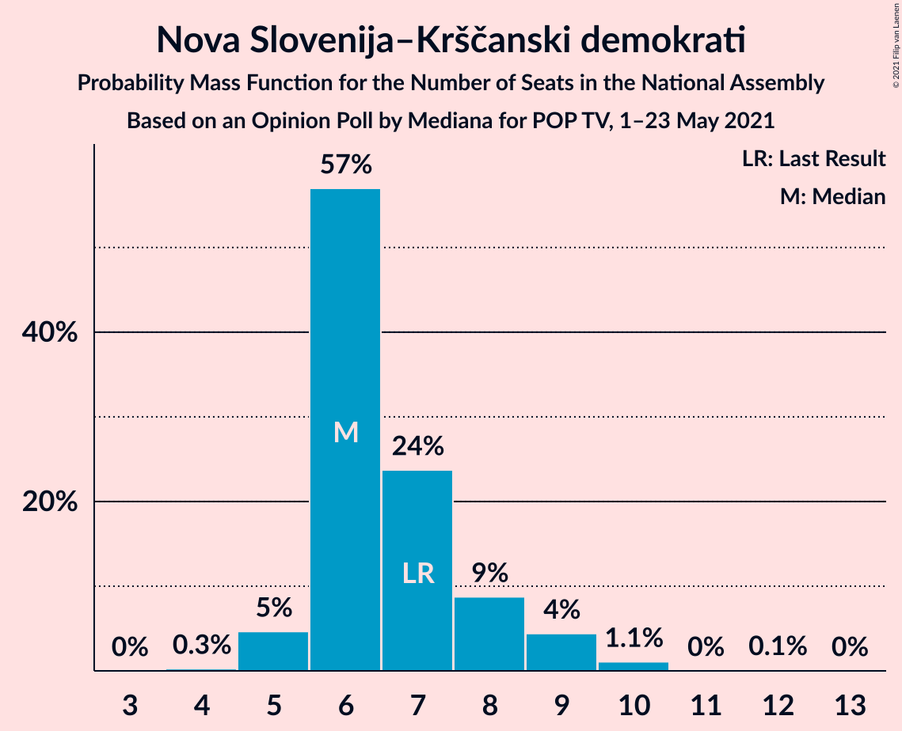

# Opinion Poll by Mediana for POP TV, 1–23 May 2021

<a href="#voting-intentions">Voting Intentions</a> | <a href="#seats">Seats</a> | <a href="#coalitions">Coalitions</a> | <a href="#technical-information">Technical Information</a>

## Voting Intentions

### Confidence Intervals

| Party | Last Result | Poll Result | 80% Confidence Interval | 90% Confidence Interval | 95% Confidence Interval | 99% Confidence Interval |
|:-----:|:-----------:|:-----------:|:-----------------------:|:-----------------------:|:-----------------------:|:-----------------------:|
| Slovenska demokratska stranka | 24.9% | 27.1% | 25.1–29.4% |24.5–30.0% |24.0–30.5% |23.0–31.6% |
| Socialni demokrati | 9.9% | 14.9% | 13.3–16.8% |12.9–17.3% |12.5–17.7% |11.8–18.6% |
| Lista Marjana Šarca | 12.6% | 13.4% | 11.8–15.1% |11.4–15.6% |11.1–16.1% |10.4–16.9% |
| Levica | 9.3% | 12.5% | 11.1–14.3% |10.6–14.7% |10.3–15.2% |9.6–16.0% |
| Nova Slovenija–Krščanski demokrati | 7.2% | 6.8% | 5.7–8.1% |5.4–8.5% |5.1–8.8% |4.7–9.5% |
| Stranka Alenke Bratušek | 5.1% | 3.9% | 3.1–5.0% |2.9–5.4% |2.7–5.6% |2.4–6.2% |
| Demokratična stranka upokojencev Slovenije | 4.9% | 3.7% | 2.9–4.7% |2.7–5.0% |2.5–5.3% |2.2–5.9% |
| Slovenska ljudska stranka | 2.6% | 3.2% | 2.5–4.3% |2.3–4.6% |2.2–4.8% |1.9–5.3% |
| Andrej Čuš in Zeleni Slovenije | 1.1% | 2.7% | 2.0–3.6% |1.9–3.9% |1.7–4.1% |1.5–4.6% |
| Piratska stranka Slovenije | 2.2% | 2.3% | 1.7–3.1% |1.5–3.4% |1.4–3.6% |1.2–4.1% |
| Slovenska nacionalna stranka | 4.2% | 2.1% | 1.6–3.0% |1.4–3.2% |1.3–3.5% |1.1–3.9% |
| Dobra država | 1.5% | 1.5% | 1.1–2.3% |1.0–2.5% |0.9–2.8% |0.7–3.2% |
| Stranka modernega centra | 9.7% | 1.3% | 0.9–2.0% |0.8–2.2% |0.7–2.4% |0.5–2.8% |

*Note:* The poll result column reflects the actual value used in the calculations. Published results may vary slightly, and in addition be rounded to fewer digits.

## Seats

### Confidence Intervals

| Party | Last Result | Median | 80% Confidence Interval | 90% Confidence Interval | 95% Confidence Interval | 99% Confidence Interval |
|:-----:|:-----------:|:------:|:-----------------------:|:-----------------------:|:-----------------------:|:-----------------------:|
| <a href="#slovenska-demokratska-stranka">Slovenska demokratska stranka</a> | 25 | 29 | 28–30 |26–31 |25–32 |24–35 |
| <a href="#socialni-demokrati">Socialni demokrati</a> | 10 | 17 | 15–17 |14–18 |14–19 |13–20 |
| <a href="#lista-marjana-šarca">Lista Marjana Šarca</a> | 13 | 14 | 13–15 |12–15 |12–17 |11–18 |
| <a href="#levica">Levica</a> | 9 | 12 | 12–18 |12–18 |11–18 |10–18 |
| <a href="#nova-slovenija–krščanski-demokrati">Nova Slovenija–Krščanski demokrati</a> | 7 | 6 | 6–8 |6–9 |5–9 |5–10 |
| <a href="#stranka-alenke-bratušek">Stranka Alenke Bratušek</a> | 5 | 0 | 0–5 |0–5 |0–5 |0–6 |
| <a href="#demokratična-stranka-upokojencev-slovenije">Demokratična stranka upokojencev Slovenije</a> | 5 | 4 | 0–4 |0–4 |0–5 |0–5 |
| <a href="#slovenska-ljudska-stranka">Slovenska ljudska stranka</a> | 0 | 0 | 0 |0–4 |0–4 |0–5 |
| <a href="#andrej-čuš-in-zeleni-slovenije">Andrej Čuš in Zeleni Slovenije</a> | 0 | 0 | 0 |0 |0 |0–4 |
| <a href="#piratska-stranka-slovenije">Piratska stranka Slovenije</a> | 0 | 0 | 0 |0 |0 |0–4 |
| <a href="#slovenska-nacionalna-stranka">Slovenska nacionalna stranka</a> | 4 | 0 | 0 |0 |0 |0 |
| <a href="#dobra-država">Dobra država</a> | 0 | 0 | 0 |0 |0 |0 |
| <a href="#stranka-modernega-centra">Stranka modernega centra</a> | 10 | 0 | 0 |0 |0 |0 |

### Slovenska demokratska stranka

*For a full overview of the results for this party, see the [Slovenska demokratska stranka](party-slovenskademokratskastranka.html) page.*

| Number of Seats | Probability | Accumulated | Special Marks |
|:---------------:|:-----------:|:-----------:|:-------------:|
| 23 | 0% | 100% |  |
| 24 | 0.6% | 99.9% |  |
| 25 | 4% | 99.4% | Last Result |
| 26 | 1.0% | 95% |  |
| 27 | 2% | 94% |  |
| 28 | 4% | 92% |  |
| 29 | 77% | 88% | Median |
| 30 | 5% | 11% |  |
| 31 | 3% | 6% |  |
| 32 | 1.4% | 3% |  |
| 33 | 0.4% | 2% |  |
| 34 | 0.3% | 1.2% |  |
| 35 | 0.8% | 0.8% |  |
| 36 | 0% | 0% |  |

### Socialni demokrati

*For a full overview of the results for this party, see the [Socialni demokrati](party-socialnidemokrati.html) page.*

| Number of Seats | Probability | Accumulated | Special Marks |
|:---------------:|:-----------:|:-----------:|:-------------:|
| 10 | 0% | 100% | Last Result |
| 11 | 0% | 100% |  |
| 12 | 0.4% | 100% |  |
| 13 | 1.2% | 99.6% |  |
| 14 | 5% | 98% |  |
| 15 | 24% | 93% |  |
| 16 | 8% | 69% |  |
| 17 | 57% | 62% | Median |
| 18 | 2% | 5% |  |
| 19 | 0.3% | 3% |  |
| 20 | 2% | 2% |  |
| 21 | 0.1% | 0.1% |  |
| 22 | 0% | 0% |  |

### Lista Marjana Šarca

*For a full overview of the results for this party, see the [Lista Marjana Šarca](party-listamarjanašarca.html) page.*

| Number of Seats | Probability | Accumulated | Special Marks |
|:---------------:|:-----------:|:-----------:|:-------------:|
| 10 | 0% | 100% |  |
| 11 | 2% | 99.9% |  |
| 12 | 7% | 98% |  |
| 13 | 2% | 91% | Last Result |
| 14 | 75% | 89% | Median |
| 15 | 9% | 14% |  |
| 16 | 1.3% | 5% |  |
| 17 | 3% | 4% |  |
| 18 | 0.4% | 0.7% |  |
| 19 | 0.3% | 0.4% |  |
| 20 | 0% | 0.1% |  |
| 21 | 0% | 0% |  |

### Levica

*For a full overview of the results for this party, see the [Levica](party-levica.html) page.*

| Number of Seats | Probability | Accumulated | Special Marks |
|:---------------:|:-----------:|:-----------:|:-------------:|
| 9 | 0.1% | 100% | Last Result |
| 10 | 0.4% | 99.9% |  |
| 11 | 2% | 99.5% |  |
| 12 | 58% | 97% | Median |
| 13 | 7% | 39% |  |
| 14 | 10% | 32% |  |
| 15 | 2% | 22% |  |
| 16 | 3% | 20% |  |
| 17 | 0.3% | 17% |  |
| 18 | 17% | 17% |  |
| 19 | 0% | 0% |  |

### Nova Slovenija–Krščanski demokrati

*For a full overview of the results for this party, see the [Nova Slovenija–Krščanski demokrati](party-novaslovenija–krščanskidemokrati.html) page.*

| Number of Seats | Probability | Accumulated | Special Marks |
|:---------------:|:-----------:|:-----------:|:-------------:|
| 4 | 0.3% | 100% |  |
| 5 | 5% | 99.7% |  |
| 6 | 57% | 95% | Median |
| 7 | 24% | 38% | Last Result |
| 8 | 9% | 14% |  |
| 9 | 4% | 6% |  |
| 10 | 1.1% | 1.2% |  |
| 11 | 0% | 0.1% |  |
| 12 | 0.1% | 0.1% |  |
| 13 | 0% | 0% |  |

### Stranka Alenke Bratušek

*For a full overview of the results for this party, see the [Stranka Alenke Bratušek](party-strankaalenkebratušek.html) page.*

| Number of Seats | Probability | Accumulated | Special Marks |
|:---------------:|:-----------:|:-----------:|:-------------:|
| 0 | 85% | 100% | Median |
| 1 | 0% | 15% |  |
| 2 | 0% | 15% |  |
| 3 | 0% | 15% |  |
| 4 | 5% | 15% |  |
| 5 | 9% | 10% | Last Result |
| 6 | 1.3% | 1.4% |  |
| 7 | 0% | 0.1% |  |
| 8 | 0% | 0% |  |

### Demokratična stranka upokojencev Slovenije

*For a full overview of the results for this party, see the [Demokratična stranka upokojencev Slovenije](party-demokratičnastrankaupokojencevslovenije.html) page.*

| Number of Seats | Probability | Accumulated | Special Marks |
|:---------------:|:-----------:|:-----------:|:-------------:|
| 0 | 38% | 100% |  |
| 1 | 0% | 62% |  |
| 2 | 0% | 62% |  |
| 3 | 0% | 62% |  |
| 4 | 59% | 62% | Median |
| 5 | 3% | 3% | Last Result |
| 6 | 0.4% | 0.4% |  |
| 7 | 0% | 0% |  |

### Slovenska ljudska stranka

*For a full overview of the results for this party, see the [Slovenska ljudska stranka](party-slovenskaljudskastranka.html) page.*

| Number of Seats | Probability | Accumulated | Special Marks |
|:---------------:|:-----------:|:-----------:|:-------------:|
| 0 | 93% | 100% | Last Result, Median |
| 1 | 0% | 7% |  |
| 2 | 0% | 7% |  |
| 3 | 0% | 7% |  |
| 4 | 6% | 7% |  |
| 5 | 2% | 2% |  |
| 6 | 0% | 0% |  |

### Andrej Čuš in Zeleni Slovenije

*For a full overview of the results for this party, see the [Andrej Čuš in Zeleni Slovenije](party-andrejčušinzelenislovenije.html) page.*

| Number of Seats | Probability | Accumulated | Special Marks |
|:---------------:|:-----------:|:-----------:|:-------------:|
| 0 | 99.4% | 100% | Last Result, Median |
| 1 | 0% | 0.6% |  |
| 2 | 0% | 0.6% |  |
| 3 | 0% | 0.6% |  |
| 4 | 0.5% | 0.6% |  |
| 5 | 0.1% | 0.1% |  |
| 6 | 0% | 0% |  |

### Piratska stranka Slovenije

*For a full overview of the results for this party, see the [Piratska stranka Slovenije](party-piratskastrankaslovenije.html) page.*

| Number of Seats | Probability | Accumulated | Special Marks |
|:---------------:|:-----------:|:-----------:|:-------------:|
| 0 | 99.5% | 100% | Last Result, Median |
| 1 | 0% | 0.5% |  |
| 2 | 0% | 0.5% |  |
| 3 | 0% | 0.5% |  |
| 4 | 0.5% | 0.5% |  |
| 5 | 0.1% | 0.1% |  |
| 6 | 0% | 0% |  |

### Slovenska nacionalna stranka

*For a full overview of the results for this party, see the [Slovenska nacionalna stranka](party-slovenskanacionalnastranka.html) page.*

| Number of Seats | Probability | Accumulated | Special Marks |
|:---------------:|:-----------:|:-----------:|:-------------:|
| 0 | 100% | 100% | Median |
| 1 | 0% | 0% |  |
| 2 | 0% | 0% |  |
| 3 | 0% | 0% |  |
| 4 | 0% | 0% | Last Result |

### Dobra država

*For a full overview of the results for this party, see the [Dobra država](party-dobradržava.html) page.*

| Number of Seats | Probability | Accumulated | Special Marks |
|:---------------:|:-----------:|:-----------:|:-------------:|
| 0 | 100% | 100% | Last Result, Median |

### Stranka modernega centra

*For a full overview of the results for this party, see the [Stranka modernega centra](party-strankamodernegacentra.html) page.*

| Number of Seats | Probability | Accumulated | Special Marks |
|:---------------:|:-----------:|:-----------:|:-------------:|
| 0 | 100% | 100% | Median |
| 1 | 0% | 0% |  |
| 2 | 0% | 0% |  |
| 3 | 0% | 0% |  |
| 4 | 0% | 0% |  |
| 5 | 0% | 0% |  |
| 6 | 0% | 0% |  |
| 7 | 0% | 0% |  |
| 8 | 0% | 0% |  |
| 9 | 0% | 0% |  |
| 10 | 0% | 0% | Last Result |

## Coalitions

### Confidence Intervals

| Coalition | Last Result | Median | Majority? | 80% Confidence Interval | 90% Confidence Interval | 95% Confidence Interval | 99% Confidence Interval |
|:---------:|:-----------:|:------:|:---------:|:-----------------------:|:-----------------------:|:-----------------------:|:-----------------------:|
| Slovenska demokratska stranka – Lista Marjana Šarca – Demokratična stranka upokojencev Slovenije | 43 | 47 | 65% | 43–47 | 40–47 | 37–49 | 37–52 |
| Slovenska demokratska stranka – Lista Marjana Šarca | 38 | 43 | 5% | 42–44 | 39–46 | 37–46 | 37–52 |
| Socialni demokrati – Lista Marjana Šarca – Nova Slovenija–Krščanski demokrati – Stranka Alenke Bratušek – Demokratična stranka upokojencev Slovenije – Stranka modernega centra | 50 | 41 | 1.1% | 36–42 | 36–44 | 36–44 | 36–48 |
| Socialni demokrati – Lista Marjana Šarca – Nova Slovenija–Krščanski demokrati – Demokratična stranka upokojencev Slovenije | 35 | 41 | 1.0% | 36–41 | 36–41 | 35–44 | 33–48 |
| Socialni demokrati – Lista Marjana Šarca – Nova Slovenija–Krščanski demokrati – Demokratična stranka upokojencev Slovenije – Stranka modernega centra | 45 | 41 | 1.0% | 36–41 | 36–41 | 35–44 | 33–48 |
| Socialni demokrati – Lista Marjana Šarca – Nova Slovenija–Krščanski demokrati | 30 | 37 | 0.1% | 36–39 | 35–40 | 33–40 | 31–43 |
| Socialni demokrati – Lista Marjana Šarca – Nova Slovenija–Krščanski demokrati – Stranka modernega centra | 40 | 37 | 0.1% | 36–39 | 35–40 | 33–40 | 31–43 |
| Socialni demokrati – Lista Marjana Šarca – Stranka Alenke Bratušek – Demokratična stranka upokojencev Slovenije – Stranka modernega centra | 43 | 35 | 0% | 29–35 | 29–37 | 29–39 | 29–39 |
| Socialni demokrati – Lista Marjana Šarca – Demokratična stranka upokojencev Slovenije | 28 | 35 | 0% | 29–35 | 28–35 | 28–38 | 25–39 |
| Socialni demokrati – Lista Marjana Šarca – Demokratična stranka upokojencev Slovenije – Stranka modernega centra | 38 | 35 | 0% | 29–35 | 28–35 | 28–38 | 25–39 |
| Socialni demokrati – Lista Marjana Šarca | 23 | 31 | 0% | 28–31 | 28–33 | 26–35 | 25–35 |
| Socialni demokrati – Lista Marjana Šarca – Stranka modernega centra | 33 | 31 | 0% | 28–31 | 28–33 | 26–35 | 25–35 |
| Socialni demokrati – Demokratična stranka upokojencev Slovenije – Stranka modernega centra | 25 | 21 | 0% | 15–21 | 15–21 | 14–23 | 13–24 |

### Slovenska demokratska stranka – Lista Marjana Šarca – Demokratična stranka upokojencev Slovenije

| Number of Seats | Probability | Accumulated | Special Marks |
|:---------------:|:-----------:|:-----------:|:-------------:|
| 37 | 4% | 100% |  |
| 38 | 0.1% | 96% |  |
| 39 | 0.5% | 96% |  |
| 40 | 1.1% | 96% |  |
| 41 | 0.4% | 94% |  |
| 42 | 1.2% | 94% |  |
| 43 | 19% | 93% | Last Result |
| 44 | 4% | 73% |  |
| 45 | 4% | 69% |  |
| 46 | 5% | 65% | Majority |
| 47 | 56% | 60% | Median |
| 48 | 0.5% | 4% |  |
| 49 | 2% | 3% |  |
| 50 | 0.6% | 2% |  |
| 51 | 0.2% | 1.0% |  |
| 52 | 0.6% | 0.9% |  |
| 53 | 0.1% | 0.2% |  |
| 54 | 0% | 0.2% |  |
| 55 | 0.2% | 0.2% |  |
| 56 | 0% | 0% |  |

### Slovenska demokratska stranka – Lista Marjana Šarca

| Number of Seats | Probability | Accumulated | Special Marks |
|:---------------:|:-----------:|:-----------:|:-------------:|
| 36 | 0.2% | 100% |  |
| 37 | 4% | 99.8% |  |
| 38 | 0.4% | 96% | Last Result |
| 39 | 0.7% | 95% |  |
| 40 | 2% | 95% |  |
| 41 | 0.3% | 92% |  |
| 42 | 3% | 92% |  |
| 43 | 75% | 89% | Median |
| 44 | 5% | 14% |  |
| 45 | 4% | 9% |  |
| 46 | 3% | 5% | Majority |
| 47 | 0.7% | 2% |  |
| 48 | 0.2% | 2% |  |
| 49 | 0.3% | 1.5% |  |
| 50 | 0.5% | 1.1% |  |
| 51 | 0% | 0.7% |  |
| 52 | 0.6% | 0.6% |  |
| 53 | 0% | 0% |  |

### Socialni demokrati – Lista Marjana Šarca – Nova Slovenija–Krščanski demokrati – Stranka Alenke Bratušek – Demokratična stranka upokojencev Slovenije – Stranka modernega centra

| Number of Seats | Probability | Accumulated | Special Marks |
|:---------------:|:-----------:|:-----------:|:-------------:|
| 33 | 0% | 100% |  |
| 34 | 0% | 99.9% |  |
| 35 | 0.4% | 99.9% |  |
| 36 | 17% | 99.6% |  |
| 37 | 1.1% | 82% |  |
| 38 | 4% | 81% |  |
| 39 | 5% | 77% |  |
| 40 | 3% | 72% |  |
| 41 | 58% | 69% | Median |
| 42 | 3% | 11% |  |
| 43 | 0.6% | 8% |  |
| 44 | 5% | 8% |  |
| 45 | 1.0% | 2% |  |
| 46 | 0.1% | 1.1% | Majority |
| 47 | 0.1% | 1.0% |  |
| 48 | 0.9% | 0.9% |  |
| 49 | 0% | 0% |  |
| 50 | 0% | 0% | Last Result |

### Socialni demokrati – Lista Marjana Šarca – Nova Slovenija–Krščanski demokrati – Demokratična stranka upokojencev Slovenije

| Number of Seats | Probability | Accumulated | Special Marks |
|:---------------:|:-----------:|:-----------:|:-------------:|
| 31 | 0.2% | 100% |  |
| 32 | 0.1% | 99.8% |  |
| 33 | 0.8% | 99.7% |  |
| 34 | 0.5% | 98.9% |  |
| 35 | 1.4% | 98% | Last Result |
| 36 | 23% | 97% |  |
| 37 | 2% | 74% |  |
| 38 | 4% | 72% |  |
| 39 | 7% | 68% |  |
| 40 | 3% | 61% |  |
| 41 | 54% | 58% | Median |
| 42 | 0.5% | 4% |  |
| 43 | 0.2% | 4% |  |
| 44 | 2% | 3% |  |
| 45 | 0.2% | 1.2% |  |
| 46 | 0.1% | 1.0% | Majority |
| 47 | 0% | 0.9% |  |
| 48 | 0.9% | 0.9% |  |
| 49 | 0% | 0% |  |

### Socialni demokrati – Lista Marjana Šarca – Nova Slovenija–Krščanski demokrati – Demokratična stranka upokojencev Slovenije – Stranka modernega centra

| Number of Seats | Probability | Accumulated | Special Marks |
|:---------------:|:-----------:|:-----------:|:-------------:|
| 31 | 0.2% | 100% |  |
| 32 | 0.1% | 99.8% |  |
| 33 | 0.8% | 99.7% |  |
| 34 | 0.5% | 98.9% |  |
| 35 | 1.4% | 98% |  |
| 36 | 23% | 97% |  |
| 37 | 2% | 74% |  |
| 38 | 4% | 72% |  |
| 39 | 7% | 68% |  |
| 40 | 3% | 61% |  |
| 41 | 54% | 58% | Median |
| 42 | 0.5% | 4% |  |
| 43 | 0.2% | 4% |  |
| 44 | 2% | 3% |  |
| 45 | 0.2% | 1.2% | Last Result |
| 46 | 0.1% | 1.0% | Majority |
| 47 | 0% | 0.9% |  |
| 48 | 0.9% | 0.9% |  |
| 49 | 0% | 0% |  |

### Socialni demokrati – Lista Marjana Šarca – Nova Slovenija–Krščanski demokrati

| Number of Seats | Probability | Accumulated | Special Marks |
|:---------------:|:-----------:|:-----------:|:-------------:|
| 30 | 0% | 100% | Last Result |
| 31 | 1.2% | 99.9% |  |
| 32 | 0.1% | 98.7% |  |
| 33 | 2% | 98.6% |  |
| 34 | 1.2% | 97% |  |
| 35 | 4% | 96% |  |
| 36 | 23% | 92% |  |
| 37 | 55% | 70% | Median |
| 38 | 4% | 15% |  |
| 39 | 4% | 10% |  |
| 40 | 5% | 7% |  |
| 41 | 0.4% | 2% |  |
| 42 | 0.1% | 1.2% |  |
| 43 | 0.9% | 1.1% |  |
| 44 | 0.1% | 0.1% |  |
| 45 | 0% | 0.1% |  |
| 46 | 0.1% | 0.1% | Majority |
| 47 | 0% | 0% |  |

### Socialni demokrati – Lista Marjana Šarca – Nova Slovenija–Krščanski demokrati – Stranka modernega centra

| Number of Seats | Probability | Accumulated | Special Marks |
|:---------------:|:-----------:|:-----------:|:-------------:|
| 30 | 0% | 100% |  |
| 31 | 1.2% | 99.9% |  |
| 32 | 0.1% | 98.7% |  |
| 33 | 2% | 98.6% |  |
| 34 | 1.2% | 97% |  |
| 35 | 4% | 96% |  |
| 36 | 23% | 92% |  |
| 37 | 55% | 70% | Median |
| 38 | 4% | 15% |  |
| 39 | 4% | 10% |  |
| 40 | 5% | 7% | Last Result |
| 41 | 0.4% | 2% |  |
| 42 | 0.1% | 1.2% |  |
| 43 | 0.9% | 1.1% |  |
| 44 | 0.1% | 0.1% |  |
| 45 | 0% | 0.1% |  |
| 46 | 0.1% | 0.1% | Majority |
| 47 | 0% | 0% |  |

### Socialni demokrati – Lista Marjana Šarca – Stranka Alenke Bratušek – Demokratična stranka upokojencev Slovenije – Stranka modernega centra

| Number of Seats | Probability | Accumulated | Special Marks |
|:---------------:|:-----------:|:-----------:|:-------------:|
| 26 | 0.1% | 100% |  |
| 27 | 0% | 99.9% |  |
| 28 | 0.2% | 99.8% |  |
| 29 | 18% | 99.7% |  |
| 30 | 5% | 82% |  |
| 31 | 2% | 77% |  |
| 32 | 2% | 74% |  |
| 33 | 6% | 73% |  |
| 34 | 2% | 67% |  |
| 35 | 57% | 65% | Median |
| 36 | 1.3% | 8% |  |
| 37 | 2% | 7% |  |
| 38 | 2% | 5% |  |
| 39 | 3% | 3% |  |
| 40 | 0.2% | 0.3% |  |
| 41 | 0% | 0.1% |  |
| 42 | 0% | 0% |  |
| 43 | 0% | 0% | Last Result |

### Socialni demokrati – Lista Marjana Šarca – Demokratična stranka upokojencev Slovenije

| Number of Seats | Probability | Accumulated | Special Marks |
|:---------------:|:-----------:|:-----------:|:-------------:|
| 25 | 0.9% | 100% |  |
| 26 | 0.2% | 99.1% |  |
| 27 | 0.5% | 98.9% |  |
| 28 | 4% | 98% | Last Result |
| 29 | 19% | 94% |  |
| 30 | 7% | 75% |  |
| 31 | 4% | 68% |  |
| 32 | 4% | 64% |  |
| 33 | 3% | 61% |  |
| 34 | 1.0% | 58% |  |
| 35 | 53% | 57% | Median |
| 36 | 0.5% | 4% |  |
| 37 | 0.1% | 3% |  |
| 38 | 1.0% | 3% |  |
| 39 | 2% | 2% |  |
| 40 | 0.2% | 0.2% |  |
| 41 | 0% | 0% |  |

### Socialni demokrati – Lista Marjana Šarca – Demokratična stranka upokojencev Slovenije – Stranka modernega centra

| Number of Seats | Probability | Accumulated | Special Marks |
|:---------------:|:-----------:|:-----------:|:-------------:|
| 25 | 0.9% | 100% |  |
| 26 | 0.2% | 99.1% |  |
| 27 | 0.5% | 98.9% |  |
| 28 | 4% | 98% |  |
| 29 | 19% | 94% |  |
| 30 | 7% | 75% |  |
| 31 | 4% | 68% |  |
| 32 | 4% | 64% |  |
| 33 | 3% | 61% |  |
| 34 | 1.0% | 58% |  |
| 35 | 53% | 57% | Median |
| 36 | 0.5% | 4% |  |
| 37 | 0.1% | 3% |  |
| 38 | 1.0% | 3% | Last Result |
| 39 | 2% | 2% |  |
| 40 | 0.2% | 0.2% |  |
| 41 | 0% | 0% |  |

### Socialni demokrati – Lista Marjana Šarca

| Number of Seats | Probability | Accumulated | Special Marks |
|:---------------:|:-----------:|:-----------:|:-------------:|
| 23 | 0% | 100% | Last Result |
| 24 | 0.1% | 100% |  |
| 25 | 2% | 99.9% |  |
| 26 | 2% | 98% |  |
| 27 | 1.0% | 96% |  |
| 28 | 6% | 95% |  |
| 29 | 19% | 89% |  |
| 30 | 5% | 70% |  |
| 31 | 57% | 65% | Median |
| 32 | 3% | 9% |  |
| 33 | 3% | 6% |  |
| 34 | 0.3% | 3% |  |
| 35 | 3% | 3% |  |
| 36 | 0.1% | 0.2% |  |
| 37 | 0% | 0.1% |  |
| 38 | 0.1% | 0.1% |  |
| 39 | 0% | 0% |  |

### Socialni demokrati – Lista Marjana Šarca – Stranka modernega centra

| Number of Seats | Probability | Accumulated | Special Marks |
|:---------------:|:-----------:|:-----------:|:-------------:|
| 24 | 0.1% | 100% |  |
| 25 | 2% | 99.9% |  |
| 26 | 2% | 98% |  |
| 27 | 1.0% | 96% |  |
| 28 | 6% | 95% |  |
| 29 | 19% | 89% |  |
| 30 | 5% | 70% |  |
| 31 | 57% | 65% | Median |
| 32 | 3% | 9% |  |
| 33 | 3% | 6% | Last Result |
| 34 | 0.3% | 3% |  |
| 35 | 3% | 3% |  |
| 36 | 0.1% | 0.2% |  |
| 37 | 0% | 0.1% |  |
| 38 | 0.1% | 0.1% |  |
| 39 | 0% | 0% |  |

### Socialni demokrati – Demokratična stranka upokojencev Slovenije – Stranka modernega centra

| Number of Seats | Probability | Accumulated | Special Marks |
|:---------------:|:-----------:|:-----------:|:-------------:|
| 12 | 0.2% | 100% |  |
| 13 | 1.0% | 99.8% |  |
| 14 | 2% | 98.7% |  |
| 15 | 22% | 97% |  |
| 16 | 7% | 75% |  |
| 17 | 4% | 68% |  |
| 18 | 4% | 64% |  |
| 19 | 1.4% | 60% |  |
| 20 | 1.3% | 58% |  |
| 21 | 53% | 57% | Median |
| 22 | 0.4% | 4% |  |
| 23 | 1.0% | 3% |  |
| 24 | 2% | 2% |  |
| 25 | 0% | 0% | Last Result |

## Technical Information

### Opinion Poll

+ **Polling firm:** Mediana
+ **Commissioner(s):** POP TV
+ **Fieldwork period:** 1–23 May 2021

### Calculations

+ **Sample size:** 711
+ **Simulations done:** 1,048,576
+ **Error estimate:** 4.85%

