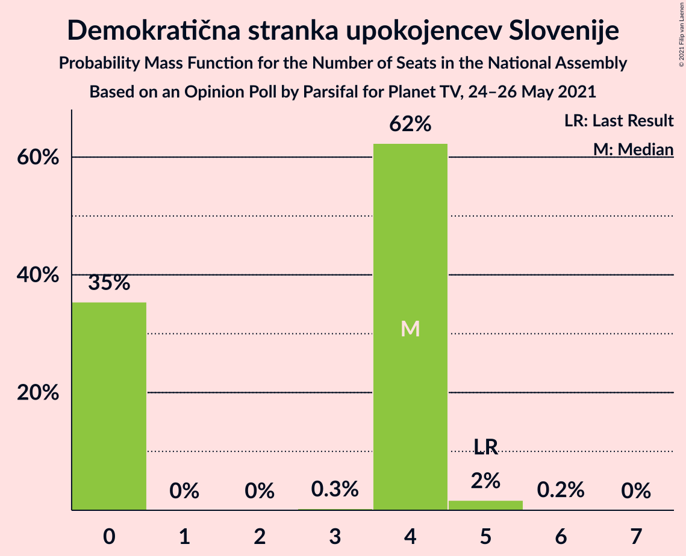

# Opinion Poll by Parsifal for Planet TV, 24–26 May 2021

<a href="#voting-intentions">Voting Intentions</a> | <a href="#seats">Seats</a> | <a href="#coalitions">Coalitions</a> | <a href="#technical-information">Technical Information</a>

## Voting Intentions

### Confidence Intervals

| Party | Last Result | Poll Result | 80% Confidence Interval | 90% Confidence Interval | 95% Confidence Interval | 99% Confidence Interval |
|:-----:|:-----------:|:-----------:|:-----------------------:|:-----------------------:|:-----------------------:|:-----------------------:|
| Slovenska demokratska stranka | 24.9% | 30.2% | 28.1–32.4% |27.5–33.0% |27.0–33.6% |26.0–34.6% |
| Lista Marjana Šarca | 12.6% | 15.7% | 14.1–17.5% |13.6–18.0% |13.3–18.5% |12.5–19.4% |
| Socialni demokrati | 9.9% | 14.9% | 13.3–16.7% |12.9–17.2% |12.5–17.6% |11.8–18.5% |
| Levica | 9.3% | 8.0% | 6.8–9.4% |6.5–9.8% |6.2–10.2% |5.7–10.9% |
| Nova Slovenija–Krščanski demokrati | 7.2% | 7.8% | 6.7–9.3% |6.4–9.6% |6.1–10.0% |5.6–10.7% |
| Demokratična stranka upokojencev Slovenije | 4.9% | 3.9% | 3.1–4.9% |2.9–5.2% |2.7–5.5% |2.4–6.1% |
| Slovenska nacionalna stranka | 4.2% | 3.1% | 2.4–4.0% |2.2–4.3% |2.0–4.6% |1.8–5.1% |
| Stranka Alenke Bratušek | 5.1% | 2.5% | 1.9–3.4% |1.8–3.7% |1.6–3.9% |1.4–4.4% |
| Piratska stranka Slovenije | 2.2% | 2.5% | 1.9–3.4% |1.8–3.7% |1.6–3.9% |1.4–4.4% |
| Stranka modernega centra | 9.7% | 1.7% | 1.2–2.5% |1.1–2.7% |1.0–2.9% |0.8–3.4% |
| Dobra država | 1.5% | 0.3% | 0.1–0.7% |0.1–0.8% |0.1–1.0% |0.0–1.2% |

*Note:* The poll result column reflects the actual value used in the calculations. Published results may vary slightly, and in addition be rounded to fewer digits.

## Seats

### Confidence Intervals

| Party | Last Result | Median | 80% Confidence Interval | 90% Confidence Interval | 95% Confidence Interval | 99% Confidence Interval |
|:-----:|:-----------:|:------:|:-----------------------:|:-----------------------:|:-----------------------:|:-----------------------:|
| <a href="#slovenska-demokratska-stranka">Slovenska demokratska stranka</a> | 25 | 30 | 29–32 |29–33 |28–34 |25–34 |
| <a href="#lista-marjana-šarca">Lista Marjana Šarca</a> | 13 | 15 | 14–16 |13–16 |13–17 |13–19 |
| <a href="#socialni-demokrati">Socialni demokrati</a> | 10 | 15 | 14–17 |13–17 |12–17 |12–18 |
| <a href="#levica">Levica</a> | 9 | 8 | 6–9 |6–10 |6–10 |6–10 |
| <a href="#nova-slovenija–krščanski-demokrati">Nova Slovenija–Krščanski demokrati</a> | 7 | 7 | 6–8 |6–8 |6–9 |5–10 |
| <a href="#demokratična-stranka-upokojencev-slovenije">Demokratična stranka upokojencev Slovenije</a> | 5 | 4 | 0–4 |0–4 |0–4 |0–5 |
| <a href="#slovenska-nacionalna-stranka">Slovenska nacionalna stranka</a> | 4 | 0 | 0–4 |0–4 |0–4 |0–4 |
| <a href="#stranka-alenke-bratušek">Stranka Alenke Bratušek</a> | 5 | 0 | 0 |0 |0 |0–3 |
| <a href="#piratska-stranka-slovenije">Piratska stranka Slovenije</a> | 0 | 0 | 0 |0 |0 |0–4 |
| <a href="#stranka-modernega-centra">Stranka modernega centra</a> | 10 | 0 | 0 |0 |0 |0 |
| <a href="#dobra-država">Dobra država</a> | 0 | 0 | 0 |0 |0 |0 |

### Slovenska demokratska stranka

*For a full overview of the results for this party, see the [Slovenska demokratska stranka](party-slovenskademokratskastranka.html) page.*

| Number of Seats | Probability | Accumulated | Special Marks |
|:---------------:|:-----------:|:-----------:|:-------------:|
| 25 | 0.5% | 100% | Last Result |
| 26 | 0.4% | 99.5% |  |
| 27 | 0.7% | 99.0% |  |
| 28 | 1.1% | 98% |  |
| 29 | 15% | 97% |  |
| 30 | 43% | 82% | Median |
| 31 | 18% | 39% |  |
| 32 | 12% | 22% |  |
| 33 | 6% | 9% |  |
| 34 | 3% | 3% |  |
| 35 | 0.1% | 0.1% |  |
| 36 | 0.1% | 0.1% |  |
| 37 | 0% | 0% |  |

### Lista Marjana Šarca

*For a full overview of the results for this party, see the [Lista Marjana Šarca](party-listamarjanašarca.html) page.*

| Number of Seats | Probability | Accumulated | Special Marks |
|:---------------:|:-----------:|:-----------:|:-------------:|
| 12 | 0.3% | 100% |  |
| 13 | 7% | 99.6% | Last Result |
| 14 | 9% | 93% |  |
| 15 | 39% | 84% | Median |
| 16 | 41% | 45% |  |
| 17 | 2% | 4% |  |
| 18 | 1.2% | 2% |  |
| 19 | 0.4% | 0.6% |  |
| 20 | 0.2% | 0.2% |  |
| 21 | 0% | 0% |  |

### Socialni demokrati

*For a full overview of the results for this party, see the [Socialni demokrati](party-socialnidemokrati.html) page.*

| Number of Seats | Probability | Accumulated | Special Marks |
|:---------------:|:-----------:|:-----------:|:-------------:|
| 10 | 0% | 100% | Last Result |
| 11 | 0.2% | 100% |  |
| 12 | 4% | 99.7% |  |
| 13 | 6% | 96% |  |
| 14 | 35% | 90% |  |
| 15 | 31% | 56% | Median |
| 16 | 14% | 25% |  |
| 17 | 10% | 11% |  |
| 18 | 0.5% | 0.6% |  |
| 19 | 0.1% | 0.1% |  |
| 20 | 0% | 0% |  |

### Levica

*For a full overview of the results for this party, see the [Levica](party-levica.html) page.*

| Number of Seats | Probability | Accumulated | Special Marks |
|:---------------:|:-----------:|:-----------:|:-------------:|
| 5 | 0.3% | 100% |  |
| 6 | 14% | 99.7% |  |
| 7 | 33% | 86% |  |
| 8 | 25% | 52% | Median |
| 9 | 17% | 27% | Last Result |
| 10 | 9% | 10% |  |
| 11 | 0.4% | 0.5% |  |
| 12 | 0.1% | 0.1% |  |
| 13 | 0% | 0% |  |

### Nova Slovenija–Krščanski demokrati

*For a full overview of the results for this party, see the [Nova Slovenija–Krščanski demokrati](party-novaslovenija–krščanskidemokrati.html) page.*

| Number of Seats | Probability | Accumulated | Special Marks |
|:---------------:|:-----------:|:-----------:|:-------------:|
| 5 | 0.9% | 100% |  |
| 6 | 25% | 99.1% |  |
| 7 | 41% | 74% | Last Result, Median |
| 8 | 29% | 33% |  |
| 9 | 4% | 5% |  |
| 10 | 0.6% | 0.7% |  |
| 11 | 0.1% | 0.1% |  |
| 12 | 0% | 0% |  |

### Demokratična stranka upokojencev Slovenije

*For a full overview of the results for this party, see the [Demokratična stranka upokojencev Slovenije](party-demokratičnastrankaupokojencevslovenije.html) page.*

| Number of Seats | Probability | Accumulated | Special Marks |
|:---------------:|:-----------:|:-----------:|:-------------:|
| 0 | 35% | 100% |  |
| 1 | 0% | 65% |  |
| 2 | 0% | 65% |  |
| 3 | 0.3% | 65% |  |
| 4 | 62% | 64% | Median |
| 5 | 2% | 2% | Last Result |
| 6 | 0.2% | 0.2% |  |
| 7 | 0% | 0% |  |

### Slovenska nacionalna stranka

*For a full overview of the results for this party, see the [Slovenska nacionalna stranka](party-slovenskanacionalnastranka.html) page.*

| Number of Seats | Probability | Accumulated | Special Marks |
|:---------------:|:-----------:|:-----------:|:-------------:|
| 0 | 83% | 100% | Median |
| 1 | 0% | 17% |  |
| 2 | 0% | 17% |  |
| 3 | 0.4% | 17% |  |
| 4 | 17% | 17% | Last Result |
| 5 | 0.2% | 0.2% |  |
| 6 | 0% | 0% |  |

### Stranka Alenke Bratušek

*For a full overview of the results for this party, see the [Stranka Alenke Bratušek](party-strankaalenkebratušek.html) page.*

| Number of Seats | Probability | Accumulated | Special Marks |
|:---------------:|:-----------:|:-----------:|:-------------:|
| 0 | 99.4% | 100% | Median |
| 1 | 0% | 0.6% |  |
| 2 | 0% | 0.6% |  |
| 3 | 0.2% | 0.6% |  |
| 4 | 0.4% | 0.5% |  |
| 5 | 0% | 0% | Last Result |

### Piratska stranka Slovenije

*For a full overview of the results for this party, see the [Piratska stranka Slovenije](party-piratskastrankaslovenije.html) page.*

| Number of Seats | Probability | Accumulated | Special Marks |
|:---------------:|:-----------:|:-----------:|:-------------:|
| 0 | 99.1% | 100% | Last Result, Median |
| 1 | 0% | 0.9% |  |
| 2 | 0% | 0.9% |  |
| 3 | 0% | 0.9% |  |
| 4 | 0.9% | 0.9% |  |
| 5 | 0% | 0% |  |

### Stranka modernega centra

*For a full overview of the results for this party, see the [Stranka modernega centra](party-strankamodernegacentra.html) page.*

| Number of Seats | Probability | Accumulated | Special Marks |
|:---------------:|:-----------:|:-----------:|:-------------:|
| 0 | 100% | 100% | Median |
| 1 | 0% | 0% |  |
| 2 | 0% | 0% |  |
| 3 | 0% | 0% |  |
| 4 | 0% | 0% |  |
| 5 | 0% | 0% |  |
| 6 | 0% | 0% |  |
| 7 | 0% | 0% |  |
| 8 | 0% | 0% |  |
| 9 | 0% | 0% |  |
| 10 | 0% | 0% | Last Result |

### Dobra država

*For a full overview of the results for this party, see the [Dobra država](party-dobradržava.html) page.*

| Number of Seats | Probability | Accumulated | Special Marks |
|:---------------:|:-----------:|:-----------:|:-------------:|
| 0 | 100% | 100% | Last Result, Median |

## Coalitions

### Confidence Intervals

| Coalition | Last Result | Median | Majority? | 80% Confidence Interval | 90% Confidence Interval | 95% Confidence Interval | 99% Confidence Interval |
|:---------:|:-----------:|:------:|:---------:|:-----------------------:|:-----------------------:|:-----------------------:|:-----------------------:|
| Slovenska demokratska stranka – Lista Marjana Šarca – Demokratična stranka upokojencev Slovenije | 43 | 48 | 96% | 46–50 | 46–50 | 45–51 | 42–53 |
| Slovenska demokratska stranka – Lista Marjana Šarca | 38 | 46 | 70% | 44–48 | 43–49 | 43–50 | 40–51 |
| Lista Marjana Šarca – Socialni demokrati – Nova Slovenija–Krščanski demokrati – Demokratična stranka upokojencev Slovenije | 35 | 40 | 0.2% | 37–42 | 36–42 | 35–42 | 34–45 |
| Lista Marjana Šarca – Socialni demokrati – Nova Slovenija–Krščanski demokrati – Demokratična stranka upokojencev Slovenije – Stranka Alenke Bratušek – Stranka modernega centra | 50 | 40 | 0.2% | 37–42 | 36–42 | 35–42 | 34–45 |
| Lista Marjana Šarca – Socialni demokrati – Nova Slovenija–Krščanski demokrati – Demokratična stranka upokojencev Slovenije – Stranka modernega centra | 45 | 40 | 0.2% | 37–42 | 36–42 | 35–42 | 34–45 |
| Lista Marjana Šarca – Socialni demokrati – Nova Slovenija–Krščanski demokrati | 30 | 38 | 0% | 35–39 | 35–39 | 35–40 | 33–42 |
| Lista Marjana Šarca – Socialni demokrati – Nova Slovenija–Krščanski demokrati – Stranka modernega centra | 40 | 38 | 0% | 35–39 | 35–39 | 35–40 | 33–42 |
| Lista Marjana Šarca – Socialni demokrati – Demokratična stranka upokojencev Slovenije | 28 | 33 | 0% | 30–35 | 29–35 | 28–35 | 27–36 |
| Lista Marjana Šarca – Socialni demokrati – Demokratična stranka upokojencev Slovenije – Stranka Alenke Bratušek – Stranka modernega centra | 43 | 33 | 0% | 30–35 | 29–35 | 28–35 | 27–37 |
| Lista Marjana Šarca – Socialni demokrati – Demokratična stranka upokojencev Slovenije – Stranka modernega centra | 38 | 33 | 0% | 30–35 | 29–35 | 28–35 | 27–36 |
| Lista Marjana Šarca – Socialni demokrati | 23 | 31 | 0% | 28–32 | 28–32 | 27–32 | 26–34 |
| Lista Marjana Šarca – Socialni demokrati – Stranka modernega centra | 33 | 31 | 0% | 28–32 | 28–32 | 27–32 | 26–34 |
| Socialni demokrati – Demokratična stranka upokojencev Slovenije – Stranka modernega centra | 25 | 18 | 0% | 15–19 | 13–19 | 12–21 | 12–21 |

### Slovenska demokratska stranka – Lista Marjana Šarca – Demokratična stranka upokojencev Slovenije

| Number of Seats | Probability | Accumulated | Special Marks |
|:---------------:|:-----------:|:-----------:|:-------------:|
| 41 | 0.1% | 100% |  |
| 42 | 0.5% | 99.9% |  |
| 43 | 0.2% | 99.4% | Last Result |
| 44 | 2% | 99.2% |  |
| 45 | 2% | 98% |  |
| 46 | 13% | 96% | Majority |
| 47 | 13% | 82% |  |
| 48 | 22% | 69% |  |
| 49 | 5% | 47% | Median |
| 50 | 39% | 42% |  |
| 51 | 1.5% | 3% |  |
| 52 | 0.7% | 1.2% |  |
| 53 | 0.4% | 0.5% |  |
| 54 | 0.1% | 0.2% |  |
| 55 | 0% | 0% |  |

### Slovenska demokratska stranka – Lista Marjana Šarca

| Number of Seats | Probability | Accumulated | Special Marks |
|:---------------:|:-----------:|:-----------:|:-------------:|
| 38 | 0% | 100% | Last Result |
| 39 | 0% | 100% |  |
| 40 | 0.6% | 100% |  |
| 41 | 0.3% | 99.3% |  |
| 42 | 1.3% | 99.0% |  |
| 43 | 6% | 98% |  |
| 44 | 20% | 92% |  |
| 45 | 2% | 72% | Median |
| 46 | 50% | 70% | Majority |
| 47 | 8% | 21% |  |
| 48 | 4% | 13% |  |
| 49 | 4% | 9% |  |
| 50 | 3% | 4% |  |
| 51 | 0.9% | 1.0% |  |
| 52 | 0% | 0.1% |  |
| 53 | 0% | 0% |  |

### Lista Marjana Šarca – Socialni demokrati – Nova Slovenija–Krščanski demokrati – Demokratična stranka upokojencev Slovenije

| Number of Seats | Probability | Accumulated | Special Marks |
|:---------------:|:-----------:|:-----------:|:-------------:|
| 34 | 0.5% | 100% |  |
| 35 | 2% | 99.5% | Last Result |
| 36 | 5% | 97% |  |
| 37 | 7% | 93% |  |
| 38 | 8% | 85% |  |
| 39 | 27% | 77% |  |
| 40 | 12% | 50% |  |
| 41 | 4% | 38% | Median |
| 42 | 32% | 34% |  |
| 43 | 0.5% | 2% |  |
| 44 | 0.6% | 1.2% |  |
| 45 | 0.5% | 0.7% |  |
| 46 | 0.1% | 0.2% | Majority |
| 47 | 0% | 0% |  |

### Lista Marjana Šarca – Socialni demokrati – Nova Slovenija–Krščanski demokrati – Demokratična stranka upokojencev Slovenije – Stranka Alenke Bratušek – Stranka modernega centra

| Number of Seats | Probability | Accumulated | Special Marks |
|:---------------:|:-----------:|:-----------:|:-------------:|
| 34 | 0.5% | 100% |  |
| 35 | 2% | 99.5% |  |
| 36 | 4% | 97% |  |
| 37 | 7% | 93% |  |
| 38 | 8% | 86% |  |
| 39 | 27% | 77% |  |
| 40 | 12% | 50% |  |
| 41 | 4% | 38% | Median |
| 42 | 32% | 34% |  |
| 43 | 0.5% | 2% |  |
| 44 | 0.8% | 1.5% |  |
| 45 | 0.5% | 0.7% |  |
| 46 | 0.1% | 0.2% | Majority |
| 47 | 0% | 0% |  |
| 48 | 0% | 0% |  |
| 49 | 0% | 0% |  |
| 50 | 0% | 0% | Last Result |

### Lista Marjana Šarca – Socialni demokrati – Nova Slovenija–Krščanski demokrati – Demokratična stranka upokojencev Slovenije – Stranka modernega centra

| Number of Seats | Probability | Accumulated | Special Marks |
|:---------------:|:-----------:|:-----------:|:-------------:|
| 34 | 0.5% | 100% |  |
| 35 | 2% | 99.5% |  |
| 36 | 5% | 97% |  |
| 37 | 7% | 93% |  |
| 38 | 8% | 85% |  |
| 39 | 27% | 77% |  |
| 40 | 12% | 50% |  |
| 41 | 4% | 38% | Median |
| 42 | 32% | 34% |  |
| 43 | 0.5% | 2% |  |
| 44 | 0.6% | 1.2% |  |
| 45 | 0.5% | 0.7% | Last Result |
| 46 | 0.1% | 0.2% | Majority |
| 47 | 0% | 0% |  |

### Lista Marjana Šarca – Socialni demokrati – Nova Slovenija–Krščanski demokrati

| Number of Seats | Probability | Accumulated | Special Marks |
|:---------------:|:-----------:|:-----------:|:-------------:|
| 30 | 0% | 100% | Last Result |
| 31 | 0% | 100% |  |
| 32 | 0.1% | 100% |  |
| 33 | 0.5% | 99.9% |  |
| 34 | 1.1% | 99.4% |  |
| 35 | 18% | 98% |  |
| 36 | 15% | 80% |  |
| 37 | 11% | 65% | Median |
| 38 | 39% | 54% |  |
| 39 | 11% | 14% |  |
| 40 | 2% | 4% |  |
| 41 | 0.7% | 2% |  |
| 42 | 0.4% | 0.8% |  |
| 43 | 0.2% | 0.4% |  |
| 44 | 0.1% | 0.2% |  |
| 45 | 0% | 0.1% |  |
| 46 | 0% | 0% | Majority |

### Lista Marjana Šarca – Socialni demokrati – Nova Slovenija–Krščanski demokrati – Stranka modernega centra

| Number of Seats | Probability | Accumulated | Special Marks |
|:---------------:|:-----------:|:-----------:|:-------------:|
| 32 | 0.1% | 100% |  |
| 33 | 0.5% | 99.9% |  |
| 34 | 1.1% | 99.4% |  |
| 35 | 18% | 98% |  |
| 36 | 15% | 80% |  |
| 37 | 11% | 65% | Median |
| 38 | 39% | 54% |  |
| 39 | 11% | 14% |  |
| 40 | 2% | 4% | Last Result |
| 41 | 0.7% | 2% |  |
| 42 | 0.4% | 0.8% |  |
| 43 | 0.2% | 0.4% |  |
| 44 | 0.1% | 0.2% |  |
| 45 | 0% | 0.1% |  |
| 46 | 0% | 0% | Majority |

### Lista Marjana Šarca – Socialni demokrati – Demokratična stranka upokojencev Slovenije

| Number of Seats | Probability | Accumulated | Special Marks |
|:---------------:|:-----------:|:-----------:|:-------------:|
| 26 | 0.5% | 100% |  |
| 27 | 0.7% | 99.5% |  |
| 28 | 4% | 98.9% | Last Result |
| 29 | 3% | 95% |  |
| 30 | 4% | 92% |  |
| 31 | 18% | 88% |  |
| 32 | 15% | 71% |  |
| 33 | 18% | 55% |  |
| 34 | 11% | 37% | Median |
| 35 | 25% | 27% |  |
| 36 | 1.0% | 1.3% |  |
| 37 | 0.2% | 0.4% |  |
| 38 | 0.1% | 0.2% |  |
| 39 | 0% | 0% |  |

### Lista Marjana Šarca – Socialni demokrati – Demokratična stranka upokojencev Slovenije – Stranka Alenke Bratušek – Stranka modernega centra

| Number of Seats | Probability | Accumulated | Special Marks |
|:---------------:|:-----------:|:-----------:|:-------------:|
| 26 | 0.5% | 100% |  |
| 27 | 0.6% | 99.5% |  |
| 28 | 4% | 98.9% |  |
| 29 | 3% | 95% |  |
| 30 | 4% | 93% |  |
| 31 | 18% | 88% |  |
| 32 | 15% | 71% |  |
| 33 | 18% | 56% |  |
| 34 | 11% | 38% | Median |
| 35 | 25% | 27% |  |
| 36 | 1.1% | 2% |  |
| 37 | 0.3% | 0.5% |  |
| 38 | 0.1% | 0.2% |  |
| 39 | 0% | 0.1% |  |
| 40 | 0% | 0% |  |
| 41 | 0% | 0% |  |
| 42 | 0% | 0% |  |
| 43 | 0% | 0% | Last Result |

### Lista Marjana Šarca – Socialni demokrati – Demokratična stranka upokojencev Slovenije – Stranka modernega centra

| Number of Seats | Probability | Accumulated | Special Marks |
|:---------------:|:-----------:|:-----------:|:-------------:|
| 26 | 0.5% | 100% |  |
| 27 | 0.7% | 99.5% |  |
| 28 | 4% | 98.9% |  |
| 29 | 3% | 95% |  |
| 30 | 4% | 92% |  |
| 31 | 18% | 88% |  |
| 32 | 15% | 71% |  |
| 33 | 18% | 55% |  |
| 34 | 11% | 37% | Median |
| 35 | 25% | 27% |  |
| 36 | 1.0% | 1.3% |  |
| 37 | 0.2% | 0.4% |  |
| 38 | 0.1% | 0.2% | Last Result |
| 39 | 0% | 0% |  |

### Lista Marjana Šarca – Socialni demokrati

| Number of Seats | Probability | Accumulated | Special Marks |
|:---------------:|:-----------:|:-----------:|:-------------:|
| 23 | 0% | 100% | Last Result |
| 24 | 0% | 100% |  |
| 25 | 0% | 100% |  |
| 26 | 1.1% | 99.9% |  |
| 27 | 4% | 98.9% |  |
| 28 | 11% | 95% |  |
| 29 | 20% | 84% |  |
| 30 | 14% | 64% | Median |
| 31 | 40% | 50% |  |
| 32 | 8% | 10% |  |
| 33 | 0.8% | 2% |  |
| 34 | 0.7% | 0.9% |  |
| 35 | 0.1% | 0.2% |  |
| 36 | 0.1% | 0.1% |  |
| 37 | 0% | 0% |  |

### Lista Marjana Šarca – Socialni demokrati – Stranka modernega centra

| Number of Seats | Probability | Accumulated | Special Marks |
|:---------------:|:-----------:|:-----------:|:-------------:|
| 25 | 0% | 100% |  |
| 26 | 1.1% | 99.9% |  |
| 27 | 4% | 98.9% |  |
| 28 | 11% | 95% |  |
| 29 | 20% | 84% |  |
| 30 | 14% | 64% | Median |
| 31 | 40% | 50% |  |
| 32 | 8% | 10% |  |
| 33 | 0.8% | 2% | Last Result |
| 34 | 0.7% | 0.9% |  |
| 35 | 0.1% | 0.2% |  |
| 36 | 0.1% | 0.1% |  |
| 37 | 0% | 0% |  |

### Socialni demokrati – Demokratična stranka upokojencev Slovenije – Stranka modernega centra

| Number of Seats | Probability | Accumulated | Special Marks |
|:---------------:|:-----------:|:-----------:|:-------------:|
| 11 | 0.1% | 100% |  |
| 12 | 3% | 99.9% |  |
| 13 | 2% | 97% |  |
| 14 | 4% | 95% |  |
| 15 | 6% | 91% |  |
| 16 | 14% | 85% |  |
| 17 | 10% | 71% |  |
| 18 | 31% | 61% |  |
| 19 | 25% | 30% | Median |
| 20 | 1.0% | 5% |  |
| 21 | 3% | 4% |  |
| 22 | 0.3% | 0.3% |  |
| 23 | 0% | 0% |  |
| 24 | 0% | 0% |  |
| 25 | 0% | 0% | Last Result |

## Technical Information

### Opinion Poll

+ **Polling firm:** Parsifal
+ **Commissioner(s):** Planet TV
+ **Fieldwork period:** 24–26 May 2021

### Calculations

+ **Sample size:** 752
+ **Simulations done:** 1,048,576
+ **Error estimate:** 2.10%

