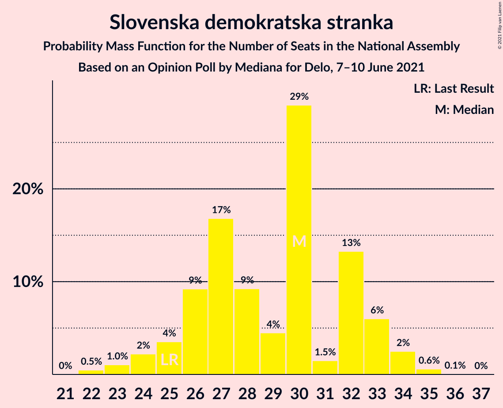
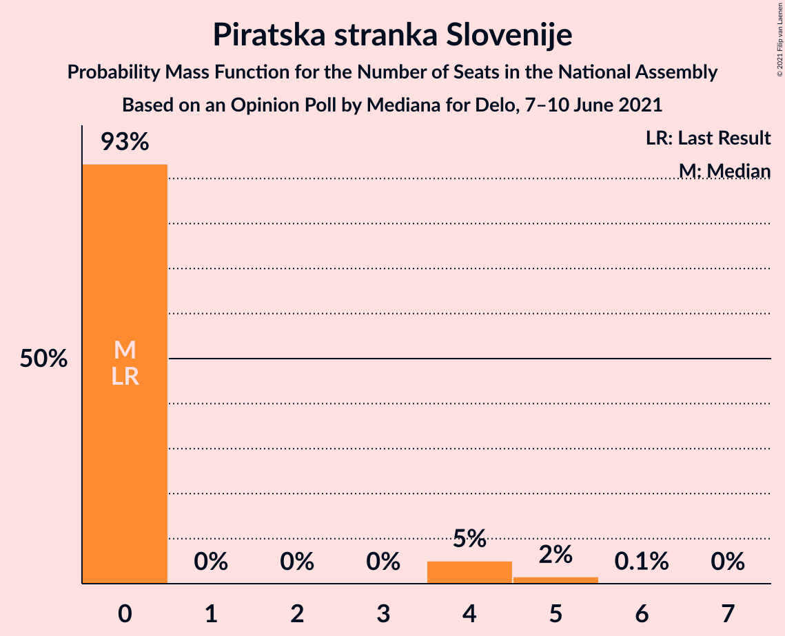
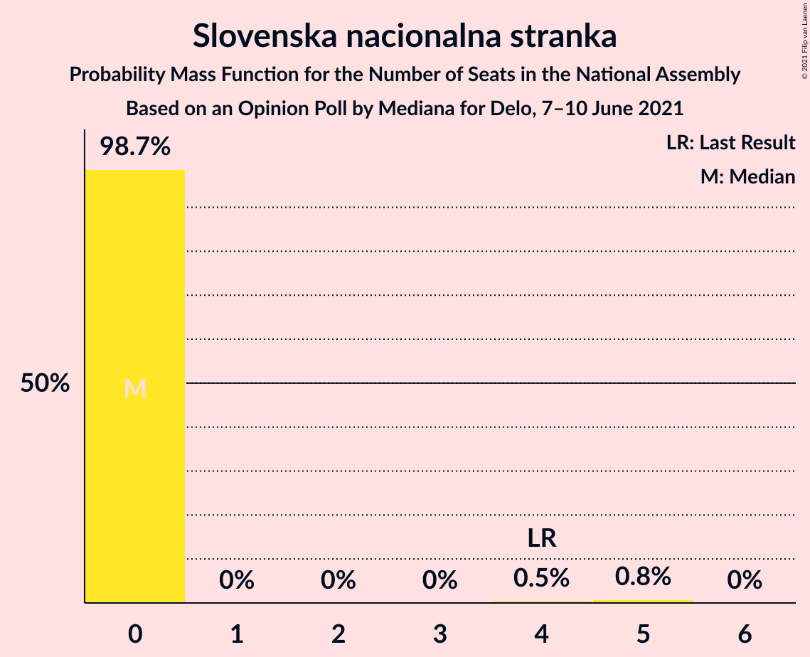
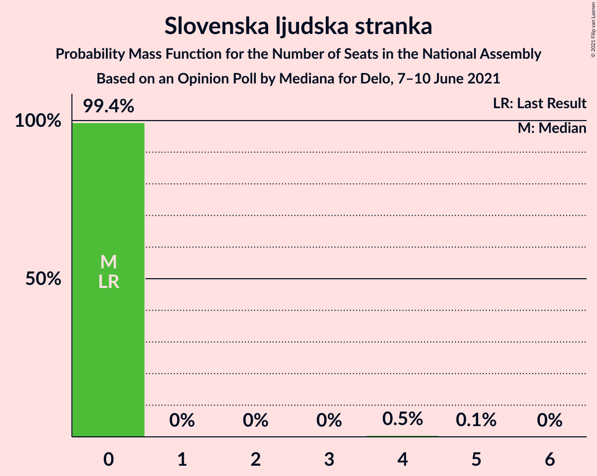
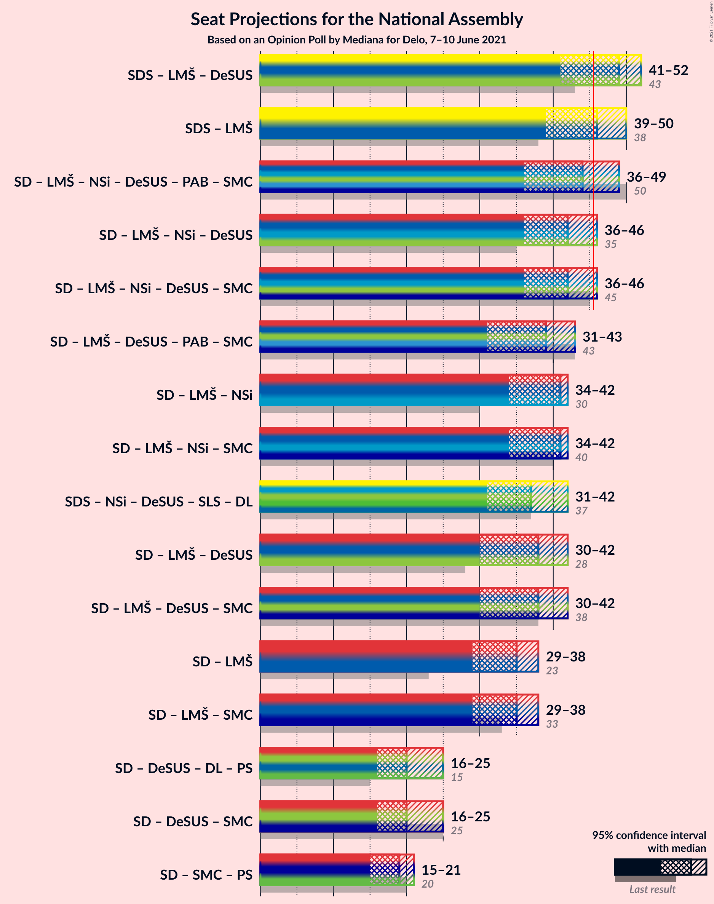
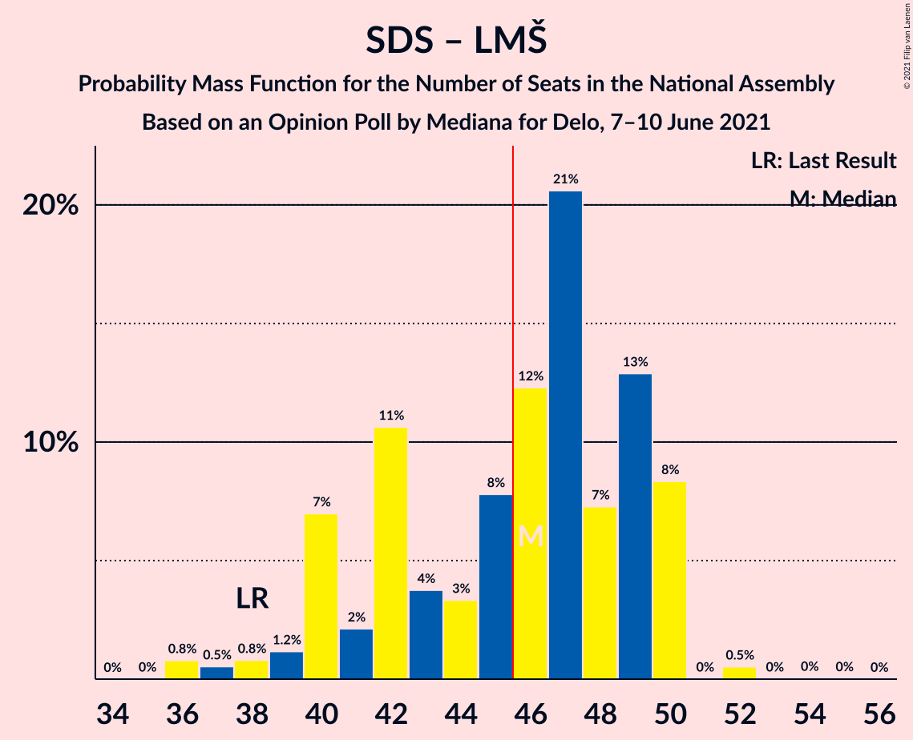
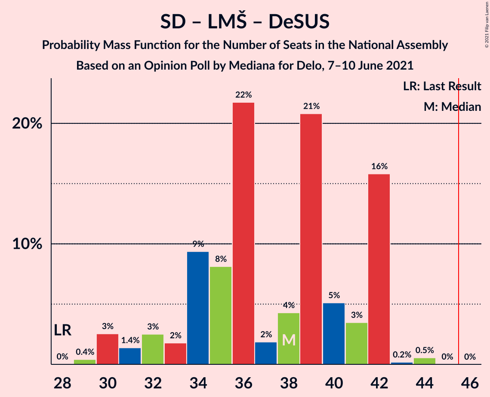

# Opinion Poll by Mediana for Delo, 7–10 June 2021

<a href="#voting-intentions">Voting Intentions</a> | <a href="#seats">Seats</a> | <a href="#coalitions">Coalitions</a> | <a href="#technical-information">Technical Information</a>

## Voting Intentions

### Confidence Intervals

| Party | Last Result | Poll Result | 80% Confidence Interval | 90% Confidence Interval | 95% Confidence Interval | 99% Confidence Interval |
|:-----:|:-----------:|:-----------:|:-----------------------:|:-----------------------:|:-----------------------:|:-----------------------:|
| Slovenska demokratska stranka | 24.9% | 25.9% | 23.9–28.1% |23.3–28.7% |22.8–29.3% |21.9–30.3% |
| Socialni demokrati | 9.9% | 16.2% | 14.5–18.1% |14.1–18.6% |13.7–19.1% |12.9–20.0% |
| Lista Marjana Šarca | 12.6% | 14.5% | 12.9–16.3% |12.5–16.8% |12.1–17.3% |11.4–18.2% |
| Levica | 9.3% | 12.8% | 11.3–14.6% |10.9–15.1% |10.5–15.5% |9.9–16.4% |
| Nova Slovenija–Krščanski demokrati | 7.2% | 5.2% | 4.3–6.4% |4.0–6.8% |3.8–7.1% |3.4–7.7% |
| Demokratična stranka upokojencev Slovenije | 4.9% | 4.1% | 3.3–5.2% |3.0–5.5% |2.9–5.8% |2.5–6.4% |
| Stranka Alenke Bratušek | 5.1% | 3.5% | 2.8–4.6% |2.6–4.9% |2.4–5.2% |2.1–5.7% |
| Piratska stranka Slovenije | 2.2% | 3.0% | 2.3–3.9% |2.1–4.2% |1.9–4.5% |1.7–5.0% |
| Dobra država | 1.5% | 3.0% | 2.3–3.9% |2.1–4.2% |1.9–4.5% |1.7–5.0% |
| Slovenska nacionalna stranka | 4.2% | 2.5% | 1.9–3.5% |1.8–3.7% |1.6–4.0% |1.4–4.5% |
| Andrej Čuš in Zeleni Slovenije | 1.1% | 2.5% | 1.9–3.5% |1.8–3.7% |1.6–4.0% |1.4–4.5% |
| Slovenska ljudska stranka | 2.6% | 2.4% | 1.8–3.3% |1.6–3.6% |1.5–3.8% |1.3–4.3% |
| Stranka modernega centra | 9.7% | 0.8% | 0.5–1.5% |0.5–1.7% |0.4–1.8% |0.3–2.2% |

*Note:* The poll result column reflects the actual value used in the calculations. Published results may vary slightly, and in addition be rounded to fewer digits.

## Seats

### Confidence Intervals

| Party | Last Result | Median | 80% Confidence Interval | 90% Confidence Interval | 95% Confidence Interval | 99% Confidence Interval |
|:-----:|:-----------:|:------:|:-----------------------:|:-----------------------:|:-----------------------:|:-----------------------:|
| <a href="#slovenska-demokratska-stranka">Slovenska demokratska stranka</a> | 25 | 32 | 27–32 |24–33 |24–34 |24–34 |
| <a href="#socialni-demokrati">Socialni demokrati</a> | 10 | 19 | 18–20 |16–20 |16–20 |15–21 |
| <a href="#lista-marjana-šarca">Lista Marjana Šarca</a> | 13 | 17 | 15–17 |14–17 |14–17 |12–17 |
| <a href="#levica">Levica</a> | 9 | 15 | 12–15 |12–16 |12–16 |12–17 |
| <a href="#nova-slovenija–krščanski-demokrati">Nova Slovenija–Krščanski demokrati</a> | 7 | 5 | 5–6 |5–7 |5–7 |4–7 |
| <a href="#demokratična-stranka-upokojencev-slovenije">Demokratična stranka upokojencev Slovenije</a> | 5 | 0 | 0–4 |0–4 |0–4 |0–6 |
| <a href="#stranka-alenke-bratušek">Stranka Alenke Bratušek</a> | 5 | 0 | 0–4 |0–4 |0–5 |0–5 |
| <a href="#piratska-stranka-slovenije">Piratska stranka Slovenije</a> | 0 | 0 | 0 |0 |0–4 |0–4 |
| <a href="#dobra-država">Dobra država</a> | 0 | 0 | 0 |0 |0 |0–4 |
| <a href="#slovenska-nacionalna-stranka">Slovenska nacionalna stranka</a> | 4 | 0 | 0 |0 |0 |0 |
| <a href="#andrej-čuš-in-zeleni-slovenije">Andrej Čuš in Zeleni Slovenije</a> | 0 | 0 | 0 |0 |0 |0–4 |
| <a href="#slovenska-ljudska-stranka">Slovenska ljudska stranka</a> | 0 | 0 | 0 |0 |0 |0–4 |
| <a href="#stranka-modernega-centra">Stranka modernega centra</a> | 10 | 0 | 0 |0 |0 |0 |

### Slovenska demokratska stranka

*For a full overview of the results for this party, see the [Slovenska demokratska stranka](party-slovenskademokratskastranka.html) page.*

| Number of Seats | Probability | Accumulated | Special Marks |
|:---------------:|:-----------:|:-----------:|:-------------:|
| 23 | 0% | 100% |  |
| 24 | 6% | 99.9% |  |
| 25 | 0.4% | 94% | Last Result |
| 26 | 0.8% | 94% |  |
| 27 | 26% | 93% |  |
| 28 | 3% | 67% |  |
| 29 | 1.1% | 64% |  |
| 30 | 5% | 63% |  |
| 31 | 0.1% | 58% |  |
| 32 | 53% | 58% | Median |
| 33 | 0% | 5% |  |
| 34 | 5% | 5% |  |
| 35 | 0.1% | 0.2% |  |
| 36 | 0% | 0.2% |  |
| 37 | 0% | 0.1% |  |
| 38 | 0.1% | 0.1% |  |
| 39 | 0% | 0% |  |

### Socialni demokrati

*For a full overview of the results for this party, see the [Socialni demokrati](party-socialnidemokrati.html) page.*

| Number of Seats | Probability | Accumulated | Special Marks |
|:---------------:|:-----------:|:-----------:|:-------------:|
| 10 | 0% | 100% | Last Result |
| 11 | 0% | 100% |  |
| 12 | 0% | 100% |  |
| 13 | 0.1% | 100% |  |
| 14 | 0.3% | 99.9% |  |
| 15 | 1.2% | 99.6% |  |
| 16 | 7% | 98% |  |
| 17 | 0.7% | 91% |  |
| 18 | 9% | 91% |  |
| 19 | 54% | 81% | Median |
| 20 | 26% | 27% |  |
| 21 | 0.6% | 0.7% |  |
| 22 | 0% | 0% |  |

### Lista Marjana Šarca

*For a full overview of the results for this party, see the [Lista Marjana Šarca](party-listamarjanašarca.html) page.*

| Number of Seats | Probability | Accumulated | Special Marks |
|:---------------:|:-----------:|:-----------:|:-------------:|
| 12 | 0.5% | 100% |  |
| 13 | 0.2% | 99.5% | Last Result |
| 14 | 8% | 99.3% |  |
| 15 | 36% | 92% |  |
| 16 | 5% | 56% |  |
| 17 | 50% | 50% | Median |
| 18 | 0.1% | 0.3% |  |
| 19 | 0.2% | 0.2% |  |
| 20 | 0.1% | 0.1% |  |
| 21 | 0% | 0% |  |

### Levica

*For a full overview of the results for this party, see the [Levica](party-levica.html) page.*

| Number of Seats | Probability | Accumulated | Special Marks |
|:---------------:|:-----------:|:-----------:|:-------------:|
| 9 | 0% | 100% | Last Result |
| 10 | 0.1% | 100% |  |
| 11 | 0.1% | 99.9% |  |
| 12 | 27% | 99.8% |  |
| 13 | 5% | 73% |  |
| 14 | 2% | 68% |  |
| 15 | 56% | 66% | Median |
| 16 | 8% | 10% |  |
| 17 | 2% | 2% |  |
| 18 | 0% | 0.2% |  |
| 19 | 0.2% | 0.2% |  |
| 20 | 0% | 0% |  |

### Nova Slovenija–Krščanski demokrati

*For a full overview of the results for this party, see the [Nova Slovenija–Krščanski demokrati](party-novaslovenija–krščanskidemokrati.html) page.*

| Number of Seats | Probability | Accumulated | Special Marks |
|:---------------:|:-----------:|:-----------:|:-------------:|
| 0 | 0.5% | 100% |  |
| 1 | 0% | 99.5% |  |
| 2 | 0% | 99.5% |  |
| 3 | 0% | 99.5% |  |
| 4 | 0.6% | 99.5% |  |
| 5 | 59% | 98.9% | Median |
| 6 | 32% | 40% |  |
| 7 | 7% | 7% | Last Result |
| 8 | 0.3% | 0.3% |  |
| 9 | 0% | 0% |  |

### Demokratična stranka upokojencev Slovenije

*For a full overview of the results for this party, see the [Demokratična stranka upokojencev Slovenije](party-demokratičnastrankaupokojencevslovenije.html) page.*

| Number of Seats | Probability | Accumulated | Special Marks |
|:---------------:|:-----------:|:-----------:|:-------------:|
| 0 | 72% | 100% | Median |
| 1 | 0% | 28% |  |
| 2 | 0% | 28% |  |
| 3 | 0% | 28% |  |
| 4 | 26% | 28% |  |
| 5 | 2% | 2% | Last Result |
| 6 | 0.3% | 0.6% |  |
| 7 | 0.3% | 0.3% |  |
| 8 | 0% | 0% |  |

### Stranka Alenke Bratušek

*For a full overview of the results for this party, see the [Stranka Alenke Bratušek](party-strankaalenkebratušek.html) page.*

| Number of Seats | Probability | Accumulated | Special Marks |
|:---------------:|:-----------:|:-----------:|:-------------:|
| 0 | 66% | 100% | Median |
| 1 | 0% | 34% |  |
| 2 | 0% | 34% |  |
| 3 | 0% | 34% |  |
| 4 | 31% | 34% |  |
| 5 | 3% | 3% | Last Result |
| 6 | 0.2% | 0.2% |  |
| 7 | 0% | 0% |  |

### Piratska stranka Slovenije

*For a full overview of the results for this party, see the [Piratska stranka Slovenije](party-piratskastrankaslovenije.html) page.*

| Number of Seats | Probability | Accumulated | Special Marks |
|:---------------:|:-----------:|:-----------:|:-------------:|
| 0 | 96% | 100% | Last Result, Median |
| 1 | 0% | 4% |  |
| 2 | 0% | 4% |  |
| 3 | 0% | 4% |  |
| 4 | 4% | 4% |  |
| 5 | 0.1% | 0.1% |  |
| 6 | 0% | 0% |  |

### Dobra država

*For a full overview of the results for this party, see the [Dobra država](party-dobradržava.html) page.*

| Number of Seats | Probability | Accumulated | Special Marks |
|:---------------:|:-----------:|:-----------:|:-------------:|
| 0 | 99.3% | 100% | Last Result, Median |
| 1 | 0% | 0.7% |  |
| 2 | 0% | 0.7% |  |
| 3 | 0% | 0.7% |  |
| 4 | 0.3% | 0.7% |  |
| 5 | 0.3% | 0.4% |  |
| 6 | 0.1% | 0.1% |  |
| 7 | 0% | 0% |  |

### Slovenska nacionalna stranka

*For a full overview of the results for this party, see the [Slovenska nacionalna stranka](party-slovenskanacionalnastranka.html) page.*

| Number of Seats | Probability | Accumulated | Special Marks |
|:---------------:|:-----------:|:-----------:|:-------------:|
| 0 | 99.6% | 100% | Median |
| 1 | 0% | 0.4% |  |
| 2 | 0% | 0.4% |  |
| 3 | 0% | 0.4% |  |
| 4 | 0.3% | 0.4% | Last Result |
| 5 | 0.1% | 0.1% |  |
| 6 | 0% | 0% |  |

### Andrej Čuš in Zeleni Slovenije

*For a full overview of the results for this party, see the [Andrej Čuš in Zeleni Slovenije](party-andrejčušinzelenislovenije.html) page.*

| Number of Seats | Probability | Accumulated | Special Marks |
|:---------------:|:-----------:|:-----------:|:-------------:|
| 0 | 98.9% | 100% | Last Result, Median |
| 1 | 0% | 1.1% |  |
| 2 | 0% | 1.1% |  |
| 3 | 0% | 1.1% |  |
| 4 | 1.0% | 1.1% |  |
| 5 | 0% | 0.1% |  |
| 6 | 0% | 0% |  |

### Slovenska ljudska stranka

*For a full overview of the results for this party, see the [Slovenska ljudska stranka](party-slovenskaljudskastranka.html) page.*

| Number of Seats | Probability | Accumulated | Special Marks |
|:---------------:|:-----------:|:-----------:|:-------------:|
| 0 | 99.2% | 100% | Last Result, Median |
| 1 | 0% | 0.8% |  |
| 2 | 0% | 0.8% |  |
| 3 | 0% | 0.8% |  |
| 4 | 0.8% | 0.8% |  |
| 5 | 0% | 0% |  |

### Stranka modernega centra

*For a full overview of the results for this party, see the [Stranka modernega centra](party-strankamodernegacentra.html) page.*

| Number of Seats | Probability | Accumulated | Special Marks |
|:---------------:|:-----------:|:-----------:|:-------------:|
| 0 | 100% | 100% | Median |
| 1 | 0% | 0% |  |
| 2 | 0% | 0% |  |
| 3 | 0% | 0% |  |
| 4 | 0% | 0% |  |
| 5 | 0% | 0% |  |
| 6 | 0% | 0% |  |
| 7 | 0% | 0% |  |
| 8 | 0% | 0% |  |
| 9 | 0% | 0% |  |
| 10 | 0% | 0% | Last Result |

## Coalitions

### Confidence Intervals

| Coalition | Last Result | Median | Majority? | 80% Confidence Interval | 90% Confidence Interval | 95% Confidence Interval | 99% Confidence Interval |
|:---------:|:-----------:|:------:|:---------:|:-----------------------:|:-----------------------:|:-----------------------:|:-----------------------:|
| Slovenska demokratska stranka – Lista Marjana Šarca – Demokratična stranka upokojencev Slovenije | 43 | 49 | 86% | 44–49 | 40–49 | 40–49 | 39–51 |
| Slovenska demokratska stranka – Lista Marjana Šarca | 38 | 49 | 59% | 42–49 | 40–49 | 40–49 | 39–49 |
| Socialni demokrati – Lista Marjana Šarca – Nova Slovenija–Krščanski demokrati – Demokratična stranka upokojencev Slovenije – Stranka Alenke Bratušek – Stranka modernega centra | 50 | 41 | 27% | 40–49 | 37–49 | 36–49 | 36–49 |
| Socialni demokrati – Lista Marjana Šarca – Nova Slovenija–Krščanski demokrati – Demokratična stranka upokojencev Slovenije | 35 | 41 | 1.0% | 37–45 | 36–45 | 36–45 | 35–46 |
| Socialni demokrati – Lista Marjana Šarca – Nova Slovenija–Krščanski demokrati – Demokratična stranka upokojencev Slovenije – Stranka modernega centra | 45 | 41 | 1.0% | 37–45 | 36–45 | 36–45 | 35–46 |
| Socialni demokrati – Lista Marjana Šarca – Demokratična stranka upokojencev Slovenije – Stranka Alenke Bratušek – Stranka modernega centra | 43 | 36 | 0% | 34–43 | 32–43 | 31–43 | 30–43 |
| Socialni demokrati – Lista Marjana Šarca – Nova Slovenija–Krščanski demokrati | 30 | 41 | 0% | 37–41 | 36–41 | 35–41 | 34–42 |
| Socialni demokrati – Lista Marjana Šarca – Nova Slovenija–Krščanski demokrati – Stranka modernega centra | 40 | 41 | 0% | 37–41 | 36–41 | 35–41 | 34–42 |
| Socialni demokrati – Lista Marjana Šarca – Demokratična stranka upokojencev Slovenije | 28 | 36 | 0% | 32–39 | 31–39 | 30–39 | 30–40 |
| Socialni demokrati – Lista Marjana Šarca – Demokratična stranka upokojencev Slovenije – Stranka modernega centra | 38 | 36 | 0% | 32–39 | 31–39 | 30–39 | 30–40 |
| Socialni demokrati – Lista Marjana Šarca | 23 | 35 | 0% | 32–36 | 31–36 | 30–36 | 29–36 |
| Socialni demokrati – Lista Marjana Šarca – Stranka modernega centra | 33 | 35 | 0% | 32–36 | 31–36 | 30–36 | 29–36 |
| Socialni demokrati – Demokratična stranka upokojencev Slovenije – Stranka modernega centra | 25 | 19 | 0% | 18–24 | 16–24 | 16–24 | 15–26 |

### Slovenska demokratska stranka – Lista Marjana Šarca – Demokratična stranka upokojencev Slovenije

| Number of Seats | Probability | Accumulated | Special Marks |
|:---------------:|:-----------:|:-----------:|:-------------:|
| 39 | 0.5% | 100% |  |
| 40 | 5% | 99.5% |  |
| 41 | 0.1% | 95% |  |
| 42 | 3% | 95% |  |
| 43 | 0.3% | 92% | Last Result |
| 44 | 4% | 92% |  |
| 45 | 2% | 87% |  |
| 46 | 27% | 86% | Majority |
| 47 | 4% | 59% |  |
| 48 | 0.1% | 54% |  |
| 49 | 54% | 54% | Median |
| 50 | 0% | 0.6% |  |
| 51 | 0.1% | 0.6% |  |
| 52 | 0.1% | 0.5% |  |
| 53 | 0.1% | 0.3% |  |
| 54 | 0.1% | 0.2% |  |
| 55 | 0.1% | 0.1% |  |
| 56 | 0% | 0% |  |

### Slovenska demokratska stranka – Lista Marjana Šarca

| Number of Seats | Probability | Accumulated | Special Marks |
|:---------------:|:-----------:|:-----------:|:-------------:|
| 37 | 0.3% | 100% |  |
| 38 | 0.2% | 99.7% | Last Result |
| 39 | 0.7% | 99.5% |  |
| 40 | 6% | 98.8% |  |
| 41 | 0.1% | 93% |  |
| 42 | 29% | 93% |  |
| 43 | 0.2% | 65% |  |
| 44 | 4% | 64% |  |
| 45 | 1.4% | 60% |  |
| 46 | 1.0% | 59% | Majority |
| 47 | 4% | 58% |  |
| 48 | 0.2% | 54% |  |
| 49 | 54% | 54% | Median |
| 50 | 0% | 0.2% |  |
| 51 | 0% | 0.2% |  |
| 52 | 0% | 0.2% |  |
| 53 | 0% | 0.1% |  |
| 54 | 0% | 0.1% |  |
| 55 | 0.1% | 0.1% |  |
| 56 | 0% | 0% |  |

### Socialni demokrati – Lista Marjana Šarca – Nova Slovenija–Krščanski demokrati – Demokratična stranka upokojencev Slovenije – Stranka Alenke Bratušek – Stranka modernega centra

| Number of Seats | Probability | Accumulated | Special Marks |
|:---------------:|:-----------:|:-----------:|:-------------:|
| 34 | 0.2% | 100% |  |
| 35 | 0% | 99.8% |  |
| 36 | 4% | 99.8% |  |
| 37 | 5% | 96% |  |
| 38 | 0.1% | 91% |  |
| 39 | 0.5% | 91% |  |
| 40 | 3% | 90% |  |
| 41 | 54% | 87% | Median |
| 42 | 0.5% | 34% |  |
| 43 | 0.5% | 33% |  |
| 44 | 5% | 33% |  |
| 45 | 0.2% | 28% |  |
| 46 | 1.4% | 27% | Majority |
| 47 | 0.3% | 26% |  |
| 48 | 0% | 26% |  |
| 49 | 26% | 26% |  |
| 50 | 0% | 0.1% | Last Result |
| 51 | 0% | 0% |  |

### Socialni demokrati – Lista Marjana Šarca – Nova Slovenija–Krščanski demokrati – Demokratična stranka upokojencev Slovenije

| Number of Seats | Probability | Accumulated | Special Marks |
|:---------------:|:-----------:|:-----------:|:-------------:|
| 33 | 0% | 100% |  |
| 34 | 0.2% | 99.9% |  |
| 35 | 2% | 99.7% | Last Result |
| 36 | 4% | 98% |  |
| 37 | 5% | 94% |  |
| 38 | 0.1% | 88% |  |
| 39 | 0.9% | 88% |  |
| 40 | 6% | 87% |  |
| 41 | 54% | 82% | Median |
| 42 | 0.7% | 27% |  |
| 43 | 0.1% | 27% |  |
| 44 | 0% | 27% |  |
| 45 | 26% | 27% |  |
| 46 | 0.6% | 1.0% | Majority |
| 47 | 0.3% | 0.4% |  |
| 48 | 0% | 0.1% |  |
| 49 | 0.1% | 0.1% |  |
| 50 | 0% | 0% |  |

### Socialni demokrati – Lista Marjana Šarca – Nova Slovenija–Krščanski demokrati – Demokratična stranka upokojencev Slovenije – Stranka modernega centra

| Number of Seats | Probability | Accumulated | Special Marks |
|:---------------:|:-----------:|:-----------:|:-------------:|
| 33 | 0% | 100% |  |
| 34 | 0.2% | 99.9% |  |
| 35 | 2% | 99.7% |  |
| 36 | 4% | 98% |  |
| 37 | 5% | 94% |  |
| 38 | 0.1% | 88% |  |
| 39 | 0.9% | 88% |  |
| 40 | 6% | 87% |  |
| 41 | 54% | 82% | Median |
| 42 | 0.7% | 27% |  |
| 43 | 0.1% | 27% |  |
| 44 | 0% | 27% |  |
| 45 | 26% | 27% | Last Result |
| 46 | 0.6% | 1.0% | Majority |
| 47 | 0.3% | 0.4% |  |
| 48 | 0% | 0.1% |  |
| 49 | 0.1% | 0.1% |  |
| 50 | 0% | 0% |  |

### Socialni demokrati – Lista Marjana Šarca – Demokratična stranka upokojencev Slovenije – Stranka Alenke Bratušek – Stranka modernega centra

| Number of Seats | Probability | Accumulated | Special Marks |
|:---------------:|:-----------:|:-----------:|:-------------:|
| 29 | 0.2% | 100% |  |
| 30 | 1.0% | 99.8% |  |
| 31 | 4% | 98.9% |  |
| 32 | 4% | 95% |  |
| 33 | 0.6% | 91% |  |
| 34 | 6% | 90% |  |
| 35 | 2% | 85% |  |
| 36 | 49% | 82% | Median |
| 37 | 0.1% | 33% |  |
| 38 | 5% | 33% |  |
| 39 | 0.7% | 28% |  |
| 40 | 1.2% | 27% |  |
| 41 | 0.1% | 26% |  |
| 42 | 0.3% | 26% |  |
| 43 | 26% | 26% | Last Result |
| 44 | 0% | 0.2% |  |
| 45 | 0.2% | 0.2% |  |
| 46 | 0% | 0% | Majority |

### Socialni demokrati – Lista Marjana Šarca – Nova Slovenija–Krščanski demokrati

| Number of Seats | Probability | Accumulated | Special Marks |
|:---------------:|:-----------:|:-----------:|:-------------:|
| 30 | 0% | 100% | Last Result |
| 31 | 0% | 100% |  |
| 32 | 0.1% | 100% |  |
| 33 | 0.2% | 99.9% |  |
| 34 | 0.5% | 99.7% |  |
| 35 | 2% | 99.2% |  |
| 36 | 4% | 97% |  |
| 37 | 6% | 92% |  |
| 38 | 0.1% | 87% |  |
| 39 | 0.4% | 87% |  |
| 40 | 6% | 86% |  |
| 41 | 80% | 81% | Median |
| 42 | 0.7% | 0.8% |  |
| 43 | 0.1% | 0.1% |  |
| 44 | 0% | 0% |  |

### Socialni demokrati – Lista Marjana Šarca – Nova Slovenija–Krščanski demokrati – Stranka modernega centra

| Number of Seats | Probability | Accumulated | Special Marks |
|:---------------:|:-----------:|:-----------:|:-------------:|
| 32 | 0.1% | 100% |  |
| 33 | 0.2% | 99.9% |  |
| 34 | 0.5% | 99.7% |  |
| 35 | 2% | 99.2% |  |
| 36 | 4% | 97% |  |
| 37 | 6% | 92% |  |
| 38 | 0.1% | 87% |  |
| 39 | 0.4% | 87% |  |
| 40 | 6% | 86% | Last Result |
| 41 | 80% | 81% | Median |
| 42 | 0.7% | 0.8% |  |
| 43 | 0.1% | 0.1% |  |
| 44 | 0% | 0% |  |

### Socialni demokrati – Lista Marjana Šarca – Demokratična stranka upokojencev Slovenije

| Number of Seats | Probability | Accumulated | Special Marks |
|:---------------:|:-----------:|:-----------:|:-------------:|
| 28 | 0% | 100% | Last Result |
| 29 | 0.2% | 100% |  |
| 30 | 3% | 99.8% |  |
| 31 | 4% | 97% |  |
| 32 | 4% | 93% |  |
| 33 | 0.7% | 89% |  |
| 34 | 11% | 88% |  |
| 35 | 1.3% | 77% |  |
| 36 | 49% | 76% | Median |
| 37 | 0.1% | 27% |  |
| 38 | 0% | 27% |  |
| 39 | 26% | 27% |  |
| 40 | 0.6% | 1.0% |  |
| 41 | 0% | 0.4% |  |
| 42 | 0.3% | 0.4% |  |
| 43 | 0% | 0.1% |  |
| 44 | 0% | 0.1% |  |
| 45 | 0.1% | 0.1% |  |
| 46 | 0% | 0% | Majority |

### Socialni demokrati – Lista Marjana Šarca – Demokratična stranka upokojencev Slovenije – Stranka modernega centra

| Number of Seats | Probability | Accumulated | Special Marks |
|:---------------:|:-----------:|:-----------:|:-------------:|
| 29 | 0.2% | 100% |  |
| 30 | 3% | 99.8% |  |
| 31 | 4% | 97% |  |
| 32 | 4% | 93% |  |
| 33 | 0.7% | 89% |  |
| 34 | 11% | 88% |  |
| 35 | 1.3% | 77% |  |
| 36 | 49% | 76% | Median |
| 37 | 0.1% | 27% |  |
| 38 | 0% | 27% | Last Result |
| 39 | 26% | 27% |  |
| 40 | 0.6% | 1.0% |  |
| 41 | 0% | 0.4% |  |
| 42 | 0.3% | 0.4% |  |
| 43 | 0% | 0.1% |  |
| 44 | 0% | 0.1% |  |
| 45 | 0.1% | 0.1% |  |
| 46 | 0% | 0% | Majority |

### Socialni demokrati – Lista Marjana Šarca

| Number of Seats | Probability | Accumulated | Special Marks |
|:---------------:|:-----------:|:-----------:|:-------------:|
| 23 | 0% | 100% | Last Result |
| 24 | 0% | 100% |  |
| 25 | 0% | 100% |  |
| 26 | 0% | 100% |  |
| 27 | 0% | 100% |  |
| 28 | 0.1% | 100% |  |
| 29 | 0.5% | 99.9% |  |
| 30 | 4% | 99.4% |  |
| 31 | 4% | 95% |  |
| 32 | 4% | 92% |  |
| 33 | 0.7% | 87% |  |
| 34 | 10% | 87% |  |
| 35 | 27% | 76% |  |
| 36 | 49% | 49% | Median |
| 37 | 0% | 0.1% |  |
| 38 | 0% | 0.1% |  |
| 39 | 0.1% | 0.1% |  |
| 40 | 0% | 0% |  |

### Socialni demokrati – Lista Marjana Šarca – Stranka modernega centra

| Number of Seats | Probability | Accumulated | Special Marks |
|:---------------:|:-----------:|:-----------:|:-------------:|
| 28 | 0.1% | 100% |  |
| 29 | 0.5% | 99.9% |  |
| 30 | 4% | 99.4% |  |
| 31 | 4% | 95% |  |
| 32 | 4% | 92% |  |
| 33 | 0.7% | 87% | Last Result |
| 34 | 10% | 87% |  |
| 35 | 27% | 76% |  |
| 36 | 49% | 49% | Median |
| 37 | 0% | 0.1% |  |
| 38 | 0% | 0.1% |  |
| 39 | 0.1% | 0.1% |  |
| 40 | 0% | 0% |  |

### Socialni demokrati – Demokratična stranka upokojencev Slovenije – Stranka modernega centra

| Number of Seats | Probability | Accumulated | Special Marks |
|:---------------:|:-----------:|:-----------:|:-------------:|
| 15 | 1.1% | 100% |  |
| 16 | 6% | 98.8% |  |
| 17 | 0.5% | 92% |  |
| 18 | 9% | 92% |  |
| 19 | 54% | 83% | Median |
| 20 | 0.6% | 28% |  |
| 21 | 0.6% | 28% |  |
| 22 | 0.3% | 27% |  |
| 23 | 0.3% | 27% |  |
| 24 | 26% | 27% |  |
| 25 | 0% | 0.9% | Last Result |
| 26 | 0.7% | 0.9% |  |
| 27 | 0.2% | 0.2% |  |
| 28 | 0% | 0% |  |

## Technical Information

### Opinion Poll

+ **Polling firm:** Mediana
+ **Commissioner(s):** Delo
+ **Fieldwork period:** 7–10 June 2021

### Calculations

+ **Sample size:** 710
+ **Simulations done:** 131,072
+ **Error estimate:** 5.18%

