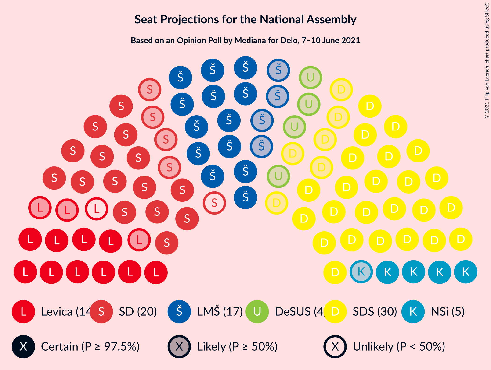
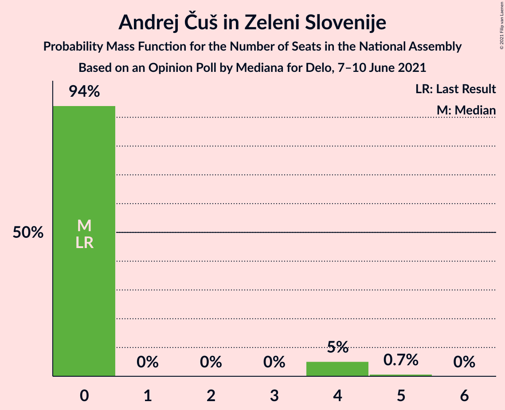
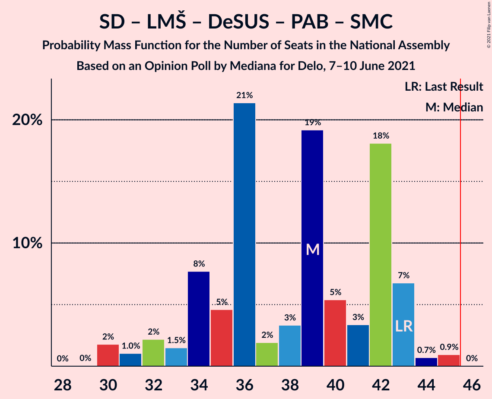
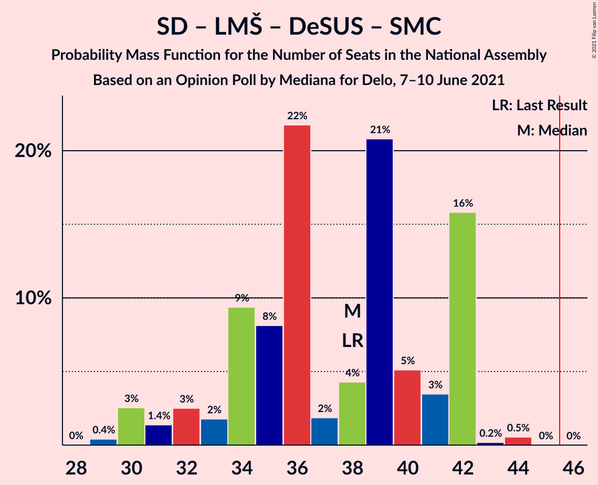

# Opinion Poll by Mediana for Delo, 7–10 June 2021

<a href="#voting-intentions">Voting Intentions</a> | <a href="#seats">Seats</a> | <a href="#coalitions">Coalitions</a> | <a href="#technical-information">Technical Information</a>

## Voting Intentions

### Confidence Intervals

| Party | Last Result | Poll Result | 80% Confidence Interval | 90% Confidence Interval | 95% Confidence Interval | 99% Confidence Interval |
|:-----:|:-----------:|:-----------:|:-----------------------:|:-----------------------:|:-----------------------:|:-----------------------:|
| Slovenska demokratska stranka | 24.9% | 25.9% | 23.9–28.1% |23.3–28.7% |22.8–29.3% |21.9–30.3% |
| Socialni demokrati | 9.9% | 16.2% | 14.5–18.1% |14.1–18.6% |13.7–19.1% |12.9–20.0% |
| Lista Marjana Šarca | 12.6% | 14.5% | 12.9–16.3% |12.5–16.8% |12.1–17.3% |11.4–18.2% |
| Levica | 9.3% | 12.8% | 11.3–14.6% |10.9–15.1% |10.5–15.5% |9.9–16.4% |
| Nova Slovenija–Krščanski demokrati | 7.2% | 5.2% | 4.3–6.4% |4.0–6.8% |3.8–7.1% |3.4–7.7% |
| Demokratična stranka upokojencev Slovenije | 4.9% | 4.1% | 3.3–5.2% |3.0–5.5% |2.9–5.8% |2.5–6.4% |
| Stranka Alenke Bratušek | 5.1% | 3.5% | 2.8–4.6% |2.6–4.9% |2.4–5.2% |2.1–5.7% |
| Piratska stranka Slovenije | 2.2% | 3.0% | 2.3–3.9% |2.1–4.2% |1.9–4.5% |1.7–5.0% |
| Dobra država | 1.5% | 3.0% | 2.3–3.9% |2.1–4.2% |1.9–4.5% |1.7–5.0% |
| Slovenska nacionalna stranka | 4.2% | 2.5% | 1.9–3.5% |1.8–3.7% |1.6–4.0% |1.4–4.5% |
| Andrej Čuš in Zeleni Slovenije | 1.1% | 2.5% | 1.9–3.5% |1.8–3.7% |1.6–4.0% |1.4–4.5% |
| Slovenska ljudska stranka | 2.6% | 2.4% | 1.8–3.3% |1.6–3.6% |1.5–3.8% |1.3–4.3% |
| Stranka modernega centra | 9.7% | 0.8% | 0.5–1.5% |0.5–1.7% |0.4–1.8% |0.3–2.2% |

*Note:* The poll result column reflects the actual value used in the calculations. Published results may vary slightly, and in addition be rounded to fewer digits.

## Seats

### Confidence Intervals

| Party | Last Result | Median | 80% Confidence Interval | 90% Confidence Interval | 95% Confidence Interval | 99% Confidence Interval |
|:-----:|:-----------:|:------:|:-----------------------:|:-----------------------:|:-----------------------:|:-----------------------:|
| <a href="#slovenska-demokratska-stranka">Slovenska demokratska stranka</a> | 25 | 30 | 26–32 |25–33 |24–34 |23–35 |
| <a href="#socialni-demokrati">Socialni demokrati</a> | 10 | 19 | 16–20 |16–21 |15–21 |14–23 |
| <a href="#lista-marjana-šarca">Lista Marjana Šarca</a> | 13 | 17 | 14–19 |14–20 |13–20 |12–20 |
| <a href="#levica">Levica</a> | 9 | 13 | 12–16 |12–16 |10–17 |10–19 |
| <a href="#nova-slovenija–krščanski-demokrati">Nova Slovenija–Krščanski demokrati</a> | 7 | 5 | 4–6 |4–7 |4–7 |0–8 |
| <a href="#demokratična-stranka-upokojencev-slovenije">Demokratična stranka upokojencev Slovenije</a> | 5 | 4 | 0–5 |0–5 |0–6 |0–6 |
| <a href="#stranka-alenke-bratušek">Stranka Alenke Bratušek</a> | 5 | 0 | 0–4 |0–4 |0–5 |0–5 |
| <a href="#piratska-stranka-slovenije">Piratska stranka Slovenije</a> | 0 | 0 | 0 |0–4 |0–4 |0–5 |
| <a href="#dobra-država">Dobra država</a> | 0 | 0 | 0 |0 |0–4 |0–5 |
| <a href="#slovenska-nacionalna-stranka">Slovenska nacionalna stranka</a> | 4 | 0 | 0 |0 |0 |0–5 |
| <a href="#andrej-čuš-in-zeleni-slovenije">Andrej Čuš in Zeleni Slovenije</a> | 0 | 0 | 0 |0–4 |0–4 |0–5 |
| <a href="#slovenska-ljudska-stranka">Slovenska ljudska stranka</a> | 0 | 0 | 0 |0 |0 |0–4 |
| <a href="#stranka-modernega-centra">Stranka modernega centra</a> | 10 | 0 | 0 |0 |0 |0 |

### Slovenska demokratska stranka

*For a full overview of the results for this party, see the [Slovenska demokratska stranka](party-slovenskademokratskastranka.html) page.*

| Number of Seats | Probability | Accumulated | Special Marks |
|:---------------:|:-----------:|:-----------:|:-------------:|
| 22 | 0.5% | 100% |  |
| 23 | 1.0% | 99.5% |  |
| 24 | 2% | 98% |  |
| 25 | 4% | 96% | Last Result |
| 26 | 9% | 93% |  |
| 27 | 17% | 84% |  |
| 28 | 9% | 67% |  |
| 29 | 4% | 57% |  |
| 30 | 29% | 53% | Median |
| 31 | 1.5% | 24% |  |
| 32 | 13% | 22% |  |
| 33 | 6% | 9% |  |
| 34 | 2% | 3% |  |
| 35 | 0.6% | 0.7% |  |
| 36 | 0.1% | 0.1% |  |
| 37 | 0% | 0% |  |

### Socialni demokrati

*For a full overview of the results for this party, see the [Socialni demokrati](party-socialnidemokrati.html) page.*

| Number of Seats | Probability | Accumulated | Special Marks |
|:---------------:|:-----------:|:-----------:|:-------------:|
| 10 | 0% | 100% | Last Result |
| 11 | 0% | 100% |  |
| 12 | 0% | 100% |  |
| 13 | 0.3% | 100% |  |
| 14 | 0.7% | 99.7% |  |
| 15 | 2% | 99.0% |  |
| 16 | 30% | 97% |  |
| 17 | 6% | 67% |  |
| 18 | 9% | 61% |  |
| 19 | 22% | 51% | Median |
| 20 | 23% | 29% |  |
| 21 | 6% | 7% |  |
| 22 | 0.5% | 1.0% |  |
| 23 | 0.5% | 0.6% |  |
| 24 | 0% | 0% |  |

### Lista Marjana Šarca

*For a full overview of the results for this party, see the [Lista Marjana Šarca](party-listamarjanašarca.html) page.*

| Number of Seats | Probability | Accumulated | Special Marks |
|:---------------:|:-----------:|:-----------:|:-------------:|
| 11 | 0.1% | 100% |  |
| 12 | 1.3% | 99.9% |  |
| 13 | 3% | 98.6% | Last Result |
| 14 | 11% | 95% |  |
| 15 | 21% | 84% |  |
| 16 | 4% | 63% |  |
| 17 | 35% | 59% | Median |
| 18 | 2% | 25% |  |
| 19 | 14% | 22% |  |
| 20 | 8% | 9% |  |
| 21 | 0.1% | 0.1% |  |
| 22 | 0% | 0% |  |

### Levica

*For a full overview of the results for this party, see the [Levica](party-levica.html) page.*

| Number of Seats | Probability | Accumulated | Special Marks |
|:---------------:|:-----------:|:-----------:|:-------------:|
| 9 | 0.1% | 100% | Last Result |
| 10 | 4% | 99.9% |  |
| 11 | 1.0% | 96% |  |
| 12 | 39% | 95% |  |
| 13 | 7% | 57% | Median |
| 14 | 17% | 49% |  |
| 15 | 16% | 32% |  |
| 16 | 11% | 16% |  |
| 17 | 2% | 5% |  |
| 18 | 2% | 2% |  |
| 19 | 0.6% | 0.6% |  |
| 20 | 0% | 0% |  |

### Nova Slovenija–Krščanski demokrati

*For a full overview of the results for this party, see the [Nova Slovenija–Krščanski demokrati](party-novaslovenija–krščanskidemokrati.html) page.*

| Number of Seats | Probability | Accumulated | Special Marks |
|:---------------:|:-----------:|:-----------:|:-------------:|
| 0 | 2% | 100% |  |
| 1 | 0% | 98% |  |
| 2 | 0% | 98% |  |
| 3 | 0% | 98% |  |
| 4 | 20% | 98% |  |
| 5 | 47% | 77% | Median |
| 6 | 24% | 30% |  |
| 7 | 5% | 6% | Last Result |
| 8 | 0.9% | 1.1% |  |
| 9 | 0.1% | 0.1% |  |
| 10 | 0% | 0% |  |

### Demokratična stranka upokojencev Slovenije

*For a full overview of the results for this party, see the [Demokratična stranka upokojencev Slovenije](party-demokratičnastrankaupokojencevslovenije.html) page.*

| Number of Seats | Probability | Accumulated | Special Marks |
|:---------------:|:-----------:|:-----------:|:-------------:|
| 0 | 39% | 100% |  |
| 1 | 0% | 61% |  |
| 2 | 0% | 61% |  |
| 3 | 0% | 61% |  |
| 4 | 33% | 61% | Median |
| 5 | 24% | 28% | Last Result |
| 6 | 4% | 4% |  |
| 7 | 0.2% | 0.2% |  |
| 8 | 0% | 0% |  |

### Stranka Alenke Bratušek

*For a full overview of the results for this party, see the [Stranka Alenke Bratušek](party-strankaalenkebratušek.html) page.*

| Number of Seats | Probability | Accumulated | Special Marks |
|:---------------:|:-----------:|:-----------:|:-------------:|
| 0 | 81% | 100% | Median |
| 1 | 0% | 19% |  |
| 2 | 0% | 19% |  |
| 3 | 0% | 19% |  |
| 4 | 15% | 19% |  |
| 5 | 3% | 4% | Last Result |
| 6 | 0.3% | 0.4% |  |
| 7 | 0% | 0% |  |

### Piratska stranka Slovenije

*For a full overview of the results for this party, see the [Piratska stranka Slovenije](party-piratskastrankaslovenije.html) page.*

| Number of Seats | Probability | Accumulated | Special Marks |
|:---------------:|:-----------:|:-----------:|:-------------:|
| 0 | 93% | 100% | Last Result, Median |
| 1 | 0% | 7% |  |
| 2 | 0% | 7% |  |
| 3 | 0% | 7% |  |
| 4 | 5% | 7% |  |
| 5 | 2% | 2% |  |
| 6 | 0.1% | 0.1% |  |
| 7 | 0% | 0% |  |

### Dobra država

*For a full overview of the results for this party, see the [Dobra država](party-dobradržava.html) page.*

| Number of Seats | Probability | Accumulated | Special Marks |
|:---------------:|:-----------:|:-----------:|:-------------:|
| 0 | 96% | 100% | Last Result, Median |
| 1 | 0% | 4% |  |
| 2 | 0% | 4% |  |
| 3 | 0% | 4% |  |
| 4 | 2% | 4% |  |
| 5 | 1.2% | 1.5% |  |
| 6 | 0.3% | 0.3% |  |
| 7 | 0% | 0% |  |

### Slovenska nacionalna stranka

*For a full overview of the results for this party, see the [Slovenska nacionalna stranka](party-slovenskanacionalnastranka.html) page.*

| Number of Seats | Probability | Accumulated | Special Marks |
|:---------------:|:-----------:|:-----------:|:-------------:|
| 0 | 98.7% | 100% | Median |
| 1 | 0% | 1.3% |  |
| 2 | 0% | 1.3% |  |
| 3 | 0% | 1.3% |  |
| 4 | 0.5% | 1.3% | Last Result |
| 5 | 0.8% | 0.9% |  |
| 6 | 0% | 0% |  |

### Andrej Čuš in Zeleni Slovenije

*For a full overview of the results for this party, see the [Andrej Čuš in Zeleni Slovenije](party-andrejčušinzelenislovenije.html) page.*

| Number of Seats | Probability | Accumulated | Special Marks |
|:---------------:|:-----------:|:-----------:|:-------------:|
| 0 | 94% | 100% | Last Result, Median |
| 1 | 0% | 6% |  |
| 2 | 0% | 6% |  |
| 3 | 0% | 6% |  |
| 4 | 5% | 6% |  |
| 5 | 0.7% | 0.8% |  |
| 6 | 0% | 0% |  |

### Slovenska ljudska stranka

*For a full overview of the results for this party, see the [Slovenska ljudska stranka](party-slovenskaljudskastranka.html) page.*

| Number of Seats | Probability | Accumulated | Special Marks |
|:---------------:|:-----------:|:-----------:|:-------------:|
| 0 | 99.4% | 100% | Last Result, Median |
| 1 | 0% | 0.6% |  |
| 2 | 0% | 0.6% |  |
| 3 | 0% | 0.6% |  |
| 4 | 0.5% | 0.6% |  |
| 5 | 0.1% | 0.2% |  |
| 6 | 0% | 0% |  |

### Stranka modernega centra

*For a full overview of the results for this party, see the [Stranka modernega centra](party-strankamodernegacentra.html) page.*

| Number of Seats | Probability | Accumulated | Special Marks |
|:---------------:|:-----------:|:-----------:|:-------------:|
| 0 | 100% | 100% | Median |
| 1 | 0% | 0% |  |
| 2 | 0% | 0% |  |
| 3 | 0% | 0% |  |
| 4 | 0% | 0% |  |
| 5 | 0% | 0% |  |
| 6 | 0% | 0% |  |
| 7 | 0% | 0% |  |
| 8 | 0% | 0% |  |
| 9 | 0% | 0% |  |
| 10 | 0% | 0% | Last Result |

## Coalitions

### Confidence Intervals

| Coalition | Last Result | Median | Majority? | 80% Confidence Interval | 90% Confidence Interval | 95% Confidence Interval | 99% Confidence Interval |
|:---------:|:-----------:|:------:|:---------:|:-----------------------:|:-----------------------:|:-----------------------:|:-----------------------:|
| Slovenska demokratska stranka – Lista Marjana Šarca – Demokratična stranka upokojencev Slovenije | 43 | 49 | 83% | 44–52 | 42–52 | 41–52 | 39–57 |
| Slovenska demokratska stranka – Lista Marjana Šarca | 38 | 46 | 62% | 40–49 | 40–50 | 39–50 | 36–52 |
| Socialni demokrati – Lista Marjana Šarca – Nova Slovenija–Krščanski demokrati – Demokratična stranka upokojencev Slovenije – Stranka Alenke Bratušek – Stranka modernega centra | 50 | 44 | 31% | 39–46 | 38–49 | 36–49 | 36–50 |
| Socialni demokrati – Lista Marjana Šarca – Nova Slovenija–Krščanski demokrati – Demokratična stranka upokojencev Slovenije | 35 | 42 | 22% | 39–46 | 37–46 | 36–46 | 35–47 |
| Socialni demokrati – Lista Marjana Šarca – Nova Slovenija–Krščanski demokrati – Demokratična stranka upokojencev Slovenije – Stranka modernega centra | 45 | 42 | 22% | 39–46 | 37–46 | 36–46 | 35–47 |
| Socialni demokrati – Lista Marjana Šarca – Demokratična stranka upokojencev Slovenije – Stranka Alenke Bratušek – Stranka modernega centra | 43 | 39 | 0% | 34–42 | 32–43 | 31–43 | 30–45 |
| Socialni demokrati – Lista Marjana Šarca – Nova Slovenija–Krščanski demokrati | 30 | 41 | 0.5% | 36–42 | 35–42 | 34–42 | 32–45 |
| Socialni demokrati – Lista Marjana Šarca – Nova Slovenija–Krščanski demokrati – Stranka modernega centra | 40 | 41 | 0.5% | 36–42 | 35–42 | 34–42 | 32–45 |
| Socialni demokrati – Lista Marjana Šarca – Demokratična stranka upokojencev Slovenije | 28 | 38 | 0% | 34–42 | 32–42 | 30–42 | 30–44 |
| Socialni demokrati – Lista Marjana Šarca – Demokratična stranka upokojencev Slovenije – Stranka modernega centra | 38 | 38 | 0% | 34–42 | 32–42 | 30–42 | 30–44 |
| Socialni demokrati – Lista Marjana Šarca | 23 | 35 | 0% | 31–37 | 30–37 | 29–38 | 28–39 |
| Socialni demokrati – Lista Marjana Šarca – Stranka modernega centra | 33 | 35 | 0% | 31–37 | 30–37 | 29–38 | 28–39 |
| Socialni demokrati – Demokratična stranka upokojencev Slovenije – Stranka modernega centra | 25 | 20 | 0% | 16–25 | 16–25 | 16–25 | 15–26 |

### Slovenska demokratska stranka – Lista Marjana Šarca – Demokratična stranka upokojencev Slovenije

| Number of Seats | Probability | Accumulated | Special Marks |
|:---------------:|:-----------:|:-----------:|:-------------:|
| 39 | 0.7% | 100% |  |
| 40 | 1.4% | 99.2% |  |
| 41 | 2% | 98% |  |
| 42 | 2% | 96% |  |
| 43 | 2% | 94% | Last Result |
| 44 | 7% | 92% |  |
| 45 | 2% | 85% |  |
| 46 | 11% | 83% | Majority |
| 47 | 3% | 72% |  |
| 48 | 7% | 69% |  |
| 49 | 20% | 62% |  |
| 50 | 19% | 41% |  |
| 51 | 4% | 23% | Median |
| 52 | 17% | 19% |  |
| 53 | 1.5% | 2% |  |
| 54 | 0.2% | 0.8% |  |
| 55 | 0.1% | 0.6% |  |
| 56 | 0% | 0.5% |  |
| 57 | 0.5% | 0.5% |  |
| 58 | 0% | 0% |  |

### Slovenska demokratska stranka – Lista Marjana Šarca

| Number of Seats | Probability | Accumulated | Special Marks |
|:---------------:|:-----------:|:-----------:|:-------------:|
| 36 | 0.8% | 100% |  |
| 37 | 0.5% | 99.2% |  |
| 38 | 0.8% | 98.7% | Last Result |
| 39 | 1.2% | 98% |  |
| 40 | 7% | 97% |  |
| 41 | 2% | 90% |  |
| 42 | 11% | 88% |  |
| 43 | 4% | 77% |  |
| 44 | 3% | 73% |  |
| 45 | 8% | 70% |  |
| 46 | 12% | 62% | Majority |
| 47 | 21% | 50% | Median |
| 48 | 7% | 29% |  |
| 49 | 13% | 22% |  |
| 50 | 8% | 9% |  |
| 51 | 0% | 0.6% |  |
| 52 | 0.5% | 0.6% |  |
| 53 | 0% | 0.1% |  |
| 54 | 0% | 0.1% |  |
| 55 | 0% | 0% |  |

### Socialni demokrati – Lista Marjana Šarca – Nova Slovenija–Krščanski demokrati – Demokratična stranka upokojencev Slovenije – Stranka Alenke Bratušek – Stranka modernega centra

| Number of Seats | Probability | Accumulated | Special Marks |
|:---------------:|:-----------:|:-----------:|:-------------:|
| 33 | 0% | 100% |  |
| 34 | 0.1% | 99.9% |  |
| 35 | 0.1% | 99.9% |  |
| 36 | 2% | 99.8% |  |
| 37 | 2% | 97% |  |
| 38 | 2% | 95% |  |
| 39 | 7% | 93% |  |
| 40 | 3% | 87% |  |
| 41 | 17% | 84% |  |
| 42 | 9% | 67% |  |
| 43 | 2% | 58% |  |
| 44 | 21% | 57% |  |
| 45 | 4% | 36% | Median |
| 46 | 23% | 31% | Majority |
| 47 | 0.9% | 9% |  |
| 48 | 0.8% | 8% |  |
| 49 | 6% | 7% |  |
| 50 | 0.7% | 0.8% | Last Result |
| 51 | 0.1% | 0.1% |  |
| 52 | 0% | 0% |  |

### Socialni demokrati – Lista Marjana Šarca – Nova Slovenija–Krščanski demokrati – Demokratična stranka upokojencev Slovenije

| Number of Seats | Probability | Accumulated | Special Marks |
|:---------------:|:-----------:|:-----------:|:-------------:|
| 32 | 0.1% | 100% |  |
| 33 | 0% | 99.9% |  |
| 34 | 0.1% | 99.9% |  |
| 35 | 1.0% | 99.8% | Last Result |
| 36 | 3% | 98.8% |  |
| 37 | 2% | 96% |  |
| 38 | 3% | 94% |  |
| 39 | 7% | 91% |  |
| 40 | 7% | 84% |  |
| 41 | 17% | 77% |  |
| 42 | 11% | 59% |  |
| 43 | 2% | 49% |  |
| 44 | 16% | 47% |  |
| 45 | 9% | 31% | Median |
| 46 | 21% | 22% | Majority |
| 47 | 0.7% | 1.0% |  |
| 48 | 0.2% | 0.3% |  |
| 49 | 0.1% | 0.1% |  |
| 50 | 0% | 0% |  |

### Socialni demokrati – Lista Marjana Šarca – Nova Slovenija–Krščanski demokrati – Demokratična stranka upokojencev Slovenije – Stranka modernega centra

| Number of Seats | Probability | Accumulated | Special Marks |
|:---------------:|:-----------:|:-----------:|:-------------:|
| 32 | 0.1% | 100% |  |
| 33 | 0% | 99.9% |  |
| 34 | 0.1% | 99.9% |  |
| 35 | 1.0% | 99.8% |  |
| 36 | 3% | 98.8% |  |
| 37 | 2% | 96% |  |
| 38 | 3% | 94% |  |
| 39 | 7% | 91% |  |
| 40 | 7% | 84% |  |
| 41 | 17% | 77% |  |
| 42 | 11% | 59% |  |
| 43 | 2% | 49% |  |
| 44 | 16% | 47% |  |
| 45 | 9% | 31% | Last Result, Median |
| 46 | 21% | 22% | Majority |
| 47 | 0.7% | 1.0% |  |
| 48 | 0.2% | 0.3% |  |
| 49 | 0.1% | 0.1% |  |
| 50 | 0% | 0% |  |

### Socialni demokrati – Lista Marjana Šarca – Demokratična stranka upokojencev Slovenije – Stranka Alenke Bratušek – Stranka modernega centra

| Number of Seats | Probability | Accumulated | Special Marks |
|:---------------:|:-----------:|:-----------:|:-------------:|
| 29 | 0% | 100% |  |
| 30 | 2% | 99.9% |  |
| 31 | 1.0% | 98% |  |
| 32 | 2% | 97% |  |
| 33 | 1.5% | 95% |  |
| 34 | 8% | 93% |  |
| 35 | 5% | 86% |  |
| 36 | 21% | 81% |  |
| 37 | 2% | 60% |  |
| 38 | 3% | 58% |  |
| 39 | 19% | 54% |  |
| 40 | 5% | 35% | Median |
| 41 | 3% | 30% |  |
| 42 | 18% | 27% |  |
| 43 | 7% | 8% | Last Result |
| 44 | 0.7% | 2% |  |
| 45 | 0.9% | 1.0% |  |
| 46 | 0% | 0% | Majority |

### Socialni demokrati – Lista Marjana Šarca – Nova Slovenija–Krščanski demokrati

| Number of Seats | Probability | Accumulated | Special Marks |
|:---------------:|:-----------:|:-----------:|:-------------:|
| 30 | 0.1% | 100% | Last Result |
| 31 | 0.2% | 99.9% |  |
| 32 | 0.6% | 99.7% |  |
| 33 | 0.7% | 99.1% |  |
| 34 | 2% | 98% |  |
| 35 | 3% | 97% |  |
| 36 | 8% | 93% |  |
| 37 | 3% | 85% |  |
| 38 | 5% | 82% |  |
| 39 | 7% | 77% |  |
| 40 | 19% | 70% |  |
| 41 | 36% | 51% | Median |
| 42 | 13% | 15% |  |
| 43 | 0.6% | 2% |  |
| 44 | 0.6% | 1.4% |  |
| 45 | 0.3% | 0.8% |  |
| 46 | 0% | 0.5% | Majority |
| 47 | 0.4% | 0.4% |  |
| 48 | 0% | 0% |  |

### Socialni demokrati – Lista Marjana Šarca – Nova Slovenija–Krščanski demokrati – Stranka modernega centra

| Number of Seats | Probability | Accumulated | Special Marks |
|:---------------:|:-----------:|:-----------:|:-------------:|
| 30 | 0.1% | 100% |  |
| 31 | 0.2% | 99.9% |  |
| 32 | 0.6% | 99.7% |  |
| 33 | 0.7% | 99.1% |  |
| 34 | 2% | 98% |  |
| 35 | 3% | 97% |  |
| 36 | 8% | 93% |  |
| 37 | 3% | 85% |  |
| 38 | 5% | 82% |  |
| 39 | 7% | 77% |  |
| 40 | 19% | 70% | Last Result |
| 41 | 36% | 51% | Median |
| 42 | 13% | 15% |  |
| 43 | 0.6% | 2% |  |
| 44 | 0.6% | 1.4% |  |
| 45 | 0.3% | 0.8% |  |
| 46 | 0% | 0.5% | Majority |
| 47 | 0.4% | 0.4% |  |
| 48 | 0% | 0% |  |

### Socialni demokrati – Lista Marjana Šarca – Demokratična stranka upokojencev Slovenije

| Number of Seats | Probability | Accumulated | Special Marks |
|:---------------:|:-----------:|:-----------:|:-------------:|
| 28 | 0% | 100% | Last Result |
| 29 | 0.4% | 100% |  |
| 30 | 3% | 99.6% |  |
| 31 | 1.4% | 97% |  |
| 32 | 3% | 96% |  |
| 33 | 2% | 93% |  |
| 34 | 9% | 91% |  |
| 35 | 8% | 82% |  |
| 36 | 22% | 74% |  |
| 37 | 2% | 52% |  |
| 38 | 4% | 50% |  |
| 39 | 21% | 46% |  |
| 40 | 5% | 25% | Median |
| 41 | 3% | 20% |  |
| 42 | 16% | 17% |  |
| 43 | 0.2% | 0.8% |  |
| 44 | 0.5% | 0.6% |  |
| 45 | 0% | 0% |  |

### Socialni demokrati – Lista Marjana Šarca – Demokratična stranka upokojencev Slovenije – Stranka modernega centra

| Number of Seats | Probability | Accumulated | Special Marks |
|:---------------:|:-----------:|:-----------:|:-------------:|
| 29 | 0.4% | 100% |  |
| 30 | 3% | 99.6% |  |
| 31 | 1.4% | 97% |  |
| 32 | 3% | 96% |  |
| 33 | 2% | 93% |  |
| 34 | 9% | 91% |  |
| 35 | 8% | 82% |  |
| 36 | 22% | 74% |  |
| 37 | 2% | 52% |  |
| 38 | 4% | 50% | Last Result |
| 39 | 21% | 46% |  |
| 40 | 5% | 25% | Median |
| 41 | 3% | 20% |  |
| 42 | 16% | 17% |  |
| 43 | 0.2% | 0.8% |  |
| 44 | 0.5% | 0.6% |  |
| 45 | 0% | 0% |  |

### Socialni demokrati – Lista Marjana Šarca

| Number of Seats | Probability | Accumulated | Special Marks |
|:---------------:|:-----------:|:-----------:|:-------------:|
| 23 | 0% | 100% | Last Result |
| 24 | 0% | 100% |  |
| 25 | 0% | 100% |  |
| 26 | 0% | 100% |  |
| 27 | 0.1% | 100% |  |
| 28 | 0.5% | 99.9% |  |
| 29 | 3% | 99.4% |  |
| 30 | 5% | 96% |  |
| 31 | 7% | 92% |  |
| 32 | 4% | 85% |  |
| 33 | 2% | 81% |  |
| 34 | 11% | 79% |  |
| 35 | 27% | 68% |  |
| 36 | 20% | 41% | Median |
| 37 | 17% | 21% |  |
| 38 | 3% | 4% |  |
| 39 | 0.7% | 1.1% |  |
| 40 | 0.4% | 0.5% |  |
| 41 | 0% | 0.1% |  |
| 42 | 0% | 0% |  |

### Socialni demokrati – Lista Marjana Šarca – Stranka modernega centra

| Number of Seats | Probability | Accumulated | Special Marks |
|:---------------:|:-----------:|:-----------:|:-------------:|
| 27 | 0.1% | 100% |  |
| 28 | 0.5% | 99.9% |  |
| 29 | 3% | 99.4% |  |
| 30 | 5% | 96% |  |
| 31 | 7% | 92% |  |
| 32 | 4% | 85% |  |
| 33 | 2% | 81% | Last Result |
| 34 | 11% | 79% |  |
| 35 | 27% | 68% |  |
| 36 | 20% | 41% | Median |
| 37 | 17% | 21% |  |
| 38 | 3% | 4% |  |
| 39 | 0.7% | 1.1% |  |
| 40 | 0.4% | 0.5% |  |
| 41 | 0% | 0.1% |  |
| 42 | 0% | 0% |  |

### Socialni demokrati – Demokratična stranka upokojencev Slovenije – Stranka modernega centra

| Number of Seats | Probability | Accumulated | Special Marks |
|:---------------:|:-----------:|:-----------:|:-------------:|
| 13 | 0.1% | 100% |  |
| 14 | 0.2% | 99.9% |  |
| 15 | 0.9% | 99.8% |  |
| 16 | 12% | 98.8% |  |
| 17 | 1.4% | 87% |  |
| 18 | 4% | 85% |  |
| 19 | 19% | 81% |  |
| 20 | 15% | 62% |  |
| 21 | 6% | 47% |  |
| 22 | 6% | 41% |  |
| 23 | 6% | 36% | Median |
| 24 | 11% | 30% |  |
| 25 | 18% | 19% | Last Result |
| 26 | 0.4% | 0.7% |  |
| 27 | 0.3% | 0.3% |  |
| 28 | 0% | 0% |  |

## Technical Information

### Opinion Poll

+ **Polling firm:** Mediana
+ **Commissioner(s):** Delo
+ **Fieldwork period:** 7–10 June 2021

### Calculations

+ **Sample size:** 710
+ **Simulations done:** 1,048,576
+ **Error estimate:** 2.77%

