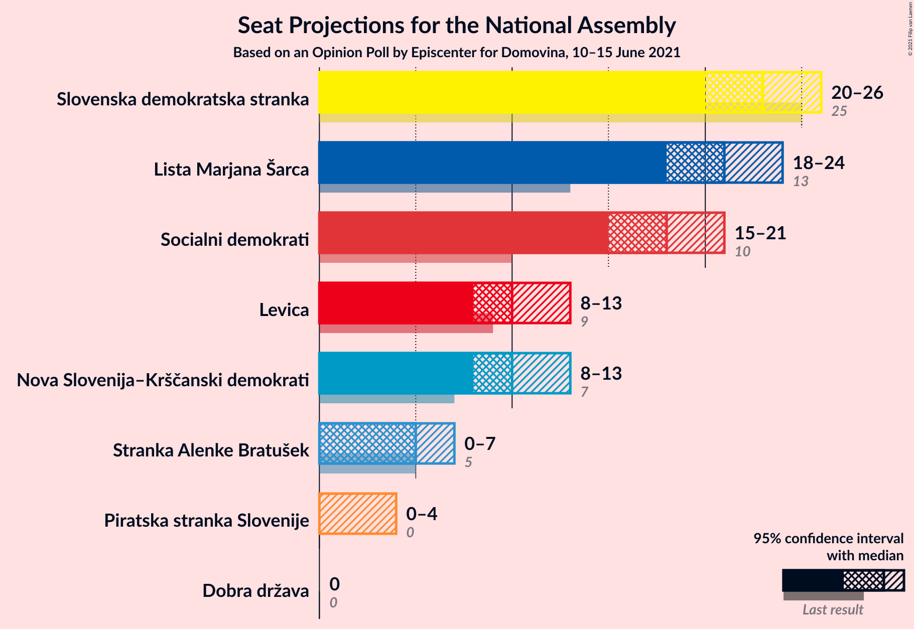
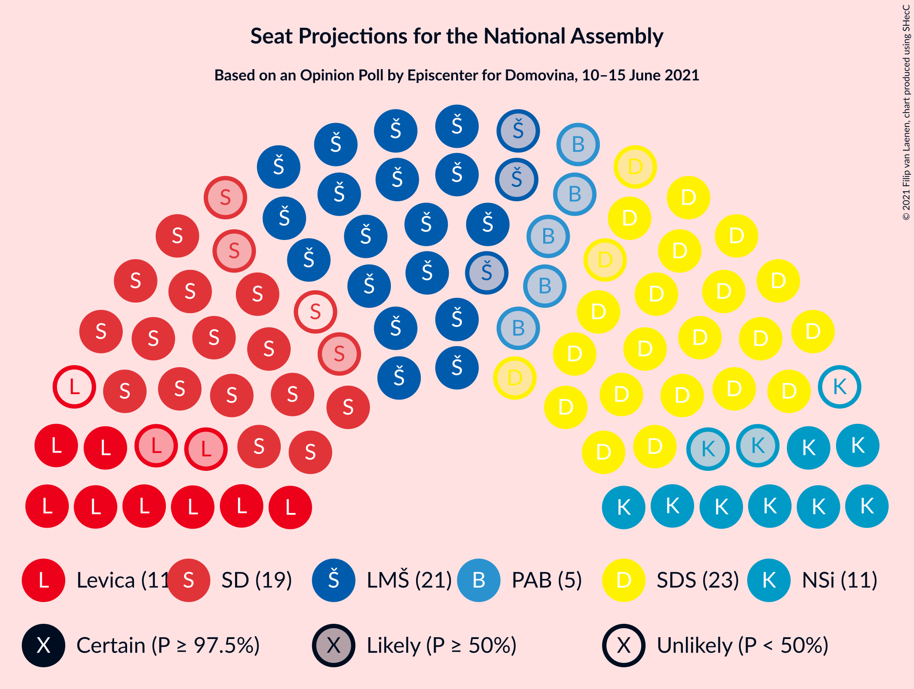
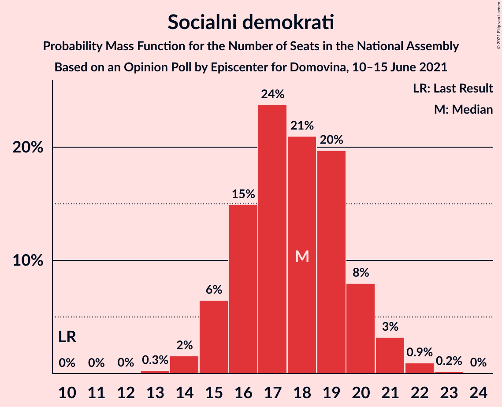
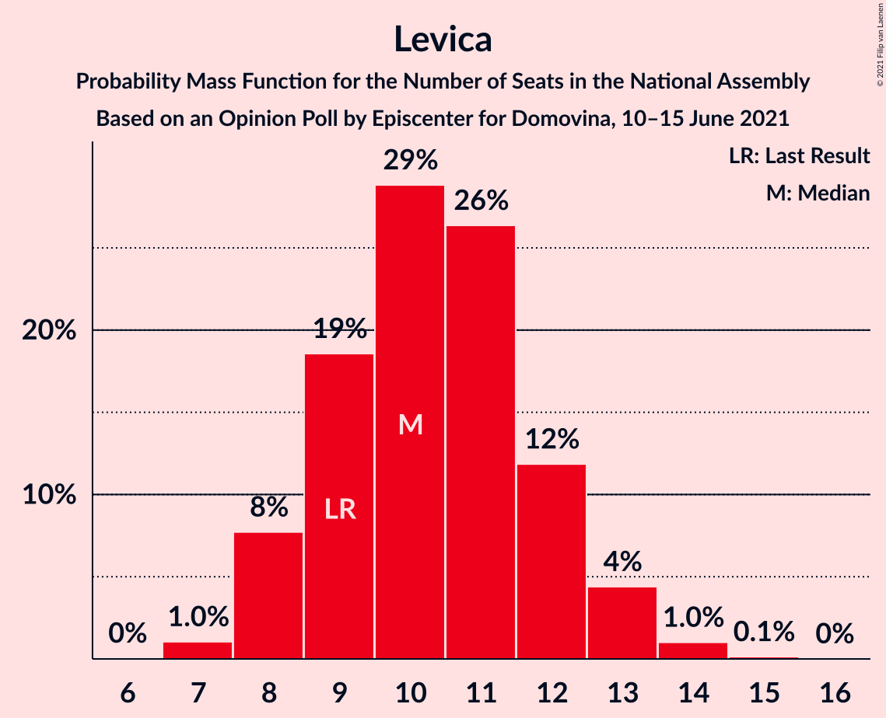
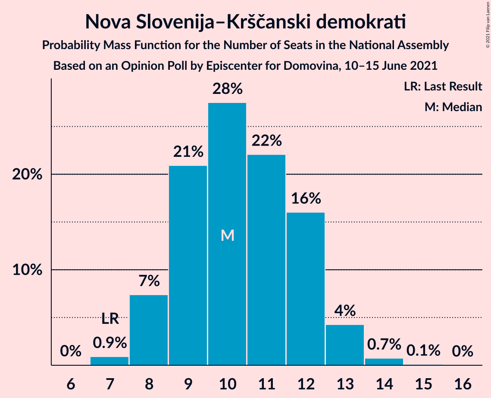
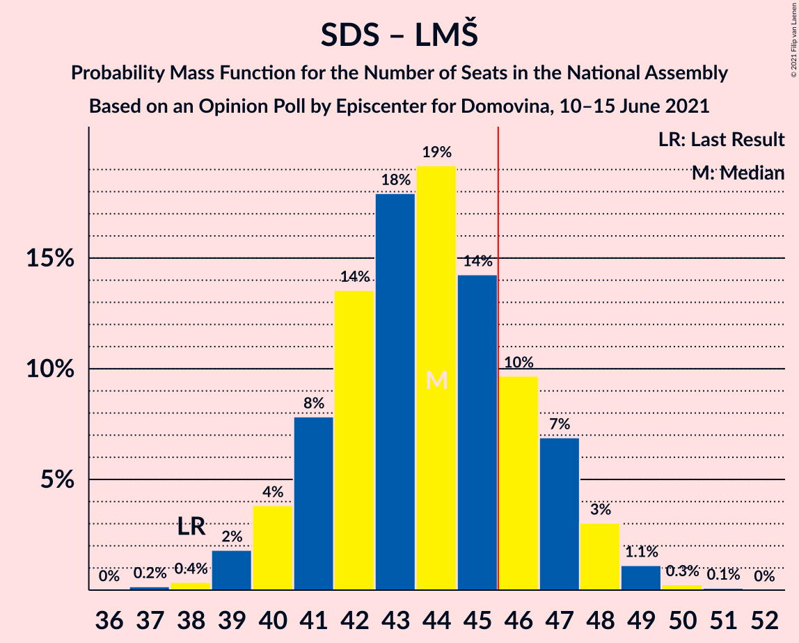

# Opinion Poll by Episcenter for Domovina, 10–15 June 2021

<a href="#voting-intentions">Voting Intentions</a> | <a href="#seats">Seats</a> | <a href="#coalitions">Coalitions</a> | <a href="#technical-information">Technical Information</a>

## Voting Intentions

### Confidence Intervals

| Party | Last Result | Poll Result | 80% Confidence Interval | 90% Confidence Interval | 95% Confidence Interval | 99% Confidence Interval |
|:-----:|:-----------:|:-----------:|:-----------------------:|:-----------------------:|:-----------------------:|:-----------------------:|
| Slovenska demokratska stranka | 24.9% | 24.4% | 22.2–26.8% |21.6–27.5% |21.0–28.1% |20.0–29.3% |
| Lista Marjana Šarca | 12.6% | 22.3% | 20.1–24.6% |19.5–25.3% |19.0–25.9% |18.0–27.0% |
| Socialni demokrati | 9.9% | 18.9% | 16.9–21.2% |16.4–21.8% |15.9–22.3% |15.0–23.5% |
| Levica | 9.3% | 11.1% | 9.6–13.0% |9.2–13.5% |8.8–14.0% |8.1–14.9% |
| Nova Slovenija–Krščanski demokrati | 7.2% | 11.1% | 9.6–13.0% |9.2–13.5% |8.8–14.0% |8.1–14.9% |
| Stranka Alenke Bratušek | 5.1% | 5.7% | 4.6–7.1% |4.3–7.5% |4.0–7.9% |3.6–8.6% |
| Piratska stranka Slovenije | 2.2% | 3.4% | 2.6–4.5% |2.3–4.9% |2.2–5.2% |1.8–5.8% |
| Dobra država | 1.5% | 2.3% | 1.7–3.3% |1.5–3.6% |1.4–3.9% |1.1–4.5% |

*Note:* The poll result column reflects the actual value used in the calculations. Published results may vary slightly, and in addition be rounded to fewer digits.

## Seats

### Confidence Intervals

| Party | Last Result | Median | 80% Confidence Interval | 90% Confidence Interval | 95% Confidence Interval | 99% Confidence Interval |
|:-----:|:-----------:|:------:|:-----------------------:|:-----------------------:|:-----------------------:|:-----------------------:|
| <a href="#slovenska-demokratska-stranka">Slovenska demokratska stranka</a> | 25 | 22 | 21–25 |21–26 |21–26 |20–27 |
| <a href="#lista-marjana-šarca">Lista Marjana Šarca</a> | 13 | 21 | 19–23 |18–24 |18–24 |17–25 |
| <a href="#socialni-demokrati">Socialni demokrati</a> | 10 | 18 | 16–20 |15–20 |15–21 |14–22 |
| <a href="#levica">Levica</a> | 9 | 10 | 9–12 |8–13 |8–13 |7–14 |
| <a href="#nova-slovenija–krščanski-demokrati">Nova Slovenija–Krščanski demokrati</a> | 7 | 10 | 9–12 |8–12 |8–13 |7–14 |
| <a href="#stranka-alenke-bratušek">Stranka Alenke Bratušek</a> | 5 | 6 | 4–6 |4–7 |3–7 |0–7 |
| <a href="#piratska-stranka-slovenije">Piratska stranka Slovenije</a> | 0 | 0 | 0–4 |0–4 |0–4 |0–5 |
| <a href="#dobra-država">Dobra država</a> | 0 | 0 | 0 |0 |0 |0–3 |

### Slovenska demokratska stranka

*For a full overview of the results for this party, see the [Slovenska demokratska stranka](party-slovenskademokratskastranka.html) page.*

| Number of Seats | Probability | Accumulated | Special Marks |
|:---------------:|:-----------:|:-----------:|:-------------:|
| 17 | 0.1% | 100% |  |
| 18 | 0.2% | 99.9% |  |
| 19 | 0.2% | 99.8% |  |
| 20 | 2% | 99.5% |  |
| 21 | 17% | 98% |  |
| 22 | 48% | 81% | Median |
| 23 | 9% | 33% |  |
| 24 | 2% | 24% |  |
| 25 | 15% | 22% | Last Result |
| 26 | 5% | 7% |  |
| 27 | 2% | 2% |  |
| 28 | 0.2% | 0.2% |  |
| 29 | 0% | 0% |  |

### Lista Marjana Šarca

*For a full overview of the results for this party, see the [Lista Marjana Šarca](party-listamarjanašarca.html) page.*

| Number of Seats | Probability | Accumulated | Special Marks |
|:---------------:|:-----------:|:-----------:|:-------------:|
| 13 | 0% | 100% | Last Result |
| 14 | 0% | 100% |  |
| 15 | 0% | 100% |  |
| 16 | 0.3% | 100% |  |
| 17 | 2% | 99.7% |  |
| 18 | 4% | 98% |  |
| 19 | 11% | 94% |  |
| 20 | 21% | 84% |  |
| 21 | 23% | 63% | Median |
| 22 | 17% | 40% |  |
| 23 | 18% | 23% |  |
| 24 | 3% | 5% |  |
| 25 | 2% | 2% |  |
| 26 | 0.2% | 0.2% |  |
| 27 | 0% | 0.1% |  |
| 28 | 0% | 0% |  |

### Socialni demokrati

*For a full overview of the results for this party, see the [Socialni demokrati](party-socialnidemokrati.html) page.*

| Number of Seats | Probability | Accumulated | Special Marks |
|:---------------:|:-----------:|:-----------:|:-------------:|
| 10 | 0% | 100% | Last Result |
| 11 | 0% | 100% |  |
| 12 | 0% | 100% |  |
| 13 | 0.2% | 100% |  |
| 14 | 1.0% | 99.8% |  |
| 15 | 4% | 98.8% |  |
| 16 | 13% | 95% |  |
| 17 | 29% | 82% |  |
| 18 | 10% | 53% | Median |
| 19 | 27% | 43% |  |
| 20 | 11% | 16% |  |
| 21 | 3% | 4% |  |
| 22 | 0.8% | 0.9% |  |
| 23 | 0.1% | 0.1% |  |
| 24 | 0% | 0% |  |

### Levica

*For a full overview of the results for this party, see the [Levica](party-levica.html) page.*

| Number of Seats | Probability | Accumulated | Special Marks |
|:---------------:|:-----------:|:-----------:|:-------------:|
| 7 | 0.8% | 100% |  |
| 8 | 9% | 99.2% |  |
| 9 | 14% | 91% | Last Result |
| 10 | 33% | 77% | Median |
| 11 | 32% | 44% |  |
| 12 | 6% | 12% |  |
| 13 | 4% | 6% |  |
| 14 | 1.4% | 1.4% |  |
| 15 | 0% | 0% |  |

### Nova Slovenija–Krščanski demokrati

*For a full overview of the results for this party, see the [Nova Slovenija–Krščanski demokrati](party-novaslovenija–krščanskidemokrati.html) page.*

| Number of Seats | Probability | Accumulated | Special Marks |
|:---------------:|:-----------:|:-----------:|:-------------:|
| 7 | 0.6% | 100% | Last Result |
| 8 | 6% | 99.3% |  |
| 9 | 22% | 93% |  |
| 10 | 40% | 71% | Median |
| 11 | 20% | 31% |  |
| 12 | 8% | 11% |  |
| 13 | 2% | 3% |  |
| 14 | 0.7% | 0.9% |  |
| 15 | 0.1% | 0.2% |  |
| 16 | 0% | 0% |  |

### Stranka Alenke Bratušek

*For a full overview of the results for this party, see the [Stranka Alenke Bratušek](party-strankaalenkebratušek.html) page.*

| Number of Seats | Probability | Accumulated | Special Marks |
|:---------------:|:-----------:|:-----------:|:-------------:|
| 0 | 2% | 100% |  |
| 1 | 0% | 98% |  |
| 2 | 0% | 98% |  |
| 3 | 1.3% | 98% |  |
| 4 | 16% | 97% |  |
| 5 | 29% | 80% | Last Result |
| 6 | 44% | 51% | Median |
| 7 | 7% | 7% |  |
| 8 | 0.3% | 0.4% |  |
| 9 | 0% | 0% |  |

### Piratska stranka Slovenije

*For a full overview of the results for this party, see the [Piratska stranka Slovenije](party-piratskastrankaslovenije.html) page.*

| Number of Seats | Probability | Accumulated | Special Marks |
|:---------------:|:-----------:|:-----------:|:-------------:|
| 0 | 84% | 100% | Last Result, Median |
| 1 | 0% | 16% |  |
| 2 | 0% | 16% |  |
| 3 | 6% | 16% |  |
| 4 | 9% | 10% |  |
| 5 | 0.8% | 0.9% |  |
| 6 | 0.1% | 0.1% |  |
| 7 | 0% | 0% |  |

### Dobra država

*For a full overview of the results for this party, see the [Dobra država](party-dobradržava.html) page.*

| Number of Seats | Probability | Accumulated | Special Marks |
|:---------------:|:-----------:|:-----------:|:-------------:|
| 0 | 99.3% | 100% | Last Result, Median |
| 1 | 0% | 0.7% |  |
| 2 | 0% | 0.7% |  |
| 3 | 0.3% | 0.7% |  |
| 4 | 0.4% | 0.4% |  |
| 5 | 0% | 0% |  |

## Coalitions

### Confidence Intervals

| Coalition | Last Result | Median | Majority? | 80% Confidence Interval | 90% Confidence Interval | 95% Confidence Interval | 99% Confidence Interval |
|:---------:|:-----------:|:------:|:---------:|:-----------------------:|:-----------------------:|:-----------------------:|:-----------------------:|
| Lista Marjana Šarca – Socialni demokrati – Nova Slovenija–Krščanski demokrati | 30 | 49 | 93% | 47–52 | 45–53 | 45–53 | 43–54 |
| Slovenska demokratska stranka – Lista Marjana Šarca | 38 | 44 | 15% | 42–47 | 41–47 | 40–47 | 39–49 |
| Lista Marjana Šarca – Socialni demokrati | 23 | 39 | 0% | 36–42 | 35–42 | 35–43 | 33–44 |

### Lista Marjana Šarca – Socialni demokrati – Nova Slovenija–Krščanski demokrati

| Number of Seats | Probability | Accumulated | Special Marks |
|:---------------:|:-----------:|:-----------:|:-------------:|
| 30 | 0% | 100% | Last Result |
| 31 | 0% | 100% |  |
| 32 | 0% | 100% |  |
| 33 | 0% | 100% |  |
| 34 | 0% | 100% |  |
| 35 | 0% | 100% |  |
| 36 | 0% | 100% |  |
| 37 | 0% | 100% |  |
| 38 | 0% | 100% |  |
| 39 | 0% | 100% |  |
| 40 | 0% | 100% |  |
| 41 | 0.1% | 100% |  |
| 42 | 0.1% | 99.9% |  |
| 43 | 0.6% | 99.8% |  |
| 44 | 0.9% | 99.2% |  |
| 45 | 5% | 98% |  |
| 46 | 3% | 93% | Majority |
| 47 | 9% | 91% |  |
| 48 | 14% | 81% |  |
| 49 | 24% | 67% | Median |
| 50 | 24% | 43% |  |
| 51 | 6% | 19% |  |
| 52 | 8% | 13% |  |
| 53 | 4% | 5% |  |
| 54 | 0.5% | 0.9% |  |
| 55 | 0.3% | 0.4% |  |
| 56 | 0.1% | 0.1% |  |
| 57 | 0% | 0% |  |

### Slovenska demokratska stranka – Lista Marjana Šarca

| Number of Seats | Probability | Accumulated | Special Marks |
|:---------------:|:-----------:|:-----------:|:-------------:|
| 37 | 0.1% | 100% |  |
| 38 | 0.3% | 99.9% | Last Result |
| 39 | 1.2% | 99.6% |  |
| 40 | 2% | 98% |  |
| 41 | 4% | 96% |  |
| 42 | 22% | 92% |  |
| 43 | 16% | 70% | Median |
| 44 | 18% | 54% |  |
| 45 | 20% | 36% |  |
| 46 | 5% | 15% | Majority |
| 47 | 8% | 11% |  |
| 48 | 2% | 2% |  |
| 49 | 0.4% | 0.6% |  |
| 50 | 0.2% | 0.2% |  |
| 51 | 0% | 0% |  |

### Lista Marjana Šarca – Socialni demokrati

| Number of Seats | Probability | Accumulated | Special Marks |
|:---------------:|:-----------:|:-----------:|:-------------:|
| 23 | 0% | 100% | Last Result |
| 24 | 0% | 100% |  |
| 25 | 0% | 100% |  |
| 26 | 0% | 100% |  |
| 27 | 0% | 100% |  |
| 28 | 0% | 100% |  |
| 29 | 0% | 100% |  |
| 30 | 0% | 100% |  |
| 31 | 0% | 100% |  |
| 32 | 0.1% | 100% |  |
| 33 | 0.4% | 99.9% |  |
| 34 | 2% | 99.5% |  |
| 35 | 3% | 98% |  |
| 36 | 8% | 95% |  |
| 37 | 10% | 87% |  |
| 38 | 11% | 77% |  |
| 39 | 22% | 66% | Median |
| 40 | 24% | 44% |  |
| 41 | 10% | 20% |  |
| 42 | 7% | 11% |  |
| 43 | 3% | 4% |  |
| 44 | 0.8% | 1.1% |  |
| 45 | 0.3% | 0.3% |  |
| 46 | 0% | 0% | Majority |

## Technical Information

### Opinion Poll

+ **Polling firm:** Episcenter
+ **Commissioner(s):** Domovina
+ **Fieldwork period:** 10–15 June 2021

### Calculations

+ **Sample size:** 566
+ **Simulations done:** 131,072
+ **Error estimate:** 2.53%

