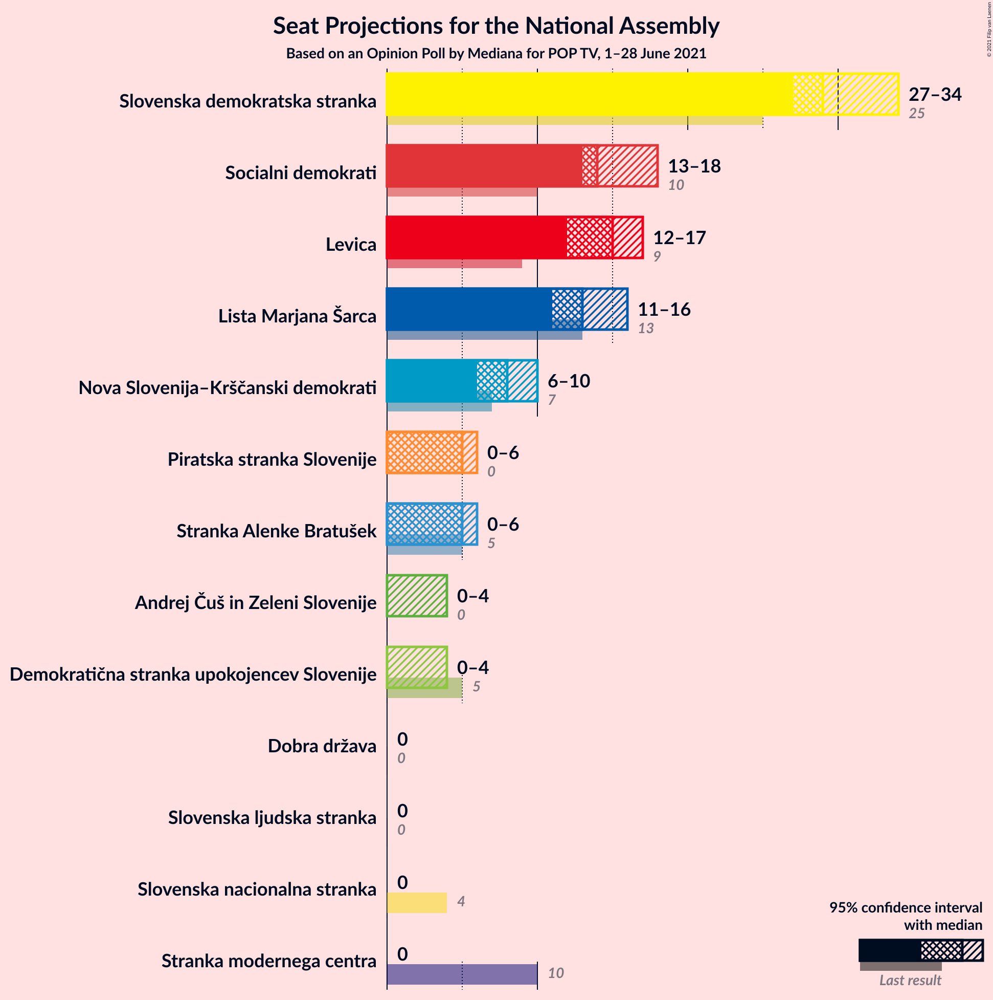
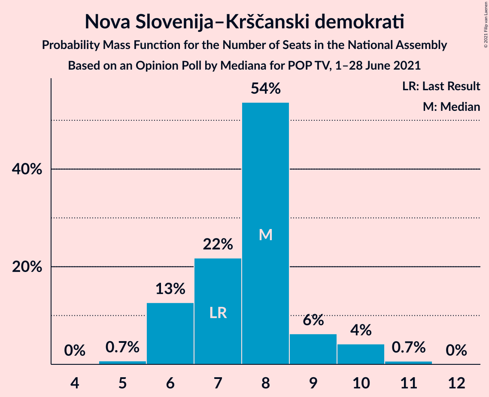
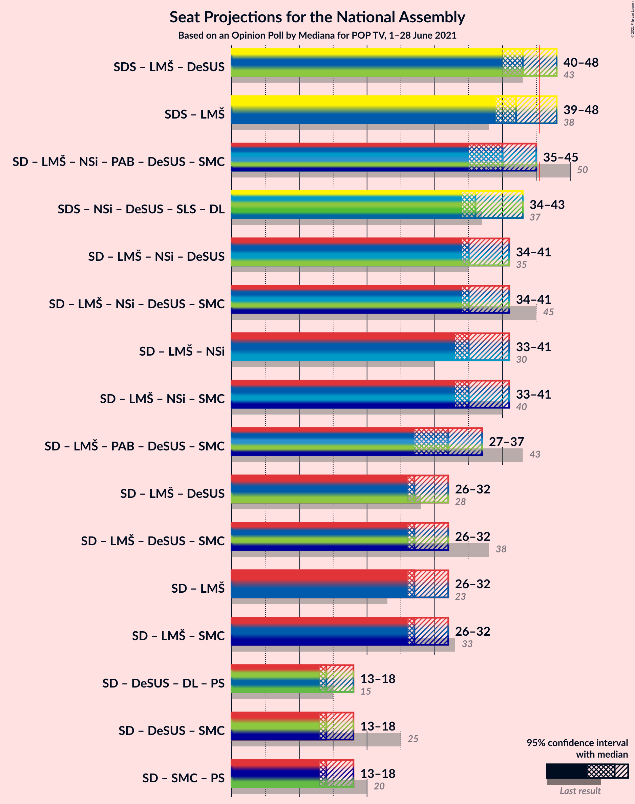
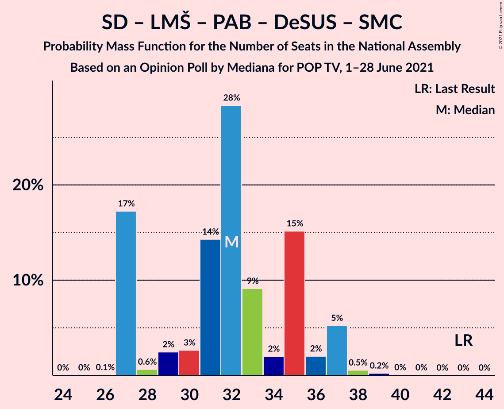
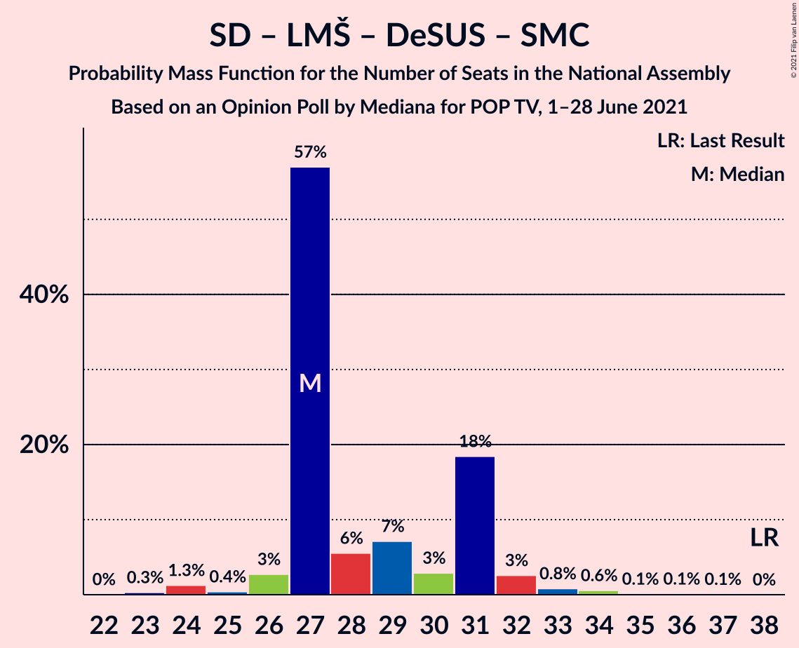
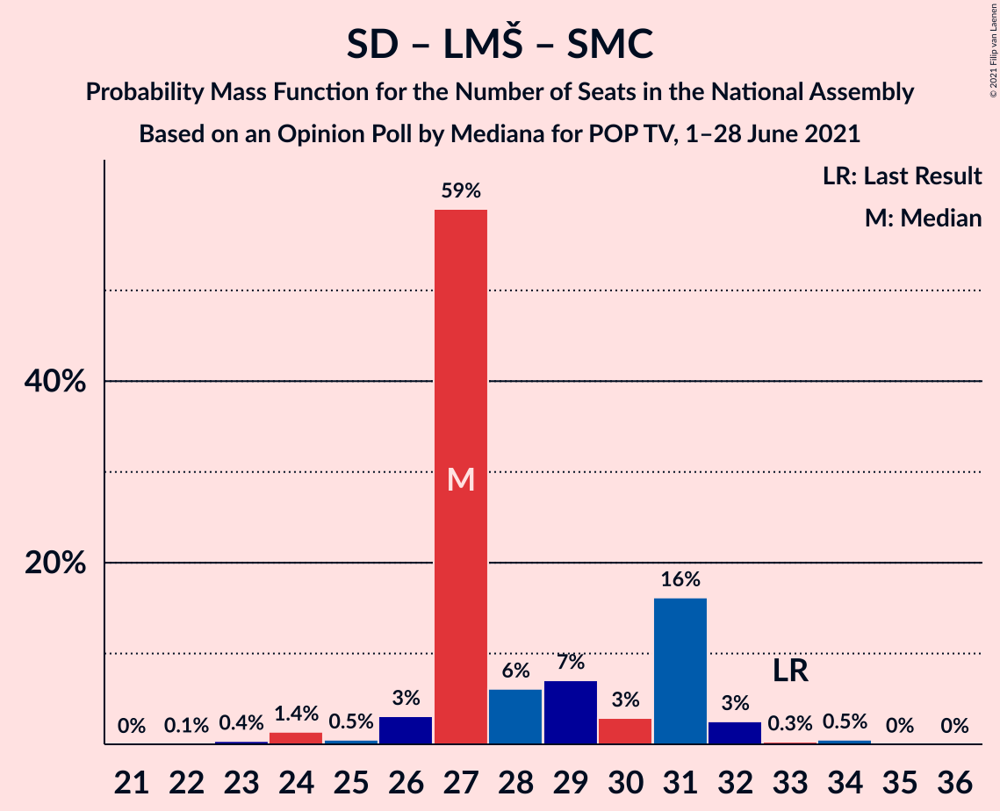

# Opinion Poll by Mediana for POP TV, 1–28 June 2021

<a href="#voting-intentions">Voting Intentions</a> | <a href="#seats">Seats</a> | <a href="#coalitions">Coalitions</a> | <a href="#technical-information">Technical Information</a>

## Voting Intentions

### Confidence Intervals

| Party | Last Result | Poll Result | 80% Confidence Interval | 90% Confidence Interval | 95% Confidence Interval | 99% Confidence Interval |
|:-----:|:-----------:|:-----------:|:-----------------------:|:-----------------------:|:-----------------------:|:-----------------------:|
| Slovenska demokratska stranka | 24.9% | 28.3% | 26.2–30.5% |25.6–31.1% |25.1–31.7% |24.1–32.8% |
| Socialni demokrati | 9.9% | 14.2% | 12.6–16.0% |12.2–16.5% |11.8–17.0% |11.1–17.9% |
| Levica | 9.3% | 14.1% | 12.5–15.9% |12.1–16.4% |11.7–16.8% |11.0–17.7% |
| Lista Marjana Šarca | 12.6% | 12.7% | 11.2–14.4% |10.8–14.9% |10.4–15.3% |9.7–16.2% |
| Nova Slovenija–Krščanski demokrati | 7.2% | 7.3% | 6.2–8.7% |5.9–9.1% |5.6–9.5% |5.1–10.2% |
| Stranka Alenke Bratušek | 5.1% | 4.8% | 3.9–6.0% |3.6–6.3% |3.4–6.6% |3.1–7.2% |
| Piratska stranka Slovenije | 2.2% | 3.9% | 3.1–5.0% |2.9–5.4% |2.7–5.6% |2.4–6.2% |
| Demokratična stranka upokojencev Slovenije | 4.9% | 3.1% | 2.4–4.1% |2.2–4.4% |2.1–4.6% |1.8–5.2% |
| Andrej Čuš in Zeleni Slovenije | 1.1% | 2.5% | 1.9–3.5% |1.8–3.7% |1.6–4.0% |1.4–4.5% |
| Slovenska ljudska stranka | 2.6% | 2.4% | 1.8–3.3% |1.6–3.6% |1.5–3.8% |1.2–4.3% |
| Dobra država | 1.5% | 2.1% | 1.6–3.0% |1.4–3.2% |1.3–3.5% |1.1–3.9% |
| Slovenska nacionalna stranka | 4.2% | 2.0% | 1.4–2.8% |1.3–3.1% |1.2–3.3% |1.0–3.7% |
| Stranka modernega centra | 9.7% | 0.8% | 0.5–1.5% |0.5–1.7% |0.4–1.8% |0.3–2.2% |

*Note:* The poll result column reflects the actual value used in the calculations. Published results may vary slightly, and in addition be rounded to fewer digits.

## Seats

### Confidence Intervals

| Party | Last Result | Median | 80% Confidence Interval | 90% Confidence Interval | 95% Confidence Interval | 99% Confidence Interval |
|:-----:|:-----------:|:------:|:-----------------------:|:-----------------------:|:-----------------------:|:-----------------------:|
| <a href="#slovenska-demokratska-stranka">Slovenska demokratska stranka</a> | 25 | 30 | 27–32 |27–33 |27–35 |27–36 |
| <a href="#socialni-demokrati">Socialni demokrati</a> | 10 | 16 | 14–17 |14–18 |13–18 |13–19 |
| <a href="#levica">Levica</a> | 9 | 15 | 13–17 |13–17 |13–18 |12–18 |
| <a href="#lista-marjana-šarca">Lista Marjana Šarca</a> | 13 | 13 | 11–14 |11–15 |11–15 |11–15 |
| <a href="#nova-slovenija–krščanski-demokrati">Nova Slovenija–Krščanski demokrati</a> | 7 | 7 | 6–8 |6–8 |6–10 |5–10 |
| <a href="#stranka-alenke-bratušek">Stranka Alenke Bratušek</a> | 5 | 5 | 4–6 |4–7 |4–7 |0–7 |
| <a href="#piratska-stranka-slovenije">Piratska stranka Slovenije</a> | 0 | 0 | 0–5 |0–5 |0–5 |0–6 |
| <a href="#demokratična-stranka-upokojencev-slovenije">Demokratična stranka upokojencev Slovenije</a> | 5 | 0 | 0 |0 |0–4 |0–5 |
| <a href="#andrej-čuš-in-zeleni-slovenije">Andrej Čuš in Zeleni Slovenije</a> | 0 | 0 | 0 |0 |0 |0 |
| <a href="#slovenska-ljudska-stranka">Slovenska ljudska stranka</a> | 0 | 0 | 0 |0 |0 |0 |
| <a href="#dobra-država">Dobra država</a> | 0 | 0 | 0 |0 |0 |0 |
| <a href="#slovenska-nacionalna-stranka">Slovenska nacionalna stranka</a> | 4 | 0 | 0 |0 |0 |0–4 |
| <a href="#stranka-modernega-centra">Stranka modernega centra</a> | 10 | 0 | 0 |0 |0 |0 |

### Slovenska demokratska stranka

*For a full overview of the results for this party, see the [Slovenska demokratska stranka](party-slovenskademokratskastranka.html) page.*

| Number of Seats | Probability | Accumulated | Special Marks |
|:---------------:|:-----------:|:-----------:|:-------------:|
| 25 | 0.1% | 100% | Last Result |
| 26 | 0.4% | 99.9% |  |
| 27 | 12% | 99.6% |  |
| 28 | 14% | 88% |  |
| 29 | 4% | 74% |  |
| 30 | 24% | 70% | Median |
| 31 | 15% | 46% |  |
| 32 | 26% | 31% |  |
| 33 | 0.2% | 5% |  |
| 34 | 0.1% | 5% |  |
| 35 | 4% | 5% |  |
| 36 | 0.6% | 0.6% |  |
| 37 | 0% | 0% |  |

### Socialni demokrati

*For a full overview of the results for this party, see the [Socialni demokrati](party-socialnidemokrati.html) page.*

| Number of Seats | Probability | Accumulated | Special Marks |
|:---------------:|:-----------:|:-----------:|:-------------:|
| 10 | 0% | 100% | Last Result |
| 11 | 0.1% | 100% |  |
| 12 | 0.4% | 99.9% |  |
| 13 | 2% | 99.5% |  |
| 14 | 22% | 97% |  |
| 15 | 1.2% | 75% |  |
| 16 | 54% | 74% | Median |
| 17 | 10% | 19% |  |
| 18 | 9% | 10% |  |
| 19 | 1.0% | 1.1% |  |
| 20 | 0% | 0% |  |

### Levica

*For a full overview of the results for this party, see the [Levica](party-levica.html) page.*

| Number of Seats | Probability | Accumulated | Special Marks |
|:---------------:|:-----------:|:-----------:|:-------------:|
| 9 | 0% | 100% | Last Result |
| 10 | 0% | 100% |  |
| 11 | 0.2% | 100% |  |
| 12 | 1.3% | 99.8% |  |
| 13 | 15% | 98% |  |
| 14 | 32% | 83% |  |
| 15 | 1.2% | 51% | Median |
| 16 | 18% | 50% |  |
| 17 | 27% | 31% |  |
| 18 | 4% | 5% |  |
| 19 | 0% | 0.1% |  |
| 20 | 0.1% | 0.1% |  |
| 21 | 0% | 0% |  |

### Lista Marjana Šarca

*For a full overview of the results for this party, see the [Lista Marjana Šarca](party-listamarjanašarca.html) page.*

| Number of Seats | Probability | Accumulated | Special Marks |
|:---------------:|:-----------:|:-----------:|:-------------:|
| 9 | 0.1% | 100% |  |
| 10 | 0.1% | 99.9% |  |
| 11 | 26% | 99.8% |  |
| 12 | 9% | 74% |  |
| 13 | 42% | 64% | Last Result, Median |
| 14 | 17% | 22% |  |
| 15 | 5% | 5% |  |
| 16 | 0.1% | 0.4% |  |
| 17 | 0.2% | 0.3% |  |
| 18 | 0% | 0.1% |  |
| 19 | 0% | 0% |  |

### Nova Slovenija–Krščanski demokrati

*For a full overview of the results for this party, see the [Nova Slovenija–Krščanski demokrati](party-novaslovenija–krščanskidemokrati.html) page.*

| Number of Seats | Probability | Accumulated | Special Marks |
|:---------------:|:-----------:|:-----------:|:-------------:|
| 5 | 0.9% | 100% |  |
| 6 | 24% | 99.1% |  |
| 7 | 46% | 75% | Last Result, Median |
| 8 | 24% | 28% |  |
| 9 | 0.4% | 4% |  |
| 10 | 3% | 3% |  |
| 11 | 0% | 0% |  |

### Stranka Alenke Bratušek

*For a full overview of the results for this party, see the [Stranka Alenke Bratušek](party-strankaalenkebratušek.html) page.*

| Number of Seats | Probability | Accumulated | Special Marks |
|:---------------:|:-----------:|:-----------:|:-------------:|
| 0 | 2% | 100% |  |
| 1 | 0% | 98% |  |
| 2 | 0% | 98% |  |
| 3 | 0% | 98% |  |
| 4 | 42% | 98% |  |
| 5 | 15% | 56% | Last Result, Median |
| 6 | 33% | 40% |  |
| 7 | 8% | 8% |  |
| 8 | 0.1% | 0.1% |  |
| 9 | 0% | 0% |  |

### Piratska stranka Slovenije

*For a full overview of the results for this party, see the [Piratska stranka Slovenije](party-piratskastrankaslovenije.html) page.*

| Number of Seats | Probability | Accumulated | Special Marks |
|:---------------:|:-----------:|:-----------:|:-------------:|
| 0 | 56% | 100% | Last Result, Median |
| 1 | 0% | 44% |  |
| 2 | 0% | 44% |  |
| 3 | 0% | 44% |  |
| 4 | 27% | 44% |  |
| 5 | 15% | 16% |  |
| 6 | 1.0% | 1.0% |  |
| 7 | 0% | 0% |  |

### Demokratična stranka upokojencev Slovenije

*For a full overview of the results for this party, see the [Demokratična stranka upokojencev Slovenije](party-demokratičnastrankaupokojencevslovenije.html) page.*

| Number of Seats | Probability | Accumulated | Special Marks |
|:---------------:|:-----------:|:-----------:|:-------------:|
| 0 | 96% | 100% | Median |
| 1 | 0% | 4% |  |
| 2 | 0% | 4% |  |
| 3 | 0% | 4% |  |
| 4 | 3% | 4% |  |
| 5 | 0.6% | 0.6% | Last Result |
| 6 | 0% | 0% |  |

### Andrej Čuš in Zeleni Slovenije

*For a full overview of the results for this party, see the [Andrej Čuš in Zeleni Slovenije](party-andrejčušinzelenislovenije.html) page.*

| Number of Seats | Probability | Accumulated | Special Marks |
|:---------------:|:-----------:|:-----------:|:-------------:|
| 0 | 99.9% | 100% | Last Result, Median |
| 1 | 0% | 0.1% |  |
| 2 | 0% | 0.1% |  |
| 3 | 0% | 0.1% |  |
| 4 | 0.1% | 0.1% |  |
| 5 | 0% | 0% |  |

### Slovenska ljudska stranka

*For a full overview of the results for this party, see the [Slovenska ljudska stranka](party-slovenskaljudskastranka.html) page.*

| Number of Seats | Probability | Accumulated | Special Marks |
|:---------------:|:-----------:|:-----------:|:-------------:|
| 0 | 99.9% | 100% | Last Result, Median |
| 1 | 0% | 0.1% |  |
| 2 | 0% | 0.1% |  |
| 3 | 0% | 0.1% |  |
| 4 | 0.1% | 0.1% |  |
| 5 | 0% | 0% |  |

### Dobra država

*For a full overview of the results for this party, see the [Dobra država](party-dobradržava.html) page.*

| Number of Seats | Probability | Accumulated | Special Marks |
|:---------------:|:-----------:|:-----------:|:-------------:|
| 0 | 99.9% | 100% | Last Result, Median |
| 1 | 0% | 0.1% |  |
| 2 | 0% | 0.1% |  |
| 3 | 0% | 0.1% |  |
| 4 | 0.1% | 0.1% |  |
| 5 | 0% | 0% |  |

### Slovenska nacionalna stranka

*For a full overview of the results for this party, see the [Slovenska nacionalna stranka](party-slovenskanacionalnastranka.html) page.*

| Number of Seats | Probability | Accumulated | Special Marks |
|:---------------:|:-----------:|:-----------:|:-------------:|
| 0 | 99.2% | 100% | Median |
| 1 | 0% | 0.8% |  |
| 2 | 0% | 0.8% |  |
| 3 | 0% | 0.8% |  |
| 4 | 0.8% | 0.8% | Last Result |
| 5 | 0% | 0% |  |

### Stranka modernega centra

*For a full overview of the results for this party, see the [Stranka modernega centra](party-strankamodernegacentra.html) page.*

| Number of Seats | Probability | Accumulated | Special Marks |
|:---------------:|:-----------:|:-----------:|:-------------:|
| 0 | 100% | 100% | Median |
| 1 | 0% | 0% |  |
| 2 | 0% | 0% |  |
| 3 | 0% | 0% |  |
| 4 | 0% | 0% |  |
| 5 | 0% | 0% |  |
| 6 | 0% | 0% |  |
| 7 | 0% | 0% |  |
| 8 | 0% | 0% |  |
| 9 | 0% | 0% |  |
| 10 | 0% | 0% | Last Result |

## Coalitions

### Confidence Intervals

| Coalition | Last Result | Median | Majority? | 80% Confidence Interval | 90% Confidence Interval | 95% Confidence Interval | 99% Confidence Interval |
|:---------:|:-----------:|:------:|:---------:|:-----------------------:|:-----------------------:|:-----------------------:|:-----------------------:|
| Slovenska demokratska stranka – Lista Marjana Šarca – Demokratična stranka upokojencev Slovenije | 43 | 43 | 8% | 42–44 | 39–48 | 39–48 | 39–49 |
| Slovenska demokratska stranka – Lista Marjana Šarca | 38 | 43 | 5% | 41–44 | 39–47 | 39–48 | 39–49 |
| Socialni demokrati – Lista Marjana Šarca – Nova Slovenija–Krščanski demokrati – Stranka Alenke Bratušek – Demokratična stranka upokojencev Slovenije – Stranka modernega centra | 50 | 41 | 2% | 38–44 | 38–45 | 38–45 | 35–47 |
| Socialni demokrati – Lista Marjana Šarca – Nova Slovenija–Krščanski demokrati – Demokratična stranka upokojencev Slovenije | 35 | 35 | 0.4% | 34–38 | 34–39 | 34–39 | 33–42 |
| Socialni demokrati – Lista Marjana Šarca – Nova Slovenija–Krščanski demokrati – Demokratična stranka upokojencev Slovenije – Stranka modernega centra | 45 | 35 | 0.4% | 34–38 | 34–39 | 34–39 | 33–42 |
| Socialni demokrati – Lista Marjana Šarca – Nova Slovenija–Krščanski demokrati | 30 | 35 | 0% | 34–38 | 34–38 | 34–39 | 33–42 |
| Socialni demokrati – Lista Marjana Šarca – Nova Slovenija–Krščanski demokrati – Stranka modernega centra | 40 | 35 | 0% | 34–38 | 34–38 | 34–39 | 33–42 |
| Socialni demokrati – Lista Marjana Šarca – Stranka Alenke Bratušek – Demokratična stranka upokojencev Slovenije – Stranka modernega centra | 43 | 34 | 0% | 31–37 | 31–37 | 31–37 | 28–38 |
| Socialni demokrati – Lista Marjana Šarca – Demokratična stranka upokojencev Slovenije | 28 | 29 | 0% | 27–31 | 27–31 | 27–32 | 27–36 |
| Socialni demokrati – Lista Marjana Šarca – Demokratična stranka upokojencev Slovenije – Stranka modernega centra | 38 | 29 | 0% | 27–31 | 27–31 | 27–32 | 27–36 |
| Socialni demokrati – Lista Marjana Šarca | 23 | 29 | 0% | 27–31 | 27–31 | 27–31 | 25–34 |
| Socialni demokrati – Lista Marjana Šarca – Stranka modernega centra | 33 | 29 | 0% | 27–31 | 27–31 | 27–31 | 25–34 |
| Socialni demokrati – Demokratična stranka upokojencev Slovenije – Stranka modernega centra | 25 | 16 | 0% | 14–18 | 14–18 | 14–18 | 13–22 |

### Slovenska demokratska stranka – Lista Marjana Šarca – Demokratična stranka upokojencev Slovenije

| Number of Seats | Probability | Accumulated | Special Marks |
|:---------------:|:-----------:|:-----------:|:-------------:|
| 39 | 8% | 100% |  |
| 40 | 0.1% | 92% |  |
| 41 | 1.0% | 92% |  |
| 42 | 17% | 91% |  |
| 43 | 49% | 74% | Last Result, Median |
| 44 | 15% | 25% |  |
| 45 | 1.4% | 9% |  |
| 46 | 0.6% | 8% | Majority |
| 47 | 2% | 7% |  |
| 48 | 4% | 5% |  |
| 49 | 1.1% | 1.3% |  |
| 50 | 0.1% | 0.2% |  |
| 51 | 0% | 0.1% |  |
| 52 | 0% | 0.1% |  |
| 53 | 0% | 0.1% |  |
| 54 | 0.1% | 0.1% |  |
| 55 | 0% | 0% |  |

### Slovenska demokratska stranka – Lista Marjana Šarca

| Number of Seats | Probability | Accumulated | Special Marks |
|:---------------:|:-----------:|:-----------:|:-------------:|
| 37 | 0.1% | 100% |  |
| 38 | 0.3% | 99.9% | Last Result |
| 39 | 8% | 99.6% |  |
| 40 | 0.1% | 91% |  |
| 41 | 2% | 91% |  |
| 42 | 17% | 90% |  |
| 43 | 51% | 73% | Median |
| 44 | 15% | 22% |  |
| 45 | 2% | 7% |  |
| 46 | 0% | 5% | Majority |
| 47 | 0% | 5% |  |
| 48 | 4% | 5% |  |
| 49 | 0.7% | 0.8% |  |
| 50 | 0.1% | 0.1% |  |
| 51 | 0% | 0% |  |

### Socialni demokrati – Lista Marjana Šarca – Nova Slovenija–Krščanski demokrati – Stranka Alenke Bratušek – Demokratična stranka upokojencev Slovenije – Stranka modernega centra

| Number of Seats | Probability | Accumulated | Special Marks |
|:---------------:|:-----------:|:-----------:|:-------------:|
| 34 | 0% | 100% |  |
| 35 | 0.6% | 99.9% |  |
| 36 | 0.2% | 99.3% |  |
| 37 | 0% | 99.1% |  |
| 38 | 27% | 99.1% |  |
| 39 | 19% | 72% |  |
| 40 | 0.3% | 53% |  |
| 41 | 23% | 53% | Median |
| 42 | 6% | 30% |  |
| 43 | 2% | 23% |  |
| 44 | 12% | 21% |  |
| 45 | 7% | 9% |  |
| 46 | 1.1% | 2% | Majority |
| 47 | 0.4% | 0.5% |  |
| 48 | 0% | 0.1% |  |
| 49 | 0.1% | 0.1% |  |
| 50 | 0% | 0% | Last Result |

### Socialni demokrati – Lista Marjana Šarca – Nova Slovenija–Krščanski demokrati – Demokratična stranka upokojencev Slovenije

| Number of Seats | Probability | Accumulated | Special Marks |
|:---------------:|:-----------:|:-----------:|:-------------:|
| 31 | 0% | 100% |  |
| 32 | 0.1% | 99.9% |  |
| 33 | 1.0% | 99.8% |  |
| 34 | 30% | 98.8% |  |
| 35 | 39% | 69% | Last Result |
| 36 | 0.5% | 30% | Median |
| 37 | 5% | 30% |  |
| 38 | 19% | 24% |  |
| 39 | 3% | 6% |  |
| 40 | 0.2% | 2% |  |
| 41 | 0.1% | 2% |  |
| 42 | 2% | 2% |  |
| 43 | 0% | 0.4% |  |
| 44 | 0% | 0.4% |  |
| 45 | 0% | 0.4% |  |
| 46 | 0% | 0.4% | Majority |
| 47 | 0.4% | 0.4% |  |
| 48 | 0% | 0% |  |

### Socialni demokrati – Lista Marjana Šarca – Nova Slovenija–Krščanski demokrati – Demokratična stranka upokojencev Slovenije – Stranka modernega centra

| Number of Seats | Probability | Accumulated | Special Marks |
|:---------------:|:-----------:|:-----------:|:-------------:|
| 31 | 0% | 100% |  |
| 32 | 0.1% | 99.9% |  |
| 33 | 1.0% | 99.8% |  |
| 34 | 30% | 98.8% |  |
| 35 | 39% | 69% |  |
| 36 | 0.5% | 30% | Median |
| 37 | 5% | 30% |  |
| 38 | 19% | 24% |  |
| 39 | 3% | 6% |  |
| 40 | 0.2% | 2% |  |
| 41 | 0.1% | 2% |  |
| 42 | 2% | 2% |  |
| 43 | 0% | 0.4% |  |
| 44 | 0% | 0.4% |  |
| 45 | 0% | 0.4% | Last Result |
| 46 | 0% | 0.4% | Majority |
| 47 | 0.4% | 0.4% |  |
| 48 | 0% | 0% |  |

### Socialni demokrati – Lista Marjana Šarca – Nova Slovenija–Krščanski demokrati

| Number of Seats | Probability | Accumulated | Special Marks |
|:---------------:|:-----------:|:-----------:|:-------------:|
| 29 | 0.1% | 100% |  |
| 30 | 0% | 99.9% | Last Result |
| 31 | 0.1% | 99.8% |  |
| 32 | 0.2% | 99.7% |  |
| 33 | 1.0% | 99.5% |  |
| 34 | 32% | 98.6% |  |
| 35 | 39% | 66% |  |
| 36 | 0.5% | 28% | Median |
| 37 | 5% | 27% |  |
| 38 | 17% | 22% |  |
| 39 | 3% | 5% |  |
| 40 | 0.1% | 2% |  |
| 41 | 0.1% | 2% |  |
| 42 | 1.4% | 1.4% |  |
| 43 | 0% | 0% |  |

### Socialni demokrati – Lista Marjana Šarca – Nova Slovenija–Krščanski demokrati – Stranka modernega centra

| Number of Seats | Probability | Accumulated | Special Marks |
|:---------------:|:-----------:|:-----------:|:-------------:|
| 29 | 0.1% | 100% |  |
| 30 | 0% | 99.9% |  |
| 31 | 0.1% | 99.8% |  |
| 32 | 0.2% | 99.7% |  |
| 33 | 1.0% | 99.5% |  |
| 34 | 32% | 98.6% |  |
| 35 | 39% | 66% |  |
| 36 | 0.5% | 28% | Median |
| 37 | 5% | 27% |  |
| 38 | 17% | 22% |  |
| 39 | 3% | 5% |  |
| 40 | 0.1% | 2% | Last Result |
| 41 | 0.1% | 2% |  |
| 42 | 1.4% | 1.4% |  |
| 43 | 0% | 0% |  |

### Socialni demokrati – Lista Marjana Šarca – Stranka Alenke Bratušek – Demokratična stranka upokojencev Slovenije – Stranka modernega centra

| Number of Seats | Probability | Accumulated | Special Marks |
|:---------------:|:-----------:|:-----------:|:-------------:|
| 27 | 0.1% | 100% |  |
| 28 | 0.7% | 99.8% |  |
| 29 | 0.1% | 99.2% |  |
| 30 | 0.1% | 99.1% |  |
| 31 | 40% | 99.0% |  |
| 32 | 4% | 59% |  |
| 33 | 1.5% | 54% |  |
| 34 | 4% | 53% | Median |
| 35 | 28% | 49% |  |
| 36 | 3% | 21% |  |
| 37 | 17% | 18% |  |
| 38 | 1.2% | 1.4% |  |
| 39 | 0.1% | 0.2% |  |
| 40 | 0% | 0.1% |  |
| 41 | 0.1% | 0.1% |  |
| 42 | 0% | 0% |  |
| 43 | 0% | 0% | Last Result |

### Socialni demokrati – Lista Marjana Šarca – Demokratična stranka upokojencev Slovenije

| Number of Seats | Probability | Accumulated | Special Marks |
|:---------------:|:-----------:|:-----------:|:-------------:|
| 23 | 0.1% | 100% |  |
| 24 | 0% | 99.9% |  |
| 25 | 0.1% | 99.9% |  |
| 26 | 0.1% | 99.8% |  |
| 27 | 44% | 99.6% |  |
| 28 | 2% | 55% | Last Result |
| 29 | 27% | 53% | Median |
| 30 | 12% | 26% |  |
| 31 | 11% | 14% |  |
| 32 | 0.5% | 3% |  |
| 33 | 0.1% | 2% |  |
| 34 | 1.2% | 2% |  |
| 35 | 0% | 0.9% |  |
| 36 | 0.5% | 0.9% |  |
| 37 | 0.4% | 0.4% |  |
| 38 | 0% | 0% |  |

### Socialni demokrati – Lista Marjana Šarca – Demokratična stranka upokojencev Slovenije – Stranka modernega centra

| Number of Seats | Probability | Accumulated | Special Marks |
|:---------------:|:-----------:|:-----------:|:-------------:|
| 23 | 0.1% | 100% |  |
| 24 | 0% | 99.9% |  |
| 25 | 0.1% | 99.9% |  |
| 26 | 0.1% | 99.8% |  |
| 27 | 44% | 99.6% |  |
| 28 | 2% | 55% |  |
| 29 | 27% | 53% | Median |
| 30 | 12% | 26% |  |
| 31 | 11% | 14% |  |
| 32 | 0.5% | 3% |  |
| 33 | 0.1% | 2% |  |
| 34 | 1.2% | 2% |  |
| 35 | 0% | 0.9% |  |
| 36 | 0.5% | 0.9% |  |
| 37 | 0.4% | 0.4% |  |
| 38 | 0% | 0% | Last Result |

### Socialni demokrati – Lista Marjana Šarca

| Number of Seats | Probability | Accumulated | Special Marks |
|:---------------:|:-----------:|:-----------:|:-------------:|
| 23 | 0.1% | 100% | Last Result |
| 24 | 0.3% | 99.9% |  |
| 25 | 0.1% | 99.6% |  |
| 26 | 0.2% | 99.5% |  |
| 27 | 46% | 99.3% |  |
| 28 | 2% | 53% |  |
| 29 | 27% | 51% | Median |
| 30 | 12% | 23% |  |
| 31 | 9% | 11% |  |
| 32 | 1.0% | 2% |  |
| 33 | 0% | 1.1% |  |
| 34 | 1.0% | 1.0% |  |
| 35 | 0% | 0% |  |

### Socialni demokrati – Lista Marjana Šarca – Stranka modernega centra

| Number of Seats | Probability | Accumulated | Special Marks |
|:---------------:|:-----------:|:-----------:|:-------------:|
| 23 | 0.1% | 100% |  |
| 24 | 0.3% | 99.9% |  |
| 25 | 0.1% | 99.6% |  |
| 26 | 0.2% | 99.5% |  |
| 27 | 46% | 99.3% |  |
| 28 | 2% | 53% |  |
| 29 | 27% | 51% | Median |
| 30 | 12% | 23% |  |
| 31 | 9% | 11% |  |
| 32 | 1.0% | 2% |  |
| 33 | 0% | 1.1% | Last Result |
| 34 | 1.0% | 1.0% |  |
| 35 | 0% | 0% |  |

### Socialni demokrati – Demokratična stranka upokojencev Slovenije – Stranka modernega centra

| Number of Seats | Probability | Accumulated | Special Marks |
|:---------------:|:-----------:|:-----------:|:-------------:|
| 11 | 0% | 100% |  |
| 12 | 0.2% | 99.9% |  |
| 13 | 0.3% | 99.8% |  |
| 14 | 22% | 99.4% |  |
| 15 | 1.1% | 77% |  |
| 16 | 54% | 76% | Median |
| 17 | 12% | 22% |  |
| 18 | 8% | 10% |  |
| 19 | 1.2% | 2% |  |
| 20 | 0.2% | 1.2% |  |
| 21 | 0% | 1.0% |  |
| 22 | 0.6% | 1.0% |  |
| 23 | 0.4% | 0.4% |  |
| 24 | 0% | 0% |  |
| 25 | 0% | 0% | Last Result |

## Technical Information

### Opinion Poll

+ **Polling firm:** Mediana
+ **Commissioner(s):** POP TV
+ **Fieldwork period:** 1–28 June 2021

### Calculations

+ **Sample size:** 711
+ **Simulations done:** 131,072
+ **Error estimate:** 2.04%

