# Opinion Poll by Mediana for Delo, 5–7 July 2021

<a href="#voting-intentions">Voting Intentions</a> | <a href="#seats">Seats</a> | <a href="#coalitions">Coalitions</a> | <a href="#technical-information">Technical Information</a>

## Voting Intentions

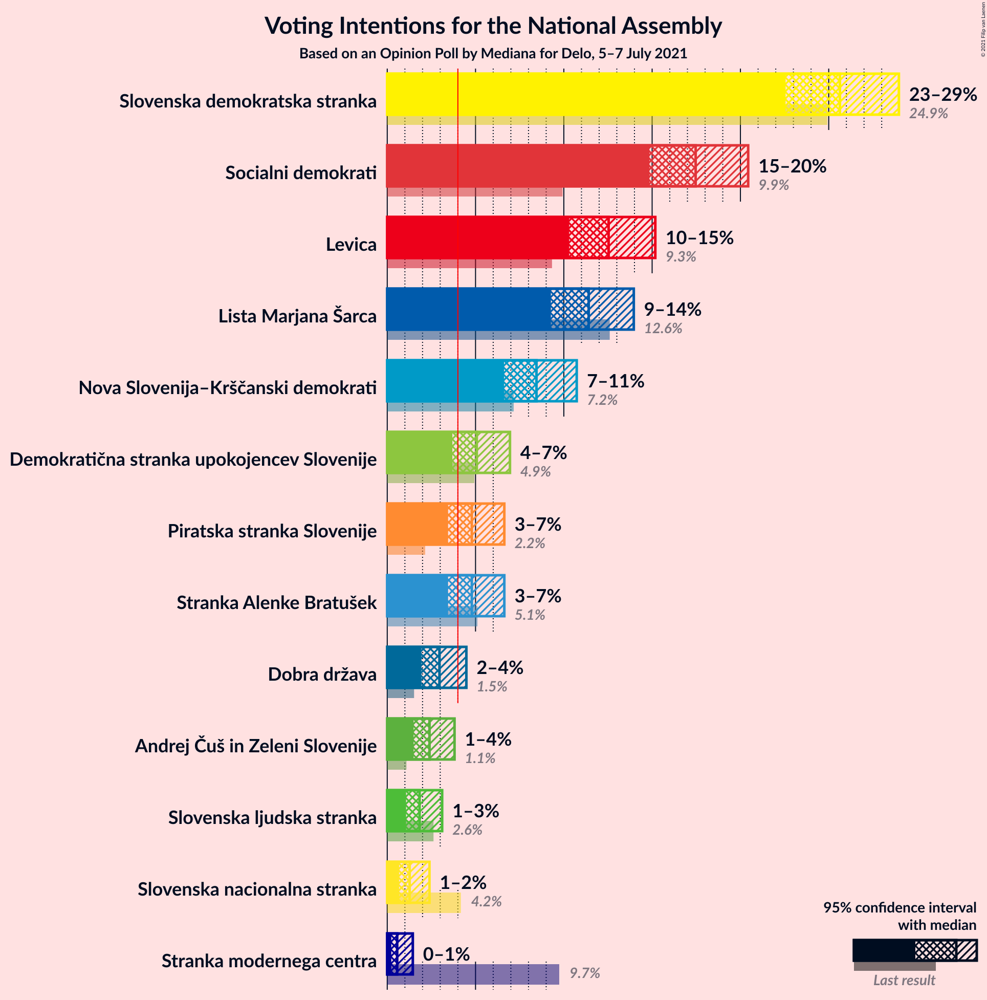

### Confidence Intervals

| Party | Last Result | Poll Result | 80% Confidence Interval | 90% Confidence Interval | 95% Confidence Interval | 99% Confidence Interval |
|:-----:|:-----------:|:-----------:|:-----------------------:|:-----------------------:|:-----------------------:|:-----------------------:|
| Slovenska demokratska stranka | 24.9% | 25.6% | 23.6–27.8% |23.0–28.4% |22.6–29.0% |21.6–30.0% |
| Socialni demokrati | 9.9% | 17.5% | 15.7–19.4% |15.3–20.0% |14.8–20.4% |14.1–21.4% |
| Levica | 9.3% | 12.5% | 11.1–14.3% |10.7–14.8% |10.3–15.2% |9.6–16.0% |
| Lista Marjana Šarca | 12.6% | 11.4% | 10.0–13.1% |9.6–13.5% |9.3–14.0% |8.6–14.8% |
| Nova Slovenija–Krščanski demokrati | 7.2% | 8.5% | 7.2–9.9% |6.9–10.4% |6.6–10.7% |6.1–11.5% |
| Demokratična stranka upokojencev Slovenije | 4.9% | 5.1% | 4.2–6.3% |3.9–6.6% |3.7–7.0% |3.3–7.6% |
| Stranka Alenke Bratušek | 5.1% | 4.8% | 3.9–6.0% |3.7–6.3% |3.4–6.6% |3.1–7.2% |
| Piratska stranka Slovenije | 2.2% | 4.8% | 3.9–6.0% |3.7–6.3% |3.4–6.6% |3.1–7.2% |
| Dobra država | 1.5% | 3.0% | 2.3–3.9% |2.1–4.2% |1.9–4.5% |1.7–5.0% |
| Andrej Čuš in Zeleni Slovenije | 1.1% | 2.4% | 1.8–3.3% |1.6–3.6% |1.5–3.8% |1.3–4.3% |
| Slovenska ljudska stranka | 2.6% | 1.8% | 1.3–2.7% |1.2–2.9% |1.1–3.1% |0.9–3.6% |
| Slovenska nacionalna stranka | 4.2% | 1.3% | 0.9–2.0% |0.8–2.2% |0.7–2.4% |0.5–2.8% |
| Stranka modernega centra | 9.7% | 0.6% | 0.3–1.1% |0.3–1.3% |0.2–1.4% |0.1–1.8% |

*Note:* The poll result column reflects the actual value used in the calculations. Published results may vary slightly, and in addition be rounded to fewer digits.

## Seats

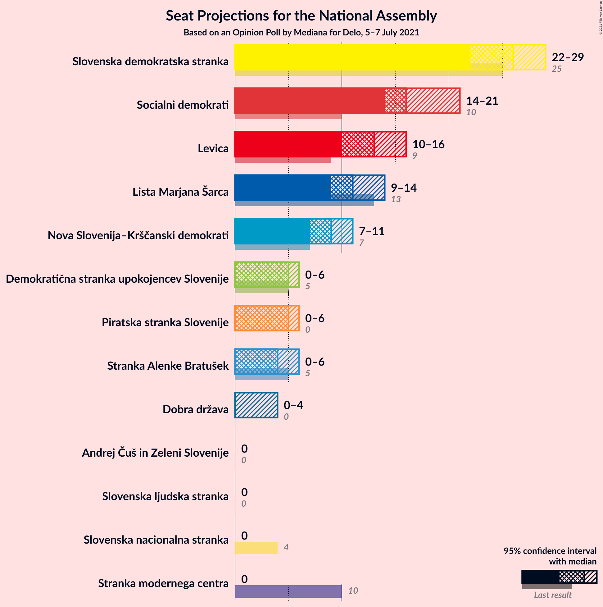

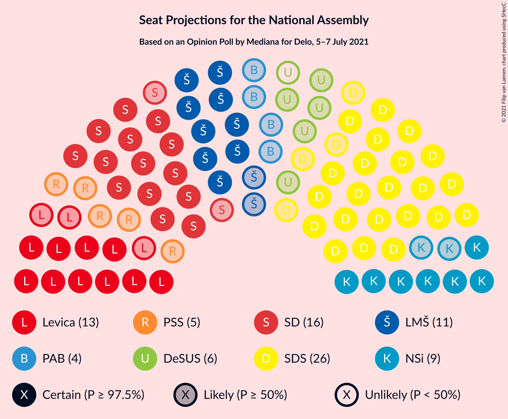

### Confidence Intervals

| Party | Last Result | Median | 80% Confidence Interval | 90% Confidence Interval | 95% Confidence Interval | 99% Confidence Interval |
|:-----:|:-----------:|:------:|:-----------------------:|:-----------------------:|:-----------------------:|:-----------------------:|
| <a href="#slovenska-demokratska-stranka">Slovenska demokratska stranka</a> | 25 | 26 | 24–28 |23–28 |22–29 |22–31 |
| <a href="#socialni-demokrati">Socialni demokrati</a> | 10 | 16 | 15–20 |14–20 |14–21 |13–22 |
| <a href="#levica">Levica</a> | 9 | 13 | 11–15 |11–15 |10–16 |9–16 |
| <a href="#lista-marjana-šarca">Lista Marjana Šarca</a> | 13 | 11 | 9–13 |9–13 |9–14 |8–14 |
| <a href="#nova-slovenija–krščanski-demokrati">Nova Slovenija–Krščanski demokrati</a> | 7 | 9 | 7–10 |7–11 |7–11 |6–11 |
| <a href="#demokratična-stranka-upokojencev-slovenije">Demokratična stranka upokojencev Slovenije</a> | 5 | 5 | 4–6 |3–6 |0–6 |0–8 |
| <a href="#stranka-alenke-bratušek">Stranka Alenke Bratušek</a> | 5 | 4 | 4–6 |4–6 |0–6 |0–7 |
| <a href="#piratska-stranka-slovenije">Piratska stranka Slovenije</a> | 0 | 5 | 0–6 |0–6 |0–6 |0–7 |
| <a href="#dobra-država">Dobra država</a> | 0 | 0 | 0 |0 |0–4 |0–5 |
| <a href="#andrej-čuš-in-zeleni-slovenije">Andrej Čuš in Zeleni Slovenije</a> | 0 | 0 | 0 |0 |0 |0–4 |
| <a href="#slovenska-ljudska-stranka">Slovenska ljudska stranka</a> | 0 | 0 | 0 |0 |0 |0 |
| <a href="#slovenska-nacionalna-stranka">Slovenska nacionalna stranka</a> | 4 | 0 | 0 |0 |0 |0 |
| <a href="#stranka-modernega-centra">Stranka modernega centra</a> | 10 | 0 | 0 |0 |0 |0 |

### Slovenska demokratska stranka

*For a full overview of the results for this party, see the [Slovenska demokratska stranka](party-slovenskademokratskastranka.html) page.*

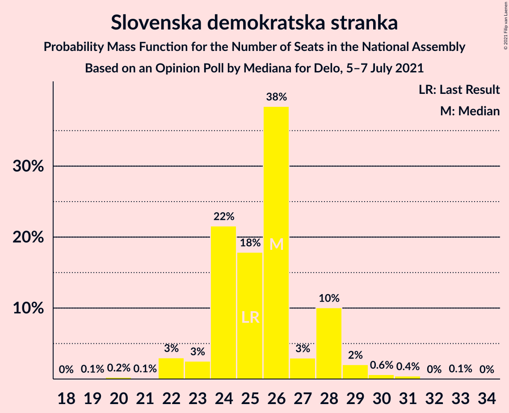

| Number of Seats | Probability | Accumulated | Special Marks |
|:---------------:|:-----------:|:-----------:|:-------------:|
| 19 | 0.1% | 100% |  |
| 20 | 0.2% | 99.9% |  |
| 21 | 0.1% | 99.7% |  |
| 22 | 3% | 99.6% |  |
| 23 | 3% | 97% |  |
| 24 | 22% | 94% |  |
| 25 | 18% | 73% | Last Result |
| 26 | 38% | 55% | Median |
| 27 | 3% | 16% |  |
| 28 | 10% | 13% |  |
| 29 | 2% | 3% |  |
| 30 | 0.6% | 1.2% |  |
| 31 | 0.4% | 0.6% |  |
| 32 | 0% | 0.1% |  |
| 33 | 0.1% | 0.1% |  |
| 34 | 0% | 0% |  |

### Socialni demokrati

*For a full overview of the results for this party, see the [Socialni demokrati](party-socialnidemokrati.html) page.*

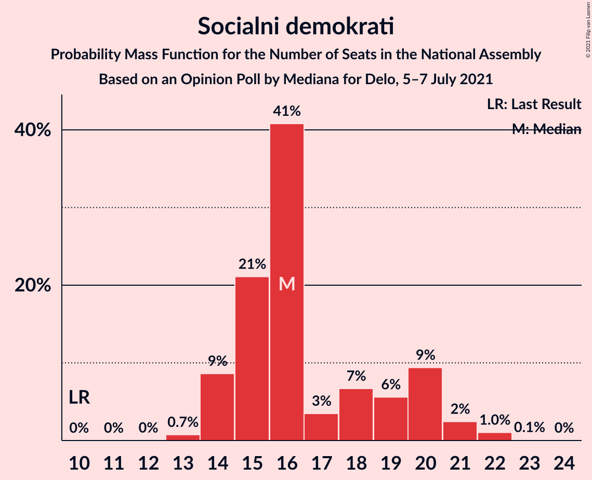

| Number of Seats | Probability | Accumulated | Special Marks |
|:---------------:|:-----------:|:-----------:|:-------------:|
| 10 | 0% | 100% | Last Result |
| 11 | 0% | 100% |  |
| 12 | 0% | 100% |  |
| 13 | 0.7% | 100% |  |
| 14 | 9% | 99.2% |  |
| 15 | 21% | 91% |  |
| 16 | 41% | 70% | Median |
| 17 | 3% | 29% |  |
| 18 | 7% | 25% |  |
| 19 | 6% | 19% |  |
| 20 | 9% | 13% |  |
| 21 | 2% | 4% |  |
| 22 | 1.0% | 1.1% |  |
| 23 | 0.1% | 0.1% |  |
| 24 | 0% | 0% |  |

### Levica

*For a full overview of the results for this party, see the [Levica](party-levica.html) page.*

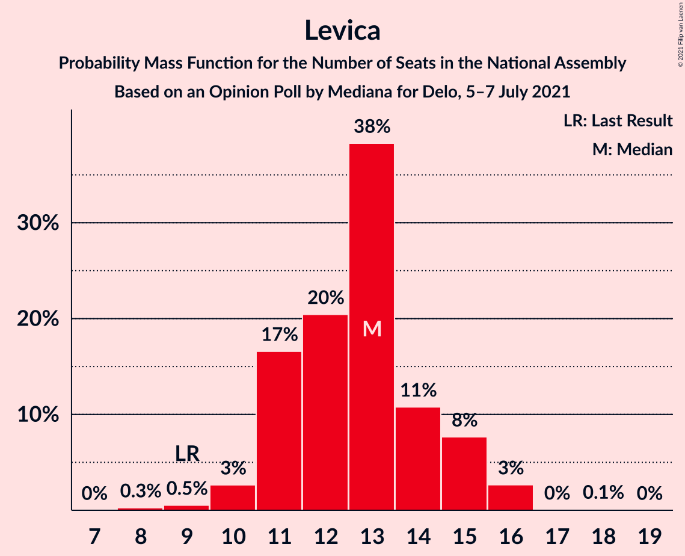

| Number of Seats | Probability | Accumulated | Special Marks |
|:---------------:|:-----------:|:-----------:|:-------------:|
| 8 | 0.3% | 100% |  |
| 9 | 0.5% | 99.7% | Last Result |
| 10 | 3% | 99.2% |  |
| 11 | 17% | 97% |  |
| 12 | 20% | 80% |  |
| 13 | 38% | 60% | Median |
| 14 | 11% | 21% |  |
| 15 | 8% | 10% |  |
| 16 | 3% | 3% |  |
| 17 | 0% | 0.1% |  |
| 18 | 0.1% | 0.1% |  |
| 19 | 0% | 0% |  |

### Lista Marjana Šarca

*For a full overview of the results for this party, see the [Lista Marjana Šarca](party-listamarjanašarca.html) page.*

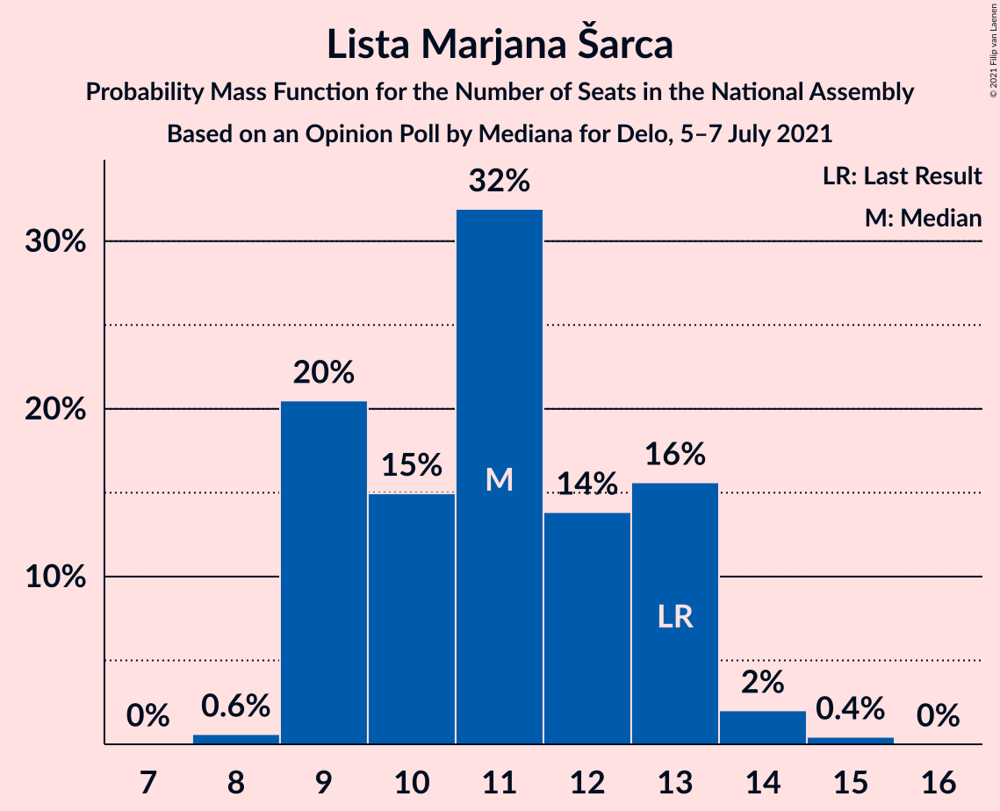

| Number of Seats | Probability | Accumulated | Special Marks |
|:---------------:|:-----------:|:-----------:|:-------------:|
| 8 | 0.6% | 100% |  |
| 9 | 20% | 99.4% |  |
| 10 | 15% | 79% |  |
| 11 | 32% | 64% | Median |
| 12 | 14% | 32% |  |
| 13 | 16% | 18% | Last Result |
| 14 | 2% | 3% |  |
| 15 | 0.4% | 0.5% |  |
| 16 | 0% | 0% |  |

### Nova Slovenija–Krščanski demokrati

*For a full overview of the results for this party, see the [Nova Slovenija–Krščanski demokrati](party-novaslovenija–krščanskidemokrati.html) page.*

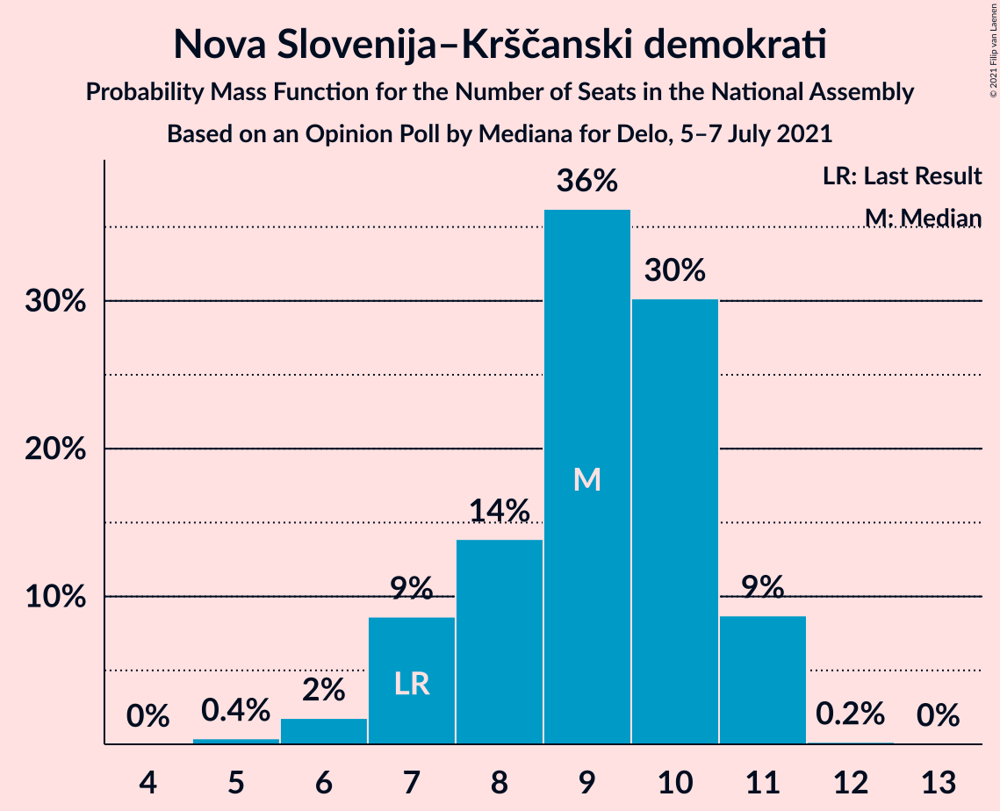

| Number of Seats | Probability | Accumulated | Special Marks |
|:---------------:|:-----------:|:-----------:|:-------------:|
| 5 | 0.4% | 100% |  |
| 6 | 2% | 99.6% |  |
| 7 | 9% | 98% | Last Result |
| 8 | 14% | 89% |  |
| 9 | 36% | 75% | Median |
| 10 | 30% | 39% |  |
| 11 | 9% | 9% |  |
| 12 | 0.2% | 0.2% |  |
| 13 | 0% | 0% |  |

### Demokratična stranka upokojencev Slovenije

*For a full overview of the results for this party, see the [Demokratična stranka upokojencev Slovenije](party-demokratičnastrankaupokojencevslovenije.html) page.*

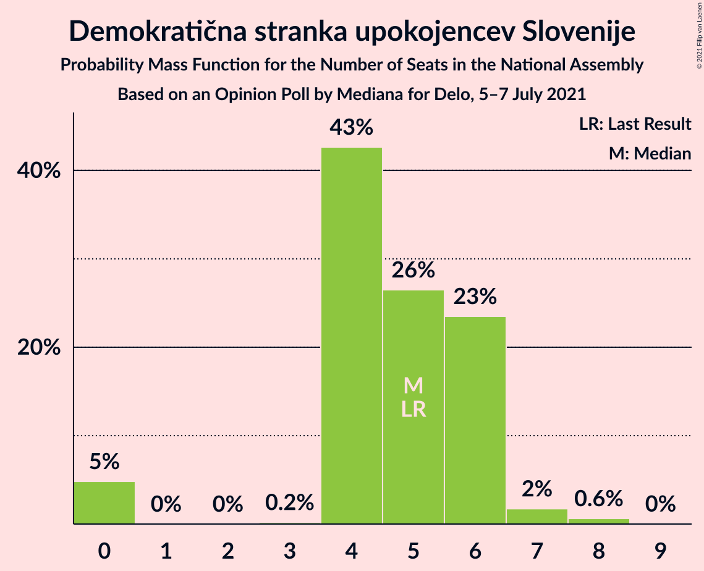

| Number of Seats | Probability | Accumulated | Special Marks |
|:---------------:|:-----------:|:-----------:|:-------------:|
| 0 | 5% | 100% |  |
| 1 | 0% | 95% |  |
| 2 | 0% | 95% |  |
| 3 | 0.2% | 95% |  |
| 4 | 43% | 95% |  |
| 5 | 26% | 52% | Last Result, Median |
| 6 | 23% | 26% |  |
| 7 | 2% | 2% |  |
| 8 | 0.6% | 0.6% |  |
| 9 | 0% | 0% |  |

### Stranka Alenke Bratušek

*For a full overview of the results for this party, see the [Stranka Alenke Bratušek](party-strankaalenkebratušek.html) page.*

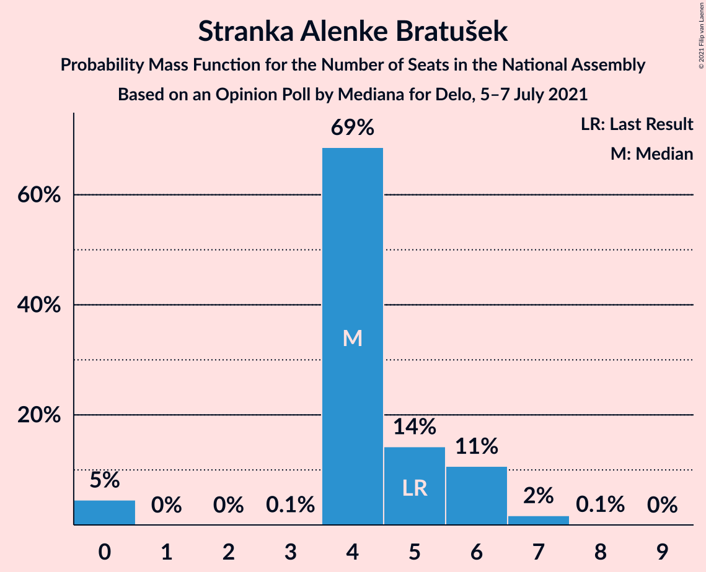

| Number of Seats | Probability | Accumulated | Special Marks |
|:---------------:|:-----------:|:-----------:|:-------------:|
| 0 | 5% | 100% |  |
| 1 | 0% | 95% |  |
| 2 | 0% | 95% |  |
| 3 | 0.1% | 95% |  |
| 4 | 69% | 95% | Median |
| 5 | 14% | 27% | Last Result |
| 6 | 11% | 13% |  |
| 7 | 2% | 2% |  |
| 8 | 0.1% | 0.1% |  |
| 9 | 0% | 0% |  |

### Piratska stranka Slovenije

*For a full overview of the results for this party, see the [Piratska stranka Slovenije](party-piratskastrankaslovenije.html) page.*

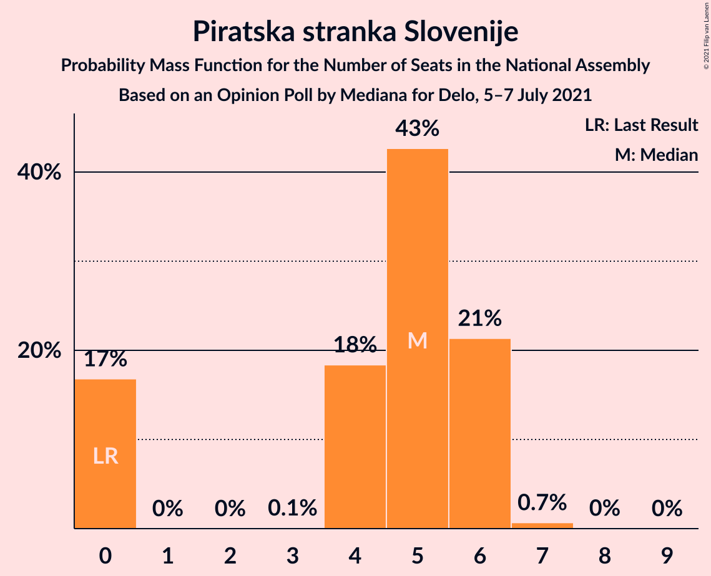

| Number of Seats | Probability | Accumulated | Special Marks |
|:---------------:|:-----------:|:-----------:|:-------------:|
| 0 | 17% | 100% | Last Result |
| 1 | 0% | 83% |  |
| 2 | 0% | 83% |  |
| 3 | 0.1% | 83% |  |
| 4 | 18% | 83% |  |
| 5 | 43% | 65% | Median |
| 6 | 21% | 22% |  |
| 7 | 0.7% | 0.7% |  |
| 8 | 0% | 0.1% |  |
| 9 | 0% | 0% |  |

### Dobra država

*For a full overview of the results for this party, see the [Dobra država](party-dobradržava.html) page.*

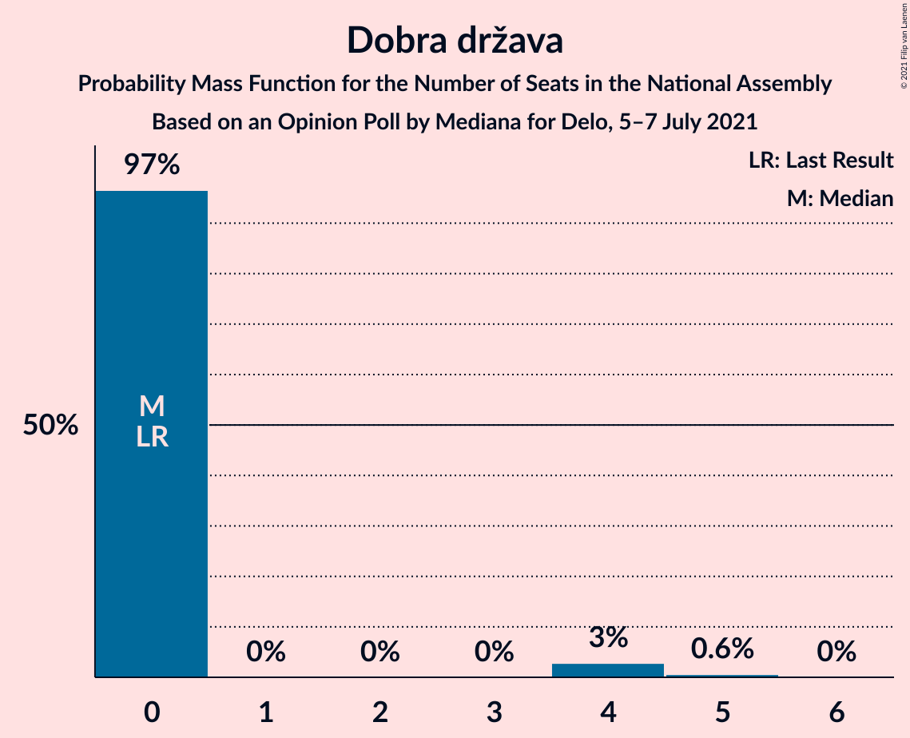

| Number of Seats | Probability | Accumulated | Special Marks |
|:---------------:|:-----------:|:-----------:|:-------------:|
| 0 | 97% | 100% | Last Result, Median |
| 1 | 0% | 3% |  |
| 2 | 0% | 3% |  |
| 3 | 0% | 3% |  |
| 4 | 3% | 3% |  |
| 5 | 0.6% | 0.6% |  |
| 6 | 0% | 0% |  |

### Andrej Čuš in Zeleni Slovenije

*For a full overview of the results for this party, see the [Andrej Čuš in Zeleni Slovenije](party-andrejčušinzelenislovenije.html) page.*

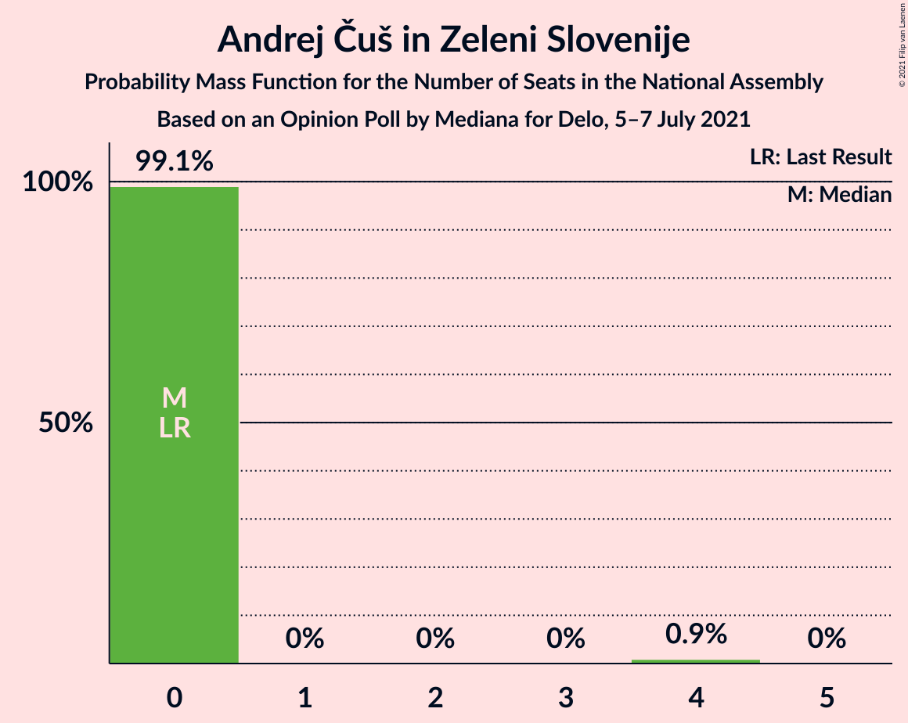

| Number of Seats | Probability | Accumulated | Special Marks |
|:---------------:|:-----------:|:-----------:|:-------------:|
| 0 | 99.1% | 100% | Last Result, Median |
| 1 | 0% | 0.9% |  |
| 2 | 0% | 0.9% |  |
| 3 | 0% | 0.9% |  |
| 4 | 0.9% | 0.9% |  |
| 5 | 0% | 0% |  |

### Slovenska ljudska stranka

*For a full overview of the results for this party, see the [Slovenska ljudska stranka](party-slovenskaljudskastranka.html) page.*

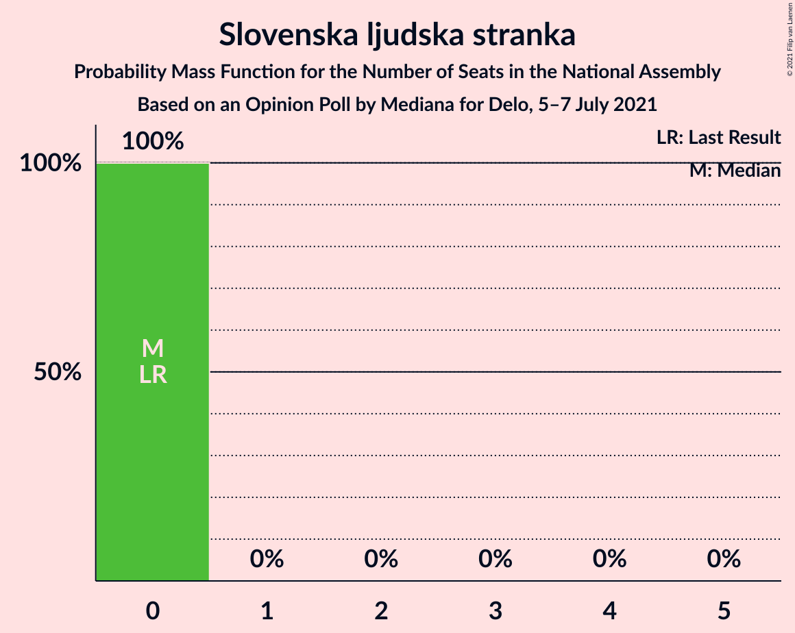

| Number of Seats | Probability | Accumulated | Special Marks |
|:---------------:|:-----------:|:-----------:|:-------------:|
| 0 | 100% | 100% | Last Result, Median |

### Slovenska nacionalna stranka

*For a full overview of the results for this party, see the [Slovenska nacionalna stranka](party-slovenskanacionalnastranka.html) page.*

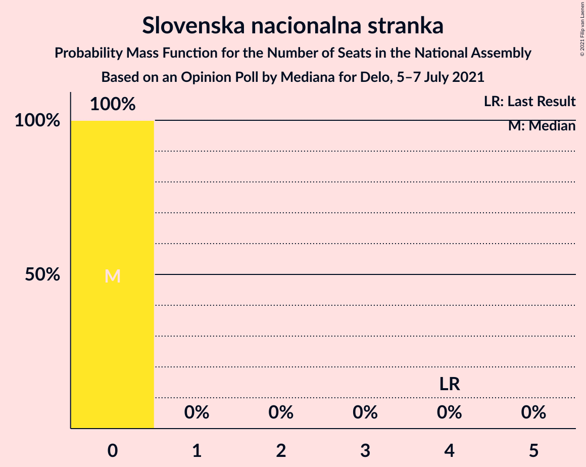

| Number of Seats | Probability | Accumulated | Special Marks |
|:---------------:|:-----------:|:-----------:|:-------------:|
| 0 | 100% | 100% | Median |
| 1 | 0% | 0% |  |
| 2 | 0% | 0% |  |
| 3 | 0% | 0% |  |
| 4 | 0% | 0% | Last Result |

### Stranka modernega centra

*For a full overview of the results for this party, see the [Stranka modernega centra](party-strankamodernegacentra.html) page.*

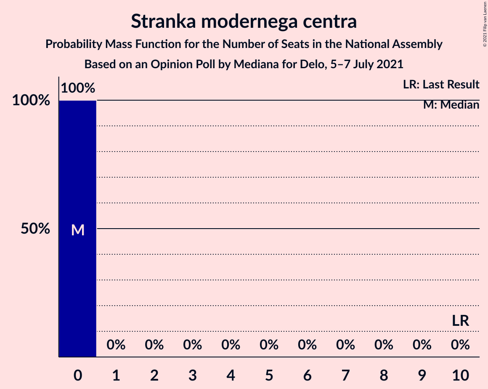

| Number of Seats | Probability | Accumulated | Special Marks |
|:---------------:|:-----------:|:-----------:|:-------------:|
| 0 | 100% | 100% | Median |
| 1 | 0% | 0% |  |
| 2 | 0% | 0% |  |
| 3 | 0% | 0% |  |
| 4 | 0% | 0% |  |
| 5 | 0% | 0% |  |
| 6 | 0% | 0% |  |
| 7 | 0% | 0% |  |
| 8 | 0% | 0% |  |
| 9 | 0% | 0% |  |
| 10 | 0% | 0% | Last Result |

## Coalitions

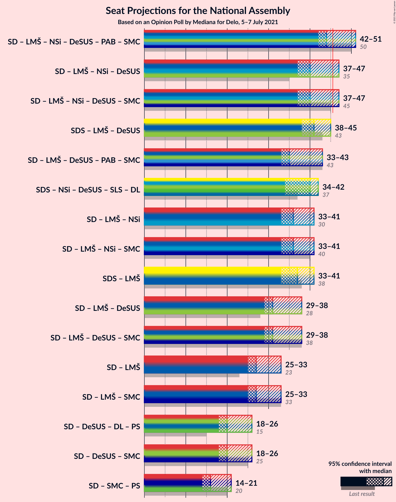

### Confidence Intervals

| Coalition | Last Result | Median | Majority? | 80% Confidence Interval | 90% Confidence Interval | 95% Confidence Interval | 99% Confidence Interval |
|:---------:|:-----------:|:------:|:---------:|:-----------------------:|:-----------------------:|:-----------------------:|:-----------------------:|
| Socialni demokrati – Lista Marjana Šarca – Nova Slovenija–Krščanski demokrati – Demokratična stranka upokojencev Slovenije – Stranka Alenke Bratušek – Stranka modernega centra | 50 | 44 | 42% | 43–50 | 43–51 | 42–51 | 39–51 |
| Socialni demokrati – Lista Marjana Šarca – Nova Slovenija–Krščanski demokrati – Demokratična stranka upokojencev Slovenije | 35 | 40 | 10% | 39–46 | 38–47 | 37–47 | 35–48 |
| Socialni demokrati – Lista Marjana Šarca – Nova Slovenija–Krščanski demokrati – Demokratična stranka upokojencev Slovenije – Stranka modernega centra | 45 | 40 | 10% | 39–46 | 38–47 | 37–47 | 35–48 |
| Slovenska demokratska stranka – Lista Marjana Šarca – Demokratična stranka upokojencev Slovenije | 43 | 41 | 2% | 39–43 | 38–44 | 38–45 | 36–48 |
| Socialni demokrati – Lista Marjana Šarca – Demokratična stranka upokojencev Slovenije – Stranka Alenke Bratušek – Stranka modernega centra | 43 | 35 | 0.1% | 33–42 | 33–42 | 33–43 | 31–44 |
| Socialni demokrati – Lista Marjana Šarca – Nova Slovenija–Krščanski demokrati | 30 | 36 | 0% | 35–41 | 35–41 | 33–41 | 31–42 |
| Socialni demokrati – Lista Marjana Šarca – Nova Slovenija–Krščanski demokrati – Stranka modernega centra | 40 | 36 | 0% | 35–41 | 35–41 | 33–41 | 31–42 |
| Slovenska demokratska stranka – Lista Marjana Šarca | 38 | 37 | 0.1% | 35–39 | 34–40 | 33–41 | 32–43 |
| Socialni demokrati – Lista Marjana Šarca – Demokratična stranka upokojencev Slovenije | 28 | 31 | 0% | 29–37 | 29–38 | 29–38 | 27–40 |
| Socialni demokrati – Lista Marjana Šarca – Demokratična stranka upokojencev Slovenije – Stranka modernega centra | 38 | 31 | 0% | 29–37 | 29–38 | 29–38 | 27–40 |
| Socialni demokrati – Lista Marjana Šarca | 23 | 27 | 0% | 25–32 | 25–32 | 25–33 | 24–34 |
| Socialni demokrati – Lista Marjana Šarca – Stranka modernega centra | 33 | 27 | 0% | 25–32 | 25–32 | 25–33 | 24–34 |
| Socialni demokrati – Demokratična stranka upokojencev Slovenije – Stranka modernega centra | 25 | 20 | 0% | 18–26 | 18–26 | 18–26 | 16–28 |

### Socialni demokrati – Lista Marjana Šarca – Nova Slovenija–Krščanski demokrati – Demokratična stranka upokojencev Slovenije – Stranka Alenke Bratušek – Stranka modernega centra

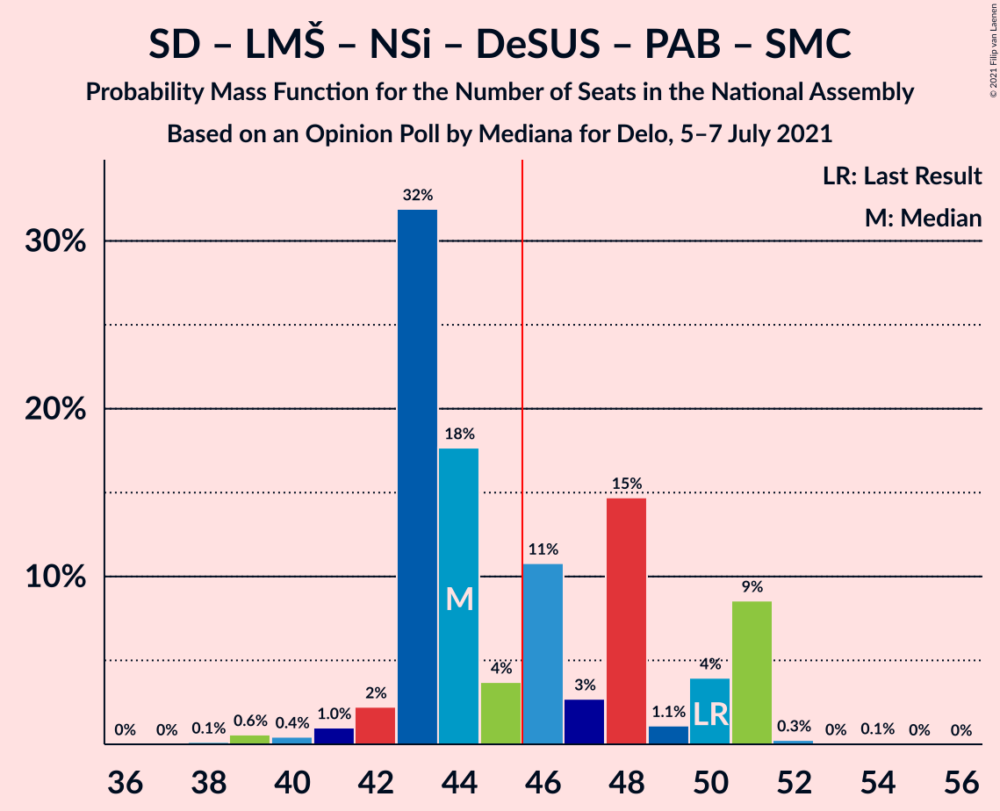

| Number of Seats | Probability | Accumulated | Special Marks |
|:---------------:|:-----------:|:-----------:|:-------------:|
| 37 | 0% | 100% |  |
| 38 | 0.1% | 99.9% |  |
| 39 | 0.6% | 99.8% |  |
| 40 | 0.4% | 99.2% |  |
| 41 | 1.0% | 98.8% |  |
| 42 | 2% | 98% |  |
| 43 | 32% | 96% |  |
| 44 | 18% | 64% |  |
| 45 | 4% | 46% | Median |
| 46 | 11% | 42% | Majority |
| 47 | 3% | 31% |  |
| 48 | 15% | 29% |  |
| 49 | 1.1% | 14% |  |
| 50 | 4% | 13% | Last Result |
| 51 | 9% | 9% |  |
| 52 | 0.3% | 0.4% |  |
| 53 | 0% | 0.2% |  |
| 54 | 0.1% | 0.1% |  |
| 55 | 0% | 0% |  |

### Socialni demokrati – Lista Marjana Šarca – Nova Slovenija–Krščanski demokrati – Demokratična stranka upokojencev Slovenije

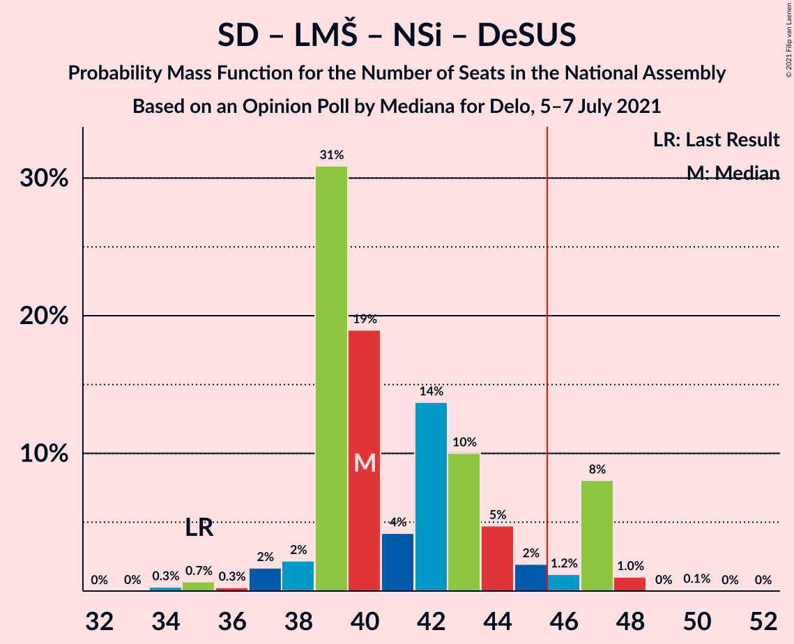

| Number of Seats | Probability | Accumulated | Special Marks |
|:---------------:|:-----------:|:-----------:|:-------------:|
| 34 | 0.3% | 100% |  |
| 35 | 0.7% | 99.7% | Last Result |
| 36 | 0.3% | 99.0% |  |
| 37 | 2% | 98.8% |  |
| 38 | 2% | 97% |  |
| 39 | 31% | 95% |  |
| 40 | 19% | 64% |  |
| 41 | 4% | 45% | Median |
| 42 | 14% | 41% |  |
| 43 | 10% | 27% |  |
| 44 | 5% | 17% |  |
| 45 | 2% | 12% |  |
| 46 | 1.2% | 10% | Majority |
| 47 | 8% | 9% |  |
| 48 | 1.0% | 1.1% |  |
| 49 | 0% | 0.1% |  |
| 50 | 0.1% | 0.1% |  |
| 51 | 0% | 0% |  |

### Socialni demokrati – Lista Marjana Šarca – Nova Slovenija–Krščanski demokrati – Demokratična stranka upokojencev Slovenije – Stranka modernega centra

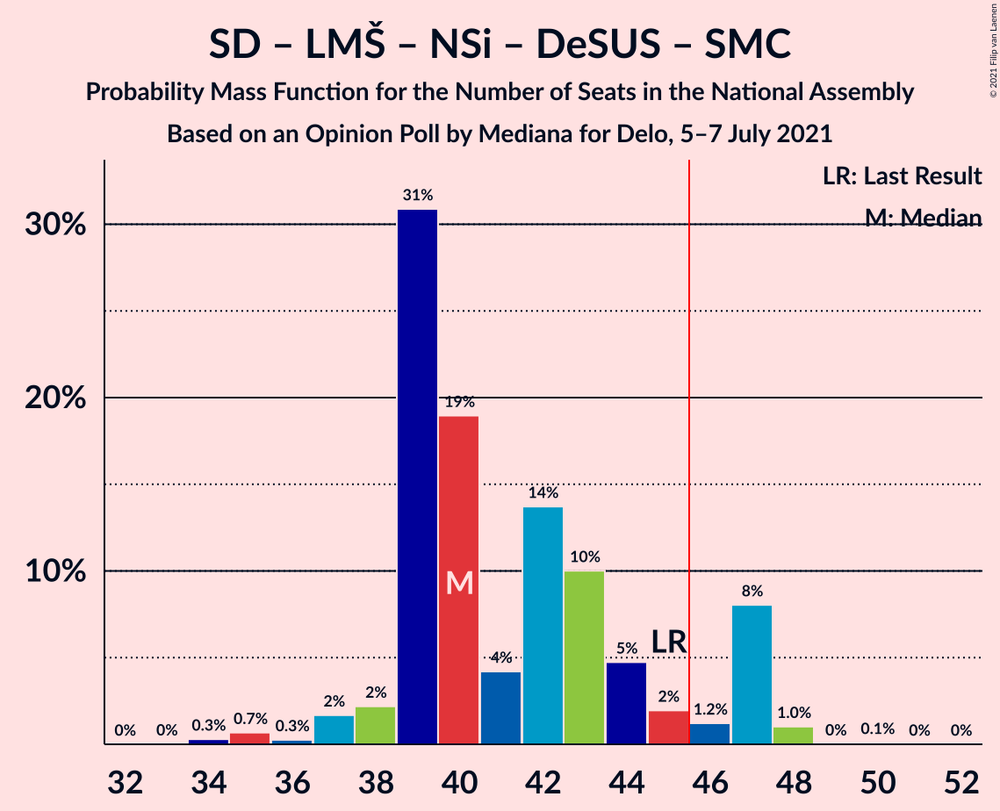

| Number of Seats | Probability | Accumulated | Special Marks |
|:---------------:|:-----------:|:-----------:|:-------------:|
| 34 | 0.3% | 100% |  |
| 35 | 0.7% | 99.7% |  |
| 36 | 0.3% | 99.0% |  |
| 37 | 2% | 98.8% |  |
| 38 | 2% | 97% |  |
| 39 | 31% | 95% |  |
| 40 | 19% | 64% |  |
| 41 | 4% | 45% | Median |
| 42 | 14% | 41% |  |
| 43 | 10% | 27% |  |
| 44 | 5% | 17% |  |
| 45 | 2% | 12% | Last Result |
| 46 | 1.2% | 10% | Majority |
| 47 | 8% | 9% |  |
| 48 | 1.0% | 1.1% |  |
| 49 | 0% | 0.1% |  |
| 50 | 0.1% | 0.1% |  |
| 51 | 0% | 0% |  |

### Slovenska demokratska stranka – Lista Marjana Šarca – Demokratična stranka upokojencev Slovenije

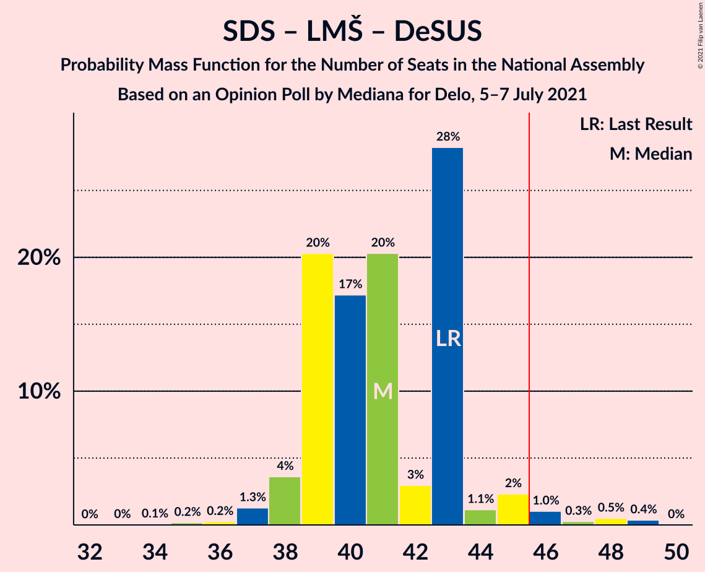

| Number of Seats | Probability | Accumulated | Special Marks |
|:---------------:|:-----------:|:-----------:|:-------------:|
| 34 | 0.1% | 100% |  |
| 35 | 0.2% | 99.9% |  |
| 36 | 0.2% | 99.7% |  |
| 37 | 1.3% | 99.5% |  |
| 38 | 4% | 98% |  |
| 39 | 20% | 95% |  |
| 40 | 17% | 74% |  |
| 41 | 20% | 57% |  |
| 42 | 3% | 37% | Median |
| 43 | 28% | 34% | Last Result |
| 44 | 1.1% | 6% |  |
| 45 | 2% | 4% |  |
| 46 | 1.0% | 2% | Majority |
| 47 | 0.3% | 1.1% |  |
| 48 | 0.5% | 0.9% |  |
| 49 | 0.4% | 0.4% |  |
| 50 | 0% | 0% |  |

### Socialni demokrati – Lista Marjana Šarca – Demokratična stranka upokojencev Slovenije – Stranka Alenke Bratušek – Stranka modernega centra

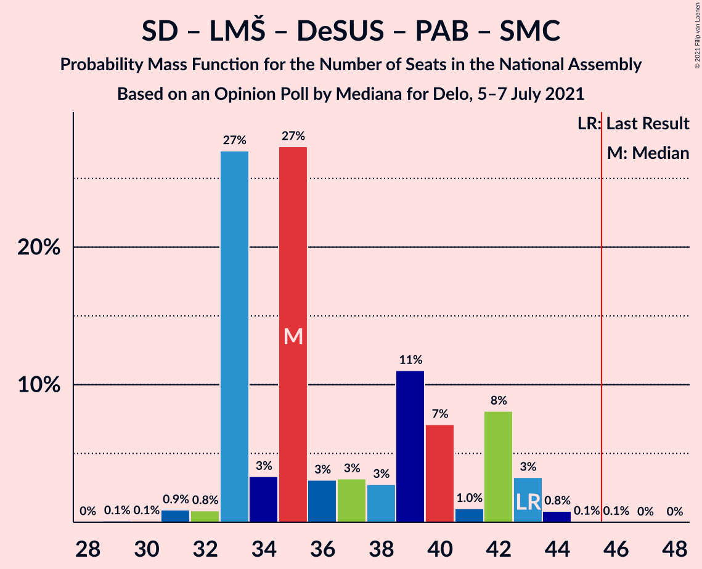

| Number of Seats | Probability | Accumulated | Special Marks |
|:---------------:|:-----------:|:-----------:|:-------------:|
| 29 | 0.1% | 100% |  |
| 30 | 0.1% | 99.9% |  |
| 31 | 0.9% | 99.8% |  |
| 32 | 0.8% | 98.9% |  |
| 33 | 27% | 98% |  |
| 34 | 3% | 71% |  |
| 35 | 27% | 68% |  |
| 36 | 3% | 40% | Median |
| 37 | 3% | 37% |  |
| 38 | 3% | 34% |  |
| 39 | 11% | 31% |  |
| 40 | 7% | 20% |  |
| 41 | 1.0% | 13% |  |
| 42 | 8% | 12% |  |
| 43 | 3% | 4% | Last Result |
| 44 | 0.8% | 0.9% |  |
| 45 | 0.1% | 0.1% |  |
| 46 | 0.1% | 0.1% | Majority |
| 47 | 0% | 0% |  |

### Socialni demokrati – Lista Marjana Šarca – Nova Slovenija–Krščanski demokrati

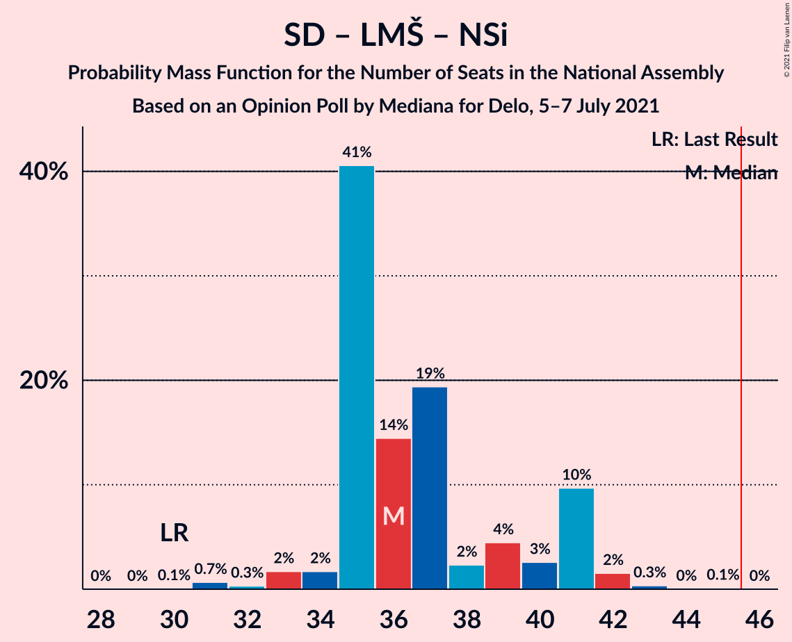

| Number of Seats | Probability | Accumulated | Special Marks |
|:---------------:|:-----------:|:-----------:|:-------------:|
| 30 | 0.1% | 100% | Last Result |
| 31 | 0.7% | 99.9% |  |
| 32 | 0.3% | 99.2% |  |
| 33 | 2% | 98.9% |  |
| 34 | 2% | 97% |  |
| 35 | 41% | 96% |  |
| 36 | 14% | 55% | Median |
| 37 | 19% | 40% |  |
| 38 | 2% | 21% |  |
| 39 | 4% | 19% |  |
| 40 | 3% | 14% |  |
| 41 | 10% | 12% |  |
| 42 | 2% | 2% |  |
| 43 | 0.3% | 0.5% |  |
| 44 | 0% | 0.2% |  |
| 45 | 0.1% | 0.1% |  |
| 46 | 0% | 0% | Majority |

### Socialni demokrati – Lista Marjana Šarca – Nova Slovenija–Krščanski demokrati – Stranka modernega centra

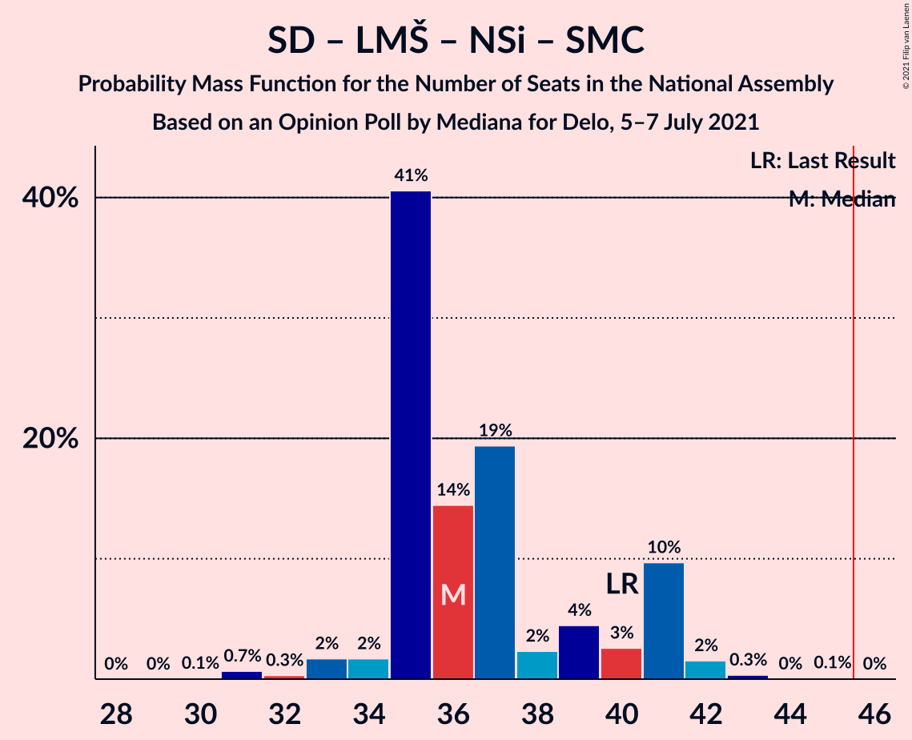

| Number of Seats | Probability | Accumulated | Special Marks |
|:---------------:|:-----------:|:-----------:|:-------------:|
| 30 | 0.1% | 100% |  |
| 31 | 0.7% | 99.9% |  |
| 32 | 0.3% | 99.2% |  |
| 33 | 2% | 98.9% |  |
| 34 | 2% | 97% |  |
| 35 | 41% | 96% |  |
| 36 | 14% | 55% | Median |
| 37 | 19% | 40% |  |
| 38 | 2% | 21% |  |
| 39 | 4% | 19% |  |
| 40 | 3% | 14% | Last Result |
| 41 | 10% | 12% |  |
| 42 | 2% | 2% |  |
| 43 | 0.3% | 0.5% |  |
| 44 | 0% | 0.2% |  |
| 45 | 0.1% | 0.1% |  |
| 46 | 0% | 0% | Majority |

### Slovenska demokratska stranka – Lista Marjana Šarca

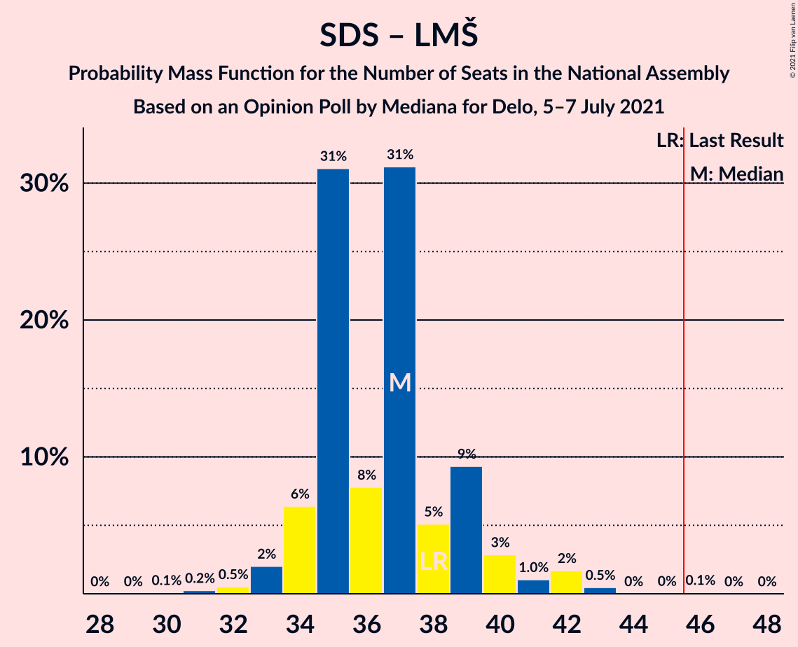

| Number of Seats | Probability | Accumulated | Special Marks |
|:---------------:|:-----------:|:-----------:|:-------------:|
| 30 | 0.1% | 100% |  |
| 31 | 0.2% | 99.9% |  |
| 32 | 0.5% | 99.7% |  |
| 33 | 2% | 99.1% |  |
| 34 | 6% | 97% |  |
| 35 | 31% | 91% |  |
| 36 | 8% | 60% |  |
| 37 | 31% | 52% | Median |
| 38 | 5% | 21% | Last Result |
| 39 | 9% | 16% |  |
| 40 | 3% | 6% |  |
| 41 | 1.0% | 3% |  |
| 42 | 2% | 2% |  |
| 43 | 0.5% | 0.6% |  |
| 44 | 0% | 0.1% |  |
| 45 | 0% | 0.1% |  |
| 46 | 0.1% | 0.1% | Majority |
| 47 | 0% | 0% |  |

### Socialni demokrati – Lista Marjana Šarca – Demokratična stranka upokojencev Slovenije

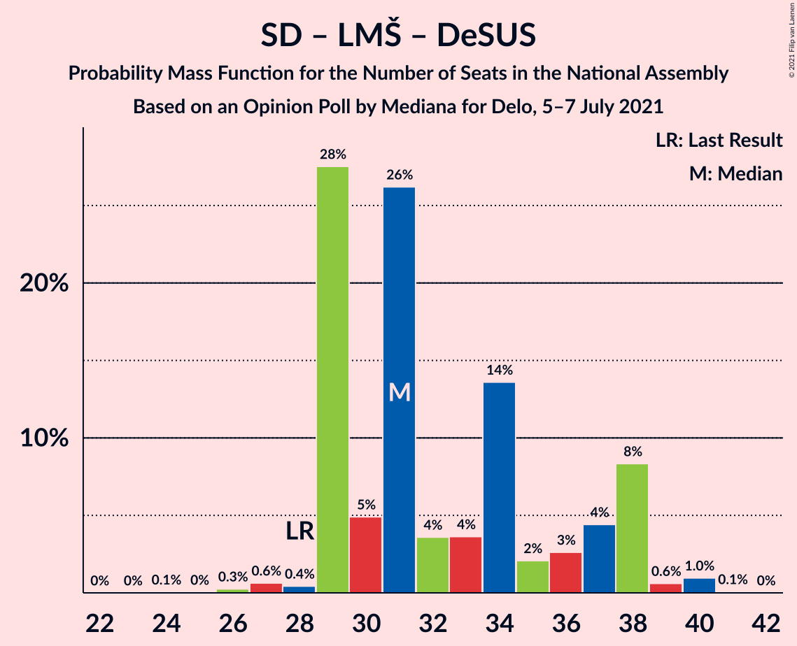

| Number of Seats | Probability | Accumulated | Special Marks |
|:---------------:|:-----------:|:-----------:|:-------------:|
| 24 | 0.1% | 100% |  |
| 25 | 0% | 99.9% |  |
| 26 | 0.3% | 99.9% |  |
| 27 | 0.6% | 99.6% |  |
| 28 | 0.4% | 99.0% | Last Result |
| 29 | 28% | 98.6% |  |
| 30 | 5% | 71% |  |
| 31 | 26% | 66% |  |
| 32 | 4% | 40% | Median |
| 33 | 4% | 36% |  |
| 34 | 14% | 33% |  |
| 35 | 2% | 19% |  |
| 36 | 3% | 17% |  |
| 37 | 4% | 14% |  |
| 38 | 8% | 10% |  |
| 39 | 0.6% | 2% |  |
| 40 | 1.0% | 1.0% |  |
| 41 | 0.1% | 0.1% |  |
| 42 | 0% | 0% |  |

### Socialni demokrati – Lista Marjana Šarca – Demokratična stranka upokojencev Slovenije – Stranka modernega centra

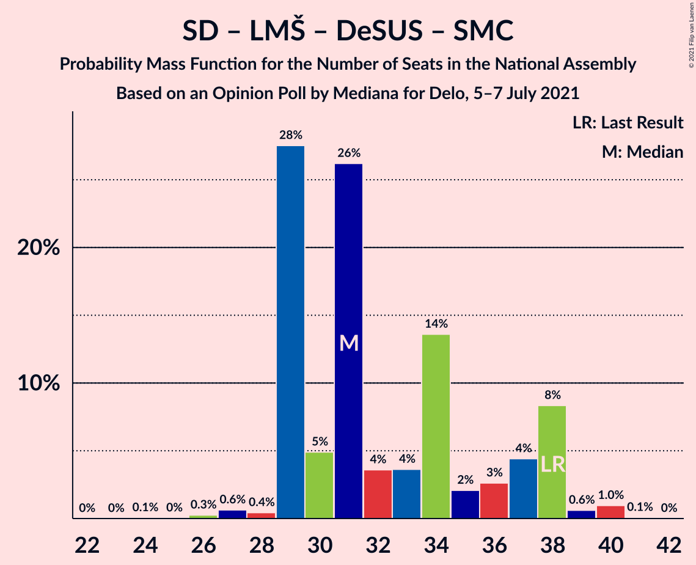

| Number of Seats | Probability | Accumulated | Special Marks |
|:---------------:|:-----------:|:-----------:|:-------------:|
| 24 | 0.1% | 100% |  |
| 25 | 0% | 99.9% |  |
| 26 | 0.3% | 99.9% |  |
| 27 | 0.6% | 99.6% |  |
| 28 | 0.4% | 99.0% |  |
| 29 | 28% | 98.6% |  |
| 30 | 5% | 71% |  |
| 31 | 26% | 66% |  |
| 32 | 4% | 40% | Median |
| 33 | 4% | 36% |  |
| 34 | 14% | 33% |  |
| 35 | 2% | 19% |  |
| 36 | 3% | 17% |  |
| 37 | 4% | 14% |  |
| 38 | 8% | 10% | Last Result |
| 39 | 0.6% | 2% |  |
| 40 | 1.0% | 1.0% |  |
| 41 | 0.1% | 0.1% |  |
| 42 | 0% | 0% |  |

### Socialni demokrati – Lista Marjana Šarca

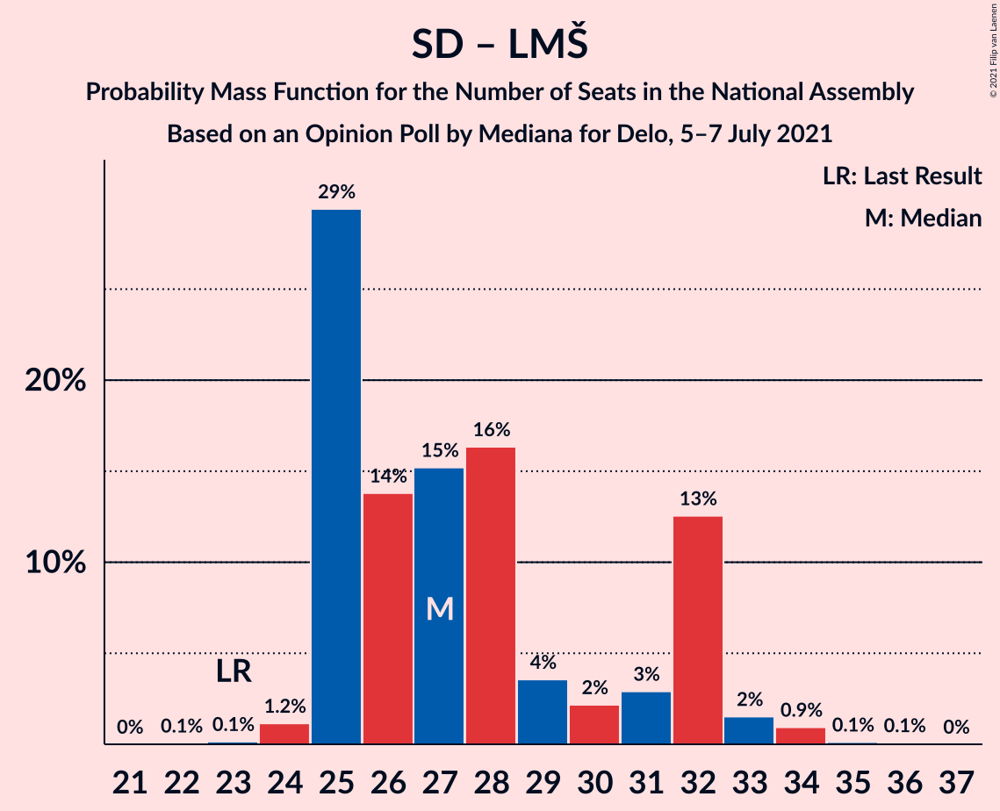

| Number of Seats | Probability | Accumulated | Special Marks |
|:---------------:|:-----------:|:-----------:|:-------------:|
| 22 | 0.1% | 100% |  |
| 23 | 0.1% | 99.9% | Last Result |
| 24 | 1.2% | 99.8% |  |
| 25 | 29% | 98.6% |  |
| 26 | 14% | 69% |  |
| 27 | 15% | 55% | Median |
| 28 | 16% | 40% |  |
| 29 | 4% | 24% |  |
| 30 | 2% | 20% |  |
| 31 | 3% | 18% |  |
| 32 | 13% | 15% |  |
| 33 | 2% | 3% |  |
| 34 | 0.9% | 1.2% |  |
| 35 | 0.1% | 0.2% |  |
| 36 | 0.1% | 0.1% |  |
| 37 | 0% | 0% |  |

### Socialni demokrati – Lista Marjana Šarca – Stranka modernega centra

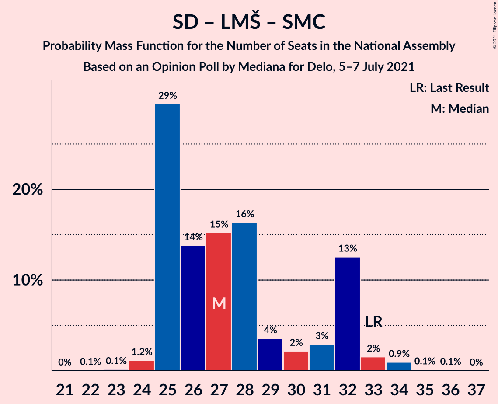

| Number of Seats | Probability | Accumulated | Special Marks |
|:---------------:|:-----------:|:-----------:|:-------------:|
| 22 | 0.1% | 100% |  |
| 23 | 0.1% | 99.9% |  |
| 24 | 1.2% | 99.8% |  |
| 25 | 29% | 98.6% |  |
| 26 | 14% | 69% |  |
| 27 | 15% | 55% | Median |
| 28 | 16% | 40% |  |
| 29 | 4% | 24% |  |
| 30 | 2% | 20% |  |
| 31 | 3% | 18% |  |
| 32 | 13% | 15% |  |
| 33 | 2% | 3% | Last Result |
| 34 | 0.9% | 1.2% |  |
| 35 | 0.1% | 0.2% |  |
| 36 | 0.1% | 0.1% |  |
| 37 | 0% | 0% |  |

### Socialni demokrati – Demokratična stranka upokojencev Slovenije – Stranka modernega centra

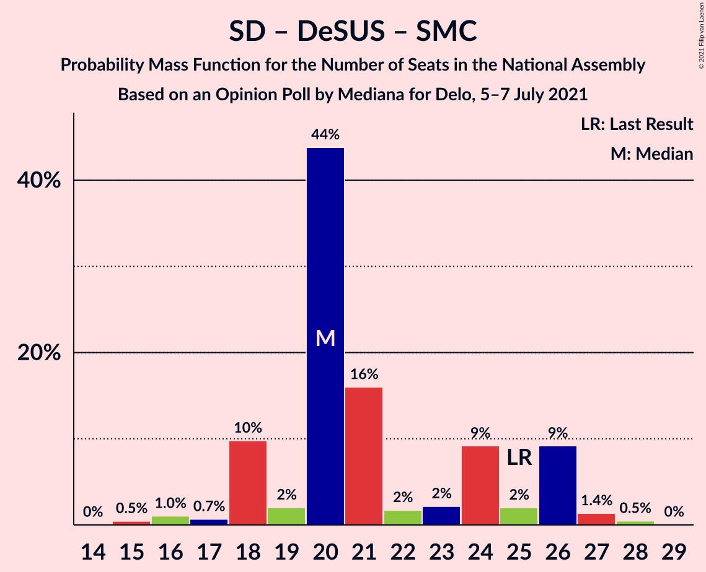

| Number of Seats | Probability | Accumulated | Special Marks |
|:---------------:|:-----------:|:-----------:|:-------------:|
| 15 | 0.5% | 100% |  |
| 16 | 1.0% | 99.5% |  |
| 17 | 0.7% | 98% |  |
| 18 | 10% | 98% |  |
| 19 | 2% | 88% |  |
| 20 | 44% | 86% |  |
| 21 | 16% | 42% | Median |
| 22 | 2% | 26% |  |
| 23 | 2% | 24% |  |
| 24 | 9% | 22% |  |
| 25 | 2% | 13% | Last Result |
| 26 | 9% | 11% |  |
| 27 | 1.4% | 2% |  |
| 28 | 0.5% | 0.5% |  |
| 29 | 0% | 0% |  |

## Technical Information

### Opinion Poll

+ **Polling firm:** Mediana
+ **Commissioner(s):** Delo
+ **Fieldwork period:** 5–7 July 2021

### Calculations

+ **Sample size:** 710
+ **Simulations done:** 1,048,576
+ **Error estimate:** 3.12%

