# Opinion Poll by Ninamedia for Dnevnik, Večer, 13–15 July 2021

<a href="#voting-intentions">Voting Intentions</a> | <a href="#seats">Seats</a> | <a href="#coalitions">Coalitions</a> | <a href="#technical-information">Technical Information</a>

## Voting Intentions

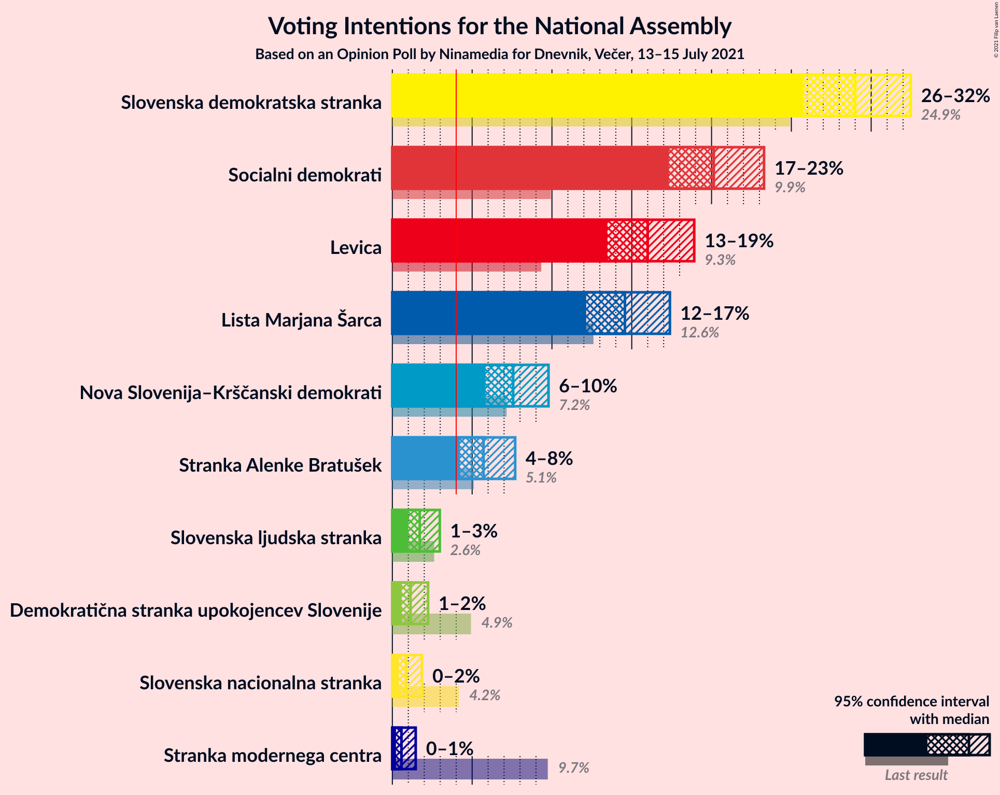

### Confidence Intervals

| Party | Last Result | Poll Result | 80% Confidence Interval | 90% Confidence Interval | 95% Confidence Interval | 99% Confidence Interval |
|:-----:|:-----------:|:-----------:|:-----------------------:|:-----------------------:|:-----------------------:|:-----------------------:|
| Slovenska demokratska stranka | 24.9% | 29.0% | 26.9–31.3% |26.3–31.9% |25.8–32.5% |24.8–33.6% |
| Socialni demokrati | 9.9% | 20.1% | 18.3–22.2% |17.8–22.8% |17.3–23.3% |16.5–24.3% |
| Levica | 9.3% | 16.0% | 14.3–17.9% |13.9–18.4% |13.5–18.9% |12.7–19.8% |
| Lista Marjana Šarca | 12.6% | 14.6% | 13.0–16.4% |12.5–16.9% |12.1–17.4% |11.4–18.3% |
| Nova Slovenija–Krščanski demokrati | 7.2% | 7.6% | 6.4–9.0% |6.1–9.4% |5.8–9.8% |5.3–10.5% |
| Stranka Alenke Bratušek | 5.1% | 5.7% | 4.7–7.0% |4.5–7.4% |4.2–7.7% |3.8–8.4% |
| Slovenska ljudska stranka | 2.6% | 1.7% | 1.2–2.5% |1.1–2.8% |1.0–3.0% |0.8–3.4% |
| Demokratična stranka upokojencev Slovenije | 4.9% | 1.1% | 0.8–1.9% |0.7–2.1% |0.6–2.2% |0.4–2.6% |
| Slovenska nacionalna stranka | 4.2% | 0.9% | 0.5–1.5% |0.5–1.7% |0.4–1.9% |0.3–2.2% |
| Stranka modernega centra | 9.7% | 0.6% | 0.3–1.1% |0.3–1.3% |0.2–1.5% |0.2–1.8% |

*Note:* The poll result column reflects the actual value used in the calculations. Published results may vary slightly, and in addition be rounded to fewer digits.

## Seats

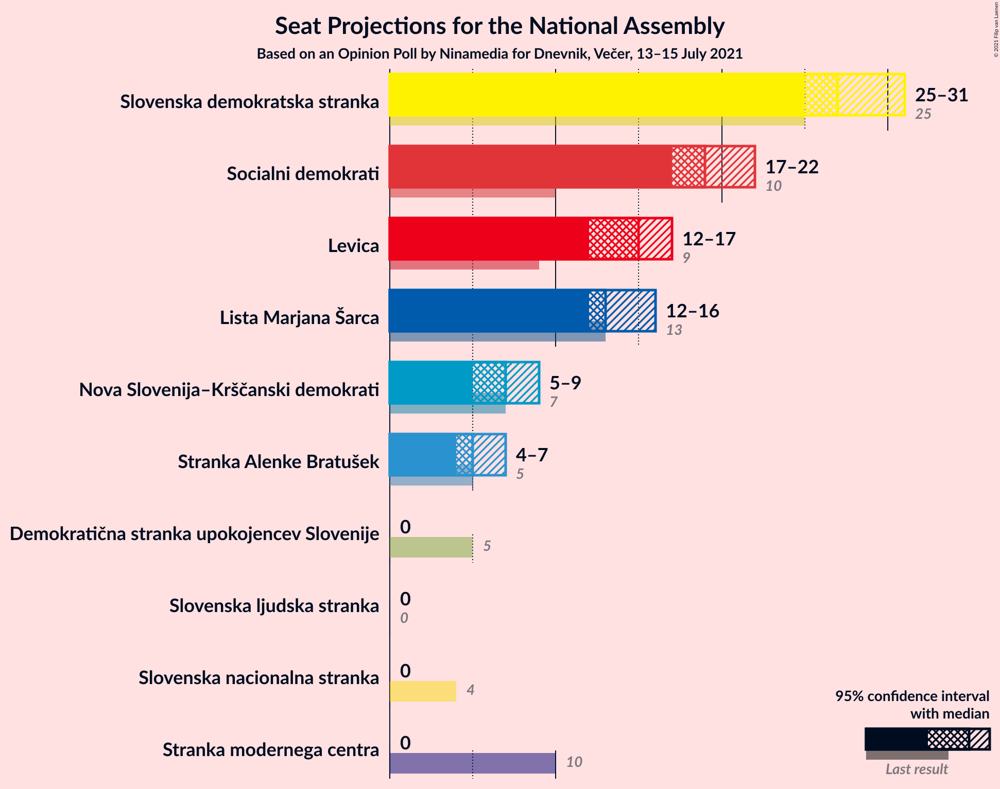

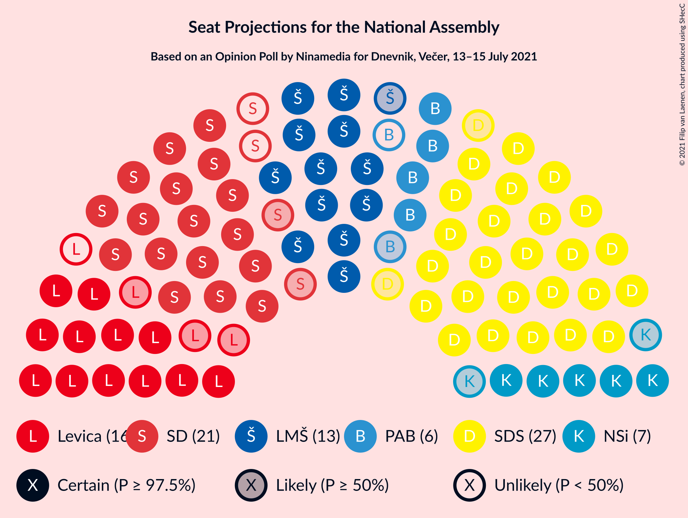

### Confidence Intervals

| Party | Last Result | Median | 80% Confidence Interval | 90% Confidence Interval | 95% Confidence Interval | 99% Confidence Interval |
|:-----:|:-----------:|:------:|:-----------------------:|:-----------------------:|:-----------------------:|:-----------------------:|
| <a href="#slovenska-demokratska-stranka">Slovenska demokratska stranka</a> | 25 | 27 | 26–30 |25–30 |25–31 |24–32 |
| <a href="#socialni-demokrati">Socialni demokrati</a> | 10 | 19 | 18–21 |17–21 |17–22 |16–23 |
| <a href="#levica">Levica</a> | 9 | 15 | 14–17 |13–17 |12–17 |12–19 |
| <a href="#lista-marjana-šarca">Lista Marjana Šarca</a> | 13 | 13 | 13–15 |12–16 |12–16 |11–17 |
| <a href="#nova-slovenija–krščanski-demokrati">Nova Slovenija–Krščanski demokrati</a> | 7 | 7 | 6–9 |6–9 |5–9 |5–10 |
| <a href="#stranka-alenke-bratušek">Stranka Alenke Bratušek</a> | 5 | 5 | 4–6 |4–7 |4–7 |0–8 |
| <a href="#slovenska-ljudska-stranka">Slovenska ljudska stranka</a> | 0 | 0 | 0 |0 |0 |0 |
| <a href="#demokratična-stranka-upokojencev-slovenije">Demokratična stranka upokojencev Slovenije</a> | 5 | 0 | 0 |0 |0 |0 |
| <a href="#slovenska-nacionalna-stranka">Slovenska nacionalna stranka</a> | 4 | 0 | 0 |0 |0 |0 |
| <a href="#stranka-modernega-centra">Stranka modernega centra</a> | 10 | 0 | 0 |0 |0 |0 |

### Slovenska demokratska stranka

*For a full overview of the results for this party, see the [Slovenska demokratska stranka](party-slovenskademokratskastranka.html) page.*

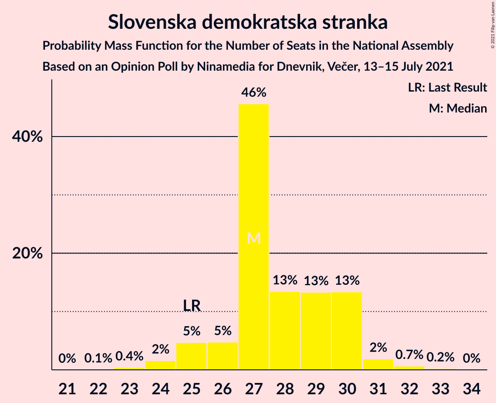

| Number of Seats | Probability | Accumulated | Special Marks |
|:---------------:|:-----------:|:-----------:|:-------------:|
| 22 | 0.1% | 100% |  |
| 23 | 0.4% | 99.9% |  |
| 24 | 2% | 99.5% |  |
| 25 | 5% | 98% | Last Result |
| 26 | 5% | 93% |  |
| 27 | 46% | 89% | Median |
| 28 | 13% | 43% |  |
| 29 | 13% | 29% |  |
| 30 | 13% | 16% |  |
| 31 | 2% | 3% |  |
| 32 | 0.7% | 0.9% |  |
| 33 | 0.2% | 0.3% |  |
| 34 | 0% | 0% |  |

### Socialni demokrati

*For a full overview of the results for this party, see the [Socialni demokrati](party-socialnidemokrati.html) page.*

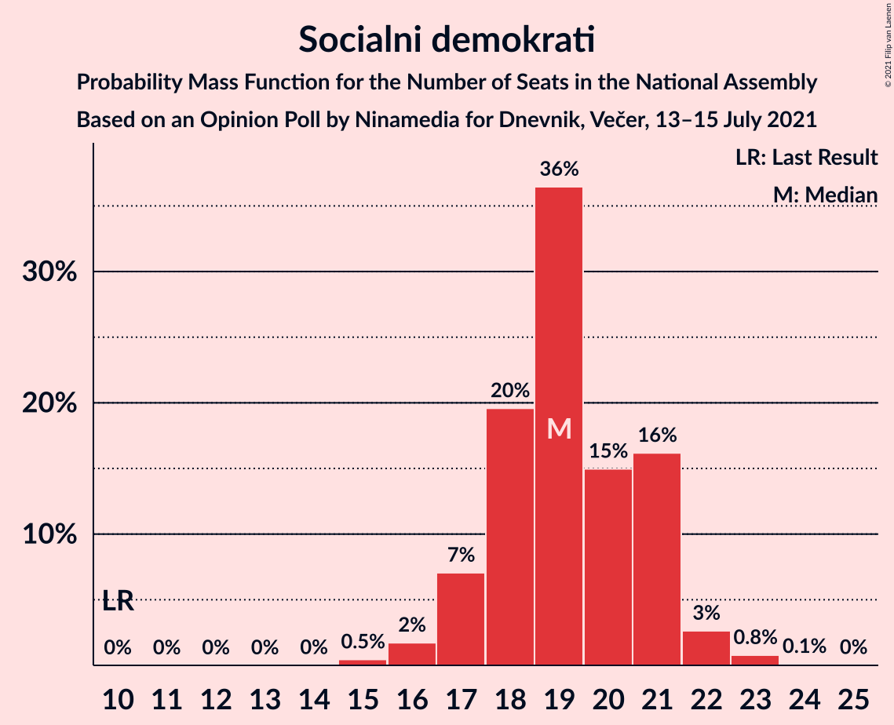

| Number of Seats | Probability | Accumulated | Special Marks |
|:---------------:|:-----------:|:-----------:|:-------------:|
| 10 | 0% | 100% | Last Result |
| 11 | 0% | 100% |  |
| 12 | 0% | 100% |  |
| 13 | 0% | 100% |  |
| 14 | 0% | 100% |  |
| 15 | 0.5% | 100% |  |
| 16 | 2% | 99.5% |  |
| 17 | 7% | 98% |  |
| 18 | 20% | 91% |  |
| 19 | 36% | 71% | Median |
| 20 | 15% | 35% |  |
| 21 | 16% | 20% |  |
| 22 | 3% | 4% |  |
| 23 | 0.8% | 0.9% |  |
| 24 | 0.1% | 0.1% |  |
| 25 | 0% | 0% |  |

### Levica

*For a full overview of the results for this party, see the [Levica](party-levica.html) page.*

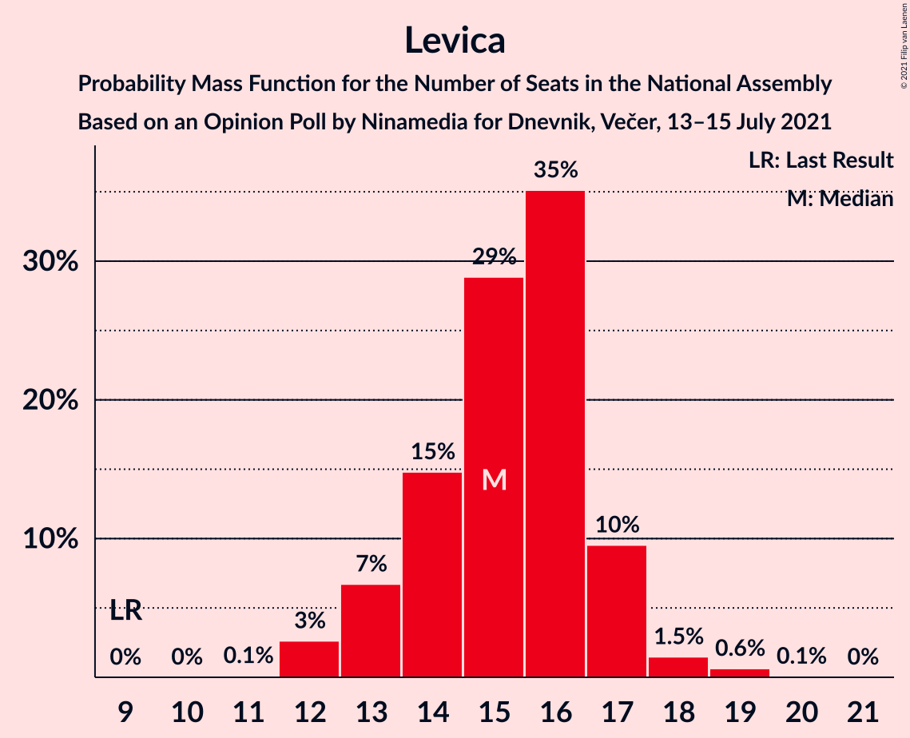

| Number of Seats | Probability | Accumulated | Special Marks |
|:---------------:|:-----------:|:-----------:|:-------------:|
| 9 | 0% | 100% | Last Result |
| 10 | 0% | 100% |  |
| 11 | 0.1% | 100% |  |
| 12 | 3% | 99.9% |  |
| 13 | 7% | 97% |  |
| 14 | 15% | 91% |  |
| 15 | 29% | 76% | Median |
| 16 | 35% | 47% |  |
| 17 | 10% | 12% |  |
| 18 | 1.5% | 2% |  |
| 19 | 0.6% | 0.7% |  |
| 20 | 0.1% | 0.1% |  |
| 21 | 0% | 0% |  |

### Lista Marjana Šarca

*For a full overview of the results for this party, see the [Lista Marjana Šarca](party-listamarjanašarca.html) page.*

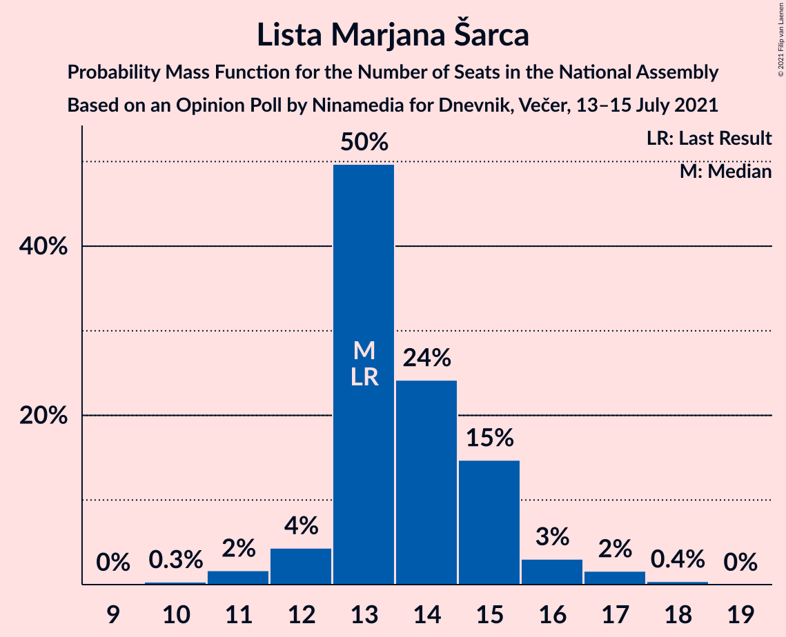

| Number of Seats | Probability | Accumulated | Special Marks |
|:---------------:|:-----------:|:-----------:|:-------------:|
| 10 | 0.3% | 100% |  |
| 11 | 2% | 99.7% |  |
| 12 | 4% | 98% |  |
| 13 | 50% | 94% | Last Result, Median |
| 14 | 24% | 44% |  |
| 15 | 15% | 20% |  |
| 16 | 3% | 5% |  |
| 17 | 2% | 2% |  |
| 18 | 0.4% | 0.4% |  |
| 19 | 0% | 0% |  |

### Nova Slovenija–Krščanski demokrati

*For a full overview of the results for this party, see the [Nova Slovenija–Krščanski demokrati](party-novaslovenija–krščanskidemokrati.html) page.*

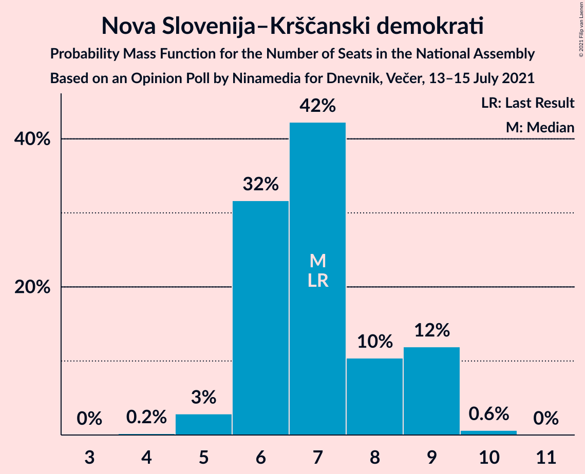

| Number of Seats | Probability | Accumulated | Special Marks |
|:---------------:|:-----------:|:-----------:|:-------------:|
| 4 | 0.2% | 100% |  |
| 5 | 3% | 99.8% |  |
| 6 | 32% | 97% |  |
| 7 | 42% | 65% | Last Result, Median |
| 8 | 10% | 23% |  |
| 9 | 12% | 13% |  |
| 10 | 0.6% | 0.7% |  |
| 11 | 0% | 0% |  |

### Stranka Alenke Bratušek

*For a full overview of the results for this party, see the [Stranka Alenke Bratušek](party-strankaalenkebratušek.html) page.*

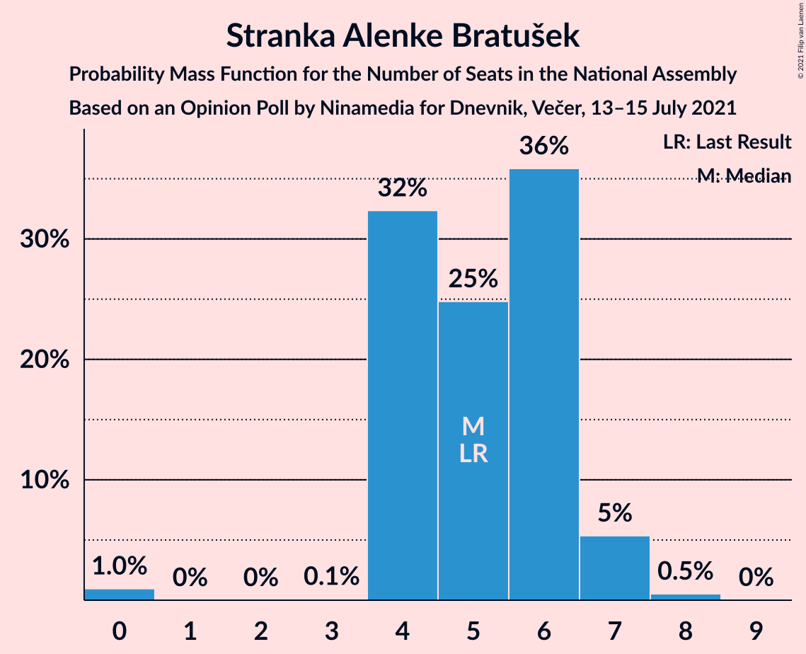

| Number of Seats | Probability | Accumulated | Special Marks |
|:---------------:|:-----------:|:-----------:|:-------------:|
| 0 | 1.0% | 100% |  |
| 1 | 0% | 99.0% |  |
| 2 | 0% | 99.0% |  |
| 3 | 0.1% | 99.0% |  |
| 4 | 32% | 98.9% |  |
| 5 | 25% | 67% | Last Result, Median |
| 6 | 36% | 42% |  |
| 7 | 5% | 6% |  |
| 8 | 0.5% | 0.5% |  |
| 9 | 0% | 0% |  |

### Slovenska ljudska stranka

*For a full overview of the results for this party, see the [Slovenska ljudska stranka](party-slovenskaljudskastranka.html) page.*

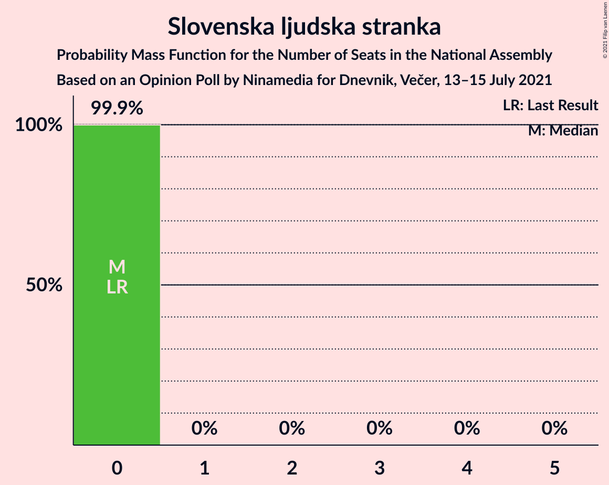

| Number of Seats | Probability | Accumulated | Special Marks |
|:---------------:|:-----------:|:-----------:|:-------------:|
| 0 | 99.9% | 100% | Last Result, Median |
| 1 | 0% | 0.1% |  |
| 2 | 0% | 0.1% |  |
| 3 | 0% | 0.1% |  |
| 4 | 0% | 0% |  |

### Demokratična stranka upokojencev Slovenije

*For a full overview of the results for this party, see the [Demokratična stranka upokojencev Slovenije](party-demokratičnastrankaupokojencevslovenije.html) page.*

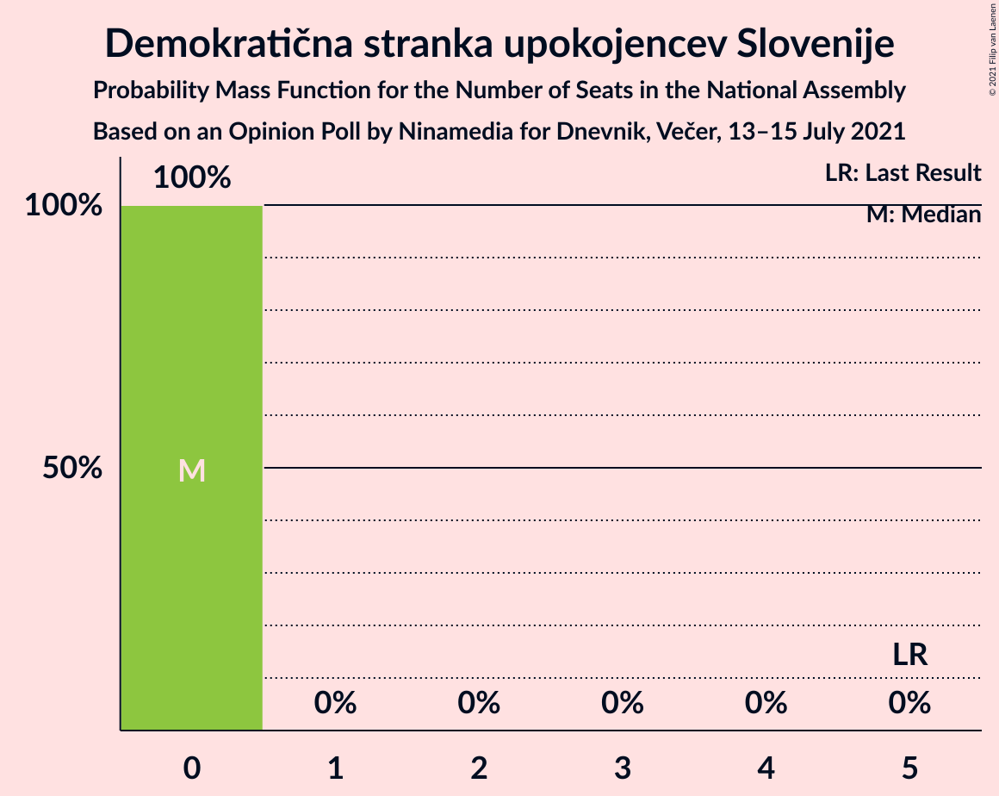

| Number of Seats | Probability | Accumulated | Special Marks |
|:---------------:|:-----------:|:-----------:|:-------------:|
| 0 | 100% | 100% | Median |
| 1 | 0% | 0% |  |
| 2 | 0% | 0% |  |
| 3 | 0% | 0% |  |
| 4 | 0% | 0% |  |
| 5 | 0% | 0% | Last Result |

### Slovenska nacionalna stranka

*For a full overview of the results for this party, see the [Slovenska nacionalna stranka](party-slovenskanacionalnastranka.html) page.*

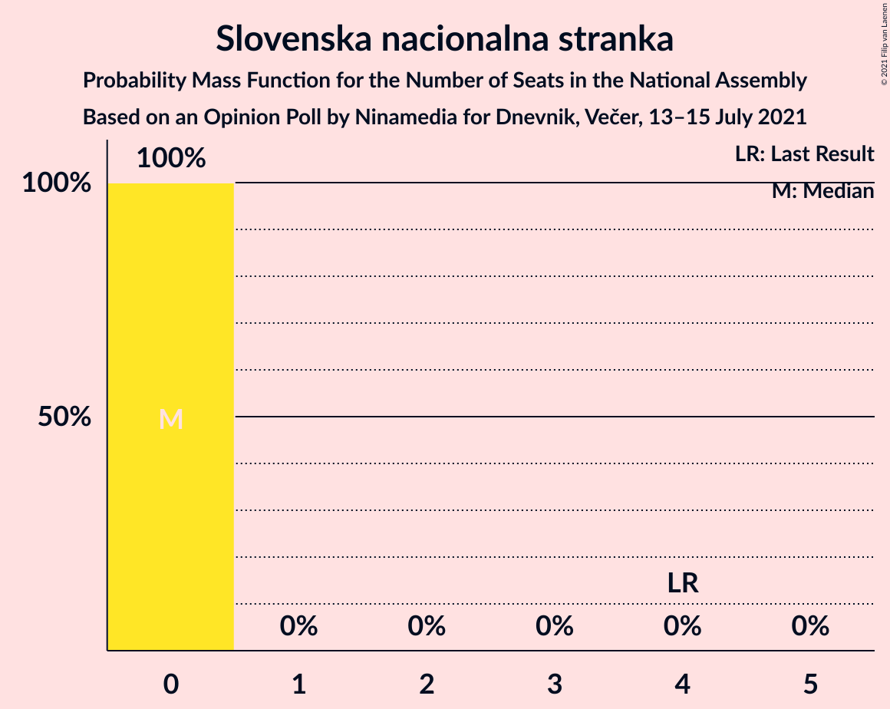

| Number of Seats | Probability | Accumulated | Special Marks |
|:---------------:|:-----------:|:-----------:|:-------------:|
| 0 | 100% | 100% | Median |
| 1 | 0% | 0% |  |
| 2 | 0% | 0% |  |
| 3 | 0% | 0% |  |
| 4 | 0% | 0% | Last Result |

### Stranka modernega centra

*For a full overview of the results for this party, see the [Stranka modernega centra](party-strankamodernegacentra.html) page.*

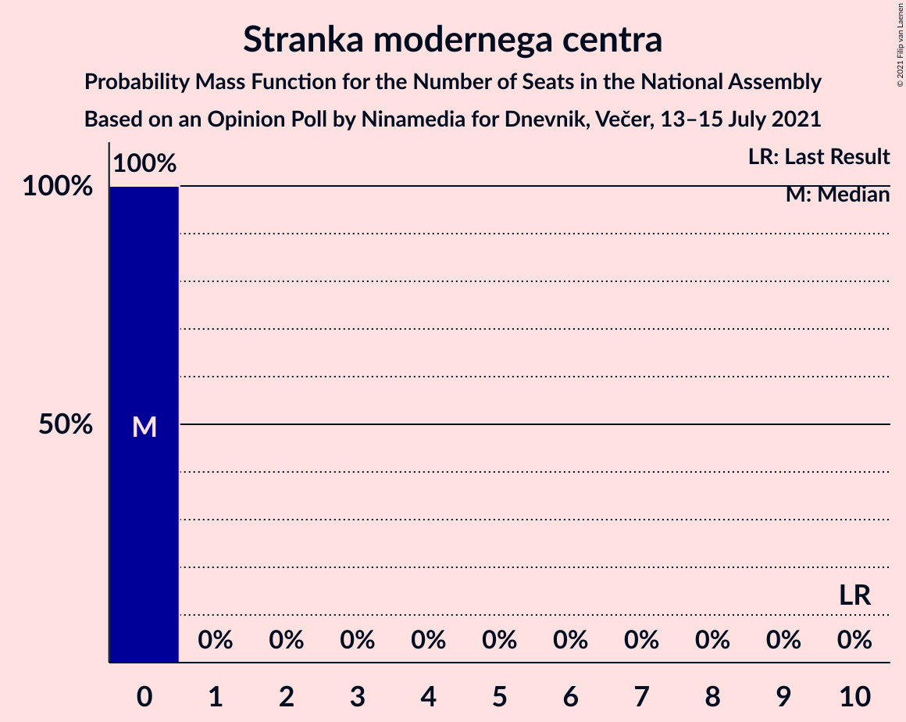

| Number of Seats | Probability | Accumulated | Special Marks |
|:---------------:|:-----------:|:-----------:|:-------------:|
| 0 | 100% | 100% | Median |
| 1 | 0% | 0% |  |
| 2 | 0% | 0% |  |
| 3 | 0% | 0% |  |
| 4 | 0% | 0% |  |
| 5 | 0% | 0% |  |
| 6 | 0% | 0% |  |
| 7 | 0% | 0% |  |
| 8 | 0% | 0% |  |
| 9 | 0% | 0% |  |
| 10 | 0% | 0% | Last Result |

## Coalitions

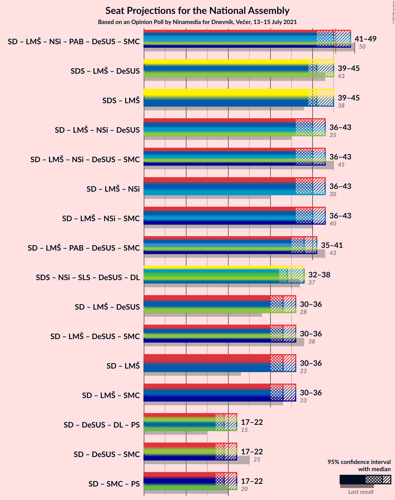

### Confidence Intervals

| Coalition | Last Result | Median | Majority? | 80% Confidence Interval | 90% Confidence Interval | 95% Confidence Interval | 99% Confidence Interval |
|:---------:|:-----------:|:------:|:---------:|:-----------------------:|:-----------------------:|:-----------------------:|:-----------------------:|
| Socialni demokrati – Lista Marjana Šarca – Nova Slovenija–Krščanski demokrati – Stranka Alenke Bratušek – Demokratična stranka upokojencev Slovenije – Stranka modernega centra | 50 | 45 | 40% | 42–47 | 42–48 | 41–49 | 41–49 |
| Slovenska demokratska stranka – Lista Marjana Šarca – Demokratična stranka upokojencev Slovenije | 43 | 41 | 1.4% | 40–43 | 39–44 | 39–45 | 37–46 |
| Slovenska demokratska stranka – Lista Marjana Šarca | 38 | 41 | 1.4% | 40–43 | 39–44 | 39–45 | 37–46 |
| Socialni demokrati – Lista Marjana Šarca – Nova Slovenija–Krščanski demokrati – Demokratična stranka upokojencev Slovenije | 35 | 40 | 0.1% | 38–42 | 37–43 | 36–43 | 36–45 |
| Socialni demokrati – Lista Marjana Šarca – Nova Slovenija–Krščanski demokrati – Demokratična stranka upokojencev Slovenije – Stranka modernega centra | 45 | 40 | 0.1% | 38–42 | 37–43 | 36–43 | 36–45 |
| Socialni demokrati – Lista Marjana Šarca – Nova Slovenija–Krščanski demokrati | 30 | 40 | 0.1% | 38–42 | 37–43 | 36–43 | 36–45 |
| Socialni demokrati – Lista Marjana Šarca – Nova Slovenija–Krščanski demokrati – Stranka modernega centra | 40 | 40 | 0.1% | 38–42 | 37–43 | 36–43 | 36–45 |
| Socialni demokrati – Lista Marjana Šarca – Stranka Alenke Bratušek – Demokratična stranka upokojencev Slovenije – Stranka modernega centra | 43 | 38 | 0% | 35–40 | 35–41 | 35–41 | 33–43 |
| Socialni demokrati – Lista Marjana Šarca – Demokratična stranka upokojencev Slovenije | 28 | 33 | 0% | 31–35 | 30–36 | 30–36 | 29–37 |
| Socialni demokrati – Lista Marjana Šarca – Demokratična stranka upokojencev Slovenije – Stranka modernega centra | 38 | 33 | 0% | 31–35 | 30–36 | 30–36 | 29–37 |
| Socialni demokrati – Lista Marjana Šarca | 23 | 33 | 0% | 31–35 | 30–36 | 30–36 | 29–37 |
| Socialni demokrati – Lista Marjana Šarca – Stranka modernega centra | 33 | 33 | 0% | 31–35 | 30–36 | 30–36 | 29–37 |
| Socialni demokrati – Demokratična stranka upokojencev Slovenije – Stranka modernega centra | 25 | 19 | 0% | 18–21 | 17–21 | 17–22 | 16–23 |

### Socialni demokrati – Lista Marjana Šarca – Nova Slovenija–Krščanski demokrati – Stranka Alenke Bratušek – Demokratična stranka upokojencev Slovenije – Stranka modernega centra

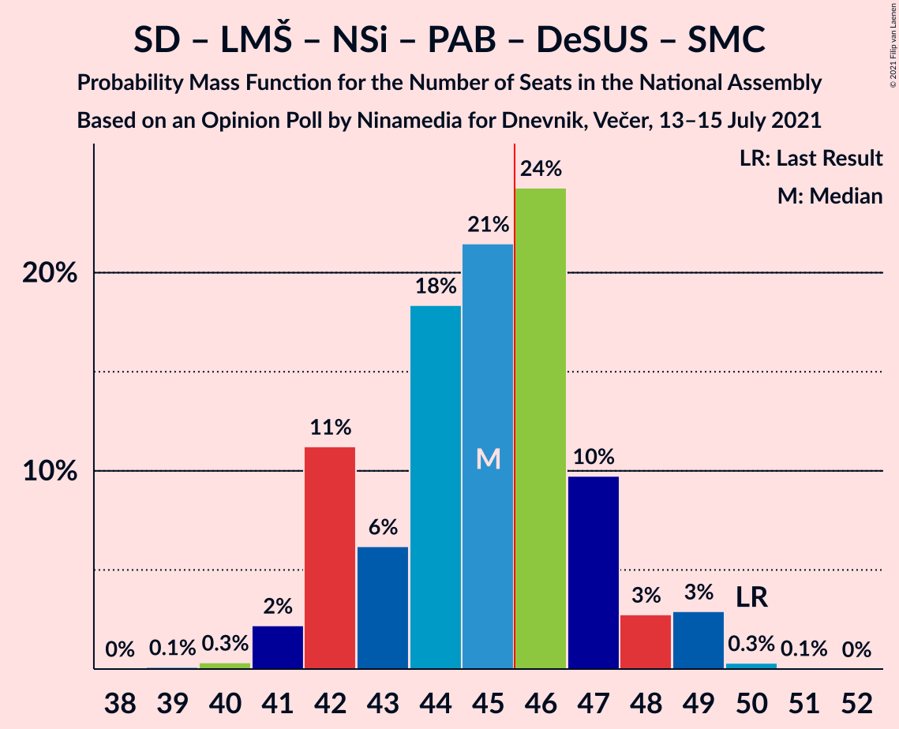

| Number of Seats | Probability | Accumulated | Special Marks |
|:---------------:|:-----------:|:-----------:|:-------------:|
| 39 | 0.1% | 100% |  |
| 40 | 0.3% | 99.9% |  |
| 41 | 2% | 99.5% |  |
| 42 | 11% | 97% |  |
| 43 | 6% | 86% |  |
| 44 | 18% | 80% | Median |
| 45 | 21% | 62% |  |
| 46 | 24% | 40% | Majority |
| 47 | 10% | 16% |  |
| 48 | 3% | 6% |  |
| 49 | 3% | 3% |  |
| 50 | 0.3% | 0.4% | Last Result |
| 51 | 0.1% | 0.1% |  |
| 52 | 0% | 0% |  |

### Slovenska demokratska stranka – Lista Marjana Šarca – Demokratična stranka upokojencev Slovenije

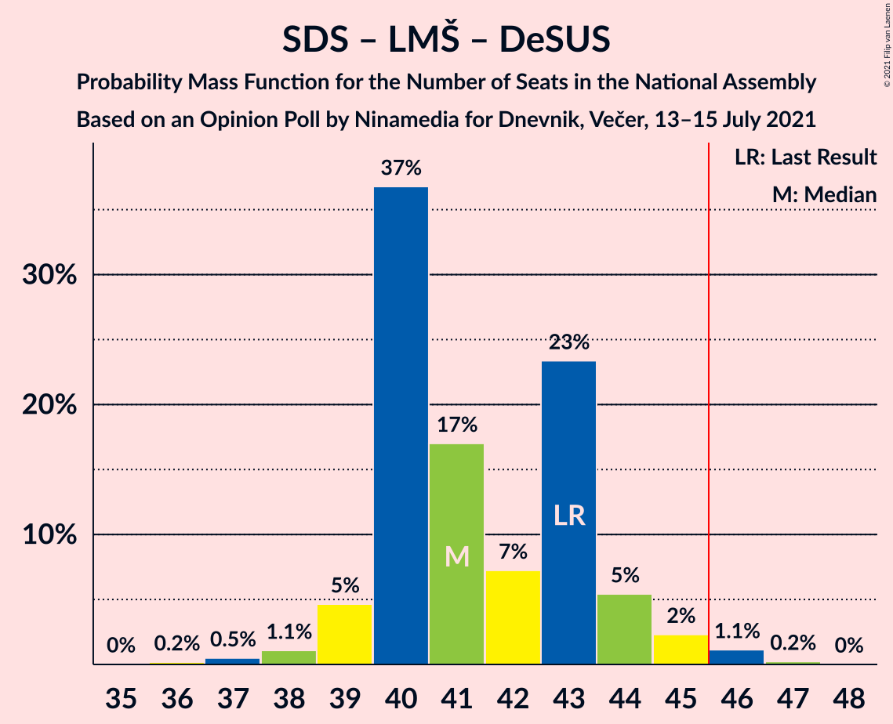

| Number of Seats | Probability | Accumulated | Special Marks |
|:---------------:|:-----------:|:-----------:|:-------------:|
| 36 | 0.2% | 100% |  |
| 37 | 0.5% | 99.8% |  |
| 38 | 1.1% | 99.3% |  |
| 39 | 5% | 98% |  |
| 40 | 37% | 94% | Median |
| 41 | 17% | 57% |  |
| 42 | 7% | 40% |  |
| 43 | 23% | 33% | Last Result |
| 44 | 5% | 9% |  |
| 45 | 2% | 4% |  |
| 46 | 1.1% | 1.4% | Majority |
| 47 | 0.2% | 0.3% |  |
| 48 | 0% | 0% |  |

### Slovenska demokratska stranka – Lista Marjana Šarca

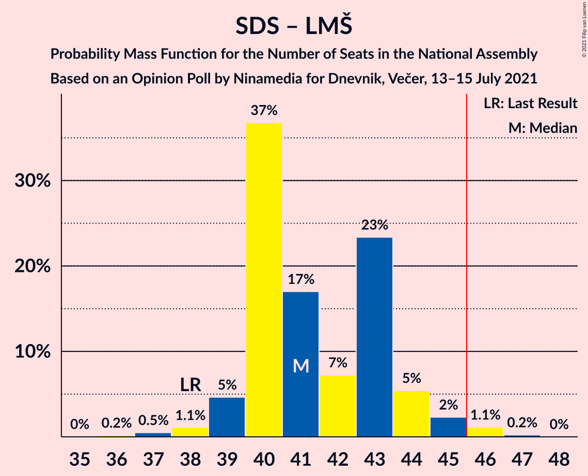

| Number of Seats | Probability | Accumulated | Special Marks |
|:---------------:|:-----------:|:-----------:|:-------------:|
| 36 | 0.2% | 100% |  |
| 37 | 0.5% | 99.8% |  |
| 38 | 1.1% | 99.3% | Last Result |
| 39 | 5% | 98% |  |
| 40 | 37% | 94% | Median |
| 41 | 17% | 57% |  |
| 42 | 7% | 40% |  |
| 43 | 23% | 33% |  |
| 44 | 5% | 9% |  |
| 45 | 2% | 4% |  |
| 46 | 1.1% | 1.4% | Majority |
| 47 | 0.2% | 0.3% |  |
| 48 | 0% | 0% |  |

### Socialni demokrati – Lista Marjana Šarca – Nova Slovenija–Krščanski demokrati – Demokratična stranka upokojencev Slovenije

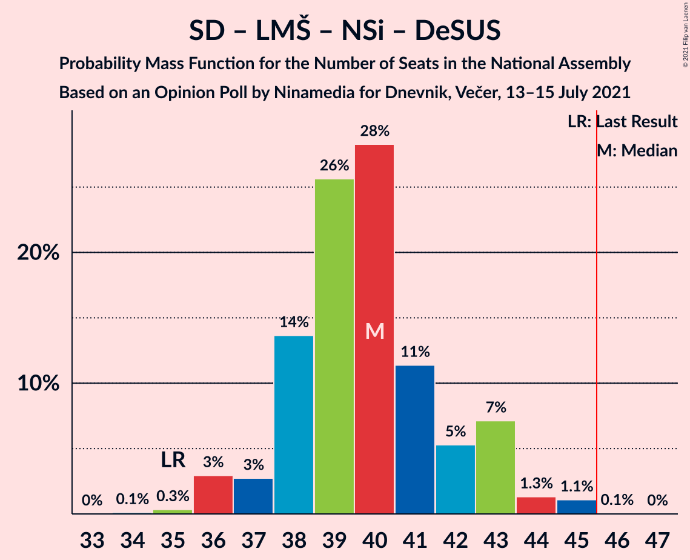

| Number of Seats | Probability | Accumulated | Special Marks |
|:---------------:|:-----------:|:-----------:|:-------------:|
| 34 | 0.1% | 100% |  |
| 35 | 0.3% | 99.9% | Last Result |
| 36 | 3% | 99.5% |  |
| 37 | 3% | 97% |  |
| 38 | 14% | 94% |  |
| 39 | 26% | 80% | Median |
| 40 | 28% | 55% |  |
| 41 | 11% | 26% |  |
| 42 | 5% | 15% |  |
| 43 | 7% | 10% |  |
| 44 | 1.3% | 2% |  |
| 45 | 1.1% | 1.2% |  |
| 46 | 0.1% | 0.1% | Majority |
| 47 | 0% | 0% |  |

### Socialni demokrati – Lista Marjana Šarca – Nova Slovenija–Krščanski demokrati – Demokratična stranka upokojencev Slovenije – Stranka modernega centra

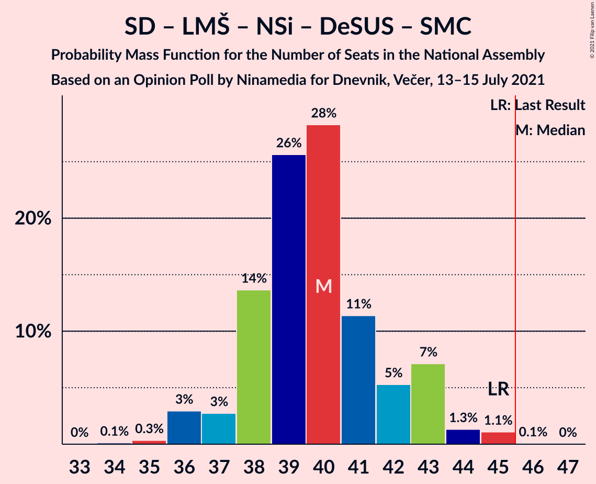

| Number of Seats | Probability | Accumulated | Special Marks |
|:---------------:|:-----------:|:-----------:|:-------------:|
| 34 | 0.1% | 100% |  |
| 35 | 0.3% | 99.9% |  |
| 36 | 3% | 99.5% |  |
| 37 | 3% | 97% |  |
| 38 | 14% | 94% |  |
| 39 | 26% | 80% | Median |
| 40 | 28% | 55% |  |
| 41 | 11% | 26% |  |
| 42 | 5% | 15% |  |
| 43 | 7% | 10% |  |
| 44 | 1.3% | 2% |  |
| 45 | 1.1% | 1.2% | Last Result |
| 46 | 0.1% | 0.1% | Majority |
| 47 | 0% | 0% |  |

### Socialni demokrati – Lista Marjana Šarca – Nova Slovenija–Krščanski demokrati

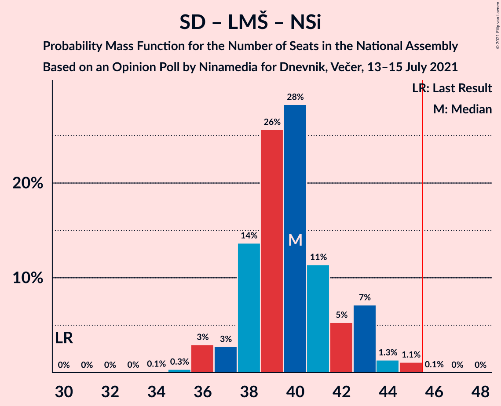

| Number of Seats | Probability | Accumulated | Special Marks |
|:---------------:|:-----------:|:-----------:|:-------------:|
| 30 | 0% | 100% | Last Result |
| 31 | 0% | 100% |  |
| 32 | 0% | 100% |  |
| 33 | 0% | 100% |  |
| 34 | 0.1% | 100% |  |
| 35 | 0.3% | 99.9% |  |
| 36 | 3% | 99.5% |  |
| 37 | 3% | 97% |  |
| 38 | 14% | 94% |  |
| 39 | 26% | 80% | Median |
| 40 | 28% | 55% |  |
| 41 | 11% | 26% |  |
| 42 | 5% | 15% |  |
| 43 | 7% | 10% |  |
| 44 | 1.3% | 2% |  |
| 45 | 1.1% | 1.2% |  |
| 46 | 0.1% | 0.1% | Majority |
| 47 | 0% | 0% |  |

### Socialni demokrati – Lista Marjana Šarca – Nova Slovenija–Krščanski demokrati – Stranka modernega centra

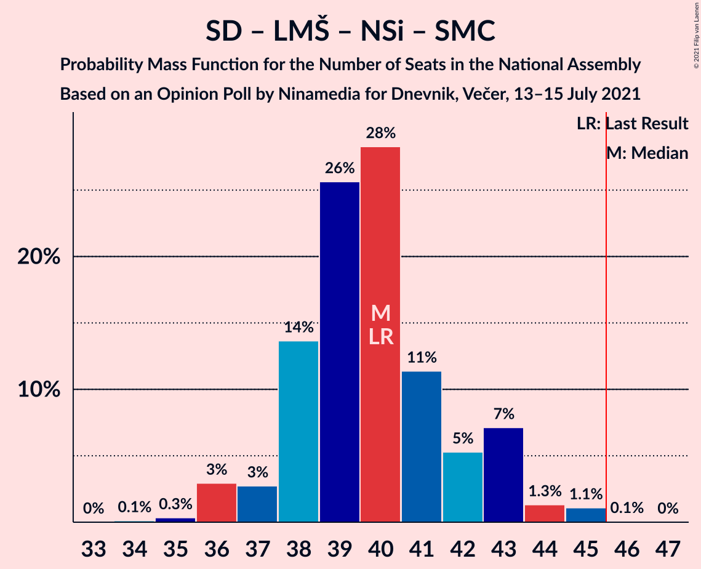

| Number of Seats | Probability | Accumulated | Special Marks |
|:---------------:|:-----------:|:-----------:|:-------------:|
| 34 | 0.1% | 100% |  |
| 35 | 0.3% | 99.9% |  |
| 36 | 3% | 99.5% |  |
| 37 | 3% | 97% |  |
| 38 | 14% | 94% |  |
| 39 | 26% | 80% | Median |
| 40 | 28% | 55% | Last Result |
| 41 | 11% | 26% |  |
| 42 | 5% | 15% |  |
| 43 | 7% | 10% |  |
| 44 | 1.3% | 2% |  |
| 45 | 1.1% | 1.2% |  |
| 46 | 0.1% | 0.1% | Majority |
| 47 | 0% | 0% |  |

### Socialni demokrati – Lista Marjana Šarca – Stranka Alenke Bratušek – Demokratična stranka upokojencev Slovenije – Stranka modernega centra

| Number of Seats | Probability | Accumulated | Special Marks |
|:---------------:|:-----------:|:-----------:|:-------------:|
| 32 | 0.1% | 100% |  |
| 33 | 0.7% | 99.9% |  |
| 34 | 0.8% | 99.2% |  |
| 35 | 11% | 98% |  |
| 36 | 6% | 87% |  |
| 37 | 16% | 81% | Median |
| 38 | 32% | 65% |  |
| 39 | 14% | 33% |  |
| 40 | 12% | 19% |  |
| 41 | 4% | 6% |  |
| 42 | 2% | 2% |  |
| 43 | 0.4% | 0.6% | Last Result |
| 44 | 0.2% | 0.2% |  |
| 45 | 0% | 0% |  |

### Socialni demokrati – Lista Marjana Šarca – Demokratična stranka upokojencev Slovenije

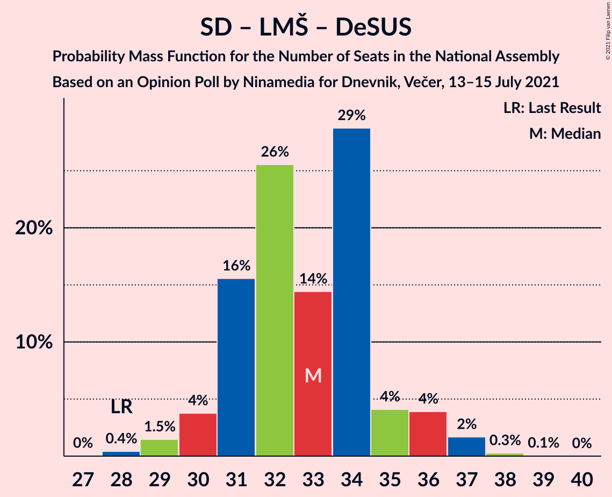

| Number of Seats | Probability | Accumulated | Special Marks |
|:---------------:|:-----------:|:-----------:|:-------------:|
| 27 | 0% | 100% |  |
| 28 | 0.4% | 99.9% | Last Result |
| 29 | 1.5% | 99.5% |  |
| 30 | 4% | 98% |  |
| 31 | 16% | 94% |  |
| 32 | 26% | 79% | Median |
| 33 | 14% | 53% |  |
| 34 | 29% | 39% |  |
| 35 | 4% | 10% |  |
| 36 | 4% | 6% |  |
| 37 | 2% | 2% |  |
| 38 | 0.3% | 0.3% |  |
| 39 | 0.1% | 0.1% |  |
| 40 | 0% | 0% |  |

### Socialni demokrati – Lista Marjana Šarca – Demokratična stranka upokojencev Slovenije – Stranka modernega centra

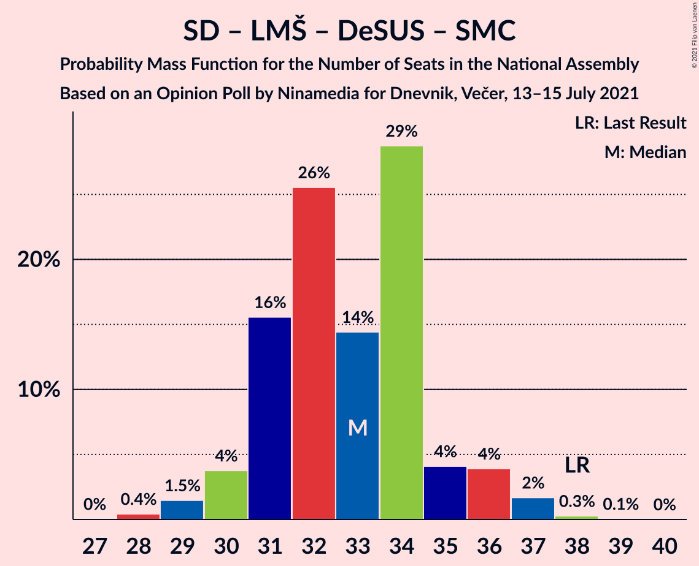

| Number of Seats | Probability | Accumulated | Special Marks |
|:---------------:|:-----------:|:-----------:|:-------------:|
| 27 | 0% | 100% |  |
| 28 | 0.4% | 99.9% |  |
| 29 | 1.5% | 99.5% |  |
| 30 | 4% | 98% |  |
| 31 | 16% | 94% |  |
| 32 | 26% | 79% | Median |
| 33 | 14% | 53% |  |
| 34 | 29% | 39% |  |
| 35 | 4% | 10% |  |
| 36 | 4% | 6% |  |
| 37 | 2% | 2% |  |
| 38 | 0.3% | 0.3% | Last Result |
| 39 | 0.1% | 0.1% |  |
| 40 | 0% | 0% |  |

### Socialni demokrati – Lista Marjana Šarca

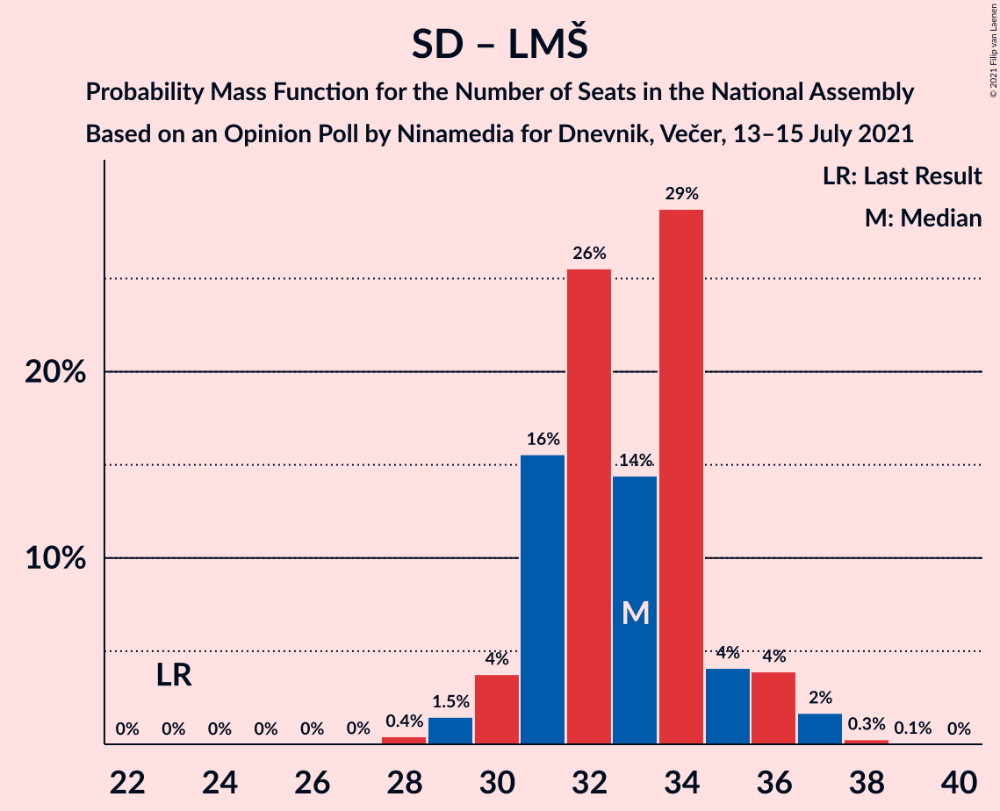

| Number of Seats | Probability | Accumulated | Special Marks |
|:---------------:|:-----------:|:-----------:|:-------------:|
| 23 | 0% | 100% | Last Result |
| 24 | 0% | 100% |  |
| 25 | 0% | 100% |  |
| 26 | 0% | 100% |  |
| 27 | 0% | 100% |  |
| 28 | 0.4% | 99.9% |  |
| 29 | 1.5% | 99.5% |  |
| 30 | 4% | 98% |  |
| 31 | 16% | 94% |  |
| 32 | 26% | 79% | Median |
| 33 | 14% | 53% |  |
| 34 | 29% | 39% |  |
| 35 | 4% | 10% |  |
| 36 | 4% | 6% |  |
| 37 | 2% | 2% |  |
| 38 | 0.3% | 0.3% |  |
| 39 | 0.1% | 0.1% |  |
| 40 | 0% | 0% |  |

### Socialni demokrati – Lista Marjana Šarca – Stranka modernega centra

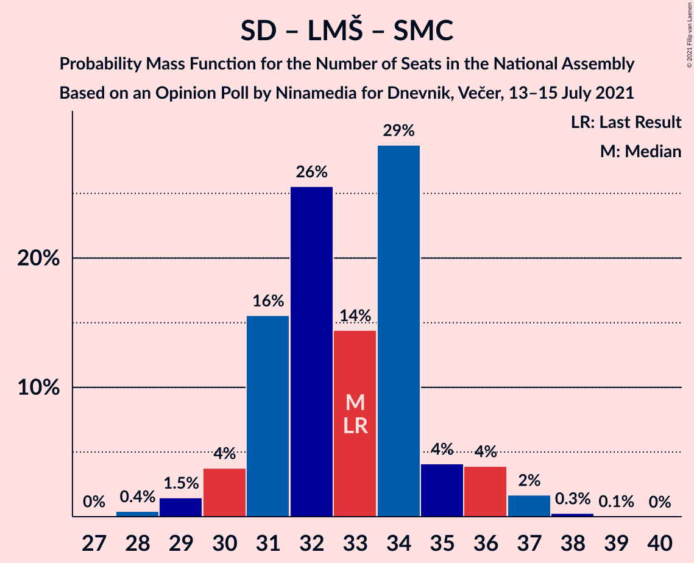

| Number of Seats | Probability | Accumulated | Special Marks |
|:---------------:|:-----------:|:-----------:|:-------------:|
| 27 | 0% | 100% |  |
| 28 | 0.4% | 99.9% |  |
| 29 | 1.5% | 99.5% |  |
| 30 | 4% | 98% |  |
| 31 | 16% | 94% |  |
| 32 | 26% | 79% | Median |
| 33 | 14% | 53% | Last Result |
| 34 | 29% | 39% |  |
| 35 | 4% | 10% |  |
| 36 | 4% | 6% |  |
| 37 | 2% | 2% |  |
| 38 | 0.3% | 0.3% |  |
| 39 | 0.1% | 0.1% |  |
| 40 | 0% | 0% |  |

### Socialni demokrati – Demokratična stranka upokojencev Slovenije – Stranka modernega centra

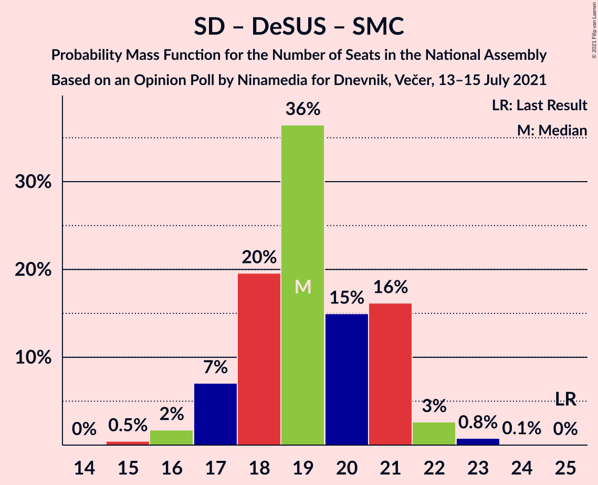

| Number of Seats | Probability | Accumulated | Special Marks |
|:---------------:|:-----------:|:-----------:|:-------------:|
| 15 | 0.5% | 100% |  |
| 16 | 2% | 99.5% |  |
| 17 | 7% | 98% |  |
| 18 | 20% | 91% |  |
| 19 | 36% | 71% | Median |
| 20 | 15% | 35% |  |
| 21 | 16% | 20% |  |
| 22 | 3% | 4% |  |
| 23 | 0.8% | 0.9% |  |
| 24 | 0.1% | 0.1% |  |
| 25 | 0% | 0% | Last Result |

## Technical Information

### Opinion Poll

+ **Polling firm:** Ninamedia
+ **Commissioner(s):** Dnevnik, Večer
+ **Fieldwork period:** 13–15 July 2021

### Calculations

+ **Sample size:** 700
+ **Simulations done:** 1,048,576
+ **Error estimate:** 2.09%

