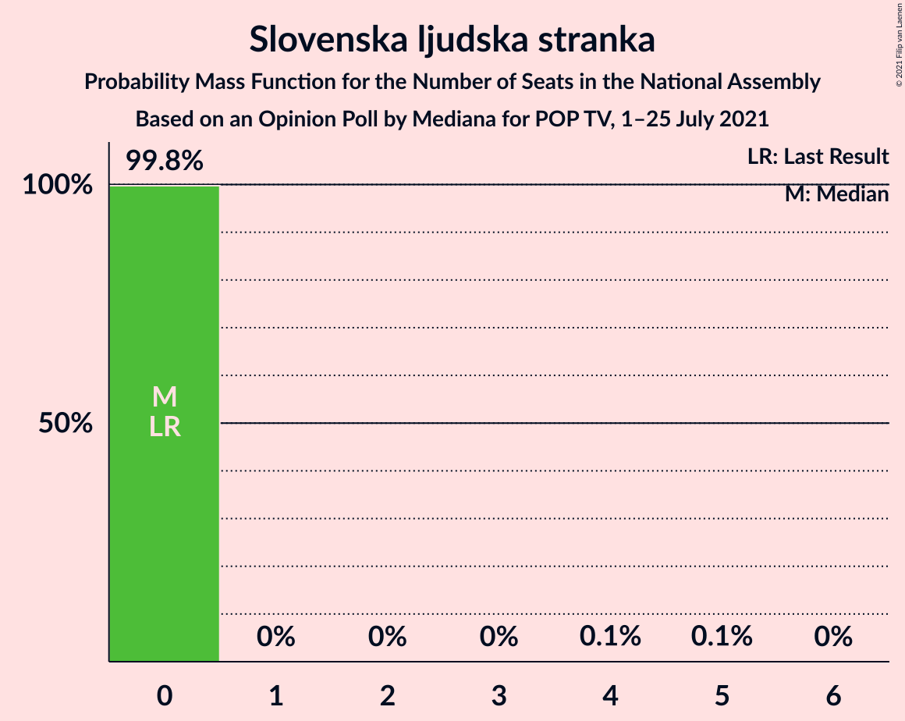

# Opinion Poll by Mediana for POP TV, 1–25 July 2021

<a href="#voting-intentions">Voting Intentions</a> | <a href="#seats">Seats</a> | <a href="#coalitions">Coalitions</a> | <a href="#technical-information">Technical Information</a>

## Voting Intentions

### Confidence Intervals

| Party | Last Result | Poll Result | 80% Confidence Interval | 90% Confidence Interval | 95% Confidence Interval | 99% Confidence Interval |
|:-----:|:-----------:|:-----------:|:-----------------------:|:-----------------------:|:-----------------------:|:-----------------------:|
| Slovenska demokratska stranka | 24.9% | 27.5% | 25.4–29.7% |24.8–30.3% |24.3–30.8% |23.3–31.9% |
| Socialni demokrati | 9.9% | 17.8% | 16.0–19.7% |15.6–20.3% |15.2–20.8% |14.4–21.7% |
| Levica | 9.3% | 12.2% | 10.7–13.9% |10.3–14.4% |10.0–14.8% |9.3–15.7% |
| Lista Marjana Šarca | 12.6% | 12.0% | 10.6–13.7% |10.2–14.2% |9.9–14.6% |9.2–15.5% |
| Nova Slovenija–Krščanski demokrati | 7.2% | 6.4% | 5.4–7.8% |5.1–8.2% |4.9–8.5% |4.4–9.2% |
| Stranka Alenke Bratušek | 5.1% | 4.1% | 3.3–5.2% |3.0–5.5% |2.8–5.8% |2.5–6.4% |
| Demokratična stranka upokojencev Slovenije | 4.9% | 3.5% | 2.8–4.6% |2.6–4.9% |2.4–5.1% |2.1–5.7% |
| Piratska stranka Slovenije | 2.2% | 2.9% | 2.3–3.9% |2.1–4.2% |1.9–4.5% |1.6–5.0% |
| Slovenska nacionalna stranka | 4.2% | 2.7% | 2.0–3.6% |1.9–3.9% |1.7–4.1% |1.4–4.6% |
| Slovenska ljudska stranka | 2.6% | 2.1% | 1.6–3.0% |1.4–3.2% |1.3–3.4% |1.1–3.9% |
| Andrej Čuš in Zeleni Slovenije | 1.1% | 1.8% | 1.3–2.7% |1.2–2.9% |1.1–3.1% |0.9–3.5% |
| Dobra država | 1.5% | 1.5% | 1.1–2.3% |1.0–2.5% |0.9–2.7% |0.7–3.2% |
| Stranka modernega centra | 9.7% | 0.8% | 0.5–1.5% |0.5–1.7% |0.4–1.8% |0.3–2.2% |

*Note:* The poll result column reflects the actual value used in the calculations. Published results may vary slightly, and in addition be rounded to fewer digits.

## Seats

### Confidence Intervals

| Party | Last Result | Median | 80% Confidence Interval | 90% Confidence Interval | 95% Confidence Interval | 99% Confidence Interval |
|:-----:|:-----------:|:------:|:-----------------------:|:-----------------------:|:-----------------------:|:-----------------------:|
| <a href="#slovenska-demokratska-stranka">Slovenska demokratska stranka</a> | 25 | 29 | 26–32 |26–33 |25–34 |24–34 |
| <a href="#socialni-demokrati">Socialni demokrati</a> | 10 | 18 | 17–22 |17–22 |17–22 |15–23 |
| <a href="#levica">Levica</a> | 9 | 12 | 11–14 |11–14 |11–15 |10–17 |
| <a href="#lista-marjana-šarca">Lista Marjana Šarca</a> | 13 | 12 | 11–15 |10–16 |10–16 |10–17 |
| <a href="#nova-slovenija–krščanski-demokrati">Nova Slovenija–Krščanski demokrati</a> | 7 | 6 | 5–8 |5–9 |4–9 |4–10 |
| <a href="#stranka-alenke-bratušek">Stranka Alenke Bratušek</a> | 5 | 0 | 0–5 |0–5 |0–6 |0–6 |
| <a href="#demokratična-stranka-upokojencev-slovenije">Demokratična stranka upokojencev Slovenije</a> | 5 | 4 | 0–4 |0–5 |0–5 |0–6 |
| <a href="#piratska-stranka-slovenije">Piratska stranka Slovenije</a> | 0 | 0 | 0 |0 |0–4 |0–5 |
| <a href="#slovenska-nacionalna-stranka">Slovenska nacionalna stranka</a> | 4 | 0 | 0 |0 |0–4 |0–4 |
| <a href="#slovenska-ljudska-stranka">Slovenska ljudska stranka</a> | 0 | 0 | 0 |0 |0 |0 |
| <a href="#andrej-čuš-in-zeleni-slovenije">Andrej Čuš in Zeleni Slovenije</a> | 0 | 0 | 0 |0 |0 |0 |
| <a href="#dobra-država">Dobra država</a> | 0 | 0 | 0 |0 |0 |0 |
| <a href="#stranka-modernega-centra">Stranka modernega centra</a> | 10 | 0 | 0 |0 |0 |0 |

### Slovenska demokratska stranka

*For a full overview of the results for this party, see the [Slovenska demokratska stranka](party-slovenskademokratskastranka.html) page.*

| Number of Seats | Probability | Accumulated | Special Marks |
|:---------------:|:-----------:|:-----------:|:-------------:|
| 23 | 0% | 100% |  |
| 24 | 0.6% | 99.9% |  |
| 25 | 2% | 99.3% | Last Result |
| 26 | 15% | 97% |  |
| 27 | 15% | 82% |  |
| 28 | 12% | 67% |  |
| 29 | 5% | 55% | Median |
| 30 | 8% | 50% |  |
| 31 | 30% | 42% |  |
| 32 | 6% | 12% |  |
| 33 | 1.0% | 6% |  |
| 34 | 4% | 5% |  |
| 35 | 0.2% | 0.3% |  |
| 36 | 0.1% | 0.1% |  |
| 37 | 0% | 0.1% |  |
| 38 | 0% | 0% |  |

### Socialni demokrati

*For a full overview of the results for this party, see the [Socialni demokrati](party-socialnidemokrati.html) page.*

| Number of Seats | Probability | Accumulated | Special Marks |
|:---------------:|:-----------:|:-----------:|:-------------:|
| 10 | 0% | 100% | Last Result |
| 11 | 0% | 100% |  |
| 12 | 0% | 100% |  |
| 13 | 0% | 100% |  |
| 14 | 0.1% | 100% |  |
| 15 | 1.0% | 99.9% |  |
| 16 | 1.4% | 98.9% |  |
| 17 | 34% | 98% |  |
| 18 | 14% | 63% | Median |
| 19 | 18% | 49% |  |
| 20 | 10% | 31% |  |
| 21 | 5% | 21% |  |
| 22 | 15% | 16% |  |
| 23 | 1.0% | 1.3% |  |
| 24 | 0.2% | 0.2% |  |
| 25 | 0% | 0% |  |

### Levica

*For a full overview of the results for this party, see the [Levica](party-levica.html) page.*

| Number of Seats | Probability | Accumulated | Special Marks |
|:---------------:|:-----------:|:-----------:|:-------------:|
| 9 | 0.2% | 100% | Last Result |
| 10 | 2% | 99.8% |  |
| 11 | 23% | 98% |  |
| 12 | 28% | 75% | Median |
| 13 | 33% | 47% |  |
| 14 | 10% | 14% |  |
| 15 | 2% | 3% |  |
| 16 | 0.9% | 1.5% |  |
| 17 | 0.5% | 0.6% |  |
| 18 | 0.1% | 0.1% |  |
| 19 | 0% | 0% |  |

### Lista Marjana Šarca

*For a full overview of the results for this party, see the [Lista Marjana Šarca](party-listamarjanašarca.html) page.*

| Number of Seats | Probability | Accumulated | Special Marks |
|:---------------:|:-----------:|:-----------:|:-------------:|
| 8 | 0% | 100% |  |
| 9 | 0.2% | 99.9% |  |
| 10 | 6% | 99.8% |  |
| 11 | 34% | 94% |  |
| 12 | 25% | 60% | Median |
| 13 | 19% | 35% | Last Result |
| 14 | 3% | 17% |  |
| 15 | 3% | 13% |  |
| 16 | 9% | 10% |  |
| 17 | 0.5% | 0.6% |  |
| 18 | 0.1% | 0.1% |  |
| 19 | 0% | 0% |  |

### Nova Slovenija–Krščanski demokrati

*For a full overview of the results for this party, see the [Nova Slovenija–Krščanski demokrati](party-novaslovenija–krščanskidemokrati.html) page.*

| Number of Seats | Probability | Accumulated | Special Marks |
|:---------------:|:-----------:|:-----------:|:-------------:|
| 0 | 0.1% | 100% |  |
| 1 | 0% | 99.9% |  |
| 2 | 0% | 99.9% |  |
| 3 | 0% | 99.9% |  |
| 4 | 3% | 99.9% |  |
| 5 | 20% | 97% |  |
| 6 | 39% | 77% | Median |
| 7 | 26% | 38% | Last Result |
| 8 | 7% | 13% |  |
| 9 | 5% | 6% |  |
| 10 | 0.8% | 1.0% |  |
| 11 | 0.2% | 0.2% |  |
| 12 | 0% | 0% |  |

### Stranka Alenke Bratušek

*For a full overview of the results for this party, see the [Stranka Alenke Bratušek](party-strankaalenkebratušek.html) page.*

| Number of Seats | Probability | Accumulated | Special Marks |
|:---------------:|:-----------:|:-----------:|:-------------:|
| 0 | 51% | 100% | Median |
| 1 | 0% | 49% |  |
| 2 | 0% | 49% |  |
| 3 | 0% | 49% |  |
| 4 | 39% | 49% |  |
| 5 | 8% | 10% | Last Result |
| 6 | 2% | 3% |  |
| 7 | 0.2% | 0.2% |  |
| 8 | 0% | 0% |  |

### Demokratična stranka upokojencev Slovenije

*For a full overview of the results for this party, see the [Demokratična stranka upokojencev Slovenije](party-demokratičnastrankaupokojencevslovenije.html) page.*

| Number of Seats | Probability | Accumulated | Special Marks |
|:---------------:|:-----------:|:-----------:|:-------------:|
| 0 | 47% | 100% |  |
| 1 | 0% | 53% |  |
| 2 | 0% | 53% |  |
| 3 | 0% | 53% |  |
| 4 | 47% | 53% | Median |
| 5 | 5% | 6% | Last Result |
| 6 | 0.5% | 0.6% |  |
| 7 | 0.1% | 0.1% |  |
| 8 | 0% | 0% |  |

### Piratska stranka Slovenije

*For a full overview of the results for this party, see the [Piratska stranka Slovenije](party-piratskastrankaslovenije.html) page.*

| Number of Seats | Probability | Accumulated | Special Marks |
|:---------------:|:-----------:|:-----------:|:-------------:|
| 0 | 96% | 100% | Last Result, Median |
| 1 | 0% | 4% |  |
| 2 | 0% | 4% |  |
| 3 | 0% | 4% |  |
| 4 | 3% | 4% |  |
| 5 | 2% | 2% |  |
| 6 | 0.1% | 0.1% |  |
| 7 | 0% | 0% |  |

### Slovenska nacionalna stranka

*For a full overview of the results for this party, see the [Slovenska nacionalna stranka](party-slovenskanacionalnastranka.html) page.*

| Number of Seats | Probability | Accumulated | Special Marks |
|:---------------:|:-----------:|:-----------:|:-------------:|
| 0 | 97% | 100% | Median |
| 1 | 0% | 3% |  |
| 2 | 0% | 3% |  |
| 3 | 0% | 3% |  |
| 4 | 3% | 3% | Last Result |
| 5 | 0.1% | 0.1% |  |
| 6 | 0% | 0% |  |

### Slovenska ljudska stranka

*For a full overview of the results for this party, see the [Slovenska ljudska stranka](party-slovenskaljudskastranka.html) page.*

| Number of Seats | Probability | Accumulated | Special Marks |
|:---------------:|:-----------:|:-----------:|:-------------:|
| 0 | 99.8% | 100% | Last Result, Median |
| 1 | 0% | 0.2% |  |
| 2 | 0% | 0.2% |  |
| 3 | 0% | 0.2% |  |
| 4 | 0.1% | 0.2% |  |
| 5 | 0.1% | 0.1% |  |
| 6 | 0% | 0% |  |

### Andrej Čuš in Zeleni Slovenije

*For a full overview of the results for this party, see the [Andrej Čuš in Zeleni Slovenije](party-andrejčušinzelenislovenije.html) page.*

| Number of Seats | Probability | Accumulated | Special Marks |
|:---------------:|:-----------:|:-----------:|:-------------:|
| 0 | 100% | 100% | Last Result, Median |

### Dobra država

*For a full overview of the results for this party, see the [Dobra država](party-dobradržava.html) page.*

| Number of Seats | Probability | Accumulated | Special Marks |
|:---------------:|:-----------:|:-----------:|:-------------:|
| 0 | 100% | 100% | Last Result, Median |

### Stranka modernega centra

*For a full overview of the results for this party, see the [Stranka modernega centra](party-strankamodernegacentra.html) page.*

| Number of Seats | Probability | Accumulated | Special Marks |
|:---------------:|:-----------:|:-----------:|:-------------:|
| 0 | 100% | 100% | Median |
| 1 | 0% | 0% |  |
| 2 | 0% | 0% |  |
| 3 | 0% | 0% |  |
| 4 | 0% | 0% |  |
| 5 | 0% | 0% |  |
| 6 | 0% | 0% |  |
| 7 | 0% | 0% |  |
| 8 | 0% | 0% |  |
| 9 | 0% | 0% |  |
| 10 | 0% | 0% | Last Result |

## Coalitions

### Confidence Intervals

| Coalition | Last Result | Median | Majority? | 80% Confidence Interval | 90% Confidence Interval | 95% Confidence Interval | 99% Confidence Interval |
|:---------:|:-----------:|:------:|:---------:|:-----------------------:|:-----------------------:|:-----------------------:|:-----------------------:|
| Slovenska demokratska stranka – Lista Marjana Šarca – Demokratična stranka upokojencev Slovenije | 43 | 43 | 26% | 41–48 | 40–48 | 39–48 | 36–49 |
| Socialni demokrati – Lista Marjana Šarca – Nova Slovenija–Krščanski demokrati – Stranka Alenke Bratušek – Demokratična stranka upokojencev Slovenije – Stranka modernega centra | 50 | 41 | 16% | 37–47 | 36–48 | 35–48 | 35–48 |
| Slovenska demokratska stranka – Lista Marjana Šarca | 38 | 42 | 2% | 38–44 | 38–45 | 37–45 | 35–47 |
| Socialni demokrati – Lista Marjana Šarca – Nova Slovenija–Krščanski demokrati – Demokratična stranka upokojencev Slovenije | 35 | 40 | 0.9% | 36–44 | 35–44 | 34–44 | 32–46 |
| Socialni demokrati – Lista Marjana Šarca – Nova Slovenija–Krščanski demokrati – Demokratična stranka upokojencev Slovenije – Stranka modernega centra | 45 | 40 | 0.9% | 36–44 | 35–44 | 34–44 | 32–46 |
| Socialni demokrati – Lista Marjana Šarca – Nova Slovenija–Krščanski demokrati | 30 | 37 | 0.3% | 34–40 | 34–41 | 34–42 | 32–45 |
| Socialni demokrati – Lista Marjana Šarca – Nova Slovenija–Krščanski demokrati – Stranka modernega centra | 40 | 37 | 0.3% | 34–40 | 34–41 | 34–42 | 32–45 |
| Socialni demokrati – Lista Marjana Šarca – Stranka Alenke Bratušek – Demokratična stranka upokojencev Slovenije – Stranka modernega centra | 43 | 34 | 0% | 30–40 | 29–42 | 28–42 | 28–42 |
| Socialni demokrati – Lista Marjana Šarca – Demokratična stranka upokojencev Slovenije | 28 | 33 | 0% | 29–37 | 28–38 | 28–38 | 27–39 |
| Socialni demokrati – Lista Marjana Šarca – Demokratična stranka upokojencev Slovenije – Stranka modernega centra | 38 | 33 | 0% | 29–37 | 28–38 | 28–38 | 27–39 |
| Socialni demokrati – Lista Marjana Šarca | 23 | 31 | 0% | 28–34 | 28–34 | 28–34 | 26–37 |
| Socialni demokrati – Lista Marjana Šarca – Stranka modernega centra | 33 | 31 | 0% | 28–34 | 28–34 | 28–34 | 26–37 |
| Socialni demokrati – Demokratična stranka upokojencev Slovenije – Stranka modernega centra | 25 | 21 | 0% | 17–23 | 17–24 | 17–24 | 15–27 |

### Slovenska demokratska stranka – Lista Marjana Šarca – Demokratična stranka upokojencev Slovenije

| Number of Seats | Probability | Accumulated | Special Marks |
|:---------------:|:-----------:|:-----------:|:-------------:|
| 35 | 0.1% | 100% |  |
| 36 | 0.6% | 99.9% |  |
| 37 | 0.5% | 99.3% |  |
| 38 | 0.9% | 98.8% |  |
| 39 | 3% | 98% |  |
| 40 | 3% | 95% |  |
| 41 | 5% | 92% |  |
| 42 | 37% | 87% |  |
| 43 | 10% | 50% | Last Result |
| 44 | 4% | 40% |  |
| 45 | 10% | 36% | Median |
| 46 | 1.2% | 26% | Majority |
| 47 | 10% | 25% |  |
| 48 | 15% | 16% |  |
| 49 | 0.4% | 0.9% |  |
| 50 | 0.2% | 0.5% |  |
| 51 | 0.2% | 0.3% |  |
| 52 | 0% | 0% |  |

### Socialni demokrati – Lista Marjana Šarca – Nova Slovenija–Krščanski demokrati – Stranka Alenke Bratušek – Demokratična stranka upokojencev Slovenije – Stranka modernega centra

| Number of Seats | Probability | Accumulated | Special Marks |
|:---------------:|:-----------:|:-----------:|:-------------:|
| 33 | 0.1% | 100% |  |
| 34 | 0.4% | 99.9% |  |
| 35 | 4% | 99.5% |  |
| 36 | 0.8% | 95% |  |
| 37 | 5% | 94% |  |
| 38 | 4% | 89% |  |
| 39 | 17% | 86% |  |
| 40 | 17% | 69% | Median |
| 41 | 6% | 52% |  |
| 42 | 9% | 46% |  |
| 43 | 4% | 37% |  |
| 44 | 4% | 33% |  |
| 45 | 13% | 30% |  |
| 46 | 6% | 16% | Majority |
| 47 | 1.0% | 11% |  |
| 48 | 9% | 10% |  |
| 49 | 0.1% | 0.3% |  |
| 50 | 0.2% | 0.2% | Last Result |
| 51 | 0% | 0% |  |

### Slovenska demokratska stranka – Lista Marjana Šarca

| Number of Seats | Probability | Accumulated | Special Marks |
|:---------------:|:-----------:|:-----------:|:-------------:|
| 34 | 0.1% | 100% |  |
| 35 | 0.6% | 99.9% |  |
| 36 | 0.8% | 99.3% |  |
| 37 | 2% | 98.5% |  |
| 38 | 19% | 97% | Last Result |
| 39 | 8% | 78% |  |
| 40 | 5% | 70% |  |
| 41 | 5% | 65% | Median |
| 42 | 20% | 60% |  |
| 43 | 13% | 40% |  |
| 44 | 17% | 27% |  |
| 45 | 7% | 9% |  |
| 46 | 1.2% | 2% | Majority |
| 47 | 0.6% | 1.0% |  |
| 48 | 0.3% | 0.4% |  |
| 49 | 0.1% | 0.2% |  |
| 50 | 0% | 0.1% |  |
| 51 | 0% | 0% |  |

### Socialni demokrati – Lista Marjana Šarca – Nova Slovenija–Krščanski demokrati – Demokratična stranka upokojencev Slovenije

| Number of Seats | Probability | Accumulated | Special Marks |
|:---------------:|:-----------:|:-----------:|:-------------:|
| 31 | 0% | 100% |  |
| 32 | 0.5% | 99.9% |  |
| 33 | 0.4% | 99.4% |  |
| 34 | 2% | 99.1% |  |
| 35 | 5% | 97% | Last Result |
| 36 | 3% | 92% |  |
| 37 | 7% | 89% |  |
| 38 | 11% | 82% |  |
| 39 | 21% | 71% |  |
| 40 | 16% | 51% | Median |
| 41 | 18% | 34% |  |
| 42 | 5% | 16% |  |
| 43 | 1.4% | 12% |  |
| 44 | 9% | 10% |  |
| 45 | 0.4% | 1.3% |  |
| 46 | 0.4% | 0.9% | Majority |
| 47 | 0.2% | 0.4% |  |
| 48 | 0.3% | 0.3% |  |
| 49 | 0% | 0% |  |

### Socialni demokrati – Lista Marjana Šarca – Nova Slovenija–Krščanski demokrati – Demokratična stranka upokojencev Slovenije – Stranka modernega centra

| Number of Seats | Probability | Accumulated | Special Marks |
|:---------------:|:-----------:|:-----------:|:-------------:|
| 31 | 0% | 100% |  |
| 32 | 0.5% | 99.9% |  |
| 33 | 0.4% | 99.4% |  |
| 34 | 2% | 99.1% |  |
| 35 | 5% | 97% |  |
| 36 | 3% | 92% |  |
| 37 | 7% | 89% |  |
| 38 | 11% | 82% |  |
| 39 | 21% | 71% |  |
| 40 | 16% | 51% | Median |
| 41 | 18% | 34% |  |
| 42 | 5% | 16% |  |
| 43 | 1.4% | 12% |  |
| 44 | 9% | 10% |  |
| 45 | 0.4% | 1.3% | Last Result |
| 46 | 0.4% | 0.9% | Majority |
| 47 | 0.2% | 0.4% |  |
| 48 | 0.3% | 0.3% |  |
| 49 | 0% | 0% |  |

### Socialni demokrati – Lista Marjana Šarca – Nova Slovenija–Krščanski demokrati

| Number of Seats | Probability | Accumulated | Special Marks |
|:---------------:|:-----------:|:-----------:|:-------------:|
| 30 | 0% | 100% | Last Result |
| 31 | 0.1% | 100% |  |
| 32 | 0.8% | 99.9% |  |
| 33 | 0.9% | 99.1% |  |
| 34 | 10% | 98% |  |
| 35 | 20% | 88% |  |
| 36 | 5% | 68% | Median |
| 37 | 21% | 63% |  |
| 38 | 6% | 42% |  |
| 39 | 4% | 35% |  |
| 40 | 24% | 31% |  |
| 41 | 2% | 7% |  |
| 42 | 3% | 4% |  |
| 43 | 0.6% | 1.5% |  |
| 44 | 0.3% | 0.9% |  |
| 45 | 0.3% | 0.6% |  |
| 46 | 0% | 0.3% | Majority |
| 47 | 0.1% | 0.3% |  |
| 48 | 0.1% | 0.1% |  |
| 49 | 0% | 0% |  |

### Socialni demokrati – Lista Marjana Šarca – Nova Slovenija–Krščanski demokrati – Stranka modernega centra

| Number of Seats | Probability | Accumulated | Special Marks |
|:---------------:|:-----------:|:-----------:|:-------------:|
| 31 | 0.1% | 100% |  |
| 32 | 0.8% | 99.9% |  |
| 33 | 0.9% | 99.1% |  |
| 34 | 10% | 98% |  |
| 35 | 20% | 88% |  |
| 36 | 5% | 68% | Median |
| 37 | 21% | 63% |  |
| 38 | 6% | 42% |  |
| 39 | 4% | 35% |  |
| 40 | 24% | 31% | Last Result |
| 41 | 2% | 7% |  |
| 42 | 3% | 4% |  |
| 43 | 0.6% | 1.5% |  |
| 44 | 0.3% | 0.9% |  |
| 45 | 0.3% | 0.6% |  |
| 46 | 0% | 0.3% | Majority |
| 47 | 0.1% | 0.3% |  |
| 48 | 0.1% | 0.1% |  |
| 49 | 0% | 0% |  |

### Socialni demokrati – Lista Marjana Šarca – Stranka Alenke Bratušek – Demokratična stranka upokojencev Slovenije – Stranka modernega centra

| Number of Seats | Probability | Accumulated | Special Marks |
|:---------------:|:-----------:|:-----------:|:-------------:|
| 27 | 0.1% | 100% |  |
| 28 | 4% | 99.9% |  |
| 29 | 2% | 95% |  |
| 30 | 4% | 94% |  |
| 31 | 0.9% | 89% |  |
| 32 | 2% | 89% |  |
| 33 | 22% | 86% |  |
| 34 | 16% | 64% | Median |
| 35 | 4% | 48% |  |
| 36 | 10% | 44% |  |
| 37 | 2% | 34% |  |
| 38 | 4% | 32% |  |
| 39 | 16% | 29% |  |
| 40 | 4% | 13% |  |
| 41 | 0.4% | 9% |  |
| 42 | 9% | 9% |  |
| 43 | 0.1% | 0.2% | Last Result |
| 44 | 0.1% | 0.1% |  |
| 45 | 0% | 0% |  |

### Socialni demokrati – Lista Marjana Šarca – Demokratična stranka upokojencev Slovenije

| Number of Seats | Probability | Accumulated | Special Marks |
|:---------------:|:-----------:|:-----------:|:-------------:|
| 25 | 0.1% | 100% |  |
| 26 | 0.4% | 99.9% |  |
| 27 | 0.4% | 99.5% |  |
| 28 | 5% | 99.1% | Last Result |
| 29 | 6% | 94% |  |
| 30 | 6% | 88% |  |
| 31 | 2% | 82% |  |
| 32 | 11% | 80% |  |
| 33 | 20% | 69% |  |
| 34 | 20% | 49% | Median |
| 35 | 17% | 29% |  |
| 36 | 2% | 12% |  |
| 37 | 0.5% | 10% |  |
| 38 | 9% | 10% |  |
| 39 | 0.4% | 0.9% |  |
| 40 | 0.4% | 0.5% |  |
| 41 | 0% | 0.1% |  |
| 42 | 0% | 0% |  |

### Socialni demokrati – Lista Marjana Šarca – Demokratična stranka upokojencev Slovenije – Stranka modernega centra

| Number of Seats | Probability | Accumulated | Special Marks |
|:---------------:|:-----------:|:-----------:|:-------------:|
| 25 | 0.1% | 100% |  |
| 26 | 0.4% | 99.9% |  |
| 27 | 0.4% | 99.5% |  |
| 28 | 5% | 99.1% |  |
| 29 | 6% | 94% |  |
| 30 | 6% | 88% |  |
| 31 | 2% | 82% |  |
| 32 | 11% | 80% |  |
| 33 | 20% | 69% |  |
| 34 | 20% | 49% | Median |
| 35 | 17% | 29% |  |
| 36 | 2% | 12% |  |
| 37 | 0.5% | 10% |  |
| 38 | 9% | 10% | Last Result |
| 39 | 0.4% | 0.9% |  |
| 40 | 0.4% | 0.5% |  |
| 41 | 0% | 0.1% |  |
| 42 | 0% | 0% |  |

### Socialni demokrati – Lista Marjana Šarca

| Number of Seats | Probability | Accumulated | Special Marks |
|:---------------:|:-----------:|:-----------:|:-------------:|
| 23 | 0% | 100% | Last Result |
| 24 | 0% | 100% |  |
| 25 | 0.1% | 100% |  |
| 26 | 0.7% | 99.9% |  |
| 27 | 0.8% | 99.1% |  |
| 28 | 12% | 98% |  |
| 29 | 10% | 87% |  |
| 30 | 22% | 77% | Median |
| 31 | 17% | 55% |  |
| 32 | 6% | 38% |  |
| 33 | 19% | 33% |  |
| 34 | 12% | 14% |  |
| 35 | 1.0% | 2% |  |
| 36 | 0.7% | 1.4% |  |
| 37 | 0.2% | 0.7% |  |
| 38 | 0.1% | 0.5% |  |
| 39 | 0.3% | 0.4% |  |
| 40 | 0.1% | 0.1% |  |
| 41 | 0% | 0% |  |

### Socialni demokrati – Lista Marjana Šarca – Stranka modernega centra

| Number of Seats | Probability | Accumulated | Special Marks |
|:---------------:|:-----------:|:-----------:|:-------------:|
| 25 | 0.1% | 100% |  |
| 26 | 0.7% | 99.9% |  |
| 27 | 0.8% | 99.1% |  |
| 28 | 12% | 98% |  |
| 29 | 10% | 87% |  |
| 30 | 22% | 77% | Median |
| 31 | 17% | 55% |  |
| 32 | 6% | 38% |  |
| 33 | 19% | 33% | Last Result |
| 34 | 12% | 14% |  |
| 35 | 1.0% | 2% |  |
| 36 | 0.7% | 1.4% |  |
| 37 | 0.2% | 0.7% |  |
| 38 | 0.1% | 0.5% |  |
| 39 | 0.3% | 0.4% |  |
| 40 | 0.1% | 0.1% |  |
| 41 | 0% | 0% |  |

### Socialni demokrati – Demokratična stranka upokojencev Slovenije – Stranka modernega centra

| Number of Seats | Probability | Accumulated | Special Marks |
|:---------------:|:-----------:|:-----------:|:-------------:|
| 14 | 0% | 100% |  |
| 15 | 0.6% | 99.9% |  |
| 16 | 0.8% | 99.4% |  |
| 17 | 10% | 98.6% |  |
| 18 | 4% | 89% |  |
| 19 | 5% | 84% |  |
| 20 | 7% | 79% |  |
| 21 | 26% | 72% |  |
| 22 | 28% | 46% | Median |
| 23 | 14% | 19% |  |
| 24 | 3% | 5% |  |
| 25 | 2% | 2% | Last Result |
| 26 | 0.1% | 0.7% |  |
| 27 | 0.3% | 0.6% |  |
| 28 | 0.1% | 0.3% |  |
| 29 | 0.2% | 0.2% |  |
| 30 | 0% | 0% |  |

## Technical Information

### Opinion Poll

+ **Polling firm:** Mediana
+ **Commissioner(s):** POP TV
+ **Fieldwork period:** 1–25 July 2021

### Calculations

+ **Sample size:** 714
+ **Simulations done:** 1,048,576
+ **Error estimate:** 4.69%

