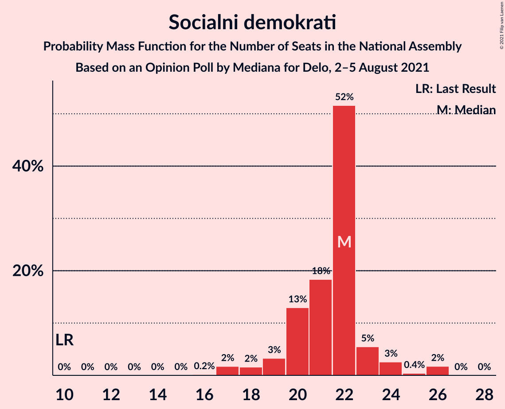
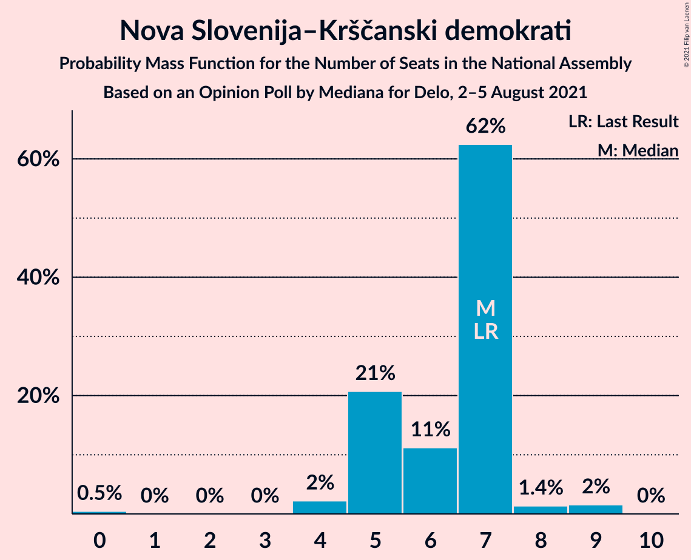
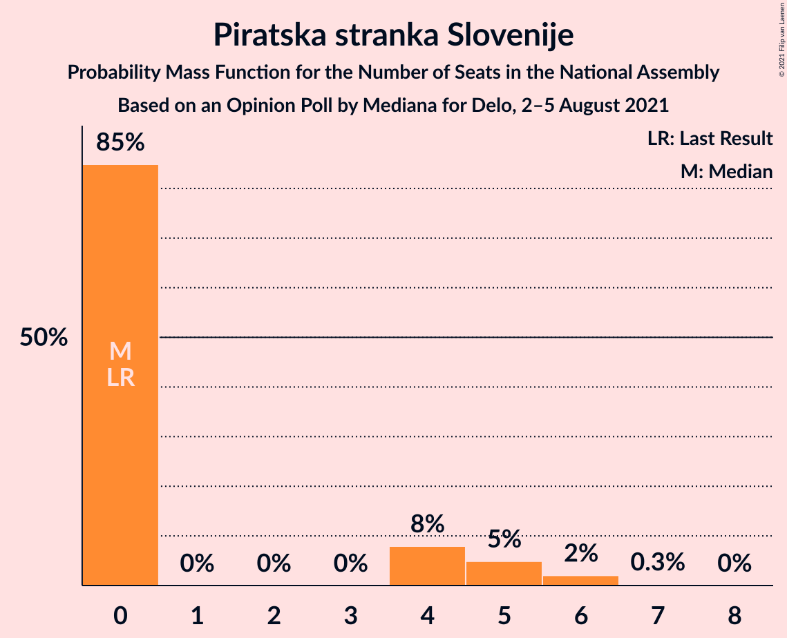
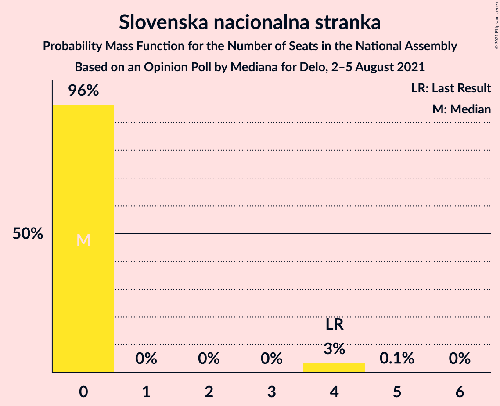
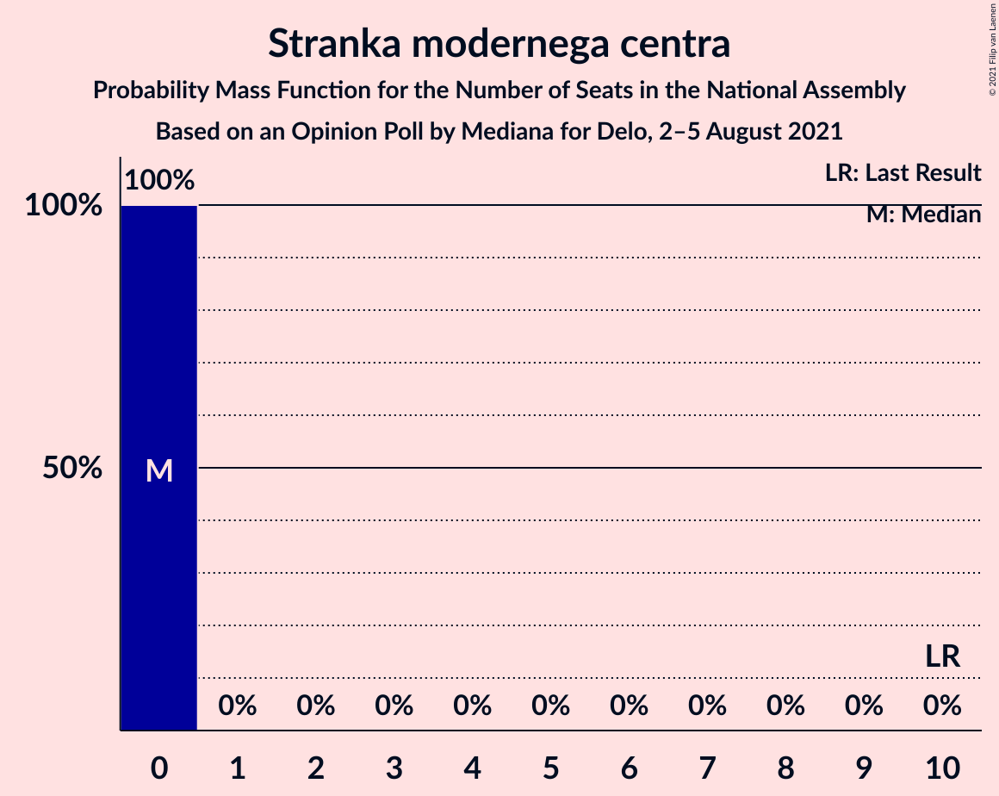
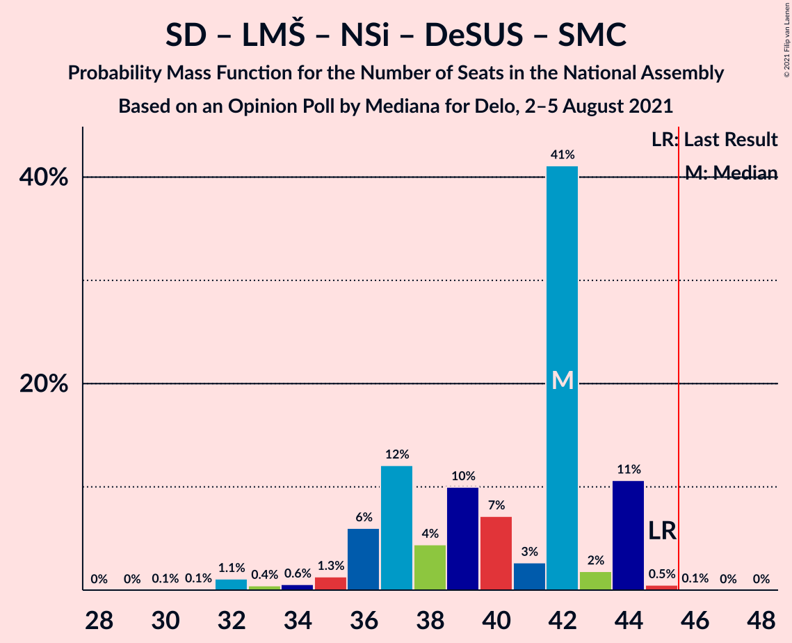
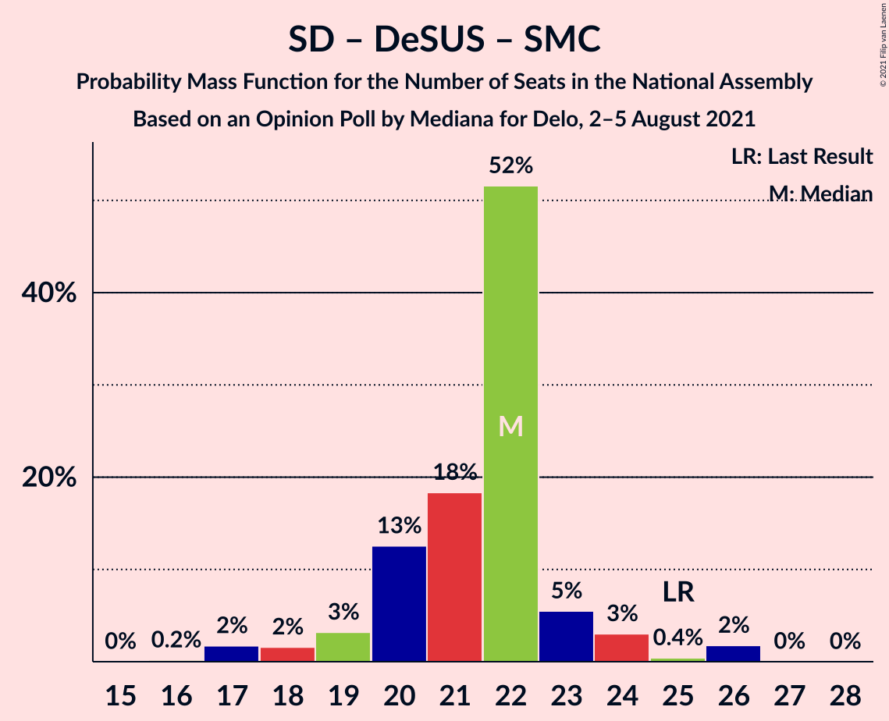

# Opinion Poll by Mediana for Delo, 2–5 August 2021

<a href="#voting-intentions">Voting Intentions</a> | <a href="#seats">Seats</a> | <a href="#coalitions">Coalitions</a> | <a href="#technical-information">Technical Information</a>

## Voting Intentions

### Confidence Intervals

| Party | Last Result | Poll Result | 80% Confidence Interval | 90% Confidence Interval | 95% Confidence Interval | 99% Confidence Interval |
|:-----:|:-----------:|:-----------:|:-----------------------:|:-----------------------:|:-----------------------:|:-----------------------:|
| Slovenska demokratska stranka | 24.9% | 25.9% | 23.9–28.1% |23.4–28.7% |22.9–29.3% |21.9–30.3% |
| Socialni demokrati | 9.9% | 19.4% | 17.6–21.4% |17.1–21.9% |16.7–22.5% |15.8–23.4% |
| Levica | 9.3% | 12.7% | 11.2–14.4% |10.8–14.9% |10.5–15.3% |9.8–16.2% |
| Lista Marjana Šarca | 12.6% | 11.2% | 9.8–12.8% |9.4–13.3% |9.1–13.7% |8.4–14.5% |
| Nova Slovenija–Krščanski demokrati | 7.2% | 5.6% | 4.6–6.8% |4.3–7.2% |4.1–7.5% |3.7–8.2% |
| Piratska stranka Slovenije | 2.2% | 3.9% | 3.1–5.0% |2.9–5.3% |2.7–5.6% |2.4–6.2% |
| Andrej Čuš in Zeleni Slovenije | 1.1% | 3.5% | 2.7–4.5% |2.5–4.8% |2.4–5.1% |2.1–5.7% |
| Stranka Alenke Bratušek | 5.1% | 3.2% | 2.5–4.2% |2.3–4.5% |2.1–4.8% |1.8–5.3% |
| Slovenska ljudska stranka | 2.6% | 3.1% | 2.4–4.1% |2.2–4.4% |2.0–4.6% |1.8–5.1% |
| Slovenska nacionalna stranka | 4.2% | 2.6% | 2.0–3.6% |1.8–3.9% |1.7–4.1% |1.4–4.6% |
| Demokratična stranka upokojencev Slovenije | 4.9% | 2.4% | 1.8–3.3% |1.6–3.5% |1.5–3.8% |1.2–4.3% |
| Dobra država | 1.5% | 1.3% | 0.9–2.0% |0.7–2.2% |0.7–2.4% |0.5–2.8% |
| Stranka modernega centra | 9.7% | 1.1% | 0.7–1.8% |0.7–2.0% |0.6–2.2% |0.4–2.6% |

*Note:* The poll result column reflects the actual value used in the calculations. Published results may vary slightly, and in addition be rounded to fewer digits.

## Seats

### Confidence Intervals

| Party | Last Result | Median | 80% Confidence Interval | 90% Confidence Interval | 95% Confidence Interval | 99% Confidence Interval |
|:-----:|:-----------:|:------:|:-----------------------:|:-----------------------:|:-----------------------:|:-----------------------:|
| <a href="#slovenska-demokratska-stranka">Slovenska demokratska stranka</a> | 25 | 30 | 26–33 |25–33 |24–33 |23–33 |
| <a href="#socialni-demokrati">Socialni demokrati</a> | 10 | 22 | 20–23 |19–23 |18–24 |17–26 |
| <a href="#levica">Levica</a> | 9 | 13 | 12–15 |12–16 |12–17 |11–18 |
| <a href="#lista-marjana-šarca">Lista Marjana Šarca</a> | 13 | 13 | 10–15 |10–16 |9–16 |9–16 |
| <a href="#nova-slovenija–krščanski-demokrati">Nova Slovenija–Krščanski demokrati</a> | 7 | 7 | 5–7 |5–7 |4–8 |4–9 |
| <a href="#piratska-stranka-slovenije">Piratska stranka Slovenije</a> | 0 | 0 | 0–4 |0–5 |0–5 |0–6 |
| <a href="#andrej-čuš-in-zeleni-slovenije">Andrej Čuš in Zeleni Slovenije</a> | 0 | 0 | 0–4 |0–5 |0–5 |0–6 |
| <a href="#stranka-alenke-bratušek">Stranka Alenke Bratušek</a> | 5 | 0 | 0 |0–4 |0–5 |0–5 |
| <a href="#slovenska-ljudska-stranka">Slovenska ljudska stranka</a> | 0 | 0 | 0 |0 |0–4 |0–5 |
| <a href="#slovenska-nacionalna-stranka">Slovenska nacionalna stranka</a> | 4 | 0 | 0 |0 |0–4 |0–4 |
| <a href="#demokratična-stranka-upokojencev-slovenije">Demokratična stranka upokojencev Slovenije</a> | 5 | 0 | 0 |0 |0 |0–4 |
| <a href="#dobra-država">Dobra država</a> | 0 | 0 | 0 |0 |0 |0 |
| <a href="#stranka-modernega-centra">Stranka modernega centra</a> | 10 | 0 | 0 |0 |0 |0 |

### Slovenska demokratska stranka

*For a full overview of the results for this party, see the [Slovenska demokratska stranka](party-slovenskademokratskastranka.html) page.*

| Number of Seats | Probability | Accumulated | Special Marks |
|:---------------:|:-----------:|:-----------:|:-------------:|
| 22 | 0.3% | 100% |  |
| 23 | 1.1% | 99.6% |  |
| 24 | 3% | 98.5% |  |
| 25 | 5% | 96% | Last Result |
| 26 | 7% | 90% |  |
| 27 | 2% | 83% |  |
| 28 | 6% | 81% |  |
| 29 | 15% | 75% |  |
| 30 | 15% | 60% | Median |
| 31 | 3% | 46% |  |
| 32 | 3% | 43% |  |
| 33 | 40% | 40% |  |
| 34 | 0.2% | 0.2% |  |
| 35 | 0% | 0% |  |

### Socialni demokrati

*For a full overview of the results for this party, see the [Socialni demokrati](party-socialnidemokrati.html) page.*

| Number of Seats | Probability | Accumulated | Special Marks |
|:---------------:|:-----------:|:-----------:|:-------------:|
| 10 | 0% | 100% | Last Result |
| 11 | 0% | 100% |  |
| 12 | 0% | 100% |  |
| 13 | 0% | 100% |  |
| 14 | 0% | 100% |  |
| 15 | 0% | 100% |  |
| 16 | 0.2% | 100% |  |
| 17 | 2% | 99.8% |  |
| 18 | 2% | 98% |  |
| 19 | 3% | 96% |  |
| 20 | 13% | 93% |  |
| 21 | 18% | 80% |  |
| 22 | 52% | 62% | Median |
| 23 | 5% | 10% |  |
| 24 | 3% | 5% |  |
| 25 | 0.4% | 2% |  |
| 26 | 2% | 2% |  |
| 27 | 0% | 0% |  |

### Levica

*For a full overview of the results for this party, see the [Levica](party-levica.html) page.*

| Number of Seats | Probability | Accumulated | Special Marks |
|:---------------:|:-----------:|:-----------:|:-------------:|
| 9 | 0.1% | 100% | Last Result |
| 10 | 0.3% | 99.9% |  |
| 11 | 1.2% | 99.6% |  |
| 12 | 13% | 98% |  |
| 13 | 53% | 85% | Median |
| 14 | 12% | 32% |  |
| 15 | 13% | 20% |  |
| 16 | 3% | 7% |  |
| 17 | 1.0% | 3% |  |
| 18 | 2% | 2% |  |
| 19 | 0% | 0% |  |

### Lista Marjana Šarca

*For a full overview of the results for this party, see the [Lista Marjana Šarca](party-listamarjanašarca.html) page.*

| Number of Seats | Probability | Accumulated | Special Marks |
|:---------------:|:-----------:|:-----------:|:-------------:|
| 8 | 0.1% | 100% |  |
| 9 | 3% | 99.9% |  |
| 10 | 16% | 97% |  |
| 11 | 12% | 81% |  |
| 12 | 10% | 70% |  |
| 13 | 47% | 60% | Last Result, Median |
| 14 | 3% | 14% |  |
| 15 | 2% | 10% |  |
| 16 | 9% | 9% |  |
| 17 | 0% | 0% |  |

### Nova Slovenija–Krščanski demokrati

*For a full overview of the results for this party, see the [Nova Slovenija–Krščanski demokrati](party-novaslovenija–krščanskidemokrati.html) page.*

| Number of Seats | Probability | Accumulated | Special Marks |
|:---------------:|:-----------:|:-----------:|:-------------:|
| 0 | 0.5% | 100% |  |
| 1 | 0% | 99.5% |  |
| 2 | 0% | 99.5% |  |
| 3 | 0% | 99.5% |  |
| 4 | 2% | 99.5% |  |
| 5 | 21% | 97% |  |
| 6 | 11% | 77% |  |
| 7 | 62% | 65% | Last Result, Median |
| 8 | 1.4% | 3% |  |
| 9 | 2% | 2% |  |
| 10 | 0% | 0% |  |

### Piratska stranka Slovenije

*For a full overview of the results for this party, see the [Piratska stranka Slovenije](party-piratskastrankaslovenije.html) page.*

| Number of Seats | Probability | Accumulated | Special Marks |
|:---------------:|:-----------:|:-----------:|:-------------:|
| 0 | 85% | 100% | Last Result, Median |
| 1 | 0% | 15% |  |
| 2 | 0% | 15% |  |
| 3 | 0% | 15% |  |
| 4 | 8% | 15% |  |
| 5 | 5% | 7% |  |
| 6 | 2% | 2% |  |
| 7 | 0.3% | 0.3% |  |
| 8 | 0% | 0% |  |

### Andrej Čuš in Zeleni Slovenije

*For a full overview of the results for this party, see the [Andrej Čuš in Zeleni Slovenije](party-andrejčušinzelenislovenije.html) page.*

| Number of Seats | Probability | Accumulated | Special Marks |
|:---------------:|:-----------:|:-----------:|:-------------:|
| 0 | 78% | 100% | Last Result, Median |
| 1 | 0% | 22% |  |
| 2 | 0% | 22% |  |
| 3 | 0% | 22% |  |
| 4 | 16% | 22% |  |
| 5 | 5% | 6% |  |
| 6 | 0.5% | 0.6% |  |
| 7 | 0% | 0% |  |

### Stranka Alenke Bratušek

*For a full overview of the results for this party, see the [Stranka Alenke Bratušek](party-strankaalenkebratušek.html) page.*

| Number of Seats | Probability | Accumulated | Special Marks |
|:---------------:|:-----------:|:-----------:|:-------------:|
| 0 | 90% | 100% | Median |
| 1 | 0% | 10% |  |
| 2 | 0% | 10% |  |
| 3 | 0% | 10% |  |
| 4 | 6% | 10% |  |
| 5 | 4% | 4% | Last Result |
| 6 | 0.1% | 0.1% |  |
| 7 | 0% | 0% |  |

### Slovenska ljudska stranka

*For a full overview of the results for this party, see the [Slovenska ljudska stranka](party-slovenskaljudskastranka.html) page.*

| Number of Seats | Probability | Accumulated | Special Marks |
|:---------------:|:-----------:|:-----------:|:-------------:|
| 0 | 97% | 100% | Last Result, Median |
| 1 | 0% | 3% |  |
| 2 | 0% | 3% |  |
| 3 | 0% | 3% |  |
| 4 | 2% | 3% |  |
| 5 | 0.7% | 0.7% |  |
| 6 | 0% | 0% |  |

### Slovenska nacionalna stranka

*For a full overview of the results for this party, see the [Slovenska nacionalna stranka](party-slovenskanacionalnastranka.html) page.*

| Number of Seats | Probability | Accumulated | Special Marks |
|:---------------:|:-----------:|:-----------:|:-------------:|
| 0 | 96% | 100% | Median |
| 1 | 0% | 4% |  |
| 2 | 0% | 4% |  |
| 3 | 0% | 4% |  |
| 4 | 3% | 4% | Last Result |
| 5 | 0.1% | 0.1% |  |
| 6 | 0% | 0% |  |

### Demokratična stranka upokojencev Slovenije

*For a full overview of the results for this party, see the [Demokratična stranka upokojencev Slovenije](party-demokratičnastrankaupokojencevslovenije.html) page.*

| Number of Seats | Probability | Accumulated | Special Marks |
|:---------------:|:-----------:|:-----------:|:-------------:|
| 0 | 99.4% | 100% | Median |
| 1 | 0% | 0.6% |  |
| 2 | 0% | 0.6% |  |
| 3 | 0% | 0.6% |  |
| 4 | 0.4% | 0.6% |  |
| 5 | 0.1% | 0.1% | Last Result |
| 6 | 0% | 0% |  |

### Dobra država

*For a full overview of the results for this party, see the [Dobra država](party-dobradržava.html) page.*

| Number of Seats | Probability | Accumulated | Special Marks |
|:---------------:|:-----------:|:-----------:|:-------------:|
| 0 | 100% | 100% | Last Result, Median |

### Stranka modernega centra

*For a full overview of the results for this party, see the [Stranka modernega centra](party-strankamodernegacentra.html) page.*

| Number of Seats | Probability | Accumulated | Special Marks |
|:---------------:|:-----------:|:-----------:|:-------------:|
| 0 | 100% | 100% | Median |
| 1 | 0% | 0% |  |
| 2 | 0% | 0% |  |
| 3 | 0% | 0% |  |
| 4 | 0% | 0% |  |
| 5 | 0% | 0% |  |
| 6 | 0% | 0% |  |
| 7 | 0% | 0% |  |
| 8 | 0% | 0% |  |
| 9 | 0% | 0% |  |
| 10 | 0% | 0% | Last Result |

## Coalitions

### Confidence Intervals

| Coalition | Last Result | Median | Majority? | 80% Confidence Interval | 90% Confidence Interval | 95% Confidence Interval | 99% Confidence Interval |
|:---------:|:-----------:|:------:|:---------:|:-----------------------:|:-----------------------:|:-----------------------:|:-----------------------:|
| Slovenska demokratska stranka – Lista Marjana Šarca – Demokratična stranka upokojencev Slovenije | 43 | 44 | 40% | 37–46 | 36–46 | 35–46 | 33–46 |
| Slovenska demokratska stranka – Lista Marjana Šarca | 38 | 44 | 40% | 37–46 | 36–46 | 35–46 | 33–46 |
| Socialni demokrati – Lista Marjana Šarca – Nova Slovenija–Krščanski demokrati – Demokratična stranka upokojencev Slovenije | 35 | 42 | 0.1% | 37–44 | 36–44 | 35–44 | 32–45 |
| Socialni demokrati – Lista Marjana Šarca – Nova Slovenija–Krščanski demokrati – Stranka Alenke Bratušek – Demokratična stranka upokojencev Slovenije – Stranka modernega centra | 50 | 42 | 0.8% | 37–44 | 36–44 | 35–44 | 32–46 |
| Socialni demokrati – Lista Marjana Šarca – Nova Slovenija–Krščanski demokrati – Demokratična stranka upokojencev Slovenije – Stranka modernega centra | 45 | 42 | 0.1% | 37–44 | 36–44 | 35–44 | 32–45 |
| Socialni demokrati – Lista Marjana Šarca – Nova Slovenija–Krščanski demokrati | 30 | 42 | 0.1% | 36–44 | 36–44 | 35–44 | 32–45 |
| Socialni demokrati – Lista Marjana Šarca – Nova Slovenija–Krščanski demokrati – Stranka modernega centra | 40 | 42 | 0.1% | 36–44 | 36–44 | 35–44 | 32–45 |
| Socialni demokrati – Lista Marjana Šarca – Stranka Alenke Bratušek – Demokratična stranka upokojencev Slovenije – Stranka modernega centra | 43 | 35 | 0% | 32–37 | 31–37 | 30–38 | 27–39 |
| Socialni demokrati – Lista Marjana Šarca – Demokratična stranka upokojencev Slovenije | 28 | 35 | 0% | 31–37 | 31–37 | 29–37 | 27–38 |
| Socialni demokrati – Lista Marjana Šarca – Demokratična stranka upokojencev Slovenije – Stranka modernega centra | 38 | 35 | 0% | 31–37 | 31–37 | 29–37 | 27–38 |
| Socialni demokrati – Lista Marjana Šarca | 23 | 35 | 0% | 31–37 | 31–37 | 29–37 | 27–38 |
| Socialni demokrati – Lista Marjana Šarca – Stranka modernega centra | 33 | 35 | 0% | 31–37 | 31–37 | 29–37 | 27–38 |
| Socialni demokrati – Demokratična stranka upokojencev Slovenije – Stranka modernega centra | 25 | 22 | 0% | 20–23 | 19–24 | 18–24 | 17–26 |

### Slovenska demokratska stranka – Lista Marjana Šarca – Demokratična stranka upokojencev Slovenije

| Number of Seats | Probability | Accumulated | Special Marks |
|:---------------:|:-----------:|:-----------:|:-------------:|
| 32 | 0.3% | 100% |  |
| 33 | 0.5% | 99.7% |  |
| 34 | 0.2% | 99.2% |  |
| 35 | 3% | 98.9% |  |
| 36 | 3% | 96% |  |
| 37 | 4% | 93% |  |
| 38 | 6% | 89% |  |
| 39 | 6% | 82% |  |
| 40 | 12% | 76% |  |
| 41 | 4% | 64% |  |
| 42 | 2% | 60% |  |
| 43 | 7% | 58% | Last Result, Median |
| 44 | 1.1% | 51% |  |
| 45 | 9% | 49% |  |
| 46 | 40% | 40% | Majority |
| 47 | 0.1% | 0.3% |  |
| 48 | 0.2% | 0.2% |  |
| 49 | 0% | 0% |  |

### Slovenska demokratska stranka – Lista Marjana Šarca

| Number of Seats | Probability | Accumulated | Special Marks |
|:---------------:|:-----------:|:-----------:|:-------------:|
| 32 | 0.3% | 100% |  |
| 33 | 0.6% | 99.7% |  |
| 34 | 0.3% | 99.0% |  |
| 35 | 3% | 98.8% |  |
| 36 | 3% | 96% |  |
| 37 | 4% | 92% |  |
| 38 | 6% | 89% | Last Result |
| 39 | 6% | 82% |  |
| 40 | 12% | 76% |  |
| 41 | 4% | 64% |  |
| 42 | 2% | 60% |  |
| 43 | 7% | 58% | Median |
| 44 | 1.1% | 50% |  |
| 45 | 9% | 49% |  |
| 46 | 40% | 40% | Majority |
| 47 | 0% | 0.2% |  |
| 48 | 0.2% | 0.2% |  |
| 49 | 0% | 0% |  |

### Socialni demokrati – Lista Marjana Šarca – Nova Slovenija–Krščanski demokrati – Demokratična stranka upokojencev Slovenije

| Number of Seats | Probability | Accumulated | Special Marks |
|:---------------:|:-----------:|:-----------:|:-------------:|
| 30 | 0.1% | 100% |  |
| 31 | 0.1% | 99.9% |  |
| 32 | 1.1% | 99.8% |  |
| 33 | 0.4% | 98.7% |  |
| 34 | 0.6% | 98% |  |
| 35 | 1.3% | 98% | Last Result |
| 36 | 6% | 96% |  |
| 37 | 12% | 90% |  |
| 38 | 4% | 78% |  |
| 39 | 10% | 74% |  |
| 40 | 7% | 64% |  |
| 41 | 3% | 57% |  |
| 42 | 41% | 54% | Median |
| 43 | 2% | 13% |  |
| 44 | 11% | 11% |  |
| 45 | 0.5% | 0.6% |  |
| 46 | 0.1% | 0.1% | Majority |
| 47 | 0% | 0% |  |

### Socialni demokrati – Lista Marjana Šarca – Nova Slovenija–Krščanski demokrati – Stranka Alenke Bratušek – Demokratična stranka upokojencev Slovenije – Stranka modernega centra

| Number of Seats | Probability | Accumulated | Special Marks |
|:---------------:|:-----------:|:-----------:|:-------------:|
| 31 | 0.1% | 100% |  |
| 32 | 1.0% | 99.9% |  |
| 33 | 0.2% | 98.9% |  |
| 34 | 0.4% | 98.7% |  |
| 35 | 0.9% | 98% |  |
| 36 | 4% | 97% |  |
| 37 | 11% | 94% |  |
| 38 | 3% | 83% |  |
| 39 | 8% | 79% |  |
| 40 | 7% | 72% |  |
| 41 | 5% | 64% |  |
| 42 | 42% | 59% | Median |
| 43 | 5% | 17% |  |
| 44 | 11% | 12% |  |
| 45 | 0.7% | 2% |  |
| 46 | 0.4% | 0.8% | Majority |
| 47 | 0% | 0.4% |  |
| 48 | 0.4% | 0.4% |  |
| 49 | 0% | 0% |  |
| 50 | 0% | 0% | Last Result |

### Socialni demokrati – Lista Marjana Šarca – Nova Slovenija–Krščanski demokrati – Demokratična stranka upokojencev Slovenije – Stranka modernega centra

| Number of Seats | Probability | Accumulated | Special Marks |
|:---------------:|:-----------:|:-----------:|:-------------:|
| 30 | 0.1% | 100% |  |
| 31 | 0.1% | 99.9% |  |
| 32 | 1.1% | 99.8% |  |
| 33 | 0.4% | 98.7% |  |
| 34 | 0.6% | 98% |  |
| 35 | 1.3% | 98% |  |
| 36 | 6% | 96% |  |
| 37 | 12% | 90% |  |
| 38 | 4% | 78% |  |
| 39 | 10% | 74% |  |
| 40 | 7% | 64% |  |
| 41 | 3% | 57% |  |
| 42 | 41% | 54% | Median |
| 43 | 2% | 13% |  |
| 44 | 11% | 11% |  |
| 45 | 0.5% | 0.6% | Last Result |
| 46 | 0.1% | 0.1% | Majority |
| 47 | 0% | 0% |  |

### Socialni demokrati – Lista Marjana Šarca – Nova Slovenija–Krščanski demokrati

| Number of Seats | Probability | Accumulated | Special Marks |
|:---------------:|:-----------:|:-----------:|:-------------:|
| 30 | 0.1% | 100% | Last Result |
| 31 | 0.1% | 99.9% |  |
| 32 | 1.1% | 99.8% |  |
| 33 | 0.4% | 98.7% |  |
| 34 | 0.6% | 98% |  |
| 35 | 1.5% | 98% |  |
| 36 | 6% | 96% |  |
| 37 | 12% | 90% |  |
| 38 | 4% | 78% |  |
| 39 | 10% | 73% |  |
| 40 | 7% | 64% |  |
| 41 | 3% | 57% |  |
| 42 | 41% | 54% | Median |
| 43 | 2% | 13% |  |
| 44 | 11% | 11% |  |
| 45 | 0.5% | 0.6% |  |
| 46 | 0.1% | 0.1% | Majority |
| 47 | 0% | 0% |  |

### Socialni demokrati – Lista Marjana Šarca – Nova Slovenija–Krščanski demokrati – Stranka modernega centra

| Number of Seats | Probability | Accumulated | Special Marks |
|:---------------:|:-----------:|:-----------:|:-------------:|
| 30 | 0.1% | 100% |  |
| 31 | 0.1% | 99.9% |  |
| 32 | 1.1% | 99.8% |  |
| 33 | 0.4% | 98.7% |  |
| 34 | 0.6% | 98% |  |
| 35 | 1.5% | 98% |  |
| 36 | 6% | 96% |  |
| 37 | 12% | 90% |  |
| 38 | 4% | 78% |  |
| 39 | 10% | 73% |  |
| 40 | 7% | 64% | Last Result |
| 41 | 3% | 57% |  |
| 42 | 41% | 54% | Median |
| 43 | 2% | 13% |  |
| 44 | 11% | 11% |  |
| 45 | 0.5% | 0.6% |  |
| 46 | 0.1% | 0.1% | Majority |
| 47 | 0% | 0% |  |

### Socialni demokrati – Lista Marjana Šarca – Stranka Alenke Bratušek – Demokratična stranka upokojencev Slovenije – Stranka modernega centra

| Number of Seats | Probability | Accumulated | Special Marks |
|:---------------:|:-----------:|:-----------:|:-------------:|
| 26 | 0.3% | 100% |  |
| 27 | 0.7% | 99.7% |  |
| 28 | 0.4% | 99.0% |  |
| 29 | 0.5% | 98.5% |  |
| 30 | 1.3% | 98% |  |
| 31 | 5% | 97% |  |
| 32 | 17% | 92% |  |
| 33 | 6% | 75% |  |
| 34 | 4% | 69% |  |
| 35 | 43% | 65% | Median |
| 36 | 8% | 22% |  |
| 37 | 10% | 14% |  |
| 38 | 3% | 4% |  |
| 39 | 0.7% | 0.9% |  |
| 40 | 0.2% | 0.3% |  |
| 41 | 0% | 0% |  |
| 42 | 0% | 0% |  |
| 43 | 0% | 0% | Last Result |

### Socialni demokrati – Lista Marjana Šarca – Demokratična stranka upokojencev Slovenije

| Number of Seats | Probability | Accumulated | Special Marks |
|:---------------:|:-----------:|:-----------:|:-------------:|
| 25 | 0.1% | 100% |  |
| 26 | 0.3% | 99.9% |  |
| 27 | 0.8% | 99.6% |  |
| 28 | 0.8% | 98.8% | Last Result |
| 29 | 0.7% | 98% |  |
| 30 | 2% | 97% |  |
| 31 | 7% | 96% |  |
| 32 | 20% | 88% |  |
| 33 | 7% | 68% |  |
| 34 | 4% | 61% |  |
| 35 | 43% | 57% | Median |
| 36 | 2% | 14% |  |
| 37 | 9% | 11% |  |
| 38 | 2% | 2% |  |
| 39 | 0.1% | 0.2% |  |
| 40 | 0% | 0% |  |

### Socialni demokrati – Lista Marjana Šarca – Demokratična stranka upokojencev Slovenije – Stranka modernega centra

| Number of Seats | Probability | Accumulated | Special Marks |
|:---------------:|:-----------:|:-----------:|:-------------:|
| 25 | 0.1% | 100% |  |
| 26 | 0.3% | 99.9% |  |
| 27 | 0.8% | 99.6% |  |
| 28 | 0.8% | 98.8% |  |
| 29 | 0.7% | 98% |  |
| 30 | 2% | 97% |  |
| 31 | 7% | 96% |  |
| 32 | 20% | 88% |  |
| 33 | 7% | 68% |  |
| 34 | 4% | 61% |  |
| 35 | 43% | 57% | Median |
| 36 | 2% | 14% |  |
| 37 | 9% | 11% |  |
| 38 | 2% | 2% | Last Result |
| 39 | 0.1% | 0.2% |  |
| 40 | 0% | 0% |  |

### Socialni demokrati – Lista Marjana Šarca

| Number of Seats | Probability | Accumulated | Special Marks |
|:---------------:|:-----------:|:-----------:|:-------------:|
| 23 | 0% | 100% | Last Result |
| 24 | 0% | 100% |  |
| 25 | 0.1% | 100% |  |
| 26 | 0.3% | 99.9% |  |
| 27 | 0.8% | 99.6% |  |
| 28 | 0.8% | 98.8% |  |
| 29 | 0.8% | 98% |  |
| 30 | 2% | 97% |  |
| 31 | 7% | 95% |  |
| 32 | 20% | 88% |  |
| 33 | 7% | 68% |  |
| 34 | 4% | 61% |  |
| 35 | 43% | 57% | Median |
| 36 | 2% | 14% |  |
| 37 | 9% | 11% |  |
| 38 | 2% | 2% |  |
| 39 | 0.1% | 0.1% |  |
| 40 | 0% | 0% |  |

### Socialni demokrati – Lista Marjana Šarca – Stranka modernega centra

| Number of Seats | Probability | Accumulated | Special Marks |
|:---------------:|:-----------:|:-----------:|:-------------:|
| 25 | 0.1% | 100% |  |
| 26 | 0.3% | 99.9% |  |
| 27 | 0.8% | 99.6% |  |
| 28 | 0.8% | 98.8% |  |
| 29 | 0.8% | 98% |  |
| 30 | 2% | 97% |  |
| 31 | 7% | 95% |  |
| 32 | 20% | 88% |  |
| 33 | 7% | 68% | Last Result |
| 34 | 4% | 61% |  |
| 35 | 43% | 57% | Median |
| 36 | 2% | 14% |  |
| 37 | 9% | 11% |  |
| 38 | 2% | 2% |  |
| 39 | 0.1% | 0.1% |  |
| 40 | 0% | 0% |  |

### Socialni demokrati – Demokratična stranka upokojencev Slovenije – Stranka modernega centra

| Number of Seats | Probability | Accumulated | Special Marks |
|:---------------:|:-----------:|:-----------:|:-------------:|
| 16 | 0.2% | 100% |  |
| 17 | 2% | 99.8% |  |
| 18 | 2% | 98% |  |
| 19 | 3% | 96% |  |
| 20 | 13% | 93% |  |
| 21 | 18% | 81% |  |
| 22 | 52% | 62% | Median |
| 23 | 5% | 11% |  |
| 24 | 3% | 5% |  |
| 25 | 0.4% | 2% | Last Result |
| 26 | 2% | 2% |  |
| 27 | 0% | 0.1% |  |
| 28 | 0% | 0% |  |

## Technical Information

### Opinion Poll

+ **Polling firm:** Mediana
+ **Commissioner(s):** Delo
+ **Fieldwork period:** 2–5 August 2021

### Calculations

+ **Sample size:** 717
+ **Simulations done:** 1,048,576
+ **Error estimate:** 1.72%

