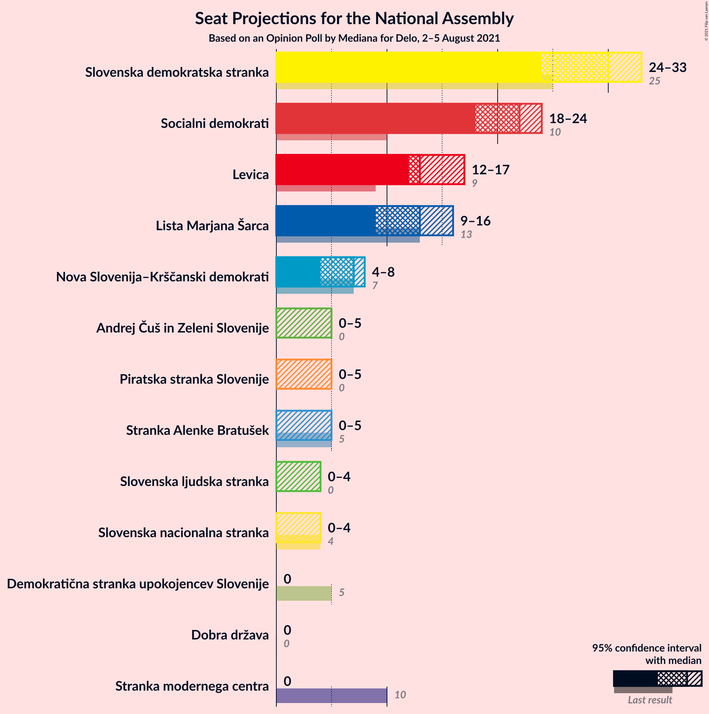
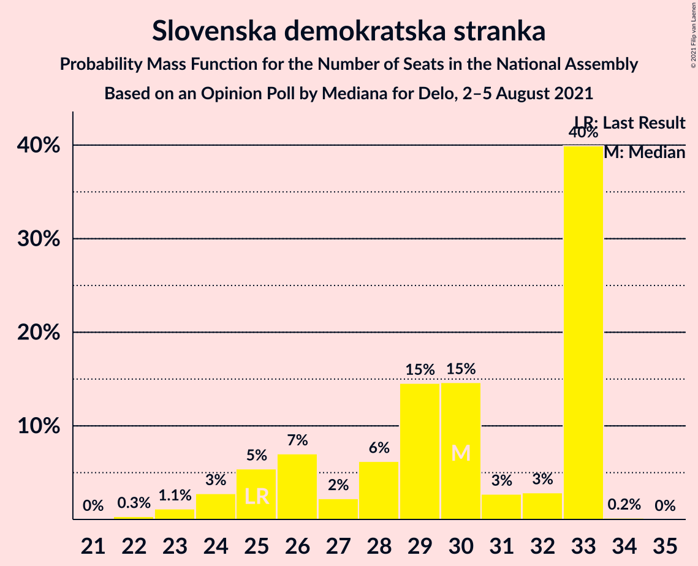
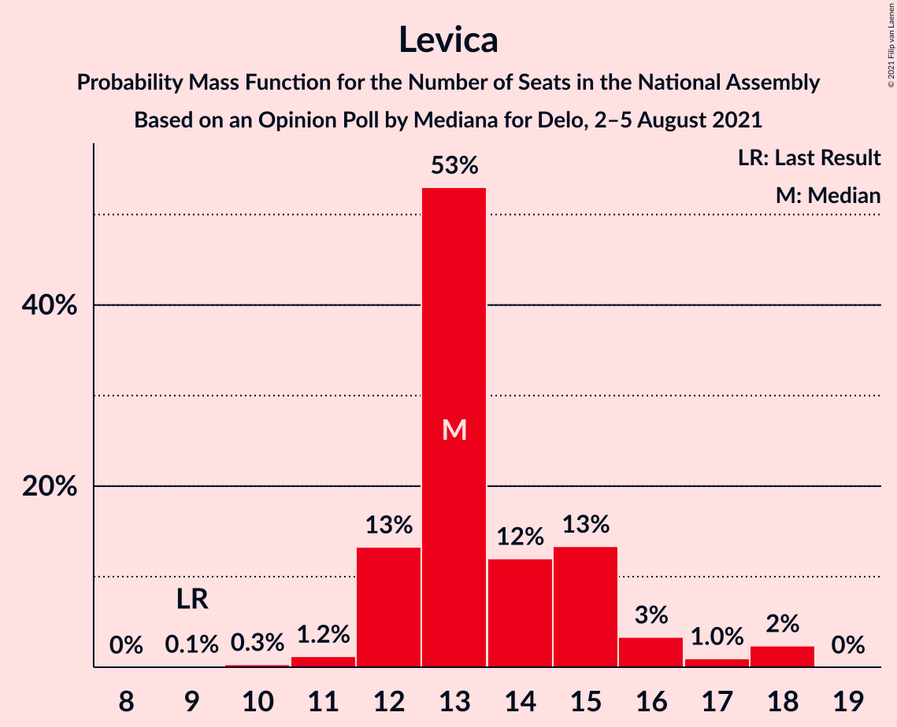
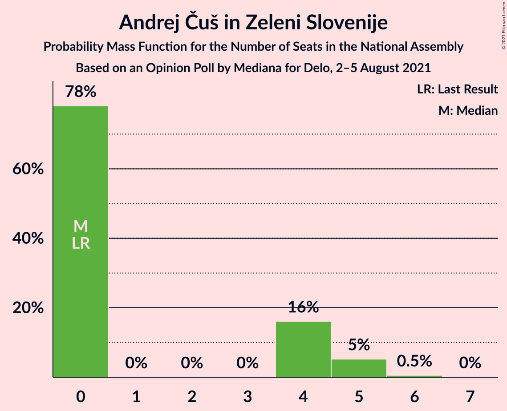
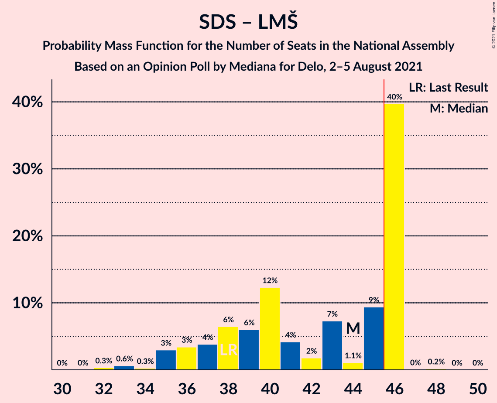
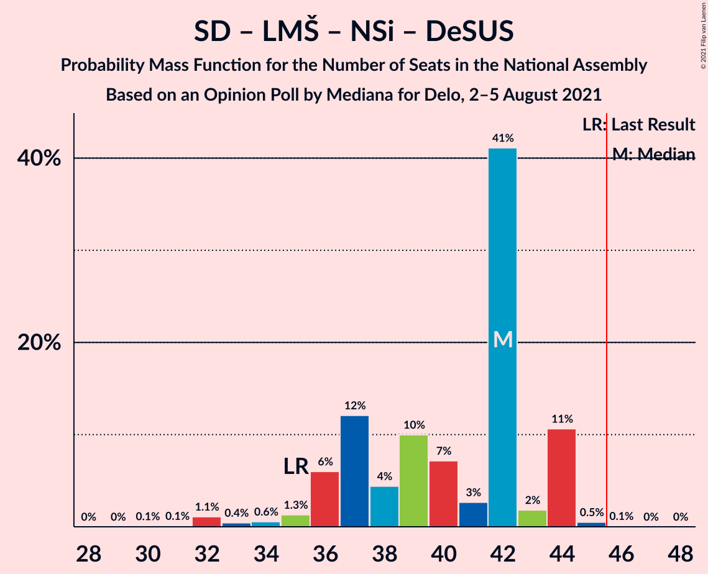

# Opinion Poll by Mediana for Delo, 2–5 August 2021

<a href="#voting-intentions">Voting Intentions</a> | <a href="#seats">Seats</a> | <a href="#coalitions">Coalitions</a> | <a href="#technical-information">Technical Information</a>

## Voting Intentions

### Confidence Intervals

| Party | Last Result | Poll Result | 80% Confidence Interval | 90% Confidence Interval | 95% Confidence Interval | 99% Confidence Interval |
|:-----:|:-----------:|:-----------:|:-----------------------:|:-----------------------:|:-----------------------:|:-----------------------:|
| Slovenska demokratska stranka | 24.9% | 25.9% | 23.9–28.1% |23.4–28.7% |22.9–29.3% |21.9–30.3% |
| Socialni demokrati | 9.9% | 19.4% | 17.6–21.4% |17.1–21.9% |16.7–22.5% |15.8–23.4% |
| Levica | 9.3% | 12.7% | 11.2–14.4% |10.8–14.9% |10.5–15.3% |9.8–16.2% |
| Lista Marjana Šarca | 12.6% | 11.2% | 9.8–12.8% |9.4–13.3% |9.1–13.7% |8.4–14.5% |
| Nova Slovenija–Krščanski demokrati | 7.2% | 5.6% | 4.6–6.8% |4.3–7.2% |4.1–7.5% |3.7–8.2% |
| Piratska stranka Slovenije | 2.2% | 3.9% | 3.1–5.0% |2.9–5.3% |2.7–5.6% |2.4–6.2% |
| Andrej Čuš in Zeleni Slovenije | 1.1% | 3.5% | 2.7–4.5% |2.5–4.8% |2.4–5.1% |2.1–5.7% |
| Stranka Alenke Bratušek | 5.1% | 3.2% | 2.5–4.2% |2.3–4.5% |2.1–4.8% |1.8–5.3% |
| Slovenska ljudska stranka | 2.6% | 3.1% | 2.4–4.1% |2.2–4.4% |2.0–4.6% |1.8–5.1% |
| Slovenska nacionalna stranka | 4.2% | 2.6% | 2.0–3.6% |1.8–3.9% |1.7–4.1% |1.4–4.6% |
| Demokratična stranka upokojencev Slovenije | 4.9% | 2.4% | 1.8–3.3% |1.6–3.5% |1.5–3.8% |1.2–4.3% |
| Dobra država | 1.5% | 1.3% | 0.9–2.0% |0.7–2.2% |0.7–2.4% |0.5–2.8% |
| Stranka modernega centra | 9.7% | 1.1% | 0.7–1.8% |0.7–2.0% |0.6–2.2% |0.4–2.6% |

*Note:* The poll result column reflects the actual value used in the calculations. Published results may vary slightly, and in addition be rounded to fewer digits.

## Seats

### Confidence Intervals

| Party | Last Result | Median | 80% Confidence Interval | 90% Confidence Interval | 95% Confidence Interval | 99% Confidence Interval |
|:-----:|:-----------:|:------:|:-----------------------:|:-----------------------:|:-----------------------:|:-----------------------:|
| <a href="#slovenska-demokratska-stranka">Slovenska demokratska stranka</a> | 25 | 29 | 29 |27–29 |26–29 |24–32 |
| <a href="#socialni-demokrati">Socialni demokrati</a> | 10 | 21 | 21 |20–23 |19–23 |16–24 |
| <a href="#levica">Levica</a> | 9 | 15 | 13–15 |12–15 |12–15 |9–17 |
| <a href="#lista-marjana-šarca">Lista Marjana Šarca</a> | 13 | 16 | 12–16 |10–16 |9–16 |9–16 |
| <a href="#nova-slovenija–krščanski-demokrati">Nova Slovenija–Krščanski demokrati</a> | 7 | 7 | 5–7 |5–7 |5–7 |4–8 |
| <a href="#piratska-stranka-slovenije">Piratska stranka Slovenije</a> | 0 | 0 | 0 |0–4 |0–5 |0–6 |
| <a href="#andrej-čuš-in-zeleni-slovenije">Andrej Čuš in Zeleni Slovenije</a> | 0 | 0 | 0–5 |0–5 |0–5 |0–5 |
| <a href="#stranka-alenke-bratušek">Stranka Alenke Bratušek</a> | 5 | 0 | 0 |0 |0 |0–4 |
| <a href="#slovenska-ljudska-stranka">Slovenska ljudska stranka</a> | 0 | 0 | 0 |0 |0–4 |0–5 |
| <a href="#slovenska-nacionalna-stranka">Slovenska nacionalna stranka</a> | 4 | 0 | 0 |0 |0 |0–4 |
| <a href="#demokratična-stranka-upokojencev-slovenije">Demokratična stranka upokojencev Slovenije</a> | 5 | 0 | 0 |0 |0 |0–4 |
| <a href="#dobra-država">Dobra država</a> | 0 | 0 | 0 |0 |0 |0 |
| <a href="#stranka-modernega-centra">Stranka modernega centra</a> | 10 | 0 | 0 |0 |0 |0 |

### Slovenska demokratska stranka

*For a full overview of the results for this party, see the [Slovenska demokratska stranka](party-slovenskademokratskastranka.html) page.*

| Number of Seats | Probability | Accumulated | Special Marks |
|:---------------:|:-----------:|:-----------:|:-------------:|
| 22 | 0.1% | 100% |  |
| 23 | 0.3% | 99.9% |  |
| 24 | 2% | 99.7% |  |
| 25 | 0.2% | 98% | Last Result |
| 26 | 2% | 98% |  |
| 27 | 4% | 96% |  |
| 28 | 1.4% | 92% |  |
| 29 | 88% | 90% | Median |
| 30 | 0.6% | 2% |  |
| 31 | 0.5% | 2% |  |
| 32 | 1.4% | 1.5% |  |
| 33 | 0.1% | 0.1% |  |
| 34 | 0% | 0% |  |

### Socialni demokrati

*For a full overview of the results for this party, see the [Socialni demokrati](party-socialnidemokrati.html) page.*

| Number of Seats | Probability | Accumulated | Special Marks |
|:---------------:|:-----------:|:-----------:|:-------------:|
| 10 | 0% | 100% | Last Result |
| 11 | 0% | 100% |  |
| 12 | 0% | 100% |  |
| 13 | 0% | 100% |  |
| 14 | 0% | 100% |  |
| 15 | 0.1% | 100% |  |
| 16 | 0.5% | 99.9% |  |
| 17 | 0.8% | 99.5% |  |
| 18 | 0.7% | 98.7% |  |
| 19 | 1.0% | 98% |  |
| 20 | 4% | 97% |  |
| 21 | 85% | 93% | Median |
| 22 | 3% | 8% |  |
| 23 | 4% | 5% |  |
| 24 | 1.2% | 1.4% |  |
| 25 | 0.1% | 0.1% |  |
| 26 | 0.1% | 0.1% |  |
| 27 | 0% | 0% |  |

### Levica

*For a full overview of the results for this party, see the [Levica](party-levica.html) page.*

| Number of Seats | Probability | Accumulated | Special Marks |
|:---------------:|:-----------:|:-----------:|:-------------:|
| 9 | 0.6% | 100% | Last Result |
| 10 | 0.2% | 99.4% |  |
| 11 | 0.8% | 99.2% |  |
| 12 | 4% | 98% |  |
| 13 | 6% | 95% |  |
| 14 | 6% | 89% |  |
| 15 | 81% | 83% | Median |
| 16 | 0.2% | 2% |  |
| 17 | 2% | 2% |  |
| 18 | 0% | 0% |  |

### Lista Marjana Šarca

*For a full overview of the results for this party, see the [Lista Marjana Šarca](party-listamarjanašarca.html) page.*

| Number of Seats | Probability | Accumulated | Special Marks |
|:---------------:|:-----------:|:-----------:|:-------------:|
| 9 | 3% | 100% |  |
| 10 | 2% | 97% |  |
| 11 | 1.2% | 95% |  |
| 12 | 4% | 93% |  |
| 13 | 5% | 90% | Last Result |
| 14 | 4% | 85% |  |
| 15 | 0.6% | 81% |  |
| 16 | 81% | 81% | Median |
| 17 | 0% | 0% |  |

### Nova Slovenija–Krščanski demokrati

*For a full overview of the results for this party, see the [Nova Slovenija–Krščanski demokrati](party-novaslovenija–krščanskidemokrati.html) page.*

| Number of Seats | Probability | Accumulated | Special Marks |
|:---------------:|:-----------:|:-----------:|:-------------:|
| 0 | 0.3% | 100% |  |
| 1 | 0% | 99.7% |  |
| 2 | 0% | 99.7% |  |
| 3 | 0% | 99.7% |  |
| 4 | 0.6% | 99.7% |  |
| 5 | 10% | 99.1% |  |
| 6 | 6% | 89% |  |
| 7 | 81% | 83% | Last Result, Median |
| 8 | 2% | 2% |  |
| 9 | 0.1% | 0.1% |  |
| 10 | 0% | 0% |  |

### Piratska stranka Slovenije

*For a full overview of the results for this party, see the [Piratska stranka Slovenije](party-piratskastrankaslovenije.html) page.*

| Number of Seats | Probability | Accumulated | Special Marks |
|:---------------:|:-----------:|:-----------:|:-------------:|
| 0 | 93% | 100% | Last Result, Median |
| 1 | 0% | 7% |  |
| 2 | 0% | 7% |  |
| 3 | 0% | 7% |  |
| 4 | 3% | 7% |  |
| 5 | 3% | 5% |  |
| 6 | 1.2% | 1.2% |  |
| 7 | 0% | 0% |  |

### Andrej Čuš in Zeleni Slovenije

*For a full overview of the results for this party, see the [Andrej Čuš in Zeleni Slovenije](party-andrejčušinzelenislovenije.html) page.*

| Number of Seats | Probability | Accumulated | Special Marks |
|:---------------:|:-----------:|:-----------:|:-------------:|
| 0 | 87% | 100% | Last Result, Median |
| 1 | 0% | 13% |  |
| 2 | 0% | 13% |  |
| 3 | 0% | 13% |  |
| 4 | 0.6% | 13% |  |
| 5 | 12% | 13% |  |
| 6 | 0.1% | 0.1% |  |
| 7 | 0.1% | 0.1% |  |
| 8 | 0% | 0% |  |

### Stranka Alenke Bratušek

*For a full overview of the results for this party, see the [Stranka Alenke Bratušek](party-strankaalenkebratušek.html) page.*

| Number of Seats | Probability | Accumulated | Special Marks |
|:---------------:|:-----------:|:-----------:|:-------------:|
| 0 | 98% | 100% | Median |
| 1 | 0% | 2% |  |
| 2 | 0% | 2% |  |
| 3 | 0% | 2% |  |
| 4 | 2% | 2% |  |
| 5 | 0.3% | 0.3% | Last Result |
| 6 | 0% | 0% |  |

### Slovenska ljudska stranka

*For a full overview of the results for this party, see the [Slovenska ljudska stranka](party-slovenskaljudskastranka.html) page.*

| Number of Seats | Probability | Accumulated | Special Marks |
|:---------------:|:-----------:|:-----------:|:-------------:|
| 0 | 97% | 100% | Last Result, Median |
| 1 | 0% | 3% |  |
| 2 | 0% | 3% |  |
| 3 | 0% | 3% |  |
| 4 | 2% | 3% |  |
| 5 | 0.5% | 0.5% |  |
| 6 | 0.1% | 0.1% |  |
| 7 | 0% | 0% |  |

### Slovenska nacionalna stranka

*For a full overview of the results for this party, see the [Slovenska nacionalna stranka](party-slovenskanacionalnastranka.html) page.*

| Number of Seats | Probability | Accumulated | Special Marks |
|:---------------:|:-----------:|:-----------:|:-------------:|
| 0 | 99.3% | 100% | Median |
| 1 | 0% | 0.7% |  |
| 2 | 0% | 0.7% |  |
| 3 | 0% | 0.7% |  |
| 4 | 0.6% | 0.7% | Last Result |
| 5 | 0% | 0.1% |  |
| 6 | 0% | 0% |  |

### Demokratična stranka upokojencev Slovenije

*For a full overview of the results for this party, see the [Demokratična stranka upokojencev Slovenije](party-demokratičnastrankaupokojencevslovenije.html) page.*

| Number of Seats | Probability | Accumulated | Special Marks |
|:---------------:|:-----------:|:-----------:|:-------------:|
| 0 | 99.5% | 100% | Median |
| 1 | 0% | 0.5% |  |
| 2 | 0% | 0.5% |  |
| 3 | 0% | 0.5% |  |
| 4 | 0.1% | 0.5% |  |
| 5 | 0.4% | 0.4% | Last Result |
| 6 | 0% | 0% |  |

### Dobra država

*For a full overview of the results for this party, see the [Dobra država](party-dobradržava.html) page.*

| Number of Seats | Probability | Accumulated | Special Marks |
|:---------------:|:-----------:|:-----------:|:-------------:|
| 0 | 100% | 100% | Last Result, Median |

### Stranka modernega centra

*For a full overview of the results for this party, see the [Stranka modernega centra](party-strankamodernegacentra.html) page.*

| Number of Seats | Probability | Accumulated | Special Marks |
|:---------------:|:-----------:|:-----------:|:-------------:|
| 0 | 100% | 100% | Median |
| 1 | 0% | 0% |  |
| 2 | 0% | 0% |  |
| 3 | 0% | 0% |  |
| 4 | 0% | 0% |  |
| 5 | 0% | 0% |  |
| 6 | 0% | 0% |  |
| 7 | 0% | 0% |  |
| 8 | 0% | 0% |  |
| 9 | 0% | 0% |  |
| 10 | 0% | 0% | Last Result |

## Coalitions

### Confidence Intervals

| Coalition | Last Result | Median | Majority? | 80% Confidence Interval | 90% Confidence Interval | 95% Confidence Interval | 99% Confidence Interval |
|:---------:|:-----------:|:------:|:---------:|:-----------------------:|:-----------------------:|:-----------------------:|:-----------------------:|
| Slovenska demokratska stranka – Lista Marjana Šarca – Demokratična stranka upokojencev Slovenije | 43 | 45 | 1.2% | 41–45 | 38–45 | 36–45 | 36–48 |
| Slovenska demokratska stranka – Lista Marjana Šarca | 38 | 45 | 0.8% | 41–45 | 38–45 | 36–45 | 36–48 |
| Socialni demokrati – Lista Marjana Šarca – Nova Slovenija–Krščanski demokrati – Stranka Alenke Bratušek – Demokratična stranka upokojencev Slovenije – Stranka modernega centra | 50 | 44 | 0.1% | 39–44 | 37–44 | 37–44 | 34–44 |
| Socialni demokrati – Lista Marjana Šarca – Nova Slovenija–Krščanski demokrati – Demokratična stranka upokojencev Slovenije | 35 | 44 | 0% | 39–44 | 37–44 | 36–44 | 33–44 |
| Socialni demokrati – Lista Marjana Šarca – Nova Slovenija–Krščanski demokrati – Demokratična stranka upokojencev Slovenije – Stranka modernega centra | 45 | 44 | 0% | 39–44 | 37–44 | 36–44 | 33–44 |
| Socialni demokrati – Lista Marjana Šarca – Nova Slovenija–Krščanski demokrati | 30 | 44 | 0% | 39–44 | 37–44 | 36–44 | 33–44 |
| Socialni demokrati – Lista Marjana Šarca – Nova Slovenija–Krščanski demokrati – Stranka modernega centra | 40 | 44 | 0% | 39–44 | 37–44 | 36–44 | 33–44 |
| Socialni demokrati – Lista Marjana Šarca – Stranka Alenke Bratušek – Demokratična stranka upokojencev Slovenije – Stranka modernega centra | 43 | 37 | 0% | 34–37 | 32–37 | 32–37 | 29–38 |
| Socialni demokrati – Lista Marjana Šarca – Demokratična stranka upokojencev Slovenije | 28 | 37 | 0% | 34–37 | 32–37 | 31–37 | 28–38 |
| Socialni demokrati – Lista Marjana Šarca – Demokratična stranka upokojencev Slovenije – Stranka modernega centra | 38 | 37 | 0% | 34–37 | 32–37 | 31–37 | 28–38 |
| Socialni demokrati – Lista Marjana Šarca | 23 | 37 | 0% | 34–37 | 32–37 | 31–37 | 28–38 |
| Socialni demokrati – Lista Marjana Šarca – Stranka modernega centra | 33 | 37 | 0% | 34–37 | 32–37 | 31–37 | 28–38 |
| Socialni demokrati – Demokratična stranka upokojencev Slovenije – Stranka modernega centra | 25 | 21 | 0% | 21 | 20–23 | 19–23 | 16–24 |

### Slovenska demokratska stranka – Lista Marjana Šarca – Demokratična stranka upokojencev Slovenije

| Number of Seats | Probability | Accumulated | Special Marks |
|:---------------:|:-----------:|:-----------:|:-------------:|
| 33 | 0.2% | 100% |  |
| 34 | 0.1% | 99.8% |  |
| 35 | 0.1% | 99.8% |  |
| 36 | 2% | 99.7% |  |
| 37 | 0.6% | 97% |  |
| 38 | 3% | 97% |  |
| 39 | 0.4% | 94% |  |
| 40 | 2% | 93% |  |
| 41 | 4% | 91% |  |
| 42 | 5% | 86% |  |
| 43 | 0.1% | 82% | Last Result |
| 44 | 0.1% | 81% |  |
| 45 | 80% | 81% | Median |
| 46 | 0.4% | 1.2% | Majority |
| 47 | 0.1% | 0.8% |  |
| 48 | 0.7% | 0.7% |  |
| 49 | 0% | 0% |  |

### Slovenska demokratska stranka – Lista Marjana Šarca

| Number of Seats | Probability | Accumulated | Special Marks |
|:---------------:|:-----------:|:-----------:|:-------------:|
| 33 | 0.2% | 100% |  |
| 34 | 0.1% | 99.8% |  |
| 35 | 0.1% | 99.8% |  |
| 36 | 2% | 99.7% |  |
| 37 | 0.6% | 97% |  |
| 38 | 3% | 97% | Last Result |
| 39 | 0.4% | 93% |  |
| 40 | 2% | 93% |  |
| 41 | 5% | 91% |  |
| 42 | 5% | 86% |  |
| 43 | 0.1% | 81% |  |
| 44 | 0.1% | 81% |  |
| 45 | 80% | 81% | Median |
| 46 | 0% | 0.8% | Majority |
| 47 | 0.1% | 0.8% |  |
| 48 | 0.7% | 0.7% |  |
| 49 | 0% | 0% |  |

### Socialni demokrati – Lista Marjana Šarca – Nova Slovenija–Krščanski demokrati – Stranka Alenke Bratušek – Demokratična stranka upokojencev Slovenije – Stranka modernega centra

| Number of Seats | Probability | Accumulated | Special Marks |
|:---------------:|:-----------:|:-----------:|:-------------:|
| 32 | 0.3% | 100% |  |
| 33 | 0.1% | 99.7% |  |
| 34 | 0.3% | 99.6% |  |
| 35 | 0.9% | 99.3% |  |
| 36 | 0.1% | 98% |  |
| 37 | 3% | 98% |  |
| 38 | 1.2% | 95% |  |
| 39 | 4% | 94% |  |
| 40 | 5% | 90% |  |
| 41 | 1.3% | 85% |  |
| 42 | 2% | 84% |  |
| 43 | 0.8% | 82% |  |
| 44 | 81% | 81% | Median |
| 45 | 0% | 0.1% |  |
| 46 | 0% | 0.1% | Majority |
| 47 | 0% | 0.1% |  |
| 48 | 0% | 0.1% |  |
| 49 | 0% | 0% |  |
| 50 | 0% | 0% | Last Result |

### Socialni demokrati – Lista Marjana Šarca – Nova Slovenija–Krščanski demokrati – Demokratična stranka upokojencev Slovenije

| Number of Seats | Probability | Accumulated | Special Marks |
|:---------------:|:-----------:|:-----------:|:-------------:|
| 30 | 0.2% | 100% |  |
| 31 | 0% | 99.8% |  |
| 32 | 0.3% | 99.8% |  |
| 33 | 0.5% | 99.5% |  |
| 34 | 0.3% | 99.0% |  |
| 35 | 0.8% | 98.7% | Last Result |
| 36 | 0.7% | 98% |  |
| 37 | 3% | 97% |  |
| 38 | 1.2% | 94% |  |
| 39 | 5% | 93% |  |
| 40 | 4% | 88% |  |
| 41 | 1.3% | 84% |  |
| 42 | 2% | 83% |  |
| 43 | 0.1% | 81% |  |
| 44 | 81% | 81% | Median |
| 45 | 0% | 0% |  |

### Socialni demokrati – Lista Marjana Šarca – Nova Slovenija–Krščanski demokrati – Demokratična stranka upokojencev Slovenije – Stranka modernega centra

| Number of Seats | Probability | Accumulated | Special Marks |
|:---------------:|:-----------:|:-----------:|:-------------:|
| 30 | 0.2% | 100% |  |
| 31 | 0% | 99.8% |  |
| 32 | 0.3% | 99.8% |  |
| 33 | 0.5% | 99.5% |  |
| 34 | 0.3% | 99.0% |  |
| 35 | 0.8% | 98.7% |  |
| 36 | 0.7% | 98% |  |
| 37 | 3% | 97% |  |
| 38 | 1.2% | 94% |  |
| 39 | 5% | 93% |  |
| 40 | 4% | 88% |  |
| 41 | 1.3% | 84% |  |
| 42 | 2% | 83% |  |
| 43 | 0.1% | 81% |  |
| 44 | 81% | 81% | Median |
| 45 | 0% | 0% | Last Result |

### Socialni demokrati – Lista Marjana Šarca – Nova Slovenija–Krščanski demokrati

| Number of Seats | Probability | Accumulated | Special Marks |
|:---------------:|:-----------:|:-----------:|:-------------:|
| 30 | 0.2% | 100% | Last Result |
| 31 | 0% | 99.8% |  |
| 32 | 0.3% | 99.8% |  |
| 33 | 0.5% | 99.5% |  |
| 34 | 0.7% | 99.0% |  |
| 35 | 0.8% | 98% |  |
| 36 | 0.7% | 98% |  |
| 37 | 3% | 97% |  |
| 38 | 1.2% | 94% |  |
| 39 | 4% | 93% |  |
| 40 | 4% | 88% |  |
| 41 | 1.3% | 84% |  |
| 42 | 2% | 83% |  |
| 43 | 0.1% | 81% |  |
| 44 | 81% | 81% | Median |
| 45 | 0% | 0% |  |

### Socialni demokrati – Lista Marjana Šarca – Nova Slovenija–Krščanski demokrati – Stranka modernega centra

| Number of Seats | Probability | Accumulated | Special Marks |
|:---------------:|:-----------:|:-----------:|:-------------:|
| 30 | 0.2% | 100% |  |
| 31 | 0% | 99.8% |  |
| 32 | 0.3% | 99.8% |  |
| 33 | 0.5% | 99.5% |  |
| 34 | 0.7% | 99.0% |  |
| 35 | 0.8% | 98% |  |
| 36 | 0.7% | 98% |  |
| 37 | 3% | 97% |  |
| 38 | 1.2% | 94% |  |
| 39 | 4% | 93% |  |
| 40 | 4% | 88% | Last Result |
| 41 | 1.3% | 84% |  |
| 42 | 2% | 83% |  |
| 43 | 0.1% | 81% |  |
| 44 | 81% | 81% | Median |
| 45 | 0% | 0% |  |

### Socialni demokrati – Lista Marjana Šarca – Stranka Alenke Bratušek – Demokratična stranka upokojencev Slovenije – Stranka modernega centra

| Number of Seats | Probability | Accumulated | Special Marks |
|:---------------:|:-----------:|:-----------:|:-------------:|
| 27 | 0.2% | 100% |  |
| 28 | 0.2% | 99.7% |  |
| 29 | 0.2% | 99.5% |  |
| 30 | 0.7% | 99.3% |  |
| 31 | 0.7% | 98.6% |  |
| 32 | 3% | 98% |  |
| 33 | 2% | 95% |  |
| 34 | 9% | 93% |  |
| 35 | 1.0% | 84% |  |
| 36 | 1.4% | 83% |  |
| 37 | 80% | 82% | Median |
| 38 | 1.2% | 1.3% |  |
| 39 | 0% | 0.1% |  |
| 40 | 0% | 0.1% |  |
| 41 | 0% | 0.1% |  |
| 42 | 0% | 0% |  |
| 43 | 0% | 0% | Last Result |

### Socialni demokrati – Lista Marjana Šarca – Demokratična stranka upokojencev Slovenije

| Number of Seats | Probability | Accumulated | Special Marks |
|:---------------:|:-----------:|:-----------:|:-------------:|
| 27 | 0.3% | 100% |  |
| 28 | 0.2% | 99.7% | Last Result |
| 29 | 0.6% | 99.5% |  |
| 30 | 0.8% | 98.8% |  |
| 31 | 1.2% | 98% |  |
| 32 | 3% | 97% |  |
| 33 | 2% | 94% |  |
| 34 | 10% | 92% |  |
| 35 | 0.2% | 82% |  |
| 36 | 1.4% | 82% |  |
| 37 | 80% | 81% | Median |
| 38 | 0.5% | 0.6% |  |
| 39 | 0% | 0.1% |  |
| 40 | 0% | 0% |  |

### Socialni demokrati – Lista Marjana Šarca – Demokratična stranka upokojencev Slovenije – Stranka modernega centra

| Number of Seats | Probability | Accumulated | Special Marks |
|:---------------:|:-----------:|:-----------:|:-------------:|
| 27 | 0.3% | 100% |  |
| 28 | 0.2% | 99.7% |  |
| 29 | 0.6% | 99.5% |  |
| 30 | 0.8% | 98.8% |  |
| 31 | 1.2% | 98% |  |
| 32 | 3% | 97% |  |
| 33 | 2% | 94% |  |
| 34 | 10% | 92% |  |
| 35 | 0.2% | 82% |  |
| 36 | 1.4% | 82% |  |
| 37 | 80% | 81% | Median |
| 38 | 0.5% | 0.6% | Last Result |
| 39 | 0% | 0.1% |  |
| 40 | 0% | 0% |  |

### Socialni demokrati – Lista Marjana Šarca

| Number of Seats | Probability | Accumulated | Special Marks |
|:---------------:|:-----------:|:-----------:|:-------------:|
| 23 | 0% | 100% | Last Result |
| 24 | 0% | 100% |  |
| 25 | 0% | 100% |  |
| 26 | 0% | 100% |  |
| 27 | 0.3% | 100% |  |
| 28 | 0.2% | 99.7% |  |
| 29 | 1.0% | 99.5% |  |
| 30 | 0.9% | 98% |  |
| 31 | 1.3% | 98% |  |
| 32 | 3% | 96% |  |
| 33 | 2% | 93% |  |
| 34 | 9% | 92% |  |
| 35 | 0.2% | 82% |  |
| 36 | 1.4% | 82% |  |
| 37 | 80% | 81% | Median |
| 38 | 0.5% | 0.6% |  |
| 39 | 0% | 0% |  |

### Socialni demokrati – Lista Marjana Šarca – Stranka modernega centra

| Number of Seats | Probability | Accumulated | Special Marks |
|:---------------:|:-----------:|:-----------:|:-------------:|
| 27 | 0.3% | 100% |  |
| 28 | 0.2% | 99.7% |  |
| 29 | 1.0% | 99.5% |  |
| 30 | 0.9% | 98% |  |
| 31 | 1.3% | 98% |  |
| 32 | 3% | 96% |  |
| 33 | 2% | 93% | Last Result |
| 34 | 9% | 92% |  |
| 35 | 0.2% | 82% |  |
| 36 | 1.4% | 82% |  |
| 37 | 80% | 81% | Median |
| 38 | 0.5% | 0.6% |  |
| 39 | 0% | 0% |  |

### Socialni demokrati – Demokratična stranka upokojencev Slovenije – Stranka modernega centra

| Number of Seats | Probability | Accumulated | Special Marks |
|:---------------:|:-----------:|:-----------:|:-------------:|
| 15 | 0.1% | 100% |  |
| 16 | 0.5% | 99.9% |  |
| 17 | 0.8% | 99.5% |  |
| 18 | 0.7% | 98.7% |  |
| 19 | 0.6% | 98% |  |
| 20 | 4% | 97% |  |
| 21 | 85% | 93% | Median |
| 22 | 3% | 8% |  |
| 23 | 4% | 5% |  |
| 24 | 2% | 2% |  |
| 25 | 0.1% | 0.2% | Last Result |
| 26 | 0.1% | 0.2% |  |
| 27 | 0% | 0% |  |

## Technical Information

### Opinion Poll

+ **Polling firm:** Mediana
+ **Commissioner(s):** Delo
+ **Fieldwork period:** 2–5 August 2021

### Calculations

+ **Sample size:** 717
+ **Simulations done:** 131,072
+ **Error estimate:** 2.27%

