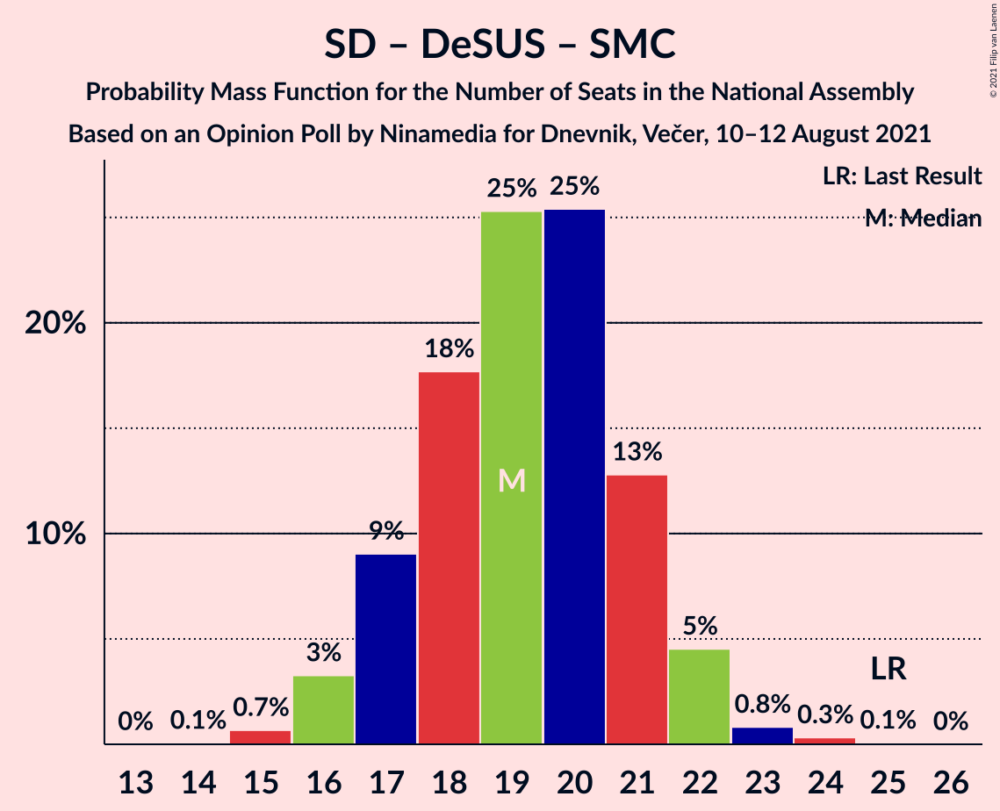

# Opinion Poll by Ninamedia for Dnevnik, Večer, 10–12 August 2021

<a href="#voting-intentions">Voting Intentions</a> | <a href="#seats">Seats</a> | <a href="#coalitions">Coalitions</a> | <a href="#technical-information">Technical Information</a>

## Voting Intentions

### Confidence Intervals

| Party | Last Result | Poll Result | 80% Confidence Interval | 90% Confidence Interval | 95% Confidence Interval | 99% Confidence Interval |
|:-----:|:-----------:|:-----------:|:-----------------------:|:-----------------------:|:-----------------------:|:-----------------------:|
| Slovenska demokratska stranka | 24.9% | 28.9% | 26.7–31.1% |26.1–31.8% |25.6–32.3% |24.6–33.4% |
| Socialni demokrati | 9.9% | 19.4% | 17.6–21.5% |17.1–22.0% |16.7–22.5% |15.8–23.5% |
| Levica | 9.3% | 14.1% | 12.6–16.0% |12.1–16.5% |11.8–16.9% |11.0–17.8% |
| Lista Marjana Šarca | 12.6% | 13.6% | 12.0–15.4% |11.6–15.9% |11.2–16.3% |10.5–17.2% |
| Nova Slovenija–Krščanski demokrati | 7.2% | 8.9% | 7.6–10.4% |7.3–10.8% |7.0–11.2% |6.4–12.0% |
| Stranka Alenke Bratušek | 5.1% | 5.4% | 4.5–6.7% |4.2–7.1% |4.0–7.4% |3.6–8.0% |
| Slovenska nacionalna stranka | 4.2% | 2.1% | 1.6–3.0% |1.4–3.3% |1.3–3.5% |1.1–4.0% |
| Slovenska ljudska stranka | 2.6% | 2.1% | 1.6–3.0% |1.4–3.3% |1.3–3.5% |1.1–4.0% |
| Demokratična stranka upokojencev Slovenije | 4.9% | 1.3% | 0.9–2.0% |0.8–2.2% |0.7–2.4% |0.5–2.8% |
| Stranka modernega centra | 9.7% | 1.1% | 0.8–1.9% |0.7–2.1% |0.6–2.2% |0.4–2.6% |

*Note:* The poll result column reflects the actual value used in the calculations. Published results may vary slightly, and in addition be rounded to fewer digits.

## Seats

### Confidence Intervals

| Party | Last Result | Median | 80% Confidence Interval | 90% Confidence Interval | 95% Confidence Interval | 99% Confidence Interval |
|:-----:|:-----------:|:------:|:-----------------------:|:-----------------------:|:-----------------------:|:-----------------------:|
| <a href="#slovenska-demokratska-stranka">Slovenska demokratska stranka</a> | 25 | 28 | 26–30 |26–31 |25–32 |24–33 |
| <a href="#socialni-demokrati">Socialni demokrati</a> | 10 | 19 | 17–21 |17–22 |16–22 |15–23 |
| <a href="#levica">Levica</a> | 9 | 14 | 12–16 |12–16 |12–17 |11–17 |
| <a href="#lista-marjana-šarca">Lista Marjana Šarca</a> | 13 | 13 | 11–15 |11–16 |11–16 |10–17 |
| <a href="#nova-slovenija–krščanski-demokrati">Nova Slovenija–Krščanski demokrati</a> | 7 | 8 | 7–10 |7–10 |6–11 |6–11 |
| <a href="#stranka-alenke-bratušek">Stranka Alenke Bratušek</a> | 5 | 5 | 4–6 |4–7 |3–7 |0–8 |
| <a href="#slovenska-nacionalna-stranka">Slovenska nacionalna stranka</a> | 4 | 0 | 0 |0 |0 |0 |
| <a href="#slovenska-ljudska-stranka">Slovenska ljudska stranka</a> | 0 | 0 | 0 |0 |0 |0 |
| <a href="#demokratična-stranka-upokojencev-slovenije">Demokratična stranka upokojencev Slovenije</a> | 5 | 0 | 0 |0 |0 |0 |
| <a href="#stranka-modernega-centra">Stranka modernega centra</a> | 10 | 0 | 0 |0 |0 |0 |

### Slovenska demokratska stranka

*For a full overview of the results for this party, see the [Slovenska demokratska stranka](party-slovenskademokratskastranka.html) page.*

| Number of Seats | Probability | Accumulated | Special Marks |
|:---------------:|:-----------:|:-----------:|:-------------:|
| 23 | 0.1% | 100% |  |
| 24 | 1.2% | 99.9% |  |
| 25 | 3% | 98.7% | Last Result |
| 26 | 6% | 95% |  |
| 27 | 24% | 89% |  |
| 28 | 18% | 65% | Median |
| 29 | 21% | 47% |  |
| 30 | 17% | 26% |  |
| 31 | 6% | 9% |  |
| 32 | 2% | 3% |  |
| 33 | 0.5% | 0.7% |  |
| 34 | 0.1% | 0.2% |  |
| 35 | 0% | 0% |  |

### Socialni demokrati

*For a full overview of the results for this party, see the [Socialni demokrati](party-socialnidemokrati.html) page.*

| Number of Seats | Probability | Accumulated | Special Marks |
|:---------------:|:-----------:|:-----------:|:-------------:|
| 10 | 0% | 100% | Last Result |
| 11 | 0% | 100% |  |
| 12 | 0% | 100% |  |
| 13 | 0% | 100% |  |
| 14 | 0.1% | 100% |  |
| 15 | 0.7% | 99.9% |  |
| 16 | 3% | 99.3% |  |
| 17 | 9% | 96% |  |
| 18 | 18% | 87% |  |
| 19 | 25% | 69% | Median |
| 20 | 25% | 44% |  |
| 21 | 13% | 19% |  |
| 22 | 5% | 6% |  |
| 23 | 0.8% | 1.2% |  |
| 24 | 0.3% | 0.4% |  |
| 25 | 0.1% | 0.1% |  |
| 26 | 0% | 0% |  |

### Levica

*For a full overview of the results for this party, see the [Levica](party-levica.html) page.*

| Number of Seats | Probability | Accumulated | Special Marks |
|:---------------:|:-----------:|:-----------:|:-------------:|
| 9 | 0% | 100% | Last Result |
| 10 | 0.4% | 100% |  |
| 11 | 2% | 99.6% |  |
| 12 | 14% | 98% |  |
| 13 | 23% | 84% |  |
| 14 | 28% | 61% | Median |
| 15 | 23% | 33% |  |
| 16 | 6% | 10% |  |
| 17 | 4% | 4% |  |
| 18 | 0.2% | 0.3% |  |
| 19 | 0% | 0% |  |

### Lista Marjana Šarca

*For a full overview of the results for this party, see the [Lista Marjana Šarca](party-listamarjanašarca.html) page.*

| Number of Seats | Probability | Accumulated | Special Marks |
|:---------------:|:-----------:|:-----------:|:-------------:|
| 9 | 0.1% | 100% |  |
| 10 | 1.4% | 99.9% |  |
| 11 | 9% | 98.5% |  |
| 12 | 33% | 89% |  |
| 13 | 34% | 57% | Last Result, Median |
| 14 | 11% | 22% |  |
| 15 | 5% | 11% |  |
| 16 | 5% | 6% |  |
| 17 | 0.5% | 0.7% |  |
| 18 | 0.1% | 0.2% |  |
| 19 | 0% | 0% |  |

### Nova Slovenija–Krščanski demokrati

*For a full overview of the results for this party, see the [Nova Slovenija–Krščanski demokrati](party-novaslovenija–krščanskidemokrati.html) page.*

| Number of Seats | Probability | Accumulated | Special Marks |
|:---------------:|:-----------:|:-----------:|:-------------:|
| 5 | 0.1% | 100% |  |
| 6 | 3% | 99.9% |  |
| 7 | 16% | 97% | Last Result |
| 8 | 35% | 81% | Median |
| 9 | 30% | 46% |  |
| 10 | 13% | 16% |  |
| 11 | 2% | 3% |  |
| 12 | 0.4% | 0.5% |  |
| 13 | 0% | 0% |  |

### Stranka Alenke Bratušek

*For a full overview of the results for this party, see the [Stranka Alenke Bratušek](party-strankaalenkebratušek.html) page.*

| Number of Seats | Probability | Accumulated | Special Marks |
|:---------------:|:-----------:|:-----------:|:-------------:|
| 0 | 2% | 100% |  |
| 1 | 0% | 98% |  |
| 2 | 0% | 98% |  |
| 3 | 0.2% | 98% |  |
| 4 | 22% | 97% |  |
| 5 | 53% | 76% | Last Result, Median |
| 6 | 18% | 23% |  |
| 7 | 4% | 5% |  |
| 8 | 0.9% | 0.9% |  |
| 9 | 0% | 0% |  |

### Slovenska nacionalna stranka

*For a full overview of the results for this party, see the [Slovenska nacionalna stranka](party-slovenskanacionalnastranka.html) page.*

| Number of Seats | Probability | Accumulated | Special Marks |
|:---------------:|:-----------:|:-----------:|:-------------:|
| 0 | 99.5% | 100% | Median |
| 1 | 0% | 0.5% |  |
| 2 | 0% | 0.5% |  |
| 3 | 0% | 0.5% |  |
| 4 | 0.4% | 0.4% | Last Result |
| 5 | 0% | 0% |  |

### Slovenska ljudska stranka

*For a full overview of the results for this party, see the [Slovenska ljudska stranka](party-slovenskaljudskastranka.html) page.*

| Number of Seats | Probability | Accumulated | Special Marks |
|:---------------:|:-----------:|:-----------:|:-------------:|
| 0 | 99.7% | 100% | Last Result, Median |
| 1 | 0% | 0.3% |  |
| 2 | 0% | 0.3% |  |
| 3 | 0% | 0.3% |  |
| 4 | 0.3% | 0.3% |  |
| 5 | 0% | 0% |  |

### Demokratična stranka upokojencev Slovenije

*For a full overview of the results for this party, see the [Demokratična stranka upokojencev Slovenije](party-demokratičnastrankaupokojencevslovenije.html) page.*

| Number of Seats | Probability | Accumulated | Special Marks |
|:---------------:|:-----------:|:-----------:|:-------------:|
| 0 | 100% | 100% | Median |
| 1 | 0% | 0% |  |
| 2 | 0% | 0% |  |
| 3 | 0% | 0% |  |
| 4 | 0% | 0% |  |
| 5 | 0% | 0% | Last Result |

### Stranka modernega centra

*For a full overview of the results for this party, see the [Stranka modernega centra](party-strankamodernegacentra.html) page.*

| Number of Seats | Probability | Accumulated | Special Marks |
|:---------------:|:-----------:|:-----------:|:-------------:|
| 0 | 100% | 100% | Median |
| 1 | 0% | 0% |  |
| 2 | 0% | 0% |  |
| 3 | 0% | 0% |  |
| 4 | 0% | 0% |  |
| 5 | 0% | 0% |  |
| 6 | 0% | 0% |  |
| 7 | 0% | 0% |  |
| 8 | 0% | 0% |  |
| 9 | 0% | 0% |  |
| 10 | 0% | 0% | Last Result |

## Coalitions

### Confidence Intervals

| Coalition | Last Result | Median | Majority? | 80% Confidence Interval | 90% Confidence Interval | 95% Confidence Interval | 99% Confidence Interval |
|:---------:|:-----------:|:------:|:---------:|:-----------------------:|:-----------------------:|:-----------------------:|:-----------------------:|
| Socialni demokrati – Lista Marjana Šarca – Nova Slovenija–Krščanski demokrati – Stranka Alenke Bratušek – Demokratična stranka upokojencev Slovenije – Stranka modernega centra | 50 | 46 | 52% | 43–48 | 43–48 | 42–49 | 40–50 |
| Slovenska demokratska stranka – Lista Marjana Šarca – Demokratična stranka upokojencev Slovenije | 43 | 41 | 1.0% | 39–43 | 38–44 | 38–44 | 37–47 |
| Slovenska demokratska stranka – Lista Marjana Šarca | 38 | 41 | 1.0% | 39–43 | 38–44 | 38–44 | 37–47 |
| Socialni demokrati – Lista Marjana Šarca – Nova Slovenija–Krščanski demokrati – Demokratična stranka upokojencev Slovenije | 35 | 41 | 0.4% | 38–43 | 38–43 | 37–44 | 36–45 |
| Socialni demokrati – Lista Marjana Šarca – Nova Slovenija–Krščanski demokrati – Demokratična stranka upokojencev Slovenije – Stranka modernega centra | 45 | 41 | 0.4% | 38–43 | 38–43 | 37–44 | 36–45 |
| Socialni demokrati – Lista Marjana Šarca – Nova Slovenija–Krščanski demokrati | 30 | 41 | 0.4% | 38–43 | 38–43 | 37–44 | 36–45 |
| Socialni demokrati – Lista Marjana Šarca – Nova Slovenija–Krščanski demokrati – Stranka modernega centra | 40 | 41 | 0.4% | 38–43 | 38–43 | 37–44 | 36–45 |
| Socialni demokrati – Lista Marjana Šarca – Stranka Alenke Bratušek – Demokratična stranka upokojencev Slovenije – Stranka modernega centra | 43 | 37 | 0% | 35–39 | 34–40 | 33–41 | 32–42 |
| Socialni demokrati – Lista Marjana Šarca – Demokratična stranka upokojencev Slovenije | 28 | 32 | 0% | 30–34 | 29–35 | 28–36 | 27–37 |
| Socialni demokrati – Lista Marjana Šarca – Demokratična stranka upokojencev Slovenije – Stranka modernega centra | 38 | 32 | 0% | 30–34 | 29–35 | 28–36 | 27–37 |
| Socialni demokrati – Lista Marjana Šarca | 23 | 32 | 0% | 30–34 | 29–35 | 28–36 | 27–37 |
| Socialni demokrati – Lista Marjana Šarca – Stranka modernega centra | 33 | 32 | 0% | 30–34 | 29–35 | 28–36 | 27–37 |
| Socialni demokrati – Demokratična stranka upokojencev Slovenije – Stranka modernega centra | 25 | 19 | 0% | 17–21 | 17–22 | 16–22 | 15–23 |

### Socialni demokrati – Lista Marjana Šarca – Nova Slovenija–Krščanski demokrati – Stranka Alenke Bratušek – Demokratična stranka upokojencev Slovenije – Stranka modernega centra

| Number of Seats | Probability | Accumulated | Special Marks |
|:---------------:|:-----------:|:-----------:|:-------------:|
| 39 | 0.2% | 100% |  |
| 40 | 0.6% | 99.8% |  |
| 41 | 1.3% | 99.2% |  |
| 42 | 3% | 98% |  |
| 43 | 10% | 95% |  |
| 44 | 18% | 85% |  |
| 45 | 16% | 68% | Median |
| 46 | 23% | 52% | Majority |
| 47 | 17% | 29% |  |
| 48 | 8% | 12% |  |
| 49 | 2% | 4% |  |
| 50 | 1.0% | 1.3% | Last Result |
| 51 | 0.2% | 0.3% |  |
| 52 | 0.1% | 0.1% |  |
| 53 | 0% | 0% |  |

### Slovenska demokratska stranka – Lista Marjana Šarca – Demokratična stranka upokojencev Slovenije

| Number of Seats | Probability | Accumulated | Special Marks |
|:---------------:|:-----------:|:-----------:|:-------------:|
| 35 | 0.1% | 100% |  |
| 36 | 0.4% | 99.9% |  |
| 37 | 1.4% | 99.5% |  |
| 38 | 6% | 98% |  |
| 39 | 11% | 92% |  |
| 40 | 21% | 81% |  |
| 41 | 12% | 60% | Median |
| 42 | 21% | 48% |  |
| 43 | 19% | 27% | Last Result |
| 44 | 5% | 8% |  |
| 45 | 1.4% | 2% |  |
| 46 | 0.5% | 1.0% | Majority |
| 47 | 0.4% | 0.5% |  |
| 48 | 0.1% | 0.1% |  |
| 49 | 0% | 0% |  |

### Slovenska demokratska stranka – Lista Marjana Šarca

| Number of Seats | Probability | Accumulated | Special Marks |
|:---------------:|:-----------:|:-----------:|:-------------:|
| 35 | 0.1% | 100% |  |
| 36 | 0.4% | 99.9% |  |
| 37 | 1.4% | 99.5% |  |
| 38 | 6% | 98% | Last Result |
| 39 | 11% | 92% |  |
| 40 | 21% | 81% |  |
| 41 | 12% | 60% | Median |
| 42 | 21% | 48% |  |
| 43 | 19% | 27% |  |
| 44 | 5% | 8% |  |
| 45 | 1.4% | 2% |  |
| 46 | 0.5% | 1.0% | Majority |
| 47 | 0.4% | 0.5% |  |
| 48 | 0.1% | 0.1% |  |
| 49 | 0% | 0% |  |

### Socialni demokrati – Lista Marjana Šarca – Nova Slovenija–Krščanski demokrati – Demokratična stranka upokojencev Slovenije

| Number of Seats | Probability | Accumulated | Special Marks |
|:---------------:|:-----------:|:-----------:|:-------------:|
| 35 | 0.3% | 100% | Last Result |
| 36 | 1.1% | 99.6% |  |
| 37 | 3% | 98.6% |  |
| 38 | 15% | 95% |  |
| 39 | 11% | 80% |  |
| 40 | 15% | 70% | Median |
| 41 | 23% | 54% |  |
| 42 | 20% | 31% |  |
| 43 | 7% | 11% |  |
| 44 | 3% | 5% |  |
| 45 | 1.2% | 2% |  |
| 46 | 0.2% | 0.4% | Majority |
| 47 | 0.2% | 0.2% |  |
| 48 | 0.1% | 0.1% |  |
| 49 | 0% | 0% |  |

### Socialni demokrati – Lista Marjana Šarca – Nova Slovenija–Krščanski demokrati – Demokratična stranka upokojencev Slovenije – Stranka modernega centra

| Number of Seats | Probability | Accumulated | Special Marks |
|:---------------:|:-----------:|:-----------:|:-------------:|
| 35 | 0.3% | 100% |  |
| 36 | 1.1% | 99.6% |  |
| 37 | 3% | 98.6% |  |
| 38 | 15% | 95% |  |
| 39 | 11% | 80% |  |
| 40 | 15% | 70% | Median |
| 41 | 23% | 54% |  |
| 42 | 20% | 31% |  |
| 43 | 7% | 11% |  |
| 44 | 3% | 5% |  |
| 45 | 1.2% | 2% | Last Result |
| 46 | 0.2% | 0.4% | Majority |
| 47 | 0.2% | 0.2% |  |
| 48 | 0.1% | 0.1% |  |
| 49 | 0% | 0% |  |

### Socialni demokrati – Lista Marjana Šarca – Nova Slovenija–Krščanski demokrati

| Number of Seats | Probability | Accumulated | Special Marks |
|:---------------:|:-----------:|:-----------:|:-------------:|
| 30 | 0% | 100% | Last Result |
| 31 | 0% | 100% |  |
| 32 | 0% | 100% |  |
| 33 | 0% | 100% |  |
| 34 | 0% | 100% |  |
| 35 | 0.3% | 100% |  |
| 36 | 1.1% | 99.6% |  |
| 37 | 3% | 98.6% |  |
| 38 | 15% | 95% |  |
| 39 | 11% | 80% |  |
| 40 | 15% | 70% | Median |
| 41 | 23% | 54% |  |
| 42 | 20% | 31% |  |
| 43 | 7% | 11% |  |
| 44 | 3% | 5% |  |
| 45 | 1.2% | 2% |  |
| 46 | 0.2% | 0.4% | Majority |
| 47 | 0.2% | 0.2% |  |
| 48 | 0.1% | 0.1% |  |
| 49 | 0% | 0% |  |

### Socialni demokrati – Lista Marjana Šarca – Nova Slovenija–Krščanski demokrati – Stranka modernega centra

| Number of Seats | Probability | Accumulated | Special Marks |
|:---------------:|:-----------:|:-----------:|:-------------:|
| 35 | 0.3% | 100% |  |
| 36 | 1.1% | 99.6% |  |
| 37 | 3% | 98.6% |  |
| 38 | 15% | 95% |  |
| 39 | 11% | 80% |  |
| 40 | 15% | 70% | Last Result, Median |
| 41 | 23% | 54% |  |
| 42 | 20% | 31% |  |
| 43 | 7% | 11% |  |
| 44 | 3% | 5% |  |
| 45 | 1.2% | 2% |  |
| 46 | 0.2% | 0.4% | Majority |
| 47 | 0.2% | 0.2% |  |
| 48 | 0.1% | 0.1% |  |
| 49 | 0% | 0% |  |

### Socialni demokrati – Lista Marjana Šarca – Stranka Alenke Bratušek – Demokratična stranka upokojencev Slovenije – Stranka modernega centra

| Number of Seats | Probability | Accumulated | Special Marks |
|:---------------:|:-----------:|:-----------:|:-------------:|
| 30 | 0.1% | 100% |  |
| 31 | 0.2% | 99.9% |  |
| 32 | 0.7% | 99.7% |  |
| 33 | 2% | 99.0% |  |
| 34 | 5% | 96% |  |
| 35 | 11% | 91% |  |
| 36 | 17% | 80% |  |
| 37 | 18% | 63% | Median |
| 38 | 31% | 45% |  |
| 39 | 5% | 14% |  |
| 40 | 6% | 8% |  |
| 41 | 2% | 3% |  |
| 42 | 0.4% | 0.6% |  |
| 43 | 0.1% | 0.2% | Last Result |
| 44 | 0% | 0% |  |

### Socialni demokrati – Lista Marjana Šarca – Demokratična stranka upokojencev Slovenije

| Number of Seats | Probability | Accumulated | Special Marks |
|:---------------:|:-----------:|:-----------:|:-------------:|
| 26 | 0.1% | 100% |  |
| 27 | 0.4% | 99.9% |  |
| 28 | 3% | 99.5% | Last Result |
| 29 | 4% | 97% |  |
| 30 | 11% | 92% |  |
| 31 | 21% | 82% |  |
| 32 | 15% | 61% | Median |
| 33 | 30% | 45% |  |
| 34 | 6% | 16% |  |
| 35 | 7% | 10% |  |
| 36 | 2% | 3% |  |
| 37 | 0.6% | 0.9% |  |
| 38 | 0.2% | 0.2% |  |
| 39 | 0% | 0% |  |

### Socialni demokrati – Lista Marjana Šarca – Demokratična stranka upokojencev Slovenije – Stranka modernega centra

| Number of Seats | Probability | Accumulated | Special Marks |
|:---------------:|:-----------:|:-----------:|:-------------:|
| 26 | 0.1% | 100% |  |
| 27 | 0.4% | 99.9% |  |
| 28 | 3% | 99.5% |  |
| 29 | 4% | 97% |  |
| 30 | 11% | 92% |  |
| 31 | 21% | 82% |  |
| 32 | 15% | 61% | Median |
| 33 | 30% | 45% |  |
| 34 | 6% | 16% |  |
| 35 | 7% | 10% |  |
| 36 | 2% | 3% |  |
| 37 | 0.6% | 0.9% |  |
| 38 | 0.2% | 0.2% | Last Result |
| 39 | 0% | 0% |  |

### Socialni demokrati – Lista Marjana Šarca

| Number of Seats | Probability | Accumulated | Special Marks |
|:---------------:|:-----------:|:-----------:|:-------------:|
| 23 | 0% | 100% | Last Result |
| 24 | 0% | 100% |  |
| 25 | 0% | 100% |  |
| 26 | 0.1% | 100% |  |
| 27 | 0.4% | 99.9% |  |
| 28 | 3% | 99.5% |  |
| 29 | 4% | 97% |  |
| 30 | 11% | 92% |  |
| 31 | 21% | 82% |  |
| 32 | 15% | 61% | Median |
| 33 | 30% | 45% |  |
| 34 | 6% | 16% |  |
| 35 | 7% | 10% |  |
| 36 | 2% | 3% |  |
| 37 | 0.6% | 0.9% |  |
| 38 | 0.2% | 0.2% |  |
| 39 | 0% | 0% |  |

### Socialni demokrati – Lista Marjana Šarca – Stranka modernega centra

| Number of Seats | Probability | Accumulated | Special Marks |
|:---------------:|:-----------:|:-----------:|:-------------:|
| 26 | 0.1% | 100% |  |
| 27 | 0.4% | 99.9% |  |
| 28 | 3% | 99.5% |  |
| 29 | 4% | 97% |  |
| 30 | 11% | 92% |  |
| 31 | 21% | 82% |  |
| 32 | 15% | 61% | Median |
| 33 | 30% | 45% | Last Result |
| 34 | 6% | 16% |  |
| 35 | 7% | 10% |  |
| 36 | 2% | 3% |  |
| 37 | 0.6% | 0.9% |  |
| 38 | 0.2% | 0.2% |  |
| 39 | 0% | 0% |  |

### Socialni demokrati – Demokratična stranka upokojencev Slovenije – Stranka modernega centra

| Number of Seats | Probability | Accumulated | Special Marks |
|:---------------:|:-----------:|:-----------:|:-------------:|
| 14 | 0.1% | 100% |  |
| 15 | 0.7% | 99.9% |  |
| 16 | 3% | 99.3% |  |
| 17 | 9% | 96% |  |
| 18 | 18% | 87% |  |
| 19 | 25% | 69% | Median |
| 20 | 25% | 44% |  |
| 21 | 13% | 19% |  |
| 22 | 5% | 6% |  |
| 23 | 0.8% | 1.2% |  |
| 24 | 0.3% | 0.4% |  |
| 25 | 0.1% | 0.1% | Last Result |
| 26 | 0% | 0% |  |

## Technical Information

### Opinion Poll

+ **Polling firm:** Ninamedia
+ **Commissioner(s):** Dnevnik, Večer
+ **Fieldwork period:** 10–12 August 2021

### Calculations

+ **Sample size:** 700
+ **Simulations done:** 1,048,576
+ **Error estimate:** 1.95%

