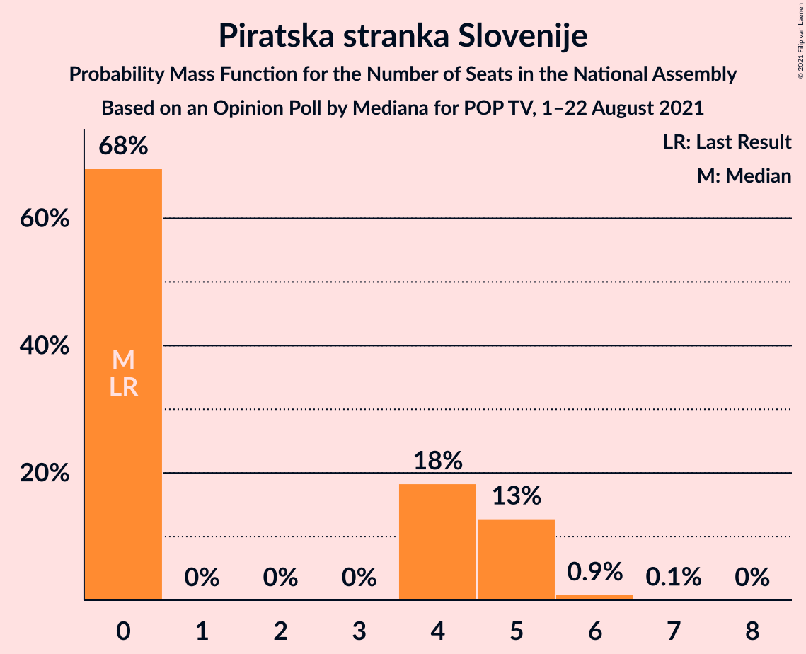
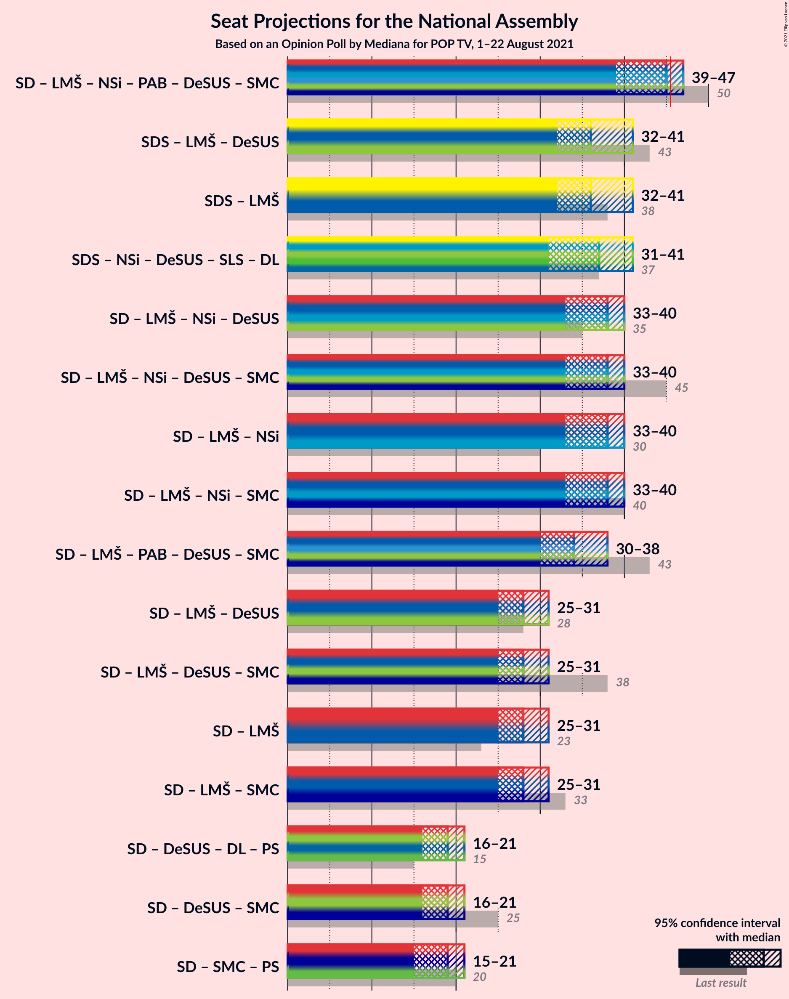
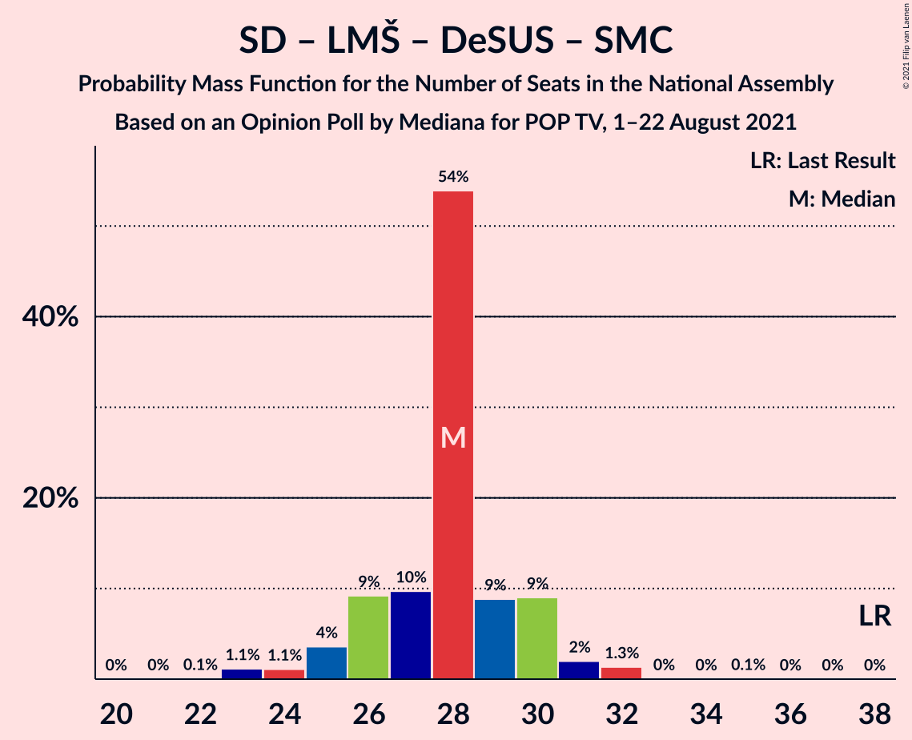
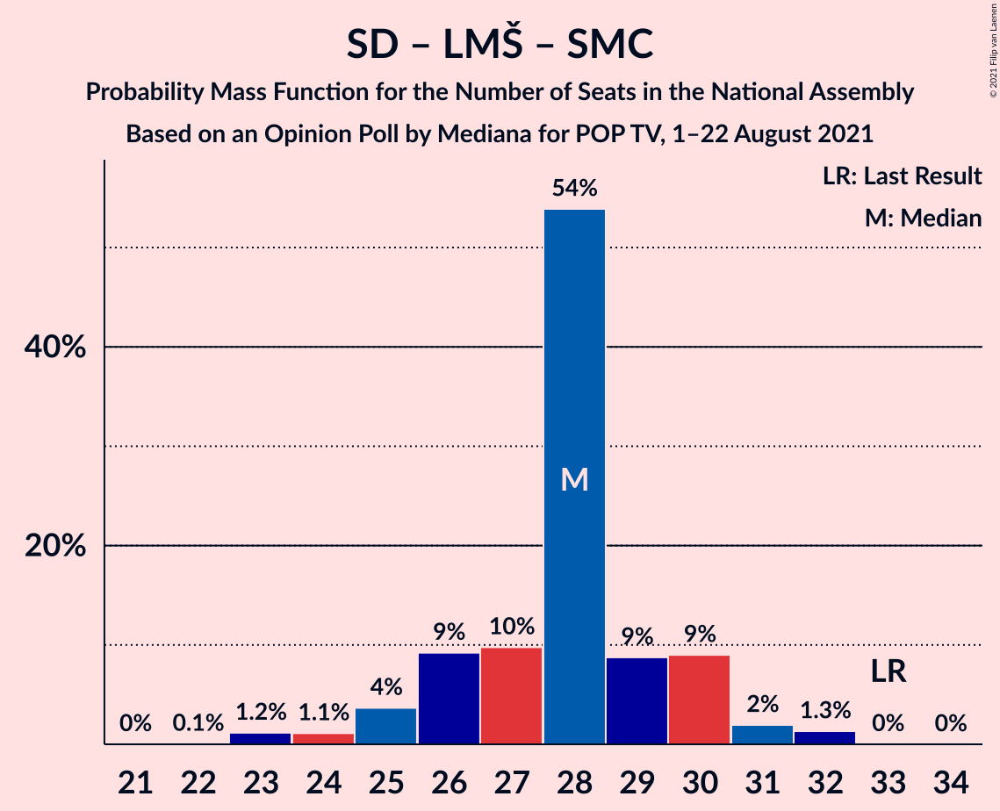
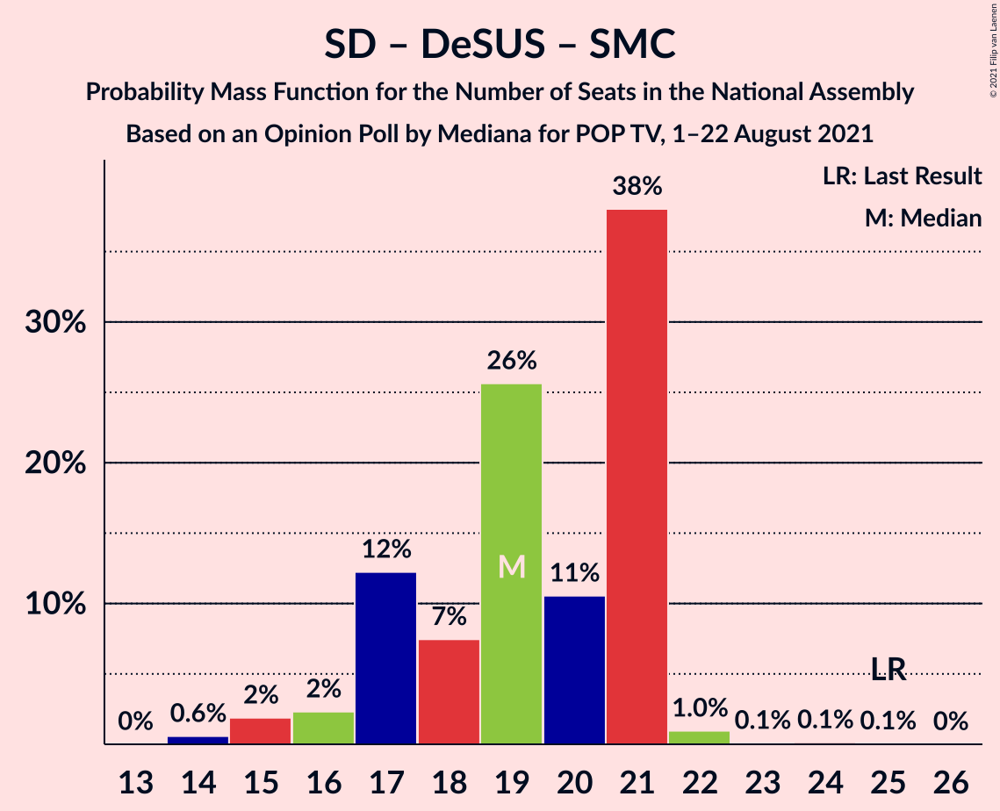

# Opinion Poll by Mediana for POP TV, 1–22 August 2021

<a href="#voting-intentions">Voting Intentions</a> | <a href="#seats">Seats</a> | <a href="#coalitions">Coalitions</a> | <a href="#technical-information">Technical Information</a>

## Voting Intentions

### Confidence Intervals

| Party | Last Result | Poll Result | 80% Confidence Interval | 90% Confidence Interval | 95% Confidence Interval | 99% Confidence Interval |
|:-----:|:-----------:|:-----------:|:-----------------------:|:-----------------------:|:-----------------------:|:-----------------------:|
| Slovenska demokratska stranka | 24.9% | 25.5% | 23.5–27.7% |22.9–28.3% |22.4–28.8% |21.5–29.9% |
| Socialni demokrati | 9.9% | 17.6% | 15.9–19.6% |15.4–20.1% |15.0–20.6% |14.2–21.6% |
| Levica | 9.3% | 13.9% | 12.3–15.7% |11.9–16.2% |11.5–16.6% |10.8–17.5% |
| Lista Marjana Šarca | 12.6% | 8.8% | 7.6–10.3% |7.2–10.8% |7.0–11.1% |6.4–11.9% |
| Nova Slovenija–Krščanski demokrati | 7.2% | 8.8% | 7.6–10.3% |7.2–10.8% |7.0–11.1% |6.4–11.9% |
| Stranka Alenke Bratušek | 5.1% | 6.4% | 5.4–7.8% |5.1–8.2% |4.9–8.5% |4.4–9.2% |
| Piratska stranka Slovenije | 2.2% | 4.1% | 3.3–5.2% |3.0–5.5% |2.8–5.8% |2.5–6.4% |
| Andrej Čuš in Zeleni Slovenije | 1.1% | 3.2% | 2.5–4.2% |2.3–4.5% |2.1–4.8% |1.9–5.3% |
| Slovenska nacionalna stranka | 4.2% | 2.8% | 2.1–3.8% |2.0–4.0% |1.8–4.3% |1.6–4.8% |
| Dobra država | 1.5% | 2.4% | 1.8–3.3% |1.6–3.6% |1.5–3.8% |1.2–4.3% |
| Demokratična stranka upokojencev Slovenije | 4.9% | 2.2% | 1.7–3.1% |1.5–3.4% |1.4–3.6% |1.2–4.1% |
| Slovenska ljudska stranka | 2.6% | 1.7% | 1.2–2.5% |1.1–2.7% |1.0–2.9% |0.8–3.4% |
| Stranka modernega centra | 9.7% | 0.6% | 0.3–1.1% |0.3–1.3% |0.2–1.4% |0.1–1.8% |

*Note:* The poll result column reflects the actual value used in the calculations. Published results may vary slightly, and in addition be rounded to fewer digits.

## Seats

### Confidence Intervals

| Party | Last Result | Median | 80% Confidence Interval | 90% Confidence Interval | 95% Confidence Interval | 99% Confidence Interval |
|:-----:|:-----------:|:------:|:-----------------------:|:-----------------------:|:-----------------------:|:-----------------------:|
| <a href="#slovenska-demokratska-stranka">Slovenska demokratska stranka</a> | 25 | 28 | 25–29 |24–30 |23–31 |22–33 |
| <a href="#socialni-demokrati">Socialni demokrati</a> | 10 | 19 | 17–21 |17–21 |15–21 |14–22 |
| <a href="#levica">Levica</a> | 9 | 14 | 13–16 |12–16 |12–17 |11–19 |
| <a href="#lista-marjana-šarca">Lista Marjana Šarca</a> | 13 | 9 | 7–10 |7–11 |7–12 |7–12 |
| <a href="#nova-slovenija–krščanski-demokrati">Nova Slovenija–Krščanski demokrati</a> | 7 | 9 | 8–11 |7–12 |7–12 |6–12 |
| <a href="#stranka-alenke-bratušek">Stranka Alenke Bratušek</a> | 5 | 6 | 5–7 |5–8 |5–8 |0–9 |
| <a href="#piratska-stranka-slovenije">Piratska stranka Slovenije</a> | 0 | 0 | 0–5 |0–5 |0–5 |0–6 |
| <a href="#andrej-čuš-in-zeleni-slovenije">Andrej Čuš in Zeleni Slovenije</a> | 0 | 0 | 0–4 |0–4 |0–4 |0–5 |
| <a href="#slovenska-nacionalna-stranka">Slovenska nacionalna stranka</a> | 4 | 0 | 0–4 |0–4 |0–4 |0–4 |
| <a href="#dobra-država">Dobra država</a> | 0 | 0 | 0 |0 |0 |0–4 |
| <a href="#demokratična-stranka-upokojencev-slovenije">Demokratična stranka upokojencev Slovenije</a> | 5 | 0 | 0 |0 |0 |0 |
| <a href="#slovenska-ljudska-stranka">Slovenska ljudska stranka</a> | 0 | 0 | 0 |0 |0 |0 |
| <a href="#stranka-modernega-centra">Stranka modernega centra</a> | 10 | 0 | 0 |0 |0 |0 |

### Slovenska demokratska stranka

*For a full overview of the results for this party, see the [Slovenska demokratska stranka](party-slovenskademokratskastranka.html) page.*

| Number of Seats | Probability | Accumulated | Special Marks |
|:---------------:|:-----------:|:-----------:|:-------------:|
| 21 | 0.4% | 100% |  |
| 22 | 2% | 99.5% |  |
| 23 | 2% | 98% |  |
| 24 | 3% | 96% |  |
| 25 | 5% | 92% | Last Result |
| 26 | 13% | 87% |  |
| 27 | 23% | 74% |  |
| 28 | 11% | 52% | Median |
| 29 | 32% | 40% |  |
| 30 | 5% | 9% |  |
| 31 | 2% | 4% |  |
| 32 | 1.2% | 2% |  |
| 33 | 1.0% | 1.1% |  |
| 34 | 0% | 0% |  |

### Socialni demokrati

*For a full overview of the results for this party, see the [Socialni demokrati](party-socialnidemokrati.html) page.*

| Number of Seats | Probability | Accumulated | Special Marks |
|:---------------:|:-----------:|:-----------:|:-------------:|
| 10 | 0% | 100% | Last Result |
| 11 | 0% | 100% |  |
| 12 | 0% | 100% |  |
| 13 | 0% | 100% |  |
| 14 | 0.6% | 100% |  |
| 15 | 2% | 99.4% |  |
| 16 | 2% | 97% |  |
| 17 | 12% | 95% |  |
| 18 | 7% | 83% |  |
| 19 | 26% | 75% | Median |
| 20 | 11% | 50% |  |
| 21 | 38% | 39% |  |
| 22 | 0.9% | 1.2% |  |
| 23 | 0.1% | 0.2% |  |
| 24 | 0.1% | 0.1% |  |
| 25 | 0% | 0% |  |

### Levica

*For a full overview of the results for this party, see the [Levica](party-levica.html) page.*

| Number of Seats | Probability | Accumulated | Special Marks |
|:---------------:|:-----------:|:-----------:|:-------------:|
| 9 | 0% | 100% | Last Result |
| 10 | 0.1% | 100% |  |
| 11 | 2% | 99.9% |  |
| 12 | 3% | 98% |  |
| 13 | 7% | 95% |  |
| 14 | 66% | 88% | Median |
| 15 | 11% | 22% |  |
| 16 | 6% | 11% |  |
| 17 | 3% | 5% |  |
| 18 | 0.8% | 2% |  |
| 19 | 1.0% | 1.3% |  |
| 20 | 0.2% | 0.2% |  |
| 21 | 0% | 0% |  |

### Lista Marjana Šarca

*For a full overview of the results for this party, see the [Lista Marjana Šarca](party-listamarjanašarca.html) page.*

| Number of Seats | Probability | Accumulated | Special Marks |
|:---------------:|:-----------:|:-----------:|:-------------:|
| 6 | 0.2% | 100% |  |
| 7 | 32% | 99.8% |  |
| 8 | 12% | 68% |  |
| 9 | 44% | 56% | Median |
| 10 | 4% | 12% |  |
| 11 | 4% | 8% |  |
| 12 | 3% | 4% |  |
| 13 | 0.3% | 0.3% | Last Result |
| 14 | 0% | 0% |  |

### Nova Slovenija–Krščanski demokrati

*For a full overview of the results for this party, see the [Nova Slovenija–Krščanski demokrati](party-novaslovenija–krščanskidemokrati.html) page.*

| Number of Seats | Probability | Accumulated | Special Marks |
|:---------------:|:-----------:|:-----------:|:-------------:|
| 6 | 0.5% | 100% |  |
| 7 | 6% | 99.5% | Last Result |
| 8 | 22% | 93% |  |
| 9 | 27% | 71% | Median |
| 10 | 7% | 44% |  |
| 11 | 29% | 38% |  |
| 12 | 8% | 8% |  |
| 13 | 0.1% | 0.1% |  |
| 14 | 0.1% | 0.1% |  |
| 15 | 0% | 0% |  |

### Stranka Alenke Bratušek

*For a full overview of the results for this party, see the [Stranka Alenke Bratušek](party-strankaalenkebratušek.html) page.*

| Number of Seats | Probability | Accumulated | Special Marks |
|:---------------:|:-----------:|:-----------:|:-------------:|
| 0 | 1.0% | 100% |  |
| 1 | 0% | 99.0% |  |
| 2 | 0% | 99.0% |  |
| 3 | 0% | 99.0% |  |
| 4 | 0.5% | 99.0% |  |
| 5 | 14% | 98% | Last Result |
| 6 | 40% | 85% | Median |
| 7 | 37% | 45% |  |
| 8 | 6% | 8% |  |
| 9 | 2% | 2% |  |
| 10 | 0.2% | 0.2% |  |
| 11 | 0% | 0% |  |

### Piratska stranka Slovenije

*For a full overview of the results for this party, see the [Piratska stranka Slovenije](party-piratskastrankaslovenije.html) page.*

| Number of Seats | Probability | Accumulated | Special Marks |
|:---------------:|:-----------:|:-----------:|:-------------:|
| 0 | 68% | 100% | Last Result, Median |
| 1 | 0% | 32% |  |
| 2 | 0% | 32% |  |
| 3 | 0% | 32% |  |
| 4 | 18% | 32% |  |
| 5 | 13% | 14% |  |
| 6 | 0.9% | 1.0% |  |
| 7 | 0.1% | 0.1% |  |
| 8 | 0% | 0% |  |

### Andrej Čuš in Zeleni Slovenije

*For a full overview of the results for this party, see the [Andrej Čuš in Zeleni Slovenije](party-andrejčušinzelenislovenije.html) page.*

| Number of Seats | Probability | Accumulated | Special Marks |
|:---------------:|:-----------:|:-----------:|:-------------:|
| 0 | 88% | 100% | Last Result, Median |
| 1 | 0% | 12% |  |
| 2 | 0% | 12% |  |
| 3 | 0% | 12% |  |
| 4 | 10% | 12% |  |
| 5 | 1.4% | 1.4% |  |
| 6 | 0% | 0% |  |

### Slovenska nacionalna stranka

*For a full overview of the results for this party, see the [Slovenska nacionalna stranka](party-slovenskanacionalnastranka.html) page.*

| Number of Seats | Probability | Accumulated | Special Marks |
|:---------------:|:-----------:|:-----------:|:-------------:|
| 0 | 88% | 100% | Median |
| 1 | 0% | 12% |  |
| 2 | 0% | 12% |  |
| 3 | 0% | 12% |  |
| 4 | 11% | 12% | Last Result |
| 5 | 0.1% | 0.1% |  |
| 6 | 0% | 0% |  |

### Dobra država

*For a full overview of the results for this party, see the [Dobra država](party-dobradržava.html) page.*

| Number of Seats | Probability | Accumulated | Special Marks |
|:---------------:|:-----------:|:-----------:|:-------------:|
| 0 | 98.6% | 100% | Last Result, Median |
| 1 | 0% | 1.4% |  |
| 2 | 0% | 1.4% |  |
| 3 | 0% | 1.4% |  |
| 4 | 1.4% | 1.4% |  |
| 5 | 0.1% | 0.1% |  |
| 6 | 0% | 0% |  |

### Demokratična stranka upokojencev Slovenije

*For a full overview of the results for this party, see the [Demokratična stranka upokojencev Slovenije](party-demokratičnastrankaupokojencevslovenije.html) page.*

| Number of Seats | Probability | Accumulated | Special Marks |
|:---------------:|:-----------:|:-----------:|:-------------:|
| 0 | 99.7% | 100% | Median |
| 1 | 0% | 0.3% |  |
| 2 | 0% | 0.3% |  |
| 3 | 0% | 0.3% |  |
| 4 | 0.2% | 0.3% |  |
| 5 | 0% | 0% | Last Result |

### Slovenska ljudska stranka

*For a full overview of the results for this party, see the [Slovenska ljudska stranka](party-slovenskaljudskastranka.html) page.*

| Number of Seats | Probability | Accumulated | Special Marks |
|:---------------:|:-----------:|:-----------:|:-------------:|
| 0 | 99.8% | 100% | Last Result, Median |
| 1 | 0% | 0.2% |  |
| 2 | 0% | 0.2% |  |
| 3 | 0% | 0.2% |  |
| 4 | 0.2% | 0.2% |  |
| 5 | 0% | 0% |  |

### Stranka modernega centra

*For a full overview of the results for this party, see the [Stranka modernega centra](party-strankamodernegacentra.html) page.*

| Number of Seats | Probability | Accumulated | Special Marks |
|:---------------:|:-----------:|:-----------:|:-------------:|
| 0 | 100% | 100% | Median |
| 1 | 0% | 0% |  |
| 2 | 0% | 0% |  |
| 3 | 0% | 0% |  |
| 4 | 0% | 0% |  |
| 5 | 0% | 0% |  |
| 6 | 0% | 0% |  |
| 7 | 0% | 0% |  |
| 8 | 0% | 0% |  |
| 9 | 0% | 0% |  |
| 10 | 0% | 0% | Last Result |

## Coalitions

### Confidence Intervals

| Coalition | Last Result | Median | Majority? | 80% Confidence Interval | 90% Confidence Interval | 95% Confidence Interval | 99% Confidence Interval |
|:---------:|:-----------:|:------:|:---------:|:-----------------------:|:-----------------------:|:-----------------------:|:-----------------------:|
| Socialni demokrati – Lista Marjana Šarca – Nova Slovenija–Krščanski demokrati – Stranka Alenke Bratušek – Demokratična stranka upokojencev Slovenije – Stranka modernega centra | 50 | 45 | 21% | 40–47 | 40–47 | 39–47 | 38–48 |
| Slovenska demokratska stranka – Lista Marjana Šarca – Demokratična stranka upokojencev Slovenije | 43 | 36 | 0% | 34–38 | 33–39 | 32–41 | 30–45 |
| Slovenska demokratska stranka – Lista Marjana Šarca | 38 | 36 | 0% | 34–38 | 33–39 | 32–41 | 30–45 |
| Socialni demokrati – Lista Marjana Šarca – Nova Slovenija–Krščanski demokrati – Demokratična stranka upokojencev Slovenije | 35 | 38 | 0% | 35–40 | 33–40 | 33–40 | 32–41 |
| Socialni demokrati – Lista Marjana Šarca – Nova Slovenija–Krščanski demokrati – Demokratična stranka upokojencev Slovenije – Stranka modernega centra | 45 | 38 | 0% | 35–40 | 33–40 | 33–40 | 32–41 |
| Socialni demokrati – Lista Marjana Šarca – Nova Slovenija–Krščanski demokrati | 30 | 38 | 0% | 35–40 | 33–40 | 33–40 | 32–41 |
| Socialni demokrati – Lista Marjana Šarca – Nova Slovenija–Krščanski demokrati – Stranka modernega centra | 40 | 38 | 0% | 35–40 | 33–40 | 33–40 | 32–41 |
| Socialni demokrati – Lista Marjana Šarca – Stranka Alenke Bratušek – Demokratična stranka upokojencev Slovenije – Stranka modernega centra | 43 | 34 | 0% | 31–37 | 31–37 | 30–38 | 29–40 |
| Socialni demokrati – Lista Marjana Šarca – Demokratična stranka upokojencev Slovenije | 28 | 28 | 0% | 26–30 | 25–30 | 25–31 | 23–32 |
| Socialni demokrati – Lista Marjana Šarca – Demokratična stranka upokojencev Slovenije – Stranka modernega centra | 38 | 28 | 0% | 26–30 | 25–30 | 25–31 | 23–32 |
| Socialni demokrati – Lista Marjana Šarca | 23 | 28 | 0% | 26–30 | 25–30 | 25–31 | 23–32 |
| Socialni demokrati – Lista Marjana Šarca – Stranka modernega centra | 33 | 28 | 0% | 26–30 | 25–30 | 25–31 | 23–32 |
| Socialni demokrati – Demokratična stranka upokojencev Slovenije – Stranka modernega centra | 25 | 19 | 0% | 17–21 | 17–21 | 16–21 | 14–22 |

### Socialni demokrati – Lista Marjana Šarca – Nova Slovenija–Krščanski demokrati – Stranka Alenke Bratušek – Demokratična stranka upokojencev Slovenije – Stranka modernega centra

| Number of Seats | Probability | Accumulated | Special Marks |
|:---------------:|:-----------:|:-----------:|:-------------:|
| 37 | 0.3% | 100% |  |
| 38 | 1.1% | 99.7% |  |
| 39 | 3% | 98.5% |  |
| 40 | 8% | 95% |  |
| 41 | 6% | 88% |  |
| 42 | 8% | 81% |  |
| 43 | 16% | 73% | Median |
| 44 | 6% | 58% |  |
| 45 | 31% | 51% |  |
| 46 | 10% | 21% | Majority |
| 47 | 9% | 11% |  |
| 48 | 1.0% | 1.5% |  |
| 49 | 0.2% | 0.5% |  |
| 50 | 0.2% | 0.2% | Last Result |
| 51 | 0% | 0% |  |

### Slovenska demokratska stranka – Lista Marjana Šarca – Demokratična stranka upokojencev Slovenije

| Number of Seats | Probability | Accumulated | Special Marks |
|:---------------:|:-----------:|:-----------:|:-------------:|
| 29 | 0.1% | 100% |  |
| 30 | 1.5% | 99.9% |  |
| 31 | 0.3% | 98% |  |
| 32 | 3% | 98% |  |
| 33 | 2% | 95% |  |
| 34 | 5% | 93% |  |
| 35 | 11% | 88% |  |
| 36 | 50% | 77% |  |
| 37 | 14% | 27% | Median |
| 38 | 7% | 13% |  |
| 39 | 2% | 6% |  |
| 40 | 0.9% | 4% |  |
| 41 | 1.0% | 3% |  |
| 42 | 0.6% | 2% |  |
| 43 | 0.6% | 1.1% | Last Result |
| 44 | 0% | 0.5% |  |
| 45 | 0.5% | 0.5% |  |
| 46 | 0% | 0% | Majority |

### Slovenska demokratska stranka – Lista Marjana Šarca

| Number of Seats | Probability | Accumulated | Special Marks |
|:---------------:|:-----------:|:-----------:|:-------------:|
| 29 | 0.1% | 100% |  |
| 30 | 1.5% | 99.8% |  |
| 31 | 0.4% | 98% |  |
| 32 | 3% | 98% |  |
| 33 | 2% | 95% |  |
| 34 | 5% | 93% |  |
| 35 | 11% | 88% |  |
| 36 | 50% | 76% |  |
| 37 | 14% | 27% | Median |
| 38 | 7% | 12% | Last Result |
| 39 | 2% | 5% |  |
| 40 | 0.9% | 4% |  |
| 41 | 1.0% | 3% |  |
| 42 | 0.6% | 2% |  |
| 43 | 0.6% | 1.1% |  |
| 44 | 0% | 0.5% |  |
| 45 | 0.5% | 0.5% |  |
| 46 | 0% | 0% | Majority |

### Socialni demokrati – Lista Marjana Šarca – Nova Slovenija–Krščanski demokrati – Demokratična stranka upokojencev Slovenije

| Number of Seats | Probability | Accumulated | Special Marks |
|:---------------:|:-----------:|:-----------:|:-------------:|
| 30 | 0% | 100% |  |
| 31 | 0.3% | 99.9% |  |
| 32 | 1.4% | 99.7% |  |
| 33 | 4% | 98% |  |
| 34 | 4% | 94% |  |
| 35 | 12% | 90% | Last Result |
| 36 | 16% | 79% |  |
| 37 | 5% | 62% | Median |
| 38 | 9% | 58% |  |
| 39 | 37% | 49% |  |
| 40 | 10% | 12% |  |
| 41 | 1.5% | 2% |  |
| 42 | 0.1% | 0.4% |  |
| 43 | 0.2% | 0.2% |  |
| 44 | 0% | 0.1% |  |
| 45 | 0% | 0% |  |

### Socialni demokrati – Lista Marjana Šarca – Nova Slovenija–Krščanski demokrati – Demokratična stranka upokojencev Slovenije – Stranka modernega centra

| Number of Seats | Probability | Accumulated | Special Marks |
|:---------------:|:-----------:|:-----------:|:-------------:|
| 30 | 0% | 100% |  |
| 31 | 0.3% | 99.9% |  |
| 32 | 1.4% | 99.7% |  |
| 33 | 4% | 98% |  |
| 34 | 4% | 94% |  |
| 35 | 12% | 90% |  |
| 36 | 16% | 79% |  |
| 37 | 5% | 62% | Median |
| 38 | 9% | 58% |  |
| 39 | 37% | 49% |  |
| 40 | 10% | 12% |  |
| 41 | 1.5% | 2% |  |
| 42 | 0.1% | 0.4% |  |
| 43 | 0.2% | 0.2% |  |
| 44 | 0% | 0.1% |  |
| 45 | 0% | 0% | Last Result |

### Socialni demokrati – Lista Marjana Šarca – Nova Slovenija–Krščanski demokrati

| Number of Seats | Probability | Accumulated | Special Marks |
|:---------------:|:-----------:|:-----------:|:-------------:|
| 30 | 0% | 100% | Last Result |
| 31 | 0.3% | 99.9% |  |
| 32 | 1.4% | 99.7% |  |
| 33 | 4% | 98% |  |
| 34 | 4% | 94% |  |
| 35 | 12% | 90% |  |
| 36 | 16% | 78% |  |
| 37 | 4% | 62% | Median |
| 38 | 9% | 58% |  |
| 39 | 37% | 49% |  |
| 40 | 10% | 12% |  |
| 41 | 1.5% | 2% |  |
| 42 | 0.1% | 0.3% |  |
| 43 | 0.2% | 0.2% |  |
| 44 | 0% | 0% |  |

### Socialni demokrati – Lista Marjana Šarca – Nova Slovenija–Krščanski demokrati – Stranka modernega centra

| Number of Seats | Probability | Accumulated | Special Marks |
|:---------------:|:-----------:|:-----------:|:-------------:|
| 30 | 0% | 100% |  |
| 31 | 0.3% | 99.9% |  |
| 32 | 1.4% | 99.7% |  |
| 33 | 4% | 98% |  |
| 34 | 4% | 94% |  |
| 35 | 12% | 90% |  |
| 36 | 16% | 78% |  |
| 37 | 4% | 62% | Median |
| 38 | 9% | 58% |  |
| 39 | 37% | 49% |  |
| 40 | 10% | 12% | Last Result |
| 41 | 1.5% | 2% |  |
| 42 | 0.1% | 0.3% |  |
| 43 | 0.2% | 0.2% |  |
| 44 | 0% | 0% |  |

### Socialni demokrati – Lista Marjana Šarca – Stranka Alenke Bratušek – Demokratična stranka upokojencev Slovenije – Stranka modernega centra

| Number of Seats | Probability | Accumulated | Special Marks |
|:---------------:|:-----------:|:-----------:|:-------------:|
| 28 | 0.3% | 100% |  |
| 29 | 1.1% | 99.7% |  |
| 30 | 1.4% | 98.6% |  |
| 31 | 8% | 97% |  |
| 32 | 5% | 89% |  |
| 33 | 3% | 84% |  |
| 34 | 40% | 81% | Median |
| 35 | 26% | 41% |  |
| 36 | 3% | 15% |  |
| 37 | 10% | 12% |  |
| 38 | 0.6% | 3% |  |
| 39 | 1.5% | 2% |  |
| 40 | 0.6% | 0.6% |  |
| 41 | 0% | 0% |  |
| 42 | 0% | 0% |  |
| 43 | 0% | 0% | Last Result |

### Socialni demokrati – Lista Marjana Šarca – Demokratična stranka upokojencev Slovenije

| Number of Seats | Probability | Accumulated | Special Marks |
|:---------------:|:-----------:|:-----------:|:-------------:|
| 22 | 0.1% | 100% |  |
| 23 | 1.1% | 99.9% |  |
| 24 | 1.1% | 98.8% |  |
| 25 | 4% | 98% |  |
| 26 | 9% | 94% |  |
| 27 | 10% | 85% |  |
| 28 | 54% | 75% | Last Result, Median |
| 29 | 9% | 21% |  |
| 30 | 9% | 12% |  |
| 31 | 2% | 3% |  |
| 32 | 1.3% | 1.4% |  |
| 33 | 0% | 0.1% |  |
| 34 | 0% | 0.1% |  |
| 35 | 0.1% | 0.1% |  |
| 36 | 0% | 0% |  |

### Socialni demokrati – Lista Marjana Šarca – Demokratična stranka upokojencev Slovenije – Stranka modernega centra

| Number of Seats | Probability | Accumulated | Special Marks |
|:---------------:|:-----------:|:-----------:|:-------------:|
| 22 | 0.1% | 100% |  |
| 23 | 1.1% | 99.9% |  |
| 24 | 1.1% | 98.8% |  |
| 25 | 4% | 98% |  |
| 26 | 9% | 94% |  |
| 27 | 10% | 85% |  |
| 28 | 54% | 75% | Median |
| 29 | 9% | 21% |  |
| 30 | 9% | 12% |  |
| 31 | 2% | 3% |  |
| 32 | 1.3% | 1.4% |  |
| 33 | 0% | 0.1% |  |
| 34 | 0% | 0.1% |  |
| 35 | 0.1% | 0.1% |  |
| 36 | 0% | 0% |  |
| 37 | 0% | 0% |  |
| 38 | 0% | 0% | Last Result |

### Socialni demokrati – Lista Marjana Šarca

| Number of Seats | Probability | Accumulated | Special Marks |
|:---------------:|:-----------:|:-----------:|:-------------:|
| 22 | 0.1% | 100% |  |
| 23 | 1.2% | 99.9% | Last Result |
| 24 | 1.1% | 98.7% |  |
| 25 | 4% | 98% |  |
| 26 | 9% | 94% |  |
| 27 | 10% | 85% |  |
| 28 | 54% | 75% | Median |
| 29 | 9% | 21% |  |
| 30 | 9% | 12% |  |
| 31 | 2% | 3% |  |
| 32 | 1.3% | 1.4% |  |
| 33 | 0% | 0.1% |  |
| 34 | 0% | 0% |  |

### Socialni demokrati – Lista Marjana Šarca – Stranka modernega centra

| Number of Seats | Probability | Accumulated | Special Marks |
|:---------------:|:-----------:|:-----------:|:-------------:|
| 22 | 0.1% | 100% |  |
| 23 | 1.2% | 99.9% |  |
| 24 | 1.1% | 98.7% |  |
| 25 | 4% | 98% |  |
| 26 | 9% | 94% |  |
| 27 | 10% | 85% |  |
| 28 | 54% | 75% | Median |
| 29 | 9% | 21% |  |
| 30 | 9% | 12% |  |
| 31 | 2% | 3% |  |
| 32 | 1.3% | 1.4% |  |
| 33 | 0% | 0.1% | Last Result |
| 34 | 0% | 0% |  |

### Socialni demokrati – Demokratična stranka upokojencev Slovenije – Stranka modernega centra

| Number of Seats | Probability | Accumulated | Special Marks |
|:---------------:|:-----------:|:-----------:|:-------------:|
| 14 | 0.6% | 100% |  |
| 15 | 2% | 99.4% |  |
| 16 | 2% | 98% |  |
| 17 | 12% | 95% |  |
| 18 | 7% | 83% |  |
| 19 | 26% | 75% | Median |
| 20 | 11% | 50% |  |
| 21 | 38% | 39% |  |
| 22 | 1.0% | 1.2% |  |
| 23 | 0.1% | 0.3% |  |
| 24 | 0.1% | 0.2% |  |
| 25 | 0.1% | 0.1% | Last Result |
| 26 | 0% | 0% |  |

## Technical Information

### Opinion Poll

+ **Polling firm:** Mediana
+ **Commissioner(s):** POP TV
+ **Fieldwork period:** 1–22 August 2021

### Calculations

+ **Sample size:** 714
+ **Simulations done:** 1,048,576
+ **Error estimate:** 2.73%

