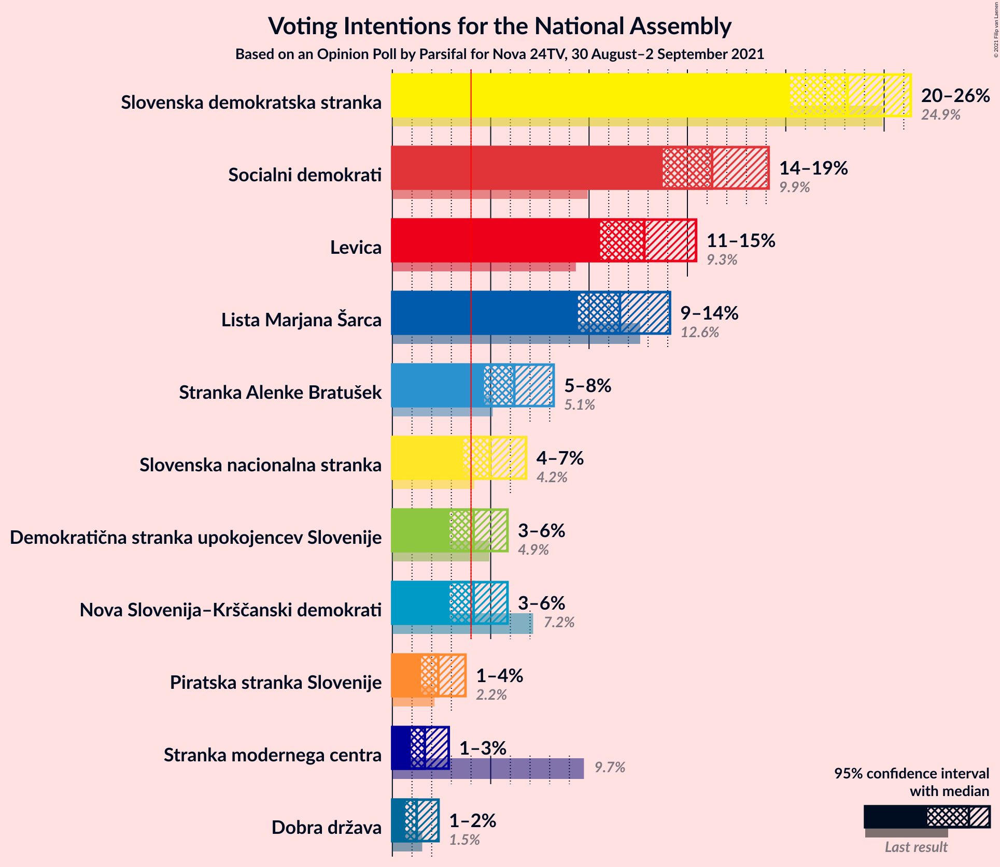
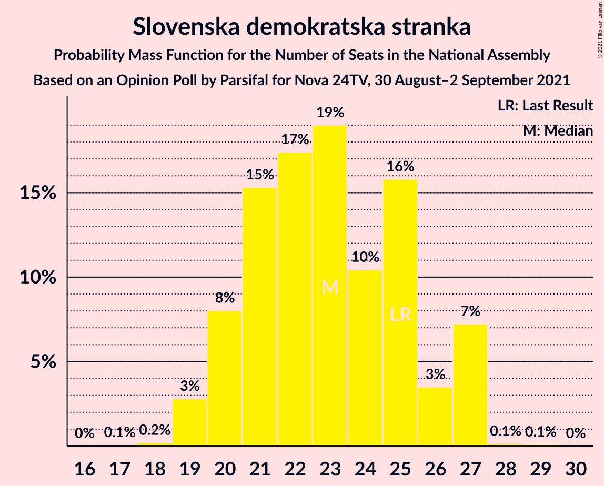

# Opinion Poll by Parsifal for Nova 24TV, 30 August–2 September 2021

<a href="#voting-intentions">Voting Intentions</a> | <a href="#seats">Seats</a> | <a href="#coalitions">Coalitions</a> | <a href="#technical-information">Technical Information</a>

## Voting Intentions

### Confidence Intervals

| Party | Last Result | Poll Result | 80% Confidence Interval | 90% Confidence Interval | 95% Confidence Interval | 99% Confidence Interval |
|:-----:|:-----------:|:-----------:|:-----------------------:|:-----------------------:|:-----------------------:|:-----------------------:|
| Slovenska demokratska stranka | 24.9% | 23.1% | 21.2–25.2% |20.7–25.8% |20.2–26.4% |19.3–27.4% |
| Socialni demokrati | 9.9% | 16.3% | 14.6–18.1% |14.1–18.7% |13.7–19.1% |13.0–20.0% |
| Levica | 9.3% | 12.8% | 11.3–14.5% |10.9–15.0% |10.6–15.4% |9.9–16.3% |
| Lista Marjana Šarca | 12.6% | 11.6% | 10.2–13.2% |9.8–13.7% |9.4–14.1% |8.8–14.9% |
| Stranka Alenke Bratušek | 5.1% | 6.2% | 5.2–7.5% |4.9–7.9% |4.7–8.2% |4.2–8.9% |
| Slovenska nacionalna stranka | 4.2% | 5.0% | 4.1–6.2% |3.8–6.5% |3.6–6.8% |3.2–7.4% |
| Nova Slovenija–Krščanski demokrati | 7.2% | 4.1% | 3.3–5.2% |3.1–5.6% |2.9–5.9% |2.6–6.4% |
| Demokratična stranka upokojencev Slovenije | 4.9% | 4.1% | 3.3–5.2% |3.1–5.6% |2.9–5.9% |2.6–6.4% |
| Piratska stranka Slovenije | 2.2% | 2.3% | 1.8–3.2% |1.6–3.5% |1.5–3.7% |1.2–4.2% |
| Stranka modernega centra | 9.7% | 1.7% | 1.2–2.4% |1.1–2.7% |0.9–2.9% |0.8–3.3% |
| Dobra država | 1.5% | 1.2% | 0.9–2.0% |0.7–2.2% |0.7–2.3% |0.5–2.7% |

*Note:* The poll result column reflects the actual value used in the calculations. Published results may vary slightly, and in addition be rounded to fewer digits.

## Seats

### Confidence Intervals

| Party | Last Result | Median | 80% Confidence Interval | 90% Confidence Interval | 95% Confidence Interval | 99% Confidence Interval |
|:-----:|:-----------:|:------:|:-----------------------:|:-----------------------:|:-----------------------:|:-----------------------:|
| <a href="#slovenska-demokratska-stranka">Slovenska demokratska stranka</a> | 25 | 23 | 20–26 |20–27 |19–27 |19–27 |
| <a href="#socialni-demokrati">Socialni demokrati</a> | 10 | 16 | 13–17 |13–18 |13–18 |12–20 |
| <a href="#levica">Levica</a> | 9 | 12 | 11–14 |10–14 |10–15 |9–16 |
| <a href="#lista-marjana-šarca">Lista Marjana Šarca</a> | 13 | 11 | 10–13 |9–13 |9–14 |8–15 |
| <a href="#stranka-alenke-bratušek">Stranka Alenke Bratušek</a> | 5 | 6 | 4–7 |4–7 |4–8 |4–8 |
| <a href="#slovenska-nacionalna-stranka">Slovenska nacionalna stranka</a> | 4 | 4 | 0–5 |0–6 |0–6 |0–7 |
| <a href="#nova-slovenija–krščanski-demokrati">Nova Slovenija–Krščanski demokrati</a> | 7 | 4 | 0–5 |0–5 |0–5 |0–6 |
| <a href="#demokratična-stranka-upokojencev-slovenije">Demokratična stranka upokojencev Slovenije</a> | 5 | 4 | 0–4 |0–5 |0–5 |0–6 |
| <a href="#piratska-stranka-slovenije">Piratska stranka Slovenije</a> | 0 | 0 | 0 |0 |0 |0–4 |
| <a href="#stranka-modernega-centra">Stranka modernega centra</a> | 10 | 0 | 0 |0 |0 |0 |
| <a href="#dobra-država">Dobra država</a> | 0 | 0 | 0 |0 |0 |0 |

### Slovenska demokratska stranka

*For a full overview of the results for this party, see the [Slovenska demokratska stranka](party-slovenskademokratskastranka.html) page.*

| Number of Seats | Probability | Accumulated | Special Marks |
|:---------------:|:-----------:|:-----------:|:-------------:|
| 17 | 0.1% | 100% |  |
| 18 | 0.2% | 99.9% |  |
| 19 | 3% | 99.7% |  |
| 20 | 8% | 97% |  |
| 21 | 15% | 89% |  |
| 22 | 17% | 74% |  |
| 23 | 19% | 56% | Median |
| 24 | 10% | 37% |  |
| 25 | 16% | 27% | Last Result |
| 26 | 3% | 11% |  |
| 27 | 7% | 7% |  |
| 28 | 0.1% | 0.2% |  |
| 29 | 0.1% | 0.1% |  |
| 30 | 0% | 0% |  |

### Socialni demokrati

*For a full overview of the results for this party, see the [Socialni demokrati](party-socialnidemokrati.html) page.*

| Number of Seats | Probability | Accumulated | Special Marks |
|:---------------:|:-----------:|:-----------:|:-------------:|
| 10 | 0% | 100% | Last Result |
| 11 | 0.1% | 100% |  |
| 12 | 0.9% | 99.9% |  |
| 13 | 10% | 99.1% |  |
| 14 | 6% | 89% |  |
| 15 | 21% | 83% |  |
| 16 | 26% | 62% | Median |
| 17 | 29% | 36% |  |
| 18 | 5% | 7% |  |
| 19 | 1.0% | 2% |  |
| 20 | 0.7% | 0.9% |  |
| 21 | 0.2% | 0.2% |  |
| 22 | 0% | 0% |  |

### Levica

*For a full overview of the results for this party, see the [Levica](party-levica.html) page.*

| Number of Seats | Probability | Accumulated | Special Marks |
|:---------------:|:-----------:|:-----------:|:-------------:|
| 9 | 2% | 100% | Last Result |
| 10 | 4% | 98% |  |
| 11 | 10% | 94% |  |
| 12 | 41% | 84% | Median |
| 13 | 33% | 43% |  |
| 14 | 5% | 10% |  |
| 15 | 3% | 5% |  |
| 16 | 2% | 2% |  |
| 17 | 0.2% | 0.2% |  |
| 18 | 0% | 0% |  |

### Lista Marjana Šarca

*For a full overview of the results for this party, see the [Lista Marjana Šarca](party-listamarjanašarca.html) page.*

| Number of Seats | Probability | Accumulated | Special Marks |
|:---------------:|:-----------:|:-----------:|:-------------:|
| 8 | 1.1% | 100% |  |
| 9 | 8% | 98.9% |  |
| 10 | 28% | 91% |  |
| 11 | 27% | 63% | Median |
| 12 | 16% | 36% |  |
| 13 | 17% | 20% | Last Result |
| 14 | 2% | 3% |  |
| 15 | 0.3% | 0.7% |  |
| 16 | 0.4% | 0.4% |  |
| 17 | 0% | 0% |  |

### Stranka Alenke Bratušek

*For a full overview of the results for this party, see the [Stranka Alenke Bratušek](party-strankaalenkebratušek.html) page.*

| Number of Seats | Probability | Accumulated | Special Marks |
|:---------------:|:-----------:|:-----------:|:-------------:|
| 0 | 0.2% | 100% |  |
| 1 | 0% | 99.8% |  |
| 2 | 0% | 99.8% |  |
| 3 | 0.1% | 99.8% |  |
| 4 | 11% | 99.7% |  |
| 5 | 33% | 89% | Last Result |
| 6 | 41% | 56% | Median |
| 7 | 10% | 15% |  |
| 8 | 4% | 5% |  |
| 9 | 0.2% | 0.2% |  |
| 10 | 0% | 0% |  |

### Slovenska nacionalna stranka

*For a full overview of the results for this party, see the [Slovenska nacionalna stranka](party-slovenskanacionalnastranka.html) page.*

| Number of Seats | Probability | Accumulated | Special Marks |
|:---------------:|:-----------:|:-----------:|:-------------:|
| 0 | 12% | 100% |  |
| 1 | 0% | 88% |  |
| 2 | 0% | 88% |  |
| 3 | 0.1% | 88% |  |
| 4 | 45% | 88% | Last Result, Median |
| 5 | 34% | 44% |  |
| 6 | 9% | 10% |  |
| 7 | 0.9% | 1.0% |  |
| 8 | 0.1% | 0.1% |  |
| 9 | 0% | 0% |  |

### Nova Slovenija–Krščanski demokrati

*For a full overview of the results for this party, see the [Nova Slovenija–Krščanski demokrati](party-novaslovenija–krščanskidemokrati.html) page.*

| Number of Seats | Probability | Accumulated | Special Marks |
|:---------------:|:-----------:|:-----------:|:-------------:|
| 0 | 42% | 100% |  |
| 1 | 0% | 58% |  |
| 2 | 0% | 58% |  |
| 3 | 0.2% | 58% |  |
| 4 | 40% | 58% | Median |
| 5 | 18% | 19% |  |
| 6 | 1.0% | 1.1% |  |
| 7 | 0% | 0% | Last Result |

### Demokratična stranka upokojencev Slovenije

*For a full overview of the results for this party, see the [Demokratična stranka upokojencev Slovenije](party-demokratičnastrankaupokojencevslovenije.html) page.*

| Number of Seats | Probability | Accumulated | Special Marks |
|:---------------:|:-----------:|:-----------:|:-------------:|
| 0 | 39% | 100% |  |
| 1 | 0% | 61% |  |
| 2 | 0% | 61% |  |
| 3 | 6% | 61% |  |
| 4 | 45% | 55% | Median |
| 5 | 8% | 10% | Last Result |
| 6 | 1.5% | 2% |  |
| 7 | 0% | 0% |  |

### Piratska stranka Slovenije

*For a full overview of the results for this party, see the [Piratska stranka Slovenije](party-piratskastrankaslovenije.html) page.*

| Number of Seats | Probability | Accumulated | Special Marks |
|:---------------:|:-----------:|:-----------:|:-------------:|
| 0 | 99.4% | 100% | Last Result, Median |
| 1 | 0% | 0.6% |  |
| 2 | 0% | 0.6% |  |
| 3 | 0.1% | 0.6% |  |
| 4 | 0.5% | 0.5% |  |
| 5 | 0% | 0% |  |

### Stranka modernega centra

*For a full overview of the results for this party, see the [Stranka modernega centra](party-strankamodernegacentra.html) page.*

| Number of Seats | Probability | Accumulated | Special Marks |
|:---------------:|:-----------:|:-----------:|:-------------:|
| 0 | 100% | 100% | Median |
| 1 | 0% | 0% |  |
| 2 | 0% | 0% |  |
| 3 | 0% | 0% |  |
| 4 | 0% | 0% |  |
| 5 | 0% | 0% |  |
| 6 | 0% | 0% |  |
| 7 | 0% | 0% |  |
| 8 | 0% | 0% |  |
| 9 | 0% | 0% |  |
| 10 | 0% | 0% | Last Result |

### Dobra država

*For a full overview of the results for this party, see the [Dobra država](party-dobradržava.html) page.*

| Number of Seats | Probability | Accumulated | Special Marks |
|:---------------:|:-----------:|:-----------:|:-------------:|
| 0 | 100% | 100% | Last Result, Median |

## Coalitions

### Confidence Intervals

| Coalition | Last Result | Median | Majority? | 80% Confidence Interval | 90% Confidence Interval | 95% Confidence Interval | 99% Confidence Interval |
|:---------:|:-----------:|:------:|:---------:|:-----------------------:|:-----------------------:|:-----------------------:|:-----------------------:|
| Socialni demokrati – Lista Marjana Šarca – Stranka Alenke Bratušek – Demokratična stranka upokojencev Slovenije – Nova Slovenija–Krščanski demokrati – Stranka modernega centra | 50 | 38 | 0% | 34–41 | 34–42 | 33–43 | 32–43 |
| Slovenska demokratska stranka – Lista Marjana Šarca – Demokratična stranka upokojencev Slovenije | 43 | 37 | 0% | 33–40 | 33–40 | 32–41 | 30–42 |
| Socialni demokrati – Lista Marjana Šarca – Stranka Alenke Bratušek – Demokratična stranka upokojencev Slovenije – Stranka modernega centra | 43 | 35 | 0% | 32–39 | 31–40 | 30–40 | 30–41 |
| Slovenska demokratska stranka – Lista Marjana Šarca | 38 | 34 | 0% | 31–37 | 30–40 | 30–40 | 29–40 |
| Socialni demokrati – Lista Marjana Šarca – Demokratična stranka upokojencev Slovenije – Nova Slovenija–Krščanski demokrati | 35 | 31 | 0% | 29–35 | 28–37 | 27–37 | 25–38 |
| Socialni demokrati – Lista Marjana Šarca – Demokratična stranka upokojencev Slovenije – Nova Slovenija–Krščanski demokrati – Stranka modernega centra | 45 | 31 | 0% | 29–35 | 28–37 | 27–37 | 25–38 |
| Socialni demokrati – Lista Marjana Šarca – Nova Slovenija–Krščanski demokrati | 30 | 30 | 0% | 27–32 | 26–33 | 25–34 | 24–35 |
| Socialni demokrati – Lista Marjana Šarca – Nova Slovenija–Krščanski demokrati – Stranka modernega centra | 40 | 30 | 0% | 27–32 | 26–33 | 25–34 | 24–35 |
| Socialni demokrati – Lista Marjana Šarca – Demokratična stranka upokojencev Slovenije | 28 | 29 | 0% | 26–33 | 25–34 | 24–34 | 24–36 |
| Socialni demokrati – Lista Marjana Šarca – Demokratična stranka upokojencev Slovenije – Stranka modernega centra | 38 | 29 | 0% | 26–33 | 25–34 | 24–34 | 24–36 |
| Socialni demokrati – Lista Marjana Šarca | 23 | 27 | 0% | 24–29 | 24–30 | 24–31 | 23–32 |
| Socialni demokrati – Lista Marjana Šarca – Stranka modernega centra | 33 | 27 | 0% | 24–29 | 24–30 | 24–31 | 23–32 |
| Socialni demokrati – Demokratična stranka upokojencev Slovenije – Stranka modernega centra | 25 | 19 | 0% | 15–21 | 14–22 | 13–22 | 13–24 |

### Socialni demokrati – Lista Marjana Šarca – Stranka Alenke Bratušek – Demokratična stranka upokojencev Slovenije – Nova Slovenija–Krščanski demokrati – Stranka modernega centra

| Number of Seats | Probability | Accumulated | Special Marks |
|:---------------:|:-----------:|:-----------:|:-------------:|
| 30 | 0.1% | 100% |  |
| 31 | 0.3% | 99.8% |  |
| 32 | 1.2% | 99.5% |  |
| 33 | 3% | 98% |  |
| 34 | 8% | 95% |  |
| 35 | 7% | 87% |  |
| 36 | 13% | 80% |  |
| 37 | 15% | 66% |  |
| 38 | 18% | 51% |  |
| 39 | 11% | 33% |  |
| 40 | 10% | 23% |  |
| 41 | 6% | 13% | Median |
| 42 | 3% | 7% |  |
| 43 | 4% | 4% |  |
| 44 | 0.2% | 0.4% |  |
| 45 | 0.1% | 0.1% |  |
| 46 | 0% | 0% | Majority |
| 47 | 0% | 0% |  |
| 48 | 0% | 0% |  |
| 49 | 0% | 0% |  |
| 50 | 0% | 0% | Last Result |

### Slovenska demokratska stranka – Lista Marjana Šarca – Demokratična stranka upokojencev Slovenije

| Number of Seats | Probability | Accumulated | Special Marks |
|:---------------:|:-----------:|:-----------:|:-------------:|
| 29 | 0.1% | 100% |  |
| 30 | 1.1% | 99.9% |  |
| 31 | 1.3% | 98.8% |  |
| 32 | 2% | 98% |  |
| 33 | 12% | 95% |  |
| 34 | 6% | 83% |  |
| 35 | 9% | 76% |  |
| 36 | 15% | 67% |  |
| 37 | 15% | 52% |  |
| 38 | 9% | 37% | Median |
| 39 | 9% | 28% |  |
| 40 | 16% | 19% |  |
| 41 | 3% | 4% |  |
| 42 | 0.8% | 1.0% |  |
| 43 | 0.1% | 0.2% | Last Result |
| 44 | 0% | 0.1% |  |
| 45 | 0% | 0% |  |

### Socialni demokrati – Lista Marjana Šarca – Stranka Alenke Bratušek – Demokratična stranka upokojencev Slovenije – Stranka modernega centra

| Number of Seats | Probability | Accumulated | Special Marks |
|:---------------:|:-----------:|:-----------:|:-------------:|
| 28 | 0% | 100% |  |
| 29 | 0.1% | 99.9% |  |
| 30 | 3% | 99.8% |  |
| 31 | 4% | 96% |  |
| 32 | 4% | 93% |  |
| 33 | 24% | 89% |  |
| 34 | 13% | 65% |  |
| 35 | 10% | 52% |  |
| 36 | 15% | 42% |  |
| 37 | 5% | 27% | Median |
| 38 | 12% | 23% |  |
| 39 | 5% | 11% |  |
| 40 | 4% | 5% |  |
| 41 | 1.0% | 1.2% |  |
| 42 | 0.1% | 0.2% |  |
| 43 | 0.1% | 0.1% | Last Result |
| 44 | 0% | 0% |  |

### Slovenska demokratska stranka – Lista Marjana Šarca

| Number of Seats | Probability | Accumulated | Special Marks |
|:---------------:|:-----------:|:-----------:|:-------------:|
| 28 | 0.1% | 100% |  |
| 29 | 2% | 99.8% |  |
| 30 | 5% | 98% |  |
| 31 | 10% | 93% |  |
| 32 | 8% | 83% |  |
| 33 | 24% | 75% |  |
| 34 | 11% | 51% | Median |
| 35 | 11% | 41% |  |
| 36 | 14% | 30% |  |
| 37 | 7% | 16% |  |
| 38 | 2% | 9% | Last Result |
| 39 | 0.2% | 7% |  |
| 40 | 7% | 7% |  |
| 41 | 0.1% | 0.1% |  |
| 42 | 0% | 0% |  |

### Socialni demokrati – Lista Marjana Šarca – Demokratična stranka upokojencev Slovenije – Nova Slovenija–Krščanski demokrati

| Number of Seats | Probability | Accumulated | Special Marks |
|:---------------:|:-----------:|:-----------:|:-------------:|
| 24 | 0.2% | 100% |  |
| 25 | 0.5% | 99.8% |  |
| 26 | 1.0% | 99.3% |  |
| 27 | 1.2% | 98% |  |
| 28 | 4% | 97% |  |
| 29 | 12% | 93% |  |
| 30 | 5% | 81% |  |
| 31 | 27% | 76% |  |
| 32 | 10% | 49% |  |
| 33 | 6% | 38% |  |
| 34 | 16% | 32% |  |
| 35 | 7% | 16% | Last Result, Median |
| 36 | 4% | 9% |  |
| 37 | 4% | 5% |  |
| 38 | 1.1% | 1.4% |  |
| 39 | 0.2% | 0.2% |  |
| 40 | 0% | 0% |  |

### Socialni demokrati – Lista Marjana Šarca – Demokratična stranka upokojencev Slovenije – Nova Slovenija–Krščanski demokrati – Stranka modernega centra

| Number of Seats | Probability | Accumulated | Special Marks |
|:---------------:|:-----------:|:-----------:|:-------------:|
| 24 | 0.2% | 100% |  |
| 25 | 0.5% | 99.8% |  |
| 26 | 1.0% | 99.3% |  |
| 27 | 1.2% | 98% |  |
| 28 | 4% | 97% |  |
| 29 | 12% | 93% |  |
| 30 | 5% | 81% |  |
| 31 | 27% | 76% |  |
| 32 | 10% | 49% |  |
| 33 | 6% | 38% |  |
| 34 | 16% | 32% |  |
| 35 | 7% | 16% | Median |
| 36 | 4% | 9% |  |
| 37 | 4% | 5% |  |
| 38 | 1.1% | 1.4% |  |
| 39 | 0.2% | 0.2% |  |
| 40 | 0% | 0% |  |
| 41 | 0% | 0% |  |
| 42 | 0% | 0% |  |
| 43 | 0% | 0% |  |
| 44 | 0% | 0% |  |
| 45 | 0% | 0% | Last Result |

### Socialni demokrati – Lista Marjana Šarca – Nova Slovenija–Krščanski demokrati

| Number of Seats | Probability | Accumulated | Special Marks |
|:---------------:|:-----------:|:-----------:|:-------------:|
| 22 | 0.1% | 100% |  |
| 23 | 0.3% | 99.9% |  |
| 24 | 0.8% | 99.7% |  |
| 25 | 2% | 98.9% |  |
| 26 | 4% | 97% |  |
| 27 | 12% | 93% |  |
| 28 | 16% | 81% |  |
| 29 | 14% | 65% |  |
| 30 | 18% | 50% | Last Result |
| 31 | 18% | 33% | Median |
| 32 | 7% | 15% |  |
| 33 | 4% | 8% |  |
| 34 | 3% | 4% |  |
| 35 | 0.6% | 0.9% |  |
| 36 | 0.1% | 0.2% |  |
| 37 | 0.1% | 0.1% |  |
| 38 | 0% | 0.1% |  |
| 39 | 0% | 0.1% |  |
| 40 | 0% | 0% |  |

### Socialni demokrati – Lista Marjana Šarca – Nova Slovenija–Krščanski demokrati – Stranka modernega centra

| Number of Seats | Probability | Accumulated | Special Marks |
|:---------------:|:-----------:|:-----------:|:-------------:|
| 22 | 0.1% | 100% |  |
| 23 | 0.3% | 99.9% |  |
| 24 | 0.8% | 99.7% |  |
| 25 | 2% | 98.9% |  |
| 26 | 4% | 97% |  |
| 27 | 12% | 93% |  |
| 28 | 16% | 81% |  |
| 29 | 14% | 65% |  |
| 30 | 18% | 50% |  |
| 31 | 18% | 33% | Median |
| 32 | 7% | 15% |  |
| 33 | 4% | 8% |  |
| 34 | 3% | 4% |  |
| 35 | 0.6% | 0.9% |  |
| 36 | 0.1% | 0.2% |  |
| 37 | 0.1% | 0.1% |  |
| 38 | 0% | 0.1% |  |
| 39 | 0% | 0.1% |  |
| 40 | 0% | 0% | Last Result |

### Socialni demokrati – Lista Marjana Šarca – Demokratična stranka upokojencev Slovenije

| Number of Seats | Probability | Accumulated | Special Marks |
|:---------------:|:-----------:|:-----------:|:-------------:|
| 23 | 0.2% | 100% |  |
| 24 | 4% | 99.8% |  |
| 25 | 4% | 96% |  |
| 26 | 2% | 92% |  |
| 27 | 17% | 90% |  |
| 28 | 6% | 73% | Last Result |
| 29 | 18% | 66% |  |
| 30 | 11% | 48% |  |
| 31 | 18% | 37% | Median |
| 32 | 8% | 20% |  |
| 33 | 6% | 12% |  |
| 34 | 5% | 6% |  |
| 35 | 0.7% | 1.2% |  |
| 36 | 0.5% | 0.5% |  |
| 37 | 0% | 0% |  |

### Socialni demokrati – Lista Marjana Šarca – Demokratična stranka upokojencev Slovenije – Stranka modernega centra

| Number of Seats | Probability | Accumulated | Special Marks |
|:---------------:|:-----------:|:-----------:|:-------------:|
| 23 | 0.2% | 100% |  |
| 24 | 4% | 99.8% |  |
| 25 | 4% | 96% |  |
| 26 | 2% | 92% |  |
| 27 | 17% | 90% |  |
| 28 | 6% | 73% |  |
| 29 | 18% | 66% |  |
| 30 | 11% | 49% |  |
| 31 | 18% | 37% | Median |
| 32 | 8% | 20% |  |
| 33 | 6% | 12% |  |
| 34 | 5% | 6% |  |
| 35 | 0.7% | 1.2% |  |
| 36 | 0.5% | 0.5% |  |
| 37 | 0% | 0% |  |
| 38 | 0% | 0% | Last Result |

### Socialni demokrati – Lista Marjana Šarca

| Number of Seats | Probability | Accumulated | Special Marks |
|:---------------:|:-----------:|:-----------:|:-------------:|
| 21 | 0.1% | 100% |  |
| 22 | 0.3% | 99.9% |  |
| 23 | 2% | 99.6% | Last Result |
| 24 | 10% | 98% |  |
| 25 | 12% | 88% |  |
| 26 | 14% | 76% |  |
| 27 | 27% | 62% | Median |
| 28 | 13% | 35% |  |
| 29 | 13% | 21% |  |
| 30 | 6% | 8% |  |
| 31 | 2% | 3% |  |
| 32 | 0.7% | 0.9% |  |
| 33 | 0.1% | 0.2% |  |
| 34 | 0.1% | 0.1% |  |
| 35 | 0% | 0% |  |

### Socialni demokrati – Lista Marjana Šarca – Stranka modernega centra

| Number of Seats | Probability | Accumulated | Special Marks |
|:---------------:|:-----------:|:-----------:|:-------------:|
| 21 | 0.1% | 100% |  |
| 22 | 0.3% | 99.9% |  |
| 23 | 2% | 99.6% |  |
| 24 | 10% | 98% |  |
| 25 | 12% | 88% |  |
| 26 | 14% | 76% |  |
| 27 | 27% | 62% | Median |
| 28 | 13% | 35% |  |
| 29 | 13% | 21% |  |
| 30 | 6% | 8% |  |
| 31 | 2% | 3% |  |
| 32 | 0.7% | 0.9% |  |
| 33 | 0.1% | 0.2% | Last Result |
| 34 | 0.1% | 0.1% |  |
| 35 | 0% | 0% |  |

### Socialni demokrati – Demokratična stranka upokojencev Slovenije – Stranka modernega centra

| Number of Seats | Probability | Accumulated | Special Marks |
|:---------------:|:-----------:|:-----------:|:-------------:|
| 12 | 0.3% | 100% |  |
| 13 | 4% | 99.7% |  |
| 14 | 1.0% | 96% |  |
| 15 | 6% | 95% |  |
| 16 | 22% | 89% |  |
| 17 | 10% | 67% |  |
| 18 | 6% | 57% |  |
| 19 | 13% | 51% |  |
| 20 | 11% | 38% | Median |
| 21 | 20% | 27% |  |
| 22 | 5% | 6% |  |
| 23 | 0.7% | 2% |  |
| 24 | 0.9% | 1.0% |  |
| 25 | 0% | 0% | Last Result |

## Technical Information

### Opinion Poll

+ **Polling firm:** Parsifal
+ **Commissioner(s):** Nova 24TV
+ **Fieldwork period:** 30 August–2 September 2021

### Calculations

+ **Sample size:** 726
+ **Simulations done:** 1,048,576
+ **Error estimate:** 3.95%

