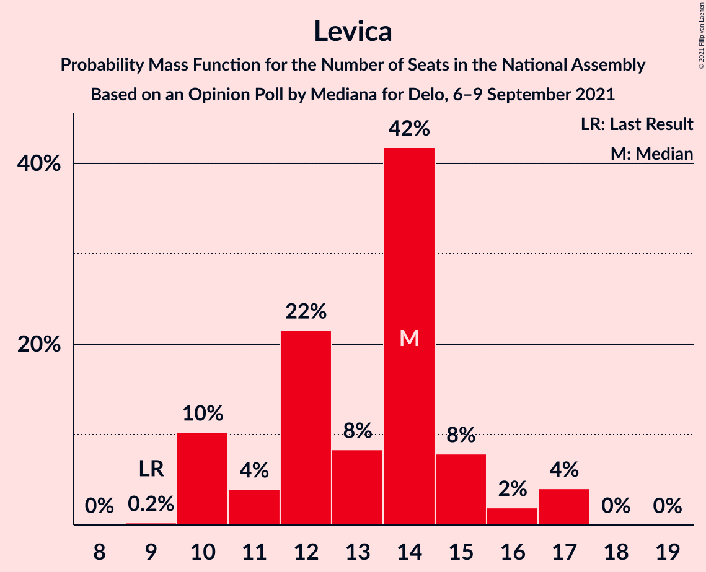
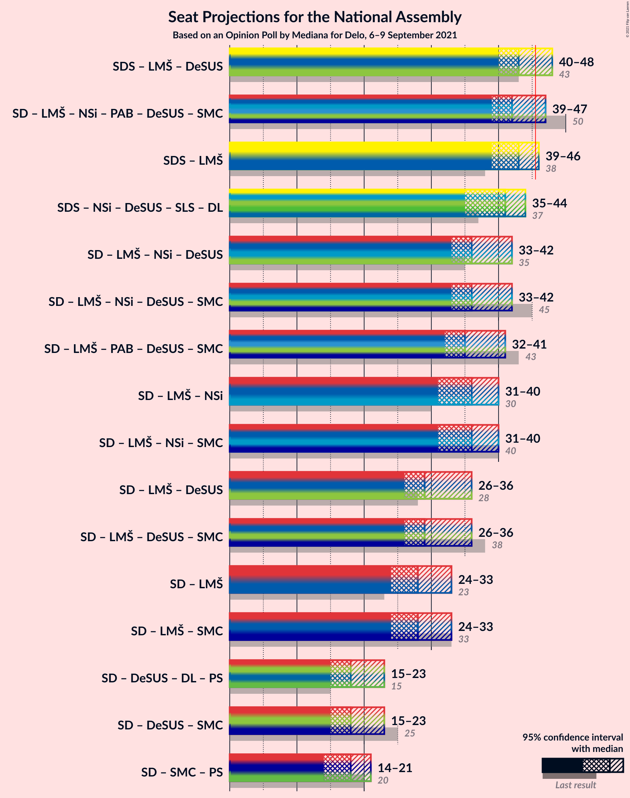
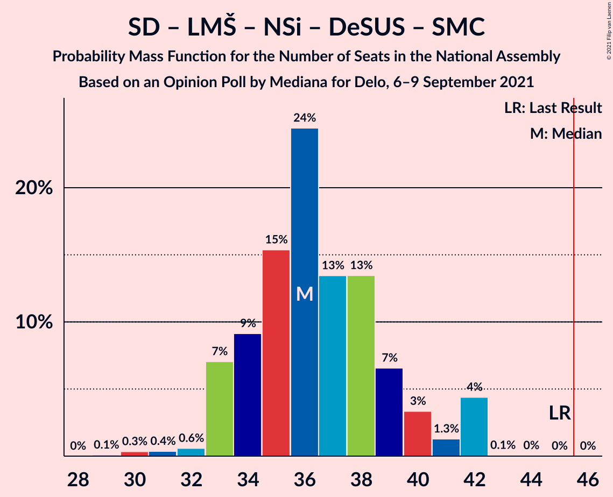
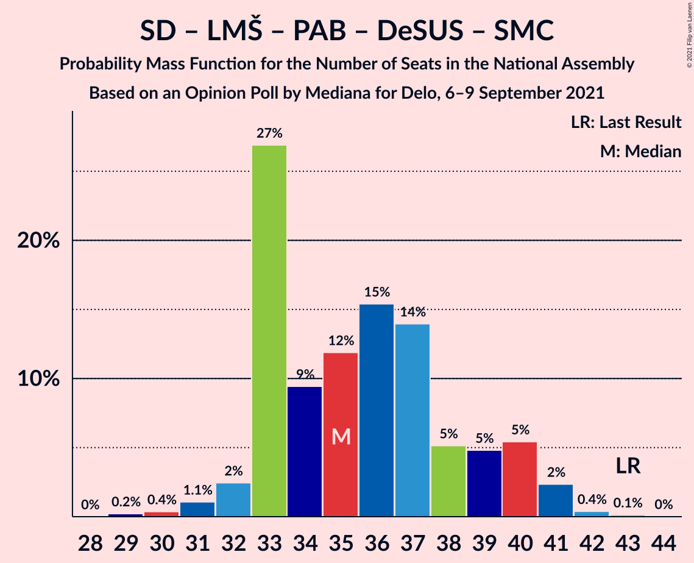
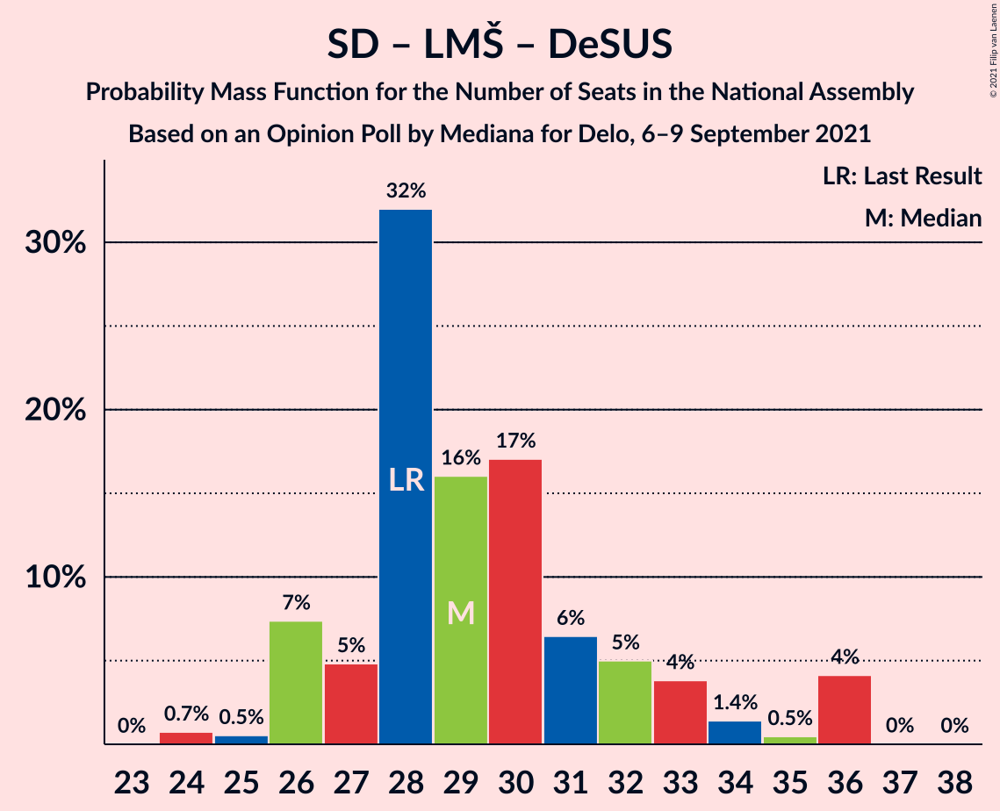
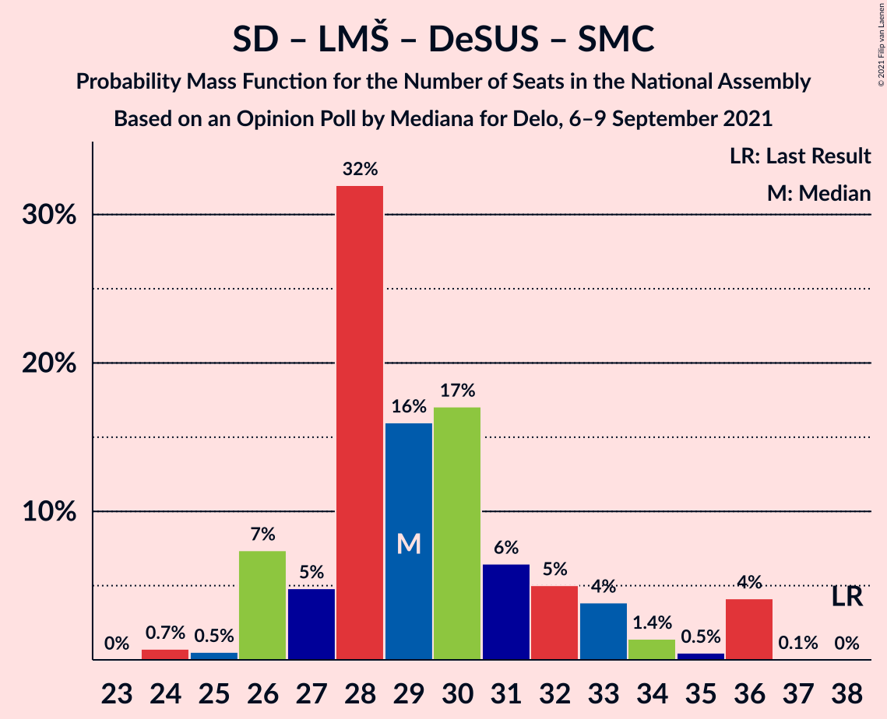

# Opinion Poll by Mediana for Delo, 6–9 September 2021

<a href="#voting-intentions">Voting Intentions</a> | <a href="#seats">Seats</a> | <a href="#coalitions">Coalitions</a> | <a href="#technical-information">Technical Information</a>

## Voting Intentions

### Confidence Intervals

| Party | Last Result | Poll Result | 80% Confidence Interval | 90% Confidence Interval | 95% Confidence Interval | 99% Confidence Interval |
|:-----:|:-----------:|:-----------:|:-----------------------:|:-----------------------:|:-----------------------:|:-----------------------:|
| Slovenska demokratska stranka | 24.9% | 30.5% | 28.4–32.8% |27.8–33.5% |27.2–34.0% |26.2–35.1% |
| Socialni demokrati | 9.9% | 17.3% | 15.6–19.2% |15.1–19.8% |14.7–20.3% |13.9–21.2% |
| Levica | 9.3% | 12.8% | 11.3–14.5% |10.9–15.0% |10.5–15.5% |9.9–16.3% |
| Lista Marjana Šarca | 12.6% | 10.5% | 9.2–12.2% |8.8–12.6% |8.5–13.0% |7.9–13.8% |
| Nova Slovenija–Krščanski demokrati | 7.2% | 6.8% | 5.7–8.1% |5.4–8.5% |5.1–8.8% |4.7–9.5% |
| Stranka Alenke Bratušek | 5.1% | 6.3% | 5.3–7.7% |5.0–8.0% |4.8–8.4% |4.3–9.1% |
| Demokratična stranka upokojencev Slovenije | 4.9% | 3.4% | 2.7–4.4% |2.4–4.7% |2.3–5.0% |2.0–5.5% |
| Slovenska nacionalna stranka | 4.2% | 2.8% | 2.2–3.8% |2.0–4.1% |1.8–4.3% |1.6–4.8% |
| Stranka modernega centra | 9.7% | 2.0% | 1.4–2.8% |1.3–3.1% |1.2–3.3% |1.0–3.7% |
| Andrej Čuš in Zeleni Slovenije | 1.1% | 1.8% | 1.3–2.7% |1.2–2.9% |1.1–3.1% |0.9–3.6% |
| Dobra država | 1.5% | 1.5% | 1.1–2.3% |1.0–2.5% |0.9–2.8% |0.7–3.2% |
| Piratska stranka Slovenije | 2.2% | 1.3% | 0.9–2.0% |0.8–2.2% |0.7–2.4% |0.5–2.8% |
| Slovenska ljudska stranka | 2.6% | 0.7% | 0.4–1.3% |0.4–1.5% |0.3–1.6% |0.2–2.0% |

*Note:* The poll result column reflects the actual value used in the calculations. Published results may vary slightly, and in addition be rounded to fewer digits.

## Seats

### Confidence Intervals

| Party | Last Result | Median | 80% Confidence Interval | 90% Confidence Interval | 95% Confidence Interval | 99% Confidence Interval |
|:-----:|:-----------:|:------:|:-----------------------:|:-----------------------:|:-----------------------:|:-----------------------:|
| <a href="#slovenska-demokratska-stranka">Slovenska demokratska stranka</a> | 25 | 32 | 29–34 |28–34 |28–36 |26–37 |
| <a href="#socialni-demokrati">Socialni demokrati</a> | 10 | 18 | 15–20 |14–21 |14–21 |14–23 |
| <a href="#levica">Levica</a> | 9 | 14 | 10–15 |10–16 |10–17 |10–17 |
| <a href="#lista-marjana-šarca">Lista Marjana Šarca</a> | 13 | 10 | 9–13 |9–13 |8–13 |8–14 |
| <a href="#nova-slovenija–krščanski-demokrati">Nova Slovenija–Krščanski demokrati</a> | 7 | 7 | 5–8 |5–8 |5–10 |4–10 |
| <a href="#stranka-alenke-bratušek">Stranka Alenke Bratušek</a> | 5 | 6 | 5–8 |5–8 |4–9 |4–10 |
| <a href="#demokratična-stranka-upokojencev-slovenije">Demokratična stranka upokojencev Slovenije</a> | 5 | 0 | 0–4 |0–4 |0–5 |0–5 |
| <a href="#slovenska-nacionalna-stranka">Slovenska nacionalna stranka</a> | 4 | 0 | 0 |0 |0 |0–5 |
| <a href="#stranka-modernega-centra">Stranka modernega centra</a> | 10 | 0 | 0 |0 |0 |0 |
| <a href="#andrej-čuš-in-zeleni-slovenije">Andrej Čuš in Zeleni Slovenije</a> | 0 | 0 | 0 |0 |0 |0 |
| <a href="#dobra-država">Dobra država</a> | 0 | 0 | 0 |0 |0 |0 |
| <a href="#piratska-stranka-slovenije">Piratska stranka Slovenije</a> | 0 | 0 | 0 |0 |0 |0 |
| <a href="#slovenska-ljudska-stranka">Slovenska ljudska stranka</a> | 0 | 0 | 0 |0 |0 |0 |

### Slovenska demokratska stranka

*For a full overview of the results for this party, see the [Slovenska demokratska stranka](party-slovenskademokratskastranka.html) page.*

| Number of Seats | Probability | Accumulated | Special Marks |
|:---------------:|:-----------:|:-----------:|:-------------:|
| 25 | 0.2% | 100% | Last Result |
| 26 | 0.3% | 99.8% |  |
| 27 | 0.6% | 99.5% |  |
| 28 | 7% | 98.9% |  |
| 29 | 4% | 92% |  |
| 30 | 6% | 88% |  |
| 31 | 8% | 82% |  |
| 32 | 26% | 74% | Median |
| 33 | 30% | 48% |  |
| 34 | 13% | 18% |  |
| 35 | 2% | 4% |  |
| 36 | 2% | 3% |  |
| 37 | 0.6% | 0.7% |  |
| 38 | 0.2% | 0.2% |  |
| 39 | 0% | 0% |  |

### Socialni demokrati

*For a full overview of the results for this party, see the [Socialni demokrati](party-socialnidemokrati.html) page.*

| Number of Seats | Probability | Accumulated | Special Marks |
|:---------------:|:-----------:|:-----------:|:-------------:|
| 10 | 0% | 100% | Last Result |
| 11 | 0% | 100% |  |
| 12 | 0% | 100% |  |
| 13 | 0.1% | 100% |  |
| 14 | 9% | 99.9% |  |
| 15 | 8% | 91% |  |
| 16 | 16% | 83% |  |
| 17 | 10% | 67% |  |
| 18 | 21% | 57% | Median |
| 19 | 22% | 36% |  |
| 20 | 4% | 14% |  |
| 21 | 8% | 10% |  |
| 22 | 0.8% | 1.3% |  |
| 23 | 0.6% | 0.6% |  |
| 24 | 0% | 0% |  |

### Levica

*For a full overview of the results for this party, see the [Levica](party-levica.html) page.*

| Number of Seats | Probability | Accumulated | Special Marks |
|:---------------:|:-----------:|:-----------:|:-------------:|
| 9 | 0.2% | 100% | Last Result |
| 10 | 10% | 99.7% |  |
| 11 | 4% | 89% |  |
| 12 | 22% | 86% |  |
| 13 | 8% | 64% |  |
| 14 | 42% | 56% | Median |
| 15 | 8% | 14% |  |
| 16 | 2% | 6% |  |
| 17 | 4% | 4% |  |
| 18 | 0% | 0.1% |  |
| 19 | 0% | 0% |  |

### Lista Marjana Šarca

*For a full overview of the results for this party, see the [Lista Marjana Šarca](party-listamarjanašarca.html) page.*

| Number of Seats | Probability | Accumulated | Special Marks |
|:---------------:|:-----------:|:-----------:|:-------------:|
| 7 | 0.2% | 100% |  |
| 8 | 4% | 99.8% |  |
| 9 | 16% | 96% |  |
| 10 | 32% | 79% | Median |
| 11 | 19% | 47% |  |
| 12 | 16% | 28% |  |
| 13 | 11% | 12% | Last Result |
| 14 | 2% | 2% |  |
| 15 | 0.1% | 0.1% |  |
| 16 | 0% | 0% |  |

### Nova Slovenija–Krščanski demokrati

*For a full overview of the results for this party, see the [Nova Slovenija–Krščanski demokrati](party-novaslovenija–krščanskidemokrati.html) page.*

| Number of Seats | Probability | Accumulated | Special Marks |
|:---------------:|:-----------:|:-----------:|:-------------:|
| 4 | 1.4% | 100% |  |
| 5 | 9% | 98.6% |  |
| 6 | 16% | 90% |  |
| 7 | 29% | 74% | Last Result, Median |
| 8 | 40% | 45% |  |
| 9 | 1.4% | 5% |  |
| 10 | 3% | 3% |  |
| 11 | 0.1% | 0.1% |  |
| 12 | 0.1% | 0.1% |  |
| 13 | 0% | 0% |  |

### Stranka Alenke Bratušek

*For a full overview of the results for this party, see the [Stranka Alenke Bratušek](party-strankaalenkebratušek.html) page.*

| Number of Seats | Probability | Accumulated | Special Marks |
|:---------------:|:-----------:|:-----------:|:-------------:|
| 0 | 0.1% | 100% |  |
| 1 | 0% | 99.9% |  |
| 2 | 0% | 99.9% |  |
| 3 | 0% | 99.9% |  |
| 4 | 4% | 99.9% |  |
| 5 | 34% | 96% | Last Result |
| 6 | 24% | 62% | Median |
| 7 | 23% | 38% |  |
| 8 | 11% | 15% |  |
| 9 | 3% | 4% |  |
| 10 | 0.5% | 0.8% |  |
| 11 | 0.3% | 0.3% |  |
| 12 | 0% | 0% |  |

### Demokratična stranka upokojencev Slovenije

*For a full overview of the results for this party, see the [Demokratična stranka upokojencev Slovenije](party-demokratičnastrankaupokojencevslovenije.html) page.*

| Number of Seats | Probability | Accumulated | Special Marks |
|:---------------:|:-----------:|:-----------:|:-------------:|
| 0 | 74% | 100% | Median |
| 1 | 0% | 26% |  |
| 2 | 0% | 26% |  |
| 3 | 0% | 26% |  |
| 4 | 23% | 26% |  |
| 5 | 2% | 3% | Last Result |
| 6 | 0.5% | 0.5% |  |
| 7 | 0% | 0% |  |

### Slovenska nacionalna stranka

*For a full overview of the results for this party, see the [Slovenska nacionalna stranka](party-slovenskanacionalnastranka.html) page.*

| Number of Seats | Probability | Accumulated | Special Marks |
|:---------------:|:-----------:|:-----------:|:-------------:|
| 0 | 98% | 100% | Median |
| 1 | 0% | 2% |  |
| 2 | 0% | 2% |  |
| 3 | 0.1% | 2% |  |
| 4 | 2% | 2% | Last Result |
| 5 | 0.5% | 0.5% |  |
| 6 | 0.1% | 0.1% |  |
| 7 | 0% | 0% |  |

### Stranka modernega centra

*For a full overview of the results for this party, see the [Stranka modernega centra](party-strankamodernegacentra.html) page.*

| Number of Seats | Probability | Accumulated | Special Marks |
|:---------------:|:-----------:|:-----------:|:-------------:|
| 0 | 99.9% | 100% | Median |
| 1 | 0% | 0.1% |  |
| 2 | 0% | 0.1% |  |
| 3 | 0% | 0.1% |  |
| 4 | 0.1% | 0.1% |  |
| 5 | 0% | 0% |  |
| 6 | 0% | 0% |  |
| 7 | 0% | 0% |  |
| 8 | 0% | 0% |  |
| 9 | 0% | 0% |  |
| 10 | 0% | 0% | Last Result |

### Andrej Čuš in Zeleni Slovenije

*For a full overview of the results for this party, see the [Andrej Čuš in Zeleni Slovenije](party-andrejčušinzelenislovenije.html) page.*

| Number of Seats | Probability | Accumulated | Special Marks |
|:---------------:|:-----------:|:-----------:|:-------------:|
| 0 | 99.9% | 100% | Last Result, Median |
| 1 | 0% | 0.1% |  |
| 2 | 0% | 0.1% |  |
| 3 | 0% | 0.1% |  |
| 4 | 0.1% | 0.1% |  |
| 5 | 0% | 0% |  |

### Dobra država

*For a full overview of the results for this party, see the [Dobra država](party-dobradržava.html) page.*

| Number of Seats | Probability | Accumulated | Special Marks |
|:---------------:|:-----------:|:-----------:|:-------------:|
| 0 | 100% | 100% | Last Result, Median |

### Piratska stranka Slovenije

*For a full overview of the results for this party, see the [Piratska stranka Slovenije](party-piratskastrankaslovenije.html) page.*

| Number of Seats | Probability | Accumulated | Special Marks |
|:---------------:|:-----------:|:-----------:|:-------------:|
| 0 | 100% | 100% | Last Result, Median |

### Slovenska ljudska stranka

*For a full overview of the results for this party, see the [Slovenska ljudska stranka](party-slovenskaljudskastranka.html) page.*

| Number of Seats | Probability | Accumulated | Special Marks |
|:---------------:|:-----------:|:-----------:|:-------------:|
| 0 | 100% | 100% | Last Result, Median |

## Coalitions

### Confidence Intervals

| Coalition | Last Result | Median | Majority? | 80% Confidence Interval | 90% Confidence Interval | 95% Confidence Interval | 99% Confidence Interval |
|:---------:|:-----------:|:------:|:---------:|:-----------------------:|:-----------------------:|:-----------------------:|:-----------------------:|
| Slovenska demokratska stranka – Lista Marjana Šarca – Demokratična stranka upokojencev Slovenije | 43 | 43 | 25% | 41–46 | 40–47 | 40–48 | 38–48 |
| Socialni demokrati – Lista Marjana Šarca – Nova Slovenija–Krščanski demokrati – Stranka Alenke Bratušek – Demokratična stranka upokojencev Slovenije – Stranka modernega centra | 50 | 42 | 11% | 40–46 | 40–46 | 39–47 | 37–48 |
| Slovenska demokratska stranka – Lista Marjana Šarca | 38 | 43 | 8% | 41–45 | 39–46 | 39–46 | 37–47 |
| Socialni demokrati – Lista Marjana Šarca – Nova Slovenija–Krščanski demokrati – Demokratična stranka upokojencev Slovenije | 35 | 36 | 0% | 34–39 | 33–41 | 33–42 | 31–42 |
| Socialni demokrati – Lista Marjana Šarca – Nova Slovenija–Krščanski demokrati – Demokratična stranka upokojencev Slovenije – Stranka modernega centra | 45 | 36 | 0% | 34–39 | 33–41 | 33–42 | 31–42 |
| Socialni demokrati – Lista Marjana Šarca – Stranka Alenke Bratušek – Demokratična stranka upokojencev Slovenije – Stranka modernega centra | 43 | 35 | 0% | 33–39 | 33–40 | 32–41 | 30–42 |
| Socialni demokrati – Lista Marjana Šarca – Nova Slovenija–Krščanski demokrati | 30 | 36 | 0% | 32–38 | 31–39 | 31–40 | 30–41 |
| Socialni demokrati – Lista Marjana Šarca – Nova Slovenija–Krščanski demokrati – Stranka modernega centra | 40 | 36 | 0% | 32–38 | 31–39 | 31–40 | 30–41 |
| Socialni demokrati – Lista Marjana Šarca – Demokratična stranka upokojencev Slovenije | 28 | 29 | 0% | 27–32 | 26–34 | 26–36 | 24–36 |
| Socialni demokrati – Lista Marjana Šarca – Demokratična stranka upokojencev Slovenije – Stranka modernega centra | 38 | 29 | 0% | 27–32 | 26–34 | 26–36 | 24–36 |
| Socialni demokrati – Lista Marjana Šarca | 23 | 28 | 0% | 25–32 | 24–32 | 24–33 | 24–34 |
| Socialni demokrati – Lista Marjana Šarca – Stranka modernega centra | 33 | 28 | 0% | 25–32 | 24–32 | 24–33 | 24–34 |
| Socialni demokrati – Demokratična stranka upokojencev Slovenije – Stranka modernega centra | 25 | 18 | 0% | 16–21 | 16–23 | 15–23 | 14–24 |

### Slovenska demokratska stranka – Lista Marjana Šarca – Demokratična stranka upokojencev Slovenije

| Number of Seats | Probability | Accumulated | Special Marks |
|:---------------:|:-----------:|:-----------:|:-------------:|
| 37 | 0.3% | 100% |  |
| 38 | 0.7% | 99.7% |  |
| 39 | 0.6% | 99.0% |  |
| 40 | 4% | 98% |  |
| 41 | 8% | 95% |  |
| 42 | 12% | 87% | Median |
| 43 | 29% | 75% | Last Result |
| 44 | 5% | 45% |  |
| 45 | 16% | 41% |  |
| 46 | 15% | 25% | Majority |
| 47 | 7% | 9% |  |
| 48 | 2% | 3% |  |
| 49 | 0.3% | 0.4% |  |
| 50 | 0.1% | 0.2% |  |
| 51 | 0.1% | 0.1% |  |
| 52 | 0% | 0% |  |

### Socialni demokrati – Lista Marjana Šarca – Nova Slovenija–Krščanski demokrati – Stranka Alenke Bratušek – Demokratična stranka upokojencev Slovenije – Stranka modernega centra

| Number of Seats | Probability | Accumulated | Special Marks |
|:---------------:|:-----------:|:-----------:|:-------------:|
| 36 | 0.4% | 100% |  |
| 37 | 0.2% | 99.6% |  |
| 38 | 1.1% | 99.4% |  |
| 39 | 3% | 98% |  |
| 40 | 8% | 96% |  |
| 41 | 22% | 87% | Median |
| 42 | 25% | 66% |  |
| 43 | 4% | 41% |  |
| 44 | 17% | 37% |  |
| 45 | 8% | 20% |  |
| 46 | 8% | 11% | Majority |
| 47 | 2% | 4% |  |
| 48 | 1.3% | 2% |  |
| 49 | 0.3% | 0.4% |  |
| 50 | 0.1% | 0.1% | Last Result |
| 51 | 0% | 0% |  |

### Slovenska demokratska stranka – Lista Marjana Šarca

| Number of Seats | Probability | Accumulated | Special Marks |
|:---------------:|:-----------:|:-----------:|:-------------:|
| 35 | 0.1% | 100% |  |
| 36 | 0.2% | 99.9% |  |
| 37 | 0.8% | 99.8% |  |
| 38 | 1.2% | 98.9% | Last Result |
| 39 | 3% | 98% |  |
| 40 | 4% | 94% |  |
| 41 | 13% | 90% |  |
| 42 | 20% | 78% | Median |
| 43 | 33% | 58% |  |
| 44 | 5% | 25% |  |
| 45 | 12% | 20% |  |
| 46 | 7% | 8% | Majority |
| 47 | 0.6% | 1.0% |  |
| 48 | 0.3% | 0.4% |  |
| 49 | 0% | 0.1% |  |
| 50 | 0% | 0% |  |

### Socialni demokrati – Lista Marjana Šarca – Nova Slovenija–Krščanski demokrati – Demokratična stranka upokojencev Slovenije

| Number of Seats | Probability | Accumulated | Special Marks |
|:---------------:|:-----------:|:-----------:|:-------------:|
| 29 | 0.1% | 100% |  |
| 30 | 0.3% | 99.9% |  |
| 31 | 0.4% | 99.6% |  |
| 32 | 0.6% | 99.2% |  |
| 33 | 7% | 98.6% |  |
| 34 | 9% | 92% |  |
| 35 | 15% | 82% | Last Result, Median |
| 36 | 24% | 67% |  |
| 37 | 13% | 43% |  |
| 38 | 13% | 29% |  |
| 39 | 7% | 16% |  |
| 40 | 3% | 9% |  |
| 41 | 1.3% | 6% |  |
| 42 | 4% | 4% |  |
| 43 | 0.1% | 0.1% |  |
| 44 | 0% | 0% |  |

### Socialni demokrati – Lista Marjana Šarca – Nova Slovenija–Krščanski demokrati – Demokratična stranka upokojencev Slovenije – Stranka modernega centra

| Number of Seats | Probability | Accumulated | Special Marks |
|:---------------:|:-----------:|:-----------:|:-------------:|
| 29 | 0.1% | 100% |  |
| 30 | 0.3% | 99.9% |  |
| 31 | 0.4% | 99.6% |  |
| 32 | 0.6% | 99.2% |  |
| 33 | 7% | 98.6% |  |
| 34 | 9% | 92% |  |
| 35 | 15% | 82% | Median |
| 36 | 24% | 67% |  |
| 37 | 13% | 43% |  |
| 38 | 13% | 29% |  |
| 39 | 7% | 16% |  |
| 40 | 3% | 9% |  |
| 41 | 1.3% | 6% |  |
| 42 | 4% | 5% |  |
| 43 | 0.1% | 0.1% |  |
| 44 | 0% | 0.1% |  |
| 45 | 0% | 0% | Last Result |

### Socialni demokrati – Lista Marjana Šarca – Stranka Alenke Bratušek – Demokratična stranka upokojencev Slovenije – Stranka modernega centra

| Number of Seats | Probability | Accumulated | Special Marks |
|:---------------:|:-----------:|:-----------:|:-------------:|
| 29 | 0.2% | 100% |  |
| 30 | 0.4% | 99.8% |  |
| 31 | 1.1% | 99.4% |  |
| 32 | 2% | 98% |  |
| 33 | 27% | 96% |  |
| 34 | 9% | 69% | Median |
| 35 | 12% | 60% |  |
| 36 | 15% | 48% |  |
| 37 | 14% | 32% |  |
| 38 | 5% | 18% |  |
| 39 | 5% | 13% |  |
| 40 | 5% | 8% |  |
| 41 | 2% | 3% |  |
| 42 | 0.4% | 0.6% |  |
| 43 | 0.1% | 0.2% | Last Result |
| 44 | 0% | 0% |  |

### Socialni demokrati – Lista Marjana Šarca – Nova Slovenija–Krščanski demokrati

| Number of Seats | Probability | Accumulated | Special Marks |
|:---------------:|:-----------:|:-----------:|:-------------:|
| 29 | 0.3% | 100% |  |
| 30 | 0.5% | 99.6% | Last Result |
| 31 | 9% | 99.1% |  |
| 32 | 3% | 90% |  |
| 33 | 7% | 87% |  |
| 34 | 17% | 80% |  |
| 35 | 8% | 63% | Median |
| 36 | 23% | 55% |  |
| 37 | 13% | 32% |  |
| 38 | 10% | 19% |  |
| 39 | 6% | 9% |  |
| 40 | 3% | 3% |  |
| 41 | 0.6% | 0.7% |  |
| 42 | 0% | 0.1% |  |
| 43 | 0% | 0% |  |

### Socialni demokrati – Lista Marjana Šarca – Nova Slovenija–Krščanski demokrati – Stranka modernega centra

| Number of Seats | Probability | Accumulated | Special Marks |
|:---------------:|:-----------:|:-----------:|:-------------:|
| 29 | 0.3% | 100% |  |
| 30 | 0.5% | 99.6% |  |
| 31 | 9% | 99.1% |  |
| 32 | 3% | 91% |  |
| 33 | 7% | 87% |  |
| 34 | 17% | 80% |  |
| 35 | 8% | 63% | Median |
| 36 | 23% | 55% |  |
| 37 | 13% | 32% |  |
| 38 | 10% | 19% |  |
| 39 | 6% | 9% |  |
| 40 | 3% | 3% | Last Result |
| 41 | 0.6% | 0.7% |  |
| 42 | 0% | 0.1% |  |
| 43 | 0% | 0% |  |

### Socialni demokrati – Lista Marjana Šarca – Demokratična stranka upokojencev Slovenije

| Number of Seats | Probability | Accumulated | Special Marks |
|:---------------:|:-----------:|:-----------:|:-------------:|
| 23 | 0% | 100% |  |
| 24 | 0.7% | 99.9% |  |
| 25 | 0.5% | 99.2% |  |
| 26 | 7% | 98.7% |  |
| 27 | 5% | 91% |  |
| 28 | 32% | 86% | Last Result, Median |
| 29 | 16% | 54% |  |
| 30 | 17% | 38% |  |
| 31 | 6% | 21% |  |
| 32 | 5% | 15% |  |
| 33 | 4% | 10% |  |
| 34 | 1.4% | 6% |  |
| 35 | 0.5% | 5% |  |
| 36 | 4% | 4% |  |
| 37 | 0% | 0.1% |  |
| 38 | 0% | 0% |  |

### Socialni demokrati – Lista Marjana Šarca – Demokratična stranka upokojencev Slovenije – Stranka modernega centra

| Number of Seats | Probability | Accumulated | Special Marks |
|:---------------:|:-----------:|:-----------:|:-------------:|
| 23 | 0% | 100% |  |
| 24 | 0.7% | 99.9% |  |
| 25 | 0.5% | 99.2% |  |
| 26 | 7% | 98.7% |  |
| 27 | 5% | 91% |  |
| 28 | 32% | 86% | Median |
| 29 | 16% | 55% |  |
| 30 | 17% | 39% |  |
| 31 | 6% | 21% |  |
| 32 | 5% | 15% |  |
| 33 | 4% | 10% |  |
| 34 | 1.4% | 6% |  |
| 35 | 0.5% | 5% |  |
| 36 | 4% | 4% |  |
| 37 | 0.1% | 0.1% |  |
| 38 | 0% | 0% | Last Result |

### Socialni demokrati – Lista Marjana Šarca

| Number of Seats | Probability | Accumulated | Special Marks |
|:---------------:|:-----------:|:-----------:|:-------------:|
| 23 | 0.1% | 100% | Last Result |
| 24 | 9% | 99.9% |  |
| 25 | 2% | 91% |  |
| 26 | 14% | 89% |  |
| 27 | 6% | 75% |  |
| 28 | 25% | 68% | Median |
| 29 | 16% | 43% |  |
| 30 | 11% | 27% |  |
| 31 | 5% | 16% |  |
| 32 | 7% | 11% |  |
| 33 | 3% | 3% |  |
| 34 | 0.6% | 0.7% |  |
| 35 | 0% | 0.1% |  |
| 36 | 0% | 0% |  |

### Socialni demokrati – Lista Marjana Šarca – Stranka modernega centra

| Number of Seats | Probability | Accumulated | Special Marks |
|:---------------:|:-----------:|:-----------:|:-------------:|
| 23 | 0.1% | 100% |  |
| 24 | 9% | 99.9% |  |
| 25 | 2% | 91% |  |
| 26 | 14% | 89% |  |
| 27 | 6% | 75% |  |
| 28 | 25% | 68% | Median |
| 29 | 16% | 43% |  |
| 30 | 11% | 27% |  |
| 31 | 5% | 16% |  |
| 32 | 7% | 11% |  |
| 33 | 3% | 3% | Last Result |
| 34 | 0.6% | 0.7% |  |
| 35 | 0% | 0.1% |  |
| 36 | 0% | 0% |  |

### Socialni demokrati – Demokratična stranka upokojencev Slovenije – Stranka modernega centra

| Number of Seats | Probability | Accumulated | Special Marks |
|:---------------:|:-----------:|:-----------:|:-------------:|
| 14 | 1.0% | 100% |  |
| 15 | 2% | 99.0% |  |
| 16 | 14% | 97% |  |
| 17 | 8% | 83% |  |
| 18 | 27% | 75% | Median |
| 19 | 24% | 49% |  |
| 20 | 6% | 25% |  |
| 21 | 10% | 19% |  |
| 22 | 3% | 10% |  |
| 23 | 5% | 7% |  |
| 24 | 0.8% | 1.3% |  |
| 25 | 0.2% | 0.5% | Last Result |
| 26 | 0.1% | 0.3% |  |
| 27 | 0.2% | 0.2% |  |
| 28 | 0% | 0% |  |

## Technical Information

### Opinion Poll

+ **Polling firm:** Mediana
+ **Commissioner(s):** Delo
+ **Fieldwork period:** 6–9 September 2021

### Calculations

+ **Sample size:** 711
+ **Simulations done:** 1,048,576
+ **Error estimate:** 2.47%

