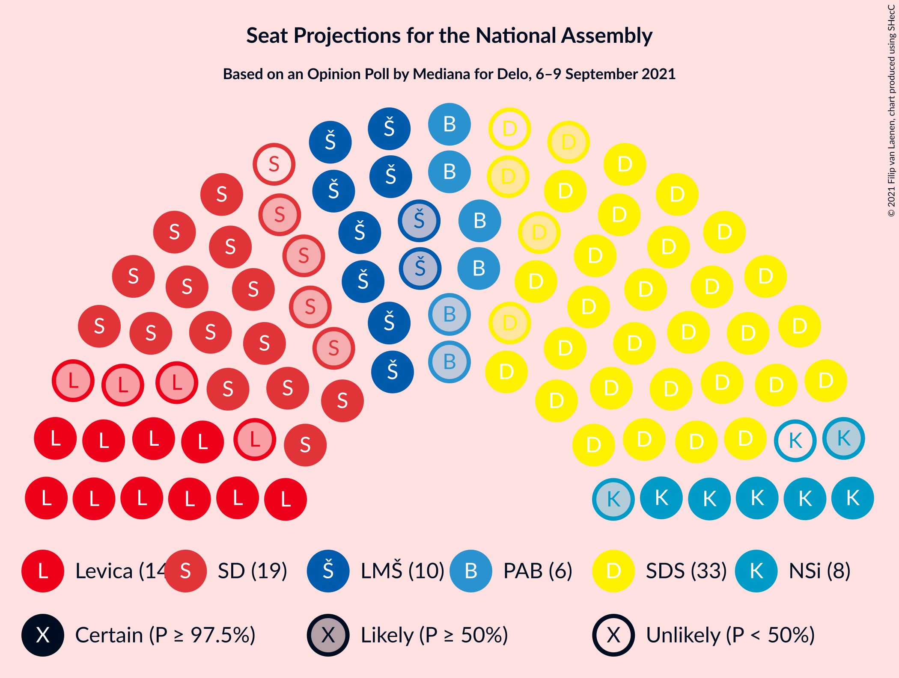
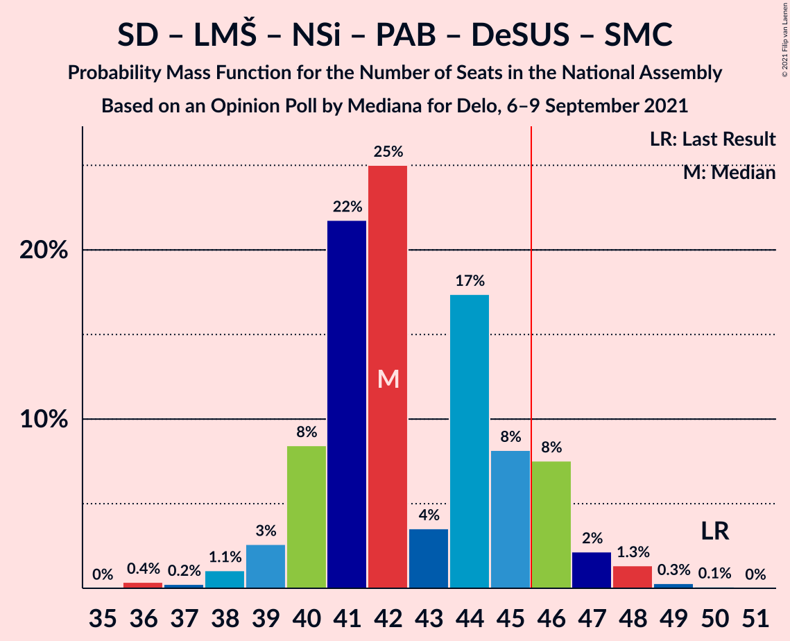
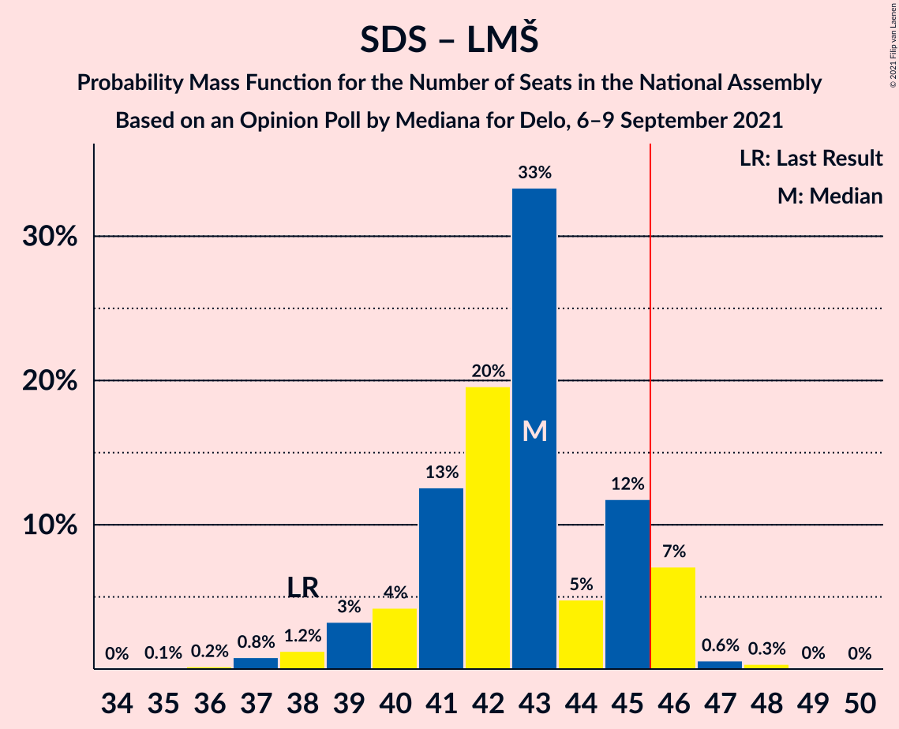
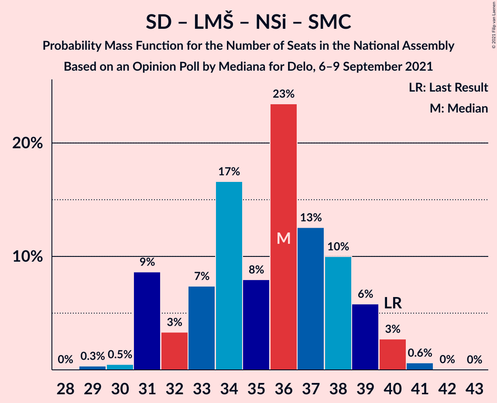

# Opinion Poll by Mediana for Delo, 6–9 September 2021

<a href="#voting-intentions">Voting Intentions</a> | <a href="#seats">Seats</a> | <a href="#coalitions">Coalitions</a> | <a href="#technical-information">Technical Information</a>

## Voting Intentions

### Confidence Intervals

| Party | Last Result | Poll Result | 80% Confidence Interval | 90% Confidence Interval | 95% Confidence Interval | 99% Confidence Interval |
|:-----:|:-----------:|:-----------:|:-----------------------:|:-----------------------:|:-----------------------:|:-----------------------:|
| Slovenska demokratska stranka | 24.9% | 30.5% | 28.4–32.8% |27.8–33.5% |27.2–34.0% |26.2–35.1% |
| Socialni demokrati | 9.9% | 17.3% | 15.6–19.2% |15.1–19.8% |14.7–20.3% |13.9–21.2% |
| Levica | 9.3% | 12.8% | 11.3–14.5% |10.9–15.0% |10.5–15.5% |9.9–16.3% |
| Lista Marjana Šarca | 12.6% | 10.5% | 9.2–12.2% |8.8–12.6% |8.5–13.0% |7.9–13.8% |
| Nova Slovenija–Krščanski demokrati | 7.2% | 6.8% | 5.7–8.1% |5.4–8.5% |5.1–8.8% |4.7–9.5% |
| Stranka Alenke Bratušek | 5.1% | 6.3% | 5.3–7.7% |5.0–8.0% |4.8–8.4% |4.3–9.1% |
| Demokratična stranka upokojencev Slovenije | 4.9% | 3.4% | 2.7–4.4% |2.4–4.7% |2.3–5.0% |2.0–5.5% |
| Slovenska nacionalna stranka | 4.2% | 2.8% | 2.2–3.8% |2.0–4.1% |1.8–4.3% |1.6–4.8% |
| Stranka modernega centra | 9.7% | 2.0% | 1.4–2.8% |1.3–3.1% |1.2–3.3% |1.0–3.7% |
| Andrej Čuš in Zeleni Slovenije | 1.1% | 1.8% | 1.3–2.7% |1.2–2.9% |1.1–3.1% |0.9–3.6% |
| Dobra država | 1.5% | 1.5% | 1.1–2.3% |1.0–2.5% |0.9–2.8% |0.7–3.2% |
| Piratska stranka Slovenije | 2.2% | 1.3% | 0.9–2.0% |0.8–2.2% |0.7–2.4% |0.5–2.8% |
| Slovenska ljudska stranka | 2.6% | 0.7% | 0.4–1.3% |0.4–1.5% |0.3–1.6% |0.2–2.0% |

*Note:* The poll result column reflects the actual value used in the calculations. Published results may vary slightly, and in addition be rounded to fewer digits.

## Seats

### Confidence Intervals

| Party | Last Result | Median | 80% Confidence Interval | 90% Confidence Interval | 95% Confidence Interval | 99% Confidence Interval |
|:-----:|:-----------:|:------:|:-----------------------:|:-----------------------:|:-----------------------:|:-----------------------:|
| <a href="#slovenska-demokratska-stranka">Slovenska demokratska stranka</a> | 25 | 33 | 32–34 |30–34 |30–34 |28–37 |
| <a href="#socialni-demokrati">Socialni demokrati</a> | 10 | 17 | 15–19 |15–20 |15–21 |15–22 |
| <a href="#levica">Levica</a> | 9 | 12 | 12–14 |10–14 |10–14 |10–15 |
| <a href="#lista-marjana-šarca">Lista Marjana Šarca</a> | 13 | 11 | 9–12 |9–13 |9–13 |8–13 |
| <a href="#nova-slovenija–krščanski-demokrati">Nova Slovenija–Krščanski demokrati</a> | 7 | 8 | 5–8 |5–8 |5–9 |5–9 |
| <a href="#stranka-alenke-bratušek">Stranka Alenke Bratušek</a> | 5 | 6 | 5–8 |5–8 |5–8 |5–9 |
| <a href="#demokratična-stranka-upokojencev-slovenije">Demokratična stranka upokojencev Slovenije</a> | 5 | 0 | 0–4 |0–4 |0–4 |0–4 |
| <a href="#slovenska-nacionalna-stranka">Slovenska nacionalna stranka</a> | 4 | 0 | 0 |0 |0–4 |0–5 |
| <a href="#stranka-modernega-centra">Stranka modernega centra</a> | 10 | 0 | 0 |0 |0 |0 |
| <a href="#andrej-čuš-in-zeleni-slovenije">Andrej Čuš in Zeleni Slovenije</a> | 0 | 0 | 0 |0 |0 |0 |
| <a href="#dobra-država">Dobra država</a> | 0 | 0 | 0 |0 |0 |0 |
| <a href="#piratska-stranka-slovenije">Piratska stranka Slovenije</a> | 0 | 0 | 0 |0 |0 |0 |
| <a href="#slovenska-ljudska-stranka">Slovenska ljudska stranka</a> | 0 | 0 | 0 |0 |0 |0 |

### Slovenska demokratska stranka

*For a full overview of the results for this party, see the [Slovenska demokratska stranka](party-slovenskademokratskastranka.html) page.*

| Number of Seats | Probability | Accumulated | Special Marks |
|:---------------:|:-----------:|:-----------:|:-------------:|
| 25 | 0% | 100% | Last Result |
| 26 | 0% | 100% |  |
| 27 | 0.2% | 99.9% |  |
| 28 | 0.7% | 99.8% |  |
| 29 | 0.5% | 99.0% |  |
| 30 | 7% | 98.6% |  |
| 31 | 2% | 92% |  |
| 32 | 28% | 90% |  |
| 33 | 36% | 62% | Median |
| 34 | 24% | 26% |  |
| 35 | 0.3% | 2% |  |
| 36 | 0.3% | 2% |  |
| 37 | 2% | 2% |  |
| 38 | 0% | 0% |  |

### Socialni demokrati

*For a full overview of the results for this party, see the [Socialni demokrati](party-socialnidemokrati.html) page.*

| Number of Seats | Probability | Accumulated | Special Marks |
|:---------------:|:-----------:|:-----------:|:-------------:|
| 10 | 0% | 100% | Last Result |
| 11 | 0% | 100% |  |
| 12 | 0% | 100% |  |
| 13 | 0% | 100% |  |
| 14 | 0% | 100% |  |
| 15 | 29% | 99.9% |  |
| 16 | 0.2% | 71% |  |
| 17 | 25% | 71% | Median |
| 18 | 2% | 46% |  |
| 19 | 35% | 44% |  |
| 20 | 6% | 9% |  |
| 21 | 1.1% | 3% |  |
| 22 | 2% | 2% |  |
| 23 | 0% | 0% |  |

### Levica

*For a full overview of the results for this party, see the [Levica](party-levica.html) page.*

| Number of Seats | Probability | Accumulated | Special Marks |
|:---------------:|:-----------:|:-----------:|:-------------:|
| 9 | 0% | 100% | Last Result |
| 10 | 7% | 100% |  |
| 11 | 3% | 93% |  |
| 12 | 53% | 91% | Median |
| 13 | 2% | 38% |  |
| 14 | 34% | 36% |  |
| 15 | 2% | 2% |  |
| 16 | 0.2% | 0.2% |  |
| 17 | 0% | 0.1% |  |
| 18 | 0% | 0% |  |

### Lista Marjana Šarca

*For a full overview of the results for this party, see the [Lista Marjana Šarca](party-listamarjanašarca.html) page.*

| Number of Seats | Probability | Accumulated | Special Marks |
|:---------------:|:-----------:|:-----------:|:-------------:|
| 7 | 0.2% | 100% |  |
| 8 | 2% | 99.8% |  |
| 9 | 36% | 98% |  |
| 10 | 2% | 62% |  |
| 11 | 28% | 60% | Median |
| 12 | 26% | 32% |  |
| 13 | 5% | 6% | Last Result |
| 14 | 0.2% | 0.2% |  |
| 15 | 0% | 0% |  |

### Nova Slovenija–Krščanski demokrati

*For a full overview of the results for this party, see the [Nova Slovenija–Krščanski demokrati](party-novaslovenija–krščanskidemokrati.html) page.*

| Number of Seats | Probability | Accumulated | Special Marks |
|:---------------:|:-----------:|:-----------:|:-------------:|
| 4 | 0.1% | 100% |  |
| 5 | 27% | 99.9% |  |
| 6 | 2% | 73% |  |
| 7 | 8% | 71% | Last Result |
| 8 | 60% | 63% | Median |
| 9 | 3% | 3% |  |
| 10 | 0.2% | 0.3% |  |
| 11 | 0% | 0.2% |  |
| 12 | 0.2% | 0.2% |  |
| 13 | 0% | 0% |  |

### Stranka Alenke Bratušek

*For a full overview of the results for this party, see the [Stranka Alenke Bratušek](party-strankaalenkebratušek.html) page.*

| Number of Seats | Probability | Accumulated | Special Marks |
|:---------------:|:-----------:|:-----------:|:-------------:|
| 4 | 0.1% | 100% |  |
| 5 | 37% | 99.9% | Last Result |
| 6 | 30% | 63% | Median |
| 7 | 3% | 33% |  |
| 8 | 30% | 30% |  |
| 9 | 0.6% | 0.6% |  |
| 10 | 0% | 0% |  |

### Demokratična stranka upokojencev Slovenije

*For a full overview of the results for this party, see the [Demokratična stranka upokojencev Slovenije](party-demokratičnastrankaupokojencevslovenije.html) page.*

| Number of Seats | Probability | Accumulated | Special Marks |
|:---------------:|:-----------:|:-----------:|:-------------:|
| 0 | 73% | 100% | Median |
| 1 | 0% | 27% |  |
| 2 | 0% | 27% |  |
| 3 | 0% | 27% |  |
| 4 | 27% | 27% |  |
| 5 | 0.3% | 0.5% | Last Result |
| 6 | 0.2% | 0.2% |  |
| 7 | 0% | 0% |  |

### Slovenska nacionalna stranka

*For a full overview of the results for this party, see the [Slovenska nacionalna stranka](party-slovenskanacionalnastranka.html) page.*

| Number of Seats | Probability | Accumulated | Special Marks |
|:---------------:|:-----------:|:-----------:|:-------------:|
| 0 | 97% | 100% | Median |
| 1 | 0% | 3% |  |
| 2 | 0% | 3% |  |
| 3 | 0% | 3% |  |
| 4 | 1.5% | 3% | Last Result |
| 5 | 2% | 2% |  |
| 6 | 0.1% | 0.1% |  |
| 7 | 0% | 0% |  |

### Stranka modernega centra

*For a full overview of the results for this party, see the [Stranka modernega centra](party-strankamodernegacentra.html) page.*

| Number of Seats | Probability | Accumulated | Special Marks |
|:---------------:|:-----------:|:-----------:|:-------------:|
| 0 | 99.9% | 100% | Median |
| 1 | 0% | 0.1% |  |
| 2 | 0% | 0.1% |  |
| 3 | 0% | 0.1% |  |
| 4 | 0.1% | 0.1% |  |
| 5 | 0% | 0% |  |
| 6 | 0% | 0% |  |
| 7 | 0% | 0% |  |
| 8 | 0% | 0% |  |
| 9 | 0% | 0% |  |
| 10 | 0% | 0% | Last Result |

### Andrej Čuš in Zeleni Slovenije

*For a full overview of the results for this party, see the [Andrej Čuš in Zeleni Slovenije](party-andrejčušinzelenislovenije.html) page.*

| Number of Seats | Probability | Accumulated | Special Marks |
|:---------------:|:-----------:|:-----------:|:-------------:|
| 0 | 99.8% | 100% | Last Result, Median |
| 1 | 0% | 0.2% |  |
| 2 | 0% | 0.2% |  |
| 3 | 0% | 0.2% |  |
| 4 | 0.2% | 0.2% |  |
| 5 | 0% | 0% |  |

### Dobra država

*For a full overview of the results for this party, see the [Dobra država](party-dobradržava.html) page.*

| Number of Seats | Probability | Accumulated | Special Marks |
|:---------------:|:-----------:|:-----------:|:-------------:|
| 0 | 100% | 100% | Last Result, Median |

### Piratska stranka Slovenije

*For a full overview of the results for this party, see the [Piratska stranka Slovenije](party-piratskastrankaslovenije.html) page.*

| Number of Seats | Probability | Accumulated | Special Marks |
|:---------------:|:-----------:|:-----------:|:-------------:|
| 0 | 100% | 100% | Last Result, Median |

### Slovenska ljudska stranka

*For a full overview of the results for this party, see the [Slovenska ljudska stranka](party-slovenskaljudskastranka.html) page.*

| Number of Seats | Probability | Accumulated | Special Marks |
|:---------------:|:-----------:|:-----------:|:-------------:|
| 0 | 100% | 100% | Last Result, Median |

## Coalitions

### Confidence Intervals

| Coalition | Last Result | Median | Majority? | 80% Confidence Interval | 90% Confidence Interval | 95% Confidence Interval | 99% Confidence Interval |
|:---------:|:-----------:|:------:|:---------:|:-----------------------:|:-----------------------:|:-----------------------:|:-----------------------:|
| Socialni demokrati – Lista Marjana Šarca – Nova Slovenija–Krščanski demokrati – Stranka Alenke Bratušek – Demokratična stranka upokojencev Slovenije – Stranka modernega centra | 50 | 42 | 6% | 41–44 | 41–48 | 39–48 | 36–48 |
| Slovenska demokratska stranka – Lista Marjana Šarca – Demokratična stranka upokojencev Slovenije | 43 | 46 | 52% | 42–47 | 42–47 | 41–47 | 38–49 |
| Slovenska demokratska stranka – Lista Marjana Šarca | 38 | 43 | 26% | 42–46 | 41–46 | 40–46 | 38–47 |
| Socialni demokrati – Lista Marjana Šarca – Stranka Alenke Bratušek – Demokratična stranka upokojencev Slovenije – Stranka modernega centra | 43 | 36 | 0% | 33–37 | 33–41 | 32–41 | 29–41 |
| Socialni demokrati – Lista Marjana Šarca – Nova Slovenija–Krščanski demokrati – Demokratična stranka upokojencev Slovenije | 35 | 36 | 0% | 34–38 | 34–40 | 33–40 | 30–40 |
| Socialni demokrati – Lista Marjana Šarca – Nova Slovenija–Krščanski demokrati – Demokratična stranka upokojencev Slovenije – Stranka modernega centra | 45 | 36 | 0% | 34–38 | 34–40 | 33–40 | 30–40 |
| Socialni demokrati – Lista Marjana Šarca – Nova Slovenija–Krščanski demokrati | 30 | 34 | 0% | 34–36 | 34–40 | 33–40 | 30–40 |
| Socialni demokrati – Lista Marjana Šarca – Nova Slovenija–Krščanski demokrati – Stranka modernega centra | 40 | 34 | 0% | 34–36 | 34–40 | 33–40 | 30–40 |
| Socialni demokrati – Lista Marjana Šarca – Demokratična stranka upokojencev Slovenije | 28 | 29 | 0% | 28–30 | 28–33 | 26–33 | 24–33 |
| Socialni demokrati – Lista Marjana Šarca – Demokratična stranka upokojencev Slovenije – Stranka modernega centra | 38 | 29 | 0% | 28–30 | 28–33 | 26–33 | 24–33 |
| Socialni demokrati – Lista Marjana Šarca | 23 | 28 | 0% | 26–29 | 26–33 | 25–33 | 24–33 |
| Socialni demokrati – Lista Marjana Šarca – Stranka modernega centra | 33 | 28 | 0% | 26–29 | 26–33 | 25–33 | 24–33 |
| Socialni demokrati – Demokratična stranka upokojencev Slovenije – Stranka modernega centra | 25 | 19 | 0% | 17–20 | 17–20 | 15–21 | 15–23 |

### Socialni demokrati – Lista Marjana Šarca – Nova Slovenija–Krščanski demokrati – Stranka Alenke Bratušek – Demokratična stranka upokojencev Slovenije – Stranka modernega centra

| Number of Seats | Probability | Accumulated | Special Marks |
|:---------------:|:-----------:|:-----------:|:-------------:|
| 36 | 1.4% | 100% |  |
| 37 | 0.3% | 98.6% |  |
| 38 | 0.8% | 98% |  |
| 39 | 1.1% | 98% |  |
| 40 | 0.5% | 96% |  |
| 41 | 33% | 96% |  |
| 42 | 24% | 63% | Median |
| 43 | 2% | 38% |  |
| 44 | 28% | 37% |  |
| 45 | 3% | 9% |  |
| 46 | 0.2% | 6% | Majority |
| 47 | 0.7% | 6% |  |
| 48 | 5% | 5% |  |
| 49 | 0% | 0% |  |
| 50 | 0% | 0% | Last Result |

### Slovenska demokratska stranka – Lista Marjana Šarca – Demokratična stranka upokojencev Slovenije

| Number of Seats | Probability | Accumulated | Special Marks |
|:---------------:|:-----------:|:-----------:|:-------------:|
| 38 | 1.5% | 100% |  |
| 39 | 0.5% | 98.5% |  |
| 40 | 0.5% | 98% |  |
| 41 | 2% | 98% |  |
| 42 | 34% | 96% |  |
| 43 | 7% | 62% | Last Result |
| 44 | 2% | 55% | Median |
| 45 | 0.5% | 53% |  |
| 46 | 25% | 52% | Majority |
| 47 | 27% | 27% |  |
| 48 | 0.1% | 0.6% |  |
| 49 | 0.4% | 0.5% |  |
| 50 | 0.1% | 0.1% |  |
| 51 | 0% | 0% |  |

### Slovenska demokratska stranka – Lista Marjana Šarca

| Number of Seats | Probability | Accumulated | Special Marks |
|:---------------:|:-----------:|:-----------:|:-------------:|
| 36 | 0% | 100% |  |
| 37 | 0% | 99.9% |  |
| 38 | 2% | 99.9% | Last Result |
| 39 | 0.7% | 98% |  |
| 40 | 1.0% | 98% |  |
| 41 | 2% | 97% |  |
| 42 | 34% | 95% |  |
| 43 | 33% | 61% |  |
| 44 | 2% | 28% | Median |
| 45 | 0.7% | 27% |  |
| 46 | 25% | 26% | Majority |
| 47 | 1.0% | 1.0% |  |
| 48 | 0% | 0.1% |  |
| 49 | 0% | 0% |  |

### Socialni demokrati – Lista Marjana Šarca – Stranka Alenke Bratušek – Demokratična stranka upokojencev Slovenije – Stranka modernega centra

| Number of Seats | Probability | Accumulated | Special Marks |
|:---------------:|:-----------:|:-----------:|:-------------:|
| 29 | 0.7% | 100% |  |
| 30 | 1.4% | 99.2% |  |
| 31 | 0.1% | 98% |  |
| 32 | 0.6% | 98% |  |
| 33 | 32% | 97% |  |
| 34 | 3% | 65% | Median |
| 35 | 0.9% | 62% |  |
| 36 | 27% | 61% |  |
| 37 | 26% | 34% |  |
| 38 | 2% | 8% |  |
| 39 | 0.1% | 6% |  |
| 40 | 0.2% | 6% |  |
| 41 | 6% | 6% |  |
| 42 | 0.2% | 0.3% |  |
| 43 | 0% | 0% | Last Result |

### Socialni demokrati – Lista Marjana Šarca – Nova Slovenija–Krščanski demokrati – Demokratična stranka upokojencev Slovenije

| Number of Seats | Probability | Accumulated | Special Marks |
|:---------------:|:-----------:|:-----------:|:-------------:|
| 29 | 0.2% | 100% |  |
| 30 | 1.4% | 99.8% |  |
| 31 | 0.1% | 98% |  |
| 32 | 0% | 98% |  |
| 33 | 1.2% | 98% |  |
| 34 | 25% | 97% |  |
| 35 | 1.2% | 72% | Last Result |
| 36 | 34% | 71% | Median |
| 37 | 1.2% | 37% |  |
| 38 | 27% | 35% |  |
| 39 | 0.9% | 8% |  |
| 40 | 7% | 8% |  |
| 41 | 0.3% | 0.4% |  |
| 42 | 0.1% | 0.1% |  |
| 43 | 0% | 0% |  |

### Socialni demokrati – Lista Marjana Šarca – Nova Slovenija–Krščanski demokrati – Demokratična stranka upokojencev Slovenije – Stranka modernega centra

| Number of Seats | Probability | Accumulated | Special Marks |
|:---------------:|:-----------:|:-----------:|:-------------:|
| 29 | 0.2% | 100% |  |
| 30 | 1.4% | 99.8% |  |
| 31 | 0.1% | 98% |  |
| 32 | 0% | 98% |  |
| 33 | 1.2% | 98% |  |
| 34 | 25% | 97% |  |
| 35 | 1.2% | 72% |  |
| 36 | 34% | 71% | Median |
| 37 | 1.2% | 37% |  |
| 38 | 27% | 35% |  |
| 39 | 0.9% | 9% |  |
| 40 | 7% | 8% |  |
| 41 | 0.3% | 0.5% |  |
| 42 | 0.1% | 0.2% |  |
| 43 | 0% | 0% |  |
| 44 | 0% | 0% |  |
| 45 | 0% | 0% | Last Result |

### Socialni demokrati – Lista Marjana Šarca – Nova Slovenija–Krščanski demokrati

| Number of Seats | Probability | Accumulated | Special Marks |
|:---------------:|:-----------:|:-----------:|:-------------:|
| 29 | 0.2% | 100% |  |
| 30 | 1.5% | 99.8% | Last Result |
| 31 | 0.1% | 98% |  |
| 32 | 0.1% | 98% |  |
| 33 | 1.4% | 98% |  |
| 34 | 51% | 97% |  |
| 35 | 2% | 46% |  |
| 36 | 34% | 44% | Median |
| 37 | 1.4% | 10% |  |
| 38 | 1.2% | 8% |  |
| 39 | 0% | 7% |  |
| 40 | 7% | 7% |  |
| 41 | 0% | 0.1% |  |
| 42 | 0.1% | 0.1% |  |
| 43 | 0% | 0% |  |

### Socialni demokrati – Lista Marjana Šarca – Nova Slovenija–Krščanski demokrati – Stranka modernega centra

| Number of Seats | Probability | Accumulated | Special Marks |
|:---------------:|:-----------:|:-----------:|:-------------:|
| 29 | 0.2% | 100% |  |
| 30 | 1.5% | 99.8% |  |
| 31 | 0.1% | 98% |  |
| 32 | 0.1% | 98% |  |
| 33 | 1.4% | 98% |  |
| 34 | 51% | 97% |  |
| 35 | 2% | 46% |  |
| 36 | 34% | 44% | Median |
| 37 | 1.4% | 10% |  |
| 38 | 1.2% | 8% |  |
| 39 | 0.1% | 7% |  |
| 40 | 7% | 7% | Last Result |
| 41 | 0% | 0.1% |  |
| 42 | 0.1% | 0.1% |  |
| 43 | 0% | 0% |  |

### Socialni demokrati – Lista Marjana Šarca – Demokratična stranka upokojencev Slovenije

| Number of Seats | Probability | Accumulated | Special Marks |
|:---------------:|:-----------:|:-----------:|:-------------:|
| 24 | 2% | 100% |  |
| 25 | 0.1% | 98% |  |
| 26 | 0.3% | 98% |  |
| 27 | 2% | 97% |  |
| 28 | 34% | 95% | Last Result, Median |
| 29 | 25% | 62% |  |
| 30 | 27% | 36% |  |
| 31 | 1.2% | 9% |  |
| 32 | 0.6% | 8% |  |
| 33 | 7% | 8% |  |
| 34 | 0% | 0.5% |  |
| 35 | 0.3% | 0.4% |  |
| 36 | 0.1% | 0.1% |  |
| 37 | 0% | 0% |  |

### Socialni demokrati – Lista Marjana Šarca – Demokratična stranka upokojencev Slovenije – Stranka modernega centra

| Number of Seats | Probability | Accumulated | Special Marks |
|:---------------:|:-----------:|:-----------:|:-------------:|
| 24 | 2% | 100% |  |
| 25 | 0.1% | 98% |  |
| 26 | 0.3% | 98% |  |
| 27 | 2% | 97% |  |
| 28 | 34% | 95% | Median |
| 29 | 25% | 62% |  |
| 30 | 27% | 36% |  |
| 31 | 1.2% | 9% |  |
| 32 | 0.6% | 8% |  |
| 33 | 7% | 8% |  |
| 34 | 0% | 0.5% |  |
| 35 | 0.3% | 0.5% |  |
| 36 | 0.2% | 0.2% |  |
| 37 | 0% | 0% |  |
| 38 | 0% | 0% | Last Result |

### Socialni demokrati – Lista Marjana Šarca

| Number of Seats | Probability | Accumulated | Special Marks |
|:---------------:|:-----------:|:-----------:|:-------------:|
| 23 | 0% | 100% | Last Result |
| 24 | 2% | 100% |  |
| 25 | 0.2% | 98% |  |
| 26 | 26% | 97% |  |
| 27 | 2% | 71% |  |
| 28 | 34% | 69% | Median |
| 29 | 26% | 35% |  |
| 30 | 1.2% | 9% |  |
| 31 | 0.9% | 8% |  |
| 32 | 0.7% | 7% |  |
| 33 | 7% | 7% |  |
| 34 | 0% | 0% |  |

### Socialni demokrati – Lista Marjana Šarca – Stranka modernega centra

| Number of Seats | Probability | Accumulated | Special Marks |
|:---------------:|:-----------:|:-----------:|:-------------:|
| 24 | 2% | 100% |  |
| 25 | 0.2% | 98% |  |
| 26 | 26% | 97% |  |
| 27 | 2% | 71% |  |
| 28 | 34% | 69% | Median |
| 29 | 26% | 35% |  |
| 30 | 1.2% | 10% |  |
| 31 | 0.9% | 8% |  |
| 32 | 0.7% | 7% |  |
| 33 | 7% | 7% | Last Result |
| 34 | 0% | 0% |  |

### Socialni demokrati – Demokratična stranka upokojencev Slovenije – Stranka modernega centra

| Number of Seats | Probability | Accumulated | Special Marks |
|:---------------:|:-----------:|:-----------:|:-------------:|
| 15 | 3% | 100% |  |
| 16 | 0.1% | 97% |  |
| 17 | 25% | 97% | Median |
| 18 | 1.5% | 73% |  |
| 19 | 61% | 71% |  |
| 20 | 6% | 10% |  |
| 21 | 1.5% | 4% |  |
| 22 | 2% | 2% |  |
| 23 | 0% | 0.5% |  |
| 24 | 0.3% | 0.5% |  |
| 25 | 0.1% | 0.2% | Last Result |
| 26 | 0% | 0% |  |

## Technical Information

### Opinion Poll

+ **Polling firm:** Mediana
+ **Commissioner(s):** Delo
+ **Fieldwork period:** 6–9 September 2021

### Calculations

+ **Sample size:** 711
+ **Simulations done:** 131,072
+ **Error estimate:** 3.54%

