# Opinion Poll by Mediana for POP TV, 1–26 September 2021

<a href="#voting-intentions">Voting Intentions</a> | <a href="#seats">Seats</a> | <a href="#coalitions">Coalitions</a> | <a href="#technical-information">Technical Information</a>

## Voting Intentions

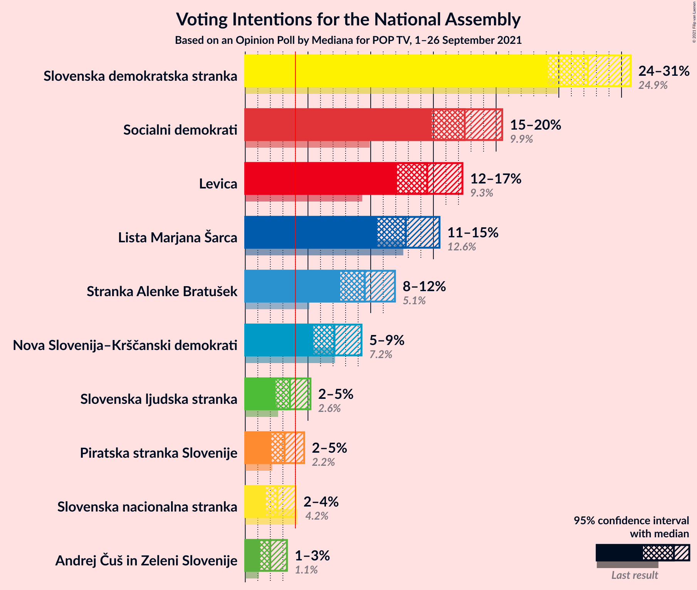

### Confidence Intervals

| Party | Last Result | Poll Result | 80% Confidence Interval | 90% Confidence Interval | 95% Confidence Interval | 99% Confidence Interval |
|:-----:|:-----------:|:-----------:|:-----------------------:|:-----------------------:|:-----------------------:|:-----------------------:|
| Slovenska demokratska stranka | 24.9% | 27.3% | 25.2–29.6% |24.6–30.2% |24.1–30.7% |23.2–31.8% |
| Socialni demokrati | 9.9% | 17.5% | 15.8–19.4% |15.3–20.0% |14.9–20.5% |14.1–21.5% |
| Levica | 9.3% | 14.5% | 12.9–16.3% |12.5–16.9% |12.1–17.3% |11.4–18.2% |
| Lista Marjana Šarca | 12.6% | 12.8% | 11.3–14.6% |10.9–15.0% |10.5–15.5% |9.8–16.4% |
| Stranka Alenke Bratušek | 5.1% | 9.5% | 8.2–11.1% |7.9–11.5% |7.6–11.9% |7.0–12.7% |
| Nova Slovenija–Krščanski demokrati | 7.2% | 7.1% | 6.0–8.5% |5.7–8.9% |5.4–9.3% |5.0–10.0% |
| Slovenska ljudska stranka | 2.6% | 3.6% | 2.8–4.6% |2.6–4.9% |2.4–5.2% |2.1–5.8% |
| Piratska stranka Slovenije | 2.2% | 3.1% | 2.4–4.1% |2.2–4.4% |2.1–4.7% |1.8–5.2% |
| Slovenska nacionalna stranka | 4.2% | 2.6% | 1.9–3.5% |1.8–3.8% |1.6–4.0% |1.4–4.5% |
| Andrej Čuš in Zeleni Slovenije | 1.1% | 2.0% | 1.5–2.9% |1.3–3.1% |1.2–3.3% |1.0–3.8% |

*Note:* The poll result column reflects the actual value used in the calculations. Published results may vary slightly, and in addition be rounded to fewer digits.

## Seats

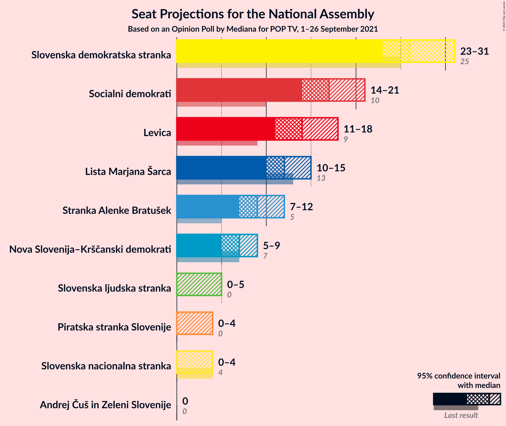

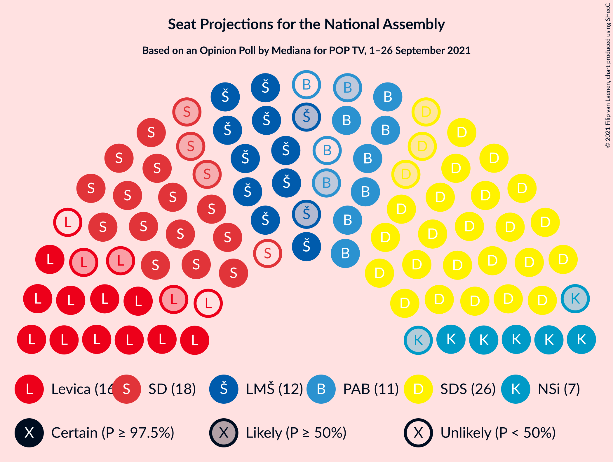

### Confidence Intervals

| Party | Last Result | Median | 80% Confidence Interval | 90% Confidence Interval | 95% Confidence Interval | 99% Confidence Interval |
|:-----:|:-----------:|:------:|:-----------------------:|:-----------------------:|:-----------------------:|:-----------------------:|
| <a href="#slovenska-demokratska-stranka">Slovenska demokratska stranka</a> | 25 | 26 | 25–29 |24–31 |23–31 |22–32 |
| <a href="#socialni-demokrati">Socialni demokrati</a> | 10 | 17 | 15–18 |15–20 |14–21 |14–21 |
| <a href="#levica">Levica</a> | 9 | 14 | 12–16 |12–17 |11–18 |11–18 |
| <a href="#lista-marjana-šarca">Lista Marjana Šarca</a> | 13 | 12 | 11–14 |11–14 |10–15 |9–16 |
| <a href="#stranka-alenke-bratušek">Stranka Alenke Bratušek</a> | 5 | 9 | 8–11 |7–11 |7–12 |7–12 |
| <a href="#nova-slovenija–krščanski-demokrati">Nova Slovenija–Krščanski demokrati</a> | 7 | 7 | 5–8 |5–8 |5–9 |4–10 |
| <a href="#slovenska-ljudska-stranka">Slovenska ljudska stranka</a> | 0 | 0 | 0–4 |0–4 |0–5 |0–5 |
| <a href="#piratska-stranka-slovenije">Piratska stranka Slovenije</a> | 0 | 0 | 0 |0–4 |0–4 |0–5 |
| <a href="#slovenska-nacionalna-stranka">Slovenska nacionalna stranka</a> | 4 | 0 | 0 |0 |0–4 |0–4 |
| <a href="#andrej-čuš-in-zeleni-slovenije">Andrej Čuš in Zeleni Slovenije</a> | 0 | 0 | 0 |0 |0 |0 |

### Slovenska demokratska stranka

*For a full overview of the results for this party, see the [Slovenska demokratska stranka](party-slovenskademokratskastranka.html) page.*

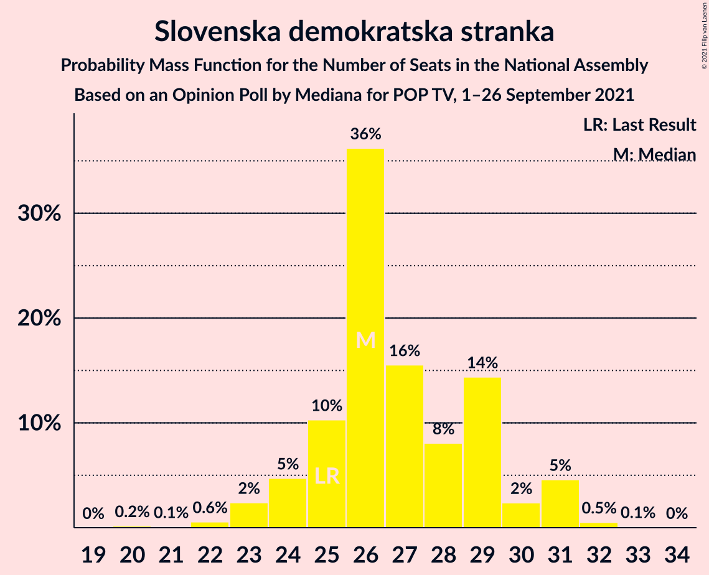

| Number of Seats | Probability | Accumulated | Special Marks |
|:---------------:|:-----------:|:-----------:|:-------------:|
| 20 | 0.2% | 100% |  |
| 21 | 0.1% | 99.8% |  |
| 22 | 0.6% | 99.7% |  |
| 23 | 2% | 99.2% |  |
| 24 | 5% | 97% |  |
| 25 | 10% | 92% | Last Result |
| 26 | 36% | 82% | Median |
| 27 | 16% | 46% |  |
| 28 | 8% | 30% |  |
| 29 | 14% | 22% |  |
| 30 | 2% | 8% |  |
| 31 | 5% | 5% |  |
| 32 | 0.5% | 0.6% |  |
| 33 | 0.1% | 0.1% |  |
| 34 | 0% | 0% |  |

### Socialni demokrati

*For a full overview of the results for this party, see the [Socialni demokrati](party-socialnidemokrati.html) page.*

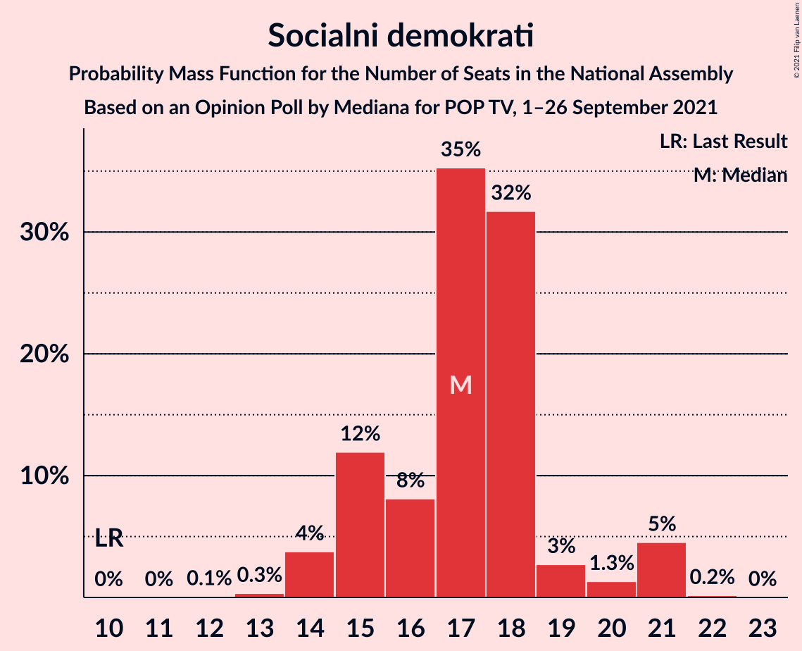

| Number of Seats | Probability | Accumulated | Special Marks |
|:---------------:|:-----------:|:-----------:|:-------------:|
| 10 | 0% | 100% | Last Result |
| 11 | 0% | 100% |  |
| 12 | 0.1% | 100% |  |
| 13 | 0.3% | 99.9% |  |
| 14 | 4% | 99.6% |  |
| 15 | 12% | 96% |  |
| 16 | 8% | 84% |  |
| 17 | 35% | 76% | Median |
| 18 | 32% | 40% |  |
| 19 | 3% | 9% |  |
| 20 | 1.3% | 6% |  |
| 21 | 5% | 5% |  |
| 22 | 0.2% | 0.2% |  |
| 23 | 0% | 0% |  |

### Levica

*For a full overview of the results for this party, see the [Levica](party-levica.html) page.*

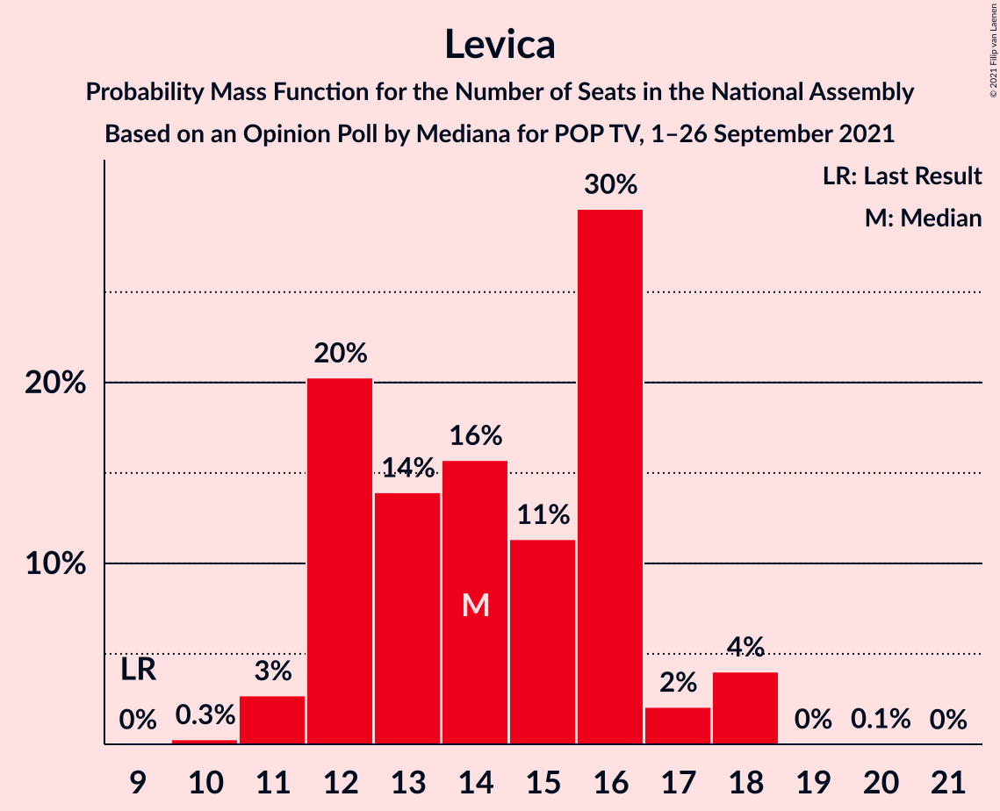

| Number of Seats | Probability | Accumulated | Special Marks |
|:---------------:|:-----------:|:-----------:|:-------------:|
| 9 | 0% | 100% | Last Result |
| 10 | 0.3% | 100% |  |
| 11 | 3% | 99.7% |  |
| 12 | 20% | 97% |  |
| 13 | 14% | 77% |  |
| 14 | 16% | 63% | Median |
| 15 | 11% | 47% |  |
| 16 | 30% | 36% |  |
| 17 | 2% | 6% |  |
| 18 | 4% | 4% |  |
| 19 | 0% | 0.1% |  |
| 20 | 0.1% | 0.1% |  |
| 21 | 0% | 0% |  |

### Lista Marjana Šarca

*For a full overview of the results for this party, see the [Lista Marjana Šarca](party-listamarjanašarca.html) page.*

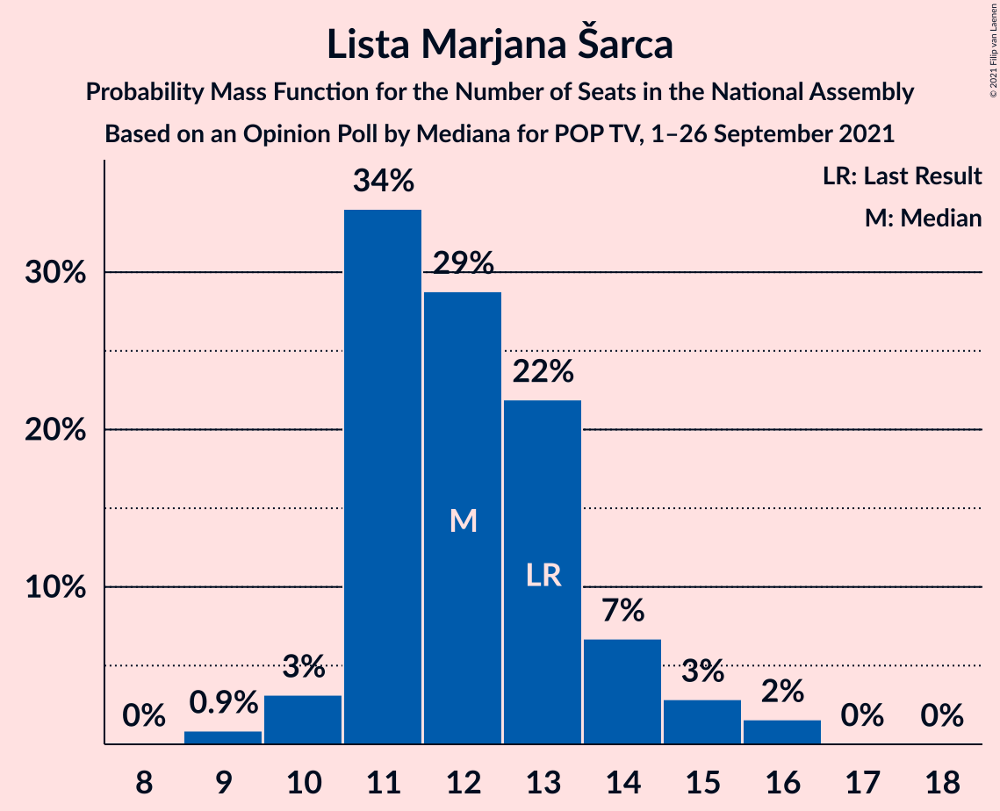

| Number of Seats | Probability | Accumulated | Special Marks |
|:---------------:|:-----------:|:-----------:|:-------------:|
| 9 | 0.9% | 100% |  |
| 10 | 3% | 99.1% |  |
| 11 | 34% | 96% |  |
| 12 | 29% | 62% | Median |
| 13 | 22% | 33% | Last Result |
| 14 | 7% | 11% |  |
| 15 | 3% | 5% |  |
| 16 | 2% | 2% |  |
| 17 | 0% | 0.1% |  |
| 18 | 0% | 0% |  |

### Stranka Alenke Bratušek

*For a full overview of the results for this party, see the [Stranka Alenke Bratušek](party-strankaalenkebratušek.html) page.*

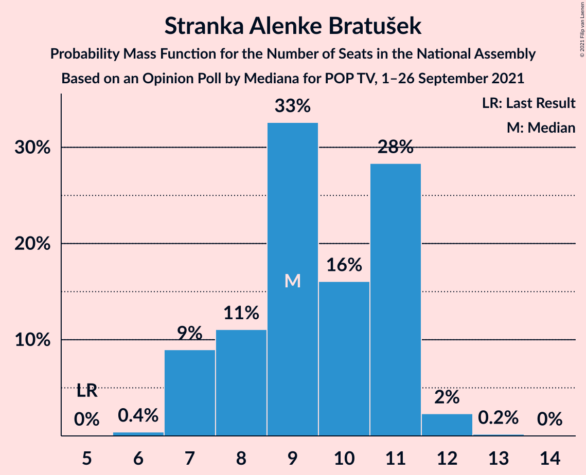

| Number of Seats | Probability | Accumulated | Special Marks |
|:---------------:|:-----------:|:-----------:|:-------------:|
| 5 | 0% | 100% | Last Result |
| 6 | 0.4% | 100% |  |
| 7 | 9% | 99.6% |  |
| 8 | 11% | 91% |  |
| 9 | 33% | 80% | Median |
| 10 | 16% | 47% |  |
| 11 | 28% | 31% |  |
| 12 | 2% | 3% |  |
| 13 | 0.2% | 0.2% |  |
| 14 | 0% | 0% |  |

### Nova Slovenija–Krščanski demokrati

*For a full overview of the results for this party, see the [Nova Slovenija–Krščanski demokrati](party-novaslovenija–krščanskidemokrati.html) page.*

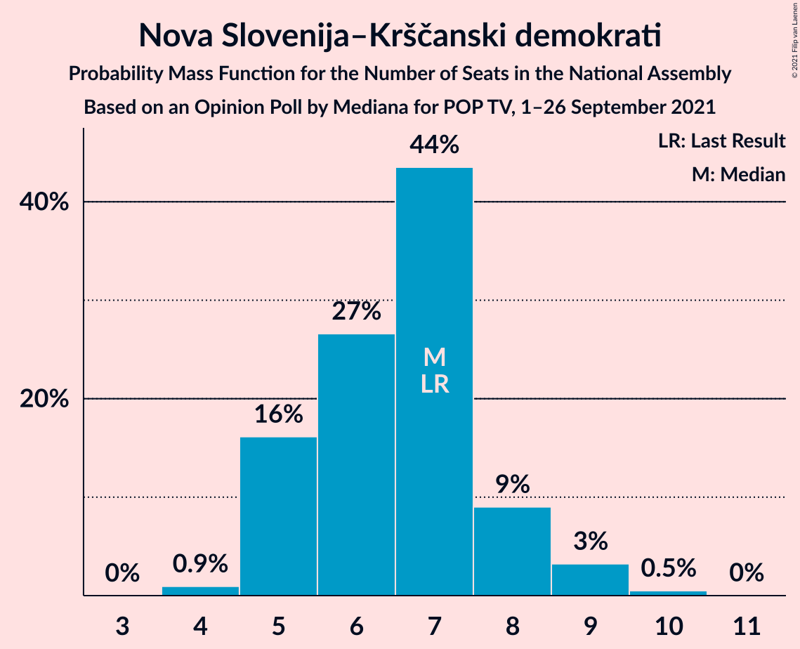

| Number of Seats | Probability | Accumulated | Special Marks |
|:---------------:|:-----------:|:-----------:|:-------------:|
| 4 | 0.9% | 100% |  |
| 5 | 16% | 99.0% |  |
| 6 | 27% | 83% |  |
| 7 | 44% | 56% | Last Result, Median |
| 8 | 9% | 13% |  |
| 9 | 3% | 4% |  |
| 10 | 0.5% | 0.5% |  |
| 11 | 0% | 0% |  |

### Slovenska ljudska stranka

*For a full overview of the results for this party, see the [Slovenska ljudska stranka](party-slovenskaljudskastranka.html) page.*

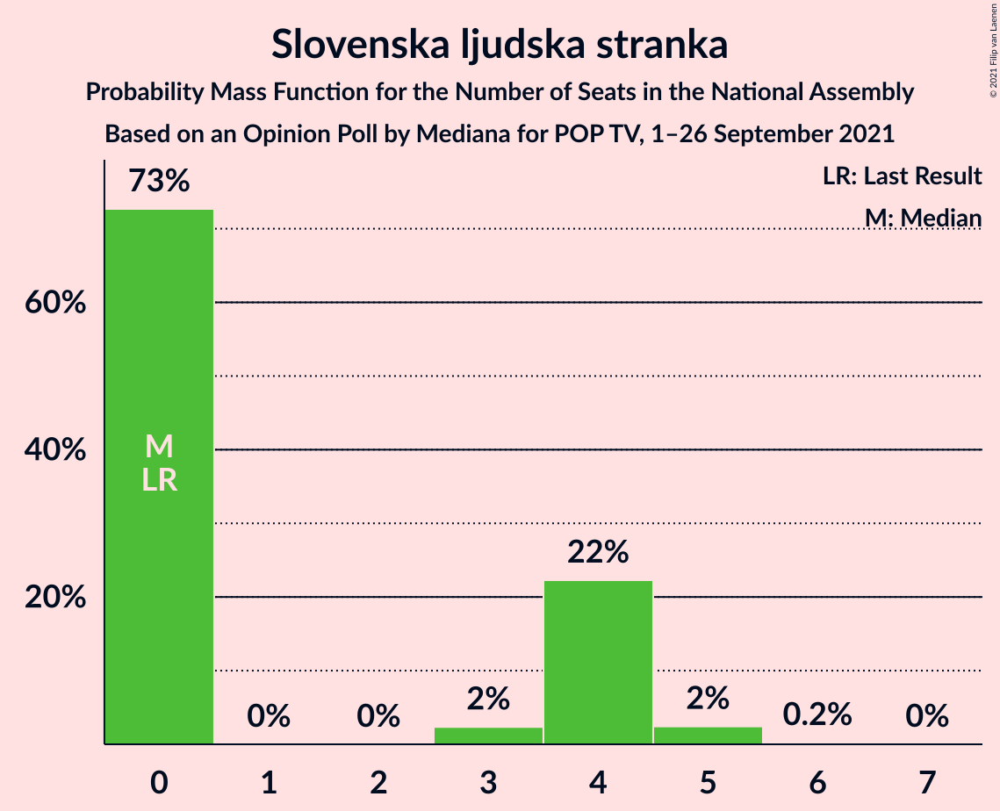

| Number of Seats | Probability | Accumulated | Special Marks |
|:---------------:|:-----------:|:-----------:|:-------------:|
| 0 | 73% | 100% | Last Result, Median |
| 1 | 0% | 27% |  |
| 2 | 0% | 27% |  |
| 3 | 2% | 27% |  |
| 4 | 22% | 25% |  |
| 5 | 2% | 3% |  |
| 6 | 0.2% | 0.2% |  |
| 7 | 0% | 0% |  |

### Piratska stranka Slovenije

*For a full overview of the results for this party, see the [Piratska stranka Slovenije](party-piratskastrankaslovenije.html) page.*

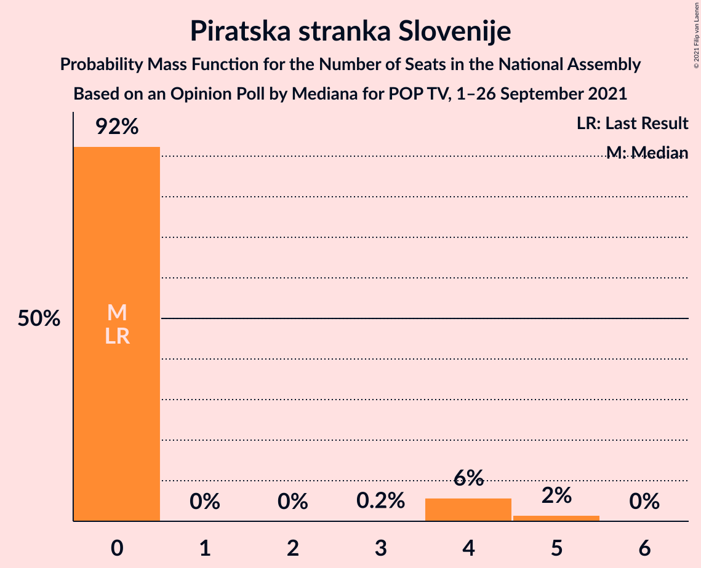

| Number of Seats | Probability | Accumulated | Special Marks |
|:---------------:|:-----------:|:-----------:|:-------------:|
| 0 | 92% | 100% | Last Result, Median |
| 1 | 0% | 8% |  |
| 2 | 0% | 8% |  |
| 3 | 0.2% | 8% |  |
| 4 | 6% | 7% |  |
| 5 | 2% | 2% |  |
| 6 | 0% | 0% |  |

### Slovenska nacionalna stranka

*For a full overview of the results for this party, see the [Slovenska nacionalna stranka](party-slovenskanacionalnastranka.html) page.*

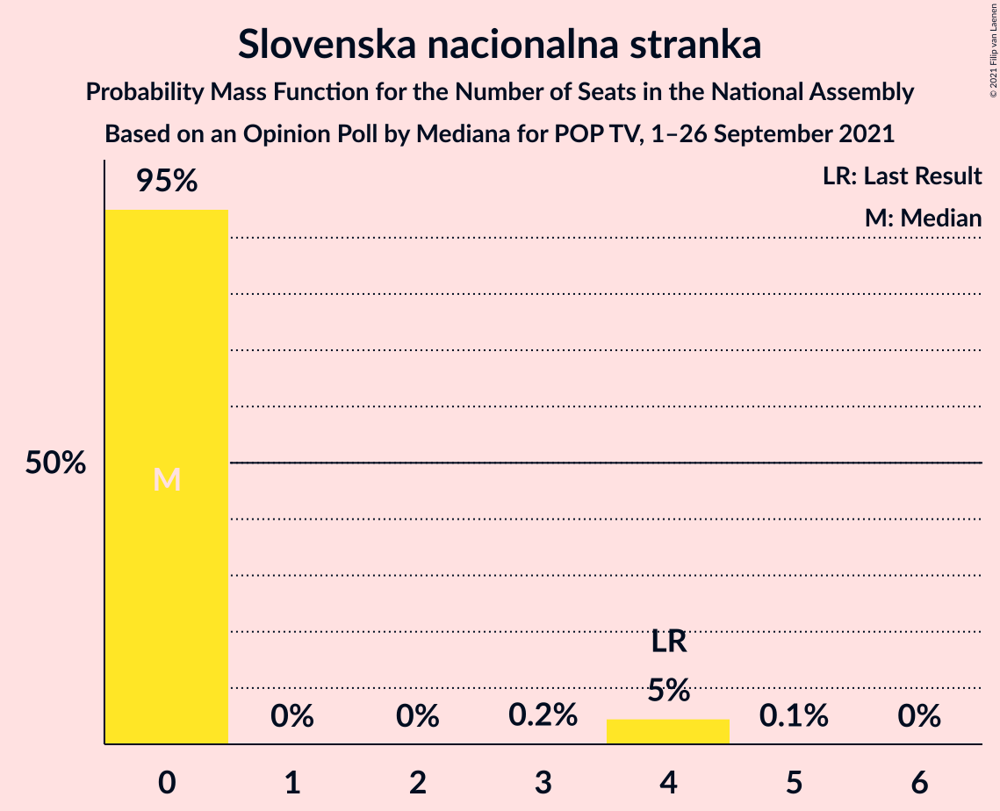

| Number of Seats | Probability | Accumulated | Special Marks |
|:---------------:|:-----------:|:-----------:|:-------------:|
| 0 | 95% | 100% | Median |
| 1 | 0% | 5% |  |
| 2 | 0% | 5% |  |
| 3 | 0.2% | 5% |  |
| 4 | 5% | 5% | Last Result |
| 5 | 0.1% | 0.1% |  |
| 6 | 0% | 0% |  |

### Andrej Čuš in Zeleni Slovenije

*For a full overview of the results for this party, see the [Andrej Čuš in Zeleni Slovenije](party-andrejčušinzelenislovenije.html) page.*

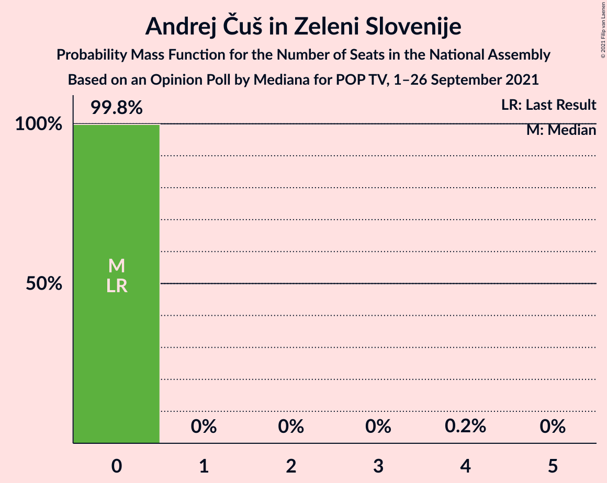

| Number of Seats | Probability | Accumulated | Special Marks |
|:---------------:|:-----------:|:-----------:|:-------------:|
| 0 | 99.8% | 100% | Last Result, Median |
| 1 | 0% | 0.2% |  |
| 2 | 0% | 0.2% |  |
| 3 | 0% | 0.2% |  |
| 4 | 0.2% | 0.2% |  |
| 5 | 0% | 0% |  |

## Coalitions

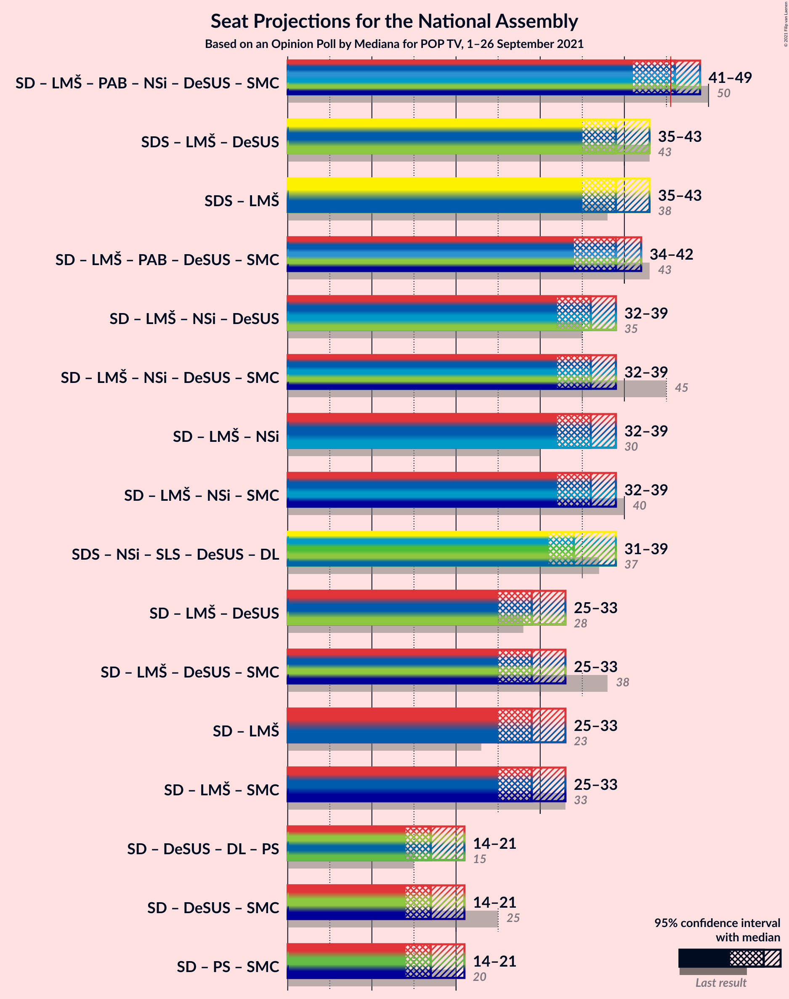

### Confidence Intervals

| Coalition | Last Result | Median | Majority? | 80% Confidence Interval | 90% Confidence Interval | 95% Confidence Interval | 99% Confidence Interval |
|:---------:|:-----------:|:------:|:---------:|:-----------------------:|:-----------------------:|:-----------------------:|:-----------------------:|
| Slovenska demokratska stranka – Lista Marjana Šarca | 38 | 39 | 0.4% | 37–42 | 36–43 | 35–43 | 33–45 |
| Socialni demokrati – Lista Marjana Šarca – Nova Slovenija–Krščanski demokrati | 30 | 36 | 0% | 34–38 | 33–39 | 32–39 | 31–41 |
| Socialni demokrati – Lista Marjana Šarca | 23 | 29 | 0% | 27–32 | 27–32 | 25–33 | 24–34 |

### Slovenska demokratska stranka – Lista Marjana Šarca

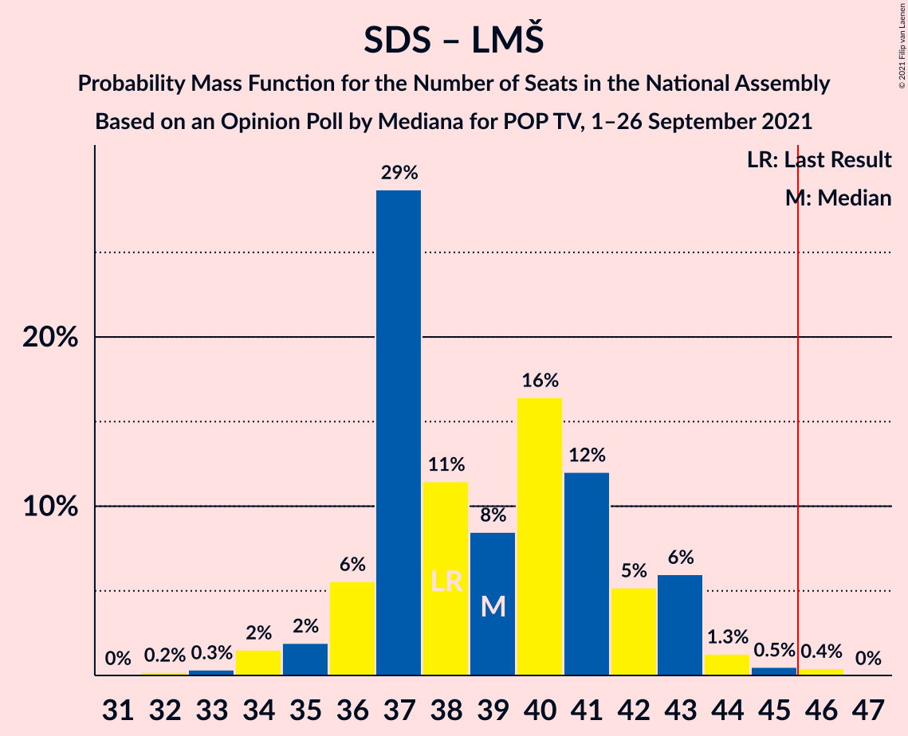

| Number of Seats | Probability | Accumulated | Special Marks |
|:---------------:|:-----------:|:-----------:|:-------------:|
| 32 | 0.2% | 100% |  |
| 33 | 0.3% | 99.8% |  |
| 34 | 2% | 99.5% |  |
| 35 | 2% | 98% |  |
| 36 | 6% | 96% |  |
| 37 | 29% | 90% |  |
| 38 | 11% | 62% | Last Result, Median |
| 39 | 8% | 50% |  |
| 40 | 16% | 42% |  |
| 41 | 12% | 25% |  |
| 42 | 5% | 13% |  |
| 43 | 6% | 8% |  |
| 44 | 1.3% | 2% |  |
| 45 | 0.5% | 0.9% |  |
| 46 | 0.4% | 0.4% | Majority |
| 47 | 0% | 0% |  |

### Socialni demokrati – Lista Marjana Šarca – Nova Slovenija–Krščanski demokrati

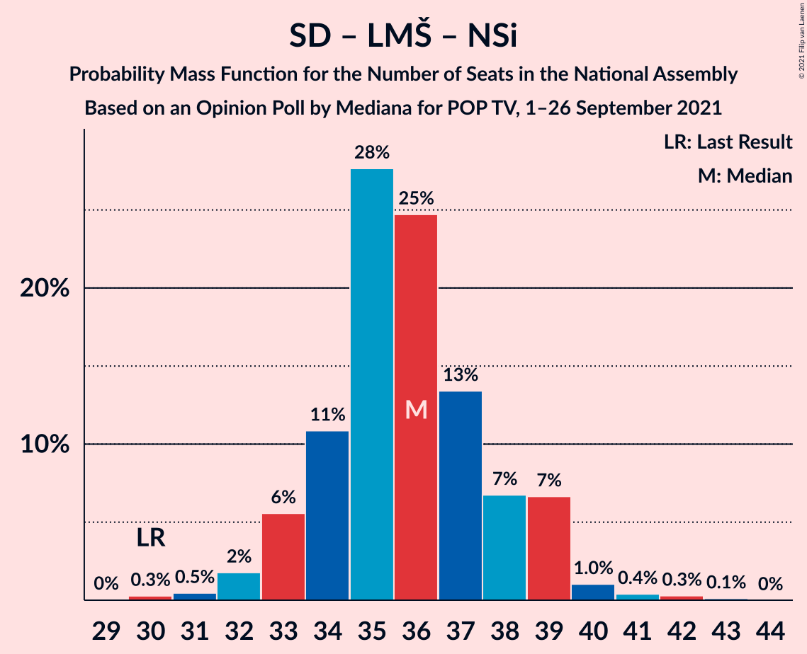

| Number of Seats | Probability | Accumulated | Special Marks |
|:---------------:|:-----------:|:-----------:|:-------------:|
| 30 | 0.3% | 100% | Last Result |
| 31 | 0.5% | 99.7% |  |
| 32 | 2% | 99.2% |  |
| 33 | 6% | 97% |  |
| 34 | 11% | 92% |  |
| 35 | 28% | 81% |  |
| 36 | 25% | 53% | Median |
| 37 | 13% | 29% |  |
| 38 | 7% | 15% |  |
| 39 | 7% | 8% |  |
| 40 | 1.0% | 2% |  |
| 41 | 0.4% | 0.8% |  |
| 42 | 0.3% | 0.4% |  |
| 43 | 0.1% | 0.1% |  |
| 44 | 0% | 0% |  |

### Socialni demokrati – Lista Marjana Šarca

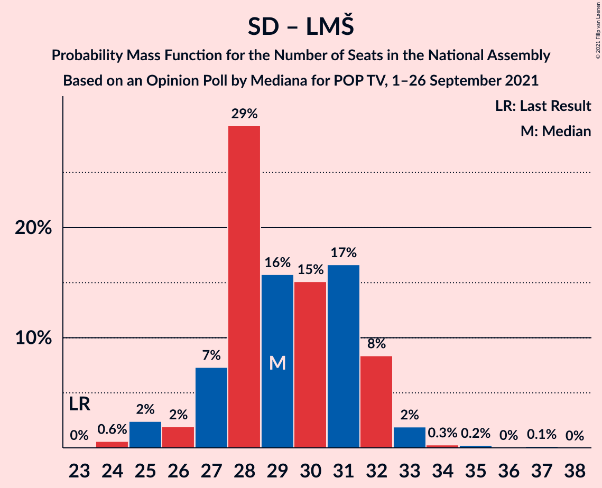

| Number of Seats | Probability | Accumulated | Special Marks |
|:---------------:|:-----------:|:-----------:|:-------------:|
| 23 | 0% | 100% | Last Result |
| 24 | 0.6% | 99.9% |  |
| 25 | 2% | 99.4% |  |
| 26 | 2% | 97% |  |
| 27 | 7% | 95% |  |
| 28 | 29% | 88% |  |
| 29 | 16% | 58% | Median |
| 30 | 15% | 43% |  |
| 31 | 17% | 28% |  |
| 32 | 8% | 11% |  |
| 33 | 2% | 3% |  |
| 34 | 0.3% | 0.7% |  |
| 35 | 0.2% | 0.4% |  |
| 36 | 0% | 0.2% |  |
| 37 | 0.1% | 0.1% |  |
| 38 | 0% | 0% |  |

## Technical Information

### Opinion Poll

+ **Polling firm:** Mediana
+ **Commissioner(s):** POP TV
+ **Fieldwork period:** 1–26 September 2021

### Calculations

+ **Sample size:** 703
+ **Simulations done:** 1,048,576
+ **Error estimate:** 3.02%

