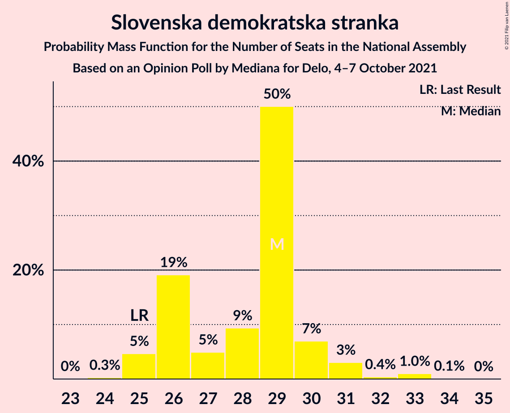

# Opinion Poll by Mediana for Delo, 4–7 October 2021

<a href="#voting-intentions">Voting Intentions</a> | <a href="#seats">Seats</a> | <a href="#coalitions">Coalitions</a> | <a href="#technical-information">Technical Information</a>

## Voting Intentions

### Confidence Intervals

| Party | Last Result | Poll Result | 80% Confidence Interval | 90% Confidence Interval | 95% Confidence Interval | 99% Confidence Interval |
|:-----:|:-----------:|:-----------:|:-----------------------:|:-----------------------:|:-----------------------:|:-----------------------:|
| Slovenska demokratska stranka | 24.9% | 28.2% | 26.1–30.4% |25.5–31.0% |25.0–31.6% |24.0–32.7% |
| Socialni demokrati | 9.9% | 13.9% | 12.4–15.7% |12.0–16.2% |11.6–16.7% |10.9–17.6% |
| Lista Marjana Šarca | 12.6% | 13.8% | 12.3–15.6% |11.8–16.1% |11.5–16.5% |10.8–17.4% |
| Levica | 9.3% | 13.4% | 11.9–15.1% |11.4–15.7% |11.1–16.1% |10.4–17.0% |
| Nova Slovenija–Krščanski demokrati | 7.2% | 8.2% | 7.0–9.7% |6.7–10.1% |6.4–10.5% |5.9–11.2% |
| Stranka Alenke Bratušek | 5.1% | 6.8% | 5.8–8.2% |5.5–8.6% |5.2–8.9% |4.7–9.6% |
| Piratska stranka Slovenije | 2.2% | 4.6% | 3.7–5.8% |3.5–6.1% |3.3–6.4% |2.9–7.0% |
| Slovenska ljudska stranka | 2.6% | 2.6% | 2.0–3.6% |1.8–3.9% |1.7–4.1% |1.4–4.6% |
| Andrej Čuš in Zeleni Slovenije | 1.1% | 1.8% | 1.3–2.6% |1.2–2.9% |1.1–3.1% |0.9–3.5% |
| Dobra država | 1.5% | 1.3% | 0.9–2.0% |0.7–2.2% |0.7–2.4% |0.5–2.8% |
| Slovenska nacionalna stranka | 4.2% | 1.1% | 0.7–1.8% |0.7–2.0% |0.6–2.2% |0.4–2.6% |
| Stranka modernega centra | 9.7% | 0.8% | 0.5–1.5% |0.5–1.6% |0.4–1.8% |0.3–2.2% |
| Demokratična stranka upokojencev Slovenije | 4.9% | 0.6% | 0.3–1.1% |0.3–1.3% |0.2–1.4% |0.1–1.8% |

*Note:* The poll result column reflects the actual value used in the calculations. Published results may vary slightly, and in addition be rounded to fewer digits.

## Seats

### Confidence Intervals

| Party | Last Result | Median | 80% Confidence Interval | 90% Confidence Interval | 95% Confidence Interval | 99% Confidence Interval |
|:-----:|:-----------:|:------:|:-----------------------:|:-----------------------:|:-----------------------:|:-----------------------:|
| <a href="#slovenska-demokratska-stranka">Slovenska demokratska stranka</a> | 25 | 29 | 26–30 |25–30 |25–31 |25–33 |
| <a href="#socialni-demokrati">Socialni demokrati</a> | 10 | 13 | 12–14 |11–15 |11–17 |11–18 |
| <a href="#lista-marjana-šarca">Lista Marjana Šarca</a> | 13 | 12 | 12–16 |12–16 |11–16 |11–17 |
| <a href="#levica">Levica</a> | 9 | 13 | 12–15 |11–15 |11–15 |10–17 |
| <a href="#nova-slovenija–krščanski-demokrati">Nova Slovenija–Krščanski demokrati</a> | 7 | 10 | 7–10 |7–10 |6–10 |5–10 |
| <a href="#stranka-alenke-bratušek">Stranka Alenke Bratušek</a> | 5 | 6 | 6–8 |5–9 |5–9 |4–10 |
| <a href="#piratska-stranka-slovenije">Piratska stranka Slovenije</a> | 0 | 5 | 4–5 |0–6 |0–6 |0–7 |
| <a href="#slovenska-ljudska-stranka">Slovenska ljudska stranka</a> | 0 | 0 | 0 |0 |0–3 |0–4 |
| <a href="#andrej-čuš-in-zeleni-slovenije">Andrej Čuš in Zeleni Slovenije</a> | 0 | 0 | 0 |0 |0 |0 |
| <a href="#dobra-država">Dobra država</a> | 0 | 0 | 0 |0 |0 |0 |
| <a href="#slovenska-nacionalna-stranka">Slovenska nacionalna stranka</a> | 4 | 0 | 0 |0 |0 |0 |
| <a href="#stranka-modernega-centra">Stranka modernega centra</a> | 10 | 0 | 0 |0 |0 |0 |
| <a href="#demokratična-stranka-upokojencev-slovenije">Demokratična stranka upokojencev Slovenije</a> | 5 | 0 | 0 |0 |0 |0 |

### Slovenska demokratska stranka

*For a full overview of the results for this party, see the [Slovenska demokratska stranka](party-slovenskademokratskastranka.html) page.*

| Number of Seats | Probability | Accumulated | Special Marks |
|:---------------:|:-----------:|:-----------:|:-------------:|
| 23 | 0% | 100% |  |
| 24 | 0.3% | 99.9% |  |
| 25 | 5% | 99.6% | Last Result |
| 26 | 19% | 95% |  |
| 27 | 5% | 76% |  |
| 28 | 9% | 71% |  |
| 29 | 50% | 62% | Median |
| 30 | 7% | 12% |  |
| 31 | 3% | 5% |  |
| 32 | 0.4% | 2% |  |
| 33 | 1.0% | 1.1% |  |
| 34 | 0.1% | 0.1% |  |
| 35 | 0% | 0% |  |

### Socialni demokrati

*For a full overview of the results for this party, see the [Socialni demokrati](party-socialnidemokrati.html) page.*

| Number of Seats | Probability | Accumulated | Special Marks |
|:---------------:|:-----------:|:-----------:|:-------------:|
| 10 | 0.5% | 100% | Last Result |
| 11 | 6% | 99.5% |  |
| 12 | 23% | 94% |  |
| 13 | 48% | 71% | Median |
| 14 | 15% | 22% |  |
| 15 | 3% | 8% |  |
| 16 | 1.5% | 5% |  |
| 17 | 0.7% | 3% |  |
| 18 | 2% | 2% |  |
| 19 | 0.2% | 0.2% |  |
| 20 | 0% | 0% |  |

### Lista Marjana Šarca

*For a full overview of the results for this party, see the [Lista Marjana Šarca](party-listamarjanašarca.html) page.*

| Number of Seats | Probability | Accumulated | Special Marks |
|:---------------:|:-----------:|:-----------:|:-------------:|
| 10 | 0.2% | 100% |  |
| 11 | 2% | 99.8% |  |
| 12 | 52% | 97% | Median |
| 13 | 19% | 46% | Last Result |
| 14 | 6% | 27% |  |
| 15 | 10% | 21% |  |
| 16 | 9% | 10% |  |
| 17 | 1.0% | 1.3% |  |
| 18 | 0.2% | 0.2% |  |
| 19 | 0% | 0% |  |

### Levica

*For a full overview of the results for this party, see the [Levica](party-levica.html) page.*

| Number of Seats | Probability | Accumulated | Special Marks |
|:---------------:|:-----------:|:-----------:|:-------------:|
| 9 | 0.3% | 100% | Last Result |
| 10 | 0.6% | 99.7% |  |
| 11 | 7% | 99.1% |  |
| 12 | 15% | 93% |  |
| 13 | 49% | 78% | Median |
| 14 | 10% | 29% |  |
| 15 | 16% | 19% |  |
| 16 | 2% | 2% |  |
| 17 | 0.3% | 0.6% |  |
| 18 | 0.3% | 0.3% |  |
| 19 | 0% | 0% |  |

### Nova Slovenija–Krščanski demokrati

*For a full overview of the results for this party, see the [Nova Slovenija–Krščanski demokrati](party-novaslovenija–krščanskidemokrati.html) page.*

| Number of Seats | Probability | Accumulated | Special Marks |
|:---------------:|:-----------:|:-----------:|:-------------:|
| 5 | 1.0% | 100% |  |
| 6 | 3% | 99.0% |  |
| 7 | 9% | 96% | Last Result |
| 8 | 15% | 87% |  |
| 9 | 11% | 72% |  |
| 10 | 60% | 61% | Median |
| 11 | 0.4% | 0.5% |  |
| 12 | 0% | 0% |  |

### Stranka Alenke Bratušek

*For a full overview of the results for this party, see the [Stranka Alenke Bratušek](party-strankaalenkebratušek.html) page.*

| Number of Seats | Probability | Accumulated | Special Marks |
|:---------------:|:-----------:|:-----------:|:-------------:|
| 0 | 0.1% | 100% |  |
| 1 | 0% | 99.9% |  |
| 2 | 0% | 99.9% |  |
| 3 | 0% | 99.9% |  |
| 4 | 0.9% | 99.9% |  |
| 5 | 5% | 99.0% | Last Result |
| 6 | 51% | 94% | Median |
| 7 | 29% | 43% |  |
| 8 | 7% | 14% |  |
| 9 | 6% | 7% |  |
| 10 | 0.7% | 0.8% |  |
| 11 | 0% | 0% |  |

### Piratska stranka Slovenije

*For a full overview of the results for this party, see the [Piratska stranka Slovenije](party-piratskastrankaslovenije.html) page.*

| Number of Seats | Probability | Accumulated | Special Marks |
|:---------------:|:-----------:|:-----------:|:-------------:|
| 0 | 7% | 100% | Last Result |
| 1 | 0% | 93% |  |
| 2 | 0% | 93% |  |
| 3 | 0% | 93% |  |
| 4 | 20% | 93% |  |
| 5 | 66% | 73% | Median |
| 6 | 6% | 7% |  |
| 7 | 1.0% | 1.1% |  |
| 8 | 0% | 0% |  |

### Slovenska ljudska stranka

*For a full overview of the results for this party, see the [Slovenska ljudska stranka](party-slovenskaljudskastranka.html) page.*

| Number of Seats | Probability | Accumulated | Special Marks |
|:---------------:|:-----------:|:-----------:|:-------------:|
| 0 | 97% | 100% | Last Result, Median |
| 1 | 0% | 3% |  |
| 2 | 0% | 3% |  |
| 3 | 2% | 3% |  |
| 4 | 0.9% | 1.1% |  |
| 5 | 0.2% | 0.2% |  |
| 6 | 0% | 0% |  |

### Andrej Čuš in Zeleni Slovenije

*For a full overview of the results for this party, see the [Andrej Čuš in Zeleni Slovenije](party-andrejčušinzelenislovenije.html) page.*

| Number of Seats | Probability | Accumulated | Special Marks |
|:---------------:|:-----------:|:-----------:|:-------------:|
| 0 | 99.9% | 100% | Last Result, Median |
| 1 | 0% | 0.1% |  |
| 2 | 0% | 0.1% |  |
| 3 | 0% | 0.1% |  |
| 4 | 0.1% | 0.1% |  |
| 5 | 0% | 0% |  |

### Dobra država

*For a full overview of the results for this party, see the [Dobra država](party-dobradržava.html) page.*

| Number of Seats | Probability | Accumulated | Special Marks |
|:---------------:|:-----------:|:-----------:|:-------------:|
| 0 | 100% | 100% | Last Result, Median |

### Slovenska nacionalna stranka

*For a full overview of the results for this party, see the [Slovenska nacionalna stranka](party-slovenskanacionalnastranka.html) page.*

| Number of Seats | Probability | Accumulated | Special Marks |
|:---------------:|:-----------:|:-----------:|:-------------:|
| 0 | 100% | 100% | Median |
| 1 | 0% | 0% |  |
| 2 | 0% | 0% |  |
| 3 | 0% | 0% |  |
| 4 | 0% | 0% | Last Result |

### Stranka modernega centra

*For a full overview of the results for this party, see the [Stranka modernega centra](party-strankamodernegacentra.html) page.*

| Number of Seats | Probability | Accumulated | Special Marks |
|:---------------:|:-----------:|:-----------:|:-------------:|
| 0 | 100% | 100% | Median |
| 1 | 0% | 0% |  |
| 2 | 0% | 0% |  |
| 3 | 0% | 0% |  |
| 4 | 0% | 0% |  |
| 5 | 0% | 0% |  |
| 6 | 0% | 0% |  |
| 7 | 0% | 0% |  |
| 8 | 0% | 0% |  |
| 9 | 0% | 0% |  |
| 10 | 0% | 0% | Last Result |

### Demokratična stranka upokojencev Slovenije

*For a full overview of the results for this party, see the [Demokratična stranka upokojencev Slovenije](party-demokratičnastrankaupokojencevslovenije.html) page.*

| Number of Seats | Probability | Accumulated | Special Marks |
|:---------------:|:-----------:|:-----------:|:-------------:|
| 0 | 100% | 100% | Median |
| 1 | 0% | 0% |  |
| 2 | 0% | 0% |  |
| 3 | 0% | 0% |  |
| 4 | 0% | 0% |  |
| 5 | 0% | 0% | Last Result |

## Coalitions

### Confidence Intervals

| Coalition | Last Result | Median | Majority? | 80% Confidence Interval | 90% Confidence Interval | 95% Confidence Interval | 99% Confidence Interval |
|:---------:|:-----------:|:------:|:---------:|:-----------------------:|:-----------------------:|:-----------------------:|:-----------------------:|
| Socialni demokrati – Lista Marjana Šarca – Nova Slovenija–Krščanski demokrati – Stranka Alenke Bratušek – Stranka modernega centra – Demokratična stranka upokojencev Slovenije | 50 | 41 | 3% | 40–44 | 40–44 | 39–46 | 38–47 |
| Slovenska demokratska stranka – Lista Marjana Šarca – Demokratična stranka upokojencev Slovenije | 43 | 41 | 1.4% | 39–44 | 39–45 | 38–45 | 37–46 |
| Slovenska demokratska stranka – Lista Marjana Šarca | 38 | 41 | 1.4% | 39–44 | 39–45 | 38–45 | 37–46 |
| Socialni demokrati – Lista Marjana Šarca – Stranka Alenke Bratušek – Stranka modernega centra – Demokratična stranka upokojencev Slovenije | 43 | 32 | 0% | 31–36 | 31–37 | 31–39 | 30–40 |
| Socialni demokrati – Lista Marjana Šarca – Nova Slovenija–Krščanski demokrati – Demokratična stranka upokojencev Slovenije | 35 | 35 | 0% | 34–37 | 31–38 | 31–38 | 30–40 |
| Socialni demokrati – Lista Marjana Šarca – Nova Slovenija–Krščanski demokrati – Stranka modernega centra – Demokratična stranka upokojencev Slovenije | 45 | 35 | 0% | 34–37 | 31–38 | 31–38 | 30–40 |
| Socialni demokrati – Lista Marjana Šarca – Nova Slovenija–Krščanski demokrati | 30 | 35 | 0% | 34–37 | 31–38 | 31–38 | 30–40 |
| Socialni demokrati – Lista Marjana Šarca – Nova Slovenija–Krščanski demokrati – Stranka modernega centra | 40 | 35 | 0% | 34–37 | 31–38 | 31–38 | 30–40 |
| Socialni demokrati – Lista Marjana Šarca – Demokratična stranka upokojencev Slovenije | 28 | 25 | 0% | 25–29 | 24–30 | 24–31 | 24–33 |
| Socialni demokrati – Lista Marjana Šarca – Stranka modernega centra – Demokratična stranka upokojencev Slovenije | 38 | 25 | 0% | 25–29 | 24–30 | 24–31 | 24–33 |
| Socialni demokrati – Lista Marjana Šarca | 23 | 25 | 0% | 25–29 | 24–30 | 24–31 | 24–33 |
| Socialni demokrati – Lista Marjana Šarca – Stranka modernega centra | 33 | 25 | 0% | 25–29 | 24–30 | 24–31 | 24–33 |
| Socialni demokrati – Stranka modernega centra – Demokratična stranka upokojencev Slovenije | 25 | 13 | 0% | 12–14 | 11–15 | 11–17 | 11–18 |

### Socialni demokrati – Lista Marjana Šarca – Nova Slovenija–Krščanski demokrati – Stranka Alenke Bratušek – Stranka modernega centra – Demokratična stranka upokojencev Slovenije

| Number of Seats | Probability | Accumulated | Special Marks |
|:---------------:|:-----------:|:-----------:|:-------------:|
| 35 | 0.1% | 100% |  |
| 36 | 0% | 99.9% |  |
| 37 | 0.2% | 99.9% |  |
| 38 | 1.2% | 99.6% |  |
| 39 | 2% | 98% |  |
| 40 | 9% | 96% |  |
| 41 | 44% | 87% | Median |
| 42 | 16% | 43% |  |
| 43 | 10% | 27% |  |
| 44 | 12% | 17% |  |
| 45 | 2% | 5% |  |
| 46 | 0.9% | 3% | Majority |
| 47 | 1.4% | 2% |  |
| 48 | 0.1% | 0.3% |  |
| 49 | 0.3% | 0.3% |  |
| 50 | 0% | 0% | Last Result |

### Slovenska demokratska stranka – Lista Marjana Šarca – Demokratična stranka upokojencev Slovenije

| Number of Seats | Probability | Accumulated | Special Marks |
|:---------------:|:-----------:|:-----------:|:-------------:|
| 36 | 0.4% | 100% |  |
| 37 | 0.6% | 99.5% |  |
| 38 | 3% | 98.9% |  |
| 39 | 16% | 96% |  |
| 40 | 4% | 80% |  |
| 41 | 47% | 77% | Median |
| 42 | 10% | 29% |  |
| 43 | 5% | 19% | Last Result |
| 44 | 5% | 14% |  |
| 45 | 7% | 8% |  |
| 46 | 1.0% | 1.4% | Majority |
| 47 | 0.1% | 0.4% |  |
| 48 | 0.2% | 0.3% |  |
| 49 | 0% | 0.1% |  |
| 50 | 0% | 0% |  |

### Slovenska demokratska stranka – Lista Marjana Šarca

| Number of Seats | Probability | Accumulated | Special Marks |
|:---------------:|:-----------:|:-----------:|:-------------:|
| 36 | 0.4% | 100% |  |
| 37 | 0.6% | 99.5% |  |
| 38 | 3% | 98.9% | Last Result |
| 39 | 16% | 96% |  |
| 40 | 4% | 80% |  |
| 41 | 47% | 77% | Median |
| 42 | 10% | 29% |  |
| 43 | 5% | 19% |  |
| 44 | 5% | 14% |  |
| 45 | 7% | 8% |  |
| 46 | 1.0% | 1.4% | Majority |
| 47 | 0.1% | 0.4% |  |
| 48 | 0.2% | 0.3% |  |
| 49 | 0% | 0.1% |  |
| 50 | 0% | 0% |  |

### Socialni demokrati – Lista Marjana Šarca – Stranka Alenke Bratušek – Stranka modernega centra – Demokratična stranka upokojencev Slovenije

| Number of Seats | Probability | Accumulated | Special Marks |
|:---------------:|:-----------:|:-----------:|:-------------:|
| 28 | 0.2% | 100% |  |
| 29 | 0.2% | 99.8% |  |
| 30 | 0.5% | 99.6% |  |
| 31 | 46% | 99.1% | Median |
| 32 | 15% | 53% |  |
| 33 | 9% | 38% |  |
| 34 | 11% | 29% |  |
| 35 | 3% | 18% |  |
| 36 | 9% | 15% |  |
| 37 | 2% | 6% |  |
| 38 | 1.3% | 4% |  |
| 39 | 1.3% | 3% |  |
| 40 | 1.2% | 1.2% |  |
| 41 | 0% | 0% |  |
| 42 | 0% | 0% |  |
| 43 | 0% | 0% | Last Result |

### Socialni demokrati – Lista Marjana Šarca – Nova Slovenija–Krščanski demokrati – Demokratična stranka upokojencev Slovenije

| Number of Seats | Probability | Accumulated | Special Marks |
|:---------------:|:-----------:|:-----------:|:-------------:|
| 30 | 0.8% | 100% |  |
| 31 | 5% | 99.1% |  |
| 32 | 0.6% | 95% |  |
| 33 | 4% | 94% |  |
| 34 | 3% | 90% |  |
| 35 | 59% | 87% | Last Result, Median |
| 36 | 11% | 28% |  |
| 37 | 9% | 17% |  |
| 38 | 6% | 8% |  |
| 39 | 0.7% | 2% |  |
| 40 | 1.1% | 2% |  |
| 41 | 0.3% | 0.4% |  |
| 42 | 0.1% | 0.1% |  |
| 43 | 0% | 0% |  |

### Socialni demokrati – Lista Marjana Šarca – Nova Slovenija–Krščanski demokrati – Stranka modernega centra – Demokratična stranka upokojencev Slovenije

| Number of Seats | Probability | Accumulated | Special Marks |
|:---------------:|:-----------:|:-----------:|:-------------:|
| 30 | 0.8% | 100% |  |
| 31 | 5% | 99.1% |  |
| 32 | 0.6% | 95% |  |
| 33 | 4% | 94% |  |
| 34 | 3% | 90% |  |
| 35 | 59% | 87% | Median |
| 36 | 11% | 28% |  |
| 37 | 9% | 17% |  |
| 38 | 6% | 8% |  |
| 39 | 0.7% | 2% |  |
| 40 | 1.1% | 2% |  |
| 41 | 0.3% | 0.4% |  |
| 42 | 0.1% | 0.1% |  |
| 43 | 0% | 0% |  |
| 44 | 0% | 0% |  |
| 45 | 0% | 0% | Last Result |

### Socialni demokrati – Lista Marjana Šarca – Nova Slovenija–Krščanski demokrati

| Number of Seats | Probability | Accumulated | Special Marks |
|:---------------:|:-----------:|:-----------:|:-------------:|
| 30 | 0.8% | 100% | Last Result |
| 31 | 5% | 99.1% |  |
| 32 | 0.6% | 95% |  |
| 33 | 4% | 94% |  |
| 34 | 3% | 90% |  |
| 35 | 59% | 87% | Median |
| 36 | 11% | 28% |  |
| 37 | 9% | 17% |  |
| 38 | 6% | 8% |  |
| 39 | 0.7% | 2% |  |
| 40 | 1.1% | 2% |  |
| 41 | 0.3% | 0.4% |  |
| 42 | 0.1% | 0.1% |  |
| 43 | 0% | 0% |  |

### Socialni demokrati – Lista Marjana Šarca – Nova Slovenija–Krščanski demokrati – Stranka modernega centra

| Number of Seats | Probability | Accumulated | Special Marks |
|:---------------:|:-----------:|:-----------:|:-------------:|
| 30 | 0.8% | 100% |  |
| 31 | 5% | 99.1% |  |
| 32 | 0.6% | 95% |  |
| 33 | 4% | 94% |  |
| 34 | 3% | 90% |  |
| 35 | 59% | 87% | Median |
| 36 | 11% | 28% |  |
| 37 | 9% | 17% |  |
| 38 | 6% | 8% |  |
| 39 | 0.7% | 2% |  |
| 40 | 1.1% | 2% | Last Result |
| 41 | 0.3% | 0.4% |  |
| 42 | 0.1% | 0.1% |  |
| 43 | 0% | 0% |  |

### Socialni demokrati – Lista Marjana Šarca – Demokratična stranka upokojencev Slovenije

| Number of Seats | Probability | Accumulated | Special Marks |
|:---------------:|:-----------:|:-----------:|:-------------:|
| 22 | 0.2% | 100% |  |
| 23 | 0.3% | 99.8% |  |
| 24 | 7% | 99.5% |  |
| 25 | 56% | 93% | Median |
| 26 | 7% | 36% |  |
| 27 | 7% | 29% |  |
| 28 | 7% | 22% | Last Result |
| 29 | 8% | 15% |  |
| 30 | 4% | 7% |  |
| 31 | 1.1% | 3% |  |
| 32 | 1.0% | 2% |  |
| 33 | 1.0% | 1.1% |  |
| 34 | 0.1% | 0.2% |  |
| 35 | 0% | 0% |  |

### Socialni demokrati – Lista Marjana Šarca – Stranka modernega centra – Demokratična stranka upokojencev Slovenije

| Number of Seats | Probability | Accumulated | Special Marks |
|:---------------:|:-----------:|:-----------:|:-------------:|
| 22 | 0.2% | 100% |  |
| 23 | 0.3% | 99.8% |  |
| 24 | 7% | 99.5% |  |
| 25 | 56% | 93% | Median |
| 26 | 7% | 36% |  |
| 27 | 7% | 29% |  |
| 28 | 7% | 22% |  |
| 29 | 8% | 15% |  |
| 30 | 4% | 7% |  |
| 31 | 1.1% | 3% |  |
| 32 | 1.0% | 2% |  |
| 33 | 1.0% | 1.1% |  |
| 34 | 0.1% | 0.2% |  |
| 35 | 0% | 0% |  |
| 36 | 0% | 0% |  |
| 37 | 0% | 0% |  |
| 38 | 0% | 0% | Last Result |

### Socialni demokrati – Lista Marjana Šarca

| Number of Seats | Probability | Accumulated | Special Marks |
|:---------------:|:-----------:|:-----------:|:-------------:|
| 22 | 0.2% | 100% |  |
| 23 | 0.3% | 99.8% | Last Result |
| 24 | 7% | 99.5% |  |
| 25 | 56% | 93% | Median |
| 26 | 7% | 36% |  |
| 27 | 7% | 29% |  |
| 28 | 7% | 22% |  |
| 29 | 8% | 15% |  |
| 30 | 4% | 7% |  |
| 31 | 1.1% | 3% |  |
| 32 | 1.0% | 2% |  |
| 33 | 1.0% | 1.1% |  |
| 34 | 0.1% | 0.2% |  |
| 35 | 0% | 0% |  |

### Socialni demokrati – Lista Marjana Šarca – Stranka modernega centra

| Number of Seats | Probability | Accumulated | Special Marks |
|:---------------:|:-----------:|:-----------:|:-------------:|
| 22 | 0.2% | 100% |  |
| 23 | 0.3% | 99.8% |  |
| 24 | 7% | 99.5% |  |
| 25 | 56% | 93% | Median |
| 26 | 7% | 36% |  |
| 27 | 7% | 29% |  |
| 28 | 7% | 22% |  |
| 29 | 8% | 15% |  |
| 30 | 4% | 7% |  |
| 31 | 1.1% | 3% |  |
| 32 | 1.0% | 2% |  |
| 33 | 1.0% | 1.1% | Last Result |
| 34 | 0.1% | 0.2% |  |
| 35 | 0% | 0% |  |

### Socialni demokrati – Stranka modernega centra – Demokratična stranka upokojencev Slovenije

| Number of Seats | Probability | Accumulated | Special Marks |
|:---------------:|:-----------:|:-----------:|:-------------:|
| 10 | 0.5% | 100% |  |
| 11 | 6% | 99.5% |  |
| 12 | 23% | 94% |  |
| 13 | 48% | 71% | Median |
| 14 | 15% | 22% |  |
| 15 | 3% | 8% |  |
| 16 | 1.5% | 5% |  |
| 17 | 0.7% | 3% |  |
| 18 | 2% | 2% |  |
| 19 | 0.2% | 0.2% |  |
| 20 | 0% | 0% |  |
| 21 | 0% | 0% |  |
| 22 | 0% | 0% |  |
| 23 | 0% | 0% |  |
| 24 | 0% | 0% |  |
| 25 | 0% | 0% | Last Result |

## Technical Information

### Opinion Poll

+ **Polling firm:** Mediana
+ **Commissioner(s):** Delo
+ **Fieldwork period:** 4–7 October 2021

### Calculations

+ **Sample size:** 717
+ **Simulations done:** 1,048,576
+ **Error estimate:** 2.91%

