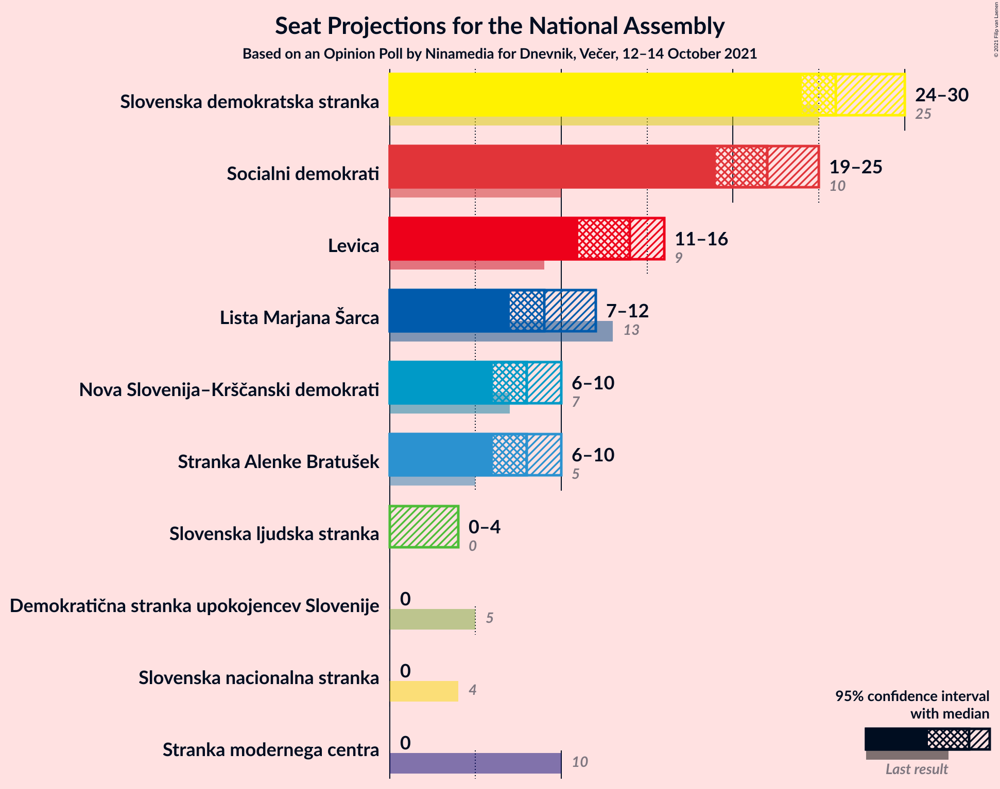
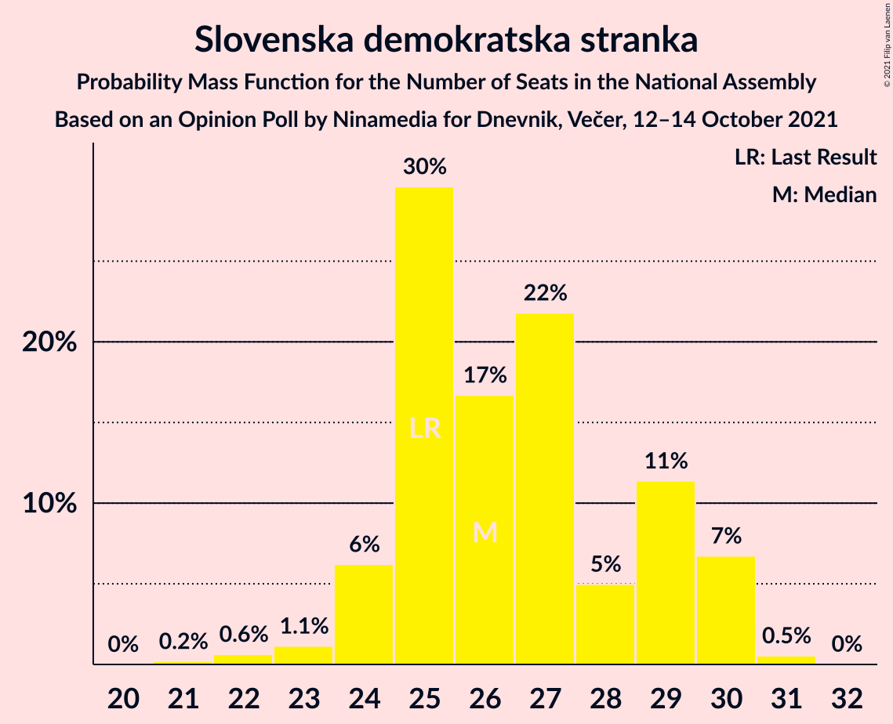
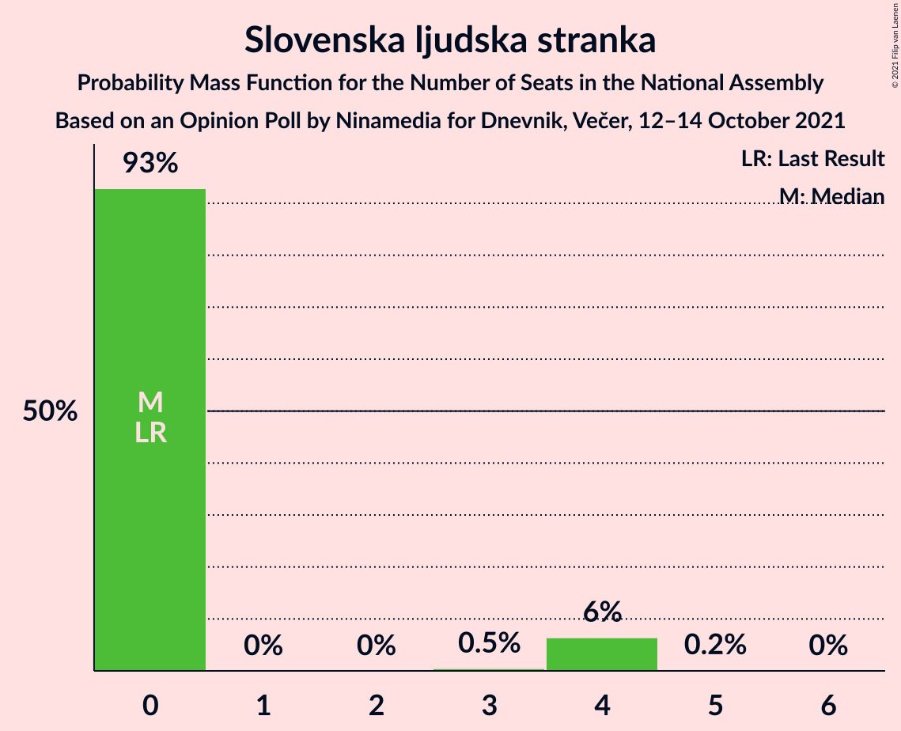
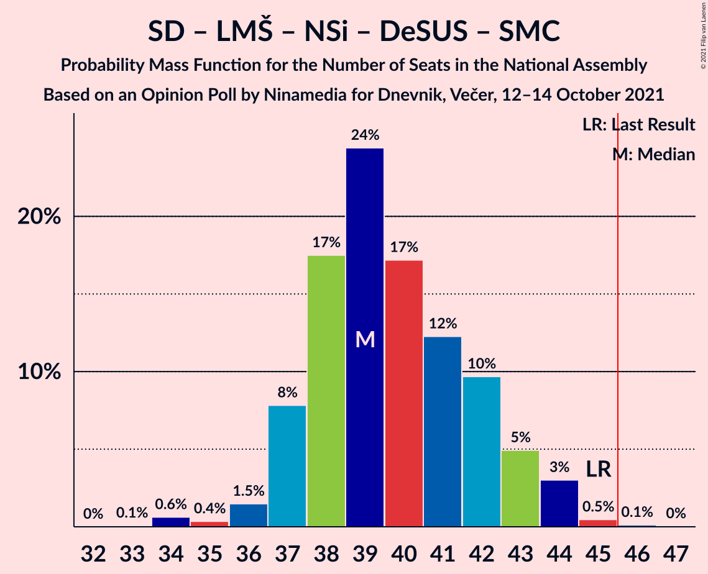
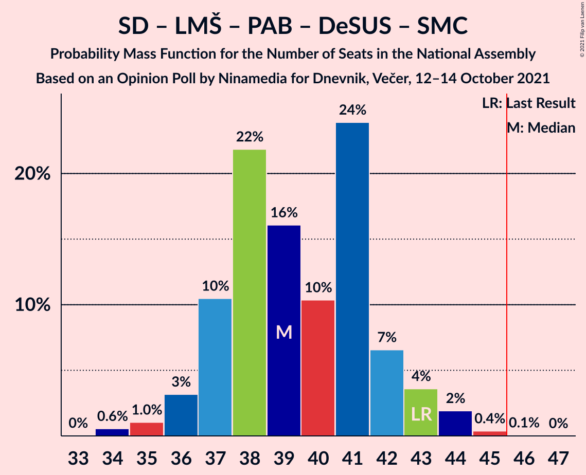
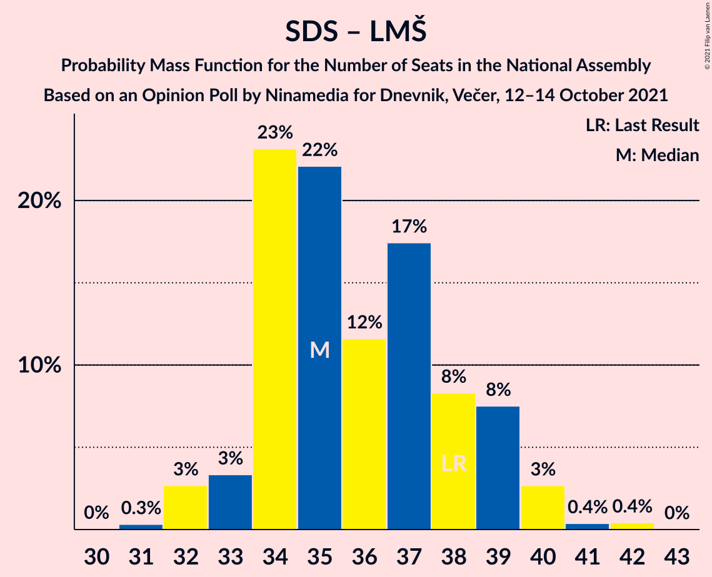
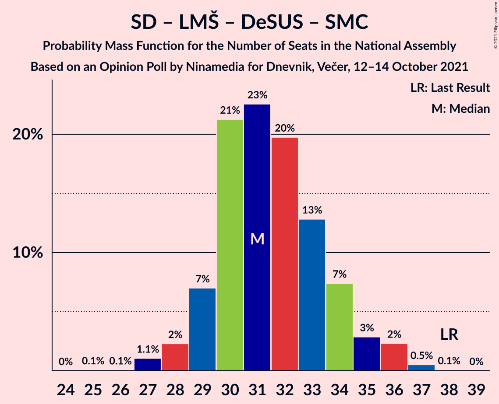
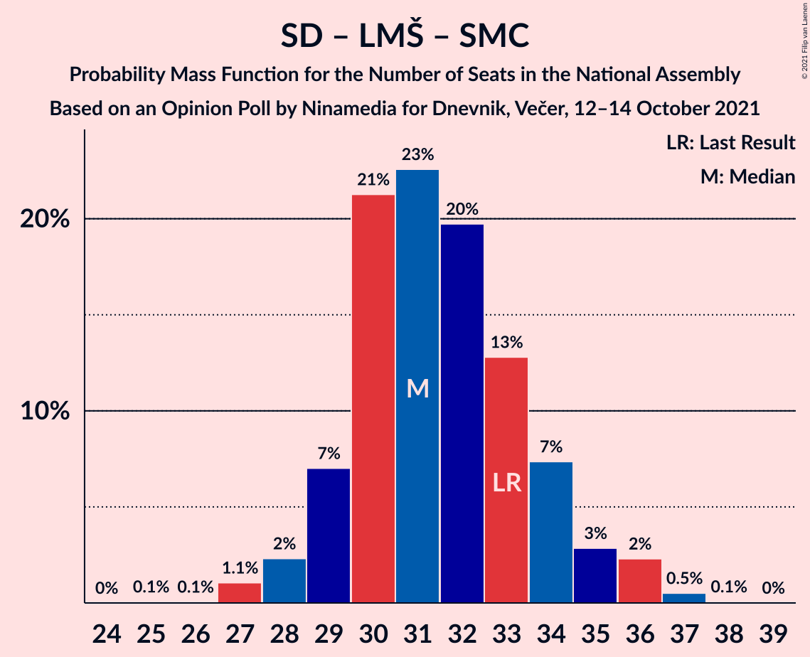

# Opinion Poll by Ninamedia for Dnevnik, Večer, 12–14 October 2021

<a href="#voting-intentions">Voting Intentions</a> | <a href="#seats">Seats</a> | <a href="#coalitions">Coalitions</a> | <a href="#technical-information">Technical Information</a>

## Voting Intentions

### Confidence Intervals

| Party | Last Result | Poll Result | 80% Confidence Interval | 90% Confidence Interval | 95% Confidence Interval | 99% Confidence Interval |
|:-----:|:-----------:|:-----------:|:-----------------------:|:-----------------------:|:-----------------------:|:-----------------------:|
| Slovenska demokratska stranka | 24.9% | 27.3% | 25.2–29.5% |24.6–30.2% |24.1–30.7% |23.1–31.8% |
| Socialni demokrati | 9.9% | 22.9% | 20.9–25.0% |20.4–25.6% |19.9–26.1% |19.0–27.2% |
| Levica | 9.3% | 14.0% | 12.4–15.8% |12.0–16.3% |11.6–16.8% |10.9–17.7% |
| Lista Marjana Šarca | 12.6% | 10.1% | 8.8–11.8% |8.4–12.2% |8.1–12.6% |7.5–13.4% |
| Nova Slovenija–Krščanski demokrati | 7.2% | 8.6% | 7.3–10.1% |7.0–10.5% |6.7–10.9% |6.2–11.6% |
| Stranka Alenke Bratušek | 5.1% | 8.3% | 7.1–9.8% |6.8–10.2% |6.5–10.6% |5.9–11.3% |
| Slovenska ljudska stranka | 2.6% | 2.9% | 2.2–3.8% |2.0–4.1% |1.9–4.4% |1.6–4.9% |
| Slovenska nacionalna stranka | 4.2% | 2.0% | 1.5–2.9% |1.3–3.1% |1.2–3.3% |1.0–3.8% |
| Demokratična stranka upokojencev Slovenije | 4.9% | 1.9% | 1.3–2.7% |1.2–2.9% |1.1–3.2% |0.9–3.6% |
| Stranka modernega centra | 9.7% | 0.9% | 0.5–1.5% |0.5–1.7% |0.4–1.9% |0.3–2.2% |

*Note:* The poll result column reflects the actual value used in the calculations. Published results may vary slightly, and in addition be rounded to fewer digits.

## Seats

### Confidence Intervals

| Party | Last Result | Median | 80% Confidence Interval | 90% Confidence Interval | 95% Confidence Interval | 99% Confidence Interval |
|:-----:|:-----------:|:------:|:-----------------------:|:-----------------------:|:-----------------------:|:-----------------------:|
| <a href="#slovenska-demokratska-stranka">Slovenska demokratska stranka</a> | 25 | 25 | 25–29 |24–29 |24–30 |23–30 |
| <a href="#socialni-demokrati">Socialni demokrati</a> | 10 | 22 | 20–23 |20–24 |19–25 |19–26 |
| <a href="#levica">Levica</a> | 9 | 14 | 13–15 |12–15 |11–16 |10–17 |
| <a href="#lista-marjana-šarca">Lista Marjana Šarca</a> | 13 | 9 | 9–10 |8–11 |7–11 |7–13 |
| <a href="#nova-slovenija–krščanski-demokrati">Nova Slovenija–Krščanski demokrati</a> | 7 | 8 | 7–9 |7–10 |6–10 |5–11 |
| <a href="#stranka-alenke-bratušek">Stranka Alenke Bratušek</a> | 5 | 10 | 7–10 |6–10 |6–10 |6–11 |
| <a href="#slovenska-ljudska-stranka">Slovenska ljudska stranka</a> | 0 | 0 | 0 |0–4 |0–4 |0–4 |
| <a href="#slovenska-nacionalna-stranka">Slovenska nacionalna stranka</a> | 4 | 0 | 0 |0 |0 |0 |
| <a href="#demokratična-stranka-upokojencev-slovenije">Demokratična stranka upokojencev Slovenije</a> | 5 | 0 | 0 |0 |0 |0 |
| <a href="#stranka-modernega-centra">Stranka modernega centra</a> | 10 | 0 | 0 |0 |0 |0 |

### Slovenska demokratska stranka

*For a full overview of the results for this party, see the [Slovenska demokratska stranka](party-slovenskademokratskastranka.html) page.*

| Number of Seats | Probability | Accumulated | Special Marks |
|:---------------:|:-----------:|:-----------:|:-------------:|
| 21 | 0.1% | 100% |  |
| 22 | 0.3% | 99.9% |  |
| 23 | 1.1% | 99.7% |  |
| 24 | 4% | 98.6% |  |
| 25 | 73% | 94% | Last Result, Median |
| 26 | 3% | 22% |  |
| 27 | 3% | 19% |  |
| 28 | 5% | 16% |  |
| 29 | 7% | 11% |  |
| 30 | 4% | 4% |  |
| 31 | 0.2% | 0.3% |  |
| 32 | 0% | 0% |  |

### Socialni demokrati

*For a full overview of the results for this party, see the [Socialni demokrati](party-socialnidemokrati.html) page.*

| Number of Seats | Probability | Accumulated | Special Marks |
|:---------------:|:-----------:|:-----------:|:-------------:|
| 10 | 0% | 100% | Last Result |
| 11 | 0% | 100% |  |
| 12 | 0% | 100% |  |
| 13 | 0% | 100% |  |
| 14 | 0% | 100% |  |
| 15 | 0% | 100% |  |
| 16 | 0% | 100% |  |
| 17 | 0% | 100% |  |
| 18 | 0.3% | 100% |  |
| 19 | 4% | 99.7% |  |
| 20 | 6% | 96% |  |
| 21 | 9% | 90% |  |
| 22 | 68% | 81% | Median |
| 23 | 6% | 12% |  |
| 24 | 3% | 6% |  |
| 25 | 2% | 3% |  |
| 26 | 0.6% | 1.0% |  |
| 27 | 0.3% | 0.3% |  |
| 28 | 0% | 0% |  |

### Levica

*For a full overview of the results for this party, see the [Levica](party-levica.html) page.*

| Number of Seats | Probability | Accumulated | Special Marks |
|:---------------:|:-----------:|:-----------:|:-------------:|
| 9 | 0% | 100% | Last Result |
| 10 | 2% | 100% |  |
| 11 | 1.0% | 98% |  |
| 12 | 5% | 97% |  |
| 13 | 10% | 92% |  |
| 14 | 70% | 82% | Median |
| 15 | 8% | 12% |  |
| 16 | 2% | 3% |  |
| 17 | 0.5% | 0.7% |  |
| 18 | 0.2% | 0.2% |  |
| 19 | 0% | 0% |  |

### Lista Marjana Šarca

*For a full overview of the results for this party, see the [Lista Marjana Šarca](party-listamarjanašarca.html) page.*

| Number of Seats | Probability | Accumulated | Special Marks |
|:---------------:|:-----------:|:-----------:|:-------------:|
| 6 | 0.2% | 100% |  |
| 7 | 4% | 99.8% |  |
| 8 | 4% | 96% |  |
| 9 | 69% | 92% | Median |
| 10 | 16% | 24% |  |
| 11 | 6% | 8% |  |
| 12 | 1.2% | 2% |  |
| 13 | 0.5% | 0.5% | Last Result |
| 14 | 0.1% | 0.1% |  |
| 15 | 0% | 0% |  |

### Nova Slovenija–Krščanski demokrati

*For a full overview of the results for this party, see the [Nova Slovenija–Krščanski demokrati](party-novaslovenija–krščanskidemokrati.html) page.*

| Number of Seats | Probability | Accumulated | Special Marks |
|:---------------:|:-----------:|:-----------:|:-------------:|
| 5 | 1.2% | 100% |  |
| 6 | 2% | 98.8% |  |
| 7 | 12% | 96% | Last Result |
| 8 | 69% | 84% | Median |
| 9 | 6% | 15% |  |
| 10 | 7% | 9% |  |
| 11 | 2% | 2% |  |
| 12 | 0.1% | 0.1% |  |
| 13 | 0% | 0% |  |

### Stranka Alenke Bratušek

*For a full overview of the results for this party, see the [Stranka Alenke Bratušek](party-strankaalenkebratušek.html) page.*

| Number of Seats | Probability | Accumulated | Special Marks |
|:---------------:|:-----------:|:-----------:|:-------------:|
| 5 | 0.2% | 100% | Last Result |
| 6 | 8% | 99.8% |  |
| 7 | 9% | 92% |  |
| 8 | 10% | 82% |  |
| 9 | 10% | 72% |  |
| 10 | 61% | 62% | Median |
| 11 | 0.4% | 0.7% |  |
| 12 | 0.3% | 0.3% |  |
| 13 | 0% | 0% |  |

### Slovenska ljudska stranka

*For a full overview of the results for this party, see the [Slovenska ljudska stranka](party-slovenskaljudskastranka.html) page.*

| Number of Seats | Probability | Accumulated | Special Marks |
|:---------------:|:-----------:|:-----------:|:-------------:|
| 0 | 93% | 100% | Last Result, Median |
| 1 | 0% | 7% |  |
| 2 | 0% | 7% |  |
| 3 | 0.8% | 7% |  |
| 4 | 6% | 6% |  |
| 5 | 0.1% | 0.1% |  |
| 6 | 0% | 0% |  |

### Slovenska nacionalna stranka

*For a full overview of the results for this party, see the [Slovenska nacionalna stranka](party-slovenskanacionalnastranka.html) page.*

| Number of Seats | Probability | Accumulated | Special Marks |
|:---------------:|:-----------:|:-----------:|:-------------:|
| 0 | 99.9% | 100% | Median |
| 1 | 0% | 0.1% |  |
| 2 | 0% | 0.1% |  |
| 3 | 0% | 0.1% |  |
| 4 | 0.1% | 0.1% | Last Result |
| 5 | 0% | 0% |  |

### Demokratična stranka upokojencev Slovenije

*For a full overview of the results for this party, see the [Demokratična stranka upokojencev Slovenije](party-demokratičnastrankaupokojencevslovenije.html) page.*

| Number of Seats | Probability | Accumulated | Special Marks |
|:---------------:|:-----------:|:-----------:|:-------------:|
| 0 | 100% | 100% | Median |
| 1 | 0% | 0% |  |
| 2 | 0% | 0% |  |
| 3 | 0% | 0% |  |
| 4 | 0% | 0% |  |
| 5 | 0% | 0% | Last Result |

### Stranka modernega centra

*For a full overview of the results for this party, see the [Stranka modernega centra](party-strankamodernegacentra.html) page.*

| Number of Seats | Probability | Accumulated | Special Marks |
|:---------------:|:-----------:|:-----------:|:-------------:|
| 0 | 100% | 100% | Median |
| 1 | 0% | 0% |  |
| 2 | 0% | 0% |  |
| 3 | 0% | 0% |  |
| 4 | 0% | 0% |  |
| 5 | 0% | 0% |  |
| 6 | 0% | 0% |  |
| 7 | 0% | 0% |  |
| 8 | 0% | 0% |  |
| 9 | 0% | 0% |  |
| 10 | 0% | 0% | Last Result |

## Coalitions

### Confidence Intervals

| Coalition | Last Result | Median | Majority? | 80% Confidence Interval | 90% Confidence Interval | 95% Confidence Interval | 99% Confidence Interval |
|:---------:|:-----------:|:------:|:---------:|:-----------------------:|:-----------------------:|:-----------------------:|:-----------------------:|
| Socialni demokrati – Lista Marjana Šarca – Nova Slovenija–Krščanski demokrati – Stranka Alenke Bratušek – Demokratična stranka upokojencev Slovenije – Stranka modernega centra | 50 | 49 | 92% | 46–49 | 45–49 | 44–51 | 41–52 |
| Socialni demokrati – Lista Marjana Šarca – Nova Slovenija–Krščanski demokrati – Demokratična stranka upokojencev Slovenije | 35 | 39 | 0.3% | 38–41 | 37–42 | 36–43 | 34–44 |
| Socialni demokrati – Lista Marjana Šarca – Nova Slovenija–Krščanski demokrati – Demokratična stranka upokojencev Slovenije – Stranka modernega centra | 45 | 39 | 0.3% | 38–41 | 37–42 | 36–43 | 34–44 |
| Socialni demokrati – Lista Marjana Šarca – Nova Slovenija–Krščanski demokrati | 30 | 39 | 0.3% | 38–40 | 37–42 | 36–43 | 34–44 |
| Socialni demokrati – Lista Marjana Šarca – Nova Slovenija–Krščanski demokrati – Stranka modernega centra | 40 | 39 | 0.3% | 38–40 | 37–42 | 36–43 | 34–44 |
| Socialni demokrati – Lista Marjana Šarca – Stranka Alenke Bratušek – Demokratična stranka upokojencev Slovenije – Stranka modernega centra | 43 | 41 | 0.1% | 37–41 | 36–41 | 36–42 | 34–44 |
| Slovenska demokratska stranka – Lista Marjana Šarca – Demokratična stranka upokojencev Slovenije | 43 | 34 | 0% | 34–38 | 34–40 | 34–40 | 32–40 |
| Slovenska demokratska stranka – Lista Marjana Šarca | 38 | 34 | 0% | 34–38 | 34–40 | 34–40 | 32–40 |
| Socialni demokrati – Lista Marjana Šarca – Demokratična stranka upokojencev Slovenije | 28 | 31 | 0% | 30–32 | 29–34 | 28–34 | 27–36 |
| Socialni demokrati – Lista Marjana Šarca – Demokratična stranka upokojencev Slovenije – Stranka modernega centra | 38 | 31 | 0% | 30–32 | 29–34 | 28–34 | 27–36 |
| Socialni demokrati – Lista Marjana Šarca | 23 | 31 | 0% | 30–32 | 29–34 | 28–34 | 27–36 |
| Socialni demokrati – Lista Marjana Šarca – Stranka modernega centra | 33 | 31 | 0% | 30–32 | 29–34 | 28–34 | 27–36 |
| Socialni demokrati – Demokratična stranka upokojencev Slovenije – Stranka modernega centra | 25 | 22 | 0% | 20–23 | 20–24 | 19–25 | 19–26 |

### Socialni demokrati – Lista Marjana Šarca – Nova Slovenija–Krščanski demokrati – Stranka Alenke Bratušek – Demokratična stranka upokojencev Slovenije – Stranka modernega centra

| Number of Seats | Probability | Accumulated | Special Marks |
|:---------------:|:-----------:|:-----------:|:-------------:|
| 41 | 2% | 100% |  |
| 42 | 0.3% | 98% |  |
| 43 | 0.6% | 98% |  |
| 44 | 1.0% | 98% |  |
| 45 | 5% | 97% |  |
| 46 | 7% | 92% | Majority |
| 47 | 7% | 84% |  |
| 48 | 7% | 78% |  |
| 49 | 66% | 70% | Median |
| 50 | 2% | 5% | Last Result |
| 51 | 1.3% | 3% |  |
| 52 | 0.9% | 1.3% |  |
| 53 | 0.3% | 0.5% |  |
| 54 | 0.1% | 0.1% |  |
| 55 | 0% | 0% |  |

### Socialni demokrati – Lista Marjana Šarca – Nova Slovenija–Krščanski demokrati – Demokratična stranka upokojencev Slovenije

| Number of Seats | Probability | Accumulated | Special Marks |
|:---------------:|:-----------:|:-----------:|:-------------:|
| 34 | 2% | 100% |  |
| 35 | 0.4% | 98% | Last Result |
| 36 | 1.0% | 98% |  |
| 37 | 3% | 97% |  |
| 38 | 5% | 94% |  |
| 39 | 73% | 89% | Median |
| 40 | 6% | 16% |  |
| 41 | 4% | 10% |  |
| 42 | 2% | 6% |  |
| 43 | 3% | 4% |  |
| 44 | 1.0% | 1.4% |  |
| 45 | 0.1% | 0.4% |  |
| 46 | 0.1% | 0.3% | Majority |
| 47 | 0.2% | 0.2% |  |
| 48 | 0% | 0% |  |

### Socialni demokrati – Lista Marjana Šarca – Nova Slovenija–Krščanski demokrati – Demokratična stranka upokojencev Slovenije – Stranka modernega centra

| Number of Seats | Probability | Accumulated | Special Marks |
|:---------------:|:-----------:|:-----------:|:-------------:|
| 34 | 2% | 100% |  |
| 35 | 0.4% | 98% |  |
| 36 | 1.0% | 98% |  |
| 37 | 3% | 97% |  |
| 38 | 5% | 94% |  |
| 39 | 73% | 89% | Median |
| 40 | 6% | 16% |  |
| 41 | 4% | 10% |  |
| 42 | 2% | 6% |  |
| 43 | 3% | 4% |  |
| 44 | 1.0% | 1.4% |  |
| 45 | 0.1% | 0.4% | Last Result |
| 46 | 0.1% | 0.3% | Majority |
| 47 | 0.2% | 0.2% |  |
| 48 | 0% | 0% |  |

### Socialni demokrati – Lista Marjana Šarca – Nova Slovenija–Krščanski demokrati

| Number of Seats | Probability | Accumulated | Special Marks |
|:---------------:|:-----------:|:-----------:|:-------------:|
| 30 | 0% | 100% | Last Result |
| 31 | 0% | 100% |  |
| 32 | 0% | 100% |  |
| 33 | 0% | 100% |  |
| 34 | 2% | 100% |  |
| 35 | 0.4% | 98% |  |
| 36 | 1.0% | 98% |  |
| 37 | 3% | 97% |  |
| 38 | 5% | 94% |  |
| 39 | 73% | 89% | Median |
| 40 | 6% | 16% |  |
| 41 | 4% | 10% |  |
| 42 | 2% | 6% |  |
| 43 | 3% | 4% |  |
| 44 | 1.0% | 1.4% |  |
| 45 | 0.1% | 0.4% |  |
| 46 | 0.1% | 0.3% | Majority |
| 47 | 0.2% | 0.2% |  |
| 48 | 0% | 0% |  |

### Socialni demokrati – Lista Marjana Šarca – Nova Slovenija–Krščanski demokrati – Stranka modernega centra

| Number of Seats | Probability | Accumulated | Special Marks |
|:---------------:|:-----------:|:-----------:|:-------------:|
| 34 | 2% | 100% |  |
| 35 | 0.4% | 98% |  |
| 36 | 1.0% | 98% |  |
| 37 | 3% | 97% |  |
| 38 | 5% | 94% |  |
| 39 | 73% | 89% | Median |
| 40 | 6% | 16% | Last Result |
| 41 | 4% | 10% |  |
| 42 | 2% | 6% |  |
| 43 | 3% | 4% |  |
| 44 | 1.0% | 1.4% |  |
| 45 | 0.1% | 0.4% |  |
| 46 | 0.1% | 0.3% | Majority |
| 47 | 0.2% | 0.2% |  |
| 48 | 0% | 0% |  |

### Socialni demokrati – Lista Marjana Šarca – Stranka Alenke Bratušek – Demokratična stranka upokojencev Slovenije – Stranka modernega centra

| Number of Seats | Probability | Accumulated | Special Marks |
|:---------------:|:-----------:|:-----------:|:-------------:|
| 34 | 2% | 100% |  |
| 35 | 0.5% | 98% |  |
| 36 | 7% | 98% |  |
| 37 | 2% | 91% |  |
| 38 | 3% | 89% |  |
| 39 | 9% | 86% |  |
| 40 | 3% | 77% |  |
| 41 | 71% | 74% | Median |
| 42 | 2% | 3% |  |
| 43 | 0.7% | 1.4% | Last Result |
| 44 | 0.4% | 0.7% |  |
| 45 | 0.2% | 0.3% |  |
| 46 | 0.1% | 0.1% | Majority |
| 47 | 0% | 0% |  |

### Slovenska demokratska stranka – Lista Marjana Šarca – Demokratična stranka upokojencev Slovenije

| Number of Seats | Probability | Accumulated | Special Marks |
|:---------------:|:-----------:|:-----------:|:-------------:|
| 31 | 0.1% | 100% |  |
| 32 | 1.0% | 99.8% |  |
| 33 | 1.0% | 98.9% |  |
| 34 | 67% | 98% | Median |
| 35 | 10% | 31% |  |
| 36 | 6% | 21% |  |
| 37 | 5% | 15% |  |
| 38 | 2% | 10% |  |
| 39 | 2% | 9% |  |
| 40 | 6% | 6% |  |
| 41 | 0.3% | 0.3% |  |
| 42 | 0% | 0% |  |
| 43 | 0% | 0% | Last Result |

### Slovenska demokratska stranka – Lista Marjana Šarca

| Number of Seats | Probability | Accumulated | Special Marks |
|:---------------:|:-----------:|:-----------:|:-------------:|
| 31 | 0.1% | 100% |  |
| 32 | 1.0% | 99.8% |  |
| 33 | 1.0% | 98.9% |  |
| 34 | 67% | 98% | Median |
| 35 | 10% | 31% |  |
| 36 | 6% | 21% |  |
| 37 | 5% | 15% |  |
| 38 | 2% | 10% | Last Result |
| 39 | 2% | 9% |  |
| 40 | 6% | 6% |  |
| 41 | 0.3% | 0.3% |  |
| 42 | 0% | 0% |  |

### Socialni demokrati – Lista Marjana Šarca – Demokratična stranka upokojencev Slovenije

| Number of Seats | Probability | Accumulated | Special Marks |
|:---------------:|:-----------:|:-----------:|:-------------:|
| 27 | 2% | 100% |  |
| 28 | 2% | 98% | Last Result |
| 29 | 1.5% | 96% |  |
| 30 | 10% | 95% |  |
| 31 | 67% | 85% | Median |
| 32 | 8% | 18% |  |
| 33 | 5% | 10% |  |
| 34 | 4% | 5% |  |
| 35 | 0.3% | 1.1% |  |
| 36 | 0.4% | 0.8% |  |
| 37 | 0.3% | 0.5% |  |
| 38 | 0.2% | 0.2% |  |
| 39 | 0% | 0% |  |

### Socialni demokrati – Lista Marjana Šarca – Demokratična stranka upokojencev Slovenije – Stranka modernega centra

| Number of Seats | Probability | Accumulated | Special Marks |
|:---------------:|:-----------:|:-----------:|:-------------:|
| 27 | 2% | 100% |  |
| 28 | 2% | 98% |  |
| 29 | 1.5% | 96% |  |
| 30 | 10% | 95% |  |
| 31 | 67% | 85% | Median |
| 32 | 8% | 18% |  |
| 33 | 5% | 10% |  |
| 34 | 4% | 5% |  |
| 35 | 0.3% | 1.1% |  |
| 36 | 0.4% | 0.8% |  |
| 37 | 0.3% | 0.5% |  |
| 38 | 0.2% | 0.2% | Last Result |
| 39 | 0% | 0% |  |

### Socialni demokrati – Lista Marjana Šarca

| Number of Seats | Probability | Accumulated | Special Marks |
|:---------------:|:-----------:|:-----------:|:-------------:|
| 23 | 0% | 100% | Last Result |
| 24 | 0% | 100% |  |
| 25 | 0% | 100% |  |
| 26 | 0% | 100% |  |
| 27 | 2% | 100% |  |
| 28 | 2% | 98% |  |
| 29 | 2% | 96% |  |
| 30 | 10% | 95% |  |
| 31 | 67% | 85% | Median |
| 32 | 8% | 18% |  |
| 33 | 5% | 10% |  |
| 34 | 4% | 5% |  |
| 35 | 0.3% | 1.1% |  |
| 36 | 0.3% | 0.8% |  |
| 37 | 0.3% | 0.5% |  |
| 38 | 0.2% | 0.2% |  |
| 39 | 0% | 0% |  |

### Socialni demokrati – Lista Marjana Šarca – Stranka modernega centra

| Number of Seats | Probability | Accumulated | Special Marks |
|:---------------:|:-----------:|:-----------:|:-------------:|
| 27 | 2% | 100% |  |
| 28 | 2% | 98% |  |
| 29 | 2% | 96% |  |
| 30 | 10% | 95% |  |
| 31 | 67% | 85% | Median |
| 32 | 8% | 18% |  |
| 33 | 5% | 10% | Last Result |
| 34 | 4% | 5% |  |
| 35 | 0.3% | 1.1% |  |
| 36 | 0.3% | 0.8% |  |
| 37 | 0.3% | 0.5% |  |
| 38 | 0.2% | 0.2% |  |
| 39 | 0% | 0% |  |

### Socialni demokrati – Demokratična stranka upokojencev Slovenije – Stranka modernega centra

| Number of Seats | Probability | Accumulated | Special Marks |
|:---------------:|:-----------:|:-----------:|:-------------:|
| 18 | 0.3% | 100% |  |
| 19 | 4% | 99.7% |  |
| 20 | 6% | 96% |  |
| 21 | 9% | 90% |  |
| 22 | 68% | 81% | Median |
| 23 | 6% | 12% |  |
| 24 | 3% | 6% |  |
| 25 | 2% | 3% | Last Result |
| 26 | 0.7% | 1.0% |  |
| 27 | 0.3% | 0.3% |  |
| 28 | 0% | 0% |  |

## Technical Information

### Opinion Poll

+ **Polling firm:** Ninamedia
+ **Commissioner(s):** Dnevnik, Večer
+ **Fieldwork period:** 12–14 October 2021

### Calculations

+ **Sample size:** 700
+ **Simulations done:** 131,072
+ **Error estimate:** 3.46%

