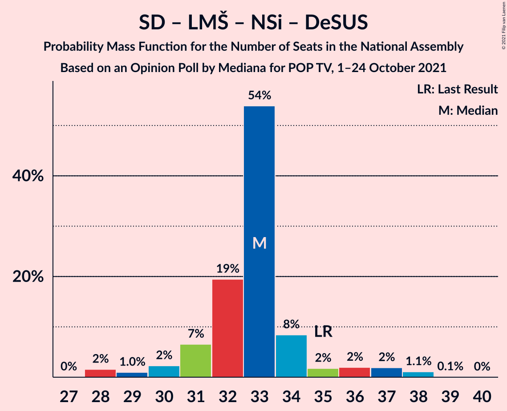
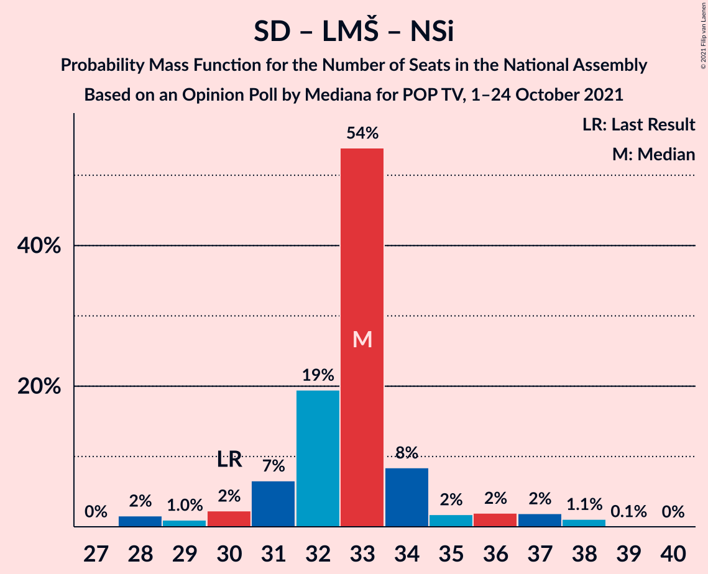
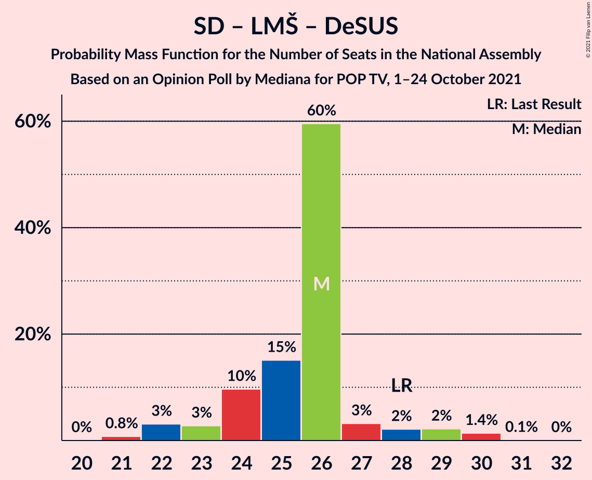
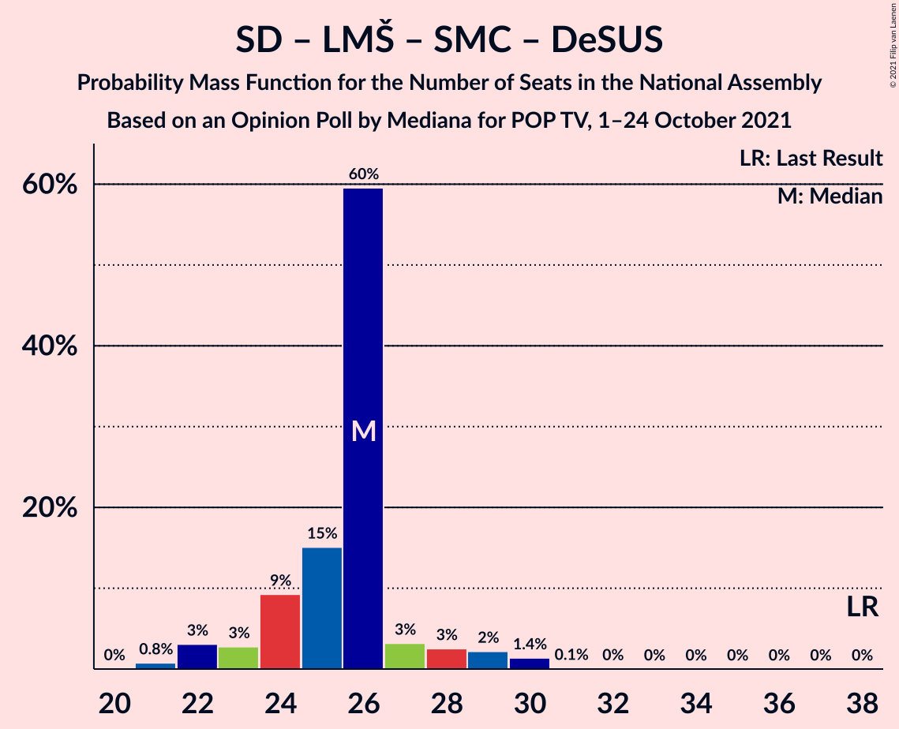

# Opinion Poll by Mediana for POP TV, 1–24 October 2021

<a href="#voting-intentions">Voting Intentions</a> | <a href="#seats">Seats</a> | <a href="#coalitions">Coalitions</a> | <a href="#technical-information">Technical Information</a>

## Voting Intentions

### Confidence Intervals

| Party | Last Result | Poll Result | 80% Confidence Interval | 90% Confidence Interval | 95% Confidence Interval | 99% Confidence Interval |
|:-----:|:-----------:|:-----------:|:-----------------------:|:-----------------------:|:-----------------------:|:-----------------------:|
| Slovenska demokratska stranka | 24.9% | 27.7% | 25.6–29.9% |25.0–30.5% |24.5–31.1% |23.5–32.2% |
| Socialni demokrati | 9.9% | 17.1% | 15.4–19.1% |15.0–19.6% |14.5–20.1% |13.8–21.0% |
| Levica | 9.3% | 13.3% | 11.8–15.1% |11.4–15.6% |11.0–16.0% |10.3–16.9% |
| Lista Marjana Šarca | 12.6% | 8.3% | 7.1–9.8% |6.8–10.2% |6.5–10.5% |5.9–11.3% |
| Nova Slovenija–Krščanski demokrati | 7.2% | 7.4% | 6.3–8.9% |6.0–9.3% |5.7–9.6% |5.2–10.3% |
| Stranka Alenke Bratušek | 5.1% | 6.0% | 5.0–7.3% |4.8–7.7% |4.5–8.0% |4.1–8.7% |
| Slovenska nacionalna stranka | 4.2% | 3.7% | 2.9–4.7% |2.7–5.0% |2.5–5.3% |2.2–5.9% |
| Andrej Čuš in Zeleni Slovenije | 1.1% | 2.7% | 2.0–3.6% |1.9–3.9% |1.7–4.1% |1.4–4.6% |
| Piratska stranka Slovenije | 2.2% | 2.4% | 1.8–3.3% |1.6–3.6% |1.5–3.8% |1.2–4.3% |
| Slovenska ljudska stranka | 2.6% | 2.0% | 1.4–2.8% |1.3–3.1% |1.2–3.3% |1.0–3.7% |
| Stranka modernega centra | 9.7% | 1.8% | 1.3–2.7% |1.2–2.9% |1.1–3.1% |0.9–3.6% |
| Demokratična stranka upokojencev Slovenije | 4.9% | 1.3% | 0.9–2.0% |0.8–2.2% |0.7–2.4% |0.5–2.8% |
| Dobra država | 1.5% | 0.8% | 0.5–1.5% |0.5–1.7% |0.4–1.8% |0.3–2.2% |

*Note:* The poll result column reflects the actual value used in the calculations. Published results may vary slightly, and in addition be rounded to fewer digits.

## Seats

### Confidence Intervals

| Party | Last Result | Median | 80% Confidence Interval | 90% Confidence Interval | 95% Confidence Interval | 99% Confidence Interval |
|:-----:|:-----------:|:------:|:-----------------------:|:-----------------------:|:-----------------------:|:-----------------------:|
| <a href="#slovenska-demokratska-stranka">Slovenska demokratska stranka</a> | 25 | 28 | 26–29 |26–31 |25–31 |24–33 |
| <a href="#socialni-demokrati">Socialni demokrati</a> | 10 | 19 | 15–19 |15–19 |14–20 |14–21 |
| <a href="#levica">Levica</a> | 9 | 12 | 12–16 |12–16 |11–16 |11–17 |
| <a href="#lista-marjana-šarca">Lista Marjana Šarca</a> | 13 | 7 | 7–9 |7–10 |7–10 |6–11 |
| <a href="#nova-slovenija–krščanski-demokrati">Nova Slovenija–Krščanski demokrati</a> | 7 | 7 | 7–8 |6–9 |6–9 |5–10 |
| <a href="#stranka-alenke-bratušek">Stranka Alenke Bratušek</a> | 5 | 6 | 5–7 |4–7 |4–8 |0–8 |
| <a href="#slovenska-nacionalna-stranka">Slovenska nacionalna stranka</a> | 4 | 4 | 0–4 |0–5 |0–5 |0–5 |
| <a href="#andrej-čuš-in-zeleni-slovenije">Andrej Čuš in Zeleni Slovenije</a> | 0 | 0 | 0 |0 |0 |0–4 |
| <a href="#piratska-stranka-slovenije">Piratska stranka Slovenije</a> | 0 | 0 | 0 |0 |0–4 |0–4 |
| <a href="#slovenska-ljudska-stranka">Slovenska ljudska stranka</a> | 0 | 0 | 0 |0 |0 |0 |
| <a href="#stranka-modernega-centra">Stranka modernega centra</a> | 10 | 0 | 0 |0 |0 |0 |
| <a href="#demokratična-stranka-upokojencev-slovenije">Demokratična stranka upokojencev Slovenije</a> | 5 | 0 | 0 |0 |0 |0 |
| <a href="#dobra-država">Dobra država</a> | 0 | 0 | 0 |0 |0 |0 |

### Slovenska demokratska stranka

*For a full overview of the results for this party, see the [Slovenska demokratska stranka](party-slovenskademokratskastranka.html) page.*

| Number of Seats | Probability | Accumulated | Special Marks |
|:---------------:|:-----------:|:-----------:|:-------------:|
| 23 | 0.4% | 100% |  |
| 24 | 0.6% | 99.6% |  |
| 25 | 3% | 99.0% | Last Result |
| 26 | 8% | 96% |  |
| 27 | 6% | 88% |  |
| 28 | 60% | 82% | Median |
| 29 | 13% | 22% |  |
| 30 | 3% | 9% |  |
| 31 | 5% | 7% |  |
| 32 | 0.3% | 2% |  |
| 33 | 1.3% | 2% |  |
| 34 | 0% | 0.2% |  |
| 35 | 0.1% | 0.2% |  |
| 36 | 0.1% | 0.1% |  |
| 37 | 0% | 0% |  |

### Socialni demokrati

*For a full overview of the results for this party, see the [Socialni demokrati](party-socialnidemokrati.html) page.*

| Number of Seats | Probability | Accumulated | Special Marks |
|:---------------:|:-----------:|:-----------:|:-------------:|
| 10 | 0% | 100% | Last Result |
| 11 | 0% | 100% |  |
| 12 | 0% | 100% |  |
| 13 | 0.4% | 100% |  |
| 14 | 3% | 99.6% |  |
| 15 | 8% | 97% |  |
| 16 | 11% | 88% |  |
| 17 | 13% | 77% |  |
| 18 | 5% | 64% |  |
| 19 | 55% | 59% | Median |
| 20 | 3% | 4% |  |
| 21 | 0.7% | 0.8% |  |
| 22 | 0.1% | 0.1% |  |
| 23 | 0% | 0% |  |

### Levica

*For a full overview of the results for this party, see the [Levica](party-levica.html) page.*

| Number of Seats | Probability | Accumulated | Special Marks |
|:---------------:|:-----------:|:-----------:|:-------------:|
| 9 | 0.1% | 100% | Last Result |
| 10 | 0.2% | 99.9% |  |
| 11 | 3% | 99.7% |  |
| 12 | 55% | 97% | Median |
| 13 | 12% | 41% |  |
| 14 | 8% | 29% |  |
| 15 | 6% | 21% |  |
| 16 | 13% | 14% |  |
| 17 | 1.2% | 1.4% |  |
| 18 | 0.2% | 0.2% |  |
| 19 | 0% | 0% |  |

### Lista Marjana Šarca

*For a full overview of the results for this party, see the [Lista Marjana Šarca](party-listamarjanašarca.html) page.*

| Number of Seats | Probability | Accumulated | Special Marks |
|:---------------:|:-----------:|:-----------:|:-------------:|
| 5 | 0.3% | 100% |  |
| 6 | 1.2% | 99.7% |  |
| 7 | 61% | 98.5% | Median |
| 8 | 11% | 38% |  |
| 9 | 19% | 27% |  |
| 10 | 6% | 7% |  |
| 11 | 1.1% | 1.2% |  |
| 12 | 0.1% | 0.1% |  |
| 13 | 0% | 0% | Last Result |

### Nova Slovenija–Krščanski demokrati

*For a full overview of the results for this party, see the [Nova Slovenija–Krščanski demokrati](party-novaslovenija–krščanskidemokrati.html) page.*

| Number of Seats | Probability | Accumulated | Special Marks |
|:---------------:|:-----------:|:-----------:|:-------------:|
| 4 | 0.1% | 100% |  |
| 5 | 2% | 99.9% |  |
| 6 | 5% | 98% |  |
| 7 | 72% | 93% | Last Result, Median |
| 8 | 15% | 21% |  |
| 9 | 5% | 6% |  |
| 10 | 0.9% | 1.1% |  |
| 11 | 0.2% | 0.2% |  |
| 12 | 0% | 0% |  |

### Stranka Alenke Bratušek

*For a full overview of the results for this party, see the [Stranka Alenke Bratušek](party-strankaalenkebratušek.html) page.*

| Number of Seats | Probability | Accumulated | Special Marks |
|:---------------:|:-----------:|:-----------:|:-------------:|
| 0 | 0.7% | 100% |  |
| 1 | 0% | 99.3% |  |
| 2 | 0% | 99.3% |  |
| 3 | 0% | 99.3% |  |
| 4 | 6% | 99.3% |  |
| 5 | 9% | 93% | Last Result |
| 6 | 71% | 84% | Median |
| 7 | 10% | 13% |  |
| 8 | 3% | 3% |  |
| 9 | 0.1% | 0.1% |  |
| 10 | 0% | 0% |  |

### Slovenska nacionalna stranka

*For a full overview of the results for this party, see the [Slovenska nacionalna stranka](party-slovenskanacionalnastranka.html) page.*

| Number of Seats | Probability | Accumulated | Special Marks |
|:---------------:|:-----------:|:-----------:|:-------------:|
| 0 | 31% | 100% |  |
| 1 | 0% | 69% |  |
| 2 | 0% | 69% |  |
| 3 | 0% | 69% |  |
| 4 | 64% | 69% | Last Result, Median |
| 5 | 5% | 5% |  |
| 6 | 0.1% | 0.1% |  |
| 7 | 0% | 0% |  |

### Andrej Čuš in Zeleni Slovenije

*For a full overview of the results for this party, see the [Andrej Čuš in Zeleni Slovenije](party-andrejčušinzelenislovenije.html) page.*

| Number of Seats | Probability | Accumulated | Special Marks |
|:---------------:|:-----------:|:-----------:|:-------------:|
| 0 | 98% | 100% | Last Result, Median |
| 1 | 0% | 2% |  |
| 2 | 0% | 2% |  |
| 3 | 0% | 2% |  |
| 4 | 1.4% | 2% |  |
| 5 | 0.1% | 0.1% |  |
| 6 | 0% | 0% |  |

### Piratska stranka Slovenije

*For a full overview of the results for this party, see the [Piratska stranka Slovenije](party-piratskastrankaslovenije.html) page.*

| Number of Seats | Probability | Accumulated | Special Marks |
|:---------------:|:-----------:|:-----------:|:-------------:|
| 0 | 95% | 100% | Last Result, Median |
| 1 | 0% | 5% |  |
| 2 | 0% | 5% |  |
| 3 | 0% | 5% |  |
| 4 | 5% | 5% |  |
| 5 | 0% | 0% |  |

### Slovenska ljudska stranka

*For a full overview of the results for this party, see the [Slovenska ljudska stranka](party-slovenskaljudskastranka.html) page.*

| Number of Seats | Probability | Accumulated | Special Marks |
|:---------------:|:-----------:|:-----------:|:-------------:|
| 0 | 100% | 100% | Last Result, Median |

### Stranka modernega centra

*For a full overview of the results for this party, see the [Stranka modernega centra](party-strankamodernegacentra.html) page.*

| Number of Seats | Probability | Accumulated | Special Marks |
|:---------------:|:-----------:|:-----------:|:-------------:|
| 0 | 99.6% | 100% | Median |
| 1 | 0% | 0.4% |  |
| 2 | 0% | 0.4% |  |
| 3 | 0% | 0.4% |  |
| 4 | 0.4% | 0.4% |  |
| 5 | 0% | 0% |  |
| 6 | 0% | 0% |  |
| 7 | 0% | 0% |  |
| 8 | 0% | 0% |  |
| 9 | 0% | 0% |  |
| 10 | 0% | 0% | Last Result |

### Demokratična stranka upokojencev Slovenije

*For a full overview of the results for this party, see the [Demokratična stranka upokojencev Slovenije](party-demokratičnastrankaupokojencevslovenije.html) page.*

| Number of Seats | Probability | Accumulated | Special Marks |
|:---------------:|:-----------:|:-----------:|:-------------:|
| 0 | 100% | 100% | Median |
| 1 | 0% | 0% |  |
| 2 | 0% | 0% |  |
| 3 | 0% | 0% |  |
| 4 | 0% | 0% |  |
| 5 | 0% | 0% | Last Result |

### Dobra država

*For a full overview of the results for this party, see the [Dobra država](party-dobradržava.html) page.*

| Number of Seats | Probability | Accumulated | Special Marks |
|:---------------:|:-----------:|:-----------:|:-------------:|
| 0 | 100% | 100% | Last Result, Median |

## Coalitions

### Confidence Intervals

| Coalition | Last Result | Median | Majority? | 80% Confidence Interval | 90% Confidence Interval | 95% Confidence Interval | 99% Confidence Interval |
|:---------:|:-----------:|:------:|:---------:|:-----------------------:|:-----------------------:|:-----------------------:|:-----------------------:|
| Socialni demokrati – Lista Marjana Šarca – Nova Slovenija–Krščanski demokrati – Stranka Alenke Bratušek – Stranka modernega centra – Demokratična stranka upokojencev Slovenije | 50 | 39 | 0% | 37–40 | 36–42 | 35–42 | 34–45 |
| Slovenska demokratska stranka – Lista Marjana Šarca – Demokratična stranka upokojencev Slovenije | 43 | 35 | 0% | 35–39 | 33–39 | 33–40 | 32–42 |
| Slovenska demokratska stranka – Lista Marjana Šarca | 38 | 35 | 0% | 35–39 | 33–39 | 33–40 | 32–42 |
| Socialni demokrati – Lista Marjana Šarca – Nova Slovenija–Krščanski demokrati – Demokratična stranka upokojencev Slovenije | 35 | 33 | 0% | 31–34 | 31–36 | 29–37 | 28–38 |
| Socialni demokrati – Lista Marjana Šarca – Nova Slovenija–Krščanski demokrati – Stranka modernega centra – Demokratična stranka upokojencev Slovenije | 45 | 33 | 0% | 31–34 | 31–36 | 29–37 | 28–38 |
| Socialni demokrati – Lista Marjana Šarca – Nova Slovenija–Krščanski demokrati | 30 | 33 | 0% | 31–34 | 31–36 | 29–37 | 28–38 |
| Socialni demokrati – Lista Marjana Šarca – Nova Slovenija–Krščanski demokrati – Stranka modernega centra | 40 | 33 | 0% | 31–34 | 31–36 | 29–37 | 28–38 |
| Socialni demokrati – Lista Marjana Šarca – Stranka Alenke Bratušek – Stranka modernega centra – Demokratična stranka upokojencev Slovenije | 43 | 32 | 0% | 29–32 | 28–34 | 28–35 | 25–37 |
| Socialni demokrati – Lista Marjana Šarca – Demokratična stranka upokojencev Slovenije | 28 | 26 | 0% | 24–26 | 23–28 | 22–29 | 21–30 |
| Socialni demokrati – Lista Marjana Šarca – Stranka modernega centra – Demokratična stranka upokojencev Slovenije | 38 | 26 | 0% | 24–26 | 23–28 | 22–29 | 21–30 |
| Socialni demokrati – Lista Marjana Šarca | 23 | 26 | 0% | 24–26 | 23–28 | 22–29 | 21–30 |
| Socialni demokrati – Lista Marjana Šarca – Stranka modernega centra | 33 | 26 | 0% | 24–26 | 23–28 | 22–29 | 21–30 |
| Socialni demokrati – Stranka modernega centra – Demokratična stranka upokojencev Slovenije | 25 | 19 | 0% | 15–19 | 15–19 | 14–20 | 14–21 |

### Socialni demokrati – Lista Marjana Šarca – Nova Slovenija–Krščanski demokrati – Stranka Alenke Bratušek – Stranka modernega centra – Demokratična stranka upokojencev Slovenije

| Number of Seats | Probability | Accumulated | Special Marks |
|:---------------:|:-----------:|:-----------:|:-------------:|
| 32 | 0.1% | 100% |  |
| 33 | 0.1% | 99.9% |  |
| 34 | 2% | 99.8% |  |
| 35 | 1.2% | 98% |  |
| 36 | 5% | 96% |  |
| 37 | 3% | 91% |  |
| 38 | 15% | 89% |  |
| 39 | 63% | 73% | Median |
| 40 | 4% | 10% |  |
| 41 | 1.3% | 7% |  |
| 42 | 4% | 5% |  |
| 43 | 0.3% | 2% |  |
| 44 | 0.4% | 1.3% |  |
| 45 | 1.0% | 1.0% |  |
| 46 | 0% | 0% | Majority |
| 47 | 0% | 0% |  |
| 48 | 0% | 0% |  |
| 49 | 0% | 0% |  |
| 50 | 0% | 0% | Last Result |

### Slovenska demokratska stranka – Lista Marjana Šarca – Demokratična stranka upokojencev Slovenije

| Number of Seats | Probability | Accumulated | Special Marks |
|:---------------:|:-----------:|:-----------:|:-------------:|
| 30 | 0% | 100% |  |
| 31 | 0.1% | 99.9% |  |
| 32 | 2% | 99.9% |  |
| 33 | 5% | 98% |  |
| 34 | 3% | 93% |  |
| 35 | 55% | 90% | Median |
| 36 | 9% | 35% |  |
| 37 | 8% | 27% |  |
| 38 | 8% | 19% |  |
| 39 | 7% | 11% |  |
| 40 | 2% | 3% |  |
| 41 | 0.4% | 1.1% |  |
| 42 | 0.5% | 0.7% |  |
| 43 | 0.1% | 0.2% | Last Result |
| 44 | 0% | 0.1% |  |
| 45 | 0.1% | 0.1% |  |
| 46 | 0% | 0% | Majority |

### Slovenska demokratska stranka – Lista Marjana Šarca

| Number of Seats | Probability | Accumulated | Special Marks |
|:---------------:|:-----------:|:-----------:|:-------------:|
| 30 | 0% | 100% |  |
| 31 | 0.1% | 99.9% |  |
| 32 | 2% | 99.9% |  |
| 33 | 5% | 98% |  |
| 34 | 3% | 93% |  |
| 35 | 55% | 90% | Median |
| 36 | 9% | 35% |  |
| 37 | 8% | 27% |  |
| 38 | 8% | 19% | Last Result |
| 39 | 7% | 11% |  |
| 40 | 2% | 3% |  |
| 41 | 0.4% | 1.1% |  |
| 42 | 0.5% | 0.7% |  |
| 43 | 0.1% | 0.2% |  |
| 44 | 0% | 0.1% |  |
| 45 | 0.1% | 0.1% |  |
| 46 | 0% | 0% | Majority |

### Socialni demokrati – Lista Marjana Šarca – Nova Slovenija–Krščanski demokrati – Demokratična stranka upokojencev Slovenije

| Number of Seats | Probability | Accumulated | Special Marks |
|:---------------:|:-----------:|:-----------:|:-------------:|
| 27 | 0% | 100% |  |
| 28 | 2% | 99.9% |  |
| 29 | 1.0% | 98% |  |
| 30 | 2% | 97% |  |
| 31 | 7% | 95% |  |
| 32 | 19% | 89% |  |
| 33 | 54% | 69% | Median |
| 34 | 8% | 15% |  |
| 35 | 2% | 7% | Last Result |
| 36 | 2% | 5% |  |
| 37 | 2% | 3% |  |
| 38 | 1.1% | 1.2% |  |
| 39 | 0.1% | 0.1% |  |
| 40 | 0% | 0% |  |

### Socialni demokrati – Lista Marjana Šarca – Nova Slovenija–Krščanski demokrati – Stranka modernega centra – Demokratična stranka upokojencev Slovenije

| Number of Seats | Probability | Accumulated | Special Marks |
|:---------------:|:-----------:|:-----------:|:-------------:|
| 27 | 0% | 100% |  |
| 28 | 2% | 99.9% |  |
| 29 | 1.0% | 98% |  |
| 30 | 2% | 97% |  |
| 31 | 6% | 95% |  |
| 32 | 19% | 89% |  |
| 33 | 54% | 70% | Median |
| 34 | 8% | 16% |  |
| 35 | 2% | 7% |  |
| 36 | 2% | 5% |  |
| 37 | 2% | 3% |  |
| 38 | 1.1% | 1.2% |  |
| 39 | 0.1% | 0.1% |  |
| 40 | 0% | 0% |  |
| 41 | 0% | 0% |  |
| 42 | 0% | 0% |  |
| 43 | 0% | 0% |  |
| 44 | 0% | 0% |  |
| 45 | 0% | 0% | Last Result |

### Socialni demokrati – Lista Marjana Šarca – Nova Slovenija–Krščanski demokrati

| Number of Seats | Probability | Accumulated | Special Marks |
|:---------------:|:-----------:|:-----------:|:-------------:|
| 27 | 0% | 100% |  |
| 28 | 2% | 99.9% |  |
| 29 | 1.0% | 98% |  |
| 30 | 2% | 97% | Last Result |
| 31 | 7% | 95% |  |
| 32 | 19% | 89% |  |
| 33 | 54% | 69% | Median |
| 34 | 8% | 15% |  |
| 35 | 2% | 7% |  |
| 36 | 2% | 5% |  |
| 37 | 2% | 3% |  |
| 38 | 1.1% | 1.2% |  |
| 39 | 0.1% | 0.1% |  |
| 40 | 0% | 0% |  |

### Socialni demokrati – Lista Marjana Šarca – Nova Slovenija–Krščanski demokrati – Stranka modernega centra

| Number of Seats | Probability | Accumulated | Special Marks |
|:---------------:|:-----------:|:-----------:|:-------------:|
| 27 | 0% | 100% |  |
| 28 | 2% | 99.9% |  |
| 29 | 1.0% | 98% |  |
| 30 | 2% | 97% |  |
| 31 | 6% | 95% |  |
| 32 | 19% | 89% |  |
| 33 | 54% | 70% | Median |
| 34 | 8% | 16% |  |
| 35 | 2% | 7% |  |
| 36 | 2% | 5% |  |
| 37 | 2% | 3% |  |
| 38 | 1.1% | 1.2% |  |
| 39 | 0.1% | 0.1% |  |
| 40 | 0% | 0% | Last Result |

### Socialni demokrati – Lista Marjana Šarca – Stranka Alenke Bratušek – Stranka modernega centra – Demokratična stranka upokojencev Slovenije

| Number of Seats | Probability | Accumulated | Special Marks |
|:---------------:|:-----------:|:-----------:|:-------------:|
| 25 | 0.5% | 100% |  |
| 26 | 0.3% | 99.5% |  |
| 27 | 0.9% | 99.2% |  |
| 28 | 4% | 98% |  |
| 29 | 5% | 95% |  |
| 30 | 7% | 90% |  |
| 31 | 14% | 83% |  |
| 32 | 59% | 69% | Median |
| 33 | 4% | 10% |  |
| 34 | 3% | 5% |  |
| 35 | 0.6% | 3% |  |
| 36 | 0.9% | 2% |  |
| 37 | 1.1% | 1.1% |  |
| 38 | 0% | 0% |  |
| 39 | 0% | 0% |  |
| 40 | 0% | 0% |  |
| 41 | 0% | 0% |  |
| 42 | 0% | 0% |  |
| 43 | 0% | 0% | Last Result |

### Socialni demokrati – Lista Marjana Šarca – Demokratična stranka upokojencev Slovenije

| Number of Seats | Probability | Accumulated | Special Marks |
|:---------------:|:-----------:|:-----------:|:-------------:|
| 21 | 0.8% | 100% |  |
| 22 | 3% | 99.2% |  |
| 23 | 3% | 96% |  |
| 24 | 10% | 93% |  |
| 25 | 15% | 84% |  |
| 26 | 60% | 69% | Median |
| 27 | 3% | 9% |  |
| 28 | 2% | 6% | Last Result |
| 29 | 2% | 4% |  |
| 30 | 1.4% | 2% |  |
| 31 | 0.1% | 0.1% |  |
| 32 | 0% | 0% |  |

### Socialni demokrati – Lista Marjana Šarca – Stranka modernega centra – Demokratična stranka upokojencev Slovenije

| Number of Seats | Probability | Accumulated | Special Marks |
|:---------------:|:-----------:|:-----------:|:-------------:|
| 21 | 0.8% | 100% |  |
| 22 | 3% | 99.2% |  |
| 23 | 3% | 96% |  |
| 24 | 9% | 93% |  |
| 25 | 15% | 84% |  |
| 26 | 60% | 69% | Median |
| 27 | 3% | 9% |  |
| 28 | 3% | 6% |  |
| 29 | 2% | 4% |  |
| 30 | 1.4% | 2% |  |
| 31 | 0.1% | 0.1% |  |
| 32 | 0% | 0% |  |
| 33 | 0% | 0% |  |
| 34 | 0% | 0% |  |
| 35 | 0% | 0% |  |
| 36 | 0% | 0% |  |
| 37 | 0% | 0% |  |
| 38 | 0% | 0% | Last Result |

### Socialni demokrati – Lista Marjana Šarca

| Number of Seats | Probability | Accumulated | Special Marks |
|:---------------:|:-----------:|:-----------:|:-------------:|
| 21 | 0.8% | 100% |  |
| 22 | 3% | 99.2% |  |
| 23 | 3% | 96% | Last Result |
| 24 | 10% | 93% |  |
| 25 | 15% | 84% |  |
| 26 | 60% | 69% | Median |
| 27 | 3% | 9% |  |
| 28 | 2% | 6% |  |
| 29 | 2% | 4% |  |
| 30 | 1.4% | 2% |  |
| 31 | 0.1% | 0.1% |  |
| 32 | 0% | 0% |  |

### Socialni demokrati – Lista Marjana Šarca – Stranka modernega centra

| Number of Seats | Probability | Accumulated | Special Marks |
|:---------------:|:-----------:|:-----------:|:-------------:|
| 21 | 0.8% | 100% |  |
| 22 | 3% | 99.2% |  |
| 23 | 3% | 96% |  |
| 24 | 9% | 93% |  |
| 25 | 15% | 84% |  |
| 26 | 60% | 69% | Median |
| 27 | 3% | 9% |  |
| 28 | 3% | 6% |  |
| 29 | 2% | 4% |  |
| 30 | 1.4% | 2% |  |
| 31 | 0.1% | 0.1% |  |
| 32 | 0% | 0% |  |
| 33 | 0% | 0% | Last Result |

### Socialni demokrati – Stranka modernega centra – Demokratična stranka upokojencev Slovenije

| Number of Seats | Probability | Accumulated | Special Marks |
|:---------------:|:-----------:|:-----------:|:-------------:|
| 13 | 0.4% | 100% |  |
| 14 | 3% | 99.6% |  |
| 15 | 8% | 97% |  |
| 16 | 11% | 88% |  |
| 17 | 12% | 77% |  |
| 18 | 5% | 65% |  |
| 19 | 55% | 60% | Median |
| 20 | 3% | 4% |  |
| 21 | 1.1% | 1.2% |  |
| 22 | 0.1% | 0.1% |  |
| 23 | 0% | 0% |  |
| 24 | 0% | 0% |  |
| 25 | 0% | 0% | Last Result |

## Technical Information

### Opinion Poll

+ **Polling firm:** Mediana
+ **Commissioner(s):** POP TV
+ **Fieldwork period:** 1–24 October 2021

### Calculations

+ **Sample size:** 712
+ **Simulations done:** 1,048,576
+ **Error estimate:** 2.94%

