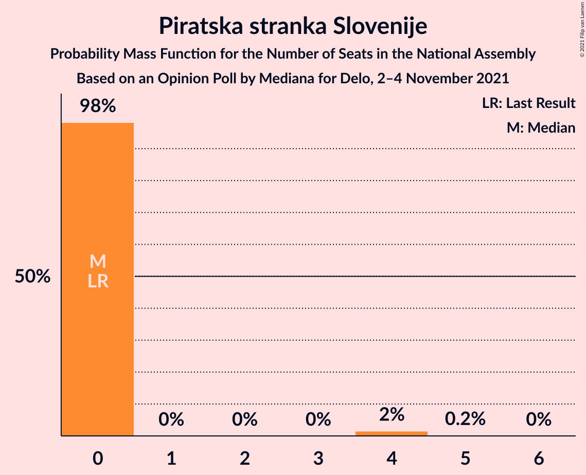
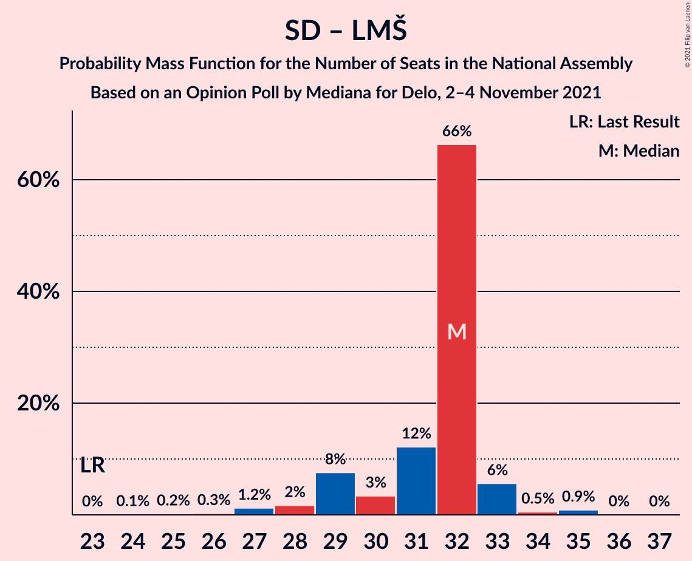

# Opinion Poll by Mediana for Delo, 2–4 November 2021

<a href="#voting-intentions">Voting Intentions</a> | <a href="#seats">Seats</a> | <a href="#coalitions">Coalitions</a> | <a href="#technical-information">Technical Information</a>

## Voting Intentions

### Confidence Intervals

| Party | Last Result | Poll Result | 80% Confidence Interval | 90% Confidence Interval | 95% Confidence Interval | 99% Confidence Interval |
|:-----:|:-----------:|:-----------:|:-----------------------:|:-----------------------:|:-----------------------:|:-----------------------:|
| Slovenska demokratska stranka | 24.9% | 24.5% | 22.6–26.7% |22.0–27.3% |21.5–27.8% |20.6–28.9% |
| Socialni demokrati | 9.9% | 20.2% | 18.3–22.2% |17.8–22.8% |17.4–23.3% |16.5–24.3% |
| Levica | 9.3% | 11.3% | 9.9–12.9% |9.5–13.4% |9.2–13.8% |8.5–14.7% |
| Lista Marjana Šarca | 12.6% | 9.4% | 8.2–11.0% |7.8–11.4% |7.5–11.8% |6.9–12.6% |
| Nova Slovenija–Krščanski demokrati | 7.2% | 9.3% | 8.0–10.9% |7.7–11.3% |7.4–11.7% |6.8–12.5% |
| Stranka Alenke Bratušek | 5.1% | 5.8% | 4.8–7.1% |4.5–7.4% |4.3–7.8% |3.9–8.4% |
| Slovenska nacionalna stranka | 4.2% | 3.0% | 2.3–4.0% |2.1–4.2% |2.0–4.5% |1.7–5.0% |
| Dobra država | 1.5% | 3.0% | 2.3–4.0% |2.1–4.2% |2.0–4.5% |1.7–5.0% |
| Piratska stranka Slovenije | 2.2% | 2.8% | 2.2–3.8% |2.0–4.1% |1.8–4.3% |1.6–4.8% |
| Andrej Čuš in Zeleni Slovenije | 1.1% | 2.7% | 2.0–3.6% |1.9–3.9% |1.7–4.2% |1.5–4.7% |
| Slovenska ljudska stranka | 2.6% | 2.5% | 1.9–3.5% |1.8–3.7% |1.6–4.0% |1.4–4.5% |
| Stranka modernega centra | 9.7% | 0.6% | 0.3–1.1% |0.3–1.3% |0.2–1.4% |0.1–1.8% |
| Demokratična stranka upokojencev Slovenije | 4.9% | 0.6% | 0.3–1.1% |0.3–1.3% |0.2–1.4% |0.1–1.8% |

*Note:* The poll result column reflects the actual value used in the calculations. Published results may vary slightly, and in addition be rounded to fewer digits.

## Seats

### Confidence Intervals

| Party | Last Result | Median | 80% Confidence Interval | 90% Confidence Interval | 95% Confidence Interval | 99% Confidence Interval |
|:-----:|:-----------:|:------:|:-----------------------:|:-----------------------:|:-----------------------:|:-----------------------:|
| <a href="#slovenska-demokratska-stranka">Slovenska demokratska stranka</a> | 25 | 26 | 25–27 |24–29 |22–29 |22–31 |
| <a href="#socialni-demokrati">Socialni demokrati</a> | 10 | 23 | 20–23 |20–23 |18–23 |18–24 |
| <a href="#levica">Levica</a> | 9 | 9 | 9–12 |9–12 |9–13 |9–15 |
| <a href="#lista-marjana-šarca">Lista Marjana Šarca</a> | 13 | 9 | 9–11 |8–13 |8–13 |7–13 |
| <a href="#nova-slovenija–krščanski-demokrati">Nova Slovenija–Krščanski demokrati</a> | 7 | 9 | 8–10 |8–11 |8–11 |7–13 |
| <a href="#stranka-alenke-bratušek">Stranka Alenke Bratušek</a> | 5 | 6 | 5–6 |5–7 |5–8 |0–8 |
| <a href="#slovenska-nacionalna-stranka">Slovenska nacionalna stranka</a> | 4 | 0 | 0 |0 |0–4 |0–4 |
| <a href="#dobra-država">Dobra država</a> | 0 | 0 | 0 |0–4 |0–4 |0–5 |
| <a href="#piratska-stranka-slovenije">Piratska stranka Slovenije</a> | 0 | 0 | 0 |0 |0 |0–4 |
| <a href="#andrej-čuš-in-zeleni-slovenije">Andrej Čuš in Zeleni Slovenije</a> | 0 | 0 | 0 |0 |0 |0–4 |
| <a href="#slovenska-ljudska-stranka">Slovenska ljudska stranka</a> | 0 | 0 | 0 |0 |0 |0–4 |
| <a href="#stranka-modernega-centra">Stranka modernega centra</a> | 10 | 0 | 0 |0 |0 |0 |
| <a href="#demokratična-stranka-upokojencev-slovenije">Demokratična stranka upokojencev Slovenije</a> | 5 | 0 | 0 |0 |0 |0 |

### Slovenska demokratska stranka

*For a full overview of the results for this party, see the [Slovenska demokratska stranka](party-slovenskademokratskastranka.html) page.*

| Number of Seats | Probability | Accumulated | Special Marks |
|:---------------:|:-----------:|:-----------:|:-------------:|
| 20 | 0.1% | 100% |  |
| 21 | 0.3% | 99.9% |  |
| 22 | 2% | 99.6% |  |
| 23 | 1.4% | 97% |  |
| 24 | 3% | 96% |  |
| 25 | 7% | 93% | Last Result |
| 26 | 70% | 86% | Median |
| 27 | 7% | 16% |  |
| 28 | 2% | 8% |  |
| 29 | 4% | 7% |  |
| 30 | 1.0% | 2% |  |
| 31 | 1.3% | 1.3% |  |
| 32 | 0% | 0% |  |

### Socialni demokrati

*For a full overview of the results for this party, see the [Socialni demokrati](party-socialnidemokrati.html) page.*

| Number of Seats | Probability | Accumulated | Special Marks |
|:---------------:|:-----------:|:-----------:|:-------------:|
| 10 | 0% | 100% | Last Result |
| 11 | 0% | 100% |  |
| 12 | 0% | 100% |  |
| 13 | 0% | 100% |  |
| 14 | 0% | 100% |  |
| 15 | 0% | 100% |  |
| 16 | 0.1% | 100% |  |
| 17 | 0.3% | 99.9% |  |
| 18 | 2% | 99.5% |  |
| 19 | 2% | 97% |  |
| 20 | 13% | 95% |  |
| 21 | 13% | 83% |  |
| 22 | 4% | 69% |  |
| 23 | 64% | 65% | Median |
| 24 | 1.1% | 1.4% |  |
| 25 | 0.3% | 0.3% |  |
| 26 | 0.1% | 0.1% |  |
| 27 | 0% | 0% |  |

### Levica

*For a full overview of the results for this party, see the [Levica](party-levica.html) page.*

| Number of Seats | Probability | Accumulated | Special Marks |
|:---------------:|:-----------:|:-----------:|:-------------:|
| 8 | 0.3% | 100% |  |
| 9 | 64% | 99.7% | Last Result, Median |
| 10 | 10% | 36% |  |
| 11 | 15% | 26% |  |
| 12 | 6% | 11% |  |
| 13 | 3% | 5% |  |
| 14 | 2% | 2% |  |
| 15 | 0.2% | 0.5% |  |
| 16 | 0.2% | 0.3% |  |
| 17 | 0.1% | 0.1% |  |
| 18 | 0% | 0% |  |

### Lista Marjana Šarca

*For a full overview of the results for this party, see the [Lista Marjana Šarca](party-listamarjanašarca.html) page.*

| Number of Seats | Probability | Accumulated | Special Marks |
|:---------------:|:-----------:|:-----------:|:-------------:|
| 6 | 0.1% | 100% |  |
| 7 | 2% | 99.9% |  |
| 8 | 7% | 98% |  |
| 9 | 67% | 91% | Median |
| 10 | 9% | 23% |  |
| 11 | 7% | 15% |  |
| 12 | 2% | 7% |  |
| 13 | 5% | 5% | Last Result |
| 14 | 0.2% | 0.2% |  |
| 15 | 0% | 0% |  |

### Nova Slovenija–Krščanski demokrati

*For a full overview of the results for this party, see the [Nova Slovenija–Krščanski demokrati](party-novaslovenija–krščanskidemokrati.html) page.*

| Number of Seats | Probability | Accumulated | Special Marks |
|:---------------:|:-----------:|:-----------:|:-------------:|
| 6 | 0.1% | 100% |  |
| 7 | 2% | 99.9% | Last Result |
| 8 | 13% | 98% |  |
| 9 | 74% | 85% | Median |
| 10 | 4% | 11% |  |
| 11 | 4% | 7% |  |
| 12 | 1.3% | 2% |  |
| 13 | 1.1% | 1.1% |  |
| 14 | 0% | 0.1% |  |
| 15 | 0% | 0% |  |

### Stranka Alenke Bratušek

*For a full overview of the results for this party, see the [Stranka Alenke Bratušek](party-strankaalenkebratušek.html) page.*

| Number of Seats | Probability | Accumulated | Special Marks |
|:---------------:|:-----------:|:-----------:|:-------------:|
| 0 | 0.8% | 100% |  |
| 1 | 0% | 99.2% |  |
| 2 | 0% | 99.2% |  |
| 3 | 0% | 99.2% |  |
| 4 | 1.1% | 99.2% |  |
| 5 | 8% | 98% | Last Result |
| 6 | 83% | 90% | Median |
| 7 | 4% | 7% |  |
| 8 | 3% | 3% |  |
| 9 | 0.2% | 0.3% |  |
| 10 | 0% | 0% |  |

### Slovenska nacionalna stranka

*For a full overview of the results for this party, see the [Slovenska nacionalna stranka](party-slovenskanacionalnastranka.html) page.*

| Number of Seats | Probability | Accumulated | Special Marks |
|:---------------:|:-----------:|:-----------:|:-------------:|
| 0 | 97% | 100% | Median |
| 1 | 0% | 3% |  |
| 2 | 0% | 3% |  |
| 3 | 0% | 3% |  |
| 4 | 2% | 3% | Last Result |
| 5 | 0.4% | 0.4% |  |
| 6 | 0% | 0% |  |

### Dobra država

*For a full overview of the results for this party, see the [Dobra država](party-dobradržava.html) page.*

| Number of Seats | Probability | Accumulated | Special Marks |
|:---------------:|:-----------:|:-----------:|:-------------:|
| 0 | 93% | 100% | Last Result, Median |
| 1 | 0% | 7% |  |
| 2 | 0% | 7% |  |
| 3 | 0% | 7% |  |
| 4 | 6% | 7% |  |
| 5 | 0.6% | 0.6% |  |
| 6 | 0% | 0% |  |

### Piratska stranka Slovenije

*For a full overview of the results for this party, see the [Piratska stranka Slovenije](party-piratskastrankaslovenije.html) page.*

| Number of Seats | Probability | Accumulated | Special Marks |
|:---------------:|:-----------:|:-----------:|:-------------:|
| 0 | 98% | 100% | Last Result, Median |
| 1 | 0% | 2% |  |
| 2 | 0% | 2% |  |
| 3 | 0% | 2% |  |
| 4 | 2% | 2% |  |
| 5 | 0.2% | 0.2% |  |
| 6 | 0% | 0% |  |

### Andrej Čuš in Zeleni Slovenije

*For a full overview of the results for this party, see the [Andrej Čuš in Zeleni Slovenije](party-andrejčušinzelenislovenije.html) page.*

| Number of Seats | Probability | Accumulated | Special Marks |
|:---------------:|:-----------:|:-----------:|:-------------:|
| 0 | 99.2% | 100% | Last Result, Median |
| 1 | 0% | 0.8% |  |
| 2 | 0% | 0.8% |  |
| 3 | 0% | 0.8% |  |
| 4 | 0.6% | 0.8% |  |
| 5 | 0.2% | 0.2% |  |
| 6 | 0% | 0% |  |

### Slovenska ljudska stranka

*For a full overview of the results for this party, see the [Slovenska ljudska stranka](party-slovenskaljudskastranka.html) page.*

| Number of Seats | Probability | Accumulated | Special Marks |
|:---------------:|:-----------:|:-----------:|:-------------:|
| 0 | 99.2% | 100% | Last Result, Median |
| 1 | 0% | 0.8% |  |
| 2 | 0% | 0.8% |  |
| 3 | 0% | 0.8% |  |
| 4 | 0.8% | 0.8% |  |
| 5 | 0% | 0% |  |

### Stranka modernega centra

*For a full overview of the results for this party, see the [Stranka modernega centra](party-strankamodernegacentra.html) page.*

| Number of Seats | Probability | Accumulated | Special Marks |
|:---------------:|:-----------:|:-----------:|:-------------:|
| 0 | 100% | 100% | Median |
| 1 | 0% | 0% |  |
| 2 | 0% | 0% |  |
| 3 | 0% | 0% |  |
| 4 | 0% | 0% |  |
| 5 | 0% | 0% |  |
| 6 | 0% | 0% |  |
| 7 | 0% | 0% |  |
| 8 | 0% | 0% |  |
| 9 | 0% | 0% |  |
| 10 | 0% | 0% | Last Result |

### Demokratična stranka upokojencev Slovenije

*For a full overview of the results for this party, see the [Demokratična stranka upokojencev Slovenije](party-demokratičnastrankaupokojencevslovenije.html) page.*

| Number of Seats | Probability | Accumulated | Special Marks |
|:---------------:|:-----------:|:-----------:|:-------------:|
| 0 | 100% | 100% | Median |
| 1 | 0% | 0% |  |
| 2 | 0% | 0% |  |
| 3 | 0% | 0% |  |
| 4 | 0% | 0% |  |
| 5 | 0% | 0% | Last Result |

## Coalitions

### Confidence Intervals

| Coalition | Last Result | Median | Majority? | 80% Confidence Interval | 90% Confidence Interval | 95% Confidence Interval | 99% Confidence Interval |
|:---------:|:-----------:|:------:|:---------:|:-----------------------:|:-----------------------:|:-----------------------:|:-----------------------:|
| Socialni demokrati – Lista Marjana Šarca – Nova Slovenija–Krščanski demokrati – Stranka Alenke Bratušek – Demokratična stranka upokojencev Slovenije – Stranka modernega centra | 50 | 47 | 87% | 44–47 | 43–48 | 42–49 | 40–49 |
| Socialni demokrati – Lista Marjana Šarca – Nova Slovenija–Krščanski demokrati – Demokratična stranka upokojencev Slovenije | 35 | 41 | 0.4% | 38–41 | 37–42 | 37–42 | 35–45 |
| Socialni demokrati – Lista Marjana Šarca – Nova Slovenija–Krščanski demokrati – Demokratična stranka upokojencev Slovenije – Stranka modernega centra | 45 | 41 | 0.4% | 38–41 | 37–42 | 37–42 | 35–45 |
| Socialni demokrati – Lista Marjana Šarca – Nova Slovenija–Krščanski demokrati | 30 | 41 | 0.4% | 38–41 | 37–42 | 37–42 | 35–45 |
| Socialni demokrati – Lista Marjana Šarca – Nova Slovenija–Krščanski demokrati – Stranka modernega centra | 40 | 41 | 0.4% | 38–41 | 37–42 | 37–42 | 35–45 |
| Socialni demokrati – Lista Marjana Šarca – Stranka Alenke Bratušek – Demokratična stranka upokojencev Slovenije – Stranka modernega centra | 43 | 38 | 0% | 35–38 | 35–38 | 34–40 | 31–41 |
| Slovenska demokratska stranka – Lista Marjana Šarca – Demokratična stranka upokojencev Slovenije | 43 | 35 | 0% | 34–40 | 33–40 | 32–40 | 30–40 |
| Slovenska demokratska stranka – Lista Marjana Šarca | 38 | 35 | 0% | 34–40 | 33–40 | 32–40 | 30–40 |
| Socialni demokrati – Lista Marjana Šarca – Demokratična stranka upokojencev Slovenije | 28 | 32 | 0% | 29–32 | 29–33 | 28–33 | 26–35 |
| Socialni demokrati – Lista Marjana Šarca – Demokratična stranka upokojencev Slovenije – Stranka modernega centra | 38 | 32 | 0% | 29–32 | 29–33 | 28–33 | 26–35 |
| Socialni demokrati – Lista Marjana Šarca | 23 | 32 | 0% | 29–32 | 29–33 | 28–33 | 26–35 |
| Socialni demokrati – Lista Marjana Šarca – Stranka modernega centra | 33 | 32 | 0% | 29–32 | 29–33 | 28–33 | 26–35 |
| Socialni demokrati – Demokratična stranka upokojencev Slovenije – Stranka modernega centra | 25 | 23 | 0% | 20–23 | 20–23 | 18–23 | 18–24 |

### Socialni demokrati – Lista Marjana Šarca – Nova Slovenija–Krščanski demokrati – Stranka Alenke Bratušek – Demokratična stranka upokojencev Slovenije – Stranka modernega centra

| Number of Seats | Probability | Accumulated | Special Marks |
|:---------------:|:-----------:|:-----------:|:-------------:|
| 39 | 0.2% | 100% |  |
| 40 | 0.9% | 99.8% |  |
| 41 | 0.2% | 98.9% |  |
| 42 | 1.3% | 98.7% |  |
| 43 | 6% | 97% |  |
| 44 | 2% | 92% |  |
| 45 | 3% | 89% |  |
| 46 | 10% | 87% | Majority |
| 47 | 69% | 76% | Median |
| 48 | 4% | 7% |  |
| 49 | 2% | 3% |  |
| 50 | 0.2% | 0.5% | Last Result |
| 51 | 0.1% | 0.3% |  |
| 52 | 0.1% | 0.1% |  |
| 53 | 0% | 0% |  |

### Socialni demokrati – Lista Marjana Šarca – Nova Slovenija–Krščanski demokrati – Demokratična stranka upokojencev Slovenije

| Number of Seats | Probability | Accumulated | Special Marks |
|:---------------:|:-----------:|:-----------:|:-------------:|
| 32 | 0% | 100% |  |
| 33 | 0.1% | 99.9% |  |
| 34 | 0.2% | 99.9% |  |
| 35 | 0.7% | 99.7% | Last Result |
| 36 | 1.2% | 98.9% |  |
| 37 | 6% | 98% |  |
| 38 | 1.3% | 91% |  |
| 39 | 4% | 90% |  |
| 40 | 7% | 86% |  |
| 41 | 72% | 79% | Median |
| 42 | 5% | 7% |  |
| 43 | 1.1% | 2% |  |
| 44 | 0.4% | 1.1% |  |
| 45 | 0.3% | 0.7% |  |
| 46 | 0.3% | 0.4% | Majority |
| 47 | 0.1% | 0.1% |  |
| 48 | 0% | 0% |  |

### Socialni demokrati – Lista Marjana Šarca – Nova Slovenija–Krščanski demokrati – Demokratična stranka upokojencev Slovenije – Stranka modernega centra

| Number of Seats | Probability | Accumulated | Special Marks |
|:---------------:|:-----------:|:-----------:|:-------------:|
| 32 | 0% | 100% |  |
| 33 | 0.1% | 99.9% |  |
| 34 | 0.2% | 99.9% |  |
| 35 | 0.7% | 99.7% |  |
| 36 | 1.2% | 98.9% |  |
| 37 | 6% | 98% |  |
| 38 | 1.3% | 91% |  |
| 39 | 4% | 90% |  |
| 40 | 7% | 86% |  |
| 41 | 72% | 79% | Median |
| 42 | 5% | 7% |  |
| 43 | 1.1% | 2% |  |
| 44 | 0.4% | 1.1% |  |
| 45 | 0.3% | 0.7% | Last Result |
| 46 | 0.3% | 0.4% | Majority |
| 47 | 0.1% | 0.1% |  |
| 48 | 0% | 0% |  |

### Socialni demokrati – Lista Marjana Šarca – Nova Slovenija–Krščanski demokrati

| Number of Seats | Probability | Accumulated | Special Marks |
|:---------------:|:-----------:|:-----------:|:-------------:|
| 30 | 0% | 100% | Last Result |
| 31 | 0% | 100% |  |
| 32 | 0% | 100% |  |
| 33 | 0.1% | 99.9% |  |
| 34 | 0.2% | 99.9% |  |
| 35 | 0.7% | 99.7% |  |
| 36 | 1.2% | 98.9% |  |
| 37 | 6% | 98% |  |
| 38 | 1.3% | 91% |  |
| 39 | 4% | 90% |  |
| 40 | 7% | 86% |  |
| 41 | 72% | 79% | Median |
| 42 | 5% | 7% |  |
| 43 | 1.1% | 2% |  |
| 44 | 0.4% | 1.1% |  |
| 45 | 0.3% | 0.7% |  |
| 46 | 0.3% | 0.4% | Majority |
| 47 | 0.1% | 0.1% |  |
| 48 | 0% | 0% |  |

### Socialni demokrati – Lista Marjana Šarca – Nova Slovenija–Krščanski demokrati – Stranka modernega centra

| Number of Seats | Probability | Accumulated | Special Marks |
|:---------------:|:-----------:|:-----------:|:-------------:|
| 32 | 0% | 100% |  |
| 33 | 0.1% | 99.9% |  |
| 34 | 0.2% | 99.9% |  |
| 35 | 0.7% | 99.7% |  |
| 36 | 1.2% | 98.9% |  |
| 37 | 6% | 98% |  |
| 38 | 1.3% | 91% |  |
| 39 | 4% | 90% |  |
| 40 | 7% | 86% | Last Result |
| 41 | 72% | 79% | Median |
| 42 | 5% | 7% |  |
| 43 | 1.1% | 2% |  |
| 44 | 0.4% | 1.1% |  |
| 45 | 0.3% | 0.7% |  |
| 46 | 0.3% | 0.4% | Majority |
| 47 | 0.1% | 0.1% |  |
| 48 | 0% | 0% |  |

### Socialni demokrati – Lista Marjana Šarca – Stranka Alenke Bratušek – Demokratična stranka upokojencev Slovenije – Stranka modernega centra

| Number of Seats | Probability | Accumulated | Special Marks |
|:---------------:|:-----------:|:-----------:|:-------------:|
| 29 | 0.1% | 100% |  |
| 30 | 0.1% | 99.9% |  |
| 31 | 0.3% | 99.7% |  |
| 32 | 1.3% | 99.5% |  |
| 33 | 0.4% | 98% |  |
| 34 | 2% | 98% |  |
| 35 | 9% | 96% |  |
| 36 | 2% | 87% |  |
| 37 | 12% | 86% |  |
| 38 | 70% | 74% | Median |
| 39 | 2% | 4% |  |
| 40 | 2% | 3% |  |
| 41 | 0.6% | 0.7% |  |
| 42 | 0% | 0% |  |
| 43 | 0% | 0% | Last Result |

### Slovenska demokratska stranka – Lista Marjana Šarca – Demokratična stranka upokojencev Slovenije

| Number of Seats | Probability | Accumulated | Special Marks |
|:---------------:|:-----------:|:-----------:|:-------------:|
| 29 | 0.2% | 100% |  |
| 30 | 0.3% | 99.8% |  |
| 31 | 1.0% | 99.5% |  |
| 32 | 2% | 98% |  |
| 33 | 6% | 97% |  |
| 34 | 3% | 91% |  |
| 35 | 66% | 88% | Median |
| 36 | 7% | 22% |  |
| 37 | 2% | 15% |  |
| 38 | 2% | 14% |  |
| 39 | 1.5% | 12% |  |
| 40 | 10% | 10% |  |
| 41 | 0.2% | 0.3% |  |
| 42 | 0.2% | 0.2% |  |
| 43 | 0% | 0% | Last Result |

### Slovenska demokratska stranka – Lista Marjana Šarca

| Number of Seats | Probability | Accumulated | Special Marks |
|:---------------:|:-----------:|:-----------:|:-------------:|
| 29 | 0.2% | 100% |  |
| 30 | 0.3% | 99.8% |  |
| 31 | 1.0% | 99.5% |  |
| 32 | 2% | 98% |  |
| 33 | 6% | 97% |  |
| 34 | 3% | 91% |  |
| 35 | 66% | 88% | Median |
| 36 | 7% | 22% |  |
| 37 | 2% | 15% |  |
| 38 | 2% | 14% | Last Result |
| 39 | 1.5% | 12% |  |
| 40 | 10% | 10% |  |
| 41 | 0.2% | 0.3% |  |
| 42 | 0.2% | 0.2% |  |
| 43 | 0% | 0% |  |

### Socialni demokrati – Lista Marjana Šarca – Demokratična stranka upokojencev Slovenije

| Number of Seats | Probability | Accumulated | Special Marks |
|:---------------:|:-----------:|:-----------:|:-------------:|
| 24 | 0.1% | 100% |  |
| 25 | 0.2% | 99.9% |  |
| 26 | 0.3% | 99.7% |  |
| 27 | 1.2% | 99.4% |  |
| 28 | 2% | 98% | Last Result |
| 29 | 8% | 97% |  |
| 30 | 3% | 89% |  |
| 31 | 12% | 86% |  |
| 32 | 66% | 73% | Median |
| 33 | 6% | 7% |  |
| 34 | 0.5% | 1.5% |  |
| 35 | 0.9% | 0.9% |  |
| 36 | 0% | 0.1% |  |
| 37 | 0% | 0% |  |

### Socialni demokrati – Lista Marjana Šarca – Demokratična stranka upokojencev Slovenije – Stranka modernega centra

| Number of Seats | Probability | Accumulated | Special Marks |
|:---------------:|:-----------:|:-----------:|:-------------:|
| 24 | 0.1% | 100% |  |
| 25 | 0.2% | 99.9% |  |
| 26 | 0.3% | 99.7% |  |
| 27 | 1.2% | 99.4% |  |
| 28 | 2% | 98% |  |
| 29 | 8% | 97% |  |
| 30 | 3% | 89% |  |
| 31 | 12% | 86% |  |
| 32 | 66% | 73% | Median |
| 33 | 6% | 7% |  |
| 34 | 0.5% | 1.5% |  |
| 35 | 0.9% | 0.9% |  |
| 36 | 0% | 0.1% |  |
| 37 | 0% | 0% |  |
| 38 | 0% | 0% | Last Result |

### Socialni demokrati – Lista Marjana Šarca

| Number of Seats | Probability | Accumulated | Special Marks |
|:---------------:|:-----------:|:-----------:|:-------------:|
| 23 | 0% | 100% | Last Result |
| 24 | 0.1% | 100% |  |
| 25 | 0.2% | 99.9% |  |
| 26 | 0.3% | 99.7% |  |
| 27 | 1.2% | 99.4% |  |
| 28 | 2% | 98% |  |
| 29 | 8% | 97% |  |
| 30 | 3% | 89% |  |
| 31 | 12% | 86% |  |
| 32 | 66% | 73% | Median |
| 33 | 6% | 7% |  |
| 34 | 0.5% | 1.5% |  |
| 35 | 0.9% | 0.9% |  |
| 36 | 0% | 0.1% |  |
| 37 | 0% | 0% |  |

### Socialni demokrati – Lista Marjana Šarca – Stranka modernega centra

| Number of Seats | Probability | Accumulated | Special Marks |
|:---------------:|:-----------:|:-----------:|:-------------:|
| 24 | 0.1% | 100% |  |
| 25 | 0.2% | 99.9% |  |
| 26 | 0.3% | 99.7% |  |
| 27 | 1.2% | 99.4% |  |
| 28 | 2% | 98% |  |
| 29 | 8% | 97% |  |
| 30 | 3% | 89% |  |
| 31 | 12% | 86% |  |
| 32 | 66% | 73% | Median |
| 33 | 6% | 7% | Last Result |
| 34 | 0.5% | 1.5% |  |
| 35 | 0.9% | 0.9% |  |
| 36 | 0% | 0.1% |  |
| 37 | 0% | 0% |  |

### Socialni demokrati – Demokratična stranka upokojencev Slovenije – Stranka modernega centra

| Number of Seats | Probability | Accumulated | Special Marks |
|:---------------:|:-----------:|:-----------:|:-------------:|
| 16 | 0.1% | 100% |  |
| 17 | 0.3% | 99.9% |  |
| 18 | 2% | 99.5% |  |
| 19 | 2% | 97% |  |
| 20 | 13% | 95% |  |
| 21 | 13% | 83% |  |
| 22 | 4% | 69% |  |
| 23 | 64% | 65% | Median |
| 24 | 1.1% | 1.4% |  |
| 25 | 0.3% | 0.3% | Last Result |
| 26 | 0.1% | 0.1% |  |
| 27 | 0% | 0% |  |

## Technical Information

### Opinion Poll

+ **Polling firm:** Mediana
+ **Commissioner(s):** Delo
+ **Fieldwork period:** 2–4 November 2021

### Calculations

+ **Sample size:** 709
+ **Simulations done:** 1,048,576
+ **Error estimate:** 1.81%

