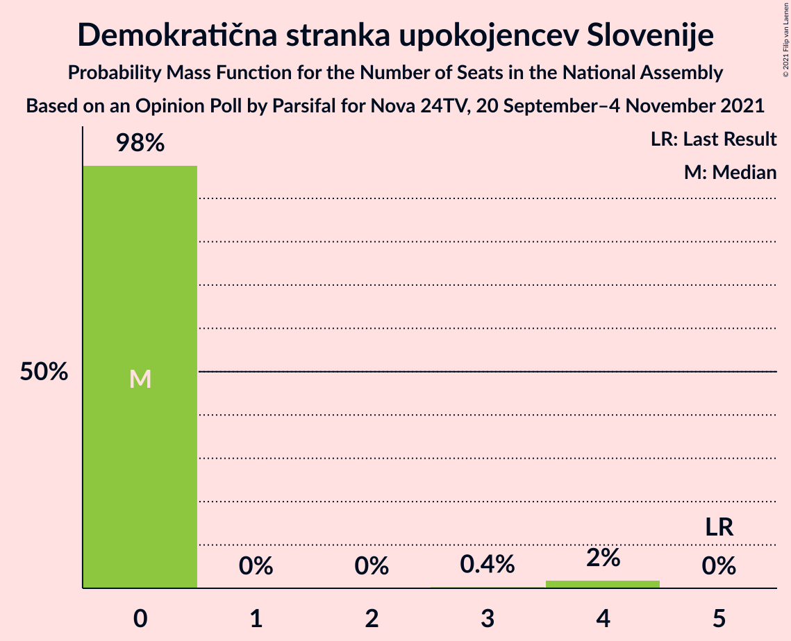

# Opinion Poll by Parsifal for Nova 24TV, 20 September–4 November 2021

<a href="#voting-intentions">Voting Intentions</a> | <a href="#seats">Seats</a> | <a href="#coalitions">Coalitions</a> | <a href="#technical-information">Technical Information</a>

## Voting Intentions

### Confidence Intervals

| Party | Last Result | Poll Result | 80% Confidence Interval | 90% Confidence Interval | 95% Confidence Interval | 99% Confidence Interval |
|:-----:|:-----------:|:-----------:|:-----------------------:|:-----------------------:|:-----------------------:|:-----------------------:|
| Slovenska demokratska stranka | 24.9% | 31.9% | 31.0–32.7% |30.8–33.0% |30.6–33.2% |30.2–33.6% |
| Socialni demokrati | 9.9% | 19.3% | 18.6–20.0% |18.4–20.2% |18.2–20.4% |17.9–20.8% |
| Lista Marjana Šarca | 12.6% | 9.2% | 8.7–9.8% |8.5–9.9% |8.4–10.0% |8.2–10.3% |
| Levica | 9.3% | 8.4% | 7.9–8.9% |7.8–9.1% |7.7–9.2% |7.4–9.5% |
| Nova Slovenija–Krščanski demokrati | 7.2% | 6.4% | 6.0–6.9% |5.8–7.0% |5.7–7.1% |5.5–7.3% |
| Stranka Alenke Bratušek | 5.1% | 5.4% | 5.0–5.8% |4.9–6.0% |4.8–6.1% |4.6–6.3% |
| Demokratična stranka upokojencev Slovenije | 4.9% | 3.5% | 3.2–3.9% |3.1–4.0% |3.0–4.1% |2.9–4.2% |
| Slovenska nacionalna stranka | 4.2% | 2.0% | 1.8–2.3% |1.7–2.4% |1.6–2.4% |1.5–2.6% |
| Piratska stranka Slovenije | 2.2% | 2.0% | 1.8–2.3% |1.7–2.4% |1.6–2.4% |1.5–2.6% |
| Stranka modernega centra | 9.7% | 1.3% | 1.1–1.6% |1.1–1.6% |1.0–1.7% |0.9–1.8% |
| Dobra država | 1.5% | 1.3% | 1.1–1.6% |1.1–1.6% |1.0–1.7% |0.9–1.8% |

*Note:* The poll result column reflects the actual value used in the calculations. Published results may vary slightly, and in addition be rounded to fewer digits.

## Seats

### Confidence Intervals

| Party | Last Result | Median | 80% Confidence Interval | 90% Confidence Interval | 95% Confidence Interval | 99% Confidence Interval |
|:-----:|:-----------:|:------:|:-----------------------:|:-----------------------:|:-----------------------:|:-----------------------:|
| <a href="#slovenska-demokratska-stranka">Slovenska demokratska stranka</a> | 25 | 32 | 31–32 |31–33 |30–33 |30–34 |
| <a href="#socialni-demokrati">Socialni demokrati</a> | 10 | 19 | 18–20 |18–20 |18–20 |18–21 |
| <a href="#lista-marjana-šarca">Lista Marjana Šarca</a> | 13 | 9 | 9 |8–10 |8–10 |8–10 |
| <a href="#levica">Levica</a> | 9 | 8 | 8 |8–9 |7–9 |7–9 |
| <a href="#nova-slovenija–krščanski-demokrati">Nova Slovenija–Krščanski demokrati</a> | 7 | 6 | 5–6 |5–6 |5–7 |5–7 |
| <a href="#stranka-alenke-bratušek">Stranka Alenke Bratušek</a> | 5 | 5 | 5 |5 |4–6 |4–6 |
| <a href="#demokratična-stranka-upokojencev-slovenije">Demokratična stranka upokojencev Slovenije</a> | 5 | 0 | 0 |0 |0 |0–4 |
| <a href="#slovenska-nacionalna-stranka">Slovenska nacionalna stranka</a> | 4 | 0 | 0 |0 |0 |0 |
| <a href="#piratska-stranka-slovenije">Piratska stranka Slovenije</a> | 0 | 0 | 0 |0 |0 |0 |
| <a href="#stranka-modernega-centra">Stranka modernega centra</a> | 10 | 0 | 0 |0 |0 |0 |
| <a href="#dobra-država">Dobra država</a> | 0 | 0 | 0 |0 |0 |0 |

### Slovenska demokratska stranka

*For a full overview of the results for this party, see the [Slovenska demokratska stranka](party-slovenskademokratskastranka.html) page.*

| Number of Seats | Probability | Accumulated | Special Marks |
|:---------------:|:-----------:|:-----------:|:-------------:|
| 25 | 0% | 100% | Last Result |
| 26 | 0% | 100% |  |
| 27 | 0% | 100% |  |
| 28 | 0% | 100% |  |
| 29 | 0.1% | 100% |  |
| 30 | 4% | 99.9% |  |
| 31 | 14% | 96% |  |
| 32 | 75% | 82% | Median |
| 33 | 6% | 7% |  |
| 34 | 0.7% | 0.7% |  |
| 35 | 0% | 0% |  |

### Socialni demokrati

*For a full overview of the results for this party, see the [Socialni demokrati](party-socialnidemokrati.html) page.*

| Number of Seats | Probability | Accumulated | Special Marks |
|:---------------:|:-----------:|:-----------:|:-------------:|
| 10 | 0% | 100% | Last Result |
| 11 | 0% | 100% |  |
| 12 | 0% | 100% |  |
| 13 | 0% | 100% |  |
| 14 | 0% | 100% |  |
| 15 | 0% | 100% |  |
| 16 | 0% | 100% |  |
| 17 | 0.1% | 100% |  |
| 18 | 16% | 99.9% |  |
| 19 | 69% | 84% | Median |
| 20 | 14% | 15% |  |
| 21 | 0.5% | 0.5% |  |
| 22 | 0% | 0% |  |

### Lista Marjana Šarca

*For a full overview of the results for this party, see the [Lista Marjana Šarca](party-listamarjanašarca.html) page.*

| Number of Seats | Probability | Accumulated | Special Marks |
|:---------------:|:-----------:|:-----------:|:-------------:|
| 8 | 7% | 100% |  |
| 9 | 84% | 93% | Median |
| 10 | 9% | 9% |  |
| 11 | 0% | 0% |  |
| 12 | 0% | 0% |  |
| 13 | 0% | 0% | Last Result |

### Levica

*For a full overview of the results for this party, see the [Levica](party-levica.html) page.*

| Number of Seats | Probability | Accumulated | Special Marks |
|:---------------:|:-----------:|:-----------:|:-------------:|
| 7 | 3% | 100% |  |
| 8 | 90% | 97% | Median |
| 9 | 7% | 7% | Last Result |
| 10 | 0% | 0% |  |

### Nova Slovenija–Krščanski demokrati

*For a full overview of the results for this party, see the [Nova Slovenija–Krščanski demokrati](party-novaslovenija–krščanskidemokrati.html) page.*

| Number of Seats | Probability | Accumulated | Special Marks |
|:---------------:|:-----------:|:-----------:|:-------------:|
| 5 | 16% | 100% |  |
| 6 | 79% | 84% | Median |
| 7 | 5% | 5% | Last Result |
| 8 | 0% | 0% |  |

### Stranka Alenke Bratušek

*For a full overview of the results for this party, see the [Stranka Alenke Bratušek](party-strankaalenkebratušek.html) page.*

| Number of Seats | Probability | Accumulated | Special Marks |
|:---------------:|:-----------:|:-----------:|:-------------:|
| 4 | 3% | 100% |  |
| 5 | 93% | 97% | Last Result, Median |
| 6 | 4% | 4% |  |
| 7 | 0% | 0% |  |

### Demokratična stranka upokojencev Slovenije

*For a full overview of the results for this party, see the [Demokratična stranka upokojencev Slovenije](party-demokratičnastrankaupokojencevslovenije.html) page.*

| Number of Seats | Probability | Accumulated | Special Marks |
|:---------------:|:-----------:|:-----------:|:-------------:|
| 0 | 98% | 100% | Median |
| 1 | 0% | 2% |  |
| 2 | 0% | 2% |  |
| 3 | 0.4% | 2% |  |
| 4 | 2% | 2% |  |
| 5 | 0% | 0% | Last Result |

### Slovenska nacionalna stranka

*For a full overview of the results for this party, see the [Slovenska nacionalna stranka](party-slovenskanacionalnastranka.html) page.*

| Number of Seats | Probability | Accumulated | Special Marks |
|:---------------:|:-----------:|:-----------:|:-------------:|
| 0 | 100% | 100% | Median |
| 1 | 0% | 0% |  |
| 2 | 0% | 0% |  |
| 3 | 0% | 0% |  |
| 4 | 0% | 0% | Last Result |

### Piratska stranka Slovenije

*For a full overview of the results for this party, see the [Piratska stranka Slovenije](party-piratskastrankaslovenije.html) page.*

| Number of Seats | Probability | Accumulated | Special Marks |
|:---------------:|:-----------:|:-----------:|:-------------:|
| 0 | 100% | 100% | Last Result, Median |

### Stranka modernega centra

*For a full overview of the results for this party, see the [Stranka modernega centra](party-strankamodernegacentra.html) page.*

| Number of Seats | Probability | Accumulated | Special Marks |
|:---------------:|:-----------:|:-----------:|:-------------:|
| 0 | 100% | 100% | Median |
| 1 | 0% | 0% |  |
| 2 | 0% | 0% |  |
| 3 | 0% | 0% |  |
| 4 | 0% | 0% |  |
| 5 | 0% | 0% |  |
| 6 | 0% | 0% |  |
| 7 | 0% | 0% |  |
| 8 | 0% | 0% |  |
| 9 | 0% | 0% |  |
| 10 | 0% | 0% | Last Result |

### Dobra država

*For a full overview of the results for this party, see the [Dobra država](party-dobradržava.html) page.*

| Number of Seats | Probability | Accumulated | Special Marks |
|:---------------:|:-----------:|:-----------:|:-------------:|
| 0 | 100% | 100% | Last Result, Median |

## Coalitions

### Confidence Intervals

| Coalition | Last Result | Median | Majority? | 80% Confidence Interval | 90% Confidence Interval | 95% Confidence Interval | 99% Confidence Interval |
|:---------:|:-----------:|:------:|:---------:|:-----------------------:|:-----------------------:|:-----------------------:|:-----------------------:|
| Slovenska demokratska stranka – Lista Marjana Šarca – Demokratična stranka upokojencev Slovenije | 43 | 41 | 0% | 40–42 | 40–42 | 39–43 | 39–43 |
| Slovenska demokratska stranka – Lista Marjana Šarca | 38 | 41 | 0% | 40–42 | 39–42 | 39–42 | 39–43 |
| Socialni demokrati – Lista Marjana Šarca – Nova Slovenija–Krščanski demokrati – Stranka Alenke Bratušek – Demokratična stranka upokojencev Slovenije – Stranka modernega centra | 50 | 39 | 0% | 38–40 | 38–40 | 38–41 | 37–42 |
| Socialni demokrati – Lista Marjana Šarca – Nova Slovenija–Krščanski demokrati – Demokratična stranka upokojencev Slovenije | 35 | 34 | 0% | 33–35 | 33–35 | 33–36 | 33–37 |
| Socialni demokrati – Lista Marjana Šarca – Nova Slovenija–Krščanski demokrati – Demokratična stranka upokojencev Slovenije – Stranka modernega centra | 45 | 34 | 0% | 33–35 | 33–35 | 33–36 | 33–37 |
| Socialni demokrati – Lista Marjana Šarca – Nova Slovenija–Krščanski demokrati | 30 | 34 | 0% | 33–35 | 33–35 | 33–35 | 32–36 |
| Socialni demokrati – Lista Marjana Šarca – Nova Slovenija–Krščanski demokrati – Stranka modernega centra | 40 | 34 | 0% | 33–35 | 33–35 | 33–35 | 32–36 |
| Socialni demokrati – Lista Marjana Šarca – Stranka Alenke Bratušek – Demokratična stranka upokojencev Slovenije – Stranka modernega centra | 43 | 33 | 0% | 32–34 | 32–34 | 32–35 | 32–36 |
| Socialni demokrati – Lista Marjana Šarca – Demokratična stranka upokojencev Slovenije | 28 | 28 | 0% | 27–29 | 27–29 | 27–30 | 27–31 |
| Socialni demokrati – Lista Marjana Šarca – Demokratična stranka upokojencev Slovenije – Stranka modernega centra | 38 | 28 | 0% | 27–29 | 27–29 | 27–30 | 27–31 |
| Socialni demokrati – Lista Marjana Šarca | 23 | 28 | 0% | 27–29 | 27–29 | 27–29 | 26–30 |
| Socialni demokrati – Lista Marjana Šarca – Stranka modernega centra | 33 | 28 | 0% | 27–29 | 27–29 | 27–29 | 26–30 |
| Socialni demokrati – Demokratična stranka upokojencev Slovenije – Stranka modernega centra | 25 | 19 | 0% | 18–20 | 18–20 | 18–21 | 18–22 |

### Slovenska demokratska stranka – Lista Marjana Šarca – Demokratična stranka upokojencev Slovenije

| Number of Seats | Probability | Accumulated | Special Marks |
|:---------------:|:-----------:|:-----------:|:-------------:|
| 39 | 3% | 100% |  |
| 40 | 14% | 97% |  |
| 41 | 69% | 83% | Median |
| 42 | 11% | 14% |  |
| 43 | 3% | 3% | Last Result |
| 44 | 0.2% | 0.2% |  |
| 45 | 0% | 0% |  |

### Slovenska demokratska stranka – Lista Marjana Šarca

| Number of Seats | Probability | Accumulated | Special Marks |
|:---------------:|:-----------:|:-----------:|:-------------:|
| 38 | 0.3% | 100% | Last Result |
| 39 | 5% | 99.6% |  |
| 40 | 14% | 95% |  |
| 41 | 69% | 81% | Median |
| 42 | 11% | 12% |  |
| 43 | 0.8% | 0.9% |  |
| 44 | 0% | 0% |  |

### Socialni demokrati – Lista Marjana Šarca – Nova Slovenija–Krščanski demokrati – Stranka Alenke Bratušek – Demokratična stranka upokojencev Slovenije – Stranka modernega centra

| Number of Seats | Probability | Accumulated | Special Marks |
|:---------------:|:-----------:|:-----------:|:-------------:|
| 37 | 0.7% | 100% |  |
| 38 | 19% | 99.3% |  |
| 39 | 63% | 80% | Median |
| 40 | 14% | 17% |  |
| 41 | 3% | 4% |  |
| 42 | 0.6% | 0.6% |  |
| 43 | 0.1% | 0.1% |  |
| 44 | 0% | 0% |  |
| 45 | 0% | 0% |  |
| 46 | 0% | 0% | Majority |
| 47 | 0% | 0% |  |
| 48 | 0% | 0% |  |
| 49 | 0% | 0% |  |
| 50 | 0% | 0% | Last Result |

### Socialni demokrati – Lista Marjana Šarca – Nova Slovenija–Krščanski demokrati – Demokratična stranka upokojencev Slovenije

| Number of Seats | Probability | Accumulated | Special Marks |
|:---------------:|:-----------:|:-----------:|:-------------:|
| 32 | 0.4% | 100% |  |
| 33 | 20% | 99.6% |  |
| 34 | 63% | 79% | Median |
| 35 | 13% | 16% | Last Result |
| 36 | 2% | 3% |  |
| 37 | 0.5% | 0.7% |  |
| 38 | 0.1% | 0.1% |  |
| 39 | 0% | 0% |  |

### Socialni demokrati – Lista Marjana Šarca – Nova Slovenija–Krščanski demokrati – Demokratična stranka upokojencev Slovenije – Stranka modernega centra

| Number of Seats | Probability | Accumulated | Special Marks |
|:---------------:|:-----------:|:-----------:|:-------------:|
| 32 | 0.4% | 100% |  |
| 33 | 20% | 99.6% |  |
| 34 | 63% | 79% | Median |
| 35 | 13% | 16% |  |
| 36 | 2% | 3% |  |
| 37 | 0.5% | 0.7% |  |
| 38 | 0.1% | 0.1% |  |
| 39 | 0% | 0% |  |
| 40 | 0% | 0% |  |
| 41 | 0% | 0% |  |
| 42 | 0% | 0% |  |
| 43 | 0% | 0% |  |
| 44 | 0% | 0% |  |
| 45 | 0% | 0% | Last Result |

### Socialni demokrati – Lista Marjana Šarca – Nova Slovenija–Krščanski demokrati

| Number of Seats | Probability | Accumulated | Special Marks |
|:---------------:|:-----------:|:-----------:|:-------------:|
| 30 | 0% | 100% | Last Result |
| 31 | 0.4% | 100% |  |
| 32 | 2% | 99.6% |  |
| 33 | 21% | 98% |  |
| 34 | 64% | 77% | Median |
| 35 | 12% | 14% |  |
| 36 | 1.4% | 1.4% |  |
| 37 | 0% | 0% |  |

### Socialni demokrati – Lista Marjana Šarca – Nova Slovenija–Krščanski demokrati – Stranka modernega centra

| Number of Seats | Probability | Accumulated | Special Marks |
|:---------------:|:-----------:|:-----------:|:-------------:|
| 31 | 0.4% | 100% |  |
| 32 | 2% | 99.6% |  |
| 33 | 21% | 98% |  |
| 34 | 64% | 77% | Median |
| 35 | 12% | 14% |  |
| 36 | 1.4% | 1.4% |  |
| 37 | 0% | 0% |  |
| 38 | 0% | 0% |  |
| 39 | 0% | 0% |  |
| 40 | 0% | 0% | Last Result |

### Socialni demokrati – Lista Marjana Šarca – Stranka Alenke Bratušek – Demokratična stranka upokojencev Slovenije – Stranka modernega centra

| Number of Seats | Probability | Accumulated | Special Marks |
|:---------------:|:-----------:|:-----------:|:-------------:|
| 31 | 0.3% | 100% |  |
| 32 | 10% | 99.7% |  |
| 33 | 71% | 89% | Median |
| 34 | 14% | 18% |  |
| 35 | 2% | 4% |  |
| 36 | 2% | 2% |  |
| 37 | 0.1% | 0.1% |  |
| 38 | 0% | 0% |  |
| 39 | 0% | 0% |  |
| 40 | 0% | 0% |  |
| 41 | 0% | 0% |  |
| 42 | 0% | 0% |  |
| 43 | 0% | 0% | Last Result |

### Socialni demokrati – Lista Marjana Šarca – Demokratična stranka upokojencev Slovenije

| Number of Seats | Probability | Accumulated | Special Marks |
|:---------------:|:-----------:|:-----------:|:-------------:|
| 26 | 0.2% | 100% |  |
| 27 | 11% | 99.8% |  |
| 28 | 72% | 89% | Last Result, Median |
| 29 | 14% | 17% |  |
| 30 | 2% | 3% |  |
| 31 | 1.4% | 2% |  |
| 32 | 0.1% | 0.1% |  |
| 33 | 0% | 0% |  |

### Socialni demokrati – Lista Marjana Šarca – Demokratična stranka upokojencev Slovenije – Stranka modernega centra

| Number of Seats | Probability | Accumulated | Special Marks |
|:---------------:|:-----------:|:-----------:|:-------------:|
| 26 | 0.2% | 100% |  |
| 27 | 11% | 99.8% |  |
| 28 | 72% | 89% | Median |
| 29 | 14% | 17% |  |
| 30 | 2% | 3% |  |
| 31 | 1.4% | 2% |  |
| 32 | 0.1% | 0.1% |  |
| 33 | 0% | 0% |  |
| 34 | 0% | 0% |  |
| 35 | 0% | 0% |  |
| 36 | 0% | 0% |  |
| 37 | 0% | 0% |  |
| 38 | 0% | 0% | Last Result |

### Socialni demokrati – Lista Marjana Šarca

| Number of Seats | Probability | Accumulated | Special Marks |
|:---------------:|:-----------:|:-----------:|:-------------:|
| 23 | 0% | 100% | Last Result |
| 24 | 0% | 100% |  |
| 25 | 0% | 100% |  |
| 26 | 0.8% | 100% |  |
| 27 | 12% | 99.2% |  |
| 28 | 72% | 87% | Median |
| 29 | 14% | 15% |  |
| 30 | 1.1% | 1.1% |  |
| 31 | 0% | 0% |  |

### Socialni demokrati – Lista Marjana Šarca – Stranka modernega centra

| Number of Seats | Probability | Accumulated | Special Marks |
|:---------------:|:-----------:|:-----------:|:-------------:|
| 26 | 0.8% | 100% |  |
| 27 | 12% | 99.2% |  |
| 28 | 72% | 87% | Median |
| 29 | 14% | 15% |  |
| 30 | 1.1% | 1.1% |  |
| 31 | 0% | 0% |  |
| 32 | 0% | 0% |  |
| 33 | 0% | 0% | Last Result |

### Socialni demokrati – Demokratična stranka upokojencev Slovenije – Stranka modernega centra

| Number of Seats | Probability | Accumulated | Special Marks |
|:---------------:|:-----------:|:-----------:|:-------------:|
| 17 | 0.1% | 100% |  |
| 18 | 14% | 99.9% |  |
| 19 | 69% | 86% | Median |
| 20 | 14% | 17% |  |
| 21 | 0.7% | 3% |  |
| 22 | 2% | 2% |  |
| 23 | 0.4% | 0.5% |  |
| 24 | 0% | 0% |  |
| 25 | 0% | 0% | Last Result |

## Technical Information

### Opinion Poll

+ **Polling firm:** Parsifal
+ **Commissioner(s):** Nova 24TV
+ **Fieldwork period:** 20 September–4 November 2021

### Calculations

+ **Sample size:** 4894
+ **Simulations done:** 1,048,576
+ **Error estimate:** 0.55%

