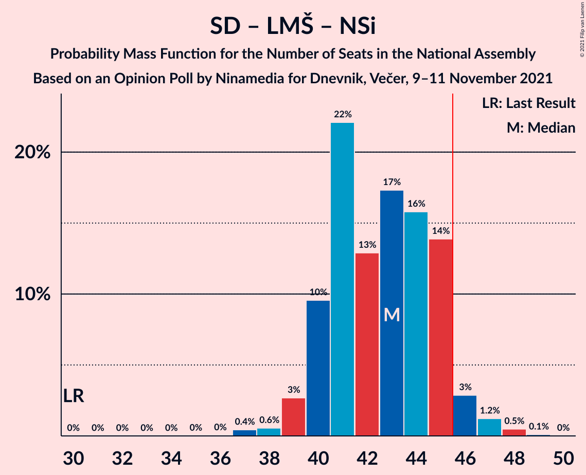

# Opinion Poll by Ninamedia for Dnevnik, Večer, 9–11 November 2021

<a href="#voting-intentions">Voting Intentions</a> | <a href="#seats">Seats</a> | <a href="#coalitions">Coalitions</a> | <a href="#technical-information">Technical Information</a>

## Voting Intentions

### Confidence Intervals

| Party | Last Result | Poll Result | 80% Confidence Interval | 90% Confidence Interval | 95% Confidence Interval | 99% Confidence Interval |
|:-----:|:-----------:|:-----------:|:-----------------------:|:-----------------------:|:-----------------------:|:-----------------------:|
| Slovenska demokratska stranka | 24.9% | 26.9% | 24.8–29.1% |24.2–29.7% |23.7–30.3% |22.7–31.4% |
| Socialni demokrati | 9.9% | 22.0% | 20.1–24.1% |19.5–24.7% |19.1–25.2% |18.2–26.3% |
| Levica | 9.3% | 12.9% | 11.4–14.6% |10.9–15.1% |10.6–15.5% |9.9–16.4% |
| Lista Marjana Šarca | 12.6% | 11.6% | 10.2–13.3% |9.7–13.7% |9.4–14.2% |8.8–15.0% |
| Nova Slovenija–Krščanski demokrati | 7.2% | 10.4% | 9.1–12.1% |8.7–12.5% |8.4–12.9% |7.8–13.7% |
| Stranka Alenke Bratušek | 5.1% | 6.9% | 5.8–8.2% |5.5–8.6% |5.2–9.0% |4.7–9.7% |
| Slovenska ljudska stranka | 2.6% | 2.7% | 2.1–3.7% |1.9–4.0% |1.7–4.2% |1.5–4.7% |
| Demokratična stranka upokojencev Slovenije | 4.9% | 1.9% | 1.3–2.7% |1.2–2.9% |1.1–3.2% |0.9–3.6% |
| Slovenska nacionalna stranka | 4.2% | 1.9% | 1.3–2.7% |1.2–2.9% |1.1–3.2% |0.9–3.6% |
| Stranka modernega centra | 9.7% | 0.4% | 0.2–1.0% |0.2–1.1% |0.2–1.2% |0.1–1.6% |

*Note:* The poll result column reflects the actual value used in the calculations. Published results may vary slightly, and in addition be rounded to fewer digits.

## Seats

### Confidence Intervals

| Party | Last Result | Median | 80% Confidence Interval | 90% Confidence Interval | 95% Confidence Interval | 99% Confidence Interval |
|:-----:|:-----------:|:------:|:-----------------------:|:-----------------------:|:-----------------------:|:-----------------------:|
| <a href="#slovenska-demokratska-stranka">Slovenska demokratska stranka</a> | 25 | 26 | 24–28 |23–29 |23–29 |22–30 |
| <a href="#socialni-demokrati">Socialni demokrati</a> | 10 | 22 | 20–23 |20–24 |19–24 |18–25 |
| <a href="#levica">Levica</a> | 9 | 13 | 11–14 |11–15 |10–15 |10–16 |
| <a href="#lista-marjana-šarca">Lista Marjana Šarca</a> | 13 | 11 | 9–12 |9–13 |9–13 |8–14 |
| <a href="#nova-slovenija–krščanski-demokrati">Nova Slovenija–Krščanski demokrati</a> | 7 | 10 | 9–11 |8–12 |8–12 |7–13 |
| <a href="#stranka-alenke-bratušek">Stranka Alenke Bratušek</a> | 5 | 6 | 5–7 |5–8 |5–8 |4–9 |
| <a href="#slovenska-ljudska-stranka">Slovenska ljudska stranka</a> | 0 | 0 | 0 |0 |0–4 |0–4 |
| <a href="#demokratična-stranka-upokojencev-slovenije">Demokratična stranka upokojencev Slovenije</a> | 5 | 0 | 0 |0 |0 |0 |
| <a href="#slovenska-nacionalna-stranka">Slovenska nacionalna stranka</a> | 4 | 0 | 0 |0 |0 |0 |
| <a href="#stranka-modernega-centra">Stranka modernega centra</a> | 10 | 0 | 0 |0 |0 |0 |

### Slovenska demokratska stranka

*For a full overview of the results for this party, see the [Slovenska demokratska stranka](party-slovenskademokratskastranka.html) page.*

| Number of Seats | Probability | Accumulated | Special Marks |
|:---------------:|:-----------:|:-----------:|:-------------:|
| 21 | 0.1% | 100% |  |
| 22 | 1.3% | 99.9% |  |
| 23 | 9% | 98.6% |  |
| 24 | 6% | 90% |  |
| 25 | 15% | 84% | Last Result |
| 26 | 27% | 70% | Median |
| 27 | 26% | 43% |  |
| 28 | 10% | 17% |  |
| 29 | 6% | 7% |  |
| 30 | 1.1% | 1.4% |  |
| 31 | 0.3% | 0.3% |  |
| 32 | 0% | 0% |  |

### Socialni demokrati

*For a full overview of the results for this party, see the [Socialni demokrati](party-socialnidemokrati.html) page.*

| Number of Seats | Probability | Accumulated | Special Marks |
|:---------------:|:-----------:|:-----------:|:-------------:|
| 10 | 0% | 100% | Last Result |
| 11 | 0% | 100% |  |
| 12 | 0% | 100% |  |
| 13 | 0% | 100% |  |
| 14 | 0% | 100% |  |
| 15 | 0% | 100% |  |
| 16 | 0.1% | 100% |  |
| 17 | 0.3% | 99.9% |  |
| 18 | 1.4% | 99.6% |  |
| 19 | 2% | 98% |  |
| 20 | 9% | 96% |  |
| 21 | 27% | 87% |  |
| 22 | 27% | 60% | Median |
| 23 | 24% | 34% |  |
| 24 | 9% | 10% |  |
| 25 | 1.0% | 1.2% |  |
| 26 | 0.1% | 0.2% |  |
| 27 | 0% | 0% |  |

### Levica

*For a full overview of the results for this party, see the [Levica](party-levica.html) page.*

| Number of Seats | Probability | Accumulated | Special Marks |
|:---------------:|:-----------:|:-----------:|:-------------:|
| 9 | 0.4% | 100% | Last Result |
| 10 | 3% | 99.6% |  |
| 11 | 8% | 97% |  |
| 12 | 24% | 89% |  |
| 13 | 42% | 65% | Median |
| 14 | 15% | 23% |  |
| 15 | 6% | 8% |  |
| 16 | 1.0% | 1.1% |  |
| 17 | 0.1% | 0.1% |  |
| 18 | 0% | 0% |  |

### Lista Marjana Šarca

*For a full overview of the results for this party, see the [Lista Marjana Šarca](party-listamarjanašarca.html) page.*

| Number of Seats | Probability | Accumulated | Special Marks |
|:---------------:|:-----------:|:-----------:|:-------------:|
| 7 | 0.1% | 100% |  |
| 8 | 0.5% | 99.9% |  |
| 9 | 11% | 99.4% |  |
| 10 | 29% | 88% |  |
| 11 | 29% | 60% | Median |
| 12 | 26% | 31% |  |
| 13 | 4% | 5% | Last Result |
| 14 | 0.5% | 0.8% |  |
| 15 | 0.2% | 0.3% |  |
| 16 | 0.1% | 0.1% |  |
| 17 | 0% | 0% |  |

### Nova Slovenija–Krščanski demokrati

*For a full overview of the results for this party, see the [Nova Slovenija–Krščanski demokrati](party-novaslovenija–krščanskidemokrati.html) page.*

| Number of Seats | Probability | Accumulated | Special Marks |
|:---------------:|:-----------:|:-----------:|:-------------:|
| 7 | 0.7% | 100% | Last Result |
| 8 | 5% | 99.3% |  |
| 9 | 31% | 94% |  |
| 10 | 41% | 64% | Median |
| 11 | 17% | 23% |  |
| 12 | 3% | 5% |  |
| 13 | 2% | 2% |  |
| 14 | 0.3% | 0.3% |  |
| 15 | 0% | 0% |  |

### Stranka Alenke Bratušek

*For a full overview of the results for this party, see the [Stranka Alenke Bratušek](party-strankaalenkebratušek.html) page.*

| Number of Seats | Probability | Accumulated | Special Marks |
|:---------------:|:-----------:|:-----------:|:-------------:|
| 4 | 1.5% | 100% |  |
| 5 | 14% | 98.5% | Last Result |
| 6 | 47% | 84% | Median |
| 7 | 31% | 38% |  |
| 8 | 5% | 6% |  |
| 9 | 0.9% | 1.0% |  |
| 10 | 0.1% | 0.1% |  |
| 11 | 0% | 0% |  |

### Slovenska ljudska stranka

*For a full overview of the results for this party, see the [Slovenska ljudska stranka](party-slovenskaljudskastranka.html) page.*

| Number of Seats | Probability | Accumulated | Special Marks |
|:---------------:|:-----------:|:-----------:|:-------------:|
| 0 | 96% | 100% | Last Result, Median |
| 1 | 0% | 4% |  |
| 2 | 0% | 4% |  |
| 3 | 0.6% | 4% |  |
| 4 | 3% | 3% |  |
| 5 | 0.1% | 0.1% |  |
| 6 | 0% | 0% |  |

### Demokratična stranka upokojencev Slovenije

*For a full overview of the results for this party, see the [Demokratična stranka upokojencev Slovenije](party-demokratičnastrankaupokojencevslovenije.html) page.*

| Number of Seats | Probability | Accumulated | Special Marks |
|:---------------:|:-----------:|:-----------:|:-------------:|
| 0 | 99.9% | 100% | Median |
| 1 | 0% | 0.1% |  |
| 2 | 0% | 0.1% |  |
| 3 | 0% | 0.1% |  |
| 4 | 0% | 0% |  |
| 5 | 0% | 0% | Last Result |

### Slovenska nacionalna stranka

*For a full overview of the results for this party, see the [Slovenska nacionalna stranka](party-slovenskanacionalnastranka.html) page.*

| Number of Seats | Probability | Accumulated | Special Marks |
|:---------------:|:-----------:|:-----------:|:-------------:|
| 0 | 99.9% | 100% | Median |
| 1 | 0% | 0.1% |  |
| 2 | 0% | 0.1% |  |
| 3 | 0% | 0.1% |  |
| 4 | 0.1% | 0.1% | Last Result |
| 5 | 0% | 0% |  |

### Stranka modernega centra

*For a full overview of the results for this party, see the [Stranka modernega centra](party-strankamodernegacentra.html) page.*

| Number of Seats | Probability | Accumulated | Special Marks |
|:---------------:|:-----------:|:-----------:|:-------------:|
| 0 | 100% | 100% | Median |
| 1 | 0% | 0% |  |
| 2 | 0% | 0% |  |
| 3 | 0% | 0% |  |
| 4 | 0% | 0% |  |
| 5 | 0% | 0% |  |
| 6 | 0% | 0% |  |
| 7 | 0% | 0% |  |
| 8 | 0% | 0% |  |
| 9 | 0% | 0% |  |
| 10 | 0% | 0% | Last Result |

## Coalitions

### Confidence Intervals

| Coalition | Last Result | Median | Majority? | 80% Confidence Interval | 90% Confidence Interval | 95% Confidence Interval | 99% Confidence Interval |
|:---------:|:-----------:|:------:|:---------:|:-----------------------:|:-----------------------:|:-----------------------:|:-----------------------:|
| Socialni demokrati – Lista Marjana Šarca – Nova Slovenija–Krščanski demokrati – Stranka Alenke Bratušek – Demokratična stranka upokojencev Slovenije – Stranka modernega centra | 50 | 49 | 98% | 47–51 | 46–52 | 46–53 | 44–54 |
| Socialni demokrati – Lista Marjana Šarca – Nova Slovenija–Krščanski demokrati – Demokratična stranka upokojencev Slovenije | 35 | 43 | 5% | 40–45 | 40–45 | 39–46 | 38–48 |
| Socialni demokrati – Lista Marjana Šarca – Nova Slovenija–Krščanski demokrati – Demokratična stranka upokojencev Slovenije – Stranka modernega centra | 45 | 43 | 5% | 40–45 | 40–45 | 39–46 | 38–48 |
| Socialni demokrati – Lista Marjana Šarca – Nova Slovenija–Krščanski demokrati | 30 | 43 | 5% | 40–45 | 40–45 | 39–46 | 38–48 |
| Socialni demokrati – Lista Marjana Šarca – Nova Slovenija–Krščanski demokrati – Stranka modernega centra | 40 | 43 | 5% | 40–45 | 40–45 | 39–46 | 38–48 |
| Socialni demokrati – Lista Marjana Šarca – Stranka Alenke Bratušek – Demokratična stranka upokojencev Slovenije – Stranka modernega centra | 43 | 39 | 0% | 37–41 | 36–41 | 36–42 | 34–44 |
| Slovenska demokratska stranka – Lista Marjana Šarca – Demokratična stranka upokojencev Slovenije | 43 | 37 | 0% | 35–39 | 34–39 | 34–40 | 33–41 |
| Slovenska demokratska stranka – Lista Marjana Šarca | 38 | 37 | 0% | 35–39 | 34–39 | 34–40 | 33–41 |
| Socialni demokrati – Lista Marjana Šarca – Demokratična stranka upokojencev Slovenije | 28 | 33 | 0% | 31–35 | 30–35 | 29–36 | 28–37 |
| Socialni demokrati – Lista Marjana Šarca – Demokratična stranka upokojencev Slovenije – Stranka modernega centra | 38 | 33 | 0% | 31–35 | 30–35 | 29–36 | 28–37 |
| Socialni demokrati – Lista Marjana Šarca | 23 | 33 | 0% | 31–35 | 30–35 | 29–36 | 28–37 |
| Socialni demokrati – Lista Marjana Šarca – Stranka modernega centra | 33 | 33 | 0% | 31–35 | 30–35 | 29–36 | 28–37 |
| Socialni demokrati – Demokratična stranka upokojencev Slovenije – Stranka modernega centra | 25 | 22 | 0% | 20–23 | 20–24 | 19–24 | 18–25 |

### Socialni demokrati – Lista Marjana Šarca – Nova Slovenija–Krščanski demokrati – Stranka Alenke Bratušek – Demokratična stranka upokojencev Slovenije – Stranka modernega centra

| Number of Seats | Probability | Accumulated | Special Marks |
|:---------------:|:-----------:|:-----------:|:-------------:|
| 43 | 0.3% | 100% |  |
| 44 | 0.4% | 99.7% |  |
| 45 | 2% | 99.2% |  |
| 46 | 5% | 98% | Majority |
| 47 | 12% | 92% |  |
| 48 | 25% | 80% |  |
| 49 | 18% | 55% | Median |
| 50 | 21% | 37% | Last Result |
| 51 | 11% | 16% |  |
| 52 | 2% | 5% |  |
| 53 | 2% | 3% |  |
| 54 | 0.8% | 0.9% |  |
| 55 | 0.1% | 0.1% |  |
| 56 | 0% | 0% |  |

### Socialni demokrati – Lista Marjana Šarca – Nova Slovenija–Krščanski demokrati – Demokratična stranka upokojencev Slovenije

| Number of Seats | Probability | Accumulated | Special Marks |
|:---------------:|:-----------:|:-----------:|:-------------:|
| 35 | 0% | 100% | Last Result |
| 36 | 0% | 100% |  |
| 37 | 0.4% | 99.9% |  |
| 38 | 0.6% | 99.5% |  |
| 39 | 3% | 98.9% |  |
| 40 | 10% | 96% |  |
| 41 | 22% | 87% |  |
| 42 | 13% | 65% |  |
| 43 | 17% | 52% | Median |
| 44 | 16% | 34% |  |
| 45 | 14% | 19% |  |
| 46 | 3% | 5% | Majority |
| 47 | 1.2% | 2% |  |
| 48 | 0.5% | 0.6% |  |
| 49 | 0.1% | 0.1% |  |
| 50 | 0% | 0% |  |

### Socialni demokrati – Lista Marjana Šarca – Nova Slovenija–Krščanski demokrati – Demokratična stranka upokojencev Slovenije – Stranka modernega centra

| Number of Seats | Probability | Accumulated | Special Marks |
|:---------------:|:-----------:|:-----------:|:-------------:|
| 36 | 0% | 100% |  |
| 37 | 0.4% | 99.9% |  |
| 38 | 0.6% | 99.5% |  |
| 39 | 3% | 98.9% |  |
| 40 | 10% | 96% |  |
| 41 | 22% | 87% |  |
| 42 | 13% | 65% |  |
| 43 | 17% | 52% | Median |
| 44 | 16% | 34% |  |
| 45 | 14% | 19% | Last Result |
| 46 | 3% | 5% | Majority |
| 47 | 1.2% | 2% |  |
| 48 | 0.5% | 0.6% |  |
| 49 | 0.1% | 0.1% |  |
| 50 | 0% | 0% |  |

### Socialni demokrati – Lista Marjana Šarca – Nova Slovenija–Krščanski demokrati

| Number of Seats | Probability | Accumulated | Special Marks |
|:---------------:|:-----------:|:-----------:|:-------------:|
| 30 | 0% | 100% | Last Result |
| 31 | 0% | 100% |  |
| 32 | 0% | 100% |  |
| 33 | 0% | 100% |  |
| 34 | 0% | 100% |  |
| 35 | 0% | 100% |  |
| 36 | 0% | 100% |  |
| 37 | 0.4% | 99.9% |  |
| 38 | 0.6% | 99.5% |  |
| 39 | 3% | 98.9% |  |
| 40 | 10% | 96% |  |
| 41 | 22% | 87% |  |
| 42 | 13% | 65% |  |
| 43 | 17% | 52% | Median |
| 44 | 16% | 34% |  |
| 45 | 14% | 19% |  |
| 46 | 3% | 5% | Majority |
| 47 | 1.2% | 2% |  |
| 48 | 0.5% | 0.6% |  |
| 49 | 0.1% | 0.1% |  |
| 50 | 0% | 0% |  |

### Socialni demokrati – Lista Marjana Šarca – Nova Slovenija–Krščanski demokrati – Stranka modernega centra

| Number of Seats | Probability | Accumulated | Special Marks |
|:---------------:|:-----------:|:-----------:|:-------------:|
| 36 | 0% | 100% |  |
| 37 | 0.4% | 99.9% |  |
| 38 | 0.6% | 99.5% |  |
| 39 | 3% | 98.9% |  |
| 40 | 10% | 96% | Last Result |
| 41 | 22% | 87% |  |
| 42 | 13% | 65% |  |
| 43 | 17% | 52% | Median |
| 44 | 16% | 34% |  |
| 45 | 14% | 19% |  |
| 46 | 3% | 5% | Majority |
| 47 | 1.2% | 2% |  |
| 48 | 0.5% | 0.6% |  |
| 49 | 0.1% | 0.1% |  |
| 50 | 0% | 0% |  |

### Socialni demokrati – Lista Marjana Šarca – Stranka Alenke Bratušek – Demokratična stranka upokojencev Slovenije – Stranka modernega centra

| Number of Seats | Probability | Accumulated | Special Marks |
|:---------------:|:-----------:|:-----------:|:-------------:|
| 33 | 0.1% | 100% |  |
| 34 | 0.8% | 99.9% |  |
| 35 | 1.1% | 99.1% |  |
| 36 | 4% | 98% |  |
| 37 | 8% | 94% |  |
| 38 | 18% | 86% |  |
| 39 | 34% | 68% | Median |
| 40 | 19% | 33% |  |
| 41 | 10% | 14% |  |
| 42 | 3% | 5% |  |
| 43 | 0.9% | 1.5% | Last Result |
| 44 | 0.4% | 0.6% |  |
| 45 | 0.1% | 0.2% |  |
| 46 | 0% | 0% | Majority |

### Slovenska demokratska stranka – Lista Marjana Šarca – Demokratična stranka upokojencev Slovenije

| Number of Seats | Probability | Accumulated | Special Marks |
|:---------------:|:-----------:|:-----------:|:-------------:|
| 31 | 0.1% | 100% |  |
| 32 | 0.4% | 99.9% |  |
| 33 | 2% | 99.5% |  |
| 34 | 6% | 98% |  |
| 35 | 11% | 92% |  |
| 36 | 17% | 81% |  |
| 37 | 20% | 64% | Median |
| 38 | 32% | 44% |  |
| 39 | 7% | 12% |  |
| 40 | 3% | 5% |  |
| 41 | 1.1% | 2% |  |
| 42 | 0.3% | 0.4% |  |
| 43 | 0.1% | 0.1% | Last Result |
| 44 | 0% | 0% |  |

### Slovenska demokratska stranka – Lista Marjana Šarca

| Number of Seats | Probability | Accumulated | Special Marks |
|:---------------:|:-----------:|:-----------:|:-------------:|
| 31 | 0.1% | 100% |  |
| 32 | 0.4% | 99.9% |  |
| 33 | 2% | 99.5% |  |
| 34 | 6% | 98% |  |
| 35 | 11% | 92% |  |
| 36 | 17% | 81% |  |
| 37 | 20% | 64% | Median |
| 38 | 32% | 44% | Last Result |
| 39 | 7% | 12% |  |
| 40 | 3% | 5% |  |
| 41 | 1.1% | 2% |  |
| 42 | 0.3% | 0.4% |  |
| 43 | 0.1% | 0.1% |  |
| 44 | 0% | 0% |  |

### Socialni demokrati – Lista Marjana Šarca – Demokratična stranka upokojencev Slovenije

| Number of Seats | Probability | Accumulated | Special Marks |
|:---------------:|:-----------:|:-----------:|:-------------:|
| 27 | 0.1% | 100% |  |
| 28 | 0.8% | 99.8% | Last Result |
| 29 | 2% | 99.0% |  |
| 30 | 5% | 97% |  |
| 31 | 11% | 91% |  |
| 32 | 27% | 80% |  |
| 33 | 18% | 53% | Median |
| 34 | 22% | 35% |  |
| 35 | 10% | 13% |  |
| 36 | 2% | 3% |  |
| 37 | 0.6% | 0.7% |  |
| 38 | 0.1% | 0.1% |  |
| 39 | 0% | 0% |  |

### Socialni demokrati – Lista Marjana Šarca – Demokratična stranka upokojencev Slovenije – Stranka modernega centra

| Number of Seats | Probability | Accumulated | Special Marks |
|:---------------:|:-----------:|:-----------:|:-------------:|
| 27 | 0.1% | 100% |  |
| 28 | 0.8% | 99.8% |  |
| 29 | 2% | 99.0% |  |
| 30 | 5% | 97% |  |
| 31 | 11% | 91% |  |
| 32 | 27% | 80% |  |
| 33 | 18% | 53% | Median |
| 34 | 22% | 35% |  |
| 35 | 10% | 13% |  |
| 36 | 2% | 3% |  |
| 37 | 0.6% | 0.7% |  |
| 38 | 0.1% | 0.1% | Last Result |
| 39 | 0% | 0% |  |

### Socialni demokrati – Lista Marjana Šarca

| Number of Seats | Probability | Accumulated | Special Marks |
|:---------------:|:-----------:|:-----------:|:-------------:|
| 23 | 0% | 100% | Last Result |
| 24 | 0% | 100% |  |
| 25 | 0% | 100% |  |
| 26 | 0% | 100% |  |
| 27 | 0.1% | 100% |  |
| 28 | 0.8% | 99.8% |  |
| 29 | 2% | 99.0% |  |
| 30 | 5% | 97% |  |
| 31 | 11% | 91% |  |
| 32 | 27% | 80% |  |
| 33 | 18% | 53% | Median |
| 34 | 22% | 35% |  |
| 35 | 10% | 13% |  |
| 36 | 2% | 3% |  |
| 37 | 0.6% | 0.7% |  |
| 38 | 0.1% | 0.1% |  |
| 39 | 0% | 0% |  |

### Socialni demokrati – Lista Marjana Šarca – Stranka modernega centra

| Number of Seats | Probability | Accumulated | Special Marks |
|:---------------:|:-----------:|:-----------:|:-------------:|
| 27 | 0.1% | 100% |  |
| 28 | 0.8% | 99.8% |  |
| 29 | 2% | 99.0% |  |
| 30 | 5% | 97% |  |
| 31 | 11% | 91% |  |
| 32 | 27% | 80% |  |
| 33 | 18% | 53% | Last Result, Median |
| 34 | 22% | 35% |  |
| 35 | 10% | 13% |  |
| 36 | 2% | 3% |  |
| 37 | 0.6% | 0.7% |  |
| 38 | 0.1% | 0.1% |  |
| 39 | 0% | 0% |  |

### Socialni demokrati – Demokratična stranka upokojencev Slovenije – Stranka modernega centra

| Number of Seats | Probability | Accumulated | Special Marks |
|:---------------:|:-----------:|:-----------:|:-------------:|
| 16 | 0.1% | 100% |  |
| 17 | 0.3% | 99.9% |  |
| 18 | 1.4% | 99.6% |  |
| 19 | 2% | 98% |  |
| 20 | 9% | 96% |  |
| 21 | 27% | 87% |  |
| 22 | 27% | 60% | Median |
| 23 | 24% | 34% |  |
| 24 | 9% | 10% |  |
| 25 | 1.0% | 1.2% | Last Result |
| 26 | 0.2% | 0.2% |  |
| 27 | 0% | 0% |  |

## Technical Information

### Opinion Poll

+ **Polling firm:** Ninamedia
+ **Commissioner(s):** Dnevnik, Večer
+ **Fieldwork period:** 9–11 November 2021

### Calculations

+ **Sample size:** 700
+ **Simulations done:** 1,048,576
+ **Error estimate:** 1.48%

